# 01 — Thiết kế kiến trúc hệ thống

> **Nguồn ràng buộc:** `00_CANONICAL_DECISIONS.md` (hợp đồng kỹ thuật — nguồn sự thật duy nhất).
> **Nguồn nghiệp vụ:** `PHAN_TICH_NGHIEP_VU_WEBSITE_PHONG_TRO.md`. Mọi ký hiệu `[§x.y]` tham chiếu tài liệu này.
> Mọi bổ sung nằm ngoài canonical được đánh dấu **[BỔ SUNG NGOÀI CANONICAL]** để bước review đối chiếu.

---

## 1. Giới thiệu & phạm vi

### 1.1. Mục tiêu hệ thống `[§0.1]`

Hệ thống là **website trung gian** kết nối:

| Bên tham gia | Nhu cầu chính |
|---|---|
| Chủ trọ / người đăng tin cho thuê | Đưa thông tin phòng lên hệ thống, nhận liên hệ, tăng độ hiển thị |
| Người cần thuê phòng, căn hộ, nhà nguyên căn, homestay | Tìm — lọc — so sánh — liên hệ |
| Người cần tìm ở ghép | Tìm tin `ROOMMATE` phù hợp giới tính/số người |
| Người muốn cho người khác ở ghép | Đăng tin `ROOMMATE` |
| Admin / Moderator | Kiểm duyệt nội dung, quản trị, cấu hình, thống kê |

Nghiệp vụ được hỗ trợ `[§0.1]`: đăng tin, tìm kiếm, lọc, lưu tin, liên hệ, đánh giá, bình luận, báo cáo vi phạm; cộng **4 module AI ở mức ứng dụng thực tế**: phân tích cảm xúc bình luận, gợi ý tin đăng, chatbot hỗ trợ tìm trọ, dự đoán giá thuê.

### 1.2. Phạm vi đề án `[§0.2]`

Bốn ràng buộc phạm vi gốc, được nâng thành **ràng buộc kiến trúc**:

| Ràng buộc `[§0.2]` | Hệ quả kiến trúc trong tài liệu này |
|---|---|
| Tập trung nghiệp vụ đăng tin, tìm kiếm, liên hệ, quản trị | Module `listing`, `search`, `interaction`, `moderation`, `admin` là lõi; các module còn lại hỗ trợ |
| Thanh toán mô phỏng **hoặc** cổng sandbox | `PaymentGateway` là interface; impl mặc định `SandboxPaymentGateway` (`PaymentMethod.SANDBOX`), `VNPAY`/`MOMO` là impl thay thế cắm qua config — không đổi lõi (mục 15, QĐ-09) |
| AI **hỗ trợ quyết định**, không thay thế người kiểm duyệt | AI chỉ được phép đề xuất `NEED_REVIEW` + gửi cảnh báo; **không** có đường code nào cho phép AI khóa tin/tài khoản (mục 6.4) |
| Không đặt cọc, không hợp đồng điện tử, không xác minh giấy tờ bằng AI | Không có entity/endpoint/màn hình nào cho các nghiệp vụ này |

### 1.3. Cái gì CÓ và cái gì CỐ TÌNH KHÔNG LÀM `[§13.3]`

**CÓ (nằm trong hệ thống)** — theo `[§13.1]` + `[§14.1]` + `[§14.2]`:

Đăng ký/đăng nhập/phân quyền; quản lý hồ sơ; đăng tin 7 loại `[§0.3]`; duyệt tin; tìm kiếm/lọc nâng cao; lưu tin; lịch sử xem/tìm kiếm; liên hệ chủ trọ; chat nội bộ (mức cơ bản `[§13.2]`); bình luận; đánh giá; báo cáo vi phạm; kiểm duyệt; thanh toán đẩy tin (sandbox); gói đẩy tin; notification (in-app + email); admin dashboard + thống kê; audit log; 4 module AI; upload ảnh; SEO cơ bản; theo dõi chủ trọ.

**CỐ TÌNH KHÔNG LÀM** — copy nguyên `[§13.3]`, mỗi dòng là một cam kết kiến trúc:

| Chức năng bị loại | Lý do `[§13.3]` | Cam kết kiến trúc |
|---|---|---|
| Ký hợp đồng điện tử | Phức tạp pháp lý, không cần cho website quảng cáo/tìm kiếm | Không có entity `Contract`, không có chữ ký số |
| Đặt cọc online giữ phòng | Rủi ro tranh chấp, cần quy trình hoàn tiền và xác minh mạnh | `Payment` **chỉ** phục vụ gói đẩy tin `[§3.14]`, không giữ tiền hộ người dùng. `deposit_amount` trên `listings` là **thông tin mô tả** do chủ trọ nhập `[§3.3]`, không phải giao dịch |
| AI xác minh giấy tờ nhà đất | Khó triển khai, dữ liệu nhạy cảm, vượt phạm vi | Xác thực chủ trọ (`VerificationType.LANDLORD`) là **thủ công bởi Admin/Moderator** `[§13.2]` qua permission `LANDLORD_VERIFY` |
| AI nhận diện phòng thật/giả từ ảnh | Khó đảm bảo chính xác, cần dữ liệu lớn | Upload ảnh chỉ kiểm tra magic bytes + kích thước, **không** phân tích nội dung ảnh |
| Livestream xem phòng | Không cần thiết, tốn hạ tầng | Không có WebRTC/media server trong compose |
| Định giá pháp lý tài sản | Không liên quan thuê trọ phổ thông | `PriceEstimator` chỉ ước lượng **giá thuê tham khảo** `[§9.4]` |
| Tự động gọi điện cho chủ trọ | Không phù hợp, rủi ro spam | Không tích hợp telephony. `[§1.1]` có nhắc "SMS Service" nhưng `[§13.3]` loại tự động gọi; kênh thông báo chốt còn **`IN_APP`, `EMAIL`** (canonical `NotificationChannel`) |
| Mạng xã hội đầy đủ | Làm loãng mục tiêu chính | `Follow` chỉ là "theo dõi chủ trọ để nhận tin mới" `[§2.5]`, không có newsfeed/kết bạn |
| Đấu giá phòng thuê | Không phổ biến, nghiệp vụ không thực tế | Không có entity `Bid`/`Auction` |
| Blockchain lưu hợp đồng | Không cần thiết, gây phức tạp không tạo giá trị rõ | Không có |

**Làm ở mức đơn giản có chủ đích** `[§13.2]` — không phải thiếu sót:

| Hạng mục | Mức triển khai chốt | Căn cứ |
|---|---|---|
| Thanh toán online | Sandbox/mô phỏng, có callback + đối soát bằng `PaymentReconcileJob` | `[§13.2]`, canonical mục 11 |
| Chat nội bộ | REST polling, không realtime WebSocket | `[§13.2]` *"không cần realtime phức tạp"* |
| Xác thực chủ trọ | Trạng thái xác thực thủ công bởi Admin | `[§13.2]` |
| Bản đồ | Hiển thị vị trí `latitude/longitude` + lọc theo khu vực hành chính; không tìm đường | `[§13.2]` |
| SEO | Meta động, URL thân thiện, sitemap, robots.txt | `[§13.2]`, `[§11.8]` |
| Recommendation | Rule-based + điểm hành vi | `[§13.2]` |
| Price Prediction | Khoảng giá tham khảo, không ML sâu | `[§13.2]` |

### 1.4. Ba trục thiết kế `[§15]`

Toàn bộ kiến trúc bên dưới được kiểm tra chéo với 3 trục kết luận của `[§15]`:

```mermaid
mindmap
  root((3 trục thiết kế<br/>[§15]))
    Trục 1 — Tin đăng chất lượng và dễ tìm
      Kiểm duyệt bắt buộc trước khi public
      State machine tin đăng 1 điểm vào duy nhất
      Search có index + phân trang + sắp xếp
      Hạn hiển thị + job hết hạn
      publiclyVisible qua 1 method duy nhất
    Trục 2 — Niềm tin giữa người thuê và chủ trọ
      TrustScore tin và chủ trọ
      Đánh giá cần tương tác hợp lệ
      Report + ngưỡng tự động ẩn
      Xác thực chủ trọ thủ công
      Che số điện thoại với khách
      Audit log mọi thao tác nặng
    Trục 3 — AI hỗ trợ, không thay người kiểm duyệt
      AI chỉ đề xuất NEED_REVIEW
      Bật tắt từng module qua config
      Async qua queue, lỗi không chặn nghiệp vụ
      Lưu log để giải thích được
      Quyết định nặng cần Moderator hoặc Admin xác nhận
```

| Trục | Thành phần kiến trúc hiện thực trục đó | Mục |
|---|---|---|
| 1. Tin đăng chất lượng và dễ tìm | `ListingStateMachine`, `ListingVisibilityService.publicStatuses()`, module `search` + index DB, `ListingExpiryJob`, `BannedKeyword` | 3.2, 5.2, 9 |
| 2. Niềm tin | `TrustScoreRecalcJob`, `moderation` module, `ViolationWarning`, `MaskUtil`, `AuditLog`, `Verification` | 5, 10 |
| 3. AI hỗ trợ, không thay thế | 4 interface AI + `@Async` executor riêng + `ai.*.enabled` config + `AI_LOG_VIEW` | 6 |

---

## 2. Tổng quan kiến trúc

### 2.1. C4 mức 1 — Context `[§1.1]`

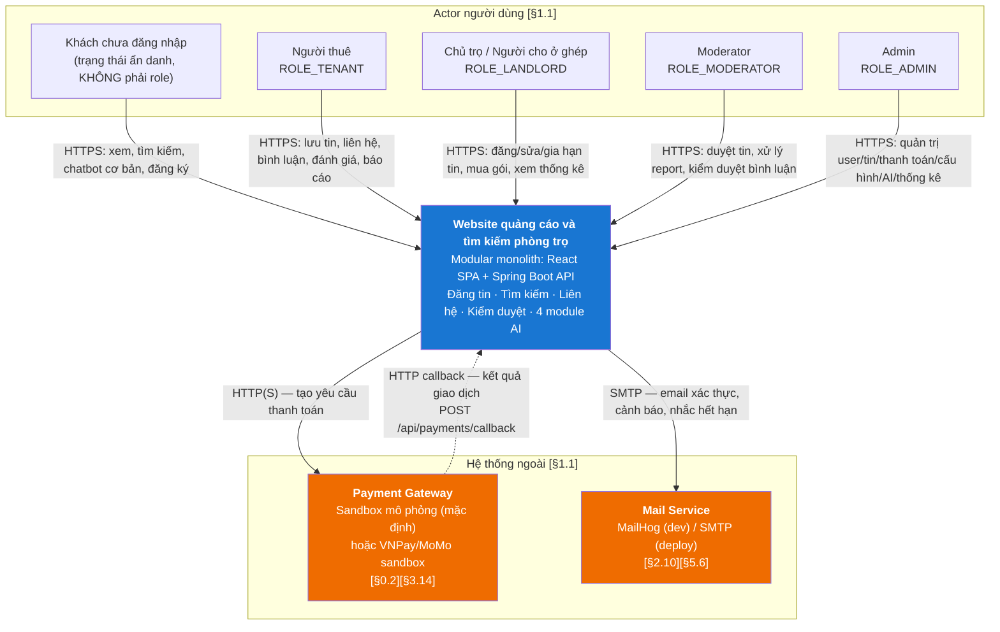

**Ghi chú về "Hệ thống AI" trong `[§1.1]`:** tài liệu gốc liệt kê *"Hệ thống AI"* như một actor. Trong kiến trúc, đây **không** phải hệ thống ngoài — 4 module AI chạy **bên trong** Spring Boot (mục 6.6 giải thích lý do). Nó được mô hình hóa là actor **nội bộ** (`SYSTEM`) trong sequence diagram và là `created_by = SYSTEM` trong audit.

**Ghi chú về "Email/SMS/Push Service" `[§1.1]`:** phạm vi chốt là **Email** (`NotificationChannel.EMAIL`) + **in-app** (`NotificationChannel.IN_APP`). SMS/Push bị loại vì `[§13.3]` loại "tự động gọi điện" và `[§0.2]` giới hạn phạm vi; `[§5.6]` chỉ dùng 2 kênh "Email/In-app" và "Dashboard/In-app".

### 2.2. C4 mức 2 — Container

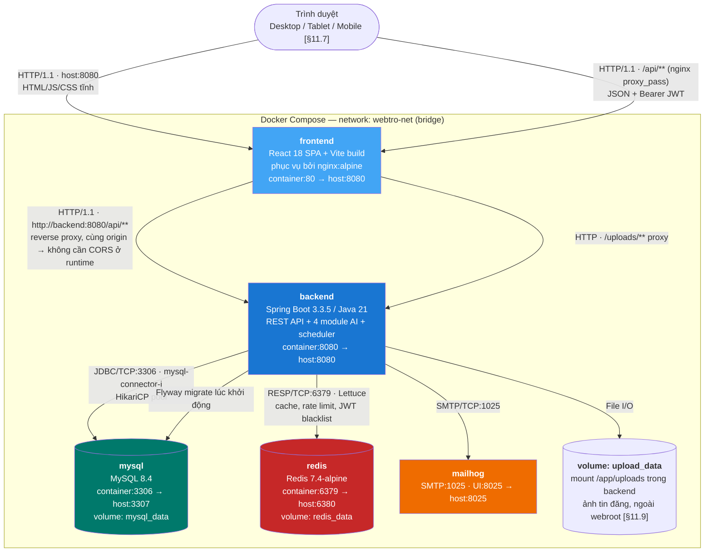

**Bảng giao thức & cổng chốt** — mọi cổng host lấy từ biến môi trường, **không hardcode** (canonical §1.3):

| Container | Image | Giao thức | Cổng trong container | Cổng host (biến env) | Mục đích |
|---|---|---|---|---|---|
| `frontend` | build từ `node:20-alpine` → `nginx:alpine` | HTTP | 80 | `${FRONTEND_PORT}` = 8080 | Phục vụ SPA + reverse proxy `/api`, `/uploads` |
| `backend` | build từ `eclipse-temurin:21-jdk` → `eclipse-temurin:21-jre` | HTTP | 8080 | `${BACKEND_PORT}` = 8080 | REST API, Swagger, scheduler, AI |
| `mysql` | `mysql:8.4` | MySQL protocol / TCP | 3306 | `${MYSQL_PORT}` = 3307 | Lưu trữ 46 bảng |
| `redis` | `redis:7.4-alpine` | RESP / TCP | 6379 | `${REDIS_PORT}` = 6380 | Cache, rate limit, JWT blacklist |
| `mailhog` | `mailhog/mailhog:latest` | SMTP / HTTP | 1025 / 8025 | `${MAILHOG_UI_PORT}` = 8025 | Bắt email dev `[§13.2]` |

**Ghi chú cổng host lệch chuẩn** — **[BỔ SUNG NGOÀI CANONICAL]**: canonical §1.3 chỉ yêu cầu "không hardcode", không chốt số cổng. Chọn 3307/6380 (thay vì 3306/6379) để không đụng MySQL/Redis cài sẵn trên máy sinh viên; chọn 8081 cho backend vì 8080 đã dành cho frontend. Toàn bộ đọc từ `.env`.

**Volume:**

| Volume | Mount | Nội dung | Ghi chú |
|---|---|---|---|
| `mysql_data` | `/var/lib/mysql` | Dữ liệu MySQL | Bắt buộc để `docker compose down` không mất dữ liệu |
| `redis_data` | `/data` | RDB snapshot | Redis chỉ chứa dữ liệu **tái tạo được**; mất không ảnh hưởng đúng đắn (mục 8.5) |
| `upload_data` | `/app/uploads` | Ảnh tin đăng + thumbnail | **Ngoài webroot** `[§11.9]`, canonical §8. Backend phục vụ qua endpoint có kiểm soát content-type, không để nginx serve trực tiếp thư mục |

### 2.3. Vì sao **modular monolith**, không phải microservices

**Kiến trúc chốt: monolith phân tầng có module dọc (modular monolith).**
Một deployable unit `backend`, bên trong chia **package dọc theo nghiệp vụ** (`com.webtro.modules.*`), mỗi module có đủ `controller → service → repository → entity`, giao tiếp với nhau **chỉ qua interface `service`** (canonical §3, luật 4).

**Căn cứ 1 — `[§0.2]` phạm vi đề án:** *"Hệ thống cần đủ lớn để thể hiện năng lực phân tích, thiết kế và triển khai nhưng vẫn thực tế."* Microservices sẽ tiêu ngân sách công sức vào hạ tầng (service discovery, distributed tracing, saga, API gateway, 11 pipeline CI) thay vì vào **nghiệp vụ và 4 module AI** — là thứ đề án được chấm điểm.

**Căn cứ 2 — `[§11.6]` khả năng mở rộng:** yêu cầu gốc là *"Tách module Listing, Search, Payment, AI theo **service/layer rõ ràng**"* — chú ý: yêu cầu là **tách theo service/layer**, **không** phải tách theo process. Modular monolith thỏa chính xác câu này, đồng thời **giữ được đường nâng cấp**: khi cần, một module đã có ranh giới `service` interface rõ ràng có thể được bóc ra thành process riêng mà không phải viết lại lõi (mục 12).

**Căn cứ 3 — tính đúng đắn nghiệp vụ:** các nghiệp vụ lõi yêu cầu **transaction xuyên nhiều bảng của nhiều module**:

| Nghiệp vụ | Bảng liên quan (đa module) | Nếu tách microservice |
|---|---|---|
| Duyệt tin `[§5.1]` | `listings` + `moderation_actions` + `notifications` + `audit_logs` | Cần saga + compensating transaction |
| Thanh toán thành công `[§3.14]` | `payments` + `promotion_subscriptions` + `listings` + `notifications` | Cần saga; rủi ro tin được đẩy mà chưa trả tiền |
| Bình luận + sentiment `[§8.3]` | `comments` + `sentiment_results` + `listings.trust_score` + `notifications` | Eventual consistency, khó giải thích trong báo cáo |

Với monolith, mỗi nghiệp vụ trên là **một `@Transactional` ACID duy nhất** (canonical §3, luật 5). Đây là lựa chọn đúng về mặt kỹ thuật, không chỉ vì "đơn giản hơn".

**Bảng so sánh phương án:**

| Tiêu chí | Modular monolith (**chọn**) | Microservices | Monolith "phẳng" (không module dọc) |
|---|---|---|---|
| Thỏa `[§11.6]` "tách theo service/layer rõ ràng" | ✔ | ✔ (thừa) | ✘ |
| Nhất quán dữ liệu | ACID 1 transaction | Saga, eventual | ACID |
| Chi phí hạ tầng cho đồ án `[§0.2]` | 5 container | 11+ service + gateway + broker | 5 container |
| Ranh giới module rõ để chấm điểm thiết kế | ✔ (enforce bằng luật phụ thuộc) | ✔ | ✘ (dễ thành "big ball of mud") |
| `docker compose up --build` 1 lệnh (canonical §13) | ✔ | Khó | ✔ |
| Đường nâng cấp về sau `[§11.6]` | Bóc module theo interface `service` | — | Phải refactor toàn bộ trước |

**Cách "giữ cho monolith không mục ruỗng":** 6 luật phụ thuộc ở mục 3.3 là bắt buộc, không phải khuyến nghị. Ranh giới module được giữ bằng luật *"Module A gọi module B chỉ qua interface `service` của B, không qua `repository` của B"* — chính luật này là thứ cho phép tách service sau này với chi phí thấp.

---

## 3. Kiến trúc backend

### 3.1. Sơ đồ phân tầng

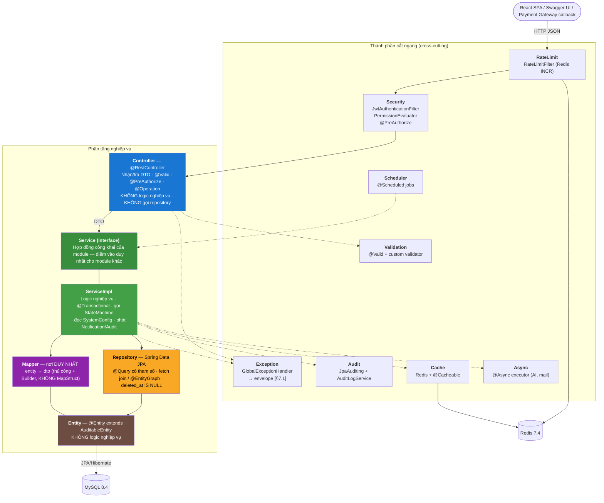

**Đường đi một request ghi (ví dụ `POST /api/listings/{id}/submit` — LIST-04 `[§2.3]`):**

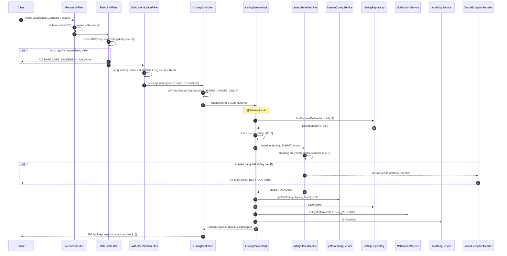

### 3.2. Bảng 11 module nghiệp vụ

> **Đối chiếu số module:** `[§15]` liệt kê **9 nhóm** module nghiệp vụ ("Auth & User" gộp 1, và không nêu `catalog` tách riêng). Canonical §3 diễn giải thành **11 package dọc** bằng cách tách `auth` ↔ `user` và tách `catalog` (Category/Province/District/Ward/Amenity — phục vụ ADM-05..07 `[§2.12]`). Tài liệu này dùng **11 module** theo canonical §3 — đây là chi tiết hóa, không mâu thuẫn với `[§15]`.

| # | Module | Trách nhiệm | Entity sở hữu | Mã chức năng phụ trách (mục 2 tài liệu nghiệp vụ) |
|---|---|---|---|---|
| 1 | **auth** | Đăng ký, đăng nhập, đăng xuất, refresh + rotation + reuse detection, quên/đổi mật khẩu, xác thực email/phone, gán role, khóa/mở khóa tài khoản. Phát hành và thu hồi token. | `roles`, `permissions`, `role_permissions`, `user_roles`, `refresh_tokens`, `password_reset_tokens`, `verifications` | `AUTH-01` đăng ký, `AUTH-02` đăng nhập, `AUTH-03` đăng xuất, `AUTH-04` quên mật khẩu, `AUTH-05` đổi mật khẩu, `AUTH-06` xác thực email/SĐT, `AUTH-07` phân quyền theo vai trò, `AUTH-08` khóa/mở khóa tài khoản `[§2.1]` |
| 2 | **user** | Hồ sơ cá nhân, hồ sơ chủ trọ, thông tin liên hệ, xem hồ sơ công khai, theo dõi chủ trọ, trạng thái xác thực chủ trọ, điểm uy tín chủ trọ. | `users`, `user_profiles`, `landlord_profiles`, `follows` | `USER-01` xem hồ sơ, `USER-02` cập nhật hồ sơ, `USER-03` quản lý thông tin liên hệ, `USER-04` xem hồ sơ chủ trọ, `USER-05` theo dõi/bỏ theo dõi, `USER-06` quản lý trạng thái xác thực chủ trọ `[§2.2]`; `FOLLOW-01`, `FOLLOW-02` `[§2.5]` |
| 3 | **catalog** | Dữ liệu tra cứu ít đổi, dùng chung: loại tin `[§0.3]`, cây hành chính tỉnh/huyện/xã, tiện ích theo nhóm. Là module bị phụ thuộc nhiều nhất, **không phụ thuộc ai**. | `categories`, `provinces`, `districts`, `wards`, `amenities` | `ADM-05` quản lý danh mục, `ADM-06` quản lý khu vực, `ADM-07` quản lý tiện ích `[§2.12]`; `[§10.5]` |
| 4 | **listing** | Vòng đời tin đăng (state machine), CRUD tin, ảnh, tiện ích của tin, gia hạn, lịch sử chỉnh sửa, thống kê tin, quy tắc hiển thị công khai. **Chủ sở hữu `ListingStateMachine` và `ListingVisibilityService`.** | `listings`, `listing_images`, `listing_amenities`, `listing_edit_histories` | `LIST-01` tạo nháp, `LIST-02` đăng tin, `LIST-03` sửa tin, `LIST-04` gửi duyệt, `LIST-05` duyệt/từ chối (thực thi state), `LIST-06` ẩn, `LIST-07` đóng, `LIST-08` xóa mềm, `LIST-09` gia hạn, `LIST-10` thống kê tin, `LIST-11` quản lý ảnh, `LIST-12` quản lý tiện ích `[§2.3]` |
| 5 | **search** | Truy vấn tìm kiếm + lọc + sắp xếp + phân trang, tin liên quan, gợi ý mở rộng khi ít kết quả, ghi lịch sử tìm kiếm, xen tin được đẩy mà vẫn giữ tính liên quan `[§3.7]`. **Chỉ đọc**, không sở hữu entity nghiệp vụ. | *(không sở hữu entity riêng; đọc `listings` qua `ListingQueryService`; ghi `search_histories` qua module `interaction`)* | `SRCH-01` từ khóa, `SRCH-02` khu vực, `SRCH-03` giá, `SRCH-04` diện tích, `SRCH-05` loại tin, `SRCH-06` tiện ích, `SRCH-07` lọc ở ghép theo giới tính/số người, `SRCH-08` sắp xếp, `SRCH-09` tin liên quan `[§2.4]` |
| 6 | **interaction** | Lưu tin, lịch sử xem, lịch sử tìm kiếm, ghi nhận liên hệ, chat nội bộ, bình luận, đánh giá. Là **nguồn dữ liệu hành vi** cho recommendation `[§9.2]`. | `favorites`, `view_histories`, `search_histories`, `contact_logs`, `conversations`, `messages`, `comments`, `reviews` | `FAV-01..03` `[§2.5]`; `HIST-01` ghi lịch sử xem, `HIST-02` xem lịch sử `[§2.5]`; `CONT-01..05` `[§2.6]`; `CMT-01..04`, `REV-01..03` `[§2.7]` |
| 7 | **moderation** | Báo cáo vi phạm, xử lý report, hành động kiểm duyệt, cảnh báo vi phạm, từ khóa cấm, ngưỡng tự động ẩn `[§5.3]`, ngưỡng khóa `[§5.4]`. | `reports`, `moderation_actions`, `violation_warnings`, `banned_keywords` | `RPT-01` báo cáo tin, `RPT-02` báo cáo bình luận, `RPT-03` báo cáo người dùng, `RPT-04` xử lý báo cáo, `RPT-05` gửi cảnh báo vi phạm, `RPT-06` khóa tin/tài khoản `[§2.8]`; `CMT-04`, `REV-03` (quyết định kiểm duyệt) `[§2.7]` |
| 8 | **payment** | Gói dịch vụ, tạo giao dịch, callback cổng thanh toán, kích hoạt gói, lịch sử thanh toán, đẩy tin, nhãn nổi bật, coupon. | `promotion_packages`, `payments`, `promotion_subscriptions`, `coupons` | `PAY-01` xem gói, `PAY-02` mua gói đẩy tin, `PAY-03` tạo giao dịch, `PAY-04` xác nhận thanh toán, `PAY-05` kích hoạt gói, `PAY-06` lịch sử thanh toán; `PROMO-01` đẩy tin lên đầu, `PROMO-02` gắn nhãn nổi bật `[§2.9]` |
| 9 | **notification** | Thông báo in-app, gửi email qua template Thymeleaf, đánh dấu đã đọc, digest. Là module **hạ nguồn** — ai cũng gọi được, nó không gọi ngược lên. | `notifications` | `NOTI-01` thông báo trong hệ thống, `NOTI-02` email xác thực, `NOTI-03` email cảnh báo, `NOTI-04` có người liên hệ, `NOTI-05` tin sắp hết hạn, `NOTI-06` kết quả duyệt tin `[§2.10]` |
| 10 | **ai** | 4 engine sau interface: sentiment, recommendation, chatbot, price. Tính lại điểm uy tín tin/chủ trọ. Log AI + cấu hình ngưỡng. **Chỉ đề xuất, không quyết định** `[§10.10]`. | `sentiment_results`, `recommendation_logs`, `prediction_histories`, `chatbot_conversations`, `chatbot_messages` | `AI-01` phân tích cảm xúc, `AI-02` cập nhật uy tín tin, `AI-03` cập nhật uy tín chủ trọ, `AI-04` gợi ý cá nhân hóa, `AI-05` chatbot, `AI-06` dự đoán giá, `AI-07` quản lý log AI, `AI-08` cấu hình ngưỡng AI `[§2.11]` |
| 11 | **admin** | Dashboard, thống kê, cấu hình hệ thống, cấu hình AI, audit log. Là **mặt tiền quản trị**: điều phối các module khác, tự mình chứa rất ít nghiệp vụ. | `audit_logs`, `system_configs`, `ai_configs` | `ADM-01` dashboard, `ADM-02` quản lý người dùng, `ADM-03` quản lý chủ trọ, `ADM-04` quản lý tin đăng, `ADM-08` quản lý gói dịch vụ, `ADM-09` quản lý thanh toán, `ADM-10` quản lý báo cáo/khiếu nại, `ADM-11` quản lý bình luận/đánh giá, `ADM-12` quản lý AI, `ADM-13` thống kê và báo cáo, `ADM-14` quản lý cấu hình hệ thống `[§2.12]` |

**Làm rõ các mã chức năng nằm ở nhiều module** (tránh tranh chấp khi code):

| Mã | Module **thực thi** | Module **mặt tiền** | Lý do |
|---|---|---|---|
| `LIST-05` duyệt/từ chối tin | `listing` (`ListingStateMachine`) | `moderation` (`ModerationController` — `/api/admin/listings/{id}/approve`) | State machine thuộc về chủ sở hữu entity `listings` (canonical §5.1: *"không service nào được `setStatus()` trực tiếp"*). `moderation` gọi qua `ListingService` (luật 4) |
| `ADM-02` quản lý người dùng | `user` + `auth` | `admin` | Khóa/mở khóa cần `UserService` + thu hồi refresh token (`auth`) |
| `ADM-04` quản lý tin đăng | `listing` | `admin` | Admin sửa trạng thái vẫn phải đi qua state machine |
| `ADM-11` quản lý bình luận/đánh giá | `interaction` (dữ liệu) + `moderation` (quyết định) | `admin` | `[§10.9]`: *"Không sửa nội dung đánh giá của người dùng. Chỉ ẩn hoặc khôi phục"* |
| `HIST-01` ghi lịch sử xem | `interaction` | `listing` (gọi khi xem chi tiết) | `[§3.8]` bước 5 |
| `AI-02/AI-03` cập nhật uy tín | `ai` (`TrustScoreCalculator`) | — | Ghi `listings.trust_score` / `landlord_profiles.trust_score` **qua `ListingService`/`UserService`** (luật 4) |

### 3.3. Sơ đồ phụ thuộc giữa các module

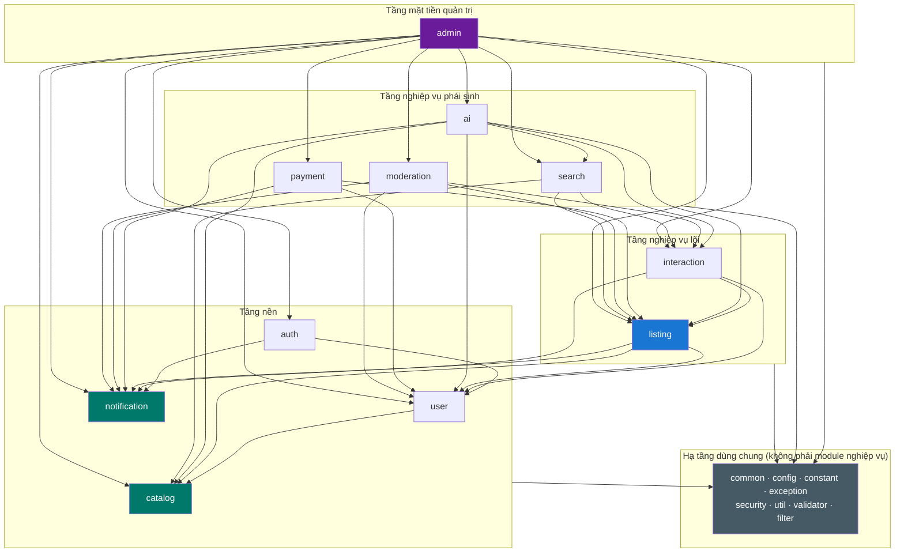

**Tính chất bắt buộc của đồ thị: KHÔNG có chu trình (DAG).**

Hai điểm cần chú ý để giữ DAG:

| Nguy cơ chu trình | Cách chặn |
|---|---|
| `listing → notification` và `notification → listing` (để render "tin nào được duyệt") | `notification` **không** gọi ngược. `NotificationService.create(userId, type, payloadJson)` nhận sẵn dữ liệu đã render từ phía gọi. `notification` là **lá** |
| `ai → listing` và `listing → ai` (bình luận mới cần chạy sentiment) | Chiều `interaction → ai` bị **cấm gọi trực tiếp đồng bộ**. `CommentServiceImpl` chỉ **publish `ApplicationEvent`** (`CommentCreatedEvent`); module `ai` **lắng nghe** bằng `@TransactionalEventListener(phase = AFTER_COMMIT)` + `@Async`. Nhờ vậy `interaction` không compile-depend vào `ai`, và bình luận vẫn lưu được khi AI lỗi `[§9.1]` — **[BỔ SUNG NGOÀI CANONICAL]** (canonical §10 chỉ nói "chạy async qua queue", chưa chốt cơ chế; xem QĐ-08 mục 15) |
| `search → interaction` (ghi `search_histories`) vs `interaction → listing` | Không tạo chu trình vì `interaction` không gọi `search`. `search → interaction → listing` vẫn là DAG |

**6 luật phụ thuộc (canonical §3) — bắt buộc, không được vi phạm:**

| # | Luật | Vì sao | Cách kiểm tra khi review |
|---|---|---|---|
| 1 | `controller` chỉ gọi `service`, **không bao giờ** gọi `repository` | Giữ logic nghiệp vụ + transaction ở đúng một tầng | Grep `Repository` trong `**/controller/**` phải rỗng |
| 2 | `controller` **không bao giờ** nhận/trả `entity` — chỉ `dto` | Chặn rò rỉ `password_hash`, `deleted_at`, quan hệ lazy `[§11.1]` *"Không lộ thông tin nhạy cảm trong API response"* | Chữ ký method controller chỉ chứa `*Request`/`*Response`/`ApiResponse`/`PageResponse` |
| 3 | `mapper` là nơi **duy nhất** chuyển `entity ↔ dto` | Một chỗ duy nhất quyết định trường nào lộ ra (VD: `MaskUtil` cho SĐT `[§3.8]`) | Grep `new *Response(` / `.builder()` của Response ngoài `**/mapper/**` phải rỗng |
| 4 | Module A gọi module B **chỉ qua interface `service`** của B, không qua `repository` của B | Đây là **ranh giới** cho phép tách service về sau `[§11.6]`; nếu vi phạm, monolith mục ruỗng | Grep: import `modules.X.repository` bên trong `modules.Y` (Y≠X) phải rỗng |
| 5 | Mọi phương thức ghi dữ liệu `@Transactional`; đọc dùng `@Transactional(readOnly = true)` | Nhất quán ACID; `readOnly` cho Hibernate bỏ dirty-check → nhanh hơn | Mọi method `public` trong `**/service/impl/**` phải có annotation |
| 6 | Không có logic nghiệp vụ trong `controller` và trong `entity` | Entity là cấu trúc dữ liệu; nghiệp vụ ở service/state machine để test được | Entity chỉ chứa field + `@` + getter/setter (Lombok) |

**Luật bổ sung — [BỔ SUNG NGOÀI CANONICAL]** (cần thiết để giữ DAG, đề nghị review bổ sung vào canonical §3):

| # | Luật | Lý do |
|---|---|---|
| 7 | Module tầng dưới **không** được import module tầng trên (theo sơ đồ 3.3). Giao tiếp ngược chiều **chỉ** qua `ApplicationEvent` trong `common/event/` | Giữ đồ thị phụ thuộc là DAG; cho phép `interaction` phát sự kiện mà `ai` tiêu thụ |
| 8 | Entity của module A **không** được `@ManyToOne` trực tiếp tới entity của module B nếu B ở tầng trên A. Dùng khóa ngoại kiểu `Long` + FK ở DB | Chặn `interaction` phụ thuộc compile-time vào `ai` |

### 3.4. Cây thư mục package backend

```text
backend_webtro/
├── .mvn/wrapper/
├── mvnw · mvnw.cmd · pom.xml · Dockerfile · .dockerignore
└── src
    ├── main
    │   ├── java/com/webtro
    │   │   ├── WebtroApplication.java
    │   │   │
    │   │   ├── common/
    │   │   │   ├── dto/
    │   │   │   │   ├── ApiResponse.java              # envelope [§7.1] canonical §7.1
    │   │   │   │   ├── PageResponse.java             # items,page,size,totalElements,totalPages,first,last
    │   │   │   │   └── ErrorDetail.java              # {field, message}
    │   │   │   ├── entity/
    │   │   │   │   ├── BaseEntity.java               # id BIGINT UNSIGNED
    │   │   │   │   └── AuditableEntity.java          # +created_at/updated_at/created_by/updated_by/deleted_at
    │   │   │   ├── enums/                            # enum dùng chung >1 module (canonical §5)
    │   │   │   │   ├── UserStatus.java · Gender.java
    │   │   │   │   ├── ListingStatus.java · CategoryCode.java · GenderRequirement.java
    │   │   │   │   ├── CurfewType.java · FurnitureStatus.java · ToiletType.java
    │   │   │   │   ├── CommentStatus.java · ReviewStatus.java
    │   │   │   │   ├── SentimentLabel.java · SentimentAction.java
    │   │   │   │   ├── ReportTargetType.java · ReportReason.java · ReportStatus.java
    │   │   │   │   ├── ReportSeverity.java · ModerationResult.java · ModerationActionType.java
    │   │   │   │   ├── PaymentStatus.java · PaymentMethod.java · SubscriptionStatus.java
    │   │   │   │   ├── NotificationType.java · NotificationChannel.java
    │   │   │   │   ├── VerificationType.java · VerificationStatus.java
    │   │   │   │   ├── ChatbotIntent.java · RecommendationSource.java
    │   │   │   │   ├── PriceConfidence.java · AuditAction.java
    │   │   │   │   └── ListingEvent.java             # SAVE_DRAFT, SUBMIT, APPROVE... (canonical §5.1)
    │   │   │   └── event/                            # ApplicationEvent liên module (luật 7)
    │   │   │       ├── CommentCreatedEvent.java · CommentUpdatedEvent.java
    │   │   │       ├── ReviewCreatedEvent.java · ListingApprovedEvent.java
    │   │   │       ├── ListingStatusChangedEvent.java · ReportCreatedEvent.java
    │   │   │       ├── PaymentSucceededEvent.java · FavoriteCreatedEvent.java
    │   │   │       └── ContactCreatedEvent.java
    │   │   │
    │   │   ├── config/
    │   │   │   ├── SecurityConfig.java               # SecurityFilterChain, csrf().disable() + lý do
    │   │   │   ├── MethodSecurityConfig.java         # @EnableMethodSecurity + PermissionEvaluator
    │   │   │   ├── OpenApiConfig.java                # springdoc 2.6.0, bearerAuth scheme
    │   │   │   ├── RedisConfig.java                  # LettuceConnectionFactory, RedisTemplate, CacheManager+TTL
    │   │   │   ├── AsyncConfig.java                  # aiTaskExecutor, mailTaskExecutor (mục 7.3)
    │   │   │   ├── MailConfig.java                   # JavaMailSender + Thymeleaf email template resolver
    │   │   │   ├── JpaAuditingConfig.java            # AuditorAware<Long> ← SecurityContext
    │   │   │   ├── CorsConfig.java                   # chỉ bật cho dev chạy Vite ngoài docker
    │   │   │   ├── WebMvcConfig.java                 # đăng ký interceptor, resource handler /uploads
    │   │   │   ├── PageableConfig.java               # ép size tối đa 100 (canonical §7.3)
    │   │   │   ├── SchedulerConfig.java              # @EnableScheduling + taskScheduler pool
    │   │   │   └── JacksonConfig.java                # Instant → ISO-8601 UTC, camelCase, non-null
    │   │   │
    │   │   ├── constant/
    │   │   │   ├── AppConstant.java                  # API_PREFIX="/api", HEADER_API_VERSION="X-Api-Version"...
    │   │   │   ├── ConfigKey.java                    # 50 key của canonical §9 (hằng String)
    │   │   │   ├── ErrorCode.java                    # LISTING_NOT_FOUND, BUSINESS_RULE_VIOLATED... (canonical §7.2)
    │   │   │   ├── PermissionCode.java               # 27 permission của canonical §4.2
    │   │   │   ├── RoleCode.java                     # ROLE_TENANT/LANDLORD/MODERATOR/ADMIN
    │   │   │   └── CacheName.java                    # tên cache của mục 8
    │   │   │
    │   │   ├── exception/
    │   │   │   ├── GlobalExceptionHandler.java       # @RestControllerAdvice → envelope [§7.1]
    │   │   │   ├── AppException.java                 # gốc: errorCode + httpStatus + args
    │   │   │   ├── ResourceNotFoundException.java    # 404
    │   │   │   ├── ConflictException.java            # 409
    │   │   │   ├── BusinessRuleViolationException.java # 422 (state machine sai)
    │   │   │   ├── ForbiddenException.java           # 403 (sai ownership)
    │   │   │   ├── RateLimitExceededException.java   # 429
    │   │   │   └── AiUnavailableException.java       # 503
    │   │   │
    │   │   ├── security/
    │   │   │   ├── JwtService.java                   # sinh/parse access token (JJWT 0.12.6)
    │   │   │   ├── JwtAuthenticationFilter.java      # OncePerRequestFilter, check blacklist jti
    │   │   │   ├── TokenBlacklistService.java        # Redis SETEX jti
    │   │   │   ├── CustomUserDetails.java · CustomUserDetailsService.java
    │   │   │   ├── CurrentUser.java                  # @AuthenticationPrincipal meta-annotation
    │   │   │   ├── CurrentUserProvider.java          # đọc userId từ SecurityContext
    │   │   │   ├── OwnershipPermissionEvaluator.java # hasPermission(#id,'Listing','OWNER') [§11.2]
    │   │   │   ├── RestAccessDeniedHandler.java      # 403 đúng envelope
    │   │   │   └── RestAuthenticationEntryPoint.java # 401 đúng envelope
    │   │   │
    │   │   ├── filter/
    │   │   │   ├── RequestIdFilter.java              # traceId → MDC + header X-Request-Id (mục 10.4)
    │   │   │   └── RateLimitFilter.java             # Redis INCR+EXPIRE, tự viết (canonical §1.1)
    │   │   │
    │   │   ├── interceptor/
    │   │   │   ├── ApiVersionInterceptor.java        # đọc X-Api-Version, mặc định 1 (canonical §7.3)
    │   │   │   └── SlowRequestLoggingInterceptor.java # log request > ngưỡng [§11.4]
    │   │   │
    │   │   ├── util/
    │   │   │   ├── SlugUtil.java                     # "Phòng trọ Quận 1" → "phong-tro-quan-1" [§11.8]
    │   │   │   ├── HtmlSanitizer.java                # strip toàn bộ HTML (allowlist rỗng) [§11.1]
    │   │   │   ├── PhoneUtil.java                    # chuẩn hóa SĐT VN
    │   │   │   ├── MaskUtil.java                     # 0901234456 → 0901***456 [§3.8]
    │   │   │   ├── GeoUtil.java                      # haversine — khoảng cách tới trung tâm [§9.4]
    │   │   │   ├── TextNormalizer.java               # bỏ dấu, teencode, lowercase (AI)
    │   │   │   ├── ImageUtil.java                    # magic bytes, nén, thumbnail [§11.9]
    │   │   │   └── StatisticsUtil.java               # median, percentile, IQR [§9.4]
    │   │   │
    │   │   ├── validator/
    │   │   │   ├── ValidPhone.java · ValidPhoneValidator.java
    │   │   │   ├── ValidPassword.java · ValidPasswordValidator.java      # ≥8, có chữ và số [§3.1]
    │   │   │   ├── ValidPriceRange.java · ValidPriceRangeValidator.java  # priceFrom ≤ priceTo [§3.7]
    │   │   │   ├── ValidAreaRange.java · ValidAreaRangeValidator.java    # [§3.7]
    │   │   │   ├── NoBannedKeyword.java · NoBannedKeywordValidator.java  # [§3.3][§11.10]
    │   │   │   ├── ValidImageFile.java · ValidImageFileValidator.java    # [§11.9]
    │   │   │   └── ValidRoommateInfo.java · ValidRoommateInfoValidator.java # ROOMMATE bắt buộc giới tính/số người [§3.3]
    │   │   │
    │   │   ├── scheduler/
    │   │   │   ├── ListingExpiryJob.java             # mỗi giờ (canonical §11)
    │   │   │   ├── ListingExpiryReminderJob.java     # 08:00 hằng ngày
    │   │   │   ├── TrustScoreRecalcJob.java          # 02:00 hằng ngày
    │   │   │   ├── SentimentRetryJob.java            # mỗi 10 phút
    │   │   │   ├── RecommendationPrecomputeJob.java  # mỗi 6 giờ
    │   │   │   ├── NewMatchingListingNotifyJob.java  # 07:30 hằng ngày — tin mới khớp nhu cầu [§9.2]
    │   │   │   │                                     # (thay NotificationDigestJob của canonical §3 — mục 7.4)
    │   │   │   ├── PromotionExpiryJob.java           # mỗi giờ
    │   │   │   ├── TokenCleanupJob.java              # 03:00 hằng ngày
    │   │   │   └── PaymentReconcileJob.java          # mỗi 15 phút
    │   │   │
    │   │   └── modules/
    │   │       ├── auth/
    │   │       │   ├── controller/    AuthController · VerificationController
    │   │       │   ├── service/       AuthService · TokenService · VerificationService · RolePermissionService
    │   │       │   ├── service/impl/  AuthServiceImpl · TokenServiceImpl · VerificationServiceImpl · RolePermissionServiceImpl
    │   │       │   ├── repository/    RoleRepository · PermissionRepository · RolePermissionRepository
    │   │       │   │                  UserRoleRepository · RefreshTokenRepository
    │   │       │   │                  PasswordResetTokenRepository · VerificationRepository
    │   │       │   ├── entity/        Role · Permission · RolePermission · UserRole
    │   │       │   │                  RefreshToken · PasswordResetToken · Verification
    │   │       │   ├── dto/request/   RegisterRequest · LoginRequest · RefreshTokenRequest
    │   │       │   │                  ForgotPasswordRequest · ResetPasswordRequest
    │   │       │   │                  ChangePasswordRequest · VerifyEmailRequest · VerifyPhoneRequest
    │   │       │   ├── dto/response/  AuthResponse · TokenResponse · RoleResponse · PermissionResponse
    │   │       │   └── mapper/        AuthMapper · RoleMapper
    │   │       │
    │   │       ├── user/
    │   │       │   ├── controller/    UserController · LandlordProfileController · FollowController
    │   │       │   ├── service/       UserService · UserProfileService · LandlordProfileService · FollowService
    │   │       │   ├── service/impl/  (…Impl tương ứng)
    │   │       │   ├── repository/    UserRepository · UserProfileRepository
    │   │       │   │                  LandlordProfileRepository · FollowRepository
    │   │       │   ├── entity/        User · UserProfile · LandlordProfile · Follow
    │   │       │   ├── dto/request/   UpdateProfileRequest · UpdateLandlordProfileRequest
    │   │       │   │                  UpdateContactInfoRequest · LockUserRequest · AssignRoleRequest
    │   │       │   ├── dto/response/  UserResponse · UserProfileResponse · PublicUserResponse
    │   │       │   │                  LandlordProfileResponse · FollowResponse
    │   │       │   └── mapper/        UserMapper · LandlordProfileMapper · FollowMapper
    │   │       │
    │   │       ├── catalog/
    │   │       │   ├── controller/    CategoryController · LocationController · AmenityController
    │   │       │   │                  AdminCatalogController
    │   │       │   ├── service/       CategoryService · LocationService · AmenityService
    │   │       │   ├── service/impl/  (…Impl)
    │   │       │   ├── repository/    CategoryRepository · ProvinceRepository
    │   │       │   │                  DistrictRepository · WardRepository · AmenityRepository
    │   │       │   ├── entity/        Category · Province · District · Ward · Amenity
    │   │       │   ├── dto/request/   CategoryRequest · AmenityRequest
    │   │       │   ├── dto/response/  CategoryResponse · ProvinceResponse · DistrictResponse
    │   │       │   │                  WardResponse · AmenityResponse
    │   │       │   └── mapper/        CategoryMapper · LocationMapper · AmenityMapper
    │   │       │
    │   │       ├── listing/
    │   │       │   ├── controller/    ListingController · ListingImageController · ListingStatsController
    │   │       │   ├── service/       ListingService · ListingQueryService · ListingImageService
    │   │       │   │                  ListingVisibilityService · ListingStatsService · ListingEditHistoryService
    │   │       │   ├── service/impl/  (…Impl)
    │   │       │   ├── statemachine/  ListingStateMachine · ListingTransition (canonical §5.1)
    │   │       │   ├── repository/    ListingRepository · ListingImageRepository
    │   │       │   │                  ListingAmenityRepository · ListingEditHistoryRepository
    │   │       │   ├── entity/        Listing · ListingImage · ListingAmenity · ListingEditHistory
    │   │       │   ├── dto/request/   CreateListingRequest · UpdateListingRequest · RejectListingRequest
    │   │       │   │                  LockListingRequest · RenewListingRequest · UploadImageRequest
    │   │       │   ├── dto/response/  ListingResponse · ListingDetailResponse · ListingSummaryResponse
    │   │       │   │                  ListingImageResponse · ListingStatsResponse · ListingEditHistoryResponse
    │   │       │   └── mapper/        ListingMapper · ListingImageMapper · ListingEditHistoryMapper
    │   │       │
    │   │       ├── search/
    │   │       │   ├── controller/    SearchController
    │   │       │   ├── service/       ListingSearchService · RelatedListingService · SearchSuggestionService
    │   │       │   ├── service/impl/  (…Impl)
    │   │       │   ├── repository/    ListingSearchRepository        # Criteria API, chỉ đọc
    │   │       │   ├── specification/ ListingSpecification           # predicate builder
    │   │       │   ├── dto/request/   ListingSearchRequest · SortOption
    │   │       │   ├── dto/response/  SearchResultResponse · SearchFacetResponse · SuggestionResponse
    │   │       │   └── mapper/        SearchMapper
    │   │       │
    │   │       ├── interaction/
    │   │       │   ├── controller/    FavoriteController · ViewHistoryController · ContactController
    │   │       │   │                  ConversationController · CommentController · ReviewController
    │   │       │   ├── service/       FavoriteService · ViewHistoryService · SearchHistoryService
    │   │       │   │                  ContactService · ConversationService · MessageService
    │   │       │   │                  CommentService · ReviewService
    │   │       │   ├── service/impl/  (…Impl)
    │   │       │   ├── repository/    FavoriteRepository · ViewHistoryRepository · SearchHistoryRepository
    │   │       │   │                  ContactLogRepository · ConversationRepository · MessageRepository
    │   │       │   │                  CommentRepository · ReviewRepository
    │   │       │   ├── entity/        Favorite · ViewHistory · SearchHistory · ContactLog
    │   │       │   │                  Conversation · Message · Comment · Review
    │   │       │   ├── dto/request/   CreateFavoriteRequest · CreateContactRequest · SendMessageRequest
    │   │       │   │                  CreateCommentRequest · UpdateCommentRequest · ReplyCommentRequest
    │   │       │   │                  CreateReviewRequest · UpdateReviewRequest
    │   │       │   ├── dto/response/  FavoriteResponse · ViewHistoryResponse · ContactLogResponse
    │   │       │   │                  ConversationResponse · MessageResponse
    │   │       │   │                  CommentResponse · ReviewResponse · RatingSummaryResponse
    │   │       │   └── mapper/        FavoriteMapper · ViewHistoryMapper · ContactLogMapper
    │   │       │                      ConversationMapper · MessageMapper · CommentMapper · ReviewMapper
    │   │       │
    │   │       ├── moderation/
    │   │       │   ├── controller/    ReportController · AdminReportController · ModerationController
    │   │       │   ├── service/       ReportService · ModerationService · ViolationWarningService
    │   │       │   │                  BannedKeywordService · AutoHideEvaluator
    │   │       │   ├── service/impl/  (…Impl)
    │   │       │   ├── repository/    ReportRepository · ModerationActionRepository
    │   │       │   │                  ViolationWarningRepository · BannedKeywordRepository
    │   │       │   ├── entity/        Report · ModerationAction · ViolationWarning · BannedKeyword
    │   │       │   ├── dto/request/   CreateReportRequest · ResolveReportRequest
    │   │       │   │                  ModerationDecisionRequest · SendWarningRequest · BannedKeywordRequest
    │   │       │   ├── dto/response/  ReportResponse · ReportGroupResponse · ModerationActionResponse
    │   │       │   │                  ViolationWarningResponse · BannedKeywordResponse
    │   │       │   └── mapper/        ReportMapper · ModerationActionMapper
    │   │       │                      ViolationWarningMapper · BannedKeywordMapper
    │   │       │
    │   │       ├── payment/
    │   │       │   ├── controller/    PromotionPackageController · PaymentController
    │   │       │   │                  AdminPaymentController · AdminPackageController
    │   │       │   ├── service/       PromotionPackageService · PaymentService
    │   │       │   │                  PromotionSubscriptionService · CouponService
    │   │       │   ├── service/impl/  (…Impl)
    │   │       │   ├── gateway/       PaymentGateway (interface)
    │   │       │   │                  SandboxPaymentGateway · VnPayPaymentGateway · MoMoPaymentGateway
    │   │       │   ├── repository/    PromotionPackageRepository · PaymentRepository
    │   │       │   │                  PromotionSubscriptionRepository · CouponRepository
    │   │       │   ├── entity/        PromotionPackage · Payment · PromotionSubscription · Coupon
    │   │       │   ├── dto/request/   CreatePaymentRequest · PaymentCallbackRequest
    │   │       │   │                  PromotePackageRequest · PromotionPackageRequest
    │   │       │   │                  CouponRequest · RefundRequest
    │   │       │   ├── dto/response/  PromotionPackageResponse · PaymentResponse
    │   │       │   │                  PaymentInitResponse · PromotionSubscriptionResponse · CouponResponse
    │   │       │   └── mapper/        PromotionPackageMapper · PaymentMapper
    │   │       │                      PromotionSubscriptionMapper · CouponMapper
    │   │       │
    │   │       ├── notification/
    │   │       │   ├── controller/    NotificationController
    │   │       │   ├── service/       NotificationService · EmailService · NotificationTemplateService
    │   │       │   ├── service/impl/  NotificationServiceImpl · SmtpEmailService · NotificationTemplateServiceImpl
    │   │       │   ├── repository/    NotificationRepository
    │   │       │   ├── entity/        Notification
    │   │       │   ├── dto/request/   MarkReadRequest · NotificationQueryRequest
    │   │       │   ├── dto/response/  NotificationResponse · UnreadCountResponse
    │   │       │   └── mapper/        NotificationMapper
    │   │       │
    │   │       ├── ai/
    │   │       │   ├── controller/    SentimentController · RecommendationController
    │   │       │   │                  ChatbotController · PricePredictionController · AdminAiController
    │   │       │   ├── service/       SentimentService · RecommendationService · ChatbotService
    │   │       │   │                  PricePredictionService · TrustScoreService · AiConfigService · AiLogService
    │   │       │   ├── service/impl/  (…Impl)
    │   │       │   ├── engine/
    │   │       │   │   ├── sentiment/      SentimentAnalyzer (interface)
    │   │       │   │   │                   VietnameseLexiconSentimentAnalyzer
    │   │       │   │   │                   SentimentLexicon · NegationHandler · IntensifierHandler · EmojiHandler
    │   │       │   │   ├── recommendation/ RecommendationEngine (interface)
    │   │       │   │   │                   ContentBasedRecommendationEngine
    │   │       │   │   │                   UserPreferenceProfileBuilder · ListingScorer · ColdStartStrategy
    │   │       │   │   ├── chatbot/        ChatbotEngine (interface) · RuleBasedChatbotEngine
    │   │       │   │   │                   IntentClassifier · SlotExtractor · ChatbotResponseBuilder · FaqKnowledgeBase
    │   │       │   │   └── price/          PriceEstimator (interface) · ComparableHedonicPriceEstimator
    │   │       │   │                       ComparableFinder · HedonicAdjuster · ConfidenceCalculator
    │   │       │   ├── listener/      CommentSentimentListener · TrustScoreListener
    │   │       │   ├── repository/    SentimentResultRepository · RecommendationLogRepository
    │   │       │   │                  PredictionHistoryRepository · ChatbotConversationRepository
    │   │       │   │                  ChatbotMessageRepository
    │   │       │   ├── entity/        SentimentResult · RecommendationLog · PredictionHistory
    │   │       │   │                  ChatbotConversation · ChatbotMessage
    │   │       │   ├── dto/request/   AnalyzeSentimentRequest · RecommendationRequest
    │   │       │   │                  ChatbotMessageRequest · PricePredictionRequest · AiConfigRequest
    │   │       │   ├── dto/response/  SentimentResponse · RecommendationResponse · RecommendationItemResponse
    │   │       │   │                  ChatbotResponse · PricePredictionResponse · AiConfigResponse · AiLogResponse
    │   │       │   └── mapper/        SentimentMapper · RecommendationMapper
    │   │       │                      ChatbotMapper · PricePredictionMapper · AiConfigMapper
    │   │       │
    │   │       └── admin/
    │   │           ├── controller/    DashboardController · StatisticsController
    │   │           │                  SystemConfigController · AuditLogController · AdminUserController
    │   │           ├── service/       DashboardService · StatisticsService
    │   │           │                  SystemConfigService · AuditLogService
    │   │           ├── service/impl/  (…Impl)
    │   │           ├── repository/    AuditLogRepository · SystemConfigRepository · AiConfigRepository
    │   │           │                  DashboardQueryRepository        # native aggregate, chỉ đọc
    │   │           ├── entity/        AuditLog · SystemConfig · AiConfig
    │   │           ├── dto/request/   SystemConfigRequest · AuditLogQueryRequest · StatisticQueryRequest
    │   │           ├── dto/response/  DashboardResponse · StatisticResponse · RevenueStatResponse
    │   │           │                  SystemConfigResponse · AuditLogResponse
    │   │           └── mapper/        SystemConfigMapper · AuditLogMapper · DashboardMapper
    │   │
    │   └── resources/
    │       ├── application.yml                 # cấu hình chung, đọc ${ENV}
    │       ├── application-dev.yml             # profile dev (MailHog, show-sql)
    │       ├── application-docker.yml          # profile chạy trong compose
    │       ├── db/migration/                   # Flyway V1__…sql … (ddl-auto=validate)
    │       ├── templates/email/                # Thymeleaf: verify-email.html, listing-approved.html,
    │       │                                   # listing-rejected.html, listing-expiring.html,
    │       │                                   # payment-success.html, account-locked.html,
    │       │                                   # violation-warning.html, followed-landlord-new-listing.html
    │       └── data/                           # lexicon sentiment (vi), teencode map, FAQ chatbot, banned keyword seed
    └── test/java/com/webtro/…                  # gương cấu trúc main
```

**Ghi chú 3 thư mục ngoài danh sách đề bài** — **[BỔ SUNG NGOÀI CANONICAL]**:

| Thư mục | Vị trí | Lý do bắt buộc | Vì sao không nhét vào thư mục có sẵn |
|---|---|---|---|
| `modules/listing/statemachine/` | trong module `listing` | Canonical §5.1: *"Hiện thực bằng `ListingStateMachine` (một class duy nhất)"* | Không phải service (không transaction, không I/O); để trong `service/` sẽ mời gọi vi phạm "không service nào được `setStatus()` trực tiếp" |
| `modules/ai/engine/` | trong module `ai` | Canonical §10 chốt tên interface + impl (`SentimentAnalyzer` → `VietnameseLexiconSentimentAnalyzer`…). Engine là **thuật toán thuần**, không transaction | Tách engine khỏi service cho phép unit test engine không cần Spring context, và là ranh giới để thay bằng ML service sau `[§11.6]` |
| `modules/payment/gateway/` | trong module `payment` | `[§0.2]` *"Thanh toán có thể mô phỏng hoặc tích hợp cổng thanh toán sandbox"* → cần cổng cắm thay được | Là adapter ra hệ thống ngoài, không phải service nghiệp vụ |
| `modules/search/specification/` | trong module `search` | JPA Criteria predicate builder cho 12 nhóm filter `[§3.7]` | Không phải repository (không truy vấn), không phải service (không nghiệp vụ) |
| `common/event/` | dùng chung | Hiện thực luật 7 (mục 3.3) — sự kiện liên module | Phải nằm ở chỗ mọi module thấy được mà không tạo phụ thuộc |
| `modules/ai/listener/` | trong module `ai` | Nơi `ai` tiêu thụ event của `interaction` | — |

---

## 4. Kiến trúc frontend

### 4.1. Sơ đồ phân lớp

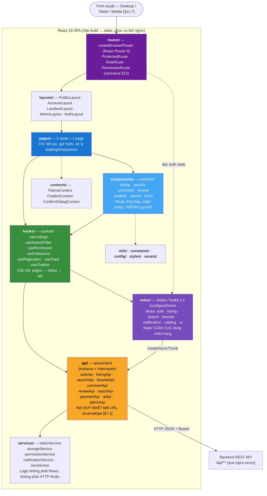

**Luật phân lớp frontend (đối xứng với 6 luật backend) — [BỔ SUNG NGOÀI CANONICAL]** (canonical §12 chỉ chốt sitemap + route guard, chưa chốt luật phân lớp):

| # | Luật | Lý do |
|---|---|---|
| F1 | `components/` **không** gọi API và **không** `dispatch` thunk trực tiếp — chỉ nhận props và emit callback | Component tái sử dụng được, test được, không kéo theo store |
| F2 | `pages/` **không** dùng `axios` trực tiếp — chỉ qua `hooks/` hoặc `redux` | Một chỗ duy nhất đổi khi API đổi |
| F3 | `api/` là nơi **duy nhất** biết đường dẫn `/api/**` và bóc envelope `{success, data}` `[§7.1]` | Đối xứng luật 3 backend (mapper) |
| F4 | State **chỉ** vào Redux khi dùng chéo ít nhất 2 trang (auth, catalog, notification, favorite, ui). State của một trang dùng `useState`/`useReducer` | Tránh store phình thành túi biến toàn cục |
| F5 | **Không** dùng `dangerouslySetInnerHTML` ở bất kỳ đâu (canonical §8, `[§11.1]`) | Chặn XSS |
| F6 | Mọi trang có đủ 4 trạng thái: loading (Skeleton MUI) · empty · error · success (canonical §13.7) | Definition of Done |

### 4.2. Cây thư mục `src/`

```text
frontend_webtro/
├── Dockerfile · nginx.conf · vite.config.js · index.html
├── .env.example · package.json
└── src/
    ├── main.jsx                       # ReactDOM.createRoot + Provider + RouterProvider + ThemeProvider
    ├── App.jsx                        # ToastContainer, ErrorBoundary, khởi động bootstrapAuth()
    │
    ├── api/
    │   ├── axiosClient.js             # instance + interceptor refresh (mục 4.4)
    │   ├── authApi.js                 # register, login, logout, refresh, forgot/reset password, verify
    │   ├── userApi.js                 # me, updateProfile, publicProfile, follow/unfollow
    │   ├── catalogApi.js              # categories, provinces, districts, wards, amenities
    │   ├── listingApi.js              # CRUD, submit, hide, close, renew, images, stats
    │   ├── searchApi.js               # searchListings, relatedListings, suggestions
    │   ├── favoriteApi.js · historyApi.js
    │   ├── contactApi.js · conversationApi.js
    │   ├── commentApi.js · reviewApi.js
    │   ├── reportApi.js
    │   ├── paymentApi.js              # packages, createPayment, myPayments, promote
    │   ├── notificationApi.js
    │   ├── aiApi.js                   # recommendations, chatbotMessage, pricePrediction
    │   └── adminApi.js                # dashboard, users, listings, reports, configs, auditLogs, statistics
    │
    ├── components/
    │   ├── common/                    # Loading · Skeleton · EmptyState · ErrorState · ErrorBoundary
    │   │                              # ConfirmDialog · Pagination · ImageUploader · ImageGallery
    │   │                              # StarRating · TrustScoreBadge · StatusChip · PriceText
    │   │                              # MaskedPhone · CopyButton · SeoHead · LazyImage
    │   ├── layout/                    # Header · Footer · Sidebar · UserMenu · NotificationBell · MobileDrawer
    │   ├── listing/                   # ListingCard · ListingList · ListingDetailInfo · ListingImageSlider
    │   │                              # ListingAmenityList · ListingMap · ListingStatusTimeline
    │   │                              # ListingForm/ (Step1Category, Step2Basic, Step3Address,
    │   │                              #   Step4Price, Step5Amenity, Step6Image, Step7Review) [§11.7]
    │   │                              # PricePredictionPanel [§3.16]
    │   ├── search/                    # SearchBar · FilterPanel · FilterPrice · FilterArea
    │   │                              # FilterLocation · FilterAmenity · FilterRoommate · SortSelect
    │   │                              # ActiveFilterChips · NoResultSuggestion [§3.7]
    │   ├── comment/                   # CommentList · CommentItem · CommentForm · CommentReply · SentimentChip
    │   ├── review/                    # ReviewList · ReviewItem · ReviewForm · RatingSummary
    │   ├── report/                    # ReportDialog · ReportReasonSelect
    │   ├── chatbot/                   # ChatbotWidget · ChatbotWindow · ChatbotMessage
    │   │                              # ChatbotQuickReply · ChatbotListingResult
    │   ├── payment/                   # PackageCard · PackageList · PaymentMethodSelect · PaymentResultPanel
    │   ├── admin/                     # AdminTable · AdminFilterBar · StatCard · RevenueChart
    │   │                              # ListingStatusChart · ModerationDecisionDialog
    │   │                              # AuditLogTable · ConfigEditor · AiConfigForm
    │   └── form/                      # RHFTextField · RHFSelect · RHFNumber · RHFCheckbox
    │                                  # RHFRadioGroup · RHFDatePicker · RHFAutocomplete  (React Hook Form + Yup)
    │
    ├── pages/                         # phản chiếu chính xác sitemap canonical §12
    │   ├── public/                    # HomePage · SearchPage · ListingDetailPage · LandlordPublicPage
    │   │                              # AboutPage · TermsPage · NotFoundPage
    │   ├── auth/                      # LoginPage · RegisterPage · ForgotPasswordPage
    │   │                              # ResetPasswordPage · VerifyEmailPage
    │   ├── account/                   # ProfilePage · SavedListingsPage · ViewHistoryPage · MessagesPage
    │   │                              # NotificationsPage · MyReportsPage · MyReviewsPage
    │   │                              # FollowingPage · ChangePasswordPage
    │   ├── landlord/                  # DashboardPage · MyListingsPage · CreateListingPage · EditListingPage
    │   │                              # ListingStatsPage · ContactsPage · MessagesPage
    │   │                              # PackagesPage · PaymentsPage · LandlordProfilePage
    │   └── admin/                     # DashboardPage · UsersPage · LandlordsPage · ListingsPage
    │                                  # ModerationPage · ReportsPage · CommentsPage · ReviewsPage
    │                                  # CategoriesPage · LocationsPage · AmenitiesPage · PackagesPage
    │                                  # PaymentsPage · AiLogPage · AiConfigPage · StatisticsPage
    │                                  # SystemConfigPage · AuditLogPage
    │
    ├── layouts/                       # PublicLayout · AuthLayout · AccountLayout · LandlordLayout · AdminLayout
    │
    ├── routes/
    │   ├── index.jsx                  # createBrowserRouter — map sitemap canonical §12
    │   ├── ProtectedRoute.jsx         # yêu cầu đăng nhập
    │   ├── RoleRoute.jsx              # roles=[...]
    │   ├── PermissionRoute.jsx        # permissions=[...]
    │   └── paths.js                   # hằng đường dẫn tiếng Việt (canonical §12)
    │
    ├── hooks/
    │   ├── useAuth.js                 # user, roles, permissions, isAuthenticated, login, logout
    │   ├── usePermission.js           # has('LISTING_MODERATE') — ẩn/hiện menu (canonical §12)
    │   ├── useListings.js · useListingDetail.js · useListingForm.js
    │   ├── useSearchFilter.js         # đồng bộ filter ↔ query string (chia sẻ link được)
    │   ├── useFavorite.js · useComments.js · useReviews.js
    │   ├── useNotification.js         # polling badge chưa đọc
    │   ├── useChatbot.js · usePricePrediction.js · useRecommendation.js
    │   ├── useDebounce.js · usePagination.js · useToast.js
    │   ├── useConfirm.js · useResponsive.js
    │   └── useUploadImage.js
    │
    ├── contexts/                      # ThemeContext · ChatbotContext · ConfirmDialogContext
    │
    ├── redux/
    │   ├── store.js                   # configureStore
    │   └── slices/
    │       ├── authSlice.js           # accessToken (memory), user, roles, permissions, status
    │       ├── catalogSlice.js        # categories/provinces/amenities — nạp 1 lần, cache client
    │       ├── listingSlice.js · searchSlice.js · favoriteSlice.js
    │       ├── notificationSlice.js   # danh sách + unreadCount
    │       └── uiSlice.js             # sidebar, dialog, global loading
    │
    ├── services/
    │   ├── tokenService.js            # GIỮ access token trong biến module (memory) — mục 4.3
    │   ├── storageService.js          # wrapper localStorage (chỉ dữ liệu KHÔNG nhạy cảm)
    │   ├── permissionService.js       # so khớp permission code
    │   ├── notificationService.js     # toast wrapper (react-toastify)
    │   └── seoService.js              # set title/meta/canonical động [§11.8]
    │
    ├── assets/                        # images/ · icons/ · fonts/
    ├── styles/                        # theme.js (MUI createTheme) · global.css · variables.css
    ├── utils/                         # formatCurrency · formatDate (DayJS locale vi) · slugify
    │                                  # maskPhone · buildQueryString · parseQueryString
    │                                  # validators · errorMapper (errorCode → thông báo tiếng Việt)
    ├── constants/                     # roles.js · permissions.js · listingStatus.js · categories.js
    │                                  # reportReasons.js · sortOptions.js · errorCodes.js  (khớp canonical §5 + §4.2)
    └── config/                        # env.js (đọc import.meta.env) · apiConfig.js · appConfig.js
```

### 4.3. Cơ chế xác thực phía client — phân tích đánh đổi và chốt phương án

`[§11.1]` yêu cầu *"Không lộ thông tin nhạy cảm"*; canonical §8 chốt access token 15 phút + refresh token 7 ngày opaque UUID lưu DB có rotation + reuse detection. Câu hỏi còn lại: **client lưu 2 token đó ở đâu**.

**Ba phương án và đánh đổi:**

| # | Phương án | Chống XSS đánh cắp token | Chống CSRF | Giữ đăng nhập khi F5 | Độ phức tạp | Nhận xét |
|---|---|---|---|---|---|---|
| A | Cả 2 token trong `localStorage` | ✘ **Hỏng** — mọi script chạy trên trang đọc được cả refresh token 7 ngày → chiếm quyền dài hạn | ✔ (không cookie tự gửi) | ✔ | Thấp | Rủi ro cao nhất |
| B | Access token **trong memory** + refresh token trong cookie **httpOnly + Secure + SameSite=Strict** | ✔ **Tốt nhất** — XSS không đọc được cookie httpOnly; access token chết theo tab | Cookie tự gửi, nhưng **chỉ** tới `/api/auth/*` và `SameSite=Strict` chặn cross-site | ✔ (F5 → gọi refresh, lấy access mới) | Trung bình | **CHỌN** |
| C | Access token trong memory + refresh token trong `localStorage` | ◐ Access an toàn hơn, nhưng refresh vẫn lộ với XSS | ✔ | ✔ | Thấp | Nửa vời |

**Quyết định chốt: phương án B.**

- **Access token (15 phút): giữ trong memory** — biến module trong `services/tokenService.js`, mirror trong `authSlice` để component đọc. Không `localStorage`, không cookie. Mất khi F5, và điều đó **là đúng** vì lấy lại được bằng refresh.
- **Refresh token (7 ngày): cookie `httpOnly; Secure; SameSite=Strict; Path=/api/auth; Max-Age=604800`** do backend `Set-Cookie` khi login/refresh. JavaScript **không đọc được**.

**Vì sao B chứ không phải A/C:**

1. **Kích thước thiệt hại khi có XSS.** Canonical §8 đã đầu tư rất nhiều vào refresh token (rotation, reuse detection, hash SHA-256 trong DB). Toàn bộ đầu tư đó **vô nghĩa** nếu client tự đặt refresh token vào `localStorage` cho script bất kỳ đọc. Với B, XSS tệ nhất chỉ lấy được access token còn sống ≤15 phút và **không** gia hạn được — thiệt hại có trần.
2. **`SameSite=Strict` + `Path=/api/auth` triệt CSRF ngay tại gốc.** Cookie chỉ được gửi khi request xuất phát từ chính origin của site, và chỉ tới nhóm endpoint `/api/auth/*`. Mọi endpoint nghiệp vụ khác (`/api/listings`, `/api/payments`…) **không nhận cookie** — chúng chỉ chấp nhận `Authorization: Bearer`. Đây chính là lý do `csrf().disable()` vẫn đúng (mục 5.3).
3. **`Path=/api/auth` là bắt buộc, không phải trang trí.** Nó thu hẹp bề mặt: kể cả nếu sau này có endpoint nào lỡ tin cookie, endpoint đó phải nằm dưới `/api/auth` mới nhận được.
4. **Chi phí trả thêm là chấp nhận được:** FE cần `withCredentials: true` cho `/api/auth/*`, và một lần `bootstrapAuth()` lúc khởi động app (gọi `/api/auth/refresh`) để khôi phục phiên sau F5. Khoảng 30 dòng code — rẻ hơn nhiều so với rủi ro chiếm phiên 7 ngày.

**Xử lý điểm yếu của B (nêu thẳng, không giấu):**

| Điểm yếu | Cách xử lý |
|---|---|
| F5 mất access token → nháy màn hình đăng nhập | `App.jsx` chạy `bootstrapAuth()` **trước** khi render router; trong lúc chờ hiện `<SplashLoading/>`. `authSlice.status: 'idle' → 'loading' → 'authenticated' \| 'anonymous'`. `ProtectedRoute` **không** redirect khi `status === 'loading'` |
| Nhiều tab: mỗi tab có access token riêng | Chấp nhận được — cả 2 tab đều refresh từ cùng cookie. Rotation sinh refresh token mới; tab kia dùng token cũ sẽ bị reuse detection hiểu nhầm là tấn công → dùng **grace period** (cuối mục 4.4) |
| `Secure` yêu cầu HTTPS, dev chạy HTTP | Thuộc tính `Secure` đọc từ biến môi trường `${COOKIE_SECURE}` (dev=`false`, deploy=`true`) — không hardcode (canonical §1.3). `[§11.1]` *"Dùng HTTPS khi triển khai thật"* |
| Cần đọc `roles`/`permissions` để ẩn menu | Decode access token bằng `jwt-decode` (canonical §1.2) — access token chứa `roles[]`, `permissions[]` (canonical §8). **Chỉ để hiển thị**; quyền thật luôn kiểm ở backend `[§11.2]` *"API cần kiểm tra quyền ở backend, không chỉ ẩn nút ở frontend"* |

**Dữ liệu được phép ở `localStorage`** (không nhạy cảm — `[§11.11]` *"Không cache dữ liệu cá nhân nhạy cảm"*): ngôn ngữ, theme, `recentSearches` (chỉ để hiển thị), trạng thái đóng/mở chatbot widget.
**Cấm tuyệt đối ở `localStorage`/`sessionStorage`:** access token, refresh token, mật khẩu, số điện thoại đầy đủ, email.

### 4.4. Luồng axios interceptor tự refresh khi 401 (có hàng đợi chống race)

**Vấn đề cần giải:** access token sống 15 phút. Trang chi tiết tin bắn song song 5 request (`listing`, `comments`, `reviews`, `related`, `recommendation`). Cả 5 cùng nhận `401`. Nếu mỗi request tự gọi `/api/auth/refresh` → **5 lần refresh đồng thời**. Với **rotation** (canonical §8), lần refresh thứ nhất đã xoay token; 4 lần sau gửi token cũ → **reuse detection kích hoạt → thu hồi cả họ token → người dùng bị đá ra ngoài dù không làm gì sai**. Đây là lỗi thật, phải chặn bằng thiết kế chứ không bằng may mắn.

**Giải pháp: single-flight + hàng đợi.** Chỉ **một** refresh được bay; các request 401 khác **xếp hàng** chờ kết quả rồi replay.

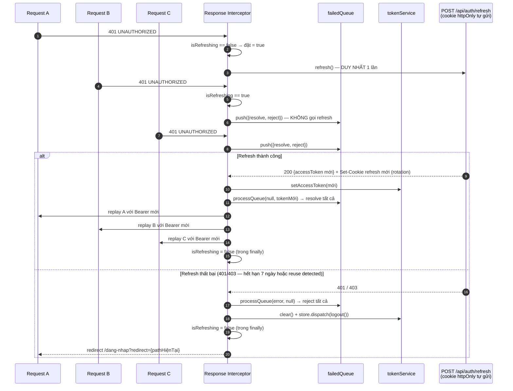

**Đặc tả hiện thực `src/api/axiosClient.js`** — mọi quy tắc dưới đây là bắt buộc:

| Quy tắc | Chi tiết | Vì sao |
|---|---|---|
| Biến trạng thái module | `let isRefreshing = false; let failedQueue = [];` | Single-flight |
| Request interceptor | Gắn `Authorization: Bearer ${tokenService.getAccessToken()}` nếu có; gắn `X-Api-Version: 1` (canonical §7.3) | — |
| `withCredentials` | `true` **chỉ** cho `/api/auth/*` (nơi cần cookie refresh) | Thu hẹp bề mặt cookie |
| Điều kiện kích hoạt refresh | `status === 401` **VÀ** `!originalRequest._retry` **VÀ** URL **không** thuộc `/api/auth/login`, `/api/auth/refresh`, `/api/auth/register` | Chặn vòng lặp vô hạn: 401 từ chính `/refresh` không được kích hoạt refresh nữa. 401 từ `/login` là **sai mật khẩu** `[§3.2]`, phải hiện lỗi cho người dùng chứ không refresh |
| Đánh dấu retry | `originalRequest._retry = true` **trước** khi replay | Mỗi request chỉ được thử lại **một** lần |
| Khi `isRefreshing === true` | Trả `new Promise((resolve, reject) => failedQueue.push({resolve, reject}))` rồi `.then(token => replay(originalRequest, token))` | Đây chính là **hàng đợi chống race** |
| `processQueue(error, token)` | Duyệt `failedQueue`, gọi `resolve(token)` hoặc `reject(error)`; sau đó `failedQueue = []` | Giải phóng toàn bộ hàng đợi bằng **một** kết quả |
| Reset cờ | `isRefreshing = false` **bắt buộc đặt trong `finally`**, không phải trong `then` | Nếu refresh ném lỗi mà không reset cờ, mọi 401 sau đó treo vĩnh viễn trong hàng đợi |
| Refresh thất bại | `processQueue(err, null)` → `tokenService.clear()` → `store.dispatch(logout())` → `window.location.href = '/dang-nhap?redirect=' + encodeURIComponent(location.pathname)` | Trả người dùng về đúng trang sau khi đăng nhập lại |
| Xử lý 403 | **Không** refresh. Toast "Bạn không có quyền thực hiện thao tác này" | 403 là thiếu **quyền**, refresh không giúp gì (canonical §7.2) |
| Xử lý 429 | **Không** refresh. Đọc header `Retry-After` (canonical §7.2) → toast "Bạn thao tác quá nhanh, vui lòng thử lại sau N giây" | `[§11.10]` |
| Xử lý 503 `AI_SERVICE_UNAVAILABLE` | **Không** refresh. Component AI hiện fallback (mục 6.5); phần còn lại của trang vẫn chạy | `[§9.1]` AI lỗi không được chặn nghiệp vụ |
| Bóc envelope | Interceptor thành công: `return response.data.data` (theo `[§7.1]`). Lỗi: map `errorCode` → thông báo tiếng Việt qua `utils/errorMapper.js`; nếu có mảng `errors[]` → gắn vào field của React Hook Form bằng `setError(field, {message})` | Luật F3 |

**Grace period cho rotation nhiều tab — [BỔ SUNG NGOÀI CANONICAL]**
(canonical §8 chốt rotation + reuse detection nhưng không nói cách phân biệt "tấn công" với "2 tab cùng refresh"):

> Khi refresh token `T` bị dùng lần thứ 2 **trong vòng `security.refresh.grace_seconds` = 10 giây** kể từ lần xoay, **và** cùng `user_agent` + `ip`, backend trả **lại access token của lần xoay đó** (idempotent) thay vì kích hoạt reuse detection. Ngoài cửa sổ 10 giây, hoặc khác UA/IP → **reuse detection thật** → thu hồi cả họ token (canonical §8).
>
> Lý do: hai tab của cùng người dùng cùng F5 tại một thời điểm là hành vi bình thường, không phải tấn công. Không có grace period, người dùng sẽ bị đá ra ngoài ngẫu nhiên — và đó sẽ bị chấm là lỗi. Single-flight ở mục 4.4 chỉ chống race **trong một tab**; grace period chống race **giữa các tab**.
>
> Đề nghị review bổ sung key `security.refresh.grace_seconds` (mặc định `10`) vào canonical §9.

---

## 5. Bảo mật `[§11.1]` `[§11.2]`

### 5.1. Luồng JWT access + refresh

**Tham số chốt (canonical §8):**

| Tham số | Giá trị | Ghi chú |
|---|---|---|
| Access token | JWT, **15 phút** | Claim: `sub` (userId), `email`, `roles[]`, `permissions[]`, `jti`, `iat`, `exp` |
| Refresh token | **7 ngày**, opaque UUID | Lưu DB `refresh_tokens`, cột lưu **hash SHA-256** — DB bị lộ vẫn không dùng được token |
| Rotation | Mỗi lần refresh sinh token mới, thu hồi token cũ | — |
| Reuse detection | Dùng lại token đã xoay → **thu hồi cả họ token** | Trừ grace period 10s (mục 4.4) |
| Logout | Xóa refresh token + đưa `jti` vào **blacklist Redis**, TTL = hạn còn lại của access token | Access token là stateless → phải blacklist mới thu hồi được ngay |
| Mật khẩu | BCrypt **cost 12**; tối thiểu 8 ký tự, có chữ và số | `[§3.1]`, `[§11.1]` *"Mật khẩu lưu bằng hash an toàn"* |

**Vì sao access ngắn + refresh dài:** JWT không thu hồi được (đó là bản chất stateless). Giải pháp là làm cửa sổ thiệt hại nhỏ (15 phút) và đặt điểm kiểm soát thật ở refresh token — thứ **có** trong DB nên **thu hồi được**. Blacklist `jti` trong Redis lấp nốt khe 15 phút cho trường hợp logout/khóa tài khoản.

**Sequence — đăng nhập, gọi API, refresh có rotation:**

```mermaid
sequenceDiagram
    autonumber
    participant U as Client (React)
    participant AC as AuthController
    participant AS as AuthServiceImpl
    participant JS as JwtService
    participant TS as TokenServiceImpl
    participant DB as MySQL (refresh_tokens)
    participant RD as Redis (blacklist + rate limit)

    rect rgba(25,118,210,0.08)
    Note over U,RD: 1) ĐĂNG NHẬP — AUTH-02 [§3.2]
    U->>AC: POST /api/auth/login {email, password}
    AC->>RD: INCR login:fail:{ip}:{email} — kiểm tra 5 lần/15 phút [§3.2]
    alt Vượt ngưỡng security.login.*
        RD-->>U: 429 RATE_LIMIT_EXCEEDED + Retry-After (khóa tạm 15 phút)
    end
    AC->>AS: login(request)
    AS->>DB: findByEmail + BCrypt.matches(cost 12)
    alt Sai mật khẩu
        AS->>RD: INCR login:fail:{ip}:{email} EXPIRE 900
        AS-->>U: 401 UNAUTHORIZED (KHÔNG nói "email không tồn tại" — chống dò tài khoản)
    end
    AS->>AS: kiểm tra UserStatus — LOCKED thì từ chối [§3.2]
    AS->>RD: DEL login:fail:{ip}:{email}
    AS->>JS: generateAccessToken(user) — 15 phút, có jti
    AS->>TS: issueRefreshToken(user, ua, ip)
    TS->>DB: INSERT refresh_tokens(token_hash=SHA256(uuid), family_id, expires_at=+7d)
    AS->>DB: UPDATE users.last_login_at [§3.2]
    AS-->>U: 200 {accessToken} + Set-Cookie refreshToken<br/>(httpOnly; Secure; SameSite=Strict; Path=/api/auth)
    U->>U: tokenService.setAccessToken(memory)
    end

    rect rgba(56,142,60,0.08)
    Note over U,RD: 2) GỌI API NGHIỆP VỤ
    U->>AC: GET /api/listings/12 + Authorization: Bearer
    AC->>JS: verify chữ ký + exp
    JS->>RD: EXISTS blacklist:jti:{jti}
    alt jti trong blacklist (đã logout)
        RD-->>U: 401 UNAUTHORIZED
    end
    JS-->>AC: SecurityContext(userId, roles[], permissions[])
    AC-->>U: 200 ApiResponse
    end

    rect rgba(239,108,0,0.08)
    Note over U,RD: 3) REFRESH — ROTATION + REUSE DETECTION
    U->>AC: POST /api/auth/refresh (cookie tự gửi)
    AC->>TS: refresh(rawToken, ua, ip)
    TS->>DB: SELECT WHERE token_hash = SHA256(rawToken)
    alt Không tồn tại
        TS-->>U: 401 UNAUTHORIZED
    else Hết hạn (> 7 ngày)
        TS->>DB: xóa token
        TS-->>U: 401 UNAUTHORIZED → FE điều hướng /dang-nhap
    else revoked_at IS NOT NULL — token ĐÃ bị xoay
        alt Trong grace 10s + cùng UA + cùng IP
            TS-->>U: 200 {accessToken của lần xoay đó} (idempotent — 2 tab cùng F5)
        else Ngoài grace → TẤN CÔNG
            TS->>DB: UPDATE refresh_tokens SET revoked_at=NOW()<br/>WHERE family_id = ? (THU HỒI CẢ HỌ)
            TS->>RD: blacklist mọi jti còn sống của user
            TS->>DB: ghi AuditLog + tạo Notification cảnh báo
            TS-->>U: 401 UNAUTHORIZED — buộc đăng nhập lại toàn bộ thiết bị
        end
    else Hợp lệ
        TS->>DB: UPDATE token cũ SET revoked_at=NOW(), replaced_by=<new>
        TS->>DB: INSERT token mới CÙNG family_id
        TS->>JS: generateAccessToken(user)
        TS-->>U: 200 {accessToken mới} + Set-Cookie refreshToken mới
    end
    end

    rect rgba(198,40,40,0.08)
    Note over U,RD: 4) ĐĂNG XUẤT — AUTH-03
    U->>AC: POST /api/auth/logout + Bearer
    AC->>TS: revoke(refreshToken)
    TS->>DB: UPDATE refresh_tokens SET revoked_at = NOW()
    TS->>RD: SETEX blacklist:jti:{jti} TTL=(exp - now) "1"
    TS-->>U: 204 + Set-Cookie refreshToken="" Max-Age=0
    end
```

**Khái niệm "họ token" (`family_id`) — [BỔ SUNG NGOÀI CANONICAL]:** canonical §8 dùng cụm *"thu hồi cả họ token"* nhưng không chốt cơ chế nhận diện "họ". Chốt: mỗi lần **đăng nhập** sinh một `family_id` (UUID); mọi lần **rotation** kế thừa `family_id` đó. Reuse detection → `UPDATE ... WHERE family_id = ?`. Nhờ vậy, một thiết bị bị tấn công không đá văng các thiết bị đăng nhập độc lập khác. Đề nghị review bổ sung cột `family_id`, `revoked_at`, `replaced_by_id`, `user_agent`, `ip_address` cho bảng `refresh_tokens` vào tài liệu thiết kế CSDL.

### 5.2. Ma trận Role × Permission (copy chính xác từ canonical §4.2)

**4 role người** (canonical §4.1) — quan hệ `User ↔ Role` là **nhiều-nhiều** qua `user_roles`, vì `[§1.2]`: *"Chủ trọ có toàn bộ quyền cơ bản của người thuê nếu hệ thống dùng chung tài khoản"*:

| Code | Tên hiển thị | Ghi chú |
|---|---|---|
| `ROLE_TENANT` | Người thuê | mặc định khi đăng ký |
| `ROLE_LANDLORD` | Chủ trọ | bao gồm "Người cho ở ghép" |
| `ROLE_MODERATOR` | Kiểm duyệt viên | |
| `ROLE_ADMIN` | Quản trị viên | |

> **"Người cho ở ghép" / "Người cần ở ghép" `[§1.1]` không phải role** (canonical §4.1). Chúng là ngữ cảnh: người cho ở ghép = `ROLE_LANDLORD` đăng tin `category = ROOMMATE`; người cần ở ghép = `ROLE_TENANT` tìm tin đó. `[§7.3]` gộp chung tiêu đề *"Chủ trọ / Người cho ở ghép"* xác nhận hướng này. **"Khách chưa đăng nhập" là trạng thái ẩn danh, không phải role.**

**Ma trận permission (RBAC 2 tầng: Role → Permission)** — kiểm tra ở backend bằng `@PreAuthorize("hasAuthority('...')")`, **không** chỉ ẩn nút ở frontend `[§11.2]`:

| Permission code | TENANT | LANDLORD | MODERATOR | ADMIN |
|---|:--:|:--:|:--:|:--:|
| `LISTING_CREATE` | | ✔ | | ✔ |
| `LISTING_UPDATE_OWN` | | ✔ | | ✔ |
| `LISTING_UPDATE_ANY` | | | | ✔ |
| `LISTING_MODERATE` (duyệt/từ chối/gắn cờ/tạm ẩn) | | | ✔ | ✔ |
| `LISTING_LOCK` | | | | ✔ |
| `LISTING_VIEW_ANY` (xem cả tin non-public) | | | ✔ | ✔ |
| `FAVORITE_MANAGE` | ✔ | ✔ | | |
| `CONTACT_CREATE` | ✔ | ✔ | | |
| `COMMENT_CREATE` | ✔ | ✔ | | |
| `COMMENT_MODERATE` | | | ✔ | ✔ |
| `REVIEW_CREATE` | ✔ | ✔ | | |
| `REVIEW_MODERATE` | | | ✔ | ✔ |
| `REPORT_CREATE` | ✔ | ✔ | ✔ | ✔ |
| `REPORT_RESOLVE` | | | ✔ | ✔ |
| `WARNING_SEND` | | | ✔ | ✔ |
| `USER_MANAGE` (khóa/mở khóa) | | | | ✔ |
| `USER_ROLE_ASSIGN` | | | | ✔ |
| `LANDLORD_VERIFY` | | | ✔ | ✔ |
| `PAYMENT_VIEW_OWN` | | ✔ | | ✔ |
| `PAYMENT_MANAGE` | | | | ✔ |
| `PACKAGE_MANAGE` | | | | ✔ |
| `CATALOG_MANAGE` | | | | ✔ |
| `AI_CONFIG_MANAGE` | | | | ✔ |
| `AI_LOG_VIEW` | | | ✔ | ✔ |
| `SYSTEM_CONFIG_MANAGE` | | | | ✔ |
| `STATISTIC_VIEW` | | | | ✔ |
| `AUDIT_LOG_VIEW` | | | | ✔ |

> Cột trống = **không có quyền**. `MODERATOR` cố tình **không** có bất kỳ permission nào về `PAYMENT`, `PACKAGE`, `SYSTEM_CONFIG`, `USER_ROLE_ASSIGN`, `STATISTIC` — đúng `[§1.2]`: *"Moderator chỉ có quyền kiểm duyệt, không quản lý cấu hình tài chính"*.

**Ba tầng kiểm quyền — permission chưa đủ:**

`[§11.2]` yêu cầu *"Người dùng chỉ sửa dữ liệu thuộc sở hữu của mình"*. `LISTING_UPDATE_OWN` chỉ trả lời "được sửa tin **nào đó**", không trả lời "tin **này** có phải của bạn không". Do đó:

| Tầng | Cơ chế | Trả lời câu hỏi | Ví dụ |
|---|---|---|---|
| 1. Xác thực | `JwtAuthenticationFilter` | Bạn là ai? | 401 nếu không có/hết hạn token |
| 2. Phân quyền | `@PreAuthorize("hasAuthority('LISTING_UPDATE_OWN')")` | Vai trò của bạn có được làm loại việc này? | 403 nếu TENANT gọi sửa tin |
| 3. **Sở hữu** | `OwnershipPermissionEvaluator` → `@PreAuthorize("hasAuthority('LISTING_UPDATE_ANY') or @listingSecurity.isOwner(#id, principal.userId)")` | Bản ghi **cụ thể này** có phải của bạn? | 403 khi LANDLORD A sửa tin của LANDLORD B |

**Chống IDOR (Insecure Direct Object Reference)** — bắt buộc, vì đây là lỗ hổng dễ mắc nhất trong hệ thống nhiều chủ sở hữu:

| Endpoint | Sai (dễ mắc) | Đúng |
|---|---|---|
| `PUT /api/listings/{id}` | `findById(id)` rồi save | `findByIdAndOwnerIdAndDeletedAtIsNull(id, currentUserId)` → 404 nếu không khớp |
| `GET /api/payments/{id}` | `findById(id)` | Kiểm `payment.userId == currentUserId` **hoặc** `hasAuthority('PAYMENT_MANAGE')` |
| `PUT /api/comments/{id}` | — | `comment.userId == currentUserId` + trong `comment.edit_window_minutes` `[§3.11]` |
| `GET /api/landlord/contacts` | Nhận `?landlordId=` từ client | **Lấy `landlordId` từ SecurityContext**, không bao giờ từ query param |

> **Luật:** danh tính người thực hiện **luôn** lấy từ `SecurityContext`, **không bao giờ** từ request body/query param. Client gửi `userId` là dữ liệu không đáng tin.

### 5.3. Chống XSS, SQLi, CSRF, upload độc hại, lộ thông tin nhạy cảm

#### 5.3.1. XSS `[§11.1]` — *"Chống XSS bằng sanitize input và escape output"*

Phòng thủ nhiều lớp — mất một lớp vẫn còn lớp khác:

| Lớp | Cơ chế | Vị trí |
|---|---|---|
| 1. Sanitize input | `HtmlSanitizer.strip(text)` — **allowlist rỗng**, strip toàn bộ thẻ HTML khỏi `title`, `description`, `comment.content`, `review.content`, `report.description` (canonical §8) | `ServiceImpl` trước khi lưu |
| 2. Validate | `@NoBannedKeyword`, giới hạn độ dài `[§3.3]`, `[§3.11]` | DTO request |
| 3. Escape output | React escape mặc định `{value}` | Toàn frontend |
| 4. **Cấm tuyệt đối** | **Không** `dangerouslySetInnerHTML` ở bất kỳ đâu (canonical §8, luật F5) | Grep phải rỗng |
| 5. Không đọc được token | Access token trong memory, refresh trong cookie httpOnly (mục 4.3) | Kể cả XSS thành công, thiệt hại có trần |
| 6. Response header | `X-Content-Type-Options: nosniff`, `Content-Security-Policy` (nginx, mục 14.5) | Chặn thực thi script chèn |

> **Vì sao allowlist rỗng chứ không cho phép vài thẻ an toàn:** mô tả tin trọ `[§3.3]` là **văn xuôi**, không cần rich text. Cho phép dù chỉ `<b>` cũng mở cửa cho attribute injection và buộc phải bảo trì parser. `[§3.3]` validation ghi thẳng: *"Không cho phép script, HTML nguy hiểm trong mô tả"* — cách rẻ và chắc nhất là không cho phép HTML nào cả. Xuống dòng lưu bằng `\n`, render bằng CSS `white-space: pre-wrap`.

#### 5.3.2. SQL Injection `[§11.1]` — *"Chống SQL Injection bằng ORM hoặc prepared statement"*

| Quy tắc (canonical §8) | Chi tiết |
|---|---|
| 100% JPA / Criteria API / `@Query` **có tham số** | `@Query("... WHERE l.title LIKE %:kw%")` + `@Param("kw")` |
| **Không nối chuỗi SQL** ở bất kỳ đâu | Grep `"SELECT " +` / `"WHERE " +` phải rỗng |
| Filter động (12 nhóm `[§3.7]`) | JPA **Criteria API** qua `ListingSpecification` — build predicate bằng object, không bằng chuỗi |
| Sắp xếp động `?sort=field,desc` | **Allowlist** tên field trong `SortOption` enum. Không truyền thẳng chuỗi client vào `Sort.by()` — đây là đường SQLi qua `ORDER BY` mà JPA **không** tự chặn |
| Native query (chỉ ở `DashboardQueryRepository`) | Bắt buộc positional/named parameter |
| Độ dài query | `[§3.7]`: *"Không cho phép query quá dài hoặc chứa ký tự nguy hiểm"* → `@Size(max = 100)` trên `keyword` |

> **Điểm dễ bỏ sót:** ORM chống SQLi cho **giá trị**, nhưng **không** chống cho **định danh** (tên cột trong `ORDER BY`). Đó là lý do `SortOption` phải là enum allowlist, không phải String tự do.

#### 5.3.3. CSRF — vì sao `csrf().disable()` là **ĐÚNG** với API stateless Bearer token

`[§11.1]` viết: *"Chống CSRF cho form quan trọng **nếu dùng cookie session**"* — mệnh đề điều kiện. Hệ thống này **không** dùng cookie session, nên tiền đề không thỏa.

**CSRF hoạt động được khi và chỉ khi trình duyệt **tự động** gắn thông tin xác thực vào request cross-site.** Đó là đặc tính của cookie session (và HTTP Basic). Trình duyệt **không bao giờ** tự động gắn header `Authorization: Bearer` — header đó chỉ tồn tại khi JavaScript của **chính origin ta** chủ động thêm vào.

Chuỗi lập luận:

| Bước | Khẳng định | Hệ quả |
|---|---|---|
| 1 | Mọi endpoint nghiệp vụ xác thực bằng `Authorization: Bearer` | Không có xác thực ngầm |
| 2 | Spring Security cấu hình `SessionCreationPolicy.STATELESS` | **Không** có `JSESSIONID`, không có server session |
| 3 | Trang `evil.com` submit form tới `POST /api/listings/12/lock` | Trình duyệt gửi request **không kèm** header `Authorization` → backend trả **401** |
| 4 | `evil.com` muốn tự thêm header → phải dùng `fetch`/XHR | Bị **CORS preflight** chặn: `CorsConfig` chỉ allow origin của ta |
| 5 | `evil.com` muốn đọc access token từ `localStorage` của ta | Không có ở đó (mục 4.3: memory) — và cross-origin không đọc được storage của origin khác |
| **⇒** | **Không tồn tại vector CSRF trên endpoint nghiệp vụ.** Bật CSRF token chỉ thêm token vô nghĩa mà không chặn thêm bất kỳ tấn công nào | `csrf().disable()` **đúng** |

**Nhưng — có một cookie trong hệ thống: refresh token cookie (mục 4.3). Nó có bị CSRF không?**

Đây là câu hỏi phải trả lời, không được lờ đi. Phân tích endpoint `POST /api/auth/refresh` (endpoint **duy nhất** nhận cookie):

| Câu hỏi | Trả lời |
|---|---|
| `evil.com` ép trình duyệt gửi `POST /api/auth/refresh` được không? | **Không.** Cookie đặt `SameSite=Strict` → trình duyệt **không** gửi cookie này với bất kỳ request nào khởi phát từ site khác |
| Nếu giả sử cookie có được gửi, `evil.com` thu được gì? | **Không gì.** Response chứa access token mới, nhưng `evil.com` **không đọc được response** (CORS chặn đọc cross-origin response). Cookie mới cũng `httpOnly` |
| Có tác dụng phụ ghi dữ liệu nào không? | Chỉ xoay token của **chính nạn nhân** — không đọc được, không phá dữ liệu nghiệp vụ. Không phải CSRF có ý nghĩa |
| Cookie có tới endpoint nghiệp vụ nào khác không? | **Không.** `Path=/api/auth` giới hạn phạm vi gửi |

**Kết luận chốt:** `csrf().disable()` là đúng và phải **ghi rõ lý do trong `SecurityConfig`** (canonical §8 yêu cầu). Comment bắt buộc trong code:

```java
// CSRF được TẮT CÓ CHỦ Ý — đây là quyết định kiến trúc, không phải bỏ sót.
// Lý do (canonical §8, [§11.1] "Chống CSRF cho form quan trọng NẾU DÙNG cookie session"):
//   1. API stateless: SessionCreationPolicy.STATELESS — không có JSESSIONID, không có server session.
//   2. Mọi endpoint nghiệp vụ xác thực bằng header Authorization: Bearer.
//      Trình duyệt KHÔNG tự động gắn header này vào request cross-site
//      => tiền đề của tấn công CSRF (xác thực ngầm) không tồn tại.
//   3. Cookie DUY NHẤT trong hệ thống là refresh token, đặt
//      httpOnly + Secure + SameSite=Strict + Path=/api/auth
//      => không được gửi cross-site, không đọc được bằng JS, không chạm endpoint nghiệp vụ.
//   4. CORS chỉ allow origin của frontend => script bên thứ ba không tự thêm được Bearer.
// Nếu SAU NÀY chuyển sang cookie session, PHẢI bật lại CSRF.
http.csrf(AbstractHttpConfigurer::disable);
```

> Ghi chú review: dòng cuối comment là **điều kiện đảo** — nó nói rõ quyết định này gắn với tiền đề nào, để người sửa code sau không hiểu nhầm là "CSRF không quan trọng".

#### 5.3.4. Upload độc hại `[§11.9]` — *"Kiểm soát upload ảnh, không cho upload file thực thi"*

| Lớp | Cơ chế (canonical §8) | Chặn được gì |
|---|---|---|
| 1 | **Kiểm tra magic bytes**, **không tin `Content-Type`** | `shell.php` đổi tên `.jpg` + `Content-Type: image/jpeg` → magic bytes không khớp → từ chối |
| 2 | Whitelist **JPG / PNG / WEBP** `[§3.3]` — so khớp signature: JPEG `FF D8 FF`, PNG `89 50 4E 47 0D 0A 1A 0A`, WEBP `RIFF....WEBP` | Chỉ 3 định dạng |
| 3 | `≤ 5MB/ảnh` (`listing.image.max_size_mb`), `≤ 10 ảnh/tin` (`listing.image.max`) | DoS bằng file lớn |
| 4 | **Đổi tên thành UUID**, bỏ hoàn toàn tên gốc | Path traversal (`../../etc/passwd`), null byte, tên trùng |
| 5 | Đuôi file lấy từ **magic bytes đã xác định**, không từ tên client gửi | `.jpg.php`, double extension |
| 6 | **Lưu ngoài webroot** — volume `upload_data` mount `/app/uploads` | Web server không bao giờ thực thi file trong đó |
| 7 | Phục vụ qua endpoint có kiểm soát, đặt `Content-Type` cố định + `Content-Disposition: inline` + `X-Content-Type-Options: nosniff` | Trình duyệt sniff nhầm ra HTML/JS |
| 8 | **Re-encode ảnh** khi tạo thumbnail `[§11.9]` *"Nén ảnh và tạo thumbnail"* | Payload nhúng trong metadata EXIF bị loại; đồng thời xóa **GPS EXIF** — dữ liệu vị trí nhà riêng, thuộc *"không lộ thông tin nhạy cảm"* `[§11.1]` |
| 9 | Kiểm tra kích thước pixel hợp lý trước khi decode | **Decompression bomb** (ảnh 100×100 nén giải nén ra 50000×50000 → OOM) — **[BỔ SUNG NGOÀI CANONICAL]** |

#### 5.3.5. Lộ thông tin nhạy cảm `[§11.1]` — *"Không lộ thông tin nhạy cảm trong API response"*

| Rủi ro | Cách chặn |
|---|---|
| Trả `entity` thẳng ra API → lộ `password_hash`, `deleted_at`, `email` của người khác | **Luật 2 + luật 3** (canonical §3): controller chỉ trả DTO; mapper là nơi duy nhất quyết định field nào ra ngoài |
| `UserResponse` dùng chung cho "hồ sơ của tôi" và "hồ sơ công khai" | **Tách 2 DTO**: `UserResponse` (đầy đủ, chỉ cho `/api/users/me`) và `PublicUserResponse` (`/api/users/{id}` — **không** có email, **SĐT đã che**) |
| Stack trace lộ ra client | `GlobalExceptionHandler` bắt `Exception` → `500 INTERNAL_ERROR` + thông báo chung. Stack trace **chỉ** vào log kèm `traceId` (mục 10) |
| Thông báo lỗi tiết lộ tài khoản tồn tại | Login sai: **luôn** `401 UNAUTHORIZED` "Email hoặc mật khẩu không đúng" — không phân biệt "email không tồn tại" vs "sai mật khẩu". Quên mật khẩu: **luôn** trả 200 "Nếu email tồn tại, hướng dẫn đã được gửi" |
| Swagger lộ ở môi trường thật | `springdoc.swagger-ui.enabled=${SWAGGER_ENABLED:false}`, chỉ bật ở profile dev |
| Actuator lộ endpoint quản trị | Chỉ expose `health`, `info` |
| Số điện thoại lộ với khách | Mục 5.4 |
| `latitude/longitude` chính xác tuyệt đối của nhà riêng | Trả tọa độ **làm tròn 3 chữ số thập phân** (~110m) cho người chưa đăng nhập; đủ để hiển thị vị trí khu vực `[§13.2]` mà không chỉ đúng cửa nhà — **[BỔ SUNG NGOÀI CANONICAL]** |
| Header lộ công nghệ | nginx `server_tokens off`, tắt `X-Powered-By` |

### 5.4. Che số điện thoại với khách chưa đăng nhập `[§3.8]`

**Yêu cầu gốc:** `[§3.8]` *"Thông tin liên hệ có thể bị che một phần nếu người dùng chưa đăng nhập"*; `[§1.2]` *"Không được... xem đầy đủ thông tin liên hệ nếu hệ thống yêu cầu đăng nhập"*; `[§3.10]` *"Khách chưa đăng nhập được yêu cầu đăng nhập trước khi xem số đầy đủ"*.
**Canonical §8 chốt:** khách chưa đăng nhập chỉ thấy `0901***456` (`MaskUtil`).

| Đối tượng xem | Thấy gì | Cơ sở |
|---|---|---|
| Khách chưa đăng nhập | `0901***456` (che 3 số giữa) | canonical §8, `[§3.8]` |
| Người dùng đã đăng nhập (`ACTIVE`) | Số đầy đủ + ghi `ContactLog` `[§3.10]` | `[§2.6]` CONT-01 |
| Chủ sở hữu tin | Số đầy đủ | Của chính mình |
| MODERATOR / ADMIN (`LISTING_VIEW_ANY`) | Số đầy đủ | Cần để kiểm duyệt `[§10.4]` |

**Hiện thực — điểm mấu chốt: che ở BACKEND, không phải frontend.**

```java
// ListingMapper — luật 3: mapper là nơi DUY NHẤT quyết định field nào lộ ra
public ListingDetailResponse toDetailResponse(Listing l, CurrentUser viewer) {
    boolean canSeeFullPhone =
            viewer != null && (
                    viewer.getUserId().equals(l.getOwnerId())
                 || viewer.hasAuthority(PermissionCode.LISTING_VIEW_ANY)
                 || viewer.getStatus() == UserStatus.ACTIVE
            );
    return ListingDetailResponse.builder()
            .contactPhone(canSeeFullPhone
                    ? l.getContactPhone()
                    : MaskUtil.maskPhone(l.getContactPhone()))   // 0901234456 -> 0901***456
            .phoneMasked(!canSeeFullPhone)                        // FE hiện nút "Đăng nhập để xem số"
            .build();
}
```

> **Vì sao che ở backend là bắt buộc:** nếu backend trả số đầy đủ rồi frontend mới che bằng CSS/JS, số **vẫn nằm trong response JSON** — mở DevTools tab Network là thấy. Đó không phải bảo mật, đó là trang trí. `[§11.2]` đã cảnh báo đúng nguyên tắc này: *"API cần kiểm tra quyền ở backend, không chỉ ẩn nút ở frontend"*.
>
> Hệ quả bắt buộc: `ListingDetailResponse` **không được** cache chung cho mọi người xem (mục 8.4) — vì nội dung phụ thuộc người xem.

**Ghi nhận lượt liên hệ** `[§3.10]`: khi người dùng đã đăng nhập bấm "Xem số điện thoại" → `POST /api/listings/{id}/contact` → ghi `ContactLog` (chống trùng trong `contact.dedup_minutes` = 60 `[§3.10]`) → tăng `listings.contact_count` → thông báo `NEW_CONTACT` cho chủ trọ `[§5.6]`.

### 5.5. Bảng tổng hợp rate limit `[§11.10]` (canonical §8)

Tự viết trên Redis (`INCR` + `EXPIRE`), **không** dùng bucket4j (canonical §1.1). Vượt ngưỡng → `429 RATE_LIMIT_EXCEEDED` + header `Retry-After` (canonical §7.2).

| Hành động | Giới hạn | Config key | Khóa Redis |
|---|---|---|---|
| Đăng nhập sai | 5 lần / 15 phút / IP+email → khóa tạm 15 phút `[§3.2]` | `security.login.*` | `login:fail:{ip}:{email}` |
| Đăng ký | 3 / giờ / IP | `security.register.rate` | `rl:register:{ip}` |
| Đăng tin (tài khoản mới <7 ngày) | 3 / ngày | `spam.listing.new_account_daily` | `rl:listing:{userId}` |
| Đăng tin (thường) | 10 / ngày | `spam.listing.daily` | `rl:listing:{userId}` |
| Bình luận | 5 / phút | `spam.comment.per_minute` | `rl:comment:{userId}` |
| Report | 10 / ngày | `spam.report.daily` | `rl:report:{userId}` |
| Tin nhắn | 30 / phút | `spam.message.per_minute` | `rl:message:{userId}` |
| Chatbot | 30 / phút | `spam.chatbot.per_minute` | `rl:chatbot:{userId or ip}` |

> Khóa theo `userId` khi đã đăng nhập, theo IP khi ẩn danh (canonical §8). IP lấy từ `X-Forwarded-For` do nginx đặt — và **chỉ tin** header này vì backend không expose trực tiếp ra ngoài (mục 14).

---

## 6. Kiến trúc 4 module AI `[§9]`

### 6.1. Vị trí AI trong hệ thống — chạy async qua queue `[§11.6]`

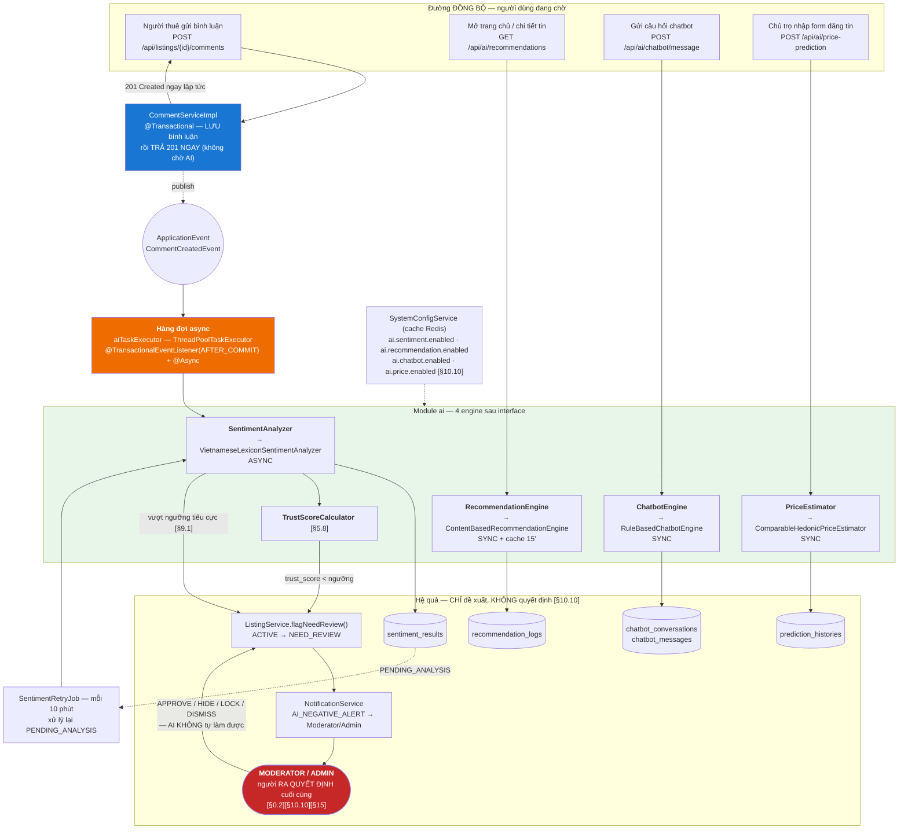

**Vì sao sentiment async còn 3 module kia sync** — quyết định có căn cứ, không tùy tiện:

| Module | Chế độ | Lý do |
|---|---|---|
| **Sentiment** | **ASYNC** bắt buộc | `[§9.1]`: *"AI lỗi hoặc timeout: bình luận **vẫn được lưu**, sentiment ở trạng thái PendingAnalysis"*. Nếu sync, AI chết → người dùng không bình luận được → AI đã **thay thế** nghiệp vụ, vi phạm `[§15]` trục 3. Người dùng cũng không cần chờ kết quả sentiment để thấy bình luận của mình |
| **Recommendation** | SYNC + cache 15' | Kết quả hiển thị ngay trên trang. Có `RecommendationPrecomputeJob` mỗi 6 giờ tính trước cho user hoạt động (canonical §11) + cache `ai.recommendation.cache_ttl_minutes` = 15 → độ trễ thực tế rất thấp. Lỗi → fallback cold start (mục 6.3) |
| **Chatbot** | SYNC | Bản chất hội thoại — người dùng đang chờ câu trả lời. Rule-based nên nhanh (không gọi mạng ngoài) |
| **Price** | SYNC | `[§3.16]`: chủ trọ nhập form → xem giá đề xuất ngay để quyết định. Chỉ là truy vấn comparable + tính median, nhanh |

**"Queue" ở đây là gì** `[§11.6]` *"AI có thể chạy async bằng queue"`:
Hàng đợi là **`LinkedBlockingQueue` bên trong `ThreadPoolTaskExecutor`** (`aiTaskExecutor`, mục 7.3), không phải message broker ngoài (RabbitMQ/Kafka).

| Tiêu chí | In-process queue (**chọn**) | Message broker ngoài |
|---|---|---|
| Thỏa `[§11.6]` "chạy async bằng queue" | ✔ | ✔ |
| Thêm container vào compose | 0 | +1 (canonical §1.3 chốt đúng 5 service) |
| Mất task khi restart backend | Có — **nhưng** `SentimentRetryJob` (mỗi 10 phút) quét `PENDING_ANALYSIS` và xử lý lại → **không mất dữ liệu** | Không |
| Phù hợp `[§0.2]` phạm vi đề án | ✔ | Thừa |

> Điểm quan trọng: **độ bền được bảo đảm bởi DB, không bởi queue.** `SentimentResult` được ghi ngay với `label = PENDING_ANALYSIS` **trước** khi task vào hàng đợi. Backend chết giữa chừng → bản ghi vẫn còn `PENDING_ANALYSIS` → job retry nhặt lại. Đây là lý do in-process queue là đủ, và cũng là lý do canonical §11 có `SentimentRetryJob`.
> Đường nâng cấp lên broker thật: mục 12.

### 6.2. Module 1 — Sentiment `[§9.1]`

| Hạng mục | Nội dung |
|---|---|
| **Interface** | `SentimentAnalyzer` — `SentimentOutput analyze(SentimentInput input)` |
| **Impl** | `VietnameseLexiconSentimentAnalyzer` (canonical §10.1) |
| **Thành phần phụ** | `SentimentLexicon` (từ điển có trọng số, nạp từ `resources/data/`), `NegationHandler`, `IntensifierHandler`, `EmojiHandler`, `TextNormalizer` |
| **Service** | `SentimentService` → `SentimentServiceImpl` (transaction, lưu `sentiment_results`, gọi `TrustScoreService`) |
| **Listener** | `CommentSentimentListener` — `@TransactionalEventListener(phase = AFTER_COMMIT) @Async("aiTaskExecutor")` |

**Input** `[§9.1]`:

| Trường | Kiểu | Nguồn |
|---|---|---|
| `commentId` | `Long` | `comments.id` |
| `listingId` | `Long` | `comments.listing_id` |
| `userId` | `Long` | `comments.user_id` |
| `content` | `String` | `comments.content` (đã sanitize) |
| `commentedAt` | `Instant` | `comments.created_at` |
| `authorAccountAgeDays` | `int` | `now - users.created_at` → trọng số `[§9.1]` |
| `listingSentimentHistory` | `List<SentimentResult>` | *"Lịch sử sentiment của tin"* `[§9.1]` |

**Output** `[§9.1]`:

| Trường | Kiểu | Ghi chú |
|---|---|---|
| `score` | `BigDecimal` ∈ [-1, 1] | canonical §10.1 |
| `label` | `SentimentLabel` | `POSITIVE`, `NEUTRAL`, `NEGATIVE`, `MIXED`, `PENDING_ANALYSIS` (canonical §5) |
| `confidence` | `BigDecimal` ∈ [0, 1] | `[§9.1]` ConfidenceScore |
| `isRiskComment` | `boolean` | `[§9.1]` |
| `suggestedAction` | `SentimentAction` | `NONE`, `WATCH`, `NEED_REVIEW` (canonical §5) — **gợi ý**, không tự thi hành |
| `weight` | `BigDecimal` | 1.0, hoặc `ai.sentiment.new_account_weight` = 0.5 nếu tài khoản < 7 ngày |

**Thuật toán (canonical §10.1):**

```text
1. Chuẩn hóa      : lowercase, bỏ dấu (tùy chọn), map teencode ("ko"→"không", "dc"→"được")
2. Tách token
3. So khớp từ điển có trọng số  → điểm thô mỗi token
4. Xử lý PHỦ ĐỊNH : "không", "chẳng", "chưa" → ĐẢO DẤU trong cửa sổ 3 từ
                    VD: "không sạch sẽ" → sạch sẽ(+0.8) → -0.8
5. Từ TĂNG CƯỜNG  : "rất", "cực kỳ", "quá" → ×1.5
6. Emoji          : 🙂👍❤️ → dương; 😡👎💩 → âm
7. Cụm n-gram     : "không đáng tiền"(âm mạnh), "chủ dễ tính"(dương mạnh)
8. Tổng hợp       : score ∈ [-1,1], confidence theo số token khớp / độ dài
```

**Điều kiện kích hoạt** `[§5.5]` + `[§9.1]`:

| Điều kiện | Cơ chế |
|---|---|
| Có **bình luận mới** | `CommentCreatedEvent` → listener |
| Bình luận **được sửa** | `CommentUpdatedEvent` → phân tích lại, ghi đè `SentimentResult` |
| Admin yêu cầu **phân tích lại** | `POST /api/ai/sentiment/analyze` (`AI_CONFIG_MANAGE`) |
| Job tính lại khi **đổi cấu hình ngưỡng** | `TrustScoreRecalcJob` (02:00 hằng ngày) |
| Retry `PENDING_ANALYSIS` | `SentimentRetryJob` (mỗi 10 phút) |
| `ai.sentiment.enabled = false` | **Bỏ qua hoàn toàn** — bình luận vẫn lưu, sentiment = `PENDING_ANALYSIS` `[§10.10]` *"Bật/tắt từng module AI nếu cần bảo trì"* |

**Ngưỡng hành động — copy canonical §9 (đọc từ `SystemConfig`, KHÔNG hardcode):**

| Điều kiện `[§9.1]` | Config key | Hành động — **luôn là ĐỀ XUẤT** |
|---|---|---|
| ≥ 5 bình luận **và** tỷ lệ tiêu cực ≥ 40% | `ai.sentiment.min_comments_l1` = 5, `ai.sentiment.negative_ratio_l1` = 0.40 | Đánh dấu `NEED_REVIEW` + thông báo Moderator |
| ≥ 10 bình luận **và** tỷ lệ tiêu cực ≥ 50% | `ai.sentiment.min_comments_l2` = 10, `ai.sentiment.negative_ratio_l2` = 0.50 | `AI_NEGATIVE_ALERT` **mức cao** → Dashboard `[§5.6]` |
| Tin đã `NEED_REVIEW` 3 lần / 30 ngày | `ai.sentiment.need_review_count_for_lock` = 3, `.need_review_window_days` = 30 | **ĐỀ XUẤT khóa tin** → Admin quyết định. AI **không** khóa |
| Chủ trọ có 3 tin bị cảnh báo sentiment / 30 ngày | `ai.sentiment.landlord_alert_listing_count` = 3 | **ĐỀ XUẤT kiểm tra tài khoản** → Admin quyết định |

**Xử lý ngoại lệ bắt buộc (canonical §10.1 + `[§9.1]`):**

| Tình huống | Xử lý | Config |
|---|---|---|
| Bình luận quá ngắn | → `NEUTRAL`, **không** tính vào điểm uy tín | `ai.sentiment.min_length` = 10 |
| Vừa khen vừa chê (có cả cụm dương và âm mạnh) | → `MIXED` | — |
| Mỉa mai, confidence < 0.5 | Lưu confidence thấp, **không** kích hoạt hành động nặng | — |
| **AI lỗi / timeout** | Bình luận **vẫn được lưu**; `sentiment = PENDING_ANALYSIS`; `SentimentRetryJob` xử lý lại | — |
| Bình luận bị Moderator đánh dấu spam | **Loại khỏi thống kê** điểm uy tín | — |
| Bình luận từ tài khoản mới (<7 ngày) | Trọng số **0.5** | `ai.sentiment.new_account_days` = 7, `.new_account_weight` = 0.5 |

**Timeout & lỗi:**

| Khía cạnh | Quy tắc |
|---|---|
| Timeout | `ai.sentiment.timeout_ms` = 2000. Vượt → `PENDING_ANALYSIS` — **[BỔ SUNG NGOÀI CANONICAL]** (canonical §10.1 nói "AI lỗi/timeout" nhưng không chốt số) |
| Retry | `SentimentRetryJob` mỗi 10 phút, tối đa `ai.sentiment.max_retry` = 5 lần; quá → giữ `PENDING_ANALYSIS` + log ERROR `[§11.4]` *"Lỗi AI"* — **[BỔ SUNG NGOÀI CANONICAL]** |
| Ảnh hưởng người dùng | **Bằng 0.** Bình luận đã 201 trước khi AI chạy |
| Log | Mọi lần phân tích ghi `sentiment_results` → `AI-07` xem log `[§2.11]`, `AI_LOG_VIEW` |

### 6.3. Module 2 — Recommendation `[§9.2]`

| Hạng mục | Nội dung |
|---|---|
| **Interface** | `RecommendationEngine` — `List<ScoredListing> recommend(RecommendationRequest req)` |
| **Impl** | `ContentBasedRecommendationEngine` (canonical §10.2) — rule-based có trọng số `[§13.2]` |
| **Thành phần phụ** | `UserPreferenceProfileBuilder`, `ListingScorer`, `ColdStartStrategy` |

**Input** `[§9.2]` — xây `UserPreferenceProfile` từ hành vi có **trọng số** (canonical §10.2):

| Nguồn hành vi | Trọng số | Entity |
|---|---|---|
| `ViewHistory` | **1** | `view_histories` |
| `SearchHistory` | **2** | `search_histories` |
| `Favorite` | **3** | `favorites` |
| `ContactLog` | **5** | `contact_logs` |

**7 chiều nhu cầu suy ra — phủ đúng danh sách "Dữ liệu đầu vào" `[§9.2]` (11 mục):**

| # | Chiều `UserPreferenceProfile` | Kiểu | Cách suy ra từ hành vi có trọng số | Mục `[§9.2]` được phủ |
|---|---|---|---|---|
| 1 | `preferredWards` / `preferredDistricts` / `preferredProvince` | `Set<Long>` theo tần suất có trọng số | Gom `ward_id`/`district_id` của tin trong `view_histories`/`favorites`/`contact_logs` + tham số khu vực trong `search_histories`; giữ top‑N (`N = 5`) theo tổng trọng số | *"Khu vực thường xem"*, *"Lịch sử xem tin"*, *"Lịch sử tìm kiếm"*, *"Tin đã lưu"*, *"Tin đã liên hệ"* |
| 2 | `preferredPriceRange` | `[minPrice, maxPrice]` | **Percentile 10–90** của `listings.price` trên tập hành vi có trọng số (mỗi bản ghi được nhân bản theo trọng số khi tính percentile) | *"Khoảng giá thường xem"* |
| 3 | `preferredCategories` | `Set<CategoryCode>` | Tần suất có trọng số của `listings.category_id`; giữ top‑3 | *"Loại phòng thường xem"* |
| 4 | `preferredAmenities` | `Set<Long>` | Tần suất có trọng số của `listing_amenities.amenity_id` + tiện ích được tick trong `search_histories` | *(chi tiết hóa `[§2.4]` SRCH‑06)* |
| 5 | `preferredAreaRange` | `[minAreaM2, maxAreaM2]` | **Percentile 10–90** của `listings.area` trên **cùng** tập hành vi có trọng số như chiều giá; nếu `search_histories` có `areaFrom/areaTo` tường minh thì tham số tìm kiếm **ghi đè** (ý định khai báo mạnh hơn ý định suy diễn) | *"Diện tích quan tâm"* `[§2.4]` SRCH‑04 |
| 6 | `preferredOccupants` (`maxOccupants`) | `Integer` | Lấy **mode** (giá trị xuất hiện nhiều nhất) của `listings.max_occupants` trên tập hành vi; nếu `search_histories` có tham số số người thì ưu tiên tham số đó; đọc từ `user_profiles.preferred_occupants` nếu người dùng đã khai trong hồ sơ | *"Số người ở"* `[§2.4]` SRCH‑07 |
| 7 | `preferredGenderRequirement` | `GenderRequirement` | Ưu tiên 1: cột `user_profiles.preferred_gender_requirement` do người dùng khai `[§2.2]`. Ưu tiên 2: tham số giới tính trong `search_histories` gần nhất. Ưu tiên 3: suy từ `listings.gender_requirement` của các tin `ROOMMATE` đã lưu/liên hệ. Không đủ căn cứ → `ANY` | *"Giới tính nếu là ở ghép"* `[§2.4]` SRCH‑07 |

> **Ba mục còn lại của `[§9.2]` được phủ ở chỗ khác, không phải chiều hồ sơ:** *"Lịch sử xem tin"* / *"Lịch sử tìm kiếm"* là **nguồn** (bảng trọng số ở trên), không phải chiều; *"Tin đang Active trong hệ thống"* là **tập ứng viên** đầu vào của `ListingScorer`, lấy qua `ListingVisibilityService.publicStatuses()` (canonical §5.2) — xem "Bộ lọc bắt buộc" bên dưới.

> **`preferredGenderRequirement` chỉ có nghĩa với tin `ROOMMATE`.** Cột `user_profiles.preferred_gender_requirement` `[§9.2]` được **tiêu thụ tại đây** (`UserPreferenceProfileBuilder` đọc, `ListingScorer` chấm `genderMatch`) — đây là module duy nhất dùng nó, ngoài `search` (SRCH‑07 lọc cứng theo tham số người dùng nhập tại thời điểm tìm). Khác biệt: `search` **lọc cứng**, recommendation **chấm điểm mềm**.

> Thang trọng số 1/2/3/5 phản ánh **mức cam kết**: xem là tò mò, tìm kiếm là có chủ đích, lưu là quan tâm, **liên hệ là tín hiệu mạnh nhất** — người đó thật sự muốn thuê. Đây là hiện thực trực tiếp của `[§9.2]` *"Hệ thống thu thập hành vi hợp lệ"*.

**Công thức chấm điểm (canonical §10.2):**

```text
score = 0.22·locationMatch      // khu vực: ward → district → province
      + 0.20·priceMatch         // khoảng giá ưu tiên (percentile 10–90)
      + 0.12·areaSizeMatch      // diện tích m² quan tâm      [§9.2] "Diện tích quan tâm"
      + 0.12·categoryMatch      // loại tin ưu tiên
      + 0.08·amenityMatch       // tiện ích quan tâm
      + 0.08·occupantMatch      // số người ở                 [§9.2] "Số người ở"
      + 0.06·genderMatch        // giới tính — CHỈ tin ROOMMATE [§9.2] "Giới tính nếu là ở ghép"
      + 0.06·trustScoreNorm     // uy tín tin, chuẩn hóa /100
      + 0.06·freshness          // độ mới
                                // Σ trọng số = 1.00
score = score × promotedBoost   // trần ai.recommendation.promoted_boost = 1.15
```

> **Vì sao tách `areaMatch` cũ thành `locationMatch` + `areaSizeMatch`:** tên `areaMatch` trong công thức 6 số hạng trước đây **nhập nhằng** — "area" vừa có thể đọc là *khu vực hành chính*, vừa có thể đọc là *diện tích m²*. `[§9.2]` liệt kê **cả hai** là dữ liệu đầu vào độc lập (*"Khu vực thường xem"* và *"Diện tích quan tâm"*), nên chúng phải là **hai số hạng riêng**. Đặt tên `locationMatch` (khu vực) và `areaSizeMatch` (diện tích) để không còn chỗ hiểu sai khi code.

**Định nghĩa từng số hạng — mọi số hạng trả về `[0, 1]`:**

| Số hạng | Công thức | Ghi chú |
|---|---|---|
| `locationMatch` | `1.0` nếu trùng `ward` ưu tiên; `0.6` nếu trùng `district`; `0.3` nếu trùng `province`; `0` nếu khác | Thang giảm dần theo độ rộng khu vực — người tìm trọ quan tâm bán kính đi lại `[§3.7]` |
| `priceMatch` | `1.0` nếu `price ∈ [minPrice, maxPrice]`; ngoài khoảng → suy giảm tuyến tính, `0` khi lệch ≥ 50% biên gần nhất | Không cắt cứng: tin lệch giá nhẹ vẫn đáng gợi ý |
| `areaSizeMatch` | `1.0` nếu `area ∈ [minAreaM2, maxAreaM2]`; ngoài khoảng → suy giảm tuyến tính, `0` khi lệch ≥ 50% biên gần nhất | Cùng dạng hàm với `priceMatch` để dễ giải thích và dễ test |
| `categoryMatch` | `1.0` nếu `category` ∈ top‑3 ưu tiên; `0.5` nếu cùng **nhóm** (`BOARDING_HOUSE` ↔ `MINI_APARTMENT`); `0` nếu khác | |
| `amenityMatch` | `\|A ∩ P\| / \|P\|` — `A` = tiện ích của tin, `P` = tiện ích quan tâm. `P = ∅` → `0.5` (trung tính) | Jaccard một chiều: không phạt tin có **thừa** tiện ích |
| `occupantMatch` | `1.0` nếu `listing.max_occupants >= profile.preferredOccupants`; `0.5` nếu thiếu **đúng 1** chỗ; `0` nếu thiếu ≥ 2. `preferredOccupants = null` → `0.5` (trung tính) | Bất đối xứng có chủ đích: phòng **rộng hơn** nhu cầu vẫn dùng được, phòng **chật hơn** thì không `[§2.4]` SRCH‑07 |
| `genderMatch` | Chỉ tính khi `listing.category = ROOMMATE`. `1.0` nếu `listing.gender_requirement = ANY` **hoặc** trùng `profile.preferredGenderRequirement`; `0` nếu xung khắc (VD hồ sơ `FEMALE_ONLY` × tin `MALE_ONLY`) | Xem quy tắc chuẩn hóa lại trọng số ngay dưới |
| `trustScoreNorm` | `listings.trust_score / trust.max` (= 100) | Trục 2 `[§15]`: tin uy tín cao được ưu tiên |
| `freshness` | `max(0, 1 − ageDays / listing.display_days)` — `display_days` = 30 | Tin càng mới càng cao; hết hạn hiển thị → `0` |

**Quy tắc chuẩn hóa lại trọng số khi số hạng không áp dụng — bắt buộc:**

`genderMatch` **không có nghĩa** với tin không phải `ROOMMATE` (một căn hộ nguyên căn không có "yêu cầu giới tính người ở ghép"). Nếu để mặc định `1.0` cho mọi tin non‑`ROOMMATE`, chúng được cộng không `0.06` điểm so với tin `ROOMMATE` — **thiên lệch có hệ thống**, sai `[§9.2]` *"Không thiên vị"*.

```text
applicableTerms(listing) := tất cả số hạng, TRỪ genderMatch nếu listing.category != ROOMMATE
W(listing)               := Σ trọng số của applicableTerms(listing)
score(listing)           := ( Σ_{t ∈ applicableTerms} w_t · t(listing) ) / W(listing)
```

Với tin `ROOMMATE`: `W = 1.00` → công thức không đổi.
Với tin **không** phải `ROOMMATE`: `W = 0.94` → 8 số hạng còn lại được **chia lại tỉ lệ** cho tổng về đúng `1.00`.
Nhờ vậy `score` của **mọi** tin luôn nằm trong `[0, 1]` **trước** khi nhân `promotedBoost`, và tin `ROOMMATE` với tin thường **so sánh được với nhau** trên cùng thang. Hiện thực: `ListingScorer.score()` cộng dồn `(w_t, t)` vào một accumulator rồi chia cho tổng `w_t` đã cộng — không viết cứng `0.94` ở bất kỳ đâu.

> **Vì sao trần boost là 1.15, không phải 2.0:** `[§9.2]` *"Tin trả phí có thể tăng thứ hạng **nhưng vẫn cần phù hợp nhu cầu**"*; `[§3.7]` *"phải đảm bảo không làm mất tính liên quan"*; `[§10.6]` *"Mức ưu tiên cần có giới hạn để tránh làm sai kết quả tìm kiếm"*; `[§3.14]` *"Không cho phép tin vi phạm dùng tiền để vượt kiểm duyệt"*. Trần 1.15 nghĩa là tiền chỉ thắng khi hai tin **đã gần ngang nhau** về độ phù hợp — nó không thể kéo một tin lệch nhu cầu lên đầu. Đây là hiện thực của trục 1 `[§15]` "tin đăng chất lượng và **dễ tìm**".

**Output:**

| Trường | Ghi chú |
|---|---|
| `items[]` | `ListingSummaryResponse` + `score` + `reason` (giải thích được `[§9.2]`) |
| `source` | `RecommendationSource`: `HOMEPAGE`, `SIMILAR_LISTING`, `AFTER_FAVORITE`, `LOW_RESULT_SEARCH`, `CHATBOT`, `NOTIFICATION` (canonical §5) |
| `isColdStart` | `boolean` |
| Kích thước | `ai.recommendation.size` = 12 |

**Điều kiện kích hoạt `[§5.5]` + "khi nào hiển thị gợi ý" `[§9.2]`:**

| Vị trí | `RecommendationSource` |
|---|---|
| Trang chủ sau khi đăng nhập | `HOMEPAGE` |
| Trang chi tiết tin — "Tin tương tự" | `SIMILAR_LISTING` |
| Sau khi người dùng **lưu** một tin | `AFTER_FAVORITE` |
| Sau khi tìm kiếm **ít kết quả** | `LOW_RESULT_SEARCH` |
| Trong chatbot khi đã xác định nhu cầu | `CHATBOT` |
| Trong email / in-app notification **nếu có tin mới phù hợp** | `NOTIFICATION` — sinh bởi **`NewMatchingListingNotifyJob`** (mục 7.1), 07:30 hằng ngày. Đây là **tác nhân duy nhất** sinh source này |
| Job định kỳ tính trước | `RecommendationPrecomputeJob` mỗi 6 giờ (canonical §11) — **không** sinh `RecommendationSource` riêng: nó nạp sẵn cache cho `HOMEPAGE` |

> **`NOTIFICATION` là vị trí thứ 6 trong 6 vị trí `[§9.2]` "Khi nào hiển thị gợi ý"** — và là vị trí duy nhất **không** do người dùng kích hoạt: 5 vị trí kia là *pull* (người dùng mở trang → hệ thống trả gợi ý), vị trí này là *push* (hệ thống chủ động tìm đến người dùng). Push cần một **job** đứng sau; nếu không có job, giá trị enum `NOTIFICATION` là **code chết** và nghiệp vụ *"nếu có tin mới phù hợp"* không bao giờ chạy. Đặc tả job ở mục 7.1.

> **Phân biệt với `FOLLOWED_LANDLORD_NEW_LISTING`** — hai thứ dễ nhầm nhưng **khác nghiệp vụ hoàn toàn**:
>
> | | `FOLLOWED_LANDLORD_NEW_LISTING` | `NEW_MATCHING_LISTING` |
> |---|---|---|
> | Căn cứ | `FOLLOW-02` `[§2.5]` | `[§9.2]` *"nếu có tin mới phù hợp"* |
> | Điều kiện gửi | User **theo dõi chủ trọ** đó | Tin **khớp hồ sơ nhu cầu** của user |
> | Ai quyết định | Người dùng (bấm "Theo dõi") | `RecommendationEngine` (điểm ≥ ngưỡng) |
> | Module sinh | `user` (`FollowService`) | `ai` (`NewMatchingListingNotifyJob`) |
> | Cần AI? | Không | Có |
>
> Một tin có thể kích hoạt **cả hai**; quy tắc khử trùng ở mục 7.1 đảm bảo người dùng không nhận 2 thông báo cho cùng một tin.

**Bộ lọc bắt buộc (canonical §10.2 + `[§9.2]`):**

| Luật | Hiện thực |
|---|---|
| Loại tin `HIDDEN`/`EXPIRED`/`LOCKED`/`CLOSED`/`DELETED` | **Bắt buộc dùng `ListingVisibilityService.publicStatuses()`** (canonical §5.2) — không viết cứng `status = 'ACTIVE'` |
| Loại tin user **đã xem gần đây** (chống lặp) | `[§9.2]` *"Không gợi ý lặp lại quá nhiều một tin"* |
| Loại tin của **chính user** | Không gợi ý tin của mình |
| Ghi `RecommendationLog` | `[§9.2]` *"cần lưu RecommendationLog để giải thích và đánh giá hiệu quả"* |

**Ghi `RecommendationLog` — 9 điểm thành phần phải khớp 1‑1 với 9 số hạng công thức:**

Bảng `recommendation_logs` (02_THIET_KE_DATABASE.md) lưu **từng** điểm thành phần, không chỉ điểm tổng. Đây là điều kiện để `[§9.2]` *"giải thích và đánh giá hiệu quả"* có thể thực hiện được — Admin xem log AI (`AI-07`, permission `AI_LOG_VIEW`) phải trả lời được câu *"vì sao tin này được gợi ý"*, mà điều đó bất khả thi nếu chỉ có điểm tổng.

| Cột `recommendation_logs` | Số hạng | Ghi chú |
|---|---|---|
| `location_score` | `locationMatch` | Đổi tên từ `area_score` — xem ghi chú "vì sao tách" ở trên |
| `price_score` | `priceMatch` | |
| `area_size_score` | `areaSizeMatch` | Cột bổ sung theo `[§9.2]` *"Diện tích quan tâm"* |
| `category_score` | `categoryMatch` | |
| `amenity_score` | `amenityMatch` | |
| `occupant_score` | `occupantMatch` | Cột bổ sung theo `[§9.2]` *"Số người ở"* |
| `gender_score` | `genderMatch` | Cột bổ sung theo `[§9.2]` *"Giới tính nếu là ở ghép"*. **`NULL`** khi tin không phải `ROOMMATE` (số hạng không áp dụng) — `NULL` ở đây mang nghĩa *"không tính"*, khác hẳn `0` nghĩa *"tính và trượt"* |
| `trust_score_norm` | `trustScoreNorm` | |
| `freshness_score` | `freshness` | |
| `applied_weight_sum` | `W(listing)` | `1.00` cho tin `ROOMMATE`, `0.94` cho tin còn lại. Lưu lại để **tái dựng** được điểm tổng từ các thành phần khi đối chiếu log |
| `promoted_boost` | hệ số đã nhân | `1.0` nếu tin không được đẩy |
| `final_score` | `score` sau boost | |

> **Vì sao lưu cả `applied_weight_sum`:** không có nó, người đọc log không thể kiểm tra `final_score` có khớp các thành phần hay không (vì mẫu số thay đổi theo `category`) — log sẽ "giải thích được" trên danh nghĩa nhưng **không kiểm chứng được** trên thực tế. Trục 3 `[§15]` yêu cầu AI *"lưu log để giải thích được"*, và một lời giải thích không kiểm chứng được thì không phải lời giải thích.

**Cold start** `[§9.2]` — người dùng mới **hoặc khách chưa đăng nhập**: tin mới nhất + phổ biến trong khu vực đang xem + theo filter hiện tại + danh mục phổ biến (canonical §10.2).

**Timeout & lỗi:**

| Tình huống | Xử lý |
|---|---|
| Engine ném exception | **Fallback về cold start** — trang vẫn có tin để hiển thị, không vỡ layout |
| Timeout `ai.recommendation.timeout_ms` = 1500 — **[BỔ SUNG NGOÀI CANONICAL]** | Fallback cold start |
| `ai.recommendation.enabled = false` `[§10.10]` | Trả cold start (tin mới nhất) — **không** trả lỗi. Người dùng vẫn dùng web bình thường |
| Cache | Key theo `userId` + `source` + `contextHash`, TTL `ai.recommendation.cache_ttl_minutes` = 15 (mục 8) |

### 6.4. Module 3 — Chatbot `[§9.3]` `[§3.15]`

| Hạng mục | Nội dung |
|---|---|
| **Interface** | `ChatbotEngine` — `ChatbotReply reply(ChatbotContext ctx, String message)` |
| **Impl** | `RuleBasedChatbotEngine` (canonical §10.3) |
| **Thành phần phụ** | `IntentClassifier` (từ khóa + regex có trọng số), `SlotExtractor`, `ChatbotResponseBuilder`, `FaqKnowledgeBase` |

**Input:** `conversationId`, `userId` (nullable — khách dùng được `[§1.2]`), `message`, `slots` đã thu thập ở lượt trước, `turnCount`.

**Output:**

| Trường | Ghi chú |
|---|---|
| `intent` | `ChatbotIntent`: `FIND_ROOM`, `HOW_TO_POST`, `GLOSSARY`, `FAQ`, `GREETING`, `OUT_OF_SCOPE`, `SENSITIVE`, `UNKNOWN` (canonical §5) |
| `reply` | Câu trả lời tiếng Việt |
| `slots` | Slot đã thu thập tích lũy |
| `listings[]` | `ListingSummaryResponse` — **chỉ tin public** |
| `quickReplies[]` | Gợi ý bấm nhanh |
| `needMoreInfo` | Có hỏi lại không |

**Luồng: intent → slot filling → search** (canonical §10.3):

```text
1. IntentClassifier: từ khóa + regex có trọng số → ChatbotIntent
2. Nếu FIND_ROOM → SlotExtractor trích:
     giá        : "dưới 4 triệu" → priceTo=4_000_000 ; "3-5tr" → [3tr, 5tr]
     khu vực    : "Quận 1" → districtId (khớp catalog)
     diện tích · số người · giới tính · thú cưng · giờ giấc · chỗ để xe · nội thất
3. Thiếu slot quan trọng → hỏi lại, TỐI ĐA ai.chatbot.max_clarify_turns = 3 lượt [§9.3]
4. Đủ slot → gọi ListingSearchService (module search)
5. Không kết quả → đề xuất NỚI giá / khu vực / diện tích [§9.3]
6. Ghi ChatbotConversation + ChatbotMessage → log câu hỏi phổ biến để cải thiện FAQ [§3.15]
```

**Ràng buộc cứng (canonical §10.3 + `[§3.15]` + `[§9.3]`) — mỗi dòng là một luật kiểm thử được:**

| Luật | Hiện thực |
|---|---|
| **Chỉ trả tin public** | Gọi `ListingSearchService`, vốn dùng `ListingVisibilityService.publicStatuses()` (canonical §5.2). Chatbot **không** có đường truy cập DB riêng |
| **Không bịa thông tin ngoài DB** | `ChatbotResponseBuilder` chỉ render từ `ListingSummaryResponse` trả về. Không có LLM sinh văn bản tự do → **về mặt kiến trúc, chatbot không thể bịa** |
| Không cam kết còn phòng | `[§9.3]` *"Tự cam kết phòng còn trống"* bị cấm. Template luôn kèm "Vui lòng liên hệ chủ trọ để xác nhận" |
| Không tư vấn pháp lý | Intent `OUT_OF_SCOPE` → trả lời giới hạn hỗ trợ |
| Không đặt cọc / thương lượng thay người dùng | Không có endpoint nào cho việc đó `[§13.3]` |
| Không tạo tin thay chủ trọ | `[§9.3]` |
| Hỏi lại tối đa 3 lượt | `ai.chatbot.max_clarify_turns` = 3 |
| Nội dung nhạy cảm | Intent `SENSITIVE` → **từ chối lịch sự** và hướng về chức năng tìm trọ `[§9.3]` |
| Rate limit | 30/phút (`spam.chatbot.per_minute`) |

> **Vì sao rule-based là lựa chọn ĐÚNG chứ không phải giới hạn:** ràng buộc gốc mạnh nhất là `[§3.15]` *"Chatbot **không tự tạo thông tin không có trong dữ liệu tin đăng**"*. Một LLM sinh văn bản tự do **có thể** vi phạm điều này (hallucination) và ta không có cách chặn tuyệt đối. Rule-based + template render từ kết quả truy vấn thì **không thể** vi phạm — sự đảm bảo đến từ kiến trúc, không đến từ hy vọng. Với một hệ thống mà người dùng ra quyết định thuê nhà dựa trên thông tin nhận được, đây là đánh đổi đúng.

**Timeout & lỗi:**

| Tình huống | Xử lý |
|---|---|
| Engine lỗi | Trả lời fallback: "Xin lỗi, tôi chưa hiểu. Bạn thử dùng bộ lọc tìm kiếm nhé" + link `/tim-kiem`. **Không** trả 500 trắng màn hình |
| `SearchService` lỗi | Thông báo lịch sự + gợi ý dùng trang tìm kiếm |
| `ai.chatbot.enabled = false` `[§10.10]` | Widget chatbot **ẩn hoàn toàn** ở frontend; endpoint trả `503 AI_SERVICE_UNAVAILABLE` (canonical §7.2) |
| Timeout `ai.chatbot.timeout_ms` = 3000 — **[BỔ SUNG NGOÀI CANONICAL]** | Fallback |

### 6.5. Module 4 — Price Prediction `[§9.4]`

| Hạng mục | Nội dung |
|---|---|
| **Interface** | `PriceEstimator` — `PriceEstimate estimate(PriceEstimateInput input)` |
| **Impl** | `ComparableHedonicPriceEstimator` (canonical §10.4) |
| **Thành phần phụ** | `ComparableFinder`, `HedonicAdjuster`, `ConfidenceCalculator`, `StatisticsUtil` |

**Input** `[§9.4]`: khu vực (`wardId`/`districtId`/`provinceId`), diện tích, loại nhà (`categoryId`), số phòng, số toilet, nội thất (`FurnitureStatus`), mặt tiền/hẻm, khoảng cách tới trung tâm (`GeoUtil`), tiện ích, tình trạng phòng.

**Output** `[§9.4]`:

| Trường | Ghi chú |
|---|---|
| `suggestedPrice` | `BigDecimal` — giá đề xuất (median) |
| `priceLow` / `priceMedium` / `priceHigh` | Percentile **25 / 50 / 75** (canonical §10.4) |
| `confidence` | `PriceConfidence`: `HIGH`, `MEDIUM`, `LOW`, `INSUFFICIENT_DATA` (canonical §5) |
| `sampleSize` | Số comparable dùng — minh bạch với chủ trọ |
| `explanation` | `[§9.4]` *"Giá cao hơn do gần trung tâm và có nội thất"* — sinh từ hệ số hedonic đã áp dụng |
| `deviationRatio` | `|giá nhập − giá đề xuất| / giá đề xuất` |
| `flagged` | `deviationRatio > ai.price.deviation_flag_ratio` (0.35) |

**Thuật toán 6 bước (canonical §10.4):**

| Bước | Nội dung |
|---|---|
| 1 | Lấy **comparable**: cùng `ward` (nới dần `district` → `province` nếu thiếu mẫu), cùng `category`, diện tích **±30%**, tin `ACTIVE`/`CLOSED` trong **180 ngày** |
| 2 | Nếu `n < ai.price.min_samples` (=8) → **`INSUFFICIENT_DATA`, KHÔNG dự đoán** `[§9.4]` |
| 3 | Giá cơ sở = `median(price/m²) × diện tích` |
| 4 | Điều chỉnh **hedonic** (hệ số cấu hình được): nội thất đầy đủ **+12%**, toilet riêng **+8%**, thang máy **+7%**, chỗ để xe **+5%**, giờ tự do **+3%**, mặt tiền **+15%**, khoảng cách trung tâm |
| 5 | Khoảng = percentile **25 / 50 / 75**. Confidence theo `n` và độ phân tán (**IQR/median**) |
| 6 | `deviationRatio > 0.35` → **ghi flag**, cảnh báo **mềm**, **TUYỆT ĐỐI KHÔNG CHẶN ĐĂNG TIN** `[§3.3]` `[§9.4]`. Lưu `PredictionHistory` **mọi lần** |

> **Vì sao dùng median chứ không phải mean:** thị trường thuê trọ có outlier mạnh (một căn hộ cao cấp lẫn trong dãy trọ). Mean bị outlier kéo lệch; median không. Tương tự, dùng **IQR/median** đo phân tán thay vì độ lệch chuẩn. Đây là lý do `min_samples` = 8 là đủ — với thống kê thứ hạng, 8 mẫu cho median ổn định hơn nhiều so với mean.
>
> **Vì sao `n < 8` thì KHÔNG dự đoán thay vì dự đoán kèm "độ tin cậy thấp":** `[§9.4]` *"Nếu dữ liệu đầu vào thiếu hoặc quá khác thường, hệ thống **không dự đoán** hoặc báo độ tin cậy thấp"*. Chọn "không dự đoán" vì một con số hiện lên màn hình sẽ được chủ trọ tin, bất kể nhãn cảnh báo bên cạnh. Thà không nói còn hơn nói sai — đúng `[§9.4]` *"Không hiển thị AI như nguồn đảm bảo chính xác tuyệt đối"*.

**Điều kiện kích hoạt `[§5.5]` + `[§5.9]`:**

| Sự kiện | Nguồn |
|---|---|
| Chủ trọ nhập đủ thông tin tin đăng | `[§5.5]`, `[§3.3]` bước 8 |
| Sửa các trường ảnh hưởng giá | `[§5.5]` |
| Đổi **khu vực** | `[§5.9]` |
| Đổi **diện tích** | `[§5.9]` |
| Đổi **loại nhà** | `[§5.9]` |
| Đổi **số phòng / số toilet** | `[§5.9]` |
| Đổi **nội thất hoặc tiện ích quan trọng** | `[§5.9]` |
| Admin cập nhật mô hình / cấu hình vùng giá | `[§5.9]` — đổi `ai.price.*` |

**Quy tắc bất khả xâm phạm** `[§3.16]` `[§9.4]`:

| Luật | Hệ quả kiến trúc |
|---|---|
| Giá AI **chỉ là tham khảo**, không bắt buộc | `PricePredictionResponse` là dữ liệu hiển thị; `CreateListingRequest.price` **không** validate theo giá AI |
| **Không chặn đăng tin** chỉ vì giá khác dự đoán | Không có `@AssertTrue` nào so `price` với `suggestedPrice`. `ListingServiceImpl` **không** gọi `PriceEstimator` trong đường ghi |
| Giá lệch lớn → **đánh dấu cần kiểm duyệt** | Ghi `flagged` + `deviationRatio` → Admin lọc `[§9.4]` *"Admin có thể dùng danh sách tin lệch giá lớn để kiểm duyệt"* |
| Lưu `PredictionHistory` mọi lần | `[§3.16]` *"Kết quả dự đoán cần lưu để phục vụ báo cáo và đánh giá chất lượng AI"* |

**Timeout & lỗi:**

| Tình huống | Xử lý |
|---|---|
| Không đủ mẫu | `INSUFFICIENT_DATA` → FE hiện "Chưa đủ dữ liệu khu vực này để đưa giá tham khảo" `[§3.16]` |
| Engine lỗi / timeout `ai.price.timeout_ms` = 2000 — **[BỔ SUNG NGOÀI CANONICAL]** | `PricePredictionPanel` hiện trạng thái lỗi nhẹ. **Form đăng tin vẫn submit được** — đây là điểm bắt buộc |
| `ai.price.enabled = false` `[§10.10]` | Panel ẩn; endpoint trả `503 AI_SERVICE_UNAVAILABLE` |

### 6.6. Nguyên tắc: AI hỗ trợ, KHÔNG thay thế kiểm duyệt con người `[§0.2]` `[§10.10]` `[§15]`

Ba câu nguồn:

> `[§0.2]`: *"AI ở mức **hỗ trợ quyết định**, không thay thế hoàn toàn người kiểm duyệt."*
> `[§10.10]`: *"AI không tự khóa tài khoản nếu chưa có cấu hình rõ. **Các quyết định nặng cần Admin/Moderator xác nhận**. Mọi thay đổi cấu hình AI cần audit log."*
> `[§15]`: *"AI hỗ trợ trải nghiệm nhưng **không thay thế kiểm duyệt con người**."*

Canonical §10 chốt: *"AI **không bao giờ** tự khóa tài khoản; chỉ đề xuất `NEED_REVIEW` + cảnh báo."*

**Nguyên tắc này được thi hành bằng KIẾN TRÚC, không bằng kỷ luật lập trình viên:**

| # | Cơ chế | Chi tiết |
|---|---|---|
| 1 | **AI không có quyền `LOCK`** | Bảng chuyển trạng thái canonical §5.1: `LOCK` có Actor = **`ADMIN`**. `FLAG_NEED_REVIEW` có Actor = `SYSTEM`/`MODERATOR`. `ListingStateMachine` kiểm tra actor → **module `ai` gọi `LOCK` sẽ ném `BusinessRuleViolationException`**. Không phải quy ước — là code chặn |
| 2 | **AI không có quyền `USER_MANAGE`** | Ma trận canonical §4.2: `USER_MANAGE` chỉ `ADMIN`. `SYSTEM` không phải role người → không có authority này |
| 3 | Ranh giới enum | `SentimentAction` chỉ có `NONE`, `WATCH`, `NEED_REVIEW` — **không có** `LOCK`/`BAN`. Enum không cho phép diễn đạt ý định khóa |
| 4 | Ranh giới ngôn từ | Ngưỡng nặng nhất trong `[§9.1]` là ***"ĐỀ XUẤT khóa tin"*** và ***"ĐỀ XUẤT kiểm tra tài khoản"*** — không phải "khóa tin" |
| 5 | Người là mắt xích cuối | Mọi cảnh báo AI → `Notification` `AI_NEGATIVE_ALERT` → Dashboard Moderator/Admin `[§5.6]`. Hành động thật (`APPROVE`/`HIDE`/`LOCK`/`DISMISS`) do người bấm, ghi `ModerationAction` + `AuditLog` |
| 6 | Tắt được | `ai.*.enabled` = false → hệ thống **vẫn chạy đủ nghiệp vụ** `[§10.10]`. Nếu AI mà tắt đi làm hệ thống hỏng thì AI đã **thay thế** nghiệp vụ chứ không **hỗ trợ** |
| 7 | Giải thích được | `sentiment_results`, `recommendation_logs`, `prediction_histories`, `chatbot_messages` — Admin xem log `AI-07`, `AI_LOG_VIEW`. Không có "hộp đen" |
| 8 | Đổi cấu hình AI → audit | `AuditAction.AI_CONFIG_CHANGE` `[§10.10]`, `[§11.4]` |

**Ranh giới quyền của AI — bảng dứt khoát:**

| AI **ĐƯỢC** | AI **KHÔNG BAO GIỜ ĐƯỢC** |
|---|---|
| Gắn `SentimentLabel` cho bình luận | Xóa / sửa / ẩn bình luận |
| Tính lại `trust_score` tin và chủ trọ `[§5.7]` | Khóa tin (`LOCK`) |
| Đề xuất `ACTIVE → NEED_REVIEW` (`FLAG_NEED_REVIEW`) | Khóa tài khoản (`UserStatus.LOCKED`) |
| Gửi cảnh báo `AI_NEGATIVE_ALERT` tới Moderator/Admin | Từ chối tin (`REJECT`) |
| Gợi ý tin, trả lời chatbot, đề xuất giá | **Chặn đăng tin** vì giá lệch `[§3.3]` `[§9.4]` |
| Ghi `flagged` cho tin lệch giá | Duyệt tin tự động (chỉ `listing.auto_approve.trusted_landlord` — **mặc định `false`**, và là quyết định của **Admin qua config**, không phải của AI) |
| Ghi log để người xem lại | Ẩn hành vi của mình khỏi log |

> **Ghi chú về `listing.auto_approve.trusted_landlord`** (canonical §9, mặc định `false`): `[§3.3]` luồng phụ có nêu *"Nếu chủ trọ đã được xác thực uy tín, hệ thống có thể tự động duyệt tin ít rủi ro"*. Đây là **rule cấu hình do Admin bật**, dựa trên trạng thái xác thực thủ công + `trust_score` — **không** phải AI quyết định. Mặc định `false` đúng tinh thần `[§15]` trục 3. Khi bật, `ModerationAction` vẫn được ghi với actor `SYSTEM` để truy vết.

### 6.7. Vì sao rule-based/thống kê trong Java thay vì service ML riêng

**Quyết định: cả 4 module AI hiện thực bằng rule-based/thống kê, viết bằng Java, chạy trong tiến trình Spring Boot.** Không có service Python/ML, không có model training pipeline, không có container thứ 6.

**Căn cứ 1 — `[§13.2]` nói thẳng ra mức triển khai:**

| Trích dẫn `[§13.2]` | Ý nghĩa |
|---|---|
| Recommendation: *"Dùng **rule-based kết hợp điểm hành vi**, không cần thuật toán phức tạp"* | Chốt luôn phương pháp |
| Price Prediction: *"Hiển thị **khoảng giá tham khảo**, không cần giải thích **ML sâu**"* | Chốt luôn đầu ra |

Đây không phải suy diễn — tài liệu nghiệp vụ đã chọn sẵn.

**Căn cứ 2 — `[§0.2]` phạm vi:** *"AI ở mức hỗ trợ quyết định"*. Giá trị của đồ án nằm ở **nghiệp vụ AI được tích hợp đúng chỗ, đúng ngưỡng, có log, tắt được, không vượt quyền** — không nằm ở độ tinh vi của mô hình.

**Căn cứ 3 — vấn đề dữ liệu lạnh (quyết định nhất):** ML giám sát cần **dữ liệu huấn luyện có nhãn**. Hệ thống mới triển khai có **0 bình luận đã gán nhãn cảm xúc**, **0 giao dịch thuê thành công**. Không có tập huấn luyện thì không có mô hình — bất kể chọn thuật toán gì. Rule-based/thống kê **chạy đúng từ ngày đầu tiên với 0 dữ liệu lịch sử**, và cải thiện dần khi dữ liệu tích lũy (`ComparableFinder` càng nhiều comparable càng chính xác). Đây là lập luận kỹ thuật, không phải lập luận "cho dễ".

**Căn cứ 4 — ràng buộc "không bịa" là ràng buộc kiến trúc:** `[§3.15]` cấm chatbot tạo thông tin ngoài DB; `[§9.4]` cấm trình bày AI như nguồn chính xác tuyệt đối. Rule-based cho **đảm bảo cứng**; mô hình sinh chỉ cho **xác suất**. Với hệ thống mà người dùng ra quyết định thuê nhà, đảm bảo cứng thắng.

**Căn cứ 5 — giải thích được `[§9.2]` `[§9.4]` `[§10.10]`:** yêu cầu gốc đòi *"RecommendationLog để **giải thích** và đánh giá hiệu quả"* và *"Gợi ý **giải thích đơn giản**: 'Giá cao hơn do gần trung tâm và có nội thất'"*. Với công thức có trọng số tường minh, `reason` sinh ra **trực tiếp từ các số hạng của công thức**. Với mạng nơ-ron, phải thêm cả LIME/SHAP — nhiều công sức hơn để đạt kết quả kém trực quan hơn.

**Căn cứ 6 — chi phí vận hành trong `[§0.2]`:** canonical §1.3 chốt `docker compose up --build` dựng **5 service**. Service ML riêng = +1 container, +runtime Python, +HTTP client, +xử lý timeout/retry liên tiến trình, +versioning model — đổi lại lợi ích gần bằng 0 khi không có dữ liệu huấn luyện.

**Bảng so sánh:**

| Tiêu chí | Rule-based/thống kê trong Java (**chọn**) | Service ML riêng (Python) | LLM API bên ngoài |
|---|---|---|---|
| Chạy được với 0 dữ liệu lịch sử | ✔ | ✘ (cần tập huấn luyện) | ✔ |
| Thỏa `[§13.2]` "rule-based", "không ML sâu" | ✔ | ✘ (vượt mức) | ✘ (vượt mức) |
| Đảm bảo cứng "không bịa" `[§3.15]` | ✔ (kiến trúc) | ◐ | ✘ (hallucination) |
| Giải thích được `[§9.2]` `[§9.4]` | ✔ (trọng số tường minh) | ◐ (cần XAI) | ✘ |
| Số container thêm | 0 | +1 | 0 (nhưng phụ thuộc mạng ngoài) |
| Độ trễ | ms (in-process) | +HTTP round-trip | +mạng ngoài, biến động |
| Chi phí tiền | 0 | 0 | Trả theo token |
| Hoạt động offline / khi chấm đồ án không có mạng | ✔ | ✔ | ✘ **rủi ro chí mạng** |
| Đường nâng cấp | Thay impl sau interface (mục 12) | — | — |

**Đường nâng cấp được giữ mở (`[§11.6]`):** cả 4 engine nằm **sau interface** (`SentimentAnalyzer`, `RecommendationEngine`, `ChatbotEngine`, `PriceEstimator`). Nâng cấp sang ML thật = viết impl mới (VD `PhoBertSentimentAnalyzer` gọi HTTP tới service Python) + đổi `@Primary`/config. **Không** phải sửa `CommentServiceImpl`, không phải sửa controller, không phải sửa DB. Đây chính là giá trị của việc canonical §10 chốt "interface + impl" ngay từ đầu — kiến trúc đã trả trước chi phí cho khả năng thay thế.

---

## 7. Xử lý bất đồng bộ & job nền

### 7.1. Bảng job (10 job canonical §11 + 1 job bổ sung)

`[§11.3]` *"Dùng job nền cho AI, email, hết hạn tin"*; `[§5.2]` chốt nghiệp vụ hết hạn.

> 8 job đầu **copy nguyên** từ canonical §11. Job thứ 9 (`NewMatchingListingNotifyJob`) là **[BỔ SUNG NGOÀI CANONICAL]** bắt buộc — lý do ngay dưới bảng, đặc tả đầy đủ ở mục 7.4.

| Job | Lịch | Cron expression | Việc |
|---|---|---|---|
| `ListingExpiryJob` | mỗi giờ | `0 0 * * * *` | `ACTIVE`/`NEED_REVIEW` quá `expired_at` → `EXPIRED` `[§5.2]` |
| `ListingExpiryReminderJob` | 08:00 hằng ngày | `0 0 8 * * *` | Nhắc trước **3 ngày** và **1 ngày** `[§5.2]` |
| `TrustScoreRecalcJob` | 02:00 hằng ngày | `0 0 2 * * *` | Tính lại điểm uy tín tin + chủ trọ `[§5.7]` |
| `SentimentRetryJob` | mỗi 10 phút | `0 */10 * * * *` | Xử lý lại `PENDING_ANALYSIS` `[§9.1]` |
| `RecommendationPrecomputeJob` | mỗi 6 giờ | `0 0 */6 * * *` | Tính trước gợi ý cho user hoạt động `[§5.5]` |
| `NewMatchingListingNotifyJob` | 07:30 hằng ngày | `0 30 7 * * *` | Quét tin **mới `ACTIVE` trong 24h**, đối chiếu hồ sơ nhu cầu → `Notification` `NEW_MATCHING_LISTING` (in-app + email) `[§9.2]` |
| `PromotionExpiryJob` | mỗi giờ | `0 15 * * * *` | `PromotionSubscription` hết hạn → `EXPIRED` |
| `TokenCleanupJob` | 03:00 hằng ngày | `0 0 3 * * *` | Xóa refresh/reset token hết hạn |
| `PaymentReconcileJob` | mỗi 15 phút | `0 */15 * * * *` | `PENDING` quá 30 phút → `FAILED` `[§3.14]` |

> **`NewMatchingListingNotifyJob` là job thứ 9 — [BỔ SUNG NGOÀI CANONICAL]** (canonical §11 liệt kê 10 job; đề nghị review bổ sung — xem mục 15.1). **Bắt buộc phải có**, không phải tùy chọn: `[§9.2]` *"Khi nào hiển thị gợi ý"* liệt kê 6 vị trí, trong đó vị trí thứ 6 là *"Trong email/in-app notification **nếu có tin mới phù hợp**"*. Không có job này thì giá trị `RecommendationSource.NOTIFICATION` (canonical §5) **không có tác nhân nào sinh ra** → enum chết, nghiệp vụ không bao giờ chạy. Job này chính là tác nhân đó.
>
> Cây package canonical §3 có tên `NotificationDigestJob` trong `scheduler/` nhưng **không được đặc tả** ở bất kỳ tài liệu nào. Chốt: `NotificationDigestJob` **đổi tên thành `NewMatchingListingNotifyJob`** — tên mới nói đúng việc nó làm. Đây không phải job "digest" (gom nhiều thông báo cũ thành một email tổng hợp — nghiệp vụ đó **không** có trong `[§2.10]` NOTI-01..06), mà là job **đối sánh tin mới với nhu cầu**. Giữ tên `NotificationDigestJob` sẽ tạo một job không ai biết phải làm gì, và để lại vị trí thứ 6 của `[§9.2]` không có ai hiện thực.

**Chi tiết thi hành từng job:**

| Job | Truy vấn nguồn | Hành động | Ràng buộc |
|---|---|---|---|
| `ListingExpiryJob` | `status IN (ACTIVE, NEED_REVIEW) AND expired_at < NOW() AND deleted_at IS NULL` | `ListingStateMachine.transition(l, EXPIRE, SYSTEM)` | **Bắt buộc** đi qua state machine (canonical §5.1); xử lý theo lô 500 bản ghi; ghi `Notification` `LISTING_EXPIRED` `[§5.6]` |
| `ListingExpiryReminderJob` | `status = ACTIVE AND DATE(expired_at) IN (today+3, today+1)` | `Notification` `LISTING_EXPIRING` (in-app + email) `[§5.6]` | Ngày nhắc đọc từ `listing.expiry.reminder_days` = `3,1` — **không hardcode** |
| `TrustScoreRecalcJob` | Tin có bình luận/đánh giá/report mới trong 24h | `TrustScoreService.recalculate()` theo công thức `[§5.8]` | Trọng số từ `trust.weight.*`; kẹp trong `[trust.min, trust.max]` = [0,100]; `< trust.threshold.risky` (40) → nhãn rủi ro; `< trust.threshold.need_review` (25) → **đề xuất** `NEED_REVIEW` |
| `SentimentRetryJob` | `sentiment_results.label = PENDING_ANALYSIS AND retry_count < ai.sentiment.max_retry` | Gọi lại `SentimentAnalyzer` | Đây là **lưới an toàn độ bền** cho in-process queue (mục 6.1) |
| `RecommendationPrecomputeJob` | User có hoạt động trong 7 ngày | Tính + nạp sẵn vào cache Redis | Giảm độ trễ trang chủ `[§5.5]` *"hoặc job định kỳ tính trước"* |
| `NewMatchingListingNotifyJob` | Tin `status = ACTIVE AND approved_at >= NOW() - 24h AND deleted_at IS NULL`; user `status = ACTIVE` có hoạt động trong 30 ngày | Gọi `RecommendationEngine` với `source = NOTIFICATION` → tin đạt ngưỡng → `NotificationService.create(NEW_MATCHING_LISTING)` (in-app + email) | Idempotent theo `(user_id, listing_id)`; tôn trọng `notification_preferences`; trần số tin/user/ngày. **Không** gửi cho tin của chính user. Đặc tả đầy đủ ở mục 7.4 |
| `PromotionExpiryJob` | `subscription.status = ACTIVE AND end_at < NOW()` | → `EXPIRED`; gỡ ưu tiên hiển thị của tin | `[§3.14]` *"Gói đẩy tin có ngày bắt đầu và ngày kết thúc"* |
| `TokenCleanupJob` | `refresh_tokens.expires_at < NOW()` / `password_reset_tokens.expires_at < NOW()` | **DELETE vật lý** | Ngoại lệ hợp lệ của luật soft delete (canonical §6.1) — token **không phải dữ liệu nghiệp vụ**, giữ lại chỉ làm phình bảng và tăng rủi ro lộ |
| `PaymentReconcileJob` | `payments.status = PENDING AND created_at < NOW() - 30 phút` | → `FAILED` | `[§3.14]` *"Thanh toán pending, hệ thống chờ callback hoặc cho phép kiểm tra lại"*; `[§10.7]` *"Đối soát thanh toán"*. **Không** tự kích hoạt gói |

### 7.2. Cơ chế `@Scheduled` + shedlock-free (chạy 1 instance)

**Cấu hình:** `@EnableScheduling` trong `SchedulerConfig`; mỗi job là `@Component` có method `@Scheduled(cron = "...", zone = "${APP_TIMEZONE}")`.

**Vì sao không cần ShedLock:**

| Điều kiện | Trạng thái hiện tại |
|---|---|
| ShedLock cần thiết khi | Chạy **nhiều instance** backend cùng lúc → mỗi instance đều kích hoạt cron → job chạy trùng (VD gửi email nhắc hết hạn **2 lần** cho cùng một chủ trọ) |
| Triển khai của hệ thống | `docker compose` chốt **đúng 1 container `backend`** (canonical §1.3) — **không** replica, không load balancer |
| ⇒ Kết luận | Không có tranh chấp → **không cần** distributed lock. Thêm ShedLock lúc này là thêm dependency + bảng `shedlock` mà không giải quyết vấn đề nào đang tồn tại (vi phạm canonical §1.1: *"không thêm dependency ngoài danh sách trừ khi có lý do nghiệp vụ ghi trong tài liệu"*) |

**Nhưng phải viết job sao cho việc thêm ShedLock sau này là chuyện nhỏ** — vì `[§11.6]` để ngỏ khả năng mở rộng. Ba luật bắt buộc:

| # | Luật | Vì sao |
|---|---|---|
| J1 | Mọi job **idempotent** — chạy 2 lần cho kết quả giống chạy 1 lần | `ListingExpiryJob` lọc `status IN (ACTIVE, NEED_REVIEW)`; chạy lần 2 tập rỗng → không hại. `ListingExpiryReminderJob` kiểm `notifications` đã có bản ghi cùng `(userId, type, listingId, ngày)` chưa → **không gửi email trùng** |
| J2 | Job **không** chồng lấn chính nó | `@Scheduled` mặc định dùng **1 thread** cho toàn bộ scheduler → job chạy lâu sẽ **chặn job khác**. Do đó `SchedulerConfig` cấu hình `ThreadPoolTaskScheduler(poolSize = 4)`. Mỗi method `@Scheduled` mặc định **không** chạy song song với chính nó (Spring chờ lần chạy trước kết thúc) — đúng ý muốn |
| J3 | Job **xử lý theo lô + phân trang**, không `findAll()` | Tránh OOM khi bảng lớn. Mỗi lô `@Transactional` riêng: lô lỗi không cuốn theo lô đã xong |

**Quy tắc chống job "nuốt lỗi im lặng"** — **[BỔ SUNG NGOÀI CANONICAL]**:

| Quy tắc | Chi tiết |
|---|---|
| Mọi job bọc `try/catch` ở **mức bản ghi**, không ở mức toàn job | Một tin lỗi không được làm 4999 tin còn lại không được xử lý |
| Log kết thúc mỗi lần chạy | `INFO: job=ListingExpiryJob durationMs=1234 processed=87 failed=2` `[§11.4]` |
| Lỗi bản ghi → log `ERROR` kèm id + stack trace | `[§11.4]` *"Lỗi hệ thống"* |
| Múi giờ | `@Scheduled(zone = "${APP_TIMEZONE:Asia/Ho_Chi_Minh}")`. **Bắt buộc** — nếu không, "08:00 hằng ngày" `[§5.2]` sẽ là 08:00 **UTC** = 15:00 giờ Việt Nam. Dữ liệu vẫn lưu `Instant` UTC (canonical §7.3); chỉ **lịch chạy** dùng giờ VN |

### 7.3. Cấu hình `@Async` executor cho AI và email

**Hai executor riêng biệt, cách ly hoàn toàn** — cấu hình trong `AsyncConfig` (`@EnableAsync`):

| Thuộc tính | `aiTaskExecutor` | `mailTaskExecutor` |
|---|---|---|
| `corePoolSize` | `${ASYNC_AI_CORE_POOL:2}` | `${ASYNC_MAIL_CORE_POOL:2}` |
| `maxPoolSize` | `${ASYNC_AI_MAX_POOL:4}` | `${ASYNC_MAIL_MAX_POOL:4}` |
| `queueCapacity` | `${ASYNC_AI_QUEUE:500}` | `${ASYNC_MAIL_QUEUE:1000}` |
| `threadNamePrefix` | `ai-async-` | `mail-async-` |
| `RejectedExecutionHandler` | **`CallerRunsPolicy`** | **`CallerRunsPolicy`** |
| `waitForTasksToCompleteOnShutdown` | `true` | `true` |
| `awaitTerminationSeconds` | 30 | 30 |
| Dùng bởi | `CommentSentimentListener`, `TrustScoreListener` | `EmailService` (`SmtpEmailService`) |

**Vì sao tách 2 executor, không dùng chung một:**

> **Cách ly sự cố.** MailHog/SMTP chết → mỗi task gửi mail treo cho tới timeout. Nếu dùng chung pool, các task mail treo sẽ **chiếm hết thread**, và sentiment **không chạy được nữa** — dù bản thân sentiment hoàn toàn khỏe mạnh. Hai loại công việc có đặc tính hoàn toàn khác nhau (mail = **I/O ra mạng ngoài, chậm, hay lỗi**; sentiment = **CPU thuần, nhanh, không phụ thuộc ngoài**) nên không được chia sẻ số phận. Đây là bulkhead pattern ở mức tối thiểu cần thiết.

**Vì sao `CallerRunsPolicy` chứ không `AbortPolicy`:**

| Chính sách | Khi hàng đợi đầy | Hệ quả |
|---|---|---|
| `AbortPolicy` (mặc định) | Ném `RejectedExecutionException` | **Mất task im lặng** → bình luận vĩnh viễn `PENDING_ANALYSIS` |
| **`CallerRunsPolicy`** (chọn) | Chạy task **trên thread gọi** | Tạo **phản áp (backpressure)** tự nhiên: thread web chậm lại → request vào chậm lại → hàng đợi kịp thoát. **Không mất task**. Trong trường hợp xấu nhất, người dùng chờ thêm vài trăm ms — chấp nhận được so với mất dữ liệu |
| `DiscardPolicy` | Vứt lặng lẽ | Không bao giờ chấp nhận được |

> Kể cả khi `CallerRunsPolicy` không cứu được (crash giữa chừng), `SentimentRetryJob` vẫn là lưới cuối (mục 6.1).

**Cấu hình `@TransactionalEventListener` — điểm cực kỳ quan trọng:**

```java
@Component
@RequiredArgsConstructor
public class CommentSentimentListener {

    private final SentimentService sentimentService;

    // AFTER_COMMIT: CHỈ chạy sau khi transaction lưu bình luận đã COMMIT thành công.
    // Nếu dùng @EventListener thường + @Async, task async có thể chạy TRƯỚC khi commit
    // => đọc DB không thấy comment vừa tạo => lỗi "không tìm thấy bình luận" ngẫu nhiên.
    @Async("aiTaskExecutor")
    @TransactionalEventListener(phase = TransactionPhase.AFTER_COMMIT)
    public void onCommentCreated(CommentCreatedEvent event) {
        sentimentService.analyzeAndPersist(event.getCommentId());
    }
}
```

| Luật | Lý do |
|---|---|
| **Bắt buộc** `phase = AFTER_COMMIT` | Chặn race giữa thread async và transaction chưa commit — lỗi này biểu hiện ngẫu nhiên, rất khó debug |
| Listener **mở transaction MỚI** (`@Transactional(propagation = REQUIRES_NEW)` trong `analyzeAndPersist`) | Sau `AFTER_COMMIT` không còn transaction nào; không có annotation này thì mọi thao tác ghi sẽ ném lỗi |
| Event chỉ mang **`commentId`**, không mang entity | Entity đi qua ranh giới thread sẽ detached / lazy-loading exception. Listener tự `findById` trong transaction mới |
| Exception trong listener **không** ảnh hưởng transaction gốc | Đúng ý đồ `[§9.1]`: AI lỗi → bình luận vẫn còn |

**Email async — quy tắc:**

| Quy tắc | Chi tiết |
|---|---|
| `EmailService.send()` **luôn** `@Async("mailTaskExecutor")` | `[§11.3]` *"Dùng job nền cho AI, **email**"*. Người dùng đăng ký không phải chờ SMTP |
| Thất bại **không** rollback nghiệp vụ | Đăng ký thành công nhưng email lỗi → tài khoản **vẫn được tạo**; log ERROR; người dùng bấm "gửi lại mã xác thực" `[§3.2]` luồng phụ |
| Template Thymeleaf | `resources/templates/email/` — canonical §1.1: Thymeleaf **chỉ** render email, không render web |
| Ghi `Notification` in-app **đồng bộ** trong transaction; gửi email **bất đồng bộ** | In-app là bản ghi DB (phải nhất quán ACID); email là I/O ngoài (không được phép chặn) |
| Nội dung email | Escape mọi biến do người dùng nhập (Thymeleaf `th:text` escape mặc định — **không** dùng `th:utext`) — chống XSS qua email |

### 7.4. Đặc tả `NewMatchingListingNotifyJob` — vị trí thứ 6 của `[§9.2]`

**Nghiệp vụ hiện thực:** `[§9.2]` *"Khi nào hiển thị gợi ý"* → *"Trong email/in-app notification **nếu có tin mới phù hợp**"*. Đây là job **duy nhất** sinh `RecommendationSource.NOTIFICATION` và `NotificationType.NEW_MATCHING_LISTING`.

**Vị trí module:** `com.webtro.scheduler.NewMatchingListingNotifyJob` — gọi `RecommendationService` (module `ai`) và `NotificationService` (module `notification`) **qua interface `service`** (luật 4). Job **không** chạm repository của module khác.

**Thuật toán:**

```text
1. candidates := listings WHERE status = ACTIVE                    // qua ListingVisibilityService.publicStatuses()
                   AND approved_at >= NOW() - 24h
                   AND deleted_at IS NULL
   nếu candidates rỗng → kết thúc, log processed=0

2. targets := users WHERE status = ACTIVE
                AND last_activity_at >= NOW() - 30 ngày           // user còn hoạt động
                AND notification_preferences[NEW_MATCHING_LISTING] bật

3. với mỗi user u trong targets (xử lý theo lô 200):
   3.1. profile := UserPreferenceProfileBuilder.build(u)
        nếu profile.isColdStart() → BỎ QUA u                       // không đủ hành vi ⇒ không đủ căn cứ để push
   3.2. scored := RecommendationEngine.recommend(
                    RecommendationRequest(userId=u.id,
                                          source=NOTIFICATION,
                                          candidatePool=candidates))
   3.3. matched := scored WHERE score >= ai.recommendation.notify_min_score   // = 0.65
                   ORDER BY score DESC
                   LIMIT ai.recommendation.notify_max_per_user               // = 3
   3.4. matched := matched TRỪ những (u.id, listing.id) đã gửi trước đó       // idempotent — xem dưới
   3.5. nếu matched rỗng → BỎ QUA u                                // KHÔNG gửi email "hôm nay không có gì"
   3.6. NotificationService.create(u.id, NEW_MATCHING_LISTING, payload(matched))
        → in-app: ĐỒNG BỘ trong transaction
        → email : BẤT ĐỒNG BỘ qua mailTaskExecutor (mục 7.3), 1 email gộp ≤ 3 tin
   3.7. RecommendationLog: đã được ghi ở bước 3.2 với source=NOTIFICATION
```

**Ràng buộc bắt buộc:**

| # | Ràng buộc | Hiện thực | Vì sao |
|---|---|---|---|
| N1 | **Idempotent theo `(user_id, listing_id)`** — không bao giờ gửi trùng | Trước khi tạo, kiểm tra `notifications` đã có bản ghi `user_id = u AND type = NEW_MATCHING_LISTING AND ref_id = listing.id AND deleted_at IS NULL` chưa. Bảo hiểm ở tầng DB: unique `uk_notifications_user_type_ref (user_id, type, ref_id)` **chỉ** áp cho type này (02_THIET_KE_DATABASE.md) | Luật J1 mục 7.2. Tin `ACTIVE` nằm trong cửa sổ 24h sẽ bị quét lại ở lần chạy hôm sau nếu job chạy 2 lần/ngày hoặc chạy bù — không có N1 thì người dùng nhận **email trùng** |
| N2 | **Tôn trọng `notification_preferences`** | Lọc ở bước 2, **trước** khi tính điểm — không tính toán thừa cho user đã tắt | `[§2.10]` NOTI-01; người dùng có quyền tắt. Kênh in-app và email tắt **độc lập**: tắt email vẫn nhận in-app |
| N3 | **Không** gửi tin của **chính user** | Đã có sẵn trong "Bộ lọc bắt buộc" của `RecommendationEngine` (mục 6.3) — job không cần lọc lại | `[§9.2]` |
| N4 | **Không** gửi tin user **đã xem/đã lưu** | Đã có sẵn trong bộ lọc chống lặp của engine (mục 6.3) | `[§9.2]` *"Không gợi ý lặp lại quá nhiều một tin"* |
| N5 | **Trần 3 tin/user/ngày** | `ai.recommendation.notify_max_per_user` = 3; **1 email gộp**, không phải 3 email | Chống biến thông báo thành spam — vi phạm `[§11.10]` và làm người dùng tắt hẳn thông báo |
| N6 | **Ngưỡng điểm 0.65** | `ai.recommendation.notify_min_score` = 0.65 | Push có chi phí chú ý cao hơn pull **rất nhiều**: người dùng không yêu cầu nó. Gợi ý "tạm được" ở trang chủ là vô hại; gợi ý "tạm được" trong hộp thư là phiền. Do đó ngưỡng push **phải cao hơn** ngưỡng hiển thị |
| N7 | **Bỏ qua user cold start** | `profile.isColdStart() → skip` | Cold start nghĩa là **không biết** người dùng muốn gì. Gợi ý cold start ở trang chủ là hợp lý (người dùng đang chủ động xem); email cold start là **quảng cáo mù**, không phải "tin mới **phù hợp**" `[§9.2]` |
| N8 | **Không có tin khớp → không gửi gì** | Bước 3.5 | Email "hôm nay không có tin phù hợp" là spam thuần túy |
| N9 | Xử lý lô 200 user, mỗi lô `@Transactional` riêng, `try/catch` **mức user** | Luật J3 + quy tắc chống nuốt lỗi (mục 7.2) | Một user lỗi không được chặn phần còn lại |
| N10 | Múi giờ `Asia/Ho_Chi_Minh` | `@Scheduled(cron = "0 30 7 * * *", zone = "${APP_TIMEZONE:Asia/Ho_Chi_Minh}")` | 07:30 giờ VN, không phải 07:30 UTC (= 14:30 VN) |

**Vì sao 07:30 hằng ngày:** chạy **trước** `ListingExpiryReminderJob` (08:00) để hai email không dồn cùng một phút; cửa sổ quét 24h khớp chu kỳ chạy 24h (không sót, không chồng). Không chạy dày hơn 1 lần/ngày: `[§9.2]` nói *"tin **mới** phù hợp"* — tin mới không xuất hiện theo giờ, và tần suất cao hơn chỉ làm phiền.

**Config key mới — [BỔ SUNG NGOÀI CANONICAL]** (canonical §9; đề nghị review bổ sung — xem mục 15.1):

| Key | Mặc định | Ý nghĩa |
|---|---|---|
| `ai.recommendation.notify_enabled` | `true` | Tắt riêng kênh push mà **không** tắt cả module recommendation `[§10.10]` |
| `ai.recommendation.notify_min_score` | `0.65` | Ngưỡng điểm tối thiểu để một tin được coi là "phù hợp" đủ để push (N6) |
| `ai.recommendation.notify_max_per_user` | `3` | Trần số tin mỗi user mỗi ngày (N5) |
| `ai.recommendation.notify_lookback_hours` | `24` | Cửa sổ quét tin mới `ACTIVE` |
| `ai.recommendation.notify_active_user_days` | `30` | Định nghĩa "user còn hoạt động" |

> `ai.recommendation.notify_enabled = false` → job **thoát ngay ở dòng đầu**, không quét gì. Đúng trục 3 `[§15]` *"bật tắt từng module qua config"*.

**Đồng bộ sang tài liệu khác:**

| Tài liệu | Nội dung cần khớp |
|---|---|
| `00_CANONICAL_DECISIONS.md` §5 | `NotificationType` thêm `NEW_MATCHING_LISTING` (17 giá trị) |
| `00_CANONICAL_DECISIONS.md` §11 | Bảng job thêm `NewMatchingListingNotifyJob` (9 job) |
| `00_CANONICAL_DECISIONS.md` §3 | `scheduler/` đổi `NotificationDigestJob` → `NewMatchingListingNotifyJob` |
| `00_CANONICAL_DECISIONS.md` §9 | 5 config key `ai.recommendation.notify_*` |
| `02_THIET_KE_DATABASE.md` | Enum `NotificationType` + `ck_notifications_type` thêm `NEW_MATCHING_LISTING`; unique `uk_notifications_user_type_ref`; seed `notification_preferences` (mặc định **bật** cả in-app và email) |
| `03_THIET_KE_API.md` | `GET /api/notifications` trả type mới; `GET/PUT /api/notifications/preferences` có khóa tương ứng |
| `04_THIET_KE_GIAO_DIEN.md` | `/tai-khoan/thong-bao`: item thông báo "Có N tin mới phù hợp với bạn"; `/tai-khoan/ho-so`: toggle bật/tắt |

---

## 8. Cache `[§11.11]`

`[§11.11]` yêu cầu: cache danh mục/tiện ích/khu vực; cache trang chủ trong thời gian ngắn; cache kết quả gợi ý có TTL; **không cache dữ liệu cá nhân nhạy cảm**.
`[§11.3]` bổ sung: *"Cache danh mục, khu vực, tiện ích"*.

Hạ tầng: Redis 7.4 + `spring-boot-starter-data-redis` (Lettuce), `CacheManager` cấu hình TTL **theo từng cache** trong `RedisConfig`. Tên cache là hằng trong `constant/CacheName.java`.

### 8.1. Bảng cache chốt

| Cache (`CacheName`) | Nội dung | Key | TTL | Invalidate khi | Căn cứ |
|---|---|---|---|---|---|
| `catalog:categories` | Toàn bộ `categories` | `catalog:categories:all` | **24 giờ** | Admin sửa danh mục (`CATALOG_MANAGE`) → `@CacheEvict` | `[§11.3]` `[§11.11]` |
| `catalog:provinces` | Toàn bộ tỉnh/thành | `catalog:provinces:all` | **24 giờ** | Admin sửa khu vực | `[§11.3]` |
| `catalog:districts` | Huyện theo tỉnh | `catalog:districts:{provinceId}` | **24 giờ** | Admin sửa khu vực | `[§11.3]` |
| `catalog:wards` | Xã theo huyện | `catalog:wards:{districtId}` | **24 giờ** | Admin sửa khu vực | `[§11.3]` |
| `catalog:amenities` | Toàn bộ tiện ích | `catalog:amenities:all` | **24 giờ** | Admin sửa tiện ích | `[§11.3]` |
| `config:system` | Từng `system_configs` | `config:system:{key}` | **1 giờ** | Admin cập nhật config → `@CacheEvict(key)` **ngay** | canonical §9 *"Đọc qua SystemConfigService có cache Redis, invalidate khi Admin cập nhật"* |
| `config:ai` | `ai_configs` | `config:ai:{key}` | **1 giờ** | `AI_CONFIG_MANAGE` cập nhật | `[§10.10]` |
| `home:featured` | Tin nổi bật trang chủ | `home:featured:{provinceId or 'all'}` | **5 phút** | TTL tự hết (không evict thủ công) | `[§11.11]` *"Cache trang chủ trong **thời gian ngắn**"* |
| `home:newest` | Tin mới nhất trang chủ | `home:newest:{provinceId or 'all'}` | **5 phút** | TTL tự hết | `[§11.11]` |
| `home:popular_areas` | Top khu vực nhiều tin | `home:popular_areas` | **1 giờ** | TTL | `[§7.1]` *"khu vực phổ biến"* |
| `ai:recommendation` | Kết quả gợi ý | `ai:recommendation:{userId}:{source}:{contextHash}` | **15 phút** (`ai.recommendation.cache_ttl_minutes`) | Người dùng lưu tin / liên hệ tin → evict theo `userId` (hồ sơ nhu cầu vừa đổi) | `[§11.11]` *"Cache kết quả gợi ý có TTL"`, canonical §9 |
| `ai:recommendation:coldstart` | Gợi ý cold start (khách) | `ai:recommendation:coldstart:{provinceId or 'all'}` | **15 phút** | TTL | `[§9.2]` |
| `listing:related` | Tin liên quan (SRCH-09) | `listing:related:{listingId}` | **30 phút** | Tin đổi trạng thái → evict | `[§2.4]` SRCH-09 |
| `stat:dashboard` | Số liệu dashboard | `stat:dashboard:{date}` | **10 phút** | TTL | `[§10.1]` — aggregate nặng |
| `ai:price:comparable` | Comparable theo khu vực+loại | `ai:price:comparable:{wardId}:{categoryId}:{areaBucket}` | **6 giờ** | TTL | `[§9.4]` — thị trường đổi chậm |

**Khóa rate limit và blacklist JWT** cũng nằm trên Redis nhưng **không** phải cache (không có nguồn sự thật ở DB để tái tạo):

| Khóa | TTL | Mục |
|---|---|---|
| `login:fail:{ip}:{email}` | 15 phút `[§3.2]` | 5.5 |
| `rl:{action}:{userId or ip}` | Theo cửa sổ | 5.5 |
| `blacklist:jti:{jti}` | = hạn còn lại của access token | 5.1 |

### 8.2. Nguyên tắc chọn cái gì để cache

| Tiêu chí | Áp dụng |
|---|---|
| Đọc **nhiều hơn hẳn** ghi | `categories` đọc mọi request form/filter, ghi vài lần/năm → tỷ lệ lý tưởng |
| Tính lại **đắt** | `stat:dashboard` là aggregate nhiều bảng `[§10.1]`; `ai:price:comparable` quét 180 ngày |
| Chấp nhận được **cũ vài phút** | Trang chủ hiện tin cũ 5 phút → vô hại. Số dư thanh toán cũ 5 phút → **không chấp nhận được** |
| **Không** cá nhân, **không** nhạy cảm | Mục 8.4 |

### 8.3. Chiến lược invalidate

| Chiến lược | Dùng cho | Lý do |
|---|---|---|
| **`@CacheEvict` ngay khi ghi** | `catalog:*`, `config:*` | `[§13.4]` cấm hardcode ngưỡng → Admin đổi `moderation.autohide.report_count` phải có hiệu lực **ngay**, không chờ 1 giờ. Đây là dữ liệu **điều khiển hành vi hệ thống** |
| **TTL ngắn, không evict** | `home:*`, `stat:dashboard`, `ai:recommendation:coldstart` | Danh sách trang chủ đổi liên tục (tin mới, tin hết hạn, tin được đẩy). Evict chính xác sẽ phải hook vào ~10 chỗ → phức tạp mà lợi ích bằng 0 vì cũ 5 phút là vô hại |
| **Evict theo `userId`** | `ai:recommendation:{userId}:*` | Người dùng vừa lưu tin `[§9.2]` *"Sau khi người dùng lưu một tin"* → hồ sơ nhu cầu đổi → gợi ý cũ sai ngay |
| **TTL dài** | `ai:price:comparable` | Giá thị trường khu vực không đổi trong 6 giờ |

**Luật khi ghi (bắt buộc):**

| # | Luật | Lý do |
|---|---|---|
| C1 | `@CacheEvict` đặt trên method **service**, cùng `@Transactional` với thao tác ghi | Evict trong transaction; rollback thì Spring không gọi evict nhầm |
| C2 | Đổi `Category` → evict **cả** `catalog:categories` **và** `home:*` | Cache phái sinh phải theo. Cần biết cache nào phụ thuộc cache nào |
| C3 | **Không** dùng `@Cacheable` trên method trả về **entity** | Entity serialize vào Redis rồi deserialize ra sẽ **detached** → lazy-loading exception. Chỉ cache **DTO** |
| C4 | Redis chết → hệ thống **vẫn chạy** | `RedisConfig` đặt `CacheErrorHandler` log WARN rồi **đọc thẳng DB**. Cache là tối ưu, **không** phải phụ thuộc cứng. **Ngoại lệ:** rate limit và blacklist JWT — Redis chết thì `RateLimitFilter` **fail-open** (cho qua, log WARN) còn blacklist **fail-closed** (từ chối token, log ERROR) — vì fail-open ở blacklist nghĩa là token đã logout dùng lại được, không chấp nhận được về bảo mật — **[BỔ SUNG NGOÀI CANONICAL]** |

### 8.4. KHÔNG cache dữ liệu cá nhân nhạy cảm `[§11.11]`

**Danh sách CẤM cache (dứt khoát):**

| Dữ liệu | Vì sao cấm |
|---|---|
| `UserResponse` / `/api/users/me` | Hồ sơ cá nhân: email, SĐT đầy đủ `[§11.1]` |
| `password_hash`, mọi token | Hiển nhiên |
| `ListingDetailResponse` (nguyên khối) | **Nội dung phụ thuộc người xem** — số điện thoại bị che hay không tùy `viewer` (mục 5.4). Cache chung → **khách chưa đăng nhập nhận được response có số đầy đủ** do người đã đăng nhập vừa làm nóng cache. Đây là lỗi lộ dữ liệu thật, không phải giả định |
| `favorites`, `view_histories`, `search_histories` | Hành vi cá nhân `[§11.11]` |
| `conversations`, `messages` | Nội dung riêng tư |
| `notifications` | Cá nhân |
| `payments` | Tài chính `[§11.1]` |
| `contact_logs` | Ai liên hệ ai — nhạy cảm |
| `reports` | Danh tính người báo cáo — lộ ra sẽ gây trả đũa |
| `audit_logs` | Chỉ `AUDIT_LOG_VIEW` |

**Luật vàng:** *nếu response **khác nhau tùy người xem** → **không** cache chung. Nếu bắt buộc phải cache, key **phải** chứa `userId` và TTL ngắn.*

**Xử lý `ListingDetailResponse`** — thay vì cache nguyên khối:

| Phần | Cache? |
|---|---|
| Phần **bất biến với mọi người xem** (tiêu đề, mô tả, ảnh, tiện ích, khu vực, giá, diện tích) | ✔ cache `listing:public:{id}` TTL 10 phút |
| Phần **phụ thuộc người xem** (`contactPhone` che/không, `isFavorited`, `canEdit`, `latitude/longitude` độ chính xác) | ✘ **luôn** tính tươi ở `ListingMapper` theo `CurrentUser` |

> Đây là lý do luật 3 (mapper là nơi duy nhất chuyển entity ↔ dto) có giá trị thực tế: nó cho **một** chỗ duy nhất để đảm bảo mọi trường phụ thuộc người xem không bao giờ lọt vào cache chung.

---

## 9. Hiệu năng `[§11.3]`

`[§11.3]` liệt kê 6 yêu cầu: phân trang danh sách tin; index các trường tìm kiếm (khu vực, giá, diện tích, category, status); cache danh mục/khu vực/tiện ích; lazy load ảnh; tối ưu ảnh upload; dùng job nền cho AI/email/hết hạn tin.

### 9.1. Phân trang

| Quy tắc (canonical §7.3) | Chi tiết |
|---|---|
| Tham số | `?page=0&size=20&sort=createdAt,desc` |
| `size` **tối đa 100** | Ép ở `PageableConfig` (`setMaxPageSize(100)`) — client gửi `size=100000` bị **ép về 100**, không phải lỗi 400. Nếu không ép, một request có thể kéo cả bảng ra và giết JVM (DoS không chủ ý) |
| Response | `PageResponse`: `items, page, size, totalElements, totalPages, first, last` (canonical §7.1) |
| Sắp xếp | **Allowlist** qua `SortOption` enum (mục 5.3.2 — vừa chống SQLi vừa đảm bảo mọi cột sort đều có index) |
| **Không** endpoint danh sách nào trả toàn bộ | Kể cả `/api/admin/**`. Ngoại lệ duy nhất: `catalog` (`categories`, `provinces`, `amenities`) — tập hữu hạn nhỏ, đã cache 24h |

**Đếm tổng — điểm dễ bỏ sót:** `Page<T>` phát sinh thêm một `COUNT(*)` mỗi lần. Với danh sách tìm kiếm có nhiều filter, count có thể đắt bằng chính query. Xử lý:

| Ngữ cảnh | Kiểu trả về | Lý do |
|---|---|---|
| Tìm kiếm chính (cần hiện "Tìm thấy 1.234 tin") | `Page<T>` | Người dùng cần biết tổng `[§3.7]` |
| "Tin liên quan", "Gợi ý cho bạn", cuộn vô hạn mobile | `Slice<T>` (lấy `size+1` để biết `hasNext`) | **Không** cần tổng → tiết kiệm hẳn một query `COUNT(*)` |

### 9.2. Index `[§11.3]` — *"Index các trường tìm kiếm: khu vực, giá, diện tích, category, status"*

| Index (canonical §2 quy ước `idx_<bảng>_<cột>`) | Cột | Phục vụ |
|---|---|---|
| `idx_listings_status_expired_at` | `(status, expired_at)` | `ListingExpiryJob` (mỗi giờ) + lọc tin còn hạn |
| `idx_listings_status_ward_price` | `(status, ward_id, price)` | SRCH-02 + SRCH-03 — **truy vấn phổ biến nhất** |
| `idx_listings_status_district_price` | `(status, district_id, price)` | Lọc cấp huyện |
| `idx_listings_status_province_published` | `(status, province_id, published_at)` | Trang chủ theo tỉnh + tin mới nhất |
| `idx_listings_status_category_price` | `(status, category_id, price)` | SRCH-05 + SRCH-03 |
| `idx_listings_status_area` | `(status, area)` | SRCH-04 |
| `idx_listings_owner_status` | `(owner_id, status)` | "Tin đăng của tôi" — trang landlord |
| `idx_listings_status_trust_score` | `(status, trust_score)` | Sắp xếp uy tín + lọc tin rủi ro `[§5.8]` |
| `idx_listings_deleted_at` | `(deleted_at)` | Soft delete filter |
| `idx_favorites_user_listing` (UNIQUE `uk_favorites_user_listing`) | `(user_id, listing_id)` | `[§3.9]` *"Một người dùng chỉ lưu một tin một lần"* — **unique constraint là nơi thi hành luật này**, không phải if trong service |
| `idx_view_histories_user_created` | `(user_id, created_at)` | HIST-02 + input recommendation |
| `idx_view_histories_listing_user_created` | `(listing_id, user_id, created_at)` | Chống đếm view trùng `view.dedup_minutes` = 30 `[§3.8]` |
| `idx_contact_logs_listing_user_created` | `(listing_id, user_id, created_at)` | Chống trùng `contact.dedup_minutes` = 60 `[§3.10]` |
| `idx_comments_listing_status_created` | `(listing_id, status, created_at)` | Danh sách bình luận |
| `idx_reviews_listing_status` | `(listing_id, status)` | Danh sách đánh giá + tính `average_rating` |
| `uk_reviews_user_listing` | UNIQUE `(user_id, listing_id)` | `[§3.12]` *"Một người dùng chỉ đánh giá một tin một lần"* |
| `idx_reports_target_status_created` | `(target_type, target_id, status, created_at)` | `[§5.3]` đếm report trong 24h + `[§10.8]` gom nhóm report |
| `idx_reports_status_severity` | `(status, severity)` | Hàng đợi kiểm duyệt `[§10.8]` |
| `idx_notifications_user_read_created` | `(user_id, is_read, created_at)` | Badge chưa đọc `[§11.12]` |
| `idx_payments_user_status_created` | `(user_id, status, created_at)` | PAY-06 + `[§10.7]` lọc theo trạng thái |
| `idx_payments_status_created` | `(status, created_at)` | `PaymentReconcileJob` |
| `uk_payments_transaction_code` | UNIQUE `(transaction_code)` | `[§3.14]` *"Giao dịch cần mã duy nhất"* |
| `idx_refresh_tokens_token_hash` | `(token_hash)` | Refresh (mục 5.1) |
| `idx_refresh_tokens_family_id` | `(family_id)` | Reuse detection → thu hồi cả họ |
| `idx_sentiment_results_label` | `(label)` | `SentimentRetryJob` quét `PENDING_ANALYSIS` |
| `uk_listings_slug_id` | UNIQUE `(slug, id)` | SEO `/tin/:slug-:id` (mục 13) |
| `idx_violation_warnings_user_created` | `(user_id, created_at)` | `[§5.4]` đếm 3 cảnh báo / 30 ngày |

**Nguyên tắc thiết kế index (giải thích lựa chọn, không chỉ liệt kê):**

| Nguyên tắc | Áp dụng |
|---|---|
| **`status` đứng đầu hầu hết index composite** | Vì **mọi** truy vấn công khai đều lọc `status` (canonical §5.2 `publicStatuses()`). Cột lọc bằng (equality) phải đứng trước cột lọc khoảng (range) — MySQL chỉ dùng được index tới cột range đầu tiên. `(status, ward_id, price)`: `status` = equality, `ward_id` = equality, `price` = range → dùng được **cả 3 tầng** |
| Không index cột **chọn lọc kém** đứng một mình | `pet_allowed`, `parking_available` (chỉ 2 giá trị) → index riêng vô dụng; MySQL sẽ bỏ qua. Chúng là **điều kiện lọc sau**, không phải cột dẫn đường |
| Không index thừa | `(status, ward_id, price)` đã phục vụ luôn truy vấn chỉ có `(status, ward_id)` và `(status)` — **tiền tố trái**. Không tạo thêm index con |
| Index có **giá** | Mỗi index làm chậm `INSERT`/`UPDATE` và tốn đĩa. Chỉ tạo index có truy vấn thật dùng tới |
| Tìm từ khóa `SRCH-01` | Dùng **FULLTEXT index** `ft_listings_title_description` trên `(title, description)` với parser `ngram` (hỗ trợ tiếng Việt) thay vì `LIKE '%kw%'` — `LIKE` với `%` đứng đầu **không dùng được index**, quét toàn bảng. **[BỔ SUNG NGOÀI CANONICAL]** — canonical §2 chốt quy ước tên index nhưng chưa chốt cơ chế full-text; đây là điều kiện cần để SRCH-01 hoạt động ở quy mô thật, và là bước đệm tự nhiên khi nâng cấp lên Elasticsearch `[§11.6]` (mục 12) |

### 9.3. Tránh N+1 — chiến lược fetch join / `@EntityGraph`

**Vấn đề cụ thể của hệ thống này:** `GET /api/search/listings?size=20` trả 20 tin. Mỗi `ListingSummaryResponse` cần `category.name`, `ward.name`, `district.name`, `province.name`, ảnh đại diện. Với lazy loading mặc định: **1 query lấy 20 tin + 20×5 = 100 query con = 101 query** cho **một** request. Đây là nguyên nhân số một khiến trang tìm kiếm chậm.

**Chiến lược theo từng loại truy vấn — quy tắc quyết định:**

| Loại truy vấn | Kỹ thuật | Vì sao chọn cái này |
|---|---|---|
| Danh sách + quan hệ **`@ManyToOne`** (`category`, `ward`, `district`, `province`, `owner`) | **`@EntityGraph(attributePaths = {...})`** trên method repository | `@ManyToOne` join **không** nhân bản dòng → phân trang ở DB vẫn đúng. `@EntityGraph` khai báo gọn, dùng lại được, và kết hợp được với `Pageable` |
| Danh sách + **`@OneToMany`** (`images`, `amenities`) | **KHÔNG** fetch join. Query **thứ hai theo lô**: `WHERE listing_id IN (:ids)` rồi gom bằng `Map<Long, List<...>>` trong mapper | **Đây là bẫy chí tử:** fetch join `@OneToMany` + `Pageable` → Hibernate **không phân trang được ở DB**, phải kéo **toàn bộ** kết quả về RAM rồi cắt (cảnh báo `HHH000104: firstResult/maxResults specified with collection fetch; applying in memory`). Với bảng `listings` lớn = **OOM**. 2 query có kiểm soát tốt hơn 1 query sập |
| Chi tiết tin (**1** bản ghi) | `JOIN FETCH` trong `@Query` cho **cả** `@ManyToOne` **và** `@OneToMany` | Không phân trang → bẫy trên không áp dụng. 1 query lấy đủ |
| Nhiều `@OneToMany` cùng lúc (`images` **và** `amenities`) | **Không** fetch join cả hai trong một query | `MultipleBagFetchException` — tích Descartes. Fetch `images` bằng `JOIN FETCH`, `amenities` bằng query riêng theo lô |
| Đếm (`COUNT`) | Query đếm **riêng**, không join thừa | Join để đếm là lãng phí thuần |
| Job xử lý lô | `Slice` + `@EntityGraph` chỉ nạp trường thật sự cần | `ListingExpiryJob` chỉ cần `id`, `status`, `expired_at`, `owner_id` — không nạp `images` |
| Aggregate dashboard `[§10.1]` | **Projection interface** hoặc native query trả DTO | Không nạp entity chỉ để đếm |

**Luật bắt buộc:**

| # | Luật | Lý do |
|---|---|---|
| N1 | **Mọi** `@ManyToOne`/`@OneToOne` khai báo `fetch = FetchType.LAZY` | Mặc định của JPA cho `@ManyToOne` là **`EAGER`** — nạp cả cây quan hệ mọi lúc, kể cả khi không dùng. Đây là bẫy mặc định của JPA, phải sửa **tường minh trên từng annotation** |
| N2 | `@OneToMany` mặc định đã `LAZY` — **không** đổi thành `EAGER` | — |
| N3 | Mapper **không** truy cập quan hệ chưa được fetch | Mapper chạy ngoài transaction (sau khi service trả về) → `LazyInitializationException`. Service **phải** fetch đủ trước khi gọi mapper |
| N4 | **Cấm** `spring.jpa.open-in-view=true` | Mặc định của Spring Boot là `true` — nó **giấu** lỗi N+1 bằng cách giữ session mở tới tận khi render response. Kết quả: N+1 vẫn xảy ra nhưng **không ai thấy**, và connection pool bị giữ suốt vòng đời request. Đặt `open-in-view: false` để lỗi lộ ra ngay lúc dev |
| N5 | Bật `spring.jpa.properties.hibernate.generate_statistics=true` ở profile **dev** | Đếm số query mỗi request — phát hiện N+1 ngay khi viết code, không phải khi bảo vệ đồ án |

### 9.4. Lazy load ảnh + tối ưu ảnh `[§11.3]` `[§11.9]`

| Yêu cầu | Hiện thực |
|---|---|
| **Lazy load ảnh** `[§11.3]` | `` (native browser) trong `LazyImage` component. Ảnh ngoài viewport **không** tải |
| CLS (layout nhảy) | `ListingImage` lưu `width`/`height` → `` có `aspect-ratio` → giữ chỗ trước khi ảnh về. **[BỔ SUNG NGOÀI CANONICAL]** |
| **Nén ảnh và tạo thumbnail** `[§11.9]` | Upload xong sinh **3 kích thước**: `thumb` (200px — `ListingCard`), `medium` (800px — slider), `original` (≤1920px, re-encode). **[BỔ SUNG NGOÀI CANONICAL]** — `[§11.9]` yêu cầu "tạo thumbnail" nhưng không chốt kích thước |
| **Tối ưu ảnh upload** `[§11.3]` | Re-encode chất lượng 85; **loại bỏ EXIF** (kèm lợi ích bảo mật: xóa GPS — mục 5.3.4) |
| **Có ảnh đại diện chính** `[§11.9]` | `listing_images.is_primary` — danh sách chỉ nạp ảnh primary, không nạp cả 10 ảnh |
| Cache tĩnh | Ảnh phục vụ với `Cache-Control: public, max-age=31536000, immutable` — tên file là UUID nên **không bao giờ đổi nội dung** → cache vĩnh viễn an toàn |
| **Xóa ảnh khỏi hiển thị nhưng vẫn lưu log** `[§11.9]` | Soft delete `listing_images.deleted_at`; file vật lý **giữ lại** — phục vụ audit `[§11.5]` *"Không xóa cứng dữ liệu nghiệp vụ quan trọng"* |

### 9.5. Các tối ưu khác

| Hạng mục | Quyết định |
|---|---|
| Connection pool | HikariCP `maximum-pool-size = ${DB_POOL_SIZE:20}`. **Không** để mặc định lớn hơn số connection MySQL cho phép |
| Đếm view/favorite/contact | `[§6.3]` có sẵn `view_count`, `favorite_count`, `contact_count` trên `listings` — **denormalize có chủ đích**. Đếm `COUNT(*)` mỗi lần hiển thị danh sách 20 tin = 20 query aggregate. Cập nhật bằng `UPDATE listings SET view_count = view_count + 1 WHERE id = ?` (atomic, không đọc-sửa-ghi → không mất lượt khi đồng thời) |
| Chống đếm view trùng | `view.dedup_minutes` = 30 `[§3.8]` *"Không tính nhiều lượt xem liên tục từ cùng người dùng/IP trong thời gian ngắn"* — kiểm bằng Redis key `view:dedup:{listingId}:{userId or ip}` TTL 30 phút, **rẻ hơn nhiều** so với query `view_histories` |
| `average_rating` | Denormalize trên `listings` + `landlord_profiles`, cập nhật khi có review mới `[§8.6]` |
| Nén HTTP | nginx `gzip on` cho JSON/JS/CSS |
| Bundle frontend | Vite code-splitting theo route (`React.lazy` + `Suspense`) — trang admin không tải về cho khách vãng lai |
| Debounce | `useDebounce` 300ms cho ô tìm kiếm — tránh bắn request mỗi ký tự |

---

## 10. Logging & Audit `[§11.4]`

`[§11.4]` phân biệt rõ **hai** thứ khác nhau — và sự khác nhau này quyết định thiết kế:

| | **Logging** | **Audit** |
|---|---|---|
| Trả lời câu hỏi | *"Hệ thống có đang chạy đúng không?"* | *"**Ai** đã làm **gì**, **khi nào**, **vì sao**?"* |
| Người đọc | Lập trình viên, DevOps | Admin, người khiếu nại, người chấm đồ án |
| Nơi lưu | File / stdout (Logback) | **Bảng `audit_logs`** trong MySQL |
| Vòng đời | Xoay vòng, xóa được | **Không xóa** `[§11.5]` |
| Truy vấn qua | `docker compose logs` | `GET /api/admin/audit-logs` (`AUDIT_LOG_VIEW`) |
| Mất đi thì | Khó debug | **Mất bằng chứng** — không chấp nhận được |

### 10.1. Log gì `[§11.4]`

`[§11.4]` liệt kê 4 nhóm bắt buộc:

| Nhóm `[§11.4]` | Level | Nội dung log | Nơi phát |
|---|---|---|---|
| **Lỗi hệ thống** | `ERROR` | Exception + stack trace + `traceId` + `userId` + endpoint | `GlobalExceptionHandler` (chỉ với 5xx) |
| **Lỗi thanh toán** | `ERROR` | `paymentId`, `transactionCode`, `status`, phản hồi gateway (**đã che dữ liệu nhạy cảm**) | `PaymentServiceImpl`, `PaymentGateway` impl |
| **Lỗi AI** | `ERROR` / `WARN` | `module` (sentiment/recommendation/chatbot/price), `entityId`, nguyên nhân, `durationMs` | 4 engine + listener |
| **Request bất thường** | `WARN` | 401/403/429, request chậm > `LOG_SLOW_REQUEST_MS` (=2000), payload quá lớn | `RateLimitFilter`, `SlowRequestLoggingInterceptor`, `RestAccessDeniedHandler` |

**Thang level chốt:**

| Level | Dùng khi | Ví dụ |
|---|---|---|
| `ERROR` | Hệ thống hỏng, cần người xử lý | Mất kết nối DB, gateway trả lỗi lạ, AI retry hết 5 lần |
| `WARN` | Bất thường nhưng hệ thống tự xử lý được | 429 rate limit, Redis không sẵn sàng → đọc DB, sentiment timeout → `PENDING_ANALYSIS` |
| `INFO` | Mốc nghiệp vụ đáng theo dõi | Job bắt đầu/kết thúc kèm số liệu, khởi động app, Flyway migrate xong |
| `DEBUG` | Chỉ profile dev | SQL của Hibernate, chi tiết chấm điểm recommendation |
| `TRACE` | Không dùng | — |

**Điểm quan trọng — 4xx KHÔNG phải ERROR:** người dùng nhập sai mật khẩu (401), thiếu quyền (403), sai validation (400) là **hành vi bình thường của hệ thống đang chạy đúng**. Log chúng ở `ERROR` sẽ nhấn chìm ERROR thật trong hàng nghìn dòng nhiễu, và biến log thành thứ không ai đọc. `GlobalExceptionHandler` chỉ log `ERROR` cho 5xx; 4xx log `DEBUG` (hoặc `WARN` nếu là dấu hiệu tấn công: 429, hoặc 403 lặp lại).

**KHÔNG BAO GIỜ được log** `[§11.1]` *"Không lộ thông tin nhạy cảm"*:

| Cấm | Vì sao |
|---|---|
| Mật khẩu (thô hoặc hash) | Hiển nhiên |
| Access/refresh token, `jti` đầy đủ | Log lộ = phiên bị chiếm. Cần thì log **8 ký tự đầu** của `jti` |
| Số điện thoại đầy đủ, email đầy đủ | Log dùng `MaskUtil` |
| Toàn bộ request body của `/api/auth/**` | Chứa mật khẩu |
| Dữ liệu thẻ / phản hồi thô của gateway | `[§11.1]` |
| Nội dung `messages` (chat riêng tư) | Riêng tư |

**Cấu hình Logback:**

| Hạng mục | Quyết định |
|---|---|
| Đích | **stdout** (JSON structured) — Docker thu log, `docker compose logs backend` xem được. Không ghi file trong container (container ephemeral, file mất khi rebuild) |
| Format | JSON: `timestamp, level, logger, traceId, userId, message, stackTrace` — grep/parse được |
| Level gốc | `${LOG_LEVEL:INFO}` — biến môi trường, không hardcode |
| `com.webtro` | `${LOG_LEVEL_APP:INFO}` (dev: `DEBUG`) |
| SQL | `org.hibernate.SQL: DEBUG` **chỉ** ở profile dev |
| Xoay vòng | Do Docker (`max-size`, `max-file` trong compose) |

### 10.2. Audit gì `[§11.4]`

`[§11.4]` liệt kê **6 nhóm bắt buộc**. `AuditAction` enum canonical §5 phủ đủ cả 6:

| Nhóm `[§11.4]` | `AuditAction` (canonical §5) | Nguồn nghiệp vụ |
|---|---|---|
| Khóa/mở khóa **tài khoản** | `USER_LOCK`, `USER_UNLOCK` | `[§10.2]` *"Khóa tài khoản phải có lý do"*, AUTH-08 |
| Khóa/mở khóa **tin** | `LISTING_LOCK`, `LISTING_UNLOCK` | `[§10.4]` *"Khóa tin phải nhập lý do và mức độ vi phạm. Mở khóa tin cần ghi nhận người thực hiện"* |
| Thay đổi **role** | `ROLE_CHANGE` | `[§10.2]` *"Thao tác phân quyền cần ghi audit log"* |
| **Duyệt/từ chối** tin | `LISTING_APPROVE`, `LISTING_REJECT` | `[§10.4]` *"Từ chối tin phải nhập lý do"*, `[§4.4]` |
| Thay đổi **cấu hình AI** | `AI_CONFIG_CHANGE` | `[§10.10]` *"Mọi thay đổi cấu hình AI cần audit log"* |
| Thay đổi **gói dịch vụ** | `PACKAGE_CHANGE` | `[§10.6]` |
| *(bổ sung trong canonical)* | `LISTING_EDIT` | `[§3.4]` *"Chủ trọ thay ảnh hoặc giá, hệ thống ghi audit"* |
| *(bổ sung trong canonical)* | `SYSTEM_CONFIG_CHANGE` | `[§10.1]`, ADM-14 |
| *(bổ sung trong canonical)* | `PAYMENT_REFUND` | `[§10.7]` *"Đánh dấu hoàn tiền thủ công"* |

> Ngoài `audit_logs`, hệ thống còn có **2 sổ chuyên biệt** — không trùng lặp mà bổ sung:
> - `moderation_actions` `[§6.1]` — chi tiết nghiệp vụ kiểm duyệt (`ModerationActionType`, `ModerationResult`, lý do, report gốc) `[§10.8]`
> - `listing_edit_histories` `[§3.4]` — nội dung **trước/sau** mỗi lần sửa, phục vụ `[§10.4]` *"Xem lịch sử chỉnh sửa"*
>
> `audit_logs` là **sổ cái duy nhất, đồng nhất** cho câu hỏi "ai làm gì" xuyên mọi module; 2 sổ kia là chi tiết chuyên sâu của từng nghiệp vụ. Một thao tác khóa tin ghi **cả hai**: `moderation_actions` (chi tiết) + `audit_logs` (sổ cái).

### 10.3. Cấu trúc `AuditLog`

| Cột | Kiểu | Bắt buộc | Mô tả |
|---|---|---|---|
| `id` | `BIGINT UNSIGNED` | ✔ | canonical §2 |
| `action` | `VARCHAR(50)` | ✔ | `AuditAction` — `@Enumerated(STRING)` (canonical §5) |
| `actor_id` | `BIGINT UNSIGNED` | nullable | `users.id`. **NULL** = actor `SYSTEM` (job, auto-approve) |
| `actor_type` | `VARCHAR(20)` | ✔ | `USER` \| `SYSTEM` — **[BỔ SUNG NGOÀI CANONICAL]**: cần để phân biệt "Admin khóa tin" với "job hết hạn tin". `[§4.4]` yêu cầu ghi audit cho cả luồng tự động |
| `actor_email` | `VARCHAR(255)` | nullable | **Ảnh chụp tại thời điểm** — nếu user bị đổi email/xóa mềm sau này, audit vẫn đọc được. Đây là lý do **không** join sang `users` để lấy email khi hiển thị |
| `target_type` | `VARCHAR(50)` | ✔ | `LISTING`, `USER`, `PAYMENT`, `AI_CONFIG`, `SYSTEM_CONFIG`, `PROMOTION_PACKAGE`, `ROLE` |
| `target_id` | `BIGINT UNSIGNED` | ✔ | Id đối tượng bị tác động |
| `old_value` | `JSON` | nullable | Trạng thái **trước** (chỉ field liên quan, không cả entity) |
| `new_value` | `JSON` | nullable | Trạng thái **sau** |
| `reason` | `VARCHAR(500)` | **có điều kiện** | **BẮT BUỘC** với `USER_LOCK` `[§10.2]`, `LISTING_LOCK` + `LISTING_REJECT` `[§10.4]`. Ép ở tầng service, không chỉ ở DTO |
| `severity` | `VARCHAR(20)` | nullable | `ReportSeverity` — bắt buộc với `LISTING_LOCK` `[§10.4]` *"Khóa tin phải nhập lý do **và mức độ vi phạm**"* |
| `ip_address` | `VARCHAR(45)` | nullable | IPv6-ready (45 ký tự) |
| `user_agent` | `VARCHAR(500)` | nullable | |
| `trace_id` | `VARCHAR(36)` | ✔ | **Cầu nối audit ↔ log** (mục 10.4) |
| `created_at` | `TIMESTAMP` | ✔ | `Instant` UTC (canonical §7.3) |

**Luật audit (bắt buộc):**

| # | Luật | Lý do |
|---|---|---|
| A1 | `AuditLog` ghi **trong cùng `@Transactional`** với thao tác nghiệp vụ | Khóa tin thành công mà audit thất bại → mất bằng chứng. Hai thứ phải **cùng sống cùng chết** |
| A2 | `audit_logs` **chỉ INSERT** — không `UPDATE`, không `DELETE` (kể cả soft) | Sổ cái sửa được thì không còn là bằng chứng. **Không** có endpoint sửa/xóa audit |
| A3 | `audit_logs` **không** kế thừa `AuditableEntity` | Vô nghĩa: audit của audit. Chỉ cần `created_at` |
| A4 | `old_value`/`new_value` chỉ chứa **field liên quan**, đã che dữ liệu nhạy cảm | Không nhét cả entity (lộ `password_hash`) |
| A5 | Ghi audit **không** dùng `@Async` | Ngược với email. Async = có thể mất. `[§3.13]` *"Tất cả thao tác xử lý report cần có log"* — "cần có" là **bắt buộc**, không phải "cố gắng hết sức" |
| A6 | `AuditLogService.log(...)` là **API duy nhất** để ghi audit | Một chỗ để đảm bảo đủ trường bắt buộc |

### 10.4. Correlation id (`traceId`)

**Vấn đề:** một request đăng bình luận chạm `CommentController` → `CommentServiceImpl` → `NotificationService` → (async) `SentimentAnalyzer` → `TrustScoreService`. Khi có lỗi, làm sao biết dòng log nào thuộc request nào giữa hàng nghìn dòng đan xen?

**Giải pháp:** mỗi request có một `traceId` duy nhất, đi kèm **mọi** dòng log của request đó.

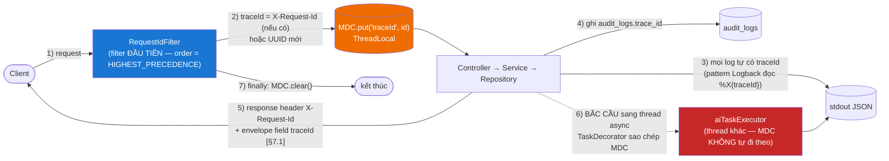

**Đặc tả:**

| Hạng mục | Quyết định |
|---|---|
| Sinh ở đâu | `RequestIdFilter` — filter **đầu tiên** (`@Order(Ordered.HIGHEST_PRECEDENCE)`), trước cả `RateLimitFilter`. Log của request bị 429 cũng phải có `traceId` |
| Nguồn giá trị | Header `X-Request-Id` nếu client/nginx gửi; nếu không → `UUID.randomUUID()` |
| Lưu ở đâu | **`MDC` (Mapped Diagnostic Context)** — `ThreadLocal` của SLF4J |
| Logback pattern | JSON có field `traceId` đọc từ `%X{traceId}` |
| Trả về client | Header `X-Request-Id` + field `traceId` trong envelope lỗi (canonical §7.1) |
| Ghi vào DB | `audit_logs.trace_id` — **nối bằng chứng nghiệp vụ với log kỹ thuật** |
| **Dọn dẹp** | `MDC.clear()` trong `finally` — **bắt buộc**. Thread web được **tái sử dụng** từ pool; không clear thì request sau **thừa hưởng `traceId` của request trước** → log sai lệch, tệ hơn không có traceId |
| **Bắc cầu sang thread async** | `MDC` là `ThreadLocal` → **không** tự sang `aiTaskExecutor`. Bắt buộc cài `TaskDecorator` trong `AsyncConfig`: chụp `MDC.getCopyOfContextMap()` ở thread gọi, `setContextMap` ở thread chạy, `clear()` sau khi xong |
| **Bắc cầu sang job** | Job không có request → `RequestIdFilter` không chạy. Mỗi lần chạy job tự đặt `MDC.put("traceId", "job-" + jobName + "-" + UUID)` để gom log của một lần chạy job |

**Giá trị thực tế — kịch bản dùng thật:**

> Chủ trọ khiếu nại: *"Tin của tôi bị khóa oan lúc 14:30 ngày 10/07."*
> 1. Admin mở `/admin/audit-log`, lọc `target_type=LISTING, target_id=1234, action=LISTING_LOCK` → thấy bản ghi: `actor_email=mod01@..., reason="Ảnh không đúng thực tế", severity=HIGH, trace_id=a3f...`
> 2. `docker compose logs backend | grep a3f...` → toàn bộ dòng log của **đúng** request đó: request đến, report nào được tham chiếu, notification nào đã gửi.
>
> Không có `traceId`, bước 2 là mò kim đáy bể. Đây là lý do trường `trace_id` nằm trong `audit_logs` chứ không chỉ trong log file.

---

## 11. Backup & khôi phục `[§11.5]`

`[§11.5]` nêu 4 yêu cầu: backup database định kỳ; lưu ảnh ở thư mục/cloud riêng; có kế hoạch khôi phục dữ liệu; không xóa cứng dữ liệu nghiệp vụ quan trọng.

### 11.1. Cái gì cần backup

| Đối tượng | Backup? | Lý do |
|---|---|---|
| **MySQL** (46 bảng) | ✔ **Bắt buộc** | Nguồn sự thật duy nhất. Mất = mất tất cả |
| **Volume `upload_data`** (ảnh tin đăng) | ✔ **Bắt buộc** | `[§11.5]` *"Lưu ảnh ở thư mục/cloud riêng"*. Ảnh **không** nằm trong DB → `mysqldump` **không** cứu được. Một tin không ảnh là tin vô dụng `[§3.3]` *"Tin phải có tối thiểu 1 ảnh"* |
| **Redis** | ✘ **Không cần** | Toàn bộ nội dung **tái tạo được** từ DB: cache (mục 8), rate limit counter (mất → cùng lắm cho thêm vài lần thử), JWT blacklist (mất → token đã logout sống lại tối đa 15 phút — đã cân nhắc và chấp nhận). Redis là **trạng thái phái sinh**, không phải nguồn sự thật |
| **File `.env`** | ✔ **Bắt buộc**, lưu **riêng và an toàn** | Chứa mật khẩu DB, `JWT_SECRET`. Mất `JWT_SECRET` → mọi token hiện hành vô hiệu. **Không** commit vào git (chỉ commit `.env.example`) |
| Source code | ✔ (git) | — |
| Log container | ✘ | Chẩn đoán, không phải bằng chứng. Bằng chứng nằm ở `audit_logs` (trong DB, đã backup) |

### 11.2. Chiến lược backup

| Hạng mục | Quyết định |
|---|---|
| Công cụ DB | `mysqldump --single-transaction --routines --triggers --set-gtid-purged=OFF` |
| **`--single-transaction` là bắt buộc** | Với InnoDB, nó chụp ảnh **nhất quán** mà **không khóa bảng** → website vẫn chạy trong lúc backup. Thiếu cờ này, backup có thể bắt được trạng thái giữa chừng: `payments = SUCCESS` nhưng `promotion_subscriptions` chưa kịp tạo → phục hồi ra dữ liệu **sai nghiệp vụ** |
| Tần suất | **Hằng ngày 01:00** (trước `TrustScoreRecalcJob` 02:00 — backup trạng thái "sạch" trước khi job hàng loạt chạm dữ liệu) |
| Ảnh | `tar czf uploads-$(date +%F).tar.gz` từ volume `upload_data`; **hằng tuần** đầy đủ + **hằng ngày** incremental (`find -newer`) — ảnh chỉ thêm, hiếm khi sửa |
| Giữ bao lâu | **7 bản ngày** + **4 bản tuần** + **3 bản tháng** (GFS — Grandfather-Father-Son). Đủ để phát hiện lỗi "âm thầm" xảy ra vài tuần trước |
| Đặt ở đâu | **Ngoài host chạy Docker** (ổ ngoài / cloud storage). Backup nằm cùng máy với DB thì ổ cứng hỏng là mất cả hai — đó không phải backup, đó là bản sao |
| Nén + checksum | `gzip` + `sha256sum` — phát hiện file backup hỏng **trước** khi cần dùng |
| Bí mật | `.env` mã hóa (`gpg`), cất riêng khỏi dump dữ liệu |

**Thực thi:** script `scripts/backup.sh` chạy bằng cron của **host** (không phải `@Scheduled` trong app — backup phải chạy được **kể cả khi ứng dụng đã chết**, mà đó chính là lúc cần nó nhất).

### 11.3. Kế hoạch khôi phục `[§11.5]` — *"Có kế hoạch khôi phục dữ liệu"*

**Mục tiêu chốt** — **[BỔ SUNG NGOÀI CANONICAL]** (`[§11.5]` yêu cầu "có kế hoạch" nhưng không chốt số):

| Chỉ số | Mục tiêu | Diễn giải |
|---|---|---|
| **RPO** (Recovery Point Objective) | **≤ 24 giờ** | Backup hằng ngày → tối đa mất 24h dữ liệu. Phù hợp `[§0.2]` phạm vi đề án |
| **RTO** (Recovery Time Objective) | **≤ 2 giờ** | Thời gian từ lúc phát hiện tới lúc chạy lại |

**Quy trình khôi phục (4 kịch bản):**

| Kịch bản | Các bước |
|---|---|
| **1. Hỏng dữ liệu / xóa nhầm** | 1) `docker compose stop backend` (chặn ghi thêm) → 2) verify checksum bản dump → 3) `docker compose exec -T mysql mysql -u root -p$MYSQL_ROOT_PASSWORD webtro < dump.sql` → 4) giải nén ảnh vào volume `upload_data` → 5) `docker compose up -d backend` → 6) Flyway `validate` tự kiểm schema khớp entity (canonical §13.6) → 7) kiểm tra khói: login, mở 1 tin, upload 1 ảnh |
| **2. Mất toàn bộ host** | 1) Dựng host mới + Docker → 2) `git clone` → 3) khôi phục `.env` từ kho bí mật → 4) `docker compose up -d mysql redis` → 5) restore dump + ảnh → 6) `docker compose up -d` toàn bộ → 7) kiểm tra khói |
| **3. Migration Flyway hỏng** | 1) `docker compose stop backend` → 2) restore dump **trước** migration → 3) sửa file migration → 4) khởi động lại. **Không** dùng `flyway repair` trên dữ liệu thật khi chưa hiểu rõ nguyên nhân |
| **4. Redis chết** | **Không cần khôi phục.** `docker compose restart redis`. Cache tự nạp lại từ DB; rate limit counter về 0 (chấp nhận được); blacklist rỗng → token đã logout sống lại tối đa 15 phút (đã cân nhắc ở mục 5.1) |

**Luật bắt buộc:**

| # | Luật | Lý do |
|---|---|---|
| B1 | **Diễn tập khôi phục ít nhất 1 lần** trước khi bảo vệ, ghi lại kết quả | *"Backup chưa từng được restore thử thì chưa phải backup — đó chỉ là một file."* Đây là điểm phân biệt kế hoạch thật với kế hoạch trên giấy |
| B2 | Restore **luôn** vào môi trường tách biệt trước khi ghi đè production | Restore nhầm bản cũ đè bản mới = mất dữ liệu **do chính hành động cứu hộ** |
| B3 | Ghi nhật ký mỗi lần backup (thời điểm, kích thước, checksum, mã thoát) | Backup **im lặng thất bại** suốt 3 tháng là kịch bản kinh điển |

### 11.4. Không xóa cứng dữ liệu nghiệp vụ `[§11.5]` — lớp bảo vệ đầu tiên

**Đây là hàng phòng ngự trước cả backup:** phần lớn "mất dữ liệu" trong thực tế không đến từ hỏng ổ cứng, mà đến từ **xóa nhầm**. Soft delete làm cho việc xóa nhầm trở nên **hoàn tác được ngay lập tức**, không cần restore.

| Quy tắc (canonical §6.1) | Chi tiết |
|---|---|
| Mọi bảng nghiệp vụ có `deleted_at` (nullable) | Kế thừa `AuditableEntity` |
| **Không** `DELETE` vật lý cho dữ liệu nghiệp vụ | `[§3.6]` *"Không xóa cứng tin nếu có thanh toán, báo cáo hoặc bình luận liên quan"*; `[§10.2]` *"Không xóa cứng user có giao dịch, tin đăng hoặc report"*; `[§10.6]` *"Gói đang có người dùng mua không nên xóa cứng"* |
| Repository lọc `deleted_at IS NULL` **trong query**, **không** dùng `@Where` của Hibernate | canonical §6.1 nêu lý do: `@Where` chặn **cả Admin** xem dữ liệu đã xóa — mà `[§3.6]` yêu cầu *"Admin vẫn xem được tin đã xóa mềm"*. `@Where` là annotation ở mức entity, không tắt được theo ngữ cảnh → sai kiến trúc |
| Cách thi hành | Method thường: `findByIdAndDeletedAtIsNull(id)`. Method admin: `findByIdIncludingDeleted(id)` + `@PreAuthorize("hasAuthority('LISTING_VIEW_ANY')")` |
| **Ngoại lệ hợp lệ** (được phép DELETE vật lý) | `refresh_tokens`, `password_reset_tokens` hết hạn (`TokenCleanupJob`) — **không phải dữ liệu nghiệp vụ**, giữ lại chỉ phình bảng và tăng bề mặt rủi ro |
| File ảnh | Soft delete bản ghi `listing_images`; **file vật lý giữ lại** `[§11.9]` *"Xóa ảnh khỏi hiển thị nhưng vẫn có thể lưu log nếu cần"* |
| `audit_logs` | **Không xóa dưới bất kỳ hình thức nào** (luật A2) |

---

## 12. Khả năng mở rộng `[§11.6]`

`[§11.6]` nêu 4 đường: tách module theo service/layer rõ ràng; AI chạy async bằng queue; Search nâng cấp Elasticsearch/OpenSearch nếu dữ liệu lớn; upload ảnh chuyển sang cloud storage.

**Nguyên tắc chung: mỗi đường nâng cấp phải là *thay một impl sau interface*, không phải *viết lại*.** Kiến trúc đã trả trước chi phí này bằng luật 4 (module gọi nhau chỉ qua interface `service`) và bằng việc canonical §10 chốt "interface + impl" cho AI. Đây là **giá trị đo được** của modular monolith (mục 2.3).

### 12.1. Nâng cấp Search → Elasticsearch/OpenSearch

**Khi nào:** khi `SRCH-01` (tìm từ khóa) trên FULLTEXT index MySQL (mục 9.2) không còn đáp ứng — dấu hiệu: p95 tìm kiếm > 1s, hoặc cần facet/gợi ý gõ (typeahead)/sửa lỗi chính tả/xếp hạng theo độ liên quan.

**Vì sao kiến trúc hiện tại đã sẵn sàng:**

| Điều kiện đã có | Vai trò khi nâng cấp |
|---|---|
| Module `search` **không sở hữu entity** (mục 3.2) — chỉ đọc | Đổi nguồn đọc không đụng dữ liệu |
| Toàn bộ tìm kiếm đi qua **`ListingSearchService`** (interface) | Điểm cắm duy nhất |
| Chỉ **một** nơi định nghĩa tin public: `ListingVisibilityService.publicStatuses()` (canonical §5.2) | Logic hiển thị **không** bị nhân bản vào index |
| Đã có sẵn `ApplicationEvent` `ListingStatusChangedEvent`, `ListingApprovedEvent` (mục 3.4) | **Chính là cơ chế đồng bộ index** — không phải viết mới |

**Các bước:**

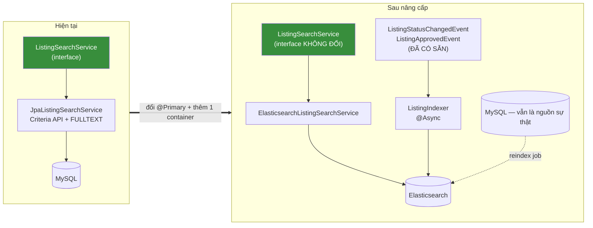

| Bước | Việc | Chạm vào gì |
|---|---|---|
| 1 | Thêm container `elasticsearch` vào compose | `docker-compose.yml` |
| 2 | Viết `ElasticsearchListingSearchService implements ListingSearchService` | **File mới** |
| 3 | `ListingIndexer` lắng nghe event đã có → đẩy index | **File mới** |
| 4 | Job reindex toàn bộ (khôi phục khi index hỏng) | **File mới** |
| 5 | Đổi `@Primary` / config `search.engine=elasticsearch` | 1 dòng |
| **Không phải sửa** | `SearchController`, `pages/SearchPage.jsx`, DTO, DB, module khác | **0 dòng** |

> **MySQL vẫn là nguồn sự thật; Elasticsearch chỉ là index phái sinh.** Index hỏng → chạy reindex job. Không bao giờ để dữ liệu chỉ tồn tại trong ES.

### 12.2. Nâng cấp lưu trữ ảnh → cloud storage

**Khi nào:** volume host hết chỗ; cần CDN; cần nhiều instance backend cùng đọc ảnh (volume cục bộ không chia sẻ được giữa nhiều host).

**Điều kiện đã có:** upload/serve ảnh đi qua **`ListingImageService`**; ảnh lưu bằng **UUID** (canonical §8) và `listing_images.url` là **chuỗi** — không phải đường dẫn tuyệt đối nhúng cứng.

| Bước | Việc |
|---|---|
| 1 | Tách interface `FileStorage` với `store(file) → key`, `resolveUrl(key)`, `delete(key)` — **[BỔ SUNG NGOÀI CANONICAL]**: nên tạo interface này **ngay từ đầu**, dù impl duy nhất là `LocalFileStorage`. Chi phí bây giờ: ~20 dòng. Chi phí sau này nếu không có: sửa rải rác khắp `ListingImageService` |
| 2 | Viết `S3FileStorage implements FileStorage` |
| 3 | Đổi config `storage.type=s3` |
| 4 | Job migrate ảnh cũ lên cloud, cập nhật `listing_images.url` |
| **Không phải sửa** | Controller, DTO, frontend (vẫn nhận URL từ API), bảng DB |

### 12.3. AI: in-process queue → message broker `[§11.6]`

**Khi nào:** khối lượng AI vượt sức 1 instance; cần task **bền vững** qua restart mà không phụ thuộc job retry; cần scale worker AI độc lập với web.

**Điều kiện đã có:** `interaction` **không** gọi `ai` trực tiếp — chỉ **publish event** (luật 7, mục 3.3).

| Bước | Việc |
|---|---|
| 1 | Thêm container `rabbitmq` |
| 2 | Đổi `CommentSentimentListener` từ `@TransactionalEventListener + @Async` sang publish message |
| 3 | Viết consumer (cùng process, hoặc tách process `ai-worker`) |
| **Không phải sửa** | `CommentServiceImpl` (vẫn chỉ publish event), controller, DB, frontend |

> Nếu đã dùng listener gọi thẳng `sentimentService.analyze()` **đồng bộ trong transaction** thì bước này là viết lại toàn bộ. Đó là lý do luật 7 (event thay vì gọi trực tiếp) được đặt ra **ngay từ đầu**, khi chưa cần tới.

### 12.4. Tách module thành service riêng `[§11.6]` — *"Tách module Listing, Search, Payment, AI theo service/layer rõ ràng"*

**Thứ tự tách hợp lý (dễ → khó), theo mức độ ghép nối dữ liệu:**

| Thứ tự | Module | Vì sao dễ/khó |
|---|---|---|
| 1 | **`ai`** | Đã async, đã sau interface, sở hữu 5 bảng riêng, **không ai đọc bảng của nó**. Tách gần như không đau |
| 2 | **`search`** | **Không sở hữu entity** — chỉ đọc. Tách cùng lúc với Elasticsearch (12.1) là tự nhiên |
| 3 | **`notification`** | Là **lá** trong đồ thị phụ thuộc (mục 3.3) — không gọi ngược ai. Chỉ cần đổi lời gọi thành message |
| 4 | **`payment`** | Sở hữu bảng riêng nhưng có transaction xuyên module với `listing` (kích hoạt gói `[§3.14]`) → **cần saga**. Bắt đầu khó thật sự |
| 5 | **`listing`** + `interaction` + `user` | **Không nên tách.** Ghép nối dữ liệu chặt (bảng 2.3): duyệt tin chạm 4 bảng của 4 module trong 1 transaction. Tách ra = saga khắp nơi, đổi ACID lấy eventual consistency mà **không** thu được lợi ích tương xứng |

**Điều kiện tiên quyết đã được thi hành từ ngày đầu:**

| Điều kiện | Trạng thái |
|---|---|
| Module chỉ gọi nhau qua interface `service` (luật 4) | ✔ Bắt buộc, kiểm bằng grep |
| Không truy cập `repository` chéo module (luật 4) | ✔ |
| Không `@ManyToOne` chéo module lên tầng trên (luật 8) | ✔ — khóa ngoại kiểu `Long` |
| Đồ thị phụ thuộc là **DAG** (mục 3.3) | ✔ — có chu trình thì không tách được |
| Giao tiếp ngược chiều qua event (luật 7) | ✔ |

> **Điểm cần nói thẳng:** với `[§0.2]`, việc tách microservices **không nằm trong kế hoạch của đồ án** và cũng **không nên làm**. Giá trị của mục 12.4 là chứng minh kiến trúc **không khóa cửa** — chứ không phải hứa hẹn sẽ đi qua cửa đó.

### 12.5. Các trục mở rộng khác

| Trục | Đường nâng cấp | Điều kiện đã có |
|---|---|---|
| Nhiều instance backend | Thêm ShedLock cho `@Scheduled` (mục 7.2) + chuyển `upload_data` sang cloud (12.2) + đặt nginx làm LB | Session đã **stateless** (JWT) → **không** cần sticky session. Đây là lợi ích trực tiếp của quyết định ở mục 5.1 |
| Đọc nhiều | MySQL read replica cho query đọc | Luật 5: `@Transactional(readOnly = true)` đã đánh dấu sẵn **mọi** đường đọc → định tuyến replica chỉ là cấu hình `RoutingDataSource` |
| Cache phân tán | Redis Cluster/Sentinel | Đã dùng Redis, `CacheManager` trừu tượng hóa |
| Thanh toán thật | `VnPayPaymentGateway`/`MoMoPaymentGateway` (đã có chỗ trong `payment/gateway/`) | `PaymentGateway` là interface (mục 3.4) |
| Chat realtime `[§14.3]` | Thêm WebSocket/STOMP bên cạnh REST | `conversations`, `messages` đã có; `[§13.2]` cố tình để REST trước |

---

## 13. SEO `[§11.8]`

`[§11.8]` nêu 6 yêu cầu: URL chi tiết tin thân thiện; meta title/description theo tin; sitemap cho tin Active; robots.txt; schema markup cơ bản; **không index tin hết hạn, tin bị khóa**.
`[§13.2]`: *"SEO — Làm meta, URL, sitemap **cơ bản**"*.

### 13.1. URL thân thiện

Canonical §12 chốt: `/tin/:slug-:id`.

| Hạng mục | Quyết định |
|---|---|
| Mẫu URL | `/tin/phong-tro-quan-1-gan-dh-kinh-te-25m2-3tr5-1234` |
| Sinh slug | `SlugUtil.toSlug(title)` — bỏ dấu tiếng Việt, lowercase, thay ký tự đặc biệt bằng `-`, gộp `-` liên tiếp, cắt ≤ 80 ký tự |
| **Vì sao có `id` ở cuối** | Tiêu đề **thay đổi được** `[§3.4]`. Nếu URL chỉ có slug, sửa tiêu đề = **gãy toàn bộ link đã chia sẻ + mất thứ hạng SEO đã tích lũy**. Có `id` → định tuyến bằng `id` (bất biến), slug chỉ để đọc |
| Slug không khớp | Truy cập `/tin/slug-cu-1234` → **301 Permanent Redirect** sang slug hiện tại. 301 (không phải 302) để công cụ tìm kiếm **chuyển** thứ hạng sang URL mới |
| Lưu slug | `listings.slug` + `uk_listings_slug_id` (mục 9.2) |
| URL khác | Tiếng Việt không dấu, `kebab-case`: `/tim-kiem`, `/chu-tro/:id`, `/dang-nhap` (canonical §12) |

### 13.2. Meta động `[§11.8]` — *"Meta title, description theo tin"*

| Thẻ | Nội dung | Nguồn |
|---|---|---|
| `<title>` | `{title} - {price} - {ward}, {district} \| Webtro` (≤ 60 ký tự) | `listings` |
| `<meta name="description">` | 155 ký tự đầu của mô tả đã strip HTML | `listings.description` |
| `<link rel="canonical">` | URL chuẩn `/tin/{slug}-{id}` | Chống trùng nội dung khi có query param |
| `og:title`, `og:description`, `og:image`, `og:url`, `og:type` | Ảnh primary | Chia sẻ Facebook/Zalo — **quan trọng thực tế** với tin trọ ở Việt Nam |
| `twitter:card` | `summary_large_image` | |
| `<meta name="robots">` | **`noindex, nofollow`** với tin non-public (mục 13.4) | Yêu cầu cứng `[§11.8]` |
| `<html lang="vi">` | | |

Hiện thực: `services/seoService.js` + component `<SeoHead>` — set `document.title` và các thẻ `<meta>` trong `useEffect`, **dọn dẹp khi unmount** (không để meta của tin trước dính sang tin sau).

**Schema markup `[§11.8]`** — *"Schema markup cơ bản cho listing nếu có thời gian"*: nhúng JSON-LD `@type: "Accommodation"` + `"Offer"` (giá, tiền tệ VND, khu vực, diện tích, ảnh). Đây là JSON-LD do **chính ta sinh từ dữ liệu DB**, không phải HTML người dùng nhập → **không** vi phạm luật F5 (không `dangerouslySetInnerHTML`); chèn bằng `<script type="application/ld+json">{JSON.stringify(data)}</script>`.

### 13.3. Sitemap + robots.txt

| Hạng mục | Quyết định |
|---|---|
| Endpoint | `GET /sitemap.xml` — **backend sinh**, không phải file tĩnh (nội dung thay đổi liên tục) |
| Nội dung | **Chỉ tin public** — dùng `ListingVisibilityService.publicStatuses()` (canonical §5.2 bắt buộc: *"mọi truy vấn công khai (search, chi tiết, gợi ý, chatbot, **sitemap**, tin liên quan) đều phải dùng nó"*) |
| Mỗi `<url>` | `<loc>`, `<lastmod>` (= `updated_at`), `<changefreq>weekly</changefreq>`, `<priority>` |
| Sitemap index | > 50.000 URL → chia `sitemap-listings-1.xml`, `sitemap-listings-2.xml` + `sitemap-index.xml` (giới hạn của chuẩn sitemap) |
| Cache | 1 giờ (Redis) — không sinh lại mỗi lần bot gọi |
| Trang tĩnh | `/`, `/tim-kiem`, `/gioi-thieu`, `/dieu-khoan` |
| `robots.txt` | `Allow: /`, `/tim-kiem`, `/tin/`, `/chu-tro/`; **`Disallow:`** `/admin/`, `/quan-ly/`, `/tai-khoan/`, `/api/`, `/dang-nhap`, `/dang-ky`, `/quen-mat-khau`, `/dat-lai-mat-khau`, `/xac-thuc-email`; `Sitemap: ${APP_BASE_URL}/sitemap.xml` |

> `robots.txt` **không phải cơ chế bảo mật** — nó chỉ là yêu cầu lịch sự với bot ngoan. Bảo mật thật của `/admin/**` là `@PreAuthorize` ở backend (mục 5.2). Disallow ở đây chỉ để tránh lãng phí ngân sách thu thập của bot vào trang cần đăng nhập.

### 13.4. Không index tin hết hạn / bị khóa `[§11.8]` — yêu cầu cứng

Đây là yêu cầu **tường minh** của `[§11.8]`, và cũng là yêu cầu nghiệp vụ `[§3.7]`: *"Tin Locked, Hidden, Expired, Deleted không xuất hiện"*.

| Trạng thái tin | Trong sitemap? | HTTP status | `<meta robots>` |
|---|---|---|---|
| `ACTIVE` | ✔ | 200 | `index, follow` |
| `NEED_REVIEW` **và** `listing.need_review.publicly_visible = true` | ✔ | 200 | `index, follow` |
| `NEED_REVIEW` **và** config = `false` | ✘ | 404 | `noindex, nofollow` |
| `EXPIRED` | ✘ | **410 Gone** | `noindex, nofollow` |
| `CLOSED` | ✘ | **410 Gone** | `noindex, nofollow` |
| `LOCKED` | ✘ | 404 | `noindex, nofollow` |
| `HIDDEN`, `DRAFT`, `PENDING`, `REJECTED` | ✘ | 404 | `noindex, nofollow` |
| `DELETED` | ✘ | 404 | `noindex, nofollow` |
| Chủ sở hữu / `LISTING_VIEW_ANY` xem tin của mình | ✘ (không vào sitemap) | 200 | **`noindex, nofollow`** |

> **Vì sao `EXPIRED`/`CLOSED` trả 410 Gone chứ không 404:** 410 nghĩa là *"đã từng tồn tại, nay đã đi hẳn"* — công cụ tìm kiếm gỡ khỏi index **nhanh hơn** so với 404 (*"không tìm thấy"*, có thể tạm thời, bot sẽ quay lại thử nhiều lần). Tin hết hạn/đã cho thuê **chắc chắn** sẽ không quay lại ở URL đó với nội dung cũ. Đây đúng ngữ nghĩa HTTP và đúng nghiệp vụ `[§3.6]` *"Tin Closed... không xuất hiện trong tìm kiếm mặc định"*.
>
> **Điểm mấu chốt về kiến trúc:** quy tắc *"cái gì được public"* **chỉ có một nguồn** — `ListingVisibilityService.publicStatuses()` (canonical §5.2). Sitemap, search, chi tiết, chatbot, gợi ý, tin liên quan **đều** gọi nó. Nếu sitemap tự viết `status = 'ACTIVE'`, nó sẽ **sai** ngay khi Admin bật `listing.need_review.publicly_visible` — và sai **âm thầm**. Đây là lý do canonical §5.2 gọi đây là *"quy tắc tối quan trọng"*.

### 13.5. Hạn chế của SPA với SEO và cách xử lý trong phạm vi đề án

**Vấn đề — nói thẳng:** React SPA trả về HTML rỗng:

```html
<div id="root"></div>
<script src="/assets/index-a3f2.js"></script>
```

Nội dung tin chỉ xuất hiện **sau khi** JS tải, chạy, gọi API, render. Hệ quả:

| Hệ quả | Mức nghiêm trọng |
|---|---|
| Googlebot **có** chạy JS, nhưng ở **hàng đợi render thứ hai** — chậm hơn hẳn (ngày → tuần) so với HTML tĩnh | Trung bình — tin trọ có vòng đời 30 ngày `[§5.2]`, index chậm 1 tuần là **mất 1/4 vòng đời** |
| **Facebook/Zalo/Twitter crawler KHÔNG chạy JS** | **Cao** — chia sẻ link tin lên Facebook/Zalo hiện thẻ trống, không ảnh, không tiêu đề. Với thị trường tin trọ Việt Nam, chia sẻ qua Zalo/Facebook là **kênh phân phối chính** |
| Bot tìm kiếm nhỏ (Cốc Cốc, Bing cũ) không chạy JS | Trung bình |

**Ba phương án và đánh đổi:**

| # | Phương án | SEO | Chi phí | Ảnh hưởng kiến trúc |
|---|---|---|---|---|
| A | SPA thuần + meta động bằng JS | ◐ Google được (chậm); mạng xã hội **hỏng** | 0 | Không |
| B | **SSR** (Next.js) hoặc **prerender** tin | ✔ Tốt nhất | **Cao** — Next.js **vi phạm canonical §1.2** (chốt React 18 + **Vite**); prerender service = +1 container | **Lớn** |
| C | **SPA + prerender có chọn lọc cho bot ở tầng nginx** | ✔ Tốt cho cả Google và mạng xã hội | Trung bình | Nhỏ — chỉ ở nginx + 1 endpoint backend |

**Quyết định chốt: A cho phạm vi đề án + để sẵn đường đi C.** Lý do:

1. `[§13.2]` chốt SEO ở mức *"làm meta, URL, sitemap **cơ bản**"* — đây là **quyết định phạm vi đã có sẵn** trong tài liệu nghiệp vụ, không phải né tránh.
2. `[§11.8]` liệt kê 6 yêu cầu; **5/6 làm được đầy đủ với SPA thuần** (URL thân thiện, meta động, sitemap, robots.txt, không index tin hết hạn/khóa). Chỉ *"schema markup"* — vốn đã được đánh dấu *"nếu có thời gian"* — là bị hạn chế bởi việc bot phải chạy JS.
3. Canonical §1.2 chốt **Vite**, không phải Next.js. Đổi sang SSR = **phá hợp đồng kỹ thuật** (canonical là nguồn sự thật duy nhất) và kéo theo thay đổi lớn ở build, routing, data fetching.
4. `[§0.2]`: hệ thống *"đủ lớn để thể hiện năng lực... **nhưng vẫn thực tế**"*.

**Những gì làm được ngay trong phạm vi đề án (không phải thỏa hiệp):**

| Biện pháp | Hiệu quả |
|---|---|
| Meta + canonical + OG tags động qua `seoService` | Googlebot (có chạy JS) đọc đủ |
| `<meta robots noindex>` cho tin non-public | Thi hành `[§11.8]` — hoạt động **kể cả** khi bot chạy JS |
| **410 Gone / 404 ở tầng HTTP** cho tin hết hạn/khóa | **Không phụ thuộc JS** — bot nhận status code ngay. Đây là lý do dùng status code thay vì chỉ dựa vào meta tag |
| `sitemap.xml` sinh từ backend | **Không phụ thuộc JS** — bot đọc XML trực tiếp. Đây là kênh chính để Google **phát hiện** tin mới |
| URL thân thiện + 301 khi đổi slug | Không phụ thuộc JS |
| `robots.txt` | Không phụ thuộc JS |
| Code-splitting + lazy image (mục 9.4) | Core Web Vitals tốt → xếp hạng tốt hơn |
| `<noscript>` chứa tiêu đề + mô tả + link `/tim-kiem` | Bot không chạy JS ít nhất thấy được nội dung tối thiểu |

> Chú ý: 3 trong số các biện pháp trên (**sitemap**, **410/404**, **robots.txt**) hoạt động **hoàn toàn ở tầng HTTP** — chúng chính là các yêu cầu quan trọng nhất của `[§11.8]` (*"Sitemap cho tin Active"*, *"Không index tin hết hạn, tin bị khóa"*) và chúng **không** bị hạn chế của SPA làm ảnh hưởng. Hạn chế của SPA chỉ chạm tới meta tag và schema markup.

**Đường nâng cấp C khi cần (ghi lại để không phải nghĩ lại):**

```nginx
# nginx.conf — prerender có chọn lọc cho bot
map $http_user_agent $is_bot {
    default 0;
    "~*(googlebot|bingbot|facebookexternalhit|twitterbot|zalo|coccocbot)" 1;
}
location /tin/ {
    if ($is_bot) { proxy_pass http://backend:8080/prerender$request_uri; }
    try_files $uri /index.html;
}
```

Backend thêm endpoint `/prerender/tin/{slug}-{id}` render HTML tĩnh bằng **Thymeleaf** — vốn **đã có sẵn** trong stack (canonical §1.1, hiện dùng cho email). Chi phí: 1 controller + 1 template + 6 dòng nginx. **Không** đụng SPA, **không** đụng canonical §1.2, **không** thêm container.

> Ghi chú trung thực: đây là kỹ thuật "phục vụ nội dung khác nhau theo user-agent" — chấp nhận được với Google **khi và chỉ khi** nội dung prerender **giống hệt** nội dung người dùng thấy (không phải cloaking). Vì cả hai đều render từ cùng một `ListingDetailResponse`, điều kiện này được thỏa **theo kiến trúc**, không phải theo lời hứa.

---

## 14. Kiến trúc triển khai Docker

Canonical §1.3: `docker compose up --build` phải dựng đủ `mysql` → `redis` → `backend` → `frontend` → `mailhog`. **Không hardcode host/user/password ở bất kỳ đâu**; toàn bộ qua biến môi trường + file `.env`.
Canonical §13.5 (Definition of Done): *"`docker compose up --build` chạy được toàn hệ thống"* — **một lệnh, không thao tác thủ công**.

### 14.1. Sơ đồ các service

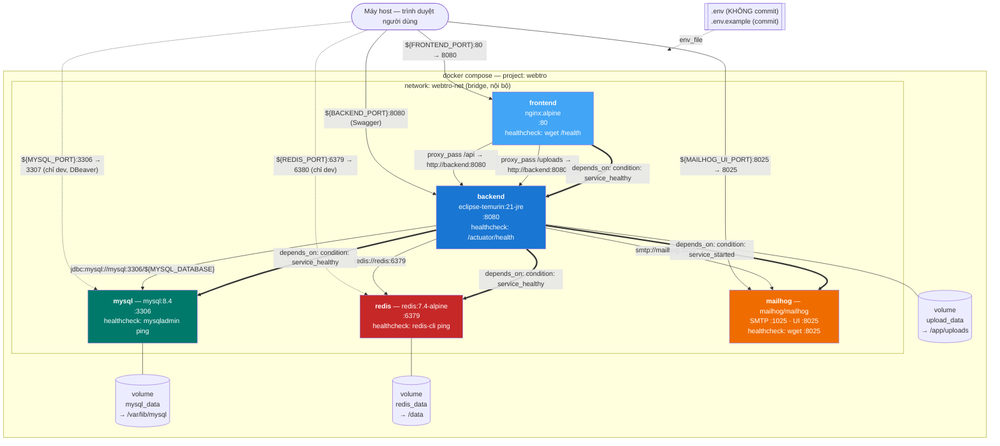

### 14.2. Mạng

| Hạng mục | Quyết định | Lý do |
|---|---|---|
| Network | **Một** bridge network `webtro-net`, tất cả service tham gia | Docker DNS nội bộ: `backend` gọi `mysql:3306` bằng **tên service** — không cần IP, không hardcode |
| **Nguyên tắc phơi cổng** | Chỉ **`frontend`** thật sự cần phơi ra host. `backend` phơi để xem Swagger khi dev; `mysql`/`redis` phơi **chỉ ở `docker-compose.override.yml`** (dev) | Trong triển khai thật, `mysql`/`redis` **không** được phơi ra host — chúng chỉ cần được `backend` gọi qua network nội bộ. Phơi DB ra host là mở cửa bị quét cổng và brute-force |
| CORS | **Không cần ở runtime** — nginx `proxy_pass /api` → trình duyệt thấy **cùng origin** (`localhost:8080`) cho cả trang và API | `CorsConfig` chỉ bật ở profile `dev` cho trường hợp chạy `npm run dev` (Vite :5173) ngoài Docker. Origin đọc từ `${CORS_ALLOWED_ORIGINS}` |
| Header thật của client | nginx đặt `X-Forwarded-For`, `X-Forwarded-Proto`, `X-Real-IP` | `RateLimitFilter` cần IP thật để rate limit theo IP `[§11.10]` (mục 5.5). **Chỉ tin** header này vì backend không phơi trực tiếp ra internet |

**`nginx.conf` — điểm chính:**

| Cấu hình | Giá trị | Lý do |
|---|---|---|
| `try_files $uri /index.html` | SPA fallback | React Router dùng `createBrowserRouter` — F5 tại `/tin/abc-123` phải trả `index.html`, không phải 404 |
| `proxy_pass /api → http://backend:8080` | | Cùng origin, không CORS |
| `proxy_pass /uploads → http://backend:8080` | | Ảnh phục vụ qua backend có kiểm soát (mục 5.3.4), **không** để nginx serve thư mục trực tiếp |
| `client_max_body_size ${MAX_UPLOAD_SIZE}` | 10m | Phải ≥ `5MB × số ảnh/request` `[§11.9]`. Mặc định nginx là **1m** → upload ảnh 5MB **thất bại với 413** trước cả khi chạm backend |
| `gzip on` | JSON, JS, CSS | Mục 9.5 |
| `server_tokens off` | | Không lộ phiên bản nginx (mục 5.3.5) |
| Security headers | `X-Content-Type-Options: nosniff`, `X-Frame-Options: DENY`, `Referrer-Policy: strict-origin-when-cross-origin`, `Content-Security-Policy` | Mục 5.3.1 |
| Cache tĩnh | `/assets/*` → `max-age=31536000, immutable` | Vite gắn hash vào tên file |
| `location /health` | `return 200` | Healthcheck của chính frontend |

### 14.3. Volume

| Volume | Mount | Loại | Backup? | Mất thì sao |
|---|---|---|---|---|
| `mysql_data` | `mysql:/var/lib/mysql` | named volume | ✔ **Bắt buộc** (mục 11) | **Mất toàn bộ hệ thống** |
| `redis_data` | `redis:/data` | named volume | ✘ | Không sao — tái tạo từ DB (mục 11.1) |
| `upload_data` | `backend:/app/uploads` | named volume | ✔ **Bắt buộc** | Mất toàn bộ ảnh tin đăng — `mysqldump` **không** cứu được |
| `./nginx.conf` | `frontend:/etc/nginx/conf.d/default.conf:ro` | bind mount, **read-only** | (trong git) | — |

> **Vì sao named volume chứ không bind mount cho dữ liệu:** bind mount (`./data/mysql:/var/lib/mysql`) gây lỗi quyền truy cập giữa Windows/Linux và làm dữ liệu lẫn vào thư mục source. Named volume được Docker quản lý, hoạt động đồng nhất trên mọi OS — quan trọng vì đồ án được chấm trên máy khác.
>
> **`upload_data` phải là volume, không phải thư mục trong container:** container **ephemeral** — `docker compose up --build` tạo container mới, **mọi file ghi trong lớp container biến mất**. Ảnh nằm trong volume mới sống sót qua rebuild.

### 14.4. Healthcheck & thứ tự khởi động

**Vấn đề `depends_on` thường không giải quyết:** `depends_on: [mysql]` chỉ đảm bảo container `mysql` **đã được khởi động**, **không** đảm bảo MySQL **đã sẵn sàng nhận kết nối**. MySQL 8.4 mất 10–30 giây để khởi tạo lần đầu. Backend khởi động ngay → **Flyway không kết nối được** → **backend crash** → `docker compose up --build` thất bại → **vi phạm canonical §13.5**.

**Giải pháp: `depends_on` + `condition: service_healthy`.**

| Service | Healthcheck | `interval` | `timeout` | `retries` | `start_period` |
|---|---|---|---|---|---|
| `mysql` | `mysqladmin ping -h localhost -u root -p$$MYSQL_ROOT_PASSWORD` | 10s | 5s | 10 | **40s** |
| `redis` | `redis-cli ping` | 10s | 3s | 5 | 10s |
| `backend` | `wget -qO- http://localhost:8080/actuator/health \|\| exit 1` | 15s | 5s | 10 | **90s** |
| `frontend` | `wget -qO- http://localhost:80/health \|\| exit 1` | 10s | 3s | 5 | 10s |
| `mailhog` | `wget -qO- http://localhost:8025 \|\| exit 1` | 10s | 3s | 5 | 5s |

**Bảng `depends_on`:**

| Service | Phụ thuộc | Điều kiện | Lý do |
|---|---|---|---|
| `backend` | `mysql` | **`service_healthy`** | Flyway migrate ngay lúc khởi động → DB **phải** sẵn sàng |
| `backend` | `redis` | **`service_healthy`** | `RedisConfig` khởi tạo connection factory |
| `backend` | `mailhog` | `service_started` | Mail gửi **async** (mục 7.3) → không cần chờ healthy; mailhog chết cũng không được làm backend không lên |
| `frontend` | `backend` | **`service_healthy`** | nginx `proxy_pass` cần upstream `backend` phân giải được |

**Thứ tự khởi động thực tế:**

```mermaid
gantt
    title Thứ tự khởi động (docker compose up --build)
    dateFormat X
    axisFormat %Ss
    section mysql
    khởi tạo InnoDB, tạo database   :m1, 0, 30
    HEALTHY                          :milestone, m2, 30, 0
    section redis
    khởi động                        :r1, 0, 5
    HEALTHY                          :milestone, r2, 5, 0
    section mailhog
    khởi động (started là đủ)        :h1, 0, 3
    section backend
    CHỜ mysql + redis healthy        :b0, 0, 30
    Spring Boot khởi động            :b1, 30, 20
    Flyway migrate (V1..Vn)          :b2, 50, 10
    JPA validate schema              :b3, 60, 5
    HEALTHY (/actuator/health)       :milestone, b4, 65, 0
    section frontend
    CHỜ backend healthy              :f0, 0, 65
    nginx khởi động                  :f1, 65, 3
    HEALTHY — SẴN SÀNG DÙNG          :milestone, f2, 68, 0
```

| Điểm | Giải thích |
|---|---|
| **`start_period` quan trọng nhất** | Trong `start_period`, healthcheck thất bại **không** tính vào `retries`. MySQL khởi tạo lần đầu (tạo database, user, InnoDB) mất tới 40s — không có `start_period` đủ dài, container bị đánh dấu `unhealthy` và compose bỏ cuộc **dù MySQL hoàn toàn bình thường** |
| `restart: unless-stopped` | Mọi service. Backend crash vì lỗi tạm thời → tự lên lại |
| Flyway `baseline-on-migrate: false` | DB mới hoàn toàn — không cần baseline |
| `ddl-auto: validate` | canonical §13.6 — **không** `update` ở bất kỳ đâu. `validate` khiến app **từ chối khởi động** nếu entity lệch schema → phát hiện ngay, không im lặng làm hỏng dữ liệu |
| Seed dữ liệu | Bằng **Flyway migration** (`V2__seed_roles_permissions.sql`, `V3__seed_provinces.sql`...), **không** bằng `data.sql` hay `CommandLineRunner` | Đảm bảo `docker compose up --build` một lệnh là có đủ role, permission, tỉnh/huyện/xã, danh mục, tiện ích, banned keyword, system config (canonical §13.5) |

### 14.5. Biến môi trường (KHÔNG hardcode)

Canonical §1.3: *"Không hardcode host/user/password ở bất kỳ đâu; toàn bộ qua biến môi trường + file `.env`"*.

**Quy tắc file:**

| File | Commit vào git? | Vai trò |
|---|---|---|
| `.env.example` | ✔ **Có** | Khuôn mẫu, đầy đủ **mọi** key, giá trị **giả** cho secret. Người chấm `cp .env.example .env` là chạy được |
| `.env` | ✘ **KHÔNG** (`.gitignore`) | Giá trị thật. Chứa secret (mục 11.1) |
| `docker-compose.yml` | ✔ | Cấu hình chung, đọc `${VAR}` |
| `docker-compose.override.yml` | ✔ | Chỉ dev: phơi cổng `mysql`/`redis`, bật Swagger, `LOG_LEVEL=DEBUG` |

**Bảng biến môi trường đầy đủ:**

| Nhóm | Biến | Ví dụ `.env.example` | Dùng ở |
|---|---|---|---|
| **Chung** | `COMPOSE_PROJECT_NAME` | `webtro` | compose |
| | `APP_TIMEZONE` | `Asia/Ho_Chi_Minh` | backend (`@Scheduled zone`, mục 7.2) |
| | `APP_BASE_URL` | `http://localhost:8080` | link trong email, `sitemap.xml` (mục 13.3) |
| | `SPRING_PROFILES_ACTIVE` | `docker` | backend |
| **Cổng host** | `FRONTEND_PORT` | `8080` | compose |
| | `BACKEND_PORT` | `8080` | compose |
| | `MYSQL_PORT` | `3307` | compose (override, dev) |
| | `REDIS_PORT` | `6380` | compose (override, dev) |
| | `MAILHOG_UI_PORT` | `8025` | compose |
| **MySQL** | `MYSQL_ROOT_PASSWORD` | `change_me_root` | mysql, script backup |
| | `MYSQL_DATABASE` | `webtro` | mysql, backend |
| | `MYSQL_USER` | `webtro_user` | mysql, backend |
| | `MYSQL_PASSWORD` | `change_me_password` | mysql, backend |
| | `DB_POOL_SIZE` | `20` | HikariCP (mục 9.5) |
| **Redis** | `REDIS_HOST` | `redis` | backend (**tên service**, không phải IP) |
| | `REDIS_PORT_INTERNAL` | `6379` | backend |
| | `REDIS_PASSWORD` | *(rỗng ở dev)* | backend |
| **JWT** | `JWT_SECRET` | `change_me_min_32_bytes_base64` | `JwtService`. **≥ 256 bit** cho HS256 — JJWT **từ chối** khóa ngắn hơn |
| | `JWT_ACCESS_EXPIRATION_MINUTES` | `15` | canonical §8 |
| | `JWT_REFRESH_EXPIRATION_DAYS` | `7` | canonical §8 |
| | `COOKIE_SECURE` | `false` (dev) / `true` (deploy) | Cookie refresh token (mục 4.3) |
| | `COOKIE_SAME_SITE` | `Strict` | mục 4.3 |
| **Mail** | `MAIL_HOST` | `mailhog` | backend |
| | `MAIL_PORT` | `1025` | backend |
| | `MAIL_USERNAME` / `MAIL_PASSWORD` | *(rỗng — MailHog không cần)* | backend |
| | `MAIL_FROM` | `no-reply@webtro.local` | backend |
| **Upload** | `UPLOAD_DIR` | `/app/uploads` | backend (**ngoài webroot** `[§11.9]`) |
| | `MAX_UPLOAD_SIZE` | `10MB` | Spring `multipart` + nginx `client_max_body_size` |
| **CORS** | `CORS_ALLOWED_ORIGINS` | `http://localhost:5173` | `CorsConfig` (chỉ dev) |
| **Log** | `LOG_LEVEL` | `INFO` | Logback (mục 10.1) |
| | `LOG_LEVEL_APP` | `INFO` (dev: `DEBUG`) | Logback |
| | `LOG_SLOW_REQUEST_MS` | `2000` | `SlowRequestLoggingInterceptor` |
| **Swagger** | `SWAGGER_ENABLED` | `true` (dev) / `false` (deploy) | mục 5.3.5 |
| **Async** | `ASYNC_AI_CORE_POOL` / `ASYNC_AI_MAX_POOL` / `ASYNC_AI_QUEUE` | `2` / `4` / `500` | `AsyncConfig` (mục 7.3) |
| | `ASYNC_MAIL_CORE_POOL` / `ASYNC_MAIL_MAX_POOL` / `ASYNC_MAIL_QUEUE` | `2` / `4` / `1000` | `AsyncConfig` |
| **Payment** | `PAYMENT_GATEWAY` | `SANDBOX` | Chọn impl `PaymentGateway` (mục 3.4) |
| | `PAYMENT_RETURN_URL` | `${APP_BASE_URL}/quan-ly/thanh-toan` | `[§3.14]` |
| | `PAYMENT_CALLBACK_URL` | `${APP_BASE_URL}/api/payments/callback` | `[§12.8]` |
| **Frontend (build-time)** | `VITE_API_BASE_URL` | `/api` | Đường dẫn tương đối → cùng origin qua nginx proxy |
| | `VITE_APP_NAME` | `Webtro` | |

**Ba luật bắt buộc:**

| # | Luật | Vì sao |
|---|---|---|
| E1 | **Không** giá trị mặc định cho secret trong `application.yml` | `${JWT_SECRET}` — **không** `${JWT_SECRET:mySecretKey}`. Có mặc định thì thiếu biến app **vẫn chạy với secret ai cũng biết** (nó nằm trong git). Không mặc định → app **từ chối khởi động** → lỗi lộ ra **ngay**, không âm thầm |
| E2 | Giá trị **không** nhạy cảm **được phép** có mặc định | `${LOG_LEVEL:INFO}`, `${DB_POOL_SIZE:20}` — tiện dụng, không rủi ro |
| E3 | Biến `VITE_*` là **build-time**, không phải runtime | Vite **nhúng** giá trị vào bundle lúc `npm run build`. Đổi `VITE_API_BASE_URL` phải **build lại image**. Hệ quả: **không bao giờ** đặt secret vào biến `VITE_*` — nó nằm trong file JS mà **mọi người dùng tải về được** |

**Dockerfile — multi-stage (bắt buộc):**

| Image | Stage 1 (build) | Stage 2 (runtime) | Vì sao |
|---|---|---|---|
| `backend` | `eclipse-temurin:21-jdk` + `./mvnw package -DskipTests` | `eclipse-temurin:21-**jre**` + copy `app.jar` | Image cuối **không** chứa JDK, không chứa source, không chứa `~/.m2` → nhỏ hơn nhiều lần, bề mặt tấn công nhỏ hơn |
| `frontend` | `node:20-alpine` + `npm ci && npm run build` | `nginx:alpine` + copy `dist/` | Image cuối **không** chứa `node_modules` (hàng trăm MB) |

| Tối ưu | Chi tiết |
|---|---|
| Cache layer | Copy `pom.xml` (hoặc `package.json`) và tải dependency **trước**, copy source **sau** → sửa code không phải tải lại dependency |
| `.dockerignore` | Loại `target/`, `node_modules/`, `.git/`, `.env` — **`.env` phải có trong `.dockerignore`** để secret không lọt vào image |
| Chạy bằng user không phải root | `USER appuser` — container bị chiếm cũng không có root |

---

## 15. Quyết định thiết kế & lý do (ADR rút gọn)

> Bảng dưới gồm **16 quyết định**. Các quyết định đánh dấu 🔶 là **điểm mờ trong tài liệu nghiệp vụ gốc** — nơi tài liệu dùng "có thể", "nếu cần", "gợi ý", hoặc không nói gì — được quyết theo hướng hợp lý nhất của Senior Architect, kèm căn cứ.

| # | Quyết định | Phương án thay thế | Lý do chọn | Căn cứ |
|---|---|---|---|---|
| **QĐ-01** | **Modular monolith** — 1 deployable, 11 package dọc, giao tiếp qua interface `service` | Microservices (11 service + gateway + broker); monolith phẳng không module | `[§11.6]` yêu cầu *"tách theo **service/layer** rõ ràng"* — không phải tách process. Nghiệp vụ lõi (duyệt tin, thanh toán, sentiment) cần **transaction ACID xuyên nhiều bảng đa module**; microservices buộc dùng saga + eventual consistency → đổi tính đúng đắn lấy khả năng scale mà đề án **không cần**. Monolith phẳng thì mất ranh giới module. Modular monolith giữ **cả** ACID **lẫn** ranh giới, và **giữ đường tách sau** | `[§0.2]` `[§11.6]` `[§15]` |
| **QĐ-02** 🔶 | **"Người cho ở ghép" / "Người cần ở ghép" KHÔNG phải role** — chỉ là ngữ cảnh: `ROLE_LANDLORD` đăng tin `category=ROOMMATE` / `ROLE_TENANT` tìm tin đó | Tạo `ROLE_ROOMMATE_HOST` + `ROLE_ROOMMATE_SEEKER` → 6 role | **Điểm mờ:** `[§1.1]` liệt kê chúng như actor riêng, nhưng `[§7.3]` gộp tiêu đề *"Chủ trọ / Người cho ở ghép"* — mâu thuẫn nội bộ. Quyết theo `[§7.3]`: hai "actor" này có **tập quyền y hệt** landlord/tenant, chỉ khác **loại tin** họ thao tác. Tách role sẽ nhân đôi ma trận permission mà không thêm một quyền nào khác biệt → phức tạp vô ích | canonical §4.1; `[§1.1]` `[§7.3]` `[§0.3]` |
| **QĐ-03** 🔶 | **RBAC 2 tầng Role → Permission** (27 permission), kiểm bằng `@PreAuthorize("hasAuthority(...)")` + tầng thứ 3 kiểm **ownership** | Chỉ `hasRole('ADMIN')` — RBAC 1 tầng | **Điểm mờ:** `[§11.2]` chỉ nói *"Áp dụng Role-Based Access Control"*, không nói mấy tầng. Nhưng cùng mục đặt ranh giới tinh vi: *"Moderator chỉ có quyền kiểm duyệt, **không quản lý cấu hình tài chính**"* — với 1 tầng, mỗi ranh giới như vậy phải viết `hasRole('A') or hasRole('B')` rải rác, đổi chính sách = sửa hàng chục chỗ. 2 tầng: đổi chính sách = sửa dữ liệu `role_permissions`. Thêm tầng 3 vì permission trả lời "được làm **loại** việc này", không trả lời "bản ghi **này** có phải của bạn" — `[§11.2]` đòi cả hai | canonical §4.2; `[§11.2]` `[§1.2]` |
| **QĐ-04** | **`ListingStateMachine` là điểm vào DUY NHẤT** cho mọi chuyển trạng thái; cấm `setStatus()` trực tiếp | Mỗi service tự `setStatus()` | `[§5.1]` định nghĩa 15 chuyển trạng thái hợp lệ + ràng buộc (`LOCKED` không được `RENEW`/`SUBMIT`/`SOFT_DELETE`; `REJECTED` phải sửa+duyệt lại). Rải logic này ra 6 service = **chắc chắn** có chỗ quên → tin `LOCKED` được gia hạn. Một class = một chỗ đúng, test được, và là nơi thi hành ranh giới *"AI không được `LOCK`"* (QĐ-11) | canonical §5.1; `[§5.1]` `[§3.5]` |
| **QĐ-05** 🔶 | **`publiclyVisible` qua MỘT method `ListingVisibilityService.publicStatuses()`** — cấm viết cứng `status='ACTIVE'` | Mỗi query tự viết `status = 'ACTIVE'` | **Điểm mờ nghiêm trọng:** `[§3.7]` nói *"Chỉ hiển thị tin Active"*, nhưng `[§5.1]` nói `NeedReview` *"**có thể vẫn hiển thị hoặc tạm ẩn tùy cấu hình**"* — **hai câu mâu thuẫn**. Nếu để mỗi query tự viết, hệ thống sẽ có 8 chỗ hiểu khác nhau, và bật config `listing.need_review.publicly_visible` sẽ làm sai **âm thầm** ở chỗ nào không ai biết. Chọn mặc định `true` theo tinh thần `[§3.13]` *"Report không tự động khóa tin ngay"* | canonical §5.2; `[§5.1]` `[§3.7]` `[§3.13]` |
| **QĐ-06** | **Access token 15' trong memory + refresh token 7 ngày trong cookie httpOnly/Secure/SameSite=Strict/Path=/api/auth** | Cả 2 trong `localStorage`; refresh trong `localStorage` | Canonical §8 đầu tư lớn vào bảo vệ refresh token (rotation, reuse detection, hash SHA-256). Toàn bộ đầu tư đó **vô hiệu** nếu client đặt refresh token nơi mọi script đọc được. Với cookie httpOnly, XSS tệ nhất chỉ lấy access token sống ≤15' và **không gia hạn được** — thiệt hại có trần. `SameSite=Strict` + `Path=/api/auth` đồng thời triệt CSRF của chính cookie đó | mục 4.3; canonical §8; `[§11.1]` |
| **QĐ-07** | **`csrf().disable()`** + ghi rõ lý do trong `SecurityConfig` | Bật CSRF token cho mọi endpoint | `[§11.1]` viết *"Chống CSRF cho form quan trọng **nếu dùng cookie session**"* — mệnh đề **có điều kiện**, và hệ thống **không** dùng cookie session (`STATELESS`). CSRF cần **xác thực ngầm**; trình duyệt **không bao giờ** tự gắn `Authorization: Bearer`. Cookie duy nhất (refresh) đã `SameSite=Strict` + `Path=/api/auth` → không chạm endpoint nghiệp vụ. Bật CSRF token = thêm nghi thức không chặn thêm tấn công nào | mục 5.3.3; canonical §8; `[§11.1]` |
| **QĐ-08** 🔶 | **Sentiment chạy async qua `ApplicationEvent` + `@TransactionalEventListener(AFTER_COMMIT)` + `@Async`**, KHÔNG gọi trực tiếp | `CommentServiceImpl` gọi thẳng `sentimentService.analyze()` trong transaction | **Điểm mờ:** `[§11.6]` chỉ nói *"AI **có thể** chạy async bằng queue"* — "có thể" là gợi ý, không bắt buộc. Nhưng `[§9.1]` **bắt buộc**: *"AI lỗi hoặc timeout: bình luận **vẫn được lưu**"*. Gọi trực tiếp trong transaction → AI ném exception → **rollback cả bình luận** → vi phạm `[§9.1]`. Event còn phá phụ thuộc compile `interaction → ai`, giữ DAG (luật 7) và mở đường lên broker (mục 12.3) | mục 3.3, 6.1, 7.3; `[§9.1]` `[§11.6]` |
| **QĐ-09** 🔶 | **`PaymentGateway` là interface**; impl mặc định `SandboxPaymentGateway`, chọn qua `${PAYMENT_GATEWAY}` | Viết cứng logic VNPay vào `PaymentServiceImpl` | **Điểm mờ:** `[§0.2]` nói *"Thanh toán **có thể** mô phỏng **hoặc** tích hợp cổng sandbox"* — để ngỏ cả hai. Quyết: **cả hai**, qua interface. Sandbox chạy được **offline khi bảo vệ đồ án** (rủi ro chí mạng nếu phụ thuộc mạng ngoài); VNPay/MoMo cắm thêm không đụng lõi. Cấu trúc này cũng chính là thứ `[§13.2]` khuyên: *"dùng sandbox hoặc mô phỏng để tránh phụ thuộc pháp lý, đối soát thật"* | mục 3.4, 14.5; `[§0.2]` `[§13.2]` `[§3.14]` |
| **QĐ-10** | **4 module AI = rule-based/thống kê thuần Java, in-process** | Service ML Python riêng; LLM API bên ngoài | `[§13.2]` **chốt sẵn**: recommendation *"dùng **rule-based** kết hợp điểm hành vi"*, price *"khoảng giá tham khảo, **không cần ML sâu**"*. Lập luận quyết định nhất: **ML giám sát cần dữ liệu có nhãn — hệ thống mới có 0 bình luận đã gán nhãn, 0 giao dịch thuê**. Rule-based chạy đúng từ ngày đầu với 0 dữ liệu lịch sử. Thêm nữa: LLM **có thể bịa** (`[§3.15]` cấm tuyệt đối) và cần mạng ngoài khi bảo vệ | mục 6.7; `[§13.2]` `[§0.2]` `[§3.15]` |
| **QĐ-11** | **AI chỉ ĐỀ XUẤT `NEED_REVIEW` + cảnh báo; KHÔNG BAO GIỜ tự khóa** — thi hành bằng kiến trúc, không bằng kỷ luật | Cho AI tự khóa tin khi vượt ngưỡng chắc chắn | `[§0.2]` `[§10.10]` `[§15]` đều nói cùng một điều. Nhưng "cấm bằng lời" sẽ bị vi phạm khi có deadline. Chọn cấm **bằng cấu trúc**: (a) `LOCK` trong state machine yêu cầu actor `ADMIN` → `ai` gọi sẽ **ném exception**; (b) `SentimentAction` enum **chỉ có** `NONE/WATCH/NEED_REVIEW` — không có giá trị nào diễn đạt được "khóa"; (c) `USER_MANAGE` chỉ `ADMIN`. Ba lớp này khiến vi phạm **không compile/không chạy được** | mục 6.6; canonical §5, §10; `[§0.2]` `[§10.10]` `[§15]` |
| **QĐ-12** 🔶 | **Soft delete bằng `deleted_at IS NULL` trong query — KHÔNG dùng `@Where` của Hibernate** | `@Where(clause = "deleted_at IS NULL")` trên entity (ngắn gọn hơn nhiều) | **Điểm mờ:** `[§11.5]` chỉ nói *"Không xóa cứng dữ liệu nghiệp vụ quan trọng"*, không nói cách. `@Where` trông hấp dẫn vì tự động. Nhưng `[§3.6]` yêu cầu *"**Admin vẫn xem được tin đã xóa mềm**"* — `@Where` là annotation mức **entity**, **không tắt được theo ngữ cảnh** → Admin cũng bị chặn → phải viết native query để lách → tệ hơn cả không dùng. Lọc trong query dài dòng hơn nhưng **đúng** | canonical §6.1; `[§3.6]` `[§11.5]` `[§10.2]` |
| **QĐ-13** 🔶 | **Không dùng ShedLock cho `@Scheduled`** (chạy 1 instance), nhưng **bắt buộc mọi job idempotent** | Thêm ShedLock ngay từ đầu "cho chắc" | **Điểm mờ:** canonical §11 liệt kê 10 job nhưng không nói chạy mấy instance. Canonical §1.3 chốt compose = **1 container backend**, không replica → **không có** tranh chấp → ShedLock không giải quyết vấn đề nào đang tồn tại, mà lại vi phạm canonical §1.1 (*"không thêm dependency ngoài danh sách trừ khi có lý do nghiệp vụ ghi trong tài liệu"*). Bù lại: bắt buộc J1 (idempotent) → khi cần scale, thêm ShedLock là việc **1 giờ**, không phải viết lại | mục 7.2; canonical §1.1, §1.3, §11 |
| **QĐ-14** 🔶 | **`ListingDetailResponse` KHÔNG cache nguyên khối**; tách phần bất biến (cache 10') và phần phụ thuộc người xem (luôn tính tươi) | Cache cả `ListingDetailResponse` theo `listingId` — nhanh và đơn giản | **Điểm mờ:** `[§11.11]` nói *"Không cache dữ liệu cá nhân nhạy cảm"* nhưng chi tiết tin **trông như** dữ liệu công khai. Thực tế **không phải**: `contactPhone` bị che hay không **tùy người xem** (`[§3.8]`, mục 5.4). Cache chung → người đã đăng nhập làm nóng cache → **khách chưa đăng nhập nhận số điện thoại đầy đủ**. Đây là lỗ hổng lộ dữ liệu thật, và nó sẽ **im lặng** (không lỗi, không log) | mục 8.4; `[§11.11]` `[§3.8]` `[§11.1]` |
| **QĐ-15** 🔶 | **SPA thuần + meta/sitemap/410 ở tầng HTTP**; KHÔNG SSR. Để sẵn đường prerender-cho-bot bằng Thymeleaf | Next.js SSR; prerender service riêng | **Điểm mờ:** `[§11.8]` liệt kê 6 yêu cầu SEO mà không nói SPA hay SSR — trong khi SPA vốn yếu SEO. Nhưng `[§13.2]` **đã chốt phạm vi**: *"SEO — làm meta, URL, sitemap **cơ bản**"*, và canonical §1.2 chốt **Vite** (Next.js sẽ **phá hợp đồng kỹ thuật**). Quan trọng: **5/6 yêu cầu của `[§11.8]` làm được đầy đủ với SPA**, và 3 yêu cầu **quan trọng nhất** (sitemap, không index tin hết hạn/khóa qua 410/404, robots.txt) hoạt động **hoàn toàn ở tầng HTTP** — không phụ thuộc JS. Đường nâng cấp C dùng Thymeleaf **đã có sẵn trong stack** → 0 container mới | mục 13.5; `[§11.8]` `[§13.2]` `[§0.2]`; canonical §1.2 |
| **QĐ-16** 🔶 | **Kênh thông báo chỉ `IN_APP` + `EMAIL`** — không SMS, không Push | Thêm SMS/Push theo `[§1.1]` | **Điểm mờ:** `[§1.1]` liệt kê actor *"Email/**SMS/Push** Service"* và `[§2.1]` AUTH-06 nhắc *"xác thực email/**số điện thoại**"* — có vẻ cần SMS. Nhưng: (a) canonical §5 `NotificationChannel` **chỉ có** `IN_APP, EMAIL`; (b) `[§5.6]` — bảng *"khi nào gửi thông báo"*, nguồn chi tiết nhất — dùng **duy nhất** "Email/In-app" và "Dashboard/In-app", **không có dòng nào là SMS**; (c) `[§13.3]` loại *"Tự động gọi điện cho chủ trọ"* vì *"rủi ro spam"*; (d) SMS cần nhà cung cấp trả phí + đăng ký brandname → vượt `[§0.2]`. **Xác thực số điện thoại (`VerificationType.PHONE`) vẫn giữ**, nhưng thực hiện **thủ công/mô phỏng** như `[§13.2]` đã áp dụng cho xác thực chủ trọ | canonical §5; `[§5.6]` `[§1.1]` `[§13.3]` `[§0.2]` |

### 15.1. Tổng hợp các mục "[BỔ SUNG NGOÀI CANONICAL]" cần review đối chiếu

| # | Bổ sung | Mục | Đề nghị |
|---|---|---|---|
| 1 | Luật phụ thuộc **7** (giao tiếp ngược chiều chỉ qua `ApplicationEvent`) và **8** (không `@ManyToOne` chéo module lên tầng trên) | 3.3 | Bổ sung vào canonical §3 (hiện có 6 luật) |
| 2 | Thư mục `statemachine/`, `engine/`, `gateway/`, `specification/`, `listener/`, `common/event/` | 3.4 | Bổ sung vào cây package canonical §3 |
| 3 | Luật phân lớp frontend **F1–F6** | 4.1 | Bổ sung vào canonical §12 |
| 4 | Access token trong memory + refresh token trong **cookie httpOnly** (canonical §8 chốt token nhưng không chốt nơi lưu ở client) | 4.3 | Bổ sung vào canonical §8 |
| 5 | Config key **`security.refresh.grace_seconds`** (mặc định `10`) — grace period rotation nhiều tab | 4.4 | Bổ sung vào canonical §9 |
| 6 | Cột `family_id`, `revoked_at`, `replaced_by_id`, `user_agent`, `ip_address` cho `refresh_tokens` (canonical §8 nói "thu hồi cả họ token" nhưng chưa định nghĩa "họ") | 5.1 | Chuyển cho tài liệu thiết kế CSDL |
| 7 | Chặn **decompression bomb** khi upload ảnh | 5.3.4 | Bổ sung vào canonical §8 |
| 8 | Làm tròn `latitude/longitude` 3 chữ số cho người chưa đăng nhập | 5.3.5 | Bổ sung vào canonical §8 |
| 9 | Config key timeout AI: `ai.sentiment.timeout_ms`(2000), `ai.sentiment.max_retry`(5), `ai.recommendation.timeout_ms`(1500), `ai.chatbot.timeout_ms`(3000), `ai.price.timeout_ms`(2000) | 6.2–6.5 | Bổ sung vào canonical §9 |
| 10 | Chính sách Redis **fail-open** cho rate limit, **fail-closed** cho JWT blacklist | 8.3 (C4) | Bổ sung vào canonical §8 |
| 11 | **FULLTEXT index** `ft_listings_title_description` (parser `ngram`) cho SRCH-01 | 9.2 | Chuyển cho tài liệu thiết kế CSDL |
| 12 | Ảnh sinh **3 kích thước** (`thumb` 200 / `medium` 800 / `original` ≤1920) + lưu `width`/`height` chống CLS | 9.4 | Bổ sung vào canonical §8 |
| 13 | Cột `actor_type` (`USER`/`SYSTEM`) trong `audit_logs` | 10.3 | Chuyển cho tài liệu thiết kế CSDL |
| 14 | Quy tắc job: idempotent, log kết thúc kèm số liệu, `@Scheduled(zone)` bắt buộc | 7.2 | Bổ sung vào canonical §11 |
| 15 | Mục tiêu **RPO ≤ 24h / RTO ≤ 2h** + quy trình khôi phục 4 kịch bản | 11.3 | Bổ sung vào canonical (mục mới) |
| 16 | Interface **`FileStorage`** (tạo ngay, impl duy nhất `LocalFileStorage`) để mở đường cloud storage `[§11.6]` | 12.2 | Bổ sung vào cây package canonical §3 |
| 17 | Cổng host `80`/`8080`/`3307`/`6380` (canonical §1.3 chỉ yêu cầu "không hardcode", không chốt số) | 2.2 | Bổ sung vào canonical §1.3 |
| 18 | Công thức recommendation **9 số hạng** (tách `areaMatch` → `locationMatch` + `areaSizeMatch`; thêm `occupantMatch`, `genderMatch`) phủ đủ 11 mục "Dữ liệu đầu vào" `[§9.2]`; Σ trọng số = 1.00 | 6.3 | **Sửa** canonical §10.2 (công thức 6 số hạng hiện tại thiếu diện tích, số người ở, giới tính) |
| 19 | Quy tắc chuẩn hóa lại trọng số khi `genderMatch` không áp dụng (tin ≠ `ROOMMATE`) | 6.3 | Bổ sung vào canonical §10.2 |
| 20 | Cột điểm thành phần mới trong `recommendation_logs`: `location_score`, `area_size_score`, `occupant_score`, `gender_score`, `applied_weight_sum` | 6.3 | Chuyển cho `02_THIET_KE_DATABASE.md` |
| 21 | Job **`NewMatchingListingNotifyJob`** (07:30 hằng ngày) — tác nhân duy nhất sinh `RecommendationSource.NOTIFICATION`; thay `NotificationDigestJob` chưa từng được đặc tả | 7.1, 7.4 | Bổ sung vào canonical §11 (10 job) + đổi tên trong cây package canonical §3 |
| 22 | `NotificationType.NEW_MATCHING_LISTING` (giá trị thứ 17) — phân biệt với `FOLLOWED_LANDLORD_NEW_LISTING` (`FOLLOW-02` `[§2.5]`) | 6.3, 7.4 | Bổ sung vào canonical §5 + `ck_notifications_type` trong `02_THIET_KE_DATABASE.md` |
| 23 | 5 config key `ai.recommendation.notify_*` (`notify_enabled`, `notify_min_score` = 0.65, `notify_max_per_user` = 3, `notify_lookback_hours` = 24, `notify_active_user_days` = 30) | 7.4 | Bổ sung vào canonical §9 |

---

## Phụ lục — Bảng đối chiếu yêu cầu phi chức năng `[§11]` với mục thiết kế

| Yêu cầu `[§11]` | Mục trong tài liệu này | Trạng thái |
|---|---|---|
| `[§11.1]` Bảo mật | 5.1, 5.3, 5.4 | ✔ Đầy đủ |
| `[§11.2]` Phân quyền | 5.2 (3 tầng: xác thực → permission → ownership) | ✔ Đầy đủ |
| `[§11.3]` Hiệu năng | 9 (phân trang, index, N+1, lazy load, ảnh, job nền) | ✔ Đầy đủ |
| `[§11.4]` Logging & Audit | 10 | ✔ Đầy đủ |
| `[§11.5]` Backup & khôi phục | 11 | ✔ Đầy đủ |
| `[§11.6]` Khả năng mở rộng | 12 | ✔ Đầy đủ |
| `[§11.7]` Responsive | 4.2 (MUI breakpoint, `useResponsive`, form đăng tin 7 bước, `MobileDrawer`) | ✔ Có |
| `[§11.8]` SEO | 13 | ✔ Đầy đủ (hạn chế SPA nêu rõ ở 13.5) |
| `[§11.9]` Upload ảnh | 5.3.4, 9.4 | ✔ Đầy đủ |
| `[§11.10]` Chống spam & rate limiting | 5.5 | ✔ Đầy đủ |
| `[§11.11]` Cache | 8 | ✔ Đầy đủ |
| `[§11.12]` Notification | 3.2 (module 9), 7.3, 7.4 (`NEW_MATCHING_LISTING` — vị trí thứ 6 của `[§9.2]`) | ✔ Có |
