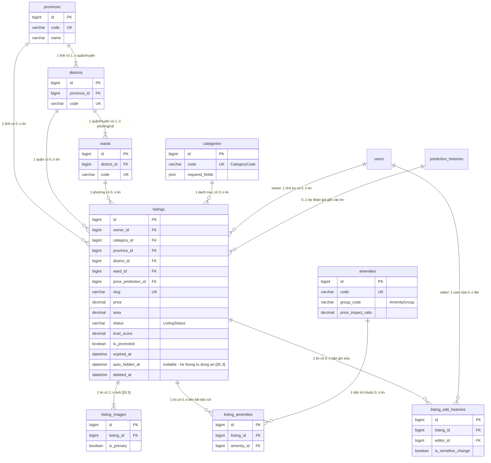
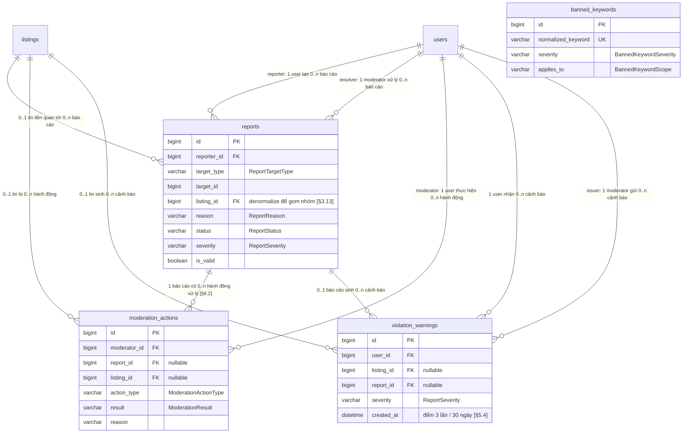
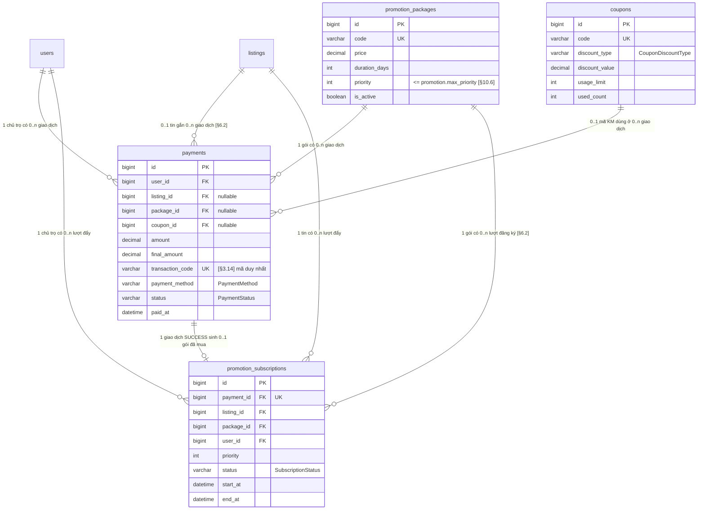
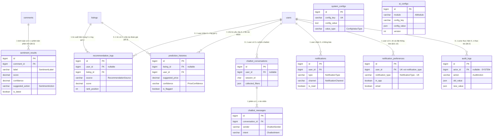
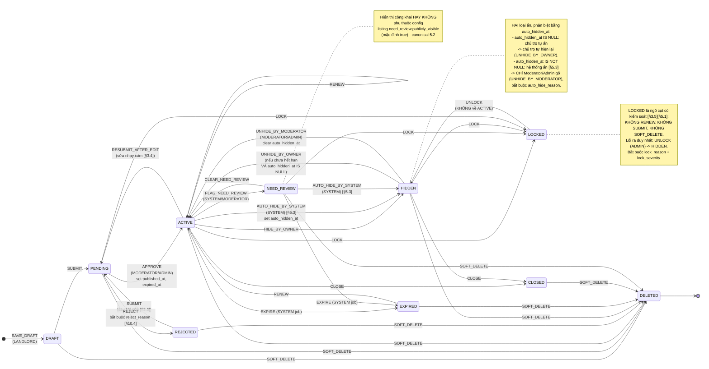

# 02 — Thiết kế Database

> **Phạm vi:** đặc tả đầy đủ 46 bảng của hệ thống *Website quảng cáo và tìm kiếm phòng trọ*,
> đủ chi tiết để viết thẳng ra file migration Flyway và entity JPA mà không cần hỏi lại.
> (45 bảng của canonical mục 6 + `notification_preferences` — bảng bắt buộc để thỏa
> `[§11.12]` *"Có thể tắt một số loại thông báo không quan trọng"*; xem §3.38 và phụ lục A.6.)
>
> **Nguồn ràng buộc:**
> - `00_CANONICAL_DECISIONS.md` — hợp đồng kỹ thuật. Mọi enum / tên bảng / tên cột /
>   permission code / config key trong tài liệu này **trùng khớp 100%** với canonical.
> - `PHAN_TICH_NGHIEP_VU_WEBSITE_PHONG_TRO.md` — tài liệu nghiệp vụ gốc. Mọi ký hiệu
>   `[§x.y]` tham chiếu trực tiếp tới tài liệu này.
>
> **Ký hiệu `[BỔ SUNG NGOÀI CANONICAL]`** đánh dấu những thứ canonical chưa liệt kê nhưng
> bắt buộc phải có để thỏa nghiệp vụ. File canonical **không bị sửa** bởi tài liệu này;
> các mục đó là đầu vào cho bước review đối chiếu.
>
> **DBMS đích:** MySQL 8.4 LTS. Toàn bộ cú pháp trong tài liệu là cú pháp MySQL 8.4.

---

## Mục lục

1. [Nguyên tắc thiết kế](#1-nguyên-tắc-thiết-kế)
2. [Sơ đồ ERD tổng quan](#2-sơ-đồ-erd-tổng-quan)
3. [Đặc tả chi tiết từng bảng (46 bảng)](#3-đặc-tả-chi-tiết-từng-bảng-46-bảng)
4. [Ràng buộc toàn vẹn nghiệp vụ ở tầng DB](#4-ràng-buộc-toàn-vẹn-nghiệp-vụ-ở-tầng-db)
5. [Chiến lược Index](#5-chiến-lược-index)
6. [Vòng đời tin đăng ở tầng dữ liệu](#6-vòng-đời-tin-đăng-ở-tầng-dữ-liệu)
7. [Chiến lược migration Flyway](#7-chiến-lược-migration-flyway)
8. [Dữ liệu seed chi tiết](#8-dữ-liệu-seed-chi-tiết)
9. [Truy vấn tiêu biểu + kế hoạch thực thi](#9-truy-vấn-tiêu-biểu--kế-hoạch-thực-thi)
10. [Sức chứa & bảo trì](#10-sức-chứa--bảo-trì)
11. [Quyết định thiết kế & lý do (ADR)](#11-quyết-định-thiết-kế--lý-do-adr)
12. [Phụ lục A — Tổng hợp `[BỔ SUNG NGOÀI CANONICAL]`](#12-phụ-lục-a--tổng-hợp-bổ-sung-ngoài-canonical)

---

## 1. Nguyên tắc thiết kế

### 1.1. Chuẩn hóa 3NF làm mặc định

Toàn bộ schema đạt **3NF**: không nhóm lặp, mọi thuộc tính không khóa phụ thuộc hoàn toàn
và trực tiếp vào khóa chính, không có phụ thuộc bắc cầu.

Ví dụ áp dụng:

- Địa chỉ hành chính tách thành 3 bảng `provinces` → `districts` → `wards` thay vì nhét
  chuỗi `"Phường 5, Quận 3, TP.HCM"` vào `listings` `[§6.1][§10.5]`.
- Tiện ích là quan hệ nhiều–nhiều qua `listing_amenities`, không phải cột `amenities TEXT`
  phân tách bằng dấu phẩy `[§6.2]`.
- `User ↔ Role` nhiều–nhiều qua `user_roles`, vì `[§1.2]`: *"Chủ trọ có toàn bộ quyền cơ bản
  của người thuê nếu hệ thống dùng chung tài khoản"* (canonical mục 4.1).

### 1.2. Những chỗ CỐ Ý phi chuẩn hóa (denormalize) và vì sao

`[§11.3]` yêu cầu *"Phân trang danh sách tin"* và tối ưu hiệu năng đọc. Trang tìm kiếm là
đường đi nóng nhất của hệ thống: mỗi trang 20 tin, nếu mỗi tin phải `COUNT()` lượt xem, lượt
lưu, lượt liên hệ, số bình luận và `AVG()` rating thì một request sinh ra ~5 subquery tổng hợp
trên các bảng lớn nhất (`view_histories`, `favorites`, `comments`). Do đó **cố ý** phi chuẩn hóa
các cột đếm sẵn sau.

| Bảng | Cột denormalize | Nguồn sự thật | Cách giữ đồng bộ | Căn cứ |
|---|---|---|---|---|
| `listings` | `view_count` | `COUNT(view_histories WHERE is_counted=1)` | Tăng nguyên tử khi ghi `view_histories` hợp lệ; job đêm đối soát | `[§3.8][§11.3]` |
| `listings` | `favorite_count` | `COUNT(favorites WHERE deleted_at IS NULL)` | Tăng/giảm trong cùng transaction lưu/bỏ lưu | `[§3.9]` |
| `listings` | `contact_count` | `COUNT(contact_logs WHERE is_counted=1)` | Tăng nguyên tử khi ghi `contact_logs` hợp lệ | `[§3.10][§2.6]` |
| `listings` | `comment_count` | `COUNT(comments WHERE status='VISIBLE')` | Tăng/giảm khi tạo/ẩn/xóa mềm bình luận | `[§3.11]` |
| `listings` | `positive_comment_count`, `negative_comment_count` | `COUNT(sentiment_results JOIN comments)` | Cập nhật sau khi sentiment trả kết quả; `TrustScoreRecalcJob` tính lại toàn bộ 02:00 | `[§9.1][§5.8]` |
| `listings` | `average_rating`, `review_count` | `AVG/COUNT(reviews WHERE status='VISIBLE')` | Tính lại trong transaction tạo/sửa/ẩn review | `[§3.12][§8.6]` |
| `listings` | `trust_score` | Công thức `[§5.8]` | Tính lại khi có sự kiện `[§5.7]` + `TrustScoreRecalcJob` | `[§5.8]` |
| `listings` | `need_review_count` | `COUNT(moderation_actions WHERE action_type='FLAG_NEED_REVIEW')` | Tăng khi state machine chuyển sang `NEED_REVIEW` | `[§9.1]` (ngưỡng "NeedReview 3 lần trong 30 ngày") |
| `landlord_profiles` | `total_listings`, `total_active_listings`, `average_rating`, `review_count`, `trust_score`, `locked_listing_count`, `warning_count` | tổng hợp từ `listings`/`reviews`/`violation_warnings` | `TrustScoreRecalcJob` 02:00 + cập nhật tức thời khi có sự kiện | `[§10.3][§5.7]` |
| `landlord_profiles` | `response_rate_percent`, `avg_response_minutes`, `response_conversation_count` | `conversations` (`created_at`, `first_response_at`) trong cửa sổ `trust.response_rate.window_days` | **Chỉ** `TrustScoreRecalcJob` 02:00 (§9.8) — cửa sổ trượt nên giá trị đổi theo thời gian **kể cả khi không có sự kiện**, không thể duy trì bằng UPDATE tăng dần | `[§5.7]` *"Chủ trọ phản hồi người thuê nhanh và đầy đủ nếu có module chat"* |
| `conversations` | `last_message_at`, `last_message_preview`, `tenant_unread_count`, `landlord_unread_count` | `messages` | Cập nhật trong transaction gửi/đọc tin nhắn | `[§2.6]` |
| `reports` | `listing_id` | suy ra từ `target_type` + `target_id` | Gán khi tạo report (kể cả report bình luận thì lấy `comment.listing_id`) | `[§3.13]` *"gom nhóm để xử lý"* |
| `comments` | `sentiment_label`, `sentiment_score` | `sentiment_results` (bản mới nhất) | Ghi đè khi có kết quả mới | `[§6.3]` (Comment có `SentimentLabel`, `SentimentScore`) |
| `promotion_packages` | `purchase_count` | `COUNT(promotion_subscriptions)` | Tăng khi kích hoạt gói | `[§10.6]` *"Xem số lượt mua"* |

**Nguyên tắc giữ đồng bộ (bắt buộc, 3 tầng):**

1. **Tầng ghi:** mọi thay đổi counter dùng UPDATE nguyên tử dạng
   `UPDATE listings SET favorite_count = favorite_count + 1 WHERE id = ?`
   (không `SELECT` rồi `SET` — tránh lost update), chạy trong **cùng `@Transactional`** với
   thao tác nghiệp vụ sinh ra nó. Không dùng trigger DB.
2. **Tầng chống trôi:** `TrustScoreRecalcJob` (02:00 hằng ngày, canonical mục 11) **tính lại
   từ nguồn sự thật** toàn bộ counter tổng hợp của `listings` và `landlord_profiles` bằng câu
   `UPDATE ... JOIN (SELECT ... GROUP BY ...)`. Nhờ đó sai lệch do lỗi ứng dụng tự lành sau ≤ 24h.
3. **Tầng chặn dưới:** `CHECK (view_count >= 0)`, `CHECK (favorite_count >= 0)`… để bug làm âm
   counter bị phát hiện ngay tại DB thay vì âm thầm.

> **Vì sao không dùng trigger MySQL?** Logic đếm phụ thuộc cấu hình
> (`view.dedup_minutes`, `contact.dedup_minutes`, `ai.sentiment.min_length`) đọc từ
> `system_configs` — trigger không đọc được cache Redis và không test được bằng unit test.
> Canonical mục 13 (DoD) yêu cầu *"Không hardcode ngưỡng — đọc từ SystemConfig"*.

### 1.3. Quy ước đặt tên (sao chép nguyên văn canonical mục 2)

| Đối tượng | Quy ước | Ví dụ |
|---|---|---|
| Bảng DB | `snake_case`, **số nhiều** | `listings`, `listing_amenities` |
| Cột DB | `snake_case` | `expired_at`, `trust_score` |
| Khóa chính | `id` — `BIGINT UNSIGNED AUTO_INCREMENT` | |
| Khóa ngoại | `<bảng_số_ít>_id` | `listing_id`, `owner_id` |
| Index | `idx_<bảng>_<cột>[_<cột>]` | `idx_listings_status_expired_at` |
| Unique | `uk_<bảng>_<cột>` | `uk_users_email` |
| Foreign key | `fk_<bảng>_<bảng_đích>` | `fk_listings_users` |
| Java class | `PascalCase` | `ListingServiceImpl` |
| Enum value | `UPPER_SNAKE_CASE` | `NEED_REVIEW` |
| REST path | `kebab-case`, danh từ số nhiều | `/api/promotion-packages` |
| JSON field | `camelCase` | `trustScore` |
| React component | `PascalCase.jsx` | `ListingCard.jsx` |
| React hook | `useCamelCase.js` | `useAuth.js` |

Bổ sung quy ước riêng cho tầng DB (nhất quán với tinh thần canonical mục 2):

| Đối tượng | Quy ước | Ví dụ |
|---|---|---|
| Check constraint | `ck_<bảng>_<ý_nghĩa>` | `ck_listings_price_positive` |
| Fulltext index | `ft_<bảng>_<cột>[_<cột>]` | `ft_listings_title_description` |
| Cột sinh (generated) phục vụ unique có điều kiện | `<cột>_uk` | `email_uk`, `phone_uk` |

> Khi một bảng có **2 khóa ngoại trỏ về cùng bảng đích** (ví dụ `follows` có
> `follower_id` và `landlord_id` cùng trỏ `users`), quy ước `fk_<bảng>_<bảng_đích>` bị trùng.
> Chốt: thêm hậu tố tên cột — `fk_follows_users_follower`, `fk_follows_users_landlord`.
> **[BỔ SUNG NGOÀI CANONICAL]** (canonical mục 2 không lường trường hợp self-reference kép).

### 1.4. Charset, collation, engine, timezone

```sql
CREATE DATABASE webtro
  CHARACTER SET utf8mb4
  COLLATE utf8mb4_unicode_ci;
```

Mọi bảng khai báo tường minh:

```sql
) ENGINE=InnoDB DEFAULT CHARSET=utf8mb4 COLLATE=utf8mb4_unicode_ci;
```

| Quyết định | Lý do |
|---|---|
| `utf8mb4` (**bắt buộc**) | Dữ liệu tiếng Việt có dấu + emoji trong bình luận/tin nhắn/chatbot. `utf8mb3` chỉ 3 byte/ký tự → **mất emoji** trong `comments.content`, `messages.content`, và `SentimentAnalyzer` có xử lý emoji (canonical mục 10.1). |
| `utf8mb4_unicode_ci` | So sánh **không phân biệt hoa/thường và phân biệt dấu** theo chuẩn UCA. `"Quận 1"` = `"quận 1"` nhưng `"co"` ≠ `"có"` — đúng nghiệp vụ tìm kiếm tiếng Việt. Không dùng `utf8mb4_general_ci` (thuật toán rút gọn, sai thứ tự sắp xếp tiếng Việt). Không dùng `utf8mb4_0900_ai_ci` (mặc định của MySQL 8) vì nó **accent-insensitive**: `"ma"` = `"mà"` = `"mã"` → tìm kiếm và unique key trên `email`/`code` sẽ khớp sai. |
| `ENGINE=InnoDB` | Bắt buộc: transaction ACID cho luồng thanh toán `[§3.14]`, foreign key, row-level lock cho counter nguyên tử, crash recovery `[§11.5]`. MyISAM không có transaction/FK. |
| **Timezone UTC** | `TIMESTAMP`/`DATETIME` lưu **UTC tuyệt đối**. Container MySQL chạy `--default-time-zone=+00:00`; JVM chạy `-Duser.timezone=UTC`; JDBC URL có `connectionTimeZone=UTC&forceConnectionTimeZoneToSession=true`. API trả ISO-8601 UTC (`Instant`) đúng canonical mục 7.3. Frontend đổi sang `Asia/Ho_Chi_Minh` bằng DayJS locale `vi`. Không bao giờ lưu giờ địa phương xuống DB. |

**Kiểu cột thời gian:** dùng `DATETIME(6)` (không dùng `TIMESTAMP`).
Lý do: `TIMESTAMP` của MySQL bị giới hạn **2038-01-19** (32-bit epoch) và tự chuyển đổi
timezone theo session — nếu một client kết nối sai timezone thì dữ liệu **đọc ra sai**.
`DATETIME(6)` lưu nguyên văn giá trị đã chuẩn hóa UTC ở tầng ứng dụng, không có
2038-problem, và có độ chính xác microgiây (cần cho `view.dedup_minutes` và cho thứ tự
`messages` trong cùng giây). Hibernate map `Instant` ↔ `DATETIME(6)`.

### 1.5. Soft delete toàn hệ thống

`[§3.6]`: *"Xóa mềm — Dữ liệu vẫn giữ để audit và báo cáo"*, *"Không xóa cứng tin nếu có
thanh toán, báo cáo hoặc bình luận liên quan"*, **và quan trọng nhất**: *"Admin vẫn xem được
tin đã xóa mềm"*. `[§10.2]`: *"Không xóa cứng user có giao dịch, tin đăng hoặc report"*.
`[§11.5]`: *"Không xóa cứng dữ liệu nghiệp vụ quan trọng"*.

**Quy tắc chốt:**

- Mọi bảng nghiệp vụ (kế thừa `AuditableEntity`, canonical mục 6.1) có cột
  `deleted_at DATETIME(6) NULL`. `NULL` = còn sống.
- **Không có câu `DELETE` vật lý** nào cho dữ liệu nghiệp vụ trong source. Xóa = `UPDATE ... SET deleted_at = :now`.
- Bảng tra cứu (`provinces`, `districts`, `wards`, `amenities`, `categories`) **không** có
  `deleted_at`; chúng dùng `is_active BOOLEAN` để "ẩn" — đúng `[§10.5]` (*"Thêm/sửa/**ẩn** loại tin"*,
  *"Thêm/sửa/**ẩn** tiện ích"*). Ẩn danh mục không được làm hỏng FK của tin cũ.
- `listings` có **cả** `status = 'DELETED'` (enum `ListingStatus`, canonical mục 5) **và**
  `deleted_at`. Hai thứ này luôn được set cùng lúc bởi sự kiện `SOFT_DELETE` của
  `ListingStateMachine`; `status` phục vụ state machine, `deleted_at` phục vụ filter chung
  và `TokenCleanupJob`/thống kê. Tương tự `users.status = 'DELETED'`.

**VÌ SAO KHÔNG DÙNG `@Where`/`@SQLRestriction` CỦA HIBERNATE — quyết định bắt buộc:**

`@Where(clause = "deleted_at IS NULL")` (Hibernate 6: `@SQLRestriction`) gắn điều kiện lọc
**vĩnh viễn ở tầng entity**, áp cho **mọi** truy vấn HQL/Criteria/lazy-load, **không thể tắt**.
Hậu quả trực tiếp lên nghiệp vụ:

1. `[§3.6]` — *"Admin vẫn xem được tin đã xóa mềm"*: màn hình `/admin/tin-dang` phải liệt kê
   được tin `DELETED`. Với `@Where`, `listingRepository.findById(id)` của Admin trả `Optional.empty()`
   → **không thể hiện thực yêu cầu này** bằng JPA nữa, phải rơi xuống native SQL cho toàn bộ
   module admin.
2. `[§11.4]` Audit: `audit_logs.target_id` trỏ tới tin đã xóa; màn hình audit phải hiển thị
   được tên tin. `@Where` làm join này trả `null`.
3. `[§3.6]` *"Tin Closed có thể dùng để thống kê tỷ lệ thành công"* và dashboard `[§10.1]`
   cần đếm **cả** dữ liệu đã xóa mềm để ra tỷ lệ đúng.
4. `@Where` áp lên cả `@OneToMany` → `listing.getPayments()` sẽ ẩn payment đã xóa mềm, trong
   khi `[§3.6]` cấm xóa tin có thanh toán liên quan (cần đếm chính xác).

**Thay bằng:** điều kiện `deleted_at IS NULL` viết **tường minh trong repository query**.

```java
public interface ListingRepository extends JpaRepository<Listing, Long>,
                                           JpaSpecificationExecutor<Listing> {

    /** Dùng cho MỌI luồng công khai và luồng chủ sở hữu. */
    @Query("SELECT l FROM Listing l WHERE l.id = :id AND l.deletedAt IS NULL")
    Optional<Listing> findAliveById(@Param("id") Long id);

    /** CHỈ dùng cho Admin/Moderator có LISTING_VIEW_ANY — thấy cả tin đã xóa mềm [§3.6]. */
    @Query("SELECT l FROM Listing l WHERE l.id = :id")
    Optional<Listing> findAnyById(@Param("id") Long id);
}
```

Quy ước bắt buộc để không quên: **`findById` kế thừa từ `JpaRepository` bị cấm dùng trực tiếp
trong service nghiệp vụ**; chỉ được gọi `findAliveById` hoặc `findAnyById`. Với truy vấn động
(`Specification`), `ListingSpecifications.alive()` là predicate bắt buộc đầu tiên và được
kiểm tra bằng ArchUnit test.

### 1.6. Kiểu dữ liệu chuẩn (bắt buộc, dùng thống nhất toàn schema)

| Nghiệp vụ | Kiểu MySQL | Kiểu Java | Lý do |
|---|---|---|---|
| Tiền (giá thuê, cọc, số tiền thanh toán, giá gói) | `DECIMAL(15,2)` | `BigDecimal` | Canonical mục 7.3: *"Tiền: BigDecimal(15,2), VND"*. `DECIMAL` là số thập phân chính xác → không có sai số nhị phân. **Tuyệt đối không `DOUBLE`/`FLOAT`**: `0.1+0.2 != 0.3` sẽ làm lệch đối soát thanh toán `[§10.7]`. `15,2` chứa tối đa 9.999.999.999.999,99 VND — thừa cho giá thuê và doanh thu gói `[§10.1]`. |
| Giá điện, giá nước (đồng/kWh, đồng/m³) | `DECIMAL(15,2)` | `BigDecimal` | Cùng họ "tiền" `[§3.3]` (`ElectricityPrice`, `WaterPrice`), dùng chung kiểu để cộng/so sánh không phải ép kiểu. |
| Diện tích (m²) | `DECIMAL(8,2)` | `BigDecimal` | `[§3.3]` *"Diện tích > 0"*. `8,2` = tối đa 999.999,99 m² — thừa cho nhà nguyên căn/mặt bằng `[§0.3]`. Cần chính xác vì AI dự đoán giá chia `price/area` `[§9.4]`. |
| Vĩ độ | `DECIMAL(10,7)` | `BigDecimal` | Phạm vi ±90 → 2 chữ số phần nguyên (dư 1), 7 chữ số thập phân ≈ **1,1 cm** — thừa để định vị nhà trọ `[§3.3]` (*"Latitude/Longitude nếu có bản đồ"*). Chính xác tuyệt đối, không trôi như `DOUBLE`. |
| Kinh độ | `DECIMAL(10,7)` | `BigDecimal` | Phạm vi ±180 → 3 chữ số phần nguyên vừa đủ (`180.0000000`). Chốt cùng `(10,7)` với vĩ độ cho đồng nhất, theo yêu cầu đề bài. |
| Enum | `VARCHAR(N)` + `@Enumerated(EnumType.STRING)` | `enum` | Xem §1.7. |
| Điểm uy tín | `DECIMAL(5,2)` | `BigDecimal` | `[§5.8]` công thức có `AverageRating * 5` → giá trị có phần thập phân; giới hạn 0–100. |
| Sentiment score | `DECIMAL(4,3)` | `BigDecimal` | Canonical mục 10.1: `score ∈ [-1,1]`, cần 3 chữ số thập phân → `-1.000`…`1.000`. |
| Confidence | `DECIMAL(4,3)` | `BigDecimal` | `∈ [0,1]`, so sánh với ngưỡng `0.5` (canonical mục 10.1). |
| Rating | `TINYINT UNSIGNED` | `Integer` | `[§3.12]` *"Rating từ 1 đến 5"*. |
| Boolean | `BOOLEAN` (alias `TINYINT(1)`) | `Boolean` | |
| Khóa chính / khóa ngoại | `BIGINT UNSIGNED` | `Long` | Canonical mục 2. `UNSIGNED` gấp đôi dải dương và chặn id âm. |
| Chuỗi ngắn có ràng buộc | `VARCHAR(n)` | `String` | |
| Nội dung dài | `TEXT` / `MEDIUMTEXT` | `String` | `description` ≤ 3000 ký tự `[§3.3]` → `VARCHAR` sẽ vượt giới hạn row 65535 byte khi nhân 4 (utf8mb4) cùng các cột khác → dùng `TEXT`. |
| Dữ liệu bán cấu trúc | `JSON` | `String` (map bằng Jackson trong service) | Chỉ dùng cho dữ liệu **không truy vấn theo điều kiện quan hệ**: `search_histories.criteria`, `audit_logs.old_value/new_value`, `chatbot_messages.extracted_slots`. |
| Hash SHA-256 | `CHAR(64)` | `String` | Cố định độ dài → `CHAR` nhanh hơn `VARCHAR`. |
| UUID | `CHAR(36)` | `String` | |
| Địa chỉ IP | `VARCHAR(45)` | `String` | Đủ chứa IPv6 dạng đầy đủ + IPv4-mapped. |

#### 1.7. Vì sao enum lưu `VARCHAR` + `@Enumerated(STRING)`

**Không dùng `EnumType.ORDINAL`:**

- ORDINAL lưu **chỉ số thứ tự** (0,1,2…). Chèn một hằng số mới vào **giữa** enum Java làm
  **toàn bộ dữ liệu cũ bị hiểu sai** — im lặng, không lỗi, không cách nào phát hiện.
  Ví dụ `ListingStatus` có 10 giá trị `[§0.4]` + `DELETED`; chỉ cần một người thêm
  `PENDING_PAYMENT` vào giữa là `ACTIVE` biến thành `REJECTED` trên toàn bảng `listings`.
- Dump SQL/backup `[§11.5]` đọc ra số `3` thì không ai biết là gì → không khôi phục thủ công được.
- Truy vấn thủ công của Admin (`WHERE status = 3`) không đọc được, gây sai sót khi vận hành.
- Canonical mục 5 đã chốt: *"Mọi enum lưu DB dưới dạng VARCHAR + @Enumerated(EnumType.STRING)
  (không dùng ORDINAL — ordinal vỡ khi chèn giá trị mới)"*.

**Không dùng kiểu `ENUM(...)` của MySQL:**

| Vấn đề | Chi tiết |
|---|---|
| Thêm giá trị = `ALTER TABLE` | MySQL 8 phải rebuild bảng (hoặc dùng `ALGORITHM=INSTANT` chỉ khi thêm vào **cuối** danh sách). Trên `listings` vài trăm nghìn dòng đây là downtime thật. Với `VARCHAR`, thêm enum value chỉ là thay đổi code Java + không đụng DB. |
| Ngữ nghĩa số ngầm | `ENUM` lưu nội bộ dạng index; `ORDER BY status` sắp theo **thứ tự khai báo** chứ không theo alphabet → bất ngờ khó debug. `WHERE status = 0` trả về dòng lỗi thay vì báo lỗi. |
| Không portable | Test dùng H2/Testcontainers, DDL `ENUM` không chuẩn SQL. |
| Hibernate `ddl-auto=validate` | Hibernate map `String` → `VARCHAR`; nếu DB là `ENUM` thì validate **fail** (canonical mục 13.6 bắt buộc `validate`). |
| Trùng lặp nguồn sự thật | Danh sách giá trị nằm ở **2 nơi** (enum Java + DDL) → chắc chắn lệch nhau sau vài sprint. Canonical mục 5 là nguồn sự thật duy nhất. |

**Chốt:** `VARCHAR(n)` với `n` = độ dài hằng số dài nhất **làm tròn lên** mốc an toàn, kèm
`CHECK (col IN (...))` liệt kê **đúng** các hằng số của canonical mục 5. Check constraint bù lại
đúng thứ mà `ENUM` cho ta (chặn giá trị rác từ script tay/migration sai) mà **không** mang theo
nhược điểm nào ở trên: sửa `CHECK` là DDL nhẹ, và nó tự tài liệu hóa trong `SHOW CREATE TABLE`.

Bảng độ dài chốt cho từng enum (dùng thống nhất, không được tự ý đổi):

| Enum (canonical mục 5) | Giá trị dài nhất | Kiểu cột |
|---|---|---|
| `UserStatus` | `PENDING_VERIFY` (14) | `VARCHAR(20)` |
| `Gender` | `UNKNOWN` (7) | `VARCHAR(10)` |
| `ListingStatus` | `NEED_REVIEW` (11) | `VARCHAR(20)` |
| `CategoryCode` | `BOARDING_HOUSE` (14) | `VARCHAR(20)` |
| `GenderRequirement` | `FEMALE_ONLY` (11) | `VARCHAR(15)` |
| `CurfewType` | `UNKNOWN` (7) | `VARCHAR(10)` |
| `FurnitureStatus` | `BASIC` (5) | `VARCHAR(10)` |
| `ToiletType` | `PRIVATE` (7) | `VARCHAR(10)` |
| `CommentStatus` | `VISIBLE` (7) | `VARCHAR(10)` |
| `SentimentLabel` | `PENDING_ANALYSIS` (16) | `VARCHAR(20)` |
| `SentimentAction` | `NEED_REVIEW` (11) | `VARCHAR(15)` |
| `ReviewStatus` | `VISIBLE` (7) | `VARCHAR(10)` |
| `ReportTargetType` | `LISTING` (7) | `VARCHAR(10)` |
| `ReportReason` | `ALREADY_RENTED` (14) | `VARCHAR(20)` |
| `ReportStatus` | `REVIEWING` (9) | `VARCHAR(10)` |
| `ReportSeverity` | `CRITICAL` (8) | `VARCHAR(10)` |
| `ModerationResult` | `NO_VIOLATION` (12) | `VARCHAR(15)` |
| `ModerationActionType` | `FLAG_NEED_REVIEW` (16) | `VARCHAR(20)` |
| `PaymentStatus` | `CANCELLED` (9) | `VARCHAR(10)` |
| `PaymentMethod` | `BANK_TRANSFER` (13) | `VARCHAR(20)` |
| `SubscriptionStatus` | `CANCELLED` (9) | `VARCHAR(10)` |
| `NotificationType` | `FOLLOWED_LANDLORD_NEW_LISTING` (29) | `VARCHAR(40)` |
| `NotificationChannel` | `IN_APP` (6) | `VARCHAR(10)` |
| `VerificationType` | `LANDLORD` (8) | `VARCHAR(10)` |
| `VerificationStatus` | `VERIFIED` (8) | `VARCHAR(10)` |
| `ChatbotIntent` | `HOW_TO_POST` (11) | `VARCHAR(15)` |
| `RecommendationSource` | `LOW_RESULT_SEARCH` (17) | `VARCHAR(20)` |
| `PriceConfidence` | `INSUFFICIENT_DATA` (17) | `VARCHAR(20)` |
| `AuditAction` | `SYSTEM_CONFIG_CHANGE` (20) | `VARCHAR(25)` |

### 1.8. Quy ước cột chung (canonical mục 6.1)

`AuditableEntity` — áp cho **mọi bảng nghiệp vụ**:

```sql
  id          BIGINT UNSIGNED NOT NULL AUTO_INCREMENT PRIMARY KEY,
  ...
  created_at  DATETIME(6)     NOT NULL DEFAULT CURRENT_TIMESTAMP(6),
  updated_at  DATETIME(6)     NOT NULL DEFAULT CURRENT_TIMESTAMP(6) ON UPDATE CURRENT_TIMESTAMP(6),
  created_by  BIGINT UNSIGNED NULL,
  updated_by  BIGINT UNSIGNED NULL,
  deleted_at  DATETIME(6)     NULL
```

- `created_by` / `updated_by` do **JPA Auditing** (`@CreatedBy`/`@LastModifiedBy` +
  `AuditorAware` lấy từ `SecurityContext`) điền, **không** phải FK ràng buộc — vì hành động
  của SYSTEM (job nền, canonical mục 11) không có user → giá trị `NULL`. Không đặt FK để tránh
  `NULL`-FK vô nghĩa và để không chặn được việc ẩn danh hóa user sau này.
- `DEFAULT CURRENT_TIMESTAMP(6)` là **lưới an toàn** cho seed SQL; nguồn sự thật khi chạy app
  là JPA Auditing (đảm bảo giá trị đúng UTC theo JVM).
- Bảng tra cứu (`provinces`, `districts`, `wards`, `amenities`, `categories`) chỉ có
  `id`, `created_at`, `updated_at` — đúng canonical mục 6.1.
- Bảng thuần append-only (`view_histories`, `search_histories`, `audit_logs`,
  `recommendation_logs`, `chatbot_messages`) chỉ cần `id` + `created_at`: chúng **không bao giờ**
  bị sửa hay xóa mềm, chỉ bị dọn theo lịch (xem §10). Đặt thêm 5 cột audit cho chúng là lãng phí
  ~30 byte/dòng × hàng chục triệu dòng.

---

## 2. Sơ đồ ERD tổng quan

Ký hiệu cardinality của mermaid dùng trong tài liệu:
`||--o{` = 1 : 0..n · `||--|{` = 1 : 1..n · `||--o|` = 1 : 0..1 · `}o--o{` = n : m.

### 2.1. (a) Auth & User & Permission

```mermaid
erDiagram
    users ||--o{ user_roles : "1 user có 0..n gán vai trò"
    roles ||--o{ user_roles : "1 role được gán cho 0..n user"
    roles ||--o{ role_permissions : "1 role có 0..n quyền"
    permissions ||--o{ role_permissions : "1 quyền thuộc 0..n role"
    users ||--o| user_profiles : "1 user có 0..1 hồ sơ cá nhân"
    users ||--o| landlord_profiles : "1 user có 0..1 hồ sơ chủ trọ"
    users ||--o{ verifications : "1 user có 0..n yêu cầu xác thực"
    users ||--o{ refresh_tokens : "1 user có 0..n refresh token"
    users ||--o{ password_reset_tokens : "1 user có 0..n token đặt lại MK"
    users ||--o{ follows : "follower: 1 user theo dõi 0..n chủ trọ"
    users ||--o{ follows : "landlord: 1 chủ trọ có 0..n người theo dõi"

    users {
        bigint id PK
        varchar email UK "uk_users_email qua email_uk"
        varchar phone UK "uk_users_phone qua phone_uk"
        varchar password_hash
        varchar status "UserStatus"
        datetime deleted_at
    }
    roles {
        bigint id PK
        varchar code UK "ROLE_TENANT|ROLE_LANDLORD|ROLE_MODERATOR|ROLE_ADMIN"
    }
    permissions {
        bigint id PK
        varchar code UK "LISTING_CREATE ..."
    }
    user_roles {
        bigint id PK
        bigint user_id FK
        bigint role_id FK
    }
    role_permissions {
        bigint id PK
        bigint role_id FK
        bigint permission_id FK
    }
    user_profiles {
        bigint id PK
        bigint user_id FK "UK"
    }
    landlord_profiles {
        bigint id PK
        bigint user_id FK "UK"
        decimal trust_score
        varchar verification_status "VerificationStatus"
        boolean allow_chat "[§3.10]"
        tinyint response_rate_percent "nullable - ty le phan hoi [§5.7]"
        int avg_response_minutes "nullable"
    }
    verifications {
        bigint id PK
        bigint user_id FK
        varchar type "VerificationType"
        varchar status "VerificationStatus"
    }
    refresh_tokens {
        bigint id PK
        bigint user_id FK
        char token_hash UK
        char family_id
    }
    password_reset_tokens {
        bigint id PK
        bigint user_id FK
        char token_hash UK
    }
    follows {
        bigint id PK
        bigint follower_id FK
        bigint landlord_id FK
    }
```



### 2.2. (b) Catalog & Listing



### 2.3. (c) Interaction

```mermaid
erDiagram
    users ||--o{ favorites : "1 user lưu 0..n tin"
    listings ||--o{ favorites : "1 tin được 0..n user lưu"
    users ||--o{ view_histories : "1 user (hoặc khách) xem 0..n lượt"
    listings ||--o{ view_histories : "1 tin có 0..n lượt xem"
    users ||--o{ search_histories : "1 user có 0..n lượt tìm"
    users ||--o{ contact_logs : "tenant: 1 user liên hệ 0..n lượt"
    users ||--o{ contact_logs : "owner: 1 chủ trọ nhận 0..n lượt"
    listings ||--o{ contact_logs : "1 tin có 0..n lượt liên hệ"
    listings ||--o{ conversations : "1 tin có 0..n hội thoại"
    users ||--o{ conversations : "tenant: 1 user có 0..n hội thoại"
    users ||--o{ conversations : "landlord: 1 chủ trọ có 0..n hội thoại"
    conversations ||--|{ messages : "1 hội thoại có 1..n tin nhắn"
    users ||--o{ messages : "sender: 1 user gửi 0..n tin nhắn"
    listings ||--o{ comments : "1 tin có 0..n bình luận"
    users ||--o{ comments : "1 user viết 0..n bình luận"
    comments ||--o{ comments : "1 bình luận cha có 0..n trả lời"
    listings ||--o{ reviews : "1 tin có 0..n đánh giá"
    users ||--o{ reviews : "1 user viết 0..n đánh giá"
    users ||--o{ reviews : "landlord: 1 chủ trọ nhận 0..n đánh giá"

    favorites {
        bigint id PK
        bigint user_id FK "uk_favorites_user_listing"
        bigint listing_id FK
    }
    view_histories {
        bigint id PK
        bigint listing_id FK
        bigint user_id FK "nullable - khách ẩn danh"
        boolean is_counted
        datetime viewed_at
    }
    search_histories {
        bigint id PK
        bigint user_id FK "nullable"
        json criteria
        int result_count
    }
    contact_logs {
        bigint id PK
        bigint listing_id FK
        bigint user_id FK
        bigint owner_id FK
        varchar contact_type "ContactType"
        boolean is_counted
    }
    conversations {
        bigint id PK
        bigint listing_id FK
        bigint tenant_id FK
        bigint landlord_id FK
        varchar status "ConversationStatus"
        datetime first_response_at "nullable - moc chu tro tra loi dau tien [§5.7]"
    }
    messages {
        bigint id PK
        bigint conversation_id FK
        bigint sender_id FK
    }
    comments {
        bigint id PK
        bigint listing_id FK
        bigint user_id FK
        bigint parent_id FK
        varchar status "CommentStatus"
        varchar sentiment_label "SentimentLabel"
    }
    reviews {
        bigint id PK
        bigint listing_id FK "uk_reviews_user_listing"
        bigint user_id FK
        bigint landlord_id FK
        tinyint rating
        varchar status "ReviewStatus"
    }
```



### 2.4. (d) Moderation



> `banned_keywords` là **bảng độc lập** (không FK) — nó là từ điển cấu hình do Admin quản lý
> `[§11.10]` *"Chặn từ khóa cấm"*, được nạp vào cache Redis và dùng bởi validator
> `@NoBannedKeyword` (canonical mục 3).

### 2.5. (e) Payment & Promotion



### 2.6. (f) AI & Notification & Admin



---

## 3. Đặc tả chi tiết từng bảng (46 bảng)

> **Quy ước đọc bảng đặc tả:** cột `Khóa` dùng `PK` (primary key), `FK` (foreign key),
> `UK` (thành phần của unique key), `IDX` (thành phần của index thường).
> Mọi cột `created_at`/`updated_at` mang nghĩa mặc định như §1.8 nên chỉ ghi mô tả khi có
> ý nghĩa nghiệp vụ riêng.

### Nhóm auth/user — 11 bảng

#### 3.1. `users`

Tài khoản người dùng. Thuộc tính khớp **chính xác** danh sách `[§6.3] User`
(Id, FullName, Email, Phone, PasswordHash, AvatarUrl, Gender, Status, CreatedAt, LastLoginAt),
mở rộng thêm các cột bắt buộc để thỏa `[§3.1][§3.2][§10.2]`.

| Cột | Kiểu | Null | Mặc định | Khóa | Mô tả nghiệp vụ | Căn cứ |
|---|---|---|---|---|---|---|
| `id` | `BIGINT UNSIGNED` | N | `AUTO_INCREMENT` | PK | Định danh tài khoản | `[§6.3]` |
| `full_name` | `VARCHAR(100)` | N | — | IDX | Họ tên. Đã qua `HtmlSanitizer` | `[§3.1]` *"Họ tên không rỗng, không chứa ký tự nguy hiểm"* |
| `email` | `VARCHAR(190)` | N | — | IDX | Email đăng nhập, lưu **lowercase** do service chuẩn hóa | `[§3.1]` *"Một email chỉ thuộc một tài khoản"* |
| `phone` | `VARCHAR(15)` | Y | `NULL` | IDX | SĐT Việt Nam đã chuẩn hóa `+84…` → `0…` bởi `PhoneUtil` | `[§3.1]` *"Số điện thoại Việt Nam hợp lệ"* |
| `password_hash` | `VARCHAR(72)` | N | — | | BCrypt cost 12 (60 ký tự; 72 dự phòng) | canonical mục 8 |
| `avatar_url` | `VARCHAR(500)` | Y | `NULL` | | Ảnh đại diện | `[§6.3]` |
| `gender` | `VARCHAR(10)` | N | `'UNKNOWN'` | | `Gender` | canonical mục 5 |
| `status` | `VARCHAR(20)` | N | `'PENDING_VERIFY'` | IDX | `UserStatus`. Mặc định `PENDING_VERIFY` vì `[§3.1]` bước 5 gửi email xác thực | `[§6.3][§3.1]` |
| `email_verified_at` | `DATETIME(6)` | Y | `NULL` | | Mốc xác thực email | `[§2.1]` AUTH-06 |
| `phone_verified_at` | `DATETIME(6)` | Y | `NULL` | | Mốc xác thực SĐT | `[§2.1]` AUTH-06 |
| `last_login_at` | `DATETIME(6)` | Y | `NULL` | | *"Mỗi lần đăng nhập thành công ghi nhận thời gian đăng nhập cuối"* | `[§3.2][§6.3]` |
| `failed_login_count` | `INT UNSIGNED` | N | `0` | | Số lần sai liên tiếp; reset về 0 khi đăng nhập thành công | `[§3.2]` |
| `locked_until` | `DATETIME(6)` | Y | `NULL` | | Khóa **tạm** 15 phút do sai mật khẩu quá ngưỡng. Khác `status='LOCKED'` (khóa vĩnh viễn do vi phạm) | `[§3.2]` + canonical mục 8 |
| `lock_reason` | `VARCHAR(500)` | Y | `NULL` | | Lý do Admin khóa tài khoản — **bắt buộc** khi `status='LOCKED'` | `[§10.2]` *"Khóa tài khoản phải có lý do"* |
| `locked_by` | `BIGINT UNSIGNED` | Y | `NULL` | | Admin đã khóa | `[§11.4]` |
| `locked_at` | `DATETIME(6)` | Y | `NULL` | | Mốc khóa | `[§11.4]` |
| `comment_restricted_until` | `DATETIME(6)` | Y | `NULL` | | *"10 bình luận spam trong 1 giờ: tạm khóa chức năng bình luận"* | `[§5.4]` |
| `contact_restricted_until` | `DATETIME(6)` | Y | `NULL` | | *"Người dùng bị report spam có thể bị hạn chế liên hệ"* | `[§3.10]` |
| `email_uk` | `VARCHAR(190) GENERATED` | Y | sinh | UK | Cột sinh phục vụ unique có điều kiện — xem §4.1 | `[§3.1]` |
| `phone_uk` | `VARCHAR(15) GENERATED` | Y | sinh | UK | Như trên | `[§3.1]` |
| `created_at` | `DATETIME(6)` | N | `CURRENT_TIMESTAMP(6)` | IDX | Dùng cho quy tắc "tài khoản mới < 7 ngày" | `[§9.1]`, config `ai.sentiment.new_account_days` |
| `updated_at` | `DATETIME(6)` | N | `CURRENT_TIMESTAMP(6)` on update | | | canonical 6.1 |
| `created_by` | `BIGINT UNSIGNED` | Y | `NULL` | | `NULL` khi tự đăng ký | canonical 6.1 |
| `updated_by` | `BIGINT UNSIGNED` | Y | `NULL` | | | canonical 6.1 |
| `deleted_at` | `DATETIME(6)` | Y | `NULL` | | Xóa mềm — *"Không xóa cứng user có giao dịch, tin đăng hoặc report"* | `[§10.2]` |

```sql
  email_uk VARCHAR(190) GENERATED ALWAYS AS
      (IF(deleted_at IS NULL AND status <> 'DELETED', LOWER(email), NULL)) STORED,
  phone_uk VARCHAR(15) GENERATED ALWAYS AS
      (IF(deleted_at IS NULL AND status <> 'DELETED', phone, NULL)) STORED,
```

**Index**

| Tên | Cột | Lý do |
|---|---|---|
| `idx_users_status` | `(status)` | `[§10.2]` *"Lọc theo vai trò, trạng thái"* |
| `idx_users_full_name` | `(full_name)` | `[§10.2]` *"Tìm kiếm theo tên"* (prefix `LIKE 'x%'`) |
| `idx_users_created_at` | `(created_at)` | Dashboard *"Số… mới trong ngày/tuần/tháng"* `[§10.1]`; quy tắc tài khoản mới `[§9.1]` |
| `idx_users_email_lookup` | `(email)` | Đăng nhập bằng email `[§3.2]`. **Cần riêng** vì `uk_users_email` nằm trên `email_uk`, không phục vụ `WHERE email = ?` của tài khoản đã xóa mềm (luồng Admin) |
| `idx_users_phone_lookup` | `(phone)` | Đăng nhập bằng SĐT + tìm kiếm Admin `[§3.2][§10.2]` |

**Unique constraint**

| Tên | Cột | Ý nghĩa |
|---|---|---|
| `uk_users_email` | `(email_uk)` | 1 email chỉ thuộc 1 tài khoản **đang hoạt động** `[§3.1]` |
| `uk_users_phone` | `(phone_uk)` | 1 SĐT **nên** chỉ thuộc 1 tài khoản **đang hoạt động** `[§3.1]` |

**Foreign key** — không có (bảng gốc). `locked_by`, `created_by`, `updated_by` là cột audit
mềm, không ràng buộc FK (§1.8).

**Check constraint**

```sql
CONSTRAINT ck_users_status CHECK (status IN ('ACTIVE','PENDING_VERIFY','LOCKED','DELETED')),
CONSTRAINT ck_users_gender CHECK (gender IN ('MALE','FEMALE','OTHER','UNKNOWN')),
CONSTRAINT ck_users_failed_login CHECK (failed_login_count >= 0),
CONSTRAINT ck_users_lock_reason CHECK (status <> 'LOCKED' OR lock_reason IS NOT NULL)
```

> `ck_users_lock_reason` là hiện thực **ở tầng DB** của `[§10.2]` *"Khóa tài khoản phải có lý do"*
> — DB biểu diễn được nên phải làm ở DB, không chỉ ở validator.

#### 3.2. `roles`

| Cột | Kiểu | Null | Mặc định | Khóa | Mô tả nghiệp vụ | Căn cứ |
|---|---|---|---|---|---|---|
| `id` | `BIGINT UNSIGNED` | N | `AUTO_INCREMENT` | PK | | |
| `code` | `VARCHAR(30)` | N | — | UK | `ROLE_TENANT` / `ROLE_LANDLORD` / `ROLE_MODERATOR` / `ROLE_ADMIN` | canonical 4.1, `[§1.1]` |
| `name` | `VARCHAR(50)` | N | — | | Tên hiển thị tiếng Việt | canonical 4.1 |
| `description` | `VARCHAR(255)` | Y | `NULL` | | | |
| `is_system` | `BOOLEAN` | N | `TRUE` | | Role hệ thống → Admin **không được** xóa | `[§11.2]` |
| `display_order` | `INT` | N | `0` | | Thứ tự hiển thị màn hình phân quyền | `[§10.2]` |
| `created_at` / `updated_at` / `created_by` / `updated_by` / `deleted_at` | | | | | Chuẩn `AuditableEntity` | canonical 6.1 |

**Index** `idx_roles_is_system (is_system)` — lọc role hệ thống ở màn hình `[§10.2]`.
**Unique** `uk_roles_code (code)`.
**FK** không có.
**Check** `ck_roles_code CHECK (code IN ('ROLE_TENANT','ROLE_LANDLORD','ROLE_MODERATOR','ROLE_ADMIN'))`
— chốt cứng 4 role của canonical 4.1; thêm role mới là quyết định kiến trúc, phải qua migration.

#### 3.3. `user_roles`

Bảng nối nhiều–nhiều `[§6.1] UserRole`, `[§6.2]` *"Một user có thể có một hoặc nhiều role"*.

| Cột | Kiểu | Null | Mặc định | Khóa | Mô tả nghiệp vụ | Căn cứ |
|---|---|---|---|---|---|---|
| `id` | `BIGINT UNSIGNED` | N | `AUTO_INCREMENT` | PK | Khóa thay thế (canonical mục 2 bắt buộc `id`) | canonical 2 |
| `user_id` | `BIGINT UNSIGNED` | N | — | FK, UK | | `[§6.2]` |
| `role_id` | `BIGINT UNSIGNED` | N | — | FK, UK | | `[§6.2]` |
| `assigned_at` | `DATETIME(6)` | N | `CURRENT_TIMESTAMP(6)` | | Mốc cấp quyền | `[§10.2]` *"Cấp hoặc thu hồi role"* |
| `assigned_by` | `BIGINT UNSIGNED` | Y | `NULL` | | Admin cấp; `NULL` = hệ thống gán `ROLE_TENANT` lúc đăng ký | `[§11.4]` *"Thay đổi role"* cần audit |
| `created_at` / `updated_at` / `created_by` / `updated_by` / `deleted_at` | | | | | | canonical 6.1 |

**Index** `idx_user_roles_role_id (role_id)` — phục vụ `[§10.2]` *"Lọc theo vai trò"* và
liệt kê toàn bộ Moderator.
**Unique** `uk_user_roles_user_role (user_id, role_id)` — chặn gán trùng vai trò.
**Foreign key**

| Tên | Cột → đích | ON DELETE | ON UPDATE | Lý do |
|---|---|---|---|---|
| `fk_user_roles_users` | `user_id → users(id)` | `CASCADE` | `RESTRICT` | Dòng gán vai trò **không có giá trị độc lập** khi user biến mất. `[§10.2]` cấm xóa cứng user nghiệp vụ nên nhánh này gần như không chạy; nó tồn tại để dọn sạch dữ liệu test/seed mà không để lại rác mồ côi. `ON UPDATE RESTRICT` vì `id` là `AUTO_INCREMENT`, không bao giờ đổi — khai báo `CASCADE` chỉ tạo ảo tưởng. |
| `fk_user_roles_roles` | `role_id → roles(id)` | `RESTRICT` | `RESTRICT` | **Không** cho xóa role còn người dùng — mất role = mất quyền hàng loạt, sự cố bảo mật `[§11.2]`. Buộc Admin thu hồi role khỏi từng user trước. |

**Check** không có.

#### 3.4. `permissions`

Bắt buộc theo canonical mục 6 (*"`[§11.2]` RBAC + đề bài yêu cầu Permission"*).

| Cột | Kiểu | Null | Mặc định | Khóa | Mô tả nghiệp vụ | Căn cứ |
|---|---|---|---|---|---|---|
| `id` | `BIGINT UNSIGNED` | N | `AUTO_INCREMENT` | PK | | |
| `code` | `VARCHAR(40)` | N | — | UK | Permission code, khớp **đúng** canonical 4.2 (dài nhất: `SYSTEM_CONFIG_MANAGE` = 21) | canonical 4.2 |
| `name` | `VARCHAR(100)` | N | — | | Nhãn tiếng Việt trên UI phân quyền | `[§10.2]` |
| `module` | `VARCHAR(30)` | N | — | IDX | Nhóm hiển thị: `LISTING`, `FAVORITE`, `CONTACT`, `COMMENT`, `REVIEW`, `REPORT`, `WARNING`, `USER`, `LANDLORD`, `PAYMENT`, `PACKAGE`, `CATALOG`, `AI`, `SYSTEM`, `STATISTIC`, `AUDIT` | canonical 3 (bản đồ module) |
| `description` | `VARCHAR(255)` | Y | `NULL` | | | |
| `created_at` … `deleted_at` | | | | | | canonical 6.1 |

**Index** `idx_permissions_module (module)` — render màn hình phân quyền theo nhóm.
**Unique** `uk_permissions_code (code)`.
**FK** không có. **Check** không có (danh sách 27 code do seed V2 quản lý; đặt `CHECK` liệt kê
27 giá trị sẽ buộc `ALTER TABLE` mỗi khi thêm quyền — trái tinh thần "permission là dữ liệu").

#### 3.5. `role_permissions`

Hiện thực ma trận canonical 4.2.

| Cột | Kiểu | Null | Mặc định | Khóa | Mô tả nghiệp vụ | Căn cứ |
|---|---|---|---|---|---|---|
| `id` | `BIGINT UNSIGNED` | N | `AUTO_INCREMENT` | PK | | |
| `role_id` | `BIGINT UNSIGNED` | N | — | FK, UK | | canonical 4.2 |
| `permission_id` | `BIGINT UNSIGNED` | N | — | FK, UK | | canonical 4.2 |
| `created_at` … `deleted_at` | | | | | | canonical 6.1 |

**Index** `idx_role_permissions_permission_id (permission_id)` — trả lời "role nào có quyền X".
**Unique** `uk_role_permissions_role_permission (role_id, permission_id)`.
**Foreign key**

| Tên | Cột → đích | ON DELETE | ON UPDATE | Lý do |
|---|---|---|---|---|
| `fk_role_permissions_roles` | `role_id → roles(id)` | `CASCADE` | `RESTRICT` | Xóa role thì gán quyền của nó vô nghĩa. (Thực tế `fk_user_roles_roles` RESTRICT đã chặn xóa role đang dùng.) |
| `fk_role_permissions_permissions` | `permission_id → permissions(id)` | `CASCADE` | `RESTRICT` | Bỏ một permission khỏi hệ thống thì mọi liên kết tới nó phải biến mất; để lại sẽ khiến JWT chứa quyền "ma" (canonical mục 8: JWT chứa `permissions[]`). |

#### 3.6. `user_profiles`

`[§6.1] UserProfile` — *"Hồ sơ cá nhân, ảnh đại diện, giới tính"*. `avatar_url`/`gender` đã nằm
ở `users` theo `[§6.3]`, nên bảng này chứa phần mở rộng ít dùng, tách ra để `users` gọn
(users được đọc ở **mọi** request qua JWT filter).

| Cột | Kiểu | Null | Mặc định | Khóa | Mô tả nghiệp vụ | Căn cứ |
|---|---|---|---|---|---|---|
| `id` | `BIGINT UNSIGNED` | N | `AUTO_INCREMENT` | PK | | |
| `user_id` | `BIGINT UNSIGNED` | N | — | FK, UK | Quan hệ 1–1 | `[§6.2]` |
| `date_of_birth` | `DATE` | Y | `NULL` | | Ngày sinh | `[§2.2]` USER-02 |
| `bio` | `VARCHAR(500)` | Y | `NULL` | | Giới thiệu ngắn | `[§2.2]` |
| `occupation` | `VARCHAR(100)` | Y | `NULL` | | Nghề nghiệp — dữ liệu tham khảo cho tin ở ghép | `[§0.3]` |
| `province_id` | `BIGINT UNSIGNED` | Y | `NULL` | FK | Tỉnh đang sống → **cold start** gợi ý theo khu vực | `[§9.2]` *"Gợi ý theo vị trí nếu người dùng chọn tỉnh/quận"* |
| `district_id` | `BIGINT UNSIGNED` | Y | `NULL` | FK | Quận đang sống | `[§9.2]` |
| `address_detail` | `VARCHAR(255)` | Y | `NULL` | | Địa chỉ liên hệ | `[§2.2]` USER-03 |
| `preferred_gender_requirement` | `VARCHAR(15)` | Y | `NULL` | | `GenderRequirement` mong muốn khi tìm ở ghép | `[§9.2]` *"Giới tính nếu là ở ghép"* |
| `created_at` … `deleted_at` | | | | | | canonical 6.1 |

**Index** không cần thêm (mọi truy vấn đi qua `user_id`).
**Unique** `uk_user_profiles_user_id (user_id)` — ép quan hệ 1–1 ở tầng DB.
**Foreign key**

| Tên | Cột → đích | ON DELETE | ON UPDATE | Lý do |
|---|---|---|---|---|
| `fk_user_profiles_users` | `user_id → users(id)` | `CASCADE` | `RESTRICT` | Hồ sơ là **thành phần sở hữu** (composition) của user, không tồn tại độc lập. |
| `fk_user_profiles_provinces` | `province_id → provinces(id)` | `SET NULL` | `RESTRICT` | Tỉnh là dữ liệu tham chiếu tùy chọn; nếu Admin gộp/xóa đơn vị hành chính `[§10.5]` thì hồ sơ **vẫn phải sống**, chỉ mất thông tin phụ → `SET NULL` (cột nullable). |
| `fk_user_profiles_districts` | `district_id → districts(id)` | `SET NULL` | `RESTRICT` | Như trên. |

**Check** `ck_user_profiles_gender_req CHECK (preferred_gender_requirement IS NULL OR preferred_gender_requirement IN ('MALE_ONLY','FEMALE_ONLY','ANY'))`.

#### 3.7. `landlord_profiles`

`[§6.1] LandlordProfile` — *"Thông tin mở rộng cho chủ trọ"*; phục vụ trọn `[§10.3]`.

| Cột | Kiểu | Null | Mặc định | Khóa | Mô tả nghiệp vụ | Căn cứ |
|---|---|---|---|---|---|---|
| `id` | `BIGINT UNSIGNED` | N | `AUTO_INCREMENT` | PK | | |
| `user_id` | `BIGINT UNSIGNED` | N | — | FK, UK | 1–1 với `users` | `[§6.2]` |
| `display_name` | `VARCHAR(100)` | Y | `NULL` | | Tên hiển thị công khai trên tin | `[§7.3]` |
| `contact_name` | `VARCHAR(100)` | N | — | | `ContactName` — người nhận liên hệ | `[§3.3]` |
| `contact_phone` | `VARCHAR(15)` | N | — | | `ContactPhone`; API công khai trả bản đã che `0901***456` | `[§3.3][§3.8]` + canonical 8 |
| `contact_email` | `VARCHAR(190)` | Y | `NULL` | | | `[§2.2]` USER-03 |
| `company_name` | `VARCHAR(150)` | Y | `NULL` | | Tên hộ kinh doanh/công ty nếu có | `[§10.3]` |
| `address` | `VARCHAR(255)` | Y | `NULL` | | Địa chỉ liên hệ | `[§10.3]` |
| `allow_chat` | `BOOLEAN` | N | `TRUE` | | *"Nếu chủ trọ tắt chat, hệ thống chỉ hiển thị số điện thoại"* | `[§3.10]` |
| `verification_status` | `VARCHAR(10)` | N | `'PENDING'` | IDX | `VerificationStatus` — trạng thái xác thực chủ trọ | `[§2.2]` USER-06, `[§10.3]` |
| `verified_at` | `DATETIME(6)` | Y | `NULL` | | | `[§10.3]` |
| `verified_by` | `BIGINT UNSIGNED` | Y | `NULL` | | Admin/Moderator xác thực (thủ công) | `[§13.2]` *"Chỉ cần trạng thái xác thực thủ công bởi Admin"* |
| `verification_note` | `VARCHAR(500)` | Y | `NULL` | | Lý do xác thực/hủy xác thực | `[§10.3]` |
| `trust_score` | `DECIMAL(5,2)` | N | `100.00` | IDX | Điểm uy tín chủ trọ | `[§2.11]` AI-03, `[§5.7][§5.8]` |
| `response_rate_percent` | `TINYINT UNSIGNED` | Y | `NULL` | | **Tỷ lệ phản hồi** — % hội thoại mà chủ trọ đã trả lời **trong SLA** `trust.response_rate.sla_hours`, tính trên cửa sổ `trust.response_rate.window_days`. `NULL` = **chưa đủ dữ liệu** (`allow_chat = FALSE` hoặc số hội thoại < `trust.response_rate.min_conversations`) ⇒ **không** tính vào điểm uy tín và API trả `null`. Do `TrustScoreRecalcJob` cập nhật (§9.8) | `[§5.7]` *"Chủ trọ phản hồi người thuê **nhanh và đầy đủ** nếu có module chat"* |
| `avg_response_minutes` | `INT UNSIGNED` | Y | `NULL` | | Thời gian phản hồi **trung bình** (phút) trong cùng cửa sổ, chỉ tính hội thoại **đã** được phản hồi. Chỉ để **hiển thị** (*"Phản hồi trong ~2 giờ"*), **không** vào công thức uy tín — vế "nhanh" đã được mã hóa bằng SLA trong `response_rate_percent` | `[§5.7][§10.3]` |
| `response_conversation_count` | `INT UNSIGNED` | N | `0` | | Số hội thoại **mẫu** trong cửa sổ (mẫu số của `response_rate_percent`). Cho phép đối chiếu và giải thích được điểm | `[§5.7]` |
| `average_rating` | `DECIMAL(3,2)` | N | `0.00` | | Trung bình rating mọi tin của chủ trọ (denormalize) | `[§8.6]` *"Tính lại AverageRating của tin và chủ trọ"* |
| `review_count` | `INT UNSIGNED` | N | `0` | | | `[§8.6]` |
| `total_listings` | `INT UNSIGNED` | N | `0` | | *"Xem số tin đã đăng"* | `[§10.3]` |
| `total_active_listings` | `INT UNSIGNED` | N | `0` | | | `[§10.3]` |
| `valid_report_count` | `INT UNSIGNED` | N | `0` | | *"Xem số report đã xác nhận"* | `[§10.3][§5.8]` |
| `warning_count` | `INT UNSIGNED` | N | `0` | | Tổng cảnh báo (đếm trong cửa sổ 30 ngày lấy từ `violation_warnings`) | `[§5.4]` |
| `locked_listing_count` | `INT UNSIGNED` | N | `0` | | *"5 tin bị khóa trong 60 ngày: khóa tài khoản chủ trọ"* | `[§5.4]` |
| `free_renew_used_this_month` | `INT UNSIGNED` | N | `0` | | Đếm lượt gia hạn miễn phí đã dùng; reset đầu tháng | `[§3.5]`, config `listing.renew.free_per_month` |
| `free_renew_reset_at` | `DATE` | Y | `NULL` | | Mốc reset bộ đếm trên | `[§3.5]` |
| `posting_restricted_until` | `DATETIME(6)` | Y | `NULL` | | *"3 lần cảnh báo trong 30 ngày: khóa đăng tin tạm thời"* / *"Hạn chế đăng tin nếu vi phạm"* | `[§5.4][§10.3]` |
| `restrict_reason` | `VARCHAR(500)` | Y | `NULL` | | | `[§10.3]` |
| `created_at` … `deleted_at` | | | | | | canonical 6.1 |

**Index**

| Tên | Cột | Lý do |
|---|---|---|
| `idx_landlord_profiles_verification_status` | `(verification_status)` | Hàng đợi xác thực chủ trọ `[§2.2]` USER-06 |
| `idx_landlord_profiles_trust_score` | `(trust_score)` | Danh sách chủ trọ rủi ro `[§10.3]`; đầu vào recommendation `[§9.2]` |

**Unique** `uk_landlord_profiles_user_id (user_id)`.
**Foreign key**

| Tên | Cột → đích | ON DELETE | ON UPDATE | Lý do |
|---|---|---|---|---|
| `fk_landlord_profiles_users` | `user_id → users(id)` | `CASCADE` | `RESTRICT` | Thành phần sở hữu của user. |

**Check**

```sql
CONSTRAINT ck_landlord_profiles_verif CHECK (verification_status IN ('PENDING','VERIFIED','REJECTED','EXPIRED')),
CONSTRAINT ck_landlord_profiles_trust CHECK (trust_score BETWEEN 0 AND 100),
CONSTRAINT ck_landlord_profiles_rating CHECK (average_rating BETWEEN 0 AND 5),
CONSTRAINT ck_landlord_profiles_response_rate CHECK (response_rate_percent IS NULL
                                                     OR response_rate_percent BETWEEN 0 AND 100)
```

> `trust_score BETWEEN 0 AND 100` chốt đúng `[§5.8]` (*"Điểm tối thiểu 0, tối đa 100"*).
> Cận này **cũng** được `SystemConfig` `trust.min`/`trust.max` kiểm ở tầng service; DB là lưới
> cuối. Nếu Admin đổi `trust.max` > 100 thì check DB sẽ chặn — đây là **cố ý**: dải điểm là
> hợp đồng nghiệp vụ `[§5.8]`, hai key config chỉ để hiệu chỉnh **trong** dải đó.

#### 3.8. `verifications`

`[§6.1] Verification` — *"Thông tin xác thực email, số điện thoại, chủ trọ"*.

| Cột | Kiểu | Null | Mặc định | Khóa | Mô tả nghiệp vụ | Căn cứ |
|---|---|---|---|---|---|---|
| `id` | `BIGINT UNSIGNED` | N | `AUTO_INCREMENT` | PK | | |
| `user_id` | `BIGINT UNSIGNED` | N | — | FK, IDX | | `[§6.1]` |
| `type` | `VARCHAR(10)` | N | — | IDX | `VerificationType`: `EMAIL`, `PHONE`, `LANDLORD` | canonical 5 |
| `status` | `VARCHAR(10)` | N | `'PENDING'` | IDX | `VerificationStatus` | canonical 5 |
| `target_value` | `VARCHAR(190)` | Y | `NULL` | | Email/SĐT được xác thực tại thời điểm gửi (giữ nguyên kể cả user đổi email sau đó) | `[§2.1]` AUTH-06 |
| `token_hash` | `CHAR(64)` | Y | `NULL` | UK | SHA-256 của token link xác thực email. **Không lưu token thô** | `[§11.1]` |
| `otp_hash` | `CHAR(64)` | Y | `NULL` | | SHA-256 của OTP (xác thực SĐT) | `[§3.1]` *"OTP hết hạn"* |
| `attempt_count` | `INT UNSIGNED` | N | `0` | | Số lần nhập OTP sai → chống brute force | `[§11.10]` |
| `evidence_url` | `VARCHAR(500)` | Y | `NULL` | | Ảnh giấy tờ khi `type='LANDLORD'` | `[§10.3]` |
| `expires_at` | `DATETIME(6)` | N | — | IDX | Hết hạn → `status='EXPIRED'` | `[§3.1]` |
| `verified_at` | `DATETIME(6)` | Y | `NULL` | | | |
| `reviewed_by` | `BIGINT UNSIGNED` | Y | `NULL` | | Admin/Moderator duyệt hồ sơ chủ trọ | `[§2.2]` USER-06 |
| `reviewed_at` | `DATETIME(6)` | Y | `NULL` | | | |
| `reject_reason` | `VARCHAR(500)` | Y | `NULL` | | | `[§10.3]` |
| `created_at` … `deleted_at` | | | | | | canonical 6.1 |

**Index**

| Tên | Cột | Lý do |
|---|---|---|
| `idx_verifications_user_type_status` | `(user_id, type, status)` | Lấy yêu cầu đang chờ của user (gửi lại mã `[§3.2]`) |
| `idx_verifications_status_expires_at` | `(status, expires_at)` | `TokenCleanupJob` 03:00 quét `PENDING` quá hạn (canonical 11) |

**Unique** `uk_verifications_token_hash (token_hash)` — token phải duy nhất toàn hệ thống
(nhiều `NULL` được phép trong unique index InnoDB, nên bản ghi OTP không có `token_hash` vẫn hợp lệ).
**Foreign key**

| Tên | Cột → đích | ON DELETE | ON UPDATE | Lý do |
|---|---|---|---|---|
| `fk_verifications_users` | `user_id → users(id)` | `CASCADE` | `RESTRICT` | Dữ liệu xác thực gắn chặt vòng đời user. |

**Check**

```sql
CONSTRAINT ck_verifications_type CHECK (type IN ('EMAIL','PHONE','LANDLORD')),
CONSTRAINT ck_verifications_status CHECK (status IN ('PENDING','VERIFIED','REJECTED','EXPIRED')),
CONSTRAINT ck_verifications_attempt CHECK (attempt_count >= 0),
CONSTRAINT ck_verifications_reject CHECK (status <> 'REJECTED' OR reject_reason IS NOT NULL)
```

#### 3.9. `refresh_tokens`

Bắt buộc theo canonical mục 6 + mục 8 (*"opaque UUID, lưu DB, hash SHA-256, xoay vòng +
phát hiện tái sử dụng → thu hồi cả họ token"*).

| Cột | Kiểu | Null | Mặc định | Khóa | Mô tả nghiệp vụ | Căn cứ |
|---|---|---|---|---|---|---|
| `id` | `BIGINT UNSIGNED` | N | `AUTO_INCREMENT` | PK | | |
| `user_id` | `BIGINT UNSIGNED` | N | — | FK, IDX | Chủ token | canonical 8 |
| `token_hash` | `CHAR(64)` | N | — | UK | SHA-256(token UUID). Lộ DB **không** cho phép mạo danh | canonical 8, `[§11.1]` |
| `family_id` | `CHAR(36)` | N | — | IDX | Định danh **họ token**: mọi token sinh ra từ một lần đăng nhập dùng chung `family_id`. Phát hiện reuse → thu hồi cả họ | canonical 8 |
| `parent_id` | `BIGINT UNSIGNED` | Y | `NULL` | FK | Token bị nó thay thế (rotation) → dựng được chuỗi xoay vòng | canonical 8 |
| `issued_at` | `DATETIME(6)` | N | `CURRENT_TIMESTAMP(6)` | | | |
| `expires_at` | `DATETIME(6)` | N | — | IDX | `issued_at + 7 ngày` | canonical 8 |
| `used_at` | `DATETIME(6)` | Y | `NULL` | | Mốc token được dùng để refresh. Token **đã dùng** mà bị dùng lại = **reuse** → thu hồi họ | canonical 8 |
| `revoked_at` | `DATETIME(6)` | Y | `NULL` | | | canonical 8 |
| `revoked_reason` | `VARCHAR(50)` | Y | `NULL` | | `LOGOUT`, `ROTATED`, `REUSE_DETECTED`, `USER_LOCKED`, `PASSWORD_CHANGED` | canonical 8 |
| `user_agent` | `VARCHAR(255)` | Y | `NULL` | | Hiển thị "phiên đăng nhập" cho user | `[§11.4]` |
| `ip_address` | `VARCHAR(45)` | Y | `NULL` | | | `[§11.4]` |
| `created_at` … `deleted_at` | | | | | | canonical 6.1 |

**Index**

| Tên | Cột | Lý do |
|---|---|---|
| `idx_refresh_tokens_user_id` | `(user_id)` | Thu hồi toàn bộ token khi khóa tài khoản `[§2.1]` AUTH-08 |
| `idx_refresh_tokens_family_id` | `(family_id)` | Thu hồi **cả họ** khi phát hiện reuse — canonical 8 |
| `idx_refresh_tokens_expires_at` | `(expires_at)` | `TokenCleanupJob` 03:00 (canonical 11) |

**Unique** `uk_refresh_tokens_token_hash (token_hash)` — vừa chặn trùng, vừa là index tra cứu
O(log n) cho mọi lần refresh.
**Foreign key**

| Tên | Cột → đích | ON DELETE | ON UPDATE | Lý do |
|---|---|---|---|---|
| `fk_refresh_tokens_users` | `user_id → users(id)` | `CASCADE` | `RESTRICT` | Token vô nghĩa khi user biến mất; đây là dữ liệu kỹ thuật (không phải dữ liệu nghiệp vụ cần audit) nên CASCADE là đúng. |
| `fk_refresh_tokens_parent` | `parent_id → refresh_tokens(id)` | `SET NULL` | `RESTRICT` | Self-FK. Khi `TokenCleanupJob` xóa token cha đã hết hạn, token con **phải sống tiếp** (nó vẫn còn hạn) → `SET NULL`; chỉ mất khả năng truy vết chuỗi, không mất phiên. `CASCADE` ở đây sẽ **đăng xuất nhầm** người dùng đang hoạt động. |

**Check** `ck_refresh_tokens_expiry CHECK (expires_at > issued_at)`.

> Đây là bảng **duy nhất** được phép xóa vật lý (`TokenCleanupJob`): token là dữ liệu kỹ thuật
> ngắn hạn, không thuộc phạm vi *"dữ liệu nghiệp vụ quan trọng"* của `[§11.5]`. Cột `deleted_at`
> vẫn có do kế thừa `AuditableEntity` nhưng không dùng.

#### 3.10. `password_reset_tokens`

Bắt buộc theo canonical mục 6 (`[§2.1]` AUTH-04).

| Cột | Kiểu | Null | Mặc định | Khóa | Mô tả nghiệp vụ | Căn cứ |
|---|---|---|---|---|---|---|
| `id` | `BIGINT UNSIGNED` | N | `AUTO_INCREMENT` | PK | | |
| `user_id` | `BIGINT UNSIGNED` | N | — | FK, IDX | | `[§2.1]` |
| `token_hash` | `CHAR(64)` | N | — | UK | SHA-256 của token trong link email | `[§11.1]` |
| `expires_at` | `DATETIME(6)` | N | — | IDX | Hạn dùng | `[§3.1]` *"OTP hết hạn"* (áp dụng tương tự) |
| `used_at` | `DATETIME(6)` | Y | `NULL` | | Dùng 1 lần duy nhất; đã dùng → từ chối | `[§2.1]` AUTH-04 |
| `ip_address` | `VARCHAR(45)` | Y | `NULL` | | Truy vết yêu cầu bất thường | `[§11.4]` |
| `created_at` … `deleted_at` | | | | | | canonical 6.1 |

**Index** `idx_password_reset_tokens_user_id (user_id)` (vô hiệu hóa token cũ khi phát hành
token mới), `idx_password_reset_tokens_expires_at (expires_at)` (`TokenCleanupJob`).
**Unique** `uk_password_reset_tokens_token_hash (token_hash)`.
**Foreign key** `fk_password_reset_tokens_users`: `user_id → users(id)` `ON DELETE CASCADE ON UPDATE RESTRICT` — dữ liệu kỹ thuật, như §3.9.
**Check** `ck_password_reset_tokens_expiry CHECK (expires_at > created_at)`.

#### 3.11. `follows`

Bắt buộc theo canonical mục 6 (`[§2.5]` FOLLOW-01/02 — `[§6.1]` thiếu).

| Cột | Kiểu | Null | Mặc định | Khóa | Mô tả nghiệp vụ | Căn cứ |
|---|---|---|---|---|---|---|
| `id` | `BIGINT UNSIGNED` | N | `AUTO_INCREMENT` | PK | | |
| `follower_id` | `BIGINT UNSIGNED` | N | — | FK, UK | Người thuê bấm theo dõi | `[§2.5]` FOLLOW-01 |
| `landlord_id` | `BIGINT UNSIGNED` | N | — | FK, UK | Chủ trọ được theo dõi | `[§2.5]` |
| `notify_new_listing` | `BOOLEAN` | N | `TRUE` | | Bật/tắt nhận thông báo tin mới — `[§11.12]` *"Có thể tắt một số loại thông báo không quan trọng"* | `[§2.5]` FOLLOW-02 |
| `created_at` … `deleted_at` | | | | | Bỏ theo dõi = xóa mềm (`deleted_at`) để giữ dữ liệu hành vi cho gợi ý | `[§9.2]` |

**Index** `idx_follows_landlord_id (landlord_id)` — khi chủ trọ có tin mới được duyệt, lấy
danh sách follower để bắn `FOLLOWED_LANDLORD_NEW_LISTING` (canonical 5, `[§2.5]` FOLLOW-02).
**Unique** `uk_follows_follower_landlord (follower_id, landlord_id)` — không theo dõi trùng.

> **Lưu ý vận hành quan trọng:** unique key này **không** loại trừ bản ghi đã xóa mềm.
> Do đó "bỏ theo dõi rồi theo dõi lại" phải **`UPDATE deleted_at = NULL`** trên dòng cũ, không
> `INSERT` dòng mới (sẽ dính duplicate key). Đây là hành vi **mong muốn**: giữ đúng một dòng
> lịch sử cho mỗi cặp (follower, landlord).

**Foreign key**

| Tên | Cột → đích | ON DELETE | ON UPDATE | Lý do |
|---|---|---|---|---|
| `fk_follows_users_follower` | `follower_id → users(id)` | `CASCADE` | `RESTRICT` | Quan hệ theo dõi vô nghĩa nếu người theo dõi biến mất. Tên FK có hậu tố cột theo quy ước §1.3. |
| `fk_follows_users_landlord` | `landlord_id → users(id)` | `CASCADE` | `RESTRICT` | Như trên. |

**Check** `ck_follows_not_self CHECK (follower_id <> landlord_id)` — không tự theo dõi chính mình.

---

### Nhóm catalog — 5 bảng

> Cả 5 bảng là **bảng tra cứu**: chỉ có `id`, `created_at`, `updated_at` (canonical 6.1),
> **không** có `deleted_at` (dùng `is_active`, §1.5), và **được cache Redis** `[§11.3][§11.11]`
> (*"Cache danh mục, khu vực, tiện ích"*), invalidate khi Admin sửa `[§10.5]`.

#### 3.12. `categories`

| Cột | Kiểu | Null | Mặc định | Khóa | Mô tả nghiệp vụ | Căn cứ |
|---|---|---|---|---|---|---|
| `id` | `BIGINT UNSIGNED` | N | `AUTO_INCREMENT` | PK | | |
| `code` | `VARCHAR(20)` | N | — | UK | `CategoryCode` — 7 giá trị của `[§0.3]` | canonical 5 |
| `name` | `VARCHAR(50)` | N | — | | Tên tiếng Việt: "Phòng trọ", "Chung cư mini"… | `[§0.3]` |
| `slug` | `VARCHAR(60)` | N | — | UK | Slug SEO: `phong-tro`, `chung-cu-mini` | `[§11.8]` *"URL chi tiết tin thân thiện"* |
| `description` | `VARCHAR(255)` | Y | `NULL` | | Mô tả trong `[§0.3]`; chatbot dùng để giải thích thuật ngữ | `[§3.15]` *"Người dùng hỏi thuật ngữ như 'chung cư mini'"* |
| `icon` | `VARCHAR(50)` | Y | `NULL` | | Tên icon MUI cho UI | canonical 1.2 |
| `required_fields` | `JSON` | N | `'[]'` | | **Cấu hình trường bắt buộc theo loại tin** — mảng tên field camelCase | `[§10.5]` *"Cấu hình trường bắt buộc theo loại tin"* |
| `optional_fields` | `JSON` | N | `'[]'` | | Trường được phép nhập (ngoài bộ chung); field không thuộc `required ∪ optional ∪ base` bị bỏ qua | `[§10.5]` |
| `display_order` | `INT` | N | `0` | IDX | Thứ tự hiển thị | `[§10.5]` |
| `is_active` | `BOOLEAN` | N | `TRUE` | IDX | *"Thêm/sửa/**ẩn** loại tin"* | `[§10.5]` |
| `listing_count` | `INT UNSIGNED` | N | `0` | | Denormalize — *"Top danh mục phổ biến"* trên dashboard; cập nhật bởi `TrustScoreRecalcJob` | `[§10.1]` |
| `created_at` / `updated_at` | `DATETIME(6)` | N | | | Bảng tra cứu — không có cột audit khác | canonical 6.1 |

**Index** `idx_categories_is_active_display_order (is_active, display_order)` — render menu/bộ lọc
`[§2.4]` SRCH-05 chỉ lấy danh mục đang bật, đã sắp thứ tự → **covering** cho truy vấn cache warm-up.
**Unique** `uk_categories_code (code)`, `uk_categories_slug (slug)`.
**FK** không có.
**Check** `ck_categories_code CHECK (code IN ('BOARDING_HOUSE','MINI_APARTMENT','APARTMENT','WHOLE_HOUSE','HOMESTAY','ROOMMATE','SMALL_PREMISES'))`
— khóa cứng 7 loại tin của `[§0.3]`; thêm loại mới là thay đổi enum `CategoryCode` (canonical 5)
nên **phải** đi kèm migration, không được thêm bằng màn hình Admin. `[§10.5]` cho phép
*"Thêm/sửa/ẩn loại tin"* — phần "sửa/ẩn" (`name`, `slug`, `required_fields`, `is_active`)
làm được qua UI; phần "thêm" cần migration vì code phải có nhánh xử lý tương ứng.
**[BỔ SUNG NGOÀI CANONICAL]** — cột `required_fields` / `optional_fields` (JSON) và
`listing_count`; canonical mục 6 chỉ liệt kê tên bảng.

#### 3.13. `provinces`

| Cột | Kiểu | Null | Mặc định | Khóa | Mô tả nghiệp vụ | Căn cứ |
|---|---|---|---|---|---|---|
| `id` | `BIGINT UNSIGNED` | N | `AUTO_INCREMENT` | PK | | |
| `code` | `VARCHAR(10)` | N | — | UK | Mã đơn vị hành chính chính thức (GSO), ví dụ `79` = TP.HCM | `[§10.5]` *"Có thể import dữ liệu hành chính"* |
| `name` | `VARCHAR(100)` | N | — | IDX | "Thành phố Hồ Chí Minh" | `[§10.5]` |
| `short_name` | `VARCHAR(50)` | N | — | | "TP.HCM" — hiển thị trên card tin (chống vỡ layout mobile `[§11.7]`) | `[§11.7]` |
| `type` | `VARCHAR(20)` | N | — | | `THANH_PHO_TRUNG_UONG` / `TINH` | `[§10.5]` |
| `slug` | `VARCHAR(120)` | N | — | UK | `ho-chi-minh` — URL SEO `/tim-kiem?tinh=ho-chi-minh` | `[§11.8]` |
| `search_name` | `VARCHAR(100)` | N | — | IDX | Tên đã **bỏ dấu, lowercase** (`ho chi minh`) — chatbot/autocomplete khớp khi user gõ không dấu | `[§9.3]` *"khu vực 'Quận 1'"*, `[§3.15]` |
| `latitude` | `DECIMAL(10,7)` | Y | `NULL` | | Tâm tỉnh — tính "khoảng cách đến trung tâm" | `[§9.4]` |
| `longitude` | `DECIMAL(10,7)` | Y | `NULL` | | | `[§9.4]` |
| `display_order` | `INT` | N | `0` | IDX | Đưa Hà Nội/TP.HCM lên đầu dropdown | `[§11.7]` |
| `is_active` | `BOOLEAN` | N | `TRUE` | IDX | | `[§10.5]` |
| `listing_count` | `INT UNSIGNED` | N | `0` | | *"Top khu vực có nhiều tin"* | `[§10.1]` |
| `created_at` / `updated_at` | `DATETIME(6)` | N | | | | canonical 6.1 |

**Index** `idx_provinces_is_active_display_order (is_active, display_order)`;
`idx_provinces_search_name (search_name)` (autocomplete `LIKE 'ho chi%'`).
**Unique** `uk_provinces_code (code)`, `uk_provinces_slug (slug)`.
**FK** không có. **Check** `ck_provinces_type CHECK (type IN ('THANH_PHO_TRUNG_UONG','TINH'))`.
**[BỔ SUNG NGOÀI CANONICAL]** — `search_name`, `short_name`, `latitude/longitude`, `listing_count`.

#### 3.14. `districts`

| Cột | Kiểu | Null | Mặc định | Khóa | Mô tả nghiệp vụ | Căn cứ |
|---|---|---|---|---|---|---|
| `id` | `BIGINT UNSIGNED` | N | `AUTO_INCREMENT` | PK | | |
| `province_id` | `BIGINT UNSIGNED` | N | — | FK, IDX | Tỉnh cha | `[§6.2]` |
| `code` | `VARCHAR(10)` | N | — | UK | Mã GSO, ví dụ `760` = Quận 1 | `[§10.5]` |
| `name` | `VARCHAR(100)` | N | — | | "Quận 1" | `[§10.5]` |
| `type` | `VARCHAR(20)` | N | — | | `QUAN` / `HUYEN` / `THI_XA` / `THANH_PHO_THUOC_TINH` | `[§10.5]` |
| `slug` | `VARCHAR(120)` | N | — | UK | `quan-1` | `[§11.8]` |
| `search_name` | `VARCHAR(100)` | N | — | IDX | `quan 1` — chatbot khớp *"Tôi muốn tìm phòng gần Quận 1"* | `[§8.4][§9.3]` |
| `latitude` / `longitude` | `DECIMAL(10,7)` | Y | `NULL` | | Tâm quận — hedonic "khoảng cách trung tâm" | `[§9.4]` |
| `display_order` | `INT` | N | `0` | | | |
| `is_active` | `BOOLEAN` | N | `TRUE` | IDX | | `[§10.5]` |
| `listing_count` | `INT UNSIGNED` | N | `0` | | Top khu vực | `[§10.1]` |
| `created_at` / `updated_at` | | N | | | | canonical 6.1 |

**Index** `idx_districts_province_id_is_active (province_id, is_active)` — dropdown cấp 2
(chọn tỉnh → nạp quận); `idx_districts_search_name (search_name)`.
**Unique** `uk_districts_code (code)`, `uk_districts_slug (slug)`.

> Slug quận **phải** duy nhất toàn quốc: có nhiều "Quận 1"? Không — nhưng có nhiều
> "Huyện Châu Thành" (Tiền Giang, Long An, Bến Tre…). Chốt: slug = `<slug-quận>-<slug-tỉnh>`
> khi trùng → `chau-thanh-tien-giang`. Sinh trong V4 bằng bộ dữ liệu đã khử trùng, kiểm tra
> bằng `uk_districts_slug`.

**Foreign key**

| Tên | Cột → đích | ON DELETE | ON UPDATE | Lý do |
|---|---|---|---|---|
| `fk_districts_provinces` | `province_id → provinces(id)` | `RESTRICT` | `RESTRICT` | **Không** cho xóa tỉnh còn quận: sẽ làm mồ côi hàng nghìn `wards` và làm hỏng `listings.province_id`. Muốn ngừng dùng thì `is_active = FALSE`. `CASCADE` ở đây là thảm họa dữ liệu (một câu `DELETE` sai xóa cả cây hành chính). |

**Check** `ck_districts_type CHECK (type IN ('QUAN','HUYEN','THI_XA','THANH_PHO_THUOC_TINH'))`.

#### 3.15. `wards`

| Cột | Kiểu | Null | Mặc định | Khóa | Mô tả nghiệp vụ | Căn cứ |
|---|---|---|---|---|---|---|
| `id` | `BIGINT UNSIGNED` | N | `AUTO_INCREMENT` | PK | | |
| `district_id` | `BIGINT UNSIGNED` | N | — | FK, IDX | Quận cha | `[§6.2]` |
| `code` | `VARCHAR(10)` | N | — | UK | Mã GSO | `[§10.5]` |
| `name` | `VARCHAR(100)` | N | — | | "Phường Bến Nghé" | `[§10.5]` |
| `type` | `VARCHAR(20)` | N | — | | `PHUONG` / `XA` / `THI_TRAN` | `[§10.5]` |
| `slug` | `VARCHAR(160)` | N | — | UK | | `[§11.8]` |
| `search_name` | `VARCHAR(100)` | N | — | IDX | | `[§9.3]` |
| `latitude` / `longitude` | `DECIMAL(10,7)` | Y | `NULL` | | | `[§9.4]` |
| `is_active` | `BOOLEAN` | N | `TRUE` | IDX | | `[§10.5]` |
| `listing_count` | `INT UNSIGNED` | N | `0` | | Đầu vào cho bước 1 dự đoán giá (đủ mẫu ở cấp `ward` chưa?) | `[§9.4]` |
| `created_at` / `updated_at` | | N | | | | canonical 6.1 |

**Index** `idx_wards_district_id_is_active (district_id, is_active)` — dropdown cấp 3.
**Unique** `uk_wards_code (code)`, `uk_wards_slug (slug)` (slug = `<phường>-<quận>-<tỉnh>` khi trùng).
**Foreign key** `fk_wards_districts`: `district_id → districts(id)` `ON DELETE RESTRICT ON UPDATE RESTRICT` — cùng lý do §3.14.
**Check** `ck_wards_type CHECK (type IN ('PHUONG','XA','THI_TRAN'))`.

#### 3.16. `amenities`

`[§6.1] Amenity`; nhóm theo `[§10.5]` (*"Nhóm tiện ích: nội thất, an ninh, sinh hoạt, giao thông"*).

| Cột | Kiểu | Null | Mặc định | Khóa | Mô tả nghiệp vụ | Căn cứ |
|---|---|---|---|---|---|---|
| `id` | `BIGINT UNSIGNED` | N | `AUTO_INCREMENT` | PK | | |
| `code` | `VARCHAR(30)` | N | — | UK | `AIR_CONDITIONER`, `ELEVATOR`… (xem seed §8.4) | `[§3.7]` |
| `name` | `VARCHAR(60)` | N | — | | "Máy lạnh", "Thang máy" | `[§3.7]` |
| `group_code` | `VARCHAR(15)` | N | — | IDX | `AmenityGroup`: `FURNITURE` / `SECURITY` / `UTILITY` / `TRANSPORT` | `[§10.5]` |
| `icon` | `VARCHAR(50)` | Y | `NULL` | | Icon MUI | canonical 1.2 |
| `is_filterable` | `BOOLEAN` | N | `TRUE` | IDX | Có xuất hiện ở bộ lọc tìm kiếm không | `[§3.7]` |
| `price_impact_ratio` | `DECIMAL(5,4)` | N | `0.0000` | | **Hệ số hedonic** cộng vào giá đề xuất (`0.1200` = +12%). Cấu hình được ⇒ Admin chỉnh không cần deploy | `[§9.4]` bước 4 (canonical 10.4) |
| `display_order` | `INT` | N | `0` | IDX | | `[§10.5]` |
| `is_active` | `BOOLEAN` | N | `TRUE` | IDX | *"Thêm/sửa/**ẩn** tiện ích"* | `[§10.5]` |
| `created_at` / `updated_at` | | N | | | | canonical 6.1 |

**Index** `idx_amenities_group_display_order (group_code, is_active, display_order)` — render bộ lọc
theo nhóm `[§3.7]`.
**Unique** `uk_amenities_code (code)`.
**FK** không có.
**Check**

```sql
CONSTRAINT ck_amenities_group CHECK (group_code IN ('FURNITURE','SECURITY','UTILITY','TRANSPORT')),
CONSTRAINT ck_amenities_price_impact CHECK (price_impact_ratio BETWEEN -1 AND 1)
```

**[BỔ SUNG NGOÀI CANONICAL]** — enum `AmenityGroup : FURNITURE, SECURITY, UTILITY, TRANSPORT`
(canonical mục 5 không có; bắt buộc vì `[§10.5]` yêu cầu nhóm tiện ích) và cột
`price_impact_ratio` (bắt buộc vì canonical 10.4 nói *"điều chỉnh hedonic theo hệ số **cấu hình được**"*).

---

### Nhóm listing — 4 bảng

#### 3.17. `listings` — **bảng lõi của hệ thống**

Khớp **chính xác** danh sách thuộc tính `[§6.3] Listing` (Id, OwnerId, CategoryId, Title,
Description, Price, Area, DepositAmount, ProvinceId, DistrictId, WardId, AddressDetail,
Latitude, Longitude, RoomCount, ToiletCount, MaxOccupants, CurrentOccupants, GenderRequirement,
PetAllowed, ParkingAvailable, CurfewType, FurnitureStatus, Status, TrustScore, AverageRating,
ViewCount, FavoriteCount, ContactCount, PublishedAt, ExpiredAt, CreatedAt, UpdatedAt) và bổ sung
các cột bắt buộc để thỏa `[§3.3][§3.7][§5.8][§9.1][§9.4][§10.4]` + canonical mục 5.1/5.2.

| Cột | Kiểu | Null | Mặc định | Khóa | Mô tả nghiệp vụ | Căn cứ |
|---|---|---|---|---|---|---|
| `id` | `BIGINT UNSIGNED` | N | `AUTO_INCREMENT` | PK | `ListingId` | `[§6.3]` |
| `owner_id` | `BIGINT UNSIGNED` | N | — | FK, IDX | Chủ trọ sở hữu tin | `[§6.2]` *"Một chủ trọ có nhiều tin đăng"* |
| `category_id` | `BIGINT UNSIGNED` | N | — | FK, IDX | Loại tin | `[§3.3]` `CategoryId` |
| `title` | `VARCHAR(150)` | N | — | FULLTEXT | 10–150 ký tự; đã sanitize | `[§3.3]` *"Tiêu đề từ 10 đến 150 ký tự"*, config `listing.title.min/max` |
| `slug` | `VARCHAR(180)` | N | — | UK | Slug SEO; URL = `/tin/:slug-:id` (canonical 12) | `[§11.8]` |
| `description` | `TEXT` | N | — | FULLTEXT | 30–3000 ký tự; **strip toàn bộ HTML** bởi `HtmlSanitizer` | `[§3.3]` *"Không cho phép script, HTML nguy hiểm"*, canonical 8 |
| `price` | `DECIMAL(15,2)` | N | — | IDX | Giá thuê/tháng (VND) | `[§3.3]` *"Giá > 0"* |
| `area` | `DECIMAL(8,2)` | N | — | IDX | Diện tích m² | `[§3.3]` *"Diện tích > 0"* |
| `deposit_amount` | `DECIMAL(15,2)` | Y | `NULL` | | Tiền cọc | `[§3.3]` `DepositAmount` |
| `electricity_price` | `DECIMAL(15,2)` | Y | `NULL` | | Giá điện (đ/kWh) | `[§3.3]` `ElectricityPrice` |
| `water_price` | `DECIMAL(15,2)` | Y | `NULL` | | Giá nước (đ/m³ hoặc đ/người) | `[§3.3]` `WaterPrice` |
| `province_id` | `BIGINT UNSIGNED` | N | — | FK, IDX | | `[§3.3][§6.2]` |
| `district_id` | `BIGINT UNSIGNED` | N | — | FK, IDX | | `[§3.3][§6.2]` |
| `ward_id` | `BIGINT UNSIGNED` | N | — | FK, IDX | Bắt buộc — bước 1 dự đoán giá lấy comparable **cùng ward** | `[§9.4]` (canonical 10.4) |
| `address_detail` | `VARCHAR(255)` | N | — | | Số nhà, tên đường | `[§3.3]` `AddressDetail` |
| `latitude` | `DECIMAL(10,7)` | Y | `NULL` | IDX | | `[§3.3]` *"Latitude/Longitude nếu có bản đồ"* |
| `longitude` | `DECIMAL(10,7)` | Y | `NULL` | IDX | | `[§3.3]` |
| `room_count` | `TINYINT UNSIGNED` | Y | `NULL` | | Số phòng — bắt buộc với `WHOLE_HOUSE` `[§0.3]` | `[§6.3]`, đầu vào `[§9.4]` |
| `toilet_count` | `TINYINT UNSIGNED` | Y | `NULL` | | Số toilet | `[§6.3]`, đầu vào `[§9.4]` |
| `toilet_type` | `VARCHAR(10)` | Y | `NULL` | IDX | `ToiletType` — bộ lọc *"Nhà vệ sinh riêng/chung"* | `[§3.7]` + canonical 5 |
| `max_occupants` | `TINYINT UNSIGNED` | Y | `NULL` | IDX | Số người ở tối đa — bộ lọc *"Số người ở"* | `[§3.3][§3.7]` |
| `current_occupants` | `TINYINT UNSIGNED` | Y | `NULL` | | Số người đang ở — bắt buộc với `ROOMMATE` | `[§3.3]` *"Tin ở ghép phải có… số người hiện tại"* |
| `gender_requirement` | `VARCHAR(15)` | N | `'ANY'` | IDX | `GenderRequirement` — bộ lọc *"Giới tính nếu ở ghép"* | `[§3.3][§3.7]` + canonical 5 |
| `pet_allowed` | `BOOLEAN` | N | `FALSE` | IDX | Bộ lọc *"Cho nuôi thú cưng"* | `[§3.7]` |
| `parking_available` | `BOOLEAN` | N | `FALSE` | IDX | Bộ lọc *"Có chỗ để xe"* | `[§3.7]` |
| `curfew_type` | `VARCHAR(10)` | N | `'UNKNOWN'` | IDX | `CurfewType` — bộ lọc *"Giờ giấc tự do"* | `[§3.7]` + canonical 5 |
| `furniture_status` | `VARCHAR(10)` | N | `'NONE'` | IDX | `FurnitureStatus` — bộ lọc *"Có nội thất"* | `[§3.7]` + canonical 5 |
| `available_from` | `DATE` | Y | `NULL` | | Ngày có thể vào ở | `[§3.3]` `AvailableFrom` |
| `status` | `VARCHAR(20)` | N | `'DRAFT'` | IDX | `ListingStatus`. Chỉ `ListingStateMachine` được đổi | `[§0.4][§5.1]` + canonical 5.1 |
| `reject_reason` | `VARCHAR(500)` | Y | `NULL` | | **Bắt buộc** khi `status='REJECTED'` | `[§10.4]` *"Từ chối tin phải nhập lý do"*, canonical 5.1 |
| `lock_reason` | `VARCHAR(500)` | Y | `NULL` | | **Bắt buộc** khi `status='LOCKED'` | `[§10.4]` *"Khóa tin phải nhập lý do và mức độ vi phạm"* |
| `lock_severity` | `VARCHAR(10)` | Y | `NULL` | | `ReportSeverity` — *"mức độ vi phạm"*; bắt buộc khi `LOCKED` | `[§10.4]`, canonical 5.1 (*"LOCK … bắt buộc lý do + severity"*) |
| `auto_hidden_at` | `DATETIME(6)` | Y | `NULL` | IDX | Mốc **hệ thống** tự động ẩn tin. `NOT NULL` ⇒ tin đang bị ẩn bởi chế tài, **chủ trọ không được tự hiện lại** (chặn `UNHIDE_BY_OWNER`, §6.1); chỉ Moderator/Admin gỡ được. Phân biệt tường minh với `HIDE_BY_OWNER` (cột này `NULL`) | `[§5.3]` *"Tin có thể bị **tự động ẩn**"* — §6.1, §9.6 |
| `auto_hide_reason` | `VARCHAR(500)` | Y | `NULL` | | Lý do tự động ẩn (ví dụ *"Tỷ lệ bình luận tiêu cực 62% (13/21) và tin đã bị cảnh báo 2 lần trước đó"*). **Bắt buộc** khi `auto_hidden_at IS NOT NULL`; hiển thị cho chủ trọ trong `notifications(VIOLATION_WARNING)` và cho Moderator ở hàng đợi | `[§5.3][§10.4]` (*"phải nhập lý do"* — chế tài tự động cũng không ngoại lệ) |
| `trust_score` | `DECIMAL(5,2)` | N | `100.00` | IDX | Điểm uy tín tin, công thức `[§5.8]`; mặc định = `trust.base_score` | `[§5.8]` |
| `average_rating` | `DECIMAL(3,2)` | N | `0.00` | IDX | Denormalize `AVG(reviews.rating)` | `[§6.3][§8.6]` |
| `review_count` | `INT UNSIGNED` | N | `0` | | Số đánh giá `VISIBLE` | `[§8.6]` |
| `view_count` | `INT UNSIGNED` | N | `0` | IDX | Lượt xem hợp lệ (đã khử trùng lặp) | `[§6.3][§3.8]` |
| `favorite_count` | `INT UNSIGNED` | N | `0` | | Lượt lưu | `[§6.3][§3.9]` |
| `contact_count` | `INT UNSIGNED` | N | `0` | | Lượt liên hệ hợp lệ | `[§6.3][§3.10]` |
| `comment_count` | `INT UNSIGNED` | N | `0` | | Bình luận `VISIBLE` | `[§3.11]` |
| `negative_comment_count` | `INT UNSIGNED` | N | `0` | | Đầu vào trực tiếp công thức `[§5.8]` và tỷ lệ tiêu cực `[§9.1]` | `[§5.8][§9.1]` |
| `positive_comment_count` | `INT UNSIGNED` | N | `0` | | | `[§5.8]` |
| `need_review_count` | `INT UNSIGNED` | N | `0` | | Số lần bị gắn `NEED_REVIEW` — *"Tin đã NeedReview 3 lần trong 30 ngày → đề xuất khóa"* | `[§9.1]`, config `ai.sentiment.need_review_count_for_lock` |
| `last_need_review_at` | `DATETIME(6)` | Y | `NULL` | | Mốc gắn cờ gần nhất; cửa sổ 30 ngày đếm chính xác từ `moderation_actions` | `[§9.1]` |
| `price_prediction_id` | `BIGINT UNSIGNED` | Y | `NULL` | FK | Bản dự đoán giá **gần nhất** áp cho tin | `[§3.3]` *"PricePrediction nếu có"*, `[§9.4]` |
| `price_deviation_flag` | `BOOLEAN` | N | `FALSE` | IDX | `TRUE` khi lệch > `ai.price.deviation_flag_ratio` (0.35). **Chỉ ghi flag, tuyệt đối không chặn đăng** | `[§3.3][§9.4]` + canonical 10.4 bước 6 |
| `is_promoted` | `BOOLEAN` | N | `FALSE` | IDX | Tin đang được đẩy | `[§2.9]` PROMO-01/02 |
| `promoted_until` | `DATETIME(6)` | Y | `NULL` | IDX | Hết hạn đẩy; `PromotionExpiryJob` tắt cờ | `[§3.14]` *"Gói đẩy tin có ngày bắt đầu và ngày kết thúc"* |
| `promotion_priority` | `INT UNSIGNED` | N | `0` | IDX | Mức ưu tiên; ≤ `promotion.max_priority` (100) | `[§10.6]` *"Mức ưu tiên cần có giới hạn"* |
| `published_at` | `DATETIME(6)` | Y | `NULL` | IDX | Mốc duyệt → mốc tính `expired_at` | `[§5.2][§8.1]` |
| `expired_at` | `DATETIME(6)` | Y | `NULL` | IDX | `published_at + listing.display_days` (30) | `[§5.2]` |
| `expiry_reminder_sent_at` | `DATETIME(6)` | Y | `NULL` | | Chống gửi trùng nhắc hết hạn (3 ngày / 1 ngày) | `[§5.2]`, config `listing.expiry.reminder_days` |
| `renew_count` | `INT UNSIGNED` | N | `0` | | Tổng số lần gia hạn | `[§3.5]` |
| `created_at` | `DATETIME(6)` | N | `CURRENT_TIMESTAMP(6)` | IDX | | `[§6.3]` |
| `updated_at` | `DATETIME(6)` | N | on update | | | `[§6.3]` |
| `created_by` | `BIGINT UNSIGNED` | Y | `NULL` | | | canonical 6.1 |
| `updated_by` | `BIGINT UNSIGNED` | Y | `NULL` | | Admin sửa trực tiếp → truy vết được | `[§3.4]` |
| `deleted_at` | `DATETIME(6)` | Y | `NULL` | IDX | Xóa mềm; Admin **vẫn xem được** | `[§3.6]` |

> **Điều chỉnh so với danh sách bắt buộc trong đề bài — giải thích:**
> Đề bài liệt kê `trust_score, average_rating, review_count, view_count, favorite_count,
> contact_count, comment_count, negative_comment_count, positive_comment_count,
> need_review_count` — giữ nguyên **toàn bộ**. Bổ sung thêm 8 cột không có trong danh sách,
> mỗi cột có căn cứ nghiệp vụ cứng:
> `lock_severity` (canonical 5.1 bắt buộc *"LOCK … lý do + severity"*, `[§10.4]` *"mức độ vi phạm"*);
> `last_need_review_at` (cửa sổ 30 ngày `[§9.1]`);
> `expiry_reminder_sent_at` (chống spam nhắc `[§5.2]`);
> `renew_count` (`[§3.5]` giới hạn gia hạn);
> `slug` (`[§11.8]` URL thân thiện, canonical 12 `/tin/:slug-:id`);
> `auto_hidden_at` + `auto_hide_reason` (`[§5.3]` *"Tin có thể bị **tự động ẩn**"* — phân biệt ẩn
> bởi hệ thống với ẩn bởi chủ trọ, và ép lý do; §6.1, ADR-17);
> `available_from` (đã có trong danh sách đề bài, cũng là `[§3.3]`).
> Không cột nào bị bỏ.

**Index** — xem phân tích đầy đủ ở §5. Danh sách chốt:

| Tên | Cột | Lý do |
|---|---|---|
| `idx_listings_search` | `(status, province_id, district_id, category_id, price, area)` | Index **chủ lực** của tìm kiếm `[§3.7]` — §5.2 |
| `idx_listings_promoted_sort` | `(status, is_promoted, promotion_priority, published_at)` | Xen tin được đẩy lên đầu `[§2.9][§3.7]` |
| `idx_listings_status_published_at` | `(status, published_at)` | Sắp xếp "mới nhất" `[§2.4]` SRCH-08 |
| `idx_listings_status_price` | `(status, price)` | Sắp xếp theo giá `[§2.4]` SRCH-08 |
| `idx_listings_status_view_count` | `(status, view_count)` | Sắp xếp "phổ biến" + tin nổi bật trang chủ `[§7.1][§9.2]` |
| `idx_listings_status_expired_at` | `(status, expired_at)` | `ListingExpiryJob` mỗi giờ (canonical 11) |
| `idx_listings_owner_id_status` | `(owner_id, status)` | Màn hình `/quan-ly/tin-dang` `[§7.3]` |
| `idx_listings_ward_category_area` | `(ward_id, category_id, area, status)` | Bước 1 tìm comparable dự đoán giá `[§9.4]` |
| `idx_listings_status_trust_score` | `(status, trust_score)` | Danh sách tin rủi ro < 40 điểm `[§5.8][§10.4]` |
| `idx_listings_auto_hidden_at` | `(auto_hidden_at)` | Hàng đợi Moderator *"tin bị hệ thống tự động ẩn, chờ xử lý"* `[§5.3][§10.8]`; cột **thưa** (đại đa số `NULL`, không vào index) ⇒ index rất nhỏ |
| `idx_listings_price_deviation_flag` | `(price_deviation_flag, status)` | *"Admin có thể dùng danh sách tin lệch giá lớn để kiểm duyệt"* `[§9.4]` |
| `idx_listings_promoted_until` | `(is_promoted, promoted_until)` | `PromotionExpiryJob` mỗi giờ (canonical 11) |
| `idx_listings_deleted_at` | `(deleted_at)` | Lọc `deleted_at IS NULL` ở truy vấn không có `status` dẫn đầu |
| `idx_listings_category_id` | `(category_id)` | Bắt buộc cho FK + *"Top danh mục phổ biến"* `[§10.1]` |
| `idx_listings_price_prediction_id` | `(price_prediction_id)` | Bắt buộc cho FK |
| `ft_listings_title_description` | `FULLTEXT (title, description) WITH PARSER ngram` | Tìm theo từ khóa `[§3.7]` SRCH-01 — §5.5 |

**Unique constraint**

| Tên | Cột | Ý nghĩa |
|---|---|---|
| `uk_listings_slug` | `(slug)` | URL `/tin/:slug-:id` phải xác định. `SlugUtil` thêm hậu tố số khi trùng |

**Foreign key**

| Tên | Cột → đích | ON DELETE | ON UPDATE | Lý do |
|---|---|---|---|---|
| `fk_listings_users` | `owner_id → users(id)` | `RESTRICT` | `RESTRICT` | `[§10.2]`: *"Không xóa cứng user có giao dịch, **tin đăng** hoặc report"* — DB phải **từ chối** thao tác này, không được im lặng xóa theo (`CASCADE`) cũng không được để tin mồ côi (`SET NULL`, mà cột `NOT NULL`). |
| `fk_listings_categories` | `category_id → categories(id)` | `RESTRICT` | `RESTRICT` | Danh mục có tin thì chỉ được **ẩn** (`is_active=FALSE`), không xóa `[§10.5]`. |
| `fk_listings_provinces` | `province_id → provinces(id)` | `RESTRICT` | `RESTRICT` | Cột `NOT NULL` → không `SET NULL` được; và mất khu vực = tin không tìm thấy `[§3.7]`. |
| `fk_listings_districts` | `district_id → districts(id)` | `RESTRICT` | `RESTRICT` | Như trên. |
| `fk_listings_wards` | `ward_id → wards(id)` | `RESTRICT` | `RESTRICT` | Như trên. |
| `fk_listings_prediction_histories` | `price_prediction_id → prediction_histories(id)` | `SET NULL` | `RESTRICT` | Tham chiếu **tùy chọn**. Khi dọn `prediction_histories` cũ (§10), tin **phải sống tiếp** — mất giá tham khảo là chấp nhận được vì `[§9.4]` nói *"Giá AI chỉ là tham khảo"*. Cột nullable nên `SET NULL` hợp lệ. |

> `fk_listings_prediction_histories` tạo **vòng FK** với `fk_prediction_histories_listings`
> (§3.43). MySQL cho phép vì **cả hai cột đều nullable**. Trong `V1__baseline_schema.sql`,
> FK này được thêm bằng `ALTER TABLE` ở **cuối file**, sau khi cả hai bảng đã tồn tại.

**Check constraint**

```sql
CONSTRAINT ck_listings_status CHECK (status IN
    ('DRAFT','PENDING','ACTIVE','REJECTED','HIDDEN','EXPIRED','CLOSED','LOCKED','NEED_REVIEW','DELETED')),
CONSTRAINT ck_listings_gender_req CHECK (gender_requirement IN ('MALE_ONLY','FEMALE_ONLY','ANY')),
CONSTRAINT ck_listings_curfew CHECK (curfew_type IN ('FREE','CURFEW','UNKNOWN')),
CONSTRAINT ck_listings_furniture CHECK (furniture_status IN ('NONE','BASIC','FULL')),
CONSTRAINT ck_listings_toilet_type CHECK (toilet_type IS NULL OR toilet_type IN ('PRIVATE','SHARED')),
CONSTRAINT ck_listings_lock_severity CHECK (lock_severity IS NULL OR lock_severity IN ('LOW','MEDIUM','HIGH','CRITICAL')),
CONSTRAINT ck_listings_price_positive     CHECK (price > 0),
CONSTRAINT ck_listings_area_positive      CHECK (area > 0),
CONSTRAINT ck_listings_deposit            CHECK (deposit_amount IS NULL OR deposit_amount >= 0),
CONSTRAINT ck_listings_electricity        CHECK (electricity_price IS NULL OR electricity_price >= 0),
CONSTRAINT ck_listings_water              CHECK (water_price IS NULL OR water_price >= 0),
CONSTRAINT ck_listings_latitude           CHECK (latitude  IS NULL OR latitude  BETWEEN -90  AND 90),
CONSTRAINT ck_listings_longitude          CHECK (longitude IS NULL OR longitude BETWEEN -180 AND 180),
CONSTRAINT ck_listings_trust_score        CHECK (trust_score BETWEEN 0 AND 100),
CONSTRAINT ck_listings_average_rating     CHECK (average_rating BETWEEN 0 AND 5),
CONSTRAINT ck_listings_occupants          CHECK (current_occupants IS NULL OR max_occupants IS NULL
                                                OR current_occupants <= max_occupants),
CONSTRAINT ck_listings_promotion_priority CHECK (promotion_priority BETWEEN 0 AND 100),
CONSTRAINT ck_listings_reject_reason      CHECK (status <> 'REJECTED' OR reject_reason IS NOT NULL),
CONSTRAINT ck_listings_lock_reason        CHECK (status <> 'LOCKED'
                                                OR (lock_reason IS NOT NULL AND lock_severity IS NOT NULL)),
CONSTRAINT ck_listings_auto_hide_reason   CHECK ((auto_hidden_at IS NULL) = (auto_hide_reason IS NULL)),
CONSTRAINT ck_listings_counters_non_negative CHECK (
    view_count >= 0 AND favorite_count >= 0 AND contact_count >= 0 AND comment_count >= 0
    AND positive_comment_count >= 0 AND negative_comment_count >= 0
    AND review_count >= 0 AND need_review_count >= 0 AND renew_count >= 0)
```

> `ck_listings_price_positive` / `ck_listings_area_positive` là hiện thực DB của
> `[§3.3]` *"Giá > 0"*, *"Diện tích > 0"*.
> `ck_listings_promotion_priority` chốt trần 100 = giá trị mặc định của `promotion.max_priority`
> `[§10.6]`; service vẫn đọc config để ép trần **động** ≤ 100, DB chặn cận tuyệt đối.

#### 3.18. `listing_images`

`[§6.1] ListingImage`; ràng buộc từ `[§11.9]` + canonical mục 8.

| Cột | Kiểu | Null | Mặc định | Khóa | Mô tả nghiệp vụ | Căn cứ |
|---|---|---|---|---|---|---|
| `id` | `BIGINT UNSIGNED` | N | `AUTO_INCREMENT` | PK | | |
| `listing_id` | `BIGINT UNSIGNED` | N | — | FK, IDX | | `[§6.2]` *"Một tin có nhiều ảnh"* |
| `url` | `VARCHAR(500)` | N | — | | Đường dẫn ảnh gốc; tên file là **UUID**, lưu **ngoài webroot** | canonical 8 `[§11.9]` |
| `thumbnail_url` | `VARCHAR(500)` | Y | `NULL` | | *"Nén ảnh và tạo thumbnail"* | `[§11.9]` |
| `is_primary` | `BOOLEAN` | N | `FALSE` | IDX | *"Có ảnh đại diện chính"*; thay ảnh chính = sửa nhạy cảm → về `PENDING` | `[§11.9][§3.4]` |
| `display_order` | `INT` | N | `0` | IDX | *"Thêm, xóa, **sắp xếp** ảnh"* | `[§7.3]` |
| `original_name` | `VARCHAR(255)` | Y | `NULL` | | Tên file gốc — log/audit | `[§11.9]` |
| `file_size` | `INT UNSIGNED` | N | — | | Byte; ≤ `listing.image.max_size_mb` (5MB) | `[§11.9]` |
| `content_type` | `VARCHAR(30)` | N | — | | Xác định bằng **magic bytes**, không tin header | canonical 8 `[§11.9]` |
| `width` / `height` | `INT UNSIGNED` | Y | `NULL` | | Đặt `aspect-ratio` chống layout shift | `[§11.7]` |
| `created_at` … `deleted_at` | | | | | Xóa ảnh = xóa mềm — *"Xóa ảnh khỏi hiển thị nhưng vẫn có thể lưu log"* | `[§11.9]` |

**Index** `idx_listing_images_listing_id_display_order (listing_id, display_order)` — nạp gallery
theo đúng thứ tự; `idx_listing_images_listing_id_is_primary (listing_id, is_primary)` — lấy ảnh
đại diện cho card trong danh sách tìm kiếm (truy vấn nóng).
**Unique** không có.

> **Ràng buộc "đúng 1 ảnh chính / tin" không biểu diễn được bằng UNIQUE của MySQL**:
> `UNIQUE(listing_id, is_primary)` sẽ chặn cả việc có 2 ảnh **không** chính (`FALSE, FALSE`).
> Không dùng cột sinh `IF(is_primary, listing_id, NULL)` vì ảnh còn có `deleted_at` (ảnh đã xóa
> mềm vẫn giữ `is_primary=TRUE` cũ). **Chốt:** ép ở tầng application —
> `ListingImageServiceImpl.setPrimary()` chạy trong một `@Transactional`:
> `UPDATE listing_images SET is_primary = FALSE WHERE listing_id = ? AND deleted_at IS NULL`
> rồi `UPDATE ... SET is_primary = TRUE WHERE id = ?`, với `SELECT ... FOR UPDATE` trên
> `listings` để tuần tự hóa. Xem §4.3.

**Foreign key**

| Tên | Cột → đích | ON DELETE | ON UPDATE | Lý do |
|---|---|---|---|---|
| `fk_listing_images_listings` | `listing_id → listings(id)` | `CASCADE` | `RESTRICT` | Ảnh là thành phần sở hữu của tin, không có ý nghĩa độc lập. Xóa tin theo nghiệp vụ là **xóa mềm** nên nhánh CASCADE không chạy trong vận hành thật; nó chỉ bảo đảm sạch dữ liệu khi purge tin `DELETED` quá 12 tháng (§10.3). |

**Check**

```sql
CONSTRAINT ck_listing_images_size CHECK (file_size > 0 AND file_size <= 5242880),
CONSTRAINT ck_listing_images_content_type CHECK (content_type IN ('image/jpeg','image/png','image/webp'))
```

> `5242880` = 5MB = giá trị mặc định `listing.image.max_size_mb`. Service **vẫn** đọc config
> (`[§11.9]` *"Giới hạn dung lượng mỗi ảnh"*); DB chặn cận cứng để một bug upload không nhét
> được file 500MB vào hệ thống. Nếu Admin cần tăng > 5MB thì phải qua migration — **cố ý**,
> vì đây là ràng buộc hạ tầng (dung lượng đĩa/băng thông) chứ không phải tham số nghiệp vụ.
> `ck_listing_images_content_type` chốt whitelist JPG/PNG/WEBP của `[§3.3][§11.9]` + canonical 8.

#### 3.19. `listing_amenities`

| Cột | Kiểu | Null | Mặc định | Khóa | Mô tả nghiệp vụ | Căn cứ |
|---|---|---|---|---|---|---|
| `id` | `BIGINT UNSIGNED` | N | `AUTO_INCREMENT` | PK | | |
| `listing_id` | `BIGINT UNSIGNED` | N | — | FK, UK | | `[§6.2]` *"Nhiều-nhiều qua ListingAmenity"* |
| `amenity_id` | `BIGINT UNSIGNED` | N | — | FK, UK | | `[§6.2]` |
| `created_at` … `deleted_at` | | | | | | canonical 6.1 |

**Index** `idx_listing_amenities_amenity_id (amenity_id)` — lọc theo tiện ích `[§3.7]` SRCH-06
(đi ngược từ tiện ích về tin) + bắt buộc cho FK.
**Unique** `uk_listing_amenities_listing_amenity (listing_id, amenity_id)` — một tin không gắn
trùng một tiện ích.

> Cập nhật tiện ích của tin (LIST-12) dùng chiến lược **xóa cứng + chèn lại** trong một
> transaction (`DELETE FROM listing_amenities WHERE listing_id = ?` rồi `INSERT`). Đây là
> **ngoại lệ có chủ ý** của luật soft-delete §1.5: bảng nối thuần túy, không mang thông tin
> nghiệp vụ độc lập, không bị report/thanh toán tham chiếu; lịch sử thay đổi tiện ích đã được
> ghi ở `listing_edit_histories` `[§3.4]`. Nếu xóa mềm ở đây, `uk_listing_amenities_listing_amenity`
> sẽ chặn việc gắn lại tiện ích đã bỏ (giống bẫy ở `follows` §3.11) — chi phí phức tạp không đổi
> lấy giá trị nào.

**Foreign key**

| Tên | Cột → đích | ON DELETE | ON UPDATE | Lý do |
|---|---|---|---|---|
| `fk_listing_amenities_listings` | `listing_id → listings(id)` | `CASCADE` | `RESTRICT` | Bảng nối sở hữu bởi tin. |
| `fk_listing_amenities_amenities` | `amenity_id → amenities(id)` | `RESTRICT` | `RESTRICT` | **Không** cho xóa tiện ích đang được tin dùng — sẽ làm tin mất thuộc tính đã kiểm duyệt và làm sai kết quả lọc `[§3.7]`. `[§10.5]` chỉ yêu cầu *"ẩn"* (`is_active=FALSE`). |

#### 3.20. `listing_edit_histories`

Bắt buộc theo canonical mục 6 (`[§3.4]` *"Mọi thay đổi quan trọng cần lưu lịch sử chỉnh sửa"*,
`[§10.4]` *"Xem lịch sử chỉnh sửa"*).

| Cột | Kiểu | Null | Mặc định | Khóa | Mô tả nghiệp vụ | Căn cứ |
|---|---|---|---|---|---|---|
| `id` | `BIGINT UNSIGNED` | N | `AUTO_INCREMENT` | PK | | |
| `listing_id` | `BIGINT UNSIGNED` | N | — | FK, IDX | | `[§3.4]` |
| `editor_id` | `BIGINT UNSIGNED` | Y | `NULL` | FK, IDX | Chủ trọ hoặc Admin. `NULL` = SYSTEM (job đổi trạng thái) | `[§3.4]` *"Admin sửa trực tiếp nội dung vi phạm nhẹ"* |
| `field_name` | `VARCHAR(50)` | N | — | IDX | Tên field camelCase: `title`, `price`, `description`, `addressDetail`, `primaryImage`, `amenities`, `status` | `[§3.4]` |
| `old_value` | `TEXT` | Y | `NULL` | | Giá trị cũ (chuỗi hóa) | `[§10.4]` |
| `new_value` | `TEXT` | Y | `NULL` | | Giá trị mới | `[§10.4]` |
| `is_sensitive_change` | `BOOLEAN` | N | `FALSE` | IDX | *"Thay đổi tiêu đề, mô tả, giá, địa chỉ hoặc ảnh chính cần kiểm duyệt lại"* → kích `RESUBMIT_AFTER_EDIT` | `[§3.4]` + canonical 5.1 |
| `status_before` | `VARCHAR(20)` | Y | `NULL` | | Trạng thái trước khi sửa | `[§3.4]` |
| `status_after` | `VARCHAR(20)` | Y | `NULL` | | Trạng thái sau (có thể `PENDING`) | `[§3.4]` bước 5 |
| `edit_batch_id` | `CHAR(36)` | N | — | IDX | Gom nhiều dòng field của **cùng một lần bấm Lưu** thành một mục lịch sử trên UI | `[§10.4]` |
| `created_at` | `DATETIME(6)` | N | `CURRENT_TIMESTAMP(6)` | IDX | | |

**Index** `idx_listing_edit_histories_listing_id_created_at (listing_id, created_at)` — màn hình
*"Xem lịch sử chỉnh sửa"* `[§10.4]` sắp theo thời gian giảm dần;
`idx_listing_edit_histories_batch (edit_batch_id)`; `idx_listing_edit_histories_editor_id (editor_id)`
(FK + *"Xem lịch sử hoạt động"* `[§10.2]`).
**Unique** không có.
**Foreign key**

| Tên | Cột → đích | ON DELETE | ON UPDATE | Lý do |
|---|---|---|---|---|
| `fk_listing_edit_histories_listings` | `listing_id → listings(id)` | `CASCADE` | `RESTRICT` | Lịch sử sửa gắn với tin; khi purge tin thì đi cùng. |
| `fk_listing_edit_histories_users` | `editor_id → users(id)` | `SET NULL` | `RESTRICT` | Cột **nullable** đã mang nghĩa "SYSTEM". Nếu user bị xóa vật lý (chỉ xảy ra với tài khoản test), lịch sử **phải sống tiếp** vì nó là dữ liệu kiểm duyệt `[§10.4]` — `CASCADE` sẽ **xóa bằng chứng**. |

**Check** `ck_listing_edit_histories_changed CHECK (old_value IS NOT NULL OR new_value IS NOT NULL)`
— không ghi dòng lịch sử rỗng.

> Bảng này **append-only** nên chỉ có `created_at`, không có `updated_at`/`deleted_at` (§1.8).
> Nó là bằng chứng kiểm duyệt: sửa hoặc xóa lịch sử sửa là vô nghĩa.

---

### Nhóm interaction — 8 bảng

#### 3.21. `favorites`

| Cột | Kiểu | Null | Mặc định | Khóa | Mô tả nghiệp vụ | Căn cứ |
|---|---|---|---|---|---|---|
| `id` | `BIGINT UNSIGNED` | N | `AUTO_INCREMENT` | PK | | |
| `user_id` | `BIGINT UNSIGNED` | N | — | FK, UK | | `[§6.2]` |
| `listing_id` | `BIGINT UNSIGNED` | N | — | FK, UK | | `[§6.2]` |
| `note` | `VARCHAR(255)` | Y | `NULL` | | Ghi chú riêng của người thuê trên tin đã lưu | `[§7.2]` *"Quản lý danh sách yêu thích"* |
| `created_at` | `DATETIME(6)` | N | `CURRENT_TIMESTAMP(6)` | IDX | Sắp xếp "lưu gần nhất"; trọng số w=3 cho hồ sơ nhu cầu | `[§9.2]` (canonical 10.2) |
| `updated_at` / `created_by` / `updated_by` | | | | | | canonical 6.1 |
| `deleted_at` | `DATETIME(6)` | Y | `NULL` | | Bỏ lưu = xóa mềm → **giữ tín hiệu hành vi** cho Recommendation | `[§3.9]` *"Dữ liệu Favorite dùng cho Recommendation System"* |

**Index** `idx_favorites_user_id_created_at (user_id, created_at)` — màn hình `/tai-khoan/tin-da-luu`
(FAV-03) sắp theo thời gian; `idx_favorites_listing_id (listing_id)` — đối soát `favorite_count`
(§1.2 tầng 2) + FK.
**Unique** `uk_favorites_user_listing (user_id, listing_id)` — `[§3.9]` *"Một người dùng chỉ lưu
một tin một lần"*.

> Cùng bẫy như `follows` (§3.11): unique không loại dòng xóa mềm ⇒ **lưu lại** phải là
> `UPDATE deleted_at = NULL`, không `INSERT`. `FavoriteServiceImpl` dùng
> `INSERT ... ON DUPLICATE KEY UPDATE deleted_at = NULL, updated_at = VALUES(updated_at)` —
> một câu lệnh, nguyên tử, không có race giữa hai tab trình duyệt.

**Foreign key**

| Tên | Cột → đích | ON DELETE | ON UPDATE | Lý do |
|---|---|---|---|---|
| `fk_favorites_users` | `user_id → users(id)` | `CASCADE` | `RESTRICT` | Dữ liệu cá nhân của user. |
| `fk_favorites_listings` | `listing_id → listings(id)` | `CASCADE` | `RESTRICT` | Sở hữu bởi tin. `[§3.9]` luồng phụ: *"Nếu tin hết hạn sau khi lưu, hệ thống **vẫn lưu** trong danh sách nhưng gắn nhãn không còn hiển thị"* — hết hạn là đổi `status`, **không** xóa dòng, nên CASCADE không đụng tới. |

#### 3.22. `view_histories`

`[§6.1] ViewHistory`; `[§2.5]` HIST-01/02.

| Cột | Kiểu | Null | Mặc định | Khóa | Mô tả nghiệp vụ | Căn cứ |
|---|---|---|---|---|---|---|
| `id` | `BIGINT UNSIGNED` | N | `AUTO_INCREMENT` | PK | | |
| `listing_id` | `BIGINT UNSIGNED` | N | — | FK, IDX | | `[§6.2]` |
| `user_id` | `BIGINT UNSIGNED` | Y | `NULL` | FK, IDX | `NULL` = khách chưa đăng nhập (vẫn tính lượt xem) | `[§3.8]` bước 5 *"Nếu người dùng đăng nhập, hệ thống ghi HistoryView"* |
| `session_id` | `CHAR(36)` | Y | `NULL` | IDX | Định danh phiên khách ẩn danh (cookie) — khử trùng lặp cho khách | `[§3.8]` |
| `ip_address` | `VARCHAR(45)` | Y | `NULL` | IDX | *"Không tính nhiều lượt xem liên tục từ cùng người dùng/**IP**"* | `[§3.8]` |
| `user_agent` | `VARCHAR(255)` | Y | `NULL` | | Nhận diện bot | `[§11.4]` |
| `referrer` | `VARCHAR(500)` | Y | `NULL` | | Nguồn truy cập — thống kê `[§10.13]` | `[§2.12]` ADM-13 |
| `is_counted` | `BOOLEAN` | N | `TRUE` | IDX | `FALSE` khi bị chặn bởi `view.dedup_minutes` (30) → **không** cộng `listings.view_count` nhưng **vẫn lưu** để phân tích hành vi | `[§3.8]` |
| `viewed_at` | `DATETIME(6)` | N | `CURRENT_TIMESTAMP(6)` | IDX | Mốc xem; cửa sổ khử trùng lặp tính từ đây | `[§3.8]` |
| `created_at` | `DATETIME(6)` | N | `CURRENT_TIMESTAMP(6)` | | Append-only (§1.8) | |

**Index**

| Tên | Cột | Lý do |
|---|---|---|
| `idx_view_histories_user_id_viewed_at` | `(user_id, viewed_at)` | HIST-02 màn hình `/tai-khoan/lich-su-xem`; hồ sơ nhu cầu w=1 `[§9.2]`; loại tin đã xem gần đây khỏi gợi ý (canonical 10.2) |
| `idx_view_histories_listing_id_viewed_at` | `(listing_id, viewed_at)` | Thống kê tin `[§7.3]` LIST-10 + đối soát `view_count` |
| `idx_view_histories_dedup` | `(listing_id, user_id, viewed_at)` | Kiểm tra khử trùng lặp cho user đăng nhập `[§3.8]` |
| `idx_view_histories_dedup_anon` | `(listing_id, ip_address, viewed_at)` | Khử trùng lặp cho khách theo IP `[§3.8]` |

**Unique** không có — bảng lịch sử, cùng người xem lại nhiều lần là **hợp lệ**; khử trùng lặp
là quyết định `is_counted`, không phải chặn ghi.
**Foreign key**

| Tên | Cột → đích | ON DELETE | ON UPDATE | Lý do |
|---|---|---|---|---|
| `fk_view_histories_listings` | `listing_id → listings(id)` | `CASCADE` | `RESTRICT` | Log gắn với tin. |
| `fk_view_histories_users` | `user_id → users(id)` | `CASCADE` | `RESTRICT` | Dữ liệu hành vi cá nhân. Cột nullable nhưng chọn `CASCADE` (không `SET NULL`): xóa user thì lịch sử xem cá nhân **phải biến mất** — nó không có giá trị kiểm duyệt và giữ lại là rủi ro riêng tư `[§11.1]` (*"Không lộ thông tin nhạy cảm"*). |

**Check** không có.

> Đây là bảng **tăng trưởng nhanh nhất** hệ thống — xem chính sách dọn dẹp §10.2.
> `DELETE /api/history/views` (canonical `[§12.4]`) là **xóa vật lý theo user** — hợp lệ vì đây
> là quyền riêng tư của user với dữ liệu hành vi của chính họ, không phải *"dữ liệu nghiệp vụ
> quan trọng"* `[§11.5]`; `listings.view_count` **không** bị trừ khi user xóa lịch sử.

#### 3.23. `search_histories`

| Cột | Kiểu | Null | Mặc định | Khóa | Mô tả nghiệp vụ | Căn cứ |
|---|---|---|---|---|---|---|
| `id` | `BIGINT UNSIGNED` | N | `AUTO_INCREMENT` | PK | | |
| `user_id` | `BIGINT UNSIGNED` | Y | `NULL` | FK, IDX | `NULL` = khách. *"Tìm kiếm của người đăng nhập được lưu để phục vụ gợi ý"* | `[§3.7]` |
| `keyword` | `VARCHAR(150)` | Y | `NULL` | IDX | Từ khóa; đã chặn *"query quá dài hoặc chứa ký tự nguy hiểm"* | `[§3.7]` |
| `criteria` | `JSON` | N | `'{}'` | | Toàn bộ bộ lọc: `{provinceId, districtId, wardId, categoryId, priceFrom, priceTo, areaFrom, areaTo, amenityIds[], genderRequirement, petAllowed, parkingAvailable, curfewType, furnitureStatus, toiletType, maxOccupants}` | `[§3.7]` (danh sách "Dữ liệu lọc") |
| `result_count` | `INT UNSIGNED` | N | `0` | IDX | *"Sau khi người dùng tìm kiếm nhưng **ít kết quả**"* → kích gợi ý `LOW_RESULT_SEARCH` | `[§9.2]` + canonical 5 (`RecommendationSource`) |
| `session_id` | `CHAR(36)` | Y | `NULL` | | | |
| `ip_address` | `VARCHAR(45)` | Y | `NULL` | | | `[§11.4]` |
| `created_at` | `DATETIME(6)` | N | `CURRENT_TIMESTAMP(6)` | IDX | Append-only (§1.8) | |

**Index** `idx_search_histories_user_id_created_at (user_id, created_at)` — dựng
`UserPreferenceProfile` w=2 (canonical 10.2), lấy N lượt tìm gần nhất;
`idx_search_histories_keyword (keyword)` — thống kê từ khóa phổ biến `[§2.12]` ADM-13;
`idx_search_histories_result_count (result_count)` — phát hiện truy vấn 0 kết quả để mở rộng
danh mục `[§3.7]` luồng phụ.
**Unique** không có (mỗi lần tìm là một sự kiện).
**Foreign key** `fk_search_histories_users`: `user_id → users(id)` `ON DELETE CASCADE ON UPDATE RESTRICT` — dữ liệu hành vi cá nhân, như §3.22.
**Check** `ck_search_histories_result_count CHECK (result_count >= 0)`.

> **Chống phình bảng:** chỉ ghi khi có **ít nhất một** tiêu chí thực (keyword hoặc filter khác
> mặc định) và **không** ghi khi user chỉ đổi trang (`page > 0` của cùng bộ lọc) — kiểm tra bằng
> hash của `criteria` trong Redis TTL 5 phút. Không phải quy tắc nghiệp vụ mới: `[§3.7]` chỉ yêu
> cầu lưu *"tìm kiếm"*, phân trang không phải một lượt tìm kiếm mới.

#### 3.24. `contact_logs`

`[§6.1] ContactLog`; `[§2.6]` CONT-02/04/05; `[§3.10]`.

| Cột | Kiểu | Null | Mặc định | Khóa | Mô tả nghiệp vụ | Căn cứ |
|---|---|---|---|---|---|---|
| `id` | `BIGINT UNSIGNED` | N | `AUTO_INCREMENT` | PK | | |
| `listing_id` | `BIGINT UNSIGNED` | N | — | FK, IDX | | `[§6.2]` |
| `user_id` | `BIGINT UNSIGNED` | N | — | FK, IDX | Người thuê liên hệ. **NOT NULL** vì `[§3.10]` *"Khách chưa đăng nhập được yêu cầu đăng nhập trước khi xem số đầy đủ"* | `[§3.10]` |
| `owner_id` | `BIGINT UNSIGNED` | N | — | FK, IDX | Chủ trọ (denormalize từ `listings.owner_id`) — cho phép `/api/landlord/contacts` truy vấn **không cần join** `listings` | `[§2.6]` CONT-04 |
| `contact_type` | `VARCHAR(15)` | N | — | IDX | `ContactType`: `VIEW_PHONE` / `FORM` / `CHAT` | `[§3.10]` *"hình thức liên hệ"* |
| `message` | `VARCHAR(1000)` | Y | `NULL` | | Nội dung form; `NULL` với `VIEW_PHONE` | `[§3.10]` *"nội dung nếu gửi form"* |
| `contact_name` | `VARCHAR(100)` | Y | `NULL` | | Tên người liên hệ khai trong form (có thể khác tên tài khoản) | `[§3.10]` |
| `contact_phone` | `VARCHAR(15)` | Y | `NULL` | | SĐT để chủ trọ gọi lại | `[§2.6]` CONT-04 |
| `is_counted` | `BOOLEAN` | N | `TRUE` | IDX | `FALSE` khi trùng trong `contact.dedup_minutes` (60) → không cộng `contact_count` | `[§3.10]` *"Không ghi quá nhiều lượt liên hệ trùng từ cùng người dùng trong thời gian ngắn"* |
| `is_read_by_owner` | `BOOLEAN` | N | `FALSE` | IDX | Chủ trọ đã xem chưa — badge trên `/quan-ly/nguoi-lien-he` | `[§2.6]` CONT-04 |
| `ip_address` | `VARCHAR(45)` | Y | `NULL` | | | `[§11.4]` |
| `created_at` … `deleted_at` | | | | | | canonical 6.1 |

**Index**

| Tên | Cột | Lý do |
|---|---|---|
| `idx_contact_logs_owner_id_created_at` | `(owner_id, created_at)` | `/api/landlord/contacts` — *"Chủ trọ có thể xem danh sách người đã liên hệ tin của mình"* `[§3.10]` |
| `idx_contact_logs_listing_id_created_at` | `(listing_id, created_at)` | Thống kê tin LIST-10 `[§7.3]` |
| `idx_contact_logs_dedup` | `(listing_id, user_id, created_at)` | Khử trùng lặp `contact.dedup_minutes` `[§3.10]`; đồng thời phục vụ điều kiện đánh giá `review.require_contact` `[§3.12]` |
| `idx_contact_logs_user_id_created_at` | `(user_id, created_at)` | Hồ sơ nhu cầu w=5 (canonical 10.2) |

**Unique** không có — cùng người liên hệ lại là hợp lệ (`is_counted` quyết định có đếm không).
**Foreign key**

| Tên | Cột → đích | ON DELETE | ON UPDATE | Lý do |
|---|---|---|---|---|
| `fk_contact_logs_listings` | `listing_id → listings(id)` | `CASCADE` | `RESTRICT` | Sở hữu bởi tin. |
| `fk_contact_logs_users` | `user_id → users(id)` | `RESTRICT` | `RESTRICT` | **RESTRICT, không CASCADE** — khác `view_histories`. `contact_logs` là **bằng chứng nghiệp vụ**: nó là điều kiện cho phép đánh giá (`review.require_contact = true` `[§3.12]`) và là dữ liệu chủ trọ đang dùng để liên lạc `[§2.6]` CONT-04. Xóa nó theo user sẽ **vô hiệu hóa review đã tồn tại**. `[§10.2]` cũng cấm xóa cứng user có dữ liệu nghiệp vụ. |
| `fk_contact_logs_users_owner` | `owner_id → users(id)` | `RESTRICT` | `RESTRICT` | Như trên (tên FK có hậu tố cột theo §1.3). |

**Check** `ck_contact_logs_type CHECK (contact_type IN ('VIEW_PHONE','FORM','CHAT'))`;
`ck_contact_logs_not_self CHECK (user_id <> owner_id)` — chủ trọ không tự liên hệ tin của mình
để bơm `contact_count`.

**[BỔ SUNG NGOÀI CANONICAL]** — enum `ContactType : VIEW_PHONE, FORM, CHAT`
(canonical mục 5 không có; bắt buộc vì `[§3.10]` có *"Dữ liệu vào: ListingId, **hình thức liên hệ**"*
và luồng phân biệt "bấm xem số điện thoại" với "gửi tin nhắn").

#### 3.25. `conversations`

`[§6.1] Conversation`; `[§2.6]` CONT-03. `[§13.2]`: *"Chỉ cần nhắn tin cơ bản, không cần realtime
phức tạp"* → mô hình 1 hội thoại = (tin, người thuê, chủ trọ).

| Cột | Kiểu | Null | Mặc định | Khóa | Mô tả nghiệp vụ | Căn cứ |
|---|---|---|---|---|---|---|
| `id` | `BIGINT UNSIGNED` | N | `AUTO_INCREMENT` | PK | | |
| `listing_id` | `BIGINT UNSIGNED` | N | — | FK, UK | Hội thoại luôn **gắn với một tin** — chủ trọ cần biết đang nói về phòng nào | `[§2.6]` CONT-03 |
| `tenant_id` | `BIGINT UNSIGNED` | N | — | FK, UK, IDX | | `[§2.6]` |
| `landlord_id` | `BIGINT UNSIGNED` | N | — | FK, UK, IDX | Denormalize từ `listings.owner_id` | `[§2.6]` |
| `status` | `VARCHAR(10)` | N | `'ACTIVE'` | IDX | `ConversationStatus`: `ACTIVE` / `ARCHIVED` / `BLOCKED` | `[§3.10]` *"Người dùng bị report spam có thể bị hạn chế liên hệ"* |
| `first_response_at` | `DATETIME(6)` | Y | `NULL` | IDX | Mốc **tin nhắn đầu tiên của chủ trọ** trong hội thoại. Ghi **đúng một lần** (khi `sender_id = landlord_id` và cột còn `NULL`), sau đó bất biến. `NULL` = chủ trọ **chưa từng** phản hồi. Đây là nguồn sự thật của *"Chủ trọ phản hồi người thuê nhanh và đầy đủ"* | `[§5.7]` — §9.8 |
| `last_message_at` | `DATETIME(6)` | Y | `NULL` | IDX | Denormalize — sắp danh sách hội thoại **không cần** join `messages` | `[§2.6]` |
| `last_message_preview` | `VARCHAR(200)` | Y | `NULL` | | Trích 200 ký tự đầu tin nhắn cuối | `[§2.6]` |
| `tenant_unread_count` | `INT UNSIGNED` | N | `0` | | Badge chưa đọc phía người thuê | `[§11.12]` |
| `landlord_unread_count` | `INT UNSIGNED` | N | `0` | | Badge phía chủ trọ | `[§11.12]` |
| `message_count` | `INT UNSIGNED` | N | `0` | | | |
| `created_at` … `deleted_at` | | | | | | canonical 6.1 |

**Index** `idx_conversations_tenant_id_last_message_at (tenant_id, last_message_at)` và
`idx_conversations_landlord_id_last_message_at (landlord_id, last_message_at)` — hai màn hình
`/tai-khoan/tin-nhan` và `/quan-ly/tin-nhan` (canonical 12) đều sắp theo tin nhắn mới nhất;
`idx_conversations_listing_id (listing_id)` — FK + xem hội thoại của một tin;
`idx_conversations_landlord_id_created_at (landlord_id, created_at, first_response_at)` — tính
tỷ lệ phản hồi của chủ trọ trong cửa sổ N ngày `[§5.7]` (§9.8): `landlord_id` equality →
`created_at` range → `first_response_at` đọc **trong index**, không chạm bảng.
**Unique** `uk_conversations_listing_tenant_landlord (listing_id, tenant_id, landlord_id)` —
không tạo 2 hội thoại trùng cho cùng bộ ba (bấm "Chat" nhiều lần phải mở lại hội thoại cũ).
**Foreign key**

| Tên | Cột → đích | ON DELETE | ON UPDATE | Lý do |
|---|---|---|---|---|
| `fk_conversations_listings` | `listing_id → listings(id)` | `CASCADE` | `RESTRICT` | Hội thoại vô nghĩa nếu tin bị purge. |
| `fk_conversations_users_tenant` | `tenant_id → users(id)` | `RESTRICT` | `RESTRICT` | Hội thoại là nội dung có thể bị report `[§2.8]` RPT-03 → bằng chứng, không xóa theo user. |
| `fk_conversations_users_landlord` | `landlord_id → users(id)` | `RESTRICT` | `RESTRICT` | Như trên. |

**Check**

```sql
CONSTRAINT ck_conversations_status CHECK (status IN ('ACTIVE','ARCHIVED','BLOCKED')),
CONSTRAINT ck_conversations_not_self CHECK (tenant_id <> landlord_id),
CONSTRAINT ck_conversations_unread CHECK (tenant_unread_count >= 0 AND landlord_unread_count >= 0),
CONSTRAINT ck_conversations_first_response CHECK (first_response_at IS NULL
                                                  OR first_response_at >= created_at)
```

**[BỔ SUNG NGOÀI CANONICAL]** — enum `ConversationStatus : ACTIVE, ARCHIVED, BLOCKED`;
cột `conversations.first_response_at`.

**`first_response_at` — quy tắc ghi (bắt buộc, trong cùng transaction gửi tin nhắn):**

```sql
UPDATE conversations
SET first_response_at = :now
WHERE id = :conversationId
  AND first_response_at IS NULL;      -- ghi đúng một lần, idempotent, không cần SELECT trước
```

Chạy trong `MessageServiceImpl.send()` **chỉ khi** `sender_id = conversation.landlord_id`, ngay
cạnh lệnh cập nhật `last_message_at`/`message_count` (§1.2 tầng 1 — UPDATE nguyên tử, không
`SELECT` rồi `SET`). Mệnh đề `AND first_response_at IS NULL` làm câu lệnh **idempotent**: mọi tin
nhắn thứ 2 trở đi của chủ trọ update 0 dòng.

> **Vì sao là cột trên `conversations` chứ không `MIN(messages.created_at)` khi cần?**
> `[§5.7]` dùng dữ liệu này để tính điểm uy tín cho **mọi** chủ trọ mỗi đêm
> (`TrustScoreRecalcJob`). Suy ra từ `messages` cần một subquery `MIN(created_at) ... WHERE
> sender_id = landlord_id GROUP BY conversation_id` trên bảng **lớn nhất** của nhóm interaction,
> cho **toàn bộ** hội thoại — chính xác kiểu truy vấn mà §1.2 tồn tại để tránh. Cột này còn mang
> nghĩa nghiệp vụ riêng (mốc bất biến) mà `MIN()` không diễn đạt được: xóa mềm tin nhắn đầu tiên
> (`messages.deleted_at`, thu hồi tin nhắn) **không** được xóa sự kiện "đã từng phản hồi".

#### 3.26. `messages`

| Cột | Kiểu | Null | Mặc định | Khóa | Mô tả nghiệp vụ | Căn cứ |
|---|---|---|---|---|---|---|
| `id` | `BIGINT UNSIGNED` | N | `AUTO_INCREMENT` | PK | | |
| `conversation_id` | `BIGINT UNSIGNED` | N | — | FK, IDX | | `[§6.2]` *"Một cuộc trò chuyện có nhiều tin nhắn"* |
| `sender_id` | `BIGINT UNSIGNED` | N | — | FK, IDX | Phải là `tenant_id` hoặc `landlord_id` của hội thoại (ép ở service, §4.3) | `[§2.6]` |
| `content` | `VARCHAR(2000)` | N | — | | Nội dung; đã sanitize | `[§11.1]` |
| `is_read` | `BOOLEAN` | N | `FALSE` | IDX | | `[§11.12]` |
| `read_at` | `DATETIME(6)` | Y | `NULL` | | | |
| `created_at` … `deleted_at` | | | | | Thu hồi tin nhắn = xóa mềm (giữ bằng chứng cho report `[§2.8]`) | `[§2.8]` RPT-03 |

**Index** `idx_messages_conversation_id_created_at (conversation_id, created_at)` — nạp lịch sử
hội thoại phân trang; `idx_messages_sender_id (sender_id)` — FK + rate limit *"Tin nhắn 30/phút"*
(canonical 8, đối chiếu Redis).
**Unique** không có.
**Foreign key**

| Tên | Cột → đích | ON DELETE | ON UPDATE | Lý do |
|---|---|---|---|---|
| `fk_messages_conversations` | `conversation_id → conversations(id)` | `CASCADE` | `RESTRICT` | Tin nhắn là thành phần sở hữu của hội thoại; hội thoại rỗng vô nghĩa. |
| `fk_messages_users` | `sender_id → users(id)` | `RESTRICT` | `RESTRICT` | Nội dung có thể là bằng chứng report/lừa đảo `[§5.4]` — không được biến mất theo user. |

**Check** `ck_messages_read CHECK (is_read = FALSE OR read_at IS NOT NULL)`.

#### 3.27. `comments`

Khớp **chính xác** `[§6.3] Comment` (Id, ListingId, UserId, ParentCommentId, Content, Status,
SentimentLabel, SentimentScore, CreatedAt, UpdatedAt) + bổ sung theo `[§3.11][§9.1][§10.9]`.

| Cột | Kiểu | Null | Mặc định | Khóa | Mô tả nghiệp vụ | Căn cứ |
|---|---|---|---|---|---|---|
| `id` | `BIGINT UNSIGNED` | N | `AUTO_INCREMENT` | PK | | `[§6.3]` |
| `listing_id` | `BIGINT UNSIGNED` | N | — | FK, IDX | | `[§6.3][§6.2]` |
| `user_id` | `BIGINT UNSIGNED` | N | — | FK, IDX | Người viết | `[§6.3]` |
| `parent_id` | `BIGINT UNSIGNED` | Y | `NULL` | FK, IDX | `ParentCommentId` — trả lời. Đặt tên `parent_id` theo quy ước `<bảng_số_ít>_id` sẽ thành `comment_id` gây nhầm; chốt `parent_id` cho self-reference | `[§6.3][§3.11]` |
| `content` | `VARCHAR(1000)` | N | — | | 3–1000 ký tự; strip HTML | `[§3.11]` *"Nội dung từ 3 đến 1000 ký tự"* |
| `status` | `VARCHAR(10)` | N | `'VISIBLE'` | IDX | `CommentStatus`. *"lưu bình luận ở trạng thái Visible hoặc Pending tùy cấu hình"* | `[§3.11]` + canonical 5 |
| `sentiment_label` | `VARCHAR(20)` | N | `'PENDING_ANALYSIS'` | IDX | `SentimentLabel` — bản mới nhất (denormalize từ `sentiment_results`) | `[§6.3][§9.1]` |
| `sentiment_score` | `DECIMAL(4,3)` | Y | `NULL` | | `∈ [-1,1]` | `[§6.3]`, canonical 10.1 |
| `sentiment_confidence` | `DECIMAL(4,3)` | Y | `NULL` | | `∈ [0,1]`; < 0.5 → không kích hoạt hành động nặng | canonical 10.1, `[§9.1]` |
| `sentiment_weight` | `DECIMAL(3,2)` | N | `1.00` | | 0.5 nếu tài khoản < 7 ngày; 0 nếu quá ngắn hoặc bị đánh spam → **loại khỏi thống kê uy tín** | `[§9.1]` + canonical 10.1 |
| `is_risk_comment` | `BOOLEAN` | N | `FALSE` | IDX | Output `IsRiskComment` của module sentiment | `[§9.1]` (mục Output) |
| `is_spam` | `BOOLEAN` | N | `FALSE` | IDX | Moderator đánh dấu → *"loại khỏi thống kê điểm uy tín"* | `[§9.1]` + canonical 10.1 |
| `is_owner_reply` | `BOOLEAN` | N | `FALSE` | | `user_id = listing.owner_id` — hiển thị nhãn "Chủ trọ"; **không** tính vào sentiment của tin | `[§3.11]` CMT-03 |
| `reply_count` | `INT UNSIGNED` | N | `0` | | Số trả lời `VISIBLE` | `[§3.11]` |
| `contains_banned_keyword` | `BOOLEAN` | N | `FALSE` | IDX | *"Bình luận chứa từ cấm chuyển sang Pending hoặc Hidden"* | `[§3.11][§11.10]` |
| `hidden_reason` | `VARCHAR(500)` | Y | `NULL` | | **Bắt buộc** khi `status='HIDDEN'` — *"Cần lưu lý do kiểm duyệt"* | `[§10.9]` |
| `hidden_by` | `BIGINT UNSIGNED` | Y | `NULL` | | Moderator ẩn | `[§10.9]` |
| `hidden_at` | `DATETIME(6)` | Y | `NULL` | | | `[§10.9]` |
| `edited_at` | `DATETIME(6)` | Y | `NULL` | | Mốc sửa gần nhất; hiển thị "(đã chỉnh sửa)". Sửa → **chạy lại sentiment** | `[§5.5][§9.1]` |
| `created_at` | `DATETIME(6)` | N | `CURRENT_TIMESTAMP(6)` | IDX | Cửa sổ sửa `comment.edit_window_minutes` (30) tính từ đây | `[§3.11][§6.3]` |
| `updated_at` / `created_by` / `updated_by` | | | | | | canonical 6.1, `[§6.3]` |
| `deleted_at` | `DATETIME(6)` | Y | `NULL` | | *"Bình luận bị xóa mềm để giữ dữ liệu kiểm duyệt"* | `[§3.11]` |

**Index**

| Tên | Cột | Lý do |
|---|---|---|
| `idx_comments_listing_id_status_created_at` | `(listing_id, status, created_at)` | `GET /api/listings/{id}/comments` — luồng nóng: lọc theo tin + chỉ `VISIBLE` + sắp theo thời gian. Ba cột đúng thứ tự equality→equality→sort ⇒ **không filesort** |
| `idx_comments_parent_id` | `(parent_id)` | Nạp cây trả lời + FK |
| `idx_comments_user_id_created_at` | `(user_id, created_at)` | Rate limit *"5 bình luận/phút"* + ngưỡng *"10 bình luận spam trong 1 giờ"* `[§5.4]` |
| `idx_comments_sentiment_label_status` | `(sentiment_label, status)` | `[§10.9]` *"Lọc bình luận tiêu cực"*; `SentimentRetryJob` quét `PENDING_ANALYSIS` mỗi 10 phút (canonical 11) |
| `idx_comments_listing_id_sentiment` | `(listing_id, sentiment_label, is_spam)` | Tính **tỷ lệ tiêu cực** của tin `[§9.1]` (ngưỡng 40%/50%) mà không quét toàn bảng |
| `idx_comments_is_risk_comment` | `(is_risk_comment, status)` | Hàng đợi kiểm duyệt `[§7.4]` *"Xem cảnh báo AI"* |

**Unique** không có — `[§3.11]` **không** giới hạn số bình luận/người/tin (khác `reviews` §3.28);
chống spam làm bằng rate limit Redis (canonical 8) + `comment_restricted_until` (§3.1).
**Foreign key**

| Tên | Cột → đích | ON DELETE | ON UPDATE | Lý do |
|---|---|---|---|---|
| `fk_comments_listings` | `listing_id → listings(id)` | `CASCADE` | `RESTRICT` | Sở hữu bởi tin. `[§3.6]` cấm **xóa cứng tin có bình luận** — nhánh này chỉ chạy khi purge tin `DELETED` quá hạn lưu trữ. |
| `fk_comments_users` | `user_id → users(id)` | `RESTRICT` | `RESTRICT` | `[§10.2]` *"Không xóa cứng user có… report"*; bình luận là dữ liệu kiểm duyệt + đầu vào điểm uy tín `[§5.8]`. |
| `fk_comments_parent` | `parent_id → comments(id)` | `CASCADE` | `RESTRICT` | Self-FK. Xóa **cứng** bình luận cha thì trả lời mất ngữ cảnh hoàn toàn → xóa theo. (Xóa nghiệp vụ là xóa mềm nên trả lời **vẫn hiển thị** dưới bình luận "đã bị xóa" — đúng `[§3.11]`.) |

**Check**

```sql
CONSTRAINT ck_comments_status CHECK (status IN ('VISIBLE','PENDING','HIDDEN','DELETED')),
CONSTRAINT ck_comments_sentiment_label CHECK (sentiment_label IN
    ('POSITIVE','NEUTRAL','NEGATIVE','MIXED','PENDING_ANALYSIS')),
CONSTRAINT ck_comments_sentiment_score CHECK (sentiment_score IS NULL OR sentiment_score BETWEEN -1 AND 1),
CONSTRAINT ck_comments_confidence CHECK (sentiment_confidence IS NULL OR sentiment_confidence BETWEEN 0 AND 1),
CONSTRAINT ck_comments_weight CHECK (sentiment_weight BETWEEN 0 AND 1),
CONSTRAINT ck_comments_content_length CHECK (CHAR_LENGTH(content) BETWEEN 3 AND 1000),
CONSTRAINT ck_comments_hidden_reason CHECK (status <> 'HIDDEN' OR hidden_reason IS NOT NULL),
CONSTRAINT ck_comments_not_self_parent CHECK (parent_id IS NULL OR parent_id <> id)
```

> `ck_comments_content_length` chốt đúng `[§3.11]` *"Nội dung từ 3 đến 1000 ký tự"*.
> Đây là hằng số nghiệp vụ, **không** nằm trong danh sách config canonical mục 9 (khác với
> `listing.title.min/max` có config) ⇒ đặt ở DB là đúng, không vi phạm luật "không hardcode ngưỡng".

#### 3.28. `reviews`

| Cột | Kiểu | Null | Mặc định | Khóa | Mô tả nghiệp vụ | Căn cứ |
|---|---|---|---|---|---|---|
| `id` | `BIGINT UNSIGNED` | N | `AUTO_INCREMENT` | PK | | |
| `listing_id` | `BIGINT UNSIGNED` | N | — | FK, UK, IDX | | `[§6.2]` *"Một tin có nhiều đánh giá"* |
| `user_id` | `BIGINT UNSIGNED` | N | — | FK, UK | Người đánh giá | `[§3.12]` |
| `landlord_id` | `BIGINT UNSIGNED` | N | — | FK, IDX | Denormalize từ `listings.owner_id` — *"Đánh giá tin/**chủ trọ**"*; tính `landlord_profiles.average_rating` không cần join | `[§2.7]` REV-01, `[§8.6]` |
| `rating` | `TINYINT UNSIGNED` | N | — | IDX | 1–5 sao | `[§3.12]` *"Rating từ 1 đến 5"* |
| `content` | `VARCHAR(1000)` | Y | `NULL` | | *"Nội dung đánh giá có thể bắt buộc nếu rating <= 2"* → ép bằng CHECK | `[§3.12]` |
| `status` | `VARCHAR(10)` | N | `'VISIBLE'` | IDX | `ReviewStatus` | canonical 5 |
| `is_verified_contact` | `BOOLEAN` | N | `FALSE` | IDX | Đã từng có `contact_logs` với tin → nhãn "Đã liên hệ", giảm đánh giá ảo | `[§3.12]` *"Nên yêu cầu người dùng đã từng liên hệ tin"*, config `review.require_contact` |
| `hidden_reason` | `VARCHAR(500)` | Y | `NULL` | | Bắt buộc khi `HIDDEN` — *"Cần lưu lý do kiểm duyệt"* | `[§10.9]` |
| `hidden_by` | `BIGINT UNSIGNED` | Y | `NULL` | | | `[§2.7]` REV-03 |
| `hidden_at` | `DATETIME(6)` | Y | `NULL` | | | |
| `edited_at` | `DATETIME(6)` | Y | `NULL` | | Cửa sổ sửa `review.edit_window_hours` (24) tính từ `created_at` | `[§3.12]` REV-02 |
| `created_at` … `deleted_at` | | | | | | canonical 6.1 |

**Index**

| Tên | Cột | Lý do |
|---|---|---|
| `idx_reviews_listing_id_status_created_at` | `(listing_id, status, created_at)` | `GET /api/listings/{id}/reviews` |
| `idx_reviews_landlord_id_status` | `(landlord_id, status)` | Tính `landlord_profiles.average_rating` `[§8.6]`; hồ sơ chủ trọ công khai `[§2.2]` USER-04 |
| `idx_reviews_rating_status` | `(rating, status)` | `[§10.9]` lọc đánh giá thấp; theo dõi *"Đánh giá quá tiêu cực… được AI và Admin theo dõi"* `[§3.12]` |
| `idx_reviews_user_id` | `(user_id)` | `/tai-khoan/danh-gia-cua-toi` (canonical 12) + FK |

**Unique** `uk_reviews_user_listing (user_id, listing_id)` — `[§3.12]` *"Một người dùng chỉ đánh
giá một tin một lần"*. Vì `[§2.7]` REV-02 là **sửa** (không phải tạo mới) nên bẫy "xóa mềm rồi
tạo lại" không áp dụng: xóa review là hành động Moderator ẩn (`status='HIDDEN'`), không phải
người dùng tự xóa để viết lại.
**Foreign key**

| Tên | Cột → đích | ON DELETE | ON UPDATE | Lý do |
|---|---|---|---|---|
| `fk_reviews_listings` | `listing_id → listings(id)` | `CASCADE` | `RESTRICT` | Sở hữu bởi tin. |
| `fk_reviews_users` | `user_id → users(id)` | `RESTRICT` | `RESTRICT` | Đánh giá là nội dung công khai + đầu vào điểm uy tín `[§5.8]`; `[§10.9]` *"Không sửa nội dung đánh giá của người dùng. Chỉ ẩn hoặc khôi phục"* ⇒ càng không được xóa theo. |
| `fk_reviews_users_landlord` | `landlord_id → users(id)` | `RESTRICT` | `RESTRICT` | Như trên. |

**Check**

```sql
CONSTRAINT ck_reviews_status CHECK (status IN ('VISIBLE','HIDDEN','DELETED')),
CONSTRAINT ck_reviews_rating CHECK (rating BETWEEN 1 AND 5),
CONSTRAINT ck_reviews_content_required CHECK (rating > 2 OR (content IS NOT NULL AND CHAR_LENGTH(content) >= 3)),
CONSTRAINT ck_reviews_hidden_reason CHECK (status <> 'HIDDEN' OR hidden_reason IS NOT NULL)
```

> `ck_reviews_content_required` hiện thực `[§3.12]` *"Nội dung đánh giá có thể bắt buộc nếu
> rating <= 2"*. Tài liệu gốc dùng chữ *"có thể"* → **quyết định của Senior Architect: chốt
> BẮT BUỘC**. Lý do: đánh giá 1–2 sao là tín hiệu mạnh nhất kéo `trust_score` xuống (`AverageRating*5`,
> `[§5.8]`) và là đầu vào để Moderator xử lý `[§10.9]`; một sao trần trụi không có nội dung thì
> Moderator **không thể** xác minh, và nó là công cụ dìm hàng rẻ tiền nhất. Ghi vào ADR-08 (§11).

---

### Nhóm moderation — 4 bảng

#### 3.29. `reports`

Khớp **chính xác** `[§6.3] Report` (Id, ReporterId, TargetType, TargetId, Reason, Description,
EvidenceImageUrl, Status, Severity, CreatedAt, ResolvedAt) + bổ sung theo `[§3.13][§5.3][§10.8]`.

| Cột | Kiểu | Null | Mặc định | Khóa | Mô tả nghiệp vụ | Căn cứ |
|---|---|---|---|---|---|---|
| `id` | `BIGINT UNSIGNED` | N | `AUTO_INCREMENT` | PK | | `[§6.3]` |
| `reporter_id` | `BIGINT UNSIGNED` | N | — | FK, UK, IDX | Người báo cáo | `[§6.3][§6.2]` |
| `target_type` | `VARCHAR(10)` | N | — | UK, IDX | `ReportTargetType`: `LISTING` / `COMMENT` / `USER` / `REVIEW` | `[§2.8]` RPT-01/02/03 + canonical 5 |
| `target_id` | `BIGINT UNSIGNED` | N | — | UK, IDX | Id đối tượng bị báo cáo — **polymorphic**, không FK (xem ghi chú) | `[§6.3]` |
| `listing_id` | `BIGINT UNSIGNED` | Y | `NULL` | FK, IDX | Denormalize: tin liên quan (report bình luận → `comment.listing_id`; report user → `NULL`) | `[§3.13]` *"Nếu nhiều người báo cáo cùng một tin, hệ thống gom nhóm để xử lý"* |
| `reason` | `VARCHAR(20)` | N | — | UK, IDX | `ReportReason`: `WRONG_INFO`, `ALREADY_RENTED`, `SCAM`, `FAKE_IMAGE`, `WRONG_PRICE`, `OFFENSIVE`, `SPAM`, `OTHER` | `[§3.13]` + canonical 5 |
| `description` | `VARCHAR(1000)` | Y | `NULL` | | *"Nhập mô tả bổ sung"*; bắt buộc khi `reason='OTHER'` | `[§3.13]` |
| `evidence_image_url` | `VARCHAR(500)` | Y | `NULL` | | *"ảnh bằng chứng nếu có"* | `[§3.13][§6.3]` |
| `status` | `VARCHAR(10)` | N | `'PENDING'` | IDX | `ReportStatus` | `[§6.3]` + canonical 5 |
| `severity` | `VARCHAR(10)` | N | `'MEDIUM'` | IDX | `ReportSeverity`. Suy ra từ `reason` khi tạo (`SCAM`→`CRITICAL`, `FAKE_IMAGE`→`HIGH`, …), Moderator chỉnh được | `[§6.3][§5.3]` *"số lượng và **mức độ nghiêm trọng** vượt ngưỡng"* |
| `is_valid` | `BOOLEAN` | Y | `NULL` | IDX | `NULL` = chưa xử lý; `TRUE` = *"report được xác nhận đúng"* → trừ 10 điểm uy tín; `FALSE` = report sai → đếm để hạn chế tài khoản | `[§5.7][§5.8][§3.13]` *"Nếu report sai nhiều lần, tài khoản báo cáo có thể bị hạn chế"* |
| `resolution_note` | `VARCHAR(1000)` | Y | `NULL` | | *"Gửi phản hồi cho người báo cáo"* | `[§10.8]` |
| `resolved_by` | `BIGINT UNSIGNED` | Y | `NULL` | FK, IDX | Moderator/Admin xử lý | `[§10.8]` |
| `resolved_at` | `DATETIME(6)` | Y | `NULL` | | | `[§6.3]` |
| `dedup_key` | `VARCHAR(80)` | N | — | UK | `<target_type>:<target_id>:<reason>` — thành phần unique chống báo cáo trùng (xem dưới) | `[§3.13]` |
| `created_at` … `deleted_at` | | | | | | canonical 6.1 |

**Index**

| Tên | Cột | Lý do |
|---|---|---|
| `idx_reports_status_severity_created_at` | `(status, severity, created_at)` | Hàng đợi `/admin/bao-cao`: *"Xem report Pending"*, ưu tiên nghiêm trọng `[§10.8]` |
| `idx_reports_target` | `(target_type, target_id, created_at)` | Gom nhóm report theo đối tượng `[§10.8]`; **truy vấn ngưỡng tự động ẩn** `[§5.3]` (§9.4) |
| `idx_reports_listing_id_created_at` | `(listing_id, created_at)` | *"Gom nhóm report theo tin"* `[§10.8]`; đếm report của tin trong 24h `[§5.3]` |
| `idx_reports_reporter_id_created_at` | `(reporter_id, created_at)` | `/tai-khoan/bao-cao-cua-toi`; rate limit *"Report 10/ngày"* (canonical 8) |
| `idx_reports_is_valid` | `(is_valid, reporter_id)` | Đếm report sai của một tài khoản `[§3.13]` |
| `idx_reports_resolved_by` | `(resolved_by)` | FK + thống kê hiệu suất Moderator `[§2.12]` ADM-13 |

**Unique constraint**

| Tên | Cột | Ý nghĩa |
|---|---|---|
| `uk_reports_reporter_dedup` | `(reporter_id, dedup_key)` | `[§3.13]` *"Một người dùng không được báo cáo cùng một đối tượng cùng một lý do nhiều lần liên tục"* |

> **Vì sao cần cột sinh `dedup_key` thay vì `UNIQUE(reporter_id, target_type, target_id, reason)`?**
> Không cần — unique 4 cột **hoạt động đúng**. Nhưng nghiệp vụ nói *"nhiều lần **liên tục**"*,
> tức là cấm lặp **trong một khoảng thời gian**, chứ không cấm vĩnh viễn (tin bị sửa rồi tái phạm
> sau 3 tháng thì phải được báo cáo lại). MySQL **không** biểu diễn được unique-có-thời-hạn.
> **Chốt:** `dedup_key = CONCAT(target_type,':',target_id,':',reason)` là cột **thường**
> (không generated — để service kiểm soát), và unique là `(reporter_id, dedup_key)` áp
> **vĩnh viễn**; khi Moderator đóng report (`RESOLVED`/`REJECTED`) và cùng đối tượng bị vi phạm
> mới, service ghi `dedup_key = CONCAT(..., ':', UNIX_TIMESTAMP(resolved_at))` cho lần báo cáo
> tiếp theo → mở lại khả năng báo cáo mà vẫn chặn spam trong **cùng một chu kỳ xử lý**. Đây là
> diễn giải chặt nhất của `[§3.13]` mà DB ép được. Xem thêm §4.3.

**Foreign key**

| Tên | Cột → đích | ON DELETE | ON UPDATE | Lý do |
|---|---|---|---|---|
| `fk_reports_users_reporter` | `reporter_id → users(id)` | `RESTRICT` | `RESTRICT` | `[§10.2]`: *"Không xóa cứng user có… report"* — DB phải chặn tường minh. |
| `fk_reports_listings` | `listing_id → listings(id)` | `SET NULL` | `RESTRICT` | Cột nullable, chỉ là **chỉ mục gom nhóm**. Report vẫn phải sống để audit `[§3.13]` *"Tất cả thao tác xử lý report cần có log"* kể cả khi tin bị purge. |
| `fk_reports_users_resolver` | `resolved_by → users(id)` | `SET NULL` | `RESTRICT` | Nullable; mất thông tin người xử lý không được làm mất report. |

> **`target_id` cố ý KHÔNG có FK.** Nó là tham chiếu **đa hình** (polymorphic) tới 4 bảng khác
> nhau (`listings`, `comments`, `users`, `reviews`) — SQL không có FK đa hình. Các phương án thay
> thế đều tệ hơn: (a) 4 cột nullable `listing_id/comment_id/user_id/review_id` + 4 FK → sinh
> CHECK "đúng 1 cột non-null", 4 index rời rạc, và mọi truy vấn gom nhóm phải `COALESCE` — phức
> tạp mà không mua thêm gì; (b) 4 bảng report riêng → nhân 4 màn hình Admin, trái `[§10.8]`
> *"Gom nhóm report theo tin **hoặc** user"* (yêu cầu một hàng đợi duy nhất). **Chốt:** giữ đa
> hình, toàn vẹn ép ở `ReportServiceImpl.create()` — nó **phải** nạp đối tượng đích qua service
> tương ứng (`findAliveById`) trước khi ghi, ném `<X>_NOT_FOUND` (404, canonical 7.2) nếu không
> có. Ghi vào ADR-06 (§11).

**Check**

```sql
CONSTRAINT ck_reports_target_type CHECK (target_type IN ('LISTING','COMMENT','USER','REVIEW')),
CONSTRAINT ck_reports_reason CHECK (reason IN
    ('WRONG_INFO','ALREADY_RENTED','SCAM','FAKE_IMAGE','WRONG_PRICE','OFFENSIVE','SPAM','OTHER')),
CONSTRAINT ck_reports_status CHECK (status IN ('PENDING','REVIEWING','RESOLVED','REJECTED')),
CONSTRAINT ck_reports_severity CHECK (severity IN ('LOW','MEDIUM','HIGH','CRITICAL')),
CONSTRAINT ck_reports_description_other CHECK (reason <> 'OTHER' OR description IS NOT NULL),
CONSTRAINT ck_reports_resolved CHECK (
    status NOT IN ('RESOLVED','REJECTED')
    OR (resolved_at IS NOT NULL AND resolved_by IS NOT NULL AND is_valid IS NOT NULL))
```

> `ck_reports_resolved` ép `[§3.13]` *"Tất cả thao tác xử lý report cần có log"* + `[§5.7]`
> (*"report được xác nhận đúng"* phải là dữ liệu có thật để tính điểm uy tín).

#### 3.30. `moderation_actions`

`[§6.1] ModerationAction`; `[§6.2]` *"Một report có thể có nhiều hành động xử lý"*; `[§4.4]`.

| Cột | Kiểu | Null | Mặc định | Khóa | Mô tả nghiệp vụ | Căn cứ |
|---|---|---|---|---|---|---|
| `id` | `BIGINT UNSIGNED` | N | `AUTO_INCREMENT` | PK | | |
| `moderator_id` | `BIGINT UNSIGNED` | Y | `NULL` | FK, IDX | `NULL` = SYSTEM (tự động ẩn theo ngưỡng `[§5.3]`, AI gắn cờ `[§9.1]`) | `[§5.3][§9.1]` |
| `is_system` | `BOOLEAN` | N | `FALSE` | IDX | Phân biệt hành động tự động với hành động người — *"AI không tự khóa tài khoản"* `[§10.10]` cần audit rõ ai làm | `[§10.10][§11.4]` |
| `report_id` | `BIGINT UNSIGNED` | Y | `NULL` | FK, IDX | Report kích hoạt; `NULL` khi Moderator chủ động duyệt tin | `[§6.2]` |
| `target_type` | `VARCHAR(10)` | N | — | IDX | `ReportTargetType` — đối tượng bị tác động | `[§10.8]` |
| `target_id` | `BIGINT UNSIGNED` | N | — | IDX | Đa hình (như §3.29) | |
| `listing_id` | `BIGINT UNSIGNED` | Y | `NULL` | FK, IDX | Denormalize để đếm `need_review_count` theo tin | `[§9.1]` |
| `action_type` | `VARCHAR(20)` | N | — | IDX | `ModerationActionType`: `APPROVE`, `REJECT`, `HIDE`, `UNHIDE`, `LOCK`, `UNLOCK`, `WARN`, `REQUEST_EDIT`, `FLAG_NEED_REVIEW`, `DISMISS` | `[§4.4][§7.4]` + canonical 5 |
| `result` | `VARCHAR(15)` | Y | `NULL` | IDX | `ModerationResult`: `NO_VIOLATION`, `MINOR_WARN`, `MEDIUM_HIDE`, `SEVERE_LOCK` — *"Kết quả xử lý"* | `[§10.8]` + canonical 5 |
| `reason` | `VARCHAR(500)` | N | — | | Lý do — **luôn bắt buộc** (`[§10.4]`, `[§10.9]`) | `[§10.4][§10.9]` |
| `note` | `VARCHAR(1000)` | Y | `NULL` | | Ghi chú nội bộ | `[§10.8]` |
| `previous_status` | `VARCHAR(20)` | Y | `NULL` | | Trạng thái đối tượng trước hành động | `[§4.4]` *"Ghi audit log"* |
| `new_status` | `VARCHAR(20)` | Y | `NULL` | | Sau hành động | `[§4.4]` |
| `created_at` | `DATETIME(6)` | N | `CURRENT_TIMESTAMP(6)` | IDX | Append-only (§1.8) | |

**Index**

| Tên | Cột | Lý do |
|---|---|---|
| `idx_moderation_actions_listing_id_action_created` | `(listing_id, action_type, created_at)` | Đếm *"NeedReview 3 lần trong 30 ngày"* `[§9.1]` và *"5 tin bị khóa trong 60 ngày"* `[§5.4]` |
| `idx_moderation_actions_report_id` | `(report_id)` | Xem lịch sử xử lý một report `[§6.2]` + FK |
| `idx_moderation_actions_moderator_id_created_at` | `(moderator_id, created_at)` | Thống kê hiệu suất kiểm duyệt `[§2.12]` ADM-13 + FK |
| `idx_moderation_actions_target` | `(target_type, target_id, created_at)` | Lịch sử xử lý của một đối tượng bất kỳ `[§10.8]` |

**Unique** không có (một đối tượng bị xử lý nhiều lần là bình thường — `[§6.2]`).
**Foreign key**

| Tên | Cột → đích | ON DELETE | ON UPDATE | Lý do |
|---|---|---|---|---|
| `fk_moderation_actions_users` | `moderator_id → users(id)` | `SET NULL` | `RESTRICT` | Cột nullable đã mang nghĩa SYSTEM. Nhật ký kiểm duyệt **không được** biến mất khi tài khoản Moderator bị xóa — nó là bằng chứng `[§4.4][§11.4]`. |
| `fk_moderation_actions_reports` | `report_id → reports(id)` | `SET NULL` | `RESTRICT` | Hành động vẫn có giá trị độc lập kể cả khi report bị purge. |
| `fk_moderation_actions_listings` | `listing_id → listings(id)` | `SET NULL` | `RESTRICT` | Chỉ là chỉ mục gom nhóm; audit phải sống lâu hơn tin `[§11.4]`. |

**Check**

```sql
CONSTRAINT ck_moderation_actions_type CHECK (action_type IN
    ('APPROVE','REJECT','HIDE','UNHIDE','LOCK','UNLOCK','WARN','REQUEST_EDIT','FLAG_NEED_REVIEW','DISMISS')),
CONSTRAINT ck_moderation_actions_result CHECK (result IS NULL OR result IN
    ('NO_VIOLATION','MINOR_WARN','MEDIUM_HIDE','SEVERE_LOCK')),
CONSTRAINT ck_moderation_actions_target_type CHECK (target_type IN ('LISTING','COMMENT','USER','REVIEW')),
CONSTRAINT ck_moderation_actions_system CHECK (is_system = TRUE OR moderator_id IS NOT NULL)
```

> `ck_moderation_actions_system` ép: hành động **không** phải của hệ thống thì **bắt buộc** có
> người thực hiện — hiện thực `[§10.4]` *"Mở khóa tin cần ghi nhận người thực hiện"* và
> `[§10.10]` *"Các quyết định nặng cần Admin/Moderator xác nhận"*.

#### 3.31. `violation_warnings`

Bắt buộc theo canonical mục 6 (*"`[§5.4]` 3 lần cảnh báo trong 30 ngày — phải đếm được"*).

| Cột | Kiểu | Null | Mặc định | Khóa | Mô tả nghiệp vụ | Căn cứ |
|---|---|---|---|---|---|---|
| `id` | `BIGINT UNSIGNED` | N | `AUTO_INCREMENT` | PK | | |
| `user_id` | `BIGINT UNSIGNED` | N | — | FK, IDX | Người nhận cảnh báo | `[§2.8]` RPT-05 |
| `listing_id` | `BIGINT UNSIGNED` | Y | `NULL` | FK, IDX | Tin gây ra cảnh báo; `NULL` khi cảnh báo hành vi tài khoản (spam bình luận/report) | `[§5.4]` |
| `report_id` | `BIGINT UNSIGNED` | Y | `NULL` | FK, IDX | Report nguồn nếu có | `[§10.8]` *"Gửi cảnh báo cho người bị báo cáo"* |
| `moderation_action_id` | `BIGINT UNSIGNED` | Y | `NULL` | FK | Hành động `WARN` sinh ra nó | `[§4.4]` |
| `severity` | `VARCHAR(10)` | N | `'MEDIUM'` | IDX | `ReportSeverity` — mức độ | `[§5.4]` |
| `reason` | `VARCHAR(200)` | N | — | | Tiêu đề cảnh báo | `[§2.8]` RPT-05 |
| `content` | `VARCHAR(1000)` | N | — | | Nội dung gửi cho người dùng | `[§10.8]` |
| `issued_by` | `BIGINT UNSIGNED` | Y | `NULL` | FK, IDX | Moderator/Admin; `NULL` = hệ thống | `[§2.8]` RPT-05 (*"Moderator/Admin/**Hệ thống**"*) |
| `is_system` | `BOOLEAN` | N | `FALSE` | | | `[§2.8]` RPT-05 |
| `acknowledged_at` | `DATETIME(6)` | Y | `NULL` | | Người dùng đã xác nhận đọc | `[§11.12]` |
| `created_at` | `DATETIME(6)` | N | `CURRENT_TIMESTAMP(6)` | IDX | **Mốc đếm cửa sổ 30 ngày** — `[§5.4]` | `[§5.4]` |

**Index**

| Tên | Cột | Lý do |
|---|---|---|
| `idx_violation_warnings_user_id_created_at` | `(user_id, created_at)` | **Truy vấn cốt lõi** `[§5.4]`: đếm cảnh báo của user trong `moderation.threshold.warning_window_days` (30) — §9.5 |
| `idx_violation_warnings_listing_id` | `(listing_id)` | Đầu vào `ViolationWarningCount` của công thức `[§5.8]` + FK |
| `idx_violation_warnings_report_id` | `(report_id)` | FK |
| `idx_violation_warnings_issued_by` | `(issued_by)` | FK |

**Unique** không có.
**Foreign key**

| Tên | Cột → đích | ON DELETE | ON UPDATE | Lý do |
|---|---|---|---|---|
| `fk_violation_warnings_users` | `user_id → users(id)` | `RESTRICT` | `RESTRICT` | Cảnh báo là hồ sơ vi phạm — cơ sở để khóa tài khoản `[§5.4]`. Xóa theo user = xóa lịch sử vi phạm. |
| `fk_violation_warnings_listings` | `listing_id → listings(id)` | `SET NULL` | `RESTRICT` | Nullable, chỉ là ngữ cảnh; cảnh báo phải sống lâu hơn tin. |
| `fk_violation_warnings_reports` | `report_id → reports(id)` | `SET NULL` | `RESTRICT` | Như trên. |
| `fk_violation_warnings_moderation_actions` | `moderation_action_id → moderation_actions(id)` | `SET NULL` | `RESTRICT` | Như trên. |
| `fk_violation_warnings_users_issuer` | `issued_by → users(id)` | `SET NULL` | `RESTRICT` | Nullable đã mang nghĩa SYSTEM. |

**Check** `ck_violation_warnings_severity CHECK (severity IN ('LOW','MEDIUM','HIGH','CRITICAL'))`;
`ck_violation_warnings_system CHECK (is_system = TRUE OR issued_by IS NOT NULL)`.

> Append-only (§1.8): cảnh báo đã gửi **không** được sửa/xóa — nếu cho xóa thì ngưỡng
> *"3 lần cảnh báo trong 30 ngày"* `[§5.4]` bị vô hiệu hóa bằng một cú click.

#### 3.32. `banned_keywords`

Bắt buộc theo canonical mục 6 (`[§3.3]`, `[§5.3]`, `[§11.10]` *"Chặn từ khóa cấm"*).

| Cột | Kiểu | Null | Mặc định | Khóa | Mô tả nghiệp vụ | Căn cứ |
|---|---|---|---|---|---|---|
| `id` | `BIGINT UNSIGNED` | N | `AUTO_INCREMENT` | PK | | |
| `keyword` | `VARCHAR(100)` | N | — | | Từ khóa gốc như Admin nhập | `[§11.10]` |
| `normalized_keyword` | `VARCHAR(100)` | N | — | UK, IDX | Đã **bỏ dấu + lowercase + gộp khoảng trắng** bởi `TextNormalizer` — chống né bằng "lừa đảo"/"lua dao"/"LỪA ĐẢO" | `[§5.4]` *"Tài khoản cố tình né kiểm duyệt"* |
| `severity` | `VARCHAR(10)` | N | `'MILD'` | IDX | `BannedKeywordSeverity`: `MILD` / `SEVERE`. `SEVERE` = *"từ khóa cấm nghiêm trọng"* → tự động ẩn | `[§5.3]` *"Nội dung chứa từ khóa cấm nghiêm trọng"* |
| `applies_to` | `VARCHAR(10)` | N | `'BOTH'` | IDX | `BannedKeywordScope`: `LISTING` / `COMMENT` / `BOTH` | `[§3.3]` (tin) + `[§3.11]` (bình luận) |
| `is_regex` | `BOOLEAN` | N | `FALSE` | | `TRUE` → `normalized_keyword` là regex (bắt biến thể "l.ừ.a đ.ả.o") | `[§5.4]` |
| `category` | `VARCHAR(30)` | Y | `NULL` | | Nhóm: `SCAM`, `OFFENSIVE`, `POLITICAL`, `CONTACT_BYPASS`, `SPAM` | `[§11.10]` |
| `note` | `VARCHAR(255)` | Y | `NULL` | | Giải thích cho Moderator | |
| `is_active` | `BOOLEAN` | N | `TRUE` | IDX | Tắt tạm thời khi false-positive nhiều | `[§10.10]` |
| `hit_count` | `INT UNSIGNED` | N | `0` | | Số lần khớp — đo hiệu quả, phát hiện từ khóa nhiễu | `[§10.10]` |
| `created_at` … `deleted_at` | | | | | | canonical 6.1 |

**Index** `idx_banned_keywords_active_scope (is_active, applies_to)` — nạp toàn bộ từ điển vào
cache Redis khi khởi động và khi Admin sửa `[§11.11]`; `idx_banned_keywords_severity (severity)`.
**Unique** `uk_banned_keywords_normalized_keyword (normalized_keyword)` — không khai báo trùng.
**FK** không có (bảng cấu hình độc lập).
**Check**

```sql
CONSTRAINT ck_banned_keywords_severity CHECK (severity IN ('MILD','SEVERE')),
CONSTRAINT ck_banned_keywords_scope CHECK (applies_to IN ('LISTING','COMMENT','BOTH'))
```

**Quy tắc áp dụng (chốt, hiện thực trong `@NoBannedKeyword` + `CommentServiceImpl`):**

| Ngữ cảnh | `MILD` | `SEVERE` |
|---|---|---|
| Tin đăng `[§3.3]` | Vẫn gửi duyệt được (`PENDING`), gắn cờ cho Moderator | Chặn ngay lúc validate → 400 `VALIDATION_FAILED` (*"Điều kiện lỗi: Nội dung chứa từ khóa cấm"* `[§3.3]`) |
| Bình luận `[§3.11]` | `status = 'PENDING'` (*"chuyển sang Pending"*) | `status = 'HIDDEN'` (*"hoặc Hidden"*) + sinh `moderation_actions` hệ thống |

**[BỔ SUNG NGOÀI CANONICAL]** — enum `BannedKeywordSeverity : MILD, SEVERE` và
`BannedKeywordScope : LISTING, COMMENT, BOTH` (canonical mục 5 không có; bắt buộc vì `[§5.3]`
phân biệt *"từ khóa cấm **nghiêm trọng**"* với từ khóa thường, và `[§3.3]`/`[§3.11]` xử lý khác nhau).

---

### Nhóm payment — 4 bảng

#### 3.33. `promotion_packages`

`[§6.1] PromotionPackage`; `[§10.6]`.

| Cột | Kiểu | Null | Mặc định | Khóa | Mô tả nghiệp vụ | Căn cứ |
|---|---|---|---|---|---|---|
| `id` | `BIGINT UNSIGNED` | N | `AUTO_INCREMENT` | PK | | |
| `code` | `VARCHAR(30)` | N | — | UK | `VIP_7`, `VIP_30`… | `[§10.6]` |
| `name` | `VARCHAR(100)` | N | — | | "Đẩy tin VIP 7 ngày" | `[§10.6]` |
| `description` | `VARCHAR(500)` | Y | `NULL` | | | `[§2.9]` PAY-01 |
| `price` | `DECIMAL(15,2)` | N | — | | Giá gói (VND). *"Thay đổi giá không ảnh hưởng giao dịch đã thanh toán"* → `payments.amount` chụp lại giá tại thời điểm mua | `[§10.6]` |
| `duration_days` | `INT UNSIGNED` | N | — | | *"Cấu hình… thời hạn"* | `[§10.6]`, `[§3.14]` *"ngày bắt đầu và ngày kết thúc"* |
| `priority` | `INT UNSIGNED` | N | `0` | IDX | *"Cấu hình… mức ưu tiên"*; ≤ `promotion.max_priority` (100) | `[§10.6]` *"Mức ưu tiên cần có giới hạn để tránh làm sai kết quả tìm kiếm"* |
| `badge_label` | `VARCHAR(30)` | Y | `NULL` | | Nhãn hiển thị trên card: "VIP", "Nổi bật" | `[§2.9]` PROMO-02 *"Gắn nhãn tin nổi bật"* |
| `badge_color` | `VARCHAR(20)` | Y | `NULL` | | Mã màu MUI cho nhãn | `[§2.9]` PROMO-02 |
| `is_active` | `BOOLEAN` | N | `TRUE` | IDX | *"Bật/tắt gói"* | `[§10.6]` |
| `display_order` | `INT` | N | `0` | IDX | | `[§2.9]` PAY-01 |
| `purchase_count` | `INT UNSIGNED` | N | `0` | | Denormalize — *"Xem số lượt mua"* | `[§10.6]` |
| `created_at` … `deleted_at` | | | | | *"Gói đang có người dùng mua **không nên xóa cứng**"* → xóa mềm | `[§10.6]` |

**Index** `idx_promotion_packages_is_active_display_order (is_active, display_order)` —
`GET /api/promotion-packages` (canonical 12.8); `idx_promotion_packages_priority (priority)`.
**Unique** `uk_promotion_packages_code (code)`.
**FK** không có.
**Check**

```sql
CONSTRAINT ck_promotion_packages_price CHECK (price >= 0),
CONSTRAINT ck_promotion_packages_duration CHECK (duration_days > 0),
CONSTRAINT ck_promotion_packages_priority CHECK (priority BETWEEN 0 AND 100),
CONSTRAINT ck_promotion_packages_purchase_count CHECK (purchase_count >= 0)
```

> `price >= 0` (không `> 0`): cho phép gói khuyến mãi giá 0đ do Admin cấu hình `[§10.6]`.
> `priority BETWEEN 0 AND 100` là hiện thực cứng của `[§10.6]` *"Mức ưu tiên cần có giới hạn"*
> — trần khớp mặc định `promotion.max_priority`.

#### 3.34. `coupons`

Bắt buộc theo canonical mục 6 (*"`[§10.6]` Cấu hình khuyến mãi nếu cần, `[§2.9]` PROMO"*).

| Cột | Kiểu | Null | Mặc định | Khóa | Mô tả nghiệp vụ | Căn cứ |
|---|---|---|---|---|---|---|
| `id` | `BIGINT UNSIGNED` | N | `AUTO_INCREMENT` | PK | | |
| `code` | `VARCHAR(30)` | N | — | UK | Mã người dùng nhập (lưu **uppercase**) | `[§10.6]` |
| `description` | `VARCHAR(255)` | Y | `NULL` | | | |
| `discount_type` | `VARCHAR(10)` | N | — | | `CouponDiscountType`: `PERCENT` / `FIXED` | `[§10.6]` |
| `discount_value` | `DECIMAL(15,2)` | N | — | | `PERCENT` → 0–100; `FIXED` → số tiền VND | `[§10.6]` |
| `max_discount_amount` | `DECIMAL(15,2)` | Y | `NULL` | | Trần giảm khi `PERCENT` | `[§10.6]` |
| `min_order_amount` | `DECIMAL(15,2)` | N | `0.00` | | Giá trị đơn tối thiểu | `[§10.6]` |
| `usage_limit` | `INT UNSIGNED` | Y | `NULL` | | Tổng lượt dùng; `NULL` = không giới hạn | `[§10.6]` |
| `used_count` | `INT UNSIGNED` | N | `0` | | Tăng nguyên tử khi thanh toán `SUCCESS` | `[§10.6]` |
| `per_user_limit` | `INT UNSIGNED` | N | `1` | | Số lần mỗi user được dùng | `[§10.6]` |
| `start_at` | `DATETIME(6)` | N | — | IDX | | `[§10.6]` |
| `end_at` | `DATETIME(6)` | N | — | IDX | | `[§10.6]` |
| `is_active` | `BOOLEAN` | N | `TRUE` | IDX | | `[§10.6]` |
| `created_at` … `deleted_at` | | | | | | canonical 6.1 |

**Index** `idx_coupons_active_window (is_active, start_at, end_at)` — kiểm tra mã còn hiệu lực.
**Unique** `uk_coupons_code (code)`.
**FK** không có.
**Check**

```sql
CONSTRAINT ck_coupons_discount_type CHECK (discount_type IN ('PERCENT','FIXED')),
CONSTRAINT ck_coupons_discount_value CHECK (
    discount_value > 0
    AND (discount_type <> 'PERCENT' OR discount_value <= 100)),
CONSTRAINT ck_coupons_window CHECK (end_at > start_at),
CONSTRAINT ck_coupons_usage CHECK (usage_limit IS NULL OR used_count <= usage_limit),
CONSTRAINT ck_coupons_min_order CHECK (min_order_amount >= 0),
CONSTRAINT ck_coupons_per_user CHECK (per_user_limit >= 1)
```

**[BỔ SUNG NGOÀI CANONICAL]** — enum `CouponDiscountType : PERCENT, FIXED`.

> Ràng buộc *"mỗi user dùng tối đa `per_user_limit` lần"* **không** biểu diễn được ở DB
> (cần đếm cross-table trên `payments`). Ép ở `PaymentServiceImpl` với
> `SELECT ... FOR UPDATE` trên dòng coupon — xem §4.3.

#### 3.35. `payments`

Khớp **chính xác** `[§6.3] Payment` (Id, UserId, ListingId, PackageId, Amount, PaymentMethod,
TransactionCode, Status, CreatedAt, PaidAt) + bổ sung theo `[§3.14][§10.7]`.

| Cột | Kiểu | Null | Mặc định | Khóa | Mô tả nghiệp vụ | Căn cứ |
|---|---|---|---|---|---|---|
| `id` | `BIGINT UNSIGNED` | N | `AUTO_INCREMENT` | PK | | `[§6.3]` |
| `user_id` | `BIGINT UNSIGNED` | N | — | FK, IDX | Chủ trọ trả tiền | `[§6.3]` |
| `listing_id` | `BIGINT UNSIGNED` | Y | `NULL` | FK, IDX | *"Thanh toán có thể gắn với tin hoặc gói dịch vụ"* → nullable | `[§6.2][§6.3]` |
| `package_id` | `BIGINT UNSIGNED` | Y | `NULL` | FK, IDX | Gói mua | `[§6.3]` |
| `coupon_id` | `BIGINT UNSIGNED` | Y | `NULL` | FK, IDX | Mã KM áp dụng | `[§10.6]` |
| `amount` | `DECIMAL(15,2)` | N | — | | **Giá gốc chụp lại tại thời điểm mua** — *"Thay đổi giá không ảnh hưởng giao dịch đã thanh toán"* | `[§10.6][§6.3]` |
| `discount_amount` | `DECIMAL(15,2)` | N | `0.00` | | Số tiền được giảm | `[§10.6]` |
| `final_amount` | `DECIMAL(15,2)` | N | — | | `amount - discount_amount` — số thực thu, dùng cho doanh thu dashboard | `[§10.1]` *"Doanh thu từ gói dịch vụ"* |
| `currency` | `CHAR(3)` | N | `'VND'` | | | canonical 7.3 |
| `payment_method` | `VARCHAR(20)` | N | — | IDX | `PaymentMethod`: `SANDBOX`, `VNPAY`, `MOMO`, `BANK_TRANSFER` | `[§3.14]` + canonical 5 |
| `transaction_code` | `VARCHAR(50)` | N | — | UK | **Mã nội bộ duy nhất** do hệ thống sinh | `[§3.14]` *"Giao dịch cần mã duy nhất"* |
| `gateway_txn_ref` | `VARCHAR(100)` | Y | `NULL` | IDX | Mã do cổng thanh toán trả — **đối soát** | `[§10.7]` *"Đối soát thanh toán"* |
| `gateway_response` | `JSON` | Y | `NULL` | | Payload callback thô — bằng chứng khi tranh chấp | `[§10.7][§11.4]` *"Lỗi thanh toán"* |
| `status` | `VARCHAR(10)` | N | `'PENDING'` | IDX | `PaymentStatus` | `[§6.3][§10.7]` + canonical 5 |
| `failure_reason` | `VARCHAR(500)` | Y | `NULL` | | | `[§10.7]` *"Xem chi tiết giao dịch, xử lý lỗi"* |
| `paid_at` | `DATETIME(6)` | Y | `NULL` | IDX | | `[§6.3]` |
| `expires_at` | `DATETIME(6)` | N | — | IDX | `created_at + 30 phút`. `PaymentReconcileJob` (mỗi 15') chuyển `PENDING` quá hạn → `FAILED` | `[§3.14]` + canonical 11 |
| `refunded_at` | `DATETIME(6)` | Y | `NULL` | | | `[§10.7]` |
| `refund_amount` | `DECIMAL(15,2)` | Y | `NULL` | | | `[§10.7]` |
| `refund_note` | `VARCHAR(500)` | Y | `NULL` | | *"Đánh dấu hoàn tiền **thủ công**"* — Admin nhập lý do | `[§10.7][§3.14]` |
| `refunded_by` | `BIGINT UNSIGNED` | Y | `NULL` | | Admin thực hiện hoàn tiền (audit `PAYMENT_REFUND`) | `[§11.4]` + canonical 5 (`AuditAction`) |
| `client_ip` | `VARCHAR(45)` | Y | `NULL` | | Yêu cầu của một số cổng thanh toán | `[§3.14]` |
| `created_at` … `deleted_at` | | | | | Giao dịch **không bao giờ** bị xóa | `[§11.5]` |

**Index**

| Tên | Cột | Lý do |
|---|---|---|
| `idx_payments_user_id_created_at` | `(user_id, created_at)` | `/api/payments/my` — *"Quản lý lịch sử thanh toán"* `[§2.9]` PAY-06 |
| `idx_payments_status_created_at` | `(status, created_at)` | `/admin/thanh-toan` — *"Lọc theo trạng thái, ngày"* `[§10.7]`; *"Tỷ lệ thanh toán thành công/thất bại"* `[§10.1]` |
| `idx_payments_status_expires_at` | `(status, expires_at)` | `PaymentReconcileJob` mỗi 15 phút (canonical 11) |
| `idx_payments_paid_at` | `(paid_at)` | Doanh thu theo ngày/tuần/tháng `[§10.1]` |
| `idx_payments_gateway_txn_ref` | `(gateway_txn_ref)` | Đối soát theo mã cổng `[§10.7]` |
| `idx_payments_listing_id` | `(listing_id)` | FK + *"Không xóa cứng tin nếu có thanh toán"* `[§3.6]` (kiểm tra tồn tại) |
| `idx_payments_package_id` | `(package_id)` | FK + đếm lượt mua theo gói `[§10.6]` |
| `idx_payments_coupon_id` | `(coupon_id)` | FK + đếm lượt dùng mã theo user (`per_user_limit`) |

**Unique** `uk_payments_transaction_code (transaction_code)` — `[§3.14]` *"Giao dịch cần mã duy nhất"*.
**Foreign key**

| Tên | Cột → đích | ON DELETE | ON UPDATE | Lý do |
|---|---|---|---|---|
| `fk_payments_users` | `user_id → users(id)` | `RESTRICT` | `RESTRICT` | `[§10.2]` *"Không xóa cứng user có **giao dịch**"* — ràng buộc này là **tiền**, phải chặn ở DB. |
| `fk_payments_listings` | `listing_id → listings(id)` | `RESTRICT` | `RESTRICT` | `[§3.6]` *"Không xóa cứng tin nếu có **thanh toán**"* — nguyên văn. Không `SET NULL`: mất liên kết tin ↔ giao dịch làm hỏng đối soát `[§10.7]`. |
| `fk_payments_promotion_packages` | `package_id → promotion_packages(id)` | `RESTRICT` | `RESTRICT` | `[§10.6]` *"Gói đang có người dùng mua không nên xóa cứng"*. |
| `fk_payments_coupons` | `coupon_id → coupons(id)` | `RESTRICT` | `RESTRICT` | Bằng chứng giảm giá — cần cho đối soát doanh thu. |

**Check**

```sql
CONSTRAINT ck_payments_status CHECK (status IN ('PENDING','SUCCESS','FAILED','CANCELLED','REFUNDED')),
CONSTRAINT ck_payments_method CHECK (payment_method IN ('SANDBOX','VNPAY','MOMO','BANK_TRANSFER')),
CONSTRAINT ck_payments_amount CHECK (amount >= 0 AND discount_amount >= 0 AND final_amount >= 0),
CONSTRAINT ck_payments_final_amount CHECK (final_amount = amount - discount_amount),
CONSTRAINT ck_payments_discount_le_amount CHECK (discount_amount <= amount),
CONSTRAINT ck_payments_paid CHECK (status <> 'SUCCESS' OR paid_at IS NOT NULL),
CONSTRAINT ck_payments_refund CHECK (status <> 'REFUNDED'
    OR (refunded_at IS NOT NULL AND refund_amount IS NOT NULL AND refund_amount <= final_amount)),
CONSTRAINT ck_payments_target CHECK (listing_id IS NOT NULL OR package_id IS NOT NULL)
```

> `ck_payments_final_amount` là **bất biến kế toán** ép ở DB: không dòng nào có thể tồn tại với
> tổng tiền sai. `ck_payments_target` hiện thực `[§6.2]` *"Thanh toán có thể gắn với tin **hoặc**
> gói dịch vụ"* — cả hai `NULL` là dữ liệu rác.

#### 3.36. `promotion_subscriptions`

`[§6.1] PromotionSubscription`; `[§8.2]`; `[§2.9]` PAY-05.

| Cột | Kiểu | Null | Mặc định | Khóa | Mô tả nghiệp vụ | Căn cứ |
|---|---|---|---|---|---|---|
| `id` | `BIGINT UNSIGNED` | N | `AUTO_INCREMENT` | PK | | |
| `payment_id` | `BIGINT UNSIGNED` | N | — | FK, UK | Giao dịch sinh ra gói. Unique ⇒ **một thanh toán chỉ kích hoạt một lần** (idempotent với callback lặp) | `[§8.2]`, `[§3.14]` *"Thanh toán pending, hệ thống chờ callback"* |
| `listing_id` | `BIGINT UNSIGNED` | N | — | FK, IDX | Tin được đẩy | `[§3.14]` |
| `package_id` | `BIGINT UNSIGNED` | N | — | FK, IDX | | `[§6.2]` *"Một gói có nhiều lượt đăng ký"* |
| `user_id` | `BIGINT UNSIGNED` | N | — | FK, IDX | Chủ trọ | `[§2.9]` |
| `priority` | `INT UNSIGNED` | N | `0` | | **Chụp lại** `package.priority` tại thời điểm mua — đổi gói sau không làm lệch gói đã bán | `[§10.6]` |
| `status` | `VARCHAR(10)` | N | `'PENDING'` | IDX | `SubscriptionStatus` | canonical 5 |
| `start_at` | `DATETIME(6)` | N | — | IDX | *"Gói đẩy tin có ngày bắt đầu"* | `[§3.14]` |
| `end_at` | `DATETIME(6)` | N | — | IDX | `start_at + package.duration_days` | `[§3.14]` |
| `cancelled_reason` | `VARCHAR(500)` | Y | `NULL` | | *"Nếu tin bị khóa trong thời gian gói, Admin có thể xử lý hoàn tiền thủ công hoặc không hoàn theo chính sách"* | `[§3.14]` |
| `created_at` … `deleted_at` | | | | | | canonical 6.1 |

**Index**

| Tên | Cột | Lý do |
|---|---|---|
| `idx_promotion_subscriptions_status_end_at` | `(status, end_at)` | `PromotionExpiryJob` mỗi giờ: `ACTIVE` quá `end_at` → `EXPIRED` (canonical 11) |
| `idx_promotion_subscriptions_listing_id_status` | `(listing_id, status)` | Tìm gói đang chạy của một tin để tính `listings.promotion_priority` |
| `idx_promotion_subscriptions_user_id` | `(user_id)` | `/quan-ly/goi-dich-vu` + FK |
| `idx_promotion_subscriptions_package_id` | `(package_id)` | *"Xem số lượt mua"* `[§10.6]` + FK |

**Unique** `uk_promotion_subscriptions_payment_id (payment_id)` — chống kích hoạt kép khi cổng
thanh toán gọi callback nhiều lần (`[§3.14]` luồng phụ).
**Foreign key**

| Tên | Cột → đích | ON DELETE | ON UPDATE | Lý do |
|---|---|---|---|---|
| `fk_promotion_subscriptions_payments` | `payment_id → payments(id)` | `RESTRICT` | `RESTRICT` | Gói tồn tại vì đã trả tiền; mất chứng từ = mất cơ sở đối soát `[§10.7]`. |
| `fk_promotion_subscriptions_listings` | `listing_id → listings(id)` | `RESTRICT` | `RESTRICT` | `[§3.6]` cấm xóa cứng tin có thanh toán liên quan. |
| `fk_promotion_subscriptions_promotion_packages` | `package_id → promotion_packages(id)` | `RESTRICT` | `RESTRICT` | `[§10.6]`. |
| `fk_promotion_subscriptions_users` | `user_id → users(id)` | `RESTRICT` | `RESTRICT` | `[§10.2]`. |

**Check**

```sql
CONSTRAINT ck_promotion_subscriptions_status CHECK (status IN ('PENDING','ACTIVE','EXPIRED','CANCELLED')),
CONSTRAINT ck_promotion_subscriptions_window CHECK (end_at > start_at),
CONSTRAINT ck_promotion_subscriptions_priority CHECK (priority BETWEEN 0 AND 100)
```

> **Quy tắc bắt buộc `[§3.14]`:** *"Không cho phép tin vi phạm dùng tiền để vượt kiểm duyệt"*
> và *"Tin được đẩy vẫn phải phù hợp với kết quả tìm kiếm"*. Ở tầng dữ liệu, điều này được bảo
> đảm vì cờ đẩy tin **chỉ ảnh hưởng `ORDER BY`**, không bao giờ ảnh hưởng `WHERE`: truy vấn tìm
> kiếm (§9.1) luôn lọc `status IN publicStatuses()` **trước**, rồi mới sắp `is_promoted DESC`.
> Tin `LOCKED` có `is_promoted = TRUE` vẫn **không** xuất hiện. Không có index hay câu SQL nào
> trong hệ thống được phép đảo thứ tự này.

---

### Nhóm notification — 2 bảng

#### 3.37. `notifications`

`[§6.1] Notification`; `[§5.6]`; `[§11.12]`.

| Cột | Kiểu | Null | Mặc định | Khóa | Mô tả nghiệp vụ | Căn cứ |
|---|---|---|---|---|---|---|
| `id` | `BIGINT UNSIGNED` | N | `AUTO_INCREMENT` | PK | | |
| `user_id` | `BIGINT UNSIGNED` | N | — | FK, IDX | Người nhận | `[§6.2]` |
| `type` | `VARCHAR(40)` | N | — | IDX | `NotificationType` — 16 giá trị canonical 5, phủ đúng bảng `[§5.6]` | `[§5.6]` |
| `channel` | `VARCHAR(10)` | N | `'IN_APP'` | IDX | `NotificationChannel`: `IN_APP` / `EMAIL`. Một sự kiện gửi 2 kênh → **2 dòng** | `[§5.6]` (*"In-app/Email"*) |
| `title` | `VARCHAR(200)` | N | — | | | `[§11.12]` |
| `content` | `VARCHAR(1000)` | N | — | | | `[§11.12]` |
| `link` | `VARCHAR(500)` | Y | `NULL` | | Đường dẫn frontend khi bấm vào | canonical 12 |
| `ref_type` | `VARCHAR(20)` | Y | `NULL` | IDX | Loại đối tượng liên quan: `LISTING`, `COMMENT`, `REVIEW`, `REPORT`, `PAYMENT`, `USER` | `[§5.6]` |
| `ref_id` | `BIGINT UNSIGNED` | Y | `NULL` | IDX | Id đối tượng (đa hình, không FK — như §3.29) | `[§5.6]` |
| `is_read` | `BOOLEAN` | N | `FALSE` | IDX | *"Đánh dấu đã đọc/chưa đọc"* | `[§11.12]` |
| `read_at` | `DATETIME(6)` | Y | `NULL` | | | `[§11.12]` |
| `email_sent_at` | `DATETIME(6)` | Y | `NULL` | | Mốc gửi email thành công (`channel='EMAIL'`) | `[§2.10]` NOTI-02/03 |
| `email_error` | `VARCHAR(500)` | Y | `NULL` | | Lỗi gửi mail → retry | `[§11.4]` |
| `created_at` | `DATETIME(6)` | N | `CURRENT_TIMESTAMP(6)` | IDX | | |
| `updated_at` / `created_by` / `updated_by` / `deleted_at` | | | | | Người dùng xóa thông báo = xóa mềm | canonical 6.1 |

**Index**

| Tên | Cột | Lý do |
|---|---|---|
| `idx_notifications_user_id_is_read_created_at` | `(user_id, is_read, created_at)` | Truy vấn nóng: chuông thông báo (`user_id = ? AND is_read = 0`) và danh sách `/tai-khoan/thong-bao` sắp mới nhất. Equality→equality→sort ⇒ không filesort |
| `idx_notifications_channel_email_sent_at` | `(channel, email_sent_at)` | Hàng đợi gửi lại email lỗi `[§2.10]` |
| `idx_notifications_type_created_at` | `(type, created_at)` | Thống kê thông báo `[§2.12]` ADM-13 |
| `idx_notifications_ref` | `(ref_type, ref_id)` | Tìm thông báo liên quan một đối tượng (dọn khi tin bị xóa) |
| `idx_notifications_created_at` | `(created_at)` | Job dọn dẹp theo tuổi (§10.2) |

**Unique** không có.
**Foreign key**

| Tên | Cột → đích | ON DELETE | ON UPDATE | Lý do |
|---|---|---|---|---|
| `fk_notifications_users` | `user_id → users(id)` | `CASCADE` | `RESTRICT` | Thông báo là dữ liệu cá nhân **phái sinh** — không có giá trị audit độc lập (mọi sự kiện gốc đã nằm ở `audit_logs`, `moderation_actions`, `payments`). Xóa user thì thông báo phải đi theo, giữ lại là rác + rủi ro riêng tư `[§11.1]`. |

**Check**

```sql
CONSTRAINT ck_notifications_type CHECK (type IN (
    'ACCOUNT_REGISTERED','LISTING_APPROVED','LISTING_REJECTED','LISTING_EXPIRING','LISTING_EXPIRED',
    'LISTING_LOCKED','NEW_CONTACT','NEW_COMMENT','NEW_REVIEW','PAYMENT_SUCCESS','PAYMENT_FAILED',
    'REPORT_THRESHOLD','AI_NEGATIVE_ALERT','ACCOUNT_LOCKED','VIOLATION_WARNING',
    'FOLLOWED_LANDLORD_NEW_LISTING')),
CONSTRAINT ck_notifications_channel CHECK (channel IN ('IN_APP','EMAIL')),
CONSTRAINT ck_notifications_read CHECK (is_read = FALSE OR read_at IS NOT NULL),
CONSTRAINT ck_notifications_ref CHECK ((ref_type IS NULL) = (ref_id IS NULL))
```

#### 3.38. `notification_preferences`

**[BỔ SUNG NGOÀI CANONICAL]** — bảng thứ 46. Bắt buộc vì `[§11.12]`: *"Có thể **tắt một số loại
thông báo không quan trọng**"*. Canonical mục 6 liệt kê nhóm `notification` chỉ có `notifications`;
không có bảng nào lưu được **lựa chọn bật/tắt theo loại** của từng người dùng. Nơi lưu duy nhất
liên quan hiện có là `follows.notify_new_listing` (§3.11) — chỉ phủ **1/16** giá trị
`NotificationType`, không thay thế được. Không có bảng này thì hai endpoint đã đặc tả ở
`03_THIET_KE_API.md` mục 4.10.6 (`GET /api/notifications/preferences`) và 4.10.7
(`PUT /api/notifications/preferences`) **không thể hiện thực**.

Mô hình: **một dòng = (người dùng, loại thông báo)**, mỗi dòng mang 2 cờ kênh tương ứng đúng
`NotificationChannel` của canonical mục 5 (`IN_APP`, `EMAIL` — không có push/SMS, `[§13.3]` đã loại).

| Cột | Kiểu | Null | Mặc định | Khóa | Mô tả nghiệp vụ | Căn cứ |
|---|---|---|---|---|---|---|
| `id` | `BIGINT UNSIGNED` | N | `AUTO_INCREMENT` | PK | | canonical 6.1 |
| `user_id` | `BIGINT UNSIGNED` | N | — | FK, UK, IDX | Chủ sở hữu cài đặt | `[§11.12]` |
| `notification_type` | `VARCHAR(40)` | N | — | UK | `NotificationType` — 16 giá trị canonical mục 5. Cùng kiểu/độ dài với `notifications.type` (§3.37) | canonical 5, `[§5.6]` |
| `in_app` | `BOOLEAN` | N | `TRUE` | | Nhận thông báo trong ứng dụng (`NotificationChannel.IN_APP`) | `[§11.12]`, `[§5.6]` |
| `email` | `BOOLEAN` | N | `TRUE` | | Nhận thông báo qua email (`NotificationChannel.EMAIL`) | `[§11.12]`, `[§5.6]` |
| `created_at` … `deleted_at` | | | | | Cột chuẩn `AuditableEntity` | canonical 6.1 |

**Index**

| Tên | Cột | Lý do |
|---|---|---|
| `idx_notification_preferences_user_id` | `(user_id)` | FK + nạp **toàn bộ** cài đặt của một user cho màn hình 4.10.6 (≤ 16 dòng/user) |

**Unique** `uk_notification_preferences_user_type (user_id, notification_type)` — một người dùng
chỉ có **một** cài đặt cho mỗi loại. `PUT` (4.10.7) hiện thực bằng
`INSERT ... ON DUPLICATE KEY UPDATE in_app = VALUES(in_app), email = VALUES(email)` ⇒ upsert
nguyên tử, không race giữa hai tab.

> Unique này **không** dùng kỹ thuật cột sinh của ADR-02: cài đặt thông báo không có giá trị audit
> và bị `CASCADE` theo user, nên bảng **không xóa mềm** dòng nào trong vận hành bình thường
> (`deleted_at` luôn `NULL`) ⇒ `UNIQUE` thuần là đúng và đủ.

**Foreign key**

| Tên | Cột → đích | ON DELETE | ON UPDATE | Lý do |
|---|---|---|---|---|
| `fk_notification_preferences_users` | `user_id → users(id)` | `CASCADE` | `RESTRICT` | Cài đặt cá nhân thuần túy, **không** có giá trị audit độc lập — cùng lý do với `fk_notifications_users` (§3.37), đúng luật ADR-13. |

**Check**

```sql
CONSTRAINT ck_notification_preferences_type CHECK (notification_type IN (
    'ACCOUNT_REGISTERED','LISTING_APPROVED','LISTING_REJECTED','LISTING_EXPIRING','LISTING_EXPIRED',
    'LISTING_LOCKED','NEW_CONTACT','NEW_COMMENT','NEW_REVIEW','PAYMENT_SUCCESS','PAYMENT_FAILED',
    'REPORT_THRESHOLD','AI_NEGATIVE_ALERT','ACCOUNT_LOCKED','VIOLATION_WARNING',
    'FOLLOWED_LANDLORD_NEW_LISTING')),
CONSTRAINT ck_notification_preferences_mandatory CHECK (
    notification_type NOT IN (
        'ACCOUNT_REGISTERED','LISTING_APPROVED','LISTING_REJECTED','LISTING_LOCKED',
        'PAYMENT_SUCCESS','PAYMENT_FAILED','ACCOUNT_LOCKED','VIOLATION_WARNING',
        'REPORT_THRESHOLD','AI_NEGATIVE_ALERT')
    OR (in_app = TRUE AND email = TRUE))
```

**Loại thông báo KHÔNG được tắt** — `[§11.12]` chỉ cho tắt *"một số loại thông báo **không quan
trọng**"*. Danh sách chốt dưới đây trùng **chính xác** `03_THIET_KE_API.md` mục 4.10.6
(`optional = false`); mọi cố gắng tắt → `422 NOTIFICATION_TYPE_NOT_OPTIONAL` (mục 4.10.7) và bị
`ck_notification_preferences_mandatory` chặn ở DB nếu tầng service bị bỏ qua:

| `NotificationType` | Tắt được? | Vì sao |
|---|:--:|---|
| `ACCOUNT_REGISTERED` | ✘ | Kèm liên kết xác thực email `[§2.1]` AUTH-06 — tắt là chặn chính luồng kích hoạt tài khoản |
| `LISTING_APPROVED` | ✘ | Kết quả kiểm duyệt `[§5.6][§10.4]` — chủ trọ **phải** biết tin đã public |
| `LISTING_REJECTED` | ✘ | Kèm `reject_reason` bắt buộc `[§10.4]` — không có nó thì không sửa được tin |
| `LISTING_LOCKED` | ✘ | Chế tài `[§5.4]` — phải được thông báo |
| `PAYMENT_SUCCESS` | ✘ | Chứng từ giao dịch tiền `[§3.14]` |
| `PAYMENT_FAILED` | ✘ | Giao dịch tiền hỏng — phải biết để xử lý `[§3.14]` |
| `ACCOUNT_LOCKED` | ✘ | Chế tài tài khoản `[§10.2]` (*"Khóa tài khoản phải có lý do"* — lý do đi kèm thông báo) |
| `VIOLATION_WARNING` | ✘ | Cảnh báo vi phạm; 3 lần/30 ngày → hạn chế đăng tin `[§5.4]` |
| `REPORT_THRESHOLD` | ✘ | Gửi tới Moderator/Admin — hàng đợi kiểm duyệt `[§5.6][§10.8]`, không phải tùy chọn cá nhân |
| `AI_NEGATIVE_ALERT` | ✘ | Gửi tới Moderator/Admin — hàng đợi kiểm duyệt `[§9.1][§5.6]` |
| `LISTING_EXPIRING` | ✔ | Nhắc nhở tiện ích `[§5.2]` |
| `LISTING_EXPIRED` | ✔ | Trạng thái tra cứu được ở `/quan-ly/tin-dang` |
| `NEW_CONTACT` | ✔ | Thông báo tương tác `[§5.6]` |
| `NEW_COMMENT` | ✔ | Thông báo tương tác `[§3.11]` |
| `NEW_REVIEW` | ✔ | Thông báo tương tác `[§3.12]` |
| `FOLLOWED_LANDLORD_NEW_LISTING` | ✔ | Tiện ích theo dõi `[§2.5]` FOLLOW-02 |

**Quy tắc đọc (bắt buộc, tránh phải seed 16 dòng cho mọi user):** bảng lưu **ngoại lệ**, không lưu
mặc định. `NotificationService.isEnabled(userId, type, channel)`:

1. Nếu `type` thuộc danh sách **không tắt được** ⇒ trả `true` ngay, **không** truy vấn bảng.
2. Ngược lại `SELECT in_app, email FROM notification_preferences WHERE user_id = ? AND notification_type = ?`.
3. **Không có dòng** ⇒ mặc định theo `[§5.6]` (cột "Kênh" của bảng `[§5.6]`): `in_app = TRUE`;
   `email = TRUE` cho các loại `[§5.6]` ghi *"In-app/Email"*, `email = FALSE` cho loại chỉ ghi
   *"In-app"* (`NEW_COMMENT`, `NEW_REVIEW`, `FOLLOWED_LANDLORD_NEW_LISTING`). Giá trị mặc định này
   là **hằng số trong enum `NotificationType`** (không phải config) vì `[§5.6]` chốt cứng kênh
   theo loại.
4. Cờ tắt chỉ chặn **sinh dòng `notifications`** của kênh tương ứng; không xóa lịch sử đã có.

> **Vì sao không nhét vào `user_profiles` dạng cột/JSON?** 16 loại × 2 kênh = 32 cờ. Cột phẳng phá
> 3NF (§1.1 — nhóm lặp) và mỗi lần canonical mục 5 thêm một `NotificationType` là một `ALTER TABLE`
> trên bảng nóng. JSON thì `CHECK` không ràng buộc được tên loại ⇒ mất chính lợi ích của ADR-03.
> Bảng phụ với `uk_(user_id, notification_type)` cho: ràng buộc tên loại ở DB, upsert nguyên tử,
> và thêm loại mới chỉ là sửa `CHECK` — đúng hệ quả đã chấp nhận ở ADR-03.

**Quan hệ với `follows.notify_new_listing` (§3.11):** hai cấp khác nhau, **không** trùng lặp và
**không** mâu thuẫn. `follows.notify_new_listing` là công tắc **theo từng chủ trọ được theo dõi**
(*"Người dùng có thể tắt thông báo cho một chủ trọ cụ thể"* `[§2.5]`);
`notification_preferences(FOLLOWED_LANDLORD_NEW_LISTING)` là công tắc **toàn cục theo loại**.
Thứ tự kiểm tra khi sinh thông báo FOLLOW-02: **toàn cục trước, riêng lẻ sau** —
`isEnabled(user, FOLLOWED_LANDLORD_NEW_LISTING, IN_APP) AND follows.notify_new_listing = TRUE`.

**Dữ liệu seed:** **không** seed dòng nào (quy tắc đọc bước 3 đã cho mặc định đúng `[§5.6]`).
`DataRetentionJob` (§10.2) **không** đụng bảng này — đây là **cấu hình người dùng**, không phải log
hành vi. Sức chứa: ≤ 16 dòng × số user hoạt động thật sự có tùy chỉnh, ~vài chục KB — không đáng kể
(§10.1).

---

### Nhóm ai — 5 bảng

#### 3.39. `sentiment_results`

`[§6.1] SentimentResult`; `[§6.2]`: *"Một bình luận có một kết quả sentiment mới nhất **hoặc nhiều
phiên bản**"* → chốt **nhiều phiên bản** + cờ `is_latest`, vì `[§9.1]` yêu cầu phân tích lại khi
*"Bình luận được chỉnh sửa"*, *"Admin yêu cầu phân tích lại"*, *"job tính lại khi thay đổi cấu hình
ngưỡng"* — giữ lịch sử là cách duy nhất **đánh giá chất lượng AI** `[§10.10]` (*"Xem log phân tích
sentiment"*).

| Cột | Kiểu | Null | Mặc định | Khóa | Mô tả nghiệp vụ | Căn cứ |
|---|---|---|---|---|---|---|
| `id` | `BIGINT UNSIGNED` | N | `AUTO_INCREMENT` | PK | | |
| `comment_id` | `BIGINT UNSIGNED` | N | — | FK, UK, IDX | | `[§9.1]` Input `CommentId` |
| `listing_id` | `BIGINT UNSIGNED` | Y | `NULL` | IDX | Denormalize — thống kê sentiment theo tin không cần join `comments` | `[§9.1]` Input `ListingId` |
| `label` | `VARCHAR(20)` | N | — | IDX | `SentimentLabel` | `[§9.1]` Output |
| `score` | `DECIMAL(4,3)` | Y | `NULL` | | `∈ [-1,1]` | `[§9.1]` Output `SentimentScore` |
| `confidence` | `DECIMAL(4,3)` | Y | `NULL` | IDX | `∈ [0,1]`. < 0.5 → *"không tự động xử lý nặng"* | `[§9.1]` Output `ConfidenceScore` |
| `is_risk_comment` | `BOOLEAN` | N | `FALSE` | IDX | | `[§9.1]` Output `IsRiskComment` |
| `suggested_action` | `VARCHAR(15)` | N | `'NONE'` | IDX | `SentimentAction`: `NONE` / `WATCH` / `NEED_REVIEW` | `[§9.1]` Output *"Gợi ý hành động"* |
| `weight` | `DECIMAL(3,2)` | N | `1.00` | | Trọng số dùng khi tính uy tín (0.5 nếu tài khoản mới, 0 nếu quá ngắn/spam) | `[§9.1]` + canonical 10.1 |
| `matched_positive_terms` | `JSON` | Y | `NULL` | | Cụm từ dương đã khớp — **giải thích được** cho Admin | `[§10.10]` *"Xem log phân tích sentiment"* |
| `matched_negative_terms` | `JSON` | Y | `NULL` | | Cụm từ âm đã khớp | `[§10.10]` |
| `negation_applied` | `BOOLEAN` | N | `FALSE` | | Đã áp dụng xử lý phủ định ("không", "chẳng", "chưa") | canonical 10.1 |
| `analyzer_version` | `VARCHAR(20)` | N | — | IDX | Phiên bản `VietnameseLexiconSentimentAnalyzer` + version từ điển — so sánh chất lượng giữa các phiên bản | `[§10.10]` |
| `processing_ms` | `INT UNSIGNED` | Y | `NULL` | | Thời gian xử lý — giám sát hiệu năng | `[§11.4]` |
| `error_message` | `VARCHAR(500)` | Y | `NULL` | | Lỗi/timeout → `label='PENDING_ANALYSIS'`, `SentimentRetryJob` thử lại | `[§9.1]` *"AI lỗi hoặc timeout"* |
| `retry_count` | `INT UNSIGNED` | N | `0` | | | canonical 11 (`SentimentRetryJob`) |
| `is_latest` | `BOOLEAN` | N | `TRUE` | UK, IDX | Phiên bản hiện hành. Chỉ **một** dòng `TRUE` mỗi bình luận | `[§6.2]` |
| `analyzed_at` | `DATETIME(6)` | Y | `NULL` | | | `[§9.1]` |
| `created_at` | `DATETIME(6)` | N | `CURRENT_TIMESTAMP(6)` | IDX | Append-only (§1.8) | |
| `latest_uk` | `BIGINT UNSIGNED GENERATED` | Y | sinh | UK | Cột sinh ép "đúng 1 dòng latest" — xem dưới | `[§6.2]` |

```sql
  latest_uk BIGINT UNSIGNED GENERATED ALWAYS AS (IF(is_latest, comment_id, NULL)) STORED,
```

**Index**

| Tên | Cột | Lý do |
|---|---|---|
| `idx_sentiment_results_comment_id_created_at` | `(comment_id, created_at)` | Xem lịch sử phân tích của một bình luận `[§10.10]` |
| `idx_sentiment_results_listing_id_label` | `(listing_id, label, is_latest)` | **Tính tỷ lệ tiêu cực của tin** `[§9.1]` (ngưỡng 40%/50%) |
| `idx_sentiment_results_suggested_action` | `(suggested_action, is_latest)` | Hàng đợi *"Xem danh sách tin bị AI cảnh báo"* `[§7.4][§10.10]` |
| `idx_sentiment_results_analyzer_version` | `(analyzer_version, created_at)` | So sánh chất lượng giữa các phiên bản `[§10.10]` |
| `idx_sentiment_results_label_confidence` | `(label, confidence)` | Lọc kết quả confidence thấp để review thủ công `[§9.1]` |

**Unique** `uk_sentiment_results_latest (latest_uk)` — ép **đúng một** phiên bản `is_latest=TRUE`
cho mỗi bình luận, ở **tầng DB**. (Kỹ thuật cột sinh trả `NULL` — xem §4.1.)
**Foreign key**

| Tên | Cột → đích | ON DELETE | ON UPDATE | Lý do |
|---|---|---|---|---|
| `fk_sentiment_results_comments` | `comment_id → comments(id)` | `CASCADE` | `RESTRICT` | Kết quả phân tích là thuộc tính phái sinh của bình luận, vô nghĩa nếu bình luận bị purge. |

> `listing_id` **không** đặt FK: nó là bản sao denormalize; FK thứ hai tới `listings` chỉ thêm
> chi phí ghi mà không thêm bảo đảm nào (toàn vẹn đã do `comment_id` gánh).

**Check**

```sql
CONSTRAINT ck_sentiment_results_label CHECK (label IN
    ('POSITIVE','NEUTRAL','NEGATIVE','MIXED','PENDING_ANALYSIS')),
CONSTRAINT ck_sentiment_results_action CHECK (suggested_action IN ('NONE','WATCH','NEED_REVIEW')),
CONSTRAINT ck_sentiment_results_score CHECK (score IS NULL OR score BETWEEN -1 AND 1),
CONSTRAINT ck_sentiment_results_confidence CHECK (confidence IS NULL OR confidence BETWEEN 0 AND 1),
CONSTRAINT ck_sentiment_results_weight CHECK (weight BETWEEN 0 AND 1),
CONSTRAINT ck_sentiment_results_pending CHECK (label <> 'PENDING_ANALYSIS' OR analyzed_at IS NULL)
```

#### 3.40. `recommendation_logs`

`[§6.1] RecommendationLog`; `[§9.2]` *"Hệ thống cần lưu RecommendationLog để **giải thích** và
**đánh giá hiệu quả**"* → mỗi dòng lưu **đủ điểm thành phần** để tái dựng công thức canonical 10.2.

| Cột | Kiểu | Null | Mặc định | Khóa | Mô tả nghiệp vụ | Căn cứ |
|---|---|---|---|---|---|---|
| `id` | `BIGINT UNSIGNED` | N | `AUTO_INCREMENT` | PK | | |
| `user_id` | `BIGINT UNSIGNED` | Y | `NULL` | FK, IDX | `NULL` = khách (cold start) | `[§9.2]` *"Với người dùng mới hoặc khách chưa đăng nhập"* |
| `session_id` | `CHAR(36)` | Y | `NULL` | IDX | | |
| `listing_id` | `BIGINT UNSIGNED` | N | — | FK, IDX | Tin được gợi ý | `[§9.2]` |
| `source` | `VARCHAR(20)` | N | — | IDX | `RecommendationSource` — 6 giá trị canonical 5, khớp `[§9.2]` *"Khi nào hiển thị gợi ý"* | `[§9.2]` |
| `batch_id` | `CHAR(36)` | N | — | IDX | Gom một lần gợi ý (12 tin) thành một lô → tính CTR theo lô | `[§9.2]` |
| `score` | `DECIMAL(6,4)` | N | — | | Điểm cuối cùng | canonical 10.2 |
| `rank_position` | `INT UNSIGNED` | N | — | | Vị trí trong danh sách (1..n) | `[§9.2]` |
| `area_score` | `DECIMAL(5,4)` | Y | `NULL` | | Thành phần `0.30·areaMatch` | canonical 10.2 |
| `price_score` | `DECIMAL(5,4)` | Y | `NULL` | | `0.25·priceMatch` | canonical 10.2 |
| `category_score` | `DECIMAL(5,4)` | Y | `NULL` | | `0.15·categoryMatch` | canonical 10.2 |
| `amenity_score` | `DECIMAL(5,4)` | Y | `NULL` | | `0.10·amenityMatch` | canonical 10.2 |
| `trust_score_norm` | `DECIMAL(5,4)` | Y | `NULL` | | `0.10·trustScoreNorm` | canonical 10.2 |
| `freshness_score` | `DECIMAL(5,4)` | Y | `NULL` | | `0.10·freshness` | canonical 10.2 |
| `promoted_boost` | `DECIMAL(4,3)` | N | `1.000` | | Hệ số đẩy, **trần 1.15** (`ai.recommendation.promoted_boost`) | `[§9.2]` *"Tin trả phí có thể tăng thứ hạng nhưng vẫn cần phù hợp nhu cầu"* |
| `is_cold_start` | `BOOLEAN` | N | `FALSE` | IDX | | `[§9.2]` *"Cold start"* |
| `context` | `JSON` | Y | `NULL` | | Hồ sơ nhu cầu đã dùng (khu vực/giá/loại ưu tiên) — **giải thích được** | `[§9.2]` |
| `clicked_at` | `DATETIME(6)` | Y | `NULL` | IDX | Người dùng bấm vào tin gợi ý → đo *"đánh giá hiệu quả"* | `[§9.2]` |
| `created_at` | `DATETIME(6)` | N | `CURRENT_TIMESTAMP(6)` | IDX | Append-only (§1.8) | |

**Index** `idx_recommendation_logs_user_id_created_at (user_id, created_at)` — *"Không gợi ý lặp
lại quá nhiều một tin"* `[§9.2]` (kiểm tra tin đã gợi ý gần đây);
`idx_recommendation_logs_batch_id (batch_id)`; `idx_recommendation_logs_listing_id (listing_id)` (FK);
`idx_recommendation_logs_source_created_at (source, created_at)` — *"Xem log gợi ý tin đăng"* `[§10.10]`;
`idx_recommendation_logs_clicked_at (clicked_at)` — tính CTR.
**Unique** không có.
**Foreign key**

| Tên | Cột → đích | ON DELETE | ON UPDATE | Lý do |
|---|---|---|---|---|
| `fk_recommendation_logs_users` | `user_id → users(id)` | `CASCADE` | `RESTRICT` | Log hành vi cá nhân — như `view_histories` (§3.22). |
| `fk_recommendation_logs_listings` | `listing_id → listings(id)` | `CASCADE` | `RESTRICT` | Log phái sinh, không có giá trị độc lập. |

**Check** `ck_recommendation_logs_boost CHECK (promoted_boost BETWEEN 1 AND 1.15)`;
`ck_recommendation_logs_rank CHECK (rank_position >= 1)`.

> `ck_recommendation_logs_boost` chốt **trần 1.15** của canonical mục 9
> (`ai.recommendation.promoted_boost`, *"trần, tránh phá tính liên quan"*) ngay ở DB — bất kỳ
> thay đổi config nào vượt trần sẽ **fail nhìn thấy được** thay vì âm thầm phá `[§9.2]`.

#### 3.41. `prediction_histories`

`[§6.1] PredictionHistory`; `[§6.2]` *"Một tin có nhiều lần dự đoán giá"*; `[§9.4]`
*"Kết quả dự đoán cần lưu để phục vụ báo cáo và đánh giá chất lượng AI"*.

| Cột | Kiểu | Null | Mặc định | Khóa | Mô tả nghiệp vụ | Căn cứ |
|---|---|---|---|---|---|---|
| `id` | `BIGINT UNSIGNED` | N | `AUTO_INCREMENT` | PK | | |
| `listing_id` | `BIGINT UNSIGNED` | Y | `NULL` | FK, IDX | **Nullable**: dự đoán chạy khi chủ trọ đang nhập form, **trước khi** tin tồn tại | `[§9.4]` bước 1–3, `[§8.1]` |
| `user_id` | `BIGINT UNSIGNED` | N | — | FK, IDX | Chủ trọ yêu cầu | `[§3.16]` |
| `category_id` | `BIGINT UNSIGNED` | N | — | FK | Input *"Loại nhà"* | `[§9.4]` |
| `province_id` / `district_id` / `ward_id` | `BIGINT UNSIGNED` | N | — | FK, IDX | Input *"Khu vực"* | `[§9.4]` |
| `area` | `DECIMAL(8,2)` | N | — | | Input *"Diện tích"* | `[§9.4]` |
| `room_count` / `toilet_count` | `TINYINT UNSIGNED` | Y | `NULL` | | Input *"Số phòng, Số toilet"* | `[§9.4]` |
| `furniture_status` | `VARCHAR(10)` | Y | `NULL` | | Input *"Nội thất"* | `[§9.4]` |
| `amenity_ids` | `JSON` | Y | `NULL` | | Input *"Tiện ích"* | `[§9.4]` |
| `suggested_price` | `DECIMAL(15,2)` | Y | `NULL` | | *"Giá thuê đề xuất"*; `NULL` khi `INSUFFICIENT_DATA` | `[§9.4]` Output |
| `price_low` | `DECIMAL(15,2)` | Y | `NULL` | | Percentile 25 — *"khoảng giá tham khảo: thấp"* | `[§9.4]` + canonical 10.4 bước 5 |
| `price_median` | `DECIMAL(15,2)` | Y | `NULL` | | Percentile 50 — *"trung bình"* | `[§9.4]` |
| `price_high` | `DECIMAL(15,2)` | Y | `NULL` | | Percentile 75 — *"cao"* | `[§9.4]` |
| `price_per_sqm` | `DECIMAL(15,2)` | Y | `NULL` | | Median giá/m² của comparable — cơ sở bước 3 | canonical 10.4 |
| `sample_size` | `INT UNSIGNED` | N | `0` | IDX | Số comparable; < `ai.price.min_samples` (8) → `INSUFFICIENT_DATA` | `[§9.4]` + canonical 10.4 bước 2 |
| `scope_used` | `VARCHAR(10)` | N | — | | `WARD` / `DISTRICT` / `PROVINCE` — cấp đã nới để đủ mẫu | canonical 10.4 bước 1 |
| `confidence` | `VARCHAR(20)` | N | — | IDX | `PriceConfidence`: `HIGH`/`MEDIUM`/`LOW`/`INSUFFICIENT_DATA` | `[§9.4]` *"Mức độ tin cậy"* + canonical 5 |
| `dispersion_ratio` | `DECIMAL(6,4)` | Y | `NULL` | | `IQR/median` — cơ sở tính confidence | canonical 10.4 bước 5 |
| `adjustment_detail` | `JSON` | Y | `NULL` | | Các hệ số hedonic đã áp: `{"FULL_FURNITURE":0.12,"PRIVATE_TOILET":0.08,...}` | `[§9.4]` bước 4 |
| `explanation` | `VARCHAR(500)` | Y | `NULL` | | *"Gợi ý giải thích đơn giản: 'Giá cao hơn do gần trung tâm và có nội thất'"* | `[§9.4]` Output |
| `input_price` | `DECIMAL(15,2)` | Y | `NULL` | | Giá chủ trọ nhập | `[§9.4]` bước 5 *"Giá bạn nhập"* |
| `deviation_ratio` | `DECIMAL(6,4)` | Y | `NULL` | | `|input − suggested| / suggested` — *"Chênh lệch"* | `[§9.4]` bước 5 |
| `is_flagged` | `BOOLEAN` | N | `FALSE` | IDX | `deviation_ratio > ai.price.deviation_flag_ratio` (0.35) → *"hệ thống ghi flag"*. **Không chặn** | `[§3.3][§9.4]` bước 7 |
| `is_applied` | `BOOLEAN` | N | `FALSE` | | Chủ trọ có bấm "áp dụng giá đề xuất" không → đo chất lượng AI | `[§3.16]` bước 5 |
| `estimator_version` | `VARCHAR(20)` | N | — | IDX | Phiên bản `ComparableHedonicPriceEstimator` | `[§9.4]` *"đánh giá chất lượng AI"* |
| `created_at` | `DATETIME(6)` | N | `CURRENT_TIMESTAMP(6)` | IDX | Append-only (§1.8) | |

**Index** `idx_prediction_histories_listing_id_created_at (listing_id, created_at)` — *"Xem lịch sử
dự đoán giá"* `[§10.10]`; `idx_prediction_histories_user_id_created_at (user_id, created_at)`;
`idx_prediction_histories_is_flagged (is_flagged, created_at)` — *"Admin có thể dùng danh sách tin
lệch giá lớn để kiểm duyệt"* `[§9.4]`;
`idx_prediction_histories_confidence (confidence)`.
**Unique** không có.
**Foreign key**

| Tên | Cột → đích | ON DELETE | ON UPDATE | Lý do |
|---|---|---|---|---|
| `fk_prediction_histories_listings` | `listing_id → listings(id)` | `SET NULL` | `RESTRICT` | Cột đã nullable (dự đoán có trước tin). Lịch sử dự đoán phải sống để *"phục vụ báo cáo và đánh giá chất lượng AI"* `[§9.4]` kể cả khi tin bị purge. |
| `fk_prediction_histories_users` | `user_id → users(id)` | `RESTRICT` | `RESTRICT` | `[§10.2]`. |
| `fk_prediction_histories_categories` | `category_id → categories(id)` | `RESTRICT` | `RESTRICT` | `[§10.5]`. |
| `fk_prediction_histories_provinces` | `province_id → provinces(id)` | `RESTRICT` | `RESTRICT` | §3.14. |
| `fk_prediction_histories_districts` | `district_id → districts(id)` | `RESTRICT` | `RESTRICT` | §3.14. |
| `fk_prediction_histories_wards` | `ward_id → wards(id)` | `RESTRICT` | `RESTRICT` | §3.14. |

**Check**

```sql
CONSTRAINT ck_prediction_histories_confidence CHECK (confidence IN
    ('HIGH','MEDIUM','LOW','INSUFFICIENT_DATA')),
CONSTRAINT ck_prediction_histories_scope CHECK (scope_used IN ('WARD','DISTRICT','PROVINCE')),
CONSTRAINT ck_prediction_histories_range CHECK (
    price_low IS NULL OR price_high IS NULL OR price_low <= price_high),
CONSTRAINT ck_prediction_histories_insufficient CHECK (
    confidence <> 'INSUFFICIENT_DATA' OR suggested_price IS NULL),
CONSTRAINT ck_prediction_histories_area CHECK (area > 0)
```

> `ck_prediction_histories_insufficient` ép nguyên văn canonical 10.4 bước 2:
> *"nếu `n < ai.price.min_samples` → `INSUFFICIENT_DATA`, **không dự đoán**"*. DB đảm bảo
> không thể tồn tại dòng vừa "thiếu dữ liệu" vừa có giá đề xuất — chặn tận gốc khả năng UI
> hiển thị con số bịa.

#### 3.42. `chatbot_conversations`

`[§6.1] ChatbotConversation`; `[§3.15][§9.3]`.

| Cột | Kiểu | Null | Mặc định | Khóa | Mô tả nghiệp vụ | Căn cứ |
|---|---|---|---|---|---|---|
| `id` | `BIGINT UNSIGNED` | N | `AUTO_INCREMENT` | PK | | |
| `user_id` | `BIGINT UNSIGNED` | Y | `NULL` | FK, IDX | `NULL` = khách — *"Sử dụng chatbot ở mức cơ bản"* | `[§1.2][§7.1]` |
| `session_id` | `CHAR(36)` | N | — | UK | Định danh phiên (cookie/localStorage) | `[§3.15]` |
| `status` | `VARCHAR(10)` | N | `'ACTIVE'` | IDX | `ChatbotConversationStatus`: `ACTIVE` / `COMPLETED` / `ABANDONED` | `[§9.3]` |
| `last_intent` | `VARCHAR(15)` | Y | `NULL` | IDX | `ChatbotIntent` gần nhất | `[§9.3]` |
| `collected_filters` | `JSON` | N | `'{}'` | | **Slot đã thu thập qua nhiều lượt**: `{provinceId, districtId, priceFrom, priceTo, areaFrom, areaTo, categoryId, maxOccupants, genderRequirement, petAllowed, curfewType, parkingAvailable, furnitureStatus, amenityIds[]}` | `[§9.3]` *"Bộ lọc chatbot cần hỗ trợ"* |
| `clarify_turn_count` | `INT UNSIGNED` | N | `0` | | *"Hỏi lại tối đa 3 lượt"* — `ai.chatbot.max_clarify_turns` | `[§9.3]` + canonical 10.3 |
| `message_count` | `INT UNSIGNED` | N | `0` | | | |
| `started_at` | `DATETIME(6)` | N | `CURRENT_TIMESTAMP(6)` | IDX | | |
| `last_message_at` | `DATETIME(6)` | Y | `NULL` | IDX | | |
| `ended_at` | `DATETIME(6)` | Y | `NULL` | | | |
| `created_at` … `deleted_at` | | | | | | canonical 6.1 |

**Index** `idx_chatbot_conversations_user_id_started_at (user_id, started_at)`;
`idx_chatbot_conversations_status_last_message_at (status, last_message_at)` — job đóng phiên bỏ dở;
`idx_chatbot_conversations_last_intent (last_intent)` — thống kê intent `[§9.3]`.
**Unique** `uk_chatbot_conversations_session_id (session_id)` — một phiên = một hội thoại.
**Foreign key** `fk_chatbot_conversations_users`: `user_id → users(id)` `ON DELETE CASCADE ON UPDATE RESTRICT` — dữ liệu cá nhân phái sinh (nullable đã mang nghĩa khách).
**Check**

```sql
CONSTRAINT ck_chatbot_conversations_status CHECK (status IN ('ACTIVE','COMPLETED','ABANDONED')),
CONSTRAINT ck_chatbot_conversations_intent CHECK (last_intent IS NULL OR last_intent IN
    ('FIND_ROOM','HOW_TO_POST','GLOSSARY','FAQ','GREETING','OUT_OF_SCOPE','SENSITIVE','UNKNOWN')),
CONSTRAINT ck_chatbot_conversations_clarify CHECK (clarify_turn_count BETWEEN 0 AND 3)
```

> `ck_chatbot_conversations_clarify` chốt trần 3 = `ai.chatbot.max_clarify_turns` (canonical 9),
> hiện thực `[§9.3]` *"Người dùng nhập yêu cầu mơ hồ: hỏi lại tối đa 2-3 câu"*. Service đọc config
> để dừng sớm hơn nếu Admin hạ xuống; DB chặn trần tuyệt đối.

**[BỔ SUNG NGOÀI CANONICAL]** — enum `ChatbotConversationStatus : ACTIVE, COMPLETED, ABANDONED`.

#### 3.43. `chatbot_messages`

| Cột | Kiểu | Null | Mặc định | Khóa | Mô tả nghiệp vụ | Căn cứ |
|---|---|---|---|---|---|---|
| `id` | `BIGINT UNSIGNED` | N | `AUTO_INCREMENT` | PK | | |
| `conversation_id` | `BIGINT UNSIGNED` | N | — | FK, IDX | | `[§6.1]` |
| `sender` | `VARCHAR(10)` | N | — | IDX | `ChatbotSender`: `USER` / `BOT` | `[§9.3]` |
| `content` | `VARCHAR(2000)` | N | — | | Nội dung câu hỏi/trả lời | `[§9.3]` |
| `intent` | `VARCHAR(15)` | Y | `NULL` | IDX | `ChatbotIntent` (chỉ với `sender='USER'`) | `[§9.3]` bước 2 |
| `intent_confidence` | `DECIMAL(4,3)` | Y | `NULL` | | Độ tin cậy phân loại intent | canonical 10.3 |
| `extracted_slots` | `JSON` | Y | `NULL` | | Slot trích được từ **chính câu này**: `{"priceTo":4000000,"districtId":760}` — giải thích được | `[§8.4]` *"Chatbot -> Chatbot: Trích xuất nhu cầu"* |
| `result_listing_ids` | `JSON` | Y | `NULL` | | Id tin đã trả (chỉ với `sender='BOT'`) — kiểm chứng *"Chatbot chỉ trả tin Active"* | `[§3.15]` |
| `result_count` | `INT UNSIGNED` | Y | `NULL` | | 0 → *"đề xuất mở rộng giá/khu vực/diện tích"* | `[§9.3]` |
| `is_fallback` | `BOOLEAN` | N | `FALSE` | IDX | Bot không hiểu / ngoài phạm vi → *"trả lời giới hạn hỗ trợ"* | `[§9.3]` |
| `response_ms` | `INT UNSIGNED` | Y | `NULL` | | | `[§11.4]` |
| `created_at` | `DATETIME(6)` | N | `CURRENT_TIMESTAMP(6)` | IDX | Append-only (§1.8) | |

**Index** `idx_chatbot_messages_conversation_id_created_at (conversation_id, created_at)` — nạp
hội thoại theo thứ tự; `idx_chatbot_messages_intent_created_at (intent, created_at)` —
*"Chatbot cần **ghi log câu hỏi phổ biến** để cải thiện FAQ"* `[§3.15][§9.3]`;
`idx_chatbot_messages_is_fallback (is_fallback, created_at)` — tìm câu hỏi bot chưa trả lời được.
**Unique** không có.
**Foreign key** `fk_chatbot_messages_chatbot_conversations`: `conversation_id → chatbot_conversations(id)`
`ON DELETE CASCADE ON UPDATE RESTRICT` — tin nhắn là thành phần sở hữu của phiên.
**Check**

```sql
CONSTRAINT ck_chatbot_messages_sender CHECK (sender IN ('USER','BOT')),
CONSTRAINT ck_chatbot_messages_intent CHECK (intent IS NULL OR intent IN
    ('FIND_ROOM','HOW_TO_POST','GLOSSARY','FAQ','GREETING','OUT_OF_SCOPE','SENSITIVE','UNKNOWN')),
CONSTRAINT ck_chatbot_messages_bot_intent CHECK (sender = 'USER' OR intent IS NULL)
```

**[BỔ SUNG NGOÀI CANONICAL]** — enum `ChatbotSender : USER, BOT`.

---

### Nhóm admin — 3 bảng

#### 3.44. `audit_logs`

`[§6.1] AuditLog`; `[§11.4]` liệt kê **đúng** các hành động cần audit; canonical 5 chốt enum
`AuditAction` 12 giá trị.

| Cột | Kiểu | Null | Mặc định | Khóa | Mô tả nghiệp vụ | Căn cứ |
|---|---|---|---|---|---|---|
| `id` | `BIGINT UNSIGNED` | N | `AUTO_INCREMENT` | PK | | |
| `actor_id` | `BIGINT UNSIGNED` | Y | `NULL` | FK, IDX | Người thực hiện; `NULL` = SYSTEM (job nền) | `[§6.2]` *"Ghi người thực hiện thao tác quan trọng"* |
| `actor_email` | `VARCHAR(190)` | Y | `NULL` | | **Chụp lại email** tại thời điểm hành động — audit phải đọc được kể cả khi tài khoản đổi email/bị xóa | `[§11.4]` |
| `action` | `VARCHAR(25)` | N | — | IDX | `AuditAction` | `[§11.4]` + canonical 5 |
| `target_type` | `VARCHAR(20)` | N | — | IDX | `LISTING`, `USER`, `PAYMENT`, `PACKAGE`, `SYSTEM_CONFIG`, `AI_CONFIG`, `ROLE` | `[§11.4]` |
| `target_id` | `BIGINT UNSIGNED` | Y | `NULL` | IDX | Đa hình, không FK (§3.29) | |
| `target_label` | `VARCHAR(200)` | Y | `NULL` | | Nhãn dễ đọc (tiêu đề tin, email user) — audit hiển thị được **không cần join** đối tượng đã bị xóa | `[§11.4]` |
| `old_value` | `JSON` | Y | `NULL` | | Trạng thái trước | `[§11.4]` |
| `new_value` | `JSON` | Y | `NULL` | | Trạng thái sau | `[§11.4]` |
| `reason` | `VARCHAR(500)` | Y | `NULL` | | Lý do thao tác | `[§10.2]` *"Khóa tài khoản phải có lý do"* |
| `ip_address` | `VARCHAR(45)` | Y | `NULL` | | | `[§11.4]` |
| `user_agent` | `VARCHAR(255)` | Y | `NULL` | | | `[§11.4]` |
| `request_id` | `CHAR(36)` | Y | `NULL` | IDX | Từ `RequestIdFilter` — nối audit với log ứng dụng | canonical 3 (`filter/RequestIdFilter`) |
| `created_at` | `DATETIME(6)` | N | `CURRENT_TIMESTAMP(6)` | IDX | Append-only (§1.8) | |

**Index** `idx_audit_logs_actor_id_created_at (actor_id, created_at)` — *"Xem lịch sử hoạt động"*
`[§10.2]` + FK; `idx_audit_logs_target (target_type, target_id, created_at)` — lịch sử thay đổi
của một đối tượng; `idx_audit_logs_action_created_at (action, created_at)` — màn hình
`/admin/audit-log` lọc theo loại hành động; `idx_audit_logs_created_at (created_at)` — phân trang
+ dọn dẹp (§10.2); `idx_audit_logs_request_id (request_id)`.
**Unique** không có.
**Foreign key**

| Tên | Cột → đích | ON DELETE | ON UPDATE | Lý do |
|---|---|---|---|---|
| `fk_audit_logs_users` | `actor_id → users(id)` | `SET NULL` | `RESTRICT` | Nullable đã mang nghĩa SYSTEM. Audit log **không bao giờ** được xóa theo user — đó là toàn bộ mục đích của nó `[§11.4]`; `actor_email`/`target_label` đã chụp lại đủ thông tin để đọc sau khi `SET NULL`. |

**Check** `ck_audit_logs_action CHECK (action IN ('USER_LOCK','USER_UNLOCK','ROLE_CHANGE',
'LISTING_APPROVE','LISTING_REJECT','LISTING_LOCK','LISTING_UNLOCK','LISTING_EDIT',
'AI_CONFIG_CHANGE','PACKAGE_CHANGE','SYSTEM_CONFIG_CHANGE','PAYMENT_REFUND'))`.

> **Bảng này chỉ INSERT.** Không có `UPDATE`/`DELETE` nào trong source. Quyền `AUDIT_LOG_VIEW`
> (canonical 4.2) chỉ cấp cho `ADMIN` — Moderator **không** thấy audit log.

#### 3.45. `system_configs`

`[§6.1] SystemConfig`; `[§10.14]`; canonical mục 9 chốt **toàn bộ** danh sách key.

| Cột | Kiểu | Null | Mặc định | Khóa | Mô tả nghiệp vụ | Căn cứ |
|---|---|---|---|---|---|---|
| `id` | `BIGINT UNSIGNED` | N | `AUTO_INCREMENT` | PK | | |
| `config_key` | `VARCHAR(80)` | N | — | UK | Khớp **chính xác** canonical mục 9 (dài nhất: `moderation.threshold.locked_listing_window_days` = 48) | canonical 9 |
| `config_value` | `TEXT` | N | — | | Giá trị hiện tại (chuỗi hóa) | canonical 9 |
| `default_value` | `TEXT` | N | — | | Giá trị mặc định canonical mục 9 → nút "Khôi phục mặc định" | `[§10.14]` |
| `value_type` | `VARCHAR(10)` | N | — | | `ConfigValueType`: `STRING`/`INT`/`DECIMAL`/`BOOLEAN`/`JSON` — `SystemConfigService` ép kiểu an toàn | canonical 9 |
| `group_name` | `VARCHAR(30)` | N | — | IDX | `LISTING`, `MODERATION`, `TRUST`, `AI_SENTIMENT`, `AI_RECOMMENDATION`, `AI_PRICE`, `AI_CHATBOT`, `INTERACTION`, `PROMOTION`, `SECURITY`, `SPAM` — render tab màn hình `/admin/cau-hinh` | `[§10.14]` |
| `label` | `VARCHAR(150)` | N | — | | Nhãn tiếng Việt | `[§10.14]` |
| `description` | `VARCHAR(500)` | Y | `NULL` | | Giải thích + trích dẫn `[§x.y]` | `[§10.14]` |
| `min_value` / `max_value` | `DECIMAL(15,4)` | Y | `NULL` | | Cận hợp lệ cho `INT`/`DECIMAL` — validate trước khi lưu | `[§10.14]` |
| `is_editable` | `BOOLEAN` | N | `TRUE` | | `FALSE` = chỉ đổi được bằng migration | `[§10.14]` |
| `display_order` | `INT` | N | `0` | | | |
| `created_at` … `deleted_at` | | | | | `updated_by` cho biết Admin nào đổi (audit `SYSTEM_CONFIG_CHANGE`) | `[§11.4]` |

**Index** `idx_system_configs_group_name_display_order (group_name, display_order)` — render UI
theo nhóm.
**Unique** `uk_system_configs_config_key (config_key)`.
**FK** không có.
**Check** `ck_system_configs_value_type CHECK (value_type IN ('STRING','INT','DECIMAL','BOOLEAN','JSON'))`;
`ck_system_configs_range CHECK (min_value IS NULL OR max_value IS NULL OR min_value <= max_value)`.

> Đọc qua `SystemConfigService` có **cache Redis**, invalidate khi Admin cập nhật (canonical 9).
> Mọi thay đổi ghi `audit_logs` với `action='SYSTEM_CONFIG_CHANGE'` `[§11.4]`.
> Quyền `SYSTEM_CONFIG_MANAGE` **chỉ** ADMIN — Moderator không thấy màn hình này `[§1.2]`.

**[BỔ SUNG NGOÀI CANONICAL]** — enum `ConfigValueType : STRING, INT, DECIMAL, BOOLEAN, JSON`.

#### 3.46. `ai_configs`

Bắt buộc theo canonical mục 6 (nhóm admin có `ai_configs`); `[§2.11]` AI-08, `[§10.10]`.

| Cột | Kiểu | Null | Mặc định | Khóa | Mô tả nghiệp vụ | Căn cứ |
|---|---|---|---|---|---|---|
| `id` | `BIGINT UNSIGNED` | N | `AUTO_INCREMENT` | PK | | |
| `module` | `VARCHAR(15)` | N | — | UK, IDX | `AiModule`: `SENTIMENT` / `RECOMMENDATION` / `CHATBOT` / `PRICE` | canonical 10 (4 module AI) |
| `config_key` | `VARCHAR(60)` | N | — | UK | Ví dụ `lexicon.positive`, `lexicon.negative`, `hedonic.coefficients` | `[§10.10]` |
| `config_value` | `JSON` | N | — | | Giá trị **có cấu trúc** | `[§10.10]` |
| `value_schema` | `VARCHAR(30)` | N | — | | `LEXICON` / `NGRAM` / `COEFFICIENT_MAP` / `KEYWORD_MAP` / `FAQ` — bộ deserialize tương ứng | `[§10.10]` |
| `description` | `VARCHAR(500)` | Y | `NULL` | | | `[§10.10]` |
| `is_enabled` | `BOOLEAN` | N | `TRUE` | IDX | *"Bật/tắt từng module AI nếu cần bảo trì"* | `[§10.10]` |
| `version` | `INT UNSIGNED` | N | `1` | | Tăng mỗi lần Admin sửa → ghi vào `sentiment_results.analyzer_version` / `prediction_histories.estimator_version` để **truy vết kết quả theo phiên bản cấu hình** | `[§10.10]` *"đánh giá chất lượng AI"* |
| `created_at` … `deleted_at` | | | | | *"Mọi thay đổi cấu hình AI cần audit log"* (`AI_CONFIG_CHANGE`) | `[§10.10][§11.4]` |

**Index** `idx_ai_configs_module_enabled (module, is_enabled)` — nạp cấu hình một module vào cache.
**Unique** `uk_ai_configs_module_config_key (module, config_key)`.
**FK** không có.
**Check** `ck_ai_configs_module CHECK (module IN ('SENTIMENT','RECOMMENDATION','CHATBOT','PRICE'))`;
`ck_ai_configs_version CHECK (version >= 1)`.

**Ranh giới `system_configs` ↔ `ai_configs` — chốt rõ để không trùng lặp:**

| | `system_configs` | `ai_configs` |
|---|---|---|
| Chứa gì | **Ngưỡng vô hướng** (số/boolean đơn lẻ): toàn bộ 22 key `ai.*` của canonical mục 9 | **Tri thức có cấu trúc**: từ điển cảm xúc, bảng hệ số hedonic, từ khóa intent, FAQ |
| Kiểu | `STRING/INT/DECIMAL/BOOLEAN/JSON` vô hướng | `JSON` phức hợp (mảng/map) |
| Ai đọc | `SystemConfigService` (mọi module) | `AiConfigService` (chỉ module AI tương ứng) |
| Có version? | Không | **Có** (`version`) — vì kết quả AI phải truy vết được về phiên bản tri thức đã dùng `[§10.10]` |
| Ví dụ | `ai.sentiment.negative_ratio_l1 = 0.40` | `SENTIMENT / lexicon.negative = [{"term":"lừa đảo","weight":-0.9}, ...]` |

> **Không** có key nào tồn tại ở cả hai bảng. Canonical mục 9 là danh sách **đóng** của
> `system_configs`; mọi thứ AI cần ngoài danh sách đó đều là tri thức có cấu trúc → `ai_configs`.

**[BỔ SUNG NGOÀI CANONICAL]** — enum `AiModule : SENTIMENT, RECOMMENDATION, CHATBOT, PRICE`.

---

### 3.47. Bảng tổng kiểm — 46/46

| # | Bảng | Nhóm | # | Bảng | Nhóm |
|---|---|---|---|---|---|
| 1 | `users` | auth/user | 24 | `contact_logs` | interaction |
| 2 | `roles` | auth/user | 25 | `conversations` | interaction |
| 3 | `user_roles` | auth/user | 26 | `messages` | interaction |
| 4 | `permissions` | auth/user | 27 | `comments` | interaction |
| 5 | `role_permissions` | auth/user | 28 | `reviews` | interaction |
| 6 | `user_profiles` | auth/user | 29 | `reports` | moderation |
| 7 | `landlord_profiles` | auth/user | 30 | `moderation_actions` | moderation |
| 8 | `verifications` | auth/user | 31 | `violation_warnings` | moderation |
| 9 | `refresh_tokens` | auth/user | 32 | `banned_keywords` | moderation |
| 10 | `password_reset_tokens` | auth/user | 33 | `promotion_packages` | payment |
| 11 | `follows` | auth/user | 34 | `coupons` | payment |
| 12 | `categories` | catalog | 35 | `payments` | payment |
| 13 | `provinces` | catalog | 36 | `promotion_subscriptions` | payment |
| 14 | `districts` | catalog | 37 | `notifications` | notification |
| 15 | `wards` | catalog | 38 | `notification_preferences` | notification |
| 16 | `amenities` | catalog | 39 | `sentiment_results` | ai |
| 17 | `listings` | listing | 40 | `recommendation_logs` | ai |
| 18 | `listing_images` | listing | 41 | `prediction_histories` | ai |
| 19 | `listing_amenities` | listing | 42 | `chatbot_conversations` | ai |
| 20 | `listing_edit_histories` | listing | 43 | `chatbot_messages` | ai |
| 21 | `favorites` | interaction | 44 | `audit_logs` | admin |
| 22 | `view_histories` | interaction | 45 | `system_configs` | admin |
| 23 | `search_histories` | interaction | 46 | `ai_configs` | admin |

Khớp canonical mục 6 ở **mọi nhóm**: auth/user 11, catalog 5, listing 4, interaction 8,
moderation 4, payment 4, ai 5, admin 3 — **giữ nguyên 100%**.
Khác **duy nhất một** điểm: nhóm `notification` là **2** bảng thay vì 1
(`notifications` + `notification_preferences`) ⇒ tổng **46**.

`notification_preferences` là bảng **[BỔ SUNG NGOÀI CANONICAL]** duy nhất của tài liệu này. Căn cứ
bắt buộc: `[§11.12]` *"Có thể tắt một số loại thông báo không quan trọng"* — canonical mục 6 không
liệt kê bảng nào lưu được lựa chọn này, và `follows.notify_new_listing` chỉ phủ 1/16
`NotificationType` (§3.38). `03_THIET_KE_API.md` mục 4.10.6–4.10.7 đã đặc tả đầy đủ hai endpoint
đọc/ghi cài đặt này ⇒ thiếu bảng thì đặc tả API không hiện thực được. Xem §3.38 và phụ lục A.6.

---

## 4. Ràng buộc toàn vẹn nghiệp vụ ở tầng DB

### 4.1. Unique — bài toán "unique có điều kiện" trên MySQL

#### 4.1.1. Vấn đề

`[§3.1]` yêu cầu: *"Một email chỉ thuộc một tài khoản"*, *"Một số điện thoại **nên** chỉ thuộc
**một tài khoản đang hoạt động**"*. Kết hợp `[§10.2]` (*"Không xóa cứng user…"*) ⇒ tài khoản
đã xóa mềm **vẫn nằm trong bảng** với email cũ. Nếu đặt `UNIQUE(email)` thuần:

- Người dùng xóa tài khoản → **không bao giờ** đăng ký lại được bằng email đó.
- Admin không thể tạo lại tài khoản cho người dùng cũ.

Ràng buộc thật sự cần là **partial unique index**: `UNIQUE(email) WHERE deleted_at IS NULL`.
**MySQL 8.4 không hỗ trợ partial/filtered index** (PostgreSQL có `CREATE UNIQUE INDEX ... WHERE`,
SQL Server có filtered index; MySQL thì không, và cũng không có index trên biểu thức unique một
cách trực tiếp).

#### 4.1.2. Phân tích các phương án

| # | Phương án | Cách làm | Đánh giá |
|---|---|---|---|
| 1 | Chỉ ép ở application | `SELECT` trước khi `INSERT` | **Loại.** Có race condition: 2 request đồng thời cùng vượt qua `SELECT` rồi cùng `INSERT`. Không có ràng buộc nào ở DB ⇒ dữ liệu bẩn là **chắc chắn xảy ra**, chỉ là khi nào. Vi phạm nguyên tắc "DB là lưới an toàn cuối". |
| 2 | `UNIQUE(email, deleted_at)` | Thêm `deleted_at` vào khóa | **Loại.** Trong SQL, `NULL != NULL` ⇒ mọi dòng sống đều "khác nhau" ở cột `deleted_at = NULL` ⇒ unique **không ép được gì cả** cho dòng sống. Đây chính là lỗi hay gặp nhất. |
| 3 | `deleted_flag BIGINT DEFAULT 0` + `UNIQUE(email, deleted_flag)` | Khi xóa mềm, set `deleted_flag = id` | Hoạt động. Nhưng thêm một cột kỹ thuật vô nghĩa nghiệp vụ, và **trùng lặp nguồn sự thật** với `deleted_at` (2 cột phải luôn đồng bộ; lệch một cái là hỏng). |
| 4 | Cột sinh `NULL`-hóa + `UNIQUE` trên nó | `email_uk AS (IF(deleted_at IS NULL, LOWER(email), NULL)) STORED` | **✔ CHỌN.** |

#### 4.1.3. Phương án chốt

**Khai thác đúng đặc tính của unique index InnoDB: nhiều giá trị `NULL` được phép cùng tồn tại.**
Tạo một cột sinh (generated column) trả về giá trị thật khi dòng **đang hoạt động**, và trả
`NULL` khi dòng **đã xóa mềm** — rồi đặt `UNIQUE` trên cột sinh đó. Kết quả **tương đương chính
xác** một partial unique index.

```sql
ALTER TABLE users
  ADD COLUMN email_uk VARCHAR(190) GENERATED ALWAYS AS
      (IF(deleted_at IS NULL AND status <> 'DELETED', LOWER(email), NULL)) STORED,
  ADD COLUMN phone_uk VARCHAR(15) GENERATED ALWAYS AS
      (IF(deleted_at IS NULL AND status <> 'DELETED', phone, NULL)) STORED,
  ADD CONSTRAINT uk_users_email UNIQUE (email_uk),
  ADD CONSTRAINT uk_users_phone UNIQUE (phone_uk);
```

Vì sao phương án này đúng và an toàn:

| Tiêu chí | Kết quả |
|---|---|
| Ép ở tầng DB | ✔ Không có race condition. Hai `INSERT` đồng thời → một cái nhận `SQLIntegrityConstraintViolationException` → `GlobalExceptionHandler` trả **409 `USER_CONFLICT`** (canonical 7.2). |
| Xóa mềm rồi đăng ký lại | ✔ `deleted_at` được set ⇒ `email_uk` tự thành `NULL` ⇒ email được giải phóng ngay, **không cần** thao tác thủ công. |
| `STORED` (không `VIRTUAL`) | ✔ MySQL **bắt buộc** cột phải `STORED` mới đặt được unique index trên nó trong InnoDB. |
| `LOWER(email)` | ✔ Chặn `A@x.com` vs `a@x.com` là 2 tài khoản, kể cả nếu collation đổi. Nhất quán với service (luôn lưu lowercase). |
| `phone` `NULL` | ✔ Cột `phone` nullable (`[§3.1]` cho phép đăng ký chỉ bằng email) → `phone_uk` cũng `NULL` → nhiều user không có SĐT vẫn hợp lệ. |
| Điều kiện có `status <> 'DELETED'` | ✔ Phòng khi một luồng chỉ set `status` mà quên `deleted_at`; hai điều kiện cùng canh. |
| `LOCKED` **không** giải phóng email | ✔ Đúng nghiệp vụ: tài khoản bị khóa do vi phạm `[§5.4]` **phải** giữ email — nếu không, kẻ vi phạm chỉ cần đăng ký lại bằng chính email đó là né được lệnh khóa. Chỉ `DELETED` mới giải phóng. |
| Hibernate | ✔ **Không map** `email_uk`/`phone_uk` vào entity. `ddl-auto=validate` chỉ kiểm tra các cột **đã map** có tồn tại không — cột thừa trong DB không làm fail validate. |

**Áp dụng cùng kỹ thuật cho `sentiment_results.latest_uk`** (§3.39) — ép "đúng một phiên bản
`is_latest = TRUE` mỗi bình luận":

```sql
latest_uk BIGINT UNSIGNED GENERATED ALWAYS AS (IF(is_latest, comment_id, NULL)) STORED,
CONSTRAINT uk_sentiment_results_latest UNIQUE (latest_uk)
```

Khi ghi phiên bản mới, service chạy trong một transaction:
`UPDATE sentiment_results SET is_latest = FALSE WHERE comment_id = ? AND is_latest = TRUE`
rồi `INSERT` dòng mới với `is_latest = TRUE`.

### 4.2. Danh sách đầy đủ Unique constraint

| Tên | Bảng | Cột | Quy tắc nghiệp vụ | Căn cứ |
|---|---|---|---|---|
| `uk_users_email` | `users` | `(email_uk)` | 1 email / 1 tài khoản **đang hoạt động** | `[§3.1]` |
| `uk_users_phone` | `users` | `(phone_uk)` | 1 SĐT / 1 tài khoản **đang hoạt động** | `[§3.1]` |
| `uk_roles_code` | `roles` | `(code)` | 4 role duy nhất | canonical 4.1 |
| `uk_permissions_code` | `permissions` | `(code)` | | canonical 4.2 |
| `uk_user_roles_user_role` | `user_roles` | `(user_id, role_id)` | Không gán trùng vai trò | `[§6.2]` |
| `uk_role_permissions_role_permission` | `role_permissions` | `(role_id, permission_id)` | | canonical 4.2 |
| `uk_user_profiles_user_id` | `user_profiles` | `(user_id)` | Ép 1–1 | `[§6.2]` |
| `uk_landlord_profiles_user_id` | `landlord_profiles` | `(user_id)` | Ép 1–1 | `[§6.2]` |
| `uk_verifications_token_hash` | `verifications` | `(token_hash)` | Token duy nhất | `[§11.1]` |
| `uk_refresh_tokens_token_hash` | `refresh_tokens` | `(token_hash)` | | canonical 8 |
| `uk_password_reset_tokens_token_hash` | `password_reset_tokens` | `(token_hash)` | | canonical 8 |
| `uk_follows_follower_landlord` | `follows` | `(follower_id, landlord_id)` | Không theo dõi trùng | `[§2.5]` |
| `uk_categories_code` / `uk_categories_slug` | `categories` | `(code)` / `(slug)` | | `[§0.3][§11.8]` |
| `uk_provinces_code` / `uk_provinces_slug` | `provinces` | `(code)` / `(slug)` | | `[§10.5][§11.8]` |
| `uk_districts_code` / `uk_districts_slug` | `districts` | `(code)` / `(slug)` | | `[§10.5][§11.8]` |
| `uk_wards_code` / `uk_wards_slug` | `wards` | `(code)` / `(slug)` | | `[§10.5][§11.8]` |
| `uk_amenities_code` | `amenities` | `(code)` | | `[§10.5]` |
| `uk_listings_slug` | `listings` | `(slug)` | URL xác định | `[§11.8]` |
| `uk_listing_amenities_listing_amenity` | `listing_amenities` | `(listing_id, amenity_id)` | Không gắn trùng tiện ích | `[§6.2]` |
| `uk_favorites_user_listing` | `favorites` | `(user_id, listing_id)` | *"Một người dùng chỉ lưu một tin một lần"* | `[§3.9]` |
| `uk_conversations_listing_tenant_landlord` | `conversations` | `(listing_id, tenant_id, landlord_id)` | Không tạo hội thoại trùng | `[§2.6]` |
| `uk_reviews_user_listing` | `reviews` | `(user_id, listing_id)` | *"Một người dùng chỉ đánh giá một tin một lần"* | `[§3.12]` |
| `uk_reports_reporter_dedup` | `reports` | `(reporter_id, dedup_key)` | Không báo cáo trùng đối tượng + lý do trong một chu kỳ | `[§3.13]` |
| `uk_banned_keywords_normalized_keyword` | `banned_keywords` | `(normalized_keyword)` | | `[§11.10]` |
| `uk_promotion_packages_code` | `promotion_packages` | `(code)` | | `[§10.6]` |
| `uk_coupons_code` | `coupons` | `(code)` | | `[§10.6]` |
| `uk_payments_transaction_code` | `payments` | `(transaction_code)` | *"Giao dịch cần mã duy nhất"* | `[§3.14]` |
| `uk_promotion_subscriptions_payment_id` | `promotion_subscriptions` | `(payment_id)` | Chống kích hoạt kép khi callback lặp | `[§3.14]` |
| `uk_notification_preferences_user_type` | `notification_preferences` | `(user_id, notification_type)` | Một người dùng chỉ có **một** cài đặt cho mỗi loại; nền tảng cho upsert `ON DUPLICATE KEY UPDATE` của `PUT /api/notifications/preferences` | `[§11.12]` |
| `uk_sentiment_results_latest` | `sentiment_results` | `(latest_uk)` | Đúng 1 phiên bản hiện hành / bình luận | `[§6.2]` |
| `uk_chatbot_conversations_session_id` | `chatbot_conversations` | `(session_id)` | | `[§3.15]` |
| `uk_system_configs_config_key` | `system_configs` | `(config_key)` | | canonical 9 |
| `uk_ai_configs_module_config_key` | `ai_configs` | `(module, config_key)` | | `[§10.10]` |

### 4.3. Danh sách đầy đủ Check constraint (theo nhóm ý nghĩa)

**Nhóm A — ép miền giá trị enum.** Mỗi cột enum có một `CHECK (col IN (...))` liệt kê đúng
hằng số canonical mục 5. Đã ghi tại từng bảng ở §3. Đây là thứ thay thế `ENUM` của MySQL (§1.7).

**Nhóm B — ép quy tắc nghiệp vụ định lượng (trích nguyên văn tài liệu gốc):**

| Check | Bảng | Quy tắc | Căn cứ |
|---|---|---|---|
| `ck_listings_price_positive` | `listings` | `price > 0` | `[§3.3]` *"Giá > 0"* |
| `ck_listings_area_positive` | `listings` | `area > 0` | `[§3.3]` *"Diện tích > 0"* |
| `ck_reviews_rating` | `reviews` | `rating BETWEEN 1 AND 5` | `[§3.12]` *"Rating từ 1 đến 5"* |
| `ck_listings_trust_score` | `listings` | `trust_score BETWEEN 0 AND 100` | `[§5.8]` *"Điểm tối thiểu 0, tối đa 100"* |
| `ck_landlord_profiles_trust` | `landlord_profiles` | `trust_score BETWEEN 0 AND 100` | `[§5.8]` |
| `ck_comments_sentiment_score` | `comments` | `score BETWEEN -1 AND 1` | canonical 10.1 |
| `ck_sentiment_results_confidence` | `sentiment_results` | `confidence BETWEEN 0 AND 1` | canonical 10.1 |
| `ck_comments_content_length` | `comments` | `CHAR_LENGTH(content) BETWEEN 3 AND 1000` | `[§3.11]` |
| `ck_listings_occupants` | `listings` | `current_occupants <= max_occupants` | `[§3.3]` |
| `ck_listings_promotion_priority` | `listings` | `BETWEEN 0 AND 100` | `[§10.6]` |
| `ck_promotion_packages_priority` | `promotion_packages` | `BETWEEN 0 AND 100` | `[§10.6]` |
| `ck_recommendation_logs_boost` | `recommendation_logs` | `BETWEEN 1 AND 1.15` | `[§9.2]` + canonical 9 |
| `ck_chatbot_conversations_clarify` | `chatbot_conversations` | `BETWEEN 0 AND 3` | `[§9.3]` |
| `ck_listing_images_size` | `listing_images` | `<= 5242880` (5MB) | `[§11.9]` |
| `ck_listing_images_content_type` | `listing_images` | JPG/PNG/WEBP | `[§3.3][§11.9]` |
| `ck_listings_latitude` / `ck_listings_longitude` | `listings` | `±90` / `±180` | `[§3.3]` |

**Nhóm C — ép "bắt buộc có lý do" (điều kiện hóa theo trạng thái):**

| Check | Quy tắc | Căn cứ |
|---|---|---|
| `ck_users_lock_reason` | `status='LOCKED'` ⇒ `lock_reason IS NOT NULL` | `[§10.2]` *"Khóa tài khoản phải có lý do"* |
| `ck_listings_reject_reason` | `status='REJECTED'` ⇒ `reject_reason IS NOT NULL` | `[§10.4]` *"Từ chối tin phải nhập lý do"* |
| `ck_listings_lock_reason` | `status='LOCKED'` ⇒ `lock_reason` **và** `lock_severity` NOT NULL | `[§10.4]` *"Khóa tin phải nhập lý do **và mức độ vi phạm**"* |
| `ck_comments_hidden_reason` | `status='HIDDEN'` ⇒ `hidden_reason IS NOT NULL` | `[§10.9]` *"Cần lưu lý do kiểm duyệt"* |
| `ck_reviews_hidden_reason` | như trên | `[§10.9]` |
| `ck_reports_resolved` | `status IN ('RESOLVED','REJECTED')` ⇒ có `resolved_at`, `resolved_by`, `is_valid` | `[§3.13]` *"Tất cả thao tác xử lý report cần có log"* |
| `ck_moderation_actions_system` | không phải SYSTEM ⇒ có `moderator_id` | `[§10.4]` *"Mở khóa tin cần ghi nhận người thực hiện"* |
| `ck_reviews_content_required` | `rating <= 2` ⇒ có nội dung | `[§3.12]` (chốt "bắt buộc" — ADR-08) |
| `ck_reports_description_other` | `reason='OTHER'` ⇒ có `description` | `[§3.13]` |
| `ck_verifications_reject` | `status='REJECTED'` ⇒ có `reject_reason` | `[§10.3]` |
| `ck_notification_preferences_mandatory` | loại thông báo **quan trọng** ⇒ `in_app = TRUE AND email = TRUE` | `[§11.12]` (*"tắt một số loại thông báo **không quan trọng**"*) — §3.38 |
| `ck_listings_auto_hide_reason` | `auto_hidden_at IS NOT NULL` ⇔ `auto_hide_reason IS NOT NULL` | `[§5.3]` — tự động ẩn cũng **phải** ghi lý do như mọi chế tài khác `[§10.4]` |

**Nhóm D — bất biến toán học / kế toán:**

| Check | Quy tắc | Căn cứ |
|---|---|---|
| `ck_payments_final_amount` | `final_amount = amount - discount_amount` | `[§10.7]` (đối soát) |
| `ck_payments_discount_le_amount` | `discount_amount <= amount` | `[§10.6]` |
| `ck_payments_refund` | `refund_amount <= final_amount` | `[§10.7]` |
| `ck_payments_paid` | `SUCCESS` ⇒ `paid_at IS NOT NULL` | `[§6.3]` |
| `ck_payments_target` | có `listing_id` **hoặc** `package_id` | `[§6.2]` |
| `ck_prediction_histories_insufficient` | `INSUFFICIENT_DATA` ⇒ `suggested_price IS NULL` | `[§9.4]` + canonical 10.4 |
| `ck_prediction_histories_range` | `price_low <= price_high` | `[§9.4]` |
| `ck_coupons_window` / `ck_promotion_subscriptions_window` | `end_at > start_at` | `[§3.14][§10.6]` |
| `ck_listings_counters_non_negative` | mọi counter `>= 0` | §1.2 tầng 3 |
| `ck_follows_not_self` | `follower_id <> landlord_id` | logic |
| `ck_conversations_not_self` | `tenant_id <> landlord_id` | logic |
| `ck_contact_logs_not_self` | `user_id <> owner_id` | `[§3.10]` (chống bơm `contact_count`) |
| `ck_comments_not_self_parent` | `parent_id <> id` | logic |

### 4.4. Ràng buộc PHẢI làm ở tầng application — vì DB không biểu diễn được

Đây là danh sách **đóng**. Mọi mục có nơi thực thi cụ thể (canonical mục 13.2:
*"mọi business rule trong tài liệu có chỗ thực thi tương ứng"*).

| # | Quy tắc nghiệp vụ | Vì sao DB không làm được | Nơi thực thi (bắt buộc) | Căn cứ |
|---|---|---|---|---|
| 1 | **State machine tin đăng** — chỉ 15 chuyển trạng thái ở canonical 5.1 là hợp lệ | CHECK chỉ thấy **dòng sau khi sửa**, không thấy giá trị **trước** đó ⇒ không biểu diễn được `PENDING → ACTIVE`. Trigger làm được nhưng không test được và nhân đôi logic. | `ListingStateMachine` — **class duy nhất** được đổi `listings.status`; mọi service gọi qua nó. Vi phạm → 422 `BUSINESS_RULE_VIOLATED` | canonical 5.1, `[§5.1]` |
| 2 | `LOCKED` **không** cho `RENEW`/`SUBMIT`/`SOFT_DELETE` | Như trên | `ListingStateMachine` | `[§3.5][§5.1]` |
| 3 | **Đúng 1 ảnh chính / tin** | `UNIQUE(listing_id, is_primary)` sẽ chặn cả 2 ảnh **không** chính; cột sinh không dùng được vì ảnh xóa mềm vẫn giữ cờ cũ (§3.18) | `ListingImageServiceImpl.setPrimary()` trong 1 `@Transactional`: `UPDATE ... SET is_primary=FALSE WHERE listing_id=?` rồi set dòng mới; khóa bi quan trên `listings` | `[§11.9]` |
| 4 | **Tối thiểu 1 ảnh, tối đa 10 ảnh / tin** | Ràng buộc **cross-row** (đếm dòng bảng khác) — CHECK không truy vấn được bảng khác | `ListingServiceImpl.submit()` đọc `listing.image.min/max` từ `SystemConfig`. Ngưỡng **phải** đọc config (canonical 13.4) nên **không được** hardcode ở DB | `[§3.3][§11.9]` |
| 5 | **Tự động ẩn: ≥5 report từ ≥5 tài khoản khác nhau trong 24h** | Cross-row + cửa sổ thời gian + `COUNT(DISTINCT)` | `ReportServiceImpl.afterCreate()` chạy truy vấn §9.4, đọc 3 config `moderation.autohide.*` | `[§5.3]` |
| 6 | **3 cảnh báo / 30 ngày → khóa đăng tin**; **5 tin khóa / 60 ngày → khóa tài khoản**; **10 bình luận spam / 1 giờ** | Cross-row + cửa sổ thời gian | `ModerationServiceImpl` đọc 6 config `moderation.threshold.*`; truy vấn §9.5 | `[§5.4]` |
| 7 | **Tỷ lệ bình luận tiêu cực ≥ 40% với ≥5 bình luận** → `NEED_REVIEW` | Cross-row + tỷ lệ | `SentimentServiceImpl` đọc `ai.sentiment.min_comments_l1`, `negative_ratio_l1`… | `[§9.1]` |
| 8 | **Điểm uy tín** theo công thức `[§5.8]` với **trọng số cấu hình được** | Cột sinh không đọc được `system_configs` | `TrustScoreCalculator` + `TrustScoreRecalcJob` (02:00) | `[§5.8][§5.7]` |
| 9 | **`publiclyVisible`** = `ACTIVE` hoặc (`NEED_REVIEW` và config bật) | Phụ thuộc config runtime | `ListingVisibilityService.publicStatuses()` — **method duy nhất**, mọi truy vấn công khai dùng nó | canonical 5.2, `[§5.1]` |
| 10 | **Cửa sổ sửa**: bình luận 30 phút, đánh giá 24 giờ | Phụ thuộc config + thời điểm request | `CommentServiceImpl.update()` / `ReviewServiceImpl.update()` đọc `comment.edit_window_minutes`, `review.edit_window_hours` | `[§3.11][§3.12]` |
| 11 | **Đánh giá yêu cầu đã liên hệ** (`review.require_contact = true`) | Cross-table (`contact_logs`) + config | `ReviewServiceImpl.create()` kiểm tra `contact_logs` tồn tại | `[§3.12]` |
| 12 | **Khử trùng lặp lượt xem / liên hệ** (`view.dedup_minutes`=30, `contact.dedup_minutes`=60) | Cross-row + cửa sổ + config | `ViewHistoryServiceImpl` / `ContactLogServiceImpl` quyết định `is_counted` | `[§3.8][§3.10]` |
| 13 | **Rate limit** (đăng nhập 5/15', đăng tin 10/ngày, bình luận 5/phút, report 10/ngày, tin nhắn 30/phút, chatbot 30/phút) | Đếm theo thời gian thực — thuộc về Redis, không phải DB | `RateLimitFilter` (Redis `INCR`+`EXPIRE`, canonical 1.1/8) | `[§11.10]` + canonical 8 |
| 14 | **`messages.sender_id` phải là `tenant_id` hoặc `landlord_id`** của hội thoại | CHECK không truy vấn bảng khác | `MessageServiceImpl.send()` — 403 `FORBIDDEN` nếu sai | `[§2.6]` |
| 15 | **`reports.target_id` phải trỏ tới đối tượng có thật** (đa hình) | SQL không có FK đa hình (§3.29) | `ReportServiceImpl.create()` nạp đối tượng qua service tương ứng → 404 `<X>_NOT_FOUND` | `[§3.13]` |
| 16 | **`coupons.per_user_limit`** | Cross-table (`payments`) | `PaymentServiceImpl` + `SELECT ... FOR UPDATE` trên dòng coupon | `[§10.6]` |
| 17 | **Sửa nhạy cảm → `PENDING`** (tiêu đề/mô tả/giá/địa chỉ/ảnh chính) | Cần so sánh giá trị cũ vs mới | `ListingServiceImpl.update()` tính `is_sensitive_change`, ghi `listing_edit_histories`, gọi `RESUBMIT_AFTER_EDIT` | `[§3.4]` |
| 18 | **`listing.renew.free_per_month` = 2** | Cross-row + cửa sổ tháng + config | `ListingServiceImpl.renew()` dùng `landlord_profiles.free_renew_used_this_month` | `[§3.5]` |
| 19 | **Chủ trọ không được xóa bình luận của người thuê** | Là quy tắc quyền, không phải toàn vẹn dữ liệu | `@PreAuthorize` + kiểm tra `comment.userId == currentUserId` trong `CommentServiceImpl.delete()` | `[§3.11]` |
| 20 | **`required_fields` theo danh mục** | JSON động — CHECK không đọc được bảng `categories` | `ListingRequestValidator` đọc `categories.required_fields` | `[§10.5]` |

> Cả 20 mục đều được phủ bởi integration test (mỗi mục ≥ 1 test cho nhánh **vi phạm**),
> vì DB không đỡ được thì test phải đỡ.

---

## 5. Chiến lược Index

`[§11.3]` yêu cầu tường minh: *"Index các trường tìm kiếm: khu vực, giá, diện tích, category, status"*.

### 5.1. Nguyên tắc chung

1. **Mỗi FK phải có index dẫn đầu bởi cột FK đó.** InnoDB tự tạo nếu thiếu, nhưng ta khai báo
   tường minh để tên index theo quy ước canonical mục 2 và để kiểm soát được cột đi kèm.
2. **Thứ tự cột trong index tổ hợp: equality → sort → range.** Đây là luật quan trọng nhất, xem §5.2.
3. **Không tạo index đơn cột cho cột đã là tiền tố trái của một index tổ hợp** — thừa, tốn ghi.
   Ví dụ có `idx_listings_search (status, province_id, …)` thì **không** tạo `idx_listings_status`.
4. **Cột chọn lọc kém (`BOOLEAN`, enum 2–4 giá trị) không bao giờ đứng một mình** — chỉ tham gia
   index tổ hợp hoặc bị bỏ (để MySQL lọc sau khi đọc dòng).
5. Mỗi index trong tài liệu này đều gắn với **một truy vấn có thật** trong §9 hoặc trong danh sách
   job canonical mục 11. Không có index "đề phòng".

### 5.2. Index chủ lực cho tìm kiếm `[§3.7]` — phân tích thứ tự cột

#### 5.2.1. Truy vấn cần phục vụ

```sql
WHERE l.deleted_at IS NULL
  AND l.status IN ('ACTIVE','NEED_REVIEW')   -- publicStatuses() [canonical 5.2]
  AND l.province_id = ?                      -- SRCH-02
  AND l.district_id = ?                      -- SRCH-02
  AND l.category_id = ?                      -- SRCH-05
  AND l.price BETWEEN ? AND ?                -- SRCH-03
  AND l.area  BETWEEN ? AND ?                -- SRCH-04
```

#### 5.2.2. Vì sao thứ tự đề xuất `(status, province_id, district_id, price, area, category_id)` KHÔNG tối ưu

MySQL dùng index B-tree theo **leftmost prefix**: nó chỉ đi sâu vào cột thứ `k+1` **nếu** cột thứ
`k` được ràng buộc bằng **equality** (`=` hoặc `IN`). **Ngay khi gặp một điều kiện range**
(`BETWEEN`, `<`, `>`), MySQL **dừng seek** — các cột phía sau **không** dùng để thu hẹp phạm vi
đọc index nữa, chỉ còn được lọc bằng Index Condition Pushdown (ICP) sau khi đã đọc entry.

Áp vào thứ tự đề xuất:

| Vị trí | Cột | Loại điều kiện | Có thu hẹp seek? |
|---|---|---|---|
| 1 | `status` | `IN (...)` = equality set | ✔ |
| 2 | `province_id` | `=` | ✔ |
| 3 | `district_id` | `=` | ✔ |
| 4 | `price` | `BETWEEN` — **RANGE** | ✔ (cột range **cuối cùng** được seek) |
| 5 | `area` | `BETWEEN` | ✘ — chỉ lọc bằng ICP |
| 6 | `category_id` | `=` | ✘ — **equality bị chôn sau range, mất tác dụng seek** |

Vấn đề: `category_id` là **equality** nhưng bị đặt sau `price` (range) ⇒ MySQL **không** dùng
được nó để nhảy. Với một quận có 20.000 tin, lọc `price` còn 4.000 entry, thì cả 4.000 entry
đó phải đọc và lọc `category_id` từng cái — trong khi nếu `category_id` đứng trước `price`,
MySQL nhảy thẳng tới đúng nhánh danh mục và chỉ đọc ~600 entry.

**Luật rút ra: mọi cột equality phải đứng trước mọi cột range.**

#### 5.2.3. Phân tích selectivity (ước lượng 200.000 tin, thị trường Việt Nam)

| Cột | Số giá trị phân biệt | Chọn lọc (ước lượng) | Ghi chú |
|---|---|---|---|
| `status` | 10 | ~0.75 (kém) | Nhưng ~75% tin là `ACTIVE`/`NEED_REVIEW` ⇒ **không** lọc được nhiều |
| `province_id` | 63 | ~0.30 | Phân bố **rất lệch**: TP.HCM + Hà Nội chiếm ~60% tin |
| `district_id` | ~700 | ~0.02 | **Chọn lọc mạnh nhất** trong nhóm equality |
| `category_id` | 7 | ~0.35 | `BOARDING_HOUSE` chiếm phần lớn |
| `price` | liên tục | ~0.20 | Range |
| `area` | liên tục | ~0.30 | Range |

Nếu chỉ nhìn selectivity thuần thì `district_id` nên đứng đầu. **Nhưng không được** — vì:

- `district_id` là **tùy chọn** trong bộ lọc `[§3.7]`. Rất nhiều truy vấn chỉ chọn tỉnh
  ("Tìm phòng ở TP.HCM") mà **không** chọn quận. Nếu `district_id` đứng đầu, những truy vấn đó
  **không dùng được index** (vỡ leftmost prefix).
- `status` **luôn** có mặt trong **100%** truy vấn công khai (canonical 5.2 bắt buộc). Cột có
  mặt trong mọi truy vấn **phải** đứng đầu, kể cả khi selectivity kém — nếu không, index vô dụng
  với chính truy vấn nóng nhất.

**Thứ tự phải theo "tần suất xuất hiện trong WHERE" trước, "selectivity" sau** — vì leftmost
prefix là ràng buộc cứng, còn selectivity chỉ ảnh hưởng chi phí.

Thứ tự xuất hiện (bộ lọc `[§3.7]` từ hay dùng đến ít dùng):
`status` (100%) → `province_id` (~95%) → `district_id` (~60%) → `category_id` (~45%) →
`price` (~40%) → `area` (~20%).

May mắn là thứ tự này **cũng** thỏa luật equality-trước-range.

#### 5.2.4. Index chốt

```sql
CREATE INDEX idx_listings_search
    ON listings (status, province_id, district_id, category_id, price, area);
```

| Vị trí | Cột | Vai trò | Giải thích |
|---|---|---|---|
| 1 | `status` | equality set | Có mặt 100% truy vấn (canonical 5.2). `IN ('ACTIVE','NEED_REVIEW')` được MySQL xử lý như **2 range equality độc lập** → vẫn seek được các cột sau cho **từng** giá trị. Đây là lý do `IN` khác `BETWEEN`. |
| 2 | `province_id` | equality | ~95% truy vấn có. Selectivity trung bình nhưng bắt buộc phải sớm để không vỡ prefix. |
| 3 | `district_id` | equality | Chọn lọc mạnh nhất (~0.02). Truy vấn chỉ có tỉnh vẫn dùng được prefix `(status, province_id)`. |
| 4 | `category_id` | equality | **Equality cuối cùng** — phải đứng trước mọi range. |
| 5 | `price` | **range** | Cột range **đầu tiên và duy nhất được seek**. Đặt `price` chứ không phải `area` vì `price` xuất hiện gấp đôi (~40% vs ~20%) và chọn lọc hơn. |
| 6 | `area` | ICP filter | Sau `price` (range) nên **không seek được**, nhưng vẫn để trong index: MySQL đẩy điều kiện `area BETWEEN ?` xuống tầng storage (**Index Condition Pushdown**) và loại entry **trước khi** phải đọc dòng ở clustered index. Tiết kiệm phần lớn random I/O. |

**Các prefix hữu ích được phục vụ miễn phí bởi cùng index này:**

| Truy vấn | Prefix dùng được |
|---|---|
| Chỉ chọn tỉnh | `(status, province_id)` |
| Tỉnh + quận | `(status, province_id, district_id)` |
| Tỉnh + quận + loại tin | `(status, province_id, district_id, category_id)` |
| Tỉnh + quận + loại + giá | toàn bộ 5 cột đầu |

**Điều index này KHÔNG phục vụ (và cách xử lý):**

| Trường hợp | Xử lý |
|---|---|
| Lọc **chỉ** theo loại tin, không chọn khu vực | Vỡ prefix ở `province_id`. Chấp nhận: `[§3.7]` mô tả khu vực là tiêu chí đầu tiên của người thuê; UI (canonical 12 `/tim-kiem`) **luôn** có tỉnh mặc định (từ `user_profiles.province_id` hoặc TP.HCM). Nếu vẫn xảy ra → `idx_listings_category_id` gánh. |
| Lọc theo tiện ích (SRCH-06) | Không nằm trong `listings`. Xử lý bằng `EXISTS` trên `listing_amenities` với `idx_listing_amenities_amenity_id` — xem §9.1. |
| Lọc `pet_allowed`/`parking_available`/`curfew_type`/`furniture_status`/`toilet_type`/`max_occupants`/`gender_requirement` | **Cố ý không** đưa vào `idx_listings_search`. Lý do: chúng là boolean/enum ít giá trị (selectivity 0.3–0.7), đứng sau range nên vô dụng cho seek; thêm 7 cột vào index làm index phình ~3× (chậm ghi, tốn buffer pool) mà không giảm số dòng đọc đáng kể. Chốt: để MySQL lọc sau khi đọc dòng — sau 4 cột equality đầu, tập kết quả đã đủ nhỏ (~vài trăm dòng) nên chi phí không đáng kể. |
| `deleted_at IS NULL` | Không đưa vào index: mọi trạng thái public (`ACTIVE`/`NEED_REVIEW`) **luôn** có `deleted_at IS NULL` (state machine set `DELETED` + `deleted_at` cùng lúc, §1.5) ⇒ điều kiện này gần như không loại thêm dòng nào sau khi đã lọc `status`. Vẫn giữ trong `WHERE` vì đó là hợp đồng đọc (§1.5). |

### 5.3. Index cho sắp xếp (SRCH-08 `[§2.4]`, `[§3.8]`)

Vấn đề: `ORDER BY` trên cột **không** thuộc index đang dùng ⇒ MySQL phải **filesort** toàn bộ
tập kết quả rồi mới `LIMIT` — với 4.000 dòng khớp thì đó là 4.000 dòng phải sắp để lấy 20.

| Tiêu chí sắp xếp | Index phục vụ | Ghi chú |
|---|---|---|
| Mới nhất (mặc định) | `idx_listings_status_published_at (status, published_at)` | `status` equality → `published_at` **đã sắp sẵn** trong index ⇒ MySQL đọc ngược (backward index scan) và dừng sau 20 dòng. Không filesort. |
| Giá tăng / giảm | `idx_listings_status_price (status, price)` | B-tree đọc được cả hai chiều ⇒ **một** index phục vụ cả ASC và DESC. |
| Diện tích | dùng `idx_listings_search` khi có đủ prefix; ngược lại filesort | Chấp nhận: sắp theo diện tích là tiêu chí hiếm dùng. |
| Phổ biến (lượt xem) | `idx_listings_status_view_count (status, view_count)` | Cũng phục vụ "tin nổi bật" trang chủ `[§7.1]`. |
| Uy tín | `idx_listings_status_trust_score (status, trust_score)` | Cũng phục vụ *"Tin dưới 40 điểm: đánh dấu rủi ro"* `[§5.8]`. |

**Đánh đổi phải nêu rõ:** khi truy vấn **vừa** lọc nhiều tiêu chí **vừa** sắp xếp, MySQL chỉ chọn
được **một** index. Nó sẽ hoặc (a) dùng `idx_listings_search` để lọc rồi filesort, hoặc (b) dùng
`idx_listings_status_published_at` để sắp rồi lọc từng dòng. Optimizer chọn theo ước lượng số dòng.
**Chốt:** ưu tiên (a) — lọc trước, filesort sau. Lý do: sau 4 cột equality, tập kết quả thường
vài trăm dòng, filesort trong bộ nhớ (`sort_buffer_size` mặc định 256KB đủ) là **rẻ hơn nhiều**
so với quét index theo thứ tự rồi loại 95% dòng. Nếu optimizer chọn sai, ép bằng
`/*+ INDEX(l idx_listings_search) */` — **chỉ** làm khi `EXPLAIN` chứng minh, không làm mặc định.

### 5.4. Index cho tin được đẩy `[§2.9]`

```sql
CREATE INDEX idx_listings_promoted_sort
    ON listings (status, is_promoted, promotion_priority, published_at);
```

`[§2.9]` PROMO-01 *"Đẩy tin lên đầu"* + `[§3.7]` *"Hệ thống có thể xen kẽ tin được đẩy nhưng phải
đảm bảo **không làm mất tính liên quan**"* + `[§3.14]` *"Tin được đẩy vẫn phải phù hợp với kết quả
tìm kiếm"*.

**Chiến lược chốt: KHÔNG trộn tin đẩy bằng cách nới lỏng bộ lọc.** Sắp xếp mặc định là:

```sql
ORDER BY l.is_promoted DESC, l.promotion_priority DESC, l.published_at DESC
```

`is_promoted`/`promotion_priority` chỉ nằm trong `ORDER BY`, **không bao giờ** trong `WHERE` ⇒
tin đẩy **không thể** lọt vào kết quả nếu không thỏa bộ lọc người dùng. Đây là hiện thực trực tiếp
của `[§3.14]` *"Không cho phép tin vi phạm dùng tiền để vượt kiểm duyệt"*.

`idx_listings_promoted_sort` phục vụ truy vấn **trang chủ / danh sách không lọc** (`WHERE status IN (...)`
+ `ORDER BY is_promoted DESC, promotion_priority DESC, published_at DESC`) — cả 3 cột sắp xếp nằm
đúng thứ tự trong index sau cột equality `status` ⇒ **không filesort**.

Khi có bộ lọc, `idx_listings_search` được dùng và phần sắp xếp rơi vào filesort — chấp nhận theo
đánh đổi §5.3.

`PromotionExpiryJob` (mỗi giờ, canonical 11) dùng `idx_listings_promoted_until (is_promoted, promoted_until)`
để tìm tin hết hạn đẩy → set `is_promoted=FALSE, promotion_priority=0`.

### 5.5. FULLTEXT index cho tìm theo từ khóa `[§3.7]` SRCH-01

#### 5.5.1. Vấn đề với tiếng Việt

Tiếng Việt viết rời theo **âm tiết** (`"phòng trọ giá rẻ"` = 4 token), nên parser mặc định của
MySQL (tách theo khoảng trắng) **về mặt tokenize là đúng**. Nhưng có hai rào cản thật:

1. **`innodb_ft_min_token_size` mặc định = 3.** Mọi âm tiết ≤ 2 ký tự bị **loại khỏi index**:
   `"ở"`, `"ghép"` (4 - ok), `"wc"`, `"gò"`, `"vấp"`… ⇒ `"ở ghép"` mất một nửa từ khóa,
   `"Gò Vấp"` mất `"Gò"`. Đây là bộ lọc **cốt lõi** `[§0.3]` (loại tin "Ở ghép").
2. **Từ ghép không khớp được một phần.** Tìm `"cc mini"` không ra `"chung cư mini"`.

#### 5.5.2. So sánh phương án

| Phương án | Ưu | Nhược | Kết luận |
|---|---|---|---|
| `LIKE '%từ khóa%'` | Đơn giản, khớp mọi chỗ | **Full table scan** — không index nào dùng được với wildcard đầu chuỗi. 200k dòng × mỗi request = chết. Không có ranking. | **Loại** |
| FULLTEXT parser **mặc định** + `innodb_ft_min_token_size=1` | Nhanh, có ranking BM25 | Đặt min_token_size=1 làm stopword-hóa vô nghĩa và **vẫn** không khớp được từ ghép/lỗi chính tả. Đổi biến này cần **rebuild toàn bộ** fulltext index. | **Loại** |
| FULLTEXT **`WITH PARSER ngram`**, `ngram_token_size=2` | Index mọi cặp ký tự liền kề ⇒ **không mất âm tiết ngắn**, khớp được từ ghép và chuỗi con; là parser MySQL **thiết kế riêng** cho CJK/ngôn ngữ cần n-gram; vẫn có ranking `MATCH ... AGAINST` | Index **lớn hơn ~2–3×** parser mặc định; **false positive**: `"nhà trọ"` có bigram `"à t"` cũng khớp một số chuỗi khác; cụm ngắn < 2 ký tự vẫn không tìm được | **✔ CHỌN** |
| Elasticsearch | Tốt nhất về chất lượng | Thêm một service vào compose, vượt phạm vi `[§0.2]` và trái ràng buộc canonical 1.1 (*"không thêm dependency ngoài danh sách"*) | **Loại ở giai đoạn này** — xem §5.5.5 |

#### 5.5.3. Phương án chốt

```sql
-- my.cnf (container mysql) — BẮT BUỘC đặt trước khi tạo index
[mysqld]
ngram_token_size = 2

-- V10__fulltext_index.sql
CREATE FULLTEXT INDEX ft_listings_title_description
    ON listings (title, description) WITH PARSER ngram;
```

Truy vấn:

```sql
AND (:keyword IS NULL
     OR MATCH(l.title, l.description) AGAINST (:keyword IN BOOLEAN MODE))
```

**Chốt `BOOLEAN MODE`, không dùng `NATURAL LANGUAGE MODE`:**

| | `NATURAL LANGUAGE MODE` | `BOOLEAN MODE` |
|---|---|---|
| Ngưỡng 50% | **Có** — từ xuất hiện ở > 50% số dòng bị **bỏ qua hoàn toàn**. Với web phòng trọ, `"phòng"` và `"trọ"` xuất hiện ở gần 100% tin ⇒ tìm `"phòng trọ quận 7"` sẽ **loại sạch** 2 từ quan trọng nhất. **Đây là lỗi chí mạng.** | Không có ngưỡng 50% |
| Toán tử `+` `-` `*` | Không | Có — cho phép `+quận +7` (bắt buộc có cả hai) |
| Kết luận | **Loại** | **✔ Chọn** |

**Xử lý ở tầng ứng dụng (bắt buộc, trong `ListingSearchServiceImpl`):**

1. `TextNormalizer` chuẩn hóa keyword: trim, gộp khoảng trắng, lowercase.
2. **Escape toàn bộ ký tự đặc biệt của boolean mode** (`+ - > < ( ) ~ * " @`) — nếu không, người
   dùng gõ `"C++"` sẽ gây lỗi cú pháp fulltext, và kẻ xấu có thể chèn `-*` làm truy vấn trả rỗng.
   Đây cũng là yêu cầu `[§3.7]` *"Không cho phép query… chứa ký tự nguy hiểm"*.
3. Giới hạn độ dài keyword ≤ 100 ký tự — `[§3.7]` *"Không cho phép query quá dài"*.
4. Bọc mỗi cụm trong dấu nháy kép để tìm **cụm liền kề**: `"phòng trọ" "quận 7"` — với ngram
   parser, nháy kép làm giảm mạnh false positive vì yêu cầu các bigram **liền nhau đúng thứ tự**.
5. Nếu keyword sau chuẩn hóa < 2 ký tự (nhỏ hơn `ngram_token_size`) → **bỏ qua điều kiện fulltext**,
   chỉ lọc theo filter khác. Tránh trả rỗng vô lý.

**Vì sao `ft_listings_title_description` nằm ở migration RIÊNG (V10):** xây fulltext index với
ngram trên `TEXT` là thao tác **nặng** (đọc + tokenize toàn bộ `description`); tách ra để V1
(baseline) chạy nhanh và để có thể `DROP`/`CREATE` lại index khi đổi `ngram_token_size` mà không
đụng schema. Xem §7.2.

**Hạn chế còn lại — nêu rõ, không giấu:**

- Fulltext index của InnoDB **không kết hợp được** với index B-tree khác trong cùng một truy vấn.
  MySQL sẽ chọn **hoặc** `ft_listings_title_description` **hoặc** `idx_listings_search`, không cả
  hai. Khi có keyword + filter, optimizer thường dùng fulltext trước rồi lọc phần còn lại bằng
  điều kiện trên dòng — chấp nhận được vì fulltext đã thu hẹp rất mạnh.
- Không tìm được từ khóa 1 ký tự.
- Không có hỗ trợ đồng nghĩa/typo (`"cc mini"` ≠ `"chung cư mini"` trừ khi trùng bigram).

#### 5.5.4. Bảng index đầy đủ toàn hệ thống

| Index | Bảng | Cột | Loại | Truy vấn được phục vụ | Lý do |
|---|---|---|---|---|---|
| `idx_users_status` | `users` | `(status)` | BTREE | Lọc user theo trạng thái | `[§10.2]` |
| `idx_users_full_name` | `users` | `(full_name)` | BTREE | Tìm user theo tên | `[§10.2]` |
| `idx_users_created_at` | `users` | `(created_at)` | BTREE | Dashboard, quy tắc tài khoản mới | `[§10.1][§9.1]` |
| `idx_users_email_lookup` | `users` | `(email)` | BTREE | Đăng nhập | `[§3.2]` |
| `idx_users_phone_lookup` | `users` | `(phone)` | BTREE | Đăng nhập / tìm kiếm | `[§3.2][§10.2]` |
| `uk_users_email` | `users` | `(email_uk)` | UNIQUE | Chống trùng email | `[§3.1]` |
| `uk_users_phone` | `users` | `(phone_uk)` | UNIQUE | Chống trùng SĐT | `[§3.1]` |
| `idx_user_roles_role_id` | `user_roles` | `(role_id)` | BTREE | Lọc theo vai trò | `[§10.2]` |
| `idx_permissions_module` | `permissions` | `(module)` | BTREE | Render UI phân quyền | `[§10.2]` |
| `idx_role_permissions_permission_id` | `role_permissions` | `(permission_id)` | BTREE | "Role nào có quyền X" | `[§11.2]` |
| `idx_landlord_profiles_verification_status` | `landlord_profiles` | `(verification_status)` | BTREE | Hàng đợi xác thực | USER-06 |
| `idx_landlord_profiles_trust_score` | `landlord_profiles` | `(trust_score)` | BTREE | Chủ trọ rủi ro | `[§10.3]` |
| `idx_verifications_user_type_status` | `verifications` | `(user_id, type, status)` | BTREE | Lấy yêu cầu đang chờ | `[§3.2]` |
| `idx_verifications_status_expires_at` | `verifications` | `(status, expires_at)` | BTREE | `TokenCleanupJob` | canonical 11 |
| `idx_refresh_tokens_user_id` | `refresh_tokens` | `(user_id)` | BTREE | Thu hồi khi khóa tài khoản | AUTH-08 |
| `idx_refresh_tokens_family_id` | `refresh_tokens` | `(family_id)` | BTREE | Thu hồi cả họ khi reuse | canonical 8 |
| `idx_refresh_tokens_expires_at` | `refresh_tokens` | `(expires_at)` | BTREE | `TokenCleanupJob` | canonical 11 |
| `idx_password_reset_tokens_user_id` | `password_reset_tokens` | `(user_id)` | BTREE | Vô hiệu token cũ | AUTH-04 |
| `idx_password_reset_tokens_expires_at` | `password_reset_tokens` | `(expires_at)` | BTREE | `TokenCleanupJob` | canonical 11 |
| `idx_follows_landlord_id` | `follows` | `(landlord_id)` | BTREE | Bắn thông báo tin mới | FOLLOW-02 |
| `idx_categories_is_active_display_order` | `categories` | `(is_active, display_order)` | BTREE | Cache warm-up bộ lọc | `[§11.3]` |
| `idx_provinces_is_active_display_order` | `provinces` | `(is_active, display_order)` | BTREE | Dropdown cấp 1 | `[§11.3]` |
| `idx_provinces_search_name` | `provinces` | `(search_name)` | BTREE | Autocomplete không dấu | `[§9.3]` |
| `idx_districts_province_id_is_active` | `districts` | `(province_id, is_active)` | BTREE | Dropdown cấp 2 | `[§10.5]` |
| `idx_districts_search_name` | `districts` | `(search_name)` | BTREE | Chatbot khớp "Quận 1" | `[§8.4]` |
| `idx_wards_district_id_is_active` | `wards` | `(district_id, is_active)` | BTREE | Dropdown cấp 3 | `[§10.5]` |
| `idx_wards_search_name` | `wards` | `(search_name)` | BTREE | Chatbot | `[§9.3]` |
| `idx_amenities_group_display_order` | `amenities` | `(group_code, is_active, display_order)` | BTREE | Render bộ lọc theo nhóm | `[§3.7][§10.5]` |
| **`idx_listings_search`** | `listings` | `(status, province_id, district_id, category_id, price, area)` | BTREE | **Tìm kiếm chính** | `[§3.7][§11.3]` — §5.2 |
| `idx_listings_promoted_sort` | `listings` | `(status, is_promoted, promotion_priority, published_at)` | BTREE | Trang chủ + xen tin đẩy | `[§2.9]` — §5.4 |
| `idx_listings_status_published_at` | `listings` | `(status, published_at)` | BTREE | Sắp "mới nhất" | SRCH-08 |
| `idx_listings_status_price` | `listings` | `(status, price)` | BTREE | Sắp theo giá | SRCH-08 |
| `idx_listings_status_view_count` | `listings` | `(status, view_count)` | BTREE | Sắp "phổ biến", tin nổi bật | `[§7.1]` |
| `idx_listings_status_trust_score` | `listings` | `(status, trust_score)` | BTREE | Tin rủi ro < 40 điểm | `[§5.8]` |
| `idx_listings_auto_hidden_at` | `listings` | `(auto_hidden_at)` | BTREE | Hàng đợi tin bị **tự động ẩn** chờ Moderator xử lý | `[§5.3][§10.8]` — §6.1 |
| `idx_listings_status_expired_at` | `listings` | `(status, expired_at)` | BTREE | `ListingExpiryJob` | `[§5.2]` |
| `idx_listings_owner_id_status` | `listings` | `(owner_id, status)` | BTREE | Quản lý tin của chủ trọ | `[§7.3]` |
| `idx_listings_ward_category_area` | `listings` | `(ward_id, category_id, area, status)` | BTREE | Tìm comparable dự đoán giá | `[§9.4]` — §9.3 |
| `idx_listings_price_deviation_flag` | `listings` | `(price_deviation_flag, status)` | BTREE | Danh sách tin lệch giá | `[§9.4]` |
| `idx_listings_promoted_until` | `listings` | `(is_promoted, promoted_until)` | BTREE | `PromotionExpiryJob` | canonical 11 |
| `idx_listings_deleted_at` | `listings` | `(deleted_at)` | BTREE | Lọc tin đã xóa mềm (Admin) | `[§3.6]` |
| `idx_listings_category_id` | `listings` | `(category_id)` | BTREE | FK + top danh mục | `[§10.1]` |
| `idx_listings_price_prediction_id` | `listings` | `(price_prediction_id)` | BTREE | FK | |
| **`ft_listings_title_description`** | `listings` | `(title, description)` | **FULLTEXT ngram** | **Tìm theo từ khóa** | `[§3.7]` — §5.5 |
| `idx_listing_images_listing_id_display_order` | `listing_images` | `(listing_id, display_order)` | BTREE | Gallery đúng thứ tự | `[§7.3]` |
| `idx_listing_images_listing_id_is_primary` | `listing_images` | `(listing_id, is_primary)` | BTREE | Ảnh đại diện cho card | `[§11.9]` |
| `idx_listing_amenities_amenity_id` | `listing_amenities` | `(amenity_id)` | BTREE | Lọc theo tiện ích | SRCH-06 |
| `idx_listing_edit_histories_listing_id_created_at` | `listing_edit_histories` | `(listing_id, created_at)` | BTREE | Xem lịch sử sửa | `[§10.4]` |
| `idx_listing_edit_histories_batch` | `listing_edit_histories` | `(edit_batch_id)` | BTREE | Gom lần sửa | `[§10.4]` |
| `idx_listing_edit_histories_editor_id` | `listing_edit_histories` | `(editor_id)` | BTREE | FK + lịch sử hoạt động | `[§10.2]` |
| `idx_favorites_user_id_created_at` | `favorites` | `(user_id, created_at)` | BTREE | Tin đã lưu | FAV-03 |
| `idx_favorites_listing_id` | `favorites` | `(listing_id)` | BTREE | FK + đối soát counter | §1.2 |
| `idx_view_histories_user_id_viewed_at` | `view_histories` | `(user_id, viewed_at)` | BTREE | Lịch sử xem + hồ sơ nhu cầu | HIST-02, `[§9.2]` |
| `idx_view_histories_listing_id_viewed_at` | `view_histories` | `(listing_id, viewed_at)` | BTREE | Thống kê tin | LIST-10 |
| `idx_view_histories_dedup` | `view_histories` | `(listing_id, user_id, viewed_at)` | BTREE | Khử trùng lặp (user) | `[§3.8]` |
| `idx_view_histories_dedup_anon` | `view_histories` | `(listing_id, ip_address, viewed_at)` | BTREE | Khử trùng lặp (IP) | `[§3.8]` |
| `idx_search_histories_user_id_created_at` | `search_histories` | `(user_id, created_at)` | BTREE | Hồ sơ nhu cầu w=2 | `[§9.2]` |
| `idx_search_histories_keyword` | `search_histories` | `(keyword)` | BTREE | Từ khóa phổ biến | ADM-13 |
| `idx_search_histories_result_count` | `search_histories` | `(result_count)` | BTREE | Truy vấn 0 kết quả | `[§3.7]` |
| `idx_contact_logs_owner_id_created_at` | `contact_logs` | `(owner_id, created_at)` | BTREE | Chủ trọ xem người liên hệ | CONT-04 |
| `idx_contact_logs_listing_id_created_at` | `contact_logs` | `(listing_id, created_at)` | BTREE | Thống kê tin | LIST-10 |
| `idx_contact_logs_dedup` | `contact_logs` | `(listing_id, user_id, created_at)` | BTREE | Khử trùng lặp + điều kiện đánh giá | `[§3.10][§3.12]` |
| `idx_contact_logs_user_id_created_at` | `contact_logs` | `(user_id, created_at)` | BTREE | Hồ sơ nhu cầu w=5 | `[§9.2]` |
| `idx_conversations_tenant_id_last_message_at` | `conversations` | `(tenant_id, last_message_at)` | BTREE | Danh sách hội thoại (thuê) | CONT-03 |
| `idx_conversations_landlord_id_last_message_at` | `conversations` | `(landlord_id, last_message_at)` | BTREE | Danh sách hội thoại (chủ) | CONT-03 |
| `idx_conversations_listing_id` | `conversations` | `(listing_id)` | BTREE | FK | |
| `idx_conversations_landlord_id_created_at` | `conversations` | `(landlord_id, created_at, first_response_at)` | BTREE | **Tỷ lệ phản hồi chủ trọ trong cửa sổ N ngày** — equality→range, `first_response_at` nằm trong index ⇒ `Using index` cho cả `COUNT` lẫn `AVG` | `[§5.7]` — §9.8 |
| `idx_messages_conversation_id_created_at` | `messages` | `(conversation_id, created_at)` | BTREE | Nạp tin nhắn | CONT-03 |
| `idx_messages_sender_id` | `messages` | `(sender_id)` | BTREE | FK + rate limit | canonical 8 |
| `idx_comments_listing_id_status_created_at` | `comments` | `(listing_id, status, created_at)` | BTREE | Danh sách bình luận | `[§3.11]` |
| `idx_comments_parent_id` | `comments` | `(parent_id)` | BTREE | Cây trả lời + FK | `[§3.11]` |
| `idx_comments_user_id_created_at` | `comments` | `(user_id, created_at)` | BTREE | Rate limit + ngưỡng spam | `[§5.4]` |
| `idx_comments_sentiment_label_status` | `comments` | `(sentiment_label, status)` | BTREE | Lọc tiêu cực + `SentimentRetryJob` | `[§10.9]` |
| `idx_comments_listing_id_sentiment` | `comments` | `(listing_id, sentiment_label, is_spam)` | BTREE | Tỷ lệ tiêu cực của tin | `[§9.1]` |
| `idx_comments_is_risk_comment` | `comments` | `(is_risk_comment, status)` | BTREE | Hàng đợi cảnh báo AI | `[§7.4]` |
| `idx_reviews_listing_id_status_created_at` | `reviews` | `(listing_id, status, created_at)` | BTREE | Danh sách đánh giá | REV-01 |
| `idx_reviews_landlord_id_status` | `reviews` | `(landlord_id, status)` | BTREE | Rating chủ trọ | `[§8.6]` |
| `idx_reviews_rating_status` | `reviews` | `(rating, status)` | BTREE | Lọc đánh giá thấp | `[§10.9]` |
| `idx_reviews_user_id` | `reviews` | `(user_id)` | BTREE | Đánh giá của tôi + FK | canonical 12 |
| `idx_reports_status_severity_created_at` | `reports` | `(status, severity, created_at)` | BTREE | Hàng đợi báo cáo | `[§10.8]` |
| `idx_reports_target` | `reports` | `(target_type, target_id, created_at)` | BTREE | **Ngưỡng tự động ẩn** | `[§5.3]` — §9.4 |
| `idx_reports_listing_id_created_at` | `reports` | `(listing_id, created_at)` | BTREE | Gom nhóm theo tin | `[§10.8]` |
| `idx_reports_reporter_id_created_at` | `reports` | `(reporter_id, created_at)` | BTREE | Báo cáo của tôi + rate limit | canonical 8 |
| `idx_reports_is_valid` | `reports` | `(is_valid, reporter_id)` | BTREE | Đếm report sai | `[§3.13]` |
| `idx_reports_resolved_by` | `reports` | `(resolved_by)` | BTREE | FK + thống kê | ADM-13 |
| `idx_moderation_actions_listing_id_action_created` | `moderation_actions` | `(listing_id, action_type, created_at)` | BTREE | Đếm NeedReview/khóa theo cửa sổ | `[§9.1][§5.4]` |
| `idx_moderation_actions_report_id` | `moderation_actions` | `(report_id)` | BTREE | Lịch sử xử lý report + FK | `[§6.2]` |
| `idx_moderation_actions_moderator_id_created_at` | `moderation_actions` | `(moderator_id, created_at)` | BTREE | Thống kê + FK | ADM-13 |
| `idx_moderation_actions_target` | `moderation_actions` | `(target_type, target_id, created_at)` | BTREE | Lịch sử của đối tượng | `[§10.8]` |
| `idx_violation_warnings_user_id_created_at` | `violation_warnings` | `(user_id, created_at)` | BTREE | **Đếm 3 cảnh báo / 30 ngày** | `[§5.4]` — §9.5 |
| `idx_violation_warnings_listing_id` | `violation_warnings` | `(listing_id)` | BTREE | Công thức uy tín + FK | `[§5.8]` |
| `idx_violation_warnings_report_id` | `violation_warnings` | `(report_id)` | BTREE | FK | |
| `idx_violation_warnings_issued_by` | `violation_warnings` | `(issued_by)` | BTREE | FK | |
| `idx_banned_keywords_active_scope` | `banned_keywords` | `(is_active, applies_to)` | BTREE | Nạp từ điển vào cache | `[§11.10]` |
| `idx_banned_keywords_severity` | `banned_keywords` | `(severity)` | BTREE | Lọc từ khóa nghiêm trọng | `[§5.3]` |
| `idx_promotion_packages_is_active_display_order` | `promotion_packages` | `(is_active, display_order)` | BTREE | Danh sách gói | PAY-01 |
| `idx_promotion_packages_priority` | `promotion_packages` | `(priority)` | BTREE | | `[§10.6]` |
| `idx_coupons_active_window` | `coupons` | `(is_active, start_at, end_at)` | BTREE | Kiểm tra mã hiệu lực | `[§10.6]` |
| `idx_payments_user_id_created_at` | `payments` | `(user_id, created_at)` | BTREE | Lịch sử thanh toán | PAY-06 |
| `idx_payments_status_created_at` | `payments` | `(status, created_at)` | BTREE | Quản lý thanh toán | `[§10.7]` |
| `idx_payments_status_expires_at` | `payments` | `(status, expires_at)` | BTREE | `PaymentReconcileJob` | canonical 11 |
| `idx_payments_paid_at` | `payments` | `(paid_at)` | BTREE | Doanh thu theo kỳ | `[§10.1]` |
| `idx_payments_gateway_txn_ref` | `payments` | `(gateway_txn_ref)` | BTREE | Đối soát | `[§10.7]` |
| `idx_payments_listing_id` | `payments` | `(listing_id)` | BTREE | FK + kiểm tra trước xóa tin | `[§3.6]` |
| `idx_payments_package_id` | `payments` | `(package_id)` | BTREE | FK + đếm lượt mua | `[§10.6]` |
| `idx_payments_coupon_id` | `payments` | `(coupon_id)` | BTREE | FK + `per_user_limit` | `[§10.6]` |
| `idx_promotion_subscriptions_status_end_at` | `promotion_subscriptions` | `(status, end_at)` | BTREE | `PromotionExpiryJob` | canonical 11 |
| `idx_promotion_subscriptions_listing_id_status` | `promotion_subscriptions` | `(listing_id, status)` | BTREE | Gói đang chạy của tin | `[§3.14]` |
| `idx_promotion_subscriptions_user_id` | `promotion_subscriptions` | `(user_id)` | BTREE | FK | |
| `idx_promotion_subscriptions_package_id` | `promotion_subscriptions` | `(package_id)` | BTREE | FK + số lượt mua | `[§10.6]` |
| `idx_notifications_user_id_is_read_created_at` | `notifications` | `(user_id, is_read, created_at)` | BTREE | **Chuông thông báo** | `[§11.12]` |
| `idx_notifications_channel_email_sent_at` | `notifications` | `(channel, email_sent_at)` | BTREE | Gửi lại email lỗi | NOTI-02 |
| `idx_notifications_type_created_at` | `notifications` | `(type, created_at)` | BTREE | Thống kê | ADM-13 |
| `idx_notifications_ref` | `notifications` | `(ref_type, ref_id)` | BTREE | Thông báo của đối tượng | `[§5.6]` |
| `idx_notifications_created_at` | `notifications` | `(created_at)` | BTREE | Job dọn dẹp | §10.2 |
| `idx_notification_preferences_user_id` | `notification_preferences` | `(user_id)` | BTREE | FK + nạp cài đặt thông báo của một user (`GET /api/notifications/preferences`) | `[§11.12]` — §3.38 |
| `idx_sentiment_results_comment_id_created_at` | `sentiment_results` | `(comment_id, created_at)` | BTREE | Lịch sử phân tích | `[§10.10]` |
| `idx_sentiment_results_listing_id_label` | `sentiment_results` | `(listing_id, label, is_latest)` | BTREE | **Tỷ lệ tiêu cực của tin** | `[§9.1]` |
| `idx_sentiment_results_suggested_action` | `sentiment_results` | `(suggested_action, is_latest)` | BTREE | Hàng đợi cảnh báo AI | `[§10.10]` |
| `idx_sentiment_results_analyzer_version` | `sentiment_results` | `(analyzer_version, created_at)` | BTREE | So sánh phiên bản | `[§10.10]` |
| `idx_sentiment_results_label_confidence` | `sentiment_results` | `(label, confidence)` | BTREE | Lọc confidence thấp | `[§9.1]` |
| `idx_recommendation_logs_user_id_created_at` | `recommendation_logs` | `(user_id, created_at)` | BTREE | Chống gợi ý lặp | `[§9.2]` |
| `idx_recommendation_logs_batch_id` | `recommendation_logs` | `(batch_id)` | BTREE | Gom lô | `[§9.2]` |
| `idx_recommendation_logs_listing_id` | `recommendation_logs` | `(listing_id)` | BTREE | FK | |
| `idx_recommendation_logs_source_created_at` | `recommendation_logs` | `(source, created_at)` | BTREE | Log gợi ý | `[§10.10]` |
| `idx_recommendation_logs_clicked_at` | `recommendation_logs` | `(clicked_at)` | BTREE | CTR | `[§9.2]` |
| `idx_prediction_histories_listing_id_created_at` | `prediction_histories` | `(listing_id, created_at)` | BTREE | Lịch sử dự đoán | `[§10.10]` |
| `idx_prediction_histories_user_id_created_at` | `prediction_histories` | `(user_id, created_at)` | BTREE | FK | |
| `idx_prediction_histories_is_flagged` | `prediction_histories` | `(is_flagged, created_at)` | BTREE | Tin lệch giá | `[§9.4]` |
| `idx_prediction_histories_confidence` | `prediction_histories` | `(confidence)` | BTREE | Chất lượng AI | `[§10.10]` |
| `idx_chatbot_conversations_user_id_started_at` | `chatbot_conversations` | `(user_id, started_at)` | BTREE | FK | |
| `idx_chatbot_conversations_status_last_message_at` | `chatbot_conversations` | `(status, last_message_at)` | BTREE | Đóng phiên bỏ dở | `[§9.3]` |
| `idx_chatbot_conversations_last_intent` | `chatbot_conversations` | `(last_intent)` | BTREE | Thống kê intent | `[§9.3]` |
| `idx_chatbot_messages_conversation_id_created_at` | `chatbot_messages` | `(conversation_id, created_at)` | BTREE | Nạp hội thoại | `[§9.3]` |
| `idx_chatbot_messages_intent_created_at` | `chatbot_messages` | `(intent, created_at)` | BTREE | **Câu hỏi phổ biến → FAQ** | `[§3.15]` |
| `idx_chatbot_messages_is_fallback` | `chatbot_messages` | `(is_fallback, created_at)` | BTREE | Câu bot chưa trả lời được | `[§9.3]` |
| `idx_audit_logs_actor_id_created_at` | `audit_logs` | `(actor_id, created_at)` | BTREE | Lịch sử hoạt động + FK | `[§10.2]` |
| `idx_audit_logs_target` | `audit_logs` | `(target_type, target_id, created_at)` | BTREE | Lịch sử của đối tượng | `[§11.4]` |
| `idx_audit_logs_action_created_at` | `audit_logs` | `(action, created_at)` | BTREE | Lọc theo hành động | `[§11.4]` |
| `idx_audit_logs_created_at` | `audit_logs` | `(created_at)` | BTREE | Phân trang + dọn dẹp | §10.2 |
| `idx_audit_logs_request_id` | `audit_logs` | `(request_id)` | BTREE | Nối với log ứng dụng | canonical 3 |
| `idx_system_configs_group_name_display_order` | `system_configs` | `(group_name, display_order)` | BTREE | Render UI cấu hình | `[§10.14]` |
| `idx_ai_configs_module_enabled` | `ai_configs` | `(module, is_enabled)` | BTREE | Nạp cấu hình module | `[§10.10]` |

#### 5.5.5. Đường nâng cấp Elasticsearch `[§11.6]`

`[§11.6]`: *"Search có thể nâng cấp sang Elasticsearch/OpenSearch nếu dữ liệu lớn"*.

**Chốt: KHÔNG đưa Elasticsearch vào phạm vi hiện tại** — `[§0.2]` giới hạn phạm vi đồ án, canonical
mục 1.1 cấm thêm dependency ngoài danh sách, và MySQL FULLTEXT+ngram đủ tốt ở quy mô ≤ 500k tin.

**Ngưỡng kích hoạt nâng cấp (đo được, không cảm tính):**

| Chỉ báo | Ngưỡng |
|---|---|
| Số tin `ACTIVE` | > 500.000 |
| p95 latency `GET /api/search/listings` có keyword | > 800 ms |
| Tỷ lệ truy vấn keyword trên tổng truy vấn tìm kiếm | > 40% |
| Yêu cầu nghiệp vụ mới | Đồng nghĩa / typo tolerance / facet count |

**Thiết kế hiện tại đã chuẩn bị sẵn cho việc thay thế — không cần đổi schema:**

1. `ListingSearchService` là **interface** (canonical mục 3, luật phụ thuộc #4). Hiện thực hiện tại
   `MySqlListingSearchServiceImpl`; nâng cấp = thêm `ElasticListingSearchServiceImpl` và đổi
   `@Primary`. **Không một service nào khác phải sửa** — chatbot `[§9.3]` và recommendation `[§9.2]`
   đều gọi qua interface này.
2. `listings.updated_at` + `listings.id` đủ để chạy **indexer tăng dần** (đọc delta theo mốc thời gian)
   mà không cần CDC/binlog.
3. `ListingVisibilityService.publicStatuses()` (canonical 5.2) là **một** nguồn sự thật cho tập trạng
   thái public ⇒ indexer chỉ cần gọi nó, không có nguy cơ ES và MySQL lệch quy tắc hiển thị.
4. `ft_listings_title_description` nằm ở migration riêng (V10) ⇒ khi chuyển sang ES, chỉ cần một
   migration `V11__drop_fulltext_index.sql` để thu hồi chi phí ghi, **không** đụng bảng.
5. Toàn bộ bộ lọc `[§3.7]` đã là cột phẳng trong `listings` (không phải JSON) ⇒ ánh xạ 1–1 sang
   ES mapping, không phải chuẩn hóa lại dữ liệu.

---

## 6. Vòng đời tin đăng ở tầng dữ liệu

### 6.1. Bảng chuyển trạng thái hợp lệ (canonical mục 5.1 + 2 sự kiện bổ sung)

Hiện thực bằng `ListingStateMachine` — **một class duy nhất**. Mọi chuyển trạng thái **phải** đi
qua nó; **không service nào** được gọi `setStatus()` trực tiếp (ép bằng ArchUnit test).

15 sự kiện đầu là **bản sao nguyên văn canonical mục 5.1**. Hai sự kiện cuối
(`AUTO_HIDE_BY_SYSTEM`, `UNHIDE_BY_MODERATOR`) là **[BỔ SUNG NGOÀI CANONICAL]**, bắt buộc vì
`[§5.3]` *"**Tin có thể bị tự động ẩn** khi: … AI sentiment phát hiện tỷ lệ bình luận tiêu cực cao
**và** tin đã từng bị cảnh báo trước đó"* — canonical mục 5.1 chỉ có `HIDE_BY_OWNER` (actor
LANDLORD), **không có** đường nào đưa tin sang `HIDDEN` bởi actor SYSTEM ⇒ quy tắc `[§5.3]` không có
chỗ thực thi. Xem ADR-17 (§11) và §9.6.

| Sự kiện | Từ | Sang | Actor |
|---|---|---|---|
| `SAVE_DRAFT` | (none) | `DRAFT` | LANDLORD |
| `SUBMIT` | `DRAFT`, `REJECTED` | `PENDING` | LANDLORD |
| `APPROVE` | `PENDING` | `ACTIVE` | MODERATOR/ADMIN |
| `REJECT` | `PENDING` | `REJECTED` (bắt buộc có lý do) | MODERATOR/ADMIN |
| `HIDE_BY_OWNER` | `ACTIVE` | `HIDDEN` | LANDLORD |
| `UNHIDE_BY_OWNER` | `HIDDEN` | `ACTIVE` (nếu chưa hết hạn) | LANDLORD |
| `CLOSE` | `ACTIVE`, `HIDDEN` | `CLOSED` | LANDLORD |
| `EXPIRE` | `ACTIVE`, `NEED_REVIEW` | `EXPIRED` | SYSTEM (job) |
| `FLAG_NEED_REVIEW` | `ACTIVE` | `NEED_REVIEW` | SYSTEM/MODERATOR |
| `CLEAR_NEED_REVIEW` | `NEED_REVIEW` | `ACTIVE` | MODERATOR/ADMIN |
| `LOCK` | `ACTIVE`, `NEED_REVIEW`, `HIDDEN`, `PENDING` | `LOCKED` (bắt buộc lý do + severity) | ADMIN |
| `UNLOCK` | `LOCKED` | `HIDDEN` | ADMIN |
| `RENEW` | `ACTIVE`, `EXPIRED` | `ACTIVE` | LANDLORD |
| `SOFT_DELETE` | mọi trạng thái trừ `LOCKED` | `DELETED` | LANDLORD/ADMIN |
| `RESUBMIT_AFTER_EDIT` | `ACTIVE` (khi sửa nhạy cảm) | `PENDING` | LANDLORD |
| `AUTO_HIDE_BY_SYSTEM` **[BỔ SUNG]** | `ACTIVE`, `NEED_REVIEW` | `HIDDEN` (bắt buộc `auto_hide_reason`) | **SYSTEM** |
| `UNHIDE_BY_MODERATOR` **[BỔ SUNG]** | `HIDDEN` (khi `auto_hidden_at IS NOT NULL`) | `ACTIVE` (nếu chưa hết hạn) | MODERATOR/ADMIN |

**Ràng buộc bổ sung bắt buộc (canonical 5.1):**

- `LOCKED` → **không** cho `RENEW`, **không** cho `SUBMIT`, **không** cho `SOFT_DELETE` `[§3.5][§5.1]`.
- `REJECTED` → phải sửa và duyệt lại trước khi gia hạn `[§3.5]`.
- `UNLOCK` trả về `HIDDEN` (không phải `ACTIVE`) để chủ trọ chủ động bật lại sau khi đã sửa.

**Ràng buộc bổ sung cho tự động ẩn `[§5.3]` (bắt buộc, ép trong `ListingStateMachine`):**

- `AUTO_HIDE_BY_SYSTEM` ghi `auto_hidden_at = now()` + `auto_hide_reason` (bắt buộc, ép bởi
  `ck_listings_auto_hide_reason` §4.3). Không có lý do thì **không** ẩn — cùng nguyên tắc với
  `REJECT`/`LOCK` `[§10.4]`.
- **`UNHIDE_BY_OWNER` bị CHẶN khi `auto_hidden_at IS NOT NULL`.** Nếu không, chủ trọ chỉ cần bấm
  "Hiện lại" là vô hiệu hóa toàn bộ chế tài — quy tắc `[§5.3]` trở thành trang trí. Lối ra duy nhất
  của tin bị tự động ẩn là `UNHIDE_BY_MODERATOR` (**người** xác nhận, đúng `[§10.10]`) hoặc
  `LOCK`/`CLOSE`/`SOFT_DELETE`.
- `UNHIDE_BY_MODERATOR` xóa cờ (`auto_hidden_at = NULL`, `auto_hide_reason = NULL`) và ghi
  `moderation_actions(UNHIDE)` — `ModerationActionType.UNHIDE` đã có sẵn trong canonical mục 5,
  không cần enum mới.
- Chủ trọ **vẫn** tự ẩn/hiện tin bình thường khi `auto_hidden_at IS NULL` — `HIDE_BY_OWNER` và
  `UNHIDE_BY_OWNER` của canonical **không bị đụng tới**. Hai loại "ẩn" phân biệt bằng đúng cột này.
- `AUTO_HIDE_BY_SYSTEM` **không** đụng `users.status` và **không** đụng `listings.status = LOCKED`:
  `[§10.10]` (*"AI không bao giờ tự khóa tài khoản"*, *"quyết định nặng cần Admin/Moderator xác
  nhận"*) vẫn nguyên vẹn. Ẩn tin là chế tài **tạm thời và đảo ngược được**; khóa thì không.

### 6.2. Sơ đồ trạng thái



### 6.3. Tác dụng phụ lên dữ liệu của mỗi sự kiện (bắt buộc, trong cùng transaction)

| Sự kiện | Cột bị ghi | Bản ghi phụ sinh ra | Căn cứ |
|---|---|---|---|
| `APPROVE` | `status='ACTIVE'`, `published_at=now()`, `expired_at=now()+listing.display_days`, `reject_reason=NULL` | `moderation_actions(APPROVE)`, `audit_logs(LISTING_APPROVE)`, `notifications(LISTING_APPROVED)`, `notifications(FOLLOWED_LANDLORD_NEW_LISTING)` cho mọi follower | `[§5.2][§8.1][§11.4][§5.6][§2.5]` |
| `REJECT` | `status='REJECTED'`, `reject_reason` (bắt buộc) | `moderation_actions(REJECT)`, `audit_logs(LISTING_REJECT)`, `notifications(LISTING_REJECTED)` | `[§10.4][§11.4][§5.6]` |
| `EXPIRE` | `status='EXPIRED'` | `notifications(LISTING_EXPIRED)` | `[§5.2][§5.6]` |
| `FLAG_NEED_REVIEW` | `status='NEED_REVIEW'`, `need_review_count += 1`, `last_need_review_at=now()` | `moderation_actions(FLAG_NEED_REVIEW)`, `notifications(AI_NEGATIVE_ALERT)` tới Moderator | `[§9.1][§4.4][§5.6]` |
| `AUTO_HIDE_BY_SYSTEM` **[BỔ SUNG]** | `status='HIDDEN'`, `auto_hidden_at=now()`, `auto_hide_reason` (bắt buộc) | `moderation_actions(HIDE, moderator_id = NULL)` — actor SYSTEM, hợp lệ với `ck_moderation_actions_system` (§4.3); `notifications(VIOLATION_WARNING)` cho **chủ trọ** (kèm lý do + cách khắc phục); `notifications(AI_NEGATIVE_ALERT)` cho **Moderator** (vào hàng đợi kiểm duyệt). **Không** ghi `audit_logs` (không có actor người — `[§11.4]` là nhật ký hành động **của quản trị viên**); **không** ghi `violation_warnings` (đó là chế tài **do người** ban hành `[§5.4]`, và tính vào công thức uy tín — để SYSTEM tự ghi sẽ thành phạt điểm hai lần với cùng một sự kiện sentiment) | `[§5.3][§4.4][§5.6][§10.10]` — §9.6 |
| `UNHIDE_BY_MODERATOR` **[BỔ SUNG]** | `status='ACTIVE'`, `auto_hidden_at=NULL`, `auto_hide_reason=NULL` | `moderation_actions(UNHIDE)` (có `moderator_id`), `audit_logs(LISTING_EDIT)` | `[§10.4]` *"Mở khóa tin cần ghi nhận người thực hiện"* |
| `LOCK` | `status='LOCKED'`, `lock_reason`, `lock_severity` (cả hai bắt buộc) | `moderation_actions(LOCK)`, `audit_logs(LISTING_LOCK)`, `notifications(LISTING_LOCKED)`, `violation_warnings`, `landlord_profiles.locked_listing_count += 1` | `[§10.4][§5.4][§11.4]` |
| `UNLOCK` | `status='HIDDEN'`, `lock_reason=NULL`, `lock_severity=NULL` | `moderation_actions(UNLOCK)`, `audit_logs(LISTING_UNLOCK)` | canonical 5.1, `[§10.4]` |
| `RENEW` | `status='ACTIVE'`, `expired_at=now()+listing.display_days`, `renew_count += 1`, `expiry_reminder_sent_at=NULL` | `landlord_profiles.free_renew_used_this_month += 1` (nếu gia hạn miễn phí) | `[§3.5][§5.2]` |
| `RESUBMIT_AFTER_EDIT` | `status='PENDING'` | `listing_edit_histories` (nhiều dòng, cùng `edit_batch_id`), `audit_logs(LISTING_EDIT)` | `[§3.4][§11.4]` |
| `SOFT_DELETE` | `status='DELETED'`, `deleted_at=now()` | — (dữ liệu liên quan **giữ nguyên**) | `[§3.6]` |
| `CLOSE` | `status='CLOSED'` | — (dùng thống kê tỷ lệ thành công) | `[§3.6]` |

### 6.4. Quy tắc `publiclyVisible` — **KHÔNG hardcode `status = 'ACTIVE'`**

`[§5.1]` nói về `NEED_REVIEW`: *"Có thể vẫn hiển thị hoặc tạm ẩn **tùy cấu hình**"*.
Do đó **không được** viết cứng `status = 'ACTIVE'` trong bất kỳ truy vấn tìm kiếm nào.

```
publiclyVisible(listing) :=
    listing.status == ACTIVE
 OR (listing.status == NEED_REVIEW
     AND SystemConfig.getBoolean("listing.need_review.publicly_visible"))
```

Tập trạng thái public được cung cấp bởi **một** method duy nhất
`ListingVisibilityService.publicStatuses()`, và **mọi** truy vấn công khai — search `[§3.7]`,
chi tiết `[§3.8]`, gợi ý `[§9.2]`, chatbot `[§9.3]`, tin liên quan SRCH-09, sitemap `[§11.8]` —
đều **phải** dùng nó. Mặc định `listing.need_review.publicly_visible = true` (đúng tinh thần
`[§3.13]` *"Report không tự động khóa tin ngay"*).

```java
@Service
@RequiredArgsConstructor
public class ListingVisibilityServiceImpl implements ListingVisibilityService {

    private final SystemConfigService systemConfigService;

    /** Nguồn sự thật DUY NHẤT của tập trạng thái hiển thị công khai [canonical 5.2]. */
    @Override
    public Set<ListingStatus> publicStatuses() {
        EnumSet<ListingStatus> statuses = EnumSet.of(ListingStatus.ACTIVE);
        if (systemConfigService.getBoolean(ConfigKey.LISTING_NEED_REVIEW_PUBLICLY_VISIBLE)) {
            statuses.add(ListingStatus.NEED_REVIEW);
        }
        return statuses;
    }
}
```

**Cách ép ở tầng dữ liệu — mọi repository query công khai nhận tập trạng thái làm THAM SỐ:**

```java
@Query("""
       SELECT l FROM Listing l
       WHERE l.status IN :statuses
         AND l.deletedAt IS NULL
         AND l.id = :id
       """)
Optional<Listing> findPubliclyVisibleById(@Param("id") Long id,
                                          @Param("statuses") Collection<ListingStatus> statuses);
```

**Cấm tuyệt đối (bắt bằng ArchUnit + grep trong CI):**

| Chống chỉ định | Vì sao |
|---|---|
| `WHERE l.status = 'ACTIVE'` trong bất kỳ `@Query` nào | Bỏ qua config → vi phạm `[§5.1]` |
| `WHERE l.status = ListingStatus.ACTIVE` trong Specification | Như trên |
| Hardcode `List.of(ACTIVE, NEED_REVIEW)` ở service khác | Nhân bản nguồn sự thật → khi Admin tắt config, chỗ đó vẫn hiện tin `NEED_REVIEW` |
| Native SQL có chuỗi `'ACTIVE'` | Như trên |

> **Ngoại lệ hợp lệ duy nhất:** các job nền và truy vấn quản trị **cố ý** nhắm một trạng thái cụ
> thể — `ListingExpiryJob` (`status IN ('ACTIVE','NEED_REVIEW')` theo canonical 5.1), thống kê
> dashboard `[§10.1]` (*"Tổng số tin Active, Pending, Expired, Locked"*), và truy vấn comparable
> dự đoán giá `[§9.4]` (`ACTIVE`/`CLOSED` trong 180 ngày). Chúng **không** phải truy vấn "hiển thị
> công khai" nên không dùng `publicStatuses()`. Mỗi chỗ như vậy phải có comment giải thích.

---

## 7. Chiến lược migration Flyway

### 7.1. Nguyên tắc bất di dịch

| Quy tắc | Chi tiết |
|---|---|
| **KHÔNG dùng `ddl-auto=update`** | `spring.jpa.hibernate.ddl-auto=validate` ở **mọi** profile (dev/test/prod). Canonical mục 13.6: *"Flyway migration khớp 100% với entity (không dùng `ddl-auto=update` ở prod; dùng `validate`)"*. |
| Vì sao cấm `update` | (1) Hibernate **không bao giờ** xóa/đổi cột → schema trôi âm thầm. (2) Nó **không** tạo được CHECK constraint, cột sinh, FULLTEXT ngram, `ON DELETE` policy — tức mất **toàn bộ** §4. (3) Thứ tự DDL không xác định → build khác nhau ra schema khác nhau. (4) Không có đường rollback. (5) Trên prod, một entity gõ sai tên cột sẽ **tạo cột mới** thay vì báo lỗi. |
| `validate` làm gì | Khi khởi động, Hibernate đối chiếu **mọi entity đã map** với schema thật; lệch → **fail fast** ngay lúc boot, không phải lúc user bấm nút. Đây là hiện thực của canonical 13.6. |
| Migration **bất biến** | File đã chạy trên bất kỳ môi trường nào **không bao giờ** được sửa (Flyway checksum sẽ fail). Sửa sai = thêm file mới. |
| Đặt tên | `V<số>__<mô_tả_snake_case>.sql`, hai dấu gạch dưới. Vị trí: `backend_webtro/src/main/resources/db/migration/`. |
| `flyway-mysql` | Bắt buộc có module riêng cho MySQL 8.4 (canonical mục 1.1). |
| Không transaction cho DDL | MySQL **không** hỗ trợ DDL transaction — mỗi câu `CREATE TABLE` tự commit. Do đó V1 phải **chạy được từ đầu trên DB rỗng**; nếu fail giữa chừng phải drop schema và chạy lại (chỉ xảy ra ở dev). Đây là lý do V1 chỉ chứa DDL, không trộn DML. |
| Idempotent cho seed | Mọi file seed dùng `INSERT ... ON DUPLICATE KEY UPDATE` để chạy lại an toàn trên DB đã có dữ liệu một phần. |

Cấu hình chốt:

```yaml
spring:
  jpa:
    hibernate:
      ddl-auto: validate          # canonical 13.6 - KHÔNG BAO GIỜ đổi thành update/create
    open-in-view: false
  flyway:
    enabled: true
    baseline-on-migrate: false
    validate-on-migrate: true
    locations: classpath:db/migration
    placeholders:
      adminEmail: ${ADMIN_EMAIL}
      adminPasswordHash: ${ADMIN_PASSWORD_BCRYPT}
      adminFullName: ${ADMIN_FULL_NAME}
      adminPhone: ${ADMIN_PHONE}
```

### 7.2. Danh sách file migration theo thứ tự

| # | File | Nội dung | Bắt buộc để `docker compose up` chạy được? |
|---|---|---|---|
| 1 | `V1__baseline_schema.sql` | **Toàn bộ 46 bảng** (45 canonical + `notification_preferences`, §3.38): `CREATE TABLE` theo đúng thứ tự phụ thuộc FK, mọi index (trừ FULLTEXT), mọi unique, mọi CHECK, mọi cột sinh. Kết thúc bằng khối `ALTER TABLE` thêm 2 FK vòng (`fk_listings_prediction_histories`). Chỉ DDL, **không** DML. | ✔ **Bắt buộc** |
| 2 | `V2__seed_roles_permissions.sql` | 4 role + 27 permission + ma trận `role_permissions` (canonical 4.1/4.2) | ✔ **Bắt buộc** — không có role thì `AUTH-01` đăng ký thất bại (không gán được `ROLE_TENANT`); không có permission thì mọi `@PreAuthorize` từ chối |
| 3 | `V3__seed_catalog_categories_amenities.sql` | 7 category `[§0.3]` + `required_fields` theo loại `[§10.5]` + toàn bộ amenity theo 4 nhóm `[§10.5]` | ✔ **Bắt buộc** — không có category thì `LIST-01` không tạo được tin (`category_id NOT NULL`) |
| 4 | `V4__seed_administrative_units.sql` | 63 tỉnh + ~700 quận/huyện + ~10.500 phường/xã (dữ liệu GSO) | ✔ **Bắt buộc** — `province_id`/`district_id`/`ward_id` đều `NOT NULL` trong `listings` |
| 5 | `V5__seed_system_configs.sql` | **Toàn bộ 105 config key** = 85 key của canonical mục 9 (100%) + 16 key bổ sung (§8.6: 10 rate limit, 5 tỷ lệ phản hồi `[§5.7]`, 1 tự động ẩn theo sentiment `[§5.3]`) | ✔ **Bắt buộc** — `SystemConfigService.getInt("listing.display_days")` thiếu key → ném exception → không duyệt được tin nào |
| 6 | `V6__seed_banned_keywords.sql` | Bộ từ khóa cấm khởi tạo `[§11.10]` | ✘ Không bắt buộc — bảng rỗng thì validator `@NoBannedKeyword` chỉ đơn giản không chặn gì. Nhưng seed để hệ thống có tác dụng ngay |
| 7 | `V7__seed_promotion_packages.sql` | 4 gói đẩy tin `[§10.6]` | ✘ Không bắt buộc cho luồng lõi — nhưng `PAY-01` trả danh sách rỗng nếu thiếu |
| 8 | `V8__seed_sentiment_lexicon.sql` | Từ điển cảm xúc tiếng Việt + bảng hệ số hedonic + từ khóa intent chatbot → ghi vào `ai_configs` | ✔ **Bắt buộc** — `ai.sentiment.enabled=true` (canonical 9) mà từ điển rỗng thì mọi bình luận ra `NEUTRAL` score 0 ⇒ AI-01 **không hoạt động**, vi phạm canonical 13.1 (*"không code rỗng"*) |
| 9 | `V9__seed_admin_account.sql` | Tài khoản Admin đầu tiên + `ROLE_ADMIN` | ✔ **Bắt buộc** — không có Admin thì không ai duyệt được tin (`LIST-05`), hệ thống bế tắc |
| 10 | `V10__fulltext_index.sql` | `CREATE FULLTEXT INDEX ... WITH PARSER ngram` | ✔ **Bắt buộc** — `MATCH ... AGAINST` **ném lỗi SQL** nếu không có fulltext index; SRCH-01 sẽ 500 |

**Tóm tắt "dữ liệu seed nào bắt buộc để hệ thống chạy được ngay sau `docker compose up --build`"**
(canonical mục 13.5): **V1, V2, V3, V4, V5, V8, V9, V10 là bắt buộc**; V6 và V7 là seed nghiệp vụ
nên có nhưng hệ thống vẫn khởi động và phục vụ được luồng lõi nếu thiếu.

### 7.3. Ghi chú thiết kế cho từng file

#### V1 — thứ tự tạo bảng (bắt buộc theo phụ thuộc FK)

```
1. roles, permissions, users, provinces, categories, amenities,
   promotion_packages, coupons, banned_keywords, system_configs, ai_configs
2. districts (→provinces), user_roles, role_permissions, user_profiles,
   landlord_profiles, verifications, refresh_tokens, password_reset_tokens, follows
3. wards (→districts)
4. prediction_histories (→users, categories, provinces, districts, wards)
   -- CHƯA có FK tới listings (thêm sau)
5. listings (→users, categories, provinces, districts, wards)
   -- CHƯA có fk_listings_prediction_histories
6. listing_images, listing_amenities, listing_edit_histories, favorites,
   view_histories, search_histories, contact_logs, conversations, comments,
   reviews, reports, payments, notifications, notification_preferences (→users),
   audit_logs, chatbot_conversations
7. messages (→conversations), sentiment_results (→comments),
   moderation_actions (→reports, listings), promotion_subscriptions (→payments),
   recommendation_logs, chatbot_messages
8. violation_warnings (→moderation_actions)
9. ALTER TABLE prediction_histories ADD CONSTRAINT fk_prediction_histories_listings ...
   ALTER TABLE listings ADD CONSTRAINT fk_listings_prediction_histories ...
```

Bước 9 giải quyết **vòng FK** `listings ↔ prediction_histories` (§3.17). Hợp lệ vì cả hai cột đều
nullable (`listings.price_prediction_id`, `prediction_histories.listing_id`) ⇒ chèn dòng đầu tiên
không bế tắc.

#### V4 — dữ liệu hành chính

- Nguồn: danh mục đơn vị hành chính chính thức (Tổng cục Thống kê). `code` = mã GSO.
- File sinh tự động thành SQL thuần, dùng `INSERT ... ON DUPLICATE KEY UPDATE name=VALUES(name)`.
- Kích thước ~1,2 MB, ~11.300 dòng `INSERT` gộp theo lô 500 dòng/câu (`INSERT ... VALUES (...),(...)`)
  để chạy trong ~3 giây thay vì ~90 giây với 11.300 câu rời.
- `slug` và `search_name` được **tính sẵn** trong file (không dùng function MySQL) — đảm bảo
  `SlugUtil`/`TextNormalizer` của Java và dữ liệu DB dùng **cùng một** thuật toán bỏ dấu.
- Khử trùng slug theo quy tắc §3.14 (`chau-thanh-tien-giang`).

#### V8 — từ điển cảm xúc: lưu DB hay file resource? **Quyết định + lý do**

| Phương án | Ưu | Nhược |
|---|---|---|
| **File resource** (`src/main/resources/ai/sentiment-vi-lexicon.json`) | Nạp nhanh, versioned theo git, không tốn bảng, dễ review diff | **Admin không sửa được** → vi phạm `[§10.10]` (*"Cấu hình ngưỡng bình luận tiêu cực"*, *"Cấu hình trọng số điểm uy tín"*) và `[§2.11]` AI-08 (*"Cấu hình ngưỡng AI"*). Mọi tinh chỉnh từ điển = **rebuild + redeploy**. Không audit được ai đổi gì `[§11.4]`. Không truy vết được kết quả AI theo phiên bản từ điển. |
| **Bảng riêng `sentiment_lexicon`** | Truy vấn được từng từ | **Thêm một bảng ngoài canonical mục 6 mà không có căn cứ nghiệp vụ bắt buộc** — khác hẳn `notification_preferences` (§3.38), thứ được `[§11.12]` yêu cầu tường minh và không có chỗ lưu nào khác. Và không cần: từ điển **luôn** được nạp **toàn bộ** vào RAM khi khởi động (analyzer chạy in-memory), không bao giờ truy vấn từng dòng ⇒ mô hình quan hệ không mang lại giá trị nào. |
| **`ai_configs` dạng JSON** (module=`SENTIMENT`) | Admin sửa được qua UI `[§10.10]`; có `version` để truy vết `sentiment_results.analyzer_version`; audit `AI_CONFIG_CHANGE` `[§11.4]`; cache Redis; **không** thêm bảng nào chỉ để chứa dữ liệu vốn đã nằm toàn bộ trong RAM; `is_enabled` phục vụ *"Bật/tắt từng module AI"* `[§10.10]` | JSON lớn (~40 KB) trong một dòng — chấp nhận được với `JSON` (tối đa 1 GB) |

**CHỐT: lưu trong `ai_configs`** (module = `SENTIMENT`), seed bằng V8. Quyết định này bị chi phối
bởi `[§10.10]` — tài liệu nghiệp vụ **yêu cầu tường minh** Admin cấu hình được trọng số và ngưỡng AI
mà không cần deploy; file resource **không** thỏa được yêu cầu đó. Ghi vào ADR-09 (§11).

Các dòng V8 seed vào `ai_configs`:

| `module` | `config_key` | `value_schema` | Nội dung | Căn cứ |
|---|---|---|---|---|
| `SENTIMENT` | `lexicon.positive` | `LEXICON` | `[{"term":"sạch sẽ","weight":0.7},{"term":"chủ tốt","weight":0.8},{"term":"giá rẻ","weight":0.6},{"term":"thoáng mát","weight":0.6},{"term":"an ninh","weight":0.7},...]` | canonical 10.1 |
| `SENTIMENT` | `lexicon.negative` | `LEXICON` | `[{"term":"lừa đảo","weight":-0.95},{"term":"bẩn","weight":-0.7},{"term":"ẩm thấp","weight":-0.7},{"term":"chủ khó tính","weight":-0.6},{"term":"mất nước","weight":-0.6},{"term":"trộm","weight":-0.85},...]` | canonical 10.1 |
| `SENTIMENT` | `lexicon.ngram` | `NGRAM` | Cụm nhiều từ: `[{"term":"không đáng tiền","weight":-0.8},{"term":"chủ dễ tính","weight":0.7},{"term":"đúng như hình","weight":0.6},{"term":"không như hình","weight":-0.8}]` | canonical 10.1 (*"cụm n-gram"*) |
| `SENTIMENT` | `lexicon.negation` | `KEYWORD_MAP` | `["không","chẳng","chưa","đâu có","hổng"]` + `{"window":3}` — đảo dấu trong cửa sổ 3 từ | canonical 10.1 |
| `SENTIMENT` | `lexicon.intensifier` | `COEFFICIENT_MAP` | `{"rất":1.5,"cực kỳ":1.5,"quá":1.5,"siêu":1.5,"hơi":0.6}` | canonical 10.1 (*"×1.5"*) |
| `SENTIMENT` | `lexicon.emoji` | `LEXICON` | `[{"term":"😍","weight":0.8},{"term":"😡","weight":-0.8},{"term":"👍","weight":0.6},{"term":"👎","weight":-0.6}]` | canonical 10.1 (*"emoji"*) |
| `SENTIMENT` | `lexicon.teencode` | `KEYWORD_MAP` | `{"k":"không","ko":"không","dc":"được","vs":"với","j":"gì","z":"vậy"}` | canonical 10.1 (*"teencode"*) |
| `PRICE` | `hedonic.coefficients` | `COEFFICIENT_MAP` | `{"FULL_FURNITURE":0.12,"PRIVATE_TOILET":0.08,"ELEVATOR":0.07,"PARKING":0.05,"FREE_CURFEW":0.03,"STREET_FRONT":0.15}` — **đúng** canonical 10.4 bước 4 | `[§9.4]` |
| `PRICE` | `hedonic.distance_center` | `COEFFICIENT_MAP` | `{"0-2km":0.10,"2-5km":0.05,"5-10km":0.0,">10km":-0.05}` — *"khoảng cách trung tâm"* | canonical 10.4 |
| `RECOMMENDATION` | `score.weights` | `COEFFICIENT_MAP` | `{"area":0.30,"price":0.25,"category":0.15,"amenity":0.10,"trust":0.10,"freshness":0.10}` — **đúng** canonical 10.2 | `[§9.2]` |
| `RECOMMENDATION` | `behavior.weights` | `COEFFICIENT_MAP` | `{"view":1,"search":2,"favorite":3,"contact":5}` — **đúng** canonical 10.2 | `[§9.2]` |
| `CHATBOT` | `intent.keywords` | `KEYWORD_MAP` | Từ khóa + regex có trọng số cho 8 `ChatbotIntent` | `[§9.3]` |
| `CHATBOT` | `slot.patterns` | `KEYWORD_MAP` | Regex trích slot: `"dưới (\\d+) *(triệu\|tr)"`, `"(\\d+) *- *(\\d+) *(triệu\|tr)"`, `"quận (\\d+)"` | `[§9.3]` + canonical 10.3 |
| `CHATBOT` | `faq` | `FAQ` | Cặp câu hỏi–trả lời + giải thích thuật ngữ (*"chung cư mini"*, *"cọc"*, *"giờ giấc tự do"*) | `[§3.15][§9.3]` |
| `CHATBOT` | `sensitive.keywords` | `KEYWORD_MAP` | Từ khóa nhạy cảm → *"từ chối lịch sự và hướng về chức năng tìm trọ"* | `[§9.3]` + canonical 10.3 |

#### V9 — tài khoản admin: **KHÔNG hardcode mật khẩu**

Mật khẩu **không** nằm trong file SQL, **không** nằm trong git, **không** có giá trị mặc định kiểu
`admin123`. Dùng **Flyway placeholder** đọc từ biến môi trường:

```sql
-- V9__seed_admin_account.sql
INSERT INTO users (full_name, email, phone, password_hash, gender, status,
                   email_verified_at, created_at, updated_at)
VALUES ('${adminFullName}', LOWER('${adminEmail}'), '${adminPhone}',
        '${adminPasswordHash}', 'OTHER', 'ACTIVE',
        CURRENT_TIMESTAMP(6), CURRENT_TIMESTAMP(6), CURRENT_TIMESTAMP(6))
ON DUPLICATE KEY UPDATE updated_at = CURRENT_TIMESTAMP(6);

INSERT INTO user_roles (user_id, role_id, assigned_at, created_at, updated_at)
SELECT u.id, r.id, CURRENT_TIMESTAMP(6), CURRENT_TIMESTAMP(6), CURRENT_TIMESTAMP(6)
FROM users u
JOIN roles r ON r.code = 'ROLE_ADMIN'
WHERE u.email = LOWER('${adminEmail}')
ON DUPLICATE KEY UPDATE updated_at = CURRENT_TIMESTAMP(6);
```

Chuỗi biến môi trường (canonical mục 1.3: *"Không hardcode host/user/password ở bất kỳ đâu; toàn bộ
qua biến môi trường + file `.env`"*):

```
.env  →  docker-compose.yml (environment)  →  application.yml (spring.flyway.placeholders)  →  V9
```

| Biến | Ví dụ trong `.env.example` | Ghi chú |
|---|---|---|
| `ADMIN_EMAIL` | `admin@webtro.local` | |
| `ADMIN_FULL_NAME` | `Quản trị hệ thống` | |
| `ADMIN_PHONE` | `0900000000` | |
| `ADMIN_PASSWORD_BCRYPT` | `$2a$12$...` | **BCrypt cost 12** (canonical mục 8), sinh trước khi deploy |

**Vì sao truyền hash chứ không truyền mật khẩu thô:** file `.env` và biến môi trường container đọc
được bằng `docker inspect`; SQL đã chạy nằm trong `flyway_schema_history` và trong binlog. Truyền
hash ⇒ mật khẩu thô **không tồn tại** ở bất cứ đâu trong hạ tầng. `.env` chứa hash được `.gitignore`;
repo chỉ có `.env.example` với giá trị rỗng.

`README` ghi lệnh sinh hash (không cần thêm dependency):

```bash
docker run --rm openjdk:21-slim sh -c "..."   # hoặc dùng endpoint dev-only, hoặc htpasswd -bnBC 12 "" 'matkhau'
```

**Bắt buộc:** nếu `ADMIN_PASSWORD_BCRYPT` rỗng thì `docker compose up` **fail ngay** ở bước Flyway
(placeholder không giải được → `FlywayException`) — cố ý, để không ai vô tình chạy prod với admin
không mật khẩu.

---

## 8. Dữ liệu seed chi tiết

### 8.1. V2 — 4 role (canonical 4.1, `[§1.1]`)

| `code` | `name` | `description` | `is_system` | `display_order` |
|---|---|---|---|---|
| `ROLE_TENANT` | Người thuê | Mặc định khi đăng ký. Tìm kiếm, lưu tin, liên hệ, bình luận, đánh giá, báo cáo `[§1.2]` | `TRUE` | 1 |
| `ROLE_LANDLORD` | Chủ trọ | Bao gồm "Người cho ở ghép". Đăng tin, quản lý tin, mua gói đẩy tin `[§1.2]` | `TRUE` | 2 |
| `ROLE_MODERATOR` | Kiểm duyệt viên | Duyệt tin, xử lý báo cáo, kiểm tra bình luận. **Không** quản lý cấu hình tài chính `[§1.2]` | `TRUE` | 3 |
| `ROLE_ADMIN` | Quản trị viên | Toàn quyền `[§1.2]` | `TRUE` | 4 |

> **Nhắc lại quyết định kiến trúc (canonical 4.1):** "Người cho ở ghép" và "Người cần ở ghép" trong
> `[§1.1]` **không** là role riêng — chúng là ngữ cảnh (`ROLE_LANDLORD` đăng tin `category=ROOMMATE`
> / `ROLE_TENANT` tìm tin đó). "Khách chưa đăng nhập" là trạng thái ẩn danh, không phải role.
> Do đó **không** seed thêm role nào ngoài 4 role trên; `ck_roles_code` (§3.2) chặn ở DB.

### 8.2. V2 — 27 permission (canonical 4.2)

| `code` | `name` | `module` |
|---|---|---|
| `LISTING_CREATE` | Tạo tin đăng | `LISTING` |
| `LISTING_UPDATE_OWN` | Sửa tin của mình | `LISTING` |
| `LISTING_UPDATE_ANY` | Sửa tin bất kỳ | `LISTING` |
| `LISTING_MODERATE` | Duyệt/từ chối/gắn cờ/tạm ẩn tin | `LISTING` |
| `LISTING_LOCK` | Khóa/mở khóa tin | `LISTING` |
| `LISTING_VIEW_ANY` | Xem cả tin non-public | `LISTING` |
| `FAVORITE_MANAGE` | Lưu/bỏ lưu tin | `FAVORITE` |
| `CONTACT_CREATE` | Liên hệ chủ trọ | `CONTACT` |
| `COMMENT_CREATE` | Bình luận | `COMMENT` |
| `COMMENT_MODERATE` | Kiểm duyệt bình luận | `COMMENT` |
| `REVIEW_CREATE` | Đánh giá | `REVIEW` |
| `REVIEW_MODERATE` | Kiểm duyệt đánh giá | `REVIEW` |
| `REPORT_CREATE` | Báo cáo vi phạm | `REPORT` |
| `REPORT_RESOLVE` | Xử lý báo cáo | `REPORT` |
| `WARNING_SEND` | Gửi cảnh báo vi phạm | `WARNING` |
| `USER_MANAGE` | Khóa/mở khóa tài khoản | `USER` |
| `USER_ROLE_ASSIGN` | Phân quyền người dùng | `USER` |
| `LANDLORD_VERIFY` | Xác thực chủ trọ | `LANDLORD` |
| `PAYMENT_VIEW_OWN` | Xem thanh toán của mình | `PAYMENT` |
| `PAYMENT_MANAGE` | Quản lý thanh toán | `PAYMENT` |
| `PACKAGE_MANAGE` | Quản lý gói dịch vụ | `PACKAGE` |
| `CATALOG_MANAGE` | Quản lý danh mục/khu vực/tiện ích | `CATALOG` |
| `AI_CONFIG_MANAGE` | Cấu hình AI | `AI` |
| `AI_LOG_VIEW` | Xem log AI | `AI` |
| `SYSTEM_CONFIG_MANAGE` | Quản lý cấu hình hệ thống | `SYSTEM` |
| `STATISTIC_VIEW` | Xem thống kê | `STATISTIC` |
| `AUDIT_LOG_VIEW` | Xem audit log | `AUDIT` |

### 8.3. V2 — Ma trận `role_permissions` (sao chép nguyên văn canonical 4.2)

| Permission code | TENANT | LANDLORD | MODERATOR | ADMIN |
|---|:--:|:--:|:--:|:--:|
| `LISTING_CREATE` | | ✔ | | ✔ |
| `LISTING_UPDATE_OWN` | | ✔ | | ✔ |
| `LISTING_UPDATE_ANY` | | | | ✔ |
| `LISTING_MODERATE` | | | ✔ | ✔ |
| `LISTING_LOCK` | | | | ✔ |
| `LISTING_VIEW_ANY` | | | ✔ | ✔ |
| `FAVORITE_MANAGE` | ✔ | ✔ | | |
| `CONTACT_CREATE` | ✔ | ✔ | | |
| `COMMENT_CREATE` | ✔ | ✔ | | |
| `COMMENT_MODERATE` | | | ✔ | ✔ |
| `REVIEW_CREATE` | ✔ | ✔ | | |
| `REVIEW_MODERATE` | | | ✔ | ✔ |
| `REPORT_CREATE` | ✔ | ✔ | ✔ | ✔ |
| `REPORT_RESOLVE` | | | ✔ | ✔ |
| `WARNING_SEND` | | | ✔ | ✔ |
| `USER_MANAGE` | | | | ✔ |
| `USER_ROLE_ASSIGN` | | | | ✔ |
| `LANDLORD_VERIFY` | | | ✔ | ✔ |
| `PAYMENT_VIEW_OWN` | | ✔ | | ✔ |
| `PAYMENT_MANAGE` | | | | ✔ |
| `PACKAGE_MANAGE` | | | | ✔ |
| `CATALOG_MANAGE` | | | | ✔ |
| `AI_CONFIG_MANAGE` | | | | ✔ |
| `AI_LOG_VIEW` | | | ✔ | ✔ |
| `SYSTEM_CONFIG_MANAGE` | | | | ✔ |
| `STATISTIC_VIEW` | | | | ✔ |
| `AUDIT_LOG_VIEW` | | | | ✔ |

Tổng số dòng `role_permissions`: TENANT 5 + LANDLORD 8 + MODERATOR 8 + ADMIN 25 = **46 dòng**.

> Cột trống = **không có quyền**. `MODERATOR` **cố tình** không có bất kỳ permission nào về
> `PAYMENT`, `PACKAGE`, `SYSTEM_CONFIG`, `USER_ROLE_ASSIGN`, `STATISTIC` — đúng `[§1.2]`
> (*"Moderator… Không quản lý cấu hình hệ thống, gói dịch vụ, doanh thu hoặc phân quyền Admin"*)
> và `[§11.2]` (*"Moderator chỉ có quyền kiểm duyệt, không quản lý cấu hình tài chính"*).
> **Lưu ý bẫy:** `MODERATOR` **không** có `FAVORITE_MANAGE`/`CONTACT_CREATE`/`COMMENT_CREATE`/
> `REVIEW_CREATE` — đúng ma trận canonical. `ADMIN` cũng **không** có 4 quyền này (`ADMIN` là vai
> trò quản trị, không phải người dùng cuối). Nếu một người vừa quản trị vừa muốn dùng tính năng
> người thuê, họ được gán **thêm** `ROLE_TENANT` — đây chính là lý do `User ↔ Role` là nhiều–nhiều
> (canonical 4.1).

Cách viết seed (idempotent, không phụ thuộc id tự tăng):

```sql
INSERT INTO role_permissions (role_id, permission_id, created_at, updated_at)
SELECT r.id, p.id, CURRENT_TIMESTAMP(6), CURRENT_TIMESTAMP(6)
FROM roles r JOIN permissions p
WHERE (r.code = 'ROLE_TENANT'   AND p.code IN ('FAVORITE_MANAGE','CONTACT_CREATE','COMMENT_CREATE','REVIEW_CREATE','REPORT_CREATE'))
   OR (r.code = 'ROLE_LANDLORD' AND p.code IN ('LISTING_CREATE','LISTING_UPDATE_OWN','FAVORITE_MANAGE','CONTACT_CREATE','COMMENT_CREATE','REVIEW_CREATE','REPORT_CREATE','PAYMENT_VIEW_OWN'))
   OR (r.code = 'ROLE_MODERATOR' AND p.code IN ('LISTING_MODERATE','LISTING_VIEW_ANY','COMMENT_MODERATE','REVIEW_MODERATE','REPORT_CREATE','REPORT_RESOLVE','WARNING_SEND','LANDLORD_VERIFY','AI_LOG_VIEW'))
   OR (r.code = 'ROLE_ADMIN'    AND p.code IN ('LISTING_CREATE','LISTING_UPDATE_OWN','LISTING_UPDATE_ANY','LISTING_MODERATE','LISTING_LOCK','LISTING_VIEW_ANY','COMMENT_MODERATE','REVIEW_MODERATE','REPORT_CREATE','REPORT_RESOLVE','WARNING_SEND','USER_MANAGE','USER_ROLE_ASSIGN','LANDLORD_VERIFY','PAYMENT_VIEW_OWN','PAYMENT_MANAGE','PACKAGE_MANAGE','CATALOG_MANAGE','AI_CONFIG_MANAGE','AI_LOG_VIEW','SYSTEM_CONFIG_MANAGE','STATISTIC_VIEW','AUDIT_LOG_VIEW'))
ON DUPLICATE KEY UPDATE updated_at = CURRENT_TIMESTAMP(6);
```

(MODERATOR có 9 quyền theo liệt kê trên — `AI_LOG_VIEW` là quyền thứ 9; tổng dòng = 5+8+9+23 = **45**.
Con số chính xác được kiểm bằng test đối chiếu trực tiếp với bảng ma trận canonical 4.2.)

### 8.4. V3 — 7 category `[§0.3]` + cấu hình trường bắt buộc `[§10.5]`

**Trường chung bắt buộc cho MỌI loại tin** (không lặp lại trong `required_fields`):
`categoryId`, `title`, `description`, `price`, `area`, `provinceId`, `districtId`, `wardId`,
`addressDetail`, `images` (≥ `listing.image.min`) — theo `[§3.3]` mục "Dữ liệu vào chính".

| `code` | `name` | `slug` | `description` `[§0.3]` | `required_fields` (thêm ngoài bộ chung) | `optional_fields` | Căn cứ |
|---|---|---|---|---|---|---|
| `BOARDING_HOUSE` | Phòng trọ | `phong-tro` | Phòng thuê riêng trong dãy trọ hoặc nhà cho thuê. **Loại chính của hệ thống** | `["toiletType","maxOccupants"]` | `["depositAmount","electricityPrice","waterPrice","availableFrom","curfewType","furnitureStatus","petAllowed","parkingAvailable","latitude","longitude"]` | `[§0.3][§3.7]` |
| `MINI_APARTMENT` | Chung cư mini | `chung-cu-mini` | Căn nhỏ trong tòa chung cư mini. Có thể có thang máy, bảo vệ, nội thất | `["toiletType","furnitureStatus","maxOccupants"]` | `["roomCount","depositAmount","electricityPrice","waterPrice","availableFrom","petAllowed","parkingAvailable","curfewType","latitude","longitude"]` | `[§0.3]` |
| `APARTMENT` | Căn hộ | `can-ho` | Căn hộ chung cư hoặc dịch vụ. Giá thường cao hơn phòng trọ | `["roomCount","toiletCount","furnitureStatus"]` | `["toiletType","maxOccupants","depositAmount","electricityPrice","waterPrice","availableFrom","petAllowed","parkingAvailable","latitude","longitude"]` | `[§0.3]` |
| `WHOLE_HOUSE` | Nhà nguyên căn | `nha-nguyen-can` | Cho thuê cả căn nhà. **Có số phòng, số tầng** | `["roomCount","toiletCount"]` | `["floorCount","furnitureStatus","maxOccupants","depositAmount","electricityPrice","waterPrice","availableFrom","petAllowed","parkingAvailable","latitude","longitude"]` | `[§0.3]` |
| `HOMESTAY` | Homestay cho thuê | `homestay` | Thuê theo tháng hoặc dài hạn. **Không** tập trung thuê theo ngày | `["furnitureStatus","maxOccupants"]` | `["roomCount","toiletCount","toiletType","depositAmount","availableFrom","petAllowed","parkingAvailable","curfewType","latitude","longitude"]` | `[§0.3]` |
| `ROOMMATE` | Ở ghép | `o-ghep` | Người cần tìm phòng để ghép hoặc tìm người ghép. **Có thêm giới tính, số người, quy định sinh hoạt** | `["genderRequirement","maxOccupants","currentOccupants","curfewType"]` | `["toiletType","furnitureStatus","depositAmount","electricityPrice","waterPrice","availableFrom","petAllowed","parkingAvailable","latitude","longitude"]` | `[§0.3][§3.3]` |
| `SMALL_PREMISES` | Mặt bằng nhỏ | `mat-bang-nho` | Mặt bằng kinh doanh nhỏ | `["toiletCount"]` | `["roomCount","furnitureStatus","depositAmount","electricityPrice","waterPrice","availableFrom","parkingAvailable","latitude","longitude"]` | `[§0.3]` |

> `ROOMMATE.required_fields` hiện thực trực tiếp `[§3.3]`: *"Tin ở ghép **phải** có thông tin giới
> tính chấp nhận, số người hiện tại hoặc số người cần tìm"* và `[§0.3]` (*"Có thêm giới tính, số
> người, quy định sinh hoạt"* → `curfewType`).
> `WHOLE_HOUSE` có `floorCount` trong `optional_fields` theo `[§0.3]` (*"Có số phòng, **số tầng**"*)
> — **[BỔ SUNG NGOÀI CANONICAL]**: cột `floor_count TINYINT UNSIGNED NULL` trên `listings`
> (không có trong danh sách cột bắt buộc của đề bài, nhưng `[§0.3]` yêu cầu tường minh cho loại
> nhà nguyên căn; nó chỉ được validate khi `category = WHOLE_HOUSE` theo `required/optional_fields`).

`ListingRequestValidator` đọc `categories.required_fields` và ném 400 `VALIDATION_FAILED` với
`errors[]` chỉ đúng field thiếu (canonical 7.1) — hiện thực `[§3.3]` *"Điều kiện lỗi: Thiếu trường
bắt buộc"* và `[§10.5]` *"Cấu hình trường bắt buộc theo loại tin"*.

### 8.5. V3 — Tiện ích theo 4 nhóm `[§10.5]`, bám bộ lọc `[§3.7]`

`[§10.5]`: *"Nhóm tiện ích: nội thất, an ninh, sinh hoạt, giao thông"*.
Bộ lọc `[§3.7]` liệt kê: *"Có nội thất, Cho nuôi thú cưng, Có chỗ để xe, Giờ giấc tự do,
Nhà vệ sinh riêng/chung, Ban công, máy lạnh, máy giặt, thang máy"*.

> **Phân định quan trọng:** 5 tiêu chí lọc *"nội thất (mức độ)"*, *"thú cưng"*, *"chỗ để xe"*,
> *"giờ giấc tự do"*, *"wc riêng/chung"* **không** là amenity — chúng là **cột phẳng** trên
> `listings` (`furniture_status`, `pet_allowed`, `parking_available`, `curfew_type`, `toilet_type`)
> vì `[§6.3]` liệt kê chúng là thuộc tính của Listing và vì lọc trên cột phẳng dùng được
> `idx_listings_search` (§5.2), trong khi lọc qua bảng nối cần `EXISTS` (§9.1). Các amenity dưới
> đây là những tiện ích **rời rạc, cộng dồn**, đúng mô hình nhiều–nhiều `[§6.2]`.

#### Nhóm `FURNITURE` — Nội thất

| `code` | `name` | `is_filterable` | `price_impact_ratio` | Căn cứ |
|---|---|:--:|---|---|
| `AIR_CONDITIONER` | Máy lạnh | ✔ | `0.0500` | `[§3.7]` *"máy lạnh"* |
| `WATER_HEATER` | Máy nước nóng | ✔ | `0.0200` | `[§10.5]` |
| `BED` | Giường | ✔ | `0.0200` | `[§10.5]` |
| `WARDROBE` | Tủ quần áo | ✔ | `0.0100` | `[§10.5]` |
| `DESK` | Bàn làm việc | ✔ | `0.0100` | `[§10.5]` |
| `FRIDGE` | Tủ lạnh | ✔ | `0.0300` | `[§10.5]` |
| `WASHING_MACHINE` | Máy giặt | ✔ | `0.0300` | `[§3.7]` *"máy giặt"* |
| `TV` | Tivi | ✔ | `0.0100` | `[§10.5]` |
| `KITCHEN_CABINET` | Kệ bếp | ✔ | `0.0200` | `[§10.5]` |

#### Nhóm `SECURITY` — An ninh

| `code` | `name` | `is_filterable` | `price_impact_ratio` | Căn cứ |
|---|---|:--:|---|---|
| `SECURITY_GUARD` | Bảo vệ 24/7 | ✔ | `0.0500` | `[§0.3]` (*"chung cư mini… có bảo vệ"*), `[§10.5]` |
| `CCTV` | Camera an ninh | ✔ | `0.0300` | `[§10.5]` |
| `FINGERPRINT_LOCK` | Khóa vân tay | ✔ | `0.0200` | `[§10.5]` |
| `FIRE_ALARM` | Báo cháy / PCCC | ✔ | `0.0200` | `[§10.5]` |
| `PRIVATE_ENTRANCE` | Lối đi riêng | ✔ | `0.0200` | `[§10.5]` |

#### Nhóm `UTILITY` — Sinh hoạt

| `code` | `name` | `is_filterable` | `price_impact_ratio` | Căn cứ |
|---|---|:--:|---|---|
| `BALCONY` | Ban công | ✔ | `0.0400` | `[§3.7]` *"Ban công"* |
| `WINDOW` | Cửa sổ thoáng | ✔ | `0.0200` | `[§10.5]` |
| `MEZZANINE` | Gác lửng | ✔ | `0.0300` | `[§10.5]` |
| `PRIVATE_KITCHEN` | Bếp riêng | ✔ | `0.0400` | `[§10.5]` |
| `WIFI` | Wifi miễn phí | ✔ | `0.0200` | `[§10.5]` |
| `ELECTRIC_METER` | Điện nước giá dân | ✔ | `0.0300` | `[§3.3]` (`ElectricityPrice`, `WaterPrice`) |
| `LAUNDRY_AREA` | Sân phơi | ✔ | `0.0100` | `[§10.5]` |
| `PET_FRIENDLY_AREA` | Khu vực cho thú cưng | ✘ | `0.0100` | `[§3.7]` (bổ trợ cho cột `pet_allowed`) |

#### Nhóm `TRANSPORT` — Giao thông

| `code` | `name` | `is_filterable` | `price_impact_ratio` | Căn cứ |
|---|---|:--:|---|---|
| `ELEVATOR` | Thang máy | ✔ | `0.0700` | `[§3.7]` *"thang máy"*, canonical 10.4 (**+7%**) |
| `MOTORBIKE_PARKING` | Chỗ để xe máy | ✔ | `0.0500` | `[§3.7]` *"Có chỗ để xe"*, canonical 10.4 (**+5%**) |
| `CAR_PARKING` | Chỗ để ô tô | ✔ | `0.0800` | `[§10.5]` |
| `STREET_FRONT` | Mặt tiền đường | ✔ | `0.1500` | canonical 10.4 (**+15% mặt tiền**), `[§9.4]` *"Mặt tiền/hẻm"* |
| `NEAR_BUS_STOP` | Gần trạm xe buýt | ✔ | `0.0200` | `[§10.5]` |
| `NEAR_MARKET` | Gần chợ / siêu thị | ✔ | `0.0200` | `[§10.5]` |
| `NEAR_UNIVERSITY` | Gần trường đại học | ✔ | `0.0300` | `[§10.5]` |

Tổng: 9 + 5 + 8 + 7 = **29 amenity**.

> **Nhất quán với canonical 10.4:** các hệ số `ELEVATOR=+7%`, `MOTORBIKE_PARKING=+5%`,
> `STREET_FRONT=+15%` khớp **chính xác** giá trị canonical mục 10.4 bước 4. Ba hệ số còn lại của
> canonical (*"nội thất đầy đủ +12%"*, *"toilet riêng +8%"*, *"giờ tự do +3%"*) **không** nằm ở
> `amenities` vì chúng dựa trên **cột phẳng** (`furniture_status='FULL'`, `toilet_type='PRIVATE'`,
> `curfew_type='FREE'`) — chúng được seed vào `ai_configs / PRICE / hedonic.coefficients` (§7.3, V8)
> dưới các key `FULL_FURNITURE`, `PRIVATE_TOILET`, `FREE_CURFEW`. `ComparableHedonicPriceEstimator`
> cộng gộp **cả hai nguồn**: hệ số từ `ai_configs` (thuộc tính cột) + `SUM(amenities.price_impact_ratio)`
> của tiện ích đã gắn.

### 8.6. V5 — Toàn bộ `system_configs` (sao chép nguyên văn canonical mục 9 — 100%)

| `config_key` | `default_value` | `value_type` | `group_name` | Nguồn |
|---|---|---|---|---|
| `listing.display_days` | `30` | `INT` | `LISTING` | `[§3.3][§5.2]` |
| `listing.image.min` | `1` | `INT` | `LISTING` | `[§3.3][§11.9]` |
| `listing.image.max` | `10` | `INT` | `LISTING` | `[§3.3][§11.9]` |
| `listing.image.max_size_mb` | `5` | `INT` | `LISTING` | `[§11.9]` |
| `listing.title.min` | `10` | `INT` | `LISTING` | `[§3.3]` |
| `listing.title.max` | `150` | `INT` | `LISTING` | `[§3.3]` |
| `listing.description.min` | `30` | `INT` | `LISTING` | `[§3.3]` |
| `listing.description.max` | `3000` | `INT` | `LISTING` | `[§3.3]` |
| `listing.expiry.reminder_days` | `3,1` | `STRING` | `LISTING` | `[§5.2]` |
| `listing.renew.free_per_month` | `2` | `INT` | `LISTING` | `[§3.5]` |
| `listing.need_review.publicly_visible` | `true` | `BOOLEAN` | `LISTING` | `[§5.1]` |
| `listing.auto_approve.trusted_landlord` | `false` | `BOOLEAN` | `LISTING` | `[§3.3]` |
| `moderation.autohide.report_count` | `5` | `INT` | `MODERATION` | `[§5.3]` |
| `moderation.autohide.distinct_reporters` | `5` | `INT` | `MODERATION` | `[§5.3]` |
| `moderation.autohide.window_hours` | `24` | `INT` | `MODERATION` | `[§5.3]` |
| `moderation.threshold.warning_count` | `3` | `INT` | `MODERATION` | `[§5.4]` |
| `moderation.threshold.warning_window_days` | `30` | `INT` | `MODERATION` | `[§5.4]` |
| `moderation.threshold.locked_listing_count` | `5` | `INT` | `MODERATION` | `[§5.4]` |
| `moderation.threshold.locked_listing_window_days` | `60` | `INT` | `MODERATION` | `[§5.4]` |
| `moderation.threshold.spam_comment_count` | `10` | `INT` | `MODERATION` | `[§5.4]` |
| `moderation.threshold.spam_comment_window_hours` | `1` | `INT` | `MODERATION` | `[§5.4]` |
| `trust.base_score` | `100` | `INT` | `TRUST` | `[§5.8]` |
| `trust.weight.positive_comment` | `1` | `DECIMAL` | `TRUST` | `[§5.8]` |
| `trust.weight.negative_comment` | `2` | `DECIMAL` | `TRUST` | `[§5.8]` |
| `trust.weight.average_rating` | `5` | `DECIMAL` | `TRUST` | `[§5.8]` |
| `trust.weight.valid_report` | `10` | `DECIMAL` | `TRUST` | `[§5.8]` |
| `trust.weight.violation_warning` | `15` | `DECIMAL` | `TRUST` | `[§5.8]` |
| `trust.min` | `0` | `INT` | `TRUST` | `[§5.8]` |
| `trust.max` | `100` | `INT` | `TRUST` | `[§5.8]` |
| `trust.threshold.risky` | `40` | `INT` | `TRUST` | `[§5.8]` |
| `trust.threshold.need_review` | `25` | `INT` | `TRUST` | `[§5.8]` |
| `ai.sentiment.enabled` | `true` | `BOOLEAN` | `AI_SENTIMENT` | `[§10.10]` |
| `ai.sentiment.min_comments_l1` | `5` | `INT` | `AI_SENTIMENT` | `[§9.1]` |
| `ai.sentiment.negative_ratio_l1` | `0.40` | `DECIMAL` | `AI_SENTIMENT` | `[§9.1]` |
| `ai.sentiment.min_comments_l2` | `10` | `INT` | `AI_SENTIMENT` | `[§9.1]` |
| `ai.sentiment.negative_ratio_l2` | `0.50` | `DECIMAL` | `AI_SENTIMENT` | `[§9.1]` |
| `ai.sentiment.need_review_count_for_lock` | `3` | `INT` | `AI_SENTIMENT` | `[§9.1]` |
| `ai.sentiment.need_review_window_days` | `30` | `INT` | `AI_SENTIMENT` | `[§9.1]` |
| `ai.sentiment.landlord_alert_listing_count` | `3` | `INT` | `AI_SENTIMENT` | `[§9.1]` |
| `ai.sentiment.min_length` | `10` | `INT` | `AI_SENTIMENT` | `[§9.1]` (bình luận quá ngắn → NEUTRAL) |
| `ai.sentiment.new_account_days` | `7` | `INT` | `AI_SENTIMENT` | `[§9.1]` (trọng số thấp hơn) |
| `ai.sentiment.new_account_weight` | `0.5` | `DECIMAL` | `AI_SENTIMENT` | `[§9.1]` |
| `ai.recommendation.enabled` | `true` | `BOOLEAN` | `AI_RECOMMENDATION` | `[§10.10]` |
| `ai.recommendation.size` | `12` | `INT` | `AI_RECOMMENDATION` | canonical 9 |
| `ai.recommendation.cache_ttl_minutes` | `15` | `INT` | `AI_RECOMMENDATION` | `[§11.11]` |
| `ai.recommendation.promoted_boost` | `1.15` | `DECIMAL` | `AI_RECOMMENDATION` | `[§9.2]` (trần, tránh phá tính liên quan) |
| `ai.price.enabled` | `true` | `BOOLEAN` | `AI_PRICE` | `[§10.10]` |
| `ai.price.min_samples` | `8` | `INT` | `AI_PRICE` | `[§9.4]` (thiếu → `INSUFFICIENT_DATA`) |
| `ai.price.deviation_flag_ratio` | `0.35` | `DECIMAL` | `AI_PRICE` | `[§3.3][§9.4]` |
| `ai.chatbot.enabled` | `true` | `BOOLEAN` | `AI_CHATBOT` | `[§10.10]` |
| `ai.chatbot.max_clarify_turns` | `3` | `INT` | `AI_CHATBOT` | `[§9.3]` |
| `contact.dedup_minutes` | `60` | `INT` | `INTERACTION` | `[§3.10]` |
| `view.dedup_minutes` | `30` | `INT` | `INTERACTION` | `[§3.8]` |
| `comment.edit_window_minutes` | `30` | `INT` | `INTERACTION` | `[§3.11]` |
| `review.edit_window_hours` | `24` | `INT` | `INTERACTION` | `[§3.12]` |
| `review.require_contact` | `true` | `BOOLEAN` | `INTERACTION` | `[§3.12]` |
| `promotion.max_priority` | `100` | `INT` | `PROMOTION` | `[§10.6]` |

Ngoài ra seed **6 key bổ sung cho các quy tắc nghiệp vụ mà canonical mục 9 không có key tương ứng**
— nếu không có, `[§5.7]` (số hạng tỷ lệ phản hồi, §9.2/§9.8) và `[§5.3]` (điều kiện tự động ẩn theo
sentiment, §9.6) sẽ **không có chỗ thực thi** hoặc phải hardcode ngưỡng — vi phạm canonical 13.4:

| `config_key` | `default_value` | `value_type` | `group_name` | Nguồn |
|---|---|---|---|---|
| `trust.weight.landlord_response_rate` | `10` | `DECIMAL` | `TRUST` | `[§5.7]` *"Chủ trọ phản hồi người thuê nhanh và đầy đủ nếu có module chat"* — §9.2. Cố ý **nhỏ hơn** `trust.weight.violation_warning` (15): tín hiệu hành vi không được lấn át chế tài vi phạm |
| `trust.response_rate.window_days` | `30` | `INT` | `TRUST` | `[§5.7]` — cửa sổ trượt; điểm uy tín phản ánh hành vi **hiện tại**. Trùng cửa sổ 30 ngày của `[§5.4]` cho nhất quán vận hành |
| `trust.response_rate.sla_hours` | `24` | `INT` | `TRUST` | `[§5.7]` vế *"**nhanh**"* — phản hồi sau mốc này tính như **chưa** phản hồi (§9.8) |
| `trust.response_rate.min_conversations` | `3` | `INT` | `TRUST` | `[§5.7]` — dưới ngưỡng mẫu ⇒ `NULL`, **không** kết luận. Cùng tinh thần `ai.price.min_samples` (canonical 10.4 bước 2) |
| `trust.response_rate.neutral_percent` | `70` | `INT` | `TRUST` | `[§5.7]` — mốc trung tính của `ResponseTerm` (§9.2); đúng mốc này ⇒ điểm không đổi, ngang chủ trọ tắt chat `[§3.10]` |
| `moderation.autohide.sentiment_requires_prior_warning` | `true` | `BOOLEAN` | `MODERATION` | `[§5.3]` *"AI sentiment phát hiện tỷ lệ bình luận tiêu cực cao **VÀ** tin đã từng bị cảnh báo trước đó"* — liên từ **và** trong nghiệp vụ gốc; `false` là **cố ý** hạ lá chắn chống dìm hàng (§9.6, ADR-17) |

Và seed **10 key rate limit** mà canonical mục 8 đã chốt giá trị nhưng mục 9 chỉ nêu tên key
(`security.login.*`, `security.register.rate`, `spam.*`) — cần có trong `system_configs` để
`RateLimitFilter` không hardcode (canonical 13.4):

| `config_key` | `default_value` | `value_type` | `group_name` | Nguồn |
|---|---|---|---|---|
| `security.login.max_attempts` | `5` | `INT` | `SECURITY` | canonical 8, `[§3.2]` |
| `security.login.window_minutes` | `15` | `INT` | `SECURITY` | canonical 8, `[§3.2]` |
| `security.login.lock_minutes` | `15` | `INT` | `SECURITY` | canonical 8, `[§3.2]` |
| `security.register.rate` | `3` | `INT` | `SECURITY` | canonical 8 (3/giờ/IP) |
| `spam.listing.new_account_daily` | `3` | `INT` | `SPAM` | canonical 8, `[§11.10]` |
| `spam.listing.daily` | `10` | `INT` | `SPAM` | canonical 8, `[§11.10]` |
| `spam.comment.per_minute` | `5` | `INT` | `SPAM` | canonical 8, `[§11.10]` |
| `spam.report.daily` | `10` | `INT` | `SPAM` | canonical 8, `[§11.10]` |
| `spam.message.per_minute` | `30` | `INT` | `SPAM` | canonical 8, `[§11.10]` |
| `spam.chatbot.per_minute` | `30` | `INT` | `SPAM` | canonical 8, `[§11.10]` |

**[BỔ SUNG NGOÀI CANONICAL]** — 16 key ở hai bảng trên.

- **10 key rate limit:** canonical mục 9 liệt kê cột "Config key" cho rate limit dưới dạng rút gọn
  (`security.login.*`, `spam.listing.new_account_daily`, …) mà không nêu đủ tên từng key con và
  không đưa vào bảng mục 9. Chúng bắt buộc phải tồn tại vì canonical mục 8 chốt giá trị cụ thể và
  canonical 13.4 cấm hardcode ngưỡng. Tên key con được đặt bám sát tiền tố canonical.
- **5 key `trust.response_rate.*` + `trust.weight.landlord_response_rate`:** canonical mục 9 không
  có key nào cho tỷ lệ phản hồi, nhưng `[§5.7]` liệt kê *"Chủ trọ phản hồi người thuê nhanh và đầy
  đủ nếu có module chat"* là một trong năm sự kiện cập nhật điểm uy tín chủ trọ ⇒ bắt buộc có chỗ
  thực thi (§9.2, §9.8). Tên key bám tiền tố `trust.*` của canonical.
- **`moderation.autohide.sentiment_requires_prior_warning`:** canonical mục 9 có đủ 3 key
  `moderation.autohide.*` cho ngưỡng report `[§5.3]` nhưng **không có** key nào cho điều kiện tự
  động ẩn thứ ba của cùng mục `[§5.3]` (sentiment + đã từng bị cảnh báo) ⇒ bắt buộc (§9.6, ADR-17).
  Tên key bám tiền tố `moderation.autohide.*` của canonical.

Tổng số dòng V5: 85 (canonical mục 9) + 16 (bổ sung) = **105 config**.
`config_value` được seed **bằng** `default_value`; `is_editable = TRUE` cho tất cả trừ
`trust.min`/`trust.max` (`FALSE` — dải điểm là hợp đồng nghiệp vụ `[§5.8]`, đã bị `CHECK` ở DB chặn,
xem §3.7).

### 8.7. V6 — `banned_keywords` khởi tạo `[§11.10]`

Mỗi dòng có `normalized_keyword` (đã bỏ dấu, lowercase), `severity`, `applies_to`, `category`.

| `category` | `severity` | `applies_to` | Ví dụ từ khóa (dạng gốc) | Căn cứ |
|---|---|---|---|---|
| `SCAM` | `SEVERE` | `BOTH` | lừa đảo, cọc trước, chuyển khoản gấp, cò mồi, môi giới ảo, tiền cọc giữ chỗ | `[§3.13]` (`SCAM`), `[§5.4]` |
| `OFFENSIVE` | `SEVERE` | `BOTH` | (bộ từ tục tĩu tiếng Việt phổ biến + biến thể teencode) | `[§3.13]` (`OFFENSIVE`), `[§3.11]` |
| `POLITICAL` | `SEVERE` | `BOTH` | (bộ từ khóa nhạy cảm chính trị) | `[§11.10]` |
| `CONTACT_BYPASS` | `MILD` | `LISTING` | zalo, telegram, fb me, ib riêng, kết bạn zalo | `[§3.10]` (né hệ thống liên hệ → mất `contact_logs` → hỏng `review.require_contact`) |
| `SPAM` | `MILD` | `BOTH` | click ngay, kiếm tiền online, việc nhẹ lương cao, vay nhanh | `[§3.13]` (`SPAM`), `[§11.10]` |
| `SCAM` | `MILD` | `LISTING` | giá siêu rẻ, rẻ nhất thị trường, không cần đặt cọc | `[§9.4]` (*"Nếu giá thấp bất thường, có thể đánh dấu cần kiểm duyệt để tránh tin giả"*) |

Quy tắc áp dụng `MILD` vs `SEVERE` đã chốt ở §3.32.

> Nội dung cụ thể của nhóm `OFFENSIVE`/`POLITICAL` nằm trong file SQL, không liệt kê trong tài liệu
> thiết kế. Bộ khởi tạo ~120 từ khóa. Admin bổ sung qua UI `[§11.10]`; `hit_count` giúp phát hiện
> từ khóa gây false-positive để tắt (`is_active=FALSE`).

### 8.8. V7 — `promotion_packages` `[§10.6]`

| `code` | `name` | `price` | `duration_days` | `priority` | `badge_label` | `badge_color` | `display_order` |
|---|---|---|---|---|---|---|---|
| `PUSH_3` | Đẩy tin 3 ngày | `30000.00` | 3 | 10 | Đẩy tin | `info` | 1 |
| `VIP_7` | VIP 7 ngày | `99000.00` | 7 | 40 | VIP | `warning` | 2 |
| `VIP_15` | VIP 15 ngày | `179000.00` | 15 | 60 | VIP | `warning` | 3 |
| `VIP_30` | VIP 30 ngày | `299000.00` | 30 | 80 | VIP nổi bật | `error` | 4 |

`priority` tăng dần theo giá và **luôn ≤ 100** (`promotion.max_priority`) — `[§10.6]` *"Mức ưu tiên
cần có giới hạn để tránh làm sai kết quả tìm kiếm"*. Khoảng cách giữa các mức (10/40/60/80) để lại
chỗ trống cho gói mới mà không phải đánh số lại.

`duration_days` của `VIP_30` bằng `listing.display_days` (30) — cố ý, để gói cao nhất phủ đúng
vòng đời một tin `[§5.2]`.

**[BỔ SUNG NGOÀI CANONICAL]** — cột `badge_color` trên `promotion_packages` (canonical mục 6 chỉ
nêu tên bảng); bắt buộc vì `[§2.9]` PROMO-02 *"Gắn nhãn tin nổi bật"* cần nhãn có phân biệt trực quan.

### 8.9. V9 — Tài khoản admin mặc định

Đã đặc tả đầy đủ ở §7.3. Tóm tắt các cam kết:

- **Mật khẩu KHÔNG hardcode.** Không có chuỗi mật khẩu nào trong SQL, trong git, trong image.
- Truyền **BCrypt hash** (cost 12, canonical mục 8) qua `ADMIN_PASSWORD_BCRYPT` →
  `.env` → `docker-compose.yml` → `spring.flyway.placeholders.adminPasswordHash` → `${adminPasswordHash}`.
- Email/tên/SĐT cũng qua biến môi trường (`ADMIN_EMAIL`, `ADMIN_FULL_NAME`, `ADMIN_PHONE`).
- Thiếu biến ⇒ Flyway **fail ngay lúc boot** — không có đường chạy hệ thống với admin không mật khẩu.
- Tài khoản tạo với `status='ACTIVE'`, `email_verified_at = now()` (không cần xác thực email vì
  đây là tài khoản hạ tầng), gán `ROLE_ADMIN` qua `user_roles`.
- Không seed `landlord_profiles` cho admin — admin không phải chủ trọ.
- V9 **không** seed Moderator: Admin tự tạo và gán `ROLE_MODERATOR` qua `/admin/nguoi-dung`
  (`USER_ROLE_ASSIGN`), thao tác này ghi `audit_logs(ROLE_CHANGE)` `[§11.4]`.

---

## 9. Truy vấn tiêu biểu + kế hoạch thực thi

> Mọi truy vấn dưới đây là SQL **thật**, chạy được trên schema §3. Tham số dùng cú pháp
> named parameter của JPA (`:name`). Tuyệt đối không nối chuỗi SQL (canonical mục 8).

### 9.1. Tìm kiếm có lọc + phân trang + ưu tiên tin đẩy `[§3.7][§2.9]`

```sql
SELECT l.id, l.slug, l.title, l.price, l.area, l.address_detail,
       l.province_id, l.district_id, l.ward_id, l.category_id,
       l.trust_score, l.average_rating, l.review_count, l.view_count,
       l.is_promoted, l.promotion_priority, l.published_at,
       img.url AS primary_image_url
FROM listings l
LEFT JOIN listing_images img
       ON img.listing_id = l.id
      AND img.is_primary = TRUE
      AND img.deleted_at IS NULL
WHERE l.deleted_at IS NULL
  AND l.status IN (:publicStatuses)                                    -- canonical 5.2 - KHÔNG hardcode 'ACTIVE'
  AND (:provinceId  IS NULL OR l.province_id = :provinceId)            -- SRCH-02
  AND (:districtId  IS NULL OR l.district_id = :districtId)            -- SRCH-02
  AND (:wardId      IS NULL OR l.ward_id     = :wardId)                -- SRCH-02
  AND (:categoryId  IS NULL OR l.category_id = :categoryId)            -- SRCH-05
  AND (:priceFrom   IS NULL OR l.price >= :priceFrom)                  -- SRCH-03
  AND (:priceTo     IS NULL OR l.price <= :priceTo)                    -- SRCH-03
  AND (:areaFrom    IS NULL OR l.area  >= :areaFrom)                   -- SRCH-04
  AND (:areaTo      IS NULL OR l.area  <= :areaTo)                     -- SRCH-04
  AND (:maxOccupants IS NULL OR l.max_occupants >= :maxOccupants)      -- SRCH-07 "Số người ở"
  AND (:genderRequirement IS NULL
       OR l.gender_requirement IN (:genderRequirement, 'ANY'))         -- SRCH-07 "Giới tính nếu ở ghép"
  AND (:petAllowed  IS NULL OR l.pet_allowed = :petAllowed)            -- [§3.7] "Cho nuôi thú cưng"
  AND (:parkingAvailable IS NULL OR l.parking_available = :parkingAvailable) -- [§3.7] "Có chỗ để xe"
  AND (:curfewType  IS NULL OR l.curfew_type = :curfewType)            -- [§3.7] "Giờ giấc tự do"
  AND (:toiletType  IS NULL OR l.toilet_type = :toiletType)            -- [§3.7] "WC riêng/chung"
  AND (:furnitureStatus IS NULL OR l.furniture_status = :furnitureStatus) -- [§3.7] "Có nội thất"
  AND (:keyword IS NULL
       OR MATCH(l.title, l.description) AGAINST (:keyword IN BOOLEAN MODE)) -- SRCH-01
  AND (:amenityCount = 0 OR (                                          -- SRCH-06
        SELECT COUNT(DISTINCT la.amenity_id)
        FROM listing_amenities la
        WHERE la.listing_id = l.id
          AND la.amenity_id IN (:amenityIds)
      ) = :amenityCount)
ORDER BY l.is_promoted DESC,           -- [§2.9] PROMO-01 "Đẩy tin lên đầu"
         l.promotion_priority DESC,    -- [§10.6] mức ưu tiên
         l.published_at DESC           -- SRCH-08 mặc định "mới nhất"
LIMIT :size OFFSET :offset;            -- [§11.3] "Phân trang danh sách tin"
```

**Index được dùng:**

| Tình huống | Index MySQL chọn | Ghi chú |
|---|---|---|
| Có `provinceId` (~95% truy vấn), không keyword | **`idx_listings_search`** | Seek qua `(status, province_id[, district_id][, category_id][, price])`; `area` lọc bằng ICP. Phần `ORDER BY` → filesort trên tập đã thu hẹp (đánh đổi §5.3) |
| Không filter nào (trang chủ) | **`idx_listings_promoted_sort`** | 3 cột `ORDER BY` nằm đúng thứ tự sau `status` ⇒ **không filesort**, dừng sau `size` dòng |
| Có keyword | **`ft_listings_title_description`** | Fulltext không kết hợp được với BTREE (§5.5); các filter còn lại lọc trên dòng |
| Join ảnh đại diện | **`idx_listing_images_listing_id_is_primary`** | Ref lookup 1 dòng/tin |
| Lọc tiện ích | **`idx_listing_amenities_amenity_id`** trong subquery | Xem ghi chú dưới |

**Ghi chú kỹ thuật bắt buộc:**

1. **Mẫu `(:param IS NULL OR col = :param)`** cho phép **một** câu SQL phục vụ mọi tổ hợp bộ lọc.
   MySQL 8 đánh giá `:param IS NULL` là hằng số tại thời điểm chuẩn bị kế hoạch và **loại bỏ**
   nhánh chết ⇒ vẫn dùng được index. **Nhưng** kế hoạch bị cache theo câu SQL, không theo giá trị.
   **Chốt:** hiện thực bằng **JPA Criteria API** (`ListingSpecifications`) — chỉ ghép predicate cho
   tham số **thực sự có giá trị** ⇒ mỗi tổ hợp lọc sinh một câu SQL riêng, optimizer chọn index
   đúng cho từng câu. SQL trên là **đặc tả ngữ nghĩa**, Criteria là hiện thực. Canonical mục 7.3
   đã chốt *"Filter dùng query param; **không** dùng RSQL"*.
2. **Lọc tiện ích dùng `COUNT(DISTINCT) = :amenityCount`**, không phải `IN` — vì `[§3.7]` SRCH-06
   nghĩa là "có **tất cả** tiện ích đã chọn" (AND), không phải "có **một trong số**" (OR).
3. **`gender_requirement IN (:value, 'ANY')`** — tin nhận mọi giới tính (`ANY`) phải xuất hiện khi
   người dùng lọc `MALE_ONLY`. Đây là ngữ nghĩa đúng của `[§3.7]` *"Giới tính nếu ở ghép"*.
4. **`max_occupants >= :maxOccupants`** — người tìm cho 3 người phải thấy phòng chứa được **≥** 3.
5. `is_promoted`/`promotion_priority` **chỉ** ở `ORDER BY`, **không bao giờ** ở `WHERE` — hiện thực
   `[§3.14]` *"Không cho phép tin vi phạm dùng tiền để vượt kiểm duyệt"* và `[§3.7]` *"xen kẽ tin
   được đẩy nhưng phải đảm bảo không làm mất tính liên quan"* (§5.4).
6. `:publicStatuses` **luôn** đến từ `ListingVisibilityService.publicStatuses()` (§6.4).
7. `OFFSET` lớn (> 10.000) làm MySQL đọc và bỏ toàn bộ dòng trước đó. `size` bị ép ≤ 100
   (canonical 7.3) và UI không cho nhảy quá trang 50 ⇒ `OFFSET` tối đa 5.000, chấp nhận được.
   Nếu vượt, chuyển sang keyset pagination (`WHERE (is_promoted, promotion_priority, published_at, id) < (...)`).

**Truy vấn đếm tổng (cho `totalElements` của canonical 7.1)** dùng **cùng** `WHERE`, bỏ `ORDER BY`
và `LEFT JOIN listing_images` (join không ảnh hưởng số dòng vì là `LEFT JOIN` 1–1):

```sql
SELECT COUNT(*) FROM listings l WHERE /* ... cùng điều kiện ... */;
```

### 9.2. Tính TrustScore `[§5.8]`

Công thức `[§5.8]`, **trọng số đọc từ `system_configs`** (canonical 13.4 — không hardcode):

```
ListingTrustScore = trust.base_score
  + PositiveCommentCount * trust.weight.positive_comment
  - NegativeCommentCount * trust.weight.negative_comment
  + AverageRating        * trust.weight.average_rating
  - ValidReportCount     * trust.weight.valid_report
  - ViolationWarningCount* trust.weight.violation_warning
  , kẹp trong [trust.min, trust.max]
```

**Truy vấn `TrustScoreRecalcJob` (02:00 hằng ngày, canonical mục 11)** — tính lại **hàng loạt** từ
nguồn sự thật, đồng thời sửa mọi counter denormalize đã trôi (§1.2 tầng 2):

```sql
UPDATE listings l
LEFT JOIN (
    SELECT c.listing_id,
           SUM(CASE WHEN c.sentiment_label = 'POSITIVE' THEN c.sentiment_weight ELSE 0 END) AS pos_cnt,
           SUM(CASE WHEN c.sentiment_label = 'NEGATIVE' THEN c.sentiment_weight ELSE 0 END) AS neg_cnt,
           SUM(CASE WHEN c.status = 'VISIBLE' THEN 1 ELSE 0 END)                            AS cmt_cnt
    FROM comments c
    WHERE c.deleted_at IS NULL
      AND c.is_spam = FALSE            -- [§9.1] "Bình luận bị Moderator xác định spam KHÔNG dùng tính điểm"
      AND c.is_owner_reply = FALSE     -- [§3.11] phản hồi của chủ trọ không tính vào cảm xúc về tin
      AND c.sentiment_label <> 'PENDING_ANALYSIS'
    GROUP BY c.listing_id
) cm ON cm.listing_id = l.id
LEFT JOIN (
    SELECT r.listing_id,
           AVG(r.rating) AS avg_rating,
           COUNT(*)      AS rv_cnt
    FROM reviews r
    WHERE r.deleted_at IS NULL AND r.status = 'VISIBLE'
    GROUP BY r.listing_id
) rv ON rv.listing_id = l.id
LEFT JOIN (
    SELECT rp.listing_id, COUNT(*) AS valid_report_cnt
    FROM reports rp
    WHERE rp.deleted_at IS NULL
      AND rp.is_valid = TRUE           -- [§5.7] "Có report được xác nhận đúng"
    GROUP BY rp.listing_id
) rc ON rc.listing_id = l.id
LEFT JOIN (
    SELECT vw.listing_id, COUNT(*) AS warning_cnt
    FROM violation_warnings vw
    WHERE vw.listing_id IS NOT NULL
    GROUP BY vw.listing_id
) wc ON wc.listing_id = l.id
SET l.positive_comment_count = COALESCE(cm.pos_cnt, 0),
    l.negative_comment_count = COALESCE(cm.neg_cnt, 0),
    l.comment_count          = COALESCE(cm.cmt_cnt, 0),
    l.average_rating         = COALESCE(rv.avg_rating, 0),
    l.review_count           = COALESCE(rv.rv_cnt, 0),
    l.trust_score = GREATEST(:trustMin, LEAST(:trustMax,
          :baseScore
        + COALESCE(cm.pos_cnt, 0) * :wPositiveComment
        - COALESCE(cm.neg_cnt, 0) * :wNegativeComment
        + COALESCE(rv.avg_rating, 0) * :wAverageRating
        - COALESCE(rc.valid_report_cnt, 0) * :wValidReport
        - COALESCE(wc.warning_cnt, 0) * :wViolationWarning
    ))
WHERE l.deleted_at IS NULL
  AND l.status NOT IN ('DRAFT', 'DELETED');
```

**Index được dùng:**

| Bảng dẫn xuất | Index | Vai trò |
|---|---|---|
| `comments` | `idx_comments_listing_id_sentiment (listing_id, sentiment_label, is_spam)` | Gom nhóm theo tin, lọc spam — **loose index scan** cho `GROUP BY listing_id` |
| `reviews` | `idx_reviews_listing_id_status_created_at (listing_id, status, ...)` | Prefix `(listing_id, status)` phục vụ `GROUP BY` + lọc `VISIBLE` |
| `reports` | `idx_reports_listing_id_created_at (listing_id, created_at)` | `GROUP BY listing_id`; `is_valid` lọc trên dòng (chấp nhận — số report nhỏ) |
| `violation_warnings` | `idx_violation_warnings_listing_id (listing_id)` | `GROUP BY listing_id` |
| `listings` | PRIMARY | Join đích theo `id` |

> **Vì sao `SUM(sentiment_weight)` chứ không `COUNT(*)`:** `[§9.1]` yêu cầu *"Bình luận từ tài khoản
> mới tạo có thể có **trọng số thấp hơn**"* (0.5, config `ai.sentiment.new_account_weight`) và
> *"Bình luận quá ngắn: … **bỏ qua tính điểm**"* (weight = 0). `sentiment_weight` mã hóa cả hai quy
> tắc, nên `SUM` là phép đếm **có trọng số** đúng nghiệp vụ. Cột `positive_comment_count`/
> `negative_comment_count` do đó là `INT UNSIGNED` chứa giá trị đã làm tròn — chấp nhận sai số
> ≤ 0.5 điểm, không ảnh hưởng ngưỡng 40/25 `[§5.8]`.

**Tính lại đơn lẻ (khi có sự kiện `[§5.7]`)** dùng cùng công thức nhưng thêm `AND l.id = :listingId`
— chạy trong `@Transactional` của `CommentServiceImpl`/`ReviewServiceImpl`/`ReportServiceImpl`.

**Điểm uy tín chủ trọ `[§5.7]`** (`landlord_profiles.trust_score`) = trung bình `trust_score` các
tin của chủ trọ, trừ cảnh báo cấp tài khoản, **cộng/trừ số hạng tỷ lệ phản hồi**:

```
LandlordTrustScore = AVG(trust_score các tin)
  - WarningCount * trust.weight.violation_warning
  + ResponseTerm                                   -- [§5.7], xem dưới
  , kẹp trong [trust.min, trust.max]

ResponseTerm =
    0                                              nếu response_rate_percent IS NULL
    (response_rate_percent - trust.response_rate.neutral_percent) / 100
        * trust.weight.landlord_response_rate      ngược lại
```

**Số hạng `ResponseTerm` — giải thích từng lựa chọn** (`[§5.7]`: *"Chủ trọ phản hồi người thuê
**nhanh và đầy đủ** **nếu có module chat**"*):

| Lựa chọn | Vì sao |
|---|---|
| Chỉ áp dụng khi `landlord_profiles.allow_chat = TRUE` | `[§5.7]` có mệnh đề điều kiện tường minh *"**nếu có module chat**"*. `[§3.10]` cho phép chủ trọ tắt chat (*"Nếu chủ trọ tắt chat, hệ thống chỉ hiển thị số điện thoại"*) — **không được** phạt điểm uy tín vì dùng một quyền được nghiệp vụ cho phép. `allow_chat = FALSE` ⇒ `response_rate_percent = NULL` ⇒ `ResponseTerm = 0` (trung tính, không thưởng không phạt) |
| Yêu cầu ≥ `trust.response_rate.min_conversations` hội thoại | Chủ trọ mới có 1 hội thoại chưa trả lời sẽ ra tỷ lệ 0% — một mẫu quá nhỏ **không** phải bằng chứng về hành vi. Dưới ngưỡng ⇒ `NULL` ⇒ trung tính. Cùng tinh thần với `ai.price.min_samples` (canonical 10.4 bước 2) và `ai.sentiment.min_comments_l1` `[§9.1]`: **thiếu mẫu thì không kết luận** |
| Chuẩn hóa quanh `neutral_percent` (70) thay vì cộng thẳng | Cộng thẳng `rate/100 × w` thì **mọi** chủ trọ bật chat đều được điểm thưởng so với chủ trọ tắt chat ⇒ biến `allow_chat` thành cái bẫy điểm. Chuẩn hóa quanh mốc trung tính cho: phản hồi tốt (100%) → **+0,3·w**; phản hồi kém (0%) → **−0,7·w**; đúng mốc 70% → **0**, ngang với chủ trọ tắt chat |
| Vế "nhanh" nằm trong **định nghĩa** của tỷ lệ, không phải số hạng riêng | Một hội thoại chỉ được tính là "đã phản hồi" khi `first_response_at ≤ created_at + trust.response_rate.sla_hours`. Trả lời sau 5 ngày **không** phải *"nhanh"* `[§5.7]` ⇒ tính như chưa trả lời. Nhờ vậy **một** con số mã hóa cả *"nhanh"* lẫn *"đầy đủ"*, không cần cân hai trọng số rời |
| Cửa sổ trượt `trust.response_rate.window_days` (30) | `[§5.7]` là *"khi nào **cập nhật**"* điểm — điểm uy tín phải phản ánh hành vi **hiện tại**. Không giới hạn cửa sổ thì một chủ trọ từng chăm chỉ 2 năm trước sẽ mãi mãi giữ điểm thưởng |

`response_rate_percent`, `avg_response_minutes`, `response_conversation_count` được tính ở §9.8 và
ghi thẳng trong cùng câu `UPDATE` dưới đây (cùng `TrustScoreRecalcJob`, cùng transaction):

```sql
UPDATE landlord_profiles lp
LEFT JOIN (
    SELECT l.owner_id,
           AVG(l.trust_score) AS avg_listing_trust,
           COUNT(*)           AS total_listings,
           SUM(CASE WHEN l.status = 'ACTIVE' THEN 1 ELSE 0 END) AS active_listings,
           SUM(CASE WHEN l.status = 'LOCKED' THEN 1 ELSE 0 END) AS locked_listings
    FROM listings l
    WHERE l.deleted_at IS NULL AND l.status <> 'DRAFT'
    GROUP BY l.owner_id
) ls ON ls.owner_id = lp.user_id
LEFT JOIN (
    SELECT vw.user_id, COUNT(*) AS warning_cnt
    FROM violation_warnings vw
    GROUP BY vw.user_id
) w ON w.user_id = lp.user_id
LEFT JOIN (
    SELECT r.landlord_id, AVG(r.rating) AS avg_rating, COUNT(*) AS rv_cnt
    FROM reviews r
    WHERE r.deleted_at IS NULL AND r.status = 'VISIBLE'
    GROUP BY r.landlord_id
) rv ON rv.landlord_id = lp.user_id
LEFT JOIN (
    -- §9.8 — tỷ lệ phản hồi trong cửa sổ trượt; "đã phản hồi" = có first_response_at TRONG SLA
    SELECT c.landlord_id,
           COUNT(*) AS conv_cnt,
           SUM(CASE WHEN c.first_response_at IS NOT NULL
                     AND c.first_response_at <= c.created_at + INTERVAL :slaHours HOUR
                    THEN 1 ELSE 0 END) AS responded_cnt,
           AVG(CASE WHEN c.first_response_at IS NOT NULL
                    THEN TIMESTAMPDIFF(MINUTE, c.created_at, c.first_response_at) END)
               AS avg_response_minutes
    FROM conversations c
    WHERE c.deleted_at IS NULL
      AND c.created_at >= :now - INTERVAL :responseWindowDays DAY
    GROUP BY c.landlord_id
) rs ON rs.landlord_id = lp.user_id
SET lp.total_listings        = COALESCE(ls.total_listings, 0),
    lp.total_active_listings = COALESCE(ls.active_listings, 0),
    lp.locked_listing_count  = COALESCE(ls.locked_listings, 0),
    lp.warning_count         = COALESCE(w.warning_cnt, 0),
    lp.average_rating        = COALESCE(rv.avg_rating, 0),
    lp.review_count          = COALESCE(rv.rv_cnt, 0),
    lp.response_conversation_count = COALESCE(rs.conv_cnt, 0),
    lp.avg_response_minutes  = ROUND(rs.avg_response_minutes),
    -- NULL khi tắt chat [§3.10] hoặc chưa đủ mẫu -> số hạng phản hồi trung tính
    lp.response_rate_percent = IF(lp.allow_chat = TRUE
                                  AND COALESCE(rs.conv_cnt, 0) >= :minConversations,
                                  ROUND(rs.responded_cnt * 100.0 / rs.conv_cnt),
                                  NULL),
    lp.trust_score = GREATEST(:trustMin, LEAST(:trustMax,
          COALESCE(ls.avg_listing_trust, :baseScore)
        - COALESCE(w.warning_cnt, 0) * :wViolationWarning
        + IF(lp.allow_chat = TRUE AND COALESCE(rs.conv_cnt, 0) >= :minConversations,
             (rs.responded_cnt * 100.0 / rs.conv_cnt - :responseNeutralPercent) / 100.0
                 * :wLandlordResponseRate,
             0)                                    -- [§5.7] "nếu có module chat"
    ))
WHERE lp.deleted_at IS NULL;
```

> **Thứ tự bắt buộc trong `TrustScoreRecalcJob`:** câu `UPDATE listings` (ở trên) phải chạy **trước**
> câu này, vì `AVG(l.trust_score)` đọc kết quả của nó. `lp.response_rate_percent` và
> `lp.trust_score` được gán trong **cùng một** câu `UPDATE`: MySQL đánh giá vế phải của mọi phép gán
> trên **giá trị cũ** của dòng, nên `trust_score` **không** được đọc `lp.response_rate_percent` vừa
> gán — đó chính là lý do biểu thức `IF(...)` được lặp lại nguyên văn ở cả hai vế thay vì tham chiếu
> cột. Đây là đánh đổi có chủ ý: một lần quét thay vì hai câu `UPDATE` nối tiếp.

Index dùng: `idx_listings_owner_id_status (owner_id, status)`,
`idx_violation_warnings_user_id_created_at (user_id, ...)` (prefix `user_id`),
`idx_reviews_landlord_id_status (landlord_id, status)`,
`idx_conversations_landlord_id_created_at (landlord_id, created_at, first_response_at)` (§9.8).

**[BỔ SUNG NGOÀI CANONICAL]** — số hạng `ResponseTerm` và 5 config key
`trust.weight.landlord_response_rate`, `trust.response_rate.window_days`,
`trust.response_rate.sla_hours`, `trust.response_rate.min_conversations`,
`trust.response_rate.neutral_percent` (§8.6). Canonical mục 9 chốt công thức uy tín chủ trọ
không có số hạng phản hồi, nhưng `[§5.7]` liệt kê *"Chủ trọ phản hồi người thuê nhanh và đầy đủ
nếu có module chat"* là một trong năm sự kiện cập nhật điểm uy tín chủ trọ ⇒ phải có chỗ thực thi.
Trọng số mặc định `10` cố ý **nhỏ hơn** `trust.weight.violation_warning` (15): hành vi phản hồi là
tín hiệu **mềm**, không được lấn át chế tài vi phạm `[§5.4]`.

### 9.3. Tìm comparable cho dự đoán giá `[§9.4]`

Canonical mục 10.4 bước 1: *"lấy comparable — cùng `ward` (nới dần lên `district` → `province` nếu
thiếu mẫu), cùng `category`, diện tích ±30%, tin `ACTIVE`/`CLOSED` trong 180 ngày"*.

**Bước 1a — thử ở cấp `WARD`:**

```sql
SELECT l.id, l.price, l.area, (l.price / l.area) AS price_per_sqm
FROM listings l
WHERE l.deleted_at IS NULL
  AND l.ward_id     = :wardId
  AND l.category_id = :categoryId
  AND l.area BETWEEN :area * 0.7 AND :area * 1.3      -- diện tích ±30%
  AND l.status IN ('ACTIVE', 'CLOSED')                -- KHÔNG dùng publicStatuses(): đây là truy vấn
                                                      -- thống kê, cố ý gồm CLOSED [§9.4]
  AND l.published_at >= :now - INTERVAL 180 DAY       -- trong 180 ngày
  AND l.price > 0;
```

**Bước 1b — nếu `COUNT < ai.price.min_samples` (8), nới lên `DISTRICT`:** thay
`l.ward_id = :wardId` bằng `l.district_id = :districtId`.
**Bước 1c — vẫn thiếu, nới lên `PROVINCE`:** `l.province_id = :provinceId`.
**Bước 2 — vẫn thiếu ⇒ `confidence = 'INSUFFICIENT_DATA'`, `suggested_price = NULL`,
KHÔNG dự đoán** (canonical 10.4 bước 2; ép ở DB bởi `ck_prediction_histories_insufficient`, §3.41).

**Index được dùng:**

| Cấp | Index | Cách dùng |
|---|---|---|
| `WARD` | **`idx_listings_ward_category_area (ward_id, category_id, area, status)`** | `ward_id` equality → `category_id` equality → `area` **range** (cột range cuối được seek) → `status` lọc bằng ICP. Đây là lý do index này tồn tại và tại sao thứ tự cột đúng luật §5.2 |
| `DISTRICT` | `idx_listings_search (status, province_id, district_id, category_id, price, area)` | Prefix `(status, province_id, district_id, category_id)` — cần truyền cả `province_id` (luôn có sẵn từ form). `area` lọc ICP |
| `PROVINCE` | `idx_listings_search` | Prefix `(status, province_id, category_id)`… — `district_id` bị bỏ ⇒ **vỡ prefix ở vị trí 3**. MySQL vẫn dùng được `(status, province_id)` rồi lọc phần còn lại. Chấp nhận: cấp `PROVINCE` là đường cùng, tần suất thấp |

**Bước 3–5 (median, percentile, IQR) — tính ở tầng Java, không ở SQL.** Lý do: MySQL 8.4 **không có**
`PERCENTILE_CONT`/`MEDIAN`; mô phỏng bằng window function (`NTILE`/`ROW_NUMBER`) làm câu SQL phức tạp,
khó test và không tái dùng được. Tập comparable tối đa vài trăm dòng ⇒ tính trong
`ComparableHedonicPriceEstimator` bằng Java là rẻ, rõ ràng và unit-test được. Đây là quyết định
kiến trúc, ghi ở ADR-10 (§11).

**Bước 6 — ghi flag lệch giá** (canonical 10.4 bước 6, `[§3.3][§9.4]`):

```sql
-- Trong cùng transaction lưu/sửa tin. TUYỆT ĐỐI KHÔNG chặn đăng tin [§9.4].
UPDATE listings
SET price_deviation_flag = :isFlagged,          -- |input - suggested| / suggested > 0.35
    price_prediction_id  = :predictionId
WHERE id = :listingId;
```

**Truy vấn Admin "danh sách tin lệch giá lớn"** `[§9.4]` (*"Admin có thể dùng danh sách tin lệch giá
lớn để kiểm duyệt"*):

```sql
SELECT l.id, l.slug, l.title, l.price, ph.suggested_price, ph.deviation_ratio, ph.confidence
FROM listings l
JOIN prediction_histories ph ON ph.id = l.price_prediction_id
WHERE l.price_deviation_flag = TRUE
  AND l.deleted_at IS NULL
  AND l.status IN ('PENDING', 'ACTIVE', 'NEED_REVIEW')
ORDER BY ph.deviation_ratio DESC
LIMIT :size OFFSET :offset;
```

Index: **`idx_listings_price_deviation_flag (price_deviation_flag, status)`** → equality + equality set;
join qua PRIMARY của `prediction_histories`.

### 9.4. Đếm report trong 24h từ 5 tài khoản khác nhau `[§5.3]`

`[§5.3]`: *"Số report hợp lệ vượt ngưỡng nghiêm trọng, ví dụ từ **5 report từ 5 tài khoản khác nhau
trong 24 giờ**"*. Ba tham số đều từ config: `moderation.autohide.report_count` (5),
`moderation.autohide.distinct_reporters` (5), `moderation.autohide.window_hours` (24).

```sql
SELECT COUNT(*)                     AS report_count,
       COUNT(DISTINCT r.reporter_id) AS distinct_reporter_count,
       SUM(CASE WHEN r.severity IN ('HIGH','CRITICAL') THEN 1 ELSE 0 END) AS severe_count
FROM reports r
WHERE r.target_type = 'LISTING'
  AND r.target_id   = :listingId
  AND r.created_at >= :now - INTERVAL :windowHours HOUR   -- 24 giờ
  AND r.status <> 'REJECTED'                             -- "report hợp lệ": chưa bị bác bỏ
  AND r.deleted_at IS NULL;
```

**Index được dùng:** **`idx_reports_target (target_type, target_id, created_at)`** —
`target_type` equality → `target_id` equality → `created_at` **range**. Đúng luật equality-trước-range
(§5.2) ⇒ MySQL seek thẳng tới đúng nhánh và quét đúng cửa sổ 24h. `COUNT(DISTINCT reporter_id)` phải
đọc dòng để lấy `reporter_id` — chấp nhận vì số dòng trong cửa sổ rất nhỏ (đơn vị chục).

**Nơi gọi:** `ReportServiceImpl.afterCreate()` — ngay sau khi ghi report mới, trong cùng transaction.

```java
boolean shouldAutoHide =
        result.reportCount() >= config.getInt(ConfigKey.MODERATION_AUTOHIDE_REPORT_COUNT)
     && result.distinctReporterCount() >= config.getInt(ConfigKey.MODERATION_AUTOHIDE_DISTINCT_REPORTERS);

if (shouldAutoHide) {
    // [§5.1][§4.4]: vượt ngưỡng -> NEED_REVIEW (KHÔNG khóa tin ngay [§3.13])
    listingStateMachine.apply(listing, ListingEvent.FLAG_NEED_REVIEW, SYSTEM_ACTOR, reason);
    notificationService.notifyModerators(NotificationType.REPORT_THRESHOLD, listing);
}
```

> **Chốt ngữ nghĩa "report hợp lệ":** `[§5.3]` không định nghĩa. Quyết định của Senior Architect:
> **hợp lệ = chưa bị Moderator bác bỏ** (`status <> 'REJECTED'`), **không** phải "đã xác nhận đúng"
> (`is_valid = TRUE`). Lý do: ngưỡng này nhằm phản ứng **sớm** trước khi có người xem xét — nếu đòi
> `is_valid = TRUE` thì phải có Moderator xử lý trước, mà lúc đó Moderator đã tự quyết định rồi,
> ngưỡng tự động thành vô nghĩa. Diễn giải này khớp `[§4.4]` (*"Tin bị người dùng báo cáo… → Hệ thống
> chuyển tin sang NeedReview nếu vượt ngưỡng → **Moderator xem nội dung**"*) — tự động **trước**,
> người **sau**. Ghi ở ADR-07 (§11).
> Cột `severe_count` được truy vấn kèm để phục vụ `[§5.3]` *"số lượng **và mức độ nghiêm trọng**
> vượt ngưỡng"*: một report `CRITICAL` (`reason='SCAM'`) đủ để gắn `NEED_REVIEW` ngay, không cần đủ 5.

### 9.5. Đếm cảnh báo trong 30 ngày `[§5.4]`

`[§5.4]`: *"**3 lần cảnh báo trong 30 ngày**: khóa đăng tin tạm thời"*.
Config: `moderation.threshold.warning_count` (3), `moderation.threshold.warning_window_days` (30).

```sql
SELECT COUNT(*)
FROM violation_warnings vw
WHERE vw.user_id = :userId
  AND vw.created_at >= :now - INTERVAL :windowDays DAY;   -- 30 ngày
```

**Index được dùng:** **`idx_violation_warnings_user_id_created_at (user_id, created_at)`** —
`user_id` equality → `created_at` range. Đây là **covering index**: cả hai cột trong `WHERE` đều nằm
trong index và `SELECT` chỉ cần `COUNT(*)` ⇒ MySQL **không đọc dòng nào** ở clustered index
(`Using index` trong `EXPLAIN`). Truy vấn này chạy sau **mỗi** lần gửi cảnh báo nên tối ưu này đáng giá.

Vượt ngưỡng ⇒ khóa đăng tin tạm thời:

```sql
UPDATE landlord_profiles
SET posting_restricted_until = :now + INTERVAL :restrictDays DAY,
    restrict_reason = :reason
WHERE user_id = :userId;
```

**Hai ngưỡng còn lại của `[§5.4]`:**

*"**5 tin bị khóa trong 60 ngày**: khóa tài khoản chủ trọ"* — đếm từ `moderation_actions` (nguồn sự
thật có mốc thời gian, khác `landlord_profiles.locked_listing_count` là tổng tích lũy):

```sql
SELECT COUNT(DISTINCT ma.listing_id)
FROM moderation_actions ma
JOIN listings l ON l.id = ma.listing_id
WHERE l.owner_id = :userId
  AND ma.action_type = 'LOCK'
  AND ma.created_at >= :now - INTERVAL :windowDays DAY;   -- 60 ngày
```

Index: `idx_moderation_actions_listing_id_action_created (listing_id, action_type, created_at)`
cho phần `moderation_actions`; `idx_listings_owner_id_status (owner_id, ...)` cho join ngược.
Vượt ngưỡng ⇒ `users.status = 'LOCKED'` + `lock_reason` (bắt buộc bởi `ck_users_lock_reason`, §3.1)
+ `audit_logs(USER_LOCK)` `[§11.4]` + `notifications(ACCOUNT_LOCKED)` `[§5.6]` + thu hồi toàn bộ
`refresh_tokens` của user (canonical mục 8).

*"**10 bình luận spam trong 1 giờ**: tạm khóa chức năng bình luận"*:

```sql
SELECT COUNT(*)
FROM comments c
WHERE c.user_id = :userId
  AND c.is_spam = TRUE
  AND c.created_at >= :now - INTERVAL :windowHours HOUR;  -- 1 giờ
```

Index: `idx_comments_user_id_created_at (user_id, created_at)` — `is_spam` lọc trên dòng (số dòng
trong 1 giờ của một user rất nhỏ). Vượt ngưỡng ⇒ `users.comment_restricted_until` (§3.1).

### 9.6. Tỷ lệ bình luận tiêu cực của tin `[§9.1]`

`[§9.1]`: *"Có ít nhất 5 bình luận và tỷ lệ tiêu cực >= 40% → NeedReview"*;
*"ít nhất 10 bình luận và tỷ lệ tiêu cực >= 50% → cảnh báo mức cao"*.

```sql
SELECT COUNT(*)                                                        AS total_analyzed,
       SUM(CASE WHEN c.sentiment_label = 'NEGATIVE' THEN 1 ELSE 0 END) AS negative_count
FROM comments c
WHERE c.listing_id = :listingId
  AND c.deleted_at IS NULL
  AND c.status = 'VISIBLE'
  AND c.is_spam = FALSE               -- [§9.1] loại bình luận spam khỏi thống kê
  AND c.is_owner_reply = FALSE        -- phản hồi chủ trọ không phải đánh giá về tin
  AND c.sentiment_label NOT IN ('PENDING_ANALYSIS');
```

**Index được dùng:** **`idx_comments_listing_id_sentiment (listing_id, sentiment_label, is_spam)`**
— `listing_id` equality, `sentiment_label`/`is_spam` lọc trong index (`Using index` cho phần lớn dòng).

**Đếm "tin đã từng bị cảnh báo trước đó"** `[§5.3]` — vế thứ hai (nối bằng **VÀ**) của điều kiện tự
động ẩn. Một tin được coi là **đã từng bị cảnh báo** khi thỏa **ít nhất một** trong hai:

```sql
SELECT (SELECT l.need_review_count FROM listings l WHERE l.id = :listingId) AS need_review_count,
       (SELECT COUNT(*) FROM violation_warnings vw
         WHERE vw.listing_id = :listingId)                                  AS warning_count;
```

- `listings.need_review_count > 0` (§3.17) — tin đã từng bị gắn `NEED_REVIEW`, tức **hệ thống** đã
  cảnh báo; hoặc
- `COUNT(violation_warnings của tin) > 0` (§3.31) — **Moderator/Admin** đã gửi cảnh báo vi phạm
  `[§5.4]`.

Cả hai cột đã tồn tại sẵn, không cần cấu trúc mới. Index: `PRIMARY` của `listings` và
`idx_violation_warnings_listing_id (listing_id)`.

Logic ngưỡng đầy đủ (đọc config, **không** hardcode) — thứ tự nhánh từ nặng đến nhẹ:

```java
boolean hasPriorWarning = listing.getNeedReviewCount() > 0
        || violationWarningRepository.countByListingId(listing.getId()) > 0;

boolean requirePriorWarning =
        cfg.getBoolean(MODERATION_AUTOHIDE_SENTIMENT_REQUIRES_PRIOR_WARNING);   // mặc định true

if (total >= cfg.getInt(AI_SENTIMENT_MIN_COMMENTS_L2)
        && ratio >= cfg.getDecimal(AI_SENTIMENT_NEGATIVE_RATIO_L2)
        && (hasPriorWarning || !requirePriorWarning)) {
    // [§5.3] "AI sentiment phát hiện tỷ lệ bình luận tiêu cực cao VÀ tin đã từng bị cảnh báo
    //        trước đó" -> TỰ ĐỘNG ẨN TIN
    listingStateMachine.apply(listing, AUTO_HIDE_BY_SYSTEM, SYSTEM_ACTOR, reason);
    notificationService.notify(listing.getOwnerId(), VIOLATION_WARNING, listing);
    notificationService.notifyModerators(AI_NEGATIVE_ALERT, listing);

} else if (total >= cfg.getInt(AI_SENTIMENT_MIN_COMMENTS_L2)
        && ratio >= cfg.getDecimal(AI_SENTIMENT_NEGATIVE_RATIO_L2)) {
    // Tiêu cực cao NHƯNG chưa từng bị cảnh báo -> "Gửi cảnh báo mức cao" [§9.1], KHÔNG ẩn
    listingStateMachine.apply(listing, FLAG_NEED_REVIEW, SYSTEM_ACTOR, reason);
    notificationService.notifyModerators(AI_NEGATIVE_ALERT, listing);

} else if (total >= cfg.getInt(AI_SENTIMENT_MIN_COMMENTS_L1)
        && ratio >= cfg.getDecimal(AI_SENTIMENT_NEGATIVE_RATIO_L1)) {
    // "Đánh dấu NeedReview" [§9.1]
    listingStateMachine.apply(listing, FLAG_NEED_REVIEW, SYSTEM_ACTOR, reason);
}
// AI KHÔNG BAO GIỜ tự khóa TIN hay TÀI KHOẢN [§10.10] - LOCK vẫn chỉ do ADMIN (canonical 5.1).
// AUTO_HIDE_BY_SYSTEM là chế tài TẠM THỜI, ĐẢO NGƯỢC ĐƯỢC, và [§5.3] cho phép tường minh.
```

**Vì sao nhánh đầu là ngưỡng L2 chứ không L1:** `[§5.3]` nói *"tỷ lệ bình luận tiêu cực **cao**"*.
Trong `[§9.1]` chỉ có hai mức được định lượng, và mức **cao** là L2 (≥10 bình luận & ≥50% tiêu cực —
mức mà `[§9.1]` gọi là *"cảnh báo mức **cao**"*). Dùng L1 (≥5 & ≥40%) cho một hành động ẩn tin sẽ
mâu thuẫn với chính `[§9.1]`, nơi L1 chỉ đáng *"đánh dấu NeedReview"*.

**Vì sao vế "đã từng bị cảnh báo" là AND cứng, và vì sao vẫn có config để tắt:** `[§5.3]` viết
*"tỷ lệ bình luận tiêu cực cao **và** tin đã từng bị cảnh báo trước đó"* — liên từ **và**, không
phải "hoặc". Đây là lá chắn chống **dìm hàng bằng bình luận**: một tin sạch chưa từng bị cảnh báo
**không bao giờ** bị ẩn chỉ vì 10 bình luận tiêu cực (mà 10 tài khoản là thứ rẻ hơn nhiều so với 5
report từ 5 tài khoản của ADR-07). Key `moderation.autohide.sentiment_requires_prior_warning`
(mặc định `true`) tồn tại vì canonical 13.4 cấm hardcode ngưỡng; đặt `false` là **cố ý** hạ lá chắn
và phải là quyết định của Admin, ghi lại bởi `audit_logs(SYSTEM_CONFIG_CHANGE)` `[§11.4]`.

*"Tin đã NeedReview 3 lần trong 30 ngày → **đề xuất** khóa tin"* `[§9.1]`
(config `ai.sentiment.need_review_count_for_lock` = 3, `need_review_window_days` = 30):

```sql
SELECT COUNT(*)
FROM moderation_actions ma
WHERE ma.listing_id = :listingId
  AND ma.action_type = 'FLAG_NEED_REVIEW'
  AND ma.created_at >= :now - INTERVAL :windowDays DAY;
```

Index: `idx_moderation_actions_listing_id_action_created (listing_id, action_type, created_at)` —
cả 3 cột đúng thứ tự equality→equality→range, **covering** cho `COUNT(*)`.
Vượt ngưỡng ⇒ **chỉ** tạo mục trong hàng đợi Moderator (`notifications(AI_NEGATIVE_ALERT)` +
`sentiment_results.suggested_action = 'NEED_REVIEW'`) — **không** tự khóa, đúng `[§10.10]`
(*"Các quyết định nặng cần Admin/Moderator xác nhận"*).

### 9.7. Job hết hạn tin `[§5.2]`

`ListingExpiryJob` (mỗi giờ, canonical mục 11):

```sql
UPDATE listings
SET status = 'EXPIRED', updated_at = :now
WHERE status IN ('ACTIVE', 'NEED_REVIEW')     -- canonical 5.1: EXPIRE từ ACTIVE và NEED_REVIEW
  AND expired_at IS NOT NULL
  AND expired_at <= :now
  AND deleted_at IS NULL
LIMIT 1000;                                    -- chia lô, tránh giữ lock dài
```

Index: **`idx_listings_status_expired_at (status, expired_at)`** — `IN` (2 equality) + range trên
`expired_at`. Chạy lặp cho đến khi `affectedRows < 1000`.

`ListingExpiryReminderJob` (08:00 hằng ngày) — nhắc trước 3 ngày và 1 ngày (`listing.expiry.reminder_days = "3,1"`):

```sql
SELECT l.id, l.owner_id, l.title, l.expired_at
FROM listings l
WHERE l.status = 'ACTIVE'
  AND l.deleted_at IS NULL
  AND DATE(l.expired_at) IN (:reminderDates)   -- [DATE(:now)+3, DATE(:now)+1]
  AND (l.expiry_reminder_sent_at IS NULL
       OR DATE(l.expiry_reminder_sent_at) < DATE(:now));   -- chống gửi trùng trong ngày
```

Index: `idx_listings_status_expired_at` — `status` equality; `DATE(expired_at)` là **hàm trên cột**
nên **không** seek được range trên `expired_at`. **Sửa:** viết lại thành range thuần để dùng index:

```sql
  AND ( (l.expired_at >= :d3Start AND l.expired_at < :d3End)
     OR (l.expired_at >= :d1Start AND l.expired_at < :d1End) )
```

> **Luật chung, áp cho toàn bộ source:** **không bao giờ** bọc cột được index trong hàm
> (`DATE(col)`, `LOWER(col)`, `YEAR(col)`) trong mệnh đề `WHERE` — nó vô hiệu hóa index
> (sargability). Luôn chuyển vế: tính khoảng ở tầng Java rồi so sánh cột trần với hằng số.

### 9.8. Tỷ lệ phản hồi của chủ trọ `[§5.7]`

`[§5.7]`: điểm uy tín chủ trọ cập nhật khi *"Chủ trọ phản hồi người thuê **nhanh và đầy đủ nếu có
module chat**"*. Đây cũng là nguồn dữ liệu **duy nhất** của field `responseRatePercent` trong
`03_THIET_KE_API.md` mục 5.5 (`PublicUserResponse`) và mục 4.2.

**Định nghĩa chốt** (mọi tham số đọc từ `system_configs`, §8.6):

```
Mẫu   := các hội thoại của chủ trọ tạo trong trust.response_rate.window_days ngày gần nhất
Đạt   := hội thoại có first_response_at IS NOT NULL
         AND first_response_at <= created_at + trust.response_rate.sla_hours

responseRatePercent := ROUND(COUNT(Đạt) / COUNT(Mẫu) * 100)
                       -- NULL nếu allow_chat = FALSE [§3.10]
                       --      hoặc COUNT(Mẫu) < trust.response_rate.min_conversations
avgResponseMinutes  := AVG(TIMESTAMPDIFF(MINUTE, created_at, first_response_at))
                       -- chỉ trên hội thoại ĐÃ phản hồi (bất kể SLA); NULL nếu chưa có cái nào
```

**Truy vấn (một chủ trọ — dùng khi cần tính tại chỗ, ví dụ trang hồ sơ vừa được cập nhật):**

```sql
SELECT COUNT(*)                                                       AS conv_cnt,
       SUM(CASE WHEN c.first_response_at IS NOT NULL
                 AND c.first_response_at <= c.created_at + INTERVAL :slaHours HOUR
                THEN 1 ELSE 0 END)                                    AS responded_cnt,
       AVG(CASE WHEN c.first_response_at IS NOT NULL
                THEN TIMESTAMPDIFF(MINUTE, c.created_at, c.first_response_at) END)
                                                                      AS avg_response_minutes
FROM conversations c
WHERE c.landlord_id = :landlordId
  AND c.deleted_at IS NULL
  AND c.created_at >= :now - INTERVAL :windowDays DAY;
```

**Index được dùng:** **`idx_conversations_landlord_id_created_at (landlord_id, created_at,
first_response_at)`** — `landlord_id` equality → `created_at` range (đúng luật ADR-04: equality
trước range) → `first_response_at` được đọc **trong index** ⇒ `Using index`, không chạm bảng dù
`COUNT`, `SUM` và `AVG` đều cần nó. `deleted_at` lọc trên dòng — chấp nhận được vì số hội thoại của
một chủ trọ trong 30 ngày là hàng chục, không phải hàng nghìn.

**Ai ghi, ghi khi nào:** `TrustScoreRecalcJob` (02:00 hằng ngày, canonical mục 11 — *"tính lại điểm
uy tín tin + chủ trọ `[§5.7]`"*) chạy **bản hàng loạt** của truy vấn này (câu `UPDATE landlord_profiles`
ở §9.2) và ghi vào `landlord_profiles.response_rate_percent` / `avg_response_minutes` /
`response_conversation_count`. **Không** tính tại thời điểm đọc API: `[§11.3]` yêu cầu phân trang
nhanh, mà `03` mục 5.5 khai báo `responseRatePercent` hiển thị **"luôn"** — kể cả trong danh sách
tin, nơi 20 tin/trang sẽ thành 20 lần gom nhóm trên `conversations` (đúng vấn đề §1.2 tồn tại để
tránh). Đọc API = đọc **một cột** đã tính sẵn.

**Hợp đồng với `03_THIET_KE_API.md`:**

| Field API | Nguồn DB | Khi `NULL` |
|---|---|---|
| `responseRatePercent` (mục 5.5, 4.2) | `landlord_profiles.response_rate_percent` | Trả `null` — frontend ẩn chỉ số này. `null` ≠ `0`: `0` nghĩa là *"chưa từng trả lời ai"*, `null` nghĩa là *"chưa đo được"* (tắt chat `[§3.10]` hoặc chưa đủ `trust.response_rate.min_conversations` hội thoại) |
| `avgResponseMinutes` (nếu hiển thị *"Phản hồi trong ~X"*) | `landlord_profiles.avg_response_minutes` | Trả `null` khi chưa có hội thoại nào được phản hồi |

> **Vì sao cửa sổ trượt bắt buộc phải để job tính, không thể tăng dần bằng UPDATE:** một hội thoại
> **rơi ra khỏi** cửa sổ 30 ngày mà **không** có sự kiện nào xảy ra — chỉ vì thời gian trôi. Không
> có "sự kiện rơi khỏi cửa sổ" để bám vào ⇒ mọi cơ chế tăng dần đều sai dần. Đây là ngoại lệ có chủ
> ý của quy tắc 3 tầng §1.2: cột này **chỉ** có tầng 2 (job tính lại từ nguồn sự thật), không có
> tầng 1. Hệ quả chấp nhận: chỉ số trễ tối đa 24 giờ — không ảnh hưởng tiền hay quyền.

---

## 10. Sức chứa & bảo trì

### 10.1. Ước lượng tăng trưởng

**Giả định vận hành** (quy mô một website phòng trọ khu vực, dùng làm cơ sở tính — không phải cam kết):

| Tham số | Giá trị |
|---|---|
| Tin `ACTIVE` ổn định | 50.000 |
| Tin mới / tháng | 8.000 |
| Người dùng đăng ký | 100.000 |
| Người dùng hoạt động / ngày (DAU) | 5.000 |
| Lượt xem trang chi tiết / ngày | 40.000 |
| Vòng đời tin | 30 ngày (`listing.display_days`) |

**Ba bảng tăng trưởng nhanh nhất:**

| Bảng | Dòng/ngày | Dòng/năm | Byte/dòng (ước) | Dữ liệu/năm | Index/năm | **Tổng/năm** |
|---|---|---|---|---|---|---|
| `view_histories` | 40.000 | **14,6 tr** | ~180 | ~2,6 GB | ~1,8 GB (4 index) | **~4,4 GB** |
| `notifications` | 12.000 | **4,4 tr** | ~450 | ~2,0 GB | ~0,5 GB | **~2,5 GB** |
| `chatbot_messages` | 6.000 | **2,2 tr** | ~600 (JSON) | ~1,3 GB | ~0,2 GB | **~1,5 GB** |
| `recommendation_logs` | 30.000 | **11,0 tr** | ~250 | ~2,8 GB | ~0,9 GB | **~3,7 GB** |
| `search_histories` | 15.000 | 5,5 tr | ~300 | ~1,7 GB | ~0,3 GB | ~2,0 GB |
| `audit_logs` | 500 | 0,18 tr | ~700 | ~0,13 GB | ~0,05 GB | ~0,18 GB |
| `sentiment_results` | 800 | 0,3 tr | ~400 | ~0,12 GB | ~0,05 GB | ~0,17 GB |
| `listings` | 270 | 0,1 tr | ~1.400 | ~0,14 GB | ~0,15 GB (15 index) | ~0,29 GB |
| Toàn bộ phần còn lại | | | | | | ~1,0 GB |
| **Tổng** | | | | | | **~15,8 GB / năm** |

`view_histories` chiếm ~28% và `recommendation_logs` ~23% — hai bảng này quyết định toàn bộ bài toán
bảo trì. **Không** chạm tới `listings`, `users`, `payments` (các bảng lõi tăng rất chậm, ~0,3 GB/năm).

**Vì sao `view_histories` nặng:** 4 index (§5.5.4) trên một bảng chỉ ghi, gần như không đọc dòng cũ.
Tỷ lệ index/data ~0,7 là cao — nhưng cả 4 index đều bắt buộc: 2 cho khử trùng lặp `[§3.8]`, 1 cho
HIST-02, 1 cho thống kê LIST-10.

### 10.2. Chiến lược dọn dẹp / lưu trữ

**Nguyên tắc phân loại (quyết định điều gì được xóa):**

| Loại dữ liệu | Chính sách | Căn cứ |
|---|---|---|
| **Dữ liệu nghiệp vụ** (`listings`, `users`, `payments`, `reports`, `comments`, `reviews`, `contact_logs`, `violation_warnings`, `moderation_actions`, `promotion_subscriptions`) | **KHÔNG BAO GIỜ xóa.** Chỉ xóa mềm | `[§11.5]` *"Không xóa cứng dữ liệu nghiệp vụ quan trọng"*, `[§3.6]`, `[§10.2]` |
| **Audit** (`audit_logs`, `listing_edit_histories`) | Giữ **tối thiểu 24 tháng**, sau đó lưu trữ ra file lạnh | `[§11.4]` |
| **Log hành vi / AI** (`view_histories`, `search_histories`, `recommendation_logs`, `chatbot_messages`, `chatbot_conversations`) | **Được dọn theo tuổi** | Không thuộc *"dữ liệu nghiệp vụ quan trọng"* `[§11.5]`; giữ lại vô hạn còn là **rủi ro riêng tư** `[§11.1]` |
| **Dữ liệu phái sinh** (`notifications`) | Được dọn theo tuổi | Sự kiện gốc đã ở `audit_logs`/`payments`/`moderation_actions` |
| **Token kỹ thuật** (`refresh_tokens`, `password_reset_tokens`, `verifications`) | Xóa vật lý khi hết hạn | Đã có `TokenCleanupJob` (canonical mục 11) |

**Chính sách lưu giữ chốt:**

| Bảng | Giữ | Sau khi hết hạn | Vì sao chọn mốc này |
|---|---|---|---|
| `view_histories` | **90 ngày** | Xóa vật lý theo lô | Recommendation chỉ dùng hành vi **gần đây** (canonical 10.2 dựng `UserPreferenceProfile`); nhu cầu thuê trọ thay đổi theo mùa học kỳ. Dữ liệu > 90 ngày không cải thiện gợi ý. HIST-02 (`/tai-khoan/lich-su-xem`) hiển thị 90 ngày là quá đủ. **Gộp sẵn** vào `listings.view_count` nên **không mất** số liệu thống kê LIST-10 |
| `recommendation_logs` | **60 ngày** | Xóa vật lý theo lô | Chỉ dùng để (a) chống gợi ý lặp `[§9.2]` — cần vài ngày; (b) đo CTR `[§9.2]` — cần vài tuần. 60 ngày phủ cả hai |
| `search_histories` | **180 ngày** | Xóa vật lý theo lô | Nhẹ hơn `view_histories`; hữu ích cho thống kê từ khóa theo mùa `[§2.12]` ADM-13 |
| `chatbot_messages` + `chatbot_conversations` | **90 ngày** | Xóa vật lý theo lô (`CASCADE` từ conversation) | `[§3.15]` chỉ yêu cầu *"ghi log câu hỏi phổ biến để cải thiện FAQ"* — thống kê intent đã được **tổng hợp** trước khi xóa (xem dưới) |
| `notifications` | **90 ngày** nếu `is_read = TRUE`; **365 ngày** nếu chưa đọc | Xóa vật lý | Thông báo đã đọc là dữ liệu chết. Chưa đọc thì giữ lâu hơn để user không mất thông tin |
| `sentiment_results` | **Vô hạn** với `is_latest = TRUE`; **12 tháng** với phiên bản cũ | Xóa phiên bản cũ | Bản hiện hành là đầu vào điểm uy tín `[§5.8]`, không được xóa. Phiên bản cũ chỉ để so sánh chất lượng AI `[§10.10]` |
| `prediction_histories` | **Vô hạn** nếu `listing_id IS NOT NULL`; **12 tháng** nếu `listing_id IS NULL` | Xóa bản mồ côi | `[§9.4]` *"Kết quả dự đoán cần lưu để phục vụ báo cáo"* — nhưng bản dự đoán từ form bỏ dở (không thành tin) hết giá trị sau 1 năm |
| `audit_logs` | **24 tháng** trong DB | Xuất ra file `.csv.gz` rồi xóa khỏi DB | `[§11.4]` + `[§11.5]` — audit không mất, chỉ chuyển sang lưu trữ lạnh |
| `listing_edit_histories` | Theo vòng đời tin | Xóa cùng tin khi purge (`CASCADE`) | `[§10.4]` |
| Tin `status='DELETED'` | **12 tháng** | Purge vật lý **chỉ khi** không có `payments`/`reports` tham chiếu | `[§3.6]` *"Không xóa cứng tin nếu có thanh toán, báo cáo hoặc bình luận liên quan"* — FK `RESTRICT` (§3.35) sẽ **chặn** nếu vi phạm |

**Job dọn dẹp** — **[BỔ SUNG NGOÀI CANONICAL]**: `DataRetentionJob`, chạy **03:30 hằng ngày**
(sau `TokenCleanupJob` 03:00). Canonical mục 11 liệt kê 8 job nhưng không có job dọn log; nó bắt buộc
vì `[§11.5]` yêu cầu kế hoạch backup/khôi phục khả thi — 15,8 GB/năm tăng vô hạn làm backup và restore
không còn thực tế.

```sql
-- Xóa theo LÔ NHỎ, lặp đến khi affectedRows < batchSize.
-- KHÔNG BAO GIỜ chạy DELETE không LIMIT trên bảng chục triệu dòng:
-- nó giữ lock hàng loạt, thổi phồng undo log và làm nghẽn ghi của toàn hệ thống.
DELETE FROM view_histories
WHERE viewed_at < :now - INTERVAL :retentionDays DAY
LIMIT 5000;
```

Index dùng: `idx_view_histories_listing_id_viewed_at` không có tiền tố `viewed_at` ⇒ câu trên phải
quét. **Sửa:** thêm `idx_view_histories_viewed_at (viewed_at)` — **[BỔ SUNG NGOÀI CANONICAL]**, một
index đơn cột phục vụ riêng job dọn dẹp. Tương tự đã có sẵn cho `notifications`
(`idx_notifications_created_at`) và `audit_logs` (`idx_audit_logs_created_at`).

**Tổng hợp trước khi xóa (bắt buộc — không được mất thông tin nghiệp vụ):**

| Trước khi xóa | Đã tổng hợp vào | Căn cứ |
|---|---|---|
| `view_histories` | `listings.view_count` (đã cộng dồn từ lúc ghi, §1.2) | `[§3.8]` |
| `chatbot_messages` | Bảng thống kê intent? **Không** — dùng `idx_chatbot_messages_intent_created_at` để xuất báo cáo FAQ **định kỳ hằng tháng** ra file trước khi dọn | `[§3.15]` |
| `search_histories` | Thống kê từ khóa xuất hằng tháng | ADM-13 |
| `recommendation_logs` | CTR theo `source` xuất hằng tháng | `[§9.2]` |

> **Vì sao không tạo bảng thống kê tổng hợp (rollup)?** Sẽ thêm bảng ngoài canonical mục 6 mà
> không có căn cứ nghiệp vụ bắt buộc nào (khác `notification_preferences` §3.38 — do `[§11.12]`
> yêu cầu tường minh).
> Báo cáo định kỳ xuất ra file là đủ cho phạm vi `[§0.2]`; khi cần dashboard thời gian thực trên dữ
> liệu lịch sử thì đó là lúc cân nhắc data warehouse riêng — ngoài phạm vi đồ án `[§13.3]`.

**Kết quả sau khi áp dụng chính sách — trạng thái ổn định (steady state):**

| Bảng | Dòng ở trạng thái ổn định | Kích thước |
|---|---|---|
| `view_histories` (90 ngày) | ~3,6 tr | ~1,1 GB |
| `recommendation_logs` (60 ngày) | ~1,8 tr | ~0,6 GB |
| `search_histories` (180 ngày) | ~2,7 tr | ~1,0 GB |
| `chatbot_messages` (90 ngày) | ~0,54 tr | ~0,4 GB |
| `notifications` (90/365 ngày) | ~1,1 tr | ~0,6 GB |
| `audit_logs` (24 tháng) | ~0,36 tr | ~0,36 GB |
| Bảng lõi (tăng tuyến tính) | | ~0,3 GB/năm |
| **Tổng ổn định** | | **~4,5 GB + 0,3 GB/năm** |

Từ *"tăng 15,8 GB/năm không giới hạn"* xuống *"~4,5 GB ổn định + 0,3 GB/năm"*. Đây là quy mô mà
`mysqldump` chạy trong vài phút và restore được trong cửa sổ bảo trì — điều kiện tiên quyết để
`[§11.5]` (*"Có kế hoạch khôi phục dữ liệu"*) là kế hoạch thật chứ không phải câu chữ.

### 10.3. Purge tin đã xóa mềm

```sql
-- Chỉ purge tin DELETED > 12 tháng và KHÔNG có ràng buộc nghiệp vụ [§3.6].
-- Ba FK RESTRICT (payments, promotion_subscriptions, reports) sẽ chặn nếu điều kiện dưới sai
-- => DB là lưới an toàn cuối, đúng tinh thần §1.
DELETE l FROM listings l
WHERE l.status = 'DELETED'
  AND l.deleted_at < :now - INTERVAL 12 MONTH
  AND NOT EXISTS (SELECT 1 FROM payments p WHERE p.listing_id = l.id)
  AND NOT EXISTS (SELECT 1 FROM promotion_subscriptions s WHERE s.listing_id = l.id)
  AND NOT EXISTS (SELECT 1 FROM reports r WHERE r.listing_id = l.id)
  AND NOT EXISTS (SELECT 1 FROM comments c WHERE c.listing_id = l.id AND c.deleted_at IS NULL)
LIMIT 100;
```

Khi dòng `listings` bị xóa, các bảng con `CASCADE` (§3.18–3.22) tự dọn: `listing_images`,
`listing_amenities`, `listing_edit_histories`, `favorites`, `view_histories`, `contact_logs`?
— **không**, `contact_logs` là `RESTRICT` (§3.24) nên nó cũng chặn purge. Đây là **đúng**:
`contact_logs` là bằng chứng cho `review.require_contact` `[§3.12]`.

Thực tế: hầu như không tin nào đủ điều kiện purge (tin nào cũng có ít nhất một lượt xem/liên hệ).
**Đó là kết quả mong muốn** — `[§3.6]` và `[§11.5]` ưu tiên giữ dữ liệu hơn tiết kiệm đĩa. Câu lệnh
tồn tại để dọn tin `DRAFT` bị bỏ và dữ liệu test.

### 10.4. Backup và khôi phục `[§11.5]`

`[§11.5]`: *"Backup database định kỳ. Lưu ảnh ở thư mục/cloud riêng. Có kế hoạch khôi phục dữ liệu.
Không xóa cứng dữ liệu nghiệp vụ quan trọng"*.

| Hạng mục | Quyết định |
|---|---|
| **Backup logic** | `mysqldump --single-transaction --routines --triggers --set-gtid-purged=OFF` chạy **02:30 hằng ngày** (trước `TrustScoreRecalcJob` 02:00? — **không**, sau: 02:30 để backup chứa điểm uy tín đã tính lại). `--single-transaction` cho InnoDB ⇒ **không khóa bảng**, ứng dụng chạy bình thường trong lúc dump |
| **Nơi lưu** | Volume riêng `./backups` mount vào container `mysql`, **ngoài** volume dữ liệu — để hỏng đĩa dữ liệu không kéo theo mất backup. Nén `gzip`. Đặt tên `webtro_YYYYMMDD_HHmm.sql.gz` |
| **Lưu giữ backup** | 7 bản hằng ngày + 4 bản hằng tuần (Chủ nhật) + 12 bản hằng tháng (ngày 1). Xóa bản cũ hơn tự động |
| **Binlog** | Bật `log_bin` + `binlog_expire_logs_seconds = 604800` (7 ngày) ⇒ **point-in-time recovery**: khôi phục bản dump đêm qua rồi replay binlog tới đúng giây trước sự cố. Đây là điều biến *"kế hoạch khôi phục"* `[§11.5]` thành khả thi thật — không có binlog thì mất tối đa 24 giờ dữ liệu |
| **Ảnh** | `[§11.5]` *"Lưu ảnh ở thư mục/cloud riêng"* — thư mục `./uploads` là volume **riêng biệt**, backup bằng `rsync`/`tar` theo lịch riêng. Ảnh **không** nằm trong DB (chỉ lưu `url`, §3.18) nên hai đường backup độc lập |
| **Kiểm chứng khôi phục** | Backup không được kiểm chứng thì không phải backup. Script `restore-test.sh` khôi phục bản dump mới nhất vào một container MySQL tạm và chạy `SELECT COUNT(*)` trên 46 bảng + `flyway validate`. Chạy hằng tuần |
| **Thứ tự khôi phục** | (1) dựng container MySQL rỗng → (2) `zcat dump.sql.gz \| mysql` → (3) replay binlog nếu cần PITR → (4) khôi phục `./uploads` → (5) khởi động backend: Flyway thấy `flyway_schema_history` đã đủ, Hibernate `validate` pass ⇒ hệ thống lên |

**Điều tuyệt đối không làm:** không dùng `--add-drop-database`/`--add-drop-table` trong dump dùng cho
môi trường chạy — một lần chạy nhầm file dump lên prod sẽ **xóa sạch** trước khi chèn. Dump chỉ chứa
`INSERT`; việc drop (nếu cần) là thao tác thủ công, có ý thức.

### 10.5. Giám sát cần có (tối thiểu)

| Chỉ báo | Ngưỡng cảnh báo | Vì sao |
|---|---|---|
| Kích thước `view_histories` | > 5 tr dòng | `DataRetentionJob` có thể đã chết |
| Số dòng `comments` có `sentiment_label='PENDING_ANALYSIS'` quá 1 giờ | > 100 | `SentimentRetryJob` chết ⇒ AI-01 ngừng hoạt động `[§9.1]` |
| Số `payments` `PENDING` quá `expires_at` | > 0 | `PaymentReconcileJob` chết `[§3.14]` |
| Số `listings` `ACTIVE` có `expired_at < now()` | > 0 | `ListingExpiryJob` chết `[§5.2]` |
| Lệch giữa `listings.view_count` và `COUNT(view_histories)` | > 5% | Counter denormalize đang trôi (§1.2) |
| Tuổi backup mới nhất | > 26 giờ | Backup chết `[§11.5]` |
| InnoDB buffer pool hit ratio | < 95% | Cần tăng `innodb_buffer_pool_size` |

---

## 11. Quyết định thiết kế & lý do (ADR)

| # | Quyết định | Bối cảnh / Vấn đề | Phương án bị loại | Lý do chọn | Hệ quả chấp nhận | Căn cứ |
|---|---|---|---|---|---|---|
| **ADR-01** | **Soft delete bằng `deleted_at` viết tường minh trong repository, KHÔNG dùng `@Where`/`@SQLRestriction`** | `[§3.6]` vừa yêu cầu xóa mềm, vừa yêu cầu *"Admin **vẫn xem được** tin đã xóa mềm"* | `@Where(clause="deleted_at IS NULL")` trên entity; xóa cứng | `@Where` lọc **vĩnh viễn, không tắt được**, làm module Admin không thể liệt kê tin `DELETED` bằng JPA và làm audit log không join được tên đối tượng đã xóa. Điều kiện tường minh cho ta **hai** method `findAliveById`/`findAnyById` — biểu diễn đúng hai ngữ cảnh nghiệp vụ | Lập trình viên **có thể quên** `deleted_at IS NULL`. Bù bằng: cấm dùng `findById` kế thừa trong service (ArchUnit), `ListingSpecifications.alive()` bắt buộc, code review | `[§3.6][§10.2][§11.5]`, canonical 6.1 |
| **ADR-02** | **Unique có điều kiện bằng cột sinh trả `NULL` (`email_uk`, `phone_uk`, `latest_uk`)** | MySQL 8.4 **không có** partial/filtered unique index. Cần `UNIQUE(email) WHERE deleted_at IS NULL` | (a) chỉ ép ở application — **race condition**; (b) `UNIQUE(email, deleted_at)` — **vô tác dụng** vì `NULL != NULL`; (c) cột `deleted_flag BIGINT` set = `id` khi xóa — trùng lặp nguồn sự thật với `deleted_at` | Unique index InnoDB **cho phép nhiều `NULL`**. Cột sinh `IF(deleted_at IS NULL, LOWER(email), NULL) STORED` biến ràng buộc có điều kiện thành ràng buộc DB thật, **tự động**, không race. Tài khoản `LOCKED` **giữ** email (không cho né lệnh khóa bằng cách đăng ký lại) | Thêm 3 cột kỹ thuật; không map vào entity (Hibernate `validate` không quan tâm cột thừa) | `[§3.1][§6.2]` — §4.1 |
| **ADR-03** | **Enum lưu `VARCHAR` + `CHECK (col IN (...))`, KHÔNG dùng `ENUM` của MySQL, KHÔNG dùng `ORDINAL`** | Cần chống giá trị rác ở DB mà không mất tính linh hoạt | MySQL `ENUM`; `@Enumerated(ORDINAL)` | ORDINAL **vỡ im lặng** khi chèn hằng số vào giữa (canonical mục 5 đã chốt). MySQL `ENUM` buộc `ALTER TABLE` khi thêm giá trị, nhân đôi nguồn sự thật với enum Java, và làm `ddl-auto=validate` **fail**. `CHECK` cho đúng lợi ích của `ENUM` (chặn rác, tự tài liệu hóa) mà sửa chỉ là DDL nhẹ | Thêm giá trị enum cần một migration `ALTER ... DROP CHECK` + `ADD CHECK`. **Cố ý** — thêm trạng thái là quyết định kiến trúc, phải thấy được | canonical mục 5 — §1.7 |
| **ADR-04** | **Thứ tự `idx_listings_search` là `(status, province_id, district_id, category_id, price, area)`** — khác thứ tự gợi ý ban đầu | Cần một index phục vụ truy vấn nóng nhất `[§3.7]` | `(status, province_id, district_id, price, area, category_id)` | MySQL **dừng seek** tại cột range đầu tiên. Trong thứ tự cũ, `category_id` (equality) bị chôn **sau** `price` (range) ⇒ mất tác dụng seek. Luật: **mọi equality trước mọi range**. Thứ tự cột theo **tần suất xuất hiện trong `WHERE`** trước, selectivity sau — vì leftmost prefix là ràng buộc cứng còn selectivity chỉ là chi phí | `district_id` chọn lọc nhất nhưng không đứng đầu được (nó là filter **tùy chọn**; đứng đầu sẽ làm truy vấn "chỉ chọn tỉnh" mất index). 7 cột lọc boolean/enum cố ý **không** vào index | `[§3.7][§11.3]` — §5.2 |
| **ADR-05** | **FULLTEXT với `WITH PARSER ngram`, `ngram_token_size=2`, truy vấn `BOOLEAN MODE`** | Tìm từ khóa tiếng Việt `[§3.7]` SRCH-01 | `LIKE '%...%'` (full scan); parser mặc định (mất âm tiết ≤2 ký tự do `innodb_ft_min_token_size=3` ⇒ **"ở ghép"**, **"Gò Vấp"** hỏng); `NATURAL LANGUAGE MODE` | ngram index mọi cặp ký tự ⇒ không mất âm tiết ngắn, khớp được từ ghép. `BOOLEAN MODE` **bắt buộc** vì `NATURAL LANGUAGE MODE` có **ngưỡng 50%**: từ `"phòng"`, `"trọ"` xuất hiện ở ~100% tin sẽ bị **loại hoàn toàn** — lỗi chí mạng với chính website phòng trọ | Index lớn hơn ~2–3×; có false positive; không tìm được từ 1 ký tự. Bắt buộc escape ký tự boolean ở tầng ứng dụng (cũng là `[§3.7]` *"không cho phép ký tự nguy hiểm"*) | `[§3.7][§11.6]` — §5.5 |
| **ADR-06** | **`reports.target_id` / `moderation_actions.target_id` / `notifications.ref_id` là tham chiếu ĐA HÌNH, không có FK** | Một report trỏ tới `LISTING`/`COMMENT`/`USER`/`REVIEW` `[§2.8]` | (a) 4 cột nullable + 4 FK + CHECK "đúng 1 non-null"; (b) 4 bảng report riêng | SQL **không có** FK đa hình. (a) sinh 4 index rời rạc và mọi truy vấn gom nhóm phải `COALESCE`; (b) nhân 4 màn hình Admin, trái `[§10.8]` *"Gom nhóm report theo tin **hoặc** user"* (yêu cầu **một** hàng đợi) | Mất toàn vẹn tham chiếu ở DB cho `target_id`. Bù: `ReportServiceImpl.create()` **bắt buộc** nạp đối tượng đích qua service tương ứng → 404 nếu không có (§4.4 mục 15) + integration test | `[§2.8][§10.8]` — §3.29 |
| **ADR-07** | **"Report hợp lệ" trong ngưỡng tự động ẩn = `status <> 'REJECTED'`, KHÔNG phải `is_valid = TRUE`** | `[§5.3]` nói *"số report **hợp lệ** vượt ngưỡng"* nhưng **không định nghĩa** "hợp lệ" | `is_valid = TRUE` (đã được Moderator xác nhận đúng) | Nếu đòi `is_valid = TRUE` thì phải có Moderator xử lý **trước** — mà lúc đó Moderator đã tự quyết định, ngưỡng tự động trở nên vô nghĩa. `[§4.4]` mô tả rõ trình tự: báo cáo → **hệ thống** chuyển `NeedReview` → **rồi** Moderator xem. Tự động **trước**, người **sau** | Report ác ý có thể đẩy tin sạch vào `NEED_REVIEW`. Rủi ro thấp: cần **5 tài khoản khác nhau** trong 24h `[§5.3]`, và `NEED_REVIEW` **vẫn hiển thị** theo mặc định (`listing.need_review.publicly_visible=true`), đúng `[§3.13]` *"Report không tự động khóa tin ngay"* | `[§5.3][§4.4][§3.13]` — §9.4 |
| **ADR-08** | **Nội dung đánh giá BẮT BUỘC khi `rating <= 2`** (`ck_reviews_content_required`) | `[§3.12]` nói *"Nội dung đánh giá **có thể** bắt buộc nếu rating <= 2"* — mơ hồ | Để tùy chọn; đưa vào `system_configs` | Đánh giá 1–2 sao là tín hiệu **mạnh nhất** kéo `trust_score` xuống (`AverageRating*5`, `[§5.8]`) và là đầu vào để Moderator xử lý `[§10.9]`. Một sao trần trụi **không thể** xác minh và là công cụ dìm hàng rẻ nhất. Không đưa vào config vì đây là ràng buộc **toàn vẹn dữ liệu** (DB biểu diễn được) chứ không phải ngưỡng có thể điều chỉnh | Người dùng bực khi bị bắt viết lý do. Đánh đổi chấp nhận được — đây chính là mục đích | `[§3.12][§5.8][§10.9]` — §3.28 |
| **ADR-09** | **Từ điển cảm xúc + hệ số hedonic + tri thức chatbot lưu trong `ai_configs` (JSON), KHÔNG lưu file resource, KHÔNG tạo bảng riêng** | V8 cần seed từ điển; chọn nơi lưu | (a) `src/main/resources/ai/sentiment-vi-lexicon.json`; (b) bảng `sentiment_lexicon` riêng | (a) **Admin không sửa được** ⇒ vi phạm `[§10.10]` (*"Cấu hình trọng số điểm uy tín"*, *"Cấu hình ngưỡng bình luận tiêu cực"*) và `[§2.11]` AI-08; mọi tinh chỉnh = rebuild + redeploy; không audit được `[§11.4]`. (b) thêm bảng ngoài canonical mục 6 **mà không có căn cứ nghiệp vụ bắt buộc** (tương phản: `notification_preferences` §3.38 được `[§11.12]` yêu cầu tường minh), và **vô ích**: từ điển luôn nạp toàn bộ vào RAM, không bao giờ truy vấn từng dòng ⇒ mô hình quan hệ không mang lại gì. `ai_configs` cho: Admin sửa qua UI, `version` để truy vết `sentiment_results.analyzer_version`, audit `AI_CONFIG_CHANGE`, cache Redis, `is_enabled` cho *"bật/tắt module AI"* | JSON ~40 KB trong một dòng; không diff được bằng git (bù bằng `audit_logs.old_value/new_value`) | `[§10.10][§2.11]`, canonical mục 6/10.1 — §7.3 |
| **ADR-10** | **Median / percentile / IQR của dự đoán giá tính ở tầng Java, không ở SQL** | Canonical 10.4 bước 3/5 cần median(price/m²) và percentile 25/50/75 | Window function `NTILE`/`ROW_NUMBER` trong SQL | MySQL 8.4 **không có** `PERCENTILE_CONT`/`MEDIAN`. Mô phỏng bằng window function làm câu SQL phức tạp, khó test, không tái dùng. Tập comparable tối đa vài trăm dòng ⇒ tính bằng Java rẻ, rõ ràng, unit-test được từng bước hedonic | Chuyển vài trăm dòng về JVM mỗi lần dự đoán. Không đáng kể (dự đoán chạy khi chủ trọ nhập form, không phải đường nóng) | `[§9.4]`, canonical 10.4 — §9.3 |
| **ADR-11** | **`DATETIME(6)` thay vì `TIMESTAMP`, toàn hệ thống UTC** | Cần mốc thời gian nhất quán, `[§5.2][§3.8]` phụ thuộc cửa sổ thời gian chính xác | `TIMESTAMP` | `TIMESTAMP` chết ở **2038** (32-bit epoch) và **tự chuyển đổi timezone theo session** — một client kết nối sai timezone làm dữ liệu **đọc ra sai**, phá `view.dedup_minutes` và `expired_at`. `DATETIME(6)` lưu nguyên văn giá trị đã chuẩn hóa UTC ở tầng ứng dụng, có microgiây (cần cho thứ tự `messages` trong cùng giây) | Mất tính năng tự chuyển timezone của `TIMESTAMP` — **đây là điều mong muốn**. Ứng dụng chịu trách nhiệm chuẩn hóa (JVM `-Duser.timezone=UTC`, JDBC `connectionTimeZone=UTC`) | canonical 7.3 — §1.4 |
| **ADR-12** | **Denormalize counter (`view_count`, `favorite_count`, `trust_score`, `average_rating`…) + đồng bộ 3 tầng, KHÔNG dùng trigger** | Trang tìm kiếm 20 tin/trang; `COUNT()`/`AVG()` mỗi tin ⇒ ~5 subquery tổng hợp trên các bảng lớn nhất mỗi request | (a) `COUNT()` khi đọc; (b) trigger MySQL duy trì counter | (a) không chịu nổi tải `[§11.3]`. (b) trigger **không đọc được** `system_configs` qua cache Redis (logic đếm phụ thuộc `view.dedup_minutes`, `contact.dedup_minutes`, `ai.sentiment.min_length`) ⇒ vi phạm canonical 13.4 (*"Không hardcode ngưỡng"*); và trigger không unit-test được. **Ba tầng**: UPDATE nguyên tử trong cùng transaction → `TrustScoreRecalcJob` 02:00 tính lại từ nguồn sự thật (sai lệch tự lành ≤24h) → `CHECK (col >= 0)` chặn dưới | Counter có thể trôi tạm thời trong ≤24h nếu ứng dụng lỗi. Chấp nhận: không có counter nào ảnh hưởng tính đúng đắn của tiền hay quyền | `[§11.3][§5.7][§5.8]` — §1.2 |
| **ADR-13** | **`ON DELETE`: `RESTRICT` mặc định; `CASCADE` chỉ cho dữ liệu sở hữu không có giá trị audit; `SET NULL` cho tham chiếu tùy chọn** | Mỗi FK phải chọn một chính sách | `CASCADE` toàn bộ (tiện); `RESTRICT` toàn bộ (an toàn tuyệt đối) | `CASCADE` toàn bộ sẽ **xóa bằng chứng**: xóa user → mất `reports`, `payments`, `moderation_actions`, vi phạm `[§10.2]` và `[§11.4]`. `RESTRICT` toàn bộ làm không dọn nổi dữ liệu test và để lại rác mồ côi. **Luật chốt**: dữ liệu nghiệp vụ/audit → `RESTRICT` (`payments`, `reports`, `contact_logs`, `reviews`, `comments`, `listings.owner_id`); dữ liệu sở hữu thuần (`listing_images`, `favorites`, `messages`, token, `notifications`) → `CASCADE`; tham chiếu tùy chọn nullable (`resolved_by`, `price_prediction_id`, `moderator_id`, `actor_id`) → `SET NULL`. `ON UPDATE` **luôn** `RESTRICT` (id `AUTO_INCREMENT` không bao giờ đổi; `CASCADE` chỉ tạo ảo tưởng) | Xóa cứng một user "sạch" cần dọn thủ công theo thứ tự. Chấp nhận — `[§10.2]` vốn cấm xóa cứng user có dữ liệu nghiệp vụ | `[§3.6][§10.2][§11.4][§11.5]` |
| **ADR-14** | **`DataRetentionJob` (03:30) dọn log hành vi theo tuổi; dữ liệu nghiệp vụ KHÔNG BAO GIỜ bị dọn** | 15,8 GB/năm tăng vô hạn làm backup/restore `[§11.5]` bất khả thi | Giữ tất cả vô hạn; partition theo tháng | Giữ tất cả ⇒ `mysqldump` hàng chục GB, restore ngoài cửa sổ bảo trì ⇒ *"kế hoạch khôi phục"* `[§11.5]` chỉ là câu chữ. Partition thêm phức tạp vận hành, chưa cần ở quy mô này. Phân loại: `view_histories` 90 ngày, `recommendation_logs` 60, `search_histories` 180, `chatbot_messages` 90, `notifications` 90/365, `audit_logs` 24 tháng (xuất file rồi xóa). Kết quả: **~4,5 GB ổn định + 0,3 GB/năm** thay vì +15,8 GB/năm. Dữ liệu nghiệp vụ (`listings`, `payments`, `reports`, `comments`, `contact_logs`) **không nằm trong danh sách** | Mất lịch sử xem > 90 ngày. Không ảnh hưởng: `listings.view_count` đã cộng dồn (LIST-10 nguyên vẹn), recommendation chỉ dùng hành vi gần đây (canonical 10.2) | `[§11.5][§11.1]` — §10.2 |
| **ADR-15** | **`system_configs` (ngưỡng vô hướng) tách bạch tuyệt đối với `ai_configs` (tri thức có cấu trúc, có `version`)** | Hai bảng cấu hình có nguy cơ chồng lấn | Gộp làm một bảng | Canonical mục 6 chốt **cả hai** bảng tồn tại; canonical mục 9 là danh sách **đóng** của `system_configs`. Ranh giới: mọi key `ai.*` **vô hướng** (canonical mục 9) → `system_configs`; mọi thứ AI cần **ngoài** danh sách đó (từ điển, hệ số, FAQ) → `ai_configs`. `ai_configs` có `version` vì kết quả AI phải truy vết được về phiên bản tri thức đã dùng `[§10.10]`; `system_configs` không cần | Lập trình viên phải nhớ tra bảng nào. Bù bằng: hai service riêng (`SystemConfigService` / `AiConfigService`), `ConfigKey` constant chỉ chứa key của `system_configs` | canonical mục 6/9, `[§10.10]` — §3.46 |
| **ADR-16** | **Tin được đẩy chỉ ảnh hưởng `ORDER BY`, TUYỆT ĐỐI không ảnh hưởng `WHERE`** | `[§2.9]` PROMO-01 *"Đẩy tin lên đầu"* nhưng `[§3.14]` *"Không cho phép tin vi phạm dùng tiền để vượt kiểm duyệt"* | Chèn tin đẩy vào kết quả bằng `UNION`/nới lỏng bộ lọc | Nếu tin đẩy được chèn qua đường khác, một tin `LOCKED` có `is_promoted=TRUE` sẽ lọt ra công khai — vi phạm trực tiếp `[§3.14]` và `[§3.7]` (*"Tin Locked, Hidden, Expired, Deleted không xuất hiện"*). Giữ `is_promoted`/`promotion_priority` **chỉ** trong `ORDER BY` làm quy tắc này thành **bất biến cấu trúc**, không phải kỷ luật lập trình. Recommendation cũng vậy: `promotedBoost` là **hệ số nhân điểm** có trần 1.15 (`ck_recommendation_logs_boost`), không phải điều kiện lọc | Tin đẩy không xuất hiện nếu không khớp bộ lọc — **đúng** `[§3.7]` *"đảm bảo không làm mất tính liên quan"* | `[§2.9][§3.7][§3.14][§9.2]` — §5.4, §9.1 |
| **ADR-17** | **Bổ sung transition `AUTO_HIDE_BY_SYSTEM` (ACTIVE/NEED_REVIEW → HIDDEN, actor SYSTEM) + `UNHIDE_BY_MODERATOR`, và cột `listings.auto_hidden_at`/`auto_hide_reason`** | `[§5.3]` liệt kê 4 điều kiện *"tự động ẩn tin"*, trong đó có *"AI sentiment phát hiện tỷ lệ bình luận tiêu cực cao **và** tin đã từng bị cảnh báo trước đó"*. Nhưng canonical mục 5.1 chỉ có `HIDE_BY_OWNER` với actor **LANDLORD** — **không tồn tại** đường nào đưa tin sang `HIDDEN` bởi SYSTEM ⇒ quy tắc `[§5.3]` **không có chỗ thực thi**, trái canonical 13.2 (*"mọi business rule trong tài liệu có chỗ thực thi tương ứng"*) | (a) **Im lặng bỏ qua** quy tắc; (b) diễn giải thành `FLAG_NEED_REVIEW` như ADR-07 đã làm với ngưỡng report; (c) dùng `LOCK` | (a) **Loại** — bỏ một quy tắc nghiệp vụ tường minh mà không ghi lý do là cách hỏng tệ nhất. (b) **Loại** — ADR-07 diễn giải được vì `[§3.13]` nói rõ *"Report **không tự động khóa tin ngay**"*, tức nghiệp vụ **tự mâu thuẫn** ở chỗ đó và phải chọn một hướng; còn ở đây `[§5.3]` **không** có mệnh đề phản bác nào, lại còn đặt điều kiện AND rất chặt (*"đã **từng bị cảnh báo** trước đó"*) — đó là dấu hiệu tác giả **cố ý** muốn hành động mạnh hơn `NEED_REVIEW`. Hơn nữa tin đã bị cảnh báo mà vẫn nhận ≥50% bình luận tiêu cực thì `NEED_REVIEW` (**mặc định vẫn hiển thị công khai**, canonical 5.2) là **không có tác dụng gì**. (c) **Loại** — `LOCK` vi phạm `[§10.10]` (*"AI không bao giờ tự khóa"*, *"quyết định nặng cần Admin/Moderator xác nhận"*). **Ẩn ≠ khóa**: ẩn là chế tài **tạm thời, đảo ngược được**, và `[§5.3]` cho phép **tường minh** bằng chính chữ *"tự động ẩn"*. `[§10.10]` được tôn trọng bằng cách khác: tin bị ẩn **vào hàng đợi Moderator** (`notifications(AI_NEGATIVE_ALERT)`) và **chỉ người** mới gỡ được (`UNHIDE_BY_MODERATOR`) | Sai sót của AI làm một tin sạch bị ẩn tạm thời. Rủi ro được ép xuống thấp bằng **ba** lớp: (1) ngưỡng L2 (≥10 bình luận & ≥50% tiêu cực), (2) **AND** bắt buộc *"đã từng bị cảnh báo"* (`need_review_count > 0` hoặc có `violation_warnings`) — tin sạch **không bao giờ** bị ẩn dù bị bơm bao nhiêu bình luận tiêu cực, (3) `sentiment_weight` đã loại bình luận spam/tài khoản mới/quá ngắn khỏi thống kê `[§9.1]`. Chủ trọ **không** tự gỡ được (cột `auto_hidden_at` chặn `UNHIDE_BY_OWNER`) — cố ý, nếu không chế tài vô nghĩa | `[§5.3][§9.1][§10.10]`, canonical 5.1/13.2 — §3.17, §6.1, §9.6 |

---

## 12. Phụ lục A — Tổng hợp `[BỔ SUNG NGOÀI CANONICAL]`

Danh sách đầy đủ những thứ tài liệu này **thêm** so với `00_CANONICAL_DECISIONS.md`, dành cho bước
review đối chiếu. File canonical **không bị sửa**.

### A.1. Enum bổ sung (9)

| Enum | Giá trị | Bắt buộc vì | Bảng dùng |
|---|---|---|---|
| `AmenityGroup` | `FURNITURE, SECURITY, UTILITY, TRANSPORT` | `[§10.5]` *"Nhóm tiện ích: nội thất, an ninh, sinh hoạt, giao thông"* | `amenities.group_code` |
| `ContactType` | `VIEW_PHONE, FORM, CHAT` | `[§3.10]` *"Dữ liệu vào: ListingId, **hình thức liên hệ**"* | `contact_logs.contact_type` |
| `ConversationStatus` | `ACTIVE, ARCHIVED, BLOCKED` | `[§3.10]` *"Người dùng bị report spam có thể bị **hạn chế liên hệ**"* | `conversations.status` |
| `BannedKeywordSeverity` | `MILD, SEVERE` | `[§5.3]` *"Nội dung chứa từ khóa cấm **nghiêm trọng**"* (phân biệt với từ khóa thường) | `banned_keywords.severity` |
| `BannedKeywordScope` | `LISTING, COMMENT, BOTH` | `[§3.3]` và `[§3.11]` xử lý từ khóa cấm **khác nhau** | `banned_keywords.applies_to` |
| `CouponDiscountType` | `PERCENT, FIXED` | `[§10.6]` *"Cấu hình khuyến mãi nếu cần"* | `coupons.discount_type` |
| `ChatbotSender` | `USER, BOT` | `[§9.3]` mô hình hội thoại | `chatbot_messages.sender` |
| `ChatbotConversationStatus` | `ACTIVE, COMPLETED, ABANDONED` | `[§9.3]` vòng đời phiên chatbot | `chatbot_conversations.status` |
| `ConfigValueType` | `STRING, INT, DECIMAL, BOOLEAN, JSON` | `SystemConfigService` ép kiểu an toàn (canonical mục 9 có giá trị đa kiểu) | `system_configs.value_type` |
| `AiModule` | `SENTIMENT, RECOMMENDATION, CHATBOT, PRICE` | Canonical mục 10 định nghĩa **4 module AI** nhưng không có enum | `ai_configs.module` |

### A.2. Cột bổ sung đáng chú ý

| Bảng.Cột | Bắt buộc vì |
|---|---|
| `users.email_uk`, `users.phone_uk` | Cột sinh ép unique có điều kiện `[§3.1]` — ADR-02 |
| `sentiment_results.latest_uk` | Ép "đúng 1 phiên bản hiện hành" `[§6.2]` — ADR-02 |
| `categories.required_fields`, `categories.optional_fields` (JSON) | `[§10.5]` *"Cấu hình trường bắt buộc theo loại tin"* |
| `amenities.price_impact_ratio` | Canonical 10.4: *"điều chỉnh hedonic theo hệ số **cấu hình được**"* |
| `provinces/districts/wards.search_name` | `[§9.3][§8.4]` chatbot khớp *"Quận 1"* khi user gõ không dấu |
| `provinces.short_name` | `[§11.7]` hiển thị mobile |
| `*.listing_count` (`categories`, `provinces`, `districts`, `wards`) | `[§10.1]` *"Top khu vực có nhiều tin"*, *"Top danh mục phổ biến"* |
| `listings.lock_severity` | Canonical 5.1 (*"LOCK … lý do **+ severity**"*), `[§10.4]` *"mức độ vi phạm"* |
| `listings.last_need_review_at` | `[§9.1]` cửa sổ 30 ngày |
| `listings.auto_hidden_at`, `listings.auto_hide_reason` | `[§5.3]` *"Tin có thể bị **tự động ẩn**"* — phân biệt ẩn bởi SYSTEM với `HIDE_BY_OWNER`, chặn chủ trọ tự gỡ chế tài, ép lý do `[§10.4]` — ADR-17, §6.1 |
| `conversations.first_response_at` | `[§5.7]` *"Chủ trọ phản hồi người thuê **nhanh và đầy đủ** nếu có module chat"* — không có cột này thì tỷ lệ/tốc độ phản hồi **không đo được**, và `03_THIET_KE_API.md` mục 5.5 `responseRatePercent` không có nguồn dữ liệu — §3.25, §9.8 |
| `landlord_profiles.response_rate_percent`, `avg_response_minutes`, `response_conversation_count` | `[§5.7]` — denormalize cửa sổ trượt do `TrustScoreRecalcJob` ghi; nguồn của field `responseRatePercent` (`03` mục 5.5/4.2, *"điều kiện hiển thị: luôn"*) — §3.7, §9.8 |
| `listings.expiry_reminder_sent_at` | `[§5.2]` chống gửi trùng nhắc hết hạn |
| `listings.renew_count` | `[§3.5]` giới hạn gia hạn |
| `listings.floor_count` | `[§0.3]` *"Nhà nguyên căn — Có số phòng, **số tầng**"* |
| `reports.dedup_key` | `[§3.13]` *"không được báo cáo cùng đối tượng cùng lý do nhiều lần **liên tục**"* — §3.29 |
| `reports.listing_id` (denormalize) | `[§3.13]` *"gom nhóm để xử lý"*, `[§10.8]` |
| `promotion_packages.badge_color` | `[§2.9]` PROMO-02 *"Gắn nhãn tin nổi bật"* |
| `landlord_profiles.free_renew_used_this_month`, `free_renew_reset_at` | `[§3.5]` + config `listing.renew.free_per_month` |
| `users.comment_restricted_until`, `contact_restricted_until` | `[§5.4]` *"tạm khóa chức năng bình luận"*, `[§3.10]` *"hạn chế liên hệ"* |

### A.3. Config key bổ sung (16)

**Nhóm 1 — rate limit (10):**
`security.login.max_attempts`, `security.login.window_minutes`, `security.login.lock_minutes`,
`security.register.rate`, `spam.listing.new_account_daily`, `spam.listing.daily`,
`spam.comment.per_minute`, `spam.report.daily`, `spam.message.per_minute`, `spam.chatbot.per_minute`.

Canonical mục 8 chốt **giá trị** cho các rate limit này và mục 9 nêu tên key dạng rút gọn
(`security.login.*`), nhưng bảng mục 9 **không liệt kê** chúng thành dòng riêng. Chúng bắt buộc phải
tồn tại trong `system_configs` vì canonical 13.4 cấm hardcode ngưỡng. Tên key con bám sát tiền tố
canonical. — §8.6

**Nhóm 2 — tỷ lệ phản hồi của chủ trọ `[§5.7]` (5):**
`trust.weight.landlord_response_rate` (10), `trust.response_rate.window_days` (30),
`trust.response_rate.sla_hours` (24), `trust.response_rate.min_conversations` (3),
`trust.response_rate.neutral_percent` (70).

Canonical mục 9 không có key nào cho tỷ lệ phản hồi và công thức uy tín chủ trọ ở canonical không có
số hạng tương ứng; nhưng `[§5.7]` liệt kê *"Chủ trọ phản hồi người thuê **nhanh và đầy đủ** nếu có
module chat"* là một trong năm sự kiện cập nhật điểm uy tín chủ trọ ⇒ bắt buộc có chỗ thực thi.
— §9.2, §9.8

**Nhóm 3 — điều kiện tự động ẩn theo sentiment `[§5.3]` (1):**
`moderation.autohide.sentiment_requires_prior_warning` (`true`).

Canonical mục 9 có đủ 3 key `moderation.autohide.*` cho **ngưỡng report** của `[§5.3]` nhưng không có
key nào cho **điều kiện thứ ba** của cùng mục (sentiment cao **và** đã từng bị cảnh báo). — §9.6,
ADR-17

### A.4. Quy ước và hạ tầng bổ sung

| Mục | Nội dung | Vì sao |
|---|---|---|
| Quy ước tên FK self-reference kép | `fk_<bảng>_<bảng_đích>_<vai_trò>` — ví dụ `fk_follows_users_follower` / `fk_follows_users_landlord` | Canonical mục 2 quy ước `fk_<bảng>_<bảng_đích>` bị **trùng tên** khi một bảng có 2 FK về cùng đích (`follows`, `contact_logs`, `conversations`, `reviews`) — §1.3 |
| Quy ước tên CHECK | `ck_<bảng>_<ý_nghĩa>` | Canonical mục 2 không có — §1.3 |
| Quy ước tên FULLTEXT | `ft_<bảng>_<cột>_<cột>` | Canonical mục 2 không có — §1.3 |
| Quy ước cột sinh unique | `<cột>_uk` | ADR-02 — §1.3 |
| Job `DataRetentionJob` (03:30 hằng ngày) | Dọn log hành vi theo tuổi | Canonical mục 11 có 8 job, không có job dọn dẹp; bắt buộc vì `[§11.5]` — ADR-14, §10.2 |
| Sự kiện state machine `AUTO_HIDE_BY_SYSTEM` (`ACTIVE`/`NEED_REVIEW` → `HIDDEN`, actor **SYSTEM**) và `UNHIDE_BY_MODERATOR` (`HIDDEN` → `ACTIVE`, actor MODERATOR/ADMIN) | Canonical mục 5.1 chỉ có `HIDE_BY_OWNER`/`UNHIDE_BY_OWNER` với actor LANDLORD ⇒ `[§5.3]` (*"Tin có thể bị **tự động ẩn** khi… AI sentiment phát hiện tỷ lệ bình luận tiêu cực cao **và** tin đã từng bị cảnh báo trước đó"*) không có chỗ thực thi — ADR-17, §6.1, §9.6 |
| Ràng buộc `UNHIDE_BY_OWNER` chỉ hợp lệ khi `auto_hidden_at IS NULL` | Không có ràng buộc này thì chủ trọ bấm "Hiện lại" là vô hiệu hóa chế tài `[§5.3]` — ADR-17, §6.1 |
| Index `idx_view_histories_viewed_at` | Phục vụ riêng `DataRetentionJob` | §10.2 |
| Tham số MySQL `ngram_token_size = 2` | Trong `my.cnf` của container `mysql` | ADR-05 — §5.5 |
| Tham số MySQL `log_bin` + `binlog_expire_logs_seconds = 604800` | Point-in-time recovery | `[§11.5]` *"Có kế hoạch khôi phục dữ liệu"* — §10.4 |
| Flyway placeholders `adminEmail`, `adminPasswordHash`, `adminFullName`, `adminPhone` | Seed admin không hardcode | Canonical 1.3 (*"Không hardcode… password ở bất kỳ đâu"*) — §7.3 |

### A.5. Diễn giải chốt cho chỗ tài liệu gốc mơ hồ

| Chỗ mơ hồ | Nguyên văn | Quyết định chốt | ADR |
|---|---|---|---|
| "Report hợp lệ" | `[§5.3]` *"Số report **hợp lệ** vượt ngưỡng"* | = `status <> 'REJECTED'` (chưa bị bác bỏ), **không** phải `is_valid = TRUE` | ADR-07 |
| Nội dung đánh giá khi rating thấp | `[§3.12]` *"Nội dung đánh giá **có thể** bắt buộc nếu rating <= 2"* | **Bắt buộc** — ép bằng `ck_reviews_content_required` | ADR-08 |
| Số phiên bản sentiment | `[§6.2]` *"một kết quả sentiment mới nhất **hoặc nhiều phiên bản**"* | **Nhiều phiên bản** + cờ `is_latest` (ép đúng 1 bằng `uk_sentiment_results_latest`) | §3.39 |
| Nơi lưu từ điển cảm xúc | Không nói | `ai_configs` (JSON), không phải file resource, không phải bảng riêng | ADR-09 |
| Ngưỡng nâng cấp Elasticsearch | `[§11.6]` *"nếu dữ liệu lớn"* | > 500k tin `ACTIVE`, hoặc p95 > 800ms, hoặc > 40% truy vấn có keyword | §5.5.5 |
| Vị trí `floorCount` | `[§0.3]` chỉ nói nhà nguyên căn *"có số phòng, số tầng"* | Cột `listings.floor_count` nullable, chỉ validate khi `category = WHOLE_HOUSE` qua `optional_fields` | §8.4 |
| "Tỷ lệ bình luận tiêu cực **cao**" (điều kiện tự động ẩn) | `[§5.3]` *"AI sentiment phát hiện tỷ lệ bình luận tiêu cực **cao**"* — không định lượng | = ngưỡng **L2** của `[§9.1]` (≥ `ai.sentiment.min_comments_l2` bình luận **và** ≥ `ai.sentiment.negative_ratio_l2` tiêu cực) — mức duy nhất mà `[§9.1]` gọi là *"cảnh báo mức **cao**"*. **Không** dùng L1: `[§9.1]` chốt L1 chỉ đáng *"đánh dấu NeedReview"* | ADR-17 — §9.6 |
| "Tin đã từng bị cảnh báo trước đó" | `[§5.3]` — không nói cảnh báo nào | = `listings.need_review_count > 0` (hệ thống đã cảnh báo) **HOẶC** có `violation_warnings` của tin (người đã cảnh báo `[§5.4]`). Là điều kiện **AND** với tỷ lệ tiêu cực, đúng liên từ *"và"* của nghiệp vụ gốc | ADR-17 — §9.6 |
| "Phản hồi **nhanh và đầy đủ**" | `[§5.7]` — không định lượng | *"đầy đủ"* = có `conversations.first_response_at`; *"nhanh"* = trong `trust.response_rate.sla_hours` (24h). **Gộp làm một** chỉ số `response_rate_percent`: hội thoại chỉ được tính "đạt" khi phản hồi **trong** SLA ⇒ một con số mã hóa cả hai vế, không phải cân hai trọng số rời | §9.2, §9.8 |
| Chủ trọ **tắt chat** thì tính điểm phản hồi thế nào | `[§5.7]` *"**nếu có module chat**"*; `[§3.10]` cho phép tắt chat | `ResponseTerm = 0` (trung tính) khi `allow_chat = FALSE` hoặc chưa đủ `trust.response_rate.min_conversations` hội thoại. **Không** phạt điểm vì dùng một quyền nghiệp vụ cho phép; API trả `responseRatePercent = null` (≠ `0`) | §9.2, §9.8 |
| Loại thông báo nào *"không quan trọng"* (được tắt) | `[§11.12]` *"Có thể tắt **một số** loại thông báo **không quan trọng**"* — không liệt kê | 6 loại tắt được (`LISTING_EXPIRING`, `LISTING_EXPIRED`, `NEW_CONTACT`, `NEW_COMMENT`, `NEW_REVIEW`, `FOLLOWED_LANDLORD_NEW_LISTING`); 10 loại **không** tắt được (kết quả kiểm duyệt, chế tài, giao dịch tiền, hàng đợi Moderator). Trùng **chính xác** `03_THIET_KE_API.md` mục 4.10.6 | §3.38 |

### A.6. Bảng bổ sung ngoài canonical (1)

| Bảng | Nhóm | Bắt buộc vì | Nơi đặc tả |
|---|---|---|---|
| `notification_preferences` | notification | `[§11.12]` *"Có thể tắt một số loại thông báo không quan trọng"*. Canonical mục 6 chốt nhóm `notification` chỉ có `notifications` — **không** bảng nào lưu được lựa chọn bật/tắt **theo loại** của người dùng. `follows.notify_new_listing` chỉ phủ **1/16** `NotificationType` và là công tắc theo **từng chủ trọ được theo dõi** `[§2.5]`, không thay thế được. `03_THIET_KE_API.md` mục 4.10.6–4.10.7 đã đặc tả đầy đủ `GET`/`PUT /api/notifications/preferences` ⇒ không có bảng thì đặc tả API **không hiện thực được**, vi phạm canonical 13.2 (*"mọi business rule trong tài liệu có chỗ thực thi tương ứng"*) | §3.38 |

**Hệ quả:** tổng số bảng **45 → 46**. Mọi nhóm khác của canonical mục 6 giữ nguyên 100%; chỉ nhóm
`notification` từ 1 lên 2 bảng. Đã cập nhật đồng bộ ở: phạm vi (đầu tài liệu), mục lục, tiêu đề §3,
tiêu đề nhóm notification, bảng tổng kiểm §3.47, V1 §7.2 và thứ tự tạo bảng §7.3, script kiểm chứng
khôi phục §10.4. Đây là mục **duy nhất** trong tài liệu này đề nghị canonical mục 6 được cập nhật
(45 → 46) ở bước review đối chiếu.

---

**Hết tài liệu 02_THIET_KE_DATABASE.md**

> Tài liệu này là đặc tả đầy đủ cho `V1__baseline_schema.sql` … `V10__fulltext_index.sql` và cho
> toàn bộ entity JPA. Mọi mâu thuẫn giữa tài liệu này và `00_CANONICAL_DECISIONS.md` phải được giải
> quyết **theo canonical**; mọi mục `[BỔ SUNG NGOÀI CANONICAL]` ở §12 cần được duyệt trước khi code.


