# 03 — Thiết kế API (Hợp đồng Backend ↔ Frontend)

> **Phạm vi:** tài liệu này là hợp đồng kỹ thuật giữa `backend_webtro/` và `frontend_webtro/`.
> Hai bên code song song dựa trên tài liệu này mà không cần trao đổi thêm.
>
> **Nguồn sự thật:** `00_CANONICAL_DECISIONS.md` (gọi tắt: *canonical*). Mọi enum, tên bảng,
> permission code, config key trong tài liệu này **trùng khớp 100%** với canonical.
> Ký hiệu `[§x.y]` tham chiếu `PHAN_TICH_NGHIEP_VU_WEBSITE_PHONG_TRO.md`.
>
> Mọi phần bổ sung vượt ngoài canonical đều được đánh dấu **[BỔ SUNG NGOÀI CANONICAL]** và
> liệt kê tập trung ở mục 11.2.

**Mục lục**

1. [Nguyên tắc chung](#1-nguyên-tắc-chung)
2. [Bảng mã lỗi đầy đủ](#2-bảng-mã-lỗi-đầy-đủ)
3. [Xác thực & phân quyền](#3-xác-thực--phân-quyền)
4. [Đặc tả chi tiết từng endpoint](#4-đặc-tả-chi-tiết-từng-endpoint)
5. [Chuẩn hóa DTO](#5-chuẩn-hóa-dto)
6. [Webhook / Callback thanh toán](#6-webhook--callback-thanh-toán)
7. [API các module AI](#7-api-các-module-ai)
8. [Sequence diagram 7 luồng nghiệp vụ](#8-sequence-diagram-7-luồng-nghiệp-vụ)
9. [Cấu hình Swagger/OpenAPI](#9-cấu-hình-swaggeropenapi)
10. [Quy ước gọi API từ frontend](#10-quy-ước-gọi-api-từ-frontend)
11. [Quyết định thiết kế & lý do](#11-quyết-định-thiết-kế--lý-do)

---

## 1. Nguyên tắc chung

### 1.1. RESTful & đặt tên tài nguyên

| Quy tắc | Nội dung | Ví dụ đúng | Ví dụ sai |
|---|---|---|---|
| Prefix | Mọi endpoint bắt đầu bằng `/api` | `/api/listings` | `/listings` |
| Tài nguyên | Danh từ **số nhiều**, **kebab-case** (canonical §2) | `/api/promotion-packages` | `/api/promotionPackage` |
| Định danh | `{id}` là `BIGINT UNSIGNED` (canonical §6.1) | `/api/listings/42` | `/api/listings?id=42` |
| Tài nguyên con | Lồng tối đa **2 cấp** | `/api/listings/42/images/7` | `/api/listings/42/images/7/tags/3` |
| Hành động không CRUD | Động từ ở cấp cuối, dùng `POST`/`PUT` | `POST /api/listings/42/submit` | `POST /api/submitListing` |
| Quản trị | Luôn dưới `/api/admin/**` (canonical §7.3) | `/api/admin/reports` | `/api/reports/admin` |
| JSON field | `camelCase` (canonical §2) | `trustScore` | `trust_score` |
| Enum trong JSON | `UPPER_SNAKE_CASE`, đúng canonical §5 | `"status": "NEED_REVIEW"` | `"status": "needReview"` |
| **Tài nguyên "của tôi"** | Hậu tố **`/my`** cho danh sách lọc theo chủ sở hữu đang đăng nhập | `GET /api/listings/my` | `GET /api/listings/me` |
| **Thực thể người dùng hiện tại** | Hậu tố **`/me`** **chỉ** dùng cho chính hồ sơ người dùng và tài nguyên con của nó | `GET /api/users/me`, `POST /api/users/me/avatar` | `GET /api/users/my` |

> **Quy ước `/my` vs `/me` — bắt buộc, không có ngoại lệ.**
> `[§12.7]` chốt `GET /api/reports/my`, `[§12.8]` chốt `GET /api/payments/my`; toàn bộ endpoint
> "tài nguyên của tôi" trong tài liệu này bám theo đúng hậu tố đó: `/api/listings/my` (4.4.21),
> `/api/reviews/my` (4.7.11), `/api/reports/my` (4.8.2), `/api/payments/my` (4.9.6),
> `/api/promotion-subscriptions/my` (4.9.8).
> `/me` giữ nghĩa **định danh tài nguyên thay cho `{id}` của chính mình** (`/api/users/me` ≡
> `/api/users/{myId}`), nên chỉ xuất hiện dưới `/api/users/me/**`. Hai hậu tố **không** thay thế
> nhau và **không** có alias — gọi sai trả `404 NOT_FOUND`.

**Chọn method:**

| Method | Ngữ nghĩa | Idempotent |
|---|---|---|
| `GET` | Đọc, không đổi state | ✔ |
| `POST` | Tạo mới hoặc kích hoạt hành động có side-effect | ✘ (trừ khi có `Idempotency-Key`) |
| `PUT` | Thay thế toàn bộ tài nguyên / hành động quản trị chuyển state | ✔ |
| `PATCH` | Cập nhật một phần | ✔ |
| `DELETE` | Xóa **mềm** (canonical §6.1 — không có DELETE vật lý) | ✔ |

### 1.2. Envelope response thống nhất (canonical §7.1)

Mọi endpoint trả về envelope `ApiResponse<T>` (`com.webtro.common.ApiResponse`).

> **Hai ngoại lệ duy nhất — cả hai đều đã được canonical §7.1/§7.2 lường trước:**
>
> | Ngoại lệ | Phạm vi | Vì sao |
> |---|---|---|
> | **`204 No Content`** | `DELETE` thành công (ví dụ mục 4.2.13, 4.5.2) | Theo định nghĩa `204` **không có** thân phản hồi |
> | **Tệp nhị phân `.xlsx`** | **6 path `/export`** ở mục **4.21** | Thân phản hồi là luồng nhị phân, không thể bọc JSON |
>
> Ngoài hai trường hợp trên, **không có ngoại lệ nào khác**. Kể cả với `/export`, **mọi lỗi vẫn trả
> envelope JSON chuẩn** — ngoại lệ chỉ áp cho phản hồi `200` thành công.

**Thành công:**

```json
{
  "success": true,
  "message": "Lấy chi tiết tin đăng thành công",
  "data": {
    "id": 1024,
    "title": "Phòng trọ mới xây, có gác lửng, Q. Bình Thạnh",
    "price": 3500000.00
  },
  "timestamp": "2026-07-17T10:00:00Z"
}
```

**Thất bại:**

```json
{
  "success": false,
  "message": "Dữ liệu không hợp lệ",
  "data": null,
  "errorCode": "VALIDATION_FAILED",
  "errors": [
    { "field": "price", "message": "Giá phải lớn hơn 0" },
    { "field": "title", "message": "Tiêu đề phải từ 10 đến 150 ký tự" }
  ],
  "timestamp": "2026-07-17T10:00:00Z",
  "path": "/api/listings",
  "traceId": "5f1c9a2e-8b3d-4c11-9a77-0d2e4b6f8a91"
}
```

**Phân trang** — `data` chứa `PageResponse<T>`:

```json
{
  "success": true,
  "message": "Tìm kiếm tin đăng thành công",
  "data": {
    "items": [ { "id": 1024, "title": "Phòng trọ mới xây, có gác lửng, Q. Bình Thạnh" } ],
    "page": 0,
    "size": 20,
    "totalElements": 137,
    "totalPages": 7,
    "first": true,
    "last": false
  },
  "timestamp": "2026-07-17T10:00:00Z"
}
```

**Quy tắc bắt buộc:**

| Trường | Kiểu | Có mặt khi | Ghi chú |
|---|---|---|---|
| `success` | boolean | luôn | `true` khi HTTP 2xx |
| `message` | string | luôn | **tiếng Việt**, hướng người dùng cuối |
| `data` | object/array/null | luôn | `null` khi lỗi và khi 204 |
| `errorCode` | string | chỉ khi `success=false` | trùng bảng mục 2 |
| `errors` | array | chỉ khi `VALIDATION_FAILED` | lỗi từng field |
| `timestamp` | string ISO-8601 UTC | luôn | `Instant.now()` |
| `path` | string | chỉ khi `success=false` | request URI |
| `traceId` | string (UUID) | chỉ khi `success=false` | = header `X-Request-Id`, sinh bởi `RequestIdFilter` |

> HTTP 204 **không có body** (không envelope) — đúng canonical §7.2.

### 1.3. Bảng HTTP status (canonical §7.2)

| Tình huống | Status |
|---|---|
| GET/PUT/PATCH thành công | 200 |
| POST tạo mới | 201 + header `Location` |
| DELETE / thao tác không trả nội dung | 204 |
| Sai validation | 400 `VALIDATION_FAILED` |
| Chưa đăng nhập | 401 `UNAUTHORIZED` |
| Không đủ quyền | 403 `FORBIDDEN` |
| Không tìm thấy | 404 `<X>_NOT_FOUND` |
| Xung đột (trùng email, đã lưu tin, đã đánh giá) | 409 `<X>_CONFLICT` |
| Vi phạm quy tắc nghiệp vụ (sai state machine) | 422 `BUSINESS_RULE_VIOLATED` |
| Vượt rate limit | 429 `RATE_LIMIT_EXCEEDED` + header `Retry-After` |
| Lỗi hệ thống | 500 `INTERNAL_ERROR` |
| AI timeout/không khả dụng | 503 `AI_SERVICE_UNAVAILABLE` |

### 1.4. Phân trang, sắp xếp, lọc (canonical §7.3)

| Param | Kiểu | Mặc định | Ràng buộc | Ghi chú |
|---|---|---|---|---|
| `page` | int | `0` | `>= 0` | 0-based |
| `size` | int | `20` | `1..100` | > 100 → **ép về 100** trong `PageableConfig`, không báo lỗi |
| `sort` | string | theo từng endpoint | `<field>,<asc\|desc>` | lặp nhiều lần để sort đa tiêu chí |

- Chỉ các field được whitelist trong từng endpoint mới sort được. Field lạ → `400 INVALID_SORT_FIELD`.
- Lọc dùng **query param phẳng**; **không** dùng RSQL (canonical §7.3).
- Param lọc `null`/rỗng → bỏ qua điều kiện đó (không lọc), **không** báo lỗi.
- Nhiều giá trị cho một param: lặp param (`amenityIds=1&amenityIds=5`) hoặc CSV (`amenityIds=1,5`). Backend chấp nhận cả hai.

`PageableConfig`:

```java
@Configuration
public class PageableConfig implements WebMvcConfigurer {
    public static final int MAX_PAGE_SIZE = 100;
    public static final int DEFAULT_PAGE_SIZE = 20;

    @Override
    public void addArgumentResolvers(List<HandlerMethodArgumentResolver> resolvers) {
        PageableHandlerMethodArgumentResolver r = new PageableHandlerMethodArgumentResolver();
        r.setMaxPageSize(MAX_PAGE_SIZE);
        r.setFallbackPageable(PageRequest.of(0, DEFAULT_PAGE_SIZE));
        r.setOneIndexedParameters(false);
        resolvers.add(r);
    }
}
```

### 1.5. Versioning

- Version qua **header** `X-Api-Version`, **không** nhúng `/v1` vào path (canonical §7.3).
- Mặc định `1` khi client không gửi.
- Giá trị không được hỗ trợ → `400 UNSUPPORTED_API_VERSION`.
- Version hiện hành trả về ở header response `X-Api-Version: 1` cho mọi response.

```
GET /api/listings?page=0&size=20
X-Api-Version: 1
Authorization: Bearer <accessToken>
```

### 1.6. Định dạng dữ liệu

| Loại | Định dạng | Ví dụ JSON |
|---|---|---|
| Thời điểm | ISO-8601 **UTC**, kiểu Java `Instant`, hậu tố `Z` (canonical §7.3) | `"createdAt": "2026-07-17T10:00:00Z"` |
| Ngày (không giờ) | `yyyy-MM-dd`, kiểu `LocalDate` | `"availableFrom": "2026-08-01"` |
| Tiền | `BigDecimal(15,2)`, đơn vị **VND**, trả về dạng **number** (canonical §7.3) | `"price": 3500000.00` |
| Diện tích | `BigDecimal(8,2)`, đơn vị **m²** | `"area": 25.50` |
| Điểm uy tín | int `0..100` (canonical §9 `trust.min`/`trust.max`) | `"trustScore": 87` |
| Điểm trung bình | `BigDecimal(2,1)`, `0.0..5.0` | `"averageRating": 4.5` |
| Sentiment score | double `-1.0..1.0` (canonical §10.1) | `"sentimentScore": -0.62` |
| Confidence | double `0.0..1.0` | `"confidence": 0.83` |
| Boolean | `true`/`false`, **không** `0/1` | `"petAllowed": true` |
| Null | Bỏ field `null` khỏi response (`@JsonInclude(NON_NULL)`) trừ `data` của envelope | |

**Jackson cấu hình bắt buộc:**

```java
@Bean
public Jackson2ObjectMapperBuilderCustomizer jsonCustomizer() {
    return builder -> builder
        .serializationInclusion(JsonInclude.Include.NON_NULL)
        .featuresToDisable(SerializationFeature.WRITE_DATES_AS_TIMESTAMPS)
        .featuresToEnable(DeserializationFeature.FAIL_ON_UNKNOWN_PROPERTIES)
        .modules(new JavaTimeModule());
}
```

> `FAIL_ON_UNKNOWN_PROPERTIES = true`: frontend gửi field lạ → `400 VALIDATION_FAILED`. Đây là
> chủ ý để phát hiện lệch hợp đồng sớm.

### 1.7. Idempotency cho POST thanh toán `[§3.14]`

`[§3.14]` — *"Giao dịch cần mã duy nhất"*. Vì vậy:

| Điểm | Quy định |
|---|---|
| Header | `Idempotency-Key: <UUID v4>` — **bắt buộc** với `POST /api/payments` và `POST /api/listings/{id}/promote` |
| Thiếu header | `400 IDEMPOTENCY_KEY_REQUIRED` |
| Sai định dạng | `400 IDEMPOTENCY_KEY_INVALID` (phải là UUID v4) |
| Lưu trữ | Redis key `idem:{userId}:{key}` → giá trị = `paymentId`, TTL **24 giờ** |
| Gọi lại **cùng key + cùng body** | Trả **đúng response cũ** (201 + cùng `paymentId`), không tạo giao dịch mới |
| Gọi lại **cùng key + khác body** | `409 IDEMPOTENCY_KEY_REUSED` |
| Đang xử lý (key đã lock, chưa có kết quả) | `409 IDEMPOTENCY_KEY_IN_PROGRESS` |
| `transactionCode` | Backend sinh, unique toàn hệ thống: `WT{yyyyMMdd}{8 ký tự Base32 ngẫu nhiên}`, ví dụ `WT20260717K3M9QA7Z`. Có `uk_payments_transaction_code`. |

Cơ chế: `SETNX idem:{userId}:{key} PROCESSING EX 86400`.
- `SETNX` thành công → xử lý → ghi đè giá trị bằng `paymentId` + hash body.
- `SETNX` thất bại → đọc giá trị: `PROCESSING` → 409 `IDEMPOTENCY_KEY_IN_PROGRESS`; có `paymentId` → so hash body → trả lại cũ hoặc 409 `IDEMPOTENCY_KEY_REUSED`.

> `POST /api/payments/callback` **không** dùng `Idempotency-Key` (gateway không gửi header này).
> Nó idempotent theo `transactionCode` + `signature` — xem mục 6.

### 1.8. Header chuẩn

**Request:**

| Header | Bắt buộc | Ghi chú |
|---|---|---|
| `Authorization: Bearer <accessToken>` | với endpoint cần đăng nhập | JWT 15 phút (canonical §8) |
| `X-Api-Version` | không | mặc định `1` |
| `Idempotency-Key` | với POST thanh toán | UUID v4 |
| `Accept-Language` | không | chỉ hỗ trợ `vi`; giá trị khác → vẫn trả tiếng Việt |
| `Content-Type: application/json` | với body JSON | upload ảnh dùng `multipart/form-data` |

**Response:**

| Header | Khi nào | Ghi chú |
|---|---|---|
| `X-Request-Id` | luôn | UUID, sinh bởi `RequestIdFilter`, = `traceId` |
| `X-Api-Version` | luôn | `1` |
| `Location` | 201 | URI tài nguyên vừa tạo |
| `Retry-After` | 429, 503 | số **giây** |
| `X-RateLimit-Limit` / `X-RateLimit-Remaining` / `X-RateLimit-Reset` | endpoint có rate limit | `Reset` = epoch second |

### 1.9. CORS

Cấu hình trong `CorsConfig`, origin đọc từ biến môi trường `APP_CORS_ALLOWED_ORIGINS` (không hardcode — canonical §1.3):

| Mục | Giá trị |
|---|---|
| Allowed origins | từ env, CSV |
| Allowed methods | `GET, POST, PUT, PATCH, DELETE, OPTIONS` |
| Allowed headers | `Authorization, Content-Type, X-Api-Version, Idempotency-Key, X-Request-Id` |
| Exposed headers | `X-Request-Id, X-Api-Version, Location, Retry-After, X-RateLimit-Limit, X-RateLimit-Remaining, X-RateLimit-Reset` |
| Allow credentials | `false` (dùng Bearer token, không dùng cookie → canonical §8 CSRF disable là đúng) |
| Max age | `3600` |

---

## 2. Bảng mã lỗi đầy đủ

`ErrorCode` là **enum** trong `com.webtro.constant.ErrorCode`, mỗi phần tử mang `httpStatus` + `defaultMessage`.
`GlobalExceptionHandler` map exception → `ErrorCode` → envelope §1.2.

### 2.1. Lỗi chung

| errorCode | HTTP | Thông điệp tiếng Việt | Khi nào xảy ra | Căn cứ |
|---|---|---|---|---|
| `VALIDATION_FAILED` | 400 | Dữ liệu không hợp lệ | Bean Validation thất bại; chi tiết ở mảng `errors` | canonical §7.2 |
| `MALFORMED_JSON` | 400 | Nội dung gửi lên không phải JSON hợp lệ | Jackson parse lỗi | canonical §7.2 |
| `UNKNOWN_FIELD` | 400 | Trường `{field}` không được hỗ trợ | Body chứa field lạ (`FAIL_ON_UNKNOWN_PROPERTIES`) | §1.6 tài liệu này |
| `INVALID_SORT_FIELD` | 400 | Không thể sắp xếp theo trường `{field}` | `sort` ngoài whitelist | canonical §7.3 |
| `UNSUPPORTED_API_VERSION` | 400 | Phiên bản API không được hỗ trợ | `X-Api-Version` lạ | canonical §7.3 |
| `MISSING_PARAMETER` | 400 | Thiếu tham số bắt buộc `{name}` | query/path param bắt buộc vắng | canonical §7.2 |
| `TYPE_MISMATCH` | 400 | Tham số `{name}` sai kiểu dữ liệu | ép kiểu thất bại | canonical §7.2 |
| `UNAUTHORIZED` | 401 | Vui lòng đăng nhập để tiếp tục | Không có/sai token | canonical §7.2 |
| `FORBIDDEN` | 403 | Bạn không có quyền thực hiện thao tác này | Thiếu permission | `[§11.2]`, canonical §4.2 |
| `RESOURCE_NOT_FOUND` | 404 | Không tìm thấy dữ liệu yêu cầu | Fallback 404 | canonical §7.2 |
| `METHOD_NOT_ALLOWED` | 405 | Phương thức không được hỗ trợ cho tài nguyên này | Sai HTTP method | canonical §7.2 |
| `BUSINESS_RULE_VIOLATED` | 422 | Thao tác không hợp lệ với trạng thái hiện tại | Fallback vi phạm nghiệp vụ | canonical §7.2 |
| `RATE_LIMIT_EXCEEDED` | 429 | Bạn thao tác quá nhanh, vui lòng thử lại sau {n} giây | Vượt rate limit; kèm `Retry-After` | `[§11.10]`, canonical §8 |
| `INTERNAL_ERROR` | 500 | Hệ thống đang gặp sự cố, vui lòng thử lại sau | Exception không lường trước | canonical §7.2 |
| `SERVICE_UNAVAILABLE` | 503 | Dịch vụ tạm thời không khả dụng | MySQL/Redis mất kết nối | `[§11.4]` |

### 2.2. Đăng ký & xác thực tài khoản `[§3.1]`

| errorCode | HTTP | Thông điệp tiếng Việt | Khi nào xảy ra | Căn cứ |
|---|---|---|---|---|
| `EMAIL_ALREADY_EXISTS` | 409 | Email này đã được đăng ký | `users.email` đã tồn tại (kể cả `PENDING_VERIFY`) | `[§3.1]` "Email đã tồn tại" |
| `PHONE_ALREADY_EXISTS` | 409 | Số điện thoại này đã được sử dụng | `users.phone` đã thuộc tài khoản `ACTIVE`/`PENDING_VERIFY` | `[§3.1]` "Số điện thoại đã tồn tại" |
| `WEAK_PASSWORD` | 400 | Mật khẩu phải có tối thiểu 8 ký tự, gồm cả chữ và số | Sai `@ValidPassword` | `[§3.1]`, canonical §8 |
| `INVALID_EMAIL_FORMAT` | 400 | Email không đúng định dạng | Sai `@Email` | `[§3.1]` Validation |
| `INVALID_PHONE_FORMAT` | 400 | Số điện thoại không đúng định dạng Việt Nam | Sai `@ValidPhone` | `[§3.1]` "Số điện thoại Việt Nam hợp lệ" |
| `INVALID_FULL_NAME` | 400 | Họ tên không hợp lệ hoặc chứa ký tự không cho phép | Rỗng / chứa ký tự nguy hiểm | `[§3.1]` "Họ tên không rỗng, không chứa ký tự nguy hiểm" |
| `OTP_EXPIRED` | 410 | Mã xác thực đã hết hạn, vui lòng yêu cầu mã mới | `verifications.expired_at < now` | `[§3.1]` "OTP hết hạn" |
| `OTP_INVALID` | 400 | Mã xác thực không đúng | Sai OTP/token | `[§3.1]` |
| `OTP_ALREADY_USED` | 409 | Mã xác thực đã được sử dụng | `VerificationStatus = VERIFIED` | `[§3.1]` |
| `OTP_ATTEMPT_EXCEEDED` | 429 | Bạn đã nhập sai mã quá nhiều lần, vui lòng yêu cầu mã mới | Sai OTP > 5 lần | `[§11.10]` |
| `VERIFICATION_ALREADY_DONE` | 409 | Tài khoản đã được xác thực | Xác thực lại email/phone đã `VERIFIED` | `[§3.1]` |
| `LANDLORD_CONTACT_REQUIRED` | 400 | Đăng ký vai trò chủ trọ cần bổ sung thông tin liên hệ | Chọn `ROLE_LANDLORD` nhưng thiếu `contactPhone` | `[§3.1]` Luồng phụ |
| `REGISTER_RATE_LIMIT` | 429 | Bạn đã đăng ký quá nhiều lần, vui lòng thử lại sau | > 3 đăng ký/giờ/IP | canonical §8 `security.register.rate` |

### 2.3. Đăng nhập & phiên `[§3.2]`

| errorCode | HTTP | Thông điệp tiếng Việt | Khi nào xảy ra | Căn cứ |
|---|---|---|---|---|
| `INVALID_CREDENTIALS` | 401 | Email/số điện thoại hoặc mật khẩu không đúng | Sai định danh hoặc sai mật khẩu (**gộp** để chống dò tài khoản) | `[§3.2]` "sai thông tin" |
| `ACCOUNT_LOCKED` | 403 | Tài khoản của bạn đã bị khóa. Lý do: {reason} | `UserStatus = LOCKED` | `[§3.2]` "Tài khoản Locked không được đăng nhập" |
| `ACCOUNT_NOT_VERIFIED` | 403 | Tài khoản chưa được xác thực. Vui lòng kiểm tra email của bạn | `UserStatus = PENDING_VERIFY` | `[§3.2]` "chưa xác thực" |
| `ACCOUNT_DELETED` | 403 | Tài khoản không còn tồn tại | `UserStatus = DELETED` | canonical §5 `UserStatus` |
| `LOGIN_ATTEMPT_EXCEEDED` | 429 | Bạn đã đăng nhập sai quá 5 lần. Vui lòng thử lại sau 15 phút | Sai > 5 lần/15 phút/(IP+email) | `[§3.2]`, canonical §8 |
| `CAPTCHA_REQUIRED` | 400 | Vui lòng xác nhận captcha | Sai mật khẩu ≥ 3 lần | `[§3.2]` "yêu cầu captcha", `[§11.10]` |
| `CAPTCHA_INVALID` | 400 | Xác nhận captcha không đúng | Captcha sai | `[§11.10]` |
| `TOKEN_EXPIRED` | 401 | Phiên đăng nhập đã hết hạn | Access token quá 15 phút | canonical §8 |
| `TOKEN_INVALID` | 401 | Phiên đăng nhập không hợp lệ | Chữ ký JWT sai / malformed | canonical §8 |
| `TOKEN_REVOKED` | 401 | Phiên đăng nhập đã bị thu hồi | `jti` nằm trong blacklist Redis | canonical §8 |
| `REFRESH_TOKEN_INVALID` | 401 | Phiên làm việc không hợp lệ, vui lòng đăng nhập lại | Refresh token không tồn tại trong `refresh_tokens` | canonical §8 |
| `REFRESH_TOKEN_EXPIRED` | 401 | Phiên làm việc đã hết hạn, vui lòng đăng nhập lại | Quá 7 ngày | canonical §8 |
| `REFRESH_TOKEN_REUSED` | 401 | Phát hiện bất thường bảo mật. Toàn bộ phiên đã bị thu hồi | Reuse detection → thu hồi cả họ token | canonical §8 |
| `PASSWORD_RESET_TOKEN_INVALID` | 400 | Liên kết đặt lại mật khẩu không hợp lệ | Token không có trong `password_reset_tokens` | `[§2.1]` AUTH-04 |
| `PASSWORD_RESET_TOKEN_EXPIRED` | 410 | Liên kết đặt lại mật khẩu đã hết hạn | Quá hạn | `[§2.1]` AUTH-04 |
| `OLD_PASSWORD_INCORRECT` | 400 | Mật khẩu hiện tại không đúng | Đổi mật khẩu sai `oldPassword` | `[§2.1]` AUTH-05 |
| `NEW_PASSWORD_SAME_AS_OLD` | 400 | Mật khẩu mới phải khác mật khẩu hiện tại | `new == old` | `[§2.1]` AUTH-05 |
| `PASSWORD_CONFIRM_MISMATCH` | 400 | Xác nhận mật khẩu không khớp | `password != confirmPassword` | `[§3.1]` |

### 2.4. Người dùng & hồ sơ `[§2.2][§10.2]`

| errorCode | HTTP | Thông điệp tiếng Việt | Khi nào xảy ra | Căn cứ |
|---|---|---|---|---|
| `USER_NOT_FOUND` | 404 | Không tìm thấy người dùng | `users.id` không tồn tại hoặc `deleted_at != null` | canonical §7.2 |
| `USER_ALREADY_LOCKED` | 409 | Tài khoản đã ở trạng thái khóa | Khóa user đang `LOCKED` | `[§10.2]` |
| `USER_ALREADY_ACTIVE` | 409 | Tài khoản đang hoạt động bình thường | Mở khóa user không `LOCKED` | `[§10.2]` |
| `LOCK_REASON_REQUIRED` | 400 | Vui lòng nhập lý do khóa tài khoản | Khóa user thiếu `reason` | `[§10.2]` "Khóa tài khoản phải có lý do" |
| `CANNOT_LOCK_SELF` | 422 | Bạn không thể tự khóa tài khoản của mình | `targetId == currentUserId` | `[§10.2]` |
| `CANNOT_MODIFY_ADMIN` | 403 | Không thể thay đổi tài khoản quản trị viên khác | Admin thao tác lên Admin khác | `[§11.2]` "Admin có quyền cao nhất" |
| `ROLE_NOT_FOUND` | 404 | Không tìm thấy vai trò | Role code lạ | canonical §4.1 |
| `ROLE_ASSIGN_INVALID` | 422 | Không thể gán vai trò này | Gán role rỗng / bỏ hết role của chính mình | `[§2.1]` AUTH-07 |
| `CANNOT_FOLLOW_SELF` | 422 | Bạn không thể tự theo dõi chính mình | `targetId == currentUserId` | `[§2.5]` FOLLOW-01 |
| `ALREADY_FOLLOWING` | 409 | Bạn đã theo dõi chủ trọ này | `follows` đã có bản ghi | `[§2.5]` FOLLOW-01 |
| `NOT_FOLLOWING` | 409 | Bạn chưa theo dõi chủ trọ này | Bỏ theo dõi khi chưa theo dõi | `[§2.5]` FOLLOW-02 |
| `TARGET_NOT_LANDLORD` | 422 | Người dùng này không phải chủ trọ | Follow user không có `ROLE_LANDLORD` | `[§2.5]` FOLLOW-01 |
| `LANDLORD_PROFILE_NOT_FOUND` | 404 | Không tìm thấy hồ sơ chủ trọ | `landlord_profiles` chưa có | `[§2.2]` USER-04 |
| `LANDLORD_ALREADY_VERIFIED` | 409 | Chủ trọ đã được xác thực | Xác thực lại | `[§10.3]` |
| `AVATAR_INVALID_FORMAT` | 400 | Ảnh đại diện chỉ chấp nhận JPG, PNG hoặc WEBP | Magic bytes không khớp | `[§11.9]`, canonical §8 |
| `AVATAR_TOO_LARGE` | 413 | Ảnh đại diện vượt quá dung lượng cho phép | > `listing.image.max_size_mb` | `[§11.9]` |

### 2.5. Tin đăng — tạo/sửa `[§3.3][§3.4]`

| errorCode | HTTP | Thông điệp tiếng Việt | Khi nào xảy ra | Căn cứ |
|---|---|---|---|---|
| `LISTING_NOT_FOUND` | 404 | Không tìm thấy tin đăng | Id không tồn tại / không public với người xem | `[§3.8]`, canonical §5.2 |
| `LISTING_FORBIDDEN` | 403 | Bạn không có quyền thao tác trên tin đăng này | Không phải chủ tin và không có `LISTING_UPDATE_ANY` | `[§11.2]` "chỉ sửa dữ liệu thuộc sở hữu của mình" |
| `REQUIRED_FIELD_MISSING` | 400 | Vui lòng nhập đầy đủ các trường bắt buộc | Thiếu trường bắt buộc theo `CategoryCode` | `[§3.3]` "Thiếu trường bắt buộc" |
| `INVALID_PRICE` | 400 | Giá thuê phải lớn hơn 0 | `price <= 0` | `[§3.3]` "Giá hoặc diện tích không hợp lệ" |
| `INVALID_AREA` | 400 | Diện tích phải lớn hơn 0 | `area <= 0` | `[§3.3]` |
| `INVALID_TITLE_LENGTH` | 400 | Tiêu đề phải từ 10 đến 150 ký tự | Ngoài `listing.title.min`/`.max` | `[§3.3]` |
| `INVALID_DESCRIPTION_LENGTH` | 400 | Mô tả phải từ 30 đến 3000 ký tự | Ngoài `listing.description.min`/`.max` | `[§3.3]` |
| `INVALID_DEPOSIT` | 400 | Tiền cọc không được nhỏ hơn 0 | `depositAmount < 0` | `[§3.3]` "DepositAmount" |
| `INVALID_UTILITY_PRICE` | 400 | Giá điện/nước không hợp lệ | `electricityPrice < 0` hoặc `waterPrice < 0` | `[§3.3]` |
| `INVALID_OCCUPANTS` | 400 | Số người ở không hợp lệ | `maxOccupants < 1` hoặc `currentOccupants > maxOccupants` | `[§3.3]`, `[§6.3]` |
| `INVALID_AVAILABLE_FROM` | 400 | Ngày có thể vào ở không được ở quá khứ | `availableFrom < today` | `[§3.3]` "AvailableFrom" |
| `ROOMMATE_INFO_REQUIRED` | 400 | Tin ở ghép phải có giới tính chấp nhận và số người | `category = ROOMMATE` thiếu `genderRequirement`/`maxOccupants` | `[§3.3]` "Tin ở ghép phải có thông tin giới tính chấp nhận, số người" |
| `IMAGE_TOO_LARGE` | 413 | Ảnh vượt quá 5MB | > `listing.image.max_size_mb` | `[§3.3]`, `[§11.9]` |
| `IMAGE_INVALID_FORMAT` | 400 | Ảnh chỉ chấp nhận định dạng JPG, PNG hoặc WEBP | **Magic bytes** không khớp (không tin `Content-Type`) | `[§3.3]`, canonical §8 |
| `IMAGE_COUNT_MIN` | 400 | Tin đăng phải có tối thiểu 1 ảnh | < `listing.image.min` khi `SUBMIT` | `[§3.3]` "tối thiểu 1 ảnh" |
| `IMAGE_COUNT_MAX` | 400 | Tin đăng chỉ được tối đa 10 ảnh | > `listing.image.max` | `[§3.3]`, `[§11.9]` |
| `IMAGE_NOT_FOUND` | 404 | Không tìm thấy ảnh | `listing_images.id` không thuộc tin | `[§2.3]` LIST-11 |
| `IMAGE_EXECUTABLE_REJECTED` | 400 | Tệp tải lên không được chấp nhận | Magic bytes là file thực thi | canonical §8, `[§11.9]` |
| `PRIMARY_IMAGE_REQUIRED` | 422 | Tin đăng phải có một ảnh đại diện | Xóa ảnh chính khi còn ảnh khác mà không chỉ định ảnh mới | `[§11.9]` "Có ảnh đại diện chính" |
| `AREA_NOT_SUPPORTED` | 422 | Địa chỉ không thuộc khu vực hệ thống đang hỗ trợ | `wardId` không thuộc `districtId`, hoặc tỉnh chưa mở | `[§3.3]` "Địa chỉ không thuộc khu vực hỗ trợ" |
| `ADDRESS_HIERARCHY_MISMATCH` | 400 | Phường/xã không thuộc quận/huyện đã chọn | `ward.district_id != districtId` | `[§3.3]` |
| `BANNED_KEYWORD_DETECTED` | 422 | Nội dung chứa từ ngữ không được phép: {keywords} | Khớp `banned_keywords` mức nghiêm trọng | `[§3.3]` "Nội dung chứa từ khóa cấm", `[§5.3]` |
| `DANGEROUS_HTML_DETECTED` | 400 | Mô tả không được chứa mã HTML hoặc script | `HtmlSanitizer` phát hiện thẻ bị strip | `[§3.3]`, `[§11.1]` |
| `CATEGORY_NOT_FOUND` | 404 | Không tìm thấy loại tin đăng | `categoryId` lạ / đã ẩn | `[§10.5]` |
| `AMENITY_NOT_FOUND` | 404 | Không tìm thấy tiện ích | `amenityIds` chứa id lạ | `[§2.3]` LIST-12 |
| `PROVINCE_NOT_FOUND` | 404 | Không tìm thấy tỉnh/thành phố | `provinceId` lạ | `[§10.5]` |
| `DISTRICT_NOT_FOUND` | 404 | Không tìm thấy quận/huyện | `districtId` lạ | `[§10.5]` |
| `WARD_NOT_FOUND` | 404 | Không tìm thấy phường/xã | `wardId` lạ | `[§10.5]` |
| `LISTING_QUOTA_NEW_ACCOUNT` | 429 | Tài khoản mới chỉ được đăng tối đa 3 tin mỗi ngày | Tài khoản < 7 ngày, vượt `spam.listing.new_account_daily` | `[§11.10]`, canonical §8 |
| `LISTING_QUOTA_DAILY` | 429 | Bạn đã đạt giới hạn 10 tin mỗi ngày | Vượt `spam.listing.daily` | `[§11.10]`, canonical §8 |
| `LANDLORD_NOT_VERIFIED` | 403 | Tài khoản chủ trọ chưa được xác thực nên chưa thể đăng tin công khai | `SUBMIT` khi chưa `LANDLORD` verified và cấu hình yêu cầu | `[§3.1]` "chưa xác thực vẫn có thể tạo nháp nhưng không nên được đăng tin công khai" |
| `LISTING_POSTING_SUSPENDED` | 403 | Chức năng đăng tin của bạn đang bị tạm khóa do vi phạm | ≥ `moderation.threshold.warning_count` cảnh báo trong `warning_window_days` | `[§5.4]` "3 lần cảnh báo trong 30 ngày: khóa đăng tin tạm thời" |

### 2.6. Tin đăng — vòng đời & state machine (canonical §5.1)

| errorCode | HTTP | Thông điệp tiếng Việt | Khi nào xảy ra | Căn cứ |
|---|---|---|---|---|
| `LISTING_INVALID_STATE_TRANSITION` | 422 | Không thể chuyển tin từ trạng thái {from} sang {to} | `ListingStateMachine` từ chối | canonical §5.1 |
| `LISTING_LOCKED_CANNOT_RENEW` | 422 | Tin đang bị khóa nên không thể gia hạn | `RENEW` khi `LOCKED` | `[§3.5]` "Tin Locked không được gia hạn", canonical §5.1 |
| `LISTING_LOCKED_CANNOT_EDIT` | 422 | Tin đang bị khóa nên không thể chỉnh sửa | `PUT` khi `LOCKED` | `[§3.4]`, `[§5.1]` |
| `LISTING_LOCKED_CANNOT_SUBMIT` | 422 | Tin đang bị khóa nên không thể gửi duyệt | `SUBMIT` khi `LOCKED` | canonical §5.1 |
| `LISTING_LOCKED_CANNOT_DELETE` | 422 | Tin đang bị khóa nên không thể xóa | `SOFT_DELETE` khi `LOCKED` | canonical §5.1 |
| `LISTING_LOCKED_CANNOT_PROMOTE` | 422 | Tin đang bị khóa nên không thể mua gói đẩy tin | `promote` khi `LOCKED` | `[§3.14]` "Không cho phép tin vi phạm dùng tiền để vượt kiểm duyệt" |
| `LISTING_REJECTED_MUST_EDIT` | 422 | Tin bị từ chối cần chỉnh sửa và duyệt lại trước khi gia hạn | `RENEW` khi `REJECTED` | `[§3.5]` "Tin Rejected cần chỉnh sửa và duyệt lại trước khi gia hạn" |
| `LISTING_NOT_ACTIVE` | 422 | Tin đăng hiện không hiển thị công khai | Thao tác công khai (lưu/liên hệ/bình luận) trên tin không public | `[§3.9]`, canonical §5.2 |
| `LISTING_ALREADY_EXPIRED` | 422 | Tin đã hết hạn hiển thị | `UNHIDE_BY_OWNER` khi `expired_at < now` | canonical §5.1 "nếu chưa hết hạn" |
| `LISTING_ALREADY_HIDDEN` | 409 | Tin đã ở trạng thái ẩn | `HIDE_BY_OWNER` khi đã `HIDDEN` | canonical §5.1 |
| `LISTING_ALREADY_CLOSED` | 409 | Tin đã được đóng | `CLOSE` khi đã `CLOSED` | canonical §5.1 |
| `LISTING_ALREADY_APPROVED` | 409 | Tin đã được duyệt | `APPROVE` khi không `PENDING` | canonical §5.1 |
| `RENEW_FREE_QUOTA_EXCEEDED` | 402 | Bạn đã dùng hết {n} lượt gia hạn miễn phí trong tháng. Vui lòng mua gói gia hạn | Vượt `listing.renew.free_per_month` | `[§3.5]` "Có thể giới hạn số lần gia hạn miễn phí trong tháng" |
| `REJECT_REASON_REQUIRED` | 400 | Vui lòng nhập lý do từ chối tin | `REJECT` thiếu `reason` | `[§10.4]` "Từ chối tin phải nhập lý do", canonical §5.1 |
| `LOCK_LISTING_REASON_REQUIRED` | 400 | Vui lòng nhập lý do và mức độ vi phạm khi khóa tin | `LOCK` thiếu `reason`/`severity` | `[§10.4]` "Khóa tin phải nhập lý do và mức độ vi phạm", canonical §5.1 |
| `LISTING_NO_PENDING_REVIEW` | 422 | Tin không ở trạng thái cần kiểm tra | `CLEAR_NEED_REVIEW` khi không `NEED_REVIEW` | canonical §5.1 |
| `LISTING_DELETED` | 410 | Tin đăng đã bị xóa | Truy cập tin `DELETED` không phải Admin | `[§3.6]` "Admin vẫn xem được tin đã xóa mềm" |

### 2.7. Tìm kiếm `[§3.7]`

| errorCode | HTTP | Thông điệp tiếng Việt | Khi nào xảy ra | Căn cứ |
|---|---|---|---|---|
| `PRICE_RANGE_INVALID` | 400 | Giá từ không được lớn hơn giá đến | `priceFrom > priceTo` | `[§3.7]` "Giá từ không lớn hơn giá đến" |
| `AREA_RANGE_INVALID` | 400 | Diện tích từ không được lớn hơn diện tích đến | `areaFrom > areaTo` | `[§3.7]` "Diện tích từ không lớn hơn diện tích đến" |
| `KEYWORD_TOO_LONG` | 400 | Từ khóa tìm kiếm quá dài (tối đa 100 ký tự) | `keyword.length > 100` | `[§3.7]` "Không cho phép query quá dài" |
| `KEYWORD_INVALID_CHARACTER` | 400 | Từ khóa chứa ký tự không được phép | Khớp regex ký tự nguy hiểm (`<`, `>`, `;`, `--`, `/*`) | `[§3.7]` "chứa ký tự nguy hiểm" |
| `FILTER_COMBINATION_INVALID` | 400 | Không thể lọc theo quận/huyện khi chưa chọn tỉnh/thành | `districtId` có mà `provinceId` không | `[§3.7]` "Lọc theo khu vực" |
| `TOO_MANY_AMENITY_FILTERS` | 400 | Chỉ được lọc tối đa 20 tiện ích cùng lúc | `amenityIds.size > 20` | `[§11.3]` hiệu năng |

### 2.8. Lưu tin, lịch sử, liên hệ `[§3.9][§3.10]`

| errorCode | HTTP | Thông điệp tiếng Việt | Khi nào xảy ra | Căn cứ |
|---|---|---|---|---|
| `FAVORITE_ALREADY_EXISTS` | 409 | Bạn đã lưu tin đăng này | `favorites` đã có `(user_id, listing_id)` | `[§3.9]` "Một người dùng chỉ lưu một tin một lần" |
| `FAVORITE_NOT_FOUND` | 404 | Tin đăng chưa có trong danh sách đã lưu | Bỏ lưu khi chưa lưu | `[§3.9]` "bấm lần nữa để bỏ lưu" |
| `CONTACT_FORBIDDEN_SELF` | 422 | Bạn không thể liên hệ tin đăng của chính mình | `listing.ownerId == currentUserId` | `[§3.10]` |
| `CONTACT_RESTRICTED_SPAM` | 403 | Chức năng liên hệ của bạn đang bị hạn chế do bị báo cáo spam | User có report spam đã `RESOLVED` | `[§3.10]` "Người dùng bị report spam có thể bị hạn chế liên hệ" |
| `CONTACT_INFO_LOGIN_REQUIRED` | 401 | Vui lòng đăng nhập để xem đầy đủ số điện thoại | Khách gọi `contact-info` | `[§3.10]` "Khách chưa đăng nhập được yêu cầu đăng nhập trước khi xem số đầy đủ" |
| `CONVERSATION_NOT_FOUND` | 404 | Không tìm thấy cuộc trò chuyện | Id lạ hoặc user không thuộc hội thoại | `[§2.6]` CONT-03 |
| `CONVERSATION_FORBIDDEN` | 403 | Bạn không thuộc cuộc trò chuyện này | User không phải tenant/landlord của conversation | `[§11.2]` |
| `CHAT_DISABLED_BY_LANDLORD` | 422 | Chủ trọ đã tắt chat. Vui lòng liên hệ qua số điện thoại | `landlord_profiles.chat_enabled = false` | `[§3.10]` "Nếu chủ trọ tắt chat, hệ thống chỉ hiển thị số điện thoại" |
| `MESSAGE_EMPTY` | 400 | Nội dung tin nhắn không được để trống | `content` rỗng sau trim | `[§2.6]` CONT-03 |
| `MESSAGE_TOO_LONG` | 400 | Tin nhắn tối đa 2000 ký tự | `content.length > 2000` | `[§13.2]` "chat cơ bản" |
| `MESSAGE_RATE_LIMIT` | 429 | Bạn gửi tin nhắn quá nhanh, vui lòng chậm lại | > `spam.message.per_minute` (30/phút) | `[§11.10]`, canonical §8 |

### 2.9. Bình luận & đánh giá `[§3.11][§3.12]`

| errorCode | HTTP | Thông điệp tiếng Việt | Khi nào xảy ra | Căn cứ |
|---|---|---|---|---|
| `COMMENT_NOT_FOUND` | 404 | Không tìm thấy bình luận | Id lạ / `DELETED` | `[§3.11]` |
| `COMMENT_FORBIDDEN` | 403 | Bạn chỉ có thể sửa hoặc xóa bình luận của mình | Không phải tác giả | `[§3.11]` "Chủ trọ không được xóa bình luận của người thuê" |
| `COMMENT_CONTENT_INVALID` | 400 | Nội dung bình luận phải từ 3 đến 1000 ký tự | Ngoài `3..1000` | `[§3.11]` Validation |
| `COMMENT_EDIT_WINDOW_EXPIRED` | 422 | Đã quá 30 phút, bạn không thể sửa bình luận này | Quá `comment.edit_window_minutes` | `[§3.11]` "trong giới hạn thời gian", canonical §9 |
| `COMMENT_RATE_LIMIT` | 429 | Bạn bình luận quá nhanh, vui lòng chậm lại | > `spam.comment.per_minute` (5/phút) | `[§3.11]` "không được spam bình luận liên tục", canonical §8 |
| `COMMENT_SUSPENDED` | 403 | Chức năng bình luận của bạn đang bị tạm khóa | ≥ `moderation.threshold.spam_comment_count` trong `spam_comment_window_hours` | `[§5.4]` "10 bình luận spam trong 1 giờ: tạm khóa chức năng bình luận" |
| `COMMENT_PARENT_NOT_FOUND` | 404 | Không tìm thấy bình luận gốc để trả lời | `parentCommentId` lạ | `[§3.11]` |
| `COMMENT_NESTING_TOO_DEEP` | 422 | Chỉ hỗ trợ trả lời một cấp | `parentComment.parentCommentId != null` | `[§3.11]` |
| `COMMENT_PARENT_MISMATCH` | 422 | Bình luận gốc không thuộc tin đăng này | `parent.listingId != listingId` | `[§3.11]` |
| `COMMENT_NOT_VISIBLE` | 422 | Bình luận đang chờ kiểm duyệt hoặc đã bị ẩn | Trả lời comment `PENDING`/`HIDDEN` | `[§3.11]` |
| `COMMENT_ALREADY_HIDDEN` | 409 | Bình luận đã bị ẩn | `COMMENT_MODERATE` hide lại | `[§10.9]` |
| `REVIEW_NOT_FOUND` | 404 | Không tìm thấy đánh giá | Id lạ / `DELETED` | `[§3.12]` |
| `REVIEW_FORBIDDEN` | 403 | Bạn chỉ có thể sửa đánh giá của mình | Không phải tác giả | `[§11.2]` |
| `REVIEW_ALREADY_EXISTS` | 409 | Bạn đã đánh giá tin đăng này rồi | `reviews` đã có `(user_id, listing_id)` | `[§3.12]` "Một người dùng chỉ đánh giá một tin một lần" |
| `REVIEW_NOT_ELIGIBLE` | 422 | Bạn cần liên hệ chủ trọ trước khi đánh giá tin này | `review.require_contact = true` và không có `ContactLog` | `[§3.12]` "Nên yêu cầu người dùng đã từng liên hệ tin" |
| `REVIEW_SELF_FORBIDDEN` | 422 | Bạn không thể đánh giá tin đăng của chính mình | `listing.ownerId == currentUserId` | `[§3.12]` |
| `REVIEW_RATING_INVALID` | 400 | Số sao phải từ 1 đến 5 | `rating < 1 \|\| rating > 5` | `[§3.12]` "Rating từ 1 đến 5" |
| `REVIEW_CONTENT_REQUIRED` | 400 | Vui lòng nhập nội dung đánh giá khi chấm từ 2 sao trở xuống | `rating <= 2` và `content` rỗng | `[§3.12]` "Nội dung đánh giá có thể bắt buộc nếu rating <= 2" |
| `REVIEW_EDIT_WINDOW_EXPIRED` | 422 | Đã quá 24 giờ, bạn không thể sửa đánh giá này | Quá `review.edit_window_hours` | `[§3.12]`, canonical §9 |
| `REVIEW_CONTENT_IMMUTABLE_BY_ADMIN` | 403 | Quản trị viên chỉ được ẩn hoặc khôi phục, không được sửa nội dung đánh giá | Admin PUT nội dung review | `[§10.9]` "Không sửa nội dung đánh giá của người dùng" |
| `MODERATION_REASON_REQUIRED` | 400 | Vui lòng nhập lý do kiểm duyệt | Ẩn comment/review thiếu `reason` | `[§10.9]` "Cần lưu lý do kiểm duyệt" |

### 2.10. Báo cáo & kiểm duyệt `[§3.13]`

| errorCode | HTTP | Thông điệp tiếng Việt | Khi nào xảy ra | Căn cứ |
|---|---|---|---|---|
| `REPORT_NOT_FOUND` | 404 | Không tìm thấy báo cáo | Id lạ | `[§3.13]` |
| `REPORT_DUPLICATE` | 409 | Bạn đã báo cáo đối tượng này với cùng lý do | Trùng `(reporter_id, target_type, target_id, reason)` còn `PENDING`/`REVIEWING` | `[§3.13]` "không được báo cáo cùng một đối tượng cùng một lý do nhiều lần liên tục" |
| `REPORT_TARGET_NOT_FOUND` | 404 | Không tìm thấy đối tượng bị báo cáo | `targetId` không tồn tại theo `targetType` | `[§3.13]` "Tin/bình luận/người dùng tồn tại" |
| `REPORT_SELF_FORBIDDEN` | 422 | Bạn không thể báo cáo nội dung của chính mình | Target thuộc về reporter | `[§3.13]` |
| `REPORT_REASON_REQUIRED` | 400 | Vui lòng chọn lý do báo cáo | Thiếu `reason` | `[§3.13]` |
| `REPORT_DESCRIPTION_REQUIRED` | 400 | Vui lòng mô tả chi tiết khi chọn lý do "Khác" | `reason = OTHER` và `description` rỗng | `[§3.13]` "Nhập mô tả bổ sung" |
| `REPORT_RATE_LIMIT` | 429 | Bạn đã gửi quá 10 báo cáo hôm nay | > `spam.report.daily` | `[§11.10]`, canonical §8 |
| `REPORT_RESTRICTED_ABUSE` | 403 | Chức năng báo cáo của bạn bị hạn chế do nhiều báo cáo sai | Nhiều report `REJECTED` | `[§3.13]` "Nếu report sai nhiều lần, tài khoản báo cáo có thể bị hạn chế" |
| `REPORT_ALREADY_RESOLVED` | 409 | Báo cáo đã được xử lý | `ReportStatus = RESOLVED`/`REJECTED` | `[§10.8]` |
| `REPORT_RESOLUTION_REQUIRED` | 400 | Vui lòng chọn kết quả xử lý | Thiếu `result` (`ModerationResult`) | `[§10.8]` |
| `EVIDENCE_IMAGE_INVALID` | 400 | Ảnh bằng chứng chỉ chấp nhận JPG, PNG hoặc WEBP | Magic bytes sai | `[§3.13]`, `[§11.9]` |
| `WARNING_REASON_REQUIRED` | 400 | Vui lòng nhập nội dung cảnh báo | Thiếu `reason` | `[§10.8]` |
| `MODERATION_ACTION_INVALID` | 422 | Hành động kiểm duyệt không hợp lệ với đối tượng này | `ModerationActionType` không áp dụng được | `[§4.4]`, canonical §5 |

### 2.11. Thanh toán & gói dịch vụ `[§3.14]`

| errorCode | HTTP | Thông điệp tiếng Việt | Khi nào xảy ra | Căn cứ |
|---|---|---|---|---|
| `PAYMENT_NOT_FOUND` | 404 | Không tìm thấy giao dịch | Id/`transactionCode` lạ | `[§10.7]` |
| `PAYMENT_FORBIDDEN` | 403 | Bạn không có quyền xem giao dịch này | Không phải chủ giao dịch và thiếu `PAYMENT_MANAGE` | canonical §4.2 |
| `PAYMENT_FAILED` | 422 | Thanh toán thất bại. Vui lòng thử lại hoặc chọn phương thức khác | Gateway trả mã lỗi | `[§3.14]` "Thanh toán thất bại, đơn ở trạng thái Failed" |
| `PAYMENT_ALREADY_PROCESSED` | 409 | Giao dịch đã được xử lý | Callback lần 2 cho `SUCCESS`/`FAILED` | `[§3.14]` |
| `PAYMENT_ALREADY_CANCELLED` | 409 | Giao dịch đã bị hủy | Hủy lại | `[§10.7]` |
| `PAYMENT_NOT_PENDING` | 422 | Chỉ có thể hủy giao dịch đang chờ thanh toán | Hủy khi không `PENDING` | canonical §5 `PaymentStatus` |
| `PAYMENT_AMOUNT_MISMATCH` | 422 | Số tiền thanh toán không khớp với đơn hàng | Callback `amount != payment.amount` | `[§3.14]` |
| `PAYMENT_SIGNATURE_INVALID` | 400 | Chữ ký callback không hợp lệ | HMAC không khớp | `[§3.14]`, `[§11.1]` |
| `PAYMENT_CALLBACK_REPLAY` | 409 | Callback đã được xử lý trước đó | `transactionCode` đã có trong Redis replay-guard | `[§3.14]` "Giao dịch cần mã duy nhất" |
| `PAYMENT_CALLBACK_EXPIRED` | 400 | Callback đã quá hạn xử lý | `timestamp` lệch > 5 phút | `[§11.1]` |
| `PAYMENT_METHOD_UNSUPPORTED` | 400 | Phương thức thanh toán không được hỗ trợ | Ngoài `PaymentMethod` | canonical §5 |
| `PAYMENT_REFUND_NOT_ALLOWED` | 422 | Chỉ có thể hoàn tiền giao dịch đã thanh toán thành công | Refund khi không `SUCCESS` | `[§10.7]` "Đánh dấu hoàn tiền thủ công" |
| `PAYMENT_ALREADY_REFUNDED` | 409 | Giao dịch đã được hoàn tiền | `PaymentStatus = REFUNDED` | `[§10.7]` |
| `IDEMPOTENCY_KEY_REQUIRED` | 400 | Thiếu header Idempotency-Key | POST thanh toán không có header | `[§3.14]` |
| `IDEMPOTENCY_KEY_INVALID` | 400 | Idempotency-Key phải là UUID hợp lệ | Sai định dạng | `[§3.14]` |
| `IDEMPOTENCY_KEY_REUSED` | 409 | Idempotency-Key đã dùng cho yêu cầu khác | Cùng key, khác body | `[§3.14]` |
| `IDEMPOTENCY_KEY_IN_PROGRESS` | 409 | Yêu cầu đang được xử lý, vui lòng chờ | Key đang lock | `[§3.14]` |
| `PACKAGE_NOT_FOUND` | 404 | Không tìm thấy gói dịch vụ | Id lạ | `[§10.6]` |
| `PACKAGE_INACTIVE` | 422 | Gói dịch vụ hiện không còn được bán | `is_active = false` | `[§10.6]` "Bật/tắt gói" |
| `PACKAGE_IN_USE_CANNOT_DELETE` | 422 | Gói đang có người dùng nên không thể xóa | Có `promotion_subscriptions` tham chiếu | `[§10.6]` "Gói đang có người dùng mua không nên xóa cứng" |
| `PACKAGE_PRIORITY_EXCEEDED` | 400 | Mức ưu tiên tối đa là {max} | > `promotion.max_priority` | `[§10.6]` "Mức ưu tiên cần có giới hạn", canonical §9 |
| `PACKAGE_DURATION_INVALID` | 400 | Thời hạn gói phải lớn hơn 0 ngày | `durationDays <= 0` | `[§10.6]` |
| `LISTING_NOT_PROMOTABLE` | 422 | Chỉ có thể đẩy tin đang hiển thị hoặc chờ duyệt | Status ∉ {`ACTIVE`,`PENDING`} | `[§3.14]` "Tin Active hoặc Pending được phép mua trước" |
| `SUBSCRIPTION_ALREADY_ACTIVE` | 409 | Tin đăng đang có gói đẩy còn hiệu lực | `SubscriptionStatus = ACTIVE` cho listing đó | `[§3.14]` |
| `SUBSCRIPTION_NOT_FOUND` | 404 | Không tìm thấy gói đã mua | Id lạ | `[§2.9]` PAY-05 |
| `COUPON_NOT_FOUND` | 404 | Mã khuyến mãi không tồn tại | Code lạ | `[§10.6]` |
| `COUPON_EXPIRED` | 422 | Mã khuyến mãi đã hết hạn | `valid_to < now` | `[§10.6]` |
| `COUPON_NOT_STARTED` | 422 | Mã khuyến mãi chưa đến thời gian áp dụng | `valid_from > now` | `[§10.6]` |
| `COUPON_USAGE_EXCEEDED` | 422 | Mã khuyến mãi đã hết lượt sử dụng | `used_count >= max_usage` | `[§10.6]` |
| `COUPON_ALREADY_USED_BY_USER` | 409 | Bạn đã sử dụng mã khuyến mãi này | User đã dùng và `max_usage_per_user` = 1 | `[§10.6]` |
| `COUPON_NOT_APPLICABLE` | 422 | Mã khuyến mãi không áp dụng cho gói này | `package_id` không nằm trong phạm vi coupon | `[§10.6]` |
| `COUPON_INACTIVE` | 422 | Mã khuyến mãi đã bị vô hiệu hóa | `is_active = false` | `[§10.6]` |

### 2.12. Thông báo `[§11.12]`

| errorCode | HTTP | Thông điệp tiếng Việt | Khi nào xảy ra | Căn cứ |
|---|---|---|---|---|
| `NOTIFICATION_NOT_FOUND` | 404 | Không tìm thấy thông báo | Id lạ | `[§11.12]` |
| `NOTIFICATION_FORBIDDEN` | 403 | Bạn không có quyền xem thông báo này | `notification.userId != currentUserId` | `[§11.2]` |
| `NOTIFICATION_TYPE_NOT_OPTIONAL` | 422 | Không thể tắt loại thông báo quan trọng này | Tắt `ACCOUNT_LOCKED`/`PAYMENT_SUCCESS`… | `[§11.12]` "Có thể tắt một số loại thông báo không quan trọng" |

### 2.13. AI `[§9.x]`

| errorCode | HTTP | Thông điệp tiếng Việt | Khi nào xảy ra | Căn cứ |
|---|---|---|---|---|
| `AI_SERVICE_UNAVAILABLE` | 503 | Dịch vụ AI tạm thời không khả dụng, vui lòng thử lại sau | Timeout / module `enabled = false` | canonical §7.2, `[§10.10]` |
| `AI_MODULE_DISABLED` | 503 | Tính năng AI này đang được bảo trì | `ai.<module>.enabled = false` | `[§10.10]` "Bật/tắt từng module AI nếu cần bảo trì" |
| `AI_INSUFFICIENT_DATA` | 422 | Chưa đủ dữ liệu thị trường để dự đoán giá cho khu vực này | comparable `n < ai.price.min_samples` (8) | `[§9.4]` "Nếu dữ liệu đầu vào thiếu… hệ thống không dự đoán" |
| `AI_MISSING_INPUT_FIELD` | 400 | Cần nhập thêm: {fields} để dự đoán giá | Thiếu `categoryId`/`wardId`/`area` | `[§3.16]` "Nếu thiếu dữ liệu, hệ thống thông báo cần nhập thêm trường" |
| `AI_PRICE_INPUT_INVALID` | 400 | Thông tin đầu vào dự đoán giá không hợp lệ | `area <= 0` hoặc `area > 1000` | `[§9.4]` |
| `CHATBOT_MESSAGE_EMPTY` | 400 | Vui lòng nhập câu hỏi | `message` rỗng | `[§3.15]` |
| `CHATBOT_MESSAGE_TOO_LONG` | 400 | Câu hỏi tối đa 500 ký tự | `message.length > 500` | `[§3.15]` |
| `CHATBOT_RATE_LIMIT` | 429 | Bạn gửi câu hỏi quá nhanh, vui lòng chậm lại | > `spam.chatbot.per_minute` (30/phút) | `[§11.10]`, canonical §8 |
| `CHATBOT_CONVERSATION_NOT_FOUND` | 404 | Không tìm thấy phiên trò chuyện | `conversationId` lạ / hết TTL | `[§9.3]` |
| `CHATBOT_OUT_OF_SCOPE` | 200 | *(không phải lỗi HTTP)* | Trả `intent = OUT_OF_SCOPE` trong body 200 | `[§9.3]` "trả lời giới hạn hỗ trợ" |
| `SENTIMENT_COMMENT_NOT_FOUND` | 404 | Không tìm thấy bình luận cần phân tích | `commentId` lạ | `[§9.1]` |
| `AI_CONFIG_KEY_UNKNOWN` | 400 | Khóa cấu hình AI không hợp lệ: {key} | Key ngoài canonical §9 | `[§10.10]` |
| `AI_CONFIG_VALUE_INVALID` | 400 | Giá trị cấu hình không hợp lệ cho khóa {key} | Sai kiểu/ngoài khoảng | `[§10.10]` |

### 2.14. Quản trị & cấu hình hệ thống `[§10.x][§11.4]`

| errorCode | HTTP | Thông điệp tiếng Việt | Khi nào xảy ra | Căn cứ |
|---|---|---|---|---|
| `CONFIG_KEY_UNKNOWN` | 400 | Khóa cấu hình không tồn tại: {key} | Key ngoài canonical §9 | canonical §9 |
| `CONFIG_VALUE_INVALID` | 400 | Giá trị cấu hình không hợp lệ cho khóa {key} | Sai kiểu/ngoài khoảng | canonical §9 |
| `CATEGORY_IN_USE` | 422 | Danh mục đang có tin đăng nên không thể xóa | Có `listings` tham chiếu | `[§10.5]` |
| `CATEGORY_CODE_DUPLICATE` | 409 | Mã danh mục đã tồn tại | Trùng `uk_categories_code` | `[§10.5]` |
| `AMENITY_IN_USE` | 422 | Tiện ích đang được sử dụng nên không thể xóa | Có `listing_amenities` tham chiếu | `[§10.5]` |
| `AMENITY_CODE_DUPLICATE` | 409 | Mã tiện ích đã tồn tại | Trùng `uk_amenities_code` | `[§10.5]` |
| `PROVINCE_CODE_DUPLICATE` | 409 | Mã tỉnh/thành đã tồn tại | Trùng `uk_provinces_code` | `[§10.5]` |
| `DISTRICT_IN_USE` | 422 | Quận/huyện đang có tin đăng nên không thể xóa | Có `listings` tham chiếu | `[§10.5]` |
| `BANNED_KEYWORD_DUPLICATE` | 409 | Từ khóa cấm đã tồn tại | Trùng `uk_banned_keywords_keyword` | `[§11.10]` |
| `BANNED_KEYWORD_NOT_FOUND` | 404 | Không tìm thấy từ khóa cấm | Id lạ | `[§11.10]` |
| `AUDIT_LOG_RANGE_TOO_LARGE` | 400 | Khoảng thời gian tra cứu tối đa 90 ngày | `to - from > 90 ngày` | `[§11.4]`, `[§11.3]` |
| `STATISTIC_RANGE_INVALID` | 400 | Ngày bắt đầu phải trước ngày kết thúc | `from > to` | `[§10.1]` |

> **Tổng: 132 mã lỗi** (yêu cầu tối thiểu 60).

**Hợp đồng bổ sung cho FE:** khi `errorCode` chưa được FE xử lý riêng, FE hiển thị `message` từ
server bằng `react-toastify`. FE **không** tự dịch `errorCode` sang tiếng Việt — server đã trả sẵn.

---

## 3. Xác thực & phân quyền

### 3.1. Cơ chế (canonical §8)

| Thành phần | Quy định |
|---|---|
| Access token | JWT HS512, **15 phút**, claims: `sub` (userId), `email`, `roles[]`, `permissions[]`, `jti`, `iat`, `exp` |
| Refresh token | **opaque UUID v4**, **7 ngày**, lưu bảng `refresh_tokens` dưới dạng **hash SHA-256** |
| Rotation | Mỗi lần `/api/auth/refresh` → thu hồi token cũ, phát token mới cùng `family_id` |
| Reuse detection | Dùng lại token đã `revoked` → **thu hồi toàn bộ family** → `401 REFRESH_TOKEN_REUSED` |
| Logout | Xóa refresh token + đưa `jti` access token vào blacklist Redis, TTL = hạn còn lại |
| Lưu ở FE | `accessToken` + `refreshToken` trong `localStorage` (SPA thuần, không cookie → `csrf().disable()` là đúng — canonical §8) |

**Payload access token mẫu:**

```json
{
  "sub": "42",
  "email": "chutro.nguyen@example.com",
  "roles": ["ROLE_TENANT", "ROLE_LANDLORD"],
  "permissions": ["LISTING_CREATE", "LISTING_UPDATE_OWN", "FAVORITE_MANAGE",
                  "CONTACT_CREATE", "COMMENT_CREATE", "REVIEW_CREATE",
                  "REPORT_CREATE", "PAYMENT_VIEW_OWN"],
  "jti": "0d2e4b6f-8a91-4c11-9a77-5f1c9a2e8b3d",
  "iat": 1784282400,
  "exp": 1784283300
}
```

> `permissions[]` được nhúng vào token để `@PreAuthorize("hasAuthority('...')")` không phải
> query DB mỗi request. Đổi quyền → token cũ còn hiệu lực tối đa 15 phút. Khi Admin gọi
> `PUT /api/admin/users/{id}/roles`, backend **thu hồi toàn bộ refresh token** của user đó, buộc
> đăng nhập lại → quyền mới có hiệu lực ngay ở lần refresh kế tiếp.

### 3.2. Sequence — Đăng nhập `[§3.2]`

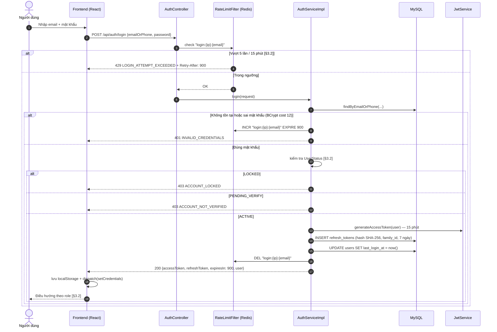

### 3.3. Sequence — Gọi API có token

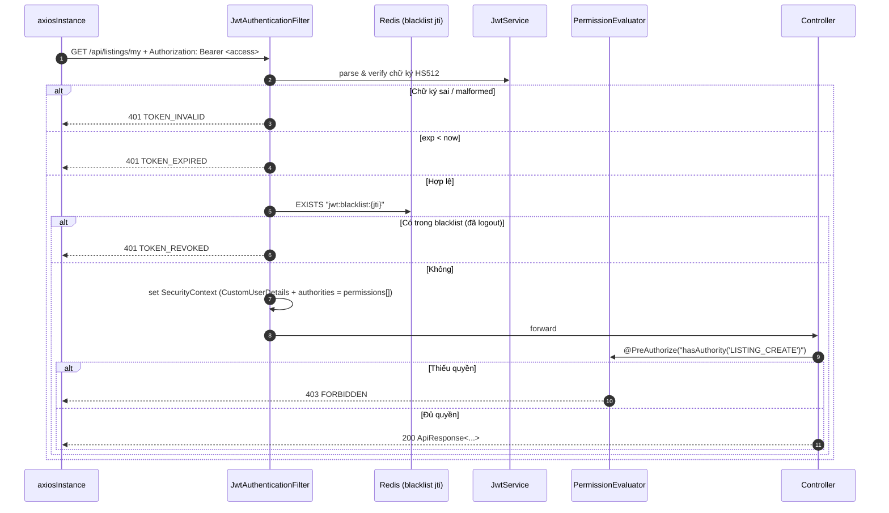

### 3.4. Sequence — Refresh token khi 401 (rotation + reuse detection)

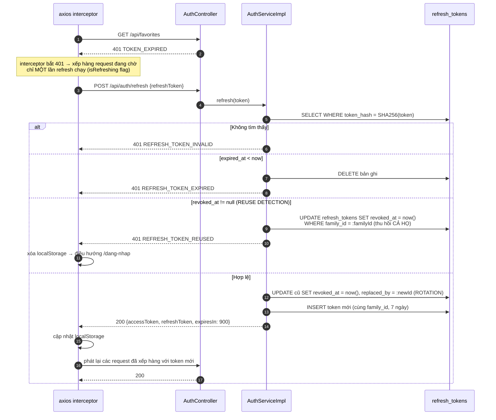

**Bảng `refresh_tokens` — cột phục vụ rotation:**

| Cột | Kiểu | Ý nghĩa |
|---|---|---|
| `token_hash` | `CHAR(64)` | SHA-256 hex của UUID, `uk_refresh_tokens_token_hash` |
| `family_id` | `CHAR(36)` | Cùng một chuỗi rotation; sinh mới khi login |
| `replaced_by` | `BIGINT UNSIGNED` nullable | Id token thay thế |
| `revoked_at` | `DATETIME` nullable | `!= null` → đã dùng/đã thu hồi |
| `expired_at` | `DATETIME` | login + 7 ngày (không gia hạn khi rotate — hết 7 ngày là bắt buộc đăng nhập lại) |
| `user_agent`, `ip_address` | `VARCHAR` | phục vụ `[§11.4]` logging |

### 3.5. Sequence — Đăng xuất `[§2.1]` AUTH-03

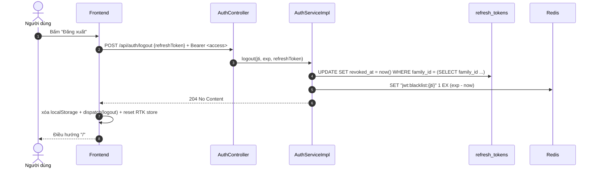

> Logout thu hồi **cả family** — đăng xuất một thiết bị làm mất hiệu lực chuỗi rotation của
> thiết bị đó, không ảnh hưởng thiết bị khác (mỗi lần login có `family_id` riêng).

### 3.6. Bảng permission theo endpoint (canonical §4.2)

Ký hiệu: **A** = anonymous (không cần token) · **AU** = authenticated (chỉ cần đăng nhập, không
cần permission) · **OWNER** = chủ sở hữu tài nguyên (kiểm tra trong service, không phải permission).

| Endpoint | Quyền yêu cầu |
|---|---|
| `POST /api/auth/register`, `/login`, `/refresh`, `/forgot-password`, `/reset-password`, `/verify-email`, `/verify-phone`, `/resend-verification`, `/send-phone-otp` | **A** |
| `POST /api/auth/logout`, `POST /api/auth/change-password` | **AU** |
| `GET/PUT /api/users/me`, `PATCH /api/users/me/contact`, `POST /api/users/me/avatar` | **AU** |
| `DELETE /api/users/me/avatar`, `DELETE /api/users/me` | **AU** |
| `GET /api/users/{id}`, `GET /api/users/{id}/listings`, `GET /api/users/{id}/reviews` | **A** |
| `POST /DELETE /api/users/{id}/follow`, `GET /api/users/me/following` | **AU** |
| `GET/PUT /api/users/me/landlord-profile`, `POST /api/users/me/landlord-verification` | `LISTING_CREATE` *(đại diện vai trò chủ trọ)* |
| `GET /api/categories`, `/provinces`, `/provinces/{id}/districts`, `/districts/{id}/wards`, `/amenities` | **A** |
| `GET /api/system-configs/public` | **A** *(chỉ whitelist `listing.title.*`, `listing.description.*`, `listing.image.*` — mục 4.3.6)* |
| `GET /api/listings`, `GET /api/search/listings`, `GET /api/search/suggestions` | **A** |
| `GET /api/listings/{id}` | **A** (tin public) · `LISTING_VIEW_ANY` (tin non-public) |
| `GET /api/listings/{id}/related`, `GET /api/listings/suggested` | **A** |
| `POST /api/listings` | `LISTING_CREATE` |
| `PUT /api/listings/{id}` | `LISTING_UPDATE_OWN` + **OWNER**, hoặc `LISTING_UPDATE_ANY` |
| `DELETE /api/listings/{id}` | `LISTING_UPDATE_OWN` + **OWNER**, hoặc `LISTING_UPDATE_ANY` |
| `POST /api/listings/{id}/submit`, `/hide`, `/unhide`, `/close`, `/renew` | `LISTING_UPDATE_OWN` + **OWNER** |
| `POST/DELETE/PUT /api/listings/{id}/images/**`, `PUT /api/listings/{id}/amenities` | `LISTING_UPDATE_OWN` + **OWNER**, hoặc `LISTING_UPDATE_ANY` |
| `GET /api/listings/{id}/stats` | `LISTING_UPDATE_OWN` + **OWNER**, hoặc `STATISTIC_VIEW` |
| `GET /api/listings/my` | `LISTING_CREATE` |
| `GET /api/landlord/dashboard` | `LISTING_CREATE` |
| `GET /api/listings/{id}/edit-histories` | `LISTING_UPDATE_OWN` + **OWNER**, hoặc `LISTING_VIEW_ANY` |
| `POST /api/favorites`, `DELETE /api/favorites/{listingId}`, `GET /api/favorites` | `FAVORITE_MANAGE` |
| `GET/DELETE /api/history/views`, `DELETE /api/history/views/{id}` | **AU** |
| `GET/DELETE /api/search/histories` | **AU** |
| `POST /api/listings/{id}/contact`, `GET /api/listings/{id}/contact-info` | `CONTACT_CREATE` |
| `GET /api/landlord/contacts` | `LISTING_CREATE` |
| `GET/POST /api/conversations`, `GET /api/conversations/{id}`, `GET/POST /api/conversations/{id}/messages`, `POST /api/conversations/{id}/read` | `CONTACT_CREATE` + thành viên hội thoại |
| `GET /api/listings/{id}/comments` | **A** |
| `POST /api/listings/{id}/comments`, `POST /api/comments/{id}/reply` | `COMMENT_CREATE` |
| `PUT/DELETE /api/comments/{id}` | `COMMENT_CREATE` + **OWNER**, hoặc `COMMENT_MODERATE` (chỉ xóa) |
| `GET /api/listings/{id}/reviews`, `GET /api/listings/{id}/reviews/eligibility` | **A** / **AU** cho eligibility |
| `POST /api/listings/{id}/reviews`, `PUT /api/reviews/{id}` | `REVIEW_CREATE` (+ **OWNER** với PUT) |
| `DELETE /api/reviews/{id}` | `REVIEW_CREATE` + **OWNER**, hoặc `REVIEW_MODERATE` |
| `GET /api/reviews/my` | `REVIEW_CREATE` |
| `POST /api/reports`, `GET /api/reports/my` | `REPORT_CREATE` |
| `GET /api/promotion-packages`, `GET /api/promotion-packages/{id}` | **A** |
| `POST /api/payments`, `GET /api/payments/{id}`, `GET /api/payments/my`, `POST /api/payments/{id}/cancel` | `PAYMENT_VIEW_OWN` |
| `POST /api/listings/{id}/promote` | `PAYMENT_VIEW_OWN` + **OWNER** của listing |
| `GET /api/promotion-subscriptions/my` | `PAYMENT_VIEW_OWN` |
| `POST /api/coupons/validate` | `PAYMENT_VIEW_OWN` |
| `POST /api/payments/callback` | **A** + xác thực **HMAC signature** (mục 6) |
| `GET /api/notifications`, `/unread-count`, `PUT .../read`, `PUT .../read-all`, `DELETE .../{id}`, `GET/PUT /api/notifications/preferences` | **AU** |
| `POST /api/ai/chatbot/message` | **A** `[§1.2]` "Khách dùng chatbot ở mức cơ bản" |
| `GET /api/ai/chatbot/conversations`, `GET /api/ai/chatbot/conversations/{id}/messages` | **AU** |
| `POST /api/ai/recommendations` | **A** (cold start) / **AU** (cá nhân hóa) |
| `POST /api/ai/price-prediction` | `LISTING_CREATE` |
| `GET /api/ai/price-prediction/histories` | `LISTING_UPDATE_OWN` + **OWNER**, hoặc `AI_LOG_VIEW` |
| `POST /api/ai/sentiment/analyze` | `AI_LOG_VIEW` |
| `GET /api/admin/dashboard`, `GET /api/admin/statistics`, `GET /api/admin/statistics/revenue` | `STATISTIC_VIEW` |
| `GET /api/admin/users`, `GET /api/admin/users/{id}` | `USER_MANAGE` |
| `PUT /api/admin/users/{id}/lock`, `/unlock` | `USER_MANAGE` |
| `PUT /api/admin/users/{id}/roles` | `USER_ROLE_ASSIGN` |
| `GET /api/admin/landlords` | `LANDLORD_VERIFY` |
| `PUT /api/admin/landlords/{id}/verify`, `/unverify`, `/reject-verification`, `/restrict-posting` | `LANDLORD_VERIFY` |
| `GET /api/admin/listings`, `GET /api/admin/listings/{id}` | `LISTING_VIEW_ANY` |
| `PUT /api/admin/listings/{id}/approve`, `/reject`, `/hide`, `/flag-need-review`, `/clear-need-review`, `/request-edit` | `LISTING_MODERATE` |
| `PUT /api/admin/listings/{id}/lock`, `/unlock` | `LISTING_LOCK` |
| `GET /api/admin/moderation-actions`, `GET /api/admin/moderation/queue` | `LISTING_MODERATE` |
| `PUT /api/admin/listings/bulk` | `LISTING_MODERATE` (+ `LISTING_LOCK` khi `action = LOCK`) |
| `GET /api/admin/comments`, `PUT /api/admin/comments/{id}/hide`, `/unhide`, `/mark-spam` | `COMMENT_MODERATE` |
| `PUT /api/admin/comments/bulk` | `COMMENT_MODERATE` |
| `GET /api/admin/reviews`, `PUT /api/admin/reviews/{id}/hide`, `/unhide` | `REVIEW_MODERATE` |
| `GET /api/admin/reports`, `GET /api/admin/reports/{id}` | `REPORT_RESOLVE` |
| `GET /api/admin/reports/target/{targetType}/{targetId}` | `REPORT_RESOLVE` |
| `PUT /api/admin/reports/{id}/status`, `PUT /api/admin/reports/{id}/resolve` | `REPORT_RESOLVE` |
| `PUT /api/admin/reports/resolve-group` | `REPORT_RESOLVE` (+ `LISTING_LOCK` khi `result = SEVERE_LOCK`) |
| `POST /api/admin/warnings`, `GET /api/admin/warnings` | `WARNING_SEND` |
| `GET/POST/PUT/DELETE /api/admin/categories/**`, `/provinces/**`, `/districts/**`, `/wards/**`, `/amenities/**` | `CATALOG_MANAGE` |
| `PUT /api/admin/{categories\|amenities\|provinces\|districts\|wards}/{id}/toggle` | `CATALOG_MANAGE` |
| `PUT /api/admin/categories/order`, `PUT /api/admin/amenities/order` | `CATALOG_MANAGE` |
| `POST /api/admin/areas/import` | `CATALOG_MANAGE` |
| `GET/POST/PUT /api/admin/promotion-packages/**` | `PACKAGE_MANAGE` |
| `GET/POST/PUT /api/admin/coupons/**` | `PACKAGE_MANAGE` |
| `GET /api/admin/payments`, `GET /api/admin/payments/{id}` | `PAYMENT_MANAGE` |
| `PUT /api/admin/payments/{id}/refund`, `POST /api/admin/payments/{id}/reconcile` | `PAYMENT_MANAGE` |
| `GET /api/admin/ai/logs`, `GET /api/admin/ai/alerts`, `GET /api/admin/ai/price-deviations` | `AI_LOG_VIEW` |
| `POST /api/admin/ai/sentiment/reanalyze` | `AI_LOG_VIEW` |
| `GET/PUT /api/admin/ai/config` | `AI_CONFIG_MANAGE` |
| `GET/PUT /api/admin/system-configs` | `SYSTEM_CONFIG_MANAGE` |
| `GET/POST/PUT/DELETE /api/admin/banned-keywords/**`, `PUT /api/admin/banned-keywords/{id}/toggle` | `SYSTEM_CONFIG_MANAGE` |
| `GET /api/admin/audit-logs` | `AUDIT_LOG_VIEW` |
| `GET /api/payments/my/export` | `PAYMENT_VIEW_OWN` |
| `GET /api/admin/users/export` | `USER_MANAGE` |
| `GET /api/admin/payments/export` | `PAYMENT_MANAGE` |
| `GET /api/admin/statistics/export` | `STATISTIC_VIEW` |
| `GET /api/admin/audit-logs/export` | `AUDIT_LOG_VIEW` |
| `GET /api/admin/ai/logs/export` | `AI_LOG_VIEW` |

> **Kiểm chứng ranh giới Moderator `[§1.2]`:** Moderator **không** có `PAYMENT_MANAGE`,
> `PACKAGE_MANAGE`, `SYSTEM_CONFIG_MANAGE`, `USER_ROLE_ASSIGN`, `USER_MANAGE`, `STATISTIC_VIEW`,
> `AI_CONFIG_MANAGE`, `CATALOG_MANAGE`, `LISTING_LOCK` → mọi endpoint tài chính/cấu hình trả
> `403 FORBIDDEN` cho Moderator. Đây là hành vi **đúng theo thiết kế**, FE ẩn menu tương ứng
> nhưng backend vẫn chặn `[§11.2]`.

**Cách khai báo trong code:**

```java
@PostMapping
@PreAuthorize("hasAuthority('LISTING_CREATE')")
@Operation(summary = "Tạo tin đăng mới (LIST-01/LIST-02)")
public ResponseEntity<ApiResponse<ListingDetailResponse>> create(
        @Valid @RequestBody CreateListingRequest request,
        @CurrentUser CustomUserDetails principal) { ... }
```

Kiểm tra **OWNER** không dùng `@PreAuthorize` (cần load entity) mà nằm trong service:

```java
private void assertCanModify(Listing listing, CustomUserDetails principal) {
    if (principal.hasAuthority(PermissionCode.LISTING_UPDATE_ANY)) return;
    if (!listing.getOwnerId().equals(principal.getUserId())) {
        throw new ForbiddenException(ErrorCode.LISTING_FORBIDDEN);
    }
}
```

---
## 4. Đặc tả chi tiết từng endpoint

### 4.0. Bảng tổng hợp số lượng endpoint

| # | Module | Mục | Số endpoint | Bao phủ |
|---|---|---|---:|---|
| 1 | Auth | 4.1 | 11 | `[§12.1]` + refresh + change-password + resend |
| 2 | User & Follow | 4.2 | 14 | `[§12.2]` + landlord profile, following list, xóa avatar, tự xóa tài khoản |
| 3 | Catalog công khai | 4.3 | 6 | `[§2.4]`, `[§11.3]` cache, config công khai cho form |
| 4 | Listing & Search | 4.4 | 23 | `[§12.3]` + `[§12.4]` (search alias, suggestions) + related, unhide, image order, edit history, landlord dashboard |
| 5 | Favorite & History | 4.5 | 8 | `[§12.4]` + search history |
| 6 | Contact & Chat | 4.6 | 9 | `[§12.5]` + contact-info, read |
| 7 | Comment & Review | 4.7 | 12 | `[§12.6]` + eligibility, reviews/my, landlord reviews |
| 8 | Report | 4.8 | 2 | `[§12.7]` phần người dùng |
| 9 | Payment & Promotion | 4.9 | 10 | `[§12.8]` + cancel, subscriptions, coupon |
| 10 | Notification | 4.10 | 7 | `[§2.10]`, `[§11.12]` |
| 11 | AI | 4.11 / mục 7 | 7 | `[§12.9]` phần người dùng |
| 12 | Admin — Dashboard & Thống kê | 4.12 | 3 | `[§12.10]`, `[§10.1]`, `[§10.13]` |
| 13 | Admin — Người dùng & Chủ trọ | 4.13 | 10 | `[§12.10]`, `[§10.2]`, `[§10.3]` + tách reject-verification / restrict-posting |
| 14 | Admin — Tin đăng & Kiểm duyệt | 4.14 | 13 | `[§12.10]`, `[§10.4]`, `[§4.4]` + hàng đợi kiểm duyệt, bulk |
| 15 | Admin — Bình luận & Đánh giá | 4.15 | 8 | `[§10.9]` + bulk |
| 16 | Admin — Báo cáo & Cảnh báo | 4.16 | 8 | `[§12.7]`, `[§10.8]` + gom nhóm theo target, resolve-group |
| 17 | Admin — Danh mục/Khu vực/Tiện ích | 4.17 | 23 | `[§12.10]`, `[§10.5]` + toggle, order, import |
| 18 | Admin — Gói dịch vụ, Thanh toán, Coupon | 4.18 | 11 | `[§10.6]`, `[§10.7]` |
| 19 | Admin — AI | 4.19 | 6 | `[§12.9]`, `[§10.10]` |
| 20 | Admin — Cấu hình, Audit, Từ khóa cấm | 4.20 | 8 | `[§10.14]`, `[§11.4]`, `[§11.10]` + toggle từ khóa |
| 21 | Xuất dữ liệu Excel | 4.21 | 6 | `[§10.1]`, `[§10.2]`, `[§10.7]`, `[§10.10]`, `[§11.4]` — **ngoại lệ envelope** |
| | **TỔNG** | | **205** | |

---

### 4.1. Module Auth — `/api/auth` (11 endpoint)

Controller: `com.webtro.modules.auth.controller.AuthController`. Tag Swagger: `01. Auth`.

---

#### 4.1.1. `POST /api/auth/register` — Đăng ký tài khoản

| Mục | Nội dung |
|---|---|
| Mã chức năng | `[§2.1]` **AUTH-01** |
| Mô tả | Tạo tài khoản mới ở trạng thái `PENDING_VERIFY`, gửi email xác thực `[§3.1]` |
| Quyền | **anonymous** |
| Rate limit | **3 / giờ / IP** — `security.register.rate` (canonical §8) |

**Request body** — `RegisterRequest`

| Field | Kiểu | Bắt buộc | Ràng buộc validation | Mô tả |
|---|---|:--:|---|---|
| `fullName` | string | ✔ | `@NotBlank`, 2–100 ký tự, regex `^[\p{L} .'-]+$` (chỉ chữ Unicode, khoảng trắng, `.`, `'`, `-`) | Họ tên `[§3.1]` "không chứa ký tự nguy hiểm" |
| `email` | string | ✔ | `@Email`, ≤ 150 ký tự, lowercase hóa trước khi lưu | Email `[§3.1]` |
| `phone` | string | ✔ | `@ValidPhone` — regex `^(0[35789])[0-9]{8}$` | Số điện thoại VN `[§3.1]` |
| `password` | string | ✔ | `@ValidPassword` — ≥ 8 ký tự, **có chữ và số** | Mật khẩu `[§3.1]`, canonical §8 |
| `confirmPassword` | string | ✔ | `@NotBlank`, phải bằng `password` | Xác nhận |
| `requestedRole` | enum | ✔ | `TENANT` \| `LANDLORD` | Vai trò mong muốn `[§3.1]` "vai trò mong muốn" |
| `contactPhone` | string | điều kiện | Bắt buộc khi `requestedRole = LANDLORD`; `@ValidPhone` | `[§3.1]` Luồng phụ "chọn vai trò chủ trọ, hệ thống yêu cầu bổ sung thông tin liên hệ" |
| `contactName` | string | điều kiện | Bắt buộc khi `requestedRole = LANDLORD`; 2–100 ký tự | Tên liên hệ hiển thị trên tin |
| `acceptTerms` | boolean | ✔ | `@AssertTrue` | Đồng ý điều khoản |

**Response 201** + `Location: /api/users/103`

```json
{
  "success": true,
  "message": "Đăng ký thành công. Vui lòng kiểm tra email để xác thực tài khoản.",
  "data": {
    "userId": 103,
    "email": "nguyen.van.an@gmail.com",
    "fullName": "Nguyễn Văn An",
    "status": "PENDING_VERIFY",
    "roles": ["ROLE_TENANT", "ROLE_LANDLORD"],
    "verificationEmailSent": true,
    "createdAt": "2026-07-17T10:00:00Z"
  },
  "timestamp": "2026-07-17T10:00:00Z"
}
```

**Mã lỗi:** `VALIDATION_FAILED`, `EMAIL_ALREADY_EXISTS`, `PHONE_ALREADY_EXISTS`, `WEAK_PASSWORD`,
`INVALID_EMAIL_FORMAT`, `INVALID_PHONE_FORMAT`, `INVALID_FULL_NAME`, `PASSWORD_CONFIRM_MISMATCH`,
`LANDLORD_CONTACT_REQUIRED`, `REGISTER_RATE_LIMIT`, `INTERNAL_ERROR`.

**Quy tắc nghiệp vụ:**
1. Một email chỉ thuộc một tài khoản `[§3.1]` → check `uk_users_email` (kể cả `PENDING_VERIFY`).
2. Một số điện thoại chỉ thuộc một tài khoản **đang hoạt động** `[§3.1]` → check trùng trên `status IN (ACTIVE, PENDING_VERIFY)`; số của tài khoản `DELETED` được tái sử dụng.
3. `requestedRole = LANDLORD` → gán **cả hai** role `ROLE_TENANT` + `ROLE_LANDLORD` (canonical §4.1: *"Chủ trọ có toàn bộ quyền cơ bản của người thuê"*), tạo thêm bản ghi `landlord_profiles`.
4. `requestedRole = TENANT` → chỉ `ROLE_TENANT`.
5. Mật khẩu hash BCrypt cost 12 (canonical §8).
6. Tạo `verifications` (`type = EMAIL`, `status = PENDING`, token 64 ký tự ngẫu nhiên, TTL 24 giờ), gửi email async qua `@Async` (canonical §3 `AsyncConfig`).
7. Sinh `NotificationType = ACCOUNT_REGISTERED`, kênh `IN_APP` + `EMAIL` `[§5.6]`.
8. **Không** trả token — user phải xác thực rồi mới đăng nhập được `[§3.1]` bước 6.

---

#### 4.1.2. `POST /api/auth/login` — Đăng nhập

| Mục | Nội dung |
|---|---|
| Mã chức năng | `[§2.1]` **AUTH-02** |
| Mô tả | Xác thực và cấp access + refresh token `[§3.2]` |
| Quyền | **anonymous** |
| Rate limit | **5 lần sai / 15 phút / (IP + email)** → khóa tạm 15 phút `[§3.2]`, canonical §8 |

**Request body** — `LoginRequest`

| Field | Kiểu | Bắt buộc | Ràng buộc | Mô tả |
|---|---|:--:|---|---|
| `emailOrPhone` | string | ✔ | `@NotBlank`, ≤ 150 ký tự | Email hoặc SĐT `[§3.2]` "Email/số điện thoại" |
| `password` | string | ✔ | `@NotBlank` | Mật khẩu |
| `captchaToken` | string | điều kiện | Bắt buộc khi server đã trả `CAPTCHA_REQUIRED` (sai ≥ 3 lần) | `[§3.2]` "yêu cầu captcha" |
| `rememberDevice` | boolean | ✘ | mặc định `false` | Chỉ dùng để ghi `user_agent` vào `refresh_tokens` |

**Response 200**

```json
{
  "success": true,
  "message": "Đăng nhập thành công",
  "data": {
    "accessToken": "eyJhbGciOiJIUzUxMiJ9.eyJzdWIiOiI0MiIsImVtYWlsIjoi...",
    "refreshToken": "9c1f7b3e-42a8-4d5e-b6c1-77e0a2f4d8b9",
    "tokenType": "Bearer",
    "expiresIn": 900,
    "refreshExpiresIn": 604800,
    "user": {
      "id": 42,
      "fullName": "Nguyễn Văn An",
      "email": "nguyen.van.an@gmail.com",
      "avatarUrl": "https://cdn.webtro.vn/avatars/8f3c2a1e.webp",
      "status": "ACTIVE",
      "roles": ["ROLE_TENANT", "ROLE_LANDLORD"],
      "permissions": ["LISTING_CREATE", "LISTING_UPDATE_OWN", "FAVORITE_MANAGE",
                      "CONTACT_CREATE", "COMMENT_CREATE", "REVIEW_CREATE",
                      "REPORT_CREATE", "PAYMENT_VIEW_OWN"],
      "landlordVerified": true,
      "lastLoginAt": "2026-07-16T22:14:03Z"
    }
  },
  "timestamp": "2026-07-17T10:00:00Z"
}
```

**Mã lỗi:** `VALIDATION_FAILED`, `INVALID_CREDENTIALS`, `ACCOUNT_LOCKED`, `ACCOUNT_NOT_VERIFIED`,
`ACCOUNT_DELETED`, `LOGIN_ATTEMPT_EXCEEDED`, `CAPTCHA_REQUIRED`, `CAPTCHA_INVALID`, `INTERNAL_ERROR`.

**Quy tắc nghiệp vụ:**
1. Tài khoản `LOCKED` không được đăng nhập `[§3.2]` → `403 ACCOUNT_LOCKED` kèm lý do trong `message`.
2. Đăng nhập thành công → `UPDATE users SET last_login_at = now()` `[§3.2]`.
3. Sai định danh và sai mật khẩu đều trả **`INVALID_CREDENTIALS`** (không phân biệt) — chống dò tài khoản `[§11.1]` "Không lộ thông tin nhạy cảm".
4. Counter Redis `login:fail:{ip}:{emailHash}` `INCR` + `EXPIRE 900`; ≥ 3 → response kèm `"captchaRequired": true`; ≥ 5 → `429` + `Retry-After: 900` `[§3.2]`.
5. Đăng nhập đúng → `DEL` counter.
6. `PENDING_VERIFY` → `403 ACCOUNT_NOT_VERIFIED`; FE hiện nút gọi `/api/auth/resend-verification` `[§3.2]` Luồng phụ.
7. `family_id` mới mỗi lần login (canonical §8 rotation).

---

#### 4.1.3. `POST /api/auth/refresh` — Làm mới token

| Mục | Nội dung |
|---|---|
| Mã chức năng | Yêu cầu đề bài (canonical §8) — **[BỔ SUNG NGOÀI `[§12.1]`]** |
| Mô tả | Rotation + reuse detection (sequence mục 3.4) |
| Quyền | **anonymous** (chỉ cần refresh token hợp lệ) |
| Rate limit | 20 / phút / IP |

**Request body** — `RefreshTokenRequest`

| Field | Kiểu | Bắt buộc | Ràng buộc | Mô tả |
|---|---|:--:|---|---|
| `refreshToken` | string | ✔ | `@NotBlank`, UUID v4 | Refresh token opaque |

**Response 200**

```json
{
  "success": true,
  "message": "Làm mới phiên thành công",
  "data": {
    "accessToken": "eyJhbGciOiJIUzUxMiJ9.eyJzdWIiOiI0MiIs...",
    "refreshToken": "3b8e0d21-7f44-4a19-8c62-1de5a0b93c47",
    "tokenType": "Bearer",
    "expiresIn": 900,
    "refreshExpiresIn": 518400
  },
  "timestamp": "2026-07-17T10:15:00Z"
}
```

> `refreshExpiresIn` = số giây còn lại của **family** (không reset về 604800) — hết 7 ngày kể từ
> login là bắt buộc đăng nhập lại.

**Mã lỗi:** `VALIDATION_FAILED`, `REFRESH_TOKEN_INVALID`, `REFRESH_TOKEN_EXPIRED`,
`REFRESH_TOKEN_REUSED`, `ACCOUNT_LOCKED`, `RATE_LIMIT_EXCEEDED`, `INTERNAL_ERROR`.

**Quy tắc nghiệp vụ (canonical §8):**
1. Tra bằng `SHA-256(refreshToken)` — DB **không bao giờ** lưu token gốc.
2. `revoked_at != null` → **reuse detection**: `UPDATE refresh_tokens SET revoked_at = now() WHERE family_id = ?` → `401 REFRESH_TOKEN_REUSED`.
3. Hợp lệ → revoke token cũ, set `replaced_by`, phát token mới cùng `family_id`.
4. Nếu user đã bị khóa từ lúc cấp token → `403 ACCOUNT_LOCKED`, thu hồi family.

---

#### 4.1.4. `POST /api/auth/logout` — Đăng xuất

| Mục | Nội dung |
|---|---|
| Mã chức năng | `[§2.1]` **AUTH-03** |
| Quyền | **authenticated** |
| Rate limit | không |

**Request body** — `LogoutRequest`

| Field | Kiểu | Bắt buộc | Ràng buộc | Mô tả |
|---|---|:--:|---|---|
| `refreshToken` | string | ✔ | `@NotBlank` | Token của thiết bị hiện tại |

**Response 204** — không body (canonical §7.2).

**Mã lỗi:** `UNAUTHORIZED`, `VALIDATION_FAILED`, `INTERNAL_ERROR`.
Refresh token không tồn tại → vẫn trả **204** (logout là idempotent, không lộ thông tin).

**Quy tắc:** thu hồi cả `family_id`; đưa `jti` access token vào Redis `jwt:blacklist:{jti}` với
TTL = `exp - now` (canonical §8).

---

#### 4.1.5. `POST /api/auth/forgot-password` — Quên mật khẩu

| Mục | Nội dung |
|---|---|
| Mã chức năng | `[§2.1]` **AUTH-04** |
| Quyền | **anonymous** |
| Rate limit | 3 / giờ / email |

**Request body**

| Field | Kiểu | Bắt buộc | Ràng buộc | Mô tả |
|---|---|:--:|---|---|
| `email` | string | ✔ | `@Email` | Email tài khoản |

**Response 200**

```json
{
  "success": true,
  "message": "Nếu email tồn tại trong hệ thống, chúng tôi đã gửi liên kết đặt lại mật khẩu.",
  "data": null,
  "timestamp": "2026-07-17T10:00:00Z"
}
```

**Mã lỗi:** `VALIDATION_FAILED`, `INVALID_EMAIL_FORMAT`, `RATE_LIMIT_EXCEEDED`, `INTERNAL_ERROR`.

**Quy tắc:** **luôn trả 200** kể cả email không tồn tại — chống dò tài khoản `[§11.1]`.
Token 64 ký tự ngẫu nhiên lưu `password_reset_tokens` (hash SHA-256), TTL **30 phút**, dùng một
lần. Token cũ chưa dùng của cùng user bị vô hiệu hóa.

---

#### 4.1.6. `POST /api/auth/reset-password` — Đặt lại mật khẩu

| Mục | Nội dung |
|---|---|
| Mã chức năng | `[§2.1]` **AUTH-04** |
| Quyền | **anonymous** |
| Rate limit | 5 / giờ / IP |

**Request body**

| Field | Kiểu | Bắt buộc | Ràng buộc | Mô tả |
|---|---|:--:|---|---|
| `token` | string | ✔ | `@NotBlank`, 64 ký tự | Token trong email |
| `newPassword` | string | ✔ | `@ValidPassword` | Mật khẩu mới |
| `confirmPassword` | string | ✔ | bằng `newPassword` | Xác nhận |

**Response 200**

```json
{
  "success": true,
  "message": "Đặt lại mật khẩu thành công. Vui lòng đăng nhập lại.",
  "data": null,
  "timestamp": "2026-07-17T10:00:00Z"
}
```

**Mã lỗi:** `VALIDATION_FAILED`, `PASSWORD_RESET_TOKEN_INVALID`, `PASSWORD_RESET_TOKEN_EXPIRED`,
`WEAK_PASSWORD`, `PASSWORD_CONFIRM_MISMATCH`, `NEW_PASSWORD_SAME_AS_OLD`, `RATE_LIMIT_EXCEEDED`.

**Quy tắc:** đổi mật khẩu → **thu hồi toàn bộ refresh token** của user (mọi thiết bị) + blacklist
không áp dụng cho access token cũ (tự hết sau ≤ 15 phút). Đánh dấu token reset `used_at = now()`.

---

#### 4.1.7. `POST /api/auth/change-password` — Đổi mật khẩu

| Mục | Nội dung |
|---|---|
| Mã chức năng | `[§2.1]` **AUTH-05** — **[BỔ SUNG NGOÀI `[§12.1]`]** |
| Quyền | **authenticated** |
| Rate limit | 5 / giờ / user |

**Request body**

| Field | Kiểu | Bắt buộc | Ràng buộc | Mô tả |
|---|---|:--:|---|---|
| `oldPassword` | string | ✔ | `@NotBlank` | Mật khẩu hiện tại |
| `newPassword` | string | ✔ | `@ValidPassword`, khác `oldPassword` | Mật khẩu mới |
| `confirmPassword` | string | ✔ | bằng `newPassword` | Xác nhận |

**Response 200**

```json
{
  "success": true,
  "message": "Đổi mật khẩu thành công. Các thiết bị khác đã bị đăng xuất.",
  "data": null,
  "timestamp": "2026-07-17T10:00:00Z"
}
```

**Mã lỗi:** `UNAUTHORIZED`, `VALIDATION_FAILED`, `OLD_PASSWORD_INCORRECT`,
`NEW_PASSWORD_SAME_AS_OLD`, `WEAK_PASSWORD`, `PASSWORD_CONFIRM_MISMATCH`, `RATE_LIMIT_EXCEEDED`.

**Quy tắc:** thu hồi tất cả refresh token **trừ family hiện tại** → thiết bị đang thao tác không
bị đăng xuất, thiết bị khác bị.

---

#### 4.1.8. `POST /api/auth/verify-email` — Xác thực email

| Mục | Nội dung |
|---|---|
| Mã chức năng | `[§2.1]` **AUTH-06** |
| Quyền | **anonymous** |
| Rate limit | 10 / giờ / IP |

**Request body**

| Field | Kiểu | Bắt buộc | Ràng buộc | Mô tả |
|---|---|:--:|---|---|
| `token` | string | ✔ | `@NotBlank`, 64 ký tự | Token trong link email |

**Response 200**

```json
{
  "success": true,
  "message": "Xác thực email thành công. Bạn có thể đăng nhập ngay.",
  "data": {
    "userId": 103,
    "email": "nguyen.van.an@gmail.com",
    "status": "ACTIVE",
    "verifiedAt": "2026-07-17T10:05:00Z"
  },
  "timestamp": "2026-07-17T10:05:00Z"
}
```

**Mã lỗi:** `VALIDATION_FAILED`, `OTP_INVALID`, `OTP_EXPIRED`, `OTP_ALREADY_USED`,
`VERIFICATION_ALREADY_DONE`, `RATE_LIMIT_EXCEEDED`.

**Quy tắc:** `verifications` (`type = EMAIL`) → `status = VERIFIED`; `users.status`:
`PENDING_VERIFY` → `ACTIVE` `[§3.1]` bước 6. Nếu đã `ACTIVE` → `409 VERIFICATION_ALREADY_DONE`.

---

#### 4.1.9. `POST /api/auth/resend-verification` — Gửi lại email xác thực

| Mục | Nội dung |
|---|---|
| Mã chức năng | `[§3.2]` Luồng phụ *"cho phép gửi lại mã xác thực"* — **[BỔ SUNG NGOÀI `[§12.1]`]** |
| Quyền | **anonymous** |
| Rate limit | **1 / 60 giây / email**, tối đa 5 / ngày |

**Request body**

| Field | Kiểu | Bắt buộc | Ràng buộc | Mô tả |
|---|---|:--:|---|---|
| `email` | string | ✔ | `@Email` | Email cần gửi lại |

**Response 200**

```json
{
  "success": true,
  "message": "Nếu tài khoản chưa xác thực, email xác thực đã được gửi lại.",
  "data": { "cooldownSeconds": 60 },
  "timestamp": "2026-07-17T10:00:00Z"
}
```

**Mã lỗi:** `VALIDATION_FAILED`, `VERIFICATION_ALREADY_DONE`, `RATE_LIMIT_EXCEEDED` (kèm `Retry-After`).

**Quy tắc:** vô hiệu hóa token EMAIL cũ, tạo token mới TTL 24 giờ. Luôn 200 nếu email không tồn tại.

---

#### 4.1.10. `POST /api/auth/send-phone-otp` — Gửi OTP số điện thoại

| Mục | Nội dung |
|---|---|
| Mã chức năng | `[§2.1]` **AUTH-06** — **[BỔ SUNG NGOÀI `[§12.1]`]** (cần cho `/verify-phone` ở `[§12.1]`) |
| Quyền | **authenticated** |
| Rate limit | **1 / 60 giây / user**, tối đa 5 / ngày |

**Request body**

| Field | Kiểu | Bắt buộc | Ràng buộc | Mô tả |
|---|---|:--:|---|---|
| `phone` | string | ✔ | `@ValidPhone`, phải bằng `users.phone` của chính user | SĐT cần xác thực |

**Response 200**

```json
{
  "success": true,
  "message": "Mã OTP đã được gửi đến số 0901***456",
  "data": { "maskedPhone": "0901***456", "expiresInSeconds": 300, "cooldownSeconds": 60 },
  "timestamp": "2026-07-17T10:00:00Z"
}
```

**Mã lỗi:** `UNAUTHORIZED`, `VALIDATION_FAILED`, `INVALID_PHONE_FORMAT`, `PHONE_ALREADY_EXISTS`,
`VERIFICATION_ALREADY_DONE`, `RATE_LIMIT_EXCEEDED`.

**Quy tắc:** OTP 6 chữ số, TTL **5 phút**, lưu `verifications` (`type = PHONE`) dạng hash.
`maskedPhone` dùng `MaskUtil` (canonical §8). Dev: MailHog nhận OTP thay SMS (canonical §1.1 —
`Email/SMS/Push Service` `[§1.1]` được mô phỏng bằng mail).

---

#### 4.1.11. `POST /api/auth/verify-phone` — Xác thực số điện thoại

| Mục | Nội dung |
|---|---|
| Mã chức năng | `[§2.1]` **AUTH-06** |
| Quyền | **authenticated** |
| Rate limit | 10 / giờ / user; sai OTP > 5 lần → `OTP_ATTEMPT_EXCEEDED` |

**Request body**

| Field | Kiểu | Bắt buộc | Ràng buộc | Mô tả |
|---|---|:--:|---|---|
| `otp` | string | ✔ | `@Pattern("^[0-9]{6}$")` | Mã 6 chữ số |

**Response 200**

```json
{
  "success": true,
  "message": "Xác thực số điện thoại thành công",
  "data": { "phone": "0901234456", "phoneVerified": true, "verifiedAt": "2026-07-17T10:03:00Z" },
  "timestamp": "2026-07-17T10:03:00Z"
}
```

**Mã lỗi:** `UNAUTHORIZED`, `VALIDATION_FAILED`, `OTP_INVALID`, `OTP_EXPIRED`, `OTP_ALREADY_USED`,
`OTP_ATTEMPT_EXCEEDED`, `VERIFICATION_ALREADY_DONE`.

---

### 4.2. Module User & Follow — `/api/users` (14 endpoint)

Controller: `UserController`, `FollowController`. Tag Swagger: `02. User`.

---

#### 4.2.1. `GET /api/users/me` — Xem hồ sơ cá nhân

| Mục | Nội dung |
|---|---|
| Mã chức năng | `[§2.2]` **USER-01** |
| Quyền | **authenticated** |

**Response 200** — `UserProfileResponse`

```json
{
  "success": true,
  "message": "Lấy hồ sơ thành công",
  "data": {
    "id": 42,
    "fullName": "Nguyễn Văn An",
    "email": "nguyen.van.an@gmail.com",
    "phone": "0901234456",
    "avatarUrl": "https://cdn.webtro.vn/avatars/8f3c2a1e.webp",
    "gender": "MALE",
    "dateOfBirth": "1998-05-20",
    "status": "ACTIVE",
    "roles": ["ROLE_TENANT", "ROLE_LANDLORD"],
    "permissions": ["LISTING_CREATE", "LISTING_UPDATE_OWN", "FAVORITE_MANAGE",
                    "CONTACT_CREATE", "COMMENT_CREATE", "REVIEW_CREATE",
                    "REPORT_CREATE", "PAYMENT_VIEW_OWN"],
    "emailVerified": true,
    "phoneVerified": false,
    "address": "12 Nguyễn Huệ, P. Bến Nghé, Q.1, TP. Hồ Chí Minh",
    "bio": "Đang tìm phòng trọ khu vực Bình Thạnh, ngân sách 3–4 triệu.",
    "landlordProfile": {
      "verified": true,
      "verifiedAt": "2026-05-02T03:11:00Z",
      "trustScore": 87,
      "totalListings": 6,
      "activeListings": 4,
      "averageRating": 4.5,
      "chatEnabled": true,
      "contactName": "Anh An",
      "contactPhone": "0901234456",
      "responseRatepercent": 92
    },
    "createdAt": "2026-01-14T08:00:00Z",
    "lastLoginAt": "2026-07-17T09:58:00Z"
  },
  "timestamp": "2026-07-17T10:00:00Z"
}
```

> `landlordProfile` **chỉ có mặt** khi user có `ROLE_LANDLORD`; tenant thuần thì field bị bỏ
> (`@JsonInclude(NON_NULL)`).

**Mã lỗi:** `UNAUTHORIZED`, `USER_NOT_FOUND`, `INTERNAL_ERROR`.

---

#### 4.2.2. `PUT /api/users/me` — Cập nhật hồ sơ cá nhân

| Mục | Nội dung |
|---|---|
| Mã chức năng | `[§2.2]` **USER-02** |
| Quyền | **authenticated** |
| Rate limit | 20 / giờ / user |

**Request body** — `UpdateProfileRequest`

| Field | Kiểu | Bắt buộc | Ràng buộc | Mô tả |
|---|---|:--:|---|---|
| `fullName` | string | ✔ | 2–100 ký tự, regex `^[\p{L} .'-]+$` | Họ tên `[§3.1]` |
| `gender` | enum | ✘ | `MALE` \| `FEMALE` \| `OTHER` \| `UNKNOWN` (canonical §5) | Giới tính `[§6.3]` |
| `dateOfBirth` | date | ✘ | `yyyy-MM-dd`, `@Past`, tuổi ≥ 16 | Ngày sinh |
| `address` | string | ✘ | ≤ 255 ký tự, sanitize HTML | Địa chỉ |
| `bio` | string | ✘ | ≤ 500 ký tự, sanitize HTML | Giới thiệu |

> `email` và `phone` **không** sửa được ở đây — đổi phải qua luồng xác thực riêng (mục 4.2.3).

**Response 200** — `UserProfileResponse` (như 4.2.1).

**Mã lỗi:** `UNAUTHORIZED`, `VALIDATION_FAILED`, `INVALID_FULL_NAME`, `DANGEROUS_HTML_DETECTED`,
`RATE_LIMIT_EXCEEDED`.

**Quy tắc:** `bio`/`address` qua `HtmlSanitizer` allowlist rỗng (canonical §8) — strip toàn bộ HTML.

---

#### 4.2.3. `PATCH /api/users/me/contact` — Quản lý thông tin liên hệ

| Mục | Nội dung |
|---|---|
| Mã chức năng | `[§2.2]` **USER-03** |
| Quyền | **authenticated** |
| Rate limit | 5 / ngày / user |

**Request body** — `UpdateContactRequest` (gửi ít nhất 1 field)

| Field | Kiểu | Bắt buộc | Ràng buộc | Mô tả |
|---|---|:--:|---|---|
| `phone` | string | ✘ | `@ValidPhone`, chưa thuộc tài khoản `ACTIVE`/`PENDING_VERIFY` khác | SĐT mới → cần OTP xác thực lại |
| `email` | string | ✘ | `@Email`, chưa tồn tại | Email mới → cần xác thực lại |
| `currentPassword` | string | ✔ | `@NotBlank` | Bắt buộc để đổi email/phone |

**Response 200**

```json
{
  "success": true,
  "message": "Đã gửi yêu cầu xác thực cho thông tin liên hệ mới",
  "data": {
    "pendingEmail": "an.nguyen.new@gmail.com",
    "pendingPhone": null,
    "emailVerificationSent": true,
    "phoneOtpSent": false
  },
  "timestamp": "2026-07-17T10:00:00Z"
}
```

**Mã lỗi:** `UNAUTHORIZED`, `VALIDATION_FAILED`, `OLD_PASSWORD_INCORRECT`, `EMAIL_ALREADY_EXISTS`,
`PHONE_ALREADY_EXISTS`, `INVALID_EMAIL_FORMAT`, `INVALID_PHONE_FORMAT`, `RATE_LIMIT_EXCEEDED`.

**Quy tắc:** email/phone mới **chưa** ghi đè `users` ngay — lưu ở `verifications.target_value`
`status = PENDING`; chỉ khi xác thực xong mới ghi vào `users` `[§3.1]` "Một email chỉ thuộc một
tài khoản".

---

#### 4.2.4. `POST /api/users/me/avatar` — Cập nhật ảnh đại diện

| Mục | Nội dung |
|---|---|
| Mã chức năng | `[§2.2]` **USER-02** (`AvatarUrl` `[§6.3]`) — **[BỔ SUNG NGOÀI `[§12.2]`]** |
| Quyền | **authenticated** |
| Content-Type | `multipart/form-data` |
| Rate limit | 10 / giờ / user |

**Form part**

| Part | Kiểu | Bắt buộc | Ràng buộc | Mô tả |
|---|---|:--:|---|---|
| `file` | binary | ✔ | ≤ `listing.image.max_size_mb` (5MB); **magic bytes** ∈ {JPG, PNG, WEBP} | Ảnh đại diện |

**Response 200**

```json
{
  "success": true,
  "message": "Cập nhật ảnh đại diện thành công",
  "data": {
    "avatarUrl": "https://cdn.webtro.vn/avatars/c4d9e2b7-1a55-4f30-9e88-2b6c0d1a7f43.webp",
    "thumbnailUrl": "https://cdn.webtro.vn/avatars/thumb/c4d9e2b7-1a55-4f30-9e88-2b6c0d1a7f43.webp"
  },
  "timestamp": "2026-07-17T10:00:00Z"
}
```

**Mã lỗi:** `UNAUTHORIZED`, `AVATAR_TOO_LARGE`, `AVATAR_INVALID_FORMAT`,
`IMAGE_EXECUTABLE_REJECTED`, `RATE_LIMIT_EXCEEDED`.

**Quy tắc (canonical §8, `[§11.9]`):** kiểm tra **magic bytes** (không tin `Content-Type`); đổi
tên thành UUID; lưu ngoài webroot; tạo thumbnail 128×128; **không** phục vụ file thực thi.

---

#### 4.2.5. `GET /api/users/{id}` — Xem hồ sơ công khai / hồ sơ chủ trọ

| Mục | Nội dung |
|---|---|
| Mã chức năng | `[§2.2]` **USER-04**; `[§7.1]` "Xem hồ sơ chủ trọ" |
| Quyền | **anonymous** |
| Cache | Redis `user:public:{id}`, TTL 5 phút `[§11.11]` |

**Path param**

| Param | Kiểu | Bắt buộc | Ràng buộc | Mô tả |
|---|---|:--:|---|---|
| `id` | long | ✔ | `> 0` | Id người dùng |

**Response 200** — `LandlordPublicResponse` (mục 5.5)

```json
{
  "success": true,
  "message": "Lấy hồ sơ công khai thành công",
  "data": {
    "id": 42,
    "fullName": "Nguyễn Văn An",
    "avatarUrl": "https://cdn.webtro.vn/avatars/8f3c2a1e.webp",
    "isLandlord": true,
    "verified": true,
    "trustScore": 87,
    "trustLabel": "UY_TIN",
    "averageRating": 4.5,
    "totalReviews": 23,
    "totalActiveListings": 4,
    "totalClosedListings": 9,
    "contactName": "Anh An",
    "contactPhone": "0901***456",
    "phoneMasked": true,
    "chatEnabled": true,
    "responseRatePercent": 92,
    "followerCount": 58,
    "followedByMe": false,
    "memberSince": "2026-01-14T08:00:00Z"
  },
  "timestamp": "2026-07-17T10:00:00Z"
}
```

**Mã lỗi:** `USER_NOT_FOUND`, `INTERNAL_ERROR`.

**Quy tắc nghiệp vụ:**
1. Khách chưa đăng nhập chỉ thấy `contactPhone` dạng **`0901***456`** (`MaskUtil`) và `phoneMasked = true` `[§3.8]`, canonical §8.
2. Đăng nhập → số đầy đủ, `phoneMasked = false`.
3. `email`, `dateOfBirth`, `address`, `status` **không bao giờ** xuất hiện ở đây `[§11.1]` "Không lộ thông tin nhạy cảm".
4. `followedByMe` chỉ có khi đăng nhập; khách → `false`.
5. `trustLabel` suy ra từ `trustScore` theo canonical §9: `< 25` → `CAN_KIEM_DUYET`; `< 40` → `RUI_RO`; `>= 40` → `BINH_THUONG`; `>= 80` → `UY_TIN` `[§5.8]`.
6. User `LOCKED`/`DELETED` → `404 USER_NOT_FOUND` với người thường; Admin có `USER_MANAGE` xem qua `/api/admin/users/{id}`.

---

#### 4.2.6. `GET /api/users/{id}/listings` — Tin đăng công khai của chủ trọ

| Mục | Nội dung |
|---|---|
| Mã chức năng | `[§7.1]` "Xem hồ sơ chủ trọ" — **[BỔ SUNG NGOÀI `[§12.2]`]** |
| Quyền | **anonymous** |

**Query params**

| Param | Kiểu | Bắt buộc | Mặc định | Ràng buộc |
|---|---|:--:|---|---|
| `page` | int | ✘ | `0` | `>= 0` |
| `size` | int | ✘ | `12` | `1..100` |
| `sort` | string | ✘ | `publishedAt,desc` | ∈ {`publishedAt`, `price`, `area`, `viewCount`} |

**Response 200** — `PageResponse<ListingSummaryResponse>` (mục 5.2).

**Mã lỗi:** `USER_NOT_FOUND`, `INVALID_SORT_FIELD`.

**Quy tắc:** chỉ trả tin thỏa `ListingVisibilityService.publicStatuses()` (canonical §5.2) —
**không** viết cứng `status = 'ACTIVE'`.

---

#### 4.2.7. `POST /api/users/{id}/follow` — Theo dõi chủ trọ

| Mục | Nội dung |
|---|---|
| Mã chức năng | `[§2.5]` **FOLLOW-01** |
| Quyền | **authenticated** |
| Rate limit | 60 / giờ / user |

**Path param:** `id` (long, ✔, `> 0`) — id chủ trọ.
**Request body:** không.

**Response 201** + `Location: /api/users/42/follow`

```json
{
  "success": true,
  "message": "Đã theo dõi chủ trọ Nguyễn Văn An",
  "data": { "landlordId": 42, "following": true, "followerCount": 59, "followedAt": "2026-07-17T10:00:00Z" },
  "timestamp": "2026-07-17T10:00:00Z"
}
```

**Mã lỗi:** `UNAUTHORIZED`, `USER_NOT_FOUND`, `TARGET_NOT_LANDLORD`, `CANNOT_FOLLOW_SELF`,
`ALREADY_FOLLOWING`, `RATE_LIMIT_EXCEEDED`.

**Quy tắc:** chỉ follow được user có `ROLE_LANDLORD`. Khi chủ trọ có tin mới `ACTIVE`, hệ thống
gửi `NotificationType = FOLLOWED_LANDLORD_NEW_LISTING` `[§2.5]` FOLLOW-02, canonical §5.

---

#### 4.2.8. `DELETE /api/users/{id}/follow` — Bỏ theo dõi

| Mục | Nội dung |
|---|---|
| Mã chức năng | `[§2.5]` **FOLLOW-01** |
| Quyền | **authenticated** |

**Response 204** — không body.

**Mã lỗi:** `UNAUTHORIZED`, `USER_NOT_FOUND`, `NOT_FOLLOWING`.

**Quy tắc:** xóa **cứng** bản ghi `follows` — đây là dữ liệu quan hệ, không phải dữ liệu nghiệp vụ
cần audit, nên không áp dụng soft delete (canonical §6.1 áp cho dữ liệu nghiệp vụ).

---

#### 4.2.9. `GET /api/users/me/following` — Danh sách chủ trọ đang theo dõi

| Mục | Nội dung |
|---|---|
| Mã chức năng | `[§2.5]` **FOLLOW-02**; sitemap `/tai-khoan/dang-theo-doi` (canonical §12) — **[BỔ SUNG NGOÀI `[§12.2]`]** |
| Quyền | **authenticated** |

**Query params:** `page` (0), `size` (20, max 100), `sort` (`createdAt,desc`; ∈ {`createdAt`, `trustScore`}).

**Response 200**

```json
{
  "success": true,
  "message": "Lấy danh sách đang theo dõi thành công",
  "data": {
    "items": [
      {
        "landlordId": 42,
        "fullName": "Nguyễn Văn An",
        "avatarUrl": "https://cdn.webtro.vn/avatars/8f3c2a1e.webp",
        "verified": true,
        "trustScore": 87,
        "trustLabel": "UY_TIN",
        "averageRating": 4.5,
        "activeListingCount": 4,
        "newListingCountSinceLastVisit": 2,
        "followedAt": "2026-06-01T04:20:00Z"
      }
    ],
    "page": 0, "size": 20, "totalElements": 3, "totalPages": 1, "first": true, "last": true
  },
  "timestamp": "2026-07-17T10:00:00Z"
}
```

**Mã lỗi:** `UNAUTHORIZED`, `INVALID_SORT_FIELD`.

---

#### 4.2.10. `GET /api/users/me/landlord-profile` — Xem hồ sơ chủ trọ của tôi

| Mục | Nội dung |
|---|---|
| Mã chức năng | `[§7.3]` "Cập nhật hồ sơ chủ trọ" — **[BỔ SUNG NGOÀI `[§12.2]`]** |
| Quyền | `LISTING_CREATE` |

**Response 200**

```json
{
  "success": true,
  "message": "Lấy hồ sơ chủ trọ thành công",
  "data": {
    "userId": 42,
    "contactName": "Anh An",
    "contactPhone": "0901234456",
    "contactZalo": "0901234456",
    "businessName": "Nhà trọ An Bình",
    "businessAddress": "45/12 Đường D2, P.25, Q. Bình Thạnh, TP. Hồ Chí Minh",
    "description": "Cho thuê phòng trọ khu vực Bình Thạnh, an ninh, giờ giấc tự do.",
    "chatEnabled": true,
    "verificationStatus": "VERIFIED",
    "verifiedAt": "2026-05-02T03:11:00Z",
    "trustScore": 87,
    "totalListings": 6,
    "activeListings": 4,
    "postingSuspended": false,
    "postingSuspendedUntil": null,
    "warningCountLast30Days": 0
  },
  "timestamp": "2026-07-17T10:00:00Z"
}
```

**Mã lỗi:** `UNAUTHORIZED`, `FORBIDDEN`, `LANDLORD_PROFILE_NOT_FOUND`.

**Quy tắc:** `postingSuspended = true` khi `warningCountLast30Days >= moderation.threshold.warning_count`
(3) trong `moderation.threshold.warning_window_days` (30) `[§5.4]`, canonical §9.

---

#### 4.2.11. `PUT /api/users/me/landlord-profile` — Cập nhật hồ sơ chủ trọ

| Mục | Nội dung |
|---|---|
| Mã chức năng | `[§7.3]` "Cập nhật hồ sơ chủ trọ"; `[§4.2]` — **[BỔ SUNG NGOÀI `[§12.2]`]** |
| Quyền | `LISTING_CREATE` |
| Rate limit | 20 / giờ / user |

**Request body** — `UpdateLandlordProfileRequest`

| Field | Kiểu | Bắt buộc | Ràng buộc | Mô tả |
|---|---|:--:|---|---|
| `contactName` | string | ✔ | 2–100 ký tự, regex họ tên | Tên hiển thị trên tin `[§3.3]` "ContactName" |
| `contactPhone` | string | ✔ | `@ValidPhone` | SĐT liên hệ `[§3.3]` "ContactPhone" |
| `contactZalo` | string | ✘ | `@ValidPhone` | Zalo |
| `businessName` | string | ✘ | ≤ 150 ký tự, sanitize | Tên cơ sở |
| `businessAddress` | string | ✘ | ≤ 255 ký tự, sanitize | Địa chỉ cơ sở |
| `description` | string | ✘ | ≤ 1000 ký tự, sanitize | Giới thiệu |
| `chatEnabled` | boolean | ✘ | mặc định `true` | Bật/tắt chat `[§3.10]` "Nếu chủ trọ tắt chat, hệ thống chỉ hiển thị số điện thoại" |

**Response 200** — như 4.2.10.

**Mã lỗi:** `UNAUTHORIZED`, `FORBIDDEN`, `VALIDATION_FAILED`, `INVALID_PHONE_FORMAT`,
`DANGEROUS_HTML_DETECTED`, `BANNED_KEYWORD_DETECTED`, `RATE_LIMIT_EXCEEDED`.

---

#### 4.2.12. `POST /api/users/me/landlord-verification` — Gửi yêu cầu xác thực chủ trọ

| Mục | Nội dung |
|---|---|
| Mã chức năng | `[§2.2]` **USER-06** (phía chủ trọ); `[§13.2]` "Chỉ cần trạng thái xác thực thủ công bởi Admin" — **[BỔ SUNG NGOÀI `[§12.2]`]** |
| Quyền | `LISTING_CREATE` |
| Rate limit | 3 / ngày / user |

**Request body**

| Field | Kiểu | Bắt buộc | Ràng buộc | Mô tả |
|---|---|:--:|---|---|
| `note` | string | ✘ | ≤ 500 ký tự, sanitize | Ghi chú gửi Admin |

**Response 201** + `Location: /api/users/me/landlord-profile`

```json
{
  "success": true,
  "message": "Đã gửi yêu cầu xác thực. Quản trị viên sẽ xem xét trong 1–2 ngày làm việc.",
  "data": { "verificationId": 77, "type": "LANDLORD", "status": "PENDING", "submittedAt": "2026-07-17T10:00:00Z" },
  "timestamp": "2026-07-17T10:00:00Z"
}
```

**Mã lỗi:** `UNAUTHORIZED`, `FORBIDDEN`, `LANDLORD_ALREADY_VERIFIED`, `VALIDATION_FAILED`,
`RATE_LIMIT_EXCEEDED`.

**Quy tắc:** tạo `verifications` (`type = LANDLORD`, `status = PENDING`); Admin/Moderator có
`LANDLORD_VERIFY` xử lý qua `PUT /api/admin/landlords/{id}/verify` (mục 4.13). Xác thực **thủ công**,
**không** dùng AI xác minh giấy tờ `[§13.3]`.

---

#### 4.2.13. `DELETE /api/users/me/avatar` — Xóa ảnh đại diện

| Mục | Nội dung |
|---|---|
| Mã chức năng | `[§2.2]` **USER-02** *"Cập nhật hồ sơ"*; cặp đối xứng của `POST /api/users/me/avatar` (mục 4.2.4) — **[BỔ SUNG NGOÀI `[§12.2]`]** |
| Quyền | **authenticated** |

**Request:** không có body.

**Response 204 No Content** — không có thân phản hồi (đúng canonical §7.2 cho `DELETE` thành công,
xem mục 1.3). Đây là **ngoại lệ envelope** đã được canonical §7.1 cho phép với `204`.

**Mã lỗi:** `UNAUTHORIZED`, `AVATAR_NOT_FOUND` (`404` — `avatar_url` đã là `NULL`).

**Quy tắc nghiệp vụ:**
1. Đặt `users.avatar_url = NULL` (02 §3.1 — cột **nullable**, nên không cần giá trị sentinel).
2. **Xóa file vật lý** khỏi storage theo `avatar_url` cũ (best-effort, chạy sau commit); lỗi xóa file
   **không** làm rollback giao dịch — cột đã `NULL` là nguồn sự thật.
3. FE hiển thị **ảnh mặc định sinh từ chữ cái đầu của `fullName`** khi `avatarUrl = null`; backend
   **không** trả URL ảnh mặc định (tránh gắn chết asset FE vào response — mục 5.4
   `UserSummaryResponse` giữ `avatarUrl` nullable).
4. Ghi `audit_logs` `[§11.4]` với `action = USER_AVATAR_DELETE`.
5. Gọi lại khi đã không có avatar → `404 AVATAR_NOT_FOUND` (**không** trả `204` khống — người dùng
   cần biết thao tác không có tác dụng).

---

#### 4.2.14. `DELETE /api/users/me` — Tự xóa tài khoản

| Mục | Nội dung |
|---|---|
| Mã chức năng | `[§11.5]` *"Xóa mềm"*; `[§10.2]` *"Không xóa cứng user có giao dịch, tin đăng hoặc report"* — **[BỔ SUNG NGOÀI `[§12.2]`]** |
| Quyền | **authenticated** |
| Rate limit | 3 / giờ / user (chống dò mật khẩu qua endpoint này) |

**Request body** — bắt buộc xác nhận lại danh tính vì đây là hành động **không hoàn tác được**:

| Field | Kiểu | Bắt buộc | Ràng buộc | Mô tả |
|---|---|:--:|---|---|
| `password` | string | ✔ | khớp `users.password_hash` | Xác nhận mật khẩu hiện tại |
| `reason` | string | ✘ | ≤ 500 ký tự, sanitize | Lý do rời đi (phục vụ thống kê, không hiển thị công khai) |

**Response 200**

```json
{
  "success": true,
  "message": "Tài khoản của bạn đã được xóa. Cảm ơn bạn đã sử dụng dịch vụ.",
  "data": {
    "userId": 42,
    "status": "DELETED",
    "deletedAt": "2026-07-17T10:00:00Z",
    "revokedSessionCount": 3,
    "anonymizedFields": ["email", "phone", "fullName", "avatarUrl"],
    "retainedRecords": {
      "listings": 4,
      "payments": 7,
      "reports": 1,
      "note": "Được giữ lại ở dạng ẩn danh theo [§10.2] — ràng buộc RESTRICT trên khóa ngoại"
    }
  },
  "timestamp": "2026-07-17T10:00:00Z"
}
```

**Mã lỗi:** `UNAUTHORIZED`, `INVALID_PASSWORD` (`400`), `VALIDATION_FAILED`, `RATE_LIMIT_EXCEEDED`,
**`ACCOUNT_DELETE_BLOCKED`** (`422` — xem quy tắc 2), `INTERNAL_ERROR`.

**Quy tắc nghiệp vụ:**

1. **Xóa mềm, không xóa cứng** `[§11.5]`, canonical §6.1:
   `users.deleted_at = now()`, `users.status = 'DELETED'` (02 §3.1 có **cả hai** cột).
   **Không** chạy `DELETE FROM users` trong bất kỳ hoàn cảnh nào.

2. **Chặn theo `[§10.2]`** *"Không xóa cứng user có giao dịch, tin đăng hoặc report"* — các khóa ngoại
   sau đều **`ON DELETE RESTRICT`** nên xóa cứng sẽ **văng lỗi CSDL**, xóa mềm là cách duy nhất:

   | FK | Bảng | Nguồn |
   |---|---|---|
   | `fk_payments_users` | `payments.user_id` | 02 §3.35 |
   | `fk_listings_users` | `listings.user_id` | 02 §3.17 |
   | `fk_reports_users_reporter` | `reports.reporter_id` | 02 §3.29 |

   Vì đã xóa mềm nên **không** trả `ACCOUNT_DELETE_BLOCKED` cho trường hợp "còn tin/giao dịch".
   Mã lỗi này **chỉ** dùng cho hai trường hợp thật sự phải chặn:
   - Còn **giao dịch `PENDING`** chưa kết thúc (`payments.status = 'PENDING'`, chưa quá
     `payment.order.expiry_minutes`) → người dùng phải hủy hoặc chờ callback `[§3.14]`.
   - Tài khoản có quyền `USER_MANAGE` và là **Admin cuối cùng** đang hoạt động → chặn để hệ thống
     không mất toàn bộ quản trị viên.

3. **Thu hồi toàn bộ phiên** (canonical §8): đánh dấu `revoked_at = now()` cho **mọi** bản ghi
   `refresh_tokens` của user (tất cả `family_id`) + blacklist `jti` của access token hiện tại trên
   Redis đến hết TTL. `revokedSessionCount` là số family bị thu hồi. Mọi thiết bị khác nhận `401` ở
   lần gọi tiếp theo và **không** refresh được (mục 3.4).

4. **Ẩn danh dữ liệu định danh** `[§11.5]`, `[§11.1]` — ngay trong cùng giao dịch:

   | Cột | Giá trị sau khi xóa | Lý do |
   |---|---|---|
   | `email` | `deleted_42@webtro.invalid` | Giải phóng `uk_users_email` để người dùng đăng ký lại bằng email cũ |
   | `phone` | `NULL` | Giải phóng `uk_users_phone` |
   | `full_name` | `"Người dùng đã xóa"` | Bình luận/đánh giá cũ vẫn hiển thị được nhưng không lộ danh tính |
   | `avatar_url` | `NULL` + xóa file | Như mục 4.2.13 |
   | `password_hash` | chuỗi ngẫu nhiên 60 ký tự | Vô hiệu hóa vĩnh viễn, không ai đăng nhập lại được |

5. **Xử lý dây chuyền tài nguyên của user** — chạy trong cùng giao dịch:
   - Tin `DRAFT` / `PENDING` / `ACTIVE` / `HIDDEN` → `CLOSED` (qua `ListingStateMachine`, canonical
     §5.1 — **không** `UPDATE` thẳng), `close_reason = NO_LONGER_AVAILABLE`.
   - `favorites`, `search_histories`, `view_histories`, `notification_preferences`,
     `refresh_tokens` → xóa mềm/xóa cứng theo đúng bảng (dữ liệu cá nhân, không có FK RESTRICT trỏ tới).
   - `comments`, `reviews`, `reports`, `payments`, `listings` → **giữ nguyên**, chỉ hiển thị dưới tên
     ẩn danh `[§10.2]`. Điểm `trust_score` của các chủ trọ bị ảnh hưởng **không** tính lại (review
     vẫn hợp lệ, chỉ ẩn danh người viết).

6. `GET /api/users/{id}` với user đã xóa → **`404 USER_NOT_FOUND`** (không phải `410`) — nhất quán
   với **ADR-12**: không tiết lộ sự tồn tại của tài nguyên không xem được `[§11.1]`.

7. Đăng nhập bằng tài khoản `DELETED` → **`403 ACCOUNT_DELETED`** *"Tài khoản không còn tồn tại"*
   (mã lỗi đã khai ở mục 2.3) — **không** trả `ACCOUNT_LOCKED`: hai trạng thái khác nhau, `LOCKED`
   mở lại được (mục 4.13.4), `DELETED` thì **không**.

8. Ghi `audit_logs` `[§11.4]` với `action = USER_SELF_DELETE`, `reason` = lý do người dùng nhập,
   `changes` = ảnh chụp các cột trước khi ẩn danh. Đây là **bản ghi duy nhất** còn giữ email gốc,
   phục vụ tranh chấp giao dịch `[§10.7]`.

> `UserStatus.DELETED` **đã có sẵn** ở canonical §5 (`ACTIVE, PENDING_VERIFY, LOCKED, DELETED`) —
> endpoint này chỉ là đường để người dùng **tự** đặt trạng thái đó, không cần bổ sung enum mới.

---

### 4.3. Module Catalog công khai (6 endpoint)

Controller: `CatalogController`. Tag Swagger: `03. Catalog`.
Tất cả **anonymous**, cache Redis `[§11.3]` *"Cache danh mục, khu vực, tiện ích"*, `[§11.11]`.
Cache name theo canonical §3 `CacheName`. Invalidate khi Admin sửa (mục 4.17).

---

#### 4.3.1. `GET /api/categories` — Danh sách loại tin

| Mục | Nội dung |
|---|---|
| Mã chức năng | `[§2.4]` SRCH-05; `[§0.3]` |
| Quyền | **anonymous** · Cache: `categories`, TTL 1 giờ |

**Query params**

| Param | Kiểu | Bắt buộc | Mặc định | Ràng buộc |
|---|---|:--:|---|---|
| `activeOnly` | boolean | ✘ | `true` | `true` → bỏ danh mục đã ẩn `[§10.5]` |

**Response 200** (không phân trang — tập nhỏ, cố định)

```json
{
  "success": true,
  "message": "Lấy danh mục thành công",
  "data": [
    { "id": 1, "code": "BOARDING_HOUSE", "name": "Phòng trọ", "slug": "phong-tro",
      "description": "Phòng thuê riêng trong dãy trọ hoặc nhà cho thuê",
      "iconUrl": "https://cdn.webtro.vn/icons/boarding-house.svg",
      "displayOrder": 1, "active": true, "listingCount": 1842,
      "requiredFields": ["price", "area", "maxOccupants"] },
    { "id": 2, "code": "MINI_APARTMENT", "name": "Chung cư mini", "slug": "chung-cu-mini",
      "description": "Căn nhỏ trong tòa chung cư mini",
      "iconUrl": "https://cdn.webtro.vn/icons/mini-apartment.svg",
      "displayOrder": 2, "active": true, "listingCount": 613,
      "requiredFields": ["price", "area", "roomCount"] },
    { "id": 6, "code": "ROOMMATE", "name": "Ở ghép", "slug": "o-ghep",
      "description": "Người cần tìm phòng để ghép hoặc tìm người ghép",
      "iconUrl": "https://cdn.webtro.vn/icons/roommate.svg",
      "displayOrder": 6, "active": true, "listingCount": 287,
      "requiredFields": ["price", "area", "genderRequirement", "maxOccupants", "currentOccupants"] }
  ],
  "timestamp": "2026-07-17T10:00:00Z"
}
```

> `code` ∈ `CategoryCode` canonical §5: `BOARDING_HOUSE`, `MINI_APARTMENT`, `APARTMENT`,
> `WHOLE_HOUSE`, `HOMESTAY`, `ROOMMATE`, `SMALL_PREMISES` `[§0.3]`.
> `requiredFields` hiện thực `[§10.5]` *"Cấu hình trường bắt buộc theo loại tin"* — FE dùng để
> render form động, BE dùng để validate `REQUIRED_FIELD_MISSING`.

**Mã lỗi:** `INTERNAL_ERROR`.

---

#### 4.3.2. `GET /api/provinces` — Danh sách tỉnh/thành

| Mục | Nội dung |
|---|---|
| Mã chức năng | `[§2.4]` SRCH-02; `[§10.5]` |
| Quyền | **anonymous** · Cache: `provinces`, TTL 24 giờ |

**Query params**

| Param | Kiểu | Bắt buộc | Mặc định | Ràng buộc |
|---|---|:--:|---|---|
| `supportedOnly` | boolean | ✘ | `false` | `true` → chỉ tỉnh hệ thống hỗ trợ đăng tin `[§3.3]` "Địa chỉ không thuộc khu vực hỗ trợ" |
| `keyword` | string | ✘ | — | ≤ 50 ký tự, tìm không dấu qua `TextNormalizer` |

**Response 200**

```json
{
  "success": true,
  "message": "Lấy danh sách tỉnh/thành thành công",
  "data": [
    { "id": 79, "code": "79", "name": "Thành phố Hồ Chí Minh", "slug": "ho-chi-minh",
      "type": "THANH_PHO_TRUNG_UONG", "supported": true, "listingCount": 2431 },
    { "id": 1, "code": "01", "name": "Thành phố Hà Nội", "slug": "ha-noi",
      "type": "THANH_PHO_TRUNG_UONG", "supported": true, "listingCount": 1876 },
    { "id": 48, "code": "48", "name": "Thành phố Đà Nẵng", "slug": "da-nang",
      "type": "THANH_PHO_TRUNG_UONG", "supported": true, "listingCount": 402 }
  ],
  "timestamp": "2026-07-17T10:00:00Z"
}
```

**Mã lỗi:** `VALIDATION_FAILED`, `INTERNAL_ERROR`.

---

#### 4.3.3. `GET /api/provinces/{id}/districts` — Quận/huyện theo tỉnh

| Mục | Nội dung |
|---|---|
| Mã chức năng | `[§2.4]` SRCH-02 |
| Quyền | **anonymous** · Cache: `districts:{provinceId}`, TTL 24 giờ |

**Path param:** `id` (long, ✔) — id tỉnh.
**Query param:** `keyword` (string, ✘, ≤ 50 ký tự).

**Response 200**

```json
{
  "success": true,
  "message": "Lấy danh sách quận/huyện thành công",
  "data": [
    { "id": 765, "code": "765", "provinceId": 79, "name": "Quận Bình Thạnh",
      "slug": "quan-binh-thanh", "type": "QUAN", "listingCount": 386 },
    { "id": 760, "code": "760", "provinceId": 79, "name": "Quận 1",
      "slug": "quan-1", "type": "QUAN", "listingCount": 214 }
  ],
  "timestamp": "2026-07-17T10:00:00Z"
}
```

**Mã lỗi:** `PROVINCE_NOT_FOUND`, `INTERNAL_ERROR`.

---

#### 4.3.4. `GET /api/districts/{id}/wards` — Phường/xã theo quận

| Mục | Nội dung |
|---|---|
| Mã chức năng | `[§2.4]` SRCH-02 |
| Quyền | **anonymous** · Cache: `wards:{districtId}`, TTL 24 giờ |

**Path param:** `id` (long, ✔) — id quận/huyện.
**Query param:** `keyword` (string, ✘, ≤ 50 ký tự).

**Response 200**

```json
{
  "success": true,
  "message": "Lấy danh sách phường/xã thành công",
  "data": [
    { "id": 26815, "code": "26815", "districtId": 765, "name": "Phường 25",
      "slug": "phuong-25", "type": "PHUONG", "listingCount": 74 },
    { "id": 26824, "code": "26824", "districtId": 765, "name": "Phường 26",
      "slug": "phuong-26", "type": "PHUONG", "listingCount": 51 }
  ],
  "timestamp": "2026-07-17T10:00:00Z"
}
```

**Mã lỗi:** `DISTRICT_NOT_FOUND`, `INTERNAL_ERROR`.

---

#### 4.3.5. `GET /api/amenities` — Danh sách tiện ích

| Mục | Nội dung |
|---|---|
| Mã chức năng | `[§2.4]` SRCH-06; `[§2.3]` LIST-12; `[§10.5]` |
| Quyền | **anonymous** · Cache: `amenities`, TTL 1 giờ |

**Query params**

| Param | Kiểu | Bắt buộc | Mặc định | Ràng buộc |
|---|---|:--:|---|---|
| `group` | enum | ✘ | — | `NOI_THAT` \| `AN_NINH` \| `SINH_HOAT` \| `GIAO_THONG` `[§10.5]` "Nhóm tiện ích: nội thất, an ninh, sinh hoạt, giao thông" |
| `activeOnly` | boolean | ✘ | `true` | Bỏ tiện ích đã ẩn |

**Response 200**

```json
{
  "success": true,
  "message": "Lấy danh sách tiện ích thành công",
  "data": [
    { "id": 1, "code": "AIR_CONDITIONER", "name": "Máy lạnh", "group": "NOI_THAT",
      "iconUrl": "https://cdn.webtro.vn/icons/ac.svg", "displayOrder": 1, "active": true },
    { "id": 2, "code": "WASHING_MACHINE", "name": "Máy giặt", "group": "NOI_THAT",
      "iconUrl": "https://cdn.webtro.vn/icons/washer.svg", "displayOrder": 2, "active": true },
    { "id": 3, "code": "BALCONY", "name": "Ban công", "group": "SINH_HOAT",
      "iconUrl": "https://cdn.webtro.vn/icons/balcony.svg", "displayOrder": 3, "active": true },
    { "id": 4, "code": "ELEVATOR", "name": "Thang máy", "group": "SINH_HOAT",
      "iconUrl": "https://cdn.webtro.vn/icons/elevator.svg", "displayOrder": 4, "active": true },
    { "id": 5, "code": "SECURITY_24H", "name": "Bảo vệ 24/24", "group": "AN_NINH",
      "iconUrl": "https://cdn.webtro.vn/icons/security.svg", "displayOrder": 5, "active": true },
    { "id": 6, "code": "PARKING", "name": "Chỗ để xe", "group": "GIAO_THONG",
      "iconUrl": "https://cdn.webtro.vn/icons/parking.svg", "displayOrder": 6, "active": true }
  ],
  "timestamp": "2026-07-17T10:00:00Z"
}
```

> **[BỔ SUNG NGOÀI CANONICAL]** enum `AmenityGroup : NOI_THAT, AN_NINH, SINH_HOAT, GIAO_THONG` —
> bắt buộc bởi `[§10.5]`, canonical §5 chưa liệt kê.

**Mã lỗi:** `VALIDATION_FAILED`, `INTERNAL_ERROR`.

---

#### 4.3.6. `GET /api/system-configs/public` — Cấu hình công khai cho form

| Mục | Nội dung |
|---|---|
| Mã chức năng | canonical §13.4 *"không hardcode ngưỡng nghiệp vụ"* áp dụng cho **cả frontend**; `[§3.3]` ràng buộc tiêu đề/mô tả/ảnh khi đăng tin — **[BỔ SUNG NGOÀI `[§12]`]** |
| Quyền | **anonymous** |
| Cache | Redis `system_configs:public`, TTL 5 phút; invalidate khi `PUT /api/admin/system-configs` (mục 4.20.2) `[§11.11]` |

**Vì sao cần endpoint này:** form đăng tin (`/quan-ly/tin-dang/tao`) phải validate **cùng ngưỡng**
với backend (`listing.title.min = 10`, `listing.image.max = 10`…). Nếu FE hardcode, đổi config ở
`/admin/cau-hinh` sẽ khiến FE và BE lệch nhau → người dùng điền xong mới bị `422`. Chủ trọ **không**
có `SYSTEM_CONFIG_MANAGE` (canonical §4.2 — chỉ Admin) nên **không thể** tái dùng
`GET /api/admin/system-configs`; do đó cần một endpoint công khai chỉ trả **tập con vô hại**.

**Query params**

| Param | Kiểu | Bắt buộc | Mặc định | Ràng buộc |
|---|---|:--:|---|---|
| `keys` | string[] | ✘ | toàn bộ whitelist | CSV hoặc lặp param; **mỗi key phải thuộc whitelist** bên dưới; ≤ 30 phần tử |

**Whitelist — nguồn sự thật duy nhất.** Chỉ **3 nhóm prefix** được phép lộ ra ngoài:

| Prefix | Key | Kiểu | Mặc định | Dùng ở màn hình |
|---|---|---|---|---|
| `listing.title.*` | `listing.title.min` | INT | 10 | Form đăng/sửa tin — đếm ký tự tiêu đề `[§3.3]` |
| | `listing.title.max` | INT | 150 | |
| `listing.description.*` | `listing.description.min` | INT | 30 | Form đăng/sửa tin — đếm ký tự mô tả `[§3.3]` |
| | `listing.description.max` | INT | 3000 | |
| `listing.image.*` | `listing.image.min` | INT | 1 | Upload ảnh — chặn submit khi thiếu ảnh `[§3.3][§11.9]` |
| | `listing.image.max` | INT | 10 | Upload ảnh — chặn chọn quá số lượng `[§11.9]` |
| | `listing.image.max_size_mb` | INT | 5 | Upload ảnh — kiểm tra dung lượng trước khi gửi `[§11.9]` |

**Response 200**

```json
{
  "success": true,
  "message": "Lấy cấu hình công khai thành công",
  "data": {
    "configs": {
      "listing.title.min": 10,
      "listing.title.max": 150,
      "listing.description.min": 30,
      "listing.description.max": 3000,
      "listing.image.min": 1,
      "listing.image.max": 10,
      "listing.image.max_size_mb": 5
    },
    "generatedAt": "2026-07-17T10:00:00Z"
  },
  "timestamp": "2026-07-17T10:00:00Z"
}
```

**Mã lỗi:** `VALIDATION_FAILED` (`400` — `keys` chứa key ngoài whitelist), `INTERNAL_ERROR`.

**Quy tắc nghiệp vụ:**

1. **Whitelist là danh sách cho phép (allow-list), không phải danh sách chặn (deny-list).** Cài đặt
   bằng một `Set<String> PUBLIC_CONFIG_KEYS` hằng số trong `SystemConfigService`. Key không nằm
   trong set → **không** bao giờ xuất hiện trong response. Thêm key mới vào canonical §9 **không**
   tự động làm nó công khai.

2. **Tuyệt đối không lộ** các nhóm sau — chúng là **tham số phòng thủ**, lộ ra là chỉ đường né kiểm duyệt:

   | Nhóm bị cấm | Ví dụ key | Vì sao nguy hiểm |
   |---|---|---|
   | `moderation.*` | `moderation.autohide.report_count` = 5 | Kẻ xấu biết cần **bao nhiêu** report để hạ tin đối thủ `[§5.3]` |
   | | `moderation.threshold.spam_comment_count` = 10 | Biết ngưỡng để spam **ngay dưới** ngưỡng `[§5.4]` |
   | `trust.*` | `trust.weight.valid_report` = 10 | Lộ công thức điểm uy tín → chơi hệ thống điểm `[§5.8]` |
   | | `trust.threshold.need_review` = 25 | Biết cần giữ điểm trên bao nhiêu để tránh bị soi |
   | `security.*` | `security.login.captcha_after_attempts` = 3 | Dò mật khẩu **ngay dưới** ngưỡng captcha `[§3.2]` |
   | `spam.*` | `spam.listing.daily` = 10 | Đăng spam sát trần rate limit `[§11.10]` |
   | `ai.*` | `ai.sentiment.low_confidence_threshold` | Lộ tham số mô hình `[§10.10]` |
   | `payment.*`, `promotion.*` | `payment.order.expiry_minutes` | Thông tin vận hành nội bộ `[§11.1]` |

   Căn cứ: `[§11.1]` *"Không lộ thông tin nhạy cảm trong API response"*. Đây là cùng tinh thần với
   **ADR-12** — mặc định **không lộ**, chỉ mở đúng thứ FE thật sự cần để render form.

3. **Chỉ đọc.** Không có `PUT /api/system-configs/public`. Mọi thay đổi đi qua
   `PUT /api/admin/system-configs` (quyền `SYSTEM_CONFIG_MANAGE`, mục 4.20.2).

4. **FE bắt buộc dùng endpoint này** thay vì hằng số cứng: gọi một lần khi vào form đăng tin, cache
   trong store 5 phút. Backend **vẫn validate lại** toàn bộ — endpoint này chỉ để **hiển thị sớm**,
   **không** phải lớp bảo vệ (`[§11.2]` *"API cần kiểm tra quyền ở backend"*, cùng logic cho validation).

5. Trả **giá trị hiện hành** đọc từ bảng `system_configs`, không phải `defaultValue` — nếu Admin đổi
   `listing.image.max` xuống 5 thì FE phải chặn ở 5 ngay sau khi cache hết hạn.

---
### 4.4. Module Listing — `/api/listings` (23 endpoint)

Controller: `ListingController`, `ListingImageController`, `ListingSearchController`.
Tag Swagger: `04. Listing`.

---

#### 4.4.1. `GET /api/listings` — Tìm kiếm & lọc tin đăng ⭐

| Mục | Nội dung |
|---|---|
| Mã chức năng | `[§2.4]` **SRCH-01 → SRCH-08**; `[§3.7]` |
| Mô tả | Endpoint tìm kiếm chính của hệ thống. Mọi bộ lọc ở `[§3.7]` được hiện thực đầy đủ. |
| Quyền | **anonymous** |
| Rate limit | 120 / phút / IP |
| Cache | **Không** cache kết quả cá nhân hóa; trang chủ cache 60 giây ở CDN `[§11.11]` |

**Query params — ĐẦY ĐỦ theo `[§3.7]` "Dữ liệu lọc"**

| Param | Kiểu | Bắt buộc | Mặc định | Ràng buộc | Bộ lọc `[§3.7]` |
|---|---|:--:|---|---|---|
| `keyword` | string | ✘ | — | ≤ 100 ký tự; không chứa `<`, `>`, `;`, `--`, `/*`; chuẩn hóa không dấu qua `TextNormalizer` | SRCH-01 "Từ khóa" |
| `provinceId` | long | ✘ | — | tồn tại trong `provinces` | "Tỉnh/thành" |
| `districtId` | long | ✘ | — | tồn tại; **phải kèm** `provinceId`; `district.province_id = provinceId` | "Quận/huyện" |
| `wardId` | long | ✘ | — | tồn tại; **phải kèm** `districtId`; `ward.district_id = districtId` | "Phường/xã" |
| `categoryId` | long | ✘ | — | tồn tại trong `categories`, `active = true` | "Loại nhà/phòng" |
| `categoryCode` | enum | ✘ | — | ∈ `CategoryCode` (canonical §5); dùng thay `categoryId` cho URL SEO | "Loại nhà/phòng" |
| `priceFrom` | BigDecimal | ✘ | — | `>= 0`, ≤ `999999999.99` | "Khoảng giá" |
| `priceTo` | BigDecimal | ✘ | — | `>= 0`; **`priceFrom <= priceTo`** | "Khoảng giá" |
| `areaFrom` | BigDecimal | ✘ | — | `>= 0`, ≤ `9999.99` | "Khoảng diện tích" |
| `areaTo` | BigDecimal | ✘ | — | `>= 0`; **`areaFrom <= areaTo`** | "Khoảng diện tích" |
| `amenityIds` | long[] | ✘ | — | mỗi phần tử tồn tại; **tối đa 20 phần tử**; ngữ nghĩa **AND** (tin phải có **tất cả**) | SRCH-06 "Tiện ích" |
| `maxOccupants` | int | ✘ | — | `1..20`; khớp `listings.max_occupants >= maxOccupants` | SRCH-07 "Số người ở" |
| `genderRequirement` | enum | ✘ | — | ∈ `GenderRequirement` = `MALE_ONLY` \| `FEMALE_ONLY` \| `ANY` (canonical §5) | SRCH-07 "Giới tính nếu ở ghép" |
| `furnitureStatus` | enum | ✘ | — | ∈ `FurnitureStatus` = `NONE` \| `BASIC` \| `FULL` (canonical §5) | "Có nội thất" |
| `petAllowed` | boolean | ✘ | — | `true` → chỉ tin cho nuôi thú cưng | "Cho nuôi thú cưng" |
| `parkingAvailable` | boolean | ✘ | — | `true` → chỉ tin có chỗ để xe | "Có chỗ để xe" |
| `curfewType` | enum | ✘ | — | ∈ `CurfewType` = `FREE` \| `CURFEW` \| `UNKNOWN` (canonical §5) | "Giờ giấc tự do" |
| `toiletType` | enum | ✘ | — | ∈ `ToiletType` = `PRIVATE` \| `SHARED` (canonical §5) | "Nhà vệ sinh riêng/chung" |
| `hasBalcony` | boolean | ✘ | — | `true` → tin có amenity `BALCONY` | "Ban công" |
| `hasAirConditioner` | boolean | ✘ | — | `true` → tin có amenity `AIR_CONDITIONER` | "Máy lạnh" |
| `hasWashingMachine` | boolean | ✘ | — | `true` → tin có amenity `WASHING_MACHINE` | "Máy giặt" |
| `hasElevator` | boolean | ✘ | — | `true` → tin có amenity `ELEVATOR` | "Thang máy" |
| `roomCountFrom` | int | ✘ | — | `1..20` | `[§6.3]` "RoomCount" (nhà nguyên căn `[§0.3]`) |
| `toiletCountFrom` | int | ✘ | — | `1..10` | `[§6.3]` "ToiletCount" |
| `depositMax` | BigDecimal | ✘ | — | `>= 0` | `[§6.3]` "DepositAmount" |
| `availableFrom` | date | ✘ | — | `yyyy-MM-dd`; tin có `available_from <= availableFrom` | `[§3.3]` "AvailableFrom" |
| `verifiedLandlordOnly` | boolean | ✘ | `false` | `true` → chỉ tin của chủ trọ đã xác thực | `[§10.3]` |
| `minTrustScore` | int | ✘ | — | `0..100` | `[§5.8]` |
| `latitude` / `longitude` / `radiusKm` | double | ✘ | — | `radiusKm ∈ 0.5..50`; ba param đi cùng nhau | `[§3.3]` "Latitude/Longitude nếu có bản đồ"; `[§13.2]` "lọc khu vực" |
| `page` | int | ✘ | `0` | `>= 0` | canonical §7.3 |
| `size` | int | ✘ | `20` | `1..100` (> 100 ép về 100) | canonical §7.3 |
| `sort` | string | ✘ | `RELEVANCE` | xem bảng dưới | SRCH-08 "Sắp xếp kết quả" |

**Giá trị `sort` được whitelist (SRCH-08):**

| Giá trị | Ý nghĩa | Thứ tự SQL thực tế |
|---|---|---|
| `RELEVANCE` *(mặc định)* | Mức ưu tiên tổng hợp `[§3.7]` bước 4 | `promotedPriority DESC, keywordScore DESC, publishedAt DESC` |
| `publishedAt,desc` | Mới nhất | `promotedPriority DESC, published_at DESC` |
| `publishedAt,asc` | Cũ nhất | `promotedPriority DESC, published_at ASC` |
| `price,asc` | Giá thấp → cao | `promotedPriority DESC, price ASC` |
| `price,desc` | Giá cao → thấp | `promotedPriority DESC, price DESC` |
| `area,asc` / `area,desc` | Diện tích | `promotedPriority DESC, area ASC/DESC` |
| `viewCount,desc` | Xem nhiều nhất | `promotedPriority DESC, view_count DESC` |
| `trustScore,desc` | Uy tín cao nhất | `promotedPriority DESC, trust_score DESC` |
| `distance,asc` | Gần nhất (cần `latitude`+`longitude`+`radiusKm`) | `promotedPriority DESC, distance ASC` |

> **`promotedPriority` luôn là tiêu chí đầu tiên** nhưng chỉ **trong phạm vi kết quả đã lọc** —
> đúng `[§3.7]` *"Tin trả phí có thể được ưu tiên trong phạm vi kết quả phù hợp"* và
> `[§3.14]` *"Tin được đẩy vẫn phải phù hợp với kết quả tìm kiếm"*. Tin được đẩy **không**
> xuất hiện nếu không khớp bộ lọc. Giá trị = `promotion_subscriptions.priority` của gói `ACTIVE`,
> trần `promotion.max_priority` = 100 (canonical §9, `[§10.6]`), tin không đẩy = 0.

**Ví dụ request thật:**

```
GET /api/listings?keyword=phong%20tro%20co%20gac&provinceId=79&districtId=765
   &categoryCode=BOARDING_HOUSE&priceFrom=2000000&priceTo=4000000
   &areaFrom=15&areaTo=30&amenityIds=1,3,6&maxOccupants=2
   &furnitureStatus=BASIC&petAllowed=false&parkingAvailable=true
   &curfewType=FREE&toiletType=PRIVATE&hasAirConditioner=true
   &sort=price,asc&page=0&size=20
X-Api-Version: 1
```

**Response 200** — `PageResponse<ListingSummaryResponse>` (mục 5.2)

```json
{
  "success": true,
  "message": "Tìm thấy 37 tin đăng phù hợp",
  "data": {
    "items": [
      {
        "id": 1024,
        "slug": "phong-tro-moi-xay-co-gac-lung-quan-binh-thanh",
        "title": "Phòng trọ mới xây, có gác lửng, Q. Bình Thạnh",
        "categoryCode": "BOARDING_HOUSE",
        "categoryName": "Phòng trọ",
        "price": 3500000.00,
        "depositAmount": 3500000.00,
        "area": 22.00,
        "pricePerSquareMeter": 159090.91,
        "provinceName": "Thành phố Hồ Chí Minh",
        "districtName": "Quận Bình Thạnh",
        "wardName": "Phường 25",
        "shortAddress": "Phường 25, Quận Bình Thạnh, TP. Hồ Chí Minh",
        "primaryImageUrl": "https://cdn.webtro.vn/listings/1024/a1b2c3d4.webp",
        "thumbnailUrl": "https://cdn.webtro.vn/listings/1024/thumb/a1b2c3d4.webp",
        "imageCount": 7,
        "maxOccupants": 2,
        "genderRequirement": "ANY",
        "furnitureStatus": "BASIC",
        "curfewType": "FREE",
        "toiletType": "PRIVATE",
        "petAllowed": false,
        "parkingAvailable": true,
        "amenityCodes": ["AIR_CONDITIONER", "BALCONY", "PARKING"],
        "trustScore": 92,
        "trustLabel": "UY_TIN",
        "lowTrustWarning": false,
        "averageRating": 4.6,
        "reviewCount": 12,
        "viewCount": 1543,
        "favoriteCount": 87,
        "favoritedByMe": false,
        "promoted": true,
        "promotedLabel": "Tin nổi bật",
        "landlordId": 42,
        "landlordName": "Nguyễn Văn An",
        "landlordVerified": true,
        "status": "ACTIVE",
        "publishedAt": "2026-07-10T02:30:00Z",
        "expiredAt": "2026-08-09T02:30:00Z",
        "distanceKm": null
      }
    ],
    "page": 0,
    "size": 20,
    "totalElements": 37,
    "totalPages": 2,
    "first": true,
    "last": false
  },
  "timestamp": "2026-07-17T10:00:00Z"
}
```

**Mã lỗi:** `PRICE_RANGE_INVALID`, `AREA_RANGE_INVALID`, `KEYWORD_TOO_LONG`,
`KEYWORD_INVALID_CHARACTER`, `FILTER_COMBINATION_INVALID`, `TOO_MANY_AMENITY_FILTERS`,
`INVALID_SORT_FIELD`, `CATEGORY_NOT_FOUND`, `PROVINCE_NOT_FOUND`, `DISTRICT_NOT_FOUND`,
`WARD_NOT_FOUND`, `AMENITY_NOT_FOUND`, `VALIDATION_FAILED`, `RATE_LIMIT_EXCEEDED`, `INTERNAL_ERROR`.

**Quy tắc nghiệp vụ:**

1. **Chỉ trả tin public** `[§3.7]` *"Chỉ hiển thị tin Active"*, *"Tin Locked, Hidden, Expired, Deleted không xuất hiện"*.
   Hiện thực **bắt buộc** qua `ListingVisibilityService.publicStatuses()` (canonical §5.2) —
   **tuyệt đối không** viết cứng `status = 'ACTIVE'` vì `NEED_REVIEW` *"có thể vẫn hiển thị hoặc
   tạm ẩn tùy cấu hình"* `[§5.1]`:

   ```java
   // ListingVisibilityService — nơi DUY NHẤT quyết định trạng thái public
   public Set<ListingStatus> publicStatuses() {
       Set<ListingStatus> s = EnumSet.of(ListingStatus.ACTIVE);
       if (systemConfigService.getBoolean(ConfigKey.LISTING_NEED_REVIEW_PUBLICLY_VISIBLE)) {
           s.add(ListingStatus.NEED_REVIEW);
       }
       return s;
   }
   ```
   Mặc định `listing.need_review.publicly_visible = true` (canonical §9).
   Luôn kèm `deleted_at IS NULL` (canonical §6.1) và `expired_at > now()`.

2. **Validation `[§3.7]`:**
   - `priceFrom > priceTo` → `400 PRICE_RANGE_INVALID` — *"Giá từ không lớn hơn giá đến"*.
   - `areaFrom > areaTo` → `400 AREA_RANGE_INVALID` — *"Diện tích từ không lớn hơn diện tích đến"*.
   - `keyword.length > 100` → `400 KEYWORD_TOO_LONG` — *"Không cho phép query quá dài"*.
   - `keyword` khớp regex `[<>;]|--|/\*` → `400 KEYWORD_INVALID_CHARACTER` — *"chứa ký tự nguy hiểm"*.
   - `districtId` không kèm `provinceId` → `400 FILTER_COMBINATION_INVALID`.

3. **SQL Injection:** dùng **JPA Criteria API** (`ListingSpecification`), 100% tham số hóa
   (canonical §8, `[§11.1]`). Không nối chuỗi SQL ở bất kỳ đâu.

4. **Lưu lịch sử tìm kiếm** `[§3.7]` *"Tìm kiếm của người đăng nhập được lưu để phục vụ gợi ý"*:
   nếu có token → ghi `search_histories` (**async**, không chặn response) với toàn bộ filter dạng
   JSON. Khách ẩn danh → không ghi. Dữ liệu này là input `w = 2` cho `UserPreferenceProfile`
   (canonical §10.2).

5. **Ít kết quả** `[§3.7]` Luồng phụ *"Không có kết quả, hệ thống gợi ý mở rộng khu vực hoặc
   khoảng giá"*: khi `totalElements == 0`, response bổ sung `suggestions`:

   ```json
   {
     "success": true,
     "message": "Không tìm thấy tin đăng phù hợp",
     "data": {
       "items": [], "page": 0, "size": 20, "totalElements": 0, "totalPages": 0,
       "first": true, "last": true,
       "suggestions": {
         "message": "Không có tin nào khớp bộ lọc. Bạn có thể thử:",
         "options": [
           { "type": "EXPAND_PRICE", "label": "Nới giá lên đến 5.000.000 ₫", "estimatedCount": 24,
             "params": { "priceTo": 5000000 } },
           { "type": "EXPAND_AREA_SCOPE", "label": "Tìm toàn TP. Hồ Chí Minh thay vì Quận Bình Thạnh",
             "estimatedCount": 156, "params": { "districtId": null } },
           { "type": "EXPAND_SIZE", "label": "Bỏ giới hạn diện tích tối thiểu 15 m²",
             "estimatedCount": 41, "params": { "areaFrom": null } }
         ]
       }
     },
     "timestamp": "2026-07-17T10:00:00Z"
   }
   ```
   FE hiển thị nút bấm áp dụng `params`, đồng thời gọi `POST /api/ai/recommendations` với
   `source = LOW_RESULT_SEARCH` (canonical §5 `RecommendationSource`) `[§9.2]`.

6. **`favoritedByMe`** chỉ tính khi có token (batch query một lần cho cả trang, tránh N+1); khách → `false`.

7. **`lowTrustWarning`** = `trustScore < trust.threshold.risky` (40) `[§5.8]` → FE hiện nhãn cảnh
   báo nhẹ `[§3.8]` *"Tin có cảnh báo uy tín thấp có thể hiển thị nhãn cảnh báo nhẹ"*.

8. **Che số điện thoại:** `ListingSummaryResponse` **không chứa** số điện thoại — số chỉ có ở
   `ListingDetailResponse` và bị mask nếu chưa đăng nhập `[§3.8]`, canonical §8.

9. **Index bắt buộc** `[§11.3]` *"Index các trường tìm kiếm"* (canonical §2 quy ước tên):
   `idx_listings_status_expired_at`, `idx_listings_province_district_ward`,
   `idx_listings_category_status`, `idx_listings_price`, `idx_listings_area`,
   `idx_listings_published_at`, `idx_listings_owner_status`, `FULLTEXT ft_listings_title_description`.

10. **`keywordScore`**: MySQL `MATCH(title, description) AGAINST(:kw IN BOOLEAN MODE)` trên
    `ft_listings_title_description`; keyword được chuẩn hóa **không dấu** qua `TextNormalizer`
    để "phong tro" khớp "phòng trọ" (cột shadow `title_normalized`, `description_normalized`).

11. **`distanceKm`**: chỉ có khi truyền `latitude`/`longitude`; công thức Haversine trong
    `GeoUtil`, lọc sơ bộ bằng bounding box trên `idx_listings_lat_lng` rồi mới tính chính xác.

---

#### 4.4.2. `GET /api/search/listings` — Alias tìm kiếm

| Mục | Nội dung |
|---|---|
| Mã chức năng | `[§12.4]` (liệt kê tường minh trong tài liệu nghiệp vụ) |
| Mô tả | **Alias 100%** của `GET /api/listings` — cùng controller method, cùng toàn bộ query param, response, mã lỗi và quy tắc ở mục 4.4.1 |
| Quyền | **anonymous** |

**Quyết định thiết kế:** `[§12.3]` khai báo `GET /api/listings` "Danh sách/tìm kiếm tin" và
`[§12.4]` khai báo `GET /api/search/listings` "Tìm kiếm tin" — **cùng một nghiệp vụ**. Nhân đôi
logic vi phạm canonical §3 luật 6 và Definition of Done. Vì vậy: **một** `@GetMapping({"/api/listings", "/api/search/listings"})`;
`/api/listings` là **canonical URL** (dùng cho SEO, sitemap `[§11.8]`), `/api/search/listings` giữ
lại để không phá hợp đồng `[§12.4]`. Xem ADR-05 (mục 11).

```java
@GetMapping({"/api/listings", "/api/search/listings"})
@Operation(summary = "Tìm kiếm & lọc tin đăng (SRCH-01..08) [§3.7]")
public ResponseEntity<ApiResponse<PageResponse<ListingSummaryResponse>>> search(
        @Valid ListingSearchRequest filter, @PageableDefault(size = 20) Pageable pageable,
        @CurrentUser(required = false) CustomUserDetails principal) { ... }
```

---

#### 4.4.3. `GET /api/search/suggestions` — Gợi ý từ khóa (autocomplete)

| Mục | Nội dung |
|---|---|
| Mã chức năng | `[§2.4]` **SRCH-01** — **[BỔ SUNG NGOÀI `[§12.4]`]** (cần cho ô tìm kiếm ở `[§11.7]` *"Mobile ưu tiên tìm kiếm nhanh"*) |
| Quyền | **anonymous** |
| Rate limit | 60 / phút / IP |
| Cache | Redis `search:suggest:{normalizedKeyword}`, TTL 10 phút `[§11.11]` |

**Query params**

| Param | Kiểu | Bắt buộc | Mặc định | Ràng buộc |
|---|---|:--:|---|---|
| `keyword` | string | ✔ | — | 2–50 ký tự, không chứa ký tự nguy hiểm |
| `limit` | int | ✘ | `8` | `1..20` |

**Response 200**

```json
{
  "success": true,
  "message": "Lấy gợi ý tìm kiếm thành công",
  "data": [
    { "type": "DISTRICT", "label": "Quận Bình Thạnh, TP. Hồ Chí Minh",
      "params": { "provinceId": 79, "districtId": 765 }, "listingCount": 386 },
    { "type": "WARD", "label": "Phường 25, Quận Bình Thạnh",
      "params": { "provinceId": 79, "districtId": 765, "wardId": 26815 }, "listingCount": 74 },
    { "type": "CATEGORY", "label": "Phòng trọ tại Quận Bình Thạnh",
      "params": { "categoryCode": "BOARDING_HOUSE", "districtId": 765 }, "listingCount": 241 },
    { "type": "KEYWORD", "label": "phòng trọ bình thạnh có gác",
      "params": { "keyword": "phòng trọ bình thạnh có gác" }, "listingCount": 37 }
  ],
  "timestamp": "2026-07-17T10:00:00Z"
}
```

**Mã lỗi:** `VALIDATION_FAILED`, `KEYWORD_INVALID_CHARACTER`, `RATE_LIMIT_EXCEEDED`.

**Quy tắc:** nguồn `KEYWORD` lấy từ `search_histories` phổ biến (đã chuẩn hóa, chỉ lấy từ khóa
xuất hiện ≥ 5 lần để không lộ truy vấn cá nhân `[§11.11]` *"Không cache dữ liệu cá nhân nhạy cảm"*).

---

#### 4.4.4. `GET /api/listings/{id}` — Chi tiết tin đăng

| Mục | Nội dung |
|---|---|
| Mã chức năng | `[§3.8]`; `[§7.1]` "Xem chi tiết tin" |
| Quyền | **anonymous** (tin public) · `LISTING_VIEW_ANY` (tin non-public) · **OWNER** (tin của mình) |
| Rate limit | 120 / phút / IP |

**Path param:** `id` (long, ✔, `> 0`).

**Query params**

| Param | Kiểu | Bắt buộc | Mặc định | Ràng buộc |
|---|---|:--:|---|---|
| `countView` | boolean | ✘ | `true` | `false` → không tăng lượt xem (dùng khi Admin xem để kiểm duyệt) |

**Response 200** — `ListingDetailResponse` (mục 5.3)

```json
{
  "success": true,
  "message": "Lấy chi tiết tin đăng thành công",
  "data": {
    "id": 1024,
    "slug": "phong-tro-moi-xay-co-gac-lung-quan-binh-thanh",
    "title": "Phòng trọ mới xây, có gác lửng, Q. Bình Thạnh",
    "description": "Phòng mới xây 100%, có gác lửng rộng rãi, cửa sổ thoáng, hướng Đông Nam.\nGiờ giấc tự do, có chỗ để xe máy trong nhà, an ninh camera 24/24.\nĐiện 3.500đ/kWh, nước 100.000đ/người/tháng. Không chung chủ.",
    "categoryId": 1,
    "categoryCode": "BOARDING_HOUSE",
    "categoryName": "Phòng trọ",
    "price": 3500000.00,
    "depositAmount": 3500000.00,
    "electricityPrice": 3500.00,
    "waterPrice": 100000.00,
    "area": 22.00,
    "pricePerSquareMeter": 159090.91,
    "provinceId": 79, "provinceName": "Thành phố Hồ Chí Minh",
    "districtId": 765, "districtName": "Quận Bình Thạnh",
    "wardId": 26815, "wardName": "Phường 25",
    "addressDetail": "45/12 Đường D2",
    "fullAddress": "45/12 Đường D2, Phường 25, Quận Bình Thạnh, TP. Hồ Chí Minh",
    "latitude": 10.801234, "longitude": 106.712345,
    "roomCount": 1, "toiletCount": 1,
    "maxOccupants": 2, "currentOccupants": 0,
    "genderRequirement": "ANY",
    "petAllowed": false,
    "parkingAvailable": true,
    "curfewType": "FREE",
    "furnitureStatus": "BASIC",
    "toiletType": "PRIVATE",
    "availableFrom": "2026-08-01",
    "images": [
      { "id": 501, "url": "https://cdn.webtro.vn/listings/1024/a1b2c3d4.webp",
        "thumbnailUrl": "https://cdn.webtro.vn/listings/1024/thumb/a1b2c3d4.webp",
        "primary": true, "displayOrder": 1, "caption": "Toàn cảnh phòng" },
      { "id": 502, "url": "https://cdn.webtro.vn/listings/1024/e5f6g7h8.webp",
        "thumbnailUrl": "https://cdn.webtro.vn/listings/1024/thumb/e5f6g7h8.webp",
        "primary": false, "displayOrder": 2, "caption": "Gác lửng" }
    ],
    "amenities": [
      { "id": 1, "code": "AIR_CONDITIONER", "name": "Máy lạnh", "group": "NOI_THAT",
        "iconUrl": "https://cdn.webtro.vn/icons/ac.svg" },
      { "id": 3, "code": "BALCONY", "name": "Ban công", "group": "SINH_HOAT",
        "iconUrl": "https://cdn.webtro.vn/icons/balcony.svg" },
      { "id": 6, "code": "PARKING", "name": "Chỗ để xe", "group": "GIAO_THONG",
        "iconUrl": "https://cdn.webtro.vn/icons/parking.svg" }
    ],
    "landlord": {
      "id": 42,
      "fullName": "Nguyễn Văn An",
      "avatarUrl": "https://cdn.webtro.vn/avatars/8f3c2a1e.webp",
      "verified": true,
      "trustScore": 87,
      "trustLabel": "UY_TIN",
      "averageRating": 4.5,
      "totalActiveListings": 4,
      "chatEnabled": true,
      "memberSince": "2026-01-14T08:00:00Z",
      "followedByMe": false
    },
    "contactName": "Anh An",
    "contactPhone": "0901***456",
    "phoneMasked": true,
    "status": "ACTIVE",
    "trustScore": 92,
    "trustLabel": "UY_TIN",
    "lowTrustWarning": false,
    "averageRating": 4.6,
    "reviewCount": 12,
    "commentCount": 8,
    "viewCount": 1544,
    "favoriteCount": 87,
    "contactCount": 34,
    "favoritedByMe": false,
    "reviewedByMe": false,
    "canReview": false,
    "canComment": true,
    "promoted": true,
    "promotedLabel": "Tin nổi bật",
    "publishedAt": "2026-07-10T02:30:00Z",
    "expiredAt": "2026-08-09T02:30:00Z",
    "createdAt": "2026-07-09T14:20:00Z",
    "updatedAt": "2026-07-12T03:05:00Z"
  },
  "timestamp": "2026-07-17T10:00:00Z"
}
```

**Mã lỗi:** `LISTING_NOT_FOUND`, `LISTING_DELETED`, `FORBIDDEN`, `RATE_LIMIT_EXCEEDED`, `INTERNAL_ERROR`.

**Quy tắc nghiệp vụ `[§3.8]`:**

1. **Kiểm tra trạng thái** (bước 2): tin ∈ `publicStatuses()` (canonical §5.2) → ai cũng xem được.
   Tin non-public → chỉ **OWNER** hoặc `LISTING_VIEW_ANY`; người khác nhận `404 LISTING_NOT_FOUND`
   (**không** `403` — không tiết lộ tin tồn tại `[§11.1]`).
2. **Tin `DELETED`**: người thường → `404`; Admin/Moderator có `LISTING_VIEW_ANY` → **200** kèm
   `status = "DELETED"` `[§3.6]` *"Admin vẫn xem được tin đã xóa mềm"*.
3. **Tăng lượt xem hợp lệ** (bước 3): dedup bằng Redis `view:dedup:{listingId}:{userId|ipHash}`
   TTL = `view.dedup_minutes` (30) — `[§3.8]` *"Không tính nhiều lượt xem liên tục từ cùng người
   dùng/IP trong thời gian ngắn"*, canonical §9. `SETNX` thành công → `UPDATE listings SET view_count = view_count + 1`
   (async, không chặn response).
4. **Ghi `ViewHistory`** (bước 5): chỉ khi đăng nhập `[§3.8]`; async; là input `w = 1` cho
   recommendation (canonical §10.2). Ghi cả khi bị dedup view_count (lịch sử xem ≠ đếm lượt xem).
5. **Che số điện thoại** (canonical §8, `[§3.8]`): khách → `contactPhone = "0901***456"`,
   `phoneMasked = true`. Đã đăng nhập → số đầy đủ, `phoneMasked = false`. `MaskUtil.maskPhone()`
   giữ 4 số đầu + 3 số cuối.
6. **Nhãn cảnh báo uy tín** `[§3.8]`: `lowTrustWarning = trustScore < trust.threshold.risky` (40) `[§5.8]`.
7. **`canReview`**: `true` khi user đăng nhập, chưa đánh giá, không phải chủ tin, và (nếu
   `review.require_contact = true`) đã có `ContactLog` `[§3.12]`.
8. **`canComment`**: `true` khi đăng nhập, có `COMMENT_CREATE`, chưa bị `COMMENT_SUSPENDED` `[§5.4]`.
9. **Tin tương tự** (bước 6) **không** nhúng trong response này — FE gọi riêng
   `GET /api/listings/{id}/related` (mục 4.4.5) để chi tiết tin load nhanh `[§11.3]`.
10. **SEO** `[§11.8]`: `slug` sinh bởi `SlugUtil` từ `title` (bỏ dấu, kebab-case); URL FE là
    `/tin/:slug-:id` (canonical §12); truy cập bằng `id` sai slug vẫn trả 200 (FE tự canonical hóa URL).

---

#### 4.4.5. `GET /api/listings/{id}/related` — Tin liên quan

| Mục | Nội dung |
|---|---|
| Mã chức năng | `[§2.4]` **SRCH-09** "Xem tin liên quan"; `[§3.8]` bước 6; `[§9.2]` "Trang chi tiết tin: Tin tương tự" |
| Quyền | **anonymous** |
| Cache | Redis `reco:similar:{listingId}`, TTL `ai.recommendation.cache_ttl_minutes` (15) `[§11.11]` |

**Path param:** `id` (long, ✔).

**Query params**

| Param | Kiểu | Bắt buộc | Mặc định | Ràng buộc |
|---|---|:--:|---|---|
| `size` | int | ✘ | `ai.recommendation.size` (12) | `1..24` |

**Response 200** — `List<ListingSummaryResponse>` + lý do gợi ý.

```json
{
  "success": true,
  "message": "Lấy tin liên quan thành công",
  "data": {
    "source": "SIMILAR_LISTING",
    "items": [
      {
        "id": 1187,
        "slug": "phong-tro-gac-lung-gan-cho-ba-chieu",
        "title": "Phòng trọ gác lửng gần chợ Bà Chiểu, có máy lạnh",
        "categoryCode": "BOARDING_HOUSE",
        "categoryName": "Phòng trọ",
        "price": 3200000.00,
        "area": 20.00,
        "shortAddress": "Phường 1, Quận Bình Thạnh, TP. Hồ Chí Minh",
        "thumbnailUrl": "https://cdn.webtro.vn/listings/1187/thumb/x9y8z7.webp",
        "trustScore": 85,
        "averageRating": 4.3,
        "promoted": false,
        "matchScore": 0.87,
        "matchReasons": ["Cùng Quận Bình Thạnh", "Giá chênh lệch dưới 10%", "Cùng loại Phòng trọ"]
      }
    ]
  },
  "timestamp": "2026-07-17T10:00:00Z"
}
```

**Mã lỗi:** `LISTING_NOT_FOUND`, `AI_MODULE_DISABLED`, `AI_SERVICE_UNAVAILABLE`, `VALIDATION_FAILED`.

**Quy tắc:** dùng `ContentBasedRecommendationEngine` (canonical §10.2) với ngữ cảnh
`RecommendationSource = SIMILAR_LISTING`. **Bắt buộc** loại `HIDDEN/EXPIRED/LOCKED/CLOSED/DELETED`
và loại chính tin `{id}` `[§9.2]`. Ghi `recommendation_logs` để giải thích được `[§9.2]`.
`ai.recommendation.enabled = false` → **503 `AI_MODULE_DISABLED`**; FE ẩn khối "Tin tương tự",
**không** làm hỏng trang chi tiết `[§10.10]`.

---

#### 4.4.6. `GET /api/listings/suggested` — Tin gợi ý cho bạn

| Mục | Nội dung |
|---|---|
| Mã chức năng | `[§12.4]`; `[§2.11]` **AI-04**; `[§9.2]` "Trang chủ sau khi người dùng đăng nhập" |
| Quyền | **anonymous** (cold start) / **authenticated** (cá nhân hóa) |
| Cache | Redis `reco:user:{userId}` TTL 15 phút; khách: `reco:coldstart:{provinceId}` TTL 15 phút |

**Query params**

| Param | Kiểu | Bắt buộc | Mặc định | Ràng buộc |
|---|---|:--:|---|---|
| `size` | int | ✘ | `ai.recommendation.size` (12) | `1..24` |
| `provinceId` | long | ✘ | — | Dùng cho cold start `[§9.2]` "Gợi ý theo vị trí nếu người dùng chọn tỉnh/quận" |
| `districtId` | long | ✘ | — | Cold start |
| `source` | enum | ✘ | `HOMEPAGE` | ∈ `RecommendationSource` (canonical §5) |

**Response 200** — như 4.4.5 nhưng `source = "HOMEPAGE"` và `matchReasons` cá nhân hóa:

```json
{
  "success": true,
  "message": "Gợi ý cho bạn",
  "data": {
    "source": "HOMEPAGE",
    "personalized": true,
    "profileSummary": {
      "preferredDistricts": ["Quận Bình Thạnh", "Quận Gò Vấp"],
      "preferredPriceRange": { "from": 2800000.00, "to": 4200000.00 },
      "preferredCategories": ["BOARDING_HOUSE", "MINI_APARTMENT"]
    },
    "items": [
      {
        "id": 1203,
        "slug": "chung-cu-mini-full-noi-that-go-vap",
        "title": "Chung cư mini full nội thất, Gò Vấp, có thang máy",
        "categoryCode": "MINI_APARTMENT",
        "price": 4000000.00,
        "area": 28.00,
        "shortAddress": "Phường 10, Quận Gò Vấp, TP. Hồ Chí Minh",
        "thumbnailUrl": "https://cdn.webtro.vn/listings/1203/thumb/p1q2r3.webp",
        "trustScore": 90,
        "promoted": false,
        "matchScore": 0.81,
        "matchReasons": ["Khu vực bạn thường xem", "Trong khoảng giá bạn quan tâm", "Có thang máy như tin bạn đã lưu"]
      }
    ]
  },
  "timestamp": "2026-07-17T10:00:00Z"
}
```

**Mã lỗi:** `AI_MODULE_DISABLED`, `AI_SERVICE_UNAVAILABLE`, `VALIDATION_FAILED`.

**Quy tắc:** `personalized = false` với khách hoặc user chưa đủ hành vi → **cold start**
(canonical §10.2): tin mới nhất + phổ biến trong khu vực đang xem + theo filter hiện tại + danh
mục phổ biến `[§9.2]`. Chi tiết thuật toán ở mục 7.2.

---

#### 4.4.7. `POST /api/listings` — Tạo tin đăng

| Mục | Nội dung |
|---|---|
| Mã chức năng | `[§2.3]` **LIST-01** (tin nháp) / **LIST-02** (đăng tin); `[§3.3]` |
| Quyền | `LISTING_CREATE` |
| Rate limit | **3/ngày** nếu tài khoản < 7 ngày (`spam.listing.new_account_daily`), ngược lại **10/ngày** (`spam.listing.daily`) — canonical §8, `[§11.10]` |

**Request body** — `CreateListingRequest`

| Field | Kiểu | Bắt buộc | Ràng buộc validation | Mô tả |
|---|---|:--:|---|---|
| `categoryId` | long | ✔ | tồn tại, `active = true` | Loại tin `[§3.3]` "CategoryId" |
| `title` | string | ✔ | `listing.title.min`..`listing.title.max` = **10–150** ký tự; `@NoBannedKeyword`; sanitize | Tiêu đề `[§3.3]` |
| `description` | string | ✔ | `listing.description.min`..`listing.description.max` = **30–3000** ký tự; `@NoBannedKeyword`; `HtmlSanitizer` allowlist rỗng | Mô tả `[§3.3]` "Không cho phép script, HTML nguy hiểm" |
| `price` | BigDecimal | ✔ | **`> 0`**, ≤ `999999999.99`, scale 2 | Giá thuê/tháng (VND) `[§3.3]` "Giá > 0" |
| `area` | BigDecimal | ✔ | **`> 0`**, ≤ `9999.99`, scale 2 | Diện tích m² `[§3.3]` "Diện tích > 0" |
| `depositAmount` | BigDecimal | ✘ | `>= 0`, mặc định `0` | Tiền cọc `[§3.3]` "DepositAmount" |
| `electricityPrice` | BigDecimal | ✘ | `>= 0` | Giá điện đ/kWh `[§3.3]` "ElectricityPrice" |
| `waterPrice` | BigDecimal | ✘ | `>= 0` | Giá nước `[§3.3]` "WaterPrice" |
| `provinceId` | long | ✔ | tồn tại, `supported = true` | `[§3.3]` "Province" |
| `districtId` | long | ✔ | tồn tại, `district.province_id = provinceId` | `[§3.3]` "District" |
| `wardId` | long | ✔ | tồn tại, `ward.district_id = districtId` | `[§3.3]` "Ward" |
| `addressDetail` | string | ✔ | 5–255 ký tự, sanitize | Số nhà, tên đường `[§3.3]` "AddressDetail" |
| `latitude` | double | ✘ | `8.0..24.0` (lãnh thổ VN) | `[§3.3]` "Latitude nếu có bản đồ" |
| `longitude` | double | ✘ | `102.0..110.0` | `[§3.3]` "Longitude nếu có bản đồ" |
| `roomCount` | int | điều kiện | `1..20`; bắt buộc khi `categoryCode ∈ {WHOLE_HOUSE, APARTMENT, MINI_APARTMENT}` | `[§6.3]` "RoomCount"; `[§0.3]` "Nhà nguyên căn: Có số phòng, số tầng" |
| `toiletCount` | int | ✘ | `1..10`, mặc định `1` | `[§6.3]` "ToiletCount" |
| `maxOccupants` | int | ✔ | `1..20` | `[§3.3]` "MaxOccupants" |
| `currentOccupants` | int | điều kiện | `0..maxOccupants`; bắt buộc khi `categoryCode = ROOMMATE` | `[§3.3]` "số người hiện tại hoặc số người cần tìm" |
| `genderRequirement` | enum | điều kiện | ∈ `GenderRequirement`; bắt buộc khi `categoryCode = ROOMMATE` | `[§3.3]` "Tin ở ghép phải có thông tin giới tính chấp nhận" |
| `petAllowed` | boolean | ✘ | mặc định `false` | `[§6.3]` "PetAllowed" |
| `parkingAvailable` | boolean | ✘ | mặc định `false` | `[§6.3]` "ParkingAvailable" |
| `curfewType` | enum | ✘ | ∈ `CurfewType`, mặc định `UNKNOWN` | `[§6.3]` "CurfewType" |
| `furnitureStatus` | enum | ✘ | ∈ `FurnitureStatus`, mặc định `NONE` | `[§6.3]` "FurnitureStatus" |
| `toiletType` | enum | ✘ | ∈ `ToiletType`, mặc định `PRIVATE` | `[§3.7]` "Nhà vệ sinh riêng/chung" |
| `availableFrom` | date | ✘ | `yyyy-MM-dd`, `>= today` | `[§3.3]` "AvailableFrom" |
| `amenityIds` | long[] | ✘ | mỗi id tồn tại + `active`; tối đa 30 | `[§3.3]` "Amenities"; LIST-12 |
| `contactName` | string | ✔ | 2–100 ký tự | `[§3.3]` "ContactName" |
| `contactPhone` | string | ✔ | `@ValidPhone` | `[§3.3]` "ContactPhone" |
| `submitImmediately` | boolean | ✘ | mặc định `false` | `false` → `DRAFT` (LIST-01); `true` → `DRAFT` rồi `SUBMIT` ngay → `PENDING` (LIST-02) `[§3.3]` bước 9 |

**Response 201** + `Location: /api/listings/1301`

```json
{
  "success": true,
  "message": "Đã lưu tin nháp thành công",
  "data": {
    "id": 1301,
    "slug": "phong-tro-co-gac-lung-duong-d2-binh-thanh",
    "title": "Phòng trọ có gác lửng, đường D2, Bình Thạnh",
    "status": "DRAFT",
    "price": 3500000.00,
    "area": 22.00,
    "imageCount": 0,
    "createdAt": "2026-07-17T10:00:00Z",
    "expectedExpiredAt": null,
    "displayDays": 30,
    "pricePrediction": {
      "available": true,
      "suggestedPrice": 3300000.00,
      "priceRange": { "low": 2900000.00, "medium": 3300000.00, "high": 3800000.00 },
      "confidence": "HIGH",
      "confidenceScore": 0.84,
      "deviationRatio": 0.061,
      "deviationFlagged": false,
      "explanation": "Giá bạn nhập cao hơn 6% so với mức trung bình 3.300.000 ₫ của phòng trọ 20–24 m² tại Phường 25, Quận Bình Thạnh. Mức chênh lệch này nằm trong khoảng bình thường.",
      "sampleSize": 23
    },
    "nextSteps": ["Tải lên tối thiểu 1 ảnh", "Gửi duyệt tin"]
  },
  "timestamp": "2026-07-17T10:00:00Z"
}
```

**Mã lỗi:** `UNAUTHORIZED`, `FORBIDDEN`, `VALIDATION_FAILED`, `REQUIRED_FIELD_MISSING`,
`INVALID_PRICE`, `INVALID_AREA`, `INVALID_TITLE_LENGTH`, `INVALID_DESCRIPTION_LENGTH`,
`INVALID_DEPOSIT`, `INVALID_UTILITY_PRICE`, `INVALID_OCCUPANTS`, `INVALID_AVAILABLE_FROM`,
`ROOMMATE_INFO_REQUIRED`, `CATEGORY_NOT_FOUND`, `PROVINCE_NOT_FOUND`, `DISTRICT_NOT_FOUND`,
`WARD_NOT_FOUND`, `AMENITY_NOT_FOUND`, `AREA_NOT_SUPPORTED`, `ADDRESS_HIERARCHY_MISMATCH`,
`BANNED_KEYWORD_DETECTED`, `DANGEROUS_HTML_DETECTED`, `INVALID_PHONE_FORMAT`,
`LISTING_QUOTA_NEW_ACCOUNT`, `LISTING_QUOTA_DAILY`, `LISTING_POSTING_SUSPENDED`, `INTERNAL_ERROR`.

**Quy tắc nghiệp vụ `[§3.3]`:**

1. **Luôn tạo ở `DRAFT`** (canonical §5.1 `SAVE_DRAFT`: `(none) → DRAFT`), rồi mới `SUBMIT`
   nếu `submitImmediately = true`. Không có đường tắt tạo thẳng `PENDING` — mọi chuyển trạng thái
   đi qua `ListingStateMachine` (canonical §5.1).
2. **Ngưỡng đọc từ `SystemConfig`, không hardcode** (canonical §9, §13.4): `listing.title.min/max`,
   `listing.description.min/max`, `listing.display_days`.
3. **Từ khóa cấm** `[§3.3]`, `[§5.3]`: `@NoBannedKeyword` quét `title` + `description` +
   `addressDetail` đối chiếu `banned_keywords` (đã `TextNormalizer` bỏ dấu, lowercase):
   - `severity = SEVERE` → **`422 BANNED_KEYWORD_DETECTED`**, chặn tạo.
   - `severity = MILD` → **vẫn tạo**, gắn cờ nội bộ; khi `SUBMIT` sẽ bắt buộc qua Moderator
     (bỏ qua auto-approve).
4. **Khu vực hỗ trợ** `[§3.3]`: `province.supported = false` → `422 AREA_NOT_SUPPORTED`.
   `ward.district_id != districtId` → `400 ADDRESS_HIERARCHY_MISMATCH`.
5. **Trường bắt buộc theo loại tin** `[§10.5]`: đọc `categories.required_fields`; thiếu →
   `400 REQUIRED_FIELD_MISSING` với `errors[]` liệt kê từng field.
6. **`ROOMMATE`** `[§3.3]`: bắt buộc `genderRequirement` + `maxOccupants` + `currentOccupants`;
   thiếu → `400 ROOMMATE_INFO_REQUIRED`.
7. **Gợi ý giá AI** `[§3.3]` bước 8, `[§8.1]`: gọi `PriceEstimator` **đồng bộ** trong request
   (timeout 2 giây). Timeout/lỗi/`ai.price.enabled = false` → `pricePrediction.available = false`
   + `reason`, **tin vẫn được tạo bình thường** — `[§9.4]` *"Không chặn đăng tin chỉ vì giá khác dự đoán"*.
8. **Cờ lệch giá** `[§3.3]`, `[§9.4]`: `|price − suggestedPrice| / suggestedPrice > ai.price.deviation_flag_ratio`
   (0.35) → `deviationFlagged = true`, ghi cờ vào `prediction_histories`, cảnh báo **mềm**,
   **tuyệt đối không chặn** (canonical §10.4 bước 6). Admin xem danh sách qua
   `GET /api/admin/ai/price-deviations`.
9. **Hạn mức đăng tin** `[§11.10]`, canonical §8: tài khoản `created_at > now() - 7 ngày` →
   `spam.listing.new_account_daily` (3/ngày) → `LISTING_QUOTA_NEW_ACCOUNT`; ngược lại
   `spam.listing.daily` (10/ngày) → `LISTING_QUOTA_DAILY`. Đếm tin `created_at` trong ngày,
   **kể cả `DRAFT`**.
10. **Tạm khóa đăng tin** `[§5.4]`: ≥ `moderation.threshold.warning_count` (3) `violation_warnings`
    trong `moderation.threshold.warning_window_days` (30) → `403 LISTING_POSTING_SUSPENDED`.
11. `slug` sinh bởi `SlugUtil.toSlug(title)`; trùng → thêm hậu tố `-2`, `-3`…
12. `expiredAt = null` khi `DRAFT`; chỉ set khi `APPROVE` (mục 4.14) `[§5.2]`.
13. Ghi `listing_edit_histories` bản ghi đầu tiên (`action = CREATE`) `[§3.4]` *"lưu lịch sử chỉnh sửa"*.

---

#### 4.4.8. `PUT /api/listings/{id}` — Sửa tin đăng

| Mục | Nội dung |
|---|---|
| Mã chức năng | `[§2.3]` **LIST-03**; `[§3.4]` |
| Quyền | `LISTING_UPDATE_OWN` + **OWNER**, hoặc `LISTING_UPDATE_ANY` (Admin) |
| Rate limit | 30 / giờ / user |

**Path param:** `id` (long, ✔).
**Request body:** `UpdateListingRequest` — **cùng cấu trúc** `CreateListingRequest` (mục 4.4.7)
nhưng bỏ `submitImmediately`, thêm:

| Field | Kiểu | Bắt buộc | Ràng buộc | Mô tả |
|---|---|:--:|---|---|
| `stillAvailable` | boolean | ✘ | — | Trạng thái còn phòng/hết phòng `[§3.4]` "Thay đổi trạng thái còn phòng/hết phòng không cần kiểm duyệt" |
| `editNote` | string | ✘ | ≤ 255 ký tự | Ghi chú lịch sử sửa `[§3.4]` |

**Response 200** — `ListingDetailResponse` + khối `moderationImpact`:

```json
{
  "success": true,
  "message": "Cập nhật tin thành công. Tin cần được duyệt lại do bạn đã thay đổi giá và tiêu đề.",
  "data": {
    "id": 1024,
    "title": "Phòng trọ mới xây, có gác lửng, giá tốt — Q. Bình Thạnh",
    "price": 3300000.00,
    "status": "PENDING",
    "moderationImpact": {
      "requiresReapproval": true,
      "previousStatus": "ACTIVE",
      "newStatus": "PENDING",
      "sensitiveFieldsChanged": ["title", "price"],
      "reason": "Thay đổi tiêu đề, mô tả, giá, địa chỉ hoặc ảnh chính cần kiểm duyệt lại"
    },
    "editHistoryId": 908,
    "updatedAt": "2026-07-17T10:00:00Z"
  },
  "timestamp": "2026-07-17T10:00:00Z"
}
```

**Mã lỗi:** toàn bộ mã lỗi của mục 4.4.7, cộng thêm: `LISTING_NOT_FOUND`, `LISTING_FORBIDDEN`,
`LISTING_LOCKED_CANNOT_EDIT`, `LISTING_INVALID_STATE_TRANSITION`.

**Quy tắc nghiệp vụ `[§3.4]`:**

1. **Tin `LOCKED` không sửa được** → `422 LISTING_LOCKED_CANNOT_EDIT` `[§3.4]` *"Tin chưa bị khóa
   vĩnh viễn"*, `[§5.1]` *"Không cho sửa hoặc gia hạn nếu chưa xử lý"*.
2. **Thay đổi nhạy cảm → quay về `PENDING`** `[§3.4]` bước 5, canonical §5.1 `RESUBMIT_AFTER_EDIT`
   (`ACTIVE → PENDING`). **Tập field nhạy cảm** (chốt):

   | Field nhạy cảm | Trích dẫn |
   |---|---|
   | `title` | `[§3.4]` "Thay đổi tiêu đề… cần kiểm duyệt lại" |
   | `description` | `[§3.4]` "mô tả" |
   | `price` | `[§3.4]` "giá" |
   | `provinceId`, `districtId`, `wardId`, `addressDetail` | `[§3.4]` "địa chỉ" |
   | ảnh chính (`primary`) | `[§3.4]` "ảnh chính" |

   **Field KHÔNG nhạy cảm** (giữ nguyên `ACTIVE` `[§3.4]` bước 6): `stillAvailable`,
   `currentOccupants`, `availableFrom`, `contactName`, `contactPhone`, `electricityPrice`,
   `waterPrice`, `depositAmount`, `amenityIds`, `latitude`, `longitude`, `petAllowed`,
   `parkingAvailable`, `curfewType`, `furnitureStatus`, `toiletType`, `roomCount`, `toiletCount`,
   `maxOccupants`, `editNote`.

3. **Chỉ áp dụng khi tin đang `ACTIVE`.** Tin `DRAFT`/`REJECTED`/`PENDING` sửa xong **giữ nguyên**
   trạng thái cũ (`RESUBMIT_AFTER_EDIT` chỉ có `from = ACTIVE` — canonical §5.1).
   Tin `HIDDEN`/`EXPIRED`/`CLOSED` sửa xong giữ nguyên trạng thái.
4. **Ghi lịch sử chỉnh sửa** `[§3.4]` *"Mọi thay đổi quan trọng cần lưu lịch sử chỉnh sửa"*,
   `[§10.4]` *"Xem lịch sử chỉnh sửa"*: mỗi lần PUT ghi một `listing_edit_histories` chứa diff
   JSON `{field: {old, new}}`, `editor_id`, `edit_note`, `caused_reapproval`.
5. **Audit** `[§3.4]` Luồng phụ *"Chủ trọ thay ảnh hoặc giá, hệ thống ghi audit"*: khi Admin sửa
   (`LISTING_UPDATE_ANY`) → ghi thêm `audit_logs` với `AuditAction = LISTING_EDIT` (canonical §5).
6. Toàn bộ validation của mục 4.4.7 áp dụng lại, kể cả `@NoBannedKeyword` và dự đoán giá lại nếu
   đổi `wardId`/`area`/`categoryId`/`roomCount`/`toiletCount`/`furnitureStatus`/`amenityIds` `[§5.9]`.

---

#### 4.4.9. `DELETE /api/listings/{id}` — Xóa mềm tin đăng

| Mục | Nội dung |
|---|---|
| Mã chức năng | `[§2.3]` **LIST-08**; `[§3.6]` |
| Quyền | `LISTING_UPDATE_OWN` + **OWNER**, hoặc `LISTING_UPDATE_ANY` (Admin) |

**Path param:** `id` (long, ✔).

**Response 204** — không body.

**Mã lỗi:** `UNAUTHORIZED`, `LISTING_NOT_FOUND`, `LISTING_FORBIDDEN`,
`LISTING_LOCKED_CANNOT_DELETE`, `LISTING_INVALID_STATE_TRANSITION`.

**Quy tắc nghiệp vụ:**
1. `ListingStateMachine.SOFT_DELETE`: từ **mọi trạng thái trừ `LOCKED`** → `DELETED` (canonical §5.1).
   `LOCKED` → `422 LISTING_LOCKED_CANNOT_DELETE`.
2. **Xóa mềm**: `status = DELETED` **và** `deleted_at = now()` (canonical §6.1) — **không** DELETE
   vật lý `[§3.6]` *"Không xóa cứng tin nếu có thanh toán, báo cáo hoặc bình luận liên quan"*,
   `[§11.5]`.
3. Admin vẫn xem được qua `GET /api/admin/listings?status=DELETED` `[§3.6]`.
4. Tin đã có trong `favorites` của người khác → vẫn nằm trong danh sách đã lưu nhưng gắn nhãn
   `notAvailable = true` `[§3.9]` Luồng phụ.
5. `PromotionSubscription` đang `ACTIVE` của tin → chuyển `CANCELLED`; hoàn tiền **thủ công** bởi
   Admin theo chính sách `[§3.14]` Luồng phụ (không tự động hoàn).

---

#### 4.4.10. `POST /api/listings/{id}/submit` — Gửi duyệt tin

| Mục | Nội dung |
|---|---|
| Mã chức năng | `[§2.3]` **LIST-04**; `[§3.3]` bước 9–10 |
| Quyền | `LISTING_UPDATE_OWN` + **OWNER** |
| Rate limit | 20 / ngày / user |

**Path param:** `id` (long, ✔). **Request body:** không.

**Response 200**

```json
{
  "success": true,
  "message": "Đã gửi tin chờ duyệt. Tin sẽ được kiểm duyệt trong vòng 24 giờ.",
  "data": {
    "id": 1301,
    "status": "PENDING",
    "previousStatus": "DRAFT",
    "submittedAt": "2026-07-17T10:00:00Z",
    "autoApproved": false,
    "expectedExpiredAt": null,
    "displayDays": 30
  },
  "timestamp": "2026-07-17T10:00:00Z"
}
```

**Mã lỗi:** `UNAUTHORIZED`, `LISTING_NOT_FOUND`, `LISTING_FORBIDDEN`,
`LISTING_INVALID_STATE_TRANSITION`, `LISTING_LOCKED_CANNOT_SUBMIT`, `IMAGE_COUNT_MIN`,
`LANDLORD_NOT_VERIFIED`, `LISTING_POSTING_SUSPENDED`, `BANNED_KEYWORD_DETECTED`, `RATE_LIMIT_EXCEEDED`.

**Quy tắc nghiệp vụ:**
1. `ListingStateMachine.SUBMIT`: `DRAFT` \| `REJECTED` → `PENDING` (canonical §5.1). Trạng thái
   khác → `422 LISTING_INVALID_STATE_TRANSITION`. `LOCKED` → `422 LISTING_LOCKED_CANNOT_SUBMIT`.
2. **Kiểm tra ảnh tối thiểu** `[§3.3]` *"Tin phải có tối thiểu 1 ảnh"*: `imageCount < listing.image.min`
   (1) → `400 IMAGE_COUNT_MIN`.
3. **Xác thực chủ trọ** `[§3.1]` *"Tài khoản chủ trọ chưa xác thực vẫn có thể tạo nháp nhưng không
   nên được đăng tin công khai nếu hệ thống yêu cầu xác thực"*: chủ trọ chưa `VERIFIED` và
   `listing.auto_approve.trusted_landlord`… — quy tắc chốt: **`LANDLORD_NOT_VERIFIED` chỉ áp dụng
   khi chủ trọ chưa xác thực email** (`verifications.EMAIL != VERIFIED`). Xác thực chủ trọ
   (`LANDLORD`) là **không bắt buộc** để đăng tin, chỉ ảnh hưởng auto-approve và huy hiệu
   `[§13.2]` *"Xác thực chủ trọ: chỉ cần trạng thái xác thực thủ công bởi Admin"*.
4. **Auto-approve** `[§3.3]` Luồng phụ *"Nếu chủ trọ đã được xác thực uy tín, hệ thống có thể tự
   động duyệt tin ít rủi ro"*: khi **tất cả** điều kiện sau đúng thì `PENDING → ACTIVE` ngay,
   `autoApproved = true`:
   - `listing.auto_approve.trusted_landlord = true` (mặc định **`false`** — canonical §9);
   - `landlord_profiles.verification_status = VERIFIED`;
   - `trustScore >= trust.threshold.risky` (40) `[§5.8]`;
   - không có từ khóa cấm mức `MILD`;
   - `deviationFlagged = false` `[§9.4]`;
   - không có `violation_warnings` trong 30 ngày `[§5.4]`.

   Ghi `moderation_actions` với `actor = SYSTEM`, `type = APPROVE` để truy vết `[§11.4]`.
5. **Thông báo Moderator** `[§8.1]`, `[§5.6]`: tạo `NotificationType`… — thông báo tin chờ duyệt
   hiển thị trên Dashboard admin (kênh `IN_APP` `[§5.6]` *"Tin bị báo cáo nhiều | Admin/Moderator | Dashboard/In-app"*).
6. Quét lại `banned_keywords` tại thời điểm submit (danh sách có thể đã đổi từ lúc tạo nháp).

---

#### 4.4.11. `POST /api/listings/{id}/hide` — Ẩn tin

| Mục | Nội dung |
|---|---|
| Mã chức năng | `[§2.3]` **LIST-06**; `[§3.6]` "Ẩn tin" |
| Quyền | `LISTING_UPDATE_OWN` + **OWNER** |

**Path param:** `id` (long, ✔). **Request body:** không.

**Response 200**

```json
{
  "success": true,
  "message": "Đã ẩn tin. Bạn có thể hiển thị lại bất cứ lúc nào trước ngày 09/08/2026.",
  "data": { "id": 1024, "status": "HIDDEN", "previousStatus": "ACTIVE",
            "expiredAt": "2026-08-09T02:30:00Z", "canUnhide": true, "hiddenAt": "2026-07-17T10:00:00Z" },
  "timestamp": "2026-07-17T10:00:00Z"
}
```

**Mã lỗi:** `UNAUTHORIZED`, `LISTING_NOT_FOUND`, `LISTING_FORBIDDEN`, `LISTING_ALREADY_HIDDEN`,
`LISTING_INVALID_STATE_TRANSITION`.

**Quy tắc:** `HIDE_BY_OWNER`: `ACTIVE → HIDDEN` (canonical §5.1). **Không** dừng đồng hồ hết hạn —
`expired_at` giữ nguyên `[§5.2]`. `canUnhide = expired_at > now()` `[§3.6]` *"Chủ trọ có thể mở lại
nếu tin chưa hết hạn và không bị khóa"*.

---

#### 4.4.12. `POST /api/listings/{id}/unhide` — Hiển thị lại tin

| Mục | Nội dung |
|---|---|
| Mã chức năng | `[§3.6]` *"Chủ trọ có thể mở lại"* — **[BỔ SUNG NGOÀI `[§12.3]`]** (canonical §5.1 có `UNHIDE_BY_OWNER` nhưng `[§12.3]` không liệt kê endpoint) |
| Quyền | `LISTING_UPDATE_OWN` + **OWNER** |

**Response 200**

```json
{
  "success": true,
  "message": "Tin đã được hiển thị lại",
  "data": { "id": 1024, "status": "ACTIVE", "previousStatus": "HIDDEN",
            "expiredAt": "2026-08-09T02:30:00Z", "daysRemaining": 23 },
  "timestamp": "2026-07-17T10:00:00Z"
}
```

**Mã lỗi:** `UNAUTHORIZED`, `LISTING_NOT_FOUND`, `LISTING_FORBIDDEN`,
`LISTING_INVALID_STATE_TRANSITION`, `LISTING_ALREADY_EXPIRED`.

**Quy tắc:** `UNHIDE_BY_OWNER`: `HIDDEN → ACTIVE` **chỉ khi chưa hết hạn** (canonical §5.1).
`expired_at <= now()` → `422 LISTING_ALREADY_EXPIRED`, FE gợi ý gọi `/renew` thay thế.
Tin `HIDDEN` do `UNLOCK` (canonical §5.1: `UNLOCK → HIDDEN`) vẫn bật lại được — đúng chủ ý
canonical §5.1 *"để chủ trọ chủ động bật lại sau khi đã sửa"*.

---

#### 4.4.13. `POST /api/listings/{id}/close` — Đóng tin

| Mục | Nội dung |
|---|---|
| Mã chức năng | `[§2.3]` **LIST-07**; `[§3.6]` "Đóng tin" |
| Quyền | `LISTING_UPDATE_OWN` + **OWNER** |

**Request body** — `CloseListingRequest`

| Field | Kiểu | Bắt buộc | Ràng buộc | Mô tả |
|---|---|:--:|---|---|
| `reason` | enum | ✔ | `RENTED_OUT` \| `NO_LONGER_AVAILABLE` | `[§3.6]` "Đã cho thuê hoặc không còn nhu cầu" |
| `note` | string | ✘ | ≤ 255 ký tự, sanitize | Ghi chú |

**Response 200**

```json
{
  "success": true,
  "message": "Đã đóng tin. Cảm ơn bạn đã cho thuê thành công qua Webtro!",
  "data": { "id": 1024, "status": "CLOSED", "previousStatus": "ACTIVE",
            "closeReason": "RENTED_OUT", "closedAt": "2026-07-17T10:00:00Z" },
  "timestamp": "2026-07-17T10:00:00Z"
}
```

**Mã lỗi:** `UNAUTHORIZED`, `LISTING_NOT_FOUND`, `LISTING_FORBIDDEN`, `LISTING_ALREADY_CLOSED`,
`LISTING_INVALID_STATE_TRANSITION`, `VALIDATION_FAILED`.

**Quy tắc:** `CLOSE`: `ACTIVE` \| `HIDDEN` → `CLOSED` (canonical §5.1). Tin `CLOSED` **không xuất
hiện trong tìm kiếm mặc định** `[§3.6]` (không nằm trong `publicStatuses()`). `reason = RENTED_OUT`
dùng để thống kê tỷ lệ thành công `[§3.6]` *"Tin Closed có thể dùng để thống kê tỷ lệ thành công"*
→ hiển thị ở `GET /api/admin/statistics`. Tin `CLOSED` vẫn là **comparable** cho dự đoán giá
(canonical §10.4 bước 1: *"tin `ACTIVE`/`CLOSED` trong 180 ngày"*).

---

#### 4.4.14. `POST /api/listings/{id}/renew` — Gia hạn tin

| Mục | Nội dung |
|---|---|
| Mã chức năng | `[§2.3]` **LIST-09**; `[§3.5]` |
| Quyền | `LISTING_UPDATE_OWN` + **OWNER** |
| Rate limit | 10 / ngày / user |

**Request body** — `RenewListingRequest`

| Field | Kiểu | Bắt buộc | Ràng buộc | Mô tả |
|---|---|:--:|---|---|
| `packageId` | long | ✘ | tồn tại, `is_active = true` | Gói gia hạn trả phí `[§3.5]` "gói gia hạn nếu có". Bỏ trống → dùng lượt **miễn phí** |

**Response 200 — gia hạn miễn phí thành công:**

```json
{
  "success": true,
  "message": "Đã gia hạn tin thêm 30 ngày. Bạn còn 1 lượt gia hạn miễn phí trong tháng này.",
  "data": {
    "id": 1024,
    "status": "ACTIVE",
    "previousStatus": "EXPIRED",
    "previousExpiredAt": "2026-07-16T02:30:00Z",
    "expiredAt": "2026-08-16T02:30:00Z",
    "displayDays": 30,
    "free": true,
    "freeRenewUsed": 1,
    "freeRenewLimit": 2,
    "freeRenewRemaining": 1,
    "paymentRequired": false
  },
  "timestamp": "2026-07-17T10:00:00Z"
}
```

**Response 200 — cần thanh toán** (`[§3.5]` bước 4 *"Nếu cần thanh toán, hệ thống tạo giao dịch"*):

```json
{
  "success": true,
  "message": "Bạn đã dùng hết lượt gia hạn miễn phí. Vui lòng thanh toán để tiếp tục.",
  "data": {
    "id": 1024,
    "status": "EXPIRED",
    "expiredAt": "2026-07-16T02:30:00Z",
    "free": false,
    "freeRenewUsed": 2,
    "freeRenewLimit": 2,
    "freeRenewRemaining": 0,
    "paymentRequired": true,
    "paymentHint": {
      "endpoint": "POST /api/payments",
      "purpose": "RENEW",
      "availablePackages": [
        { "id": 4, "code": "RENEW_30D", "name": "Gia hạn 30 ngày", "price": 50000.00, "durationDays": 30 }
      ]
    }
  },
  "timestamp": "2026-07-17T10:00:00Z"
}
```

**Mã lỗi:** `UNAUTHORIZED`, `LISTING_NOT_FOUND`, `LISTING_FORBIDDEN`,
**`LISTING_LOCKED_CANNOT_RENEW`**, **`LISTING_REJECTED_MUST_EDIT`**,
`LISTING_INVALID_STATE_TRANSITION`, `RENEW_FREE_QUOTA_EXCEEDED`, `PACKAGE_NOT_FOUND`,
`PACKAGE_INACTIVE`, `RATE_LIMIT_EXCEEDED`.

**Quy tắc nghiệp vụ `[§3.5]`:**
1. `RENEW`: `ACTIVE` \| `EXPIRED` → `ACTIVE` (canonical §5.1). *"Tin hết hạn có thể được gia hạn
   và chuyển lại Active nếu không vi phạm"* `[§3.5]`.
2. **`LOCKED` → `422 LISTING_LOCKED_CANNOT_RENEW`** — `[§3.5]` *"Tin Locked không được gia hạn"*,
   canonical §5.1 ràng buộc bổ sung.
3. **`REJECTED` → `422 LISTING_REJECTED_MUST_EDIT`** — `[§3.5]` *"Tin Rejected cần chỉnh sửa và
   duyệt lại trước khi gia hạn"*. FE điều hướng sang màn hình sửa tin.
4. **Mốc tính hạn mới:**
   - Tin `EXPIRED` → `expired_at = now() + listing.display_days`.
   - Tin `ACTIVE` (gia hạn sớm) → `expired_at = expired_at_cũ + listing.display_days` (**cộng dồn**,
     không mất thời gian còn lại).
5. **Hạn mức miễn phí** `[§3.5]` *"Có thể giới hạn số lần gia hạn miễn phí trong tháng"*:
   đếm `listing_edit_histories` / bảng đếm renew trong **tháng dương lịch hiện tại** theo `owner_id`;
   `>= listing.renew.free_per_month` (2 — canonical §9) và **không** truyền `packageId` →
   trả `paymentRequired = true` (**200**, không phải lỗi) để FE dẫn sang thanh toán.
   Nếu FE cố ép gia hạn miễn phí khi đã hết lượt (gọi lại không `packageId`) → vẫn trả
   `paymentRequired = true`; mã `RENEW_FREE_QUOTA_EXCEEDED` (402) dùng cho luồng nội bộ khi
   `PaymentService` xác nhận không có gói hợp lệ.
6. Có `packageId` → **không** kích hoạt ngay; tạo `Payment` `PENDING` và trả `paymentHint`.
   Gia hạn thực sự diễn ra ở callback thanh toán thành công (mục 6) `[§3.5]` bước 5.

---

#### 4.4.15. `POST /api/listings/{id}/images` — Upload ảnh tin đăng

| Mục | Nội dung |
|---|---|
| Mã chức năng | `[§2.3]` **LIST-11**; `[§3.3]` bước 7; `[§11.9]` |
| Quyền | `LISTING_UPDATE_OWN` + **OWNER**, hoặc `LISTING_UPDATE_ANY` |
| Content-Type | `multipart/form-data` |
| Rate limit | 50 ảnh / giờ / user |

**Path param:** `id` (long, ✔).

**Form parts**

| Part | Kiểu | Bắt buộc | Ràng buộc | Mô tả |
|---|---|:--:|---|---|
| `files` | binary[] | ✔ | 1–10 file/request; mỗi file ≤ `listing.image.max_size_mb` (5MB); **magic bytes** ∈ {JPG `FF D8 FF`, PNG `89 50 4E 47`, WEBP `52 49 46 46…57 45 42 50`} | Ảnh `[§3.3]` "Ảnh định dạng JPG, PNG, WEBP" |
| `setPrimaryIndex` | int | ✘ | `0..files.length-1` | Chỉ định ảnh chính trong lô này `[§11.9]` "Có ảnh đại diện chính" |

**Response 201** + `Location: /api/listings/1301/images`

```json
{
  "success": true,
  "message": "Đã tải lên 3 ảnh thành công",
  "data": {
    "listingId": 1301,
    "totalImages": 3,
    "maxImages": 10,
    "uploaded": [
      { "id": 601, "url": "https://cdn.webtro.vn/listings/1301/f1a2b3c4-5d6e-7f80-9a1b-2c3d4e5f6a7b.webp",
        "thumbnailUrl": "https://cdn.webtro.vn/listings/1301/thumb/f1a2b3c4-5d6e-7f80-9a1b-2c3d4e5f6a7b.webp",
        "primary": true, "displayOrder": 1, "sizeBytes": 284736, "width": 1600, "height": 1200 },
      { "id": 602, "url": "https://cdn.webtro.vn/listings/1301/a8b9c0d1-2e3f-4a50-b6c7-8d9e0f1a2b3c.webp",
        "thumbnailUrl": "https://cdn.webtro.vn/listings/1301/thumb/a8b9c0d1-2e3f-4a50-b6c7-8d9e0f1a2b3c.webp",
        "primary": false, "displayOrder": 2, "sizeBytes": 312050, "width": 1600, "height": 1067 },
      { "id": 603, "url": "https://cdn.webtro.vn/listings/1301/c2d3e4f5-6a7b-8c90-1d2e-3f4a5b6c7d8e.webp",
        "thumbnailUrl": "https://cdn.webtro.vn/listings/1301/thumb/c2d3e4f5-6a7b-8c90-1d2e-3f4a5b6c7d8e.webp",
        "primary": false, "displayOrder": 3, "sizeBytes": 198412, "width": 1440, "height": 1080 }
    ]
  },
  "timestamp": "2026-07-17T10:00:00Z"
}
```

**Mã lỗi:** `UNAUTHORIZED`, `LISTING_NOT_FOUND`, `LISTING_FORBIDDEN`,
`LISTING_LOCKED_CANNOT_EDIT`, `IMAGE_TOO_LARGE` (413), `IMAGE_INVALID_FORMAT`, `IMAGE_COUNT_MAX`,
`IMAGE_EXECUTABLE_REJECTED`, `RATE_LIMIT_EXCEEDED`.

**Quy tắc nghiệp vụ (canonical §8, `[§11.9]`):**
1. **Kiểm tra magic bytes**, **không tin** `Content-Type` do client gửi — chống upload file thực
   thi đổi đuôi `[§11.1]` *"không cho upload file thực thi"*.
2. Whitelist **JPG/PNG/WEBP**; ≤ **5MB**/ảnh; ≤ **10 ảnh**/tin (đọc từ `listing.image.max_size_mb`,
   `listing.image.max`). Vượt tổng số → `400 IMAGE_COUNT_MAX` (**không** upload từng phần —
   transaction all-or-nothing).
3. **Đổi tên thành UUID**, lưu **ngoài webroot**, phục vụ qua controller có kiểm tra quyền.
4. **Nén + tạo thumbnail** `[§11.9]`: chuyển WEBP chất lượng 82, cạnh dài tối đa 1600px; thumbnail
   400×300 crop center.
5. **Ảnh chính** `[§11.9]`: tin chưa có ảnh nào → ảnh đầu tiên tự động `primary = true`.
6. Đổi **ảnh chính** trên tin `ACTIVE` là **thay đổi nhạy cảm** `[§3.4]` → tin về `PENDING`
   (áp dụng cho mục 4.4.17, không áp cho việc thêm ảnh phụ).
7. Tin `LOCKED` → `422 LISTING_LOCKED_CANNOT_EDIT`.

---

#### 4.4.16. `DELETE /api/listings/{id}/images/{imageId}` — Xóa ảnh

| Mục | Nội dung |
|---|---|
| Mã chức năng | `[§2.3]` **LIST-11**; `[§7.3]` "Quản lý ảnh" |
| Quyền | `LISTING_UPDATE_OWN` + **OWNER**, hoặc `LISTING_UPDATE_ANY` |

**Path params:** `id` (long, ✔), `imageId` (long, ✔, phải thuộc listing `id`).

**Query param**

| Param | Kiểu | Bắt buộc | Mặc định | Ràng buộc |
|---|---|:--:|---|---|
| `newPrimaryImageId` | long | điều kiện | — | Bắt buộc khi xóa ảnh `primary` và tin còn ≥ 2 ảnh |

**Response 204** — không body.

**Mã lỗi:** `UNAUTHORIZED`, `LISTING_NOT_FOUND`, `LISTING_FORBIDDEN`, `IMAGE_NOT_FOUND`,
`PRIMARY_IMAGE_REQUIRED`, `IMAGE_COUNT_MIN`, `LISTING_LOCKED_CANNOT_EDIT`.

**Quy tắc:**
1. Tin đang **public** mà xóa hết ảnh → `400 IMAGE_COUNT_MIN` (`listing.image.min` = 1) `[§3.3]`.
   Tin `DRAFT` được phép về 0 ảnh.
2. Xóa ảnh `primary` khi còn ảnh khác mà không truyền `newPrimaryImageId` →
   `422 PRIMARY_IMAGE_REQUIRED` `[§11.9]`.
3. **Xóa mềm**: `listing_images.deleted_at = now()`, file vật lý **giữ lại** —
   `[§11.9]` *"Xóa ảnh khỏi hiển thị nhưng vẫn có thể lưu log nếu cần"*, `[§11.5]`.

---

#### 4.4.17. `PUT /api/listings/{id}/images/{imageId}/primary` — Đặt ảnh đại diện

| Mục | Nội dung |
|---|---|
| Mã chức năng | `[§7.3]` "Quản lý ảnh: Thêm, xóa, sắp xếp ảnh"; `[§11.9]` — **[BỔ SUNG NGOÀI `[§12.3]`]** |
| Quyền | `LISTING_UPDATE_OWN` + **OWNER**, hoặc `LISTING_UPDATE_ANY` |

**Response 200**

```json
{
  "success": true,
  "message": "Đã đặt ảnh đại diện. Tin cần được duyệt lại do thay đổi ảnh chính.",
  "data": {
    "listingId": 1024, "primaryImageId": 502,
    "moderationImpact": { "requiresReapproval": true, "previousStatus": "ACTIVE", "newStatus": "PENDING",
                          "sensitiveFieldsChanged": ["primaryImage"] }
  },
  "timestamp": "2026-07-17T10:00:00Z"
}
```

**Mã lỗi:** `UNAUTHORIZED`, `LISTING_NOT_FOUND`, `LISTING_FORBIDDEN`, `IMAGE_NOT_FOUND`,
`LISTING_LOCKED_CANNOT_EDIT`.

**Quy tắc:** đổi ảnh chính trên tin `ACTIVE` → `RESUBMIT_AFTER_EDIT` (`ACTIVE → PENDING`)
`[§3.4]` *"ảnh chính cần kiểm duyệt lại"*, canonical §5.1. Tin `DRAFT`/`PENDING`/`REJECTED` giữ
nguyên trạng thái. Ghi `listing_edit_histories`.

---

#### 4.4.18. `PUT /api/listings/{id}/images/order` — Sắp xếp ảnh

| Mục | Nội dung |
|---|---|
| Mã chức năng | `[§7.3]` "Quản lý ảnh: sắp xếp ảnh" — **[BỔ SUNG NGOÀI `[§12.3]`]** |
| Quyền | `LISTING_UPDATE_OWN` + **OWNER**, hoặc `LISTING_UPDATE_ANY` |

**Request body**

| Field | Kiểu | Bắt buộc | Ràng buộc | Mô tả |
|---|---|:--:|---|---|
| `imageIds` | long[] | ✔ | Phải chứa **đúng đủ** tập id ảnh chưa xóa của tin, không trùng | Thứ tự hiển thị mới |

**Response 200**

```json
{
  "success": true,
  "message": "Đã cập nhật thứ tự ảnh",
  "data": { "listingId": 1024,
            "images": [ { "id": 502, "displayOrder": 1, "primary": true },
                        { "id": 501, "displayOrder": 2, "primary": false } ] },
  "timestamp": "2026-07-17T10:00:00Z"
}
```

**Mã lỗi:** `UNAUTHORIZED`, `LISTING_NOT_FOUND`, `LISTING_FORBIDDEN`, `IMAGE_NOT_FOUND`,
`VALIDATION_FAILED`, `LISTING_LOCKED_CANNOT_EDIT`.

**Quy tắc:** sắp xếp lại **không** phải thay đổi nhạy cảm → tin giữ nguyên `ACTIVE` `[§3.4]`
*"Thay đổi nhỏ, tin tiếp tục Active"*.

---

#### 4.4.19. `PUT /api/listings/{id}/amenities` — Quản lý tiện ích của tin

| Mục | Nội dung |
|---|---|
| Mã chức năng | `[§2.3]` **LIST-12** — **[BỔ SUNG NGOÀI `[§12.3]`]** |
| Quyền | `LISTING_UPDATE_OWN` + **OWNER**, hoặc `LISTING_UPDATE_ANY` |

**Request body**

| Field | Kiểu | Bắt buộc | Ràng buộc | Mô tả |
|---|---|:--:|---|---|
| `amenityIds` | long[] | ✔ | mỗi id tồn tại + `active = true`; tối đa 30; cho phép mảng rỗng | Tập tiện ích **thay thế toàn bộ** |

**Response 200**

```json
{
  "success": true,
  "message": "Đã cập nhật tiện ích của tin",
  "data": {
    "listingId": 1024,
    "amenities": [
      { "id": 1, "code": "AIR_CONDITIONER", "name": "Máy lạnh", "group": "NOI_THAT" },
      { "id": 3, "code": "BALCONY", "name": "Ban công", "group": "SINH_HOAT" },
      { "id": 6, "code": "PARKING", "name": "Chỗ để xe", "group": "GIAO_THONG" }
    ],
    "pricePredictionRecalculated": true
  },
  "timestamp": "2026-07-17T10:00:00Z"
}
```

**Mã lỗi:** `UNAUTHORIZED`, `LISTING_NOT_FOUND`, `LISTING_FORBIDDEN`, `AMENITY_NOT_FOUND`,
`VALIDATION_FAILED`, `LISTING_LOCKED_CANNOT_EDIT`.

**Quy tắc:** ghi đè toàn bộ `listing_amenities`. **Không** phải thay đổi nhạy cảm → giữ `ACTIVE`
`[§3.4]`. **Kích hoạt tính lại giá dự đoán** `[§5.9]` *"Chủ trọ thay đổi nội thất hoặc tiện ích
quan trọng"* → chạy async, ghi `prediction_histories`.

---

#### 4.4.20. `GET /api/listings/{id}/stats` — Thống kê tin đăng

| Mục | Nội dung |
|---|---|
| Mã chức năng | `[§2.3]` **LIST-10**; `[§7.3]` "Xem thống kê tin"; `[§4.2]` "Theo dõi lượt xem, lượt lưu, lượt liên hệ" |
| Quyền | `LISTING_UPDATE_OWN` + **OWNER**, hoặc `STATISTIC_VIEW` (Admin) |
| Cache | Redis `stats:listing:{id}`, TTL 5 phút |

**Path param:** `id` (long, ✔).

**Query params**

| Param | Kiểu | Bắt buộc | Mặc định | Ràng buộc |
|---|---|:--:|---|---|
| `from` | date | ✘ | `today - 30d` | `yyyy-MM-dd` |
| `to` | date | ✘ | `today` | `>= from`; khoảng tối đa 180 ngày |
| `granularity` | enum | ✘ | `DAY` | `DAY` \| `WEEK` |

**Response 200**

```json
{
  "success": true,
  "message": "Lấy thống kê tin đăng thành công",
  "data": {
    "listingId": 1024,
    "title": "Phòng trọ mới xây, có gác lửng, Q. Bình Thạnh",
    "status": "ACTIVE",
    "summary": {
      "viewCount": 1544,
      "uniqueViewerCount": 1102,
      "favoriteCount": 87,
      "contactCount": 34,
      "commentCount": 8,
      "reviewCount": 12,
      "averageRating": 4.6,
      "trustScore": 92,
      "conversionRatePercent": 2.20,
      "daysActive": 7,
      "daysRemaining": 23
    },
    "sentimentSummary": {
      "positive": 6, "neutral": 1, "negative": 1, "mixed": 0, "pendingAnalysis": 0,
      "negativeRatio": 0.125, "needReviewThresholdRatio": 0.40, "flagged": false
    },
    "promotion": {
      "promoted": true, "packageName": "Đẩy tin VIP 7 ngày", "priority": 80,
      "startAt": "2026-07-10T02:30:00Z", "endAt": "2026-07-17T02:30:00Z", "daysRemaining": 0
    },
    "timeSeries": [
      { "date": "2026-07-15", "views": 214, "favorites": 12, "contacts": 5 },
      { "date": "2026-07-16", "views": 187, "favorites": 9,  "contacts": 3 },
      { "date": "2026-07-17", "views": 96,  "favorites": 4,  "contacts": 2 }
    ],
    "comparison": {
      "averageViewsInDistrict": 142,
      "averageContactsInDistrict": 3,
      "performanceLabel": "TREN_TRUNG_BINH"
    }
  },
  "timestamp": "2026-07-17T10:00:00Z"
}
```

**Mã lỗi:** `UNAUTHORIZED`, `FORBIDDEN`, `LISTING_NOT_FOUND`, `LISTING_FORBIDDEN`,
`STATISTIC_RANGE_INVALID`, `VALIDATION_FAILED`.

**Quy tắc:** `conversionRatePercent = contactCount / viewCount × 100` `[§4.2]`.
`sentimentSummary.flagged = negativeRatio >= ai.sentiment.negative_ratio_l1` (0.40) **và**
`commentCount >= ai.sentiment.min_comments_l1` (5) `[§9.1]`, canonical §9 — chủ trọ thấy được
cảnh báo sớm `[§1.2]` *"Nhận cảnh báo khi tin có nhiều bình luận tiêu cực hoặc bị báo cáo"*.
`performanceLabel` ∈ {`DUOI_TRUNG_BINH`, `TRUNG_BINH`, `TREN_TRUNG_BINH`}.

---

#### 4.4.21. `GET /api/listings/my` — Danh sách tin của tôi

| Mục | Nội dung |
|---|---|
| Mã chức năng | `[§3.4]` bước 1 *"Chủ trọ mở màn hình quản lý tin"*; sitemap `/quan-ly/tin-dang` (canonical §12) — **[BỔ SUNG NGOÀI `[§12.3]`]** |
| Quyền | `LISTING_CREATE` |

> **Quy ước hậu tố `/my`** (mục 1.1): mọi endpoint "tài nguyên của tôi" dùng hậu tố **`/my`**, thống
> nhất với `[§12.7]` `GET /api/reports/my` và `[§12.8]` `GET /api/payments/my` của tài liệu nghiệp vụ.
> `/me` chỉ dùng cho **chính thực thể người dùng** (`/api/users/me`, `/api/users/me/avatar`,
> `/api/users/me/landlord-profile`) — ở đó `me` là **định danh tài nguyên**, không phải bộ lọc chủ sở
> hữu. Không tồn tại `GET /api/listings/me`.

**Query params**

| Param | Kiểu | Bắt buộc | Mặc định | Ràng buộc |
|---|---|:--:|---|---|
| `status` | enum[] | ✘ | tất cả trừ `DELETED` | ∈ `ListingStatus` (canonical §5); lặp để lọc nhiều |
| `keyword` | string | ✘ | — | ≤ 100 ký tự, tìm trong tiêu đề tin của mình |
| `categoryId` | long | ✘ | — | tồn tại |
| `expiringWithinDays` | int | ✘ | — | `1..30`; lọc tin sắp hết hạn `[§5.2]` |
| `page` / `size` | int | ✘ | `0` / `20` | `size ≤ 100` |
| `sort` | string | ✘ | `updatedAt,desc` | ∈ {`updatedAt`, `createdAt`, `publishedAt`, `expiredAt`, `viewCount`, `price`} |

**Response 200** — `PageResponse<ListingSummaryResponse>` mở rộng cho chủ tin:

```json
{
  "success": true,
  "message": "Lấy danh sách tin của bạn thành công",
  "data": {
    "items": [
      {
        "id": 1024,
        "slug": "phong-tro-moi-xay-co-gac-lung-quan-binh-thanh",
        "title": "Phòng trọ mới xây, có gác lửng, Q. Bình Thạnh",
        "categoryCode": "BOARDING_HOUSE",
        "price": 3500000.00,
        "area": 22.00,
        "shortAddress": "Phường 25, Quận Bình Thạnh, TP. Hồ Chí Minh",
        "thumbnailUrl": "https://cdn.webtro.vn/listings/1024/thumb/a1b2c3d4.webp",
        "status": "ACTIVE",
        "statusLabel": "Đang hiển thị",
        "rejectReason": null,
        "trustScore": 92,
        "viewCount": 1544,
        "favoriteCount": 87,
        "contactCount": 34,
        "promoted": true,
        "publishedAt": "2026-07-10T02:30:00Z",
        "expiredAt": "2026-08-09T02:30:00Z",
        "daysRemaining": 23,
        "expiringSoon": false,
        "availableActions": ["EDIT", "HIDE", "CLOSE", "RENEW", "PROMOTE", "VIEW_STATS", "DELETE"]
      },
      {
        "id": 998,
        "slug": "nha-nguyen-can-2-tang-go-vap",
        "title": "Nhà nguyên căn 2 tầng, Gò Vấp",
        "categoryCode": "WHOLE_HOUSE",
        "price": 9000000.00,
        "area": 60.00,
        "shortAddress": "Phường 10, Quận Gò Vấp, TP. Hồ Chí Minh",
        "thumbnailUrl": "https://cdn.webtro.vn/listings/998/thumb/k1l2m3.webp",
        "status": "REJECTED",
        "statusLabel": "Bị từ chối",
        "rejectReason": "Ảnh không thể hiện đúng phòng cho thuê, vui lòng cập nhật ảnh thật.",
        "trustScore": 100,
        "viewCount": 0,
        "favoriteCount": 0,
        "contactCount": 0,
        "promoted": false,
        "publishedAt": null,
        "expiredAt": null,
        "daysRemaining": null,
        "expiringSoon": false,
        "availableActions": ["EDIT", "SUBMIT", "DELETE"]
      }
    ],
    "page": 0, "size": 20, "totalElements": 6, "totalPages": 1, "first": true, "last": true,
    "statusCounts": { "DRAFT": 1, "PENDING": 0, "ACTIVE": 4, "REJECTED": 1, "HIDDEN": 0,
                      "EXPIRED": 0, "CLOSED": 0, "LOCKED": 0, "NEED_REVIEW": 0 }
  },
  "timestamp": "2026-07-17T10:00:00Z"
}
```

**Mã lỗi:** `UNAUTHORIZED`, `FORBIDDEN`, `INVALID_SORT_FIELD`, `VALIDATION_FAILED`.

**Quy tắc:** `availableActions` do **backend** tính từ `ListingStateMachine` (canonical §5.1) —
FE **chỉ render** theo mảng này, không tự suy luận, tránh lệch state machine. `expiringSoon = true`
khi `daysRemaining <= max(listing.expiry.reminder_days)` (3) `[§5.2]`. Tin `DELETED` chỉ hiện khi
truyền `status=DELETED` tường minh.

---

#### 4.4.22. `GET /api/listings/{id}/edit-histories` — Lịch sử chỉnh sửa tin

| Mục | Nội dung |
|---|---|
| Mã chức năng | `[§3.4]` *"Mọi thay đổi quan trọng cần lưu lịch sử chỉnh sửa"*; `[§10.4]` *"Xem lịch sử chỉnh sửa"* — **[BỔ SUNG NGOÀI `[§12.3]`]** |
| Quyền | `LISTING_UPDATE_OWN` + **OWNER**, hoặc `LISTING_VIEW_ANY` (Moderator/Admin) |

**Query params:** `page` (0), `size` (20, max 100), `sort` (`createdAt,desc` — chỉ `createdAt`).

**Response 200**

```json
{
  "success": true,
  "message": "Lấy lịch sử chỉnh sửa thành công",
  "data": {
    "items": [
      {
        "id": 908,
        "listingId": 1024,
        "action": "UPDATE",
        "editorId": 42,
        "editorName": "Nguyễn Văn An",
        "editorRole": "ROLE_LANDLORD",
        "causedReapproval": true,
        "previousStatus": "ACTIVE",
        "newStatus": "PENDING",
        "editNote": "Giảm giá do đã có người hỏi nhiều",
        "changes": [
          { "field": "price", "fieldLabel": "Giá thuê", "oldValue": "3500000.00", "newValue": "3300000.00", "sensitive": true },
          { "field": "title", "fieldLabel": "Tiêu đề",
            "oldValue": "Phòng trọ mới xây, có gác lửng, Q. Bình Thạnh",
            "newValue": "Phòng trọ mới xây, có gác lửng, giá tốt — Q. Bình Thạnh", "sensitive": true }
        ],
        "createdAt": "2026-07-12T03:05:00Z"
      },
      {
        "id": 812,
        "listingId": 1024,
        "action": "CREATE",
        "editorId": 42,
        "editorName": "Nguyễn Văn An",
        "editorRole": "ROLE_LANDLORD",
        "causedReapproval": false,
        "previousStatus": null,
        "newStatus": "DRAFT",
        "editNote": null,
        "changes": [],
        "createdAt": "2026-07-09T14:20:00Z"
      }
    ],
    "page": 0, "size": 20, "totalElements": 2, "totalPages": 1, "first": true, "last": true
  },
  "timestamp": "2026-07-17T10:00:00Z"
}
```

**Mã lỗi:** `UNAUTHORIZED`, `LISTING_NOT_FOUND`, `LISTING_FORBIDDEN`, `INVALID_SORT_FIELD`.

**Quy tắc:** `action` ∈ {`CREATE`, `UPDATE`, `IMAGE_CHANGE`, `AMENITY_CHANGE`, `ADMIN_EDIT`}.
Chủ trọ **không** thấy `editorName` khi `editorRole = ROLE_ADMIN` (hiển thị `"Quản trị viên"`)
`[§11.1]` *"Không lộ thông tin nhạy cảm"*.

> **[BỔ SUNG NGOÀI CANONICAL]** enum `ListingEditAction : CREATE, UPDATE, IMAGE_CHANGE,
> AMENITY_CHANGE, ADMIN_EDIT` — bắt buộc bởi entity `ListingEditHistory` (canonical §6) mà
> canonical §5 chưa liệt kê enum tương ứng.

---

#### 4.4.23. `GET /api/landlord/dashboard` — Tổng quan của chủ trọ

| Mục | Nội dung |
|---|---|
| Mã chức năng | `[§4.2]` + `[§1.2]` *"Theo dõi lượt xem, lượt lưu, lượt liên hệ"*; sitemap `/quan-ly/tong-quan` (canonical §12) — **[BỔ SUNG NGOÀI `[§12]`]** |
| Quyền | `LISTING_CREATE` *(đại diện vai trò chủ trọ — cùng quy ước với `GET /api/listings/my` và `GET /api/landlord/contacts`)* |
| Cache | Redis `landlord:dashboard:{userId}`, TTL 60 giây `[§11.11]` |

**Vì sao không tái dùng `GET /api/admin/dashboard`:** endpoint đó yêu cầu `STATISTIC_VIEW` — theo
canonical §4.2, chủ trọ **không** có quyền này (chỉ Admin), nên gọi sẽ `403`. Ngoài ra dữ liệu khác
hẳn: admin nhìn **toàn hệ thống**, chủ trọ chỉ nhìn **tin của chính mình**. Đây là hai nghiệp vụ
riêng biệt, không phải một endpoint dùng chung.

**Query params**

| Param | Kiểu | Bắt buộc | Mặc định | Ràng buộc |
|---|---|:--:|---|---|
| `days` | int | ✘ | `30` | ∈ {`7`, `30`, `90`}; cửa sổ tính `viewCount`/`contactCount`, `deltas` và `chart` |

**Response 200**

```json
{
  "success": true,
  "message": "Lấy tổng quan thành công",
  "data": {
    "activeCount": 4,
    "pendingCount": 1,
    "viewCount30d": 1544,
    "contactCount30d": 34,
    "deltas": {
      "activeCount": 1,
      "pendingCount": -2,
      "viewCountPercent": 12.40,
      "contactCountPercent": -5.88
    },
    "chart": [
      { "date": "2026-06-18", "views": 41, "contacts": 1 },
      { "date": "2026-06-19", "views": 55, "contacts": 2 },
      { "date": "2026-07-17", "views": 63, "contacts": 1 }
    ],
    "topListings": [
      { "id": 1024, "slug": "phong-tro-moi-xay-co-gac-lung-quan-binh-thanh",
        "title": "Phòng trọ mới xây, có gác lửng, Q. Bình Thạnh",
        "thumbnailUrl": "https://cdn.webtro.vn/listings/1024/thumb/a1b2c3d4.webp",
        "status": "ACTIVE", "viewCount": 812, "favoriteCount": 51, "contactCount": 19 },
      { "id": 998, "slug": "nha-nguyen-can-2-tang-go-vap",
        "title": "Nhà nguyên căn 2 tầng, Gò Vấp",
        "thumbnailUrl": "https://cdn.webtro.vn/listings/998/thumb/k1l2m3.webp",
        "status": "ACTIVE", "viewCount": 402, "favoriteCount": 22, "contactCount": 9 }
    ],
    "actionItems": [
      { "type": "EXPIRING_SOON", "severity": "WARNING", "count": 2,
        "message": "2 tin sẽ hết hạn trong 3 ngày tới",
        "actionUrl": "/quan-ly/tin-dang?expiringWithinDays=3" },
      { "type": "REJECTED", "severity": "ERROR", "count": 1,
        "message": "1 tin bị từ chối, cần chỉnh sửa",
        "actionUrl": "/quan-ly/tin-dang?status=REJECTED" },
      { "type": "AI_NEGATIVE_ALERT", "severity": "WARNING", "count": 1,
        "message": "1 tin có nhiều bình luận tiêu cực",
        "actionUrl": "/quan-ly/tin-dang/1024/binh-luan" },
      { "type": "REPORTED", "severity": "WARNING", "count": 1,
        "message": "1 tin đang bị báo cáo",
        "actionUrl": "/quan-ly/tin-dang?status=NEED_REVIEW" },
      { "type": "LOCKED", "severity": "ERROR", "count": 0,
        "message": "Không có tin nào bị khóa",
        "actionUrl": "/quan-ly/tin-dang?status=LOCKED" }
    ],
    "landlordVerificationStatus": "VERIFIED",
    "generatedAt": "2026-07-17T10:00:00Z"
  },
  "timestamp": "2026-07-17T10:00:00Z"
}
```

**Mã lỗi:** `UNAUTHORIZED`, `FORBIDDEN`, `VALIDATION_FAILED`, `INTERNAL_ERROR`.

**Đặc tả từng khối**

| Field | Nguồn dữ liệu | Quy tắc |
|---|---|---|
| `activeCount` | `COUNT(listings WHERE user_id = me AND status = 'ACTIVE')` | Không tính tin `DELETED` |
| `pendingCount` | `COUNT(... status = 'PENDING')` | Tin đang chờ Admin duyệt `[§5.1]` |
| `viewCount30d` | `SUM(view_histories)` trong `days` ngày, **chỉ tin của mình** | Đã khử trùng theo `view.dedup_minutes` (30) `[§3.8]` |
| `contactCount30d` | `SUM(contact_logs)` trong `days` ngày | Đã khử trùng theo `contact.dedup_minutes` (60) `[§3.10]` |
| `deltas.activeCount` / `pendingCount` | Chênh lệch **tuyệt đối** so với đầu kỳ | Số nguyên có dấu |
| `deltas.viewCountPercent` / `contactCountPercent` | Chênh lệch **phần trăm** so với kỳ liền trước cùng độ dài | `DECIMAL(5,2)` có dấu; kỳ trước = 0 → trả `null` (**không** trả `100` hay chia cho 0) |
| `chart` | Chuỗi thời gian theo **ngày**, đủ `days` phần tử | Ngày không có dữ liệu → `views: 0, contacts: 0` (**không** bỏ trống — FE vẽ liền mạch) |
| `topListings` | Top **5** tin theo `viewCount` giảm dần | Chỉ tin `ACTIVE`/`HIDDEN`; dùng `ListingSummaryResponse` rút gọn (mục 5.2) |
| `landlordVerificationStatus` | `landlord_profiles.verification_status` | FE hiện Alert cảnh báo khi ≠ `VERIFIED` `[§3.1]` |

**`actionItems[]` — phủ đúng 5 loại của màn hình `/quan-ly/tong-quan`:**

| `type` | Điều kiện | `severity` | Căn cứ |
|---|---|---|---|
| `EXPIRING_SOON` | `status = ACTIVE` và `expired_at` nằm trong `listing.expiry.reminder_days` (`3,1`) | `WARNING` | `[§5.2]` |
| `REJECTED` | `status = REJECTED` | `ERROR` | `[§5.1]` |
| `AI_NEGATIVE_ALERT` | Tin bị `FLAG_NEED_REVIEW` do sentiment | `WARNING` | `[§9.1]`; `NotificationType.AI_NEGATIVE_ALERT` `[§5.6]` |
| `REPORTED` | Tin có `reports.status = PENDING` | `WARNING` | `[§3.13]` |
| `LOCKED` | `status = LOCKED` | `ERROR` | `[§5.4]` |

**Quy tắc nghiệp vụ:**

1. **Luôn trả đủ 5 phần tử `actionItems`** kể cả khi `count = 0` — FE quyết định ẩn/hiện, backend
   không đoán ý FE. Cả 5 `count = 0` → FE hiện *"Không có việc gì cần xử lý"*.
2. **Phạm vi dữ liệu = `user_id` của người gọi**, lấy từ token (`@CurrentUser`), **không bao giờ**
   nhận `userId` từ query param — nếu không sẽ thành lỗ hổng xem thống kê của chủ trọ khác `[§11.2]`.
3. Chủ trọ **chưa có tin nào** → trả cấu trúc đầy đủ với các số `0`, `chart` đủ `days` phần tử `0`,
   `topListings: []`. FE dựa vào `activeCount + pendingCount == 0` để render màn hình onboarding
   `[§4.2]` — backend **không** trả cờ `isEmpty` riêng.
4. Tính bằng **một** truy vấn gộp cho mỗi khối (không N+1); toàn bộ cache 60 giây theo `userId` —
   thống kê không cần thời gian thực `[§11.3]`.
5. Endpoint này **chỉ đọc**, không ghi `audit_logs` (không phải hành động quản trị `[§11.4]`).

---
### 4.5. Module Favorite & History (8 endpoint)

Controller: `FavoriteController`, `ViewHistoryController`, `SearchHistoryController`.
Tag Swagger: `05. Favorite & History`.

---

#### 4.5.1. `POST /api/favorites` — Lưu tin

| Mục | Nội dung |
|---|---|
| Mã chức năng | `[§2.5]` **FAV-01**; `[§3.9]` |
| Quyền | `FAVORITE_MANAGE` |
| Rate limit | 100 / giờ / user |

**Request body**

| Field | Kiểu | Bắt buộc | Ràng buộc | Mô tả |
|---|---|:--:|---|---|
| `listingId` | long | ✔ | `> 0`, tin tồn tại và **public** | Id tin cần lưu `[§3.9]` "Dữ liệu vào: ListingId" |

**Response 201** + `Location: /api/favorites/1024`

```json
{
  "success": true,
  "message": "Đã lưu tin vào danh sách yêu thích",
  "data": { "listingId": 1024, "favorited": true, "favoriteCount": 88, "favoritedAt": "2026-07-17T10:00:00Z" },
  "timestamp": "2026-07-17T10:00:00Z"
}
```

**Mã lỗi:** `UNAUTHORIZED`, `FORBIDDEN`, `LISTING_NOT_FOUND`, `LISTING_NOT_ACTIVE`,
`FAVORITE_ALREADY_EXISTS`, `VALIDATION_FAILED`, `RATE_LIMIT_EXCEEDED`.

**Quy tắc `[§3.9]`:**
1. Kiểm tra tin tồn tại và **public** (bước 2) qua `publicStatuses()` (canonical §5.2); không
   public → `422 LISTING_NOT_ACTIVE`.
2. **Một người dùng chỉ lưu một tin một lần** `[§3.9]` → `uk_favorites_user_listing (user_id, listing_id)`;
   trùng → `409 FAVORITE_ALREADY_EXISTS`. FE bấm lần nữa gọi `DELETE` (toggle) `[§3.9]` Luồng phụ.
3. Cập nhật `listings.favorite_count` (bước 4) — dùng `UPDATE ... SET favorite_count = favorite_count + 1`
   (atomic, tránh race).
4. Dữ liệu `favorites` là input **`w = 3`** cho `UserPreferenceProfile` (canonical §10.2)
   `[§3.9]` *"Dữ liệu Favorite dùng cho Recommendation System"*.
5. Sau khi lưu → FE gọi `POST /api/ai/recommendations` với `source = AFTER_FAVORITE`
   (canonical §5) `[§9.2]` *"Sau khi người dùng lưu một tin"*.

---

#### 4.5.2. `DELETE /api/favorites/{listingId}` — Bỏ lưu tin

| Mục | Nội dung |
|---|---|
| Mã chức năng | `[§2.5]` **FAV-02** |
| Quyền | `FAVORITE_MANAGE` |

**Path param:** `listingId` (long, ✔).

**Response 204** — không body.

**Mã lỗi:** `UNAUTHORIZED`, `FORBIDDEN`, `FAVORITE_NOT_FOUND`.

**Quy tắc:** xóa **cứng** bản ghi `favorites` (dữ liệu quan hệ, không cần audit — cùng lý do như
`follows` ở mục 4.2.8); giảm `favorite_count` atomic, sàn tại 0. **Không** yêu cầu tin còn public —
người dùng phải bỏ lưu được cả tin đã hết hạn `[§3.9]` Luồng phụ.

---

#### 4.5.3. `GET /api/favorites` — Danh sách tin đã lưu

| Mục | Nội dung |
|---|---|
| Mã chức năng | `[§2.5]` **FAV-03**; sitemap `/tai-khoan/tin-da-luu` (canonical §12) |
| Quyền | `FAVORITE_MANAGE` |

**Query params**

| Param | Kiểu | Bắt buộc | Mặc định | Ràng buộc |
|---|---|:--:|---|---|
| `availableOnly` | boolean | ✘ | `false` | `true` → chỉ tin còn hiển thị công khai |
| `page` / `size` | int | ✘ | `0` / `20` | `size ≤ 100` |
| `sort` | string | ✘ | `createdAt,desc` | ∈ {`createdAt`, `price`, `publishedAt`} (`createdAt` = thời điểm lưu) |

**Response 200**

```json
{
  "success": true,
  "message": "Lấy danh sách tin đã lưu thành công",
  "data": {
    "items": [
      {
        "id": 1024,
        "slug": "phong-tro-moi-xay-co-gac-lung-quan-binh-thanh",
        "title": "Phòng trọ mới xây, có gác lửng, Q. Bình Thạnh",
        "categoryCode": "BOARDING_HOUSE",
        "price": 3500000.00,
        "area": 22.00,
        "shortAddress": "Phường 25, Quận Bình Thạnh, TP. Hồ Chí Minh",
        "thumbnailUrl": "https://cdn.webtro.vn/listings/1024/thumb/a1b2c3d4.webp",
        "trustScore": 92,
        "favoritedByMe": true,
        "favoritedAt": "2026-07-14T08:12:00Z",
        "status": "ACTIVE",
        "notAvailable": false,
        "notAvailableLabel": null
      },
      {
        "id": 877,
        "slug": "phong-tro-gia-re-quan-12",
        "title": "Phòng trọ giá rẻ Quận 12, gần Đại học Ngoại ngữ Tin học",
        "categoryCode": "BOARDING_HOUSE",
        "price": 2200000.00,
        "area": 16.00,
        "shortAddress": "Phường Tân Chánh Hiệp, Quận 12, TP. Hồ Chí Minh",
        "thumbnailUrl": "https://cdn.webtro.vn/listings/877/thumb/z9x8y7.webp",
        "trustScore": 78,
        "favoritedByMe": true,
        "favoritedAt": "2026-06-30T11:45:00Z",
        "status": "EXPIRED",
        "notAvailable": true,
        "notAvailableLabel": "Tin đã hết hạn hiển thị"
      }
    ],
    "page": 0, "size": 20, "totalElements": 2, "totalPages": 1, "first": true, "last": true
  },
  "timestamp": "2026-07-17T10:00:00Z"
}
```

**Mã lỗi:** `UNAUTHORIZED`, `FORBIDDEN`, `INVALID_SORT_FIELD`.

**Quy tắc `[§3.9]` Luồng phụ:** *"Nếu tin hết hạn sau khi lưu, hệ thống vẫn lưu trong danh sách
nhưng gắn nhãn không còn hiển thị"* → `notAvailable = true` + `notAvailableLabel` tiếng Việt cho
tin ngoài `publicStatuses()`. Tin `DELETED` → `notAvailableLabel = "Tin đã bị gỡ"`, **không** ẩn
khỏi danh sách.

---

#### 4.5.4. `GET /api/history/views` — Lịch sử xem tin

| Mục | Nội dung |
|---|---|
| Mã chức năng | `[§2.5]` **HIST-02**; sitemap `/tai-khoan/lich-su-xem` (canonical §12) |
| Quyền | **authenticated** |

**Query params:** `page` (0), `size` (20, max 100), `sort` (`viewedAt,desc` — chỉ `viewedAt`),
`from`/`to` (date, ✘, khoảng tối đa 90 ngày).

**Response 200**

```json
{
  "success": true,
  "message": "Lấy lịch sử xem thành công",
  "data": {
    "items": [
      { "id": 55021, "listingId": 1024,
        "title": "Phòng trọ mới xây, có gác lửng, Q. Bình Thạnh",
        "slug": "phong-tro-moi-xay-co-gac-lung-quan-binh-thanh",
        "thumbnailUrl": "https://cdn.webtro.vn/listings/1024/thumb/a1b2c3d4.webp",
        "price": 3500000.00, "area": 22.00,
        "shortAddress": "Phường 25, Quận Bình Thạnh, TP. Hồ Chí Minh",
        "status": "ACTIVE", "notAvailable": false,
        "favoritedByMe": false, "viewCount": 3,
        "viewedAt": "2026-07-17T09:41:00Z" }
    ],
    "page": 0, "size": 20, "totalElements": 42, "totalPages": 3, "first": true, "last": false
  },
  "timestamp": "2026-07-17T10:00:00Z"
}
```

**Mã lỗi:** `UNAUTHORIZED`, `INVALID_SORT_FIELD`, `VALIDATION_FAILED`.

**Quy tắc:** `HIST-01` ghi tự động ở `GET /api/listings/{id}` (mục 4.4.4 quy tắc 4).
`viewCount` = số lần user này đã xem tin đó (gộp theo `listing_id`, lấy `MAX(viewed_at)`).
Là input **`w = 1`** cho recommendation (canonical §10.2).

---

#### 4.5.5. `DELETE /api/history/views` — Xóa toàn bộ lịch sử xem

| Mục | Nội dung |
|---|---|
| Mã chức năng | `[§12.4]` |
| Quyền | **authenticated** |
| Rate limit | 5 / giờ / user |

**Response 204** — không body.

**Mã lỗi:** `UNAUTHORIZED`, `RATE_LIMIT_EXCEEDED`.

**Quy tắc:** xóa **mềm** (`view_histories.deleted_at = now()`) — dữ liệu vẫn phục vụ thống kê tổng
hợp `[§11.5]`, nhưng **bị loại khỏi** `UserPreferenceProfile` ngay lập tức và invalidate cache
`reco:user:{userId}` (canonical §10.2). Đây là quyền riêng tư của người dùng.

---

#### 4.5.6. `DELETE /api/history/views/{id}` — Xóa một mục lịch sử xem

| Mục | Nội dung |
|---|---|
| Mã chức năng | `[§2.5]` HIST-02 — **[BỔ SUNG NGOÀI `[§12.4]`]** |
| Quyền | **authenticated** |

**Response 204** — không body.
**Mã lỗi:** `UNAUTHORIZED`, `RESOURCE_NOT_FOUND`, `FORBIDDEN` (bản ghi của user khác).

---

#### 4.5.7. `GET /api/search/histories` — Lịch sử tìm kiếm

| Mục | Nội dung |
|---|---|
| Mã chức năng | `[§3.7]` *"Người dùng đăng nhập, hệ thống lưu lịch sử tìm kiếm"*; `[§6.1]` `SearchHistory` — **[BỔ SUNG NGOÀI `[§12.4]`]** |
| Quyền | **authenticated** |

**Query params:** `page` (0), `size` (20, max 100), `sort` (`createdAt,desc`).

**Response 200**

```json
{
  "success": true,
  "message": "Lấy lịch sử tìm kiếm thành công",
  "data": {
    "items": [
      {
        "id": 3311,
        "keyword": "phòng trọ có gác bình thạnh",
        "filterSummary": "Quận Bình Thạnh · 2 – 4 triệu · 15 – 30 m² · Phòng trọ",
        "filters": {
          "provinceId": 79, "districtId": 765, "categoryCode": "BOARDING_HOUSE",
          "priceFrom": 2000000.00, "priceTo": 4000000.00, "areaFrom": 15.00, "areaTo": 30.00,
          "amenityIds": [1, 3, 6], "curfewType": "FREE", "toiletType": "PRIVATE"
        },
        "resultCount": 37,
        "createdAt": "2026-07-17T09:35:00Z"
      }
    ],
    "page": 0, "size": 20, "totalElements": 12, "totalPages": 1, "first": true, "last": true
  },
  "timestamp": "2026-07-17T10:00:00Z"
}
```

**Mã lỗi:** `UNAUTHORIZED`, `INVALID_SORT_FIELD`.

**Quy tắc:** FE dùng `filters` để **tái áp dụng** bộ lọc bằng một cú bấm. Là input **`w = 2`**
cho `UserPreferenceProfile` (canonical §10.2).

---

#### 4.5.8. `DELETE /api/search/histories` — Xóa lịch sử tìm kiếm

| Mục | Nội dung |
|---|---|
| Mã chức năng | `[§6.1]` `SearchHistory` — **[BỔ SUNG NGOÀI `[§12.4]`]** |
| Quyền | **authenticated** |
| Rate limit | 5 / giờ / user |

**Query param**

| Param | Kiểu | Bắt buộc | Mặc định | Ràng buộc |
|---|---|:--:|---|---|
| `id` | long | ✘ | — | Bỏ trống → xóa **toàn bộ**; có giá trị → xóa một mục |

**Response 204** — không body.
**Mã lỗi:** `UNAUTHORIZED`, `RESOURCE_NOT_FOUND`, `RATE_LIMIT_EXCEEDED`.
**Quy tắc:** như 4.5.5 — xóa mềm + invalidate `reco:user:{userId}`.

---

### 4.6. Module Contact & Chat (9 endpoint)

Controller: `ContactController`, `ConversationController`. Tag Swagger: `06. Contact & Chat`.

---

#### 4.6.1. `GET /api/listings/{id}/contact-info` — Hiển thị thông tin liên hệ

| Mục | Nội dung |
|---|---|
| Mã chức năng | `[§2.6]` **CONT-01**; `[§3.10]` bước 1–4 |
| Quyền | `CONTACT_CREATE` |
| Rate limit | 60 / giờ / user |

**Path param:** `id` (long, ✔).

**Response 200**

```json
{
  "success": true,
  "message": "Lấy thông tin liên hệ thành công",
  "data": {
    "listingId": 1024,
    "contactName": "Anh An",
    "contactPhone": "0901234456",
    "contactZalo": "0901234456",
    "phoneMasked": false,
    "chatEnabled": true,
    "landlordId": 42,
    "landlordName": "Nguyễn Văn An",
    "landlordVerified": true,
    "contactLogged": true,
    "conversationId": null
  },
  "timestamp": "2026-07-17T10:00:00Z"
}
```

**Mã lỗi:** `UNAUTHORIZED` / `CONTACT_INFO_LOGIN_REQUIRED`, `FORBIDDEN`, `LISTING_NOT_FOUND`,
`LISTING_NOT_ACTIVE`, `CONTACT_FORBIDDEN_SELF`, `CONTACT_RESTRICTED_SPAM`, `RATE_LIMIT_EXCEEDED`.

**Quy tắc `[§3.10]`:**
1. **Khách chưa đăng nhập → `401 CONTACT_INFO_LOGIN_REQUIRED`** — `[§3.10]` Luồng phụ *"Khách chưa
   đăng nhập được yêu cầu đăng nhập trước khi xem số đầy đủ"*. FE mở modal đăng nhập.
   (Số **đã mask** vẫn hiển thị cho khách qua `GET /api/listings/{id}` — mục 4.4.4.)
2. **Ghi nhận lượt liên hệ** (bước 3) — gọi endpoint này **là** một lượt liên hệ (CONT-05):
   tự động tạo `ContactLog` với `type = VIEW_PHONE`, `contactLogged = true`.
3. **Dedup** `[§3.10]` *"Không ghi quá nhiều lượt liên hệ trùng từ cùng người dùng trong thời gian
   ngắn"*: Redis `contact:dedup:{listingId}:{userId}` TTL = `contact.dedup_minutes` (60 — canonical §9).
   Trong cửa sổ → **không** tăng `contact_count`, `contactLogged = false`, vẫn trả số điện thoại.
4. `chatEnabled = false` → FE ẩn nút chat, chỉ hiện SĐT `[§3.10]` *"Nếu chủ trọ tắt chat, hệ thống
   chỉ hiển thị số điện thoại"*.
5. **Hạn chế spam** `[§3.10]`: user có `reports` với `reason = SPAM`, `targetType = USER`,
   `status = RESOLVED`, `result ∈ {MEDIUM_HIDE, SEVERE_LOCK}` → `403 CONTACT_RESTRICTED_SPAM`.
6. Chủ tin tự xem → `422 CONTACT_FORBIDDEN_SELF`.
7. Thông báo chủ trọ (bước 5): `NotificationType = NEW_CONTACT`, kênh `IN_APP` + `EMAIL` `[§5.6]`.

---

#### 4.6.2. `POST /api/listings/{id}/contact` — Gửi yêu cầu liên hệ

| Mục | Nội dung |
|---|---|
| Mã chức năng | `[§2.6]` **CONT-02**, **CONT-05**; `[§12.5]`; `[§3.10]` |
| Quyền | `CONTACT_CREATE` |
| Rate limit | 20 / giờ / user |

**Request body** — `CreateContactRequest`

| Field | Kiểu | Bắt buộc | Ràng buộc | Mô tả |
|---|---|:--:|---|---|
| `type` | enum | ✔ | `VIEW_PHONE` \| `SEND_FORM` \| `START_CHAT` | Hình thức liên hệ `[§3.10]` "hình thức liên hệ" |
| `message` | string | điều kiện | Bắt buộc khi `type ∈ {SEND_FORM, START_CHAT}`; 10–1000 ký tự; sanitize; `@NoBannedKeyword` | Nội dung `[§3.10]` "nội dung nếu gửi form" |
| `callbackPhone` | string | ✘ | `@ValidPhone` | SĐT để chủ trọ gọi lại |

**Response 201** + `Location: /api/conversations/{id}` (khi `START_CHAT`) hoặc `/api/landlord/contacts`

```json
{
  "success": true,
  "message": "Đã gửi yêu cầu liên hệ. Chủ trọ sẽ phản hồi sớm nhất có thể.",
  "data": {
    "contactLogId": 9011,
    "listingId": 1024,
    "type": "START_CHAT",
    "conversationId": 305,
    "contactCount": 35,
    "deduplicated": false,
    "landlordNotified": true,
    "createdAt": "2026-07-17T10:00:00Z"
  },
  "timestamp": "2026-07-17T10:00:00Z"
}
```

**Mã lỗi:** `UNAUTHORIZED`, `FORBIDDEN`, `LISTING_NOT_FOUND`, `LISTING_NOT_ACTIVE`,
`CONTACT_FORBIDDEN_SELF`, `CONTACT_RESTRICTED_SPAM`, `CHAT_DISABLED_BY_LANDLORD`,
`BANNED_KEYWORD_DETECTED`, `DANGEROUS_HTML_DETECTED`, `VALIDATION_FAILED`, `RATE_LIMIT_EXCEEDED`.

**Quy tắc `[§3.10]`:**
1. Tin phải **public** (điều kiện sử dụng `[§3.10]` *"Tin Active, người dùng không bị khóa"*) →
   ngoài `publicStatuses()` → `422 LISTING_NOT_ACTIVE`.
2. `type = START_CHAT` và `landlord_profiles.chat_enabled = false` → `422 CHAT_DISABLED_BY_LANDLORD`.
3. `type = START_CHAT` → **tạo hoặc lấy lại** `Conversation` giữa `(tenantId, landlordId, listingId)`
   (unique) rồi gửi `message` đầu tiên (bước 4 *"tạo cuộc trò chuyện"*).
4. Dedup `contact.dedup_minutes` (60) như 4.6.1 → `deduplicated = true`, không tăng `contact_count`.
   Riêng `SEND_FORM`/`START_CHAT` **luôn** ghi `ContactLog` (mỗi tin nhắn là một tương tác thật)
   nhưng chỉ tăng `contact_count` khi ngoài cửa sổ dedup.
5. **`ContactLog` là điều kiện đánh giá** `[§3.12]` *"Nên yêu cầu người dùng đã từng liên hệ tin"* →
   `review.require_contact = true` (canonical §9) kiểm tra bảng này.
6. Là input **`w = 5`** (cao nhất) cho `UserPreferenceProfile` (canonical §10.2).
7. Thông báo chủ trọ `NotificationType = NEW_CONTACT` `[§5.6]`.

---

#### 4.6.3. `GET /api/landlord/contacts` — Chủ trọ xem người liên hệ

| Mục | Nội dung |
|---|---|
| Mã chức năng | `[§2.6]` **CONT-04**; `[§12.5]`; `[§7.3]` "Quản lý người liên hệ"; sitemap `/quan-ly/nguoi-lien-he` |
| Quyền | `LISTING_CREATE` |

**Query params**

| Param | Kiểu | Bắt buộc | Mặc định | Ràng buộc |
|---|---|:--:|---|---|
| `listingId` | long | ✘ | — | Lọc theo tin; phải là tin của chính mình |
| `type` | enum | ✘ | — | `VIEW_PHONE` \| `SEND_FORM` \| `START_CHAT` |
| `from` / `to` | date | ✘ | `today-30d` / `today` | khoảng ≤ 180 ngày |
| `page` / `size` | int | ✘ | `0` / `20` | `size ≤ 100` |
| `sort` | string | ✘ | `createdAt,desc` | ∈ {`createdAt`} |

**Response 200**

```json
{
  "success": true,
  "message": "Lấy danh sách người liên hệ thành công",
  "data": {
    "items": [
      {
        "contactLogId": 9011,
        "listingId": 1024,
        "listingTitle": "Phòng trọ mới xây, có gác lửng, Q. Bình Thạnh",
        "type": "START_CHAT",
        "typeLabel": "Nhắn tin",
        "message": "Chào anh, phòng còn trống không ạ? Em muốn xem phòng cuối tuần này.",
        "callbackPhone": "0912345678",
        "conversationId": 305,
        "tenant": {
          "id": 88,
          "fullName": "Trần Thị Bình",
          "avatarUrl": "https://cdn.webtro.vn/avatars/d4e5f6a7.webp",
          "phone": "0912345678",
          "memberSince": "2026-03-02T06:00:00Z"
        },
        "createdAt": "2026-07-17T10:00:00Z"
      }
    ],
    "page": 0, "size": 20, "totalElements": 34, "totalPages": 2, "first": true, "last": false,
    "summary": { "totalContacts": 34, "viewPhone": 21, "sendForm": 6, "startChat": 7 }
  },
  "timestamp": "2026-07-17T10:00:00Z"
}
```

**Mã lỗi:** `UNAUTHORIZED`, `FORBIDDEN`, `LISTING_NOT_FOUND`, `LISTING_FORBIDDEN`,
`INVALID_SORT_FIELD`, `VALIDATION_FAILED`.

**Quy tắc `[§3.10]`:** *"Chủ trọ có thể xem danh sách người đã liên hệ tin của mình"* → chỉ trả
`ContactLog` của tin thuộc `owner_id = currentUserId`. `tenant.phone` hiển thị **đầy đủ** ở đây —
chủ trọ cần gọi lại, và người thuê đã chủ động liên hệ nên đây là chia sẻ có chủ đích (không vi
phạm `[§11.1]`). Truyền `listingId` của người khác → `403 LISTING_FORBIDDEN`.

---

#### 4.6.4. `GET /api/conversations` — Danh sách cuộc trò chuyện

| Mục | Nội dung |
|---|---|
| Mã chức năng | `[§2.6]` **CONT-03**; `[§12.5]`; sitemap `/tai-khoan/tin-nhan`, `/quan-ly/tin-nhan` |
| Quyền | `CONTACT_CREATE` |

**Query params**

| Param | Kiểu | Bắt buộc | Mặc định | Ràng buộc |
|---|---|:--:|---|---|
| `role` | enum | ✘ | `ALL` | `AS_TENANT` \| `AS_LANDLORD` \| `ALL` |
| `unreadOnly` | boolean | ✘ | `false` | |
| `listingId` | long | ✘ | — | |
| `page` / `size` | int | ✘ | `0` / `20` | `size ≤ 100` |
| `sort` | string | ✘ | `lastMessageAt,desc` | ∈ {`lastMessageAt`, `createdAt`} |

**Response 200**

```json
{
  "success": true,
  "message": "Lấy danh sách cuộc trò chuyện thành công",
  "data": {
    "items": [
      {
        "id": 305,
        "listingId": 1024,
        "listingTitle": "Phòng trọ mới xây, có gác lửng, Q. Bình Thạnh",
        "listingThumbnailUrl": "https://cdn.webtro.vn/listings/1024/thumb/a1b2c3d4.webp",
        "listingPrice": 3500000.00,
        "listingStatus": "ACTIVE",
        "myRole": "LANDLORD",
        "partner": {
          "id": 88,
          "fullName": "Trần Thị Bình",
          "avatarUrl": "https://cdn.webtro.vn/avatars/d4e5f6a7.webp",
          "online": false
        },
        "lastMessage": {
          "content": "Chào anh, phòng còn trống không ạ? Em muốn xem phòng cuối tuần này.",
          "senderId": 88,
          "sentByMe": false,
          "sentAt": "2026-07-17T10:00:00Z"
        },
        "unreadCount": 1,
        "createdAt": "2026-07-17T10:00:00Z",
        "lastMessageAt": "2026-07-17T10:00:00Z"
      }
    ],
    "page": 0, "size": 20, "totalElements": 7, "totalPages": 1, "first": true, "last": true,
    "totalUnreadConversations": 3
  },
  "timestamp": "2026-07-17T10:00:00Z"
}
```

**Mã lỗi:** `UNAUTHORIZED`, `FORBIDDEN`, `INVALID_SORT_FIELD`.

**Quy tắc:** chỉ trả hội thoại mà user là `tenant_id` **hoặc** `landlord_id`. `partner.online` là
`false` cố định — `[§13.2]` *"Chat nội bộ: chỉ cần nhắn tin cơ bản, không cần realtime phức tạp"*;
FE poll `unread-count` mỗi 30 giây thay vì WebSocket.

---

#### 4.6.5. `POST /api/conversations` — Tạo cuộc trò chuyện

| Mục | Nội dung |
|---|---|
| Mã chức năng | `[§2.6]` **CONT-03**; `[§12.5]` |
| Quyền | `CONTACT_CREATE` |
| Rate limit | 20 / giờ / user |

**Request body**

| Field | Kiểu | Bắt buộc | Ràng buộc | Mô tả |
|---|---|:--:|---|---|
| `listingId` | long | ✔ | tin tồn tại + public + không phải của mình | Tin làm ngữ cảnh |
| `initialMessage` | string | ✔ | 10–2000 ký tự; sanitize; `@NoBannedKeyword` | Tin nhắn đầu tiên |

**Response 201** + `Location: /api/conversations/305`

```json
{
  "success": true,
  "message": "Đã tạo cuộc trò chuyện",
  "data": {
    "id": 305,
    "listingId": 1024,
    "listingTitle": "Phòng trọ mới xây, có gác lửng, Q. Bình Thạnh",
    "tenantId": 88,
    "landlordId": 42,
    "myRole": "TENANT",
    "alreadyExisted": false,
    "firstMessageId": 7701,
    "createdAt": "2026-07-17T10:00:00Z"
  },
  "timestamp": "2026-07-17T10:00:00Z"
}
```

**Mã lỗi:** `UNAUTHORIZED`, `FORBIDDEN`, `LISTING_NOT_FOUND`, `LISTING_NOT_ACTIVE`,
`CONTACT_FORBIDDEN_SELF`, `CHAT_DISABLED_BY_LANDLORD`, `CONTACT_RESTRICTED_SPAM`,
`MESSAGE_TOO_LONG`, `BANNED_KEYWORD_DETECTED`, `VALIDATION_FAILED`, `RATE_LIMIT_EXCEEDED`.

**Quy tắc:** `uk_conversations_tenant_landlord_listing (tenant_id, landlord_id, listing_id)` —
gọi lại với cùng bộ ba → trả **200** hội thoại cũ với `alreadyExisted = true` (không 409, vì đây là
hành vi mong muốn của FE). Đồng thời ghi `ContactLog` `type = START_CHAT` (CONT-05).

---

#### 4.6.6. `GET /api/conversations/{id}` — Chi tiết cuộc trò chuyện

| Mục | Nội dung |
|---|---|
| Mã chức năng | `[§2.6]` CONT-03 — **[BỔ SUNG NGOÀI `[§12.5]`]** |
| Quyền | `CONTACT_CREATE` + thành viên hội thoại |

**Response 200** — như một phần tử của 4.6.4, thêm `listingSummary` đầy đủ.

**Mã lỗi:** `UNAUTHORIZED`, `CONVERSATION_NOT_FOUND`, `CONVERSATION_FORBIDDEN`.

---

#### 4.6.7. `GET /api/conversations/{id}/messages` — Xem tin nhắn

| Mục | Nội dung |
|---|---|
| Mã chức năng | `[§2.6]` **CONT-03**; `[§12.5]` |
| Quyền | `CONTACT_CREATE` + thành viên hội thoại |

**Query params:** `page` (0), `size` (30, max 100), `sort` (`sentAt,desc` — chỉ `sentAt`).

**Response 200**

```json
{
  "success": true,
  "message": "Lấy tin nhắn thành công",
  "data": {
    "items": [
      { "id": 7702, "conversationId": 305, "senderId": 42, "senderName": "Nguyễn Văn An",
        "senderAvatarUrl": "https://cdn.webtro.vn/avatars/8f3c2a1e.webp",
        "sentByMe": true,
        "content": "Chào em, phòng vẫn còn trống nhé. Cuối tuần em qua xem lúc nào cũng được, anh ở nhà cả ngày.",
        "readAt": null, "sentAt": "2026-07-17T10:04:00Z" },
      { "id": 7701, "conversationId": 305, "senderId": 88, "senderName": "Trần Thị Bình",
        "senderAvatarUrl": "https://cdn.webtro.vn/avatars/d4e5f6a7.webp",
        "sentByMe": false,
        "content": "Chào anh, phòng còn trống không ạ? Em muốn xem phòng cuối tuần này.",
        "readAt": "2026-07-17T10:03:00Z", "sentAt": "2026-07-17T10:00:00Z" }
    ],
    "page": 0, "size": 30, "totalElements": 2, "totalPages": 1, "first": true, "last": true
  },
  "timestamp": "2026-07-17T10:05:00Z"
}
```

**Mã lỗi:** `UNAUTHORIZED`, `CONVERSATION_NOT_FOUND`, `CONVERSATION_FORBIDDEN`, `INVALID_SORT_FIELD`.

**Quy tắc:** sắp xếp mới → cũ để FE render chat ngược (infinite scroll lên trên).
**Không** tự đánh dấu đã đọc — FE gọi `POST /api/conversations/{id}/read` tường minh.

---

#### 4.6.8. `POST /api/conversations/{id}/messages` — Gửi tin nhắn

| Mục | Nội dung |
|---|---|
| Mã chức năng | `[§2.6]` **CONT-03**; `[§12.5]` |
| Quyền | `CONTACT_CREATE` + thành viên hội thoại |
| Rate limit | **30 / phút / user** — `spam.message.per_minute` (canonical §8, `[§11.10]` *"Giới hạn gửi tin nhắn liên tục"*) |

**Request body**

| Field | Kiểu | Bắt buộc | Ràng buộc | Mô tả |
|---|---|:--:|---|---|
| `content` | string | ✔ | 1–2000 ký tự sau trim; sanitize; `@NoBannedKeyword` | Nội dung tin nhắn |

**Response 201** + `Location: /api/conversations/305/messages/7703`

```json
{
  "success": true,
  "message": "Đã gửi tin nhắn",
  "data": {
    "id": 7703, "conversationId": 305, "senderId": 88, "sentByMe": true,
    "content": "Dạ em cảm ơn anh, sáng thứ 7 em qua ạ.",
    "readAt": null, "sentAt": "2026-07-17T10:06:00Z"
  },
  "timestamp": "2026-07-17T10:06:00Z"
}
```

**Mã lỗi:** `UNAUTHORIZED`, `CONVERSATION_NOT_FOUND`, `CONVERSATION_FORBIDDEN`, `MESSAGE_EMPTY`,
`MESSAGE_TOO_LONG`, `MESSAGE_RATE_LIMIT`, `BANNED_KEYWORD_DETECTED`, `DANGEROUS_HTML_DETECTED`,
`CONTACT_RESTRICTED_SPAM`.

**Quy tắc:** cập nhật `conversations.last_message_at`. Thông báo `IN_APP` cho người còn lại.
Tin nhắn xóa mềm (canonical §6.1) — dùng cho xử lý report `[§2.8]` RPT-03.

---

#### 4.6.9. `POST /api/conversations/{id}/read` — Đánh dấu đã đọc

| Mục | Nội dung |
|---|---|
| Mã chức năng | `[§2.6]` CONT-03 — **[BỔ SUNG NGOÀI `[§12.5]`]** |
| Quyền | `CONTACT_CREATE` + thành viên hội thoại |

**Response 204** — không body.
**Mã lỗi:** `UNAUTHORIZED`, `CONVERSATION_NOT_FOUND`, `CONVERSATION_FORBIDDEN`.
**Quy tắc:** `UPDATE messages SET read_at = now() WHERE conversation_id = ? AND sender_id != :me AND read_at IS NULL`.

---

### 4.7. Module Comment & Review (12 endpoint)

Controller: `CommentController`, `ReviewController`. Tag Swagger: `07. Comment & Review`.

---

#### 4.7.1. `GET /api/listings/{id}/comments` — Danh sách bình luận

| Mục | Nội dung |
|---|---|
| Mã chức năng | `[§2.7]` **CMT-01**; `[§12.6]`; `[§3.8]` "Dữ liệu ra: ... bình luận" |
| Quyền | **anonymous** |

**Query params**

| Param | Kiểu | Bắt buộc | Mặc định | Ràng buộc |
|---|---|:--:|---|---|
| `page` / `size` | int | ✘ | `0` / `20` | `size ≤ 100` |
| `sort` | string | ✘ | `createdAt,desc` | ∈ {`createdAt`} |
| `includeReplies` | boolean | ✘ | `true` | `true` → nhúng `replies` một cấp |

**Response 200**

```json
{
  "success": true,
  "message": "Lấy bình luận thành công",
  "data": {
    "items": [
      {
        "id": 4401,
        "listingId": 1024,
        "parentCommentId": null,
        "content": "Phòng này có bị ngập khi mưa lớn không anh? Khu D2 hay ngập lắm.",
        "status": "VISIBLE",
        "author": {
          "id": 88,
          "fullName": "Trần Thị Bình",
          "avatarUrl": "https://cdn.webtro.vn/avatars/d4e5f6a7.webp",
          "isLandlordOfListing": false
        },
        "sentimentLabel": "NEUTRAL",
        "sentimentScore": -0.05,
        "editable": false,
        "deletable": false,
        "editedAt": null,
        "createdAt": "2026-07-15T02:11:00Z",
        "replies": [
          {
            "id": 4402,
            "listingId": 1024,
            "parentCommentId": 4401,
            "content": "Chào em, nhà anh nền cao hơn mặt đường 40cm nên chưa bao giờ bị ngập nhé.",
            "status": "VISIBLE",
            "author": {
              "id": 42,
              "fullName": "Nguyễn Văn An",
              "avatarUrl": "https://cdn.webtro.vn/avatars/8f3c2a1e.webp",
              "isLandlordOfListing": true
            },
            "sentimentLabel": "POSITIVE",
            "sentimentScore": 0.42,
            "editable": false,
            "deletable": false,
            "editedAt": null,
            "createdAt": "2026-07-15T03:40:00Z",
            "replies": []
          }
        ]
      },
      {
        "id": 4390,
        "listingId": 1024,
        "parentCommentId": null,
        "content": "Mình ở đây 6 tháng rồi, chủ dễ tính, giờ giấc tự do thật, không như mấy chỗ khác.",
        "status": "VISIBLE",
        "author": { "id": 91, "fullName": "Lê Minh Cường",
                    "avatarUrl": "https://cdn.webtro.vn/avatars/b2c3d4e5.webp",
                    "isLandlordOfListing": false },
        "sentimentLabel": "POSITIVE",
        "sentimentScore": 0.78,
        "editable": false,
        "deletable": false,
        "editedAt": null,
        "createdAt": "2026-07-13T09:22:00Z",
        "replies": []
      }
    ],
    "page": 0, "size": 20, "totalElements": 8, "totalPages": 1, "first": true, "last": true,
    "sentimentSummary": { "positive": 6, "neutral": 1, "negative": 1, "mixed": 0, "pendingAnalysis": 0 }
  },
  "timestamp": "2026-07-17T10:00:00Z"
}
```

**Mã lỗi:** `LISTING_NOT_FOUND`, `INVALID_SORT_FIELD`.

**Quy tắc `[§3.11]`:**
1. Chỉ trả `CommentStatus = VISIBLE` cho người thường (canonical §5). `PENDING`/`HIDDEN` chỉ hiện
   với **chính tác giả** (kèm nhãn *"Đang chờ kiểm duyệt"*) và với `COMMENT_MODERATE`.
   `DELETED` **không bao giờ** trả về qua API công khai.
2. `sentimentScore` và `sentimentLabel` **luôn** trả về (canonical §5 `SentimentLabel`, gồm
   `PENDING_ANALYSIS` khi AI chưa xử lý xong `[§9.1]`). FE hiển thị icon cảm xúc; `PENDING_ANALYSIS`
   → không hiển thị icon.
3. `editable = true` khi là tác giả và `now() - createdAt <= comment.edit_window_minutes` (30 —
   canonical §9) `[§3.11]`.
4. `deletable = true` khi là tác giả **hoặc** có `COMMENT_MODERATE`. Chủ trọ **không** được xóa
   bình luận của người thuê `[§3.11]` → `deletable = false` cho chủ trọ.
5. Lồng **một cấp** — reply của reply không được hỗ trợ (`COMMENT_NESTING_TOO_DEEP`).

---

#### 4.7.2. `POST /api/listings/{id}/comments` — Tạo bình luận

| Mục | Nội dung |
|---|---|
| Mã chức năng | `[§2.7]` **CMT-01**; `[§12.6]`; `[§3.11]`; `[§8.3]` |
| Quyền | `COMMENT_CREATE` |
| Rate limit | **5 / phút / user** — `spam.comment.per_minute` (canonical §8, `[§3.11]` *"không được spam bình luận liên tục"*) |

**Request body** — `CreateCommentRequest`

| Field | Kiểu | Bắt buộc | Ràng buộc | Mô tả |
|---|---|:--:|---|---|
| `content` | string | ✔ | **3–1000 ký tự** `[§3.11]`; `HtmlSanitizer`; `@NoBannedKeyword` | Nội dung `[§3.11]` "Nội dung từ 3 đến 1000 ký tự", "Không chứa script" |
| `parentCommentId` | long | ✘ | tồn tại, cùng `listingId`, `parentCommentId = null`, `status = VISIBLE` | Trả lời bình luận `[§3.11]` "ParentCommentId nếu trả lời" |

**Response 201** + `Location: /api/listings/1024/comments/4403`

```json
{
  "success": true,
  "message": "Đã đăng bình luận",
  "data": {
    "id": 4403,
    "listingId": 1024,
    "parentCommentId": null,
    "content": "Phòng có cho nuôi mèo không anh?",
    "status": "VISIBLE",
    "author": { "id": 88, "fullName": "Trần Thị Bình",
                "avatarUrl": "https://cdn.webtro.vn/avatars/d4e5f6a7.webp",
                "isLandlordOfListing": false },
    "sentimentLabel": "PENDING_ANALYSIS",
    "sentimentScore": null,
    "editable": true,
    "editableUntil": "2026-07-17T10:30:00Z",
    "deletable": true,
    "createdAt": "2026-07-17T10:00:00Z"
  },
  "timestamp": "2026-07-17T10:00:00Z"
}
```

**Mã lỗi:** `UNAUTHORIZED`, `FORBIDDEN`, `LISTING_NOT_FOUND`, `LISTING_NOT_ACTIVE`,
`COMMENT_CONTENT_INVALID`, `COMMENT_PARENT_NOT_FOUND`, `COMMENT_PARENT_MISMATCH`,
`COMMENT_NESTING_TOO_DEEP`, `COMMENT_NOT_VISIBLE`, `COMMENT_RATE_LIMIT`, `COMMENT_SUSPENDED`,
`BANNED_KEYWORD_DETECTED`, `DANGEROUS_HTML_DETECTED`, `VALIDATION_FAILED`.

**Quy tắc nghiệp vụ `[§3.11]` (sequence đầy đủ ở mục 8.3):**

1. **Trạng thái lưu** (bước 3) *"Hệ thống lưu bình luận ở trạng thái Visible hoặc Pending tùy cấu hình"*:
   - Từ khóa cấm `severity = MILD` → **`PENDING`** `[§3.11]` Luồng phụ *"Bình luận chứa từ cấm
     chuyển sang Pending hoặc Hidden"*.
   - Từ khóa cấm `severity = SEVERE` → **`422 BANNED_KEYWORD_DETECTED`** (không lưu).
   - Bình thường → **`VISIBLE`**.
2. **Kích hoạt AI sentiment** (bước 4) **async** qua `@Async` executor riêng (canonical §10) —
   `[§5.5]` *"Sentiment Analysis: Khi có bình luận mới hoặc bình luận được sửa"*. Response trả về
   **ngay** với `sentimentLabel = "PENDING_ANALYSIS"`; FE poll lại hoặc để nguyên (không quan trọng
   với UX).
3. **AI lỗi/timeout → bình luận VẪN ĐƯỢC LƯU**, `sentimentLabel = PENDING_ANALYSIS`,
   `SentimentRetryJob` (mỗi 10 phút — canonical §11) xử lý lại `[§9.1]`, canonical §10.1.
   **Không bao giờ** trả 503 cho endpoint này.
4. **Tạm khóa bình luận** `[§5.4]`: ≥ `moderation.threshold.spam_comment_count` (10) bình luận bị
   đánh dấu spam trong `moderation.threshold.spam_comment_window_hours` (1) → `403 COMMENT_SUSPENDED`.
5. Tin phải **public** → ngoài `publicStatuses()` → `422 LISTING_NOT_ACTIVE`
   `[§3.11]` *"tin cho phép bình luận"*.
6. Thông báo chủ trọ `NotificationType = NEW_COMMENT`, kênh **`IN_APP`** (không email) `[§5.6]`.
7. Trả lời bình luận `PENDING`/`HIDDEN` → `422 COMMENT_NOT_VISIBLE`.

---

#### 4.7.3. `POST /api/comments/{id}/reply` — Trả lời bình luận

| Mục | Nội dung |
|---|---|
| Mã chức năng | `[§2.7]` **CMT-03** "Chủ trọ phản hồi bình luận"; `[§12.6]`; `[§7.3]` "Phản hồi bình luận" |
| Quyền | `COMMENT_CREATE` |
| Rate limit | 5 / phút / user |

**Path param:** `id` (long, ✔) — id bình luận gốc.

**Request body**

| Field | Kiểu | Bắt buộc | Ràng buộc | Mô tả |
|---|---|:--:|---|---|
| `content` | string | ✔ | 3–1000 ký tự; sanitize; `@NoBannedKeyword` | Nội dung trả lời |

**Response 201** — như 4.7.2 với `parentCommentId = {id}`.

**Mã lỗi:** như 4.7.2, cộng `COMMENT_NOT_FOUND`.

**Quy tắc:** đường tắt của 4.7.2 với `parentCommentId` lấy từ path — `[§12.6]` khai báo tường minh.
`listingId` suy ra từ comment gốc. Ai cũng trả lời được (không chỉ chủ trọ) — `[§3.11]` cho phép
*"Người sử dụng: Người thuê, chủ trọ phản hồi"*.

---

#### 4.7.4. `PUT /api/comments/{id}` — Sửa bình luận

| Mục | Nội dung |
|---|---|
| Mã chức năng | `[§2.7]` **CMT-02**; `[§12.6]`; `[§3.11]` |
| Quyền | `COMMENT_CREATE` + **OWNER** |

**Request body**

| Field | Kiểu | Bắt buộc | Ràng buộc | Mô tả |
|---|---|:--:|---|---|
| `content` | string | ✔ | 3–1000 ký tự; sanitize; `@NoBannedKeyword` | Nội dung mới |

**Response 200**

```json
{
  "success": true,
  "message": "Đã cập nhật bình luận",
  "data": {
    "id": 4403,
    "content": "Phòng có cho nuôi mèo nhỏ không anh?",
    "status": "VISIBLE",
    "sentimentLabel": "PENDING_ANALYSIS",
    "sentimentScore": null,
    "reanalysisTriggered": true,
    "editedAt": "2026-07-17T10:12:00Z",
    "editableUntil": "2026-07-17T10:30:00Z"
  },
  "timestamp": "2026-07-17T10:12:00Z"
}
```

**Mã lỗi:** `UNAUTHORIZED`, `COMMENT_NOT_FOUND`, `COMMENT_FORBIDDEN`,
**`COMMENT_EDIT_WINDOW_EXPIRED`**, `COMMENT_CONTENT_INVALID`, `BANNED_KEYWORD_DETECTED`,
`DANGEROUS_HTML_DETECTED`, `VALIDATION_FAILED`.

**Quy tắc `[§3.11]`:** *"Người dùng sửa/xóa bình luận của mình trong giới hạn thời gian"* →
quá `comment.edit_window_minutes` (30 — canonical §9) → `422 COMMENT_EDIT_WINDOW_EXPIRED`.
**Chỉ tác giả** sửa được — Moderator có `COMMENT_MODERATE` **không** sửa nội dung, chỉ ẩn
(cùng tinh thần `[§10.9]` với đánh giá).
Sửa xong → **kích hoạt phân tích lại sentiment** `[§5.5]`, `[§9.1]` *"Bình luận được chỉnh sửa"*
→ `sentimentLabel` về `PENDING_ANALYSIS`, `reanalysisTriggered = true`.

---

#### 4.7.5. `DELETE /api/comments/{id}` — Xóa bình luận

| Mục | Nội dung |
|---|---|
| Mã chức năng | `[§2.7]` **CMT-02**; `[§12.6]` |
| Quyền | `COMMENT_CREATE` + **OWNER**, hoặc `COMMENT_MODERATE` |

**Response 204** — không body.

**Mã lỗi:** `UNAUTHORIZED`, `COMMENT_NOT_FOUND`, `COMMENT_FORBIDDEN`, `COMMENT_EDIT_WINDOW_EXPIRED`.

**Quy tắc `[§3.11]`:**
1. **Xóa mềm**: `status = DELETED` + `deleted_at = now()` — *"Bình luận bị xóa mềm để giữ dữ liệu
   kiểm duyệt"* `[§3.11]`, canonical §6.1.
2. **Chủ trọ không được xóa bình luận của người thuê** `[§3.11]` → chỉ tác giả hoặc
   `COMMENT_MODERATE`; chủ trọ chỉ được *"báo cáo hoặc phản hồi"*.
3. Tác giả xóa trong cửa sổ `comment.edit_window_minutes`; ngoài cửa sổ → `422 COMMENT_EDIT_WINDOW_EXPIRED`
   (dùng `POST /api/reports` nếu muốn gỡ). Moderator **không** bị giới hạn cửa sổ.
4. Bình luận bị xóa → **loại khỏi thống kê sentiment** và không tính điểm uy tín (canonical §10.1),
   kích hoạt `TrustScoreRecalcJob` cho tin đó.
5. Xóa comment gốc → replies vẫn giữ, hiển thị *"Bình luận gốc đã bị xóa"*.

---

#### 4.7.6. `GET /api/listings/{id}/reviews` — Danh sách đánh giá

| Mục | Nội dung |
|---|---|
| Mã chức năng | `[§2.7]` **REV-01**; `[§12.6]`; `[§3.8]` |
| Quyền | **anonymous** |

**Query params:** `page` (0), `size` (10, max 100), `sort` (`createdAt,desc`; ∈ {`createdAt`, `rating`}),
`rating` (int, ✘, `1..5` — lọc theo số sao).

**Response 200**

```json
{
  "success": true,
  "message": "Lấy đánh giá thành công",
  "data": {
    "items": [
      {
        "id": 2201,
        "listingId": 1024,
        "rating": 5,
        "content": "Phòng đúng như hình, chủ trọ nhiệt tình, khu vực an ninh. Mình đã dọn vào ở được 2 tuần và rất hài lòng.",
        "status": "VISIBLE",
        "author": { "id": 91, "fullName": "Lê Minh Cường",
                    "avatarUrl": "https://cdn.webtro.vn/avatars/b2c3d4e5.webp" },
        "editable": false,
        "editedAt": null,
        "createdAt": "2026-07-11T07:30:00Z"
      },
      {
        "id": 2185,
        "listingId": 1024,
        "rating": 2,
        "content": "Phòng ổn nhưng giá điện 3.500đ/kWh là hơi cao so với khu vực. Tường cách âm kém, nghe rõ tiếng phòng bên.",
        "status": "VISIBLE",
        "author": { "id": 95, "fullName": "Phạm Thu Hà",
                    "avatarUrl": "https://cdn.webtro.vn/avatars/f6a7b8c9.webp" },
        "editable": false,
        "editedAt": null,
        "createdAt": "2026-07-05T12:05:00Z"
      }
    ],
    "page": 0, "size": 10, "totalElements": 12, "totalPages": 2, "first": true, "last": false,
    "summary": {
      "averageRating": 4.6,
      "totalReviews": 12,
      "distribution": { "5": 8, "4": 2, "3": 1, "2": 1, "1": 0 }
    }
  },
  "timestamp": "2026-07-17T10:00:00Z"
}
```

**Mã lỗi:** `LISTING_NOT_FOUND`, `INVALID_SORT_FIELD`, `VALIDATION_FAILED`.

**Quy tắc `[§3.12]`:** chỉ trả `ReviewStatus = VISIBLE` (canonical §5); `HIDDEN` chỉ hiện với tác
giả và `REVIEW_MODERATE`. **Đánh giá tiêu cực vẫn hiển thị** nếu không vi phạm nội dung `[§3.12]`
*"Đánh giá quá tiêu cực vẫn được hiển thị nếu không vi phạm nội dung, nhưng được AI và Admin theo dõi"*
— **không** ẩn tự động, **không** sắp xếp để chôn đánh giá xấu.

---

#### 4.7.7. `GET /api/listings/{id}/reviews/eligibility` — Kiểm tra điều kiện đánh giá

| Mục | Nội dung |
|---|---|
| Mã chức năng | `[§3.12]` bước 3 *"Hệ thống kiểm tra điều kiện đánh giá"*; `[§8.6]` — **[BỔ SUNG NGOÀI `[§12.6]`]** |
| Quyền | **authenticated** |

**Response 200 — đủ điều kiện:**

```json
{
  "success": true,
  "message": "Bạn có thể đánh giá tin đăng này",
  "data": {
    "listingId": 1024, "eligible": true, "reason": null,
    "alreadyReviewed": false, "existingReviewId": null,
    "contactRequired": true, "hasContacted": true,
    "contentRequiredWhenRatingBelow": 3
  },
  "timestamp": "2026-07-17T10:00:00Z"
}
```

**Response 200 — không đủ điều kiện:**

```json
{
  "success": true,
  "message": "Bạn cần liên hệ chủ trọ trước khi đánh giá tin này",
  "data": {
    "listingId": 1024, "eligible": false, "reason": "NOT_CONTACTED",
    "reasonMessage": "Bạn cần liên hệ chủ trọ trước khi đánh giá tin này",
    "alreadyReviewed": false, "existingReviewId": null,
    "contactRequired": true, "hasContacted": false,
    "contentRequiredWhenRatingBelow": 3
  },
  "timestamp": "2026-07-17T10:00:00Z"
}
```

**Mã lỗi:** `UNAUTHORIZED`, `LISTING_NOT_FOUND`.

**Quy tắc:** `reason` ∈ {`NOT_CONTACTED`, `ALREADY_REVIEWED`, `OWN_LISTING`, `NOT_AUTHENTICATED`}.
**Luôn trả 200** (đây là truy vấn trạng thái, không phải lỗi) — FE dùng để bật/tắt nút "Đánh giá"
`[§8.6]` bước *"Kiểm tra đã liên hệ hoặc đủ điều kiện"*.

---

#### 4.7.8. `POST /api/listings/{id}/reviews` — Tạo đánh giá

| Mục | Nội dung |
|---|---|
| Mã chức năng | `[§2.7]` **REV-01**; `[§12.6]`; `[§3.12]`; `[§8.6]` |
| Quyền | `REVIEW_CREATE` |
| Rate limit | 10 / ngày / user |

**Request body** — `CreateReviewRequest`

| Field | Kiểu | Bắt buộc | Ràng buộc | Mô tả |
|---|---|:--:|---|---|
| `rating` | int | ✔ | **`1..5`** `[§3.12]` "Rating từ 1 đến 5" | Số sao `[§3.12]` "số sao" |
| `content` | string | điều kiện | **Bắt buộc khi `rating <= 2`** `[§3.12]`; 10–2000 ký tự; sanitize; `@NoBannedKeyword` | Nội dung đánh giá |

**Response 201** + `Location: /api/reviews/2210`

```json
{
  "success": true,
  "message": "Cảm ơn bạn đã gửi đánh giá!",
  "data": {
    "id": 2210,
    "listingId": 1024,
    "rating": 5,
    "content": "Chủ trọ dễ tính, phòng sạch sẽ, đúng như mô tả. Rất đáng tiền.",
    "status": "VISIBLE",
    "author": { "id": 88, "fullName": "Trần Thị Bình",
                "avatarUrl": "https://cdn.webtro.vn/avatars/d4e5f6a7.webp" },
    "editable": true,
    "editableUntil": "2026-07-18T10:00:00Z",
    "listingAverageRating": 4.6,
    "listingReviewCount": 13,
    "landlordAverageRating": 4.5,
    "createdAt": "2026-07-17T10:00:00Z"
  },
  "timestamp": "2026-07-17T10:00:00Z"
}
```

**Mã lỗi:** `UNAUTHORIZED`, `FORBIDDEN`, `LISTING_NOT_FOUND`, `LISTING_NOT_ACTIVE`,
**`REVIEW_ALREADY_EXISTS`**, **`REVIEW_NOT_ELIGIBLE`**, `REVIEW_SELF_FORBIDDEN`,
`REVIEW_RATING_INVALID`, `REVIEW_CONTENT_REQUIRED`, `BANNED_KEYWORD_DETECTED`,
`DANGEROUS_HTML_DETECTED`, `VALIDATION_FAILED`, `RATE_LIMIT_EXCEEDED`.

**Quy tắc nghiệp vụ `[§3.12]` (sequence đầy đủ ở mục 8.6):**
1. **Một người dùng chỉ đánh giá một tin một lần** `[§3.12]` → `uk_reviews_user_listing (user_id, listing_id)`
   → trùng → `409 REVIEW_ALREADY_EXISTS` (bước 3 *"Kiểm tra chưa đánh giá trước đó"*).
2. **Yêu cầu đã liên hệ** `[§3.12]` *"Nên yêu cầu người dùng đã từng liên hệ tin để giảm đánh giá ảo"*:
   `review.require_contact = true` (canonical §9) → phải tồn tại `ContactLog(user_id, listing_id)`
   → không có → `422 REVIEW_NOT_ELIGIBLE` (bước 3 *"Kiểm tra đã liên hệ"*, `[§8.6]`).
   Admin tắt config → bỏ qua kiểm tra này.
3. **Nội dung bắt buộc khi `rating <= 2`** `[§3.12]` *"Nội dung đánh giá có thể bắt buộc nếu rating <= 2"*
   → thiếu → `400 REVIEW_CONTENT_REQUIRED`.
4. Không đánh giá tin của chính mình → `422 REVIEW_SELF_FORBIDDEN`.
5. **Tính lại điểm trung bình** (bước 5) cho **cả tin và chủ trọ** `[§3.12]`, `[§8.6]`:
   `listings.average_rating`, `landlord_profiles.average_rating` — cập nhật ngay trong transaction.
6. **Kích hoạt tính lại `TrustScore`** `[§5.7]` *"Có đánh giá mới"* — trọng số
   `trust.weight.average_rating` = 5 `[§5.8]`, chạy async + `TrustScoreRecalcJob` 02:00 hằng ngày
   (canonical §11).
7. Thông báo chủ trọ `NotificationType = NEW_REVIEW` `[§5.6]` (bước 6 `[§8.6]`).

---

#### 4.7.9. `PUT /api/reviews/{id}` — Sửa đánh giá

| Mục | Nội dung |
|---|---|
| Mã chức năng | `[§2.7]` **REV-02**; `[§12.6]`; `[§3.12]` Luồng phụ |
| Quyền | `REVIEW_CREATE` + **OWNER** |

**Request body:** `rating` (int, ✔, `1..5`), `content` (string, điều kiện — bắt buộc khi `rating <= 2`).

**Response 200** — như 4.7.8 với `editedAt` khác `null`.

**Mã lỗi:** `UNAUTHORIZED`, `REVIEW_NOT_FOUND`, `REVIEW_FORBIDDEN`,
**`REVIEW_EDIT_WINDOW_EXPIRED`**, `REVIEW_RATING_INVALID`, `REVIEW_CONTENT_REQUIRED`,
`REVIEW_CONTENT_IMMUTABLE_BY_ADMIN`, `BANNED_KEYWORD_DETECTED`, `VALIDATION_FAILED`.

**Quy tắc `[§3.12]`:** *"Người thuê sửa đánh giá trong thời gian cho phép"* → quá
`review.edit_window_hours` (24 — canonical §9) → `422 REVIEW_EDIT_WINDOW_EXPIRED`.
**Admin/Moderator không được sửa nội dung** `[§10.9]` *"Không sửa nội dung đánh giá của người dùng.
Chỉ ẩn hoặc khôi phục"* → nếu principal không phải tác giả → `403 REVIEW_CONTENT_IMMUTABLE_BY_ADMIN`.
Sửa `rating` → tính lại `average_rating` của tin + chủ trọ + `TrustScore`.

---

#### 4.7.10. `DELETE /api/reviews/{id}` — Xóa / ẩn đánh giá

| Mục | Nội dung |
|---|---|
| Mã chức năng | `[§2.7]` **REV-03** "Ẩn đánh giá vi phạm"; `[§12.6]` |
| Quyền | `REVIEW_CREATE` + **OWNER** (xóa), hoặc `REVIEW_MODERATE` (ẩn) |

**Query param**

| Param | Kiểu | Bắt buộc | Mặc định | Ràng buộc |
|---|---|:--:|---|---|
| `reason` | string | điều kiện | — | Bắt buộc khi principal dùng `REVIEW_MODERATE`; 10–255 ký tự `[§10.9]` "Cần lưu lý do kiểm duyệt" |

**Response 204** — không body.

**Mã lỗi:** `UNAUTHORIZED`, `REVIEW_NOT_FOUND`, `REVIEW_FORBIDDEN`, `REVIEW_EDIT_WINDOW_EXPIRED`,
`MODERATION_REASON_REQUIRED`.

**Quy tắc:**
- **Tác giả** → `ReviewStatus = DELETED` + `deleted_at` (xóa mềm), trong cửa sổ
  `review.edit_window_hours`.
- **`REVIEW_MODERATE`** → `ReviewStatus = HIDDEN` (**ẩn**, không xóa) + ghi `moderation_actions`
  (`type = HIDE`) + `reason` — `[§10.9]` *"Chỉ ẩn hoặc khôi phục"*, `[§2.7]` REV-03.
  Khôi phục qua `PUT /api/admin/reviews/{id}/unhide` (mục 4.15).
- Cả hai trường hợp → tính lại `average_rating` + `TrustScore`.

---

#### 4.7.11. `GET /api/reviews/my` — Đánh giá của tôi

| Mục | Nội dung |
|---|---|
| Mã chức năng | sitemap `/tai-khoan/danh-gia-cua-toi` (canonical §12) — **[BỔ SUNG NGOÀI `[§12.6]`]** |
| Quyền | `REVIEW_CREATE` |

> Hậu tố **`/my`** theo quy ước mục 1.1 (xem ghi chú ở mục 4.4.21). Không tồn tại `GET /api/reviews/me`.

**Query params:** `page` (0), `size` (20, max 100), `sort` (`createdAt,desc`; ∈ {`createdAt`, `rating`}).

**Response 200** — `PageResponse` các review của user kèm `listingTitle`, `listingThumbnailUrl`,
`listingStatus`, `editable`, `editableUntil`.

```json
{
  "success": true,
  "message": "Lấy đánh giá của bạn thành công",
  "data": {
    "items": [
      { "id": 2210, "listingId": 1024,
        "listingTitle": "Phòng trọ mới xây, có gác lửng, Q. Bình Thạnh",
        "listingThumbnailUrl": "https://cdn.webtro.vn/listings/1024/thumb/a1b2c3d4.webp",
        "listingStatus": "ACTIVE",
        "rating": 5,
        "content": "Chủ trọ dễ tính, phòng sạch sẽ, đúng như mô tả. Rất đáng tiền.",
        "status": "VISIBLE", "editable": true, "editableUntil": "2026-07-18T10:00:00Z",
        "createdAt": "2026-07-17T10:00:00Z" }
    ],
    "page": 0, "size": 20, "totalElements": 4, "totalPages": 1, "first": true, "last": true
  },
  "timestamp": "2026-07-17T10:00:00Z"
}
```

**Mã lỗi:** `UNAUTHORIZED`, `FORBIDDEN`, `INVALID_SORT_FIELD`.
**Quy tắc:** trả cả review `HIDDEN` của chính mình kèm `moderationReason` để người dùng biết lý do
bị ẩn `[§10.9]`.

---

#### 4.7.12. `GET /api/users/{id}/reviews` — Đánh giá về chủ trọ

| Mục | Nội dung |
|---|---|
| Mã chức năng | `[§2.7]` **REV-01** *"Đánh giá tin/chủ trọ"*; `[§7.1]` "Xem hồ sơ chủ trọ" — **[BỔ SUNG NGOÀI `[§12.6]`]** |
| Quyền | **anonymous** |

**Query params:** `page` (0), `size` (10, max 100), `sort` (`createdAt,desc`; ∈ {`createdAt`, `rating`}),
`rating` (int, ✘, `1..5`).

**Response 200** — như 4.7.6 nhưng gom **toàn bộ review trên mọi tin** của chủ trọ, mỗi item kèm
`listingId` + `listingTitle`; `summary.averageRating` = `landlord_profiles.average_rating`.

**Mã lỗi:** `USER_NOT_FOUND`, `INVALID_SORT_FIELD`.

**Quyết định thiết kế:** `[§3.12]` nói *"Đánh giá tin hoặc chủ trọ"* nhưng `[§6.3]` Review chỉ có
`ListingId`. Chốt: **Review luôn gắn với Listing**; "đánh giá chủ trọ" = **tổng hợp** review trên
mọi tin của chủ trọ đó. Tránh hai bảng review song song, vẫn thỏa `[§3.12]` bước 5
*"cập nhật điểm trung bình của tin và chủ trọ"*. Xem ADR-06 (mục 11).

---

### 4.8. Module Report — người dùng (2 endpoint)

Controller: `ReportController`. Tag Swagger: `08. Report`.
(Phần Admin ở mục 4.16.)

---

#### 4.8.1. `POST /api/reports` — Tạo báo cáo vi phạm

| Mục | Nội dung |
|---|---|
| Mã chức năng | `[§2.8]` **RPT-01** (tin), **RPT-02** (bình luận), **RPT-03** (người dùng); `[§12.7]`; `[§3.13]`; `[§8.7]` |
| Quyền | `REPORT_CREATE` |
| Rate limit | **10 / ngày / user** — `spam.report.daily` (canonical §8, `[§11.10]`) |
| Content-Type | `multipart/form-data` (có ảnh bằng chứng) hoặc `application/json` |

**Request body** — `CreateReportRequest`

| Field | Kiểu | Bắt buộc | Ràng buộc validation | Mô tả |
|---|---|:--:|---|---|
| `targetType` | enum | ✔ | ∈ `ReportTargetType` = `LISTING` \| `COMMENT` \| `USER` \| `REVIEW` (canonical §5) | Loại đối tượng `[§3.13]` "Loại đối tượng" |
| `targetId` | long | ✔ | `> 0`, tồn tại theo `targetType` | Id đối tượng |
| `reason` | enum | ✔ | ∈ `ReportReason` = `WRONG_INFO` \| `ALREADY_RENTED` \| `SCAM` \| `FAKE_IMAGE` \| `WRONG_PRICE` \| `OFFENSIVE` \| `SPAM` \| `OTHER` (canonical §5) | Lý do `[§3.13]` bước 2 |
| `description` | string | điều kiện | **Bắt buộc khi `reason = OTHER`**; 10–1000 ký tự; sanitize | Mô tả bổ sung `[§3.13]` bước 3 |
| `evidenceImage` | binary | ✘ | ≤ 5MB; magic bytes ∈ {JPG, PNG, WEBP} | Ảnh bằng chứng `[§3.13]` "ảnh bằng chứng nếu có" |

**Ánh xạ `reason` → nhãn tiếng Việt (FE render dropdown, khớp `[§3.13]` bước 2):**

| Enum | Nhãn hiển thị | Áp dụng cho `targetType` |
|---|---|---|
| `WRONG_INFO` | Sai thông tin | `LISTING` |
| `ALREADY_RENTED` | Đã cho thuê rồi | `LISTING` |
| `SCAM` | Lừa đảo | `LISTING`, `USER` |
| `FAKE_IMAGE` | Ảnh không thật | `LISTING` |
| `WRONG_PRICE` | Giá sai | `LISTING` |
| `OFFENSIVE` | Nội dung phản cảm | `LISTING`, `COMMENT`, `REVIEW`, `USER` |
| `SPAM` | Spam | `LISTING`, `COMMENT`, `REVIEW`, `USER` |
| `OTHER` | Khác | tất cả |

**Response 201** + `Location: /api/reports/6601`

```json
{
  "success": true,
  "message": "Đã gửi báo cáo. Chúng tôi sẽ xem xét trong thời gian sớm nhất.",
  "data": {
    "id": 6601,
    "targetType": "LISTING",
    "targetId": 877,
    "targetTitle": "Phòng trọ giá rẻ Quận 12, gần Đại học Ngoại ngữ Tin học",
    "reason": "FAKE_IMAGE",
    "reasonLabel": "Ảnh không thật",
    "description": "Ảnh trong tin là ảnh lấy từ một tin khác trên mạng, em đã đến xem thực tế thì phòng khác hoàn toàn.",
    "evidenceImageUrl": "https://cdn.webtro.vn/reports/6601/e1f2a3b4.webp",
    "status": "PENDING",
    "severity": "MEDIUM",
    "createdAt": "2026-07-17T10:00:00Z"
  },
  "timestamp": "2026-07-17T10:00:00Z"
}
```

**Mã lỗi:** `UNAUTHORIZED`, `FORBIDDEN`, **`REPORT_DUPLICATE`**, `REPORT_TARGET_NOT_FOUND`,
`REPORT_SELF_FORBIDDEN`, `REPORT_REASON_REQUIRED`, `REPORT_DESCRIPTION_REQUIRED`,
`REPORT_RATE_LIMIT`, `REPORT_RESTRICTED_ABUSE`, `EVIDENCE_IMAGE_INVALID`, `IMAGE_TOO_LARGE`,
`VALIDATION_FAILED`.

**Quy tắc nghiệp vụ `[§3.13]` (sequence đầy đủ ở mục 8.7):**

1. **Chống báo cáo trùng** `[§3.13]` *"Một người dùng không được báo cáo cùng một đối tượng cùng
   một lý do nhiều lần liên tục"* → tồn tại report cùng
   `(reporter_id, target_type, target_id, reason)` với `status ∈ {PENDING, REVIEWING}` →
   `409 REPORT_DUPLICATE`. Report cũ đã `RESOLVED`/`REJECTED` → **cho phép** báo cáo lại (tình
   huống có thể tái diễn).
2. **`severity` tự động** (`ReportSeverity` canonical §5) — bảng chốt:

   | `reason` | `severity` |
   |---|---|
   | `SCAM` | `CRITICAL` |
   | `FAKE_IMAGE`, `OFFENSIVE` | `HIGH` |
   | `WRONG_INFO`, `WRONG_PRICE`, `SPAM` | `MEDIUM` |
   | `ALREADY_RENTED`, `OTHER` | `LOW` |

3. **Report KHÔNG tự động khóa tin** `[§3.13]` *"Report không tự động khóa tin ngay, trừ khi số
   lượng và mức độ nghiêm trọng vượt ngưỡng"*. Ngưỡng tự động chuyển `NEED_REVIEW` `[§5.3]`,
   canonical §9:
   ```
   COUNT(reports WHERE target = listing AND status = PENDING
                   AND created_at >= now() - moderation.autohide.window_hours)   >= moderation.autohide.report_count (5)
   AND COUNT(DISTINCT reporter_id) >= moderation.autohide.distinct_reporters (5)
   ```
   → `ListingStateMachine.FLAG_NEED_REVIEW` (`ACTIVE → NEED_REVIEW`, actor `SYSTEM` — canonical §5.1)
   → `[§5.3]` *"từ 5 report từ 5 tài khoản khác nhau trong 24 giờ"*.
   **`NEED_REVIEW` vẫn hiển thị công khai** theo mặc định `listing.need_review.publicly_visible = true`
   (canonical §5.2, §9) — đúng tinh thần *"Report không tự động khóa tin ngay"*.
4. **Gom nhóm** `[§3.13]` *"Nếu nhiều người báo cáo cùng một tin, hệ thống gom nhóm để xử lý"* →
   `GET /api/admin/reports?groupBy=TARGET` (mục 4.16).
5. **Thông báo Moderator/Admin khi vượt ngưỡng** (bước 5) → `NotificationType = REPORT_THRESHOLD`,
   kênh Dashboard/In-app `[§5.6]`.
6. **Hạn chế người báo cáo sai** `[§3.13]` *"Nếu report sai nhiều lần, tài khoản báo cáo có thể bị
   hạn chế"*: ≥ 5 report bị `REJECTED` trong 30 ngày → `403 REPORT_RESTRICTED_ABUSE`.
7. Không báo cáo nội dung của chính mình → `422 REPORT_SELF_FORBIDDEN`.
8. **Mọi thao tác được log** `[§3.13]` *"Tất cả thao tác xử lý report cần có log"* → `audit_logs`.

---

#### 4.8.2. `GET /api/reports/my` — Báo cáo của tôi

| Mục | Nội dung |
|---|---|
| Mã chức năng | `[§12.7]`; sitemap `/tai-khoan/bao-cao-cua-toi` (canonical §12) |
| Quyền | `REPORT_CREATE` |

**Query params:** `status` (enum[], ✘, ∈ `ReportStatus`), `targetType` (enum, ✘),
`page` (0), `size` (20, max 100), `sort` (`createdAt,desc`).

**Response 200**

```json
{
  "success": true,
  "message": "Lấy danh sách báo cáo của bạn thành công",
  "data": {
    "items": [
      {
        "id": 6601,
        "targetType": "LISTING",
        "targetId": 877,
        "targetTitle": "Phòng trọ giá rẻ Quận 12, gần Đại học Ngoại ngữ Tin học",
        "targetUrl": "/tin/phong-tro-gia-re-quan-12-877",
        "reason": "FAKE_IMAGE",
        "reasonLabel": "Ảnh không thật",
        "description": "Ảnh trong tin là ảnh lấy từ một tin khác trên mạng.",
        "evidenceImageUrl": "https://cdn.webtro.vn/reports/6601/e1f2a3b4.webp",
        "status": "RESOLVED",
        "statusLabel": "Đã xử lý",
        "severity": "HIGH",
        "result": "MEDIUM_HIDE",
        "resultLabel": "Vi phạm trung bình: đã ẩn nội dung",
        "moderatorResponse": "Cảm ơn bạn đã báo cáo. Chúng tôi đã xác minh và ẩn tin đăng này.",
        "createdAt": "2026-07-14T05:20:00Z",
        "resolvedAt": "2026-07-15T02:10:00Z"
      }
    ],
    "page": 0, "size": 20, "totalElements": 3, "totalPages": 1, "first": true, "last": true
  },
  "timestamp": "2026-07-17T10:00:00Z"
}
```

**Mã lỗi:** `UNAUTHORIZED`, `FORBIDDEN`, `INVALID_SORT_FIELD`.

**Quy tắc:** `moderatorResponse` là *"Gửi phản hồi cho người báo cáo"* `[§10.8]`. Người báo cáo
**không** thấy `internalNote` của Moderator (chỉ Admin/Moderator thấy — mục 5.7).
`result` ∈ `ModerationResult` canonical §5 với nhãn tiếng Việt theo `[§10.8]`:
`NO_VIOLATION` = "Không vi phạm", `MINOR_WARN` = "Vi phạm nhẹ: đã nhắc nhở",
`MEDIUM_HIDE` = "Vi phạm trung bình: đã ẩn nội dung", `SEVERE_LOCK` = "Vi phạm nặng: đã khóa".

---
### 4.9. Module Payment & Promotion (10 endpoint)

Controller: `PromotionPackageController`, `PaymentController`, `CouponController`.
Tag Swagger: `09. Payment & Promotion`.
Callback thanh toán đặc tả riêng ở **mục 6**.

---

#### 4.9.1. `GET /api/promotion-packages` — Danh sách gói dịch vụ

| Mục | Nội dung |
|---|---|
| Mã chức năng | `[§2.9]` **PAY-01**; `[§12.8]`; sitemap `/quan-ly/goi-dich-vu` |
| Quyền | **anonymous** |
| Cache | Redis `packages:active`, TTL 10 phút `[§11.11]` |

**Query params**

| Param | Kiểu | Bắt buộc | Mặc định | Ràng buộc |
|---|---|:--:|---|---|
| `purpose` | enum | ✘ | — | `PROMOTE` \| `RENEW` |
| `activeOnly` | boolean | ✘ | `true` | `true` → chỉ gói `is_active = true` `[§10.6]` "Bật/tắt gói" |

**Response 200**

```json
{
  "success": true,
  "message": "Lấy danh sách gói dịch vụ thành công",
  "data": [
    {
      "id": 1, "code": "PUSH_TOP_7D", "name": "Đẩy tin lên đầu 7 ngày",
      "description": "Tin của bạn được ưu tiên hiển thị ở đầu kết quả tìm kiếm trong 7 ngày.",
      "purpose": "PROMOTE",
      "price": 99000.00, "durationDays": 7, "priority": 80,
      "features": ["Ưu tiên đầu kết quả tìm kiếm", "Nhãn Tin nổi bật", "Xuất hiện ở trang chủ"],
      "highlighted": true, "badgeLabel": "Tin nổi bật",
      "active": true, "purchaseCount": 342, "displayOrder": 1
    },
    {
      "id": 2, "code": "PUSH_TOP_30D", "name": "Đẩy tin lên đầu 30 ngày",
      "description": "Tin của bạn được ưu tiên hiển thị ở đầu kết quả tìm kiếm trong 30 ngày.",
      "purpose": "PROMOTE",
      "price": 299000.00, "durationDays": 30, "priority": 90,
      "features": ["Ưu tiên đầu kết quả tìm kiếm", "Nhãn Tin VIP", "Xuất hiện ở trang chủ",
                   "Ưu tiên trong gợi ý AI"],
      "highlighted": true, "badgeLabel": "Tin VIP",
      "active": true, "purchaseCount": 118, "displayOrder": 2
    },
    {
      "id": 4, "code": "RENEW_30D", "name": "Gia hạn 30 ngày",
      "description": "Gia hạn thời gian hiển thị tin thêm 30 ngày.",
      "purpose": "RENEW",
      "price": 50000.00, "durationDays": 30, "priority": 0,
      "features": ["Kéo dài hiển thị thêm 30 ngày"],
      "highlighted": false, "badgeLabel": null,
      "active": true, "purchaseCount": 876, "displayOrder": 3
    }
  ],
  "timestamp": "2026-07-17T10:00:00Z"
}
```

**Mã lỗi:** `VALIDATION_FAILED`, `INTERNAL_ERROR`.

**Quy tắc `[§10.6]`:** `priority` ≤ `promotion.max_priority` (100 — canonical §9) —
*"Mức ưu tiên cần có giới hạn để tránh làm sai kết quả tìm kiếm"*.
`purpose = RENEW` có `priority = 0` (chỉ kéo dài hạn, không đẩy).

> **[BỔ SUNG NGOÀI CANONICAL]** enum `PackagePurpose : PROMOTE, RENEW` — bắt buộc vì `[§3.5]`
> nói *"gói gia hạn nếu có"* còn `[§3.14]` nói gói đẩy tin; hai mục đích khác nhau trên cùng bảng
> `promotion_packages` (canonical §6).

---

#### 4.9.2. `GET /api/promotion-packages/{id}` — Chi tiết gói

| Mục | Nội dung |
|---|---|
| Mã chức năng | `[§2.9]` PAY-01 — **[BỔ SUNG NGOÀI `[§12.8]`]** |
| Quyền | **anonymous** |

**Response 200** — một phần tử như 4.9.1.
**Mã lỗi:** `PACKAGE_NOT_FOUND`.

---

#### 4.9.3. `POST /api/payments` — Tạo giao dịch thanh toán

| Mục | Nội dung |
|---|---|
| Mã chức năng | `[§2.9]` **PAY-02**, **PAY-03**; `[§12.8]`; `[§3.14]`; `[§8.2]` |
| Quyền | `PAYMENT_VIEW_OWN` |
| Header bắt buộc | **`Idempotency-Key: <UUID v4>`** — `[§3.14]` *"Giao dịch cần mã duy nhất"* (xem mục 1.7) |
| Rate limit | 20 / giờ / user |

**Request body** — `CreatePaymentRequest`

| Field | Kiểu | Bắt buộc | Ràng buộc validation | Mô tả |
|---|---|:--:|---|---|
| `listingId` | long | ✔ | tồn tại, **OWNER**, `status ∈ {ACTIVE, PENDING}` (với `PROMOTE`) hoặc `∈ {ACTIVE, EXPIRED}` (với `RENEW`) | Tin cần đẩy/gia hạn `[§3.14]` "ListingId" |
| `packageId` | long | ✔ | tồn tại, `is_active = true` | Gói dịch vụ `[§3.14]` "PromotionPackageId" |
| `paymentMethod` | enum | ✔ | ∈ `PaymentMethod` = `SANDBOX` \| `VNPAY` \| `MOMO` \| `BANK_TRANSFER` (canonical §5) | Phương thức `[§3.14]` "phương thức thanh toán" |
| `couponCode` | string | ✘ | 4–32 ký tự, `A-Z0-9_-` | Mã khuyến mãi `[§10.6]` "Cấu hình khuyến mãi nếu cần" |
| `returnUrl` | string | ✔ | URL tuyệt đối, **phải khớp allowlist** `APP_PAYMENT_RETURN_URLS` (env) | URL FE nhận kết quả |

**Response 201** + `Location: /api/payments/7001`

```json
{
  "success": true,
  "message": "Đã tạo đơn thanh toán. Vui lòng hoàn tất trong 30 phút.",
  "data": {
    "id": 7001,
    "transactionCode": "WT20260717K3M9QA7Z",
    "listingId": 1024,
    "listingTitle": "Phòng trọ mới xây, có gác lửng, Q. Bình Thạnh",
    "packageId": 1,
    "packageName": "Đẩy tin lên đầu 7 ngày",
    "purpose": "PROMOTE",
    "originalAmount": 99000.00,
    "discountAmount": 20000.00,
    "amount": 79000.00,
    "couponCode": "HELLO2026",
    "paymentMethod": "SANDBOX",
    "status": "PENDING",
    "paymentUrl": "https://sandbox.webtro.vn/pay?tc=WT20260717K3M9QA7Z&sig=8f3c2a1e9b4d...",
    "expiresAt": "2026-07-17T10:30:00Z",
    "createdAt": "2026-07-17T10:00:00Z"
  },
  "timestamp": "2026-07-17T10:00:00Z"
}
```

**Mã lỗi:** `UNAUTHORIZED`, `FORBIDDEN`, `LISTING_NOT_FOUND`, `LISTING_FORBIDDEN`,
`LISTING_NOT_PROMOTABLE`, **`LISTING_LOCKED_CANNOT_PROMOTE`**, `PACKAGE_NOT_FOUND`,
`PACKAGE_INACTIVE`, `SUBSCRIPTION_ALREADY_ACTIVE`, `PAYMENT_METHOD_UNSUPPORTED`,
`COUPON_NOT_FOUND`, `COUPON_EXPIRED`, `COUPON_NOT_STARTED`, `COUPON_USAGE_EXCEEDED`,
`COUPON_ALREADY_USED_BY_USER`, `COUPON_NOT_APPLICABLE`, `COUPON_INACTIVE`,
`IDEMPOTENCY_KEY_REQUIRED`, `IDEMPOTENCY_KEY_INVALID`, `IDEMPOTENCY_KEY_REUSED`,
`IDEMPOTENCY_KEY_IN_PROGRESS`, `VALIDATION_FAILED`, `RATE_LIMIT_EXCEEDED`.

**Quy tắc nghiệp vụ `[§3.14]` (sequence đầy đủ ở mục 8.2):**

1. **Mã giao dịch duy nhất** `[§3.14]` *"Giao dịch cần mã duy nhất"*:
   `transactionCode = "WT" + yyyyMMdd + 8 ký tự Base32 ngẫu nhiên`, `uk_payments_transaction_code`.
   Kết hợp `Idempotency-Key` (mục 1.7) → gọi lại **không** sinh giao dịch trùng.
2. **Điều kiện tin** `[§3.14]` *"Tin Active hoặc Pending được phép mua trước"* → ngoài tập →
   `422 LISTING_NOT_PROMOTABLE`.
3. **Tin `LOCKED` không mua được gói** → `422 LISTING_LOCKED_CANNOT_PROMOTE` —
   `[§3.14]` *"Không cho phép tin vi phạm dùng tiền để vượt kiểm duyệt"*.
4. **`Payment` tạo ở `PENDING`** (canonical §5 `PaymentStatus`); **chưa** tạo
   `PromotionSubscription` — chỉ tạo khi callback `SUCCESS` (mục 6) `[§3.14]` bước 6.
5. **Giá chốt tại thời điểm tạo đơn** → `payments.amount` snapshot; đổi giá gói sau đó **không**
   ảnh hưởng — `[§10.6]` *"Thay đổi giá không ảnh hưởng giao dịch đã thanh toán"*.
6. **Hết hạn đơn**: `expiresAt = createdAt + 30 phút`. `PaymentReconcileJob` (mỗi 15 phút —
   canonical §11) chuyển `PENDING` quá 30 phút → **`FAILED`** `[§3.14]` *"Thanh toán pending, hệ
   thống chờ callback hoặc cho phép kiểm tra lại"*.
7. **Coupon**: validate qua `CouponService` (cùng logic mục 4.9.9); `discountAmount` không vượt
   `originalAmount` (sàn 0); tăng `coupons.used_count` chỉ khi callback `SUCCESS`.
8. `paymentMethod = SANDBOX` → `paymentUrl` trỏ trang mô phỏng nội bộ `[§0.2]`
   *"Thanh toán có thể mô phỏng hoặc tích hợp cổng thanh toán sandbox"*, `[§13.2]`.
9. Đã có `PromotionSubscription` `ACTIVE` cho tin đó với `purpose = PROMOTE` →
   `409 SUBSCRIPTION_ALREADY_ACTIVE` (tránh mua chồng gói).
10. `returnUrl` **phải** nằm trong allowlist env — chống open redirect `[§11.1]`.

---

#### 4.9.4. `POST /api/listings/{id}/promote` — Mua gói đẩy tin (đường tắt)

| Mục | Nội dung |
|---|---|
| Mã chức năng | `[§2.9]` **PAY-02**; `[§12.8]`; `[§2.9]` **PROMO-01/PROMO-02` |
| Quyền | `PAYMENT_VIEW_OWN` + **OWNER** của listing |
| Header bắt buộc | `Idempotency-Key: <UUID v4>` |
| Rate limit | 20 / giờ / user |

**Path param:** `id` (long, ✔) — id tin.

**Request body**

| Field | Kiểu | Bắt buộc | Ràng buộc | Mô tả |
|---|---|:--:|---|---|
| `packageId` | long | ✔ | tồn tại, `is_active`, `purpose = PROMOTE` | Gói đẩy tin |
| `paymentMethod` | enum | ✔ | ∈ `PaymentMethod` | Phương thức |
| `couponCode` | string | ✘ | 4–32 ký tự | Mã khuyến mãi |
| `returnUrl` | string | ✔ | trong allowlist | URL FE |

**Response 201** — **giống hệt** 4.9.3.

**Mã lỗi:** như 4.9.3.

**Quy tắc:** đây là **alias ngữ nghĩa** của `POST /api/payments` với `listingId` lấy từ path và
`purpose` ép `PROMOTE`. Cùng một `PaymentService.createPayment(...)` — không nhân đôi logic
(canonical §3 luật 6). `[§12.8]` khai báo cả hai nên cả hai đều tồn tại. Xem ADR-05 (mục 11).

---

#### 4.9.5. `GET /api/payments/{id}` — Chi tiết giao dịch

| Mục | Nội dung |
|---|---|
| Mã chức năng | `[§2.9]` **PAY-06**; `[§12.8]` |
| Quyền | `PAYMENT_VIEW_OWN` + **OWNER**, hoặc `PAYMENT_MANAGE` |

**Path param:** `id` (long, ✔).

**Response 200**

```json
{
  "success": true,
  "message": "Lấy chi tiết giao dịch thành công",
  "data": {
    "id": 7001,
    "transactionCode": "WT20260717K3M9QA7Z",
    "gatewayTransactionId": "SANDBOX-1784282400-7001",
    "userId": 42,
    "listingId": 1024,
    "listingTitle": "Phòng trọ mới xây, có gác lửng, Q. Bình Thạnh",
    "packageId": 1,
    "packageName": "Đẩy tin lên đầu 7 ngày",
    "purpose": "PROMOTE",
    "originalAmount": 99000.00,
    "discountAmount": 20000.00,
    "amount": 79000.00,
    "couponCode": "HELLO2026",
    "paymentMethod": "SANDBOX",
    "status": "SUCCESS",
    "statusLabel": "Thanh toán thành công",
    "failureReason": null,
    "subscription": {
      "id": 3301, "status": "ACTIVE", "priority": 80,
      "startAt": "2026-07-17T10:02:00Z", "endAt": "2026-07-24T10:02:00Z", "daysRemaining": 7
    },
    "refundable": true,
    "createdAt": "2026-07-17T10:00:00Z",
    "paidAt": "2026-07-17T10:02:00Z",
    "expiresAt": "2026-07-17T10:30:00Z"
  },
  "timestamp": "2026-07-17T10:00:00Z"
}
```

**Mã lỗi:** `UNAUTHORIZED`, `FORBIDDEN`, `PAYMENT_NOT_FOUND`, `PAYMENT_FORBIDDEN`.

**Quy tắc:** chủ giao dịch xem được của mình; `PAYMENT_MANAGE` (Admin) xem mọi giao dịch.
Moderator **không** có quyền này `[§1.2]`. `gatewayTransactionId` chỉ hiện với `PAYMENT_MANAGE`
(mục 5.7). `refundable = status == SUCCESS && !refunded` — nút hoàn tiền chỉ Admin thấy `[§10.7]`.

---

#### 4.9.6. `GET /api/payments/my` — Lịch sử thanh toán của tôi

| Mục | Nội dung |
|---|---|
| Mã chức năng | `[§2.9]` **PAY-06**; `[§12.8]`; sitemap `/quan-ly/thanh-toan` |
| Quyền | `PAYMENT_VIEW_OWN` |

**Query params**

| Param | Kiểu | Bắt buộc | Mặc định | Ràng buộc |
|---|---|:--:|---|---|
| `status` | enum[] | ✘ | tất cả | ∈ `PaymentStatus` (canonical §5) |
| `listingId` | long | ✘ | — | tin của mình |
| `from` / `to` | date | ✘ | `today-90d` / `today` | khoảng ≤ 365 ngày |
| `page` / `size` | int | ✘ | `0` / `20` | `size ≤ 100` |
| `sort` | string | ✘ | `createdAt,desc` | ∈ {`createdAt`, `paidAt`, `amount`} |

**Response 200** — `PageResponse` các giao dịch rút gọn + `summary`:

```json
{
  "success": true,
  "message": "Lấy lịch sử thanh toán thành công",
  "data": {
    "items": [
      { "id": 7001, "transactionCode": "WT20260717K3M9QA7Z",
        "listingId": 1024, "listingTitle": "Phòng trọ mới xây, có gác lửng, Q. Bình Thạnh",
        "packageName": "Đẩy tin lên đầu 7 ngày", "purpose": "PROMOTE",
        "amount": 79000.00, "paymentMethod": "SANDBOX",
        "status": "SUCCESS", "statusLabel": "Thanh toán thành công",
        "createdAt": "2026-07-17T10:00:00Z", "paidAt": "2026-07-17T10:02:00Z" },
      { "id": 6890, "transactionCode": "WT20260702XY4B8N2Q",
        "listingId": 998, "listingTitle": "Nhà nguyên căn 2 tầng, Gò Vấp",
        "packageName": "Đẩy tin lên đầu 30 ngày", "purpose": "PROMOTE",
        "amount": 299000.00, "paymentMethod": "VNPAY",
        "status": "FAILED", "statusLabel": "Thanh toán thất bại",
        "createdAt": "2026-07-02T04:11:00Z", "paidAt": null }
    ],
    "page": 0, "size": 20, "totalElements": 9, "totalPages": 1, "first": true, "last": true,
    "summary": { "totalPaid": 1245000.00, "successCount": 6, "failedCount": 2,
                 "pendingCount": 0, "refundedCount": 1 }
  },
  "timestamp": "2026-07-17T10:00:00Z"
}
```

**Mã lỗi:** `UNAUTHORIZED`, `FORBIDDEN`, `INVALID_SORT_FIELD`, `VALIDATION_FAILED`.

---

#### 4.9.7. `POST /api/payments/{id}/cancel` — Hủy giao dịch

| Mục | Nội dung |
|---|---|
| Mã chức năng | canonical §5 `PaymentStatus.CANCELLED`; `[§10.7]` — **[BỔ SUNG NGOÀI `[§12.8]`]** |
| Quyền | `PAYMENT_VIEW_OWN` + **OWNER** |

**Response 200**

```json
{
  "success": true,
  "message": "Đã hủy giao dịch",
  "data": { "id": 7002, "transactionCode": "WT20260717P8Q1R5T3",
            "status": "CANCELLED", "previousStatus": "PENDING",
            "cancelledAt": "2026-07-17T10:10:00Z" },
  "timestamp": "2026-07-17T10:10:00Z"
}
```

**Mã lỗi:** `UNAUTHORIZED`, `PAYMENT_NOT_FOUND`, `PAYMENT_FORBIDDEN`, `PAYMENT_NOT_PENDING`,
`PAYMENT_ALREADY_CANCELLED`, `PAYMENT_ALREADY_PROCESSED`.

**Quy tắc:** chỉ hủy được đơn `PENDING` → `422 PAYMENT_NOT_PENDING`. Giải phóng
`Idempotency-Key` (xóa Redis key) để user tạo đơn mới. Coupon chưa bị tiêu (chỉ tiêu khi `SUCCESS`).

---

#### 4.9.8. `GET /api/promotion-subscriptions/my` — Gói đã mua của tôi

| Mục | Nội dung |
|---|---|
| Mã chức năng | `[§2.9]` **PAY-05** *"Kích hoạt gói"*; `[§6.1]` `PromotionSubscription` — **[BỔ SUNG NGOÀI `[§12.8]`]** |
| Quyền | `PAYMENT_VIEW_OWN` |

**Query params:** `status` (enum[], ✘, ∈ `SubscriptionStatus` canonical §5), `listingId` (long, ✘),
`page` (0), `size` (20), `sort` (`startAt,desc`; ∈ {`startAt`, `endAt`}).

**Response 200**

```json
{
  "success": true,
  "message": "Lấy danh sách gói đã mua thành công",
  "data": {
    "items": [
      { "id": 3301, "paymentId": 7001, "transactionCode": "WT20260717K3M9QA7Z",
        "listingId": 1024, "listingTitle": "Phòng trọ mới xây, có gác lửng, Q. Bình Thạnh",
        "packageId": 1, "packageName": "Đẩy tin lên đầu 7 ngày", "badgeLabel": "Tin nổi bật",
        "priority": 80, "amount": 79000.00,
        "status": "ACTIVE", "statusLabel": "Đang hiệu lực",
        "startAt": "2026-07-17T10:02:00Z", "endAt": "2026-07-24T10:02:00Z", "daysRemaining": 7 }
    ],
    "page": 0, "size": 20, "totalElements": 5, "totalPages": 1, "first": true, "last": true
  },
  "timestamp": "2026-07-17T10:00:00Z"
}
```

**Mã lỗi:** `UNAUTHORIZED`, `FORBIDDEN`, `INVALID_SORT_FIELD`.

**Quy tắc `[§3.14]`:** *"Gói đẩy tin có ngày bắt đầu và ngày kết thúc"* → `startAt`/`endAt`.
`PromotionExpiryJob` (mỗi giờ — canonical §11) chuyển `ACTIVE` quá `endAt` → `EXPIRED`.
Tin bị `LOCKED` trong thời gian gói → subscription giữ `ACTIVE` nhưng tin không hiển thị;
Admin xử lý hoàn tiền **thủ công** `[§3.14]` Luồng phụ *"Admin có thể xử lý hoàn tiền thủ công
hoặc không hoàn theo chính sách"*.

---

#### 4.9.9. `POST /api/coupons/validate` — Kiểm tra mã khuyến mãi

| Mục | Nội dung |
|---|---|
| Mã chức năng | `[§10.6]` *"Cấu hình khuyến mãi nếu cần"*; canonical §6 entity `Coupon` — **[BỔ SUNG NGOÀI `[§12.8]`]** |
| Quyền | `PAYMENT_VIEW_OWN` |
| Rate limit | 20 / phút / user (chống dò mã) |

**Request body**

| Field | Kiểu | Bắt buộc | Ràng buộc | Mô tả |
|---|---|:--:|---|---|
| `code` | string | ✔ | 4–32 ký tự, `^[A-Z0-9_-]+$`, uppercase hóa | Mã khuyến mãi |
| `packageId` | long | ✔ | tồn tại, `is_active` | Gói định mua |

**Response 200 — hợp lệ:**

```json
{
  "success": true,
  "message": "Áp dụng mã khuyến mãi thành công",
  "data": {
    "code": "HELLO2026",
    "valid": true,
    "description": "Giảm 20.000 ₫ cho gói đẩy tin đầu tiên",
    "discountType": "FIXED_AMOUNT",
    "discountValue": 20000.00,
    "originalAmount": 99000.00,
    "discountAmount": 20000.00,
    "finalAmount": 79000.00,
    "validTo": "2026-08-31T16:59:59Z"
  },
  "timestamp": "2026-07-17T10:00:00Z"
}
```

**Mã lỗi:** `UNAUTHORIZED`, `FORBIDDEN`, `COUPON_NOT_FOUND`, `COUPON_EXPIRED`,
`COUPON_NOT_STARTED`, `COUPON_USAGE_EXCEEDED`, `COUPON_ALREADY_USED_BY_USER`,
`COUPON_NOT_APPLICABLE`, `COUPON_INACTIVE`, `PACKAGE_NOT_FOUND`, `VALIDATION_FAILED`,
`RATE_LIMIT_EXCEEDED`.

**Quy tắc:** `discountType` ∈ {`FIXED_AMOUNT` (VND), `PERCENTAGE` (%)}; `PERCENTAGE` áp thêm
`maxDiscountAmount`. `finalAmount` sàn tại 0. Endpoint này **chỉ kiểm tra**, **không** tiêu mã —
`used_count` chỉ tăng khi callback `SUCCESS` (mục 6).

> **[BỔ SUNG NGOÀI CANONICAL]** enum `CouponDiscountType : FIXED_AMOUNT, PERCENTAGE` — bắt buộc
> cho entity `Coupon` (canonical §6) mà canonical §5 chưa liệt kê.

---

#### 4.9.10. `POST /api/payments/callback` — Callback từ cổng thanh toán

| Mục | Nội dung |
|---|---|
| Mã chức năng | `[§2.9]` **PAY-04**, **PAY-05**; `[§12.8]`; `[§3.14]`; `[§8.2]` |
| Quyền | **anonymous** + xác thực **HMAC signature** |

→ **Đặc tả đầy đủ ở mục 6** (chữ ký, chống replay, idempotent, các trạng thái, sequence diagram).

---

### 4.10. Module Notification (7 endpoint)

Controller: `NotificationController`. Tag Swagger: `10. Notification`.
Toàn bộ **[BỔ SUNG NGOÀI `[§12]`]** — `[§12]` không liệt kê endpoint notification nhưng `[§2.10]`
NOTI-01→06 và `[§11.12]` bắt buộc phải có, và canonical §12 có route `/tai-khoan/thong-bao`.

---

#### 4.10.1. `GET /api/notifications` — Danh sách thông báo

| Mục | Nội dung |
|---|---|
| Mã chức năng | `[§2.10]` **NOTI-01**; `[§11.12]`; sitemap `/tai-khoan/thong-bao` |
| Quyền | **authenticated** |

**Query params**

| Param | Kiểu | Bắt buộc | Mặc định | Ràng buộc |
|---|---|:--:|---|---|
| `type` | enum[] | ✘ | tất cả | ∈ `NotificationType` (canonical §5, 16 giá trị) |
| `unreadOnly` | boolean | ✘ | `false` | `[§11.12]` "Đánh dấu đã đọc/chưa đọc" |
| `page` / `size` | int | ✘ | `0` / `20` | `size ≤ 100` |
| `sort` | string | ✘ | `createdAt,desc` | ∈ {`createdAt`} |

**Response 200**

```json
{
  "success": true,
  "message": "Lấy thông báo thành công",
  "data": {
    "items": [
      {
        "id": 88201,
        "type": "LISTING_APPROVED",
        "typeLabel": "Tin được duyệt",
        "title": "Tin đăng của bạn đã được duyệt",
        "content": "Tin \"Phòng trọ mới xây, có gác lửng, Q. Bình Thạnh\" đã được duyệt và đang hiển thị công khai đến ngày 09/08/2026.",
        "iconType": "SUCCESS",
        "targetType": "LISTING",
        "targetId": 1024,
        "targetUrl": "/tin/phong-tro-moi-xay-co-gac-lung-quan-binh-thanh-1024",
        "read": false,
        "readAt": null,
        "createdAt": "2026-07-10T02:30:00Z"
      },
      {
        "id": 88190,
        "type": "LISTING_EXPIRING",
        "typeLabel": "Tin sắp hết hạn",
        "title": "Tin của bạn sắp hết hạn sau 3 ngày",
        "content": "Tin \"Nhà nguyên căn 2 tầng, Gò Vấp\" sẽ hết hạn vào ngày 20/07/2026. Gia hạn ngay để tiếp tục hiển thị.",
        "iconType": "WARNING",
        "targetType": "LISTING",
        "targetId": 998,
        "targetUrl": "/quan-ly/tin-dang/998/sua",
        "read": true,
        "readAt": "2026-07-17T08:00:00Z",
        "createdAt": "2026-07-17T01:00:00Z"
      },
      {
        "id": 88175,
        "type": "NEW_CONTACT",
        "typeLabel": "Có người liên hệ",
        "title": "Trần Thị Bình đã liên hệ tin của bạn",
        "content": "Chào anh, phòng còn trống không ạ? Em muốn xem phòng cuối tuần này.",
        "iconType": "INFO",
        "targetType": "CONVERSATION",
        "targetId": 305,
        "targetUrl": "/quan-ly/tin-nhan?conversationId=305",
        "read": true,
        "readAt": "2026-07-17T10:03:00Z",
        "createdAt": "2026-07-17T10:00:00Z"
      }
    ],
    "page": 0, "size": 20, "totalElements": 41, "totalPages": 3, "first": true, "last": false,
    "unreadCount": 5
  },
  "timestamp": "2026-07-17T10:00:00Z"
}
```

**Mã lỗi:** `UNAUTHORIZED`, `INVALID_SORT_FIELD`, `VALIDATION_FAILED`.

**Quy tắc:** chỉ trả thông báo của `currentUserId`. `iconType` ∈ {`SUCCESS`, `WARNING`, `ERROR`, `INFO`}.
16 `NotificationType` (canonical §5) phủ đủ `[§5.6]`.

---

#### 4.10.2. `GET /api/notifications/unread-count` — Số thông báo chưa đọc

| Mục | Nội dung |
|---|---|
| Mã chức năng | `[§11.12]` "Đánh dấu đã đọc/chưa đọc" |
| Quyền | **authenticated** |
| Rate limit | 60 / phút / user (FE poll 30 giây) |

**Response 200**

```json
{
  "success": true,
  "message": "Lấy số thông báo chưa đọc thành công",
  "data": { "unreadCount": 5, "unreadMessageCount": 3 },
  "timestamp": "2026-07-17T10:00:00Z"
}
```

**Mã lỗi:** `UNAUTHORIZED`, `RATE_LIMIT_EXCEEDED`.

**Quy tắc:** endpoint nhẹ nhất hệ thống — FE poll để cập nhật badge; gộp cả tin nhắn chưa đọc
để tránh hai lần poll `[§11.3]`.

---

#### 4.10.3. `PUT /api/notifications/{id}/read` — Đánh dấu đã đọc

| Mục | Nội dung |
|---|---|
| Mã chức năng | `[§11.12]` |
| Quyền | **authenticated** |

**Response 200**

```json
{
  "success": true,
  "message": "Đã đánh dấu đã đọc",
  "data": { "id": 88201, "read": true, "readAt": "2026-07-17T10:15:00Z", "unreadCount": 4 },
  "timestamp": "2026-07-17T10:15:00Z"
}
```

**Mã lỗi:** `UNAUTHORIZED`, `NOTIFICATION_NOT_FOUND`, `NOTIFICATION_FORBIDDEN`.
**Quy tắc:** idempotent — đánh dấu lại thông báo đã đọc vẫn trả 200, `readAt` giữ nguyên lần đầu.

---

#### 4.10.4. `PUT /api/notifications/read-all` — Đánh dấu đã đọc tất cả

| Mục | Nội dung |
|---|---|
| Mã chức năng | `[§11.12]` |
| Quyền | **authenticated** |
| Rate limit | 10 / phút / user |

**Query param:** `type` (enum, ✘, ∈ `NotificationType` — chỉ đánh dấu một loại).

**Response 200**

```json
{
  "success": true,
  "message": "Đã đánh dấu 5 thông báo là đã đọc",
  "data": { "markedCount": 5, "unreadCount": 0 },
  "timestamp": "2026-07-17T10:15:00Z"
}
```

**Mã lỗi:** `UNAUTHORIZED`, `VALIDATION_FAILED`, `RATE_LIMIT_EXCEEDED`.

---

#### 4.10.5. `DELETE /api/notifications/{id}` — Xóa thông báo

| Mục | Nội dung |
|---|---|
| Mã chức năng | `[§11.12]` |
| Quyền | **authenticated** |

**Response 204** — không body.
**Mã lỗi:** `UNAUTHORIZED`, `NOTIFICATION_NOT_FOUND`, `NOTIFICATION_FORBIDDEN`.
**Quy tắc:** xóa mềm (`deleted_at`) — canonical §6.1.

---

#### 4.10.6. `GET /api/notifications/preferences` — Xem cài đặt thông báo

| Mục | Nội dung |
|---|---|
| Mã chức năng | `[§11.12]` *"Có thể tắt một số loại thông báo không quan trọng"* |
| Quyền | **authenticated** |

**Response 200**

```json
{
  "success": true,
  "message": "Lấy cài đặt thông báo thành công",
  "data": {
    "preferences": [
      { "type": "LISTING_APPROVED", "typeLabel": "Tin được duyệt",
        "inApp": true, "email": true, "optional": false },
      { "type": "LISTING_REJECTED", "typeLabel": "Tin bị từ chối",
        "inApp": true, "email": true, "optional": false },
      { "type": "LISTING_EXPIRING", "typeLabel": "Tin sắp hết hạn",
        "inApp": true, "email": true, "optional": true },
      { "type": "NEW_CONTACT", "typeLabel": "Có người liên hệ",
        "inApp": true, "email": true, "optional": true },
      { "type": "NEW_COMMENT", "typeLabel": "Có bình luận mới",
        "inApp": true, "email": false, "optional": true },
      { "type": "NEW_REVIEW", "typeLabel": "Có đánh giá mới",
        "inApp": true, "email": false, "optional": true },
      { "type": "PAYMENT_SUCCESS", "typeLabel": "Thanh toán thành công",
        "inApp": true, "email": true, "optional": false },
      { "type": "ACCOUNT_LOCKED", "typeLabel": "Tài khoản bị khóa",
        "inApp": true, "email": true, "optional": false },
      { "type": "FOLLOWED_LANDLORD_NEW_LISTING", "typeLabel": "Chủ trọ đang theo dõi có tin mới",
        "inApp": true, "email": false, "optional": true }
    ]
  },
  "timestamp": "2026-07-17T10:00:00Z"
}
```

**Mã lỗi:** `UNAUTHORIZED`.

**Quy tắc:** `optional = false` cho loại **quan trọng** — không tắt được `[§11.12]`
*"Có thể tắt **một số** loại thông báo **không quan trọng**"*. Danh sách bắt buộc (`optional = false`):
`ACCOUNT_REGISTERED`, `LISTING_APPROVED`, `LISTING_REJECTED`, `LISTING_LOCKED`, `PAYMENT_SUCCESS`,
`PAYMENT_FAILED`, `ACCOUNT_LOCKED`, `VIOLATION_WARNING`, `REPORT_THRESHOLD`, `AI_NEGATIVE_ALERT`.

---

#### 4.10.7. `PUT /api/notifications/preferences` — Cập nhật cài đặt thông báo

| Mục | Nội dung |
|---|---|
| Mã chức năng | `[§11.12]` |
| Quyền | **authenticated** |
| Rate limit | 20 / giờ / user |

**Request body**

| Field | Kiểu | Bắt buộc | Ràng buộc | Mô tả |
|---|---|:--:|---|---|
| `preferences` | object[] | ✔ | mỗi phần tử: `type` ∈ `NotificationType`, `inApp` boolean, `email` boolean | Danh sách cài đặt cần đổi |

```json
{
  "preferences": [
    { "type": "NEW_COMMENT", "inApp": true, "email": false },
    { "type": "FOLLOWED_LANDLORD_NEW_LISTING", "inApp": false, "email": false }
  ]
}
```

**Response 200** — như 4.10.6.

**Mã lỗi:** `UNAUTHORIZED`, `VALIDATION_FAILED`, **`NOTIFICATION_TYPE_NOT_OPTIONAL`**,
`RATE_LIMIT_EXCEEDED`.

**Quy tắc:** tắt loại có `optional = false` → `422 NOTIFICATION_TYPE_NOT_OPTIONAL`.
`NotificationChannel` (canonical §5) chỉ có `IN_APP` và `EMAIL` — không có push/SMS
(`[§13.3]` loại bỏ, `[§0.2]`).

---

### 4.11. Module AI — phía người dùng (7 endpoint)

Controller: `AiSentimentController`, `AiRecommendationController`, `ChatbotController`,
`AiPriceController`. Tag Swagger: `11. AI`.

→ **Đặc tả đầy đủ ở mục 7** (request/response, hành vi timeout, thuật toán).

| # | Endpoint | Mã chức năng | Quyền | Mục |
|---|---|---|---|---|
| 1 | `POST /api/ai/sentiment/analyze` | `[§2.11]` AI-01; `[§12.9]` | `AI_LOG_VIEW` | 7.1 |
| 2 | `POST /api/ai/recommendations` | `[§2.11]` AI-04; `[§12.9]` | anonymous / authenticated | 7.2 |
| 3 | `POST /api/ai/chatbot/message` | `[§2.11]` AI-05; `[§12.9]`; `[§3.15]` | anonymous | 7.3 |
| 4 | `GET /api/ai/chatbot/conversations` | `[§6.1]` `ChatbotConversation` — **[BỔ SUNG]** | authenticated | 7.3 |
| 5 | `GET /api/ai/chatbot/conversations/{id}/messages` | `[§6.1]` `ChatbotMessage` — **[BỔ SUNG]** | authenticated | 7.3 |
| 6 | `POST /api/ai/price-prediction` | `[§2.11]` AI-06; `[§12.9]`; `[§3.16]` | `LISTING_CREATE` | 7.4 |
| 7 | `GET /api/ai/price-prediction/histories` | `[§3.16]` *"lưu PredictionHistory"* — **[BỔ SUNG]** | `LISTING_UPDATE_OWN` + OWNER / `AI_LOG_VIEW` | 7.4 |

---
### 4.12. Admin — Dashboard & Thống kê (3 endpoint)

Controller: `AdminDashboardController`, `AdminStatisticController`. Tag Swagger: `12. Admin - Dashboard`.

---

#### 4.12.1. `GET /api/admin/dashboard` — Dashboard tổng quan

| Mục | Nội dung |
|---|---|
| Mã chức năng | `[§2.12]` **ADM-01**; `[§12.10]`; `[§10.1]`; `[§4.3]` |
| Quyền | `STATISTIC_VIEW` (**chỉ Admin** — Moderator không có `[§1.2]`) |
| Cache | Redis `admin:dashboard`, TTL 60 giây `[§11.11]` |

**Response 200** — phủ **đủ 10 mục** ở `[§10.1]`

```json
{
  "success": true,
  "message": "Lấy dashboard thành công",
  "data": {
    "users": { "total": 5842, "landlords": 1130, "tenants": 5698, "moderators": 3, "admins": 2,
               "newToday": 23, "newThisWeek": 168, "newThisMonth": 641,
               "activeCount": 5701, "pendingVerifyCount": 118, "lockedCount": 23 },
    "listings": { "active": 4231, "pending": 47, "expired": 892, "locked": 18,
                  "draft": 203, "rejected": 61, "hidden": 88, "closed": 1204, "needReview": 12,
                  "newToday": 34, "newThisWeek": 241, "newThisMonth": 903 },
    "reports": { "pending": 14, "reviewing": 3, "resolvedThisMonth": 87, "rejectedThisMonth": 21,
                 "criticalPending": 2 },
    "revenue": { "today": 476000.00, "thisWeek": 3182000.00, "thisMonth": 12459000.00,
                 "lastMonth": 10870000.00, "growthPercent": 14.62, "allTime": 87340000.00 },
    "payments": { "successCount": 412, "failedCount": 38, "pendingCount": 5, "refundedCount": 7,
                  "successRatePercent": 91.56, "failureRatePercent": 8.44 },
    "aiAlerts": { "listingsFlaggedBySentiment": 12, "listingsWithPriceDeviation": 29,
                  "pendingSentimentAnalysis": 4, "sentimentModuleEnabled": true,
                  "recommendationModuleEnabled": true, "chatbotModuleEnabled": true,
                  "priceModuleEnabled": true },
    "topProvinces": [
      { "provinceId": 79, "name": "Thành phố Hồ Chí Minh", "listingCount": 2431, "percent": 57.46 },
      { "provinceId": 1,  "name": "Thành phố Hà Nội",      "listingCount": 1876, "percent": 44.34 },
      { "provinceId": 48, "name": "Thành phố Đà Nẵng",     "listingCount": 402,  "percent": 9.50 }
    ],
    "topCategories": [
      { "categoryId": 1, "code": "BOARDING_HOUSE", "name": "Phòng trọ",     "listingCount": 1842, "percent": 43.53 },
      { "categoryId": 2, "code": "MINI_APARTMENT", "name": "Chung cư mini", "listingCount": 613,  "percent": 14.49 },
      { "categoryId": 6, "code": "ROOMMATE",       "name": "Ở ghép",        "listingCount": 287,  "percent": 6.78 }
    ],
    "recentActivity": [
      { "type": "LISTING_PENDING", "message": "47 tin đang chờ duyệt",
        "actionUrl": "/admin/kiem-duyet", "severity": "WARNING" },
      { "type": "REPORT_CRITICAL", "message": "2 báo cáo mức nghiêm trọng chưa xử lý",
        "actionUrl": "/admin/bao-cao?severity=CRITICAL", "severity": "ERROR" },
      { "type": "AI_ALERT", "message": "12 tin bị AI đánh dấu cảm xúc tiêu cực",
        "actionUrl": "/admin/ai/log?alert=SENTIMENT", "severity": "WARNING" }
    ],
    "generatedAt": "2026-07-17T10:00:00Z"
  },
  "timestamp": "2026-07-17T10:00:00Z"
}
```

**Mã lỗi:** `UNAUTHORIZED`, `FORBIDDEN`, `INTERNAL_ERROR`.

**Quy tắc:** phủ đúng danh sách `[§10.1]`: tổng người dùng, tổng chủ trọ, tin theo trạng thái, tin
mới ngày/tuần/tháng, report chờ xử lý, doanh thu gói dịch vụ, tỷ lệ thanh toán thành công/thất bại,
cảnh báo AI, top khu vực, top danh mục. **Moderator gọi → `403 FORBIDDEN`** `[§1.2]`
*"Không quản lý cấu hình hệ thống, gói dịch vụ, doanh thu"*.

---

#### 4.12.2. `GET /api/admin/statistics` — Thống kê chi tiết

| Mục | Nội dung |
|---|---|
| Mã chức năng | `[§2.12]` **ADM-13**; `[§12.10]`; `[§7.5]` "Xem thống kê" |
| Quyền | `STATISTIC_VIEW` |

**Query params**

| Param | Kiểu | Bắt buộc | Mặc định | Ràng buộc |
|---|---|:--:|---|---|
| `from` | date | ✘ | `today-30d` | `yyyy-MM-dd` |
| `to` | date | ✘ | `today` | `>= from`; khoảng ≤ 365 ngày |
| `granularity` | enum | ✘ | `DAY` | `DAY` \| `WEEK` \| `MONTH` |
| `metric` | enum[] | ✘ | tất cả | `USERS` \| `LISTINGS` \| `REVENUE` \| `REPORTS` \| `CONTACTS` |

**Response 200**

```json
{
  "success": true,
  "message": "Lấy thống kê thành công",
  "data": {
    "from": "2026-06-17", "to": "2026-07-17", "granularity": "DAY",
    "series": [
      { "date": "2026-07-15", "newUsers": 21, "newListings": 38, "approvedListings": 31,
        "rejectedListings": 4, "closedListings": 12, "revenue": 397000.00,
        "newReports": 3, "contacts": 214 },
      { "date": "2026-07-16", "newUsers": 19, "newListings": 41, "approvedListings": 36,
        "rejectedListings": 2, "closedListings": 9,  "revenue": 546000.00,
        "newReports": 5, "contacts": 189 },
      { "date": "2026-07-17", "newUsers": 23, "newListings": 34, "approvedListings": 28,
        "rejectedListings": 3, "closedListings": 7,  "revenue": 476000.00,
        "newReports": 2, "contacts": 167 }
    ],
    "totals": { "newUsers": 641, "newListings": 903, "approvedListings": 782,
                "rejectedListings": 74, "closedListings": 288, "revenue": 12459000.00,
                "newReports": 108, "contacts": 5412 },
    "rates": {
      "approvalRatePercent": 91.35,
      "rejectionRatePercent": 8.65,
      "successfulRentalRatePercent": 31.89,
      "averageDaysToApprove": 0.4,
      "averageContactsPerListing": 5.99
    }
  },
  "timestamp": "2026-07-17T10:00:00Z"
}
```

**Mã lỗi:** `UNAUTHORIZED`, `FORBIDDEN`, `STATISTIC_RANGE_INVALID`, `VALIDATION_FAILED`.

**Quy tắc:** `successfulRentalRatePercent` = tỷ lệ tin `CLOSED` với `closeReason = RENTED_OUT` —
`[§3.6]` *"Tin Closed có thể dùng để thống kê tỷ lệ thành công"*.

---

#### 4.12.3. `GET /api/admin/statistics/revenue` — Thống kê doanh thu

| Mục | Nội dung |
|---|---|
| Mã chức năng | `[§2.12]` ADM-13; `[§7.5]` "Thống kê ... doanh thu"; `[§10.1]` — **[BỔ SUNG NGOÀI `[§12.10]`]** |
| Quyền | `STATISTIC_VIEW` |

**Query params:** `from`/`to` (date, mặc định 30 ngày), `granularity` (`DAY`\|`WEEK`\|`MONTH`),
`groupBy` (enum, ✘, `PACKAGE` \| `METHOD` \| `NONE`, mặc định `NONE`).

**Response 200**

```json
{
  "success": true,
  "message": "Lấy thống kê doanh thu thành công",
  "data": {
    "from": "2026-06-17", "to": "2026-07-17",
    "totalRevenue": 12459000.00,
    "totalRefunded": 348000.00,
    "netRevenue": 12111000.00,
    "transactionCount": 412,
    "averageOrderValue": 30240.29,
    "byPackage": [
      { "packageId": 2, "packageName": "Đẩy tin lên đầu 30 ngày", "count": 31,
        "revenue": 9269000.00, "percent": 74.40 },
      { "packageId": 1, "packageName": "Đẩy tin lên đầu 7 ngày", "count": 24,
        "revenue": 2376000.00, "percent": 19.07 },
      { "packageId": 4, "packageName": "Gia hạn 30 ngày", "count": 16,
        "revenue": 814000.00, "percent": 6.53 }
    ],
    "byMethod": [
      { "method": "VNPAY", "count": 218, "revenue": 6842000.00, "successRatePercent": 93.16 },
      { "method": "MOMO", "count": 141, "revenue": 4103000.00, "successRatePercent": 90.07 },
      { "method": "SANDBOX", "count": 53, "revenue": 1514000.00, "successRatePercent": 100.00 }
    ],
    "series": [
      { "date": "2026-07-15", "revenue": 397000.00, "transactionCount": 12 },
      { "date": "2026-07-16", "revenue": 546000.00, "transactionCount": 17 },
      { "date": "2026-07-17", "revenue": 476000.00, "transactionCount": 14 }
    ]
  },
  "timestamp": "2026-07-17T10:00:00Z"
}
```

**Mã lỗi:** `UNAUTHORIZED`, `FORBIDDEN`, `STATISTIC_RANGE_INVALID`, `VALIDATION_FAILED`.
**Quy tắc:** chỉ tính `PaymentStatus = SUCCESS`; `netRevenue = totalRevenue − totalRefunded`.

---

### 4.13. Admin — Người dùng & Chủ trọ (10 endpoint)

Controller: `AdminUserController`, `AdminLandlordController`. Tag Swagger: `13. Admin - User`.

---

#### 4.13.1. `GET /api/admin/users` — Quản lý người dùng

| Mục | Nội dung |
|---|---|
| Mã chức năng | `[§2.12]` **ADM-02**; `[§12.10]`; `[§10.2]` |
| Quyền | `USER_MANAGE` (**chỉ Admin**) |

**Query params**

| Param | Kiểu | Bắt buộc | Mặc định | Ràng buộc |
|---|---|:--:|---|---|
| `keyword` | string | ✘ | — | ≤ 100 ký tự; tìm theo **tên, email, số điện thoại** `[§10.2]` |
| `role` | enum[] | ✘ | — | ∈ `RoleCode` = `ROLE_TENANT` \| `ROLE_LANDLORD` \| `ROLE_MODERATOR` \| `ROLE_ADMIN` (canonical §4.1) `[§10.2]` "Lọc theo vai trò" |
| `status` | enum[] | ✘ | tất cả trừ `DELETED` | ∈ `UserStatus` (canonical §5) `[§10.2]` "Lọc theo trạng thái" |
| `verified` | boolean | ✘ | — | Đã xác thực email |
| `from` / `to` | date | ✘ | — | Lọc theo `created_at` |
| `page` / `size` | int | ✘ | `0` / `20` | `size ≤ 100` |
| `sort` | string | ✘ | `createdAt,desc` | ∈ {`createdAt`, `lastLoginAt`, `fullName`, `trustScore`} |

**Response 200**

```json
{
  "success": true,
  "message": "Lấy danh sách người dùng thành công",
  "data": {
    "items": [
      {
        "id": 42, "fullName": "Nguyễn Văn An", "email": "nguyen.van.an@gmail.com",
        "phone": "0901234456", "avatarUrl": "https://cdn.webtro.vn/avatars/8f3c2a1e.webp",
        "roles": ["ROLE_TENANT", "ROLE_LANDLORD"],
        "status": "ACTIVE", "statusLabel": "Đang hoạt động",
        "emailVerified": true, "phoneVerified": false, "landlordVerified": true,
        "trustScore": 87, "listingCount": 6, "activeListingCount": 4,
        "validReportCount": 0, "warningCount": 0,
        "lockReason": null, "lockedAt": null, "lockedBy": null,
        "createdAt": "2026-01-14T08:00:00Z", "lastLoginAt": "2026-07-17T09:58:00Z"
      },
      {
        "id": 117, "fullName": "Vũ Đình Khoa", "email": "khoa.vu.spam@gmail.com",
        "phone": "0356789012", "avatarUrl": null,
        "roles": ["ROLE_TENANT", "ROLE_LANDLORD"],
        "status": "LOCKED", "statusLabel": "Đã bị khóa",
        "emailVerified": true, "phoneVerified": false, "landlordVerified": false,
        "trustScore": 12, "listingCount": 9, "activeListingCount": 0,
        "validReportCount": 7, "warningCount": 4,
        "lockReason": "Đăng nhiều tin có ảnh không thật và thông tin sai lệch nghiêm trọng.",
        "lockedAt": "2026-07-11T04:22:00Z", "lockedBy": "Quản trị viên",
        "createdAt": "2026-05-30T02:14:00Z", "lastLoginAt": "2026-07-10T23:41:00Z"
      }
    ],
    "page": 0, "size": 20, "totalElements": 5842, "totalPages": 293, "first": true, "last": false
  },
  "timestamp": "2026-07-17T10:00:00Z"
}
```

**Mã lỗi:** `UNAUTHORIZED`, `FORBIDDEN`, `INVALID_SORT_FIELD`, `VALIDATION_FAILED`.

---

#### 4.13.2. `GET /api/admin/users/{id}` — Chi tiết người dùng

| Mục | Nội dung |
|---|---|
| Mã chức năng | `[§10.2]` *"Xem chi tiết hồ sơ"*, *"Xem lịch sử hoạt động"*, *"Xem report liên quan"* — **[BỔ SUNG NGOÀI `[§12.10]`]** |
| Quyền | `USER_MANAGE` |

**Response 200** — hồ sơ đầy đủ + hoạt động:

```json
{
  "success": true,
  "message": "Lấy chi tiết người dùng thành công",
  "data": {
    "id": 117, "fullName": "Vũ Đình Khoa", "email": "khoa.vu.spam@gmail.com",
    "phone": "0356789012", "gender": "MALE", "dateOfBirth": "2000-08-11",
    "address": "Không cung cấp", "avatarUrl": null,
    "roles": ["ROLE_TENANT", "ROLE_LANDLORD"],
    "permissions": ["LISTING_CREATE", "LISTING_UPDATE_OWN", "FAVORITE_MANAGE", "CONTACT_CREATE",
                    "COMMENT_CREATE", "REVIEW_CREATE", "REPORT_CREATE", "PAYMENT_VIEW_OWN"],
    "status": "LOCKED",
    "lockReason": "Đăng nhiều tin có ảnh không thật và thông tin sai lệch nghiêm trọng.",
    "lockedAt": "2026-07-11T04:22:00Z", "lockedById": 1, "lockedByName": "Quản trị viên",
    "emailVerified": true, "phoneVerified": false,
    "landlordProfile": { "verified": false, "verificationStatus": "REJECTED",
                         "trustScore": 12, "businessName": null, "chatEnabled": true },
    "statistics": {
      "listingCount": 9, "activeListingCount": 0, "lockedListingCount": 6,
      "commentCount": 41, "reviewCount": 2, "reportsMadeCount": 1,
      "reportsAgainstCount": 12, "validReportsAgainstCount": 7,
      "warningCount": 4, "warningCountLast30Days": 4,
      "totalPaid": 0.00, "paymentCount": 0
    },
    "recentWarnings": [
      { "id": 501, "reason": "Sử dụng ảnh không phải của phòng cho thuê",
        "severity": "HIGH", "issuedBy": "Kiểm duyệt viên", "createdAt": "2026-07-08T03:00:00Z" }
    ],
    "recentReportsAgainst": [
      { "id": 6588, "targetType": "LISTING", "targetId": 877, "reason": "FAKE_IMAGE",
        "status": "RESOLVED", "result": "SEVERE_LOCK", "createdAt": "2026-07-09T05:00:00Z" }
    ],
    "createdAt": "2026-05-30T02:14:00Z", "lastLoginAt": "2026-07-10T23:41:00Z"
  },
  "timestamp": "2026-07-17T10:00:00Z"
}
```

**Mã lỗi:** `UNAUTHORIZED`, `FORBIDDEN`, `USER_NOT_FOUND`.

**Quy tắc `[§10.2]`:** phủ *"Xem chi tiết hồ sơ"*, *"Xem lịch sử hoạt động"*, *"Xem report liên quan"*.
`lockedListingCount` phục vụ ngưỡng `[§5.4]` *"5 tin bị khóa trong 60 ngày: khóa tài khoản chủ trọ"*.

---

#### 4.13.3. `PUT /api/admin/users/{id}/lock` — Khóa tài khoản

| Mục | Nội dung |
|---|---|
| Mã chức năng | `[§2.1]` **AUTH-08**; `[§2.8]` **RPT-06**; `[§12.10]`; `[§10.2]`; `[§5.4]` |
| Quyền | `USER_MANAGE` (**chỉ Admin** — Moderator **không** khóa tài khoản `[§1.2]`) |

**Request body** — `LockUserRequest`

| Field | Kiểu | Bắt buộc | Ràng buộc | Mô tả |
|---|---|:--:|---|---|
| `reason` | string | ✔ | 10–500 ký tự; sanitize | Lý do khóa `[§10.2]` *"Khóa tài khoản phải có lý do"* |
| `notifyUser` | boolean | ✘ | mặc định `true` | Gửi email/in-app `[§5.6]` "Tài khoản bị khóa" |
| `lockListings` | boolean | ✘ | mặc định `false` | Khóa luôn toàn bộ tin `ACTIVE` của user |

**Response 200**

```json
{
  "success": true,
  "message": "Đã khóa tài khoản Vũ Đình Khoa",
  "data": {
    "userId": 117, "status": "LOCKED", "previousStatus": "ACTIVE",
    "reason": "Đăng nhiều tin có ảnh không thật và thông tin sai lệch nghiêm trọng.",
    "lockedListingCount": 0, "revokedSessionCount": 2, "userNotified": true,
    "auditLogId": 44120, "lockedAt": "2026-07-17T10:00:00Z"
  },
  "timestamp": "2026-07-17T10:00:00Z"
}
```

**Mã lỗi:** `UNAUTHORIZED`, `FORBIDDEN`, `USER_NOT_FOUND`, `USER_ALREADY_LOCKED`,
`LOCK_REASON_REQUIRED`, `CANNOT_LOCK_SELF`, `CANNOT_MODIFY_ADMIN`, `VALIDATION_FAILED`.

**Quy tắc nghiệp vụ:**
1. `UserStatus`: `ACTIVE`/`PENDING_VERIFY` → `LOCKED` (canonical §5). Đã `LOCKED` → `409 USER_ALREADY_LOCKED`.
2. **Lý do bắt buộc** `[§10.2]` → thiếu → `400 LOCK_REASON_REQUIRED`.
3. **Thu hồi toàn bộ refresh token** của user (mọi family) + blacklist các `jti` đang hoạt động
   (canonical §8) → user bị đăng xuất ngay, không chờ 15 phút.
4. `lockListings = true` → `ListingStateMachine.LOCK` cho mọi tin `ACTIVE`/`NEED_REVIEW`/`HIDDEN`/`PENDING`
   (canonical §5.1), lý do kế thừa.
5. **Không tự khóa mình** → `422 CANNOT_LOCK_SELF`; **không khóa Admin khác** → `403 CANNOT_MODIFY_ADMIN`.
6. **Audit bắt buộc** `[§11.4]` → `audit_logs` với `AuditAction = USER_LOCK` (canonical §5).
7. Thông báo `NotificationType = ACCOUNT_LOCKED`, kênh `EMAIL` + `IN_APP` `[§5.6]`.
8. `[§10.2]` *"Không xóa cứng user có giao dịch, tin đăng hoặc report"* → chỉ đổi `status`,
   **không** `DELETE` (canonical §6.1).

---

#### 4.13.4. `PUT /api/admin/users/{id}/unlock` — Mở khóa tài khoản

| Mục | Nội dung |
|---|---|
| Mã chức năng | `[§2.1]` **AUTH-08**; `[§12.10]`; `[§10.2]` |
| Quyền | `USER_MANAGE` |

**Request body**

| Field | Kiểu | Bắt buộc | Ràng buộc | Mô tả |
|---|---|:--:|---|---|
| `reason` | string | ✔ | 10–500 ký tự | Lý do mở khóa (để audit `[§11.4]`) |
| `unlockListings` | boolean | ✘ | mặc định `false` | Mở khóa tin đã bị khóa cùng lúc → `HIDDEN` |

**Response 200**

```json
{
  "success": true,
  "message": "Đã mở khóa tài khoản Vũ Đình Khoa",
  "data": { "userId": 117, "status": "ACTIVE", "previousStatus": "LOCKED",
            "reason": "Người dùng đã khiếu nại thành công và cam kết tuân thủ.",
            "unlockedListingCount": 0, "auditLogId": 44125,
            "unlockedAt": "2026-07-17T10:00:00Z" },
  "timestamp": "2026-07-17T10:00:00Z"
}
```

**Mã lỗi:** `UNAUTHORIZED`, `FORBIDDEN`, `USER_NOT_FOUND`, `USER_ALREADY_ACTIVE`,
`CANNOT_MODIFY_ADMIN`, `VALIDATION_FAILED`.

**Quy tắc:** `LOCKED → ACTIVE` (nếu email đã xác thực) hoặc `PENDING_VERIFY` (nếu chưa).
`unlockListings = true` → `ListingStateMachine.UNLOCK`: `LOCKED → HIDDEN` (**không** `ACTIVE` —
canonical §5.1 *"để chủ trọ chủ động bật lại sau khi đã sửa"*).
Audit `AuditAction = USER_UNLOCK` `[§11.4]`.

---

#### 4.13.5. `PUT /api/admin/users/{id}/roles` — Cập nhật vai trò

| Mục | Nội dung |
|---|---|
| Mã chức năng | `[§2.1]` **AUTH-07**; `[§12.10]`; `[§10.2]` *"Cấp hoặc thu hồi role"* |
| Quyền | `USER_ROLE_ASSIGN` (**chỉ Admin** — Moderator **không** có `[§1.2]` *"không quản lý ... phân quyền Admin"*) |

**Request body**

| Field | Kiểu | Bắt buộc | Ràng buộc | Mô tả |
|---|---|:--:|---|---|
| `roles` | enum[] | ✔ | Không rỗng; mỗi phần tử ∈ `RoleCode` (canonical §4.1) | Tập role **thay thế toàn bộ** |
| `reason` | string | ✔ | 10–500 ký tự | Lý do (audit `[§11.4]`) |

**Response 200**

```json
{
  "success": true,
  "message": "Đã cập nhật vai trò cho Trần Thị Bình",
  "data": {
    "userId": 88,
    "previousRoles": ["ROLE_TENANT"],
    "roles": ["ROLE_TENANT", "ROLE_LANDLORD"],
    "permissions": ["LISTING_CREATE", "LISTING_UPDATE_OWN", "FAVORITE_MANAGE", "CONTACT_CREATE",
                    "COMMENT_CREATE", "REVIEW_CREATE", "REPORT_CREATE", "PAYMENT_VIEW_OWN"],
    "landlordProfileCreated": true,
    "revokedSessionCount": 1,
    "auditLogId": 44130,
    "updatedAt": "2026-07-17T10:00:00Z"
  },
  "timestamp": "2026-07-17T10:00:00Z"
}
```

**Mã lỗi:** `UNAUTHORIZED`, `FORBIDDEN`, `USER_NOT_FOUND`, `ROLE_NOT_FOUND`,
`ROLE_ASSIGN_INVALID`, `CANNOT_MODIFY_ADMIN`, `VALIDATION_FAILED`.

**Quy tắc nghiệp vụ:**
1. Quan hệ `User ↔ Role` là **nhiều-nhiều** qua `user_roles` (canonical §4.1) → `roles` là tập.
2. Gán `ROLE_LANDLORD` mà chưa có → **luôn** kèm `ROLE_TENANT` (canonical §4.1: *"Chủ trọ có toàn
   bộ quyền cơ bản của người thuê"* `[§1.2]`); tự tạo `landlord_profiles` nếu chưa có.
3. Gỡ `ROLE_LANDLORD` khi user còn tin `ACTIVE` → **cho phép**, nhưng tin chuyển `HIDDEN`
   (không cho quản lý tin mà mất quyền).
4. Mảng rỗng, hoặc tự gỡ `ROLE_ADMIN` của chính mình → `422 ROLE_ASSIGN_INVALID`.
5. Không đổi role của Admin khác → `403 CANNOT_MODIFY_ADMIN`.
6. **Thu hồi toàn bộ refresh token** của user → quyền mới có hiệu lực ở lần đăng nhập kế tiếp
   (permissions nhúng trong JWT — mục 3.1).
7. **Audit bắt buộc** `[§10.2]` *"Thao tác phân quyền cần ghi audit log"*, `[§11.4]` →
   `AuditAction = ROLE_CHANGE` (canonical §5).

---

#### 4.13.6. `GET /api/admin/landlords` — Quản lý chủ trọ

| Mục | Nội dung |
|---|---|
| Mã chức năng | `[§2.12]` **ADM-03**; `[§10.3]`; `[§7.5]` "Quản lý chủ trọ" — **[BỔ SUNG NGOÀI `[§12.10]`]** |
| Quyền | `LANDLORD_VERIFY` (Moderator **có** quyền này — canonical §4.2) |

**Query params**

| Param | Kiểu | Bắt buộc | Mặc định | Ràng buộc |
|---|---|:--:|---|---|
| `keyword` | string | ✘ | — | ≤ 100 ký tự (tên, email, SĐT, tên cơ sở) |
| `verificationStatus` | enum[] | ✘ | tất cả | ∈ `VerificationStatus` (canonical §5) |
| `minTrustScore` / `maxTrustScore` | int | ✘ | — | `0..100` `[§10.3]` "Xem điểm uy tín" |
| `postingSuspended` | boolean | ✘ | — | `[§10.3]` "Hạn chế đăng tin nếu vi phạm" |
| `page` / `size` | int | ✘ | `0` / `20` | `size ≤ 100` |
| `sort` | string | ✘ | `trustScore,asc` | ∈ {`trustScore`, `listingCount`, `createdAt`, `validReportCount`} |

**Response 200**

```json
{
  "success": true,
  "message": "Lấy danh sách chủ trọ thành công",
  "data": {
    "items": [
      {
        "userId": 42, "fullName": "Nguyễn Văn An", "email": "nguyen.van.an@gmail.com",
        "phone": "0901234456", "avatarUrl": "https://cdn.webtro.vn/avatars/8f3c2a1e.webp",
        "businessName": "Nhà trọ An Bình",
        "verificationStatus": "VERIFIED", "verifiedAt": "2026-05-02T03:11:00Z",
        "verifiedByName": "Kiểm duyệt viên",
        "trustScore": 87, "trustLabel": "UY_TIN",
        "listingCount": 6, "activeListingCount": 4, "lockedListingCount": 0,
        "averageRating": 4.5, "reviewCount": 23,
        "validReportCount": 0, "warningCountLast30Days": 0,
        "postingSuspended": false, "postingSuspendedUntil": null,
        "totalRevenue": 476000.00,
        "createdAt": "2026-01-14T08:00:00Z"
      }
    ],
    "page": 0, "size": 20, "totalElements": 1130, "totalPages": 57, "first": true, "last": false
  },
  "timestamp": "2026-07-17T10:00:00Z"
}
```

**Mã lỗi:** `UNAUTHORIZED`, `FORBIDDEN`, `INVALID_SORT_FIELD`, `VALIDATION_FAILED`.

**Quy tắc `[§10.3]`:** phủ *"Xem số tin đã đăng"*, *"Xem điểm uy tín"*, *"Xem số report đã xác nhận"*.
`totalRevenue` **chỉ hiện** khi principal có `PAYMENT_MANAGE`/`STATISTIC_VIEW`; Moderator gọi →
field bị bỏ (`NON_NULL`) `[§1.2]` *"không quản lý ... doanh thu"* (mục 5.7).

---

#### 4.13.7. `PUT /api/admin/landlords/{id}/verify` — Xác thực chủ trọ

| Mục | Nội dung |
|---|---|
| Mã chức năng | `[§2.2]` **USER-06**; `[§10.3]` *"Xác thực hoặc hủy xác thực chủ trọ"*; `[§13.2]` — **[BỔ SUNG NGOÀI `[§12.10]`]** |
| Quyền | `LANDLORD_VERIFY` |

**Request body**

| Field | Kiểu | Bắt buộc | Ràng buộc | Mô tả |
|---|---|:--:|---|---|
| `note` | string | ✘ | ≤ 500 ký tự | Ghi chú nội bộ |

**Response 200**

```json
{
  "success": true,
  "message": "Đã xác thực chủ trọ Nguyễn Văn An",
  "data": { "userId": 42, "verificationStatus": "VERIFIED", "previousStatus": "PENDING",
            "verifiedById": 3, "verifiedByName": "Kiểm duyệt viên",
            "verifiedAt": "2026-07-17T10:00:00Z", "userNotified": true },
  "timestamp": "2026-07-17T10:00:00Z"
}
```

**Mã lỗi:** `UNAUTHORIZED`, `FORBIDDEN`, `USER_NOT_FOUND`, `LANDLORD_PROFILE_NOT_FOUND`,
`LANDLORD_ALREADY_VERIFIED`, `TARGET_NOT_LANDLORD`, `VALIDATION_FAILED`.

**Quy tắc:** `verifications` (`type = LANDLORD`) → `VERIFIED`. **Thủ công bởi Admin/Moderator**
`[§13.2]` *"Xác thực chủ trọ: Chỉ cần trạng thái xác thực thủ công bởi Admin"* — **không** dùng AI
xác minh giấy tờ `[§13.3]`. Mở khóa auto-approve nếu `listing.auto_approve.trusted_landlord = true`
(canonical §9) `[§3.3]`.

---

#### 4.13.8. `PUT /api/admin/landlords/{id}/unverify` — Hủy xác thực chủ trọ

| Mục | Nội dung |
|---|---|
| Mã chức năng | `[§10.3]` *"Xác thực hoặc **hủy xác thực** chủ trọ"* — **[BỔ SUNG NGOÀI `[§12.10]`]** |
| Quyền | `LANDLORD_VERIFY` |

> **Ba nghiệp vụ — ba endpoint, không gộp.** 02 §3.7 `landlord_profiles` chứng minh đây là **ba
> trạng thái độc lập**, không thể biểu diễn bằng một endpoint:
>
> | Nghiệp vụ | Endpoint | Cột tác động |
> |---|---|---|
> | Thu hồi xác thực, đưa về hàng đợi chờ duyệt lại | `/unverify` (4.13.8) | `verification_status = 'PENDING'`, `verified_at = NULL` |
> | **Từ chối** hồ sơ xác thực (hồ sơ sai/giả) | `/reject-verification` (4.13.9) | `verification_status = 'REJECTED'`, `verification_note` |
> | **Hạn chế đăng tin** do vi phạm | `/restrict-posting` (4.13.10) | `posting_restricted_until`, `restrict_reason` |
>
> `verification_status` ∈ {`PENDING`, `VERIFIED`, `REJECTED`, `EXPIRED`} (02 §3.7,
> `ck_landlord_profiles_verif`) — `REJECTED` **khác** `PENDING`: một cái là "đã xem và loại", một
> cái là "chờ xem". Còn `posting_restricted_until` + `restrict_reason` là **cặp cột riêng**, hoàn
> toàn độc lập với `verification_status`: một chủ trọ **đã `VERIFIED`** vẫn có thể bị hạn chế đăng
> tin vì vi phạm `[§5.4]`, và ngược lại. Gộp chúng vào một endpoint sẽ khiến hai trạng thái này
> **không thể** đặt độc lập.

**Request body**

| Field | Kiểu | Bắt buộc | Ràng buộc | Mô tả |
|---|---|:--:|---|---|
| `reason` | string | ✔ | 10–500 ký tự, sanitize | Lý do hủy xác thực — ghi vào `verification_note` |

**Response 200**

```json
{
  "success": true,
  "message": "Đã hủy xác thực chủ trọ. Hồ sơ trở lại hàng đợi chờ duyệt.",
  "data": { "userId": 117, "verificationStatus": "PENDING", "previousStatus": "VERIFIED",
            "reason": "Giấy tờ hết hiệu lực, cần bổ sung bản cập nhật.",
            "verifiedAt": null,
            "auditLogId": 44140, "userNotified": true, "updatedAt": "2026-07-17T10:00:00Z" },
  "timestamp": "2026-07-17T10:00:00Z"
}
```

**Mã lỗi:** `UNAUTHORIZED`, `FORBIDDEN`, `USER_NOT_FOUND`, `LANDLORD_PROFILE_NOT_FOUND`,
`TARGET_NOT_LANDLORD`, **`LANDLORD_NOT_VERIFIED`** (`409` — chưa `VERIFIED` thì không có gì để hủy),
`VALIDATION_FAILED`.

**Quy tắc nghiệp vụ:**
1. Chỉ đặt `verification_status = 'PENDING'` và **xóa** `verified_at = NULL`, `verified_by = NULL`;
   ghi `verification_note = reason` (02 §3.7).
2. **Không** đụng tới `posting_restricted_until` — hủy xác thực **không phải** hình phạt đăng tin.
   Muốn chặn đăng tin, gọi thêm `/restrict-posting` (mục 4.13.10).
3. Hồ sơ quay lại hàng đợi `GET /api/admin/landlords?verificationStatus=PENDING` (index
   `idx_landlord_profiles_verification_status`, 02 §3.7) để chủ trọ bổ sung và được duyệt lại.
4. Tin `ACTIVE` hiện có **giữ nguyên** — chỉ mất huy hiệu "đã xác thực" trên hồ sơ công khai
   (mục 4.2.5) và mất auto-approve nếu `listing.auto_approve.trusted_landlord = true` `[§3.3]`.
5. Thông báo `NotificationType = ACCOUNT_VERIFICATION` `[§5.6]`. Audit `[§11.4]`.

---

#### 4.13.9. `PUT /api/admin/landlords/{id}/reject-verification` — Từ chối yêu cầu xác thực

| Mục | Nội dung |
|---|---|
| Mã chức năng | `[§2.2]` **USER-06**; `[§10.3]` *"Xác thực hoặc hủy xác thực chủ trọ"* — nhánh **từ chối** của hàng đợi duyệt; 02 §3.7 `verification_status = 'REJECTED'` — **[BỔ SUNG NGOÀI `[§12.10]`]** |
| Quyền | `LANDLORD_VERIFY` |

**Request body**

| Field | Kiểu | Bắt buộc | Ràng buộc | Mô tả |
|---|---|:--:|---|---|
| `reason` | string | ✔ | 10–500 ký tự, sanitize | Lý do từ chối — **bắt buộc**, hiển thị cho chủ trọ để họ biết cần sửa gì |

**Response 200**

```json
{
  "success": true,
  "message": "Đã từ chối yêu cầu xác thực chủ trọ",
  "data": { "userId": 118, "verificationStatus": "REJECTED", "previousStatus": "PENDING",
            "reason": "Ảnh CCCD mờ, không đọc được số. Vui lòng chụp lại rõ nét.",
            "rejectedById": 3, "rejectedByName": "Kiểm duyệt viên",
            "canResubmit": true,
            "auditLogId": 44141, "userNotified": true, "updatedAt": "2026-07-17T10:00:00Z" },
  "timestamp": "2026-07-17T10:00:00Z"
}
```

**Mã lỗi:** `UNAUTHORIZED`, `FORBIDDEN`, `USER_NOT_FOUND`, `LANDLORD_PROFILE_NOT_FOUND`,
`TARGET_NOT_LANDLORD`, **`LANDLORD_ALREADY_VERIFIED`** (`409` — đã `VERIFIED` thì phải dùng
`/unverify` trước), `VALIDATION_FAILED`.

**Quy tắc nghiệp vụ:**
1. Đặt `verification_status = 'REJECTED'`, ghi `verification_note = reason`, `verified_at = NULL`.
   `verifications` (`type = LANDLORD`) → `REJECTED`.
2. **`REJECTED` ≠ `PENDING`** — đây là lý do endpoint này tồn tại tách khỏi `/unverify`:
   hồ sơ `REJECTED` **biến khỏi** hàng đợi `?verificationStatus=PENDING` (Admin đã xử lý xong,
   không phải xem lại), trong khi `/unverify` **đẩy vào** hàng đợi đó.
3. `canResubmit = true` — chủ trọ gọi lại `POST /api/users/me/landlord-verification` (mục 4.2.12)
   để nộp hồ sơ mới → `verification_status` quay về `PENDING`. Rate limit 3/ngày ở mục 4.2.12 chống
   nộp lại liên tục.
4. `reason` **bắt buộc**, cùng nguyên tắc với `[§10.4]` *"Từ chối tin phải nhập lý do"* — từ chối mà
   không nói vì sao thì chủ trọ không thể sửa.
5. Thông báo `NotificationType = ACCOUNT_VERIFICATION` kèm `reason` `[§5.6]`. Audit `[§11.4]`.

---

#### 4.13.10. `PUT /api/admin/landlords/{id}/restrict-posting` — Hạn chế đăng tin

| Mục | Nội dung |
|---|---|
| Mã chức năng | `[§10.3]` *"**Hạn chế đăng tin** nếu vi phạm"*; `[§5.4]` *"3 lần cảnh báo trong 30 ngày: khóa đăng tin tạm thời"*; 02 §3.7 `posting_restricted_until` + `restrict_reason` — **[BỔ SUNG NGOÀI `[§12.10]`]** |
| Quyền | `LANDLORD_VERIFY` |

**Request body**

| Field | Kiểu | Bắt buộc | Ràng buộc | Mô tả |
|---|---|:--:|---|---|
| `until` | datetime | ✔ | ISO-8601 UTC; **sau** `now()`; tối đa `now() + 90 ngày` | Thời điểm hết hạn chế → `posting_restricted_until` |
| `reason` | string | ✔ | 10–500 ký tự, sanitize | Lý do hạn chế → `restrict_reason` |

**Response 200**

```json
{
  "success": true,
  "message": "Đã hạn chế đăng tin đến 16/08/2026",
  "data": { "userId": 117, "verificationStatus": "VERIFIED",
            "postingRestricted": true,
            "postingRestrictedUntil": "2026-08-16T10:00:00Z",
            "restrictReason": "Đăng 3 tin sai địa chỉ trong 30 ngày, đã cảnh báo 3 lần.",
            "restrictedDays": 30,
            "previousRestrictedUntil": null,
            "affectedDraftCount": 2,
            "auditLogId": 44142, "userNotified": true, "updatedAt": "2026-07-17T10:00:00Z" },
  "timestamp": "2026-07-17T10:00:00Z"
}
```

**Mã lỗi:** `UNAUTHORIZED`, `FORBIDDEN`, `USER_NOT_FOUND`, `LANDLORD_PROFILE_NOT_FOUND`,
`TARGET_NOT_LANDLORD`, `VALIDATION_FAILED` (`until` ở quá khứ hoặc quá 90 ngày).

**Quy tắc nghiệp vụ:**

1. Ghi `landlord_profiles.posting_restricted_until = until` và `restrict_reason = reason` (02 §3.7).
   **Không** đụng tới `verification_status` — response ví dụ trên cho thấy chủ trọ vẫn `VERIFIED`
   mà vẫn bị hạn chế: đúng nghiệp vụ `[§10.3]`, hai thứ độc lập.
2. Trong thời gian hạn chế, `POST /api/listings` và `POST /api/listings/{id}/submit` trả
   **`403 LISTING_POSTING_SUSPENDED`** kèm `restrictReason` và `postingRestrictedUntil` `[§5.4]`.
   Tin `DRAFT` **vẫn sửa được** nhưng không gửi duyệt được (`affectedDraftCount` báo cho Admin biết
   có bao nhiêu nháp đang kẹt).
3. Tin **`ACTIVE` hiện có giữ nguyên hiển thị** — hạn chế áp cho **tin mới**, không phải hình phạt
   hồi tố `[§3.13]` *"Report không tự động khóa tin ngay"*. Muốn hạ tin cũ → dùng
   `PUT /api/admin/listings/{id}/hide` (mục 4.14.7) hoặc `/lock` (mục 4.14.5).
4. **Gia hạn/rút ngắn**: gọi lại endpoint với `until` mới → **ghi đè**; `previousRestrictedUntil`
   trả giá trị cũ để Admin thấy mình vừa đổi gì. Gọi với `until` trong quá khứ → `422`; muốn **gỡ**
   hạn chế sớm, xem quy tắc 5.
5. **Gỡ hạn chế**: đặt `until = now()` → hệ thống hiểu là hết hiệu lực ngay. Hết hạn tự nhiên thì
   **không** cần job dọn — mọi chỗ kiểm tra đều so `posting_restricted_until > now()`, nên cột hết
   hạn tự vô hiệu. `PostingRestrictionExpiryJob` chỉ gửi thông báo *"Bạn đã có thể đăng tin trở lại"*
   `[§5.6]`, không sửa dữ liệu.
6. Tối đa **90 ngày** — vi phạm nặng hơn thì khóa **tài khoản** (`PUT /api/admin/users/{id}/lock`,
   mục 4.13.3, quyền `USER_MANAGE`), không kéo dài hạn chế vô thời hạn.
7. Thông báo `NotificationType = VIOLATION_WARNING` kèm `reason` và `until` `[§5.6]`. Audit
   `[§11.4]` với `action = LANDLORD_RESTRICT_POSTING`, `reason`, `changes` = `{until}`.

> **Ranh giới quyền:** cả 4 endpoint 4.13.7–4.13.10 dùng `LANDLORD_VERIFY` → **Moderator làm được**
> (canonical §4.2). Đây là chủ ý: `[§1.2]` cho Moderator *"Xác thực chủ trọ"* và *"Gửi cảnh báo"*.
> Nhưng **khóa tài khoản** (`USER_MANAGE`) vẫn **chỉ Admin** — Moderator hạn chế được việc đăng tin,
> không xóa được tài khoản khỏi hệ thống. Cùng tinh thần với **ADR-10**.

---

### 4.14. Admin — Tin đăng & Kiểm duyệt (13 endpoint)

Controller: `AdminListingController`, `AdminModerationController`. Tag Swagger: `14. Admin - Listing`.

---

#### 4.14.1. `GET /api/admin/listings` — Quản lý tin đăng

| Mục | Nội dung |
|---|---|
| Mã chức năng | `[§2.12]` **ADM-04**; `[§12.10]`; `[§10.4]`; `[§7.4]` "Duyệt tin" |
| Quyền | `LISTING_VIEW_ANY` (Moderator + Admin — canonical §4.2) |

**Query params**

| Param | Kiểu | Bắt buộc | Mặc định | Ràng buộc |
|---|---|:--:|---|---|
| `status` | enum[] | ✘ | tất cả trừ `DELETED` | ∈ `ListingStatus` (canonical §5) — **bao gồm** `DELETED` `[§3.6]` |
| `keyword` | string | ✘ | — | ≤ 100 ký tự |
| `ownerId` | long | ✘ | — | Lọc theo chủ trọ |
| `categoryId` | long | ✘ | — | |
| `provinceId` / `districtId` / `wardId` | long | ✘ | — | |
| `flaggedByAi` | boolean | ✘ | — | Tin bị AI đánh dấu `[§7.4]` "Xem cảnh báo AI" |
| `priceDeviationFlagged` | boolean | ✘ | — | Lệch giá `[§9.4]` *"Admin có thể dùng danh sách tin lệch giá lớn để kiểm duyệt"* |
| `maxTrustScore` | int | ✘ | — | `0..100`; lọc tin rủi ro `[§5.8]` |
| `reportCountMin` | int | ✘ | — | `>= 1`; tin bị report nhiều `[§7.4]` "Xem danh sách tin bị báo cáo" |
| `from` / `to` | date | ✘ | — | Theo `created_at` |
| `page` / `size` | int | ✘ | `0` / `20` | `size ≤ 100` |
| `sort` | string | ✘ | `createdAt,asc` | ∈ {`createdAt`, `publishedAt`, `trustScore`, `reportCount`, `price`} |

> Mặc định `createdAt,asc` — hàng đợi duyệt theo **FIFO**, tin chờ lâu nhất lên trước `[§4.3]`.

**Response 200**

```json
{
  "success": true,
  "message": "Lấy danh sách tin đăng thành công",
  "data": {
    "items": [
      {
        "id": 1305,
        "title": "Cho thuê phòng trọ Q7 gần Lotte Mart, có gác",
        "slug": "cho-thue-phong-tro-q7-gan-lotte-mart-co-gac",
        "categoryCode": "BOARDING_HOUSE", "categoryName": "Phòng trọ",
        "price": 3800000.00, "area": 24.00,
        "shortAddress": "Phường Tân Phong, Quận 7, TP. Hồ Chí Minh",
        "thumbnailUrl": "https://cdn.webtro.vn/listings/1305/thumb/g7h8i9.webp",
        "imageCount": 5,
        "owner": { "id": 61, "fullName": "Đỗ Thị Mai", "email": "mai.do@gmail.com",
                   "trustScore": 74, "verified": true, "listingCount": 3 },
        "status": "PENDING", "statusLabel": "Chờ duyệt",
        "trustScore": 100,
        "reportCount": 0,
        "flaggedByAi": false,
        "priceDeviationFlagged": true,
        "priceDeviationRatio": 0.42,
        "bannedKeywordHits": [],
        "waitingHours": 6.5,
        "publishedAt": null, "expiredAt": null,
        "createdAt": "2026-07-17T03:30:00Z", "updatedAt": "2026-07-17T03:30:00Z"
      }
    ],
    "page": 0, "size": 20, "totalElements": 47, "totalPages": 3, "first": true, "last": false,
    "statusCounts": { "DRAFT": 203, "PENDING": 47, "ACTIVE": 4231, "REJECTED": 61, "HIDDEN": 88,
                      "EXPIRED": 892, "CLOSED": 1204, "LOCKED": 18, "NEED_REVIEW": 12, "DELETED": 34 }
  },
  "timestamp": "2026-07-17T10:00:00Z"
}
```

**Mã lỗi:** `UNAUTHORIZED`, `FORBIDDEN`, `INVALID_SORT_FIELD`, `VALIDATION_FAILED`.

**Quy tắc `[§10.4]`:** *"Xem tất cả tin theo trạng thái"* — kể cả `DELETED` `[§3.6]`
*"Admin vẫn xem được tin đã xóa mềm"*. `priceDeviationFlagged` giúp Admin *"phát hiện tin giá bất
thường"* `[§9.4]`. `waitingHours` = số giờ tin đã chờ duyệt.

---

#### 4.14.2. `GET /api/admin/listings/{id}` — Chi tiết tin (góc nhìn kiểm duyệt)

| Mục | Nội dung |
|---|---|
| Mã chức năng | `[§10.4]`; `[§8.7]` *"Lấy tin, chủ trọ, lịch sử report, bình luận"* — **[BỔ SUNG NGOÀI `[§12.10]`]** |
| Quyền | `LISTING_VIEW_ANY` |

**Response 200** — `ListingDetailResponse` (mục 5.3) + khối kiểm duyệt:

```json
{
  "success": true,
  "message": "Lấy chi tiết tin đăng thành công",
  "data": {
    "id": 877,
    "title": "Phòng trọ giá rẻ Quận 12, gần Đại học Ngoại ngữ Tin học",
    "price": 1200000.00,
    "area": 18.00,
    "status": "NEED_REVIEW",
    "contactPhone": "0356789012",
    "phoneMasked": false,
    "moderation": {
      "reportCount": 6,
      "distinctReporterCount": 6,
      "reportWindowHours": 24,
      "autoFlaggedAt": "2026-07-16T08:12:00Z",
      "autoFlagReason": "REPORT_THRESHOLD_EXCEEDED",
      "reportsByReason": { "FAKE_IMAGE": 3, "SCAM": 2, "WRONG_PRICE": 1 },
      "maxSeverity": "CRITICAL",
      "sentimentSummary": { "positive": 1, "neutral": 2, "negative": 7, "mixed": 0,
                            "negativeRatio": 0.70, "flagged": true,
                            "needReviewCountLast30Days": 2 },
      "priceDeviation": { "flagged": true, "inputPrice": 1200000.00,
                          "suggestedPrice": 2600000.00, "deviationRatio": -0.538,
                          "note": "Giá thấp bất thường — cân nhắc kiểm tra tin giả" },
      "bannedKeywordHits": [],
      "ownerWarningCountLast30Days": 4,
      "ownerLockedListingCountLast60Days": 6,
      "recommendedAction": "SEVERE_LOCK",
      "recommendationBasis": [
        "6 báo cáo từ 6 tài khoản khác nhau trong 24 giờ (ngưỡng: 5/5)",
        "Tỷ lệ bình luận tiêu cực 70% trên 10 bình luận (ngưỡng: 50%)",
        "Chủ trọ đã có 4 cảnh báo trong 30 ngày (ngưỡng khóa đăng tin: 3)",
        "Chủ trọ đã có 6 tin bị khóa trong 60 ngày (ngưỡng khóa tài khoản: 5)"
      ],
      "availableActions": ["APPROVE", "REJECT", "HIDE", "LOCK", "WARN", "REQUEST_EDIT",
                           "CLEAR_NEED_REVIEW", "DISMISS"]
    },
    "editHistoryCount": 3,
    "recentComments": [
      { "id": 4501, "content": "Đến xem thì không có phòng này, chủ đòi cọc trước mới cho xem. Cẩn thận!",
        "sentimentLabel": "NEGATIVE", "sentimentScore": -0.82, "status": "VISIBLE",
        "authorName": "Ngô Văn Tú", "createdAt": "2026-07-16T07:40:00Z" }
    ],
    "createdAt": "2026-06-28T04:00:00Z"
  },
  "timestamp": "2026-07-17T10:00:00Z"
}
```

**Mã lỗi:** `UNAUTHORIZED`, `FORBIDDEN`, `LISTING_NOT_FOUND`.

**Quy tắc `[§8.7]`:** một request trả **đủ ngữ cảnh ra quyết định**: tin + chủ trọ + lịch sử report
+ bình luận `[§4.4]` *"Moderator xem nội dung, bình luận, lịch sử report"*.
`recommendedAction` là **đề xuất**, **không** tự động thi hành — `[§10.10]` *"Các quyết định nặng
cần Admin/Moderator xác nhận"*, canonical §10 *"AI không bao giờ tự khóa tài khoản; chỉ đề xuất
NEED_REVIEW + cảnh báo"*. `availableActions` do `ListingStateMachine` sinh, đã lọc theo permission
của principal (Moderator không thấy `LOCK` vì thiếu `LISTING_LOCK`).
`contactPhone` **không mask** với `LISTING_VIEW_ANY` — cần để xác minh (mục 5.7).

---

#### 4.14.3. `PUT /api/admin/listings/{id}/approve` — Duyệt tin

| Mục | Nội dung |
|---|---|
| Mã chức năng | `[§2.3]` **LIST-05**; `[§12.10]`; `[§7.4]` "Duyệt tin"; `[§8.1]` |
| Quyền | `LISTING_MODERATE` (Moderator + Admin) |

**Request body**

| Field | Kiểu | Bắt buộc | Ràng buộc | Mô tả |
|---|---|:--:|---|---|
| `note` | string | ✘ | ≤ 500 ký tự | Ghi chú nội bộ |
| `displayDays` | int | ✘ | `1..90`; mặc định `listing.display_days` (30) | Số ngày hiển thị `[§5.2]` |

**Response 200**

```json
{
  "success": true,
  "message": "Đã duyệt tin đăng",
  "data": {
    "id": 1305, "status": "ACTIVE", "previousStatus": "PENDING",
    "publishedAt": "2026-07-17T10:00:00Z",
    "expiredAt": "2026-08-16T10:00:00Z",
    "displayDays": 30,
    "moderatorId": 3, "moderatorName": "Kiểm duyệt viên",
    "moderationActionId": 15201, "auditLogId": 44150,
    "ownerNotified": true, "followerNotifiedCount": 12
  },
  "timestamp": "2026-07-17T10:00:00Z"
}
```

**Mã lỗi:** `UNAUTHORIZED`, `FORBIDDEN`, `LISTING_NOT_FOUND`, `LISTING_ALREADY_APPROVED`,
`LISTING_INVALID_STATE_TRANSITION`, `IMAGE_COUNT_MIN`, `VALIDATION_FAILED`.

**Quy tắc nghiệp vụ `[§8.1]`, `[§5.2]`:**
1. `ListingStateMachine.APPROVE`: **`PENDING` → `ACTIVE`** (canonical §5.1). Trạng thái khác →
   `422 LISTING_INVALID_STATE_TRANSITION` / `409 LISTING_ALREADY_APPROVED`.
2. **Set `publishedAt = now()`** và **`expiredAt = now() + displayDays`** `[§8.1]`
   *"Cập nhật Active, PublishedAt, ExpiredAt"*; `[§5.2]` *"ExpiredAt = ngày duyệt + số ngày hiển thị"*.
   `displayDays` mặc định đọc `listing.display_days` (canonical §9), **không hardcode**.
3. Ghi `moderation_actions` (`type = APPROVE`, canonical §5 `ModerationActionType`) + `audit_logs`
   (`AuditAction = LISTING_APPROVE`) `[§11.4]`.
4. Thông báo chủ trọ `NotificationType = LISTING_APPROVED`, kênh `IN_APP` + `EMAIL` `[§5.6]`,
   `[§8.1]` *"Gửi thông báo tin đã được duyệt"*.
5. Thông báo người theo dõi chủ trọ: `NotificationType = FOLLOWED_LANDLORD_NEW_LISTING`
   `[§2.5]` FOLLOW-02, canonical §5.
6. Invalidate cache tìm kiếm/gợi ý liên quan khu vực đó.

---

#### 4.14.4. `PUT /api/admin/listings/{id}/reject` — Từ chối tin

| Mục | Nội dung |
|---|---|
| Mã chức năng | `[§2.3]` **LIST-05**; `[§12.10]`; `[§7.4]` "Từ chối tin"; `[§10.4]` |
| Quyền | `LISTING_MODERATE` |

**Request body**

| Field | Kiểu | Bắt buộc | Ràng buộc | Mô tả |
|---|---|:--:|---|---|
| `reason` | string | ✔ | **10–500 ký tự** | Lý do `[§10.4]` *"Từ chối tin phải nhập lý do"*, canonical §5.1 *"REJECT → REJECTED (bắt buộc có lý do)"* |
| `reasonCode` | enum | ✘ | `FAKE_IMAGE` \| `WRONG_INFO` \| `BANNED_CONTENT` \| `DUPLICATE` \| `INSUFFICIENT_INFO` \| `PRICE_SUSPICIOUS` \| `OTHER` | Mã lý do (thống kê) |
| `note` | string | ✘ | ≤ 500 ký tự | Ghi chú nội bộ (chủ trọ **không** thấy) |

**Response 200**

```json
{
  "success": true,
  "message": "Đã từ chối tin đăng",
  "data": {
    "id": 998, "status": "REJECTED", "previousStatus": "PENDING",
    "reason": "Ảnh không thể hiện đúng phòng cho thuê, vui lòng cập nhật ảnh thật.",
    "reasonCode": "FAKE_IMAGE",
    "moderatorId": 3, "moderatorName": "Kiểm duyệt viên",
    "moderationActionId": 15202, "auditLogId": 44151,
    "ownerNotified": true, "rejectedAt": "2026-07-17T10:00:00Z"
  },
  "timestamp": "2026-07-17T10:00:00Z"
}
```

**Mã lỗi:** `UNAUTHORIZED`, `FORBIDDEN`, `LISTING_NOT_FOUND`, **`REJECT_REASON_REQUIRED`**,
`LISTING_INVALID_STATE_TRANSITION`, `VALIDATION_FAILED`.

**Quy tắc:** `REJECT`: **`PENDING` → `REJECTED`**, **bắt buộc lý do** (canonical §5.1, `[§10.4]`).
Chủ trọ *"nhận lý do và chỉnh sửa lại"* `[§3.3]` Luồng phụ → sửa rồi `SUBMIT` lại
(`REJECTED → PENDING` — canonical §5.1). Thông báo `NotificationType = LISTING_REJECTED`
kèm `reason` (không kèm `note` nội bộ) `[§5.6]`. Audit `AuditAction = LISTING_REJECT` `[§11.4]`.

---

#### 4.14.5. `PUT /api/admin/listings/{id}/lock` — Khóa tin

| Mục | Nội dung |
|---|---|
| Mã chức năng | `[§2.8]` **RPT-06**; `[§12.10]`; `[§10.4]`; `[§5.4]`; `[§8.7]` |
| Quyền | **`LISTING_LOCK`** (**chỉ Admin** — Moderator **không** có, canonical §4.2) |

**Request body** — `LockListingRequest`

| Field | Kiểu | Bắt buộc | Ràng buộc | Mô tả |
|---|---|:--:|---|---|
| `reason` | string | ✔ | **10–500 ký tự** | Lý do `[§10.4]` *"Khóa tin phải nhập lý do và mức độ vi phạm"*, canonical §5.1 |
| `severity` | enum | ✔ | ∈ `ReportSeverity` = `LOW` \| `MEDIUM` \| `HIGH` \| `CRITICAL` (canonical §5) | **Mức độ vi phạm** `[§10.4]` |
| `notifyOwner` | boolean | ✘ | mặc định `true` | `[§8.7]` "Gửi thông báo lý do khóa" |
| `issueWarning` | boolean | ✘ | mặc định `true` | Ghi `violation_warnings` `[§5.4]` |

**Response 200**

```json
{
  "success": true,
  "message": "Đã khóa tin đăng",
  "data": {
    "id": 877, "status": "LOCKED", "previousStatus": "NEED_REVIEW",
    "reason": "Xác minh ảnh trong tin là ảnh sao chép từ tin khác; giá thấp bất thường có dấu hiệu lừa đảo.",
    "severity": "CRITICAL",
    "adminId": 1, "adminName": "Quản trị viên",
    "warningIssued": true, "warningId": 505,
    "ownerWarningCountLast30Days": 5,
    "ownerLockedListingCountLast60Days": 7,
    "accountLockSuggested": true,
    "accountLockSuggestionReason": "Chủ trọ đã có 7 tin bị khóa trong 60 ngày (ngưỡng: 5) — cân nhắc khóa tài khoản [§5.4]",
    "resolvedReportCount": 6,
    "moderationActionId": 15203, "auditLogId": 44152,
    "ownerNotified": true, "lockedAt": "2026-07-17T10:00:00Z"
  },
  "timestamp": "2026-07-17T10:00:00Z"
}
```

**Mã lỗi:** `UNAUTHORIZED`, `FORBIDDEN`, `LISTING_NOT_FOUND`, **`LOCK_LISTING_REASON_REQUIRED`**,
`LISTING_INVALID_STATE_TRANSITION`, `VALIDATION_FAILED`.

**Quy tắc nghiệp vụ (sequence đầy đủ ở mục 8.7):**
1. `LOCK`: **`ACTIVE` \| `NEED_REVIEW` \| `HIDDEN` \| `PENDING` → `LOCKED`**, **bắt buộc lý do +
   severity** (canonical §5.1, `[§10.4]`).
2. Tin `LOCKED` → **không** sửa, **không** gia hạn, **không** xóa mềm, **không** mua gói
   (canonical §5.1 ràng buộc bổ sung; `[§3.5]`; `[§5.1]`).
3. `issueWarning = true` → ghi `violation_warnings` để đếm được ngưỡng `[§5.4]` (canonical §6:
   entity `ViolationWarning` tồn tại **chính vì** *"3 lần cảnh báo trong 30 ngày — phải đếm được"*).
4. **`accountLockSuggested`** khi `ownerLockedListingCountLast60Days >= moderation.threshold.locked_listing_count`
   (5) trong `moderation.threshold.locked_listing_window_days` (60) `[§5.4]`
   *"5 tin bị khóa trong 60 ngày: khóa tài khoản chủ trọ"*, canonical §9.
   **CHỈ LÀ ĐỀ XUẤT** — hệ thống **không** tự khóa tài khoản; Admin phải gọi
   `PUT /api/admin/users/{id}/lock` tường minh (canonical §10 *"AI không bao giờ tự khóa tài khoản"*,
   `[§10.10]` *"Các quyết định nặng cần Admin/Moderator xác nhận"*).
5. Tự động `RESOLVED` mọi report `PENDING`/`REVIEWING` trên tin này với `result = SEVERE_LOCK`
   (canonical §5 `ModerationResult`).
6. Thông báo chủ trọ `NotificationType = LISTING_LOCKED` + lý do `[§8.7]`, `[§5.6]`.
7. `moderation_actions` (`type = LOCK`) + `audit_logs` (`AuditAction = LISTING_LOCK`) `[§11.4]`,
   `[§8.7]` *"Ghi thao tác"*.
8. `PromotionSubscription` đang `ACTIVE` → tin không hiển thị nữa; Admin xử lý hoàn tiền **thủ công**
   `[§3.14]` Luồng phụ.

---

#### 4.14.6. `PUT /api/admin/listings/{id}/unlock` — Mở khóa tin

| Mục | Nội dung |
|---|---|
| Mã chức năng | `[§10.4]` *"Khóa/mở khóa tin"*, *"Mở khóa tin cần ghi nhận người thực hiện"* — **[BỔ SUNG NGOÀI `[§12.10]`]** |
| Quyền | `LISTING_LOCK` (**chỉ Admin**) |

**Request body**

| Field | Kiểu | Bắt buộc | Ràng buộc | Mô tả |
|---|---|:--:|---|---|
| `reason` | string | ✔ | 10–500 ký tự | Lý do mở khóa `[§10.4]` |

**Response 200**

```json
{
  "success": true,
  "message": "Đã mở khóa tin. Tin đang ở trạng thái ẩn, chủ trọ cần tự bật lại sau khi chỉnh sửa.",
  "data": {
    "id": 877, "status": "HIDDEN", "previousStatus": "LOCKED",
    "reason": "Chủ trọ đã khiếu nại và cung cấp được ảnh thực tế của phòng.",
    "adminId": 1, "adminName": "Quản trị viên",
    "moderationActionId": 15210, "auditLogId": 44160,
    "ownerNotified": true, "unlockedAt": "2026-07-17T10:00:00Z"
  },
  "timestamp": "2026-07-17T10:00:00Z"
}
```

**Mã lỗi:** `UNAUTHORIZED`, `FORBIDDEN`, `LISTING_NOT_FOUND`, `LISTING_INVALID_STATE_TRANSITION`,
`VALIDATION_FAILED`.

**Quy tắc:** `UNLOCK`: **`LOCKED` → `HIDDEN`** (**không** `ACTIVE`) — canonical §5.1 ràng buộc
bổ sung *"để chủ trọ chủ động bật lại sau khi đã sửa"*. Chủ trọ gọi
`POST /api/listings/{id}/unhide` để hiển thị lại (nếu chưa hết hạn).
`[§10.4]` *"Mở khóa tin cần ghi nhận người thực hiện"* → `audit_logs` `AuditAction = LISTING_UNLOCK`.

---

#### 4.14.7. `PUT /api/admin/listings/{id}/hide` — Tạm ẩn tin

| Mục | Nội dung |
|---|---|
| Mã chức năng | `[§7.4]` **"Tạm ẩn tin"**; `[§1.2]` Moderator *"Tạm ẩn tin"*; `[§10.8]` *"Vi phạm trung bình: ẩn nội dung"* — **[BỔ SUNG NGOÀI `[§12.10]`]** |
| Quyền | `LISTING_MODERATE` (Moderator **có** — đây là công cụ chính của Moderator, khác `LISTING_LOCK`) |

**Request body**

| Field | Kiểu | Bắt buộc | Ràng buộc | Mô tả |
|---|---|:--:|---|---|
| `reason` | string | ✔ | 10–500 ký tự | Lý do tạm ẩn |
| `notifyOwner` | boolean | ✘ | mặc định `true` | |

**Response 200**

```json
{
  "success": true,
  "message": "Đã tạm ẩn tin đăng",
  "data": { "id": 1305, "status": "HIDDEN", "previousStatus": "ACTIVE",
            "reason": "Tin cần bổ sung ảnh thực tế của khu vệ sinh và lối vào.",
            "moderatorName": "Kiểm duyệt viên", "moderationActionId": 15211,
            "ownerNotified": true, "hiddenAt": "2026-07-17T10:00:00Z" },
  "timestamp": "2026-07-17T10:00:00Z"
}
```

**Mã lỗi:** `UNAUTHORIZED`, `FORBIDDEN`, `LISTING_NOT_FOUND`, `LISTING_ALREADY_HIDDEN`,
`LISTING_INVALID_STATE_TRANSITION`, `VALIDATION_FAILED`.

**Quy tắc:** Moderator dùng `HIDE_BY_OWNER` (`ACTIVE → HIDDEN` — canonical §5.1) với actor là
Moderator; ghi `moderation_actions` (`type = HIDE`). Đây là ranh giới quyền quan trọng `[§1.2]`:
Moderator **được** *"Tạm ẩn tin"* nhưng **không được** khóa tin (`LISTING_LOCK` chỉ Admin —
canonical §4.2). Chủ trọ bật lại được qua `/unhide` → khác hẳn `LOCKED`.

---

#### 4.14.8. `PUT /api/admin/listings/{id}/flag-need-review` — Gắn cờ cần kiểm tra

| Mục | Nội dung |
|---|---|
| Mã chức năng | `[§7.4]` "Đánh dấu tin cần chỉnh sửa"; `[§10.4]` *"Gắn nhãn cần kiểm tra"*; `[§4.4]` — **[BỔ SUNG NGOÀI `[§12.10]`]** |
| Quyền | `LISTING_MODERATE` |

**Request body:** `reason` (string, ✔, 10–500 ký tự).

**Response 200**

```json
{
  "success": true,
  "message": "Đã gắn cờ tin cần kiểm tra",
  "data": { "id": 1305, "status": "NEED_REVIEW", "previousStatus": "ACTIVE",
            "reason": "Nhiều bình luận phản ánh giá điện cao hơn mô tả trong tin.",
            "publiclyVisible": true,
            "publiclyVisibleNote": "Tin vẫn hiển thị công khai theo cấu hình listing.need_review.publicly_visible",
            "moderationActionId": 15212, "flaggedAt": "2026-07-17T10:00:00Z" },
  "timestamp": "2026-07-17T10:00:00Z"
}
```

**Mã lỗi:** `UNAUTHORIZED`, `FORBIDDEN`, `LISTING_NOT_FOUND`, `LISTING_INVALID_STATE_TRANSITION`,
`VALIDATION_FAILED`.

**Quy tắc:** `FLAG_NEED_REVIEW`: **`ACTIVE` → `NEED_REVIEW`** (canonical §5.1, actor SYSTEM/MODERATOR).
`publiclyVisible` đọc từ `listing.need_review.publicly_visible` (mặc định `true` — canonical §9)
→ `[§5.1]` *"Có thể vẫn hiển thị hoặc tạm ẩn tùy cấu hình"*. `ModerationActionType = FLAG_NEED_REVIEW`
(canonical §5).

---

#### 4.14.9. `PUT /api/admin/listings/{id}/clear-need-review` — Gỡ cờ cần kiểm tra

| Mục | Nội dung |
|---|---|
| Mã chức năng | canonical §5.1 `CLEAR_NEED_REVIEW`; `[§4.4]` *"Ra quyết định: bỏ qua"* — **[BỔ SUNG NGOÀI `[§12.10]`]** |
| Quyền | `LISTING_MODERATE` |

**Request body:** `note` (string, ✘, ≤ 500 ký tự).

**Response 200**

```json
{
  "success": true,
  "message": "Đã gỡ cờ, tin trở lại trạng thái hiển thị bình thường",
  "data": { "id": 1305, "status": "ACTIVE", "previousStatus": "NEED_REVIEW",
            "dismissedReportCount": 3, "moderationActionId": 15213,
            "clearedAt": "2026-07-17T10:00:00Z" },
  "timestamp": "2026-07-17T10:00:00Z"
}
```

**Mã lỗi:** `UNAUTHORIZED`, `FORBIDDEN`, `LISTING_NOT_FOUND`, `LISTING_NO_PENDING_REVIEW`,
`LISTING_INVALID_STATE_TRANSITION`.

**Quy tắc:** `CLEAR_NEED_REVIEW`: **`NEED_REVIEW` → `ACTIVE`** (canonical §5.1).
Không ở `NEED_REVIEW` → `422 LISTING_NO_PENDING_REVIEW`. Report liên quan chuyển `REJECTED` với
`result = NO_VIOLATION` `[§10.8]` *"Không vi phạm"*; `ModerationActionType = DISMISS` (canonical §5).

---

#### 4.14.10. `PUT /api/admin/listings/{id}/request-edit` — Yêu cầu chủ trọ chỉnh sửa

| Mục | Nội dung |
|---|---|
| Mã chức năng | `[§7.4]` **"Đánh dấu tin cần chỉnh sửa"**; `[§4.4]` *"Ra quyết định: ... yêu cầu sửa"*; canonical §5 `ModerationActionType.REQUEST_EDIT` — **[BỔ SUNG NGOÀI `[§12.10]`]** |
| Quyền | `LISTING_MODERATE` |

**Request body**

| Field | Kiểu | Bắt buộc | Ràng buộc | Mô tả |
|---|---|:--:|---|---|
| `reason` | string | ✔ | 10–500 ký tự | Nội dung yêu cầu chỉnh sửa |
| `fieldsToFix` | string[] | ✘ | mỗi phần tử ∈ tên field của `Listing` | Trường cần sửa (FE highlight) |
| `hideUntilFixed` | boolean | ✘ | mặc định `false` | `true` → ẩn tin đến khi sửa xong |

**Response 200**

```json
{
  "success": true,
  "message": "Đã gửi yêu cầu chỉnh sửa cho chủ trọ",
  "data": {
    "id": 1305, "status": "ACTIVE",
    "reason": "Vui lòng bổ sung ảnh thực tế của khu vệ sinh và ghi rõ giá điện, giá nước trong mô tả.",
    "fieldsToFix": ["description", "images"],
    "hiddenUntilFixed": false,
    "moderationActionId": 15214, "ownerNotified": true,
    "requestedAt": "2026-07-17T10:00:00Z"
  },
  "timestamp": "2026-07-17T10:00:00Z"
}
```

**Mã lỗi:** `UNAUTHORIZED`, `FORBIDDEN`, `LISTING_NOT_FOUND`, `VALIDATION_FAILED`.

**Quy tắc:** `ModerationActionType = REQUEST_EDIT` (canonical §5). `hideUntilFixed = true` →
kèm `HIDE_BY_OWNER` (`ACTIVE → HIDDEN`). Thông báo `NotificationType = VIOLATION_WARNING`
với nội dung yêu cầu sửa. Đây là bước *"cảnh báo / yêu cầu sửa"* nhẹ nhất trong `[§4.4]`, trước
khi đến ẩn/khóa.

---

#### 4.14.11. `GET /api/admin/moderation-actions` — Nhật ký hành động kiểm duyệt

| Mục | Nội dung |
|---|---|
| Mã chức năng | `[§6.1]` `ModerationAction`; `[§6.2]` *"Một report có thể có nhiều hành động xử lý"*; `[§3.13]` *"Tất cả thao tác xử lý report cần có log"* — **[BỔ SUNG NGOÀI `[§12.10]`]** |
| Quyền | `LISTING_MODERATE` |

**Query params**

| Param | Kiểu | Bắt buộc | Mặc định | Ràng buộc |
|---|---|:--:|---|---|
| `type` | enum[] | ✘ | tất cả | ∈ `ModerationActionType` (canonical §5, 10 giá trị) |
| `targetType` | enum | ✘ | — | ∈ `ReportTargetType` (canonical §5) |
| `targetId` | long | ✘ | — | |
| `moderatorId` | long | ✘ | — | |
| `reportId` | long | ✘ | — | |
| `from` / `to` | date | ✘ | `today-30d` / `today` | khoảng ≤ 90 ngày |
| `page` / `size` | int | ✘ | `0` / `20` | `size ≤ 100` |
| `sort` | string | ✘ | `createdAt,desc` | ∈ {`createdAt`} |

**Response 200**

```json
{
  "success": true,
  "message": "Lấy nhật ký kiểm duyệt thành công",
  "data": {
    "items": [
      { "id": 15203, "type": "LOCK", "typeLabel": "Khóa",
        "targetType": "LISTING", "targetId": 877,
        "targetTitle": "Phòng trọ giá rẻ Quận 12, gần Đại học Ngoại ngữ Tin học",
        "reportId": 6601, "result": "SEVERE_LOCK",
        "reason": "Xác minh ảnh trong tin là ảnh sao chép từ tin khác; giá thấp bất thường.",
        "severity": "CRITICAL",
        "moderatorId": 1, "moderatorName": "Quản trị viên", "moderatorRole": "ROLE_ADMIN",
        "previousStatus": "NEED_REVIEW", "newStatus": "LOCKED",
        "createdAt": "2026-07-17T10:00:00Z" },
      { "id": 15150, "type": "FLAG_NEED_REVIEW", "typeLabel": "Gắn cờ cần kiểm tra",
        "targetType": "LISTING", "targetId": 877,
        "targetTitle": "Phòng trọ giá rẻ Quận 12, gần Đại học Ngoại ngữ Tin học",
        "reportId": null, "result": null,
        "reason": "Tự động: 6 báo cáo từ 6 tài khoản khác nhau trong 24 giờ",
        "severity": null,
        "moderatorId": null, "moderatorName": "Hệ thống", "moderatorRole": "SYSTEM",
        "previousStatus": "ACTIVE", "newStatus": "NEED_REVIEW",
        "createdAt": "2026-07-16T08:12:00Z" }
    ],
    "page": 0, "size": 20, "totalElements": 428, "totalPages": 22, "first": true, "last": false
  },
  "timestamp": "2026-07-17T10:00:00Z"
}
```

**Mã lỗi:** `UNAUTHORIZED`, `FORBIDDEN`, `INVALID_SORT_FIELD`, `AUDIT_LOG_RANGE_TOO_LARGE`.

**Quy tắc:** `moderatorId = null` + `moderatorName = "Hệ thống"` cho hành động tự động
(auto-flag `[§5.3]`, auto-approve `[§3.3]`) — truy vết được ai/cái gì đã hành động `[§11.4]`.

---

#### 4.14.12. `GET /api/admin/moderation/queue` — Hàng đợi kiểm duyệt

| Mục | Nội dung |
|---|---|
| Mã chức năng | `[§10.4]` *"Duyệt tin đăng"*; `[§5.3]` tin bị gắn cờ; sitemap `/admin/kiem-duyet` (canonical §12) — **[BỔ SUNG NGOÀI `[§12.10]`]** |
| Quyền | `LISTING_MODERATE` |

**Vì sao tách khỏi `GET /api/admin/listings`:** mục 4.14.1 là **công cụ tra cứu** toàn bộ tin (quyền
`LISTING_VIEW_ANY`, lọc tự do, mọi trạng thái). Hàng đợi kiểm duyệt là **luồng làm việc**: 4 tab cố
định, sắp xếp theo **độ ưu tiên xử lý** (cũ nhất trước), kèm `queueCounts` để hiện badge trên tab, và
yêu cầu `LISTING_MODERATE` (quyền **hành động**, không phải quyền **xem**). Gộp hai thứ sẽ buộc
`GET /api/admin/listings` mang logic ưu tiên của hàng đợi.

**Query params**

| Param | Kiểu | Bắt buộc | Mặc định | Ràng buộc |
|---|---|:--:|---|---|
| `type` | enum | ✘ | `pending` | **`pending`** \| **`need_review`** \| **`reported`** \| **`ai_alert`** — 4 tab của `/admin/kiem-duyet` |
| `categoryId` | long | ✘ | — | tồn tại |
| `provinceId` | long | ✘ | — | tồn tại |
| `page` / `size` | int | ✘ | `0` / `20` | `size ≤ 100` |
| `sort` | string | ✘ | `oldestFirst` | ∈ {`oldestFirst`, `newestFirst`, `trustScore,asc`, `reportCount,desc`} |

**Định nghĩa từng tab — nguồn sự thật:**

| `type` | Điều kiện lọc | Sắp xếp mặc định | Căn cứ |
|---|---|---|---|
| `pending` | `status = 'PENDING'` | `submitted_at` **tăng dần** (chờ lâu nhất lên đầu) | `[§10.4]` *"Duyệt tin đăng"*; `[§3.3]` |
| `need_review` | `status = 'NEED_REVIEW'` **và** `need_review_reason ≠ 'AI_SENTIMENT'` | `flagged_at` tăng dần | `[§5.3]` |
| `reported` | Tin có ≥ 1 `reports.status = 'PENDING'` | `reportCount` **giảm dần** | `[§3.13]`; index `idx_reports_target` (02 §3.29) |
| `ai_alert` | `status = 'NEED_REVIEW'` **và** `need_review_reason = 'AI_SENTIMENT'` | `flagged_at` tăng dần | `[§9.1]`; **ADR-02** — AI chỉ `FLAG_NEED_REVIEW`, không tự khóa |

**Response 200**

```json
{
  "success": true,
  "message": "Lấy hàng đợi kiểm duyệt thành công",
  "data": {
    "queueCounts": { "pending": 47, "needReview": 12, "reported": 9, "aiAlert": 5 },
    "items": [
      {
        "id": 1101,
        "title": "Cho thuê phòng trọ giá rẻ gần ĐH Bách Khoa",
        "thumbnailUrl": "https://cdn.webtro.vn/listings/1101/thumb/x9y8z7.webp",
        "categoryCode": "BOARDING_HOUSE",
        "price": 2200000.00,
        "shortAddress": "Phường 14, Quận 10, TP. Hồ Chí Minh",
        "status": "PENDING",
        "queueType": "pending",
        "ownerId": 55,
        "ownerName": "Trần Văn Bình",
        "ownerTrustScore": 68,
        "ownerVerified": false,
        "ownerListingCount": 3,
        "submittedAt": "2026-07-16T02:10:00Z",
        "waitingHours": 31,
        "slaBreached": true,
        "reportCount": 0,
        "needReviewReason": null,
        "aiFlags": [],
        "priceDeviationPercent": null
      },
      {
        "id": 1077,
        "title": "Phòng đẹp full nội thất Q. Tân Bình",
        "thumbnailUrl": "https://cdn.webtro.vn/listings/1077/thumb/p4q5r6.webp",
        "categoryCode": "MINI_APARTMENT",
        "price": 1500000.00,
        "shortAddress": "Phường 2, Quận Tân Bình, TP. Hồ Chí Minh",
        "status": "NEED_REVIEW",
        "queueType": "ai_alert",
        "ownerId": 61,
        "ownerName": "Lê Thị Cúc",
        "ownerTrustScore": 34,
        "ownerVerified": false,
        "ownerListingCount": 11,
        "submittedAt": "2026-07-15T09:00:00Z",
        "waitingHours": 48,
        "slaBreached": true,
        "reportCount": 0,
        "needReviewReason": "AI_SENTIMENT",
        "aiFlags": ["NEGATIVE_SENTIMENT_CLUSTER"],
        "priceDeviationPercent": -42.30
      }
    ],
    "page": 0, "size": 20, "totalElements": 47, "totalPages": 3, "first": true, "last": false
  },
  "timestamp": "2026-07-17T10:00:00Z"
}
```

**Mã lỗi:** `UNAUTHORIZED`, `FORBIDDEN`, `VALIDATION_FAILED` (`type` ngoài 4 giá trị),
`INVALID_SORT_FIELD`.

**Quy tắc nghiệp vụ:**

1. **`queueCounts` luôn trả đủ 4 số** bất kể `type` đang lọc gì — FE cần hiện badge trên **cả 4 tab**
   cùng lúc. Đếm bằng một truy vấn gộp, cache Redis `admin:moderation:counts` TTL 30 giây `[§11.11]`.
2. `waitingHours` và `slaBreached` giúp Moderator xử lý theo thứ tự công bằng. `slaBreached = true`
   khi `waitingHours > 24` — FE tô đỏ. Ngưỡng SLA suy từ `[§10.4]`; **không** phải config canonical §9.
3. `aiFlags[]` và `priceDeviationPercent` là **thông tin tham khảo cho người**, **không** phải lệnh —
   **ADR-02**, canonical §10 *"AI không bao giờ tự khóa tài khoản"*. Moderator vẫn phải bấm
   `/approve` hoặc `/reject` thủ công.
4. `ownerTrustScore`, `ownerVerified`, `ownerListingCount` hiện ngay trong hàng đợi để Moderator
   đánh giá bối cảnh mà không phải mở hồ sơ `[§5.8]`.
5. Tab `reported` gom theo **tin**, không theo từng report — một tin bị 5 người báo cáo hiện **một**
   dòng với `reportCount = 5`. Chi tiết các report xem ở mục 4.16.7 (`/reports/target/...`).
6. Endpoint **chỉ đọc** — mọi hành động đi qua 4.14.3–4.14.10 hoặc 4.14.13 (bulk).

---

#### 4.14.13. `PUT /api/admin/listings/bulk` — Hành động hàng loạt trên tin đăng

| Mục | Nội dung |
|---|---|
| Mã chức năng | `[§10.4]` *"Duyệt tin đăng"* ở quy mô hàng đợi; sitemap `/admin/kiem-duyet` chọn nhiều dòng — **[BỔ SUNG NGOÀI `[§12.10]`]** |
| Quyền | `LISTING_MODERATE` (+ `LISTING_LOCK` cho `action = LOCK` — xem quy tắc 3) |

**Request body**

| Field | Kiểu | Bắt buộc | Ràng buộc | Mô tả |
|---|---|:--:|---|---|
| `ids` | long[] | ✔ | không rỗng; **≤ 50** phần tử; không trùng | Danh sách `listings.id` |
| `action` | enum | ✔ | **`APPROVE`** \| **`REJECT`** \| **`HIDE`** \| **`LOCK`** \| **`FLAG_NEED_REVIEW`** \| **`CLEAR_NEED_REVIEW`** | Hành động áp cho **mọi** id |
| `reason` | string | điều kiện | 10–500 ký tự; **bắt buộc** khi `action` ∈ {`REJECT`, `HIDE`, `LOCK`, `FLAG_NEED_REVIEW`} | Lý do — `[§10.4]` *"Từ chối tin phải nhập lý do"* |

**Response 200** — **luôn `200`**, kể cả khi có phần tử thất bại (xem quy tắc 2):

```json
{
  "success": true,
  "message": "Đã xử lý 5/7 tin. 2 tin không hợp lệ.",
  "data": {
    "action": "APPROVE",
    "requestedCount": 7,
    "successCount": 5,
    "failureCount": 2,
    "succeeded": [
      { "id": 1101, "previousStatus": "PENDING", "newStatus": "ACTIVE" },
      { "id": 1102, "previousStatus": "PENDING", "newStatus": "ACTIVE" },
      { "id": 1103, "previousStatus": "PENDING", "newStatus": "ACTIVE" },
      { "id": 1104, "previousStatus": "PENDING", "newStatus": "ACTIVE" },
      { "id": 1105, "previousStatus": "PENDING", "newStatus": "ACTIVE" }
    ],
    "failed": [
      { "id": 1106, "errorCode": "LISTING_NOT_FOUND",
        "message": "Không tìm thấy tin đăng" },
      { "id": 1107, "errorCode": "LISTING_INVALID_TRANSITION",
        "message": "Tin đang ở trạng thái ACTIVE, không thể duyệt" }
    ],
    "auditLogIds": [44150, 44151, 44152, 44153, 44154],
    "processedAt": "2026-07-17T10:00:00Z"
  },
  "timestamp": "2026-07-17T10:00:00Z"
}
```

**Mã lỗi:** `UNAUTHORIZED`, `FORBIDDEN`, `VALIDATION_FAILED` (`ids` rỗng / > 50 / thiếu `reason`),
**`BULK_ACTION_FORBIDDEN`** (`403` — `action = LOCK` mà thiếu `LISTING_LOCK`).

**Quy tắc nghiệp vụ:**

1. **Mỗi tin là một giao dịch độc lập** — **không** bọc cả lô trong một transaction. Một tin lỗi
   **không** làm rollback các tin đã xử lý xong; kết quả từng phần trả trong `succeeded`/`failed`.
   Đây là lý do endpoint trả `200` thay vì `207 Multi-Status` (canonical §7.2 không có `207`).
2. **Mọi chuyển trạng thái đi qua `ListingStateMachine`** (canonical §5.1 *"Mọi chuyển trạng thái
   phải đi qua nó"*) — bulk **không** phải đường tắt để `UPDATE` thẳng `status`. Tin không hợp lệ về
   state machine → vào `failed` với `LISTING_INVALID_TRANSITION`, đúng hệt như gọi lẻ.
3. **`action = LOCK` yêu cầu thêm `LISTING_LOCK`** (chỉ Admin — canonical §4.2). Moderator gọi →
   **`403 BULK_ACTION_FORBIDDEN`** cho **toàn bộ** request, kiểm tra **trước** khi xử lý phần tử đầu
   tiên (không xử lý nửa chừng rồi mới báo lỗi quyền). Cùng ranh giới với **ADR-10**.
4. **Trần 50 phần tử** — chặn Moderator lỡ tay "chọn tất cả" trên 4.000 tin; cũng giữ thời gian
   phản hồi trong ngưỡng chấp nhận được `[§11.3]`.
5. Ghi **một** bản ghi `audit_logs` **cho mỗi tin** (không phải một bản ghi cho cả lô) `[§11.4]` —
   truy vết từng tin phải độc lập, `auditLogIds[]` trả về để đối chiếu. Mỗi bản ghi mang cùng
   `request_id` nên vẫn gom nhóm lại được.
6. Thông báo cho chủ trọ gửi **theo từng tin** như hành động lẻ (`LISTING_APPROVED` /
   `LISTING_REJECTED` …) `[§5.6]` — người nhận không cần biết Admin đã thao tác hàng loạt.
7. `reason` áp **chung** cho mọi tin trong lô. Cần lý do khác nhau cho từng tin → gọi lẻ.

---
### 4.15. Admin — Bình luận & Đánh giá (8 endpoint)

Controller: `AdminCommentController`, `AdminReviewController`. Tag Swagger: `15. Admin - Comment & Review`.
Toàn bộ **[BỔ SUNG NGOÀI `[§12]`]** — bắt buộc bởi `[§2.12]` **ADM-11**, `[§2.7]` CMT-04/REV-03,
`[§10.9]`, và canonical §12 route `/admin/binh-luan`, `/admin/danh-gia`.

---

#### 4.15.1. `GET /api/admin/comments` — Quản lý bình luận

| Mục | Nội dung |
|---|---|
| Mã chức năng | `[§2.7]` **CMT-04**; `[§2.12]` **ADM-11**; `[§10.9]` |
| Quyền | `COMMENT_MODERATE` (Moderator + Admin) |

**Query params**

| Param | Kiểu | Bắt buộc | Mặc định | Ràng buộc |
|---|---|:--:|---|---|
| `keyword` | string | ✘ | — | ≤ 100 ký tự `[§10.9]` *"Tìm kiếm bình luận theo từ khóa"* |
| `sentimentLabel` | enum[] | ✘ | — | ∈ `SentimentLabel` (canonical §5) `[§10.9]` *"Lọc bình luận tiêu cực"* |
| `status` | enum[] | ✘ | tất cả trừ `DELETED` | ∈ `CommentStatus` (canonical §5) |
| `listingId` | long | ✘ | — | |
| `userId` | long | ✘ | — | Tác giả |
| `reportedOnly` | boolean | ✘ | `false` | Chỉ bình luận có report `[§10.9]` *"Xử lý report bình luận"* |
| `markedSpam` | boolean | ✘ | — | Bị Moderator đánh dấu spam |
| `from` / `to` | date | ✘ | `today-30d` / `today` | khoảng ≤ 90 ngày |
| `page` / `size` | int | ✘ | `0` / `20` | `size ≤ 100` |
| `sort` | string | ✘ | `createdAt,desc` | ∈ {`createdAt`, `sentimentScore`, `reportCount`} |

**Response 200**

```json
{
  "success": true,
  "message": "Lấy danh sách bình luận thành công",
  "data": {
    "items": [
      {
        "id": 4501,
        "listingId": 877,
        "listingTitle": "Phòng trọ giá rẻ Quận 12, gần Đại học Ngoại ngữ Tin học",
        "parentCommentId": null,
        "content": "Đến xem thì không có phòng này, chủ đòi cọc trước mới cho xem. Cẩn thận!",
        "status": "VISIBLE", "statusLabel": "Đang hiển thị",
        "author": { "id": 120, "fullName": "Ngô Văn Tú",
                    "avatarUrl": "https://cdn.webtro.vn/avatars/c9d0e1f2.webp",
                    "accountAgeDays": 94, "commentCount": 12, "spamCommentCount": 0 },
        "sentiment": {
          "label": "NEGATIVE", "score": -0.82, "confidence": 0.91,
          "action": "NEED_REVIEW", "isRiskComment": true,
          "weight": 1.0, "analyzedAt": "2026-07-16T07:40:12Z"
        },
        "reportCount": 0,
        "markedSpam": false,
        "excludedFromTrustScore": false,
        "moderationReason": null,
        "createdAt": "2026-07-16T07:40:00Z"
      }
    ],
    "page": 0, "size": 20, "totalElements": 1284, "totalPages": 65, "first": true, "last": false,
    "sentimentCounts": { "POSITIVE": 812, "NEUTRAL": 341, "NEGATIVE": 118, "MIXED": 9,
                         "PENDING_ANALYSIS": 4 }
  },
  "timestamp": "2026-07-17T10:00:00Z"
}
```

**Mã lỗi:** `UNAUTHORIZED`, `FORBIDDEN`, `INVALID_SORT_FIELD`, `AUDIT_LOG_RANGE_TOO_LARGE`.

**Quy tắc `[§10.9]`:** phủ *"Tìm kiếm bình luận theo từ khóa"*, *"Lọc bình luận tiêu cực"*,
*"Xem kết quả sentiment"*. `sentiment.weight = 0.5` cho tài khoản < `ai.sentiment.new_account_days`
(7) — canonical §10.1, `[§9.1]` *"Bình luận từ tài khoản mới tạo có thể có trọng số thấp hơn"*.
`sentiment.action` ∈ `SentimentAction` = `NONE` \| `WATCH` \| `NEED_REVIEW` (canonical §5).

---

#### 4.15.2. `PUT /api/admin/comments/{id}/hide` — Ẩn bình luận

| Mục | Nội dung |
|---|---|
| Mã chức năng | `[§2.7]` **CMT-04**; `[§7.4]` "Ẩn bình luận"; `[§10.9]` *"Ẩn/hiện bình luận"* |
| Quyền | `COMMENT_MODERATE` |

**Request body**

| Field | Kiểu | Bắt buộc | Ràng buộc | Mô tả |
|---|---|:--:|---|---|
| `reason` | string | ✔ | 10–500 ký tự | Lý do `[§10.9]` *"Cần lưu lý do kiểm duyệt"* |
| `notifyAuthor` | boolean | ✘ | mặc định `true` | |

**Response 200**

```json
{
  "success": true,
  "message": "Đã ẩn bình luận",
  "data": { "id": 4501, "status": "HIDDEN", "previousStatus": "VISIBLE",
            "reason": "Bình luận chứa cáo buộc chưa được kiểm chứng, đã chuyển sang xử lý báo cáo.",
            "moderatorName": "Kiểm duyệt viên", "moderationActionId": 15220,
            "trustScoreRecalculated": true, "authorNotified": true,
            "hiddenAt": "2026-07-17T10:00:00Z" },
  "timestamp": "2026-07-17T10:00:00Z"
}
```

**Mã lỗi:** `UNAUTHORIZED`, `FORBIDDEN`, `COMMENT_NOT_FOUND`, `COMMENT_ALREADY_HIDDEN`,
`MODERATION_REASON_REQUIRED`, `VALIDATION_FAILED`.

**Quy tắc:** `CommentStatus`: `VISIBLE`/`PENDING` → `HIDDEN` (canonical §5). Bình luận `HIDDEN`
**loại khỏi thống kê sentiment** và không tính điểm uy tín → kích hoạt `TrustScoreRecalcJob`
cho tin (canonical §10.1). `moderation_actions` (`type = HIDE`).

---

#### 4.15.3. `PUT /api/admin/comments/{id}/unhide` — Hiện lại bình luận

| Mục | Nội dung |
|---|---|
| Mã chức năng | `[§10.9]` *"Ẩn/hiện bình luận"* |
| Quyền | `COMMENT_MODERATE` |

**Request body:** `reason` (string, ✔, 10–500 ký tự).

**Response 200**

```json
{
  "success": true,
  "message": "Đã hiện lại bình luận",
  "data": { "id": 4501, "status": "VISIBLE", "previousStatus": "HIDDEN",
            "reason": "Sau khi xác minh, nội dung bình luận phản ánh đúng sự thật.",
            "moderationActionId": 15221, "trustScoreRecalculated": true,
            "unhiddenAt": "2026-07-17T10:00:00Z" },
  "timestamp": "2026-07-17T10:00:00Z"
}
```

**Mã lỗi:** `UNAUTHORIZED`, `FORBIDDEN`, `COMMENT_NOT_FOUND`, `MODERATION_REASON_REQUIRED`.

**Quy tắc:** `HIDDEN`/`PENDING` → `VISIBLE`. Bình luận trở lại thống kê sentiment → tính lại
`TrustScore`. `ModerationActionType = UNHIDE` (canonical §5).

---

#### 4.15.4. `PUT /api/admin/comments/{id}/mark-spam` — Đánh dấu bình luận spam

| Mục | Nội dung |
|---|---|
| Mã chức năng | `[§9.1]` *"Người dùng spam bình luận tiêu cực: Moderator có thể loại khỏi thống kê"*; canonical §10.1 *"Bình luận bị Moderator đánh dấu spam → loại khỏi thống kê điểm uy tín"*; `[§5.4]` |
| Quyền | `COMMENT_MODERATE` |

**Request body**

| Field | Kiểu | Bắt buộc | Ràng buộc | Mô tả |
|---|---|:--:|---|---|
| `spam` | boolean | ✔ | — | `true` = đánh dấu spam; `false` = gỡ đánh dấu |
| `reason` | string | ✔ | 10–500 ký tự | Lý do |
| `alsoHide` | boolean | ✘ | mặc định `true` | Ẩn luôn bình luận |

**Response 200**

```json
{
  "success": true,
  "message": "Đã đánh dấu bình luận là spam và loại khỏi thống kê điểm uy tín",
  "data": {
    "id": 4610, "markedSpam": true, "excludedFromTrustScore": true,
    "status": "HIDDEN",
    "reason": "Tài khoản đăng 14 bình luận tiêu cực giống nhau trên nhiều tin trong 1 giờ.",
    "authorSpamCommentCountLastHour": 14,
    "commentSuspensionTriggered": true,
    "commentSuspensionThreshold": 10,
    "trustScoreRecalculated": true,
    "moderationActionId": 15225,
    "markedAt": "2026-07-17T10:00:00Z"
  },
  "timestamp": "2026-07-17T10:00:00Z"
}
```

**Mã lỗi:** `UNAUTHORIZED`, `FORBIDDEN`, `COMMENT_NOT_FOUND`, `MODERATION_REASON_REQUIRED`,
`VALIDATION_FAILED`.

**Quy tắc nghiệp vụ:**
1. `excludedFromTrustScore = true` → bình luận **bị loại khỏi** mọi thống kê sentiment và công thức
   `TrustScore` — `[§9.1]` *"Bình luận đã bị Moderator xác định spam không dùng để tính điểm uy tín"*,
   canonical §10.1. Kích hoạt tính lại ngay.
2. **`commentSuspensionTriggered`** khi `authorSpamCommentCountLastHour >= moderation.threshold.spam_comment_count`
   (10) trong `moderation.threshold.spam_comment_window_hours` (1) → tự động tạm khóa chức năng
   bình luận của tác giả `[§5.4]` *"10 bình luận spam trong 1 giờ: tạm khóa chức năng bình luận"*,
   canonical §9. Tác giả bình luận tiếp → `403 COMMENT_SUSPENDED`.
3. `spam = false` → gỡ đánh dấu, đưa trở lại thống kê.

---

#### 4.15.5. `GET /api/admin/reviews` — Quản lý đánh giá

| Mục | Nội dung |
|---|---|
| Mã chức năng | `[§2.7]` **REV-03**; `[§2.12]` **ADM-11**; `[§10.9]` |
| Quyền | `REVIEW_MODERATE` |

**Query params:** `keyword` (≤ 100 ký tự), `rating` (int[], `1..5`), `status` (enum[], ∈ `ReviewStatus`),
`listingId`, `userId`, `landlordId` (long, ✘), `reportedOnly` (boolean), `from`/`to` (date),
`page` (0), `size` (20), `sort` (`createdAt,desc`; ∈ {`createdAt`, `rating`, `reportCount`}).

**Response 200**

```json
{
  "success": true,
  "message": "Lấy danh sách đánh giá thành công",
  "data": {
    "items": [
      {
        "id": 2185,
        "listingId": 1024,
        "listingTitle": "Phòng trọ mới xây, có gác lửng, Q. Bình Thạnh",
        "landlordId": 42, "landlordName": "Nguyễn Văn An",
        "rating": 2,
        "content": "Phòng ổn nhưng giá điện 3.500đ/kWh là hơi cao so với khu vực. Tường cách âm kém.",
        "status": "VISIBLE", "statusLabel": "Đang hiển thị",
        "author": { "id": 95, "fullName": "Phạm Thu Hà",
                    "avatarUrl": "https://cdn.webtro.vn/avatars/f6a7b8c9.webp",
                    "accountAgeDays": 210 },
        "hasContactLog": true,
        "reportCount": 1,
        "moderationReason": null,
        "editedAt": null,
        "createdAt": "2026-07-05T12:05:00Z"
      }
    ],
    "page": 0, "size": 20, "totalElements": 3184, "totalPages": 160, "first": true, "last": false,
    "ratingCounts": { "5": 1842, "4": 761, "3": 322, "2": 178, "1": 81 }
  },
  "timestamp": "2026-07-17T10:00:00Z"
}
```

**Mã lỗi:** `UNAUTHORIZED`, `FORBIDDEN`, `INVALID_SORT_FIELD`, `VALIDATION_FAILED`.

**Quy tắc:** `hasContactLog` cho biết đánh giá có "thật" không (`[§3.12]` *"giảm đánh giá ảo"*).
**Không** có endpoint sửa nội dung đánh giá — `[§10.9]` *"Không sửa nội dung đánh giá của người dùng.
Chỉ ẩn hoặc khôi phục"*.

---

#### 4.15.6. `PUT /api/admin/reviews/{id}/hide` — Ẩn đánh giá vi phạm

| Mục | Nội dung |
|---|---|
| Mã chức năng | `[§2.7]` **REV-03** "Ẩn đánh giá vi phạm"; `[§10.9]` *"Ẩn đánh giá vi phạm"* |
| Quyền | `REVIEW_MODERATE` |

**Request body:** `reason` (string, ✔, 10–500 ký tự), `notifyAuthor` (boolean, ✘, mặc định `true`).

**Response 200**

```json
{
  "success": true,
  "message": "Đã ẩn đánh giá",
  "data": { "id": 2199, "status": "HIDDEN", "previousStatus": "VISIBLE",
            "reason": "Nội dung đánh giá chứa thông tin cá nhân của chủ trọ và ngôn từ xúc phạm.",
            "moderatorName": "Kiểm duyệt viên", "moderationActionId": 15230,
            "listingAverageRating": 4.7, "landlordAverageRating": 4.6,
            "authorNotified": true, "hiddenAt": "2026-07-17T10:00:00Z" },
  "timestamp": "2026-07-17T10:00:00Z"
}
```

**Mã lỗi:** `UNAUTHORIZED`, `FORBIDDEN`, `REVIEW_NOT_FOUND`, `MODERATION_REASON_REQUIRED`,
`VALIDATION_FAILED`.

**Quy tắc quan trọng `[§3.12]`:** *"Đánh giá quá tiêu cực **vẫn được hiển thị** nếu không vi phạm
nội dung"* → **chỉ ẩn khi vi phạm nội dung** (xúc phạm, lộ thông tin cá nhân, spam), **không**
ẩn vì điểm thấp. `reason` bắt buộc `[§10.9]` *"Cần lưu lý do kiểm duyệt"*.
Ẩn → tính lại `average_rating` của tin + chủ trọ + `TrustScore`.
`ReviewStatus`: `VISIBLE → HIDDEN` (canonical §5) — **không** `DELETED`.

---

#### 4.15.7. `PUT /api/admin/reviews/{id}/unhide` — Khôi phục đánh giá

| Mục | Nội dung |
|---|---|
| Mã chức năng | `[§10.9]` *"Chỉ ẩn hoặc khôi phục"* |
| Quyền | `REVIEW_MODERATE` |

**Request body:** `reason` (string, ✔, 10–500 ký tự).

**Response 200**

```json
{
  "success": true,
  "message": "Đã khôi phục đánh giá",
  "data": { "id": 2199, "status": "VISIBLE", "previousStatus": "HIDDEN",
            "reason": "Khiếu nại của người đánh giá hợp lý, nội dung không vi phạm quy định.",
            "moderationActionId": 15231,
            "listingAverageRating": 4.6, "landlordAverageRating": 4.5,
            "unhiddenAt": "2026-07-17T10:00:00Z" },
  "timestamp": "2026-07-17T10:00:00Z"
}
```

**Mã lỗi:** `UNAUTHORIZED`, `FORBIDDEN`, `REVIEW_NOT_FOUND`, `MODERATION_REASON_REQUIRED`.
**Quy tắc:** `HIDDEN → VISIBLE`; tính lại `average_rating` + `TrustScore`.
`ModerationActionType = UNHIDE`.

---

#### 4.15.8. `PUT /api/admin/comments/bulk` — Hành động hàng loạt trên bình luận

| Mục | Nội dung |
|---|---|
| Mã chức năng | `[§10.9]` *"Ẩn bình luận vi phạm"*, *"Đánh dấu spam"* ở quy mô danh sách; sitemap `/admin/binh-luan` chọn nhiều dòng — **[BỔ SUNG NGOÀI `[§12.10]`]** |
| Quyền | `COMMENT_MODERATE` |

**Bối cảnh:** spam bình luận đến **theo cụm** — `[§5.4]` đặt ngưỡng
`moderation.threshold.spam_comment_count = 10` *"trong 1 giờ"*, nghĩa là Moderator thường phải xử lý
hàng chục bình luận của **cùng một** tài khoản cùng lúc. Bấm ẩn từng cái là không khả thi.

**Request body**

| Field | Kiểu | Bắt buộc | Ràng buộc | Mô tả |
|---|---|:--:|---|---|
| `ids` | long[] | ✔ | không rỗng; **≤ 50** phần tử; không trùng | Danh sách `comments.id` |
| `action` | enum | ✔ | **`HIDE`** \| **`UNHIDE`** \| **`MARK_SPAM`** | Hành động áp cho **mọi** id |
| `reason` | string | điều kiện | 10–500 ký tự; **bắt buộc** khi `action` ∈ {`HIDE`, `MARK_SPAM`} | Lý do — hiển thị cho người viết `[§10.9]` |

**Response 200** — cùng cấu trúc kết quả từng phần với mục 4.14.13:

```json
{
  "success": true,
  "message": "Đã xử lý 12/12 bình luận.",
  "data": {
    "action": "MARK_SPAM",
    "requestedCount": 12,
    "successCount": 12,
    "failureCount": 0,
    "succeeded": [
      { "id": 5501, "previousStatus": "VISIBLE", "newStatus": "HIDDEN",
        "markedSpam": true, "excludedFromTrustScore": true },
      { "id": 5502, "previousStatus": "VISIBLE", "newStatus": "HIDDEN",
        "markedSpam": true, "excludedFromTrustScore": true }
    ],
    "failed": [],
    "affectedListingIds": [1024, 998],
    "trustScoreRecalculatedFor": [42, 55],
    "auditLogIds": [44160, 44161],
    "processedAt": "2026-07-17T10:00:00Z"
  },
  "timestamp": "2026-07-17T10:00:00Z"
}
```

**Mã lỗi:** `UNAUTHORIZED`, `FORBIDDEN`, `VALIDATION_FAILED` (`ids` rỗng / > 50 / thiếu `reason`).

**Quy tắc nghiệp vụ:**

1. **Mỗi bình luận là một giao dịch độc lập**, trả kết quả từng phần trong `succeeded`/`failed` —
   cùng nguyên tắc với mục 4.14.13 quy tắc 1. Bình luận không tồn tại → `COMMENT_NOT_FOUND`; đã ở
   đúng trạng thái đích → `COMMENT_INVALID_TRANSITION`.
2. **`MARK_SPAM` = `HIDE` + hai cờ**: đặt `comments.marked_spam = true` **và**
   `excluded_from_trust_score = true`, đồng thời `status = HIDDEN`. Căn cứ `[§9.1]` *"Bình luận đã bị
   Moderator xác định spam **không dùng để tính điểm uy tín**"* + canonical §10.1. Đây là điểm khác
   biệt cốt lõi giữa `HIDE` (ẩn nhưng **vẫn** tính điểm) và `MARK_SPAM` (ẩn **và** loại khỏi điểm).
3. **Tính lại `trust_score`** cho chủ trọ của các tin bị ảnh hưởng **một lần duy nhất sau cả lô**
   (không phải mỗi bình luận một lần) — `trustScoreRecalculatedFor[]` liệt kê `userId` đã tính lại.
   Gộp như vậy tránh 50 lần tính lại thừa `[§11.3]`.
4. **`UNHIDE` không tự gỡ cờ spam**: bình luận `marked_spam = true` được `UNHIDE` → hiện lại nhưng
   **vẫn** `excluded_from_trust_score = true`. Gỡ cờ spam là quyết định riêng, làm qua
   `PUT /api/admin/comments/{id}/mark-spam` với `spam: false` (mục 4.15.4).
5. Trần **50** phần tử; ghi **một** `audit_logs` cho **mỗi** bình luận `[§11.4]`, cùng `request_id`.
6. Thông báo cho người viết gửi **theo từng bình luận** `[§5.6]`, trừ `action = MARK_SPAM` — spam
   **không** gửi thông báo (không "dạy" kẻ spam biết bộ lọc bắt được gì `[§5.4]` *"Tài khoản cố tình
   né kiểm duyệt"*).

---

### 4.16. Admin — Báo cáo & Cảnh báo (8 endpoint)

Controller: `AdminReportController`, `AdminWarningController`. Tag Swagger: `16. Admin - Report`.

---

#### 4.16.1. `GET /api/admin/reports` — Danh sách báo cáo

| Mục | Nội dung |
|---|---|
| Mã chức năng | `[§2.8]` **RPT-04**; `[§2.12]` **ADM-10**; `[§12.7]`; `[§10.8]`; `[§7.4]` "Xử lý report" |
| Quyền | `REPORT_RESOLVE` (Moderator + Admin — canonical §4.2) |

**Query params**

| Param | Kiểu | Bắt buộc | Mặc định | Ràng buộc |
|---|---|:--:|---|---|
| `status` | enum[] | ✘ | `PENDING`, `REVIEWING` | ∈ `ReportStatus` (canonical §5) `[§10.8]` *"Xem report Pending"* |
| `targetType` | enum[] | ✘ | tất cả | ∈ `ReportTargetType` (canonical §5) |
| `targetId` | long | ✘ | — | |
| `reason` | enum[] | ✘ | tất cả | ∈ `ReportReason` (canonical §5) |
| `severity` | enum[] | ✘ | tất cả | ∈ `ReportSeverity` (canonical §5) |
| `reporterId` | long | ✘ | — | |
| `groupBy` | enum | ✘ | `NONE` | `NONE` \| **`TARGET`** — `[§3.13]` *"nhiều người báo cáo cùng một tin, hệ thống gom nhóm để xử lý"*, `[§10.8]` *"Gom nhóm report theo tin hoặc user"* |
| `from` / `to` | date | ✘ | `today-30d` / `today` | khoảng ≤ 90 ngày |
| `page` / `size` | int | ✘ | `0` / `20` | `size ≤ 100` |
| `sort` | string | ✘ | `severity,desc` rồi `createdAt,asc` | ∈ {`createdAt`, `severity`, `reportCount`} |

**Response 200 — `groupBy=NONE`:**

```json
{
  "success": true,
  "message": "Lấy danh sách báo cáo thành công",
  "data": {
    "items": [
      {
        "id": 6601,
        "targetType": "LISTING", "targetId": 877,
        "targetTitle": "Phòng trọ giá rẻ Quận 12, gần Đại học Ngoại ngữ Tin học",
        "targetOwnerId": 117, "targetOwnerName": "Vũ Đình Khoa", "targetOwnerTrustScore": 12,
        "reason": "FAKE_IMAGE", "reasonLabel": "Ảnh không thật",
        "description": "Ảnh trong tin là ảnh lấy từ một tin khác trên mạng.",
        "evidenceImageUrl": "https://cdn.webtro.vn/reports/6601/e1f2a3b4.webp",
        "status": "PENDING", "statusLabel": "Chờ xử lý",
        "severity": "HIGH",
        "reporter": { "id": 88, "fullName": "Trần Thị Bình",
                      "reportCount": 3, "validReportCount": 2, "rejectedReportCount": 0 },
        "relatedReportCount": 6,
        "assignedToId": null, "assignedToName": null,
        "result": null, "internalNote": null,
        "createdAt": "2026-07-14T05:20:00Z", "resolvedAt": null
      }
    ],
    "page": 0, "size": 20, "totalElements": 17, "totalPages": 1, "first": true, "last": true,
    "statusCounts": { "PENDING": 14, "REVIEWING": 3, "RESOLVED": 87, "REJECTED": 21 },
    "severityCounts": { "CRITICAL": 2, "HIGH": 6, "MEDIUM": 7, "LOW": 2 }
  },
  "timestamp": "2026-07-17T10:00:00Z"
}
```

**Response 200 — `groupBy=TARGET`** (gom nhóm `[§3.13]`, `[§10.8]`):

```json
{
  "success": true,
  "message": "Lấy danh sách báo cáo theo nhóm thành công",
  "data": {
    "items": [
      {
        "targetType": "LISTING", "targetId": 877,
        "targetTitle": "Phòng trọ giá rẻ Quận 12, gần Đại học Ngoại ngữ Tin học",
        "targetStatus": "NEED_REVIEW",
        "targetOwnerId": 117, "targetOwnerName": "Vũ Đình Khoa", "targetOwnerTrustScore": 12,
        "reportCount": 6,
        "distinctReporterCount": 6,
        "maxSeverity": "CRITICAL",
        "reportsByReason": { "FAKE_IMAGE": 3, "SCAM": 2, "WRONG_PRICE": 1 },
        "reportIds": [6601, 6602, 6605, 6610, 6614, 6620],
        "autoFlagged": true,
        "autoFlaggedAt": "2026-07-16T08:12:00Z",
        "firstReportedAt": "2026-07-14T05:20:00Z",
        "lastReportedAt": "2026-07-16T08:12:00Z",
        "pendingCount": 6
      }
    ],
    "page": 0, "size": 20, "totalElements": 9, "totalPages": 1, "first": true, "last": true
  },
  "timestamp": "2026-07-17T10:00:00Z"
}
```

**Mã lỗi:** `UNAUTHORIZED`, `FORBIDDEN`, `INVALID_SORT_FIELD`, `AUDIT_LOG_RANGE_TOO_LARGE`,
`VALIDATION_FAILED`.

**Quy tắc:** sắp xếp mặc định `severity DESC, createdAt ASC` → report nghiêm trọng nhất và chờ lâu
nhất lên trước `[§4.3]`. `reporter.rejectedReportCount` giúp Moderator nhận diện người báo cáo sai
nhiều lần `[§3.13]`.

---

#### 4.16.2. `GET /api/admin/reports/{id}` — Chi tiết báo cáo

| Mục | Nội dung |
|---|---|
| Mã chức năng | `[§10.8]` *"Xem bằng chứng"*; `[§8.7]` *"Lấy tin, chủ trọ, lịch sử report, bình luận"* — **[BỔ SUNG NGOÀI `[§12.7]`]** |
| Quyền | `REPORT_RESOLVE` |

**Response 200** — report + **toàn bộ ngữ cảnh** để ra quyết định:

```json
{
  "success": true,
  "message": "Lấy chi tiết báo cáo thành công",
  "data": {
    "id": 6601,
    "targetType": "LISTING", "targetId": 877,
    "reason": "FAKE_IMAGE", "reasonLabel": "Ảnh không thật",
    "description": "Ảnh trong tin là ảnh lấy từ một tin khác trên mạng, em đã đến xem thực tế thì phòng khác hoàn toàn.",
    "evidenceImageUrl": "https://cdn.webtro.vn/reports/6601/e1f2a3b4.webp",
    "status": "PENDING", "severity": "HIGH",
    "reporter": { "id": 88, "fullName": "Trần Thị Bình", "email": "binh.tran@gmail.com",
                  "reportCount": 3, "validReportCount": 2, "rejectedReportCount": 0,
                  "accountAgeDays": 137 },
    "target": {
      "listingId": 877,
      "title": "Phòng trọ giá rẻ Quận 12, gần Đại học Ngoại ngữ Tin học",
      "status": "NEED_REVIEW",
      "price": 1200000.00, "area": 18.00,
      "shortAddress": "Phường Tân Chánh Hiệp, Quận 12, TP. Hồ Chí Minh",
      "images": [ { "id": 431, "url": "https://cdn.webtro.vn/listings/877/q1w2e3.webp", "primary": true } ],
      "owner": { "id": 117, "fullName": "Vũ Đình Khoa", "trustScore": 12,
                 "verified": false, "listingCount": 9, "lockedListingCount": 6,
                 "warningCountLast30Days": 4, "validReportCount": 7 }
    },
    "relatedReports": [
      { "id": 6602, "reason": "SCAM", "severity": "CRITICAL", "reporterId": 91,
        "description": "Chủ đòi cọc 1 triệu trước khi cho xem phòng.", "createdAt": "2026-07-15T02:00:00Z" },
      { "id": 6605, "reason": "FAKE_IMAGE", "severity": "HIGH", "reporterId": 95,
        "description": "Ảnh giống hệt một tin ở Quận Gò Vấp.", "createdAt": "2026-07-15T09:30:00Z" }
    ],
    "relatedReportCount": 6,
    "distinctReporterCount": 6,
    "targetComments": [
      { "id": 4501, "content": "Đến xem thì không có phòng này, chủ đòi cọc trước mới cho xem. Cẩn thận!",
        "sentimentLabel": "NEGATIVE", "sentimentScore": -0.82,
        "authorName": "Ngô Văn Tú", "createdAt": "2026-07-16T07:40:00Z" }
    ],
    "sentimentSummary": { "positive": 1, "neutral": 2, "negative": 7, "mixed": 0,
                          "negativeRatio": 0.70, "flagged": true },
    "moderationHistory": [
      { "id": 15150, "type": "FLAG_NEED_REVIEW", "reason": "Tự động: 6 báo cáo từ 6 tài khoản khác nhau trong 24 giờ",
        "moderatorName": "Hệ thống", "createdAt": "2026-07-16T08:12:00Z" }
    ],
    "recommendedResult": "SEVERE_LOCK",
    "recommendationBasis": [
      "6 báo cáo từ 6 tài khoản khác nhau trong 24 giờ (ngưỡng [§5.3]: 5/5)",
      "Có 2 báo cáo lừa đảo mức CRITICAL",
      "Tỷ lệ bình luận tiêu cực 70% (ngưỡng [§9.1]: 50%)",
      "Chủ trọ đã có 6 tin bị khóa trong 60 ngày (ngưỡng [§5.4]: 5)"
    ],
    "createdAt": "2026-07-14T05:20:00Z"
  },
  "timestamp": "2026-07-17T10:00:00Z"
}
```

**Mã lỗi:** `UNAUTHORIZED`, `FORBIDDEN`, `REPORT_NOT_FOUND`.

**Quy tắc `[§8.7]`:** *"Website → Database: Lấy tin, chủ trọ, lịch sử report, bình luận"* — một
request trả đủ. `recommendedResult` là **đề xuất**, Moderator/Admin phải xác nhận `[§10.10]`.

---

#### 4.16.3. `PUT /api/admin/reports/{id}/status` — Nhận xử lý báo cáo

| Mục | Nội dung |
|---|---|
| Mã chức năng | `[§10.8]` *"Cập nhật trạng thái xử lý"*; canonical §5 `ReportStatus.REVIEWING` — **[BỔ SUNG NGOÀI `[§12.7]`]** |
| Quyền | `REPORT_RESOLVE` |

**Request body**

| Field | Kiểu | Bắt buộc | Ràng buộc | Mô tả |
|---|---|:--:|---|---|
| `status` | enum | ✔ | `REVIEWING` (chỉ giá trị này — `RESOLVED`/`REJECTED` đi qua `/resolve`) | Trạng thái mới |
| `internalNote` | string | ✘ | ≤ 500 ký tự | Ghi chú nội bộ |

**Response 200**

```json
{
  "success": true,
  "message": "Bạn đang xử lý báo cáo này",
  "data": { "id": 6601, "status": "REVIEWING", "previousStatus": "PENDING",
            "assignedToId": 3, "assignedToName": "Kiểm duyệt viên",
            "relatedReportsAlsoAssigned": 5,
            "assignedAt": "2026-07-17T10:00:00Z" },
  "timestamp": "2026-07-17T10:00:00Z"
}
```

**Mã lỗi:** `UNAUTHORIZED`, `FORBIDDEN`, `REPORT_NOT_FOUND`, `REPORT_ALREADY_RESOLVED`,
`VALIDATION_FAILED`.

**Quy tắc:** `PENDING → REVIEWING` (canonical §5), gán `assigned_to = currentUserId` → tránh hai
Moderator xử lý trùng. Report cùng target cũng được gán theo (`relatedReportsAlsoAssigned`) —
`[§3.13]` *"gom nhóm để xử lý"*.

---

#### 4.16.4. `PUT /api/admin/reports/{id}/resolve` — Xử lý báo cáo

| Mục | Nội dung |
|---|---|
| Mã chức năng | `[§2.8]` **RPT-04**; `[§12.7]`; `[§10.8]`; `[§4.4]`; `[§8.7]` |
| Quyền | `REPORT_RESOLVE` |

**Request body** — `ResolveReportRequest`

| Field | Kiểu | Bắt buộc | Ràng buộc validation | Mô tả |
|---|---|:--:|---|---|
| `result` | enum | ✔ | ∈ `ModerationResult` = `NO_VIOLATION` \| `MINOR_WARN` \| `MEDIUM_HIDE` \| `SEVERE_LOCK` (canonical §5) | Kết quả xử lý `[§10.8]` "Kết quả xử lý" |
| `moderatorResponse` | string | ✘ | ≤ 500 ký tự; sanitize | Phản hồi **gửi người báo cáo** `[§10.8]` *"Gửi phản hồi cho người báo cáo"* |
| `warningMessage` | string | điều kiện | Bắt buộc khi `result ∈ {MINOR_WARN, MEDIUM_HIDE, SEVERE_LOCK}`; 10–500 ký tự | Cảnh báo **gửi người bị báo cáo** `[§10.8]` *"Gửi cảnh báo cho người bị báo cáo"* |
| `internalNote` | string | ✘ | ≤ 500 ký tự | Ghi chú nội bộ (**không** ai ngoài Moderator/Admin thấy) |
| `resolveRelated` | boolean | ✘ | mặc định `true` | Xử lý luôn mọi report cùng target `[§3.13]` "gom nhóm" |

**Ánh xạ `result` → hành động tự động (chốt theo `[§10.8]` + `[§4.4]`):**

| `result` | Nhãn `[§10.8]` | Hành động hệ thống | `ReportStatus` | Permission cần thêm |
|---|---|---|---|---|
| `NO_VIOLATION` | Không vi phạm | `CLEAR_NEED_REVIEW` nếu tin đang `NEED_REVIEW`; **không** cảnh báo | `REJECTED` | — |
| `MINOR_WARN` | Vi phạm nhẹ: nhắc nhở | Ghi `violation_warnings`; tin giữ nguyên trạng thái | `RESOLVED` | `WARNING_SEND` |
| `MEDIUM_HIDE` | Vi phạm trung bình: ẩn nội dung | Ẩn nội dung (`HIDE` listing / `HIDDEN` comment/review) + ghi `violation_warnings` | `RESOLVED` | `LISTING_MODERATE` / `COMMENT_MODERATE` / `REVIEW_MODERATE` |
| `SEVERE_LOCK` | Vi phạm nặng: khóa tin/tài khoản | `LOCK` tin (`severity` = `report.severity`) + ghi `violation_warnings` + **đề xuất** khóa tài khoản nếu vượt ngưỡng `[§5.4]` | `RESOLVED` | **`LISTING_LOCK`** (chỉ Admin) |

**Response 200**

```json
{
  "success": true,
  "message": "Đã xử lý báo cáo",
  "data": {
    "id": 6601,
    "status": "RESOLVED", "previousStatus": "REVIEWING",
    "result": "SEVERE_LOCK", "resultLabel": "Vi phạm nặng: đã khóa",
    "moderatorResponse": "Cảm ơn bạn đã báo cáo. Chúng tôi đã xác minh và khóa tin đăng này.",
    "warningMessage": "Tin đăng của bạn sử dụng ảnh không phải của phòng cho thuê. Tin đã bị khóa.",
    "resolvedById": 1, "resolvedByName": "Quản trị viên",
    "targetAction": {
      "type": "LISTING_LOCKED",
      "listingId": 877,
      "previousStatus": "NEED_REVIEW",
      "newStatus": "LOCKED",
      "severity": "CRITICAL"
    },
    "warningIssued": true, "warningId": 505,
    "ownerWarningCountLast30Days": 5,
    "ownerLockedListingCountLast60Days": 7,
    "accountLockSuggested": true,
    "accountLockSuggestionReason": "Chủ trọ đã có 7 tin bị khóa trong 60 ngày (ngưỡng [§5.4]: 5)",
    "relatedReportsResolved": 5,
    "reporterNotified": true, "ownerNotified": true,
    "moderationActionId": 15203, "auditLogId": 44152,
    "resolvedAt": "2026-07-17T10:00:00Z"
  },
  "timestamp": "2026-07-17T10:00:00Z"
}
```

**Mã lỗi:** `UNAUTHORIZED`, `FORBIDDEN`, `REPORT_NOT_FOUND`, `REPORT_ALREADY_RESOLVED`,
`REPORT_RESOLUTION_REQUIRED`, `WARNING_REASON_REQUIRED`, `MODERATION_ACTION_INVALID`,
`LOCK_LISTING_REASON_REQUIRED`, `VALIDATION_FAILED`.

**Quy tắc nghiệp vụ (sequence đầy đủ ở mục 8.7):**
1. **Ranh giới quyền `[§1.2]`:** Moderator có `REPORT_RESOLVE` nhưng **không** có `LISTING_LOCK`
   → chọn `result = SEVERE_LOCK` → **`403 FORBIDDEN`**. Moderator chỉ dùng được đến `MEDIUM_HIDE`;
   khóa tin là việc của Admin (canonical §4.2).
2. **`REJECTED` cho `NO_VIOLATION`** — report bị bác, tăng `rejectedReportCount` của người báo cáo
   → nhiều lần → `REPORT_RESTRICTED_ABUSE` `[§3.13]`.
3. **`ValidReportCount` +1** cho chủ tin khi `result != NO_VIOLATION` → ảnh hưởng `TrustScore`
   với trọng số `trust.weight.valid_report` = 10 `[§5.8]`, canonical §9 → kích hoạt tính lại.
4. **Cảnh báo** `[§10.8]` → ghi `violation_warnings` (canonical §6: entity tồn tại để đếm ngưỡng
   `[§5.4]`) + `NotificationType = VIOLATION_WARNING` `[§5.6]`.
5. **Phản hồi người báo cáo** `[§10.8]` → hiện ở `GET /api/reports/my` (mục 4.8.2).
6. **`internalNote` không bao giờ lộ** ra ngoài Moderator/Admin `[§11.1]` (mục 5.7).
7. **Audit** `[§3.13]` *"Tất cả thao tác xử lý report cần có log"*, `[§11.4]`, `[§8.7]`
   *"Ghi thao tác"* → `audit_logs` + `moderation_actions`.
8. `resolveRelated = true` → mọi report cùng `(targetType, targetId)` đang `PENDING`/`REVIEWING`
   được đóng cùng kết quả `[§3.13]` *"gom nhóm để xử lý"*.

---

#### 4.16.5. `POST /api/admin/warnings` — Gửi cảnh báo vi phạm

| Mục | Nội dung |
|---|---|
| Mã chức năng | `[§2.8]` **RPT-05** "Gửi cảnh báo vi phạm"; `[§7.4]` "Gửi cảnh báo"; `[§1.2]` Moderator *"Gửi cảnh báo cho chủ trọ"*; `[§4.4]` — **[BỔ SUNG NGOÀI `[§12.7]`]** |
| Quyền | **`WARNING_SEND`** (Moderator + Admin — canonical §4.2) |

**Request body** — `CreateWarningRequest`

| Field | Kiểu | Bắt buộc | Ràng buộc | Mô tả |
|---|---|:--:|---|---|
| `userId` | long | ✔ | tồn tại, không phải chính mình, không phải Admin | Người nhận cảnh báo |
| `reason` | string | ✔ | 10–500 ký tự; sanitize | Nội dung cảnh báo `[§10.8]` |
| `severity` | enum | ✔ | ∈ `ReportSeverity` (canonical §5) | Mức độ |
| `relatedListingId` | long | ✘ | tin của `userId` | Tin liên quan |
| `relatedReportId` | long | ✘ | tồn tại | Report liên quan |
| `notifyByEmail` | boolean | ✘ | mặc định `true` | `[§2.10]` NOTI-03 "Gửi email cảnh báo" |

**Response 201** + `Location: /api/admin/warnings/506`

```json
{
  "success": true,
  "message": "Đã gửi cảnh báo. Người dùng này đã có 3 cảnh báo trong 30 ngày — chức năng đăng tin đã bị tạm khóa.",
  "data": {
    "id": 506,
    "userId": 117, "userName": "Vũ Đình Khoa",
    "reason": "Tin đăng của bạn ghi giá điện không đúng thực tế theo phản ánh của nhiều người thuê.",
    "severity": "MEDIUM",
    "relatedListingId": 877, "relatedReportId": 6601,
    "issuedById": 3, "issuedByName": "Kiểm duyệt viên",
    "warningCountLast30Days": 3,
    "warningThreshold": 3,
    "postingSuspensionTriggered": true,
    "postingSuspendedUntil": "2026-08-16T10:00:00Z",
    "accountLockSuggested": false,
    "userNotified": true, "emailSent": true,
    "createdAt": "2026-07-17T10:00:00Z"
  },
  "timestamp": "2026-07-17T10:00:00Z"
}
```

**Mã lỗi:** `UNAUTHORIZED`, `FORBIDDEN`, `USER_NOT_FOUND`, `WARNING_REASON_REQUIRED`,
`CANNOT_MODIFY_ADMIN`, `LISTING_NOT_FOUND`, `REPORT_NOT_FOUND`, `VALIDATION_FAILED`.

**Quy tắc nghiệp vụ:**
1. Ghi `violation_warnings` — canonical §6 tạo entity này **chính vì** `[§5.4]` *"3 lần cảnh báo
   trong 30 ngày — phải đếm được"*.
2. **Tự động tạm khóa đăng tin** khi `warningCountLast30Days >= moderation.threshold.warning_count`
   (3) trong `moderation.threshold.warning_window_days` (30) → `postingSuspendedUntil = now() + 30 ngày`
   `[§5.4]` *"3 lần cảnh báo trong 30 ngày: khóa đăng tin tạm thời"*, canonical §9.
   Sau đó `POST /api/listings` → `403 LISTING_POSTING_SUSPENDED`.
3. **Không tự động khóa tài khoản** — chỉ `accountLockSuggested`; Admin quyết định
   `[§10.10]`, canonical §10.
4. Thông báo `NotificationType = VIOLATION_WARNING`, kênh `IN_APP` + `EMAIL` `[§2.10]` NOTI-03.
5. Ghi `audit_logs` `[§11.4]`.

---

#### 4.16.6. `GET /api/admin/warnings` — Danh sách cảnh báo

| Mục | Nội dung |
|---|---|
| Mã chức năng | `[§5.4]` (đếm ngưỡng); `[§10.3]` — **[BỔ SUNG NGOÀI `[§12.7]`]** |
| Quyền | `WARNING_SEND` |

**Query params:** `userId` (long, ✘), `severity` (enum[], ✘), `issuedById` (long, ✘),
`activeOnly` (boolean, ✘, `false` → chỉ cảnh báo trong `warning_window_days`),
`from`/`to` (date), `page` (0), `size` (20), `sort` (`createdAt,desc`).

**Response 200**

```json
{
  "success": true,
  "message": "Lấy danh sách cảnh báo thành công",
  "data": {
    "items": [
      { "id": 506, "userId": 117, "userName": "Vũ Đình Khoa",
        "reason": "Tin đăng của bạn ghi giá điện không đúng thực tế theo phản ánh của nhiều người thuê.",
        "severity": "MEDIUM", "severityLabel": "Trung bình",
        "relatedListingId": 877,
        "relatedListingTitle": "Phòng trọ giá rẻ Quận 12, gần Đại học Ngoại ngữ Tin học",
        "relatedReportId": 6601,
        "issuedById": 3, "issuedByName": "Kiểm duyệt viên",
        "withinWindow": true, "createdAt": "2026-07-17T10:00:00Z" }
    ],
    "page": 0, "size": 20, "totalElements": 87, "totalPages": 5, "first": true, "last": false
  },
  "timestamp": "2026-07-17T10:00:00Z"
}
```

**Mã lỗi:** `UNAUTHORIZED`, `FORBIDDEN`, `INVALID_SORT_FIELD`.
**Quy tắc:** `withinWindow = createdAt >= now() - moderation.threshold.warning_window_days` (30) —
chỉ cảnh báo này mới tính vào ngưỡng `[§5.4]`.

---

#### 4.16.7. `GET /api/admin/reports/target/{targetType}/{targetId}` — Toàn bộ report về một đối tượng

| Mục | Nội dung |
|---|---|
| Mã chức năng | `[§3.13]` *"nhiều người báo cáo cùng một tin, hệ thống **gom nhóm để xử lý**"*; `[§10.8]` *"**Gom nhóm report theo tin hoặc user**"* — **[BỔ SUNG NGOÀI `[§12.7]`]** |
| Quyền | `REPORT_RESOLVE` |

**Quan hệ với `GET /api/admin/reports?groupBy=TARGET`** (mục 4.16.1): endpoint đó trả **danh sách các
nhóm** (mỗi nhóm một dòng tóm tắt, phục vụ màn hình danh sách). Endpoint này **mở một nhóm cụ thể** —
trả **mọi** report về đúng một đối tượng kèm bối cảnh đầy đủ để Moderator quyết định **một lần** cho
cả nhóm. Hai endpoint bổ trợ nhau, không trùng.

**Path params**

| Param | Kiểu | Ràng buộc |
|---|---|---|
| `targetType` | enum | ∈ `ReportTargetType` (canonical §5) — `LISTING` \| `USER` \| `COMMENT` \| `REVIEW`; **lowercase trong URL** được chấp nhận và chuẩn hóa (`/target/listing/1024`) |
| `targetId` | long | `> 0`; đối tượng phải tồn tại |

**Query params**

| Param | Kiểu | Bắt buộc | Mặc định | Ràng buộc |
|---|---|:--:|---|---|
| `status` | enum[] | ✘ | tất cả | ∈ `ReportStatus` (canonical §5) |
| `page` / `size` | int | ✘ | `0` / `50` | `size ≤ 100` |
| `sort` | string | ✘ | `createdAt,asc` | ∈ {`createdAt`, `severity`} |

**Hiệu năng:** truy vấn dùng đúng index **`idx_reports_target (target_type, target_id, created_at)`**
(02 §3.29) — index này tồn tại **chính vì** nghiệp vụ gom nhóm này.

**Response 200**

```json
{
  "success": true,
  "message": "Lấy báo cáo theo đối tượng thành công",
  "data": {
    "target": {
      "type": "LISTING",
      "id": 1024,
      "title": "Phòng trọ mới xây, có gác lửng, Q. Bình Thạnh",
      "status": "NEED_REVIEW",
      "url": "/tin-dang/phong-tro-moi-xay-co-gac-lung-quan-binh-thanh",
      "ownerId": 42,
      "ownerName": "Nguyễn Văn An",
      "ownerTrustScore": 61,
      "ownerWarningCountLast30Days": 1
    },
    "summary": {
      "totalCount": 7,
      "pendingCount": 5,
      "reviewingCount": 1,
      "resolvedCount": 1,
      "rejectedCount": 0,
      "distinctReporterCount": 6,
      "highestSeverity": "CRITICAL",
      "firstReportedAt": "2026-07-15T04:20:00Z",
      "lastReportedAt": "2026-07-17T08:55:00Z",
      "reasonBreakdown": [
        { "reason": "FRAUD", "count": 4 },
        { "reason": "WRONG_INFO", "count": 2 },
        { "reason": "DUPLICATE", "count": 1 }
      ],
      "autoHideThresholdMet": true,
      "autoHideThresholdDetail": "6 người báo cáo khác nhau trong 24 giờ ≥ ngưỡng 5 [§5.3]"
    },
    "items": [
      { "id": 6601, "reporterId": 88, "reporterName": "Phạm Thị D",
        "reporterReportCount": 3, "reporterRejectedCount": 0,
        "reason": "FRAUD", "severity": "CRITICAL",
        "description": "Yêu cầu chuyển cọc trước khi cho xem phòng.",
        "status": "PENDING", "assignedTo": null,
        "createdAt": "2026-07-15T04:20:00Z" },
      { "id": 6640, "reporterId": 91, "reporterName": "Võ Văn E",
        "reporterReportCount": 12, "reporterRejectedCount": 7,
        "reason": "DUPLICATE", "severity": "LOW",
        "description": "Tin này trùng với tin khác của cùng chủ.",
        "status": "PENDING", "assignedTo": null,
        "createdAt": "2026-07-17T08:55:00Z" }
    ],
    "page": 0, "size": 50, "totalElements": 7, "totalPages": 1, "first": true, "last": true
  },
  "timestamp": "2026-07-17T10:00:00Z"
}
```

**Mã lỗi:** `UNAUTHORIZED`, `FORBIDDEN`, `VALIDATION_FAILED` (`targetType` không hợp lệ),
**`REPORT_TARGET_NOT_FOUND`** (`404` — đối tượng không tồn tại), `INVALID_SORT_FIELD`.

**Quy tắc nghiệp vụ:**

1. **`distinctReporterCount` ≠ `totalCount`** — một người báo cáo cùng tin nhiều lần chỉ tính **một**
   người. Đây là con số so với `moderation.autohide.distinct_reporters` (5), **không** phải
   `totalCount` `[§5.3]` — chống một tài khoản tự tạo 10 report để hạ tin đối thủ.
2. `autoHideThresholdMet` là **thông tin**, **không** phải hành động — tin đã được gắn cờ
   `NEED_REVIEW` tự động bởi hệ thống trước đó `[§5.3]`; Moderator vẫn phải quyết định. Nhất quán với
   `[§3.13]` *"Report không tự động khóa tin ngay"*.
3. `reporterReportCount` / `reporterRejectedCount` cho Moderator thấy **độ tin cậy của người báo cáo**
   — ví dụ trên, Võ Văn E có 7/12 report bị bác → nhiều khả năng báo cáo lạm dụng
   `[§3.13]` *"Nếu report sai nhiều lần, tài khoản báo cáo có thể bị hạn chế"*
   (ngưỡng `report.abuse.rejected_count` = 5, xem mục 11.2.D).
4. `target` trả **ảnh chụp bối cảnh** đúng theo `targetType`: `LISTING` → tiêu đề + chủ tin;
   `USER` → tên + trust score; `COMMENT`/`REVIEW` → trích nội dung + tin chứa nó. Nhờ vậy Moderator
   không phải mở thêm tab.
5. Endpoint **chỉ đọc**. Xử lý cả nhóm → mục 4.16.8.

---

#### 4.16.8. `PUT /api/admin/reports/resolve-group` — Xử lý cả nhóm report

| Mục | Nội dung |
|---|---|
| Mã chức năng | `[§3.13]` *"hệ thống gom nhóm **để xử lý**"*; `[§10.8]` *"Gom nhóm report theo tin hoặc user"*, *"Cập nhật trạng thái xử lý"* — **[BỔ SUNG NGOÀI `[§12.7]`]** |
| Quyền | `REPORT_RESOLVE` (+ `LISTING_LOCK` cho `result = SEVERE_LOCK` — xem quy tắc 4) |

**Bối cảnh:** 7 report về **cùng một tin** mô tả **cùng một** vi phạm. Xử lý lẻ từng cái
(`PUT /api/admin/reports/{id}/resolve`, mục 4.16.4) buộc Moderator lặp lại **cùng một** quyết định 7
lần và có nguy cơ ra kết quả **mâu thuẫn** giữa các report của cùng một tin. Endpoint này đóng cả
nhóm bằng **một** quyết định nhất quán.

**Request body**

| Field | Kiểu | Bắt buộc | Ràng buộc | Mô tả |
|---|---|:--:|---|---|
| `targetType` | enum | ✔ | ∈ `ReportTargetType` (canonical §5) | Loại đối tượng |
| `targetId` | long | ✔ | `> 0`; tồn tại | Định danh đối tượng |
| `result` | enum | ✔ | ∈ `ModerationResult` — `NO_VIOLATION` \| `MINOR_WARNING` \| `MEDIUM_HIDE` \| `SEVERE_LOCK` | Kết quả áp cho **cả nhóm** `[§10.8]` |
| `moderatorResponse` | string | ✔ | 10–500 ký tự, sanitize | Phản hồi gửi **mọi** người báo cáo `[§10.8]` *"Gửi phản hồi cho người báo cáo"* |
| `internalNote` | string | ✘ | ≤ 500 ký tự | Ghi chú nội bộ, **không** gửi người báo cáo |
| `onlyPending` | boolean | ✘ | mặc định `true` | `true` = chỉ đóng report `PENDING`/`REVIEWING`; `false` = đóng lại **cả** report đã `RESOLVED` |

**Response 200**

```json
{
  "success": true,
  "message": "Đã xử lý 6 báo cáo về tin #1024 với kết quả: Vi phạm mức trung bình — tạm ẩn tin",
  "data": {
    "targetType": "LISTING",
    "targetId": 1024,
    "result": "MEDIUM_HIDE",
    "resolvedReportIds": [6601, 6612, 6620, 6633, 6638, 6640],
    "resolvedCount": 6,
    "skippedCount": 1,
    "skipped": [
      { "id": 6590, "reason": "Đã ở trạng thái RESOLVED trước đó (onlyPending = true)" }
    ],
    "targetAction": {
      "type": "LISTING_HIDDEN",
      "previousStatus": "NEED_REVIEW",
      "newStatus": "HIDDEN",
      "moderationActionId": 15230
    },
    "warningIssued": true,
    "warningId": 3312,
    "ownerTrustScoreBefore": 61,
    "ownerTrustScoreAfter": 51,
    "reportersNotified": 6,
    "ownerNotified": true,
    "auditLogIds": [44170, 44171, 44172, 44173, 44174, 44175],
    "resolvedById": 3,
    "resolvedAt": "2026-07-17T10:00:00Z"
  },
  "timestamp": "2026-07-17T10:00:00Z"
}
```

**Mã lỗi:** `UNAUTHORIZED`, `FORBIDDEN`, `REPORT_TARGET_NOT_FOUND` (`404`),
**`REPORT_GROUP_EMPTY`** (`422` — không có report nào khớp để xử lý),
**`REPORT_RESULT_FORBIDDEN`** (`403` — `SEVERE_LOCK` mà thiếu `LISTING_LOCK`), `VALIDATION_FAILED`.

**Ánh xạ `result` → hành động trên đối tượng** (giống hệt mục 4.16.4, áp **một lần** cho cả nhóm):

| `result` | Hành động | Quyền thêm | Căn cứ |
|---|---|---|---|
| `NO_VIOLATION` | Không đụng đối tượng; gỡ cờ `NEED_REVIEW` nếu có | — | `[§10.8]` |
| `MINOR_WARNING` | Gửi `warnings` cho chủ sở hữu | `WARNING_SEND` | `[§10.8]`; `[§5.4]` |
| `MEDIUM_HIDE` | Tin → `HIDDEN` (+ cảnh báo) | — | `[§10.8]` |
| `SEVERE_LOCK` | Tin → `LOCKED` | **`LISTING_LOCK`** | `[§2.8]` **RPT-06** *"Khóa tin/tài khoản — Admin"* |

**Quy tắc nghiệp vụ:**

1. **Một giao dịch cho cả nhóm** — khác với bulk ở mục 4.14.13/4.15.8. Lý do: đây là **một** quyết
   định nghiệp vụ áp lên **một** đối tượng, không phải N thao tác độc lập. Nếu hạ tin thất bại thì
   **không** report nào được đánh dấu đã xử lý — tránh trạng thái "đã trả lời người báo cáo là đã
   xử lý" trong khi tin vẫn hiển thị.
2. **Hành động trên đối tượng chạy đúng một lần**, dù có 7 report — không hạ tin 7 lần, không trừ
   `trust_score` 7 lần. `ownerTrustScoreBefore/After` cho thấy chỉ trừ **một** lần theo
   `trust.weight.valid_report` (10) `[§5.8]`.
3. **Mọi người báo cáo đều nhận phản hồi** — `reportersNotified` đếm số người **khác nhau** nhận
   `NotificationType = REPORT_RESOLVED` kèm `moderatorResponse` `[§10.8]`
   *"Gửi phản hồi cho người báo cáo"*, `[§5.6]`. Một người gửi 2 report → nhận **1** thông báo.
4. **`result = SEVERE_LOCK` yêu cầu thêm `LISTING_LOCK`** (chỉ Admin — canonical §4.2). Moderator
   chọn → **`403 REPORT_RESULT_FORBIDDEN`**, kiểm tra **trước** khi đóng bất kỳ report nào. Đây là
   **ADR-10** áp nguyên vẹn cho đường bulk — bulk **không** được là cửa sau vượt phân quyền.
5. `result = NO_VIOLATION` + người báo cáo có tỷ lệ bị bác cao → cộng vào bộ đếm
   `report.abuse.rejected_count` (5) trong `report.abuse.window_days` (30) → hạn chế quyền báo cáo
   `[§3.13]` (xem mục 11.2.D).
6. Ghi **một** `audit_logs` cho **mỗi** report đã đóng + **một** `moderation_actions` cho hành động
   trên đối tượng `[§11.4]`. Cùng `request_id` để truy vết cả nhóm.
7. `onlyPending = false` chỉ dùng khi cần **sửa lại** quyết định cũ của cả nhóm; ghi audit với
   `reason` nêu rõ đây là xử lý lại.

---

### 4.17. Admin — Danh mục / Khu vực / Tiện ích (23 endpoint)

Controller: `AdminCategoryController`, `AdminLocationController`, `AdminAmenityController`.
Tag Swagger: `17. Admin - Catalog`.
Quyền chung: **`CATALOG_MANAGE`** (**chỉ Admin** — canonical §4.2; Moderator `403` `[§1.2]`).
Mọi thao tác ghi → **invalidate cache** tương ứng (`categories`, `provinces`, `districts:*`,
`wards:*`, `amenities`) `[§11.11]` và ghi `audit_logs` `[§11.4]`.

---

#### 4.17.1–4.17.4. Danh mục — `[§2.12]` **ADM-05**; `[§12.10]`; `[§10.5]`

| # | Method + Path | Mô tả | Mã chức năng |
|---|---|---|---|
| 1 | `GET /api/admin/categories` | Danh sách danh mục (kể cả đã ẩn) | `[§12.10]` |
| 2 | `POST /api/admin/categories` | Tạo danh mục | `[§12.10]`; `[§10.5]` *"Thêm/sửa/ẩn loại tin"* |
| 3 | `PUT /api/admin/categories/{id}` | Sửa danh mục | `[§12.10]` |
| 4 | `DELETE /api/admin/categories/{id}` | Ẩn danh mục | `[§10.5]` — **[BỔ SUNG NGOÀI `[§12.10]`]** |

**`GET /api/admin/categories`** — Query: `activeOnly` (boolean, ✘, mặc định `false`),
`sort` (`displayOrder,asc`). Response: mảng như mục 4.3.1 + `listingCount`, `createdAt`, `updatedAt`.

**`POST /api/admin/categories`** — Request body:

| Field | Kiểu | Bắt buộc | Ràng buộc | Mô tả |
|---|---|:--:|---|---|
| `code` | enum | ✔ | ∈ `CategoryCode` (canonical §5, 7 giá trị `[§0.3]`); chưa tồn tại | Mã danh mục |
| `name` | string | ✔ | 2–100 ký tự; sanitize | Tên hiển thị |
| `description` | string | ✘ | ≤ 500 ký tự; sanitize | Mô tả `[§0.3]` |
| `iconUrl` | string | ✘ | URL hợp lệ, ≤ 255 ký tự | Icon |
| `displayOrder` | int | ✘ | `0..999`; mặc định `MAX+1` | Thứ tự |
| `requiredFields` | string[] | ✘ | mỗi phần tử ∈ field của `Listing` | **`[§10.5]`** *"Cấu hình trường bắt buộc theo loại tin"* |
| `active` | boolean | ✘ | mặc định `true` | |

Response **201** + `Location: /api/admin/categories/8`.
Mã lỗi: `UNAUTHORIZED`, `FORBIDDEN`, `CATEGORY_CODE_DUPLICATE`, `VALIDATION_FAILED`.

**`PUT /api/admin/categories/{id}`** — Body như POST nhưng **không** đổi `code` (bất biến — enum
canonical §5 gắn với logic nghiệp vụ như `ROOMMATE`). Response **200**.
Mã lỗi: thêm `CATEGORY_NOT_FOUND`.

**`DELETE /api/admin/categories/{id}`** — Response **204**.
Mã lỗi: `CATEGORY_NOT_FOUND`, **`CATEGORY_IN_USE`** (còn `listings` tham chiếu → `422`).
**Quy tắc:** thực chất là **ẩn** (`active = false` + `deleted_at`) `[§10.5]` *"Thêm/sửa/**ẩn** loại tin"*
— không xóa cứng (canonical §6.1). Danh mục còn tin → `422 CATEGORY_IN_USE`; Admin phải chuyển tin
sang danh mục khác trước.

---

#### 4.17.5–4.17.11. Khu vực — `[§2.12]` **ADM-06**; `[§10.5]`; canonical §12 `/admin/khu-vuc`

| # | Method + Path | Mô tả | Mã chức năng |
|---|---|---|---|
| 5 | `GET /api/admin/provinces` | Danh sách tỉnh/thành (quản trị) | `[§10.5]` — **[BỔ SUNG]** |
| 6 | `POST /api/admin/provinces` | Tạo tỉnh/thành | `[§10.5]` — **[BỔ SUNG]** |
| 7 | `PUT /api/admin/provinces/{id}` | Sửa tỉnh/thành (bật/tắt hỗ trợ) | `[§10.5]` — **[BỔ SUNG]** |
| 8 | `POST /api/admin/districts` | Tạo quận/huyện | `[§10.5]` — **[BỔ SUNG]** |
| 9 | `PUT /api/admin/districts/{id}` | Sửa quận/huyện | `[§10.5]` — **[BỔ SUNG]** |
| 10 | `POST /api/admin/wards` | Tạo phường/xã | `[§10.5]` — **[BỔ SUNG]** |
| 11 | `PUT /api/admin/wards/{id}` | Sửa phường/xã | `[§10.5]` — **[BỔ SUNG]** |

**`GET /api/admin/provinces`** — Query: `keyword`, `supportedOnly` (boolean), `page`/`size`,
`sort` (`code,asc`). Response: `PageResponse` gồm `id`, `code`, `name`, `slug`, `type`, `supported`,
`districtCount`, `listingCount`, `createdAt`.

**`POST /api/admin/provinces`** / **`PUT /api/admin/provinces/{id}`** — Request body:

| Field | Kiểu | Bắt buộc | Ràng buộc | Mô tả |
|---|---|:--:|---|---|
| `code` | string | ✔ (POST) | 1–10 ký tự; unique `uk_provinces_code`; **bất biến** ở PUT | Mã hành chính |
| `name` | string | ✔ | 2–100 ký tự | Tên |
| `type` | enum | ✔ | `TINH` \| `THANH_PHO_TRUNG_UONG` | Loại |
| `supported` | boolean | ✘ | mặc định `false` | **Khu vực hệ thống hỗ trợ đăng tin** `[§3.3]` *"Địa chỉ không thuộc khu vực hỗ trợ"* |

**`POST /api/admin/districts`** / **`PUT`** — thêm `provinceId` (long, ✔, tồn tại),
`type` ∈ {`QUAN`, `HUYEN`, `THI_XA`, `THANH_PHO_THUOC_TINH`}.
**`POST /api/admin/wards`** / **`PUT`** — thêm `districtId` (long, ✔),
`type` ∈ {`PHUONG`, `XA`, `THI_TRAN`}.

Response **201** (POST) / **200** (PUT).
Mã lỗi: `UNAUTHORIZED`, `FORBIDDEN`, `PROVINCE_CODE_DUPLICATE`, `PROVINCE_NOT_FOUND`,
`DISTRICT_NOT_FOUND`, `WARD_NOT_FOUND`, `DISTRICT_IN_USE`, `VALIDATION_FAILED`.

**Quy tắc `[§10.5]`:**
1. `supported = false` → tin đăng ở tỉnh đó bị chặn `422 AREA_NOT_SUPPORTED` `[§3.3]`.
   Tắt `supported` khi còn tin `ACTIVE` → tin cũ **giữ nguyên**, chỉ chặn tin mới.
2. **Không có `DELETE`** cho khu vực — `[§10.5]` chỉ nói *"Quản lý tỉnh/thành, quận/huyện, phường/xã"*;
   dữ liệu hành chính là dữ liệu tham chiếu, xóa sẽ vỡ tin cũ (canonical §6.1). Muốn ngừng dùng →
   `supported = false` (tương đương `PUT .../toggle` với `active = false`, mục 4.17.18–4.17.20).
3. **`[§10.5]`** *"Có thể import dữ liệu hành chính"* → **hai đường bổ trợ nhau**:
   - **Lần đầu**: seed bằng **Flyway migration** (`V*__seed_administrative_units.sql`) — canonical
     §13.6 yêu cầu migration khớp entity, và hệ thống phải chạy được ngay sau `flyway:migrate` mà
     không cần thao tác tay. Tỉnh/quận/xã Việt Nam đầy đủ được nạp ở đây.
   - **Cập nhật về sau**: `POST /api/admin/areas/import` (mục 4.17.23) — đơn vị hành chính Việt Nam
     có sáp nhập/đổi tên định kỳ, Admin không thể chờ một bản deploy mới để sửa danh sách tỉnh.

---

#### 4.17.12–4.17.15. Tiện ích — `[§2.12]` **ADM-07**; `[§10.5]`; canonical §12 `/admin/tien-ich`

| # | Method + Path | Mô tả |
|---|---|---|
| 12 | `GET /api/admin/amenities` | Danh sách tiện ích (kể cả đã ẩn) |
| 13 | `POST /api/admin/amenities` | Tạo tiện ích |
| 14 | `PUT /api/admin/amenities/{id}` | Sửa tiện ích |
| 15 | `DELETE /api/admin/amenities/{id}` | Ẩn tiện ích |

Toàn bộ **[BỔ SUNG NGOÀI `[§12.10]`]** — bắt buộc bởi `[§2.12]` ADM-07 + `[§10.5]`.

**`POST /api/admin/amenities`** — Request body:

| Field | Kiểu | Bắt buộc | Ràng buộc | Mô tả |
|---|---|:--:|---|---|
| `code` | string | ✔ | 2–50 ký tự, `^[A-Z0-9_]+$`; unique `uk_amenities_code` | Mã tiện ích |
| `name` | string | ✔ | 2–100 ký tự | Tên hiển thị |
| `group` | enum | ✔ | ∈ `AmenityGroup` = `NOI_THAT` \| `AN_NINH` \| `SINH_HOAT` \| `GIAO_THONG` | **`[§10.5]`** *"Nhóm tiện ích: nội thất, an ninh, sinh hoạt, giao thông"* |
| `iconUrl` | string | ✘ | URL, ≤ 255 ký tự | |
| `displayOrder` | int | ✘ | `0..999` | |
| `active` | boolean | ✘ | mặc định `true` | |

Response **201** + `Location`.
Mã lỗi: `UNAUTHORIZED`, `FORBIDDEN`, `AMENITY_CODE_DUPLICATE`, `AMENITY_NOT_FOUND` (PUT),
**`AMENITY_IN_USE`** (DELETE khi còn `listing_amenities`), `VALIDATION_FAILED`.

**Quy tắc:** DELETE = ẩn (`active = false` + `deleted_at`) `[§10.5]` *"Thêm/sửa/**ẩn** tiện ích"*.
Tiện ích ẩn → biến khỏi bộ lọc và form đăng tin, nhưng tin cũ vẫn giữ liên kết.
`AmenityGroup` là **[BỔ SUNG NGOÀI CANONICAL]** (xem mục 4.3.5).

---

#### 4.17.16–4.17.20. Bật/tắt hiển thị — `[§10.5]` *"Thêm/sửa/**ẩn**"*

| # | Method + Path | Mô tả | Mã chức năng |
|---|---|---|---|
| 16 | `PUT /api/admin/categories/{id}/toggle` | Bật/tắt danh mục | `[§10.5]` *"Thêm/sửa/ẩn loại tin"* — **[BỔ SUNG NGOÀI `[§12.10]`]** |
| 17 | `PUT /api/admin/amenities/{id}/toggle` | Bật/tắt tiện ích | `[§10.5]` *"Thêm/sửa/ẩn tiện ích"* — **[BỔ SUNG]** |
| 18 | `PUT /api/admin/provinces/{id}/toggle` | Bật/tắt hỗ trợ tỉnh/thành | `[§3.3]` *"Địa chỉ không thuộc khu vực hỗ trợ"* — **[BỔ SUNG]** |
| 19 | `PUT /api/admin/districts/{id}/toggle` | Bật/tắt hỗ trợ quận/huyện | `[§10.5]` — **[BỔ SUNG]** |
| 20 | `PUT /api/admin/wards/{id}/toggle` | Bật/tắt hỗ trợ phường/xã | `[§10.5]` — **[BỔ SUNG]** |

**Cột tác động — đối chiếu 02:** cả **5** tài nguyên đều dùng đúng **một** cột `is_active BOOLEAN NOT
NULL DEFAULT TRUE` đã có sẵn trong 02: `categories` §3.12, `amenities` §3.16, `provinces` §3.13,
`districts` §3.14, `wards` §3.15. Không cần thêm cột nào. Các index
`idx_categories_is_active_display_order`, `idx_amenities_group_display_order`,
`idx_provinces_is_active_display_order` (02) phục vụ đúng truy vấn render menu/bộ lọc sau khi toggle.

> **Không dùng path template `{level}`.** Không tồn tại endpoint kiểu
> `PUT /api/admin/{level}/{id}/toggle` — `{level}` **không phải** path param hợp lệ: quy ước
> canonical §2 (mục 1.1) yêu cầu **danh từ số nhiều, kebab-case cố định** ở vị trí tài nguyên. Phải
> khai **5 path cụ thể** như bảng trên; Swagger, `@PreAuthorize` và route guard FE đều cần path tĩnh.

**Request body** (chung cho cả 5):

| Field | Kiểu | Bắt buộc | Ràng buộc | Mô tả |
|---|---|:--:|---|---|
| `active` | boolean | ✔ | — | Ghi vào cột `is_active` của tài nguyên tương ứng |
| `reason` | string | ✘ | ≤ 255 ký tự | Ghi chú, vào `audit_logs.reason` |

> **Ghi chú thống nhất tên trường.** Mục 4.17.5–4.17.11 đặt tên trường JSON là `supported` cho
> tỉnh/quận/phường; đó là **cùng một cột** `is_active` (02 §3.13–3.15), chỉ khác nhãn nghiệp vụ
> (*"khu vực hệ thống hỗ trợ đăng tin"* `[§3.3]`). Endpoint `/toggle` dùng tên **`active`** cho **cả
> 5** tài nguyên để một component FE duy nhất gọi được mọi catalog. Hai tên trỏ về một cột — backend
> map cả hai, `supported` giữ lại cho tương thích với `POST`/`PUT` đã đặc tả.

**Response 200**

```json
{
  "success": true,
  "message": "Đã tắt hiển thị danh mục \"Ở ghép\"",
  "data": {
    "id": 6, "code": "ROOMMATE", "name": "Ở ghép",
    "active": false, "previousActive": true,
    "affectedListingCount": 287,
    "note": "287 tin hiện có giữ nguyên hiển thị; danh mục chỉ biến khỏi form đăng tin và bộ lọc.",
    "cacheInvalidated": ["categories"],
    "auditLogId": 44180,
    "updatedAt": "2026-07-17T10:00:00Z"
  },
  "timestamp": "2026-07-17T10:00:00Z"
}
```

**Mã lỗi:** `UNAUTHORIZED`, `FORBIDDEN`, `CATEGORY_NOT_FOUND` / `AMENITY_NOT_FOUND` /
`PROVINCE_NOT_FOUND` / `DISTRICT_NOT_FOUND` / `WARD_NOT_FOUND`, `VALIDATION_FAILED`.

**Quy tắc nghiệp vụ:**

1. **`toggle` ≠ `DELETE`.** `DELETE` là **ẩn vĩnh viễn** (`active = false` **+** `deleted_at`) và
   **chặn** khi còn tin tham chiếu (`422 CATEGORY_IN_USE` / `AMENITY_IN_USE`). `toggle` chỉ đổi
   `is_active`, **không** đặt `deleted_at`, **không** chặn khi còn tin, và **bật lại được**. Đây là
   thao tác hằng ngày của Admin ở `/admin/danh-muc`; `DELETE` là thao tác một chiều.
2. **Không hồi tố.** Tắt danh mục/tiện ích → **tin cũ giữ nguyên** `ACTIVE` và giữ liên kết; chỉ
   biến khỏi **form đăng tin** và **bộ lọc tìm kiếm**. `affectedListingCount` báo cho Admin biết quy
   mô ảnh hưởng trước khi họ tắt. Cùng nguyên tắc đã chốt ở mục 4.17.5–4.17.11 quy tắc 1.
3. `provinces`/`districts`/`wards`: `is_active = false` → tin mới ở khu vực đó bị chặn
   `422 AREA_NOT_SUPPORTED` `[§3.3]`, tin cũ **không** bị hạ.
4. **Tắt cha ⇒ tắt hiệu lực con.** Tắt tỉnh → mọi quận/phường thuộc tỉnh đó **coi
   như** không hỗ trợ khi validate địa chỉ, **không** cần ghi `is_active = false` xuống từng bản ghi
   con (tránh cập nhật hàng nghìn dòng). Kiểm tra đi từ **ward → district → province**, chỉ cần một
   cấp `false` là chặn.
5. Toggle idempotent — gọi với `active` **trùng** giá trị hiện tại → vẫn `200`, `previousActive` bằng
   `active`, **không** ghi `audit_logs` (không có gì thay đổi).
6. Invalidate cache tương ứng (`categories`, `amenities`, `provinces`, `districts:*`, `wards:*`)
   `[§11.11]`; ghi `audit_logs` `[§11.4]`.

---

#### 4.17.21–4.17.22. Sắp xếp hiển thị — `[§10.5]`

| # | Method + Path | Mô tả | Mã chức năng |
|---|---|---|---|
| 21 | `PUT /api/admin/categories/order` | Sắp xếp danh mục | `[§10.5]` — **[BỔ SUNG NGOÀI `[§12.10]`]** |
| 22 | `PUT /api/admin/amenities/order` | Sắp xếp tiện ích | `[§10.5]` — **[BỔ SUNG]** |

Đổi cột **`display_order`** (đã có sẵn: `categories` 02 §3.12, `amenities` 02 §3.16). Cùng quy ước
với `PUT /api/listings/{id}/images/order` (mục 4.4.18) — sắp xếp là **`PUT` trên tập hợp**, không
phải sửa từng phần tử.

> **Vì sao `/order` không đụng `{id}`:** sắp xếp là thao tác trên **toàn bộ tập**, không phải trên
> một phần tử. Gửi từng `PUT /api/admin/categories/{id}` với `displayOrder` riêng sẽ tạo trạng thái
> trung gian **trùng số thứ tự** giữa các request → thứ tự hiển thị nhảy loạn với người dùng đang
> duyệt web. Một request cho cả tập, một giao dịch.

**Request body**

| Field | Kiểu | Bắt buộc | Ràng buộc | Mô tả |
|---|---|:--:|---|---|
| `items` | object[] | ✔ | không rỗng; ≤ 200 phần tử | Danh sách thứ tự mới |
| `items[].id` | long | ✔ | tồn tại; **không trùng** trong mảng | Định danh danh mục/tiện ích |
| `items[].displayOrder` | int | ✔ | `0..999`; **không trùng** trong mảng | Thứ tự mới |

**Response 200**

```json
{
  "success": true,
  "message": "Đã cập nhật thứ tự hiển thị của 7 danh mục",
  "data": {
    "updatedCount": 7,
    "items": [
      { "id": 1, "code": "BOARDING_HOUSE", "name": "Phòng trọ",     "displayOrder": 1, "previousDisplayOrder": 2 },
      { "id": 2, "code": "MINI_APARTMENT", "name": "Chung cư mini", "displayOrder": 2, "previousDisplayOrder": 1 },
      { "id": 6, "code": "ROOMMATE",       "name": "Ở ghép",        "displayOrder": 7, "previousDisplayOrder": 6 }
    ],
    "cacheInvalidated": ["categories"],
    "auditLogId": 44181,
    "updatedAt": "2026-07-17T10:00:00Z"
  },
  "timestamp": "2026-07-17T10:00:00Z"
}
```

**Mã lỗi:** `UNAUTHORIZED`, `FORBIDDEN`, `CATEGORY_NOT_FOUND` / `AMENITY_NOT_FOUND`,
**`DISPLAY_ORDER_DUPLICATE`** (`422` — `displayOrder` hoặc `id` trùng trong mảng),
`VALIDATION_FAILED`.

**Quy tắc nghiệp vụ:**

1. **Một giao dịch cho toàn bộ mảng** — một phần tử lỗi → **rollback tất cả**. Khác với bulk ở mục
   4.14.13: ở đây thứ tự là **một trạng thái nhất quán**, áp một nửa sẽ tạo thứ tự sai lệch.
2. **Không bắt buộc gửi đủ mọi phần tử** — chỉ gửi những cái đổi chỗ. Nhưng `displayOrder` gửi lên
   **không được trùng** với nhau; nếu trùng với phần tử **không** gửi lên, phần tử gửi lên **thắng**
   và phần tử cũ bị đẩy xuống (`MAX+1`) — hành vi này ghi vào audit.
3. Sắp xếp **không** ảnh hưởng tin đăng, **không** ghi `listing_edit_histories` — đây là thay đổi
   trình bày, không phải nội dung.
4. Invalidate cache `[§11.11]`; ghi **một** `audit_logs` cho cả lô `[§11.4]` (khác bulk — đây là một
   thao tác logic duy nhất).

---

#### 4.17.23. `POST /api/admin/areas/import` — Import dữ liệu hành chính

| Mục | Nội dung |
|---|---|
| Mã chức năng | `[§10.5]` *"**Có thể import dữ liệu hành chính**"*; sitemap `/admin/khu-vuc` — **[BỔ SUNG NGOÀI `[§12.10]`]** |
| Quyền | `CATALOG_MANAGE` |
| Content-Type | **`multipart/form-data`** |

> **Quan hệ với Flyway seed.** Dữ liệu hành chính Việt Nam **ban đầu** vẫn nạp bằng **Flyway
> migration** (`V*__seed_administrative_units.sql`) — canonical §13.6 yêu cầu migration khớp entity,
> và hệ thống phải chạy được ngay sau `flyway:migrate` mà không cần thao tác tay. Endpoint này dành
> cho **cập nhật về sau**: Việt Nam **sáp nhập/đổi tên** đơn vị hành chính định kỳ, và Admin không
> thể chờ một bản deploy mới để sửa danh sách tỉnh. Hai đường bổ trợ nhau: Flyway lo **lần đầu**,
> import lo **thay đổi theo thời gian**.

**Form fields**

| Field | Kiểu | Bắt buộc | Ràng buộc | Mô tả |
|---|---|:--:|---|---|
| `file` | binary | ✔ | `.csv` hoặc `.xlsx`; ≤ **5 MB**; ≤ **20.000** dòng | Tệp dữ liệu |
| `level` | enum | ✔ | `PROVINCE` \| `DISTRICT` \| `WARD` | Cấp hành chính trong tệp |
| `mode` | enum | ✘ | `UPSERT` (mặc định) \| `DRY_RUN` | `DRY_RUN` = chỉ kiểm tra, **không** ghi |

**Cấu trúc tệp** — cột bắt buộc theo `level` (hàng đầu là header, khớp **không** phân biệt hoa thường):

| `level` | Cột bắt buộc | Cột tùy chọn |
|---|---|---|
| `PROVINCE` | `code`, `name`, `type` | `supported` |
| `DISTRICT` | `code`, `name`, `type`, `province_code` | `supported` |
| `WARD` | `code`, `name`, `type`, `district_code` | `supported` |

**Response 200**

```json
{
  "success": true,
  "message": "Import hoàn tất: 12 thêm mới, 45 cập nhật, 3 dòng lỗi.",
  "data": {
    "level": "WARD",
    "mode": "UPSERT",
    "fileName": "phuong-xa-2026.xlsx",
    "totalRows": 60,
    "insertedCount": 12,
    "updatedCount": 45,
    "skippedCount": 0,
    "errorCount": 3,
    "errors": [
      { "row": 14, "column": "district_code", "value": "99999",
        "errorCode": "DISTRICT_NOT_FOUND", "message": "Không tìm thấy quận/huyện có mã 99999" },
      { "row": 27, "column": "type", "value": "PHUONG_XA",
        "errorCode": "VALIDATION_FAILED", "message": "type phải thuộc {PHUONG, XA, THI_TRAN}" },
      { "row": 51, "column": "code", "value": "27154",
        "errorCode": "WARD_CODE_DUPLICATE", "message": "Mã 27154 xuất hiện 2 lần trong tệp" }
    ],
    "cacheInvalidated": ["wards:*"],
    "auditLogId": 44182,
    "importedAt": "2026-07-17T10:00:00Z"
  },
  "timestamp": "2026-07-17T10:00:00Z"
}
```

**Mã lỗi:** `UNAUTHORIZED`, `FORBIDDEN`, `VALIDATION_FAILED`,
**`IMPORT_FILE_TOO_LARGE`** (`413` — > 5 MB), **`IMPORT_FILE_INVALID`** (`422` — sai định dạng/thiếu
cột bắt buộc), **`IMPORT_TOO_MANY_ROWS`** (`422` — > 20.000 dòng), `INTERNAL_ERROR`.

**Quy tắc nghiệp vụ:**

1. **`UPSERT` theo `code`, không phải theo `id`** — `code` là mã hành chính nhà nước, unique
   (`uk_provinces_code`). Tồn tại → **cập nhật** `name`/`type`; chưa có → **thêm mới**. `id` nội bộ
   **không bao giờ** xuất hiện trong tệp import.
2. **Không bao giờ xóa.** Đơn vị hành chính có trong DB nhưng **không** có trong tệp → **giữ
   nguyên**, `skippedCount` đếm. Import **không phải** thao tác đồng bộ hai chiều — xóa sẽ vỡ tin cũ
   (canonical §6.1, cùng lý do mục 4.17.5–4.17.11 quy tắc 2 chốt "không có `DELETE` cho khu vực").
   Muốn ngừng dùng một khu vực → `PUT .../toggle` với `active = false` (mục 4.17.18–4.17.20).
3. **Validate toàn bộ trước, ghi sau.** Đọc và kiểm tra **hết** tệp; dòng lỗi vào `errors[]`, dòng
   hợp lệ vẫn được ghi. Một dòng sai **không** hủy cả tệp — 20.000 dòng mà hỏng vì một ô thì không
   dùng được. `errors[]` trả tối đa **100** phần tử đầu (tránh response khổng lồ), `errorCount` là số
   thật.
4. **`mode = DRY_RUN` bắt buộc trong luồng FE**: màn hình `/admin/khu-vuc` gọi `DRY_RUN` trước, hiện
   bảng xem trước (`insertedCount`/`updatedCount`/`errors`), Admin xác nhận rồi mới gọi `UPSERT`.
   `DRY_RUN` chạy **cùng** logic validate nhưng rollback ở cuối → con số xem trước **chính xác**.
5. **Thứ tự phụ thuộc**: import `DISTRICT` cần `province_code` đã tồn tại; `WARD` cần `district_code`
   đã tồn tại. Admin phải import theo thứ tự `PROVINCE` → `DISTRICT` → `WARD`; dòng thiếu cha →
   `errors[]` với `PROVINCE_NOT_FOUND`/`DISTRICT_NOT_FOUND`.
6. `supported` **không** có trong tệp → giữ giá trị cũ với bản ghi đã tồn tại, mặc định **`false`**
   với bản ghi mới (mục 11.2.B) — khu vực mới import **không** tự động mở cho đăng tin, Admin phải
   bật tường minh `[§3.3]`.
7. Invalidate cache tương ứng `[§11.11]`; ghi **một** `audit_logs` cho cả lần import `[§11.4]` với
   `changes` = thống kê tóm tắt + tên tệp.
8. Import chạy **đồng bộ** trong giới hạn 20.000 dòng (đủ cho ~10.500 phường/xã của Việt Nam). Vượt
   ngưỡng → `422 IMPORT_TOO_MANY_ROWS`, Admin tách tệp.

---

### 4.18. Admin — Gói dịch vụ, Thanh toán, Coupon (11 endpoint)

Controller: `AdminPackageController`, `AdminPaymentController`, `AdminCouponController`.
Tag Swagger: `18. Admin - Payment`.
**Toàn bộ nhóm này Moderator KHÔNG có quyền** `[§1.2]` *"Moderator ... không quản lý cấu hình tài chính"*,
*"Không quản lý ... gói dịch vụ, doanh thu"* — canonical §4.2.

---

#### 4.18.1–4.18.4. Gói dịch vụ — `[§2.12]` **ADM-08**; `[§10.6]`

Quyền: **`PACKAGE_MANAGE`** (chỉ Admin).

| # | Method + Path | Mô tả | Mã chức năng |
|---|---|---|---|
| 1 | `GET /api/admin/promotion-packages` | Danh sách gói (kể cả tắt) + số lượt mua | `[§10.6]` *"Xem số lượt mua"* — **[BỔ SUNG]** |
| 2 | `POST /api/admin/promotion-packages` | Tạo gói đẩy tin | `[§10.6]` *"Tạo gói đẩy tin"* — **[BỔ SUNG]** |
| 3 | `PUT /api/admin/promotion-packages/{id}` | Sửa gói | `[§10.6]` *"Cấu hình giá, thời hạn, mức ưu tiên"* — **[BỔ SUNG]** |
| 4 | `PUT /api/admin/promotion-packages/{id}/toggle` | Bật/tắt gói | `[§10.6]` *"Bật/tắt gói"* — **[BỔ SUNG]** |

**`GET /api/admin/promotion-packages`** — Query: `activeOnly` (boolean, ✘, `false`),
`purpose` (enum, ✘), `page`/`size`, `sort` (`displayOrder,asc`).
Response: như mục 4.9.1 + `purchaseCount`, `activeSubscriptionCount`, `totalRevenue`, `createdAt`.

**`POST /api/admin/promotion-packages`** — Request body:

| Field | Kiểu | Bắt buộc | Ràng buộc | Mô tả |
|---|---|:--:|---|---|
| `code` | string | ✔ | 2–50 ký tự, `^[A-Z0-9_]+$`, unique | Mã gói |
| `name` | string | ✔ | 2–100 ký tự | Tên `[§10.6]` |
| `description` | string | ✘ | ≤ 500 ký tự; sanitize | Mô tả |
| `purpose` | enum | ✔ | `PROMOTE` \| `RENEW` | Mục đích |
| `price` | BigDecimal | ✔ | **`> 0`**, ≤ `99999999.99`, scale 2 | Giá VND `[§10.6]` *"Cấu hình giá"* |
| `durationDays` | int | ✔ | **`1..365`** | Thời hạn `[§10.6]` *"thời hạn"* |
| `priority` | int | ✔ | **`0..promotion.max_priority`** (100) | Mức ưu tiên `[§10.6]` *"mức ưu tiên"* |
| `badgeLabel` | string | ✘ | ≤ 50 ký tự | Nhãn hiển thị `[§2.9]` PROMO-02 *"Gắn nhãn tin nổi bật"* |
| `features` | string[] | ✘ | mỗi phần tử ≤ 100 ký tự, tối đa 10 | Danh sách tính năng |
| `highlighted` | boolean | ✘ | mặc định `false` | Làm nổi bật trên trang bán gói |
| `displayOrder` | int | ✘ | `0..999` | |
| `active` | boolean | ✘ | mặc định `true` | |

Response **201** + `Location`.
Mã lỗi: `UNAUTHORIZED`, `FORBIDDEN`, **`PACKAGE_PRIORITY_EXCEEDED`**, **`PACKAGE_DURATION_INVALID`**,
`VALIDATION_FAILED`.

**`PUT /api/admin/promotion-packages/{id}`** — như POST, `code` bất biến. Response **200**.
Mã lỗi: thêm `PACKAGE_NOT_FOUND`.

**`PUT /api/admin/promotion-packages/{id}/toggle`** — Body: `active` (boolean, ✔),
`reason` (string, ✔, 10–255 ký tự). Response **200**:

```json
{
  "success": true,
  "message": "Đã tắt gói dịch vụ. Các gói đang hiệu lực không bị ảnh hưởng.",
  "data": { "id": 3, "active": false, "previousActive": true,
            "reason": "Ngừng bán gói này để thay bằng gói mới có giá tốt hơn.",
            "activeSubscriptionCount": 8,
            "note": "8 gói đang hiệu lực vẫn chạy đến hết hạn",
            "auditLogId": 44180, "updatedAt": "2026-07-17T10:00:00Z" },
  "timestamp": "2026-07-17T10:00:00Z"
}
```

**Quy tắc nghiệp vụ `[§10.6]`:**
1. **`priority` có trần** `promotion.max_priority` (100 — canonical §9) → vượt →
   `400 PACKAGE_PRIORITY_EXCEEDED` — *"Mức ưu tiên cần có giới hạn để tránh làm sai kết quả tìm kiếm"*.
2. **Không có `DELETE`** — chỉ `toggle` — `[§10.6]` *"Gói đang có người dùng mua không nên xóa cứng"*,
   canonical §6.1. (Mã `PACKAGE_IN_USE_CANNOT_DELETE` tồn tại để chặn nếu ai đó thêm DELETE về sau.)
3. **Đổi giá không ảnh hưởng giao dịch đã thanh toán** `[§10.6]` → `payments.amount` là snapshot tại
   thời điểm tạo đơn (mục 4.9.3 quy tắc 5); `PromotionSubscription` đang `ACTIVE` giữ nguyên
   `priority` đã mua.
4. Tắt gói → biến khỏi `GET /api/promotion-packages`; mua gói đã tắt → `422 PACKAGE_INACTIVE`.
5. Audit `AuditAction = PACKAGE_CHANGE` (canonical §5) `[§11.4]` *"Thay đổi gói dịch vụ"*.

---

#### 4.18.5–4.18.8. Thanh toán — `[§2.12]` **ADM-09**; `[§12.10]`; `[§10.7]`

Quyền: **`PAYMENT_MANAGE`** (chỉ Admin).

| # | Method + Path | Mô tả | Mã chức năng |
|---|---|---|---|
| 5 | `GET /api/admin/payments` | Danh sách giao dịch | `[§12.10]`; `[§10.7]` *"Xem danh sách giao dịch"* |
| 6 | `GET /api/admin/payments/{id}` | Chi tiết giao dịch | `[§10.7]` *"Xem chi tiết giao dịch"* — **[BỔ SUNG]** |
| 7 | `PUT /api/admin/payments/{id}/refund` | Đánh dấu hoàn tiền | `[§10.7]` *"Đánh dấu hoàn tiền thủ công"* — **[BỔ SUNG]** |
| 8 | `POST /api/admin/payments/{id}/reconcile` | Đối soát giao dịch | `[§10.7]` *"Đối soát thanh toán"* — **[BỔ SUNG]** |

**`GET /api/admin/payments`** — Query params:

| Param | Kiểu | Bắt buộc | Mặc định | Ràng buộc |
|---|---|:--:|---|---|
| `status` | enum[] | ✘ | tất cả | ∈ `PaymentStatus` (canonical §5) `[§10.7]` *"Lọc theo trạng thái"* |
| `paymentMethod` | enum[] | ✘ | tất cả | ∈ `PaymentMethod` |
| `userId` | long | ✘ | — | `[§10.7]` *"Lọc theo ... chủ trọ"* |
| `listingId` / `packageId` | long | ✘ | — | |
| `transactionCode` | string | ✘ | — | Tìm chính xác |
| `amountFrom` / `amountTo` | BigDecimal | ✘ | — | `from <= to` |
| `from` / `to` | date | ✘ | `today-30d` / `today` | `[§10.7]` *"Lọc theo ... ngày"*; ≤ 365 ngày |
| `page` / `size` | int | ✘ | `0` / `20` | `size ≤ 100` |
| `sort` | string | ✘ | `createdAt,desc` | ∈ {`createdAt`, `paidAt`, `amount`} |

Response **200** — `PageResponse` giao dịch (như mục 4.9.5 + `user`, `gatewayTransactionId`,
`gatewayResponseCode`, `callbackReceivedAt`) + `summary` (`totalAmount`, `successCount`, …).

**`PUT /api/admin/payments/{id}/refund`** — Request body:

| Field | Kiểu | Bắt buộc | Ràng buộc | Mô tả |
|---|---|:--:|---|---|
| `reason` | string | ✔ | 10–500 ký tự | Lý do hoàn tiền |
| `refundAmount` | BigDecimal | ✘ | `> 0`, `<= payment.amount`; mặc định = `payment.amount` | Số tiền hoàn |
| `cancelSubscription` | boolean | ✘ | mặc định `true` | Hủy gói đang chạy |

Response **200**:

```json
{
  "success": true,
  "message": "Đã đánh dấu hoàn tiền cho giao dịch WT20260702XY4B8N2Q",
  "data": {
    "id": 6890, "transactionCode": "WT20260702XY4B8N2Q",
    "status": "REFUNDED", "previousStatus": "SUCCESS",
    "amount": 299000.00, "refundAmount": 299000.00,
    "reason": "Tin đăng bị khóa do vi phạm phát hiện sau khi kích hoạt gói; hoàn tiền theo chính sách.",
    "subscriptionCancelled": true, "subscriptionId": 3290,
    "adminId": 1, "adminName": "Quản trị viên",
    "auditLogId": 44190, "userNotified": true,
    "refundedAt": "2026-07-17T10:00:00Z"
  },
  "timestamp": "2026-07-17T10:00:00Z"
}
```

Mã lỗi: `UNAUTHORIZED`, `FORBIDDEN`, `PAYMENT_NOT_FOUND`, **`PAYMENT_REFUND_NOT_ALLOWED`**
(không `SUCCESS`), **`PAYMENT_ALREADY_REFUNDED`**, `VALIDATION_FAILED`.

**Quy tắc `[§10.7]`, `[§3.14]`:** *"Đánh dấu hoàn tiền **thủ công** nếu đồ án có mô phỏng"*,
*"Nếu tin bị khóa trong thời gian gói, Admin có thể xử lý hoàn tiền thủ công hoặc không hoàn theo
chính sách"* → endpoint này **chỉ đổi trạng thái trong hệ thống** (`SUCCESS → REFUNDED` — canonical §5),
**không** gọi API hoàn tiền thật của gateway (`[§0.2]`, `[§13.2]`).
`cancelSubscription = true` → `SubscriptionStatus = CANCELLED`.
Audit `AuditAction = PAYMENT_REFUND` (canonical §5) `[§11.4]`.
Thông báo user `IN_APP` + `EMAIL`.

**`POST /api/admin/payments/{id}/reconcile`** — Request body: không.
Response **200**:

```json
{
  "success": true,
  "message": "Đối soát hoàn tất: giao dịch đã được cổng thanh toán xác nhận thành công",
  "data": {
    "id": 7010, "transactionCode": "WT20260717J2K5L8M1",
    "localStatus": "SUCCESS", "previousLocalStatus": "PENDING",
    "gatewayStatus": "SUCCESS",
    "matched": true, "statusUpdated": true,
    "subscriptionActivated": true, "subscriptionId": 3305,
    "gatewayTransactionId": "VNP-1784282400-7010",
    "reconciledAt": "2026-07-17T10:00:00Z"
  },
  "timestamp": "2026-07-17T10:00:00Z"
}
```

Mã lỗi: `UNAUTHORIZED`, `FORBIDDEN`, `PAYMENT_NOT_FOUND`, `AI_SERVICE_UNAVAILABLE`
(gateway không phản hồi → `503 SERVICE_UNAVAILABLE`), `PAYMENT_AMOUNT_MISMATCH`.

**Quy tắc `[§10.7]`** *"Đối soát thanh toán"*, `[§3.14]` Luồng phụ *"Thanh toán pending, hệ thống
chờ callback hoặc **cho phép kiểm tra lại**"*: truy vấn trạng thái từ gateway, đồng bộ về local.
`matched = false` → ghi log lỗi thanh toán `[§11.4]` *"Lỗi thanh toán"*, không tự sửa, để Admin
quyết định. Nếu gateway báo `SUCCESS` mà local `PENDING` → kích hoạt gói như callback (mục 6),
**idempotent**.

---

#### 4.18.9–4.18.11. Coupon — `[§10.6]` *"Cấu hình khuyến mãi nếu cần"*; canonical §6 entity `Coupon`

Quyền: **`PACKAGE_MANAGE`**. Toàn bộ **[BỔ SUNG NGOÀI `[§12]`]**.

| # | Method + Path | Mô tả |
|---|---|---|
| 9 | `GET /api/admin/coupons` | Danh sách mã khuyến mãi |
| 10 | `POST /api/admin/coupons` | Tạo mã khuyến mãi |
| 11 | `PUT /api/admin/coupons/{id}` | Sửa mã khuyến mãi |

**`GET /api/admin/coupons`** — Query: `keyword`, `activeOnly` (boolean), `validNow` (boolean),
`page`/`size`, `sort` (`createdAt,desc`).

**`POST /api/admin/coupons`** — Request body:

| Field | Kiểu | Bắt buộc | Ràng buộc | Mô tả |
|---|---|:--:|---|---|
| `code` | string | ✔ | 4–32 ký tự, `^[A-Z0-9_-]+$`, unique | Mã |
| `description` | string | ✔ | 5–255 ký tự; sanitize | Mô tả hiển thị |
| `discountType` | enum | ✔ | `FIXED_AMOUNT` \| `PERCENTAGE` | Loại giảm |
| `discountValue` | BigDecimal | ✔ | `> 0`; `PERCENTAGE` → `1..100` | Giá trị giảm |
| `maxDiscountAmount` | BigDecimal | điều kiện | `> 0`; bắt buộc khi `discountType = PERCENTAGE` | Trần giảm |
| `minOrderAmount` | BigDecimal | ✘ | `>= 0`; mặc định `0` | Đơn tối thiểu |
| `validFrom` | datetime | ✔ | ISO-8601 UTC | Bắt đầu |
| `validTo` | datetime | ✔ | `> validFrom` | Kết thúc |
| `maxUsage` | int | ✘ | `>= 1`; `null` = không giới hạn | Tổng lượt dùng |
| `maxUsagePerUser` | int | ✘ | `>= 1`; mặc định `1` | Lượt/người |
| `applicablePackageIds` | long[] | ✘ | mỗi id tồn tại; rỗng = áp dụng mọi gói | Phạm vi |
| `active` | boolean | ✘ | mặc định `true` | |

Response **201** + `Location`:

```json
{
  "success": true,
  "message": "Đã tạo mã khuyến mãi HELLO2026",
  "data": {
    "id": 12, "code": "HELLO2026",
    "description": "Giảm 20.000 ₫ cho gói đẩy tin đầu tiên",
    "discountType": "FIXED_AMOUNT", "discountValue": 20000.00,
    "maxDiscountAmount": null, "minOrderAmount": 50000.00,
    "validFrom": "2026-07-01T00:00:00Z", "validTo": "2026-08-31T16:59:59Z",
    "maxUsage": 500, "usedCount": 0, "maxUsagePerUser": 1,
    "applicablePackageIds": [1, 2],
    "active": true, "auditLogId": 44195,
    "createdAt": "2026-07-17T10:00:00Z"
  },
  "timestamp": "2026-07-17T10:00:00Z"
}
```

Mã lỗi: `UNAUTHORIZED`, `FORBIDDEN`, `COUPON_NOT_FOUND` (PUT), `PACKAGE_NOT_FOUND`,
`VALIDATION_FAILED`.

**Quy tắc:** **không có `DELETE`** — đặt `active = false` (canonical §6.1); coupon đã dùng phải giữ
để đối soát `[§11.5]`. `usedCount` chỉ tăng khi callback `SUCCESS` (mục 6).
Audit `AuditAction = PACKAGE_CHANGE` `[§11.4]`.

---

### 4.19. Admin — AI (6 endpoint)

Controller: `AdminAiController`. Tag Swagger: `19. Admin - AI`.
Mã chức năng: `[§2.11]` **AI-07** (quản lý log), **AI-08** (cấu hình ngưỡng); `[§2.12]` **ADM-12**;
`[§12.9]`; `[§10.10]`.

---

#### 4.19.1. `GET /api/admin/ai/logs` — Xem log AI

| Mục | Nội dung |
|---|---|
| Mã chức năng | `[§2.11]` **AI-07**; `[§12.9]`; `[§10.10]` |
| Quyền | **`AI_LOG_VIEW`** (Moderator + Admin — canonical §4.2) |

**Query params**

| Param | Kiểu | Bắt buộc | Mặc định | Ràng buộc |
|---|---|:--:|---|---|
| `module` | enum | ✔ | — | **`SENTIMENT`** \| **`RECOMMENDATION`** \| **`CHATBOT`** \| **`PRICE`** |
| `status` | enum | ✘ | tất cả | `SUCCESS` \| `FAILED` \| `PENDING` |
| `userId` / `listingId` / `commentId` | long | ✘ | — | |
| `from` / `to` | date | ✘ | `today-7d` / `today` | khoảng ≤ 90 ngày |
| `page` / `size` | int | ✘ | `0` / `20` | `size ≤ 100` |
| `sort` | string | ✘ | `createdAt,desc` | ∈ {`createdAt`, `processingTimeMs`} |

**Response 200 — `module=SENTIMENT`** (nguồn: `sentiment_results` — canonical §6):

```json
{
  "success": true,
  "message": "Lấy log AI thành công",
  "data": {
    "module": "SENTIMENT",
    "items": [
      {
        "id": 91201, "commentId": 4501, "listingId": 877, "userId": 120,
        "content": "Đến xem thì không có phòng này, chủ đòi cọc trước mới cho xem. Cẩn thận!",
        "label": "NEGATIVE", "score": -0.82, "confidence": 0.91,
        "action": "NEED_REVIEW", "isRiskComment": true,
        "weight": 1.0,
        "matchedTokens": [
          { "token": "không có", "type": "NEGATION", "weight": -0.3 },
          { "token": "cẩn thận", "type": "WARNING_PHRASE", "weight": -0.5 },
          { "token": "đòi cọc trước", "type": "NEGATIVE_NGRAM", "weight": -0.7 }
        ],
        "status": "SUCCESS", "processingTimeMs": 14, "retryCount": 0, "errorMessage": null,
        "createdAt": "2026-07-16T07:40:12Z"
      },
      {
        "id": 91180, "commentId": 4490, "listingId": 1024, "userId": 95,
        "content": "ok",
        "label": "NEUTRAL", "score": 0.0, "confidence": 1.0,
        "action": "NONE", "isRiskComment": false,
        "weight": 0.0,
        "matchedTokens": [],
        "status": "SUCCESS", "processingTimeMs": 2, "retryCount": 0,
        "errorMessage": null,
        "skipReason": "TOO_SHORT",
        "skipNote": "Độ dài 2 ký tự < ai.sentiment.min_length (10) → NEUTRAL, không tính điểm uy tín",
        "createdAt": "2026-07-16T05:12:00Z"
      }
    ],
    "page": 0, "size": 20, "totalElements": 1284, "totalPages": 65, "first": true, "last": false,
    "summary": { "successCount": 1276, "failedCount": 4, "pendingCount": 4,
                 "averageProcessingTimeMs": 11 }
  },
  "timestamp": "2026-07-17T10:00:00Z"
}
```

**Response 200 — `module=RECOMMENDATION`** (nguồn: `recommendation_logs`):

```json
{
  "success": true,
  "message": "Lấy log AI thành công",
  "data": {
    "module": "RECOMMENDATION",
    "items": [
      {
        "id": 77301, "userId": 88, "source": "HOMEPAGE",
        "personalized": true,
        "returnedListingIds": [1203, 1187, 1024, 1150],
        "returnedCount": 12,
        "profileSnapshot": {
          "preferredDistrictIds": [765, 764],
          "preferredPriceRange": { "from": 2800000.00, "to": 4200000.00 },
          "preferredCategoryCodes": ["BOARDING_HOUSE", "MINI_APARTMENT"],
          "preferredAmenityIds": [1, 6],
          "behaviorCounts": { "views": 42, "searches": 12, "favorites": 5, "contacts": 2 }
        },
        "topScores": [
          { "listingId": 1203, "score": 0.81, "areaMatch": 1.0, "priceMatch": 0.95,
            "categoryMatch": 1.0, "amenityMatch": 0.5, "trustScoreNorm": 0.90,
            "freshness": 0.72, "promotedBoost": 1.0 }
        ],
        "status": "SUCCESS", "processingTimeMs": 47, "cacheHit": false,
        "createdAt": "2026-07-17T09:50:00Z"
      }
    ],
    "page": 0, "size": 20, "totalElements": 8412, "totalPages": 421, "first": true, "last": false
  },
  "timestamp": "2026-07-17T10:00:00Z"
}
```

**Response 200 — `module=CHATBOT`** (nguồn: `chatbot_messages`) — bao gồm
`[§9.3]` *"ghi log câu hỏi phổ biến để cải thiện FAQ"*:

```json
{
  "success": true,
  "message": "Lấy log AI thành công",
  "data": {
    "module": "CHATBOT",
    "items": [
      { "id": 55401, "conversationId": 1201, "userId": 88,
        "userMessage": "tôi muốn tìm phòng gần quận 1 dưới 4 triệu",
        "intent": "FIND_ROOM", "intentConfidence": 0.94,
        "extractedSlots": { "districtId": 760, "priceTo": 4000000.00 },
        "missingSlots": ["area", "maxOccupants"],
        "clarifyTurn": 1,
        "resultCount": 18,
        "botResponse": "Mình tìm được 18 phòng ở Quận 1 dưới 4 triệu. Bạn cần diện tích khoảng bao nhiêu m² và ở mấy người ạ?",
        "status": "SUCCESS", "processingTimeMs": 63,
        "createdAt": "2026-07-17T09:12:00Z" }
    ],
    "page": 0, "size": 20, "totalElements": 3204, "totalPages": 161, "first": true, "last": false,
    "topIntents": [
      { "intent": "FIND_ROOM", "count": 2104, "percent": 65.67 },
      { "intent": "GLOSSARY", "count": 412, "percent": 12.86 },
      { "intent": "HOW_TO_POST", "count": 318, "percent": 9.93 },
      { "intent": "FAQ", "count": 201, "percent": 6.27 },
      { "intent": "OUT_OF_SCOPE", "count": 121, "percent": 3.78 },
      { "intent": "GREETING", "count": 42, "percent": 1.31 },
      { "intent": "SENSITIVE", "count": 5, "percent": 0.16 },
      { "intent": "UNKNOWN", "count": 1, "percent": 0.03 }
    ],
    "topQuestions": [
      { "normalizedQuestion": "chung cu mini la gi", "count": 187, "intent": "GLOSSARY" },
      { "normalizedQuestion": "coc la gi", "count": 142, "intent": "GLOSSARY" },
      { "normalizedQuestion": "lam sao de dang tin", "count": 118, "intent": "HOW_TO_POST" }
    ]
  },
  "timestamp": "2026-07-17T10:00:00Z"
}
```

**Response 200 — `module=PRICE`** (nguồn: `prediction_histories`) `[§9.4]`
*"Kết quả dự đoán cần lưu để phục vụ báo cáo và đánh giá chất lượng AI"*:

```json
{
  "success": true,
  "message": "Lấy log AI thành công",
  "data": {
    "module": "PRICE",
    "items": [
      { "id": 33101, "listingId": 1305, "userId": 61,
        "inputSnapshot": { "categoryCode": "BOARDING_HOUSE", "wardId": 27352, "districtId": 778,
                           "area": 24.00, "roomCount": 1, "toiletCount": 1,
                           "furnitureStatus": "BASIC", "toiletType": "PRIVATE",
                           "amenityIds": [1, 6] },
        "suggestedPrice": 2680000.00,
        "priceRange": { "low": 2350000.00, "medium": 2680000.00, "high": 3100000.00 },
        "confidence": "MEDIUM", "confidenceScore": 0.66,
        "sampleSize": 11, "comparableScope": "DISTRICT",
        "inputPrice": 3800000.00,
        "deviationRatio": 0.418, "deviationFlagged": true,
        "status": "SUCCESS", "processingTimeMs": 88,
        "createdAt": "2026-07-17T03:30:00Z" }
    ],
    "page": 0, "size": 20, "totalElements": 1902, "totalPages": 96, "first": true, "last": false,
    "summary": { "flaggedCount": 29, "insufficientDataCount": 118,
                 "averageConfidenceScore": 0.71 }
  },
  "timestamp": "2026-07-17T10:00:00Z"
}
```

**Mã lỗi:** `UNAUTHORIZED`, `FORBIDDEN`, `MISSING_PARAMETER` (thiếu `module`),
`INVALID_SORT_FIELD`, `AUDIT_LOG_RANGE_TOO_LARGE`, `VALIDATION_FAILED`.

**Quy tắc `[§10.10]`:** phủ *"Xem log phân tích sentiment"*, *"Xem log gợi ý tin đăng"*,
*"Xem lịch sử dự đoán giá"*. `matchedTokens` và `topScores` làm AI **giải thích được**
`[§9.2]` *"lưu RecommendationLog để giải thích và đánh giá hiệu quả"* — đây là yêu cầu chất lượng
của đồ án, không phải hộp đen.

---

#### 4.19.2. `GET /api/admin/ai/alerts` — Danh sách tin bị AI cảnh báo

| Mục | Nội dung |
|---|---|
| Mã chức năng | `[§7.4]` **"Xem cảnh báo AI"**; `[§10.10]` *"Xem danh sách tin bị AI cảnh báo"*; `[§4.3]` *"Kiểm tra cảnh báo từ AI"* — **[BỔ SUNG NGOÀI `[§12.9]`]** |
| Quyền | `AI_LOG_VIEW` |

**Query params:** `alertType` (enum, ✘, `SENTIMENT` \| `PRICE_DEVIATION` \| `ALL`, mặc định `ALL`),
`acknowledged` (boolean, ✘), `page`/`size`, `sort` (`detectedAt,desc`).

**Response 200**

```json
{
  "success": true,
  "message": "Lấy danh sách cảnh báo AI thành công",
  "data": {
    "items": [
      {
        "alertType": "SENTIMENT",
        "listingId": 877,
        "listingTitle": "Phòng trọ giá rẻ Quận 12, gần Đại học Ngoại ngữ Tin học",
        "listingStatus": "NEED_REVIEW",
        "ownerId": 117, "ownerName": "Vũ Đình Khoa", "ownerTrustScore": 12,
        "level": "HIGH",
        "detail": {
          "commentCount": 10, "negativeCount": 7, "negativeRatio": 0.70,
          "thresholdRatio": 0.50, "thresholdMinComments": 10,
          "rule": "ai.sentiment.negative_ratio_l2",
          "needReviewCountLast30Days": 2,
          "lockSuggestionThreshold": 3
        },
        "message": "Tin có 10 bình luận với tỷ lệ tiêu cực 70% (ngưỡng cảnh báo mức cao [§9.1]: ≥10 bình luận và ≥50%)",
        "suggestedAction": "NEED_REVIEW",
        "autoActionTaken": "FLAG_NEED_REVIEW",
        "acknowledged": false, "acknowledgedBy": null,
        "detectedAt": "2026-07-16T08:12:00Z"
      },
      {
        "alertType": "PRICE_DEVIATION",
        "listingId": 1305,
        "listingTitle": "Cho thuê phòng trọ Q7 gần Lotte Mart, có gác",
        "listingStatus": "PENDING",
        "ownerId": 61, "ownerName": "Đỗ Thị Mai", "ownerTrustScore": 74,
        "level": "MEDIUM",
        "detail": {
          "inputPrice": 3800000.00, "suggestedPrice": 2680000.00,
          "deviationRatio": 0.418, "thresholdRatio": 0.35,
          "rule": "ai.price.deviation_flag_ratio",
          "sampleSize": 11, "confidence": "MEDIUM"
        },
        "message": "Giá nhập cao hơn 41.8% so với giá đề xuất (ngưỡng: 35%)",
        "suggestedAction": "REVIEW_MANUALLY",
        "autoActionTaken": "NONE",
        "acknowledged": false, "acknowledgedBy": null,
        "detectedAt": "2026-07-17T03:30:00Z"
      }
    ],
    "page": 0, "size": 20, "totalElements": 41, "totalPages": 3, "first": true, "last": false,
    "summary": { "sentimentAlerts": 12, "priceDeviationAlerts": 29, "unacknowledged": 41 }
  },
  "timestamp": "2026-07-17T10:00:00Z"
}
```

**Mã lỗi:** `UNAUTHORIZED`, `FORBIDDEN`, `INVALID_SORT_FIELD`.

**Quy tắc quan trọng:** `autoActionTaken` **chỉ có thể là** `FLAG_NEED_REVIEW` hoặc `NONE` —
canonical §10: *"AI **không bao giờ** tự khóa tài khoản; chỉ đề xuất `NEED_REVIEW` + cảnh báo"*,
`[§10.10]` *"AI không tự khóa tài khoản nếu chưa có cấu hình rõ"*, `[§9.1]` *"Một bình luận tiêu
cực đơn lẻ không làm khóa tin"*. `suggestedAction` là đề xuất cho người, **không** thi hành.
`PRICE_DEVIATION` **không bao giờ** chặn đăng tin `[§3.3]`, `[§9.4]` — `autoActionTaken = NONE`.

---

#### 4.19.3. `GET /api/admin/ai/price-deviations` — Tin lệch giá lớn

| Mục | Nội dung |
|---|---|
| Mã chức năng | `[§9.4]` *"Admin có thể dùng danh sách tin lệch giá lớn để kiểm duyệt"*, *"Giúp Admin phát hiện tin giá bất thường"* — **[BỔ SUNG NGOÀI `[§12.9]`]** |
| Quyền | `AI_LOG_VIEW` |

**Query params:** `direction` (enum, ✘, `ABOVE` \| `BELOW` \| `BOTH`, mặc định `BOTH`),
`minDeviationRatio` (double, ✘, mặc định `ai.price.deviation_flag_ratio` = 0.35, `0.1..5.0`),
`status` (enum[], ✘, ∈ `ListingStatus`), `provinceId`/`districtId` (long, ✘),
`page`/`size`, `sort` (`deviationRatio,desc`).

**Response 200**

```json
{
  "success": true,
  "message": "Lấy danh sách tin lệch giá thành công",
  "data": {
    "items": [
      {
        "listingId": 877,
        "title": "Phòng trọ giá rẻ Quận 12, gần Đại học Ngoại ngữ Tin học",
        "status": "NEED_REVIEW",
        "ownerId": 117, "ownerName": "Vũ Đình Khoa", "ownerTrustScore": 12,
        "shortAddress": "Phường Tân Chánh Hiệp, Quận 12, TP. Hồ Chí Minh",
        "categoryCode": "BOARDING_HOUSE", "area": 18.00,
        "inputPrice": 1200000.00,
        "suggestedPrice": 2600000.00,
        "deviationRatio": -0.538,
        "direction": "BELOW",
        "confidence": "HIGH", "confidenceScore": 0.81, "sampleSize": 19,
        "riskNote": "Giá thấp bất thường — [§9.4]: nếu giá thấp bất thường, có thể đánh dấu cần kiểm duyệt để tránh tin giả",
        "reportCount": 6,
        "predictedAt": "2026-06-28T04:00:12Z"
      }
    ],
    "page": 0, "size": 20, "totalElements": 29, "totalPages": 2, "first": true, "last": false,
    "summary": { "aboveCount": 18, "belowCount": 11 }
  },
  "timestamp": "2026-07-17T10:00:00Z"
}
```

**Mã lỗi:** `UNAUTHORIZED`, `FORBIDDEN`, `INVALID_SORT_FIELD`, `VALIDATION_FAILED`.

**Quy tắc `[§9.4]`:** `direction = BELOW` được ưu tiên hiển thị vì *"Nếu giá thấp bất thường, có
thể đánh dấu cần kiểm duyệt để tránh tin giả"* — kết hợp `reportCount` và `ownerTrustScore` giúp
Moderator/Admin phát hiện tin lừa đảo. **Danh sách này chỉ để kiểm duyệt**, tin vẫn hiển thị bình
thường `[§3.3]` *"Tin có giá quá bất thường so với AI đề xuất không bị chặn tự động"*.

---

#### 4.19.4. `POST /api/admin/ai/sentiment/reanalyze` — Phân tích lại sentiment

| Mục | Nội dung |
|---|---|
| Mã chức năng | `[§9.1]` *"Admin yêu cầu phân tích lại"*, *"Hệ thống chạy job tính lại khi thay đổi cấu hình ngưỡng"* — **[BỔ SUNG NGOÀI `[§12.9]`]** |
| Quyền | `AI_LOG_VIEW` |
| Rate limit | 5 / giờ / user |

**Request body** (đúng **một** trong ba field)

| Field | Kiểu | Bắt buộc | Ràng buộc | Mô tả |
|---|---|:--:|---|---|
| `commentId` | long | điều kiện | tồn tại | Phân tích lại một bình luận |
| `listingId` | long | điều kiện | tồn tại | Phân tích lại mọi bình luận của tin |
| `scope` | enum | điều kiện | `PENDING_ANALYSIS_ONLY` \| `ALL_LAST_30_DAYS` | Phân tích lại hàng loạt |

**Response 202 Accepted**

```json
{
  "success": true,
  "message": "Đã đưa 47 bình luận vào hàng đợi phân tích lại",
  "data": {
    "jobId": "reanalyze-7f3a2c1e-9b4d-4a11-8c62-0d5e2b6f8a91",
    "scope": "PENDING_ANALYSIS_ONLY",
    "queuedCommentCount": 47,
    "estimatedSeconds": 5,
    "trustScoreRecalcQueued": true
  },
  "timestamp": "2026-07-17T10:00:00Z"
}
```

**Mã lỗi:** `UNAUTHORIZED`, `FORBIDDEN`, `SENTIMENT_COMMENT_NOT_FOUND`, `LISTING_NOT_FOUND`,
`AI_MODULE_DISABLED`, `VALIDATION_FAILED`, `RATE_LIMIT_EXCEEDED`.

**Quy tắc:** **202** (không 200) vì xử lý **async qua queue** (canonical §10, `[§11.6]`).
Sau khi phân tích xong → tự động kích hoạt `TrustScoreRecalcJob` cho các tin liên quan `[§5.7]`.
`ai.sentiment.enabled = false` → `503 AI_MODULE_DISABLED` `[§10.10]`.

---

#### 4.19.5. `GET /api/admin/ai/config` — Xem cấu hình AI

| Mục | Nội dung |
|---|---|
| Mã chức năng | `[§2.11]` **AI-08**; `[§10.10]` — **[BỔ SUNG NGOÀI `[§12.9]`]** (cặp GET của `PUT /api/admin/ai/config`) |
| Quyền | **`AI_CONFIG_MANAGE`** (**chỉ Admin** — Moderator `403` `[§1.2]`) |

**Response 200** — **đúng** tập config key AI ở canonical §9:

```json
{
  "success": true,
  "message": "Lấy cấu hình AI thành công",
  "data": {
    "modules": [
      { "key": "ai.sentiment.enabled",    "value": true, "type": "BOOLEAN", "defaultValue": true,
        "label": "Bật module phân tích cảm xúc", "source": "[§10.10]" },
      { "key": "ai.recommendation.enabled","value": true, "type": "BOOLEAN", "defaultValue": true,
        "label": "Bật module gợi ý tin đăng", "source": "[§10.10]" },
      { "key": "ai.price.enabled",        "value": true, "type": "BOOLEAN", "defaultValue": true,
        "label": "Bật module dự đoán giá", "source": "[§10.10]" },
      { "key": "ai.chatbot.enabled",      "value": true, "type": "BOOLEAN", "defaultValue": true,
        "label": "Bật module chatbot", "source": "[§10.10]" }
    ],
    "sentiment": [
      { "key": "ai.sentiment.min_comments_l1",  "value": 5,    "type": "INT",     "defaultValue": 5,
        "min": 1, "max": 100, "label": "Số bình luận tối thiểu để đánh dấu NeedReview", "source": "[§9.1]" },
      { "key": "ai.sentiment.negative_ratio_l1","value": 0.40, "type": "DECIMAL", "defaultValue": 0.40,
        "min": 0.0, "max": 1.0, "label": "Tỷ lệ tiêu cực để đánh dấu NeedReview", "source": "[§9.1]" },
      { "key": "ai.sentiment.min_comments_l2",  "value": 10,   "type": "INT",     "defaultValue": 10,
        "min": 1, "max": 100, "label": "Số bình luận tối thiểu để cảnh báo mức cao", "source": "[§9.1]" },
      { "key": "ai.sentiment.negative_ratio_l2","value": 0.50, "type": "DECIMAL", "defaultValue": 0.50,
        "min": 0.0, "max": 1.0, "label": "Tỷ lệ tiêu cực để cảnh báo mức cao", "source": "[§9.1]" },
      { "key": "ai.sentiment.need_review_count_for_lock", "value": 3, "type": "INT", "defaultValue": 3,
        "min": 1, "max": 20, "label": "Số lần NeedReview để đề xuất khóa tin", "source": "[§9.1]" },
      { "key": "ai.sentiment.need_review_window_days", "value": 30, "type": "INT", "defaultValue": 30,
        "min": 1, "max": 365, "label": "Cửa sổ đếm NeedReview (ngày)", "source": "[§9.1]" },
      { "key": "ai.sentiment.landlord_alert_listing_count", "value": 3, "type": "INT", "defaultValue": 3,
        "min": 1, "max": 20, "label": "Số tin bị cảnh báo để đề xuất kiểm tra chủ trọ", "source": "[§9.1]" },
      { "key": "ai.sentiment.min_length",       "value": 10,   "type": "INT",     "defaultValue": 10,
        "min": 1, "max": 100, "label": "Độ dài tối thiểu để phân tích (ngắn hơn → NEUTRAL)", "source": "[§9.1]" },
      { "key": "ai.sentiment.new_account_days", "value": 7,    "type": "INT",     "defaultValue": 7,
        "min": 0, "max": 90, "label": "Tài khoản mới dưới N ngày có trọng số thấp", "source": "[§9.1]" },
      { "key": "ai.sentiment.new_account_weight","value": 0.5, "type": "DECIMAL", "defaultValue": 0.5,
        "min": 0.0, "max": 1.0, "label": "Trọng số bình luận từ tài khoản mới", "source": "[§9.1]" }
    ],
    "recommendation": [
      { "key": "ai.recommendation.size",              "value": 12,   "type": "INT",     "defaultValue": 12,
        "min": 1, "max": 24, "label": "Số tin gợi ý mặc định", "source": "canonical §9" },
      { "key": "ai.recommendation.cache_ttl_minutes", "value": 15,   "type": "INT",     "defaultValue": 15,
        "min": 1, "max": 1440, "label": "TTL cache gợi ý (phút)", "source": "[§11.11]" },
      { "key": "ai.recommendation.promoted_boost",    "value": 1.15, "type": "DECIMAL", "defaultValue": 1.15,
        "min": 1.0, "max": 1.15, "label": "Hệ số đẩy tin trả phí (trần 1.15)", "source": "[§9.2]" }
    ],
    "price": [
      { "key": "ai.price.min_samples",           "value": 8,    "type": "INT",     "defaultValue": 8,
        "min": 1, "max": 100, "label": "Số mẫu tối thiểu để dự đoán", "source": "[§9.4]" },
      { "key": "ai.price.deviation_flag_ratio",  "value": 0.35, "type": "DECIMAL", "defaultValue": 0.35,
        "min": 0.05, "max": 5.0, "label": "Ngưỡng lệch giá để gắn cờ", "source": "[§3.3][§9.4]" }
    ],
    "chatbot": [
      { "key": "ai.chatbot.max_clarify_turns", "value": 3, "type": "INT", "defaultValue": 3,
        "min": 1, "max": 5, "label": "Số lượt hỏi lại tối đa", "source": "[§9.3]" }
    ],
    "trustWeights": [
      { "key": "trust.base_score",              "value": 100, "type": "INT", "defaultValue": 100,
        "min": 0, "max": 100, "label": "Điểm uy tín cơ sở", "source": "[§5.8]" },
      { "key": "trust.weight.positive_comment", "value": 1,   "type": "INT", "defaultValue": 1,
        "min": 0, "max": 50, "label": "Trọng số bình luận tích cực", "source": "[§5.8]" },
      { "key": "trust.weight.negative_comment", "value": 2,   "type": "INT", "defaultValue": 2,
        "min": 0, "max": 50, "label": "Trọng số bình luận tiêu cực", "source": "[§5.8]" },
      { "key": "trust.weight.average_rating",   "value": 5,   "type": "INT", "defaultValue": 5,
        "min": 0, "max": 50, "label": "Trọng số điểm đánh giá trung bình", "source": "[§5.8]" },
      { "key": "trust.weight.valid_report",     "value": 10,  "type": "INT", "defaultValue": 10,
        "min": 0, "max": 50, "label": "Trọng số report hợp lệ", "source": "[§5.8]" },
      { "key": "trust.weight.violation_warning","value": 15,  "type": "INT", "defaultValue": 15,
        "min": 0, "max": 50, "label": "Trọng số cảnh báo vi phạm", "source": "[§5.8]" },
      { "key": "trust.min",                     "value": 0,   "type": "INT", "defaultValue": 0,
        "min": 0, "max": 100, "label": "Điểm uy tín tối thiểu", "source": "[§5.8]" },
      { "key": "trust.max",                     "value": 100, "type": "INT", "defaultValue": 100,
        "min": 0, "max": 100, "label": "Điểm uy tín tối đa", "source": "[§5.8]" },
      { "key": "trust.threshold.risky",         "value": 40,  "type": "INT", "defaultValue": 40,
        "min": 0, "max": 100, "label": "Ngưỡng đánh dấu rủi ro", "source": "[§5.8]" },
      { "key": "trust.threshold.need_review",   "value": 25,  "type": "INT", "defaultValue": 25,
        "min": 0, "max": 100, "label": "Ngưỡng cần kiểm duyệt", "source": "[§5.8]" }
    ]
  },
  "timestamp": "2026-07-17T10:00:00Z"
}
```

**Mã lỗi:** `UNAUTHORIZED`, `FORBIDDEN`.

**Quy tắc `[§10.10]`:** phủ *"Cấu hình ngưỡng bình luận tiêu cực"*, *"Cấu hình trọng số điểm uy tín"*,
*"Bật/tắt từng module AI nếu cần bảo trì"*. Key **trùng 100%** canonical §9 — không thêm/bớt.

---

#### 4.19.6. `PUT /api/admin/ai/config` — Cập nhật cấu hình AI

| Mục | Nội dung |
|---|---|
| Mã chức năng | `[§2.11]` **AI-08**; `[§12.9]`; `[§10.10]` |
| Quyền | `AI_CONFIG_MANAGE` (**chỉ Admin**) |

**Request body**

| Field | Kiểu | Bắt buộc | Ràng buộc | Mô tả |
|---|---|:--:|---|---|
| `configs` | object[] | ✔ | không rỗng; mỗi phần tử `{ key, value }`; `key` **phải** ∈ tập AI key canonical §9 | Cấu hình cần đổi |
| `reason` | string | ✔ | 10–500 ký tự | Lý do (**audit bắt buộc** `[§10.10]`) |

```json
{
  "configs": [
    { "key": "ai.sentiment.negative_ratio_l1", "value": 0.45 },
    { "key": "trust.weight.negative_comment",  "value": 3 },
    { "key": "ai.chatbot.enabled",             "value": false }
  ],
  "reason": "Điều chỉnh ngưỡng cảm xúc sau khi rà soát 1.000 bình luận thực tế; tạm tắt chatbot để bảo trì từ điển."
}
```

**Response 200**

```json
{
  "success": true,
  "message": "Đã cập nhật 3 cấu hình AI",
  "data": {
    "updated": [
      { "key": "ai.sentiment.negative_ratio_l1", "oldValue": 0.40,  "newValue": 0.45 },
      { "key": "trust.weight.negative_comment",  "oldValue": 2,     "newValue": 3 },
      { "key": "ai.chatbot.enabled",             "oldValue": true,  "newValue": false }
    ],
    "cacheInvalidated": true,
    "recalcJobQueued": true,
    "recalcJobNote": "Thay đổi trọng số điểm uy tín — đã đưa job tính lại TrustScore vào hàng đợi [§9.1]",
    "auditLogIds": [44200, 44201, 44202],
    "updatedAt": "2026-07-17T10:00:00Z"
  },
  "timestamp": "2026-07-17T10:00:00Z"
}
```

**Mã lỗi:** `UNAUTHORIZED`, `FORBIDDEN`, **`AI_CONFIG_KEY_UNKNOWN`**, **`AI_CONFIG_VALUE_INVALID`**,
`VALIDATION_FAILED`.

**Quy tắc nghiệp vụ:**
1. **Key ngoài canonical §9 → `400 AI_CONFIG_KEY_UNKNOWN`** — không cho tạo key tự do.
2. **Validate kiểu + khoảng** theo bảng ở mục 4.19.5 → sai → `400 AI_CONFIG_VALUE_INVALID`.
   `ai.recommendation.promoted_boost` có **trần cứng 1.15** (canonical §9 *"trần, tránh phá tính
   liên quan"*, `[§9.2]` *"Tin trả phí có thể tăng thứ hạng nhưng vẫn cần phù hợp nhu cầu"*).
3. **Invalidate cache `SystemConfigService`** ngay (canonical §9 *"Đọc qua SystemConfigService có
   cache Redis, invalidate khi Admin cập nhật"*).
4. **Đổi trọng số `trust.*` hoặc ngưỡng sentiment → tự động queue `TrustScoreRecalcJob`**
   `[§9.1]` *"Hệ thống chạy job tính lại khi thay đổi cấu hình ngưỡng"*.
5. **Audit bắt buộc** `[§10.10]` *"Mọi thay đổi cấu hình AI cần audit log"*, `[§11.4]`
   *"Thay đổi cấu hình AI"* → mỗi key một `audit_logs` với `AuditAction = AI_CONFIG_CHANGE`
   (canonical §5), lưu `oldValue`/`newValue`/`reason`.
6. `ai.<module>.enabled = false` → endpoint AI tương ứng trả **`503 AI_MODULE_DISABLED`**,
   FE ẩn tính năng, phần còn lại của site **không** bị ảnh hưởng `[§10.10]`
   *"Bật/tắt từng module AI nếu cần bảo trì"*.

---

### 4.20. Admin — Cấu hình hệ thống, Audit, Từ khóa cấm (8 endpoint)

Controller: `AdminSystemConfigController`, `AdminAuditLogController`, `AdminBannedKeywordController`.
Tag Swagger: `20. Admin - System`.

---

#### 4.20.1. `GET /api/admin/system-configs` — Xem cấu hình hệ thống

| Mục | Nội dung |
|---|---|
| Mã chức năng | `[§2.12]` **ADM-14**; `[§7.5]` *"Quản lý cấu hình: Cấu hình thời hạn tin, upload, email"*; canonical §12 `/admin/cau-hinh` — **[BỔ SUNG NGOÀI `[§12.10]`]** |
| Quyền | **`SYSTEM_CONFIG_MANAGE`** (**chỉ Admin** — Moderator `403` `[§1.2]`) |

**Query param:** `group` (enum, ✘, `LISTING` \| `MODERATION` \| `TRUST` \| `AI` \| `INTERACTION` \| `PROMOTION` \| `SECURITY` \| `SPAM` \| `ALL`, mặc định `ALL`).

**Response 200** — **toàn bộ key canonical §9**, nhóm theo prefix:

```json
{
  "success": true,
  "message": "Lấy cấu hình hệ thống thành công",
  "data": {
    "groups": [
      {
        "group": "LISTING", "label": "Tin đăng",
        "configs": [
          { "key": "listing.display_days", "value": 30, "type": "INT", "defaultValue": 30,
            "min": 1, "max": 365, "label": "Số ngày hiển thị tin mặc định", "source": "[§3.3][§5.2]" },
          { "key": "listing.image.min", "value": 1, "type": "INT", "defaultValue": 1,
            "min": 0, "max": 10, "label": "Số ảnh tối thiểu", "source": "[§3.3][§11.9]" },
          { "key": "listing.image.max", "value": 10, "type": "INT", "defaultValue": 10,
            "min": 1, "max": 30, "label": "Số ảnh tối đa", "source": "[§3.3][§11.9]" },
          { "key": "listing.image.max_size_mb", "value": 5, "type": "INT", "defaultValue": 5,
            "min": 1, "max": 20, "label": "Dung lượng tối đa mỗi ảnh (MB)", "source": "[§11.9]" },
          { "key": "listing.title.min", "value": 10, "type": "INT", "defaultValue": 10,
            "min": 1, "max": 100, "label": "Độ dài tiêu đề tối thiểu", "source": "[§3.3]" },
          { "key": "listing.title.max", "value": 150, "type": "INT", "defaultValue": 150,
            "min": 10, "max": 500, "label": "Độ dài tiêu đề tối đa", "source": "[§3.3]" },
          { "key": "listing.description.min", "value": 30, "type": "INT", "defaultValue": 30,
            "min": 1, "max": 500, "label": "Độ dài mô tả tối thiểu", "source": "[§3.3]" },
          { "key": "listing.description.max", "value": 3000, "type": "INT", "defaultValue": 3000,
            "min": 100, "max": 10000, "label": "Độ dài mô tả tối đa", "source": "[§3.3]" },
          { "key": "listing.expiry.reminder_days", "value": "3,1", "type": "STRING", "defaultValue": "3,1",
            "label": "Nhắc trước khi hết hạn (ngày, CSV)", "source": "[§5.2]" },
          { "key": "listing.renew.free_per_month", "value": 2, "type": "INT", "defaultValue": 2,
            "min": 0, "max": 30, "label": "Số lượt gia hạn miễn phí mỗi tháng", "source": "[§3.5]" },
          { "key": "listing.need_review.publicly_visible", "value": true, "type": "BOOLEAN",
            "defaultValue": true,
            "label": "Tin NeedReview vẫn hiển thị công khai", "source": "[§5.1]" },
          { "key": "listing.auto_approve.trusted_landlord", "value": false, "type": "BOOLEAN",
            "defaultValue": false,
            "label": "Tự động duyệt tin của chủ trọ uy tín", "source": "[§3.3]" }
        ]
      },
      {
        "group": "MODERATION", "label": "Kiểm duyệt",
        "configs": [
          { "key": "moderation.autohide.report_count", "value": 5, "type": "INT", "defaultValue": 5,
            "min": 1, "max": 100, "label": "Số report để gắn cờ NeedReview", "source": "[§5.3]" },
          { "key": "moderation.autohide.distinct_reporters", "value": 5, "type": "INT", "defaultValue": 5,
            "min": 1, "max": 100, "label": "Số tài khoản khác nhau báo cáo", "source": "[§5.3]" },
          { "key": "moderation.autohide.window_hours", "value": 24, "type": "INT", "defaultValue": 24,
            "min": 1, "max": 720, "label": "Cửa sổ đếm report (giờ)", "source": "[§5.3]" },
          { "key": "moderation.threshold.warning_count", "value": 3, "type": "INT", "defaultValue": 3,
            "min": 1, "max": 20, "label": "Số cảnh báo để khóa đăng tin tạm thời", "source": "[§5.4]" },
          { "key": "moderation.threshold.warning_window_days", "value": 30, "type": "INT", "defaultValue": 30,
            "min": 1, "max": 365, "label": "Cửa sổ đếm cảnh báo (ngày)", "source": "[§5.4]" },
          { "key": "moderation.threshold.locked_listing_count", "value": 5, "type": "INT", "defaultValue": 5,
            "min": 1, "max": 50, "label": "Số tin bị khóa để đề xuất khóa tài khoản", "source": "[§5.4]" },
          { "key": "moderation.threshold.locked_listing_window_days", "value": 60, "type": "INT",
            "defaultValue": 60, "min": 1, "max": 365,
            "label": "Cửa sổ đếm tin bị khóa (ngày)", "source": "[§5.4]" },
          { "key": "moderation.threshold.spam_comment_count", "value": 10, "type": "INT", "defaultValue": 10,
            "min": 1, "max": 100, "label": "Số bình luận spam để tạm khóa bình luận", "source": "[§5.4]" },
          { "key": "moderation.threshold.spam_comment_window_hours", "value": 1, "type": "INT",
            "defaultValue": 1, "min": 1, "max": 168,
            "label": "Cửa sổ đếm bình luận spam (giờ)", "source": "[§5.4]" }
        ]
      },
      {
        "group": "INTERACTION", "label": "Tương tác",
        "configs": [
          { "key": "contact.dedup_minutes", "value": 60, "type": "INT", "defaultValue": 60,
            "min": 0, "max": 1440, "label": "Cửa sổ chống trùng lượt liên hệ (phút)", "source": "[§3.10]" },
          { "key": "view.dedup_minutes", "value": 30, "type": "INT", "defaultValue": 30,
            "min": 0, "max": 1440, "label": "Cửa sổ chống trùng lượt xem (phút)", "source": "[§3.8]" },
          { "key": "comment.edit_window_minutes", "value": 30, "type": "INT", "defaultValue": 30,
            "min": 0, "max": 1440, "label": "Thời gian được sửa bình luận (phút)", "source": "[§3.11]" },
          { "key": "review.edit_window_hours", "value": 24, "type": "INT", "defaultValue": 24,
            "min": 0, "max": 720, "label": "Thời gian được sửa đánh giá (giờ)", "source": "[§3.12]" },
          { "key": "review.require_contact", "value": true, "type": "BOOLEAN", "defaultValue": true,
            "label": "Bắt buộc đã liên hệ mới được đánh giá", "source": "[§3.12]" }
        ]
      },
      {
        "group": "PROMOTION", "label": "Gói dịch vụ",
        "configs": [
          { "key": "promotion.max_priority", "value": 100, "type": "INT", "defaultValue": 100,
            "min": 1, "max": 1000, "label": "Mức ưu tiên tối đa của gói", "source": "[§10.6]" }
        ]
      },
      {
        "group": "SPAM", "label": "Chống spam & Rate limit",
        "configs": [
          { "key": "security.register.rate", "value": 3, "type": "INT", "defaultValue": 3,
            "min": 1, "max": 100, "label": "Số lần đăng ký mỗi giờ mỗi IP", "source": "canonical §8" },
          { "key": "spam.listing.new_account_daily", "value": 3, "type": "INT", "defaultValue": 3,
            "min": 1, "max": 100, "label": "Số tin/ngày với tài khoản mới", "source": "[§11.10]" },
          { "key": "spam.listing.daily", "value": 10, "type": "INT", "defaultValue": 10,
            "min": 1, "max": 100, "label": "Số tin/ngày với tài khoản thường", "source": "[§11.10]" },
          { "key": "spam.comment.per_minute", "value": 5, "type": "INT", "defaultValue": 5,
            "min": 1, "max": 100, "label": "Số bình luận mỗi phút", "source": "[§11.10]" },
          { "key": "spam.report.daily", "value": 10, "type": "INT", "defaultValue": 10,
            "min": 1, "max": 100, "label": "Số báo cáo mỗi ngày", "source": "[§11.10]" },
          { "key": "spam.message.per_minute", "value": 30, "type": "INT", "defaultValue": 30,
            "min": 1, "max": 200, "label": "Số tin nhắn mỗi phút", "source": "[§11.10]" },
          { "key": "spam.chatbot.per_minute", "value": 30, "type": "INT", "defaultValue": 30,
            "min": 1, "max": 200, "label": "Số câu hỏi chatbot mỗi phút", "source": "[§11.10]" }
        ]
      }
    ],
    "note": "Nhóm TRUST và AI xem/sửa tại /api/admin/ai/config (quyền AI_CONFIG_MANAGE)"
  },
  "timestamp": "2026-07-17T10:00:00Z"
}
```

**Mã lỗi:** `UNAUTHORIZED`, `FORBIDDEN`, `VALIDATION_FAILED`.

**Quy tắc:** danh sách này **trùng 100% canonical §9** — mọi ngưỡng nghiệp vụ đều ở đây,
**không hardcode** ở bất kỳ đâu (canonical §13.4).

---

#### 4.20.2. `PUT /api/admin/system-configs` — Cập nhật cấu hình hệ thống

| Mục | Nội dung |
|---|---|
| Mã chức năng | `[§2.12]` **ADM-14**; `[§7.5]` — **[BỔ SUNG NGOÀI `[§12.10]`]** |
| Quyền | `SYSTEM_CONFIG_MANAGE` (**chỉ Admin**) |

**Request body**

| Field | Kiểu | Bắt buộc | Ràng buộc | Mô tả |
|---|---|:--:|---|---|
| `configs` | object[] | ✔ | không rỗng; `{ key, value }`; `key` ∈ canonical §9 (trừ nhóm `ai.*`/`trust.*` — dùng `/api/admin/ai/config`) | Cấu hình cần đổi |
| `reason` | string | ✔ | 10–500 ký tự | Lý do (audit) |

**Response 200**

```json
{
  "success": true,
  "message": "Đã cập nhật 2 cấu hình hệ thống",
  "data": {
    "updated": [
      { "key": "listing.display_days",        "oldValue": 30, "newValue": 45 },
      { "key": "listing.renew.free_per_month","oldValue": 2,  "newValue": 3 }
    ],
    "cacheInvalidated": true,
    "note": "Thay đổi listing.display_days chỉ áp dụng cho tin được duyệt từ thời điểm này; tin đang hiển thị giữ nguyên ExpiredAt",
    "auditLogIds": [44210, 44211],
    "updatedAt": "2026-07-17T10:00:00Z"
  },
  "timestamp": "2026-07-17T10:00:00Z"
}
```

**Mã lỗi:** `UNAUTHORIZED`, `FORBIDDEN`, **`CONFIG_KEY_UNKNOWN`**, **`CONFIG_VALUE_INVALID`**,
`VALIDATION_FAILED`.

**Quy tắc:**
1. Key ngoài canonical §9 → `400 CONFIG_KEY_UNKNOWN`. Sai kiểu/khoảng → `400 CONFIG_VALUE_INVALID`.
2. **Invalidate cache Redis của `SystemConfigService`** ngay (canonical §9).
3. **Thay đổi không hồi tố**: đổi `listing.display_days` **không** thay `expired_at` của tin đã
   duyệt — chỉ áp dụng cho lần `APPROVE`/`RENEW` kế tiếp `[§5.2]`.
4. Audit `AuditAction = SYSTEM_CONFIG_CHANGE` (canonical §5) `[§11.4]`.
5. Key `ai.*`/`trust.*` gửi vào đây → `400 CONFIG_KEY_UNKNOWN` với thông điệp hướng dẫn dùng
   `/api/admin/ai/config` — giữ đúng ranh giới `AI_CONFIG_MANAGE` vs `SYSTEM_CONFIG_MANAGE`
   (canonical §4.2).

---

#### 4.20.3. `GET /api/admin/audit-logs` — Nhật ký kiểm toán

| Mục | Nội dung |
|---|---|
| Mã chức năng | `[§11.4]` Audit; `[§14.3]` "Audit log chi tiết"; canonical §12 `/admin/audit-log` — **[BỔ SUNG NGOÀI `[§12.10]`]** |
| Quyền | **`AUDIT_LOG_VIEW`** (**chỉ Admin** — canonical §4.2) |

**Query params**

| Param | Kiểu | Bắt buộc | Mặc định | Ràng buộc |
|---|---|:--:|---|---|
| `action` | enum[] | ✘ | tất cả | ∈ `AuditAction` (canonical §5, **12 giá trị**) |
| `actorId` | long | ✘ | — | Người thực hiện |
| `targetType` | string | ✘ | — | `USER` \| `LISTING` \| `PAYMENT` \| `CONFIG` \| `PACKAGE` |
| `targetId` | long | ✘ | — | |
| `from` / `to` | date | ✘ | `today-30d` / `today` | **khoảng ≤ 90 ngày** → vượt → `AUDIT_LOG_RANGE_TOO_LARGE` |
| `page` / `size` | int | ✘ | `0` / `20` | `size ≤ 100` |
| `sort` | string | ✘ | `createdAt,desc` | ∈ {`createdAt`} |

**Response 200**

```json
{
  "success": true,
  "message": "Lấy nhật ký kiểm toán thành công",
  "data": {
    "items": [
      {
        "id": 44152,
        "action": "LISTING_LOCK", "actionLabel": "Khóa tin đăng",
        "actorId": 1, "actorName": "Quản trị viên", "actorRoles": ["ROLE_ADMIN"],
        "targetType": "LISTING", "targetId": 877,
        "targetLabel": "Phòng trọ giá rẻ Quận 12, gần Đại học Ngoại ngữ Tin học",
        "changes": [
          { "field": "status", "oldValue": "NEED_REVIEW", "newValue": "LOCKED" },
          { "field": "lockSeverity", "oldValue": null, "newValue": "CRITICAL" }
        ],
        "reason": "Xác minh ảnh trong tin là ảnh sao chép từ tin khác; giá thấp bất thường có dấu hiệu lừa đảo.",
        "ipAddress": "203.0.113.42",
        "userAgent": "Mozilla/5.0 (Windows NT 10.0; Win64; x64) Chrome/126.0",
        "requestId": "5f1c9a2e-8b3d-4c11-9a77-0d2e4b6f8a91",
        "createdAt": "2026-07-17T10:00:00Z"
      },
      {
        "id": 44130,
        "action": "ROLE_CHANGE", "actionLabel": "Thay đổi vai trò",
        "actorId": 1, "actorName": "Quản trị viên", "actorRoles": ["ROLE_ADMIN"],
        "targetType": "USER", "targetId": 88, "targetLabel": "Trần Thị Bình",
        "changes": [
          { "field": "roles", "oldValue": "[ROLE_TENANT]", "newValue": "[ROLE_TENANT, ROLE_LANDLORD]" }
        ],
        "reason": "Người dùng đăng ký làm chủ trọ và đã cung cấp đủ thông tin liên hệ.",
        "ipAddress": "203.0.113.42",
        "userAgent": "Mozilla/5.0 (Windows NT 10.0; Win64; x64) Chrome/126.0",
        "requestId": "8c3f1a5d-2e7b-4901-b3c6-9d0e4f2a7b81",
        "createdAt": "2026-07-17T09:40:00Z"
      },
      {
        "id": 44200,
        "action": "AI_CONFIG_CHANGE", "actionLabel": "Thay đổi cấu hình AI",
        "actorId": 1, "actorName": "Quản trị viên", "actorRoles": ["ROLE_ADMIN"],
        "targetType": "CONFIG", "targetId": null, "targetLabel": "ai.sentiment.negative_ratio_l1",
        "changes": [ { "field": "value", "oldValue": "0.40", "newValue": "0.45" } ],
        "reason": "Điều chỉnh ngưỡng cảm xúc sau khi rà soát 1.000 bình luận thực tế.",
        "ipAddress": "203.0.113.42",
        "userAgent": "Mozilla/5.0 (Windows NT 10.0; Win64; x64) Chrome/126.0",
        "requestId": "1b9e7c4a-5d02-4f38-8a61-3c7d9e0b2f45",
        "createdAt": "2026-07-17T09:15:00Z"
      }
    ],
    "page": 0, "size": 20, "totalElements": 4218, "totalPages": 211, "first": true, "last": false,
    "actionCounts": { "USER_LOCK": 23, "USER_UNLOCK": 8, "ROLE_CHANGE": 41,
                      "LISTING_APPROVE": 782, "LISTING_REJECT": 74, "LISTING_LOCK": 18,
                      "LISTING_UNLOCK": 5, "LISTING_EDIT": 112, "AI_CONFIG_CHANGE": 9,
                      "PACKAGE_CHANGE": 14, "SYSTEM_CONFIG_CHANGE": 11, "PAYMENT_REFUND": 7 }
  },
  "timestamp": "2026-07-17T10:00:00Z"
}
```

**Mã lỗi:** `UNAUTHORIZED`, `FORBIDDEN`, **`AUDIT_LOG_RANGE_TOO_LARGE`**, `INVALID_SORT_FIELD`,
`VALIDATION_FAILED`.

**Quy tắc `[§11.4]`:** `AuditAction` canonical §5 phủ **đúng đủ** danh sách audit ở `[§11.4]`:
khóa/mở khóa tài khoản (`USER_LOCK`/`USER_UNLOCK`), khóa/mở khóa tin (`LISTING_LOCK`/`LISTING_UNLOCK`),
thay đổi role (`ROLE_CHANGE`), duyệt/từ chối tin (`LISTING_APPROVE`/`LISTING_REJECT`), thay đổi cấu
hình AI (`AI_CONFIG_CHANGE`), thay đổi gói dịch vụ (`PACKAGE_CHANGE`), cộng thêm `LISTING_EDIT`
`[§3.4]`, `SYSTEM_CONFIG_CHANGE` `[§10.14]`, `PAYMENT_REFUND` `[§10.7]`.
**Audit log là chỉ-đọc**: không có `POST`/`PUT`/`DELETE` — tính toàn vẹn của kiểm toán.
`requestId` liên kết với `traceId` trong envelope lỗi (mục 1.2) → truy vết xuyên suốt.

---

#### 4.20.4–4.20.8. Từ khóa cấm — `[§3.3]`, `[§5.3]`, `[§11.10]` *"Chặn từ khóa cấm"*

Quyền: **`SYSTEM_CONFIG_MANAGE`** (chỉ Admin). Toàn bộ **[BỔ SUNG NGOÀI `[§12]`]** — canonical §6
tạo entity `BannedKeyword` **chính vì** `[§3.3]`, `[§5.3]`, `[§11.10]` yêu cầu.

| # | Method + Path | Mô tả |
|---|---|---|
| 4 | `GET /api/admin/banned-keywords` | Danh sách từ khóa cấm |
| 5 | `POST /api/admin/banned-keywords` | Thêm từ khóa cấm |
| 6 | `PUT /api/admin/banned-keywords/{id}` | Sửa từ khóa cấm |
| 7 | `DELETE /api/admin/banned-keywords/{id}` | Gỡ từ khóa cấm |
| 8 | `PUT /api/admin/banned-keywords/{id}/toggle` | **Tạm bật/tắt** từ khóa cấm |

**`GET /api/admin/banned-keywords`** — Query: `keyword` (string, ✘), `severity` (enum[], ✘),
`scope` (enum[], ✘), `activeOnly` (boolean, ✘, `false`), `page`/`size`, `sort` (`createdAt,desc`).

**Response 200**

```json
{
  "success": true,
  "message": "Lấy danh sách từ khóa cấm thành công",
  "data": {
    "items": [
      { "id": 71, "keyword": "cọc trước mới cho xem",
        "normalizedKeyword": "coc truoc moi cho xem",
        "severity": "SEVERE", "severityLabel": "Nghiêm trọng — chặn nội dung",
        "scope": ["LISTING_TITLE", "LISTING_DESCRIPTION", "COMMENT"],
        "note": "Dấu hiệu lừa đảo phổ biến [§5.4]",
        "matchType": "PHRASE", "active": true,
        "hitCountLast30Days": 14,
        "createdAt": "2026-04-02T03:00:00Z" },
      { "id": 82, "keyword": "sđt zalo",
        "normalizedKeyword": "sdt zalo",
        "severity": "MILD", "severityLabel": "Nhẹ — chuyển kiểm duyệt",
        "scope": ["COMMENT", "REVIEW"],
        "note": "Chống rao vặt trong bình luận",
        "matchType": "PHRASE", "active": true,
        "hitCountLast30Days": 61,
        "createdAt": "2026-04-02T03:00:00Z" }
    ],
    "page": 0, "size": 20, "totalElements": 128, "totalPages": 7, "first": true, "last": false
  },
  "timestamp": "2026-07-17T10:00:00Z"
}
```

**`POST /api/admin/banned-keywords`** — Request body:

| Field | Kiểu | Bắt buộc | Ràng buộc | Mô tả |
|---|---|:--:|---|---|
| `keyword` | string | ✔ | 2–100 ký tự; unique sau chuẩn hóa (`uk_banned_keywords_keyword`) | Từ/cụm từ cấm |
| `severity` | enum | ✔ | **`SEVERE`** \| **`MILD`** | `SEVERE` → **chặn** (`422 BANNED_KEYWORD_DETECTED`); `MILD` → **cho qua nhưng chuyển kiểm duyệt** `[§3.11]` *"Bình luận chứa từ cấm chuyển sang Pending hoặc Hidden"* |
| `scope` | enum[] | ✔ | không rỗng; ∈ `LISTING_TITLE` \| `LISTING_DESCRIPTION` \| `LISTING_ADDRESS` \| `COMMENT` \| `REVIEW` \| `MESSAGE` \| `PROFILE` | Phạm vi áp dụng |
| `matchType` | enum | ✘ | `WORD` \| `PHRASE`; mặc định `PHRASE` | `WORD` khớp nguyên từ; `PHRASE` khớp cụm |
| `note` | string | ✘ | ≤ 255 ký tự | Ghi chú |
| `active` | boolean | ✘ | mặc định `true` | |

Response **201** + `Location`.
Mã lỗi: `UNAUTHORIZED`, `FORBIDDEN`, **`BANNED_KEYWORD_DUPLICATE`**, `VALIDATION_FAILED`.

**`PUT /api/admin/banned-keywords/{id}`** — như POST. Response **200**.
Mã lỗi: thêm **`BANNED_KEYWORD_NOT_FOUND`**.

**`DELETE /api/admin/banned-keywords/{id}`** — Response **204**.
Mã lỗi: `BANNED_KEYWORD_NOT_FOUND`.

**`PUT /api/admin/banned-keywords/{id}/toggle`** — Request body:

| Field | Kiểu | Bắt buộc | Ràng buộc | Mô tả |
|---|---|:--:|---|---|
| `active` | boolean | ✔ | — | `true` = từ khóa có hiệu lực; `false` = tạm ngừng áp dụng |
| `reason` | string | ✘ | ≤ 255 ký tự | Ghi chú, vào `audit_logs.reason` |

**Response 200**

```json
{
  "success": true,
  "message": "Đã tạm tắt từ khóa cấm \"sđt zalo\"",
  "data": {
    "id": 82, "keyword": "sđt zalo",
    "active": false, "previousActive": true,
    "hitCountLast30Days": 61,
    "cacheInvalidated": ["banned_keywords"],
    "auditLogId": 44190,
    "updatedAt": "2026-07-17T10:00:00Z"
  },
  "timestamp": "2026-07-17T10:00:00Z"
}
```

Mã lỗi: `UNAUTHORIZED`, `FORBIDDEN`, `BANNED_KEYWORD_NOT_FOUND`, `VALIDATION_FAILED`.

**`toggle` khác `DELETE` thế nào:** `DELETE` là **xóa mềm** (`deleted_at`) — từ khóa biến khỏi danh
sách quản trị, dùng khi Admin chắc chắn không cần nữa. `toggle` chỉ đổi `active`, giữ từ khóa trong
danh sách và **bật lại được bằng một cú bấm**. Đây là công cụ xử lý **dương tính giả**: khi
`hitCountLast30Days` cao bất thường (ví dụ "sđt zalo" chặn nhầm 61 bình luận hợp lệ), Admin **tắt
ngay** để dừng thiệt hại, điều tra, rồi bật lại hoặc sửa `matchType` — không phải xóa rồi gõ lại.

**Quy tắc nghiệp vụ:**
1. **Chuẩn hóa trước khi so khớp**: `TextNormalizer` → lowercase + bỏ dấu + gộp khoảng trắng →
   "Cọc Trước" khớp "coc truoc"; chống né bằng viết hoa/bỏ dấu `[§5.4]` *"Tài khoản cố tình né kiểm duyệt"*.
2. **Hai mức xử lý** (`[§3.3]` + `[§3.11]` + `[§5.3]`):
   - `SEVERE` → chặn tạo (`422 BANNED_KEYWORD_DETECTED`) — `[§5.3]` *"Nội dung chứa từ khóa cấm
     nghiêm trọng"* → tự động ẩn.
   - `MILD` → cho lưu nhưng `CommentStatus = PENDING` / tin bỏ qua auto-approve — `[§3.11]`
     *"Bình luận chứa từ cấm chuyển sang Pending hoặc Hidden"*.
3. Danh sách nạp vào cache Redis `banned_keywords`, invalidate khi thay đổi `[§11.11]`.
   **Chỉ nạp từ khóa `active = true` và chưa `deleted_at`** — tắt qua `/toggle` có hiệu lực ngay sau
   khi cache được invalidate, không cần restart.
4. Xóa = **xóa mềm** (`deleted_at`) — canonical §6.1; giữ lịch sử vì sao nội dung cũ bị chặn.
5. `hitCountLast30Days` giúp Admin đánh giá từ khóa nào hiệu quả / gây dương tính giả.
6. Tắt từ khóa **không hồi tố**: nội dung đã bị chặn/ẩn trước đó **giữ nguyên** trạng thái — cần khôi
   phục thì dùng `PUT /api/admin/comments/{id}/unhide` (mục 4.15.3) hoặc bulk `UNHIDE` (mục 4.15.8).

> **[BỔ SUNG NGOÀI CANONICAL]** hai enum cho entity `BannedKeyword` (canonical §6) mà canonical §5
> chưa liệt kê:
> - `BannedKeywordSeverity : SEVERE, MILD`
> - `BannedKeywordScope : LISTING_TITLE, LISTING_DESCRIPTION, LISTING_ADDRESS, COMMENT, REVIEW, MESSAGE, PROFILE`

---

### 4.21. Xuất dữ liệu ra Excel (6 endpoint)

Controller: các `Admin*Controller` tương ứng + `PaymentController` (cho `/payments/my/export`).
Tag Swagger: theo module chứa nó. Toàn bộ **[BỔ SUNG NGOÀI `[§12]`]** — bắt buộc bởi `[§10.7]`
*"Xuất báo cáo doanh thu"*, `[§10.2]` *"Xuất danh sách người dùng"*, `[§10.1]` thống kê, `[§11.4]`
audit; và canonical §12 route `/admin/thong-ke`, `/admin/nhat-ky` đều có nút **Xuất Excel**.

> **⚠️ NGOẠI LỆ ENVELOPE — đọc trước khi hiện thực.**
> Đây là **nhóm endpoint duy nhất** trong toàn bộ tài liệu **không** dùng envelope canonical §7.1
> (`{success, message, data, timestamp}` — mục 1.2). Lý do: response body là **luồng nhị phân** của
> tệp `.xlsx`, không phải JSON — không thể bọc trong envelope. Đây là ngoại lệ **có chủ đích và
> giới hạn**: chỉ áp cho **6 path kết thúc bằng `/export`** liệt kê dưới đây, và **chỉ khi thành
> công (`200`)**.
> **Mọi lỗi vẫn trả envelope JSON chuẩn** (`4xx`/`5xx` → `{success: false, error: {...}}`) — xem
> quy tắc 7. `GlobalExceptionHandler` không cần biệt lệ nào cho nhóm này.

#### 4.21.1. Bảng 6 endpoint export

| # | Method + Path | Quyền | Nội dung tệp | Căn cứ |
|---|---|---|---|---|
| 1 | `GET /api/payments/my/export` | **`PAYMENT_VIEW_OWN`** | Lịch sử giao dịch **của chính mình** | `[§12.8]`; màn hình `/tai-khoan/thanh-toan` |
| 2 | `GET /api/admin/users/export` | **`USER_MANAGE`** | Danh sách người dùng | `[§10.2]`; `/admin/nguoi-dung` |
| 3 | `GET /api/admin/payments/export` | **`PAYMENT_MANAGE`** | Giao dịch toàn hệ thống + đối soát | `[§10.7]` *"Xuất báo cáo doanh thu"*; `/admin/thanh-toan` |
| 4 | `GET /api/admin/statistics/export` | **`STATISTIC_VIEW`** | Thống kê tổng hợp | `[§10.1]`; `/admin/thong-ke` |
| 5 | `GET /api/admin/audit-logs/export` | **`AUDIT_LOG_VIEW`** | Nhật ký kiểm toán | `[§11.4]`; `/admin/nhat-ky` |
| 6 | `GET /api/admin/ai/logs/export` | **`AI_LOG_VIEW`** | Log AI | `[§10.10]`; `/admin/ai/log` |

**Quyền = quyền của endpoint danh sách tương ứng.** Export **không** tạo quyền mới: ai xem được danh
sách trên màn hình thì xuất được đúng danh sách đó. Hệ quả theo canonical §4.2 — **Moderator không có**
`USER_MANAGE`, `PAYMENT_MANAGE`, `STATISTIC_VIEW`, `AUDIT_LOG_VIEW` → gọi 4 endpoint export tương ứng
trả **`403 FORBIDDEN`**, đúng ranh giới `[§1.2]`. Moderator **chỉ** dùng được `/api/admin/ai/logs/export`
(có `AI_LOG_VIEW`). FE ẩn nút Xuất Excel theo quyền, **backend vẫn chặn** `[§11.2]`.

#### 4.21.2. Query params — kế thừa endpoint danh sách

Mỗi `/export` nhận **đúng bộ filter** của endpoint danh sách cùng cấp, **trừ** `page`/`size`/`sort`:

| Endpoint | Filter kế thừa từ |
|---|---|
| `/api/payments/my/export` | mục 4.9.6 (`status`, `purpose`, `from`, `to`) |
| `/api/admin/users/export` | mục 4.13.1 (`keyword`, `status`, `role`, `verified`, `from`, `to`) |
| `/api/admin/payments/export` | mục 4.18.5 (`status`, `method`, `userId`, `from`, `to`) |
| `/api/admin/statistics/export` | mục 4.12.2 (`from`, `to`, `groupBy`) |
| `/api/admin/audit-logs/export` | mục 4.20.3 (`actorId`, `action`, `entityType`, `from`, `to`) |
| `/api/admin/ai/logs/export` | mục 4.19.1 (`module`, `status`, `from`, `to`) |

Thêm **một** param chung:

| Param | Kiểu | Bắt buộc | Mặc định | Ràng buộc |
|---|---|:--:|---|---|
| `columns` | string[] | ✘ | toàn bộ cột mặc định | CSV tên cột muốn xuất; cột ngoài danh sách cho phép → `400 VALIDATION_FAILED` |

> **Không có `page`/`size`** — export lấy **toàn bộ** kết quả khớp filter, tới trần ở quy tắc 2.
> Ràng buộc khoảng ngày của endpoint danh sách (ví dụ `audit-logs` ≤ 90 ngày, mục 4.20.3) **áp y
> nguyên** cho export → vượt quá vẫn trả `AUDIT_LOG_RANGE_TOO_LARGE`.

#### 4.21.3. Response 200 — tệp nhị phân

| Header | Giá trị | Ghi chú |
|---|---|---|
| `Content-Type` | **`application/vnd.openxmlformats-officedocument.spreadsheetml.sheet`** | Định dạng `.xlsx` (Office Open XML). **Không** dùng `text/csv` — `[§11.7]` cần giữ định dạng số/ngày và tiếng Việt có dấu |
| `Content-Disposition` | **`attachment; filename="users_20260717_100000.xlsx"; filename*=UTF-8''users_20260717_100000.xlsx`** | `attachment` buộc trình duyệt tải về. Có **cả hai** dạng `filename` (RFC 6266): dạng ASCII cho trình duyệt cũ, `filename*` cho tên có dấu |
| `Content-Length` | số byte | Để trình duyệt hiện thanh tiến trình |
| `X-Export-Row-Count` | số dòng dữ liệu | FE đối chiếu với số dòng đang hiển thị |
| `X-Export-Truncated` | `true` \| `false` | `true` khi đã cắt ở trần 50.000 dòng (quy tắc 2) |
| `Cache-Control` | `no-store` | Dữ liệu nhạy cảm — **cấm** cache ở proxy/trình duyệt `[§11.1]` |

**Quy ước đặt tên tệp:** `{resource}_{yyyyMMdd}_{HHmmss}.xlsx` theo giờ **UTC**
(`users_20260717_100000.xlsx`, `payments_20260717_100000.xlsx`, `audit-logs_20260717_100000.xlsx`).
Có filter khoảng ngày → chèn vào giữa: `payments_20260601-20260630_20260717_100000.xlsx`.

**Cấu trúc tệp:** một sheet tên theo tài nguyên; **hàng 1** = tiêu đề cột **tiếng Việt** in đậm,
freeze pane; từ hàng 2 = dữ liệu. Ngày giờ định dạng `dd/MM/yyyy HH:mm` (giờ **Việt Nam**, UTC+7 —
khác với JSON API luôn dùng UTC theo mục 1.6, vì tệp này để **người** đọc). Tiền tệ định dạng số có
phân tách hàng nghìn, đơn vị VNĐ.

#### 4.21.4. Mã lỗi (envelope JSON chuẩn)

| Mã | HTTP | Khi nào |
|---|---|---|
| `UNAUTHORIZED` | 401 | Thiếu/hết hạn token |
| `FORBIDDEN` | 403 | Thiếu permission tương ứng ở bảng 4.21.1 |
| `VALIDATION_FAILED` | 400 | Filter sai, `columns` chứa cột không cho phép |
| `AUDIT_LOG_RANGE_TOO_LARGE` | 400 | Khoảng ngày vượt trần của endpoint danh sách (thống nhất với bảng mã lỗi tổng ở mục 2 — đây là ràng buộc **thuần request**, kiểm tra được mà không cần chạm dữ liệu, nên là 400 chứ không phải 422; cùng loại với `STATISTIC_RANGE_INVALID`) |
| **`EXPORT_EMPTY`** | 422 | Không có dòng nào khớp filter — **không** trả tệp rỗng |
| **`EXPORT_RATE_LIMIT`** | 429 | Vượt 5 lần export / giờ / user (quy tắc 4) |
| `INTERNAL_ERROR` | 500 | Lỗi sinh tệp |

#### 4.21.5. Quy tắc nghiệp vụ

1. **Ngoại lệ envelope chỉ ở `200`.** Thành công → nhị phân + headers ở 4.21.3. Mọi lỗi → envelope
   JSON chuẩn mục 1.2. Vì vậy FE **không** đọc thẳng `response.data` thành blob mà phải kiểm tra
   `Content-Type` trước: `application/json` → xử lý như lỗi thường (mục 10.4); `...spreadsheetml...`
   → tải blob. Xem mục 10.3 mẫu `downloadFile()`.

2. **Trần 50.000 dòng.** Vượt → cắt tại 50.000, trả tệp **kèm `X-Export-Truncated: true`** và một
   dòng ghi chú ở cuối sheet (*"Đã cắt tại 50.000 dòng. Vui lòng thu hẹp khoảng thời gian."*) —
   **không** trả lỗi: Admin cần dữ liệu ngay, có còn hơn không. Trần này chặn OOM khi
   `audit_logs`/`ai_logs` có hàng triệu dòng `[§11.3]`.

3. **Streaming, không dựng cả tệp trong RAM.** Dùng `SXSSFWorkbook` (Apache POI streaming, cửa sổ
   100 dòng) ghi thẳng vào `HttpServletResponse.getOutputStream()`; đọc dữ liệu bằng cursor/`Stream`
   theo lô 1.000 dòng. **Không** `findAll()` rồi map — 50.000 entity trong RAM sẽ hạ cả JVM.

4. **Rate limit 5 lần / giờ / user** → `429 EXPORT_RATE_LIMIT`. Export là truy vấn nặng; không giới
   hạn thì một người bấm liên tục đủ làm nghẽn DB `[§11.10]`.

5. **Che dữ liệu áp y nguyên bảng mục 5.7.** Export **không** phải cửa sau lấy dữ liệu thô:
   - `/api/payments/my/export` — **chỉ** giao dịch có `user_id` = người gọi, lấy từ token, **không**
     nhận `userId` từ query `[§11.2]`.
   - `/api/admin/users/export` — **không** xuất `password_hash`; `email`/`phone` xuất đầy đủ (Admin
     có `USER_MANAGE` vốn đã xem được ở mục 4.13.1).
   - Người dùng đã xóa (`status = DELETED`) xuất dưới tên ẩn danh (mục 4.2.14 quy tắc 4).

6. **Mỗi lần export ghi `audit_logs`** `[§11.4]` với `action = DATA_EXPORT`, `entity_type` = tài
   nguyên, `changes` = `{filter, rowCount, truncated}`. **Bắt buộc** — xuất hàng loạt dữ liệu cá
   nhân là hành động nhạy cảm, phải truy vết được ai lấy gì, khi nào. Bản thân
   `/api/admin/audit-logs/export` cũng ghi audit về chính nó.

7. **`EXPORT_EMPTY` thay vì tệp rỗng** — tệp `.xlsx` chỉ có dòng tiêu đề khiến người dùng tưởng mất
   dữ liệu. Báo lỗi rõ ràng để họ sửa filter.

8. **Đồng bộ, không job nền.** Với trần 50.000 dòng + streaming, thời gian sinh tệp nằm trong ngưỡng
   timeout HTTP thông thường. Không dựng hàng đợi export + email đính kèm — canonical §1.1 *"không
   thêm dependency ngoài danh sách"*, và quy mô đồ án không cần.

---
## 5. Chuẩn hóa DTO

### 5.1. Nguyên tắc

| Quy tắc | Nội dung |
|---|---|
| Vị trí | `modules/<tên>/dto/request/` và `modules/<tên>/dto/response/` (canonical §3) |
| Chuyển đổi | **Chỉ** trong `mapper/` — mapper thủ công + Builder, **không MapStruct** (canonical §1.1, §3 luật 3) |
| Controller | **Không bao giờ** nhận/trả `entity` (canonical §3 luật 2) |
| Bất biến | Response DTO là `record` hoặc class `@Value` + `@Builder` |
| Null | `@JsonInclude(NON_NULL)` — field không áp dụng thì **biến mất** khỏi JSON |
| Che dữ liệu | Thực hiện trong **mapper**, quyết định dựa trên `CustomUserDetails` truyền vào |

**Chữ ký mapper chuẩn** — ngữ cảnh người xem là **tham số bắt buộc**, không phải tùy chọn:

```java
@Component
public class ListingMapper {
    public ListingSummaryResponse toSummary(Listing e, ViewerContext viewer) { ... }
    public ListingDetailResponse  toDetail (Listing e, ViewerContext viewer) { ... }
}

// ViewerContext: gói gọn mọi thứ quyết định che/hiện field
public record ViewerContext(Long userId, Set<String> permissions, boolean authenticated) {
    public static ViewerContext anonymous() { return new ViewerContext(null, Set.of(), false); }
    public boolean has(String permission)  { return permissions.contains(permission); }
    public boolean isOwner(Long ownerId)   { return authenticated && Objects.equals(userId, ownerId); }
}
```

### 5.2. `ListingSummaryResponse` — dùng cho **mọi danh sách tin**

Dùng ở: `GET /api/listings`, `/api/search/listings`, `/api/listings/{id}/related`,
`/api/listings/suggested`, `/api/listings/my`, `/api/favorites`, `/api/users/{id}/listings`,
`/api/history/views`, chatbot, gợi ý.

| Field | Kiểu | Điều kiện hiển thị | Mô tả |
|---|---|---|---|
| `id` | long | luôn | |
| `slug` | string | luôn | SEO `[§11.8]` |
| `title` | string | luôn | |
| `categoryCode` / `categoryName` | enum / string | luôn | canonical §5 `CategoryCode` |
| `price` | BigDecimal | luôn | VND |
| `depositAmount` | BigDecimal | luôn | `[§6.3]` |
| `area` | BigDecimal | luôn | m² |
| `pricePerSquareMeter` | BigDecimal | luôn | tính sẵn cho FE |
| `provinceName` / `districtName` / `wardName` / `shortAddress` | string | luôn | **Không** có `addressDetail` |
| `primaryImageUrl` / `thumbnailUrl` / `imageCount` | string / int | luôn | `[§11.3]` lazy load |
| `maxOccupants`, `genderRequirement`, `furnitureStatus`, `curfewType`, `toiletType`, `petAllowed`, `parkingAvailable` | | luôn | Bộ lọc `[§3.7]` |
| `amenityCodes` | string[] | luôn | Chỉ code, không object đầy đủ |
| `trustScore` / `trustLabel` / `lowTrustWarning` | int / enum / boolean | luôn | `[§5.8]`, `[§3.8]` |
| `averageRating` / `reviewCount` | BigDecimal / int | luôn | |
| `viewCount` / `favoriteCount` | int | luôn | |
| `promoted` / `promotedLabel` | boolean / string | luôn | `[§2.9]` PROMO-02 |
| `landlordId` / `landlordName` / `landlordVerified` | | luôn | |
| `status` | enum | luôn | canonical §5 |
| `publishedAt` / `expiredAt` | Instant | luôn | |
| `distanceKm` | double | **chỉ khi** truyền `latitude`+`longitude` | |
| **`favoritedByMe`** | boolean | **chỉ khi đã đăng nhập**; khách → `false` | |
| **`contactCount`** | int | **chỉ OWNER hoặc `STATISTIC_VIEW`** | `[§4.2]` |
| **`rejectReason`** | string | **chỉ OWNER hoặc `LISTING_VIEW_ANY`** | `[§3.3]` Luồng phụ |
| **`availableActions`** | enum[] | **chỉ OWNER** | Sinh từ `ListingStateMachine` |
| **`daysRemaining` / `expiringSoon`** | int / boolean | **chỉ OWNER** | `[§5.2]` |
| **`notAvailable` / `notAvailableLabel`** | boolean / string | **chỉ** trong `/api/favorites`, `/api/history/views` | `[§3.9]` Luồng phụ |

> ⚠️ `ListingSummaryResponse` **không bao giờ chứa** `contactPhone`, `contactName`, `addressDetail`,
> `latitude`, `longitude`, `description` — kể cả với Admin. Số điện thoại chỉ có ở
> `ListingDetailResponse` và `contact-info` `[§3.8]`, `[§11.1]`.

### 5.3. `ListingDetailResponse` — dùng cho **chi tiết tin**

Dùng ở: `GET /api/listings/{id}`, `GET /api/admin/listings/{id}`, `POST/PUT /api/listings`.

Kế thừa **toàn bộ** field của `ListingSummaryResponse`, cộng thêm:

| Field | Kiểu | Điều kiện hiển thị | Mô tả |
|---|---|---|---|
| `description` | string | luôn | Đã sanitize (canonical §8) |
| `categoryId`, `provinceId`, `districtId`, `wardId` | long | luôn | Cho FE prefill form |
| `addressDetail` / `fullAddress` | string | luôn | `[§3.3]` |
| `latitude` / `longitude` | double | luôn (nếu có) | `[§13.2]` bản đồ |
| `electricityPrice` / `waterPrice` | BigDecimal | luôn | `[§3.3]` |
| `roomCount` / `toiletCount` / `currentOccupants` | int | luôn | `[§6.3]` |
| `availableFrom` | LocalDate | luôn | `[§3.3]` |
| `images` | object[] | luôn | `id`, `url`, `thumbnailUrl`, `primary`, `displayOrder`, `caption` |
| `amenities` | object[] | luôn | `id`, `code`, `name`, `group`, `iconUrl` |
| `landlord` | `LandlordPublicResponse` | luôn | Nhúng (mục 5.5) |
| `contactName` | string | luôn | |
| **`contactPhone`** | string | **luôn có mặt, nhưng MASK nếu chưa đăng nhập** | **`0901***456`** `[§3.8]`, canonical §8 |
| **`phoneMasked`** | boolean | luôn | `true` = số đang bị che → FE hiện nút "Đăng nhập để xem số" |
| `commentCount` / `contactCount` | int | luôn | `[§3.8]` |
| `favoritedByMe` / `reviewedByMe` / `canReview` / `canComment` | boolean | chỉ khi đăng nhập; khách → `false` | |
| `createdAt` / `updatedAt` | Instant | luôn | |
| **`moderation`** | object | **chỉ `LISTING_VIEW_ANY`** | Khối kiểm duyệt (mục 4.14.2) |
| **`recentComments`** | object[] | **chỉ `LISTING_VIEW_ANY`** | `[§8.7]` |
| **`editHistoryCount`** | int | **chỉ OWNER hoặc `LISTING_VIEW_ANY`** | `[§3.4]` |
| **`moderationImpact`** | object | **chỉ** trong response của `PUT /api/listings/{id}` | mục 4.4.8 |
| **`pricePrediction`** | object | **chỉ** trong response của `POST /api/listings` | `[§3.3]` bước 8 |

### 5.4. `UserSummaryResponse` — người dùng rút gọn

Dùng nhúng ở: tác giả bình luận, tác giả đánh giá, `partner` trong hội thoại, `tenant` trong contact log.

| Field | Kiểu | Điều kiện hiển thị |
|---|---|---|
| `id` | long | luôn |
| `fullName` | string | luôn |
| `avatarUrl` | string | luôn |
| `isLandlordOfListing` | boolean | chỉ trong ngữ cảnh bình luận của một tin |
| **`phone`** | string | **CHỈ** trong `GET /api/landlord/contacts` (chủ trọ cần gọi lại — mục 4.6.3) |
| **`email`** | string | **CHỈ** `USER_MANAGE` / `REPORT_RESOLVE` |
| **`accountAgeDays`** | int | **CHỈ** `COMMENT_MODERATE` / `REVIEW_MODERATE` / `REPORT_RESOLVE` |
| **`memberSince`** | Instant | luôn (công khai, không nhạy cảm) |

> `UserSummaryResponse` **không bao giờ** chứa `status`, `dateOfBirth`, `address`, `roles`,
> `permissions`, `lastLoginAt` với người xem thường `[§11.1]`.

### 5.5. `LandlordPublicResponse` — hồ sơ chủ trọ công khai

Dùng ở: `GET /api/users/{id}`, nhúng trong `ListingDetailResponse.landlord`,
`GET /api/users/me/following`.

| Field | Kiểu | Điều kiện hiển thị |
|---|---|---|
| `id`, `fullName`, `avatarUrl` | | luôn |
| `isLandlord`, `verified` | boolean | luôn — `[§7.1]` "Xem thông tin công khai" |
| `trustScore`, `trustLabel` | int / enum | luôn `[§5.8]` |
| `averageRating`, `totalReviews` | | luôn |
| `totalActiveListings`, `totalClosedListings` | int | luôn |
| `contactName` | string | luôn |
| **`contactPhone`** | string | **luôn có mặt, MASK nếu chưa đăng nhập** → `0901***456` `[§3.8]` |
| **`phoneMasked`** | boolean | luôn |
| `chatEnabled` | boolean | luôn `[§3.10]` |
| `responseRatePercent` | int | luôn `[§5.7]` |
| `followerCount` | int | luôn |
| **`followedByMe`** | boolean | chỉ khi đăng nhập; khách → `false` |
| `memberSince` | Instant | luôn |
| **`email`, `businessAddress`, `validReportCount`, `warningCountLast30Days`, `postingSuspended`** | | **CHỈ** `USER_MANAGE` / `LANDLORD_VERIFY` |
| **`totalRevenue`** | BigDecimal | **CHỈ** `PAYMENT_MANAGE` / `STATISTIC_VIEW` — Moderator **không** thấy `[§1.2]` |

### 5.6. `ApiResponse<T>` & `PageResponse<T>`

```java
@Getter @Builder @JsonInclude(JsonInclude.Include.NON_NULL)
public class ApiResponse<T> {
    private final boolean success;
    private final String message;      // luôn TIẾNG VIỆT
    private final T data;
    private final String errorCode;    // chỉ khi lỗi
    private final List<FieldError> errors;
    private final Instant timestamp;
    private final String path;         // chỉ khi lỗi
    private final String traceId;      // chỉ khi lỗi

    public record FieldError(String field, String message) {}

    public static <T> ApiResponse<T> success(String message, T data) {
        return ApiResponse.<T>builder()
                .success(true).message(message).data(data).timestamp(Instant.now()).build();
    }
}

@Getter @Builder
public class PageResponse<T> {
    private final List<T> items;
    private final int page;
    private final int size;
    private final long totalElements;
    private final int totalPages;
    private final boolean first;
    private final boolean last;

    public static <T> PageResponse<T> from(Page<T> p) {
        return PageResponse.<T>builder()
                .items(p.getContent()).page(p.getNumber()).size(p.getSize())
                .totalElements(p.getTotalElements()).totalPages(p.getTotalPages())
                .first(p.isFirst()).last(p.isLast()).build();
    }
}
```

### 5.7. **Bảng che dữ liệu — nguồn sự thật duy nhất**

Đây là bảng chốt cho `[§3.8]`, `[§11.1]`, `[§1.2]`. Mapper **phải** hiện thực đúng bảng này.

| Field | Khách | Đã đăng nhập | OWNER | Moderator | Admin | Căn cứ |
|---|:--:|:--:|:--:|:--:|:--:|---|
| `listing.contactPhone` | **`0901***456`** | đầy đủ | đầy đủ | đầy đủ | đầy đủ | `[§3.8]`, canonical §8 |
| `landlord.contactPhone` | **`0901***456`** | đầy đủ | đầy đủ | đầy đủ | đầy đủ | `[§3.8]` |
| `listing.addressDetail` | ✔ | ✔ | ✔ | ✔ | ✔ | `[§3.3]` (địa chỉ tin là thông tin quảng cáo) |
| `user.email` (công khai) | ✘ | ✘ | ✔ (của mình) | ✔ (`REPORT_RESOLVE`) | ✔ | `[§11.1]` |
| `user.phone` (công khai) | ✘ | ✘ | ✔ (của mình) | ✔ | ✔ | `[§11.1]` |
| `user.dateOfBirth`, `address` | ✘ | ✘ | ✔ (của mình) | ✘ | ✔ | `[§11.1]` |
| `user.status`, `roles`, `permissions` | ✘ | ✘ | ✔ (của mình) | ✘ | ✔ (`USER_MANAGE`) | `[§11.1]` |
| `user.lastLoginAt` | ✘ | ✘ | ✔ (của mình) | ✘ | ✔ | `[§10.2]` |
| `tenant.phone` trong contact log | ✘ | ✘ | ✔ (chủ tin) | ✘ | ✔ | `[§3.10]` |
| `listing.contactCount` | ✘ | ✘ | ✔ | ✘ | ✔ | `[§4.2]` |
| `listing.rejectReason` | ✘ | ✘ | ✔ | ✔ | ✔ | `[§3.3]` |
| `listing.moderation.*` | ✘ | ✘ | ✘ | ✔ | ✔ | `[§8.7]` |
| `listing` non-public (PENDING/DRAFT/…) | ✘ 404 | ✘ 404 | ✔ | ✔ | ✔ | canonical §5.2 |
| `listing` `DELETED` | ✘ 404 | ✘ 404 | ✘ 404 | ✔ | ✔ | `[§3.6]` |
| `comment` `PENDING`/`HIDDEN` | ✘ | ✘ (trừ của mình) | — | ✔ | ✔ | `[§3.11]` |
| `comment` `DELETED` | ✘ | ✘ | ✘ | ✔ | ✔ | `[§3.11]` |
| `review` `HIDDEN` | ✘ | ✘ (trừ của mình) | — | ✔ | ✔ | `[§10.9]` |
| `comment.sentiment.*` (chi tiết) | ✘ | label + score | — | ✔ đầy đủ | ✔ đầy đủ | `[§10.9]` |
| `report.internalNote` | ✘ | ✘ | ✘ | ✔ | ✔ | `[§10.8]` |
| `report.moderatorResponse` | ✘ | ✔ (report của mình) | — | ✔ | ✔ | `[§10.8]` |
| `payment.gatewayTransactionId` | ✘ | ✘ | ✘ | ✘ | ✔ (`PAYMENT_MANAGE`) | `[§11.1]` |
| `payment` của người khác | ✘ | ✘ | — | **✘ 403** | ✔ | **`[§1.2]`** |
| `landlord.totalRevenue` | ✘ | ✘ | ✔ (của mình) | **✘** | ✔ | **`[§1.2]`** |
| `/api/admin/dashboard` (doanh thu) | ✘ | ✘ | ✘ | **✘ 403** | ✔ | **`[§1.2]`** |
| `/api/admin/system-configs` | ✘ | ✘ | ✘ | **✘ 403** | ✔ | **`[§1.2]`** |
| `/api/admin/ai/config` | ✘ | ✘ | ✘ | **✘ 403** | ✔ | **`[§1.2]`** |
| `/api/admin/audit-logs` | ✘ | ✘ | ✘ | **✘ 403** | ✔ | canonical §4.2 |
| `listing.editHistory.editorName` (khi Admin sửa) | ✘ | ✘ | `"Quản trị viên"` | ✔ | ✔ | `[§11.1]` |

**Hiện thực `MaskUtil` (canonical §8):**

```java
public final class MaskUtil {
    /** 0901234456 -> 0901***456  [§3.8] */
    public static String maskPhone(String phone) {
        if (phone == null || phone.length() < 7) return "***";
        return phone.substring(0, 4) + "***" + phone.substring(phone.length() - 3);
    }
}
```

---

## 6. Webhook / Callback thanh toán

`POST /api/payments/callback` — `[§2.9]` **PAY-04**, **PAY-05**; `[§12.8]`; `[§3.14]`; `[§8.2]`.

### 6.1. Đặc điểm

| Mục | Nội dung |
|---|---|
| Quyền | **anonymous** (gateway không có JWT) — bảo vệ bằng **HMAC signature** |
| Idempotent | **Có** — theo `transactionCode`, không dùng `Idempotency-Key` |
| Chống replay | **Có** — Redis guard + kiểm tra `timestamp` |
| Rate limit | 100 / phút / IP (không chặn gateway hợp lệ) |
| Timeout kỳ vọng | Phản hồi trong **< 3 giây** — gateway thường retry nếu chậm |

### 6.2. Request body — `PaymentCallbackRequest`

| Field | Kiểu | Bắt buộc | Ràng buộc validation | Mô tả |
|---|---|:--:|---|---|
| `transactionCode` | string | ✔ | 10–32 ký tự; tồn tại trong `payments` | Mã giao dịch của hệ thống `[§3.14]` *"Giao dịch cần mã duy nhất"* |
| `gatewayTransactionId` | string | ✔ | ≤ 100 ký tự | Mã giao dịch phía gateway |
| `amount` | BigDecimal | ✔ | `> 0`, scale 2 | Số tiền gateway xác nhận |
| `status` | enum | ✔ | `SUCCESS` \| `FAILED` \| `CANCELLED` | Kết quả `[§3.14]` bước 5 |
| `responseCode` | string | ✔ | ≤ 20 ký tự | Mã trả về của gateway (`00` = thành công) |
| `responseMessage` | string | ✘ | ≤ 255 ký tự | Mô tả lỗi từ gateway |
| `paidAt` | Instant | điều kiện | Bắt buộc khi `status = SUCCESS`; ISO-8601 UTC | Thời điểm thanh toán |
| `timestamp` | long | ✔ | Epoch second; **lệch ≤ 300 giây** so với giờ server | Chống replay |
| `nonce` | string | ✔ | UUID v4 | Chống replay |
| `signature` | string | ✔ | 64 ký tự hex (HMAC-SHA256) | Chữ ký |

**Ví dụ:**

```json
{
  "transactionCode": "WT20260717K3M9QA7Z",
  "gatewayTransactionId": "VNP-1784282520-7001",
  "amount": 79000.00,
  "status": "SUCCESS",
  "responseCode": "00",
  "responseMessage": "Giao dich thanh cong",
  "paidAt": "2026-07-17T10:02:00Z",
  "timestamp": 1784282520,
  "nonce": "b7e2c1a4-9f38-4d05-8e61-3c2d7a9b0f14",
  "signature": "9f2c8a1e4b7d0359e6a1c4f8b2d5079e3a6c1f4b8d2e5079a3c6f1b4d8e2a507"
}
```

### 6.3. Xác thực chữ ký

**Thuật toán:** `HMAC-SHA256`. **Secret:** biến môi trường `APP_PAYMENT_CALLBACK_SECRET`
(**không hardcode** — canonical §1.3).

**Chuỗi ký (canonical string)** — nối bằng `|`, **đúng thứ tự sau**, `amount` định dạng
`BigDecimal.toPlainString()` với đúng 2 chữ số thập phân:

```
transactionCode|gatewayTransactionId|amount|status|responseCode|timestamp|nonce
```

```java
@Component
@RequiredArgsConstructor
public class PaymentSignatureVerifier {

    @Value("${app.payment.callback-secret}")   // từ env APP_PAYMENT_CALLBACK_SECRET
    private String secret;

    private static final long MAX_SKEW_SECONDS = 300;   // 5 phút

    public void verify(PaymentCallbackRequest req) {
        // 1. Chống replay theo thời gian
        long skew = Math.abs(Instant.now().getEpochSecond() - req.timestamp());
        if (skew > MAX_SKEW_SECONDS) {
            throw new BadRequestException(ErrorCode.PAYMENT_CALLBACK_EXPIRED);
        }
        // 2. Kiểm tra chữ ký
        String canonical = String.join("|",
                req.transactionCode(), req.gatewayTransactionId(),
                req.amount().setScale(2, RoundingMode.HALF_UP).toPlainString(),
                req.status().name(), req.responseCode(),
                String.valueOf(req.timestamp()), req.nonce());
        String expected = hmacSha256Hex(canonical, secret);
        // So sánh HẰNG THỜI GIAN — chống timing attack [§11.1]
        if (!MessageDigest.isEqual(
                expected.getBytes(StandardCharsets.UTF_8),
                req.signature().getBytes(StandardCharsets.UTF_8))) {
            log.warn("Callback signature không hợp lệ cho transactionCode={}", req.transactionCode());
            throw new BadRequestException(ErrorCode.PAYMENT_SIGNATURE_INVALID);
        }
    }
}
```

### 6.4. Chống replay

**Hai lớp:**

| Lớp | Cơ chế | Lỗi trả về |
|---|---|---|
| 1. Cửa sổ thời gian | `\|now − timestamp\| > 300s` → từ chối | `400 PAYMENT_CALLBACK_EXPIRED` |
| 2. Nonce guard | `SETNX callback:nonce:{nonce} 1 EX 600` — thất bại = đã dùng | `409 PAYMENT_CALLBACK_REPLAY` |
| 3. Trạng thái cuối | `payment.status ∈ {SUCCESS, FAILED, CANCELLED, REFUNDED}` → **không xử lý lại** | `200` (idempotent, xem 6.5) |

### 6.5. Idempotency

`[§3.14]` *"Giao dịch cần mã duy nhất"* — callback **có thể đến nhiều lần** (gateway retry).

| Tình huống | Hành vi | HTTP |
|---|---|---|
| Lần đầu, `payment.status = PENDING` | Xử lý đầy đủ: cập nhật `Payment`, tạo `PromotionSubscription`, gửi thông báo | **200** |
| Lần 2, **cùng kết quả** (`SUCCESS` → đã `SUCCESS`) | **Không** làm gì; trả **200** với `alreadyProcessed = true`. **Không** tạo subscription thứ hai, **không** gửi thông báo lần hai | **200** |
| Lần 2, **khác kết quả** (`FAILED` khi đã `SUCCESS`) | **Không** đổi trạng thái; ghi `WARN` log `[§11.4]` *"Lỗi thanh toán"*; trả **409** | **409** `PAYMENT_ALREADY_PROCESSED` |
| `amount` khác `payment.amount` | **Từ chối**, ghi log; giữ `PENDING` để Admin đối soát | **422** `PAYMENT_AMOUNT_MISMATCH` |
| `transactionCode` không tồn tại | Trả 404, ghi log | **404** `PAYMENT_NOT_FOUND` |
| Đơn đã quá `expiresAt` (30 phút) nhưng gateway báo `SUCCESS` | **Vẫn xử lý** (tiền đã trừ của khách); kích hoạt gói; ghi log cảnh báo | **200** |

**Khóa chống race:** `SETNX payment:lock:{transactionCode} 1 EX 30` trước khi xử lý;
thất bại → `409 PAYMENT_CALLBACK_REPLAY`.

### 6.6. Bảng trạng thái

| `status` callback | `responseCode` | `PaymentStatus` sau | Hành động hệ thống |
|---|---|---|---|
| `SUCCESS` | `00` | **`SUCCESS`** | Tạo `PromotionSubscription` `ACTIVE`; tăng `coupon.used_count`; thông báo `PAYMENT_SUCCESS`; nếu `purpose = RENEW` → `ListingStateMachine.RENEW` |
| `FAILED` | ≠ `00` | **`FAILED`** | Ghi `failureReason = responseMessage`; **không** tạo subscription; thông báo `PAYMENT_FAILED`; giải phóng Idempotency-Key `[§3.14]` *"Thanh toán thất bại, đơn ở trạng thái Failed"* |
| `CANCELLED` | — | **`CANCELLED`** | Người dùng hủy ở trang gateway; không thông báo |

### 6.7. Response

**200 — xử lý thành công:**

```json
{
  "success": true,
  "message": "Đã xử lý callback thanh toán",
  "data": {
    "transactionCode": "WT20260717K3M9QA7Z",
    "paymentId": 7001,
    "status": "SUCCESS",
    "previousStatus": "PENDING",
    "alreadyProcessed": false,
    "subscription": {
      "id": 3301, "listingId": 1024, "packageId": 1,
      "status": "ACTIVE", "priority": 80,
      "startAt": "2026-07-17T10:02:00Z", "endAt": "2026-07-24T10:02:00Z"
    },
    "couponConsumed": "HELLO2026",
    "userNotified": true,
    "processedAt": "2026-07-17T10:02:03Z"
  },
  "timestamp": "2026-07-17T10:02:03Z"
}
```

**200 — callback lặp (idempotent):**

```json
{
  "success": true,
  "message": "Callback đã được xử lý trước đó",
  "data": {
    "transactionCode": "WT20260717K3M9QA7Z",
    "paymentId": 7001,
    "status": "SUCCESS",
    "alreadyProcessed": true,
    "subscription": { "id": 3301, "status": "ACTIVE" },
    "processedAt": "2026-07-17T10:02:03Z"
  },
  "timestamp": "2026-07-17T10:02:09Z"
}
```

**Mã lỗi:** `PAYMENT_SIGNATURE_INVALID` (400), `PAYMENT_CALLBACK_EXPIRED` (400),
`PAYMENT_CALLBACK_REPLAY` (409), `PAYMENT_NOT_FOUND` (404), `PAYMENT_AMOUNT_MISMATCH` (422),
`PAYMENT_ALREADY_PROCESSED` (409), `VALIDATION_FAILED` (400), `INTERNAL_ERROR` (500).

### 6.8. Sequence diagram — Callback thanh toán

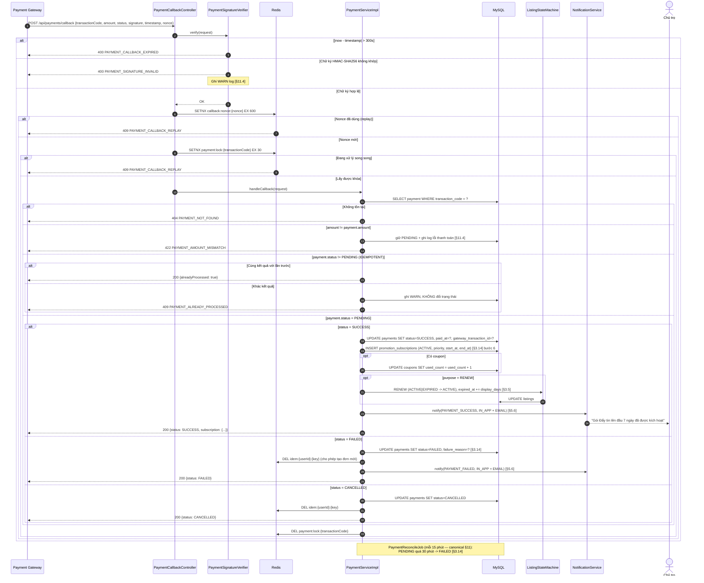

### 6.9. Bảo mật bổ sung

| Biện pháp | Chi tiết | Căn cứ |
|---|---|---|
| So sánh chữ ký hằng thời gian | `MessageDigest.isEqual` — không dùng `String.equals` | `[§11.1]` |
| Secret từ env | `APP_PAYMENT_CALLBACK_SECRET`, không commit | canonical §1.3 |
| IP allowlist | `APP_PAYMENT_CALLBACK_IPS` (CSV, rỗng = tắt) — kiểm tra trong `RateLimitFilter` | `[§11.1]` |
| Ghi log mọi callback | Kể cả callback bị từ chối → `audit_logs` không, nhưng application log **có** | `[§11.4]` *"Lỗi thanh toán"* |
| Không lộ chi tiết lỗi | Response chỉ có `errorCode` + message chung, không lộ chuỗi ký kỳ vọng | `[§11.1]` |
| CSRF | Không áp dụng — API stateless Bearer, `csrf().disable()` (canonical §8) | canonical §8 |

---

## 7. API các module AI `[§12.9]`

### 7.0. Nguyên tắc chung cho toàn bộ module AI

| Nguyên tắc | Nội dung | Căn cứ |
|---|---|---|
| Sau interface | `SentimentAnalyzer`, `RecommendationEngine`, `ChatbotEngine`, `PriceEstimator` — impl thay được | canonical §10 |
| Async qua queue | Executor riêng `@Async("aiExecutor")` (`AsyncConfig`) | `[§11.6]`, canonical §10 |
| **AI không tự khóa** | **Không bao giờ** tự khóa tài khoản; chỉ đề xuất `NEED_REVIEW` + cảnh báo | canonical §10, `[§10.10]` |
| Bật/tắt được | `ai.<module>.enabled = false` → **503 `AI_MODULE_DISABLED`** | `[§10.10]` |
| Timeout | Mặc định **2 giây** cho lời gọi đồng bộ → quá → `503 AI_SERVICE_UNAVAILABLE` | canonical §7.2 |
| Ghi log | `sentiment_results`, `recommendation_logs`, `chatbot_messages`, `prediction_histories` | `[§10.10]`, canonical §6 |

**Bảng hành vi khi AI lỗi/timeout — quy tắc chốt:**

| Endpoint | AI lỗi / timeout | AI bị tắt (`enabled=false`) | Ghi chú |
|---|---|---|---|
| `POST /api/listings/{id}/comments` | **200/201 — bình luận VẪN LƯU**, `sentimentLabel = PENDING_ANALYSIS` | như trên | **`[§9.1]`** *"AI lỗi hoặc timeout: bình luận vẫn được lưu, sentiment ở trạng thái PendingAnalysis"*, canonical §10.1 |
| `PUT /api/comments/{id}` | **200 — vẫn lưu**, `PENDING_ANALYSIS` | như trên | `[§9.1]` |
| `POST /api/ai/sentiment/analyze` | **503 `AI_SERVICE_UNAVAILABLE`** | **503 `AI_MODULE_DISABLED`** | Endpoint chẩn đoán của Admin |
| `POST /api/ai/recommendations` | **503 `AI_SERVICE_UNAVAILABLE`** | **503 `AI_MODULE_DISABLED`** | FE ẩn khối gợi ý, trang vẫn chạy |
| `GET /api/listings/{id}/related` | **503** | **503** | FE ẩn "Tin tương tự" |
| `POST /api/ai/chatbot/message` | **503 `AI_SERVICE_UNAVAILABLE`** | **503 `AI_MODULE_DISABLED`** | FE hiện "Chatbot đang bảo trì" |
| `POST /api/ai/price-prediction` | **503 `AI_SERVICE_UNAVAILABLE`** | **503 `AI_MODULE_DISABLED`** | |
| `POST /api/listings` (gợi ý giá kèm) | **201 — tin VẪN TẠO**, `pricePrediction.available = false` | như trên | **`[§9.4]`** *"Không chặn đăng tin chỉ vì giá khác dự đoán"*, `[§3.3]` |

> **Nguyên tắc vàng:** AI **không bao giờ** được phép làm hỏng nghiệp vụ lõi. Bình luận phải lưu
> được, tin phải đăng được, dù AI chết hoàn toàn.

---

### 7.1. `POST /api/ai/sentiment/analyze` — Phân tích cảm xúc bình luận

| Mục | Nội dung |
|---|---|
| Mã chức năng | `[§2.11]` **AI-01**; `[§12.9]`; `[§9.1]`; `[§8.3]` |
| Quyền | **`AI_LOG_VIEW`** (Moderator + Admin) |
| Rate limit | 60 / phút / user |

**Quyết định thiết kế:** `[§12.9]` khai báo endpoint này, nhưng `[§5.5]` nói sentiment chạy
*"Khi có bình luận mới hoặc bình luận được sửa"* — tức là **tự động, async**, không phải người
dùng gọi. Vì vậy endpoint này là **công cụ chẩn đoán/thử nghiệm cho Admin**: phân tích lại một
bình luận đã có, hoặc thử một đoạn văn bản để kiểm tra từ điển. Người dùng cuối **không** gọi
trực tiếp. Xem ADR-07 (mục 11).

**Request body** — đúng **một** trong hai:

| Field | Kiểu | Bắt buộc | Ràng buộc | Mô tả |
|---|---|:--:|---|---|
| `commentId` | long | điều kiện | tồn tại | Phân tích lại bình luận có sẵn `[§9.1]` "CommentId" |
| `text` | string | điều kiện | 1–1000 ký tự | Thử nghiệm từ điển với văn bản bất kỳ |
| `accountAgeDays` | int | ✘ | `>= 0`; chỉ dùng với `text` | Mô phỏng trọng số tài khoản mới `[§9.1]` |
| `persist` | boolean | ✘ | mặc định `false`; chỉ có tác dụng với `commentId` | `true` → ghi đè `sentiment_results` + tính lại `TrustScore` |

**Response 200**

```json
{
  "success": true,
  "message": "Phân tích cảm xúc thành công",
  "data": {
    "commentId": 4501,
    "listingId": 877,
    "content": "Đến xem thì không có phòng này, chủ đòi cọc trước mới cho xem. Cẩn thận!",
    "label": "NEGATIVE",
    "score": -0.82,
    "confidence": 0.91,
    "action": "NEED_REVIEW",
    "isRiskComment": true,
    "weight": 1.0,
    "explanation": {
      "normalizedText": "den xem thi khong co phong nay chu doi coc truoc moi cho xem can than",
      "matchedTokens": [
        { "token": "không có", "type": "NEGATION_PHRASE", "weight": -0.30, "position": 3 },
        { "token": "đòi cọc trước", "type": "NEGATIVE_NGRAM", "weight": -0.70, "position": 9 },
        { "token": "cẩn thận", "type": "WARNING_PHRASE", "weight": -0.50, "position": 15 }
      ],
      "negationApplied": true,
      "intensifiersApplied": [],
      "emojiScore": 0.0,
      "rawScore": -1.50,
      "normalizedScore": -0.82,
      "reason": "Phát hiện 3 cụm tiêu cực mạnh, không có cụm tích cực đối trọng"
    },
    "trustScoreImpact": {
      "listingTrustScoreBefore": 34,
      "listingTrustScoreAfter": 32,
      "recalculated": true
    },
    "processingTimeMs": 14,
    "persisted": true,
    "analyzedAt": "2026-07-17T10:00:00Z"
  },
  "timestamp": "2026-07-17T10:00:00Z"
}
```

**Response 200 — bình luận quá ngắn** (`[§9.1]` *"Bình luận quá ngắn: gắn Neutral hoặc bỏ qua tính điểm"*):

```json
{
  "success": true,
  "message": "Phân tích cảm xúc thành công",
  "data": {
    "commentId": 4490,
    "content": "ok",
    "label": "NEUTRAL",
    "score": 0.0,
    "confidence": 1.0,
    "action": "NONE",
    "isRiskComment": false,
    "weight": 0.0,
    "skipReason": "TOO_SHORT",
    "skipNote": "Độ dài 2 ký tự nhỏ hơn ai.sentiment.min_length (10) → gắn NEUTRAL, không tính vào điểm uy tín [§9.1]",
    "explanation": { "matchedTokens": [] },
    "trustScoreImpact": { "recalculated": false },
    "processingTimeMs": 2,
    "analyzedAt": "2026-07-17T10:00:00Z"
  },
  "timestamp": "2026-07-17T10:00:00Z"
}
```

**Response 200 — vừa khen vừa chê** (`[§9.1]` *"Bình luận chứa cả khen và chê: có thể gắn Neutral
hoặc Mixed nếu hệ thống hỗ trợ"* → hệ thống **hỗ trợ** `MIXED` — canonical §5):

```json
{
  "success": true,
  "message": "Phân tích cảm xúc thành công",
  "data": {
    "commentId": 4520,
    "content": "Phòng đẹp, chủ dễ tính nhưng giá điện quá cao và tường cách âm rất kém.",
    "label": "MIXED",
    "score": -0.08,
    "confidence": 0.62,
    "action": "WATCH",
    "isRiskComment": false,
    "weight": 1.0,
    "explanation": {
      "matchedTokens": [
        { "token": "phòng đẹp", "type": "POSITIVE_NGRAM", "weight": 0.60, "position": 0 },
        { "token": "chủ dễ tính", "type": "POSITIVE_NGRAM", "weight": 0.70, "position": 2 },
        { "token": "quá cao", "type": "NEGATIVE_INTENSIFIED", "weight": -0.75, "position": 8 },
        { "token": "rất kém", "type": "NEGATIVE_INTENSIFIED", "weight": -0.90, "position": 13 }
      ],
      "negationApplied": false,
      "intensifiersApplied": [
        { "token": "quá", "multiplier": 1.5, "appliesTo": "cao" },
        { "token": "rất", "multiplier": 1.5, "appliesTo": "kém" }
      ],
      "reason": "Có cả cụm tích cực mạnh và tiêu cực mạnh → MIXED [§9.1]"
    },
    "processingTimeMs": 18,
    "analyzedAt": "2026-07-17T10:00:00Z"
  },
  "timestamp": "2026-07-17T10:00:00Z"
}
```

**Mã lỗi:** `UNAUTHORIZED`, `FORBIDDEN`, `SENTIMENT_COMMENT_NOT_FOUND`,
**`AI_MODULE_DISABLED`** (503, `ai.sentiment.enabled = false`),
**`AI_SERVICE_UNAVAILABLE`** (503, timeout), `VALIDATION_FAILED`, `RATE_LIMIT_EXCEEDED`.

**Quy tắc nghiệp vụ `[§9.1]` (canonical §10.1):**

| Quy tắc | Hiện thực | Trích dẫn |
|---|---|---|
| Output đủ 5 thành phần | `label`, `score`, `confidence`, `isRiskComment`, `action` | `[§9.1]` Output |
| Thuật toán | Chuẩn hóa → tách token → từ điển có trọng số → **phủ định** ("không", "chẳng", "chưa" đảo dấu trong cửa sổ 3 từ) → **từ tăng cường** ("rất", "cực kỳ", "quá" ×1.5) → emoji → **n-gram** | canonical §10.1 |
| Độ dài < `ai.sentiment.min_length` (10) | → `NEUTRAL`, `weight = 0`, **không** tính điểm uy tín | `[§9.1]`, canonical §10.1 |
| Vừa khen vừa chê | → **`MIXED`** (canonical §5 có sẵn label này) | `[§9.1]` |
| Mỉa mai / khó phân tích | `confidence < 0.5` → `action` tối đa `WATCH`, **không** kích hoạt hành động nặng | `[§9.1]` |
| Tài khoản < `ai.sentiment.new_account_days` (7) | `weight = ai.sentiment.new_account_weight` (0.5) | `[§9.1]`, canonical §9 |
| Bị đánh dấu spam | **loại khỏi** thống kê điểm uy tín | `[§9.1]`, canonical §10.1 |
| Một bình luận tiêu cực đơn lẻ | **không** làm khóa tin | `[§9.1]` |

**Ngưỡng đánh dấu `[§9.1]` "Gợi ý ngưỡng" (canonical §9):**

| Điều kiện | Hành động | Config key |
|---|---|---|
| `commentCount >= 5` **và** `negativeRatio >= 0.40` | Đánh dấu **`NEED_REVIEW`** (`FLAG_NEED_REVIEW`) | `ai.sentiment.min_comments_l1` / `negative_ratio_l1` |
| `commentCount >= 10` **và** `negativeRatio >= 0.50` | Gửi **cảnh báo mức cao** (`AI_NEGATIVE_ALERT`) | `ai.sentiment.min_comments_l2` / `negative_ratio_l2` |
| Tin đã `NEED_REVIEW` **3 lần** trong **30 ngày** | **Đề xuất** khóa tin (không tự khóa) | `ai.sentiment.need_review_count_for_lock` / `need_review_window_days` |
| Chủ trọ có **3 tin** bị cảnh báo sentiment trong **30 ngày** | **Đề xuất** kiểm tra tài khoản (không tự khóa) | `ai.sentiment.landlord_alert_listing_count` |

---

### 7.2. `POST /api/ai/recommendations` — Gợi ý tin đăng

| Mục | Nội dung |
|---|---|
| Mã chức năng | `[§2.11]` **AI-04**; `[§12.9]`; `[§9.2]`; `[§8.5]` |
| Quyền | **anonymous** (cold start) / **authenticated** (cá nhân hóa) |
| Rate limit | 60 / phút / user hoặc IP |
| Cache | `reco:user:{userId}` / `reco:coldstart:{provinceId}:{districtId}`, TTL `ai.recommendation.cache_ttl_minutes` (15) `[§11.11]` |

**Request body** — `RecommendationRequest`

| Field | Kiểu | Bắt buộc | Ràng buộc | Mô tả |
|---|---|:--:|---|---|
| `source` | enum | ✔ | ∈ `RecommendationSource` = `HOMEPAGE` \| `SIMILAR_LISTING` \| `AFTER_FAVORITE` \| `LOW_RESULT_SEARCH` \| `CHATBOT` \| `NOTIFICATION` (canonical §5) | Ngữ cảnh gợi ý `[§9.2]` "Khi nào hiển thị gợi ý" |
| `listingId` | long | điều kiện | Bắt buộc khi `source ∈ {SIMILAR_LISTING, AFTER_FAVORITE}` | Tin làm gốc |
| `size` | int | ✘ | `1..24`; mặc định `ai.recommendation.size` (12) | Số tin |
| `currentFilter` | object | ✘ | Cùng cấu trúc query của `GET /api/listings` | **Cold start** `[§9.2]` *"Gợi ý theo bộ lọc hiện tại"* |
| `provinceId` / `districtId` | long | ✘ | tồn tại | **Cold start** `[§9.2]` *"Gợi ý theo vị trí nếu người dùng chọn tỉnh/quận"* |
| `excludeListingIds` | long[] | ✘ | tối đa 50 | Tin FE đã hiển thị (chống lặp) |

**Response 200 — có cá nhân hóa:**

```json
{
  "success": true,
  "message": "Gợi ý cho bạn",
  "data": {
    "source": "HOMEPAGE",
    "personalized": true,
    "coldStart": false,
    "recommendationLogId": 77301,
    "profileSummary": {
      "preferredDistricts": [
        { "id": 765, "name": "Quận Bình Thạnh", "weight": 0.62 },
        { "id": 764, "name": "Quận Gò Vấp", "weight": 0.38 }
      ],
      "preferredPriceRange": { "from": 2800000.00, "to": 4200000.00, "percentile": "10-90" },
      "preferredCategories": [
        { "code": "BOARDING_HOUSE", "name": "Phòng trọ", "weight": 0.71 },
        { "code": "MINI_APARTMENT", "name": "Chung cư mini", "weight": 0.29 }
      ],
      "preferredAmenities": [
        { "id": 1, "code": "AIR_CONDITIONER", "name": "Máy lạnh" },
        { "id": 6, "code": "PARKING", "name": "Chỗ để xe" }
      ],
      "behaviorCounts": { "views": 42, "searches": 12, "favorites": 5, "contacts": 2 },
      "note": "Hồ sơ dựng từ lịch sử xem (w=1), tìm kiếm (w=2), lưu tin (w=3), liên hệ (w=5)"
    },
    "items": [
      {
        "id": 1203,
        "slug": "chung-cu-mini-full-noi-that-go-vap",
        "title": "Chung cư mini full nội thất, Gò Vấp, có thang máy",
        "categoryCode": "MINI_APARTMENT", "categoryName": "Chung cư mini",
        "price": 4000000.00, "area": 28.00,
        "shortAddress": "Phường 10, Quận Gò Vấp, TP. Hồ Chí Minh",
        "thumbnailUrl": "https://cdn.webtro.vn/listings/1203/thumb/p1q2r3.webp",
        "trustScore": 90, "averageRating": 4.7, "promoted": false,
        "matchScore": 0.812,
        "scoreBreakdown": {
          "areaMatch": 1.00, "priceMatch": 0.95, "categoryMatch": 1.00,
          "amenityMatch": 0.50, "trustScoreNorm": 0.90, "freshness": 0.72,
          "promotedBoost": 1.00
        },
        "matchReasons": [
          "Khu vực bạn thường xem (Quận Gò Vấp)",
          "Trong khoảng giá bạn quan tâm (2.8 – 4.2 triệu)",
          "Có thang máy như tin bạn đã lưu"
        ]
      },
      {
        "id": 1187,
        "slug": "phong-tro-gac-lung-gan-cho-ba-chieu",
        "title": "Phòng trọ gác lửng gần chợ Bà Chiểu, có máy lạnh",
        "categoryCode": "BOARDING_HOUSE", "categoryName": "Phòng trọ",
        "price": 3200000.00, "area": 20.00,
        "shortAddress": "Phường 1, Quận Bình Thạnh, TP. Hồ Chí Minh",
        "thumbnailUrl": "https://cdn.webtro.vn/listings/1187/thumb/x9y8z7.webp",
        "trustScore": 85, "averageRating": 4.3, "promoted": true, "promotedLabel": "Tin nổi bật",
        "matchScore": 0.798,
        "scoreBreakdown": {
          "areaMatch": 1.00, "priceMatch": 0.98, "categoryMatch": 1.00,
          "amenityMatch": 1.00, "trustScoreNorm": 0.85, "freshness": 0.65,
          "promotedBoost": 1.15
        },
        "matchReasons": [
          "Khu vực bạn thường xem (Quận Bình Thạnh)",
          "Cùng loại tin bạn hay xem (Phòng trọ)",
          "Có máy lạnh và chỗ để xe như bạn quan tâm"
        ]
      }
    ],
    "generatedAt": "2026-07-17T10:00:00Z",
    "cacheHit": false
  },
  "timestamp": "2026-07-17T10:00:00Z"
}
```

**Response 200 — cold start** (`[§9.2]` "Cold start"):

```json
{
  "success": true,
  "message": "Tin mới và phổ biến dành cho bạn",
  "data": {
    "source": "HOMEPAGE",
    "personalized": false,
    "coldStart": true,
    "coldStartStrategy": ["NEWEST", "POPULAR_IN_AREA", "CURRENT_FILTER", "POPULAR_CATEGORY"],
    "coldStartNote": "Chưa đủ dữ liệu hành vi — gợi ý tin mới nhất, tin phổ biến trong khu vực đang xem, theo bộ lọc hiện tại và danh mục phổ biến [§9.2]",
    "profileSummary": null,
    "items": [
      {
        "id": 1305,
        "slug": "cho-thue-phong-tro-q7-gan-lotte-mart-co-gac",
        "title": "Cho thuê phòng trọ Q7 gần Lotte Mart, có gác",
        "categoryCode": "BOARDING_HOUSE",
        "price": 3800000.00, "area": 24.00,
        "shortAddress": "Phường Tân Phong, Quận 7, TP. Hồ Chí Minh",
        "thumbnailUrl": "https://cdn.webtro.vn/listings/1305/thumb/g7h8i9.webp",
        "trustScore": 100, "promoted": false,
        "matchScore": 0.55,
        "matchReasons": ["Tin mới đăng hôm nay", "Phổ biến tại Quận 7"]
      }
    ],
    "generatedAt": "2026-07-17T10:00:00Z",
    "cacheHit": true
  },
  "timestamp": "2026-07-17T10:00:00Z"
}
```

**Mã lỗi:** **`AI_MODULE_DISABLED`** (503), **`AI_SERVICE_UNAVAILABLE`** (503),
`LISTING_NOT_FOUND`, `MISSING_PARAMETER` (thiếu `listingId` khi cần), `VALIDATION_FAILED`,
`RATE_LIMIT_EXCEEDED`.

**Quy tắc nghiệp vụ `[§9.2]` (canonical §10.2):**

1. **Công thức điểm (chốt — canonical §10.2):**
   ```
   score = 0.30·areaMatch + 0.25·priceMatch + 0.15·categoryMatch
         + 0.10·amenityMatch + 0.10·trustScoreNorm + 0.10·freshness
   finalScore = score × promotedBoost          // promotedBoost ≤ ai.recommendation.promoted_boost = 1.15
   ```
2. **`UserPreferenceProfile`** dựng từ (canonical §10.2):
   `ViewHistory` (**w=1**) + `SearchHistory` (**w=2**) + `Favorite` (**w=3**) + `ContactLog` (**w=5**)
   → suy ra khu vực ưu tiên, khoảng giá ưu tiên (**percentile 10–90**), loại tin ưu tiên, tiện ích quan tâm.
   Đúng danh sách input `[§9.2]` "Dữ liệu đầu vào".
3. **Loại trừ bắt buộc** `[§9.2]`, canonical §10.2:
   - Tin `HIDDEN`/`EXPIRED`/`LOCKED`/`CLOSED`/`DELETED` — *"Không gợi ý tin Hidden, Expired, Locked"*.
   - Tin user **đã xem gần đây** — *"Không gợi ý lặp lại quá nhiều một tin"*.
   - Tin **của chính user**.
   - Tin trong `excludeListingIds`.
4. **`promotedBoost` có trần 1.15** — `[§9.2]` *"Tin trả phí có thể tăng thứ hạng nhưng vẫn cần
   phù hợp nhu cầu"*; canonical §9 ghi rõ *"trần, tránh phá tính liên quan"*. Tin được đẩy mà
   `score` gốc thấp vẫn **không** lọt top.
5. **Ghi `RecommendationLog` mọi lần** — `[§9.2]` *"Hệ thống cần lưu RecommendationLog để giải
   thích và đánh giá hiệu quả"*, canonical §10.2. `scoreBreakdown` + `matchReasons` làm AI
   **giải thích được**.
6. **Cold start** `[§9.2]`: tin mới nhất + phổ biến trong khu vực đang xem + theo `currentFilter` +
   danh mục phổ biến ("phòng trọ giá rẻ, ở ghép, căn hộ mini").
7. **`RecommendationPrecomputeJob`** (mỗi 6 giờ — canonical §11) tính trước cho user hoạt động
   `[§5.5]` *"hoặc job định kỳ tính trước"* → `cacheHit = true`.
8. Chỉ trả tin thỏa `publicStatuses()` (canonical §5.2).

---

### 7.3. Chatbot `[§3.15][§9.3]`

#### 7.3.1. `POST /api/ai/chatbot/message` — Gửi tin nhắn chatbot

| Mục | Nội dung |
|---|---|
| Mã chức năng | `[§2.11]` **AI-05**; `[§12.9]`; `[§3.15]`; `[§9.3]`; `[§8.4]` |
| Quyền | **anonymous** — `[§1.2]` *"Khách chưa đăng nhập: Sử dụng chatbot ở mức cơ bản"* |
| Rate limit | **30 / phút** — `spam.chatbot.per_minute` (canonical §8, `[§11.10]`) |

**Request body** — `ChatbotMessageRequest`

| Field | Kiểu | Bắt buộc | Ràng buộc | Mô tả |
|---|---|:--:|---|---|
| `message` | string | ✔ | **1–500 ký tự**; sanitize | Câu hỏi `[§3.15]` "Câu hỏi, nhu cầu" |
| `conversationId` | long | ✘ | tồn tại; thuộc user/session hiện tại | Phiên hội thoại; bỏ trống → tạo mới |
| `sessionId` | string | điều kiện | UUID v4; **bắt buộc khi chưa đăng nhập** | Định danh khách ẩn danh |
| `resetContext` | boolean | ✘ | mặc định `false` | Bắt đầu lại nhu cầu |

**Response 200 — intent `FIND_ROOM`, đủ slot** (`[§8.4]`):

```json
{
  "success": true,
  "message": "Chatbot đã phản hồi",
  "data": {
    "conversationId": 1201,
    "messageId": 55402,
    "intent": "FIND_ROOM",
    "intentConfidence": 0.94,
    "reply": "Mình tìm được 18 phòng trọ ở Quận 1 dưới 4 triệu, diện tích từ 15 m², cho 2 người ở. Bạn xem thử nhé:",
    "extractedSlots": {
      "districtId": 760, "districtName": "Quận 1",
      "provinceId": 79, "provinceName": "Thành phố Hồ Chí Minh",
      "priceTo": 4000000.00,
      "areaFrom": 15.00,
      "maxOccupants": 2,
      "categoryCode": "BOARDING_HOUSE"
    },
    "missingSlots": [],
    "clarifyTurn": 2,
    "maxClarifyTurns": 3,
    "listings": [
      {
        "id": 1024,
        "slug": "phong-tro-moi-xay-co-gac-lung-quan-binh-thanh",
        "title": "Phòng trọ mới xây, có gác lửng, Q. Bình Thạnh",
        "price": 3500000.00, "area": 22.00,
        "shortAddress": "Phường 25, Quận Bình Thạnh, TP. Hồ Chí Minh",
        "thumbnailUrl": "https://cdn.webtro.vn/listings/1024/thumb/a1b2c3d4.webp",
        "trustScore": 92, "averageRating": 4.6, "promoted": true
      }
    ],
    "totalResults": 18,
    "searchUrl": "/tim-kiem?provinceId=79&districtId=760&priceTo=4000000&areaFrom=15&maxOccupants=2",
    "quickReplies": [
      { "label": "Xem tất cả 18 tin", "action": "NAVIGATE", "value": "/tim-kiem?provinceId=79&districtId=760&priceTo=4000000&areaFrom=15&maxOccupants=2" },
      { "label": "Chỉ tin có máy lạnh", "action": "REFINE", "value": "{\"hasAirConditioner\": true}" },
      { "label": "Giờ giấc tự do", "action": "REFINE", "value": "{\"curfewType\": \"FREE\"}" },
      { "label": "Tìm khu vực khác", "action": "RESET_SLOT", "value": "districtId" }
    ],
    "disclaimer": "Thông tin lấy trực tiếp từ tin đăng. Bạn vui lòng liên hệ chủ trọ để xác nhận phòng còn trống.",
    "createdAt": "2026-07-17T10:00:00Z"
  },
  "timestamp": "2026-07-17T10:00:00Z"
}
```

**Response 200 — thiếu thông tin, chatbot hỏi lại** (`[§3.15]` *"Nếu thiếu thông tin quan trọng,
chatbot hỏi lại"*):

```json
{
  "success": true,
  "message": "Chatbot đã phản hồi",
  "data": {
    "conversationId": 1201,
    "messageId": 55401,
    "intent": "FIND_ROOM",
    "intentConfidence": 0.94,
    "reply": "Mình tìm được 18 phòng ở Quận 1 dưới 4 triệu. Để lọc chính xác hơn, bạn cần diện tích khoảng bao nhiêu m² và ở mấy người ạ?",
    "extractedSlots": { "districtId": 760, "districtName": "Quận 1", "priceTo": 4000000.00 },
    "missingSlots": ["areaFrom", "maxOccupants"],
    "clarifyTurn": 1,
    "maxClarifyTurns": 3,
    "listings": [],
    "totalResults": 18,
    "quickReplies": [
      { "label": "Dưới 20 m²", "action": "FILL_SLOT", "value": "{\"areaTo\": 20}" },
      { "label": "20 – 30 m²", "action": "FILL_SLOT", "value": "{\"areaFrom\": 20, \"areaTo\": 30}" },
      { "label": "Ở 1 mình", "action": "FILL_SLOT", "value": "{\"maxOccupants\": 1}" },
      { "label": "Ở 2 người", "action": "FILL_SLOT", "value": "{\"maxOccupants\": 2}" },
      { "label": "Bỏ qua, xem luôn", "action": "SKIP_CLARIFY", "value": null }
    ],
    "createdAt": "2026-07-17T09:59:00Z"
  },
  "timestamp": "2026-07-17T09:59:00Z"
}
```

**Response 200 — không có kết quả** (`[§3.15]` *"Nếu không có kết quả, chatbot đề xuất mở rộng
giá/khu vực/diện tích"*):

```json
{
  "success": true,
  "message": "Chatbot đã phản hồi",
  "data": {
    "conversationId": 1201,
    "messageId": 55410,
    "intent": "FIND_ROOM",
    "intentConfidence": 0.91,
    "reply": "Rất tiếc, mình không tìm thấy phòng nào ở Quận 1 dưới 2 triệu với diện tích trên 25 m². Bạn thử một trong các cách sau nhé:",
    "extractedSlots": { "districtId": 760, "priceTo": 2000000.00, "areaFrom": 25.00 },
    "missingSlots": [],
    "listings": [],
    "totalResults": 0,
    "expansionSuggestions": [
      { "type": "EXPAND_PRICE",  "label": "Nới giá lên 3.500.000 ₫", "estimatedCount": 14,
        "params": { "priceTo": 3500000 } },
      { "type": "EXPAND_AREA_SCOPE", "label": "Tìm thêm ở Quận 4 và Quận Bình Thạnh gần đó",
        "estimatedCount": 47, "params": { "districtIds": [760, 773, 765] } },
      { "type": "EXPAND_SIZE", "label": "Chấp nhận phòng từ 18 m²", "estimatedCount": 9,
        "params": { "areaFrom": 18 } }
    ],
    "quickReplies": [
      { "label": "Nới giá lên 3,5 triệu", "action": "REFINE", "value": "{\"priceTo\": 3500000}" },
      { "label": "Mở rộng khu vực",       "action": "REFINE", "value": "{\"districtIds\": [760, 773, 765]}" },
      { "label": "Chấp nhận 18 m²",       "action": "REFINE", "value": "{\"areaFrom\": 18}" }
    ],
    "createdAt": "2026-07-17T10:01:00Z"
  },
  "timestamp": "2026-07-17T10:01:00Z"
}
```

**Response 200 — intent `GLOSSARY`** (`[§3.15]` *"Người dùng hỏi thuật ngữ như 'chung cư mini',
'cọc', 'giờ giấc tự do'"*):

```json
{
  "success": true,
  "message": "Chatbot đã phản hồi",
  "data": {
    "conversationId": 1202,
    "messageId": 55420,
    "intent": "GLOSSARY",
    "intentConfidence": 0.97,
    "reply": "\"Chung cư mini\" là loại căn hộ nhỏ nằm trong một tòa nhà do cá nhân hoặc hộ gia đình xây để cho thuê. Đặc điểm thường gặp: diện tích 20 – 40 m², có gác lửng hoặc phòng ngủ riêng, khu bếp và vệ sinh khép kín, một số tòa có thang máy và bảo vệ. Giá thuê thường cao hơn phòng trọ thường nhưng thấp hơn căn hộ chung cư chính thức.",
    "glossaryTerm": "chung cư mini",
    "listings": [],
    "quickReplies": [
      { "label": "Xem chung cư mini đang cho thuê", "action": "NAVIGATE",
        "value": "/tim-kiem?categoryCode=MINI_APARTMENT" },
      { "label": "\"Cọc\" là gì?", "action": "ASK", "value": "cọc là gì" },
      { "label": "\"Giờ giấc tự do\" là gì?", "action": "ASK", "value": "giờ giấc tự do là gì" }
    ],
    "createdAt": "2026-07-17T10:02:00Z"
  },
  "timestamp": "2026-07-17T10:02:00Z"
}
```

**Response 200 — intent `OUT_OF_SCOPE`** (`[§9.3]` *"Người dùng hỏi ngoài phạm vi: trả lời giới
hạn hỗ trợ"*):

```json
{
  "success": true,
  "message": "Chatbot đã phản hồi",
  "data": {
    "conversationId": 1203,
    "messageId": 55430,
    "intent": "OUT_OF_SCOPE",
    "intentConfidence": 0.88,
    "reply": "Mình chỉ hỗ trợ tìm phòng trọ, giải thích thuật ngữ và hướng dẫn sử dụng website thôi ạ. Về các vấn đề pháp lý hợp đồng thuê nhà, bạn nên tham khảo ý kiến luật sư hoặc cơ quan có thẩm quyền. Mình có thể giúp bạn tìm phòng không?",
    "listings": [],
    "quickReplies": [
      { "label": "Tìm phòng trọ", "action": "ASK", "value": "tôi muốn tìm phòng trọ" },
      { "label": "Hướng dẫn đăng tin", "action": "ASK", "value": "làm sao để đăng tin" }
    ],
    "createdAt": "2026-07-17T10:03:00Z"
  },
  "timestamp": "2026-07-17T10:03:00Z"
}
```

**Response 200 — intent `SENSITIVE`** (`[§9.3]` *"Câu hỏi có nội dung nhạy cảm: từ chối lịch sự và
hướng về chức năng tìm trọ"*):

```json
{
  "success": true,
  "message": "Chatbot đã phản hồi",
  "data": {
    "conversationId": 1204,
    "messageId": 55440,
    "intent": "SENSITIVE",
    "intentConfidence": 0.93,
    "reply": "Xin lỗi, mình không thể hỗ trợ nội dung này. Mình là trợ lý tìm phòng trọ — bạn cần tìm phòng ở khu vực nào ạ?",
    "listings": [],
    "quickReplies": [
      { "label": "Tìm phòng ở TP. Hồ Chí Minh", "action": "ASK", "value": "tìm phòng ở TP.HCM" }
    ],
    "flaggedForReview": true,
    "createdAt": "2026-07-17T10:04:00Z"
  },
  "timestamp": "2026-07-17T10:04:00Z"
}
```

**Mã lỗi:** `CHATBOT_MESSAGE_EMPTY`, `CHATBOT_MESSAGE_TOO_LONG`, `CHATBOT_RATE_LIMIT` (429),
`CHATBOT_CONVERSATION_NOT_FOUND`, **`AI_MODULE_DISABLED`** (503), **`AI_SERVICE_UNAVAILABLE`** (503),
`DANGEROUS_HTML_DETECTED`, `VALIDATION_FAILED`.

**Quy tắc nghiệp vụ `[§3.15]`, `[§9.3]` (canonical §10.3):**

| Ràng buộc **cứng** | Hiện thực | Trích dẫn |
|---|---|---|
| **Chỉ trả tin public** | `ListingSearchService` + `publicStatuses()` (canonical §5.2) | `[§3.15]` *"Chatbot chỉ trả về tin Active"* |
| **Không bịa thông tin** | Mọi dữ liệu tin lấy **trực tiếp từ DB**; không có sinh văn bản tự do về tin | `[§3.15]` *"Chatbot không tự tạo thông tin không có trong dữ liệu tin đăng"* |
| **Không cam kết còn phòng** | `disclaimer` **luôn** kèm khi trả danh sách tin | `[§9.3]` *"Tự cam kết phòng còn trống nếu chưa có xác nhận"* — không nên |
| **Không tư vấn pháp lý** | Intent `OUT_OF_SCOPE` | `[§9.3]` |
| **Không đặt cọc / thương lượng thay** | Không có action nào làm việc này | `[§3.15]`, `[§9.3]` |
| **Không tạo tin thay chủ trọ** | Intent `HOW_TO_POST` chỉ **hướng dẫn**, không tạo tin | `[§9.3]` |
| **Hỏi lại tối đa 3 lượt** | `ai.chatbot.max_clarify_turns` (3) — canonical §9 | `[§9.3]` *"hỏi lại tối đa 2-3 câu"* |
| **Không kết quả → đề xuất mở rộng** | `expansionSuggestions` | `[§3.15]`, `[§9.3]` |
| **Ghi log câu hỏi phổ biến** | `chatbot_messages` → `GET /api/admin/ai/logs?module=CHATBOT` → `topQuestions` | `[§3.15]` *"ghi log câu hỏi phổ biến để cải thiện FAQ"* |

**8 intent** — đúng `ChatbotIntent` canonical §5:
`FIND_ROOM`, `HOW_TO_POST`, `GLOSSARY`, `FAQ`, `GREETING`, `OUT_OF_SCOPE`, `SENSITIVE`, `UNKNOWN`.

**Slot filling `[§9.3]` "Bộ lọc chatbot cần hỗ trợ"** — đủ 11 slot:

| Slot | Ví dụ câu nói tự nhiên | Ánh xạ query param |
|---|---|---|
| Giá | "dưới 4 triệu", "3-5tr", "khoảng 3 triệu rưỡi" | `priceFrom` / `priceTo` |
| Khu vực | "Quận 1", "gần Bình Thạnh", "ở Gò Vấp" | `provinceId` / `districtId` / `wardId` |
| Diện tích | "trên 20m2", "rộng rộng chút" | `areaFrom` / `areaTo` |
| Nội thất | "có nội thất", "full nội thất" | `furnitureStatus` |
| Thú cưng | "nuôi mèo được không", "cho nuôi chó" | `petAllowed` |
| Giờ giấc | "giờ giấc tự do", "không giới nghiêm" | `curfewType` |
| Chỗ để xe | "có chỗ để xe máy" | `parkingAvailable` |
| Số người ở | "ở 2 người", "ở 1 mình" | `maxOccupants` |
| Giới tính ở ghép | "nữ", "chỉ nam" | `genderRequirement` |
| Loại nhà/phòng | "chung cư mini", "nhà nguyên căn", "ở ghép" | `categoryCode` |
| Tiện ích | "có máy lạnh", "có thang máy", "có máy giặt" | `amenityIds` / `hasAirConditioner`… |

Slot **quan trọng** (thiếu thì hỏi lại): `districtId`/`provinceId`, `priceTo`, `maxOccupants`.
`ai.chatbot.enabled = false` → **503 `AI_MODULE_DISABLED`**, FE hiện "Chatbot đang bảo trì"
`[§10.10]`.

---

#### 7.3.2. `GET /api/ai/chatbot/conversations` — Danh sách phiên chatbot

| Mục | Nội dung |
|---|---|
| Mã chức năng | `[§6.1]` `ChatbotConversation` — **[BỔ SUNG NGOÀI `[§12.9]`]** |
| Quyền | **authenticated** |

**Query params:** `page` (0), `size` (20, max 100), `sort` (`lastMessageAt,desc`).

**Response 200**

```json
{
  "success": true,
  "message": "Lấy danh sách phiên trò chuyện thành công",
  "data": {
    "items": [
      { "id": 1201, "title": "Tìm phòng Quận 1 dưới 4 triệu",
        "lastIntent": "FIND_ROOM", "messageCount": 6,
        "lastMessagePreview": "Mình tìm được 18 phòng trọ ở Quận 1 dưới 4 triệu...",
        "activeSlots": { "districtId": 760, "priceTo": 4000000.00, "maxOccupants": 2 },
        "createdAt": "2026-07-17T09:55:00Z", "lastMessageAt": "2026-07-17T10:00:00Z" }
    ],
    "page": 0, "size": 20, "totalElements": 3, "totalPages": 1, "first": true, "last": true
  },
  "timestamp": "2026-07-17T10:00:00Z"
}
```

**Mã lỗi:** `UNAUTHORIZED`, `INVALID_SORT_FIELD`.
**Quy tắc:** khách ẩn danh (`sessionId`) **không** có lịch sử lưu lâu dài — phiên giữ trong Redis
TTL 24 giờ; đăng nhập → `chatbot_conversations` (canonical §6). `title` sinh tự động từ slot đầu tiên.

---

#### 7.3.3. `GET /api/ai/chatbot/conversations/{id}/messages` — Lịch sử tin nhắn chatbot

| Mục | Nội dung |
|---|---|
| Mã chức năng | `[§6.1]` `ChatbotMessage` — **[BỔ SUNG NGOÀI `[§12.9]`]** |
| Quyền | **authenticated** + chủ phiên |

**Query params:** `page` (0), `size` (30, max 100), `sort` (`createdAt,asc`).

**Response 200**

```json
{
  "success": true,
  "message": "Lấy lịch sử trò chuyện thành công",
  "data": {
    "items": [
      { "id": 55400, "role": "USER",
        "content": "tôi muốn tìm phòng gần quận 1 dưới 4 triệu",
        "createdAt": "2026-07-17T09:55:00Z" },
      { "id": 55401, "role": "BOT",
        "content": "Mình tìm được 18 phòng ở Quận 1 dưới 4 triệu. Bạn cần diện tích khoảng bao nhiêu m² và ở mấy người ạ?",
        "intent": "FIND_ROOM", "intentConfidence": 0.94,
        "extractedSlots": { "districtId": 760, "priceTo": 4000000.00 },
        "listingIds": [], "totalResults": 18,
        "createdAt": "2026-07-17T09:55:01Z" }
    ],
    "page": 0, "size": 30, "totalElements": 6, "totalPages": 1, "first": true, "last": true
  },
  "timestamp": "2026-07-17T10:00:00Z"
}
```

**Mã lỗi:** `UNAUTHORIZED`, `CHATBOT_CONVERSATION_NOT_FOUND`, `FORBIDDEN`, `INVALID_SORT_FIELD`.
**Quy tắc:** `role` ∈ {`USER`, `BOT`}. Chỉ chủ phiên xem được `[§11.2]`.

---

### 7.4. Price Prediction `[§3.16][§9.4]`

#### 7.4.1. `POST /api/ai/price-prediction` — Dự đoán giá thuê

| Mục | Nội dung |
|---|---|
| Mã chức năng | `[§2.11]` **AI-06**; `[§12.9]`; `[§3.16]`; `[§9.4]`; `[§8.1]` |
| Quyền | **`LISTING_CREATE`** — `[§3.16]` *"Người sử dụng: Chủ trọ, Admin, Hệ thống"* |
| Rate limit | 60 / phút / user |

**Request body** — `PricePredictionRequest` (đúng danh sách Input `[§9.4]`)

| Field | Kiểu | Bắt buộc | Ràng buộc validation | Mô tả (`[§9.4]` Input) |
|---|---|:--:|---|---|
| `categoryId` | long | ✔ | tồn tại, `active` | **"Loại nhà"** |
| `provinceId` | long | ✔ | tồn tại | **"Khu vực"** |
| `districtId` | long | ✔ | tồn tại, thuộc `provinceId` | **"Khu vực"** |
| `wardId` | long | ✔ | tồn tại, thuộc `districtId` | **"Khu vực"** |
| `area` | BigDecimal | ✔ | **`> 0`**, `≤ 1000.00` | **"Diện tích"** |
| `roomCount` | int | ✘ | `1..20`; mặc định `1` | **"Số phòng"** |
| `toiletCount` | int | ✘ | `1..10`; mặc định `1` | **"Số toilet"** |
| `furnitureStatus` | enum | ✘ | ∈ `FurnitureStatus`; mặc định `NONE` | **"Nội thất"** |
| `toiletType` | enum | ✘ | ∈ `ToiletType`; mặc định `PRIVATE` | Tình trạng phòng |
| `amenityIds` | long[] | ✘ | mỗi id tồn tại; tối đa 30 | **"Tiện ích"** |
| `isStreetFront` | boolean | ✘ | mặc định `false` | **"Mặt tiền/hẻm"** |
| `latitude` / `longitude` | double | ✘ | VN bounds | **"Khoảng cách đến trung tâm"** |
| `listingId` | long | ✘ | tồn tại, OWNER | Tin đang sửa (để ghi `prediction_histories`) |
| `inputPrice` | BigDecimal | ✘ | `> 0` | Giá chủ trọ định nhập → tính `deviationRatio` `[§9.4]` bước 5 |

**Response 200 — dự đoán thành công** (đủ 4 thành phần Output `[§9.4]`):

```json
{
  "success": true,
  "message": "Dự đoán giá thành công",
  "data": {
    "available": true,
    "predictionHistoryId": 33110,

    "suggestedPrice": 3300000.00,

    "priceRange": {
      "low": 2900000.00,
      "medium": 3300000.00,
      "high": 3800000.00,
      "percentiles": { "p25": 2900000.00, "p50": 3300000.00, "p75": 3800000.00 }
    },

    "confidence": "HIGH",
    "confidenceScore": 0.84,
    "confidenceLabel": "Độ tin cậy cao",

    "explanation": {
      "summary": "Giá cao hơn mức trung bình khu vực do có nội thất cơ bản, toilet riêng và chỗ để xe.",
      "basePrice": 2860000.00,
      "basePriceNote": "Giá cơ sở = trung vị 130.000 ₫/m² × 22 m², tính từ 23 tin phòng trọ tương đương tại Phường 25, Quận Bình Thạnh trong 180 ngày qua",
      "adjustments": [
        { "factor": "FURNITURE_BASIC",  "label": "Nội thất cơ bản",  "percent": 6.0,  "amount": 171600.00 },
        { "factor": "TOILET_PRIVATE",   "label": "Toilet riêng",     "percent": 8.0,  "amount": 228800.00 },
        { "factor": "PARKING",          "label": "Có chỗ để xe",     "percent": 5.0,  "amount": 143000.00 },
        { "factor": "CURFEW_FREE",      "label": "Giờ giấc tự do",   "percent": 3.0,  "amount": 85800.00 },
        { "factor": "DISTANCE_CENTER",  "label": "Cách trung tâm 5,2 km", "percent": -5.0, "amount": -143000.00 }
      ],
      "totalAdjustmentPercent": 17.0,
      "factorsInVietnamese": [
        "Giá cao hơn do có nội thất cơ bản và toilet riêng",
        "Giá cao hơn do có chỗ để xe và giờ giấc tự do",
        "Giá thấp hơn một chút do cách trung tâm 5,2 km"
      ]
    },

    "comparable": {
      "sampleSize": 23,
      "scope": "WARD",
      "scopeLabel": "Phường 25, Quận Bình Thạnh",
      "scopeExpanded": false,
      "areaRange": { "from": 15.40, "to": 28.60, "note": "diện tích ±30% quanh 22 m²" },
      "periodDays": 180,
      "statuses": ["ACTIVE", "CLOSED"],
      "medianPricePerSqm": 130000.00,
      "iqrRatio": 0.21
    },

    "comparison": {
      "inputPrice": 3500000.00,
      "suggestedPrice": 3300000.00,
      "difference": 200000.00,
      "deviationRatio": 0.0606,
      "deviationPercent": 6.06,
      "deviationFlagged": false,
      "thresholdRatio": 0.35,
      "verdict": "REASONABLE",
      "verdictMessage": "Giá bạn nhập cao hơn 6% so với giá đề xuất — nằm trong khoảng bình thường của thị trường."
    },

    "disclaimer": "Giá đề xuất chỉ mang tính tham khảo dựa trên các tin đăng tương đương, không phải định giá chính thức. Bạn hoàn toàn có thể đặt giá khác.",
    "predictedAt": "2026-07-17T10:00:00Z"
  },
  "timestamp": "2026-07-17T10:00:00Z"
}
```

**Response 200 — giá lệch lớn** (`[§9.4]` bước 7 *"Nếu chênh lệch bất thường, hệ thống ghi flag"*;
`[§3.16]` *"Nếu giá chủ trọ nhập lệch quá lớn, hệ thống cảnh báo mềm"*):

```json
{
  "success": true,
  "message": "Dự đoán giá thành công",
  "data": {
    "available": true,
    "predictionHistoryId": 33111,
    "suggestedPrice": 2680000.00,
    "priceRange": { "low": 2350000.00, "medium": 2680000.00, "high": 3100000.00 },
    "confidence": "MEDIUM",
    "confidenceScore": 0.66,
    "confidenceLabel": "Độ tin cậy trung bình",
    "explanation": {
      "summary": "Giá cơ sở tính từ 11 tin tương đương tại Quận 7.",
      "factorsInVietnamese": ["Giá cao hơn do có nội thất cơ bản", "Giá cao hơn do gần trung tâm Quận 7"]
    },
    "comparable": { "sampleSize": 11, "scope": "DISTRICT", "scopeLabel": "Quận 7",
                    "scopeExpanded": true,
                    "scopeExpandedNote": "Không đủ mẫu ở Phường Tân Phong nên đã mở rộng lên Quận 7",
                    "periodDays": 180, "iqrRatio": 0.38 },
    "comparison": {
      "inputPrice": 3800000.00,
      "suggestedPrice": 2680000.00,
      "difference": 1120000.00,
      "deviationRatio": 0.4179,
      "deviationPercent": 41.79,
      "deviationFlagged": true,
      "thresholdRatio": 0.35,
      "verdict": "MUCH_HIGHER",
      "verdictMessage": "Giá bạn nhập cao hơn 42% so với giá đề xuất. Bạn vẫn có thể đăng tin với giá này, nhưng tin có thể ít người liên hệ hơn và sẽ được kiểm duyệt viên xem qua.",
      "blocksPosting": false
    },
    "disclaimer": "Giá đề xuất chỉ mang tính tham khảo dựa trên các tin đăng tương đương, không phải định giá chính thức. Bạn hoàn toàn có thể đặt giá khác.",
    "predictedAt": "2026-07-17T10:00:00Z"
  },
  "timestamp": "2026-07-17T10:00:00Z"
}
```

**Response 422 — không đủ dữ liệu** (`[§9.4]` *"Nếu dữ liệu đầu vào thiếu hoặc quá khác thường, hệ
thống **không dự đoán** hoặc báo độ tin cậy thấp"*):

```json
{
  "success": false,
  "message": "Chưa đủ dữ liệu thị trường để dự đoán giá cho khu vực này",
  "data": null,
  "errorCode": "AI_INSUFFICIENT_DATA",
  "errors": [
    { "field": "wardId", "message": "Chỉ tìm được 3 tin tương đương, cần tối thiểu 8 tin" }
  ],
  "timestamp": "2026-07-17T10:00:00Z",
  "path": "/api/ai/price-prediction",
  "traceId": "3c7d9e0b-2f45-4a18-9e61-5d02b8a7c134"
}
```

**Response 400 — thiếu trường bắt buộc** (`[§3.16]` *"Nếu thiếu dữ liệu, hệ thống thông báo cần
nhập thêm trường"*):

```json
{
  "success": false,
  "message": "Cần nhập thêm: Phường/xã, Diện tích để dự đoán giá",
  "data": null,
  "errorCode": "AI_MISSING_INPUT_FIELD",
  "errors": [
    { "field": "wardId", "message": "Vui lòng chọn phường/xã" },
    { "field": "area",   "message": "Vui lòng nhập diện tích" }
  ],
  "timestamp": "2026-07-17T10:00:00Z",
  "path": "/api/ai/price-prediction",
  "traceId": "9e0b2f45-3c7d-4a18-8c62-1de5a0b93c47"
}
```

**Mã lỗi:** `UNAUTHORIZED`, `FORBIDDEN`, **`AI_INSUFFICIENT_DATA`** (422),
**`AI_MISSING_INPUT_FIELD`** (400), `AI_PRICE_INPUT_INVALID` (400),
**`AI_MODULE_DISABLED`** (503), **`AI_SERVICE_UNAVAILABLE`** (503),
`CATEGORY_NOT_FOUND`, `WARD_NOT_FOUND`, `AMENITY_NOT_FOUND`, `VALIDATION_FAILED`, `RATE_LIMIT_EXCEEDED`.

**Quy tắc nghiệp vụ `[§9.4]` (canonical §10.4 — 6 bước):**

| Bước | Nội dung | Trích dẫn |
|---|---|---|
| 1 | **Lấy comparable**: cùng `ward` (nới dần `district` → `province` nếu thiếu mẫu), cùng `category`, **diện tích ±30%**, tin **`ACTIVE`/`CLOSED`** trong **180 ngày** | canonical §10.4 |
| 2 | `n < ai.price.min_samples` (**8**) → **`INSUFFICIENT_DATA`**, **không dự đoán** | **`[§9.4]`**, canonical §10.4 |
| 3 | **Giá cơ sở = median(price/m²) × diện tích** | canonical §10.4 |
| 4 | **Điều chỉnh hedonic** (hệ số **cấu hình được**): nội thất đầy đủ **+12%**, toilet riêng **+8%**, thang máy **+7%**, chỗ để xe **+5%**, giờ tự do **+3%**, mặt tiền **+15%**, khoảng cách trung tâm | canonical §10.4 |
| 5 | **Khoảng = percentile 25 / 50 / 75**; `confidence` theo `n` và độ phân tán (**IQR/median**) | canonical §10.4, `[§9.4]` "Khoảng giá tham khảo: thấp - trung bình - cao" |
| 6 | `\|inputPrice − suggested\| / suggested > ai.price.deviation_flag_ratio` (**0.35**) → **ghi flag**, **cảnh báo mềm**, **TUYỆT ĐỐI KHÔNG CHẶN ĐĂNG TIN** | **`[§3.3]`**, **`[§9.4]`**, canonical §10.4 |
| — | **Lưu `PredictionHistory` mọi lần** | `[§3.16]` bước 6, `[§9.4]` *"Kết quả dự đoán cần lưu để phục vụ báo cáo và đánh giá chất lượng AI"*, canonical §10.4 |

**Ánh xạ `confidence` (canonical §5 `PriceConfidence`):**

| `confidence` | Điều kiện | `confidenceScore` |
|---|---|---|
| `HIGH` | `n >= 20` **và** `iqrRatio <= 0.25` | `0.80 – 1.00` |
| `MEDIUM` | `n >= 12` **và** `iqrRatio <= 0.40` | `0.55 – 0.79` |
| `LOW` | `n >= ai.price.min_samples` (8) | `0.30 – 0.54` |
| `INSUFFICIENT_DATA` | `n < 8` → **422 `AI_INSUFFICIENT_DATA`** | — |

**`verdict` (giải thích đơn giản cho chủ trọ — `[§9.4]` Output *"Gợi ý giải thích đơn giản"*):**

| `verdict` | Điều kiện | Nghĩa |
|---|---|---|
| `MUCH_LOWER` | `deviationRatio < -0.35` | Thấp bất thường → **có thể** gắn cờ kiểm duyệt `[§9.4]` *"Nếu giá thấp bất thường, có thể đánh dấu cần kiểm duyệt để tránh tin giả"* |
| `LOWER` | `-0.35 ≤ deviationRatio < -0.15` | Thấp hơn thị trường |
| `REASONABLE` | `-0.15 ≤ deviationRatio ≤ 0.15` | Hợp lý |
| `HIGHER` | `0.15 < deviationRatio ≤ 0.35` | Cao hơn thị trường |
| `MUCH_HIGHER` | `deviationRatio > 0.35` | Cao bất thường → cảnh báo mềm |

> **`blocksPosting` LUÔN LÀ `false`** — không có ngoại lệ. `[§9.4]` *"Không chặn đăng tin chỉ vì
> giá khác dự đoán"*, `[§3.3]` *"Tin có giá quá bất thường so với AI đề xuất **không bị chặn tự
> động**, nhưng có thể bị đánh dấu cần kiểm tra"*, canonical §10.4 bước 6 *"tuyệt đối không chặn
> đăng tin"*.
>
> **`disclaimer` LUÔN có mặt** — `[§9.4]` *"Không hiển thị AI như nguồn đảm bảo chính xác tuyệt đối"*.

**Khi nào gọi lại `[§5.9]`** — FE gọi lại endpoint này khi chủ trọ đổi: khu vực (`wardId`),
diện tích (`area`), loại nhà (`categoryId`), số phòng (`roomCount`), số toilet (`toiletCount`),
nội thất (`furnitureStatus`) hoặc tiện ích quan trọng (`amenityIds`).
Debounce **800ms** ở FE để tránh gọi liên tục.

---

#### 7.4.2. `GET /api/ai/price-prediction/histories` — Lịch sử dự đoán giá

| Mục | Nội dung |
|---|---|
| Mã chức năng | `[§3.16]` bước 6 *"Hệ thống lưu PredictionHistory"*; `[§9.4]` *"Kết quả dự đoán cần lưu để phục vụ báo cáo"*; `[§6.2]` *"Một tin có nhiều lần dự đoán giá"* — **[BỔ SUNG NGOÀI `[§12.9]`]** |
| Quyền | `LISTING_UPDATE_OWN` + **OWNER** của tin, hoặc `AI_LOG_VIEW` |

**Query params**

| Param | Kiểu | Bắt buộc | Mặc định | Ràng buộc |
|---|---|:--:|---|---|
| `listingId` | long | ✔ | — | tồn tại; phải là tin của mình (trừ khi có `AI_LOG_VIEW`) |
| `page` / `size` | int | ✘ | `0` / `20` | `size ≤ 100` |
| `sort` | string | ✘ | `createdAt,desc` | ∈ {`createdAt`} |

**Response 200**

```json
{
  "success": true,
  "message": "Lấy lịch sử dự đoán giá thành công",
  "data": {
    "items": [
      { "id": 33110, "listingId": 1024,
        "suggestedPrice": 3300000.00,
        "priceRange": { "low": 2900000.00, "medium": 3300000.00, "high": 3800000.00 },
        "confidence": "HIGH", "confidenceScore": 0.84, "sampleSize": 23,
        "comparableScope": "WARD",
        "inputPrice": 3500000.00, "deviationRatio": 0.0606, "deviationFlagged": false,
        "triggerReason": "LISTING_CREATE",
        "createdAt": "2026-07-09T14:20:12Z" },
      { "id": 33098, "listingId": 1024,
        "suggestedPrice": 3280000.00,
        "priceRange": { "low": 2880000.00, "medium": 3280000.00, "high": 3760000.00 },
        "confidence": "HIGH", "confidenceScore": 0.82, "sampleSize": 21,
        "comparableScope": "WARD",
        "inputPrice": 3300000.00, "deviationRatio": 0.0061, "deviationFlagged": false,
        "triggerReason": "AMENITY_CHANGE",
        "createdAt": "2026-07-12T03:05:40Z" }
    ],
    "page": 0, "size": 20, "totalElements": 2, "totalPages": 1, "first": true, "last": true
  },
  "timestamp": "2026-07-17T10:00:00Z"
}
```

**Mã lỗi:** `UNAUTHORIZED`, `FORBIDDEN`, `LISTING_NOT_FOUND`, `LISTING_FORBIDDEN`,
`MISSING_PARAMETER`, `INVALID_SORT_FIELD`.

**Quy tắc:** `triggerReason` ∈ {`LISTING_CREATE`, `LISTING_UPDATE`, `AMENITY_CHANGE`,
`MANUAL_REQUEST`, `CONFIG_CHANGE`} — phủ đúng `[§5.9]` "Khi nào tính lại giá dự đoán".
Dữ liệu này phục vụ *"đánh giá chất lượng AI"* `[§9.4]`.

---
## 8. Sequence diagram 7 luồng nghiệp vụ

Vẽ **đúng theo mô tả** `[§8.1]` → `[§8.7]`, bổ sung chi tiết kỹ thuật (endpoint, mã lỗi, config key,
state machine) để lập trình viên code thẳng.

### 8.1. Đăng tin `[§8.1]`

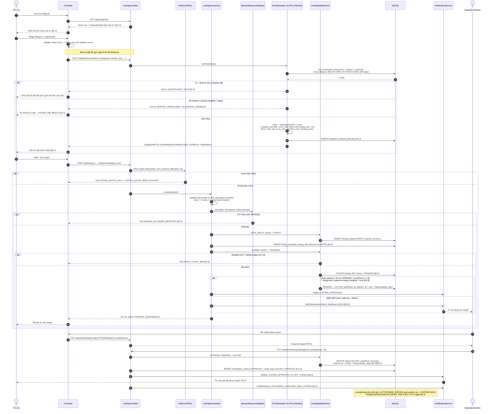

### 8.2. Thanh toán đẩy tin `[§8.2]`

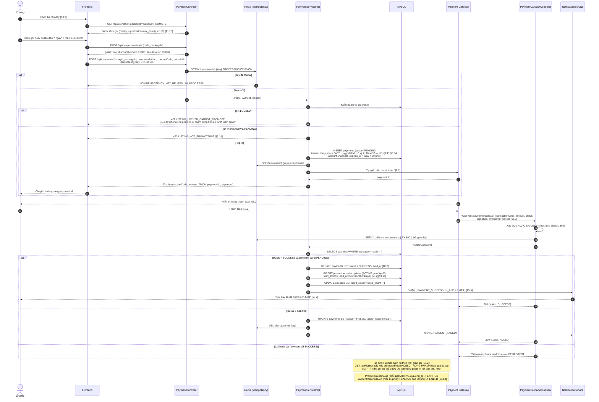

### 8.3. AI phân tích bình luận `[§8.3]`

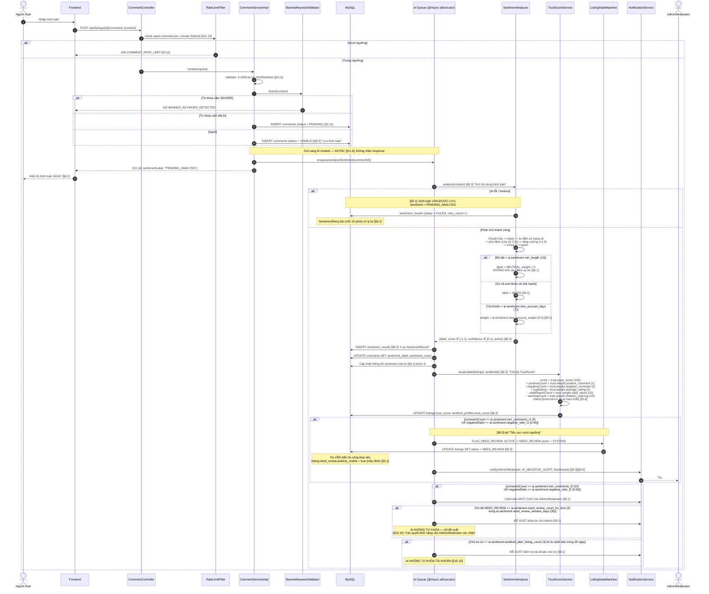

### 8.4. Chatbot tìm trọ `[§8.4]`

```mermaid
sequenceDiagram
    autonumber
    actor U as Người dùng
    participant FE as Frontend
    participant API as ChatbotController
    participant RL as RateLimitFilter
    participant CE as RuleBasedChatbotEngine
    participant SS as ListingSearchService
    participant DB as MySQL

    U->>FE: "Tôi muốn tìm phòng gần Quận 1 dưới 4 triệu" [§8.4]
    FE->>API: POST /api/ai/chatbot/message {message, sessionId}
    API->>RL: check spam.chatbot.per_minute (30/phút) [§11.10]
    alt Vượt ngưỡng
        RL-->>FE: 429 CHATBOT_RATE_LIMIT
    else ai.chatbot.enabled = false
        API-->>FE: 503 AI_MODULE_DISABLED [§10.10]
        FE-->>U: "Chatbot đang bảo trì"
    else OK
        API->>CE: process(message, context)
        CE->>CE: Intent classification (từ khóa + regex có trọng số)<br/>-> FIND_ROOM (confidence 0.94) [§9.3]
        CE->>CE: Trích xuất nhu cầu / slot filling [§8.4]<br/>"Quận 1" -> districtId=760<br/>"dưới 4 triệu" -> priceTo=4000000

        alt Intent = SENSITIVE
            CE-->>FE: Từ chối lịch sự + hướng về tìm trọ [§9.3]
        else Intent = OUT_OF_SCOPE
            CE-->>FE: "Mình chỉ hỗ trợ tìm phòng trọ..." [§9.3]
        else Intent = GLOSSARY / HOW_TO_POST / FAQ
            CE->>DB: Tra từ điển thuật ngữ / FAQ
            CE-->>FE: Câu trả lời + quickReplies [§3.15]
        else Intent = FIND_ROOM
            alt Thiếu slot quan trọng VÀ clarifyTurn < ai.chatbot.max_clarify_turns (3)
                CE-->>FE: Hỏi thêm diện tích/số người/tiện ích [§8.4]
                FE-->>U: "Bạn cần diện tích bao nhiêu m² và ở mấy người ạ?"
                U->>FE: Trả lời bổ sung [§8.4]
                FE->>API: POST /api/ai/chatbot/message {message, conversationId}
                CE->>CE: Cập nhật slot (areaFrom=15, maxOccupants=2)
            end

            CE->>SS: search(filter) [§8.4] "Gửi bộ lọc"
            SS->>DB: SELECT ... WHERE status IN publicStatuses()<br/>AND deleted_at IS NULL AND expired_at > now()<br/>AND district_id = 760 AND price <= 4000000 ... [§8.4]
            Note over SS,DB: RÀNG BUỘC CỨNG: chỉ trả tin public [§3.15]<br/>"Chatbot chỉ trả về tin Active"
            DB-->>SS: Danh sách tin [§8.4]
            SS-->>CE: Kết quả [§8.4]

            alt totalResults = 0
                CE-->>FE: Đề xuất mở rộng giá / khu vực / diện tích [§8.4][§3.15]
                FE-->>U: "Không tìm thấy. Bạn thử nới giá lên 3,5 triệu?"
            else Có kết quả
                CE->>DB: INSERT chatbot_messages (intent, slots, listingIds)<br/>[§3.15] "ghi log câu hỏi phổ biến để cải thiện FAQ"
                CE-->>FE: {reply, listings[], totalResults, quickReplies, disclaimer}
                Note over CE: KHÔNG bịa thông tin ngoài DB [§3.15]<br/>KHÔNG cam kết còn phòng -> luôn kèm disclaimer [§9.3]
                FE-->>U: Danh sách tin + gợi ý mở rộng [§8.4]
                U->>FE: Mở chi tiết / lưu tin / hỏi tiếp [§3.15]
            end
        end
    end
```

### 8.5. Gợi ý bài đăng `[§8.5]`

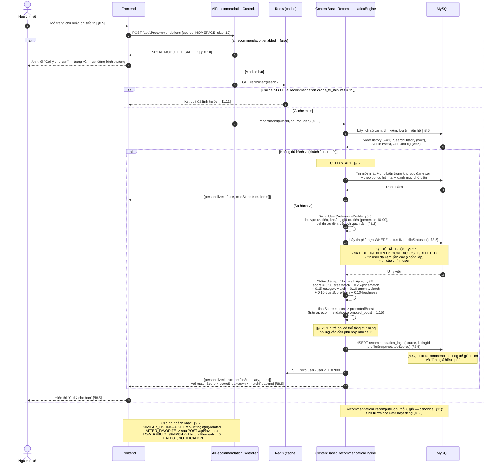

### 8.6. Đánh giá `[§8.6]`

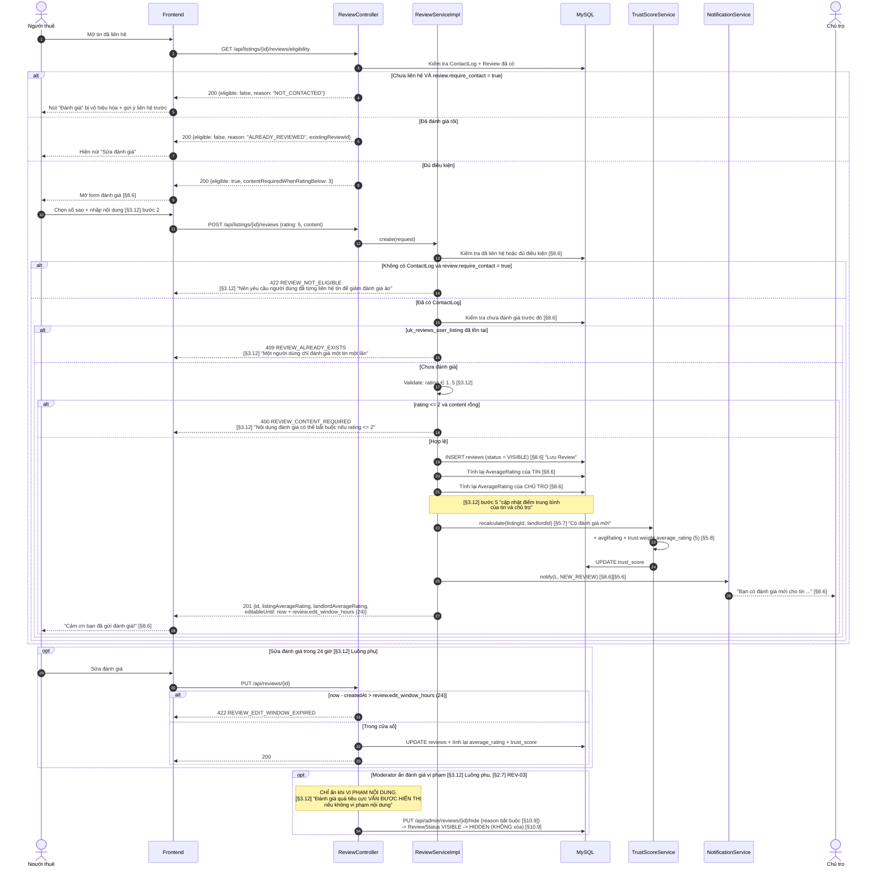

### 8.7. Báo cáo và khóa bài `[§8.7]`

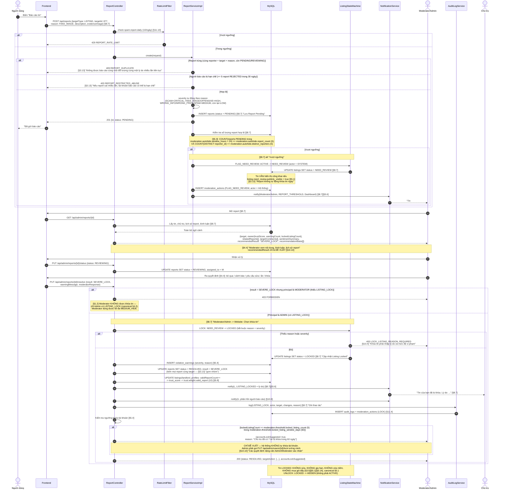

---

## 9. Cấu hình Swagger/OpenAPI

### 9.1. Dependency & đường dẫn (canonical §1.1)

`springdoc-openapi-starter-webmvc-ui` **2.6.0** (tương thích Spring Boot 3.3.5).

| Mục | Đường dẫn |
|---|---|
| Swagger UI | **`/swagger-ui.html`** (springdoc tự redirect sang `/swagger-ui/index.html`) |
| OpenAPI JSON | **`/v3/api-docs`** |
| OpenAPI YAML | `/v3/api-docs.yaml` |
| Nhóm theo module | `/v3/api-docs/{group}` — ví dụ `/v3/api-docs/admin` |

```yaml
# application.yml
springdoc:
  api-docs:
    path: /v3/api-docs
    enabled: ${SPRINGDOC_ENABLED:true}     # tắt ở prod qua env
  swagger-ui:
    path: /swagger-ui.html
    tags-sorter: alpha
    operations-sorter: method
    display-request-duration: true
    doc-expansion: none
    persist-authorization: true            # giữ token khi F5
  default-produces-media-type: application/json
  packages-to-scan: com.webtro.modules
  paths-to-match: /api/**
```

### 9.2. `OpenApiConfig`

```java
package com.webtro.config;

@Configuration
@SecurityScheme(
        name = "bearerAuth",
        type = SecuritySchemeType.HTTP,
        scheme = "bearer",
        bearerFormat = "JWT",
        in = SecuritySchemeIn.HEADER,
        description = "Dán access token lấy từ POST /api/auth/login (không cần tiền tố 'Bearer ')"
)
public class OpenApiConfig {

    @Bean
    public OpenAPI webtroOpenAPI(@Value("${app.version:1.0.0}") String version) {
        return new OpenAPI()
                .info(new Info()
                        .title("Webtro API — Website quảng cáo và tìm kiếm phòng trọ")
                        .version(version)
                        .description("""
                                Hợp đồng API giữa backend và frontend.

                                **Envelope thống nhất**: mọi endpoint trả `ApiResponse<T>`
                                `{ success, message, data, timestamp }`; khi lỗi có thêm
                                `errorCode`, `errors[]`, `path`, `traceId`.

                                **Xác thực**: Bearer JWT (15 phút) + refresh token opaque (7 ngày,
                                có rotation + reuse detection). Gọi `POST /api/auth/login` rồi bấm
                                nút **Authorize**.

                                **Phân trang**: `?page=0&size=20&sort=createdAt,desc`, `size` tối đa 100.

                                **Version**: header `X-Api-Version` (mặc định `1`).

                                **Thời gian**: ISO-8601 UTC. **Tiền**: VND, kiểu number.
                                """)
                        .contact(new Contact().name("Nhóm đồ án Webtro").email("support@webtro.vn"))
                        .license(new License().name("Đồ án tốt nghiệp — sử dụng nội bộ")))
                .servers(List.of(
                        new Server().url("/").description("Server hiện tại")))
                .addSecurityItem(new SecurityRequirement().addList("bearerAuth"))
                .components(new Components()
                        .addResponses("Unauthorized", errorResponse("401", "Chưa đăng nhập", "UNAUTHORIZED"))
                        .addResponses("Forbidden",    errorResponse("403", "Không đủ quyền", "FORBIDDEN"))
                        .addResponses("NotFound",     errorResponse("404", "Không tìm thấy", "RESOURCE_NOT_FOUND"))
                        .addResponses("RateLimited",  errorResponse("429", "Vượt giới hạn", "RATE_LIMIT_EXCEEDED")));
    }

    // ---- Nhóm tag theo module (canonical §3) ----
    @Bean public GroupedOpenApi authApi()    { return group("01-auth",    "/api/auth/**"); }
    @Bean public GroupedOpenApi userApi()    { return group("02-user",    "/api/users/**"); }
    @Bean public GroupedOpenApi catalogApi() { return group("03-catalog", "/api/categories/**", "/api/provinces/**",
                                                                          "/api/districts/**", "/api/amenities/**"); }
    @Bean public GroupedOpenApi listingApi() { return group("04-listing", "/api/listings/**", "/api/search/**"); }
    @Bean public GroupedOpenApi interactionApi() { return group("05-interaction", "/api/favorites/**", "/api/history/**",
                                                                                  "/api/conversations/**", "/api/comments/**",
                                                                                  "/api/reviews/**", "/api/reports/**"); }
    @Bean public GroupedOpenApi paymentApi() { return group("06-payment", "/api/payments/**", "/api/promotion-packages/**",
                                                                          "/api/promotion-subscriptions/**", "/api/coupons/**"); }
    @Bean public GroupedOpenApi notificationApi() { return group("07-notification", "/api/notifications/**"); }
    @Bean public GroupedOpenApi aiApi()      { return group("08-ai",      "/api/ai/**"); }
    @Bean public GroupedOpenApi adminApi()   { return group("09-admin",   "/api/admin/**"); }

    private GroupedOpenApi group(String name, String... paths) {
        return GroupedOpenApi.builder().group(name).pathsToMatch(paths).build();
    }
}
```

### 9.3. Danh sách tag (khớp mục 4)

| Tag | Mô tả | Endpoint |
|---|---|---|
| `01. Auth` | Đăng ký, đăng nhập, token, xác thực | `/api/auth/**` |
| `02. User` | Hồ sơ, chủ trọ, theo dõi | `/api/users/**` |
| `03. Catalog` | Danh mục, khu vực, tiện ích, cấu hình công khai | `/api/categories`, `/api/provinces`, `/api/system-configs/public`, … |
| `04. Listing` | Tin đăng, tìm kiếm, ảnh, thống kê, tổng quan chủ trọ | `/api/listings/**`, `/api/search/**`, `/api/landlord/dashboard` |
| `05. Favorite & History` | Lưu tin, lịch sử xem/tìm kiếm | `/api/favorites/**`, `/api/history/**` |
| `06. Contact & Chat` | Liên hệ, hội thoại, tin nhắn | `/api/listings/{id}/contact`, `/api/conversations/**` |
| `07. Comment & Review` | Bình luận, đánh giá | `/api/comments/**`, `/api/reviews/**` |
| `08. Report` | Báo cáo vi phạm | `/api/reports/**` |
| `09. Payment & Promotion` | Gói dịch vụ, thanh toán, coupon | `/api/payments/**`, `/api/promotion-packages/**` |
| `10. Notification` | Thông báo | `/api/notifications/**` |
| `11. AI` | Sentiment, gợi ý, chatbot, dự đoán giá | `/api/ai/**` |
| `12. Admin - Dashboard` | Dashboard, thống kê | `/api/admin/dashboard`, `/api/admin/statistics/**` |
| `13. Admin - User` | Người dùng, chủ trọ | `/api/admin/users/**`, `/api/admin/landlords/**` |
| `14. Admin - Listing` | Tin đăng, kiểm duyệt, hàng đợi, bulk | `/api/admin/listings/**`, `/api/admin/moderation-actions`, `/api/admin/moderation/queue` |
| `15. Admin - Comment & Review` | Bình luận, đánh giá | `/api/admin/comments/**`, `/api/admin/reviews/**` |
| `16. Admin - Report` | Báo cáo, cảnh báo | `/api/admin/reports/**`, `/api/admin/warnings/**` |
| `17. Admin - Catalog` | Danh mục, khu vực, tiện ích | `/api/admin/categories/**`, … |
| `18. Admin - Payment` | Gói, thanh toán, coupon | `/api/admin/promotion-packages/**`, … |
| `19. Admin - AI` | Log AI, cấu hình AI | `/api/admin/ai/**` |
| `20. Admin - System` | Cấu hình, audit, từ khóa cấm | `/api/admin/system-configs`, `/api/admin/audit-logs`, … |
| `21. Export` | Xuất Excel — **ngoại lệ envelope** (mục 4.21) | 6 path kết thúc bằng `/export` |

### 9.4. Ví dụ annotation đầy đủ (mẫu bắt buộc — canonical §7.3, §13.3)

```java
package com.webtro.modules.listing.controller;

@RestController
@RequestMapping("/api/listings")
@RequiredArgsConstructor
@Tag(name = "04. Listing", description = "Tin đăng, tìm kiếm, ảnh, thống kê [§2.3][§2.4]")
public class ListingController {

    private final ListingService listingService;

    @PostMapping
    @PreAuthorize("hasAuthority('LISTING_CREATE')")
    @SecurityRequirement(name = "bearerAuth")
    @Operation(
        summary = "Tạo tin đăng mới (LIST-01 / LIST-02)",
        description = """
            Tạo tin ở trạng thái `DRAFT`; nếu `submitImmediately = true` thì gửi duyệt luôn
            (`DRAFT → PENDING`). Kèm gợi ý giá AI nếu đủ dữ liệu — **AI lỗi không chặn đăng tin**.

            **Nghiệp vụ:** `[§3.3]` · **State machine:** canonical §5.1 `SAVE_DRAFT`, `SUBMIT`

            **Rate limit:** 3/ngày (tài khoản < 7 ngày) hoặc 10/ngày `[§11.10]`
            """)
    @ApiResponses({
        @ApiResponse(responseCode = "201", description = "Tạo tin thành công",
            headers = @Header(name = "Location", description = "URI tin vừa tạo",
                              schema = @Schema(type = "string")),
            content = @Content(mediaType = "application/json",
                schema = @Schema(implementation = ListingDetailApiResponse.class),
                examples = @ExampleObject(name = "Tạo tin nháp thành công", value = """
                    {
                      "success": true,
                      "message": "Đã lưu tin nháp thành công",
                      "data": {
                        "id": 1301,
                        "title": "Phòng trọ có gác lửng, đường D2, Bình Thạnh",
                        "status": "DRAFT",
                        "price": 3500000.00,
                        "area": 22.00,
                        "pricePrediction": {
                          "available": true,
                          "suggestedPrice": 3300000.00,
                          "confidence": "HIGH",
                          "deviationFlagged": false
                        }
                      },
                      "timestamp": "2026-07-17T10:00:00Z"
                    }"""))),
        @ApiResponse(responseCode = "400", description =
            "VALIDATION_FAILED · INVALID_PRICE · INVALID_TITLE_LENGTH · ROOMMATE_INFO_REQUIRED",
            content = @Content(schema = @Schema(implementation = ErrorApiResponse.class))),
        @ApiResponse(responseCode = "401", ref = "#/components/responses/Unauthorized"),
        @ApiResponse(responseCode = "403", description = "FORBIDDEN · LISTING_POSTING_SUSPENDED",
            content = @Content(schema = @Schema(implementation = ErrorApiResponse.class))),
        @ApiResponse(responseCode = "422", description =
            "AREA_NOT_SUPPORTED · BANNED_KEYWORD_DETECTED",
            content = @Content(schema = @Schema(implementation = ErrorApiResponse.class))),
        @ApiResponse(responseCode = "429", ref = "#/components/responses/RateLimited")
    })
    public ResponseEntity<ApiResponse<ListingDetailResponse>> create(
            @Valid @RequestBody CreateListingRequest request,
            @Parameter(hidden = true) @CurrentUser CustomUserDetails principal) {

        ListingDetailResponse created = listingService.create(request, principal);
        return ResponseEntity
                .created(URI.create("/api/listings/" + created.id()))
                .body(ApiResponse.success("Đã lưu tin nháp thành công", created));
    }

    @GetMapping
    @Operation(
        summary = "Tìm kiếm & lọc tin đăng (SRCH-01 → SRCH-08)",
        description = """
            Endpoint tìm kiếm chính. Chỉ trả tin **public** theo
            `ListingVisibilityService.publicStatuses()` (canonical §5.2).

            **Nghiệp vụ:** `[§3.7]` · Validation: `priceFrom ≤ priceTo`, `areaFrom ≤ areaTo`
            """)
    @ApiResponses({
        @ApiResponse(responseCode = "200", description = "Tìm kiếm thành công"),
        @ApiResponse(responseCode = "400", description =
            "PRICE_RANGE_INVALID · AREA_RANGE_INVALID · KEYWORD_TOO_LONG · KEYWORD_INVALID_CHARACTER")
    })
    public ResponseEntity<ApiResponse<PageResponse<ListingSummaryResponse>>> search(
            @ParameterObject @Valid ListingSearchRequest filter,
            @ParameterObject @PageableDefault(size = 20) Pageable pageable,
            @Parameter(hidden = true) @CurrentUser(required = false) CustomUserDetails principal) {

        PageResponse<ListingSummaryResponse> page = listingService.search(filter, pageable, principal);
        return ResponseEntity.ok(ApiResponse.success(
                "Tìm thấy " + page.getTotalElements() + " tin đăng phù hợp", page));
    }
}
```

**Annotation trên DTO:**

```java
@Schema(description = "Yêu cầu tạo tin đăng [§3.3]")
public record CreateListingRequest(

    @Schema(description = "Id loại tin", example = "1", requiredMode = REQUIRED)
    @NotNull(message = "Vui lòng chọn loại tin")
    Long categoryId,

    @Schema(description = "Tiêu đề tin (10–150 ký tự) [§3.3]",
            example = "Phòng trọ mới xây, có gác lửng, Q. Bình Thạnh", requiredMode = REQUIRED)
    @NotBlank(message = "Vui lòng nhập tiêu đề")
    @Size(min = 10, max = 150, message = "Tiêu đề phải từ 10 đến 150 ký tự")
    @NoBannedKeyword
    String title,

    @Schema(description = "Giá thuê mỗi tháng (VND, > 0) [§3.3]", example = "3500000.00",
            requiredMode = REQUIRED)
    @NotNull(message = "Vui lòng nhập giá thuê")
    @DecimalMin(value = "0.01", message = "Giá phải lớn hơn 0")
    @Digits(integer = 13, fraction = 2)
    BigDecimal price,

    @Schema(description = "Yêu cầu giới tính (bắt buộc với tin Ở ghép) [§3.3]",
            example = "ANY", allowableValues = {"MALE_ONLY", "FEMALE_ONLY", "ANY"})
    GenderRequirement genderRequirement

    // ... các field còn lại theo mục 4.4.7
) {}
```

**Lớp wrapper cho Swagger** (vì `ApiResponse<T>` generic — springdoc cần kiểu cụ thể):

```java
@Schema(name = "ListingDetailApiResponse")
public class ListingDetailApiResponse extends ApiResponse<ListingDetailResponse> {}

@Schema(name = "ErrorApiResponse", description = "Envelope lỗi chuẩn (canonical §7.1)")
public class ErrorApiResponse extends ApiResponse<Void> {}
```

### 9.5. Bảo mật Swagger

| Môi trường | Cấu hình |
|---|---|
| `dev` | `SPRINGDOC_ENABLED=true`; `/swagger-ui.html` + `/v3/api-docs/**` **permitAll** trong `SecurityConfig` |
| `prod` | `SPRINGDOC_ENABLED=false` — **không** lộ tài liệu API ra internet `[§11.1]` |

```java
// SecurityConfig — permitAll cho Swagger ở dev
private static final String[] SWAGGER_WHITELIST = {
    "/swagger-ui.html", "/swagger-ui/**", "/v3/api-docs", "/v3/api-docs/**", "/v3/api-docs.yaml"
};
```

---

## 10. Quy ước gọi API từ frontend

### 10.1. Cấu trúc thư mục `src/api`

```
frontend_webtro/src/
├── api/
│   ├── axiosClient.js          # Instance axios + interceptor (mục 10.2) — DUY NHẤT tạo instance
│   ├── endpoints.js            # Hằng số đường dẫn — không hardcode chuỗi rải rác
│   │
│   ├── authApi.js              # → mục 4.1  — /api/auth/**
│   ├── userApi.js              # → mục 4.2  — /api/users/**  (gồm follow, landlord-profile)
│   ├── catalogApi.js           # → mục 4.3  — /api/categories, /provinces, /districts, /amenities
│   ├── listingApi.js           # → mục 4.4  — /api/listings/** (CRUD, state, ảnh, stats, edit-history)
│   ├── searchApi.js            # → mục 4.4.1–4.4.3 — /api/listings (search), /api/search/**
│   ├── favoriteApi.js          # → mục 4.5.1–4.5.3 — /api/favorites/**
│   ├── historyApi.js           # → mục 4.5.4–4.5.8 — /api/history/views, /api/search/histories
│   ├── contactApi.js           # → mục 4.6.1–4.6.3 — /api/listings/{id}/contact, /api/landlord/contacts
│   ├── conversationApi.js      # → mục 4.6.4–4.6.9 — /api/conversations/**
│   ├── commentApi.js           # → mục 4.7.1–4.7.5 — /api/listings/{id}/comments, /api/comments/**
│   ├── reviewApi.js            # → mục 4.7.6–4.7.12 — /api/listings/{id}/reviews, /api/reviews/**
│   ├── reportApi.js            # → mục 4.8  — /api/reports/**
│   ├── paymentApi.js           # → mục 4.9  — /api/payments/**, /api/promotion-packages, /api/coupons
│   ├── notificationApi.js      # → mục 4.10 — /api/notifications/**
│   ├── aiApi.js                # → mục 7    — /api/ai/**
│   │
│   └── admin/
│       ├── adminDashboardApi.js    # → mục 4.12 — /api/admin/dashboard, /api/admin/statistics/**
│       ├── adminUserApi.js         # → mục 4.13 — /api/admin/users/**, /api/admin/landlords/**
│       ├── adminListingApi.js      # → mục 4.14 — /api/admin/listings/**, /api/admin/moderation-actions
│       ├── adminCommentApi.js      # → mục 4.15 — /api/admin/comments/**, /api/admin/reviews/**
│       ├── adminReportApi.js       # → mục 4.16 — /api/admin/reports/**, /api/admin/warnings/**
│       ├── adminCatalogApi.js      # → mục 4.17 — /api/admin/categories|provinces|districts|wards|amenities
│       ├── adminPaymentApi.js      # → mục 4.18 — /api/admin/promotion-packages|payments|coupons
│       ├── adminAiApi.js           # → mục 4.19 — /api/admin/ai/**
│       └── adminSystemApi.js       # → mục 4.20 — /api/admin/system-configs, /audit-logs, /banned-keywords
│
├── constants/
│   ├── errorCodes.js           # Map errorCode → xử lý riêng (mục 10.4)
│   ├── enums.js                # Enum khớp canonical §5 + nhãn tiếng Việt
│   └── permissions.js          # Permission code khớp canonical §4.2
├── hooks/
│   ├── useAuth.js
│   ├── usePermission.js        # hasPermission(code) — đọc từ Redux
│   └── useListings.js
└── store/
    ├── index.js
    └── slices/                 # authSlice, listingSlice, favoriteSlice, notificationSlice, ...
```

**Luật bắt buộc:**

| # | Luật |
|---|---|
| 1 | **Component không bao giờ gọi `axios` trực tiếp** — luôn qua `src/api/*Api.js`. |
| 2 | Mỗi file `*Api.js` phủ **đúng một module** ở mục 4, comment ghi rõ mục tham chiếu. |
| 3 | **Chỉ một** instance axios (`axiosClient.js`) — nơi duy nhất có interceptor. |
| 4 | Đường dẫn khai báo ở `endpoints.js`, **không** rải chuỗi trong code. |
| 5 | `*Api.js` **trả về `response.data.data`** (bóc envelope) — component chỉ thấy payload. |
| 6 | Không `dangerouslySetInnerHTML` ở bất kỳ đâu (canonical §8, `[§11.1]`). |

### 10.2. `axiosClient.js` — interceptor refresh token (canonical §1.2, §8)

```javascript
import axios from 'axios';
import { store } from '@/store';
import { logout, setCredentials } from '@/store/slices/authSlice';

const axiosClient = axios.create({
  baseURL: import.meta.env.VITE_API_BASE_URL,   // KHÔNG hardcode (canonical §1.3)
  timeout: 20000,
  headers: { 'Content-Type': 'application/json', 'X-Api-Version': '1' },
});

// ---------- Request interceptor: gắn Bearer token ----------
axiosClient.interceptors.request.use((config) => {
  const token = localStorage.getItem('accessToken');
  if (token) config.headers.Authorization = `Bearer ${token}`;
  return config;
});

// ---------- Response interceptor: bóc envelope + refresh khi 401 ----------
let isRefreshing = false;
let queue = [];   // các request chờ token mới

const flushQueue = (error, token = null) => {
  queue.forEach(({ resolve, reject }) => (error ? reject(error) : resolve(token)));
  queue = [];
};

axiosClient.interceptors.response.use(
  (response) => response,                       // giữ nguyên envelope, *Api.js sẽ bóc
  async (error) => {
    const original = error.config;
    const status = error.response?.status;
    const errorCode = error.response?.data?.errorCode;

    // Không refresh cho chính endpoint auth, và chỉ retry 1 lần
    const isAuthEndpoint = original?.url?.includes('/auth/login')
                        || original?.url?.includes('/auth/refresh');

    if (status === 401 && !original._retry && !isAuthEndpoint
        && (errorCode === 'TOKEN_EXPIRED' || errorCode === 'TOKEN_INVALID')) {

      if (isRefreshing) {
        // Xếp hàng — chỉ MỘT lần refresh cho nhiều request 401 đồng thời
        return new Promise((resolve, reject) => queue.push({ resolve, reject }))
          .then((token) => {
            original.headers.Authorization = `Bearer ${token}`;
            return axiosClient(original);
          });
      }

      original._retry = true;
      isRefreshing = true;

      try {
        const refreshToken = localStorage.getItem('refreshToken');
        if (!refreshToken) throw new Error('NO_REFRESH_TOKEN');

        // Dùng axios GỐC — tránh interceptor đệ quy
        const { data } = await axios.post(
          `${import.meta.env.VITE_API_BASE_URL}/api/auth/refresh`,
          { refreshToken },
          { headers: { 'X-Api-Version': '1' } },
        );

        const { accessToken, refreshToken: newRefresh } = data.data;   // rotation (canonical §8)
        localStorage.setItem('accessToken', accessToken);
        localStorage.setItem('refreshToken', newRefresh);
        store.dispatch(setCredentials({ accessToken, refreshToken: newRefresh }));

        flushQueue(null, accessToken);
        original.headers.Authorization = `Bearer ${accessToken}`;
        return axiosClient(original);

      } catch (refreshError) {
        // REFRESH_TOKEN_REUSED / EXPIRED / INVALID → đăng xuất
        flushQueue(refreshError, null);
        localStorage.removeItem('accessToken');
        localStorage.removeItem('refreshToken');
        store.dispatch(logout());
        window.location.href = '/dang-nhap?redirect=' + encodeURIComponent(window.location.pathname);
        return Promise.reject(refreshError);

      } finally {
        isRefreshing = false;
      }
    }

    return Promise.reject(error);
  },
);

export default axiosClient;
```

### 10.3. Mẫu file `*Api.js`

```javascript
// src/api/listingApi.js — Module Listing (tài liệu 03_THIET_KE_API.md mục 4.4)
import axiosClient from './axiosClient';
import { ENDPOINTS } from './endpoints';

const listingApi = {
  /** mục 4.4.1 — GET /api/listings — Tìm kiếm & lọc [§3.7] */
  search: (params) =>
    axiosClient.get(ENDPOINTS.LISTINGS.SEARCH, { params }).then((r) => r.data.data),

  /** mục 4.4.4 — GET /api/listings/{id} — Chi tiết tin [§3.8] */
  getById: (id, params) =>
    axiosClient.get(ENDPOINTS.LISTINGS.DETAIL(id), { params }).then((r) => r.data.data),

  /** mục 4.4.5 — GET /api/listings/{id}/related — Tin liên quan (SRCH-09) */
  getRelated: (id, size = 12) =>
    axiosClient.get(ENDPOINTS.LISTINGS.RELATED(id), { params: { size } }).then((r) => r.data.data),

  /** mục 4.4.7 — POST /api/listings — Tạo tin (LIST-01/02) [§3.3] */
  create: (body) =>
    axiosClient.post(ENDPOINTS.LISTINGS.BASE, body).then((r) => r.data.data),

  /** mục 4.4.8 — PUT /api/listings/{id} — Sửa tin (LIST-03) [§3.4] */
  update: (id, body) =>
    axiosClient.put(ENDPOINTS.LISTINGS.DETAIL(id), body).then((r) => r.data.data),

  /** mục 4.4.9 — DELETE /api/listings/{id} — Xóa mềm (LIST-08) [§3.6] */
  remove: (id) => axiosClient.delete(ENDPOINTS.LISTINGS.DETAIL(id)),   // 204, không có data

  /** mục 4.4.10 — POST /api/listings/{id}/submit — Gửi duyệt (LIST-04) */
  submit: (id) => axiosClient.post(ENDPOINTS.LISTINGS.SUBMIT(id)).then((r) => r.data.data),

  /** mục 4.4.14 — POST /api/listings/{id}/renew — Gia hạn (LIST-09) [§3.5] */
  renew: (id, packageId) =>
    axiosClient.post(ENDPOINTS.LISTINGS.RENEW(id), { packageId }).then((r) => r.data.data),

  /** mục 4.4.15 — POST /api/listings/{id}/images — Upload ảnh (LIST-11) [§11.9] */
  uploadImages: (id, files, setPrimaryIndex) => {
    const form = new FormData();
    files.forEach((f) => form.append('files', f));
    if (setPrimaryIndex != null) form.append('setPrimaryIndex', setPrimaryIndex);
    return axiosClient
      .post(ENDPOINTS.LISTINGS.IMAGES(id), form, {
        headers: { 'Content-Type': 'multipart/form-data' },
      })
      .then((r) => r.data.data);
  },

  /** mục 4.4.20 — GET /api/listings/{id}/stats — Thống kê tin (LIST-10) [§4.2] */
  getStats: (id, params) =>
    axiosClient.get(ENDPOINTS.LISTINGS.STATS(id), { params }).then((r) => r.data.data),

  /** mục 4.4.21 — GET /api/listings/my — Tin của tôi */
  getMine: (params) =>
    axiosClient.get(ENDPOINTS.LISTINGS.MINE, { params }).then((r) => r.data.data),

  /** mục 4.4.23 — GET /api/landlord/dashboard — Tổng quan chủ trọ [§4.2] */
  getLandlordDashboard: (days = 30) =>
    axiosClient.get(ENDPOINTS.LANDLORD.DASHBOARD, { params: { days } }).then((r) => r.data.data),
};

export default listingApi;
```

```javascript
// src/api/paymentApi.js — trích: Idempotency-Key bắt buộc (mục 1.7) [§3.14]
import { v4 as uuidv4 } from 'uuid';

const paymentApi = {
  /** mục 4.9.3 — POST /api/payments [§3.14] "Giao dịch cần mã duy nhất" */
  create: (body) =>
    axiosClient
      .post(ENDPOINTS.PAYMENTS.BASE, body, { headers: { 'Idempotency-Key': uuidv4() } })
      .then((r) => r.data.data),

  /** mục 4.21 — GET /api/payments/my/export — Xuất Excel [§12.8] */
  exportMine: (params) => downloadFile(ENDPOINTS.PAYMENTS.MY_EXPORT, params),
};
```

**`downloadFile()` — helper dùng chung cho cả 6 endpoint `/export` (mục 4.21).**
Đây là **nơi duy nhất** trong FE xử lý ngoại lệ envelope; mọi nút "Xuất Excel" gọi qua helper này:

```javascript
// src/api/downloadFile.js — mục 4.21: /export trả .xlsx nhị phân, KHÔNG dùng envelope 7.1
import axiosClient from './axiosClient';

const XLSX_MIME =
  'application/vnd.openxmlformats-officedocument.spreadsheetml.sheet';

/**
 * Tải tệp Excel từ một endpoint /export.
 * Thành công (200) → blob nhị phân. Mọi lỗi → envelope JSON chuẩn (mục 1.2)
 * ⇒ phải kiểm tra Content-Type TRƯỚC khi coi response là tệp.
 */
export async function downloadFile(url, params) {
  const res = await axiosClient.get(url, { params, responseType: 'blob' });

  // Backend trả lỗi: responseType='blob' nên envelope JSON cũng về dạng Blob → parse lại
  if (res.data.type === 'application/json') {
    const errorEnvelope = JSON.parse(await res.data.text());
    throw errorEnvelope;          // interceptor mục 10.4 xử lý theo errorCode
  }
  if (res.data.type !== XLSX_MIME) {
    throw new Error('Định dạng tệp trả về không hợp lệ');
  }

  // Lấy tên tệp từ Content-Disposition (ưu tiên filename* — RFC 6266, hỗ trợ tiếng Việt)
  const disposition = res.headers['content-disposition'] ?? '';
  const utf8Match = disposition.match(/filename\*=UTF-8''([^;]+)/i);
  const asciiMatch = disposition.match(/filename="([^"]+)"/i);
  const fileName = utf8Match
    ? decodeURIComponent(utf8Match[1])
    : (asciiMatch?.[1] ?? 'export.xlsx');

  // Kích hoạt tải về
  const blobUrl = window.URL.createObjectURL(res.data);
  const link = document.createElement('a');
  link.href = blobUrl;
  link.download = fileName;
  document.body.appendChild(link);
  link.click();
  link.remove();
  window.URL.revokeObjectURL(blobUrl);   // bắt buộc — không revoke sẽ rò bộ nhớ

  return {
    fileName,
    rowCount: Number(res.headers['x-export-row-count'] ?? 0),
    truncated: res.headers['x-export-truncated'] === 'true',
  };
}
```

> **FE bắt buộc cảnh báo khi `truncated = true`** — hiện toast *"Đã cắt tại 50.000 dòng. Vui lòng
> thu hẹp khoảng thời gian."* (mục 4.21.5 quy tắc 2). Người dùng phải biết tệp **không** đầy đủ.

### 10.4. Xử lý lỗi tập trung

```javascript
// src/constants/errorCodes.js
export const ERROR_ACTIONS = {
  // Cần điều hướng
  UNAUTHORIZED:               { navigate: '/dang-nhap' },
  ACCOUNT_NOT_VERIFIED:       { modal: 'RESEND_VERIFICATION' },
  ACCOUNT_LOCKED:             { modal: 'ACCOUNT_LOCKED' },
  CONTACT_INFO_LOGIN_REQUIRED:{ modal: 'LOGIN_PROMPT' },
  REFRESH_TOKEN_REUSED:       { navigate: '/dang-nhap', toast: 'error' },

  // Hiển thị đặc biệt
  RENEW_FREE_QUOTA_EXCEEDED:  { modal: 'BUY_RENEW_PACKAGE' },
  LISTING_POSTING_SUSPENDED:  { modal: 'POSTING_SUSPENDED' },
  REVIEW_NOT_ELIGIBLE:        { toast: 'info' },
  AI_INSUFFICIENT_DATA:       { silent: true },   // ẩn khối gợi ý giá, không toast [§9.4]
  AI_MODULE_DISABLED:         { silent: true },   // ẩn tính năng AI [§10.10]
  AI_SERVICE_UNAVAILABLE:     { silent: true },
};

// src/api/handleApiError.js
import { toast } from 'react-toastify';
import { ERROR_ACTIONS } from '@/constants/errorCodes';

/** Dùng ở mọi catch của component. Server ĐÃ trả message tiếng Việt — không tự dịch. */
export function handleApiError(error, { onValidation } = {}) {
  const res = error.response?.data;

  if (!res) {                                        // mất mạng / timeout
    toast.error('Không thể kết nối đến máy chủ. Vui lòng kiểm tra kết nối mạng.');
    return;
  }

  const { errorCode, message, errors } = res;
  const action = ERROR_ACTIONS[errorCode];

  if (action?.silent) return;

  if (errorCode === 'VALIDATION_FAILED' && errors?.length) {
    onValidation?.(errors);                          // đổ vào React Hook Form setError
    toast.error(message);
    return;
  }

  if (errorCode === 'RATE_LIMIT_EXCEEDED') {
    const retryAfter = error.response.headers['retry-after'];
    toast.warning(`${message}${retryAfter ? ` (thử lại sau ${retryAfter}s)` : ''}`);
    return;
  }

  if (action?.modal)    { openModal(action.modal, res); return; }
  if (action?.navigate) { window.location.href = action.navigate; }

  toast.error(message);                              // mặc định: hiện message từ server
}
```

### 10.5. Bảng ánh xạ file API ↔ route ↔ module

| File API | Route FE (canonical §12) | Mục tài liệu | Permission cần |
|---|---|---|---|
| `authApi.js` | `/dang-nhap`, `/dang-ky`, `/quen-mat-khau`, `/dat-lai-mat-khau`, `/xac-thuc-email` | 4.1 | — |
| `userApi.js` | `/tai-khoan/ho-so`, `/tai-khoan/doi-mat-khau`, `/tai-khoan/dang-theo-doi`, `/chu-tro/:id`, `/quan-ly/ho-so-chu-tro` | 4.2 | AU / `LISTING_CREATE` |
| `catalogApi.js` | dùng chung (form đăng tin, bộ lọc, cấu hình validate form — mục 4.3.6) | 4.3 | — |
| `searchApi.js` | `/`, `/tim-kiem` | 4.4.1–4.4.3 | — |
| `listingApi.js` | `/tin/:slug-:id`, `/quan-ly/tong-quan`, `/quan-ly/tin-dang`, `/quan-ly/tin-dang/tao`, `/quan-ly/tin-dang/:id/sua`, `/quan-ly/tin-dang/:id/thong-ke` | 4.4 | `LISTING_CREATE`, `LISTING_UPDATE_OWN` |
| `favoriteApi.js` | `/tai-khoan/tin-da-luu` | 4.5.1–4.5.3 | `FAVORITE_MANAGE` |
| `historyApi.js` | `/tai-khoan/lich-su-xem` | 4.5.4–4.5.8 | AU |
| `contactApi.js` | `/tin/:slug-:id`, `/quan-ly/nguoi-lien-he` | 4.6.1–4.6.3 | `CONTACT_CREATE`, `LISTING_CREATE` |
| `conversationApi.js` | `/tai-khoan/tin-nhan`, `/quan-ly/tin-nhan` | 4.6.4–4.6.9 | `CONTACT_CREATE` |
| `commentApi.js` | `/tin/:slug-:id` | 4.7.1–4.7.5 | `COMMENT_CREATE` |
| `reviewApi.js` | `/tin/:slug-:id`, `/tai-khoan/danh-gia-cua-toi` | 4.7.6–4.7.12 | `REVIEW_CREATE` |
| `reportApi.js` | `/tin/:slug-:id`, `/tai-khoan/bao-cao-cua-toi` | 4.8 | `REPORT_CREATE` |
| `paymentApi.js` | `/quan-ly/goi-dich-vu`, `/quan-ly/thanh-toan` | 4.9 | `PAYMENT_VIEW_OWN` |
| `notificationApi.js` | `/tai-khoan/thong-bao` + badge header | 4.10 | AU |
| `aiApi.js` | `/` (gợi ý), `/tin/:slug-:id` (tương tự), chatbot widget, form đăng tin (giá) | 7 | — / `LISTING_CREATE` |
| `admin/adminDashboardApi.js` | `/admin/dashboard`, `/admin/thong-ke` | 4.12 | `STATISTIC_VIEW` |
| `admin/adminUserApi.js` | `/admin/nguoi-dung`, `/admin/chu-tro` | 4.13 | `USER_MANAGE`, `LANDLORD_VERIFY` |
| `admin/adminListingApi.js` | `/admin/tin-dang`, `/admin/kiem-duyet` | 4.14 | `LISTING_VIEW_ANY`, `LISTING_MODERATE`, `LISTING_LOCK` |
| `admin/adminCommentApi.js` | `/admin/binh-luan`, `/admin/danh-gia` | 4.15 | `COMMENT_MODERATE`, `REVIEW_MODERATE` |
| `admin/adminReportApi.js` | `/admin/bao-cao` | 4.16 | `REPORT_RESOLVE`, `WARNING_SEND` |
| `admin/adminCatalogApi.js` | `/admin/danh-muc`, `/admin/khu-vuc`, `/admin/tien-ich` | 4.17 | `CATALOG_MANAGE` |
| `admin/adminPaymentApi.js` | `/admin/goi-dich-vu`, `/admin/thanh-toan` | 4.18 | `PACKAGE_MANAGE`, `PAYMENT_MANAGE` |
| `admin/adminAiApi.js` | `/admin/ai/log`, `/admin/ai/cau-hinh` | 4.19 | `AI_LOG_VIEW`, `AI_CONFIG_MANAGE` |
| `admin/adminSystemApi.js` | `/admin/cau-hinh`, `/admin/audit-log` | 4.20 | `SYSTEM_CONFIG_MANAGE`, `AUDIT_LOG_VIEW` |
| `downloadFile.js` | nút **Xuất Excel** ở `/tai-khoan/thanh-toan`, `/admin/nguoi-dung`, `/admin/thanh-toan`, `/admin/thong-ke`, `/admin/nhat-ky`, `/admin/ai/log` | 4.21 | theo bảng 4.21.1 |

### 10.6. Route guard (canonical §12)

```javascript
// src/hooks/usePermission.js
import { useSelector } from 'react-redux';

export function usePermission() {
  const permissions = useSelector((s) => s.auth.user?.permissions ?? []);
  const roles = useSelector((s) => s.auth.user?.roles ?? []);
  return {
    has:    (code)  => permissions.includes(code),
    hasAny: (codes) => codes.some((c) => permissions.includes(c)),
    hasRole:(role)  => roles.includes(role),
  };
}
```

```javascript
// src/routes/PermissionRoute.jsx
export default function PermissionRoute({ permissions, children }) {
  const { hasAny } = usePermission();
  const isAuthenticated = useSelector((s) => s.auth.isAuthenticated);

  if (!isAuthenticated) return <Navigate to="/dang-nhap" replace />;
  if (!hasAny(permissions)) return <Navigate to="/404" replace />;
  return children;
}
```

> **Quan trọng `[§11.2]`:** guard ở FE **chỉ để UX**. Backend **luôn** kiểm tra lại bằng
> `@PreAuthorize` — *"API cần kiểm tra quyền ở backend, không chỉ ẩn nút ở frontend"*.
> Menu `/admin` render theo permission: Moderator **không thấy** mục `/admin/goi-dich-vu`,
> `/admin/thanh-toan`, `/admin/cau-hinh`, `/admin/ai/cau-hinh`, `/admin/thong-ke`,
> `/admin/audit-log`, `/admin/nguoi-dung` `[§1.2]`, canonical §12.

---

## 11. Quyết định thiết kế & lý do

### 11.1. Bảng ADR

| # | Quyết định | Bối cảnh / Mâu thuẫn | Lựa chọn | Lý do & Căn cứ | Đánh đổi |
|---|---|---|---|---|---|
| **ADR-01** | **Không viết cứng `status = 'ACTIVE'` trong mọi truy vấn công khai** | `[§3.7]` nói *"Chỉ hiển thị tin Active"* nhưng `[§5.1]` nói `NeedReview` *"Có thể vẫn hiển thị hoặc tạm ẩn tùy cấu hình"* — **mâu thuẫn trực tiếp** | **Một** method `ListingVisibilityService.publicStatuses()` đọc `listing.need_review.publicly_visible`; **mọi** truy vấn công khai (search, chi tiết, gợi ý, chatbot, related, sitemap) dùng nó | canonical §5.2 chốt quy tắc này là *"tối quan trọng"*. Mặc định `true` đúng tinh thần `[§3.13]` *"Report không tự động khóa tin ngay"*. Nếu viết cứng `ACTIVE`, đổi config sẽ không có tác dụng ở 6 chỗ khác nhau | Thêm một lần đọc config (đã cache Redis) mỗi truy vấn |
| **ADR-02** | **AI không bao giờ tự khóa tin/tài khoản — chỉ `FLAG_NEED_REVIEW` + đề xuất** | `[§9.1]` đưa ngưỡng *"Tin đã NeedReview 3 lần trong 30 ngày → Đề xuất khóa tin"* — chữ **"đề xuất"** là mấu chốt | `autoActionTaken` chỉ có `FLAG_NEED_REVIEW` \| `NONE`. `accountLockSuggested`, `recommendedAction`, `recommendedResult` là **dữ liệu cho người**, không phải lệnh | canonical §10 *"AI không bao giờ tự khóa tài khoản"*; `[§10.10]` *"AI không tự khóa tài khoản nếu chưa có cấu hình rõ"*, *"Các quyết định nặng cần Admin/Moderator xác nhận"*; `[§0.2]` *"AI ở mức hỗ trợ quyết định, không thay thế hoàn toàn người kiểm duyệt"* | Moderator phải thao tác thủ công → chậm hơn, nhưng đúng nghiệp vụ và tránh khóa oan |
| **ADR-03** | **Lỗi AI không bao giờ làm hỏng nghiệp vụ lõi** | AI chạy async có thể chết; nếu để nó chặn thì mất bình luận / mất tin | Bình luận: **vẫn lưu**, `PENDING_ANALYSIS`, `SentimentRetryJob` xử lý lại. Đăng tin: **vẫn tạo**, `pricePrediction.available = false`. Chỉ endpoint AI thuần trả 503 | **`[§9.1]`** *"AI lỗi hoặc timeout: bình luận vẫn được lưu, sentiment ở trạng thái PendingAnalysis"*; **`[§9.4]`** *"Không chặn đăng tin chỉ vì giá khác dự đoán"*; `[§3.3]` *"không bị chặn tự động"*; canonical §10.1 | Có độ trễ hiển thị nhãn cảm xúc; cần job retry |
| **ADR-04** | **Permission nhúng trong JWT, đổi quyền → thu hồi refresh token** | RBAC 2 tầng cần check `hasAuthority` mỗi request. Query DB mỗi request quá tốn; nhưng nhúng vào token thì quyền cũ còn hiệu lực đến 15 phút | Nhúng `permissions[]` vào JWT (15 phút). Khi `PUT /api/admin/users/{id}/roles` hoặc lock user → **thu hồi toàn bộ refresh token** + blacklist `jti` | canonical §8 (access 15 phút, blacklist Redis); `[§11.2]` *"API cần kiểm tra quyền ở backend"*. Cửa sổ lệch ≤ 15 phút được đóng ngay bằng thu hồi token khi đổi quyền | Cửa sổ tối đa 15 phút nếu chỉ đổi permission của Role (không đổi role của user) — chấp nhận được với đồ án |
| **ADR-05** | **Endpoint trùng nghiệp vụ → dùng chung một service method, không nhân đôi logic** | `[§12.3]` có `GET /api/listings`, `[§12.4]` có `GET /api/search/listings` — **cùng nghiệp vụ**. `[§12.8]` có `POST /api/payments` và `POST /api/listings/{id}/promote` — cũng vậy | `@GetMapping({"/api/listings", "/api/search/listings"})` cùng một method. `/promote` gọi cùng `PaymentService.createPayment()`. `/api/listings` là canonical URL cho SEO | Giữ đúng hợp đồng `[§12]` mà không vi phạm canonical §3 luật 6 (*"Không có logic nghiệp vụ trong controller"*) và §13.1 (không code trùng). Xóa một trong hai sẽ **mâu thuẫn với tài liệu nghiệp vụ** | Có hai URL cho một việc → FE phải biết dùng cái nào (đã ghi rõ ở mục 10.5) |
| **ADR-06** | **Review luôn gắn với Listing; "đánh giá chủ trọ" = tổng hợp review trên tin của chủ trọ** | `[§3.12]` nói *"Đánh giá tin **hoặc chủ trọ**"* nhưng `[§6.3]` Review chỉ có `ListingId`, không có `LandlordId` — **tài liệu mơ hồ** | Một bảng `reviews` với `listing_id`. `GET /api/users/{id}/reviews` gom review trên mọi tin của chủ trọ. `landlord_profiles.average_rating` là trung bình có trọng số | Tránh hai bảng review song song (phức tạp, khó đồng bộ điểm). Vẫn thỏa `[§3.12]` bước 5 *"cập nhật điểm trung bình của tin **và chủ trọ**"* và `[§8.6]` *"Tính lại AverageRating của tin và chủ trọ"* | Không đánh giá được chủ trọ khi họ chưa có tin nào — tình huống không có thật trong nghiệp vụ |
| **ADR-07** | **`POST /api/ai/sentiment/analyze` là công cụ Admin, không phải endpoint người dùng** | `[§12.9]` liệt kê endpoint này, nhưng `[§5.5]` nói sentiment chạy *"Khi có bình luận mới hoặc bình luận được sửa"* — tức **tự động**, không ai gọi thủ công | Endpoint tồn tại (giữ hợp đồng `[§12.9]`) nhưng yêu cầu `AI_LOG_VIEW`; dùng để phân tích lại một bình luận hoặc thử từ điển với `text` bất kỳ | `[§9.1]` *"Admin yêu cầu phân tích lại"* là một trong 4 điều kiện kích hoạt → endpoint có mục đích rõ ràng. Để anonymous gọi sẽ tạo lỗ hổng DoS và không có nghiệp vụ tương ứng | Người dùng cuối không gọi được — đúng ý đồ |
| **ADR-08** | **Idempotency-Key bắt buộc cho POST thanh toán; callback idempotent theo `transactionCode`** | `[§3.14]` chỉ nói *"Giao dịch cần mã duy nhất"* — không nói cơ chế | Client sinh `Idempotency-Key` (UUID v4) → Redis `SETNX` TTL 24h. Callback dùng cơ chế **khác**: nonce guard + timestamp skew + state check (gateway không gửi được header custom) | Hai luồng có tác nhân khác nhau: client ta kiểm soát được → dùng header; gateway không → phải dùng thân request + chữ ký. `[§3.14]` *"Thanh toán pending, hệ thống chờ callback hoặc cho phép kiểm tra lại"* → callback **phải** chịu được retry | FE phải sinh UUID cho mỗi lần bấm thanh toán (đã có `uuid` trong stack) |
| **ADR-09** | **`UNLOCK` trả tin về `HIDDEN`, không phải `ACTIVE`** | `[§5.1]` không nói mở khóa thì về đâu — **tài liệu thiếu** | `LOCKED → HIDDEN`; chủ trọ tự gọi `/unhide` để hiển thị lại | canonical §5.1 chốt: *"UNLOCK trả về HIDDEN (không phải ACTIVE) để chủ trọ chủ động bật lại sau khi đã sửa"*. Tin bị khóa vì vi phạm — bật thẳng `ACTIVE` sẽ đưa nội dung vi phạm (chưa sửa) trở lại công khai ngay | Chủ trọ phải thao tác thêm một bước — đúng chủ ý |
| **ADR-10** | **Moderator không thể chọn `result = SEVERE_LOCK` khi xử lý report** | `[§10.8]` liệt kê *"Vi phạm nặng: khóa tin/tài khoản"* là một kết quả xử lý report, mà Moderator có quyền *"Xử lý report"* `[§7.4]` — **có vẻ mâu thuẫn** với `[§1.2]` | `REPORT_RESOLVE` cho phép Moderator xử lý report, nhưng `result = SEVERE_LOCK` **thêm** yêu cầu `LISTING_LOCK` (chỉ Admin) → Moderator chọn → `403`. Moderator dùng tối đa `MEDIUM_HIDE` + `PUT /api/admin/listings/{id}/hide` | `[§1.2]` Moderator: *"Tạm ẩn tin"*, *"Gửi cảnh báo"* — **không** có "khóa tin". `[§2.8]` **RPT-06** *"Khóa tin/tài khoản — **Admin**"*. canonical §4.2 chỉ cho Admin `LISTING_LOCK`. Đây là ranh giới cố ý | Report nghiêm trọng phải chờ Admin — đúng thiết kế phân quyền |
| **ADR-11** | **Số điện thoại mask cho khách, nhưng địa chỉ chi tiết thì không** | `[§3.8]` chỉ nói *"Thông tin liên hệ có thể bị che một phần nếu người dùng chưa đăng nhập"* — không nói rõ che gì | Mask **chỉ** `contactPhone` → `0901***456`. `addressDetail` hiển thị đầy đủ cho mọi người | Tin đăng là **quảng cáo** — địa chỉ là thông tin chính khách cần để quyết định đi xem `[§4.1]` *"Đi xem phòng ngoài thực tế"*. Che địa chỉ sẽ phá `[§0.1]` mục tiêu hệ thống. Số điện thoại thì cần chặn crawler thu thập hàng loạt `[§11.1]` | Địa chỉ vẫn bị crawl — chấp nhận được, đây là dữ liệu quảng cáo công khai |
| **ADR-12** | **`GET /api/listings/{id}` trả `404` (không phải `403`) cho tin non-public** | Chuẩn REST thường trả 403 khi có tài nguyên nhưng thiếu quyền | Trả **`404 LISTING_NOT_FOUND`** cho người không có quyền xem tin `DRAFT`/`PENDING`/`LOCKED`/`DELETED` | `[§11.1]` *"Không lộ thông tin nhạy cảm trong API response"*. Trả 403 tiết lộ **tin đó tồn tại** → dò được id tin bị khóa/nháp của người khác | Lệch chuẩn REST thuần túy — đánh đổi có chủ đích vì bảo mật |
| **ADR-13** | **`availableActions` do backend tính, FE chỉ render** | FE có thể tự suy ra nút nào hiện dựa trên `status` | Backend sinh `availableActions[]` từ `ListingStateMachine`, FE render đúng mảng đó | canonical §5.1 *"Mọi chuyển trạng thái phải đi qua nó"*. Nếu FE tự suy, state machine tồn tại **hai bản** (Java + JS) → chắc chắn lệch khi sửa | Response nặng hơn vài byte; FE mất tự chủ (đúng mong muốn) |
| **ADR-14** | **`RENEW` khi hết lượt miễn phí trả `200 + paymentRequired`, không phải lỗi 402** | `[§3.5]` bước 4: *"Nếu cần thanh toán, hệ thống tạo giao dịch"* — đây là **luồng chính**, không phải ngoại lệ | `POST /api/listings/{id}/renew` không `packageId` + hết lượt → **200** với `paymentRequired: true` + `availablePackages[]` | `[§3.5]` mô tả đây là bước bình thường của quy trình gia hạn. Trả lỗi 402 buộc FE xử lý ở nhánh `catch` cho một hành vi **mong đợi** — sai ngữ nghĩa | Có một mã lỗi `RENEW_FREE_QUOTA_EXCEEDED` ít dùng (giữ cho luồng nội bộ) |
| **ADR-15** | **Từ khóa cấm có 2 mức: `SEVERE` chặn, `MILD` chuyển kiểm duyệt** | `[§3.3]` nói từ khóa cấm là **điều kiện lỗi** (chặn), nhưng `[§3.11]` nói *"Bình luận chứa từ cấm chuyển sang **Pending hoặc Hidden**"* (không chặn) — **mâu thuẫn** | Enum `BannedKeywordSeverity : SEVERE, MILD`. `SEVERE` → `422 BANNED_KEYWORD_DETECTED`; `MILD` → lưu nhưng `PENDING` / bỏ auto-approve | Thỏa **cả hai** mục: `[§3.3]` cho từ nghiêm trọng (lừa đảo, phản cảm nặng — cũng khớp `[§5.3]` *"Nội dung chứa từ khóa cấm nghiêm trọng"* → tự động ẩn), `[§3.11]` cho từ nhẹ (rao vặt, SĐT trong bình luận) | Admin phải phân loại severity khi thêm từ khóa — hợp lý |
| **ADR-16** | **Search dùng JPA Criteria + MySQL FULLTEXT, không Elasticsearch** | `[§11.6]` gợi ý *"Search có thể nâng cấp sang Elasticsearch/OpenSearch nếu dữ liệu lớn"* | `ListingSpecification` (Criteria API) + `FULLTEXT ft_listings_title_description` + cột shadow `title_normalized` (bỏ dấu) | canonical §1.1 *"không thêm dependency ngoài danh sách trên"*; `[§11.6]` dùng chữ *"có thể"* + *"nếu dữ liệu lớn"* — đồ án không rơi vào trường hợp đó. `[§0.2]` yêu cầu *"thực tế"*, không phồng hạ tầng | Tìm kiếm tiếng Việt kém tinh vi hơn ES (không có stemming, fuzzy); đủ dùng ở quy mô đồ án |

### 11.2. Danh sách **[BỔ SUNG NGOÀI CANONICAL]**

Các mục sau **cần thiết** để hiện thực nghiệp vụ nhưng canonical chưa liệt kê.
**Không sửa file canonical** — liệt kê ở đây để bước review đối chiếu và quyết định bổ sung vào
canonical §5.

#### A. Enum bổ sung (đề nghị thêm vào canonical §5)

| # | Enum | Giá trị | Bắt buộc vì | Dùng ở mục |
|---|---|---|---|---|
| 1 | `AmenityGroup` | `NOI_THAT`, `AN_NINH`, `SINH_HOAT`, `GIAO_THONG` | **`[§10.5]`** *"Nhóm tiện ích: nội thất, an ninh, sinh hoạt, giao thông"* — entity `Amenity` (canonical §6) cần cột `group` | 4.3.5, 4.17.12 |
| 2 | `ListingEditAction` | `CREATE`, `UPDATE`, `IMAGE_CHANGE`, `AMENITY_CHANGE`, `ADMIN_EDIT` | Entity `ListingEditHistory` (canonical §6) cần phân loại thao tác — `[§3.4]`, `[§10.4]` | 4.4.22 |
| 3 | `BannedKeywordSeverity` | `SEVERE`, `MILD` | Entity `BannedKeyword` (canonical §6); giải mâu thuẫn `[§3.3]` (chặn) vs `[§3.11]` (chuyển Pending) — xem **ADR-15** | 4.20.4, 4.7.2 |
| 4 | `BannedKeywordScope` | `LISTING_TITLE`, `LISTING_DESCRIPTION`, `LISTING_ADDRESS`, `COMMENT`, `REVIEW`, `MESSAGE`, `PROFILE` | Cùng từ cấm áp dụng khác nhau ở từng nơi — `[§11.10]` | 4.20.4 |
| 5 | `CouponDiscountType` | `FIXED_AMOUNT`, `PERCENTAGE` | Entity `Coupon` (canonical §6) — `[§10.6]` *"Cấu hình khuyến mãi nếu cần"* | 4.9.9, 4.18.9 |
| 6 | `PackagePurpose` | `PROMOTE`, `RENEW` | `[§3.5]` *"gói gia hạn nếu có"* vs `[§3.14]` gói đẩy tin — hai mục đích trên cùng bảng `promotion_packages` | 4.9.1, 4.18.2 |
| 7 | `ContactType` | `VIEW_PHONE`, `SEND_FORM`, `START_CHAT` | `[§3.10]` *"hình thức liên hệ"*; entity `ContactLog` (canonical §6) | 4.6.1, 4.6.2 |
| 8 | `CloseReason` | `RENTED_OUT`, `NO_LONGER_AVAILABLE` | `[§3.6]` *"Đã cho thuê hoặc không còn nhu cầu"*; cần cho thống kê `[§3.6]` *"tỷ lệ thành công"* | 4.4.13, 4.12.2 |
| 9 | `RejectReasonCode` | `FAKE_IMAGE`, `WRONG_INFO`, `BANNED_CONTENT`, `DUPLICATE`, `INSUFFICIENT_INFO`, `PRICE_SUSPICIOUS`, `OTHER` | Thống kê lý do từ chối `[§10.4]`; `reason` text vẫn bắt buộc | 4.14.4 |
| 10 | `AdministrativeUnitType` | Province: `TINH`, `THANH_PHO_TRUNG_UONG` · District: `QUAN`, `HUYEN`, `THI_XA`, `THANH_PHO_THUOC_TINH` · Ward: `PHUONG`, `XA`, `THI_TRAN` | `[§10.5]` *"Quản lý tỉnh/thành, quận/huyện, phường/xã"*; entity `Province`/`District`/`Ward` (canonical §6) | 4.3.2–4.3.4, 4.17.5 |
| 11 | `TrustLabel` | `UY_TIN` (≥80), `BINH_THUONG` (≥40), `RUI_RO` (<40), `CAN_KIEM_DUYET` (<25) | Nhãn hiển thị suy ra từ `trust.threshold.risky` (40) / `need_review` (25) `[§5.8]`, `[§3.8]` *"nhãn cảnh báo nhẹ"*. **Không lưu DB** — tính khi map | 4.2.5, 5.2 |
| 12 | `ChatbotMessageRole` | `USER`, `BOT` | Entity `ChatbotMessage` (canonical §6) | 7.3.3 |
| 13 | `PriceTriggerReason` | `LISTING_CREATE`, `LISTING_UPDATE`, `AMENITY_CHANGE`, `MANUAL_REQUEST`, `CONFIG_CHANGE` | Entity `PredictionHistory` (canonical §6); phủ đúng `[§5.9]` "Khi nào tính lại giá dự đoán" | 7.4.2 |
| 14 | `AiLogModule` | `SENTIMENT`, `RECOMMENDATION`, `CHATBOT`, `PRICE` | Query param của `GET /api/admin/ai/logs` `[§12.9]`, `[§10.10]` | 4.19.1 |
| 15 | `ReportGroupBy` | `NONE`, `TARGET` | `[§3.13]` *"gom nhóm để xử lý"*, `[§10.8]` *"Gom nhóm report theo tin hoặc user"* | 4.16.1 |

#### B. Cột bổ sung cho entity đã có trong canonical §6

| # | Bảng | Cột | Bắt buộc vì |
|---|---|---|---|
| 1 | `refresh_tokens` | `family_id CHAR(36)`, `replaced_by BIGINT UNSIGNED`, `revoked_at DATETIME`, `user_agent VARCHAR(255)`, `ip_address VARCHAR(45)` | canonical §8 rotation + reuse detection cần theo dõi cả họ token |
| 2 | `provinces` / `districts` / `wards` | *(không cần thêm cột)* — dùng `is_active BOOLEAN NOT NULL DEFAULT TRUE` **đã có** trong 02 §3.13–3.15 | **`[§3.3]`** *"Địa chỉ không thuộc khu vực hỗ trợ"* → `is_active = false` nghĩa là khu vực không nhận tin mới. Trường JSON `supported` (mục 4.17.5–4.17.11) và `active` (mục 4.17.16–4.17.20) **cùng** map về cột này |
| 3 | `categories` | `required_fields JSON` | **`[§10.5]`** *"Cấu hình trường bắt buộc theo loại tin"* |
| 4 | `landlord_profiles` | `chat_enabled BOOLEAN DEFAULT TRUE` | **`[§3.10]`** *"Nếu chủ trọ tắt chat, hệ thống chỉ hiển thị số điện thoại"* |
| 5 | `landlord_profiles` | `posting_restricted_until DATETIME(6)`, `restrict_reason VARCHAR(500)` | **`[§5.4]`** *"3 lần cảnh báo trong 30 ngày: khóa đăng tin tạm thời"* + `[§10.3]` *"Hạn chế đăng tin nếu vi phạm"* — **đã có trong 02 §3.7**; độc lập với `verification_status` (mục 4.13.10) |
| 6 | `listings` | `close_reason VARCHAR(30)`, `still_available BOOLEAN DEFAULT TRUE` | `[§3.6]` thống kê tỷ lệ thành công; `[§3.4]` *"Thay đổi trạng thái còn phòng/hết phòng không cần kiểm duyệt"* |
| 7 | `listings` | `title_normalized VARCHAR(200)`, `description_normalized TEXT` | Tìm kiếm tiếng Việt **không dấu** `[§3.7]` — xem **ADR-16** |
| 8 | `listings` | `reject_reason VARCHAR(500)`, `lock_reason VARCHAR(500)`, `lock_severity VARCHAR(20)` | `[§10.4]` *"Từ chối tin phải nhập lý do"*, *"Khóa tin phải nhập lý do và mức độ vi phạm"*; canonical §5.1 |
| 9 | `comments` | `marked_spam BOOLEAN DEFAULT FALSE`, `excluded_from_trust_score BOOLEAN DEFAULT FALSE` | **`[§9.1]`** *"Bình luận đã bị Moderator xác định spam không dùng để tính điểm uy tín"*; canonical §10.1 |
| 10 | `payments` | `gateway_transaction_id VARCHAR(100)`, `gateway_response_code VARCHAR(20)`, `failure_reason VARCHAR(255)`, `expires_at DATETIME`, `callback_received_at DATETIME`, `original_amount DECIMAL(15,2)`, `discount_amount DECIMAL(15,2)`, `coupon_code VARCHAR(32)`, `purpose VARCHAR(20)` | `[§3.14]`, `[§10.7]` đối soát; mục 6 callback; `[§10.6]` coupon |
| 11 | `sentiment_results` | `weight DECIMAL(3,2)`, `matched_tokens JSON`, `retry_count INT`, `skip_reason VARCHAR(30)`, `processing_time_ms INT` | `[§9.1]` trọng số tài khoản mới, ngoại lệ quá ngắn; `[§10.10]` xem log; AI **giải thích được** |
| 12 | `notifications` | `icon_type VARCHAR(20)`, `target_type VARCHAR(30)`, `target_id BIGINT UNSIGNED`, `target_url VARCHAR(255)` | `[§11.12]`; FE cần điều hướng từ thông báo |
| 13 | `reports` | `assigned_to BIGINT UNSIGNED`, `result VARCHAR(20)`, `moderator_response VARCHAR(500)`, `internal_note VARCHAR(500)` | `[§10.8]` *"Cập nhật trạng thái xử lý"*, *"Gửi phản hồi cho người báo cáo"*, kết quả `ModerationResult` |
| 14 | `audit_logs` | `ip_address VARCHAR(45)`, `user_agent VARCHAR(255)`, `request_id CHAR(36)`, `changes JSON`, `reason VARCHAR(500)` | `[§11.4]`; liên kết `traceId` của envelope lỗi (mục 1.2) |

#### C. Bảng bổ sung

| # | Bảng | Cột chính | Bắt buộc vì |
|---|---|---|---|
| 1 | `notification_preferences` | `id`, `user_id`, `notification_type`, `in_app BOOLEAN`, `email BOOLEAN`, `uk_notification_preferences_user_type` | **`[§11.12]`** *"Có thể tắt một số loại thông báo không quan trọng"* — không có bảng này thì không lưu được lựa chọn của người dùng (mục 4.10.6–4.10.7). **Tổng bảng: 45 → 46** |

#### D. Config key bổ sung (đề nghị thêm vào canonical §9)

| # | Key | Mặc định | Bắt buộc vì |
|---|---|---|---|
| 1 | `chat.message.max_length` | 2000 | `[§13.2]` chat cơ bản — hiện đang hardcode ở validation (mục 4.6.8) |
| 2 | `chatbot.message.max_length` | 500 | `[§3.15]` — mục 7.3.1 |
| 3 | `report.abuse.rejected_count` | 5 | **`[§3.13]`** *"Nếu report sai nhiều lần, tài khoản báo cáo có thể bị hạn chế"* — canonical §9 thiếu ngưỡng này, mà canonical §13.4 cấm hardcode |
| 4 | `report.abuse.window_days` | 30 | như trên |
| 5 | `payment.order.expiry_minutes` | 30 | **`[§3.14]`**; canonical §11 `PaymentReconcileJob` nói *"PENDING quá 30 phút → FAILED"* nhưng §9 không có key → đang hardcode |
| 6 | `payment.callback.max_skew_seconds` | 300 | Mục 6.3 chống replay `[§11.1]` |
| 7 | `security.login.captcha_after_attempts` | 3 | **`[§3.2]`** *"Nếu đăng nhập sai nhiều lần, hệ thống yêu cầu captcha"* — canonical §8 chỉ có ngưỡng khóa 5, thiếu ngưỡng captcha |
| 8 | `ai.price.hedonic.furniture_full` | 0.12 | canonical §10.4 nói *"điều chỉnh hedonic theo hệ số **cấu hình được**"* nhưng §9 không có key nào |
| 9 | `ai.price.hedonic.toilet_private` | 0.08 | như trên |
| 10 | `ai.price.hedonic.elevator` | 0.07 | như trên |
| 11 | `ai.price.hedonic.parking` | 0.05 | như trên |
| 12 | `ai.price.hedonic.curfew_free` | 0.03 | như trên |
| 13 | `ai.price.hedonic.street_front` | 0.15 | như trên |
| 14 | `ai.price.comparable_days` | 180 | canonical §10.4 bước 1 |
| 15 | `ai.price.comparable_area_tolerance` | 0.30 | canonical §10.4 bước 1 (±30%) |
| 16 | `ai.sentiment.low_confidence_threshold` | 0.5 | canonical §10.1 *"Confidence thấp (< 0.5) → không kích hoạt hành động nặng"* |
| 17 | `search.keyword.max_length` | 100 | `[§3.7]` *"Không cho phép query quá dài"* |
| 18 | `search.amenity_filter.max_count` | 20 | `[§11.3]` hiệu năng |

#### E. Permission bổ sung — **KHÔNG CÓ**

Toàn bộ 27 permission ở canonical §4.2 **đủ dùng** cho 205 endpoint. Không đề nghị thêm.

Kể cả các nhóm endpoint bổ sung ở lần rà soát này đều **tái dùng** permission đã có, không sinh code mới:

| Nhóm | Permission tái dùng | Ghi chú |
|---|---|---|
| `GET /api/landlord/dashboard` (4.4.23) | `LISTING_CREATE` | Cùng quy ước "đại diện vai trò chủ trọ" với `/api/listings/my`, `/api/landlord/contacts` |
| `GET /api/system-configs/public` (4.3.6) | *(anonymous)* | Không cần permission — whitelist 7 key vô hại |
| `GET /api/admin/moderation/queue` (4.14.12) | `LISTING_MODERATE` | |
| `PUT /api/admin/listings/bulk` (4.14.13) | `LISTING_MODERATE` + `LISTING_LOCK` khi `LOCK` | Bulk **không** nới quyền — ADR-10 |
| `PUT /api/admin/comments/bulk` (4.15.8) | `COMMENT_MODERATE` | |
| Gom nhóm report (4.16.7–4.16.8) | `REPORT_RESOLVE` + `LISTING_LOCK` khi `SEVERE_LOCK` | |
| Toggle/order/import catalog (4.17.16–4.17.23) | `CATALOG_MANAGE` | |
| `PUT /api/admin/landlords/{id}/reject-verification`, `/restrict-posting` (4.13.9–4.13.10) | `LANDLORD_VERIFY` | |
| 6 endpoint `/export` (4.21) | `PAYMENT_VIEW_OWN`, `USER_MANAGE`, `PAYMENT_MANAGE`, `STATISTIC_VIEW`, `AUDIT_LOG_VIEW`, `AI_LOG_VIEW` | Bằng đúng quyền của endpoint danh sách tương ứng |

#### F. Ghi chú cho bước review

| Mục | Trạng thái |
|---|---|
| Enum trong tài liệu này ↔ canonical §5 | **Trùng khớp 100%** — 15 enum bổ sung ở mục A đều là enum **mới**, không sửa enum cũ |
| Permission code ↔ canonical §4.2 | **Trùng khớp 100%** — dùng đúng 27 code, không thêm |
| Config key ↔ canonical §9 | **Trùng khớp 100%** cho key đã có — 18 key bổ sung ở mục D đều **mới** |
| Tên bảng ↔ canonical §6 | **Trùng khớp 100%** — 1 bảng bổ sung (`notification_preferences`) |
| State machine ↔ canonical §5.1 | **Trùng khớp 100%** — không thêm/bớt transition nào |
| HTTP status ↔ canonical §7.2 | **Trùng khớp 100%** |
| Envelope ↔ canonical §7.1 | **Trùng khớp** cho mọi response JSON. **Hai ngoại lệ có chủ đích** (đã ghi ở mục 1.2): `204 No Content` khi `DELETE` thành công, và **6 endpoint `/export`** trả tệp `.xlsx` nhị phân (mục 4.21). Lỗi của `/export` **vẫn** dùng envelope chuẩn |

---

## Phụ lục — Đối chiếu độ phủ `[§12]`

| Mục `[§12]` | Endpoint trong tài liệu nghiệp vụ | Đã đặc tả | Mục |
|---|---:|:--:|---|
| `[§12.1]` Authentication | 7 | ✔ 7/7 + 4 bổ sung | 4.1 |
| `[§12.2]` User | 5 | ✔ 5/5 + 9 bổ sung | 4.2 |
| `[§12.3]` Listing | 12 | ✔ 12/12 + 7 bổ sung | 4.4 |
| `[§12.4]` Search, Favorite, History | 7 | ✔ 7/7 + 3 bổ sung | 4.4.2–4.4.3, 4.5 |
| `[§12.5]` Contact & Chat | 6 | ✔ 6/6 + 3 bổ sung | 4.6 |
| `[§12.6]` Comment & Review | 9 | ✔ 9/9 + 3 bổ sung | 4.7 |
| `[§12.7]` Report | 4 | ✔ 4/4 + 6 bổ sung | 4.8, 4.16 |
| `[§12.8]` Payment & Promotion | 6 | ✔ 6/6 + 5 bổ sung | 4.9, 4.21 |
| `[§12.9]` AI | 6 | ✔ 6/6 + 6 bổ sung | 7, 4.19, 4.21 |
| `[§12.10]` Admin | 14 | ✔ 14/14 + 78 bổ sung | 4.12–4.21 |
| — Catalog công khai (không thuộc `[§12]`) | 0 | + 1 bổ sung (`/api/system-configs/public`) | 4.3.6 |
| **Tổng** | **76** | **✔ 76/76 + 129 bổ sung = 205** | |

**Độ phủ chức năng `[§2]`:**

| Nhóm | Mã | Phủ |
|---|---|:--:|
| `[§2.1]` Authentication | AUTH-01 → AUTH-08 | ✔ 8/8 |
| `[§2.2]` User & Profile | USER-01 → USER-06 | ✔ 6/6 |
| `[§2.3]` Listing | LIST-01 → LIST-12 | ✔ 12/12 |
| `[§2.4]` Search & Discovery | SRCH-01 → SRCH-09 | ✔ 9/9 |
| `[§2.5]` Favorite, History & Follow | FAV-01→03, HIST-01→02, FOLLOW-01→02 | ✔ 7/7 |
| `[§2.6]` Contact & Conversation | CONT-01 → CONT-05 | ✔ 5/5 |
| `[§2.7]` Comment & Review | CMT-01→04, REV-01→03 | ✔ 7/7 |
| `[§2.8]` Report & Moderation | RPT-01 → RPT-06 | ✔ 6/6 |
| `[§2.9]` Payment & Promotion | PAY-01→06, PROMO-01→02 | ✔ 8/8 |
| `[§2.10]` Notification | NOTI-01 → NOTI-06 | ✔ 6/6 |
| `[§2.11]` AI | AI-01 → AI-08 | ✔ 8/8 |
| `[§2.12]` Admin | ADM-01 → ADM-14 | ✔ 14/14 |
| **Tổng** | | **✔ 96/96** |


