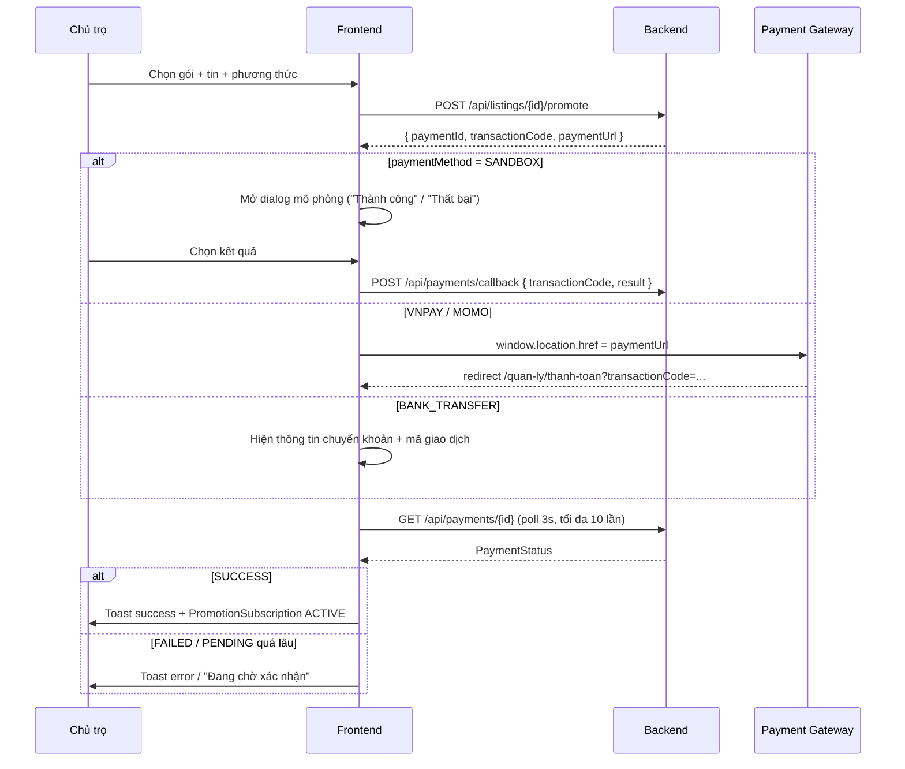

# 04 — Thiết kế giao diện (Frontend Design)

<!-- WEBTRO_ROLE_ONLY_UPDATE_START -->
> **Cập nhật 2026-08-09:** phân quyền hiện hành là **role-only**. Hệ thống không còn entity/repository/bảng nghiệp vụ `permissions` hay `role_permissions`; Flyway `V15__drop_permission_tables.sql` drop hai bảng này sau các migration lịch sử. Backend kiểm tra bằng `@PreAuthorize("hasRole/hasAnyRole")` và `SecurityUtils.hasRole/hasAnyRole`; JWT chỉ chứa `role`. Tenant được phép tạo tin nhưng service chỉ chấp nhận `categoryCode = ROOMMATE`; Landlord/Admin tạo được mọi loại tin. Access token 15 phút, refresh token 1 ngày, cả hai lưu `localStorage`; khi refresh token còn dưới 15 phút và access token vẫn còn hạn, frontend chủ động gọi `/api/auth/refresh` để xoay refresh token.
<!-- WEBTRO_ROLE_ONLY_UPDATE_END -->

> Tài liệu này đặc tả toàn bộ giao diện của `frontend_webtro/`. Mọi enum, tên route, permission
> code, config key trong tài liệu này **bắt buộc** trùng khớp `00_CANONICAL_DECISIONS.md`.
> Ký hiệu `[§x.y]` tham chiếu `PHAN_TICH_NGHIEP_VU_WEBSITE_PHONG_TRO.md`.
> Ký hiệu **[BỔ SUNG NGOÀI CANONICAL]** đánh dấu những thứ tài liệu này thêm vào so với canonical
> để bước review đối chiếu — tài liệu này **không** sửa file canonical.

**Ghi chú về nguồn API:** tại thời điểm viết, `03_THIET_KE_API.md` chưa tồn tại trong `docs/`.
Mọi endpoint trích dẫn dưới đây lấy trực tiếp từ `[§12]` (API nghiệp vụ chính) và tuân thủ
chuẩn API canonical mục 7 (prefix `/api`, envelope thống nhất, phân trang `page/size/sort`,
endpoint quản trị dưới `/api/admin/**`). Khi `03_THIET_KE_API.md` được viết, nó phải khớp với
danh sách endpoint đã dùng ở mục 5 của tài liệu này.

---

## 1. Nguyên tắc thiết kế

### 1.1. Tinh thần Material Design 3, hiện thực bằng MUI v5

MUI v5 hiện thực Material Design 2 ở mức component. Dự án **không** thêm thư viện MD3 ngoài
danh sách dependency canonical mục 1.2. Do đó cách làm là: **giữ nguyên component MUI v5, áp
tinh thần MD3 qua `createTheme`**:

| Nguyên tắc MD3 | Cách áp dụng trong MUI v5 |
|---|---|
| Bo góc lớn hơn, mềm hơn | `shape.borderRadius = 12`, Button `borderRadius: 10`, Card `16` |
| Giảm shadow, tăng phân tầng bằng màu bề mặt | Card mặc định `variant="outlined"`, chỉ dùng elevation ở Dialog/Menu/AppBar khi scroll |
| Nút có "state layer" | Override `MuiButton` hover/focus dùng `alpha(primary, 0.08/0.12)` |
| Màu ngữ nghĩa (semantic color role) | Palette đặt theo vai trò: `primary`, `secondary`, `success`, `warning`, `error`, `info`, `background`, `surface` — không dùng màu tùy tiện trong component |
| Typography scale rõ ràng | Scale cố định ở mục 2.2, component **không** đặt `fontSize` inline |
| Kích thước chạm rộng rãi | `size="large"` cho hành động chính trên mobile, min 44px (mục 1.3) |

**Luật cứng:** không viết màu hex trực tiếp trong file component. Mọi màu lấy từ
`theme.palette.*`. Lý do: cần hỗ trợ song song light/dark theme (mục 2.1) — hex cứng sẽ vỡ ở
dark theme.

### 1.2. Mobile-first `[§11.7]`

`[§11.7]` nêu 3 yêu cầu, mỗi yêu cầu ánh xạ thành quyết định thiết kế cụ thể:

| Yêu cầu `[§11.7]` | Quyết định thiết kế | Màn hình áp dụng |
|---|---|---|
| *"Mobile ưu tiên tìm kiếm nhanh"* | Ô tìm kiếm là thành phần nổi bật nhất trên hero trang chủ; ở `xs` header thu gọn còn logo + icon tìm kiếm + `NotificationBell`; trang `/tim-kiem` có sticky search bar ở đỉnh | Trang chủ, Kết quả tìm kiếm |
| *"bộ lọc dễ dùng"* | `SearchFilterPanel` là sidebar cố định ở `md+`, nhưng ở `xs/sm` biến thành **bottom Drawer** full-height mở bằng FAB "Bộ lọc" có badge đếm số filter đang bật; nút "Áp dụng"/"Xóa lọc" dính đáy drawer | Kết quả tìm kiếm |
| *"nút liên hệ rõ"* | Ở `xs/sm`, chi tiết tin có **sticky bottom action bar** (Gọi / Nhắn tin / Lưu) luôn hiện, cao 64px, nằm trên mọi nội dung | Chi tiết tin |
| *"Form đăng tin cần chia bước để dễ nhập trên mobile"* | Form tạo/sửa tin dùng **Stepper 6 bước** (mục 5.3.3), `orientation="horizontal"` ở `md+` và `orientation="vertical"` ở `xs`; mỗi bước validate độc lập; auto-save nháp | Tạo tin, Sửa tin |

**Thứ tự viết CSS:** style mặc định là style của `xs`; các breakpoint lớn hơn chỉ *thêm vào*
qua `theme.breakpoints.up(...)`. Không dùng `breakpoints.down()` làm style gốc.

### 1.3. Accessibility (WCAG 2.1 mức AA)

| Tiêu chí | Cam kết cụ thể | Cách kiểm |
|---|---|---|
| Contrast văn bản thường | ≥ 4.5:1 | Bảng contrast mục 2.1 — mọi cặp màu đã tính sẵn |
| Contrast văn bản lớn (≥ 18.66px bold hoặc ≥ 24px) | ≥ 3:1 | như trên |
| Contrast thành phần UI (viền input, icon chức năng) | ≥ 3:1 | `divider` và `action` được chọn đạt ngưỡng |
| Focus visible | Mọi phần tử focus được có ring `2px solid` màu `primary.main` + `outline-offset: 2px`. **Không** dùng `outline: none` ở bất kỳ đâu | Override `MuiCssBaseline` (mục 2.6) |
| Kích thước chạm | Mọi target tương tác ≥ **44×44px**. IconButton mặc định MUI là 40px → override `MuiIconButton.sizeMedium` thành `padding: 10px` (40px) chỉ ở `md+`; ở `xs` ép `minWidth/minHeight: 44px` | Override theme mục 2.6 |
| Nhãn cho control không có text | Bắt buộc `aria-label` tiếng Việt: `aria-label="Lưu tin"`, `aria-label="Thông báo"`, `aria-label="Mở bộ lọc"` | Review PR |
| Ảnh | Mọi `` có `alt`. Ảnh tin đăng: `alt={listing.title}`. Ảnh trang trí: `alt=""` + `aria-hidden` | Review PR |
| Thứ tự tiêu đề | Mỗi trang đúng **một** `<h1>` (component `PageHeader`), không nhảy cấp h1→h3 | Review PR |
| Ngôn ngữ | `<html lang="vi">` trong `index.html`; DayJS locale `vi` | Bắt buộc |
| Trạng thái động | Toast bọc trong `aria-live="polite"`; lỗi form dùng `aria-invalid` + `aria-describedby` trỏ tới helper text | React Hook Form + MUI TextField làm sẵn |
| Không dựa mỗi màu để truyền tin | `StatusChip` luôn có **text nhãn** kèm màu; `SentimentChip` có icon + text; `TrustScoreBadge` có số điểm, không chỉ màu | Đặc tả component mục 6 |

### 1.4. Nguyên tắc nội dung tiếng Việt

- Toàn bộ nhãn, thông báo, lỗi hiển thị bằng **tiếng Việt có dấu**. Không trộn Anh–Việt trong
  cùng một câu hiển thị cho người dùng.
- Số tiền: định dạng `vi-VN`, đơn vị VND, rút gọn khi hiển thị trên card
  (`4.500.000 đ` → `4,5 triệu/tháng`). Hàm dùng chung `formatPrice(value, { short })`.
- Diện tích: `25 m²`. Thời gian tương đối: DayJS `relativeTime` locale `vi` ("2 giờ trước").
- Thời gian tuyệt đối: `DD/MM/YYYY HH:mm`. API trả ISO-8601 UTC (canonical 7.3) → frontend
  luôn convert sang giờ địa phương khi hiển thị, **không** hiển thị chuỗi UTC thô.

---

## 2. Design system

### 2.1. Bảng màu

**Cơ sở chọn màu.** Lĩnh vực nhà trọ/bất động sản cần truyền tải *tin cậy* và *an cư*, đồng
thời hệ thống có trục nghiệp vụ "Niềm tin giữa người thuê và chủ trọ" `[§15]`. Do đó:
- **Primary = xanh teal đậm** (`#00695C`): sắc xanh lá–lam gợi sự ổn định, tin cậy, khác biệt
  với dải xanh dương đã bão hòa ở các sàn BĐS; đủ đậm để đạt AA trên nền trắng.
- **Secondary = cam đất** (`#E65100`): màu nhấn ấm cho CTA thứ cấp và nhãn "Tin nổi bật"
  (`PROMO-02` `[§2.9]`), tương phản mạnh với teal trên vòng tròn màu.
- **Warning** phải dùng cho cảnh báo lệch giá `[§9.4]` và `TrustScoreBadge` mức rủi ro
  `[§5.8]` → cố tình chọn tông đậm hơn mặc định MUI (`#ED6C02` chỉ đạt 3.1:1, **không đạt AA**).

#### 2.1.1. Light theme

| Token | Hex | Dùng cho | Contrast |
|---|---|---|---|
| `primary.main` | `#00695C` | CTA chính, link, AppBar | **6.53:1** trên `#FFFFFF` ✔ AA |
| `primary.dark` | `#004D40` | hover/pressed của primary | 9.72:1 trên `#FFFFFF` ✔ AAA |
| `primary.light` | `#4DB6AC` | nền nhạt, chip đang chọn | 2.11:1 — **chỉ dùng làm nền**, không đặt text lên |
| `primary.contrastText` | `#FFFFFF` | text trên `primary.main` | 6.53:1 ✔ AA |
| `secondary.main` | `#E65100` | CTA phụ, nhãn "Nổi bật" | **4.87:1** trên `#FFFFFF` ✔ AA |
| `secondary.dark` | `#AC3900` | hover | 7.12:1 ✔ AAA |
| `secondary.light` | `#FF8F3F` | nền badge | 2.62:1 — chỉ làm nền |
| `secondary.contrastText` | `#FFFFFF` | | 4.87:1 ✔ AA |
| `success.main` | `#2E7D32` | `ACTIVE`, `SUCCESS`, sentiment `POSITIVE` | **4.63:1** ✔ AA |
| `warning.main` | `#B26500` | `PENDING`, `NEED_REVIEW`, cảnh báo lệch giá | **4.52:1** ✔ AA (mặc định MUI `#ED6C02` = 3.10:1 ✘ nên bị thay) |
| `error.main` | `#C62828` | `REJECTED`, `LOCKED`, `FAILED`, sentiment `NEGATIVE` | **5.90:1** ✔ AA |
| `info.main` | `#0277BD` | `DRAFT`, thông tin trung tính, sentiment `NEUTRAL` | **4.62:1** ✔ AA |
| `background.default` | `#F4F7F6` | nền trang | — |
| `background.paper` | `#FFFFFF` | nền Card/Dialog/Menu (**= surface**) | — |
| `text.primary` | `#16211F` | tiêu đề, nội dung | **15.84:1** trên `#FFFFFF` ✔ AAA · 14.72:1 trên `#F4F7F6` ✔ AAA |
| `text.secondary` | `#4E5B58` | phụ đề, meta | **7.53:1** trên `#FFFFFF` ✔ AAA · 7.00:1 trên `#F4F7F6` ✔ AAA |
| `text.disabled` | `#8A9794` | text vô hiệu | 3.02:1 — đạt ngưỡng UI 3:1, **không** dùng cho nội dung cần đọc |
| `divider` | `#DDE4E2` | viền Card, đường kẻ | 1.19:1 — **chỉ** kẻ phân tách; viền input dùng token riêng bên dưới |
| `action.inputBorder` **[BỔ SUNG NGOÀI CANONICAL]** | `#6B7976` | viền TextField/Select ở trạng thái rest | **4.21:1** trên `#FFFFFF` ✔ vượt ngưỡng UI 3:1 |
| `action.hover` | `alpha('#00695C', 0.06)` | state layer hover | — |
| `action.selected` | `alpha('#00695C', 0.12)` | state layer selected | — |

> Lý do tách `action.inputBorder`: `divider` đủ nhạt cho đường kẻ trang trí nhưng **không đạt
> 3:1**, mà viền ô nhập là *thành phần UI* nên WCAG 1.4.11 bắt buộc ≥ 3:1. Dùng chung một token
> sẽ hoặc làm đường kẻ quá nặng, hoặc làm viền input không đạt chuẩn.

#### 2.1.2. Dark theme

| Token | Hex | Contrast |
|---|---|---|
| `primary.main` | `#4DB6AC` | **8.35:1** trên `#121A19` ✔ AAA |
| `primary.dark` | `#00897B` | 4.28:1 trên `#121A19` — dùng làm nền nút |
| `primary.light` | `#80CBC4` | 11.13:1 ✔ AAA |
| `primary.contrastText` | `#062622` | 8.35:1 trên `#4DB6AC` ✔ AAA |
| `secondary.main` | `#FFA457` | **9.42:1** trên `#121A19` ✔ AAA |
| `secondary.contrastText` | `#2B1400` | 8.90:1 trên `#FFA457` ✔ AAA |
| `success.main` | `#66BB6A` | **8.05:1** ✔ AAA |
| `warning.main` | `#FFB74D` | **10.44:1** ✔ AAA |
| `error.main` | `#EF5350` | **5.13:1** ✔ AA |
| `info.main` | `#4FC3F7` | **9.75:1** ✔ AAA |
| `background.default` | `#121A19` | — |
| `background.paper` | `#1B2422` | — (surface, sáng hơn default để phân tầng thay cho shadow) |
| `text.primary` | `#E8EDEC` | **14.71:1** trên `#121A19` ✔ AAA · 13.30:1 trên `#1B2422` ✔ AAA |
| `text.secondary` | `#A9B5B2` | **7.42:1** trên `#121A19` ✔ AAA · 6.71:1 trên `#1B2422` ✔ AAA |
| `text.disabled` | `#6E7A78` | 3.31:1 — chỉ trạng thái vô hiệu |
| `divider` | `#2E3A38` | phân tách |
| `action.inputBorder` | `#8A9794` | **5.53:1** trên `#121A19` ✔ |

**Quy tắc dark theme bắt buộc:**
1. Ở dark theme **không** dùng shadow để phân tầng (shadow vô hình trên nền tối). Phân tầng
   bằng `background.paper` sáng hơn `background.default` và bằng `divider`.
2. Không đảo màu ảnh tin đăng. Ảnh giữ nguyên; chỉ nền và chữ đổi.
3. Màu semantic **không** giữ nguyên hex giữa 2 theme — `error.main` light `#C62828` quá tối
   trên nền `#121A19` (2.71:1 ✘) nên dark dùng `#EF5350`. Đây là lý do mục 1.1 cấm hex cứng.

#### 2.1.3. Ánh xạ màu → enum (bắt buộc, dùng ở `StatusChip`)

Enum lấy nguyên văn canonical mục 5.

| Enum | Giá trị | Màu | Nhãn tiếng Việt |
|---|---|---|---|
| `ListingStatus` | `DRAFT` | `info` (outlined) | Nháp |
| | `PENDING` | `warning` | Chờ duyệt |
| | `ACTIVE` | `success` | Đang hiển thị |
| | `REJECTED` | `error` (outlined) | Bị từ chối |
| | `HIDDEN` | `default` | Đã ẩn |
| | `EXPIRED` | `default` (outlined) | Hết hạn |
| | `CLOSED` | `default` | Đã đóng |
| | `LOCKED` | `error` (filled) | Bị khóa |
| | `NEED_REVIEW` | `warning` (filled) | Cần kiểm tra |
| | `DELETED` | `default` (outlined) | Đã xóa |
| `UserStatus` | `ACTIVE` / `PENDING_VERIFY` / `LOCKED` / `DELETED` | `success` / `warning` / `error` / `default` | Hoạt động / Chờ xác thực / Bị khóa / Đã xóa |
| `SentimentLabel` | `POSITIVE` / `NEUTRAL` / `NEGATIVE` / `MIXED` / `PENDING_ANALYSIS` | `success` / `info` / `error` / `warning` / `default` | Tích cực / Trung lập / Tiêu cực / Vừa khen vừa chê / Đang phân tích |
| `PaymentStatus` | `PENDING` / `SUCCESS` / `FAILED` / `CANCELLED` / `REFUNDED` | `warning` / `success` / `error` / `default` / `info` | Chờ thanh toán / Thành công / Thất bại / Đã hủy / Đã hoàn tiền |
| `ReportStatus` | `PENDING` / `REVIEWING` / `RESOLVED` / `REJECTED` | `warning` / `info` / `success` / `default` | Chờ xử lý / Đang xem xét / Đã xử lý / Đã bác bỏ |
| `ReportSeverity` | `LOW` / `MEDIUM` / `HIGH` / `CRITICAL` | `default` / `info` / `warning` / `error` | Thấp / Trung bình / Cao / Nghiêm trọng |
| `PriceConfidence` | `HIGH` / `MEDIUM` / `LOW` / `INSUFFICIENT_DATA` | `success` / `info` / `warning` / `default` | Cao / Trung bình / Thấp / Không đủ dữ liệu |
| `SubscriptionStatus` | `PENDING` / `ACTIVE` / `EXPIRED` / `CANCELLED` | `warning` / `success` / `default` / `default` | Chờ kích hoạt / Đang chạy / Hết hạn / Đã hủy |
| `CommentStatus` | `VISIBLE` / `PENDING` / `HIDDEN` / `DELETED` | `success` / `warning` / `default` / `default` | Hiển thị / Chờ duyệt / Đã ẩn / Đã xóa |

### 2.2. Typography

**Font chữ: `Be Vietnam Pro`**, fallback `Roboto`, `system-ui`, `sans-serif`.

Lý do chọn (bắt buộc ghi rõ theo yêu cầu):
1. **Thiết kế riêng cho tiếng Việt.** Be Vietnam Pro do nhà thiết kế người Việt tạo, phủ **đầy
   đủ 134 ký tự có dấu** của bảng chữ cái tiếng Việt, xử lý đúng các trường hợp chồng dấu khó
   (`ế`, `ộ`, `ữ`, `ặ`, `ỡ`) — vốn là chỗ nhiều font Latin phổ biến đặt dấu lệch hoặc va vào
   nhau. Roboto tuy hỗ trợ tiếng Việt nhưng dấu mũ + dấu thanh chồng nhau bị chật ở size nhỏ.
2. **Chiều cao x-height lớn**, dễ đọc ở 14px trên mobile — quan trọng vì `[§11.7]` ưu tiên
   mobile.
3. **Có đủ 9 weight** (100–900), đáp ứng scale bên dưới mà không cần font thứ hai.
4. **Giấy phép SIL Open Font License** — nhúng tự do vào sản phẩm, không rủi ro bản quyền.
5. **Tự host được** qua `@fontsource/be-vietnam-pro` → không gọi Google Fonts CDN lúc runtime
   (tránh phụ thuộc mạng ngoài khi chấm đồ án offline, và tránh vấn đề riêng tư).

**[BỔ SUNG NGOÀI CANONICAL]** — thêm 2 dependency frontend không có trong canonical mục 1.2:
`@fontsource/be-vietnam-pro` và `@fontsource/roboto`. Lý do: canonical yêu cầu MUI (mặc định
cần Roboto) nhưng không nêu cách nạp font; nạp qua CDN vi phạm tinh thần "không phụ thuộc ngoài"
của `docker compose up --build` chạy được toàn hệ thống (canonical mục 13.5). Cả hai là asset
tĩnh, không phải thư viện logic.

Weight dùng: 400 (Regular), 500 (Medium), 600 (SemiBold), 700 (Bold). **Chỉ nạp 4 weight này**
+ subset `vietnamese` + `latin` để giảm dung lượng.

| Variant MUI | Size (rem/px) | Weight | Line-height | Letter-spacing | Dùng cho |
|---|---|---|---|---|---|
| `h1` | 2.5rem / 40px | 700 | 1.2 | -0.02em | Tiêu đề trang chủ (hero) |
| `h2` | 2rem / 32px | 700 | 1.25 | -0.015em | `PageHeader` — tiêu đề trang (là thẻ `<h1>` ngữ nghĩa) |
| `h3` | 1.5rem / 24px | 600 | 1.3 | -0.01em | Tiêu đề section |
| `h4` | 1.25rem / 20px | 600 | 1.35 | 0 | Tiêu đề Card lớn, giá tin đăng |
| `h5` | 1.125rem / 18px | 600 | 1.4 | 0 | Tiêu đề Dialog |
| `h6` | 1rem / 16px | 600 | 1.45 | 0 | Tiêu đề Card nhỏ, tiêu đề tin trong `ListingCard` |
| `subtitle1` | 1rem / 16px | 500 | 1.5 | 0 | Nhãn nhóm |
| `subtitle2` | 0.875rem / 14px | 500 | 1.5 | 0 | Nhãn phụ, header bảng |
| `body1` | 1rem / 16px | 400 | 1.6 | 0 | Nội dung chính, mô tả tin |
| `body2` | 0.875rem / 14px | 400 | 1.6 | 0 | Nội dung phụ, meta |
| `button` | 0.9375rem / 15px | 600 | 1.75 | 0.01em | Nút — `textTransform: 'none'` |
| `caption` | 0.75rem / 12px | 400 | 1.5 | 0.01em | Chú thích, timestamp |
| `overline` | 0.75rem / 12px | 600 | 2 | 0.08em | Nhãn nhóm nhỏ, `textTransform: 'uppercase'` |

**Quy tắc:**
- `textTransform: 'none'` cho `button` — tiếng Việt viết hoa toàn bộ làm **mất dấu thị giác**
  và khó đọc (`ĐĂNG TIN NGAY` vs `Đăng tin ngay`).
- `line-height` tối thiểu **1.5** cho mọi text đọc dài (body1/body2) — WCAG 1.4.12 và cũng để
  dấu tiếng Việt (`ộ`, `ế`) không chạm dòng trên.
- Responsive: `h1` giảm còn 2rem ở `xs`, `h2` giảm còn 1.5rem ở `xs` (khai báo bằng
  `theme.breakpoints` trong `createTheme`, mục 2.6).

### 2.3. Spacing scale (base 8px)

`theme.spacing(n)` = `n * 8px`. **Chỉ dùng bội số của scale**, không viết `padding: 13px`.

| `spacing(n)` | px | Dùng cho |
|---|---|---|
| `0.5` | 4 | khe giữa icon và text, gap chip |
| `1` | 8 | padding trong chip, gap nhỏ nhất giữa 2 control |
| `1.5` | 12 | padding dọc của TextField |
| `2` | 16 | padding trong Card, gap giữa các field trong form |
| `3` | 24 | padding Card lớn, gap giữa các Card trong grid, padding Dialog |
| `4` | 32 | khoảng cách giữa các section trong trang |
| `5` | 40 | padding dọc của section trang chủ ở `xs` |
| `6` | 48 | khoảng cách giữa các block lớn |
| `8` | 64 | padding dọc section trang chủ ở `md+`; chiều cao sticky action bar mobile |
| `10` | 80 | padding hero |

Padding ngang của container nội dung: `spacing(2)` = 16px ở `xs`, `spacing(3)` = 24px ở `sm+`.

### 2.4. Border radius

`shape.borderRadius = 12`. Các giá trị dẫn xuất:

| Thành phần | Radius | Ghi chú |
|---|---|---|
| Button, Chip, TextField | 10px | |
| Card, Paper, Dialog | 16px | tinh thần MD3 |
| Ảnh trong `ListingCard` | 12px (chỉ 2 góc trên) | |
| Avatar, `NotificationBell` badge | 50% | tròn |
| Skeleton | khớp phần tử nó thay thế | |
| Bottom Drawer (mobile filter) | 16px 16px 0 0 | |

### 2.5. Elevation / shadow

Chỉ dùng **4 mức**, không dùng đủ 25 mức của MUI:

| Mức | Dùng cho | Light | Dark |
|---|---|---|---|
| `0` | Card mặc định (dùng `variant="outlined"`) | không shadow, viền `divider` | không shadow, viền `divider` |
| `1` | Card hover, `StatCard` | `0 1px 3px rgba(9,30,26,.08), 0 1px 2px rgba(9,30,26,.06)` | **không shadow** — thay bằng `background.paper` + viền sáng hơn |
| `4` | AppBar khi trang đã cuộn, Menu, Popover | `0 4px 12px rgba(9,30,26,.10)` | `0 4px 12px rgba(0,0,0,.40)` |
| `8` | Dialog, Drawer, `ChatbotWidget` panel | `0 12px 32px rgba(9,30,26,.16)` | `0 12px 32px rgba(0,0,0,.56)` |

AppBar ở trạng thái đầu trang: `elevation={0}` + viền dưới `divider`. Khi `scrollY > 8` →
`elevation={4}`. Hiện thực bằng `useScrollTrigger`.

### 2.6. Breakpoints

Giữ nguyên giá trị mặc định MUI v5 (không đổi — đổi sẽ lệch với mọi ví dụ MUI và gây nhầm lẫn
khi maintain):

| Key | Min width | Thiết bị đại diện | Vai trò trong hệ thống |
|---|---|---|---|
| `xs` | 0px | điện thoại dọc | Layout 1 cột. Sidebar → Drawer. Bộ lọc → bottom Drawer. Stepper dọc. |
| `sm` | 600px | điện thoại ngang / tablet nhỏ | Grid 2 cột cho `ListingGrid`. Vẫn ẩn sidebar. |
| `md` | 900px | tablet ngang / laptop nhỏ | **Ngưỡng bản lề**: sidebar hiện cố định, bộ lọc thành panel trái, Stepper ngang, DataTable hiện đủ cột. |
| `lg` | 1200px | desktop | Grid 3 cột. Container `maxWidth="lg"` (1200px). |
| `xl` | 1536px | màn hình lớn | Grid 4 cột ở trang tìm kiếm. Container vẫn giới hạn `lg` cho trang đọc, `xl` cho trang admin. |

Container: trang public dùng `<Container maxWidth="lg">`; trang admin/landlord dùng
`maxWidth="xl"` vì DataTable nhiều cột.

### 2.7. Khai báo trong MUI `createTheme` — code thật

File: `src/theme/index.js`

```js
import { createTheme, alpha, responsiveFontSizes } from '@mui/material/styles';
import { viVN as coreViVN } from '@mui/material/locale';
import { viVN as dataGridViVN } from '@mui/x-date-pickers/locales';

// ---------------------------------------------------------------------------
// 1. Token nguyên thủy — nguồn sự thật duy nhất của màu. Không hex ở nơi khác.
// ---------------------------------------------------------------------------
const PALETTE = {
  light: {
    mode: 'light',
    primary:   { main: '#00695C', dark: '#004D40', light: '#4DB6AC', contrastText: '#FFFFFF' },
    secondary: { main: '#E65100', dark: '#AC3900', light: '#FF8F3F', contrastText: '#FFFFFF' },
    success:   { main: '#2E7D32', dark: '#1B5E20', light: '#66BB6A', contrastText: '#FFFFFF' },
    warning:   { main: '#B26500', dark: '#8A4E00', light: '#FFB74D', contrastText: '#FFFFFF' },
    error:     { main: '#C62828', dark: '#8E1F1F', light: '#EF5350', contrastText: '#FFFFFF' },
    info:      { main: '#0277BD', dark: '#01579B', light: '#4FC3F7', contrastText: '#FFFFFF' },
    background: { default: '#F4F7F6', paper: '#FFFFFF' },
    text: { primary: '#16211F', secondary: '#4E5B58', disabled: '#8A9794' },
    divider: '#DDE4E2',
    inputBorder: '#6B7976', // token riêng, đạt 4.21:1 — xem mục 2.1.1
  },
  dark: {
    mode: 'dark',
    primary:   { main: '#4DB6AC', dark: '#00897B', light: '#80CBC4', contrastText: '#062622' },
    secondary: { main: '#FFA457', dark: '#E67E22', light: '#FFC489', contrastText: '#2B1400' },
    success:   { main: '#66BB6A', dark: '#43A047', light: '#A5D6A7', contrastText: '#0A2410' },
    warning:   { main: '#FFB74D', dark: '#F57C00', light: '#FFD095', contrastText: '#2B1A00' },
    error:     { main: '#EF5350', dark: '#C62828', light: '#FF8A80', contrastText: '#2B0A0A' },
    info:      { main: '#4FC3F7', dark: '#0288D1', light: '#8ED8FA', contrastText: '#04222E' },
    background: { default: '#121A19', paper: '#1B2422' },
    text: { primary: '#E8EDEC', secondary: '#A9B5B2', disabled: '#6E7A78' },
    divider: '#2E3A38',
    inputBorder: '#8A9794',
  },
};

const SHADOWS = {
  light: {
    1: '0 1px 3px rgba(9,30,26,.08), 0 1px 2px rgba(9,30,26,.06)',
    4: '0 4px 12px rgba(9,30,26,.10)',
    8: '0 12px 32px rgba(9,30,26,.16)',
  },
  dark: {
    1: 'none',
    4: '0 4px 12px rgba(0,0,0,.40)',
    8: '0 12px 32px rgba(0,0,0,.56)',
  },
};

// MUI cần đúng 25 phần tử trong mảng shadows.
const buildShadows = (mode) => {
  const s = SHADOWS[mode];
  const arr = new Array(25).fill(s[8]);
  arr[0] = 'none';
  for (let i = 1; i <= 3; i += 1) arr[i] = s[1];
  for (let i = 4; i <= 7; i += 1) arr[i] = s[4];
  return arr;
};

const TYPOGRAPHY = {
  fontFamily: '"Be Vietnam Pro", "Roboto", system-ui, -apple-system, sans-serif',
  fontWeightRegular: 400,
  fontWeightMedium: 500,
  fontWeightBold: 700,
  h1: { fontSize: '2.5rem', fontWeight: 700, lineHeight: 1.2,  letterSpacing: '-0.02em' },
  h2: { fontSize: '2rem',   fontWeight: 700, lineHeight: 1.25, letterSpacing: '-0.015em' },
  h3: { fontSize: '1.5rem', fontWeight: 600, lineHeight: 1.3,  letterSpacing: '-0.01em' },
  h4: { fontSize: '1.25rem',  fontWeight: 600, lineHeight: 1.35 },
  h5: { fontSize: '1.125rem', fontWeight: 600, lineHeight: 1.4 },
  h6: { fontSize: '1rem',     fontWeight: 600, lineHeight: 1.45 },
  subtitle1: { fontSize: '1rem',     fontWeight: 500, lineHeight: 1.5 },
  subtitle2: { fontSize: '0.875rem', fontWeight: 500, lineHeight: 1.5 },
  body1: { fontSize: '1rem',     fontWeight: 400, lineHeight: 1.6 },
  body2: { fontSize: '0.875rem', fontWeight: 400, lineHeight: 1.6 },
  button: { fontSize: '0.9375rem', fontWeight: 600, lineHeight: 1.75,
            letterSpacing: '0.01em', textTransform: 'none' },
  caption: { fontSize: '0.75rem', fontWeight: 400, lineHeight: 1.5, letterSpacing: '0.01em' },
  overline: { fontSize: '0.75rem', fontWeight: 600, lineHeight: 2,
              letterSpacing: '0.08em', textTransform: 'uppercase' },
};

// ---------------------------------------------------------------------------
// 2. Component override
// ---------------------------------------------------------------------------
const buildComponents = (palette) => ({
  MuiCssBaseline: {
    styleOverrides: {
      html: { WebkitFontSmoothing: 'antialiased', MozOsxFontSmoothing: 'grayscale' },
      body: { backgroundColor: palette.background.default },
      // Focus ring toàn cục — mục 1.3. Không được ghi đè bằng outline:none ở bất kỳ đâu.
      '*:focus-visible': {
        outline: `2px solid ${palette.primary.main}`,
        outlineOffset: '2px',
        borderRadius: '4px',
      },
      // Tôn trọng người dùng tắt hiệu ứng chuyển động.
      '@media (prefers-reduced-motion: reduce)': {
        '*': { animationDuration: '0.01ms !important', transitionDuration: '0.01ms !important' },
      },
      img: { maxWidth: '100%' },
    },
  },
  MuiButton: {
    defaultProps: { disableElevation: true },
    styleOverrides: {
      root: { borderRadius: 10, minHeight: 44, paddingInline: 20 }, // 44px — mục 1.3
      sizeSmall: { minHeight: 36, paddingInline: 12 },
      sizeLarge: { minHeight: 52, fontSize: '1rem' },
      containedPrimary: {
        '&:hover': { backgroundColor: palette.primary.dark },
      },
      textPrimary: {
        '&:hover': { backgroundColor: alpha(palette.primary.main, 0.08) },
      },
    },
  },
  MuiIconButton: {
    styleOverrides: {
      // Ép vùng chạm 44px trên mobile, 40px từ md trở lên (chuột chính xác hơn ngón tay).
      root: ({ theme }) => ({
        minWidth: 44,
        minHeight: 44,
        [theme.breakpoints.up('md')]: { minWidth: 40, minHeight: 40 },
      }),
    },
  },
  MuiCard: {
    defaultProps: { variant: 'outlined' },
    styleOverrides: {
      root: { borderRadius: 16, borderColor: palette.divider },
    },
  },
  MuiPaper: { styleOverrides: { rounded: { borderRadius: 16 } } },
  MuiChip: {
    styleOverrides: { root: { borderRadius: 10, fontWeight: 500 } },
  },
  MuiTextField: { defaultProps: { variant: 'outlined', fullWidth: true, size: 'medium' } },
  MuiOutlinedInput: {
    styleOverrides: {
      root: { borderRadius: 10 },
      notchedOutline: { borderColor: palette.inputBorder }, // 3:1 — WCAG 1.4.11
    },
  },
  MuiAppBar: {
    defaultProps: { color: 'inherit', elevation: 0 },
    styleOverrides: {
      root: { backgroundColor: palette.background.paper,
              borderBottom: `1px solid ${palette.divider}` },
    },
  },
  MuiDialog: { styleOverrides: { paper: { borderRadius: 16 } } },
  MuiTooltip: { defaultProps: { arrow: true } },
  MuiLink: { defaultProps: { underline: 'hover' } },
  MuiTableCell: { styleOverrides: { head: { fontWeight: 600, whiteSpace: 'nowrap' } } },
});

// ---------------------------------------------------------------------------
// 3. Factory — gọi từ ThemeProvider theo state ui.themeMode (mục 7)
// ---------------------------------------------------------------------------
export const buildTheme = (mode = 'light') => {
  const palette = PALETTE[mode];
  let theme = createTheme(
    {
      palette,
      typography: TYPOGRAPHY,
      shape: { borderRadius: 12 },
      spacing: 8,
      shadows: buildShadows(mode),
      breakpoints: { values: { xs: 0, sm: 600, md: 900, lg: 1200, xl: 1536 } },
      components: buildComponents(palette),
    },
    coreViVN,      // dịch sẵn text nội bộ MUI sang tiếng Việt
    dataGridViVN,  // dịch DatePicker
  );
  // h1/h2 tự co ở màn hình nhỏ — mục 2.2
  theme = responsiveFontSizes(theme, { breakpoints: ['sm', 'md'], factor: 2.2 });
  return theme;
};

export default buildTheme;
```

Điểm vào `src/main.jsx` nạp font (self-host, không CDN):

```js
import '@fontsource/be-vietnam-pro/400.css';
import '@fontsource/be-vietnam-pro/500.css';
import '@fontsource/be-vietnam-pro/600.css';
import '@fontsource/be-vietnam-pro/700.css';
import '@fontsource/be-vietnam-pro/vietnamese-400.css';
import '@fontsource/be-vietnam-pro/vietnamese-500.css';
import '@fontsource/be-vietnam-pro/vietnamese-600.css';
import '@fontsource/be-vietnam-pro/vietnamese-700.css';
```

`ThemeProvider` bọc ở `src/App.jsx`, đọc `mode` từ Redux `ui.themeMode` (mục 7.1):

```js
const mode = useSelector((s) => s.ui.themeMode);
const theme = useMemo(() => buildTheme(mode), [mode]);
return (
  <ThemeProvider theme={theme}>
    <CssBaseline />
    <RouterProvider router={router} />
  </ThemeProvider>
);
```

---

## 3. Sitemap & routing

### 3.1. Sơ đồ toàn bộ route

Mở rộng từ canonical mục 12 (giữ nguyên 100% đường dẫn tiếng Việt của canonical, bổ sung các
route con mà canonical không liệt kê tường minh — được đánh dấu `*` và giải thích ở mục 3.3).

```mermaid
graph TD
  ROOT["/"]:::pub

  subgraph PUBLIC["PublicLayout — không cần đăng nhập"]
    ROOT --> HOME["/ · Trang chủ"]
    ROOT --> SEARCH["/tim-kiem · Kết quả tìm kiếm"]
    ROOT --> DETAIL["/tin/:slug-:id · Chi tiết tin"]
    ROOT --> LLPUB["/chu-tro/:id · Hồ sơ chủ trọ (công khai)"]
    ROOT --> ABOUT["/gioi-thieu · Giới thiệu"]
    ROOT --> TERMS["/dieu-khoan · Điều khoản"]
    ROOT --> NF["/404 · Không tìm thấy"]
  end

  subgraph AUTH["AuthLayout — chỉ khi CHƯA đăng nhập (GuestOnlyRoute)"]
    ROOT --> LOGIN["/dang-nhap"]
    ROOT --> REG["/dang-ky"]
    ROOT --> FORGOT["/quen-mat-khau"]
    ROOT --> RESET["/dat-lai-mat-khau?token="]
    ROOT --> VERIFY["/xac-thuc-email?token="]
  end

  subgraph TENANT["TenantLayout — /tai-khoan/* · ProtectedRoute"]
    ROOT --> TA["/tai-khoan"]
    TA --> T1["ho-so"]
    TA --> T2["tin-da-luu"]
    TA --> T3["lich-su-xem"]
    TA --> T4["tin-nhan"]
    TA --> T4B["tin-nhan/:conversationId *"]
    TA --> T5["thong-bao"]
    TA --> T6["bao-cao-cua-toi"]
    TA --> T7["danh-gia-cua-toi"]
    TA --> T8["dang-theo-doi"]
    TA --> T9["doi-mat-khau"]
  end

  subgraph LANDLORD["LandlordLayout — /quan-ly/* · RoleRoute[ROLE_LANDLORD, ROLE_ADMIN]"]
    ROOT --> QL["/quan-ly"]
    QL --> L1["tong-quan"]
    QL --> L2["tin-dang"]
    QL --> L3["tin-dang/tao · Stepper"]
    QL --> L4["tin-dang/:id/sua · Stepper"]
    QL --> L5["tin-dang/:id/thong-ke"]
    QL --> L6["nguoi-lien-he"]
    QL --> L7["tin-nhan"]
    QL --> L8["goi-dich-vu"]
    QL --> L9["thanh-toan"]
    QL --> L10["ho-so-chu-tro"]
  end

  subgraph ADMIN["AdminLayout — /admin/* · RoleRoute[ROLE_ADMIN, ROLE_MODERATOR]"]
    ROOT --> AD["/admin"]
    AD --> A1["dashboard"]
    AD --> A2["nguoi-dung"]
    AD --> A2B["nguoi-dung/:id *"]
    AD --> A3["chu-tro"]
    AD --> A4["tin-dang"]
    AD --> A4B["tin-dang/:id *"]
    AD --> A5["kiem-duyet"]
    AD --> A6["bao-cao"]
    AD --> A7["binh-luan"]
    AD --> A8["danh-gia"]
    AD --> A9["danh-muc"]
    AD --> A10["khu-vuc"]
    AD --> A11["tien-ich"]
    AD --> A12["goi-dich-vu"]
    AD --> A13["thanh-toan"]
    AD --> A14["ai/log"]
    AD --> A15["ai/cau-hinh"]
    AD --> A16["thong-ke"]
    AD --> A17["cau-hinh"]
    AD --> A18["audit-log"]
  end

  GLOBAL["ChatbotWidget · nổi trên MỌI route trừ /admin/*"]:::float
  E403["/403 · Không đủ quyền *"]:::pub
  ROOT --> E403

  classDef pub fill:#E0F2F1,stroke:#00695C,color:#16211F;
  classDef float fill:#FFF3E0,stroke:#E65100,color:#16211F;
```



### 3.2. Bảng route đầy đủ

| # | Route | Màn hình | Quyền truy cập | Layout | Chức năng nguồn |
|---|---|---|---|---|---|
| 1 | `/` | Trang chủ | Công khai | `PublicLayout` | `[§7.1]` Xem trang chủ; `[§2.11]` AI-04 |
| 2 | `/tim-kiem` | Kết quả tìm kiếm | Công khai | `PublicLayout` | `[§2.4]` SRCH-01..09; `[§3.7]` |
| 3 | `/tin/:slug-:id` | Chi tiết tin | Công khai | `PublicLayout` | `[§3.8]`; `[§11.8]` URL thân thiện |
| 4 | `/chu-tro/:id` | Hồ sơ chủ trọ | Công khai | `PublicLayout` | `[§2.2]` USER-04, FOLLOW-01 |
| 5 | `/gioi-thieu` | Giới thiệu | Công khai | `PublicLayout` | `[§1.2]` Admin *"cấu hình nội dung tĩnh"* |
| 6 | `/dieu-khoan` | Điều khoản | Công khai | `PublicLayout` | như trên |
| 7 | `/dang-nhap` | Đăng nhập | `GuestOnlyRoute` | `AuthLayout` | `[§2.1]` AUTH-02; `[§3.2]` |
| 8 | `/dang-ky` | Đăng ký | `GuestOnlyRoute` | `AuthLayout` | `[§2.1]` AUTH-01; `[§3.1]` |
| 9 | `/quen-mat-khau` | Quên mật khẩu | `GuestOnlyRoute` | `AuthLayout` | `[§2.1]` AUTH-04 |
| 10 | `/dat-lai-mat-khau` | Đặt lại mật khẩu | `GuestOnlyRoute` + query `token` | `AuthLayout` | `[§2.1]` AUTH-04 |
| 11 | `/xac-thuc-email` | Xác thực email | Công khai + query `token` | `AuthLayout` | `[§2.1]` AUTH-06 |
| 12 | `/404` + `*` | Không tìm thấy | Công khai | `PublicLayout` | — |
| 13 | `/403` | Không đủ quyền `*` | Đã đăng nhập | `PublicLayout` | `[§11.2]` |
| 14 | `/tai-khoan/ho-so` | Hồ sơ cá nhân | `ProtectedRoute` | `TenantLayout` | `[§2.2]` USER-01,02,03 |
| 15 | `/tai-khoan/tin-da-luu` | Tin đã lưu | `ProtectedRoute` + `FAVORITE_MANAGE` | `TenantLayout` | `[§2.5]` FAV-03 |
| 16 | `/tai-khoan/lich-su-xem` | Lịch sử xem | `ProtectedRoute` | `TenantLayout` | `[§2.5]` HIST-02 |
| 17 | `/tai-khoan/tin-nhan` | Tin nhắn | `ProtectedRoute` | `TenantLayout` | `[§2.6]` CONT-03 |
| 18 | `/tai-khoan/tin-nhan/:conversationId` `*` | Tin nhắn — hội thoại | `ProtectedRoute` | `TenantLayout` | `[§2.6]` CONT-03 |
| 19 | `/tai-khoan/thong-bao` | Thông báo | `ProtectedRoute` | `TenantLayout` | `[§2.10]` NOTI-01; `[§11.12]` |
| 20 | `/tai-khoan/bao-cao-cua-toi` | Báo cáo của tôi | `ProtectedRoute` + `REPORT_CREATE` | `TenantLayout` | `[§12.7]` `GET /api/reports/my` |
| 21 | `/tai-khoan/danh-gia-cua-toi` | Đánh giá của tôi | `ProtectedRoute` + `REVIEW_CREATE` | `TenantLayout` | `[§2.7]` REV-01,02 |
| 22 | `/tai-khoan/dang-theo-doi` | Đang theo dõi | `ProtectedRoute` | `TenantLayout` | `[§2.5]` FOLLOW-01,02 |
| 23 | `/tai-khoan/doi-mat-khau` | Đổi mật khẩu | `ProtectedRoute` | `TenantLayout` | `[§2.1]` AUTH-05 |
| 24 | `/quan-ly/tong-quan` | Tổng quan chủ trọ | `RoleRoute[ROLE_LANDLORD, ROLE_ADMIN]` | `LandlordLayout` | `[§4.2]` |
| 25 | `/quan-ly/tin-dang` | Danh sách tin đăng | `LISTING_UPDATE_OWN` | `LandlordLayout` | `[§2.3]` LIST-03,06,07,08,09 |
| 26 | `/quan-ly/tin-dang/tao` | Tạo tin (Stepper) | `LISTING_CREATE` | `LandlordLayout` | `[§3.3]`; `[§11.7]` |
| 27 | `/quan-ly/tin-dang/:id/sua` | Sửa tin (Stepper) | `LISTING_UPDATE_OWN` | `LandlordLayout` | `[§3.4]` |
| 28 | `/quan-ly/tin-dang/:id/thong-ke` | Thống kê tin | `LISTING_UPDATE_OWN` | `LandlordLayout` | `[§2.3]` LIST-10 |
| 29 | `/quan-ly/nguoi-lien-he` | Người liên hệ | `RoleRoute[ROLE_LANDLORD, ROLE_ADMIN]` | `LandlordLayout` | `[§2.6]` CONT-04 |
| 30 | `/quan-ly/tin-nhan` | Tin nhắn (chủ trọ) | `RoleRoute[ROLE_LANDLORD, ROLE_ADMIN]` | `LandlordLayout` | `[§2.6]` CONT-03 |
| 31 | `/quan-ly/goi-dich-vu` | Gói dịch vụ | `RoleRoute[ROLE_LANDLORD, ROLE_ADMIN]` | `LandlordLayout` | `[§2.9]` PAY-01,02 |
| 32 | `/quan-ly/thanh-toan` | Thanh toán của tôi | `PAYMENT_VIEW_OWN` | `LandlordLayout` | `[§2.9]` PAY-06 |
| 33 | `/quan-ly/ho-so-chu-tro` | Hồ sơ chủ trọ | `RoleRoute[ROLE_LANDLORD, ROLE_ADMIN]` | `LandlordLayout` | `[§7.3]` |
| 34 | `/admin/dashboard` | Dashboard | `RoleRoute[ROLE_ADMIN]` | `AdminLayout` | `[§10.1]` ADM-01; API 4.12.1 yêu cầu `STATISTIC_VIEW` chỉ Admin |
| 35 | `/admin/nguoi-dung` | Quản lý người dùng | `USER_MANAGE` | `AdminLayout` | `[§10.2]` ADM-02 |
| 36 | `/admin/nguoi-dung/:id` `*` | Chi tiết người dùng | `USER_MANAGE` | `AdminLayout` | `[§10.2]` |
| 37 | `/admin/chu-tro` | Quản lý chủ trọ | `LANDLORD_VERIFY` | `AdminLayout` | `[§10.3]` ADM-03 |
| 38 | `/admin/tin-dang` | Quản lý tin đăng | `LISTING_VIEW_ANY` | `AdminLayout` | `[§10.4]` ADM-04 |
| 39 | `/admin/tin-dang/:id` `*` | Chi tiết tin (quản trị) | `LISTING_VIEW_ANY` | `AdminLayout` | `[§10.4]` |
| 40 | `/admin/kiem-duyet` | Hàng đợi kiểm duyệt | `LISTING_MODERATE` | `AdminLayout` | `[§7.4]`; `[§4.4]` |
| 41 | `/admin/bao-cao` | Quản lý báo cáo | `REPORT_RESOLVE` | `AdminLayout` | `[§10.8]` ADM-10 |
| 42 | `/admin/binh-luan` | Quản lý bình luận | `COMMENT_MODERATE` | `AdminLayout` | `[§10.9]` ADM-11 |
| 43 | `/admin/danh-gia` | Quản lý đánh giá | `REVIEW_MODERATE` | `AdminLayout` | `[§10.9]` ADM-11 |
| 44 | `/admin/danh-muc` | Quản lý danh mục | `CATALOG_MANAGE` | `AdminLayout` | `[§10.5]` ADM-05 |
| 45 | `/admin/khu-vuc` | Quản lý khu vực | `CATALOG_MANAGE` | `AdminLayout` | `[§10.5]` ADM-06 |
| 46 | `/admin/tien-ich` | Quản lý tiện ích | `CATALOG_MANAGE` | `AdminLayout` | `[§10.5]` ADM-07 |
| 47 | `/admin/goi-dich-vu` | Quản lý gói dịch vụ | `PACKAGE_MANAGE` | `AdminLayout` | `[§10.6]` ADM-08 |
| 48 | `/admin/thanh-toan` | Quản lý thanh toán | `PAYMENT_MANAGE` | `AdminLayout` | `[§10.7]` ADM-09 |
| 49 | `/admin/ai/log` | AI log | `AI_LOG_VIEW` | `AdminLayout` | `[§10.10]` AI-07 |
| 50 | `/admin/ai/cau-hinh` | AI config | `AI_CONFIG_MANAGE` | `AdminLayout` | `[§10.10]` AI-08 |
| 51 | `/admin/thong-ke` | Thống kê | `STATISTIC_VIEW` | `AdminLayout` | `[§10.1]` ADM-13 |
| 52 | `/admin/cau-hinh` | Cấu hình hệ thống | `SYSTEM_CONFIG_MANAGE` | `AdminLayout` | ADM-14 |
| 53 | `/admin/audit-log` | Audit log | `AUDIT_LOG_VIEW` | `AdminLayout` | `[§11.4]` |

> Permission code ở cột "Quyền truy cập" trùng khớp 100% canonical mục 4.2.
> Route có `*` là **[BỔ SUNG NGOÀI CANONICAL]** — xem lý do mục 3.3.

### 3.3. Các route bổ sung ngoài canonical mục 12

| Route | Lý do bắt buộc phải có |
|---|---|
| `/tai-khoan/tin-nhan/:conversationId` | `[§12.5]` có `GET /api/conversations/{id}/messages` — cần URL riêng cho từng hội thoại để chia sẻ/refresh không mất ngữ cảnh. Ở `xs` đây là màn hình độc lập (master-detail), không thể gộp vào `/tai-khoan/tin-nhan`. |
| `/admin/nguoi-dung/:id` | `[§10.2]` yêu cầu *"Xem chi tiết hồ sơ"*, *"Xem lịch sử hoạt động"*, *"Xem report liên quan"* — quá nhiều nội dung cho một Dialog. |
| `/admin/tin-dang/:id` | `[§10.4]` yêu cầu *"Xem lịch sử chỉnh sửa"* + *"Xem thống kê từng tin"* + duyệt/khóa trong cùng ngữ cảnh. |
| `/403` | Canonical mục 12 định nghĩa `RoleRoute` nhưng không nói điều hướng đi đâu khi thiếu quyền. Cần một đích đến tường minh — xem mục 3.5. |

### 3.4. Cơ chế guard role-only

Frontend chỉ dùng `ProtectedRoute` và `RoleRoute`. `PermissionRoute` đã bị loại bỏ vì backend không còn bảng permission, JWT không còn `permissions[]`.

```jsx
export default function RoleRoute({ roles, children }) {
  const userRole = useSelector((s) => s.auth.user?.role ?? null);
  const ok = roles.includes(userRole);
  if (!ok) return <Navigate to="/403" replace />;
  return children ?? <Outlet />;
}
```

Menu dashboard được lọc theo role trong `config/menus.js`:

- Tenant có mục quản lý tin đăng và đăng tin ở ghép.
- Landlord/Admin có đủ menu quản lý chủ trọ.
- Moderator/Admin dùng chung layout `/admin`, nhưng menu render theo role.

### 3.5. Hành vi khi không đủ quyền

| Tình huống | Hành vi frontend | Ghi chú |
|---|---|---|
| Chưa đăng nhập, vào route riêng tư | Redirect `/dang-nhap`, lưu `state.from`. | Bình thường, không toast lỗi. |
| Đã đăng nhập nhưng role không được phép | Redirect `/403`. | Backend vẫn là nguồn bảo mật thật. |
| API trả 401 | Interceptor gọi `/auth/refresh` một lần; thành công thì replay request, thất bại mới clear localStorage/logout. | Phiên hết khi cả access và refresh đều không dùng được. |
| Refresh token còn dưới 15 phút, access còn hạn | Request interceptor chủ động gọi `/auth/refresh`, cập nhật token mới rồi tiếp tục request. | Nếu refresh chủ động lỗi nhưng access vẫn còn hạn, request hiện tại vẫn dùng access cũ. |
| API trả 403 | Toast lỗi quyền, không redirect bắt buộc. | Thao tác bị chặn ở backend. |

### 3.6. Khai báo router liên quan phân quyền

```jsx
{
  element: (
    <RoleRoute roles={[ROLES.TENANT, ROLES.LANDLORD, ROLES.ADMIN]}>
      <ListingManagementLayout />
    </RoleRoute>
  ),
  children: [
    { path: '/quan-ly/tin-dang', element: load(MyListingsPage) },
    { path: '/quan-ly/tin-dang/tao', element: load(CreateListingPage) },
    { path: '/quan-ly/tin-dang/:id/sua', element: load(EditListingPage) },
    { path: '/quan-ly/goi-dich-vu', element: loadForRoles([ROLES.LANDLORD, ROLES.ADMIN], LandlordPackagesPage) },
    { path: '/quan-ly/thanh-toan', element: loadForRoles([ROLES.LANDLORD, ROLES.ADMIN], LandlordPaymentsPage) },
    { path: '/quan-ly/ho-so-chu-tro', element: loadForRoles([ROLES.LANDLORD, ROLES.ADMIN], LandlordProfileEditPage) },
  ],
}
```

Trong `ListingWizard`, danh mục hiển thị được lọc theo role:

```jsx
const visibleCategories = role === ROLES.TENANT
  ? categories.filter((category) => category.code === 'ROOMMATE')
  : categories;
```

---

### 3.7. Quy ước URL chi tiết tin `[§11.8]`

Route `/tin/:slugId` với `slugId` = `<slug>-<id>`, ví dụ
`/tin/phong-tro-gan-dai-hoc-bach-khoa-quan-10-1234`.

- Parse: `const id = Number(slugId.split('-').pop())`. **`id` là nguồn sự thật duy nhất**;
  phần slug chỉ phục vụ SEO.
- Nếu `slug` trong URL khác `listing.slug` trả về từ API (chủ trọ đã đổi tiêu đề) →
  `navigate(canonicalUrl, { replace: true })` để tránh trùng lặp nội dung SEO.
- Nếu `id` không parse được số → hiển thị màn hình 404 ngay, **không gọi API**.

---

## 4. Layout

Có 5 layout. Tất cả đặt tại `src/layouts/`.

### 4.1. `PublicLayout`

```
┌──────────────────────────────────────────────────────────────────────────────┐
│ AppBar (sticky, elevation 0 → 4 khi cuộn)                            h=64px  │
│ ┌────────┬─────────────────────────────┬──────────────────────────────────┐ │
│ │ [LOGO] │ Trang chủ  Tìm kiếm  Về chúng tôi │ [🔔3] [Đăng tin] [Avatar ▾] │ │
│ └────────┴─────────────────────────────┴──────────────────────────────────┘ │
├──────────────────────────────────────────────────────────────────────────────┤
│                                                                              │
│   <Outlet />                                                                 │
│   Container maxWidth="lg", px = 16 (xs) / 24 (sm+)                            │
│                                                                              │
├──────────────────────────────────────────────────────────────────────────────┤
│ Footer                                                                       │
│ ┌───────────────┬───────────────┬───────────────┬────────────────────────┐  │
│ │ Về Trọ Việt   │ Khám phá      │ Hỗ trợ        │ Kết nối                │  │
│ │ Giới thiệu    │ Phòng trọ     │ Câu hỏi TG    │ (icon mạng xã hội)     │  │
│ │ Điều khoản    │ Căn hộ        │ Hướng dẫn     │                        │  │
│ │ Bảo mật       │ Ở ghép        │ Liên hệ       │                        │  │
│ └───────────────┴───────────────┴───────────────┴────────────────────────┘  │
│ ─────────────────────────────────────────────────────────────────────────── │
│ © 2026 Trọ Việt — Đồ án tốt nghiệp                                          │
└──────────────────────────────────────────────────────────────────────────────┘
                                                          ┌──────────┐
                                                          │ 💬 Chat  │ ← ChatbotWidget
                                                          └──────────┘   fixed, bottom-right
```

| Thành phần | Chi tiết |
|---|---|
| Header | `AppBar position="sticky"`. Trái: logo (link `/`). Giữa: nav ngang. Phải: `NotificationBell` (chỉ khi đăng nhập), nút "Đăng tin" `variant="contained"` (chỉ khi có `LISTING_CREATE`), `Avatar` + Menu (Hồ sơ / Tin đã lưu / Quản lý tin / Quản trị / Đổi theme / Đăng xuất). Khi chưa đăng nhập: "Đăng nhập" (text) + "Đăng ký" (contained). |
| Footer | 4 cột ở `md+`; ở `xs` xếp dọc thành 4 `Accordion` để không kéo dài trang. |
| Chatbot | `ChatbotWidget` fixed `bottom: 24, right: 24`. Ở `xs`, khi trang chi tiết tin có sticky action bar → widget đẩy lên `bottom: 88` để không che nút "Gọi". |

**Responsive:**

| | `xs` | `sm` | `md+` |
|---|---|---|---|
| Nav ngang | ẩn → hamburger mở `Drawer anchor="left"` | ẩn → hamburger | hiện đầy đủ |
| Nút "Đăng tin" | trong Drawer | icon-only `<AddIcon />` | full text |
| Logo | icon-only | icon + chữ | icon + chữ |
| Footer | 4 Accordion | 2 cột | 4 cột |
| Ô tìm kiếm ở header | ẩn (chỉ icon 🔍, bấm → `/tim-kiem`) | ẩn | hiện khi cuộn qua hero (trang chủ) hoặc luôn hiện (các trang khác) |

### 4.2. `AuthLayout`

```
┌──────────────────────────────────────────────────────────────────────────────┐
│  ┌───────────────────────────────┬──────────────────────────────────────┐    │
│  │                               │                                      │    │
│  │   [Ảnh nền: dãy trọ / căn hộ] │   ┌──────────────────────────────┐   │    │
│  │   overlay gradient primary    │   │  [LOGO]                      │   │    │
│  │                               │   │                              │   │    │
│  │   "Tìm phòng trọ ưng ý        │   │  <h1> Đăng nhập </h1>        │   │    │
│  │    chỉ trong vài phút"        │   │  Chào mừng bạn quay lại       │   │    │
│  │                               │   │                              │   │    │
│  │   ✓ Hơn N tin đăng đã kiểm    │   │  <Outlet />                  │   │    │
│  │     duyệt                     │   │  (form)                      │   │    │
│  │   ✓ Bộ lọc chi tiết           │   │                              │   │    │
│  │   ✓ Chatbot hỗ trợ 24/7       │   │  ─────── hoặc ───────         │   │    │
│  │                               │   │  ← Về trang chủ              │   │    │
│  │        (ẩn ở xs/sm)           │   └──────────────────────────────┘   │    │
│  │                               │        Card, maxWidth 440px          │    │
│  └───────────────────────────────┴──────────────────────────────────────┘    │
│         50% (md+)                          50% (md+) / 100% (xs,sm)          │
└──────────────────────────────────────────────────────────────────────────────┘
```

| Thành phần | Chi tiết |
|---|---|
| Cột trái | Ảnh + overlay `linear-gradient(135deg, alpha(primary.dark,.92), alpha(primary.main,.78))`, 3 điểm bán hàng. **Không** chứa thông tin chức năng — chỉ trang trí → `aria-hidden="true"`. |
| Cột phải | `Card` chứa logo, tiêu đề `<h1>`, `<Outlet />`, link phụ. |
| Không có | Header, footer, chatbot — để người dùng tập trung hoàn thành form. |

**Responsive:** `md+` chia đôi 50/50 (`Grid container`); `xs`/`sm` ẩn hoàn toàn cột trái, cột
phải chiếm 100% với `py: 4`, Card `elevation={0}` không viền (trông như trang liền mạch thay
vì card lọt thỏm giữa màn hình nhỏ).

### 4.3. `TenantLayout`

```
┌──────────────────────────────────────────────────────────────────────────────┐
│ AppBar — TÁI SỬ DỤNG nguyên header của PublicLayout                   h=64px │
├──────────────────────────────────────────────────────────────────────────────┤
│ Container maxWidth="lg"                                                      │
│ Breadcrumb: Trang chủ / Tài khoản / Tin đã lưu                               │
│ ┌──────────────────────┬─────────────────────────────────────────────────┐  │
│ │ Sidebar (w=260)      │  <Outlet />                                     │  │
│ │ ┌──────────────────┐ │  ┌───────────────────────────────────────────┐  │  │
│ │ │  (Avatar 64px)   │ │  │ PageHeader: <h1>Tin đã lưu</h1>           │  │  │
│ │ │  Nguyễn Văn A    │ │  │            12 tin                          │  │  │
│ │ │  ★ Người thuê    │ │  ├───────────────────────────────────────────┤  │  │
│ │ └──────────────────┘ │  │                                           │  │  │
│ │                      │  │  nội dung trang                           │  │  │
│ │ TÀI KHOẢN            │  │                                           │  │  │
│ │ ▸ Hồ sơ              │  │                                           │  │  │
│ │ ▸ Đổi mật khẩu       │  │                                           │  │  │
│ │                      │  │                                           │  │  │
│ │ TIN CỦA TÔI          │  │                                           │  │  │
│ │ ▸ Tin đã lưu     12  │  │                                           │  │  │
│ │ ▸ Lịch sử xem        │  │                                           │  │  │
│ │ ▸ Đang theo dõi   3  │  │                                           │  │  │
│ │                      │  │                                           │  │  │
│ │ TƯƠNG TÁC            │  │                                           │  │  │
│ │ ▸ Tin nhắn        2  │  │                                           │  │  │
│ │ ▸ Thông báo       5  │  │                                           │  │  │
│ │ ▸ Đánh giá của tôi   │  │                                           │  │  │
│ │ ▸ Báo cáo của tôi    │  │                                           │  │  │
│ │                      │  │                                           │  │  │
│ │ ─────────────────    │  └───────────────────────────────────────────┘  │  │
│ │ ▸ Đăng xuất          │                                                 │  │
│ └──────────────────────┴─────────────────────────────────────────────────┘  │
└──────────────────────────────────────────────────────────────────────────────┘
```

| Thành phần | Chi tiết |
|---|---|
| Sidebar | `Paper variant="outlined"`, `position: sticky; top: 80px`. Nhóm bằng `ListSubheader` (`overline`). Item đang chọn: nền `action.selected` + thanh dọc 3px `primary.main` bên trái + `aria-current="page"`. |
| Badge | Số đếm lấy từ Redux: `favorite.count`, `notification.unreadCount`, `message.unreadCount`, `follow.count` (mục 7.1) — không gọi API riêng cho từng badge. |
| Breadcrumb | `MuiBreadcrumbs`, sinh từ bảng `ROUTE_META` (map route → nhãn tiếng Việt). Ẩn ở `xs`. |

**Responsive:** `md+` sidebar cố định. `xs`/`sm` sidebar biến thành `Drawer` tạm thời mở bằng
IconButton `<MenuIcon />` đặt cạnh `PageHeader`; đồng thời hiện thêm hàng `Tabs` cuộn ngang
(`variant="scrollable"`) ở đỉnh nội dung cho 4 mục hay dùng nhất (Tin đã lưu / Lịch sử xem /
Tin nhắn / Thông báo) — giảm số lần phải mở Drawer.

### 4.4. `LandlordLayout`

```
┌──────────────────────────────────────────────────────────────────────────────┐
│ AppBar  [☰] [LOGO] Kênh chủ trọ        [🔔] [+ Đăng tin mới] [Avatar ▾]     │
├────────────────┬─────────────────────────────────────────────────────────────┤
│ Sidebar w=260  │ Container maxWidth="xl"                                     │
│ (permanent md+)│ Breadcrumb: Kênh chủ trọ / Tin đăng / Tạo tin               │
│                │                                                             │
│ ┌────────────┐ │ ┌─────────────────────────────────────────────────────────┐ │
│ │ (Avatar)   │ │ │ PageHeader  <h1>Tin đăng của tôi</h1>   [+ Tạo tin mới] │ │
│ │ Nhà trọ An │ │ ├─────────────────────────────────────────────────────────┤ │
│ │ ✓ Đã xác   │ │ │                                                         │ │
│ │   thực     │ │ │  <Outlet />                                             │ │
│ │ Uy tín: 87 │ │ │                                                         │ │
│ └────────────┘ │ │                                                         │ │
│                │ │                                                         │ │
│ ▸ Tổng quan    │ │                                                         │ │
│                │ │                                                         │ │
│ TIN ĐĂNG       │ │                                                         │ │
│ ▸ Tất cả tin 8 │ │                                                         │ │
│ ▸ Tạo tin mới  │ │                                                         │ │
│                │ │                                                         │ │
│ KHÁCH HÀNG     │ │                                                         │ │
│ ▸ Người liên hệ│ │                                                         │ │
│ ▸ Tin nhắn   2 │ │                                                         │ │
│                │ │                                                         │ │
│ DỊCH VỤ        │ │                                                         │ │
│ ▸ Gói dịch vụ  │ │                                                         │ │
│ ▸ Thanh toán   │ │                                                         │ │
│                │ │                                                         │ │
│ ▸ Hồ sơ chủ trọ│ │                                                         │ │
│ ─────────────  │ │                                                         │ │
│ ▸ Về trang chủ │ └─────────────────────────────────────────────────────────┘ │
└────────────────┴─────────────────────────────────────────────────────────────┘
```

| Thành phần | Chi tiết |
|---|---|
| Header | Riêng, có chữ "Kênh chủ trọ" để người dùng biết đang ở khu vực quản lý (vì `ROLE_LANDLORD` cũng có quyền người thuê — canonical mục 4.1). |
| Sidebar | `Drawer variant="permanent"` ở `md+`, `variant="temporary"` ở dưới `md`. Có khối tóm tắt chủ trọ: avatar, tên, chip "Đã xác thực" (`VerificationType.LANDLORD` = `VERIFIED`), `TrustScoreBadge`. |
| Nút "Đăng tin mới" | Ở header **và** trong sidebar — hành động chính của actor này `[§4.2]`, cần luôn trong tầm tay. Chỉ render khi có `LISTING_CREATE`. |
| Breadcrumb | Luôn hiện từ `sm+`. |

**Responsive:** dưới `md` sidebar đóng, mở bằng `[☰]`; nút "Đăng tin mới" ở header thu về
icon-only; ở `xs` thêm `BottomNavigation` cố định đáy với 4 mục (Tổng quan / Tin đăng / Tin
nhắn / Thêm) — chủ trọ thao tác nhiều trên điện thoại.

### 4.5. `AdminLayout`

```
┌──────────────────────────────────────────────────────────────────────────────┐
│ AppBar [☰] Trọ Việt · Quản trị    [🔍 tìm nhanh] [🔔] [🌓] [Avatar: Admin ▾] │
├────────────────┬─────────────────────────────────────────────────────────────┤
│ Sidebar w=280  │ Container maxWidth="xl"                                     │
│ (thu gọn 72px) │ Breadcrumb: Quản trị / Kiểm duyệt / Hàng đợi                │
│                │ ┌─────────────────────────────────────────────────────────┐ │
│ ▸ Dashboard    │ │ PageHeader <h1>Hàng đợi kiểm duyệt</h1>                 │ │
│                │ ├─────────────────────────────────────────────────────────┤ │
│ NGƯỜI DÙNG     │ │                                                         │ │
│ ▸ Người dùng   │ │  <Outlet />                                             │ │
│ ▸ Chủ trọ      │ │                                                         │ │
│                │ │                                                         │ │
│ NỘI DUNG       │ │                                                         │ │
│ ▸ Tin đăng     │ │                                                         │ │
│ ▸ Kiểm duyệt 7 │ │  (7 = số tin PENDING, badge error)                      │ │
│ ▸ Báo cáo    3 │ │                                                         │ │
│ ▸ Bình luận    │ │                                                         │ │
│ ▸ Đánh giá     │ │                                                         │ │
│                │ │                                                         │ │
│ DANH MỤC       │ │                                                         │ │
│ ▸ Danh mục     │ │                                                         │ │
│ ▸ Khu vực      │ │                                                         │ │
│ ▸ Tiện ích     │ │                                                         │ │
│                │ │                                                         │ │
│ TÀI CHÍNH ⚠    │ │  ⚠ = cả nhóm bị ẨN với ROLE_MODERATOR [§1.2]           │ │
│ ▸ Gói dịch vụ  │ │                                                         │ │
│ ▸ Thanh toán   │ │                                                         │ │
│                │ │                                                         │ │
│ AI             │ │                                                         │ │
│ ▸ Log AI       │ │                                                         │ │
│ ▸ Cấu hình AI ⚠│ │                                                         │ │
│                │ │                                                         │ │
│ HỆ THỐNG       │ │                                                         │ │
│ ▸ Thống kê   ⚠ │ │                                                         │ │
│ ▸ Cấu hình   ⚠ │ │                                                         │ │
│ ▸ Audit log  ⚠ │ └─────────────────────────────────────────────────────────┘ │
└────────────────┴─────────────────────────────────────────────────────────────┘
```

| Thành phần | Chi tiết |
|---|---|
| Sidebar | `Drawer variant="permanent"`, rộng 280px, có nút thu gọn còn **72px** (chỉ icon + Tooltip) — trạng thái lưu ở `ui.adminSidebarCollapsed` (persist `localStorage`). Nền `background.paper`, viền phải `divider`. |
| **Lọc menu theo permission** | Đây là điểm quan trọng nhất của layout này. Canonical mục 12: *"Admin và Moderator dùng chung layout `/admin` nhưng menu render theo permission — Moderator không thấy mục tài chính/cấu hình"*. Xem code bên dưới. |
| Header | Có ô "tìm nhanh" (`Ctrl+K`) nhảy tới user/tin theo id hoặc email. `[🌓]` đổi light/dark. |
| Chatbot | **Không** render `ChatbotWidget` trong `AdminLayout` — chatbot là công cụ cho người tìm trọ `[§9.3]`, không phải công cụ quản trị. |

Cấu hình menu — nguồn sự thật duy nhất, dùng permission code canonical mục 4.2:

```js
// src/layouts/admin/adminMenu.js
export const ADMIN_MENU = [
  { type: 'item', label: 'Dashboard', to: '/admin/dashboard', icon: 'dashboard', permission: 'STATISTIC_VIEW' },
  { type: 'group', label: 'Người dùng', items: [
    { label: 'Người dùng', to: '/admin/nguoi-dung', icon: 'people',   permission: 'USER_MANAGE' },
    { label: 'Chủ trọ',    to: '/admin/chu-tro',    icon: 'verified', permission: 'LANDLORD_VERIFY' },
  ]},
  { type: 'group', label: 'Nội dung', items: [
    { label: 'Tin đăng',   to: '/admin/tin-dang',  icon: 'article',    permission: 'LISTING_VIEW_ANY' },
    { label: 'Kiểm duyệt', to: '/admin/kiem-duyet', icon: 'fact_check', permission: 'LISTING_MODERATE',
      badge: 'moderation.pendingCount' },
    { label: 'Báo cáo',    to: '/admin/bao-cao',   icon: 'flag',       permission: 'REPORT_RESOLVE',
      badge: 'moderation.pendingReportCount' },
    { label: 'Bình luận',  to: '/admin/binh-luan', icon: 'comment',    permission: 'COMMENT_MODERATE' },
    { label: 'Đánh giá',   to: '/admin/danh-gia',  icon: 'star',       permission: 'REVIEW_MODERATE' },
  ]},
  { type: 'group', label: 'Danh mục', items: [
    { label: 'Danh mục', to: '/admin/danh-muc', icon: 'category', permission: 'CATALOG_MANAGE' },
    { label: 'Khu vực',  to: '/admin/khu-vuc',  icon: 'map',      permission: 'CATALOG_MANAGE' },
    { label: 'Tiện ích', to: '/admin/tien-ich', icon: 'checklist', permission: 'CATALOG_MANAGE' },
  ]},
  { type: 'group', label: 'Tài chính', items: [
    // MODERATOR không có 2 permission này -> cả nhóm biến mất [§1.2]
    { label: 'Gói dịch vụ', to: '/admin/goi-dich-vu', icon: 'sell',    permission: 'PACKAGE_MANAGE' },
    { label: 'Thanh toán',  to: '/admin/thanh-toan',  icon: 'payment', permission: 'PAYMENT_MANAGE' },
  ]},
  { type: 'group', label: 'AI', items: [
    { label: 'Log AI',      to: '/admin/ai/log',     icon: 'psychology', permission: 'AI_LOG_VIEW' },
    { label: 'Cấu hình AI', to: '/admin/ai/cau-hinh', icon: 'tune',      permission: 'AI_CONFIG_MANAGE' },
  ]},
  { type: 'group', label: 'Hệ thống', items: [
    { label: 'Thống kê',   to: '/admin/thong-ke',  icon: 'bar_chart', permission: 'STATISTIC_VIEW' },
    { label: 'Cấu hình',   to: '/admin/cau-hinh',  icon: 'settings',  permission: 'SYSTEM_CONFIG_MANAGE' },
    { label: 'Audit log',  to: '/admin/audit-log', icon: 'history',   permission: 'AUDIT_LOG_VIEW' },
  ]},
];

// Lọc: bỏ item không đủ quyền; group rỗng sau khi lọc thì bỏ luôn cả group (không để
// tiêu đề nhóm trống lơ lửng).
export const filterMenu = (menu, perms) =>
  menu
    .map((node) => {
      if (node.type === 'item') {
        return !node.permission || perms.includes(node.permission) ? node : null;
      }
      const items = node.items.filter((i) => !i.permission || perms.includes(i.permission));
      return items.length ? { ...node, items } : null;
    })
    .filter(Boolean);
```

Kết quả với `ROLE_MODERATOR` (theo bảng permission canonical mục 4.2 — Moderator chỉ có
`LISTING_MODERATE`, `LISTING_VIEW_ANY`, `COMMENT_MODERATE`, `REVIEW_MODERATE`, `REPORT_CREATE`,
`REPORT_RESOLVE`, `WARNING_SEND`, `LANDLORD_VERIFY`, `AI_LOG_VIEW`):

- **Thấy:** Chủ trọ, Tin đăng, Kiểm duyệt, Báo cáo, Bình luận, Đánh giá, Log AI.
- **Không thấy:** Người dùng (`USER_MANAGE`), toàn bộ nhóm Danh mục (`CATALOG_MANAGE`), toàn bộ
  nhóm **Tài chính**, Cấu hình AI, Thống kê, Cấu hình, Audit log — đúng `[§1.2]`
  *"Không quản lý cấu hình hệ thống, gói dịch vụ, doanh thu hoặc phân quyền Admin"*.

**Responsive:** dưới `md`, `Drawer` chuyển `temporary`, mặc định đóng. DataTable trong các
trang admin xử lý riêng ở mục 9. `AdminLayout` **không** hỗ trợ `xs` như trải nghiệm chính —
vẫn dùng được nhưng ưu tiên `md+` (lý do ở ADR-11, mục 12).

---

## 5. Đặc tả từng màn hình

**Quy ước đọc mục này.** Mỗi màn hình có đủ 8 phần: Tên/route/actor/use case nguồn → Wireframe
desktop → Ghi chú mobile → Component → API → Trạng thái (loading/empty/error/success) →
Validation → Tương tác & điều hướng.

**Quy ước chung áp cho MỌI màn hình (không lặp lại ở từng màn hình):**

| Khía cạnh | Quy ước |
|---|---|
| Loading lần đầu | `LoadingSkeleton` đúng hình dạng nội dung thật (không dùng spinner giữa màn hình — gây nhảy layout). Spinner chỉ dùng cho nút đang submit (`<Button loading>` = `startIcon={<CircularProgress size={16}/>}` + `disabled`). |
| Error | Lỗi tải trang → `<ErrorState onRetry>` thay chỗ nội dung. Lỗi thao tác → toast (mục 8). Lỗi field → helper text đỏ (mục 8.3). |
| Empty | `EmptyState` có icon + tiêu đề + mô tả + CTA. Không bao giờ để vùng trắng trơn. |
| Success thao tác | Toast success + cập nhật UI lạc quan hoặc refetch (mục 7.2). |
| Phân trang | `size=20` mặc định (canonical 7.3), `TablePagination` cho DataTable, `Pagination` cho grid. |
| Tiêu đề tab | `document.title` = `<Tên màn hình> · Trọ Việt`, đặt bằng hook `usePageTitle()`. |
| Số tiền / ngày | theo mục 1.4. |

### 5.1. Nhóm Public

#### 5.1.1. Trang chủ

| | |
|---|---|
| **Route** | `/` |
| **Actor** | Khách chưa đăng nhập, Người thuê, Chủ trọ |
| **Use case** | `[§7.1]` *"Xem trang chủ — Xem tin mới, tin nổi bật, khu vực phổ biến"*; `[§7.2]` *"Nhận gợi ý"*; `[§9.2]` *"Trang chủ sau khi người dùng đăng nhập"* |

**Wireframe (desktop, `lg`)**

```
┌──────────────────────────────────────────────────────────────────────────────┐
│ AppBar (PublicLayout)                                                        │
├──────────────────────────────────────────────────────────────────────────────┤
│  HERO  (nền: ảnh + overlay gradient primary, py = 80px)                       │
│                                                                              │
│         <h1> Tìm phòng trọ ưng ý, nhanh và an toàn </h1>                     │
│         Hơn 1.240 tin đăng đã kiểm duyệt trên toàn quốc                       │
│                                                                              │
│   ┌────────────────────────────────────────────────────────────────────┐    │
│   │ [Loại tin ▾] │ [Tỉnh/TP ▾] │ [Khoảng giá ▾] │ 🔍 Từ khóa...│[Tìm] │    │  ← SearchBar
│   └────────────────────────────────────────────────────────────────────┘    │
│    Gợi ý nhanh:  (Dưới 3 triệu) (Gần trung tâm) (Ở ghép) (Có gác)           │  ← Chip
├──────────────────────────────────────────────────────────────────────────────┤
│  DANH MỤC PHỔ BIẾN                            [§0.3] 7 CategoryCode           │
│  ┌──────┬──────┬──────┬──────┬──────┬──────┬──────┐                          │
│  │ 🏠   │ 🏢   │ 🏬   │ 🏡   │ 🛏️   │ 👥   │ 🏪   │  (7 ô, mỗi ô: icon +    │
│  │Phòng │Chung │Căn hộ│ Nhà  │Home- │ Ở    │ Mặt  │   tên + "N tin")        │
│  │ trọ  │cư mini│      │nguyên│ stay │ ghép │ bằng │                          │
│  │ 820  │ 143  │  96  │  61  │  24  │ 178  │  18  │                          │
│  └──────┴──────┴──────┴──────┴──────┴──────┴──────┘                          │
├──────────────────────────────────────────────────────────────────────────────┤
│  ★ TIN NỔI BẬT                                          [Xem tất cả →]       │  ← chỉ tin có
│  ┌────────────┬────────────┬────────────┬────────────┐                       │    PromotionSub
│  │ ListingCard│ ListingCard│ ListingCard│ ListingCard│  (4 cột ở lg)         │    ACTIVE
│  │ [Nổi bật]  │ [Nổi bật]  │ [Nổi bật]  │ [Nổi bật]  │                       │
│  └────────────┴────────────┴────────────┴────────────┘                       │
├──────────────────────────────────────────────────────────────────────────────┤
│  ✨ GỢI Ý CHO BẠN                                       [Xem thêm →]         │  ← AI-04
│  (đăng nhập: cá nhân hóa · khách: cold start [§9.2])                          │
│  ┌────────────┬────────────┬────────────┬────────────┐                       │
│  │ ListingCard│ ListingCard│ ListingCard│ ListingCard│  (12 tin, 3 hàng)     │
│  └────────────┴────────────┴────────────┴────────────┘                       │
├──────────────────────────────────────────────────────────────────────────────┤
│  🆕 TIN MỚI NHẤT                                        [Xem tất cả →]       │
│  ┌────────────┬────────────┬────────────┬────────────┐                       │
│  │ ListingCard│ ListingCard│ ListingCard│ ListingCard│  (8 tin, 2 hàng)      │
│  └────────────┴────────────┴────────────┴────────────┘                       │
├──────────────────────────────────────────────────────────────────────────────┤
│  📍 KHU VỰC PHỔ BIẾN                                                          │
│  ┌──────────────┬──────────────┬──────────────┬──────────────┐               │
│  │ [ảnh] TP.HCM │ [ảnh] Hà Nội │ [ảnh] Đà Nẵng│ [ảnh] Cần Thơ│  (top 8 tỉnh) │
│  │  612 tin     │  483 tin     │  97 tin      │  48 tin      │               │
│  └──────────────┴──────────────┴──────────────┴──────────────┘               │
├──────────────────────────────────────────────────────────────────────────────┤
│  BẠN LÀ CHỦ TRỌ?   Đăng tin miễn phí, tiếp cận hàng nghìn người thuê.        │
│                    [Đăng tin ngay]  (ẩn nếu user đã có ROLE_LANDLORD)         │
├──────────────────────────────────────────────────────────────────────────────┤
│ Footer                                                                       │
└──────────────────────────────────────────────────────────────────────────────┘
```

**Mobile (`xs`)**
- Hero: `py: 40px`, `<h1>` xuống 2rem. SearchBar xếp **dọc** thành 1 ô "Bạn muốn thuê ở đâu?"
  → bấm mở **full-screen Dialog** chứa đủ 4 trường (theo `[§11.7]` *"ưu tiên tìm kiếm nhanh"*:
  một chạm là vào được luồng tìm).
- Danh mục: cuộn ngang (`overflow-x: auto`, scroll-snap), 2.5 ô/màn hình.
- Các section tin: `ListingCard` **cuộn ngang** thay vì grid dọc → giữ được nhiều section trong
  một màn hình ngắn. Riêng "Tin mới nhất" giữ grid dọc 1 cột (đây là section kết thúc trang).
- Khu vực phổ biến: grid 2 cột.
- Section "Bạn là chủ trọ": ẩn ở `xs` (chiếm chỗ, chủ trọ chủ yếu thao tác trên desktop).

**Component:** `SearchBar`, `CategoryTile`, `ListingCard`, `ListingGrid`, `LoadingSkeleton`,
`EmptyState`, `AreaTile`, `ChatbotWidget` (từ layout).

**API**

| Mục đích | Endpoint | Ghi chú |
|---|---|---|
| Danh mục + số tin | `GET /api/categories?withCount=true` | cache Redis phía BE `[§11.11]`; FE cache trong `catalog` slice, tải 1 lần/phiên |
| Tin nổi bật | `GET /api/search/listings?promoted=true&size=4&sort=priority,desc` | `[§2.9]` PROMO-02 |
| Gợi ý cho bạn | `POST /api/ai/recommendations` body `{ source: 'HOMEPAGE', size: 12 }` | `RecommendationSource.HOMEPAGE` (canonical mục 5). Size mặc định lấy `ai.recommendation.size` = 12 |
| Tin mới nhất | `GET /api/search/listings?size=8&sort=publishedAt,desc` | |
| Khu vực phổ biến | `GET /api/provinces?withCount=true&size=8&sort=listingCount,desc` | |

**Trạng thái**

| Trạng thái | Thể hiện |
|---|---|
| Loading | 4 section tải **song song**, mỗi section có skeleton riêng và hiện ngay khi xong — không chờ tất cả. Skeleton: `CategoryTile` ×7, `ListingCard` ×4 / ×12 / ×8, `AreaTile` ×8. |
| Empty — "Gợi ý cho bạn" | `ai.recommendation.enabled = false` hoặc API trả 503 `AI_SERVICE_UNAVAILABLE` → **ẩn hẳn section**, không hiện EmptyState (người dùng không cần biết AI đang tắt). |
| Empty — "Tin nổi bật" | Chưa ai mua gói → ẩn hẳn section. |
| Empty — "Tin mới nhất" | Hệ thống chưa có tin nào → `EmptyState`: *"Chưa có tin đăng nào"* + CTA "Đăng tin đầu tiên" (nếu có `LISTING_CREATE`). |
| Error | Mỗi section lỗi độc lập → chỉ section đó hiện `ErrorState` nhỏ + nút "Thử lại". **Một section lỗi không làm hỏng cả trang.** |
| Success | Không toast (đây là trang chỉ đọc). |

**Validation:** SearchBar — từ khóa `maxLength = 100`, trim; nếu rỗng thì vẫn cho tìm (khi có
filter khác). Ràng buộc "không cho phép query quá dài hoặc chứa ký tự nguy hiểm" `[§3.7]` được
kiểm ở màn Kết quả tìm kiếm (5.1.2) vì đó là nơi dựng query.

**Tương tác & điều hướng**
- Bấm "Tìm" → `/tim-kiem?<querystring>` (xây bằng `URLSearchParams` từ state SearchBar).
- Bấm chip gợi ý nhanh → `/tim-kiem` với filter tương ứng (`priceTo=3000000`,
  `categoryCode=ROOMMATE`...).
- Bấm ô danh mục → `/tim-kiem?categoryCode=BOARDING_HOUSE`.
- Bấm ô khu vực → `/tim-kiem?provinceId=79`.
- Bấm `ListingCard` → `/tin/:slug-:id`.
- Bấm icon tim trên card → nếu chưa đăng nhập: mở `ConfirmDialog` *"Đăng nhập để lưu tin"* →
  `/dang-nhap` với `state.from` là trang hiện tại. Nếu đã đăng nhập: toggle favorite (mục 7.2).

---

#### 5.1.2. Kết quả tìm kiếm

| | |
|---|---|
| **Route** | `/tim-kiem` |
| **Actor** | Tất cả |
| **Use case** | `[§7.1]` *"Tìm kiếm tin"*, `[§7.2]` *"Tìm kiếm nâng cao"*; `[§2.4]` SRCH-01..09; `[§3.7]` |

**Wireframe (desktop, `lg`)**

```
┌──────────────────────────────────────────────────────────────────────────────┐
│ AppBar                                                                       │
├──────────────────────────────────────────────────────────────────────────────┤
│ Sticky SearchBar: [Loại ▾][Tỉnh ▾][Quận ▾][🔍 từ khóa      ][Tìm]           │
│ Breadcrumb: Trang chủ / Tìm kiếm / Phòng trọ tại TP.HCM                       │
├──────────────────┬───────────────────────────────────────────────────────────┤
│ SearchFilterPanel│  <h1> Phòng trọ cho thuê tại Quận 10, TP.HCM </h1>        │
│ (w=280, sticky)  │  Tìm thấy 128 tin                                         │
│                  │                                                           │
│ ┌──────────────┐ │  Đang lọc: (Quận 10 ✕) (2–4 triệu ✕) (Máy lạnh ✕)  [Xóa] │  ← chip filter
│ │[Xóa tất cả]  │ │                                                           │
│ ├──────────────┤ │  ┌─────────────────────────────┬───────────────────────┐ │
│ │▼ Loại tin    │ │  │ 128 kết quả                 │ Sắp xếp: [Liên quan ▾]│ │
│ │ ☑ Phòng trọ  │ │  └─────────────────────────────┴───────────────────────┘ │
│ │ ☐ Chung cư   │ │                                                           │
│ │ ☐ Căn hộ     │ │  ┌───────────────┬───────────────┬───────────────┐       │
│ │ ☐ Nhà ng.căn │ │  │ ListingCard   │ ListingCard   │ ListingCard   │       │
│ │ ☐ Homestay   │ │  │ [Nổi bật]     │               │               │       │
│ │ ☐ Ở ghép     │ │  └───────────────┴───────────────┴───────────────┘       │
│ │ ☐ Mặt bằng   │ │  ┌───────────────┬───────────────┬───────────────┐       │
│ ├──────────────┤ │  │ ListingCard   │ ListingCard   │ ListingCard   │       │
│ │▼ Khu vực     │ │  └───────────────┴───────────────┴───────────────┘       │
│ │ AddressSelect│ │                     ... (20 tin/trang)                    │
│ │ [Tỉnh/TP  ▾] │ │                                                           │
│ │ [Quận/huyện▾]│ │            ┌───────────────────────────┐                  │
│ │ [Phường/xã ▾]│ │            │  ‹ 1 [2] 3 4 … 7 ›        │  ← Pagination    │
│ ├──────────────┤ │            └───────────────────────────┘                  │
│ │▼ Khoảng giá  │ │                                                           │
│ │ PriceRange   │ │                                                           │
│ │ ├──●────●──┤ │ │                                                           │
│ │ 2tr     4tr  │ │                                                           │
│ │ [Từ  ][Đến ] │ │                                                           │
│ ├──────────────┤ │                                                           │
│ │▼ Diện tích   │ │                                                           │
│ │ ├──●────●──┤ │ │                                                           │
│ │ 15m²    30m² │ │                                                           │
│ ├──────────────┤ │                                                           │
│ │▼ Ở ghép      │ │  (nhóm này CHỈ hiện khi đã chọn categoryCode=ROOMMATE)   │
│ │ Giới tính:   │ │   [§3.7] "Giới tính nếu ở ghép"                           │
│ │ (Nam)(Nữ)(Tất│ │                                                           │
│ │ Số người: [▾]│ │                                                           │
│ ├──────────────┤ │                                                           │
│ │▼ Nội thất    │ │                                                           │
│ │ (Không)(Cơ   │ │   FurnitureStatus: NONE / BASIC / FULL                    │
│ │  bản)(Đầy đủ)│ │                                                           │
│ ├──────────────┤ │                                                           │
│ │▼ Nhà vệ sinh │ │   ToiletType: PRIVATE / SHARED                            │
│ │ (Riêng)(Chung│ │                                                           │
│ ├──────────────┤ │                                                           │
│ │▼ Giờ giấc    │ │   CurfewType: FREE / CURFEW / UNKNOWN                     │
│ │ (Tự do)(Có   │ │                                                           │
│ │  giờ)        │ │                                                           │
│ ├──────────────┤ │                                                           │
│ │▼ Khác        │ │                                                           │
│ │ ☐ Cho thú cưng│ │                                                          │
│ │ ☐ Có chỗ để xe│ │                                                          │
│ ├──────────────┤ │                                                           │
│ │▼ Tiện ích    │ │   AmenityPicker — nhóm theo [§10.5]:                      │
│ │ Nội thất     │ │   nội thất / an ninh / sinh hoạt / giao thông             │
│ │ ☐ Máy lạnh   │ │                                                           │
│ │ ☐ Máy giặt   │ │                                                           │
│ │ ☐ Ban công   │ │                                                           │
│ │ An ninh      │ │                                                           │
│ │ ☐ Camera     │ │                                                           │
│ │ ☐ Bảo vệ 24/7│ │                                                           │
│ │ [Xem thêm ▾] │ │                                                           │
│ └──────────────┘ │                                                           │
└──────────────────┴───────────────────────────────────────────────────────────┘
```

**Mobile (`xs`, `sm`)**
- `SearchFilterPanel` **không** render inline. Thay bằng thanh dính dưới header:
  `[⚙ Bộ lọc (3)] [Sắp xếp ▾]`. Badge `(3)` = số nhóm filter đang bật.
- Bấm "Bộ lọc" → `Drawer anchor="bottom"`, cao `92vh`, bo góc trên 16px, có:
  header dính *"Bộ lọc"* + `[✕]`, thân cuộn được chứa đúng các nhóm của panel desktop,
  **footer dính** `[Xóa lọc] [Xem 128 kết quả]`.
- **Bộ lọc trong Drawer là "nháp"**: người dùng chỉnh không apply ngay; số trên nút "Xem N kết
  quả" cập nhật realtime (gọi API `size=0` chỉ lấy `totalElements`, debounce 400ms); bấm nút
  mới apply + đóng Drawer. Lý do: trên mobile, apply từng thay đổi làm danh sách nhảy loạn sau
  lưng Drawer và tốn request.
- Ở desktop thì ngược lại: mỗi thay đổi apply ngay (có debounce 400ms cho slider/từ khóa) vì
  người dùng nhìn thấy kết quả đổi.
- Grid: 1 cột (`xs`), 2 cột (`sm`). `ListingCard` chuyển `variant="horizontal"` ở `xs` (ảnh
  trái 120px, nội dung phải) → xem được nhiều tin hơn mỗi màn hình.

**Component:** `SearchBar`, `SearchFilterPanel`, `AddressSelector`, `PriceRangeSlider`,
`AmenityPicker`, `ListingGrid`, `ListingCard`, `StatusChip` (không dùng ở đây — chỉ tin public),
`EmptyState`, `LoadingSkeleton`, `Pagination`, `FilterChipBar`.

**API**

| Mục đích | Endpoint |
|---|---|
| Tìm kiếm | `GET /api/search/listings?keyword=&provinceId=&districtId=&wardId=&categoryCode=&priceFrom=&priceTo=&areaFrom=&areaTo=&genderRequirement=&maxOccupants=&furnitureStatus=&toiletType=&curfewType=&petAllowed=&parkingAvailable=&amenityIds=1,2,3&page=0&size=20&sort=relevance,desc` |
| Đếm nhanh (mobile drawer) | cùng endpoint, `size=0` — chỉ đọc `data.totalElements` |
| Danh mục / tỉnh / huyện / xã / tiện ích | `GET /api/categories`, `/api/provinces`, `/api/districts?provinceId=`, `/api/wards?districtId=`, `/api/amenities` — cache ở `catalog` slice `[§11.11]` |
| Gợi ý khi ít kết quả | `POST /api/ai/recommendations` body `{ source: 'LOW_RESULT_SEARCH', filters: {...}, size: 8 }` — `RecommendationSource.LOW_RESULT_SEARCH` (canonical mục 5) |

**Đồng bộ URL ↔ state — quyết định quan trọng.** Toàn bộ filter sống trong **URL query string**,
không trong Redux. Lý do: (a) chia sẻ link tìm kiếm được — `[§11.8]` coi trọng URL; (b) nút
back/forward của trình duyệt hoạt động đúng; (c) F5 không mất filter; (d) tránh đồng bộ 2 chiều
Redux↔URL vốn hay lệch. Hook `useSearchFilters()` bọc `useSearchParams` và đổi kiểu (string →
number/array/boolean).

**Sắp xếp (SRCH-08)** — giá trị `sort` hợp lệ:

| Nhãn | `sort` | Ghi chú |
|---|---|---|
| Liên quan nhất (mặc định) | `relevance,desc` | BE trộn tin đẩy trong phạm vi phù hợp `[§3.7]` *"có thể xen kẽ tin được đẩy nhưng phải đảm bảo không làm mất tính liên quan"* |
| Mới nhất | `publishedAt,desc` | |
| Giá thấp → cao | `price,asc` | |
| Giá cao → thấp | `price,desc` | |
| Diện tích lớn nhất | `area,desc` | |

**Trạng thái**

| Trạng thái | Thể hiện |
|---|---|
| Loading lần đầu | Panel filter hiện ngay (dữ liệu catalog đã cache); vùng kết quả: 6 `ListingCard` skeleton. |
| Loading khi đổi filter | **Giữ kết quả cũ**, phủ `opacity: .5` + `pointer-events: none` + `LinearProgress` mảnh ở đỉnh grid. Không nháy skeleton lại → tránh giật layout. |
| Empty | Xem mục 10.1 — thiết kế riêng cho *"Không có kết quả, hệ thống gợi ý mở rộng khu vực hoặc khoảng giá"* `[§3.7]`. |
| Error | `ErrorState` + "Thử lại". Giữ nguyên filter. |
| Success | Không toast. Cập nhật `<h1>` động theo filter (SEO + định hướng người dùng), ví dụ *"Phòng trọ cho thuê tại Quận 10, TP.HCM"*. |

**Validation** `[§3.7]`

| Quy tắc `[§3.7]` | Hiện thực |
|---|---|
| *"Giá từ không lớn hơn giá đến"* | `PriceRangeSlider` là slider 2 đầu → **không thể** đảo. Với 2 ô nhập tay: khi `priceFrom > priceTo`, tự hoán đổi khi blur + toast info *"Đã tự đổi lại khoảng giá cho đúng thứ tự."* Không chặn cứng — người dùng gõ nhầm thứ tự là bình thường. |
| *"Diện tích từ không lớn hơn diện tích đến"* | như trên |
| *"Không cho phép query quá dài"* | `keyword` `maxLength=100`, cắt cứng ở input; nếu URL bị sửa tay dài hơn → cắt còn 100 trước khi gọi API |
| *"hoặc chứa ký tự nguy hiểm"* | FE loại `<`, `>`, `"`, `'`, `` ` ``, `\` khỏi `keyword` trước khi đưa vào query. **Đây chỉ là lớp lọc UX.** Chống XSS/SQLi thật nằm ở BE (canonical mục 8: `HtmlSanitizer` + JPA tham số hóa). React tự escape khi render nên `keyword` hiển thị lại trong `<h1>` là an toàn. |
| Giá trị số âm | `priceFrom/priceTo/areaFrom/areaTo` < 0 → ép về 0 |
| Enum không hợp lệ trong URL | `categoryCode=XXX` không thuộc `CategoryCode` → bỏ qua param đó, không lỗi trang |

**Tương tác & điều hướng**
- Đổi filter → cập nhật URL bằng `setSearchParams(next, { replace: true })` (replace để không
  làm ngập history mỗi lần kéo slider), riêng đổi trang dùng `replace: false`.
- Đổi filter → `page` reset về 0.
- Chọn Tỉnh → reset Quận + Phường (`AddressSelector` liên tầng, mục 6).
- Bỏ chọn chip filter ở `FilterChipBar` → xóa đúng param đó.
- Người dùng **đã đăng nhập** → BE tự lưu `SearchHistory` `[§3.7]` *"Tìm kiếm của người đăng
  nhập được lưu để phục vụ gợi ý"*. FE **không** gọi API riêng để lưu — tránh 2 nguồn sự thật.
- Bấm card → `/tin/:slug-:id`. Dùng `<Link>` thật (thẻ `<a>`) để mở tab mới bằng chuột giữa
  hoạt động — quan trọng khi so sánh nhiều tin.

---

#### 5.1.3. Chi tiết tin đăng

| | |
|---|---|
| **Route** | `/tin/:slug-:id` |
| **Actor** | Tất cả (nội dung khác nhau theo quyền) |
| **Use case** | `[§3.8]`; `[§7.1]` *"Xem chi tiết tin"*; `[§2.4]` SRCH-09; `[§2.5]` FAV-01; `[§2.6]` CONT-01,02; `[§2.7]` CMT-01, REV-01; `[§2.8]` RPT-01 |

**Wireframe (desktop, `lg`)**

```
┌──────────────────────────────────────────────────────────────────────────────┐
│ Breadcrumb: Trang chủ / Phòng trọ / TP.HCM / Quận 10 / Phòng trọ gần ĐH...   │
├───────────────────────────────────────────┬──────────────────────────────────┤
│ CỘT TRÁI (8/12)                           │ CỘT PHẢI (4/12, sticky top=80)   │
│                                           │                                  │
│ ┌───────────────────────────────────────┐ │ ┌──────────────────────────────┐ │
│ │        ImageGallery                   │ │ │  4.500.000 đ /tháng          │ │  ← h4, primary
│ │   ┌─────────────────────┬───────┐     │ │ │  Cọc: 4.500.000 đ            │ │
│ │   │                     │  [2]  │     │ │ ├──────────────────────────────┤ │
│ │   │      ảnh chính      ├───────┤     │ │ │  (Avatar) Nguyễn Văn B       │ │
│ │   │      (16:9)         │  [3]  │     │ │ │  ✓ Đã xác thực               │ │
│ │   │                     ├───────┤     │ │ │  TrustScoreBadge: 87 · Tốt   │ │
│ │   │                     │ +5 ảnh│     │ │ │  Tham gia 03/2024 · 8 tin    │ │
│ │   └─────────────────────┴───────┘     │ │ ├──────────────────────────────┤ │
│ └───────────────────────────────────────┘ │ │ [📞  0901***456  Hiện số]    │ │  ← MaskUtil
│                                           │ │ [💬  Nhắn tin cho chủ trọ]   │ │
│ ┌───────────────────────────────────────┐ │ │ [♡   Lưu tin]  [⚑ Báo cáo]   │ │
│ │ ⚠ Tin này có điểm uy tín thấp. Hãy   │ │ ├──────────────────────────────┤ │
│ │   kiểm tra kỹ trước khi đặt cọc.     │ │ │ [👤 Xem trang chủ trọ →]     │ │
│ └───────────────────────────────────────┘ │ └──────────────────────────────┘ │
│  ↑ Alert severity="warning" — CHỈ hiện    │                                  │
│    khi trustScore < trust.threshold.risky │ ┌──────────────────────────────┐ │
│    (40) [§3.8][§5.8]                      │ │ 📊 Giá tham khảo khu vực     │ │
│                                           │ │ 3,8 – 5,2 triệu (TB 4,4tr)   │ │
│ <h1> Phòng trọ 25m² gần ĐH Bách Khoa,     │ │ Độ tin cậy: Cao              │ │
│      Quận 10, có gác, giờ tự do </h1>     │ │ (ẩn nếu INSUFFICIENT_DATA)   │ │
│                                           │ └──────────────────────────────┘ │
│ 📍 123 Lý Thường Kiệt, P.14, Q.10, TP.HCM │                                  │
│ 🕐 Đăng 2 giờ trước · 👁 245 lượt xem     │ ┌──────────────────────────────┐ │
│    · ♡ 12 lượt lưu                        │ │ ✨ Tin tương tự               │ │
│                                           │ │ ┌──────────────────────────┐ │ │
│ ┌─────────┬─────────┬─────────┬─────────┐ │ │ │ ListingCard (compact)    │ │ │
│ │ 💰 Giá  │ 📐 D.tích│ 🚪 Phòng│ 🚽 WC   │ │ │ ├──────────────────────────┤ │ │
│ │ 4,5tr   │  25 m²  │    1    │ Riêng   │ │ │ │ ListingCard (compact)    │ │ │
│ ├─────────┼─────────┼─────────┼─────────┤ │ │ ├──────────────────────────┤ │ │
│ │ 🛋 Nội  │ 👥 Số ng│ 🕐 Giờ  │ 🐾 Thú  │ │ │ │ ListingCard (compact)    │ │ │
│ │ thất    │  ở tối đa│  giấc  │  cưng   │ │ │ └──────────────────────────┘ │ │
│ │ Đầy đủ  │    2    │ Tự do   │ Không   │ │ └──────────────────────────────┘ │
│ ├─────────┼─────────┼─────────┼─────────┤ │                                  │
│ │ 🅿 Chỗ  │ ⚡ Điện │ 💧 Nước │ 📅 Vào  │ │                                  │
│ │ để xe   │3.800/kWh│100k/ng │ ở từ    │ │                                  │
│ │ Có      │         │         │01/08/26 │ │                                  │
│ └─────────┴─────────┴─────────┴─────────┘ │                                  │
│                                           │                                  │
│ <h3> Mô tả </h3>                          │                                  │
│ ┌───────────────────────────────────────┐ │                                  │
│ │ RichTextViewer (KHÔNG dangerouslySet-  │ │                                  │
│ │ InnerHTML — xem mục 6) [§11.1]        │ │                                  │
│ │ ...                                    │ │                                  │
│ │              [Xem thêm ▾]              │ │  ← thu gọn > 400px               │
│ └───────────────────────────────────────┘ │                                  │
│                                           │                                  │
│ <h3> Tiện ích </h3>                       │                                  │
│  Nội thất:  (Máy lạnh) (Máy giặt) (Tủ lạnh)                                  │
│  An ninh:   (Camera) (Bảo vệ 24/7) (Khóa vân tay)                            │
│  Sinh hoạt: (Bếp riêng) (Ban công) (Gác lửng)                                │
│  Giao thông:(Gần bến xe buýt)                                                │
│                                           │                                  │
│ <h3> Vị trí </h3>                         │                                  │
│ ┌───────────────────────────────────────┐ │                                  │
│ │  (Bản đồ tĩnh / iframe OSM — [§13.2]  │ │                                  │
│ │   "không cần tìm đường nâng cao")     │ │                                  │
│ └───────────────────────────────────────┘ │                                  │
│                                           │                                  │
│ <h3> Đánh giá (12) </h3>   ★★★★☆ 4,2/5   │                                  │
│ ┌───────────────────────────────────────┐ │                                  │
│ │ 5★ ████████████░░░░  8                │ │                                  │
│ │ 4★ ████░░░░░░░░░░░░  2                │ │                                  │
│ │ 3★ ██░░░░░░░░░░░░░░  1                │ │                                  │
│ │ 2★ ██░░░░░░░░░░░░░░  1                │ │                                  │
│ │ 1★ ░░░░░░░░░░░░░░░░  0                │ │                                  │
│ ├───────────────────────────────────────┤ │                                  │
│ │ [Viết đánh giá]  (điều kiện: mục dưới)│ │                                  │
│ ├───────────────────────────────────────┤ │                                  │
│ │ (Avatar) Trần C  ★★★★★  2 ngày trước  │ │                                  │
│ │ Phòng sạch, chủ dễ tính...            │ │                                  │
│ │                              [⚑]      │ │                                  │
│ └───────────────────────────────────────┘ │                                  │
│                                           │                                  │
│ <h3> Bình luận (8) </h3>                  │                                  │
│ ┌───────────────────────────────────────┐ │                                  │
│ │ [Viết bình luận...            ] [Gửi] │ │                                  │
│ ├───────────────────────────────────────┤ │                                  │
│ │ CommentThread                         │ │                                  │
│ │ (Avatar) Lê D · 1 giờ trước           │ │                                  │
│ │  Còn phòng không ạ?                   │ │                                  │
│ │  [Trả lời] [⚑]                        │ │                                  │
│ │   └ (Avatar) Nguyễn Văn B [Chủ trọ]   │ │                                  │
│ │      Còn bạn nhé!                     │ │                                  │
│ └───────────────────────────────────────┘ │                                  │
└───────────────────────────────────────────┴──────────────────────────────────┘
```

**Mobile (`xs`)**
- 1 cột. Thứ tự: Gallery → cảnh báo uy tín → tiêu đề → giá (đưa **lên trên** thông số vì là
  thông tin quyết định) → thông số (grid 2 cột thay vì 4) → mô tả → tiện ích → vị trí → khối
  chủ trọ → giá tham khảo → đánh giá → bình luận → tin tương tự.
- **Sticky bottom action bar** (h=64px, `elevation={8}`, luôn hiện) — hiện thực `[§11.7]`
  *"nút liên hệ rõ"*:
  ```
  ┌──────────────────────────────────────────────────┐
  │  [♡]  │  [💬 Nhắn tin]  │  [📞 Gọi 0901***456 ] │
  │  44px │      1fr        │        1.4fr           │
  └──────────────────────────────────────────────────┘
  ```
  Nút "Gọi" là `secondary` (cam) — nổi nhất trên màn hình. `ChatbotWidget` đẩy lên `bottom:88`.
- Gallery: full-bleed (tràn mép), swipe ngang, đếm `3/8` góc dưới phải, bấm → full-screen viewer.
- Khối "Giá tham khảo khu vực" đặt ngay sau khối thông số.

**Component:** `ImageGallery`, `TrustScoreBadge`, `RichTextViewer`, `RatingStars`,
`CommentThread`, `ListingCard` (compact), `EmptyState`, `LoadingSkeleton`, `ConfirmDialog`,
`ReportDialog`, `MaskedPhoneButton`, `FavoriteButton`, `SpecGrid`, `AmenityChipGroup`,
`PriceReferenceCard`, `StaticMap`.

**API**

| Mục đích | Endpoint | Ghi chú |
|---|---|---|
| Chi tiết tin | `GET /api/listings/{id}` | BE tự tăng `viewCount` (dedup theo `view.dedup_minutes`=30) và ghi `ViewHistory` nếu đã đăng nhập `[§3.8]`. **FE không gọi API riêng để tăng view** — tránh bơm số giả từ client. |
| Tin tương tự | `POST /api/ai/recommendations` body `{ source: 'SIMILAR_LISTING', listingId, size: 3 }` | `RecommendationSource.SIMILAR_LISTING` |
| Bình luận | `GET /api/listings/{id}/comments?page=0&size=10&sort=createdAt,desc` | |
| Gửi bình luận | `POST /api/listings/{id}/comments` | cần `COMMENT_CREATE` |
| Trả lời | `POST /api/comments/{id}/reply` | |
| Sửa / xóa bình luận | `PUT /api/comments/{id}` · `DELETE /api/comments/{id}` | trong `comment.edit_window_minutes` = 30 |
| Đánh giá | `GET /api/listings/{id}/reviews?page=0&size=5` · `POST /api/listings/{id}/reviews` | cần `REVIEW_CREATE` |
| Lưu / bỏ lưu | `POST /api/favorites` body `{ listingId }` · `DELETE /api/favorites/{listingId}` | cần `FAVORITE_MANAGE` |
| Hiện số / liên hệ | `POST /api/listings/{id}/contact` body `{ type: 'PHONE' }` | trả số đầy đủ + ghi `ContactLog` (dedup `contact.dedup_minutes`=60) `[§3.10]` |
| Nhắn tin | `POST /api/conversations` body `{ listingId }` → nhận `conversationId` | rồi `navigate('/tai-khoan/tin-nhan/' + id)` |
| Báo cáo | `POST /api/reports` body `{ targetType: 'LISTING', targetId, reason, description, evidenceImageUrl }` | `ReportTargetType.LISTING`, `ReportReason` (canonical mục 5) |
| Giá tham khảo | trả kèm trong `GET /api/listings/{id}` field `priceReference` | không gọi `POST /api/ai/price-prediction` ở màn công khai — endpoint đó dành cho form đăng tin của chủ trọ `[§3.16]` |

**Hiển thị theo quyền — bảng quyết định**

| Người xem | Số điện thoại `[§3.8]` | Lưu tin | Bình luận | Đánh giá | Báo cáo | Xem tin non-public |
|---|---|---|---|---|---|---|
| Khách chưa đăng nhập | `0901***456` + nút "Hiện số" → mở dialog yêu cầu đăng nhập `[§3.10]` | Dialog đăng nhập | Ô nhập disabled + "Đăng nhập để bình luận" | ẩn nút | ẩn nút | Không (404) |
| Người thuê | Bấm "Hiện số" → gọi API → hiện đủ | ✔ `FAVORITE_MANAGE` | ✔ `COMMENT_CREATE` | ✔ nếu đủ điều kiện (dưới) | ✔ `REPORT_CREATE` | Không |
| Chủ trọ (tin của mình) | Hiện đủ | ẩn (không tự lưu tin mình) | ✔ (badge "Chủ trọ") | ẩn | ẩn | ✔ + banner "Đây là tin của bạn" + nút "Sửa tin" |
| Moderator / Admin | Hiện đủ | — | ✔ | — | ✔ | ✔ `LISTING_VIEW_ANY` + banner trạng thái + nút hành động kiểm duyệt |

**Điều kiện hiện nút "Viết đánh giá"** `[§3.12]`:
`review.require_contact = true` (mặc định) → chỉ hiện khi API trả `canReview: true` (BE tự
kiểm: đã có `ContactLog` với tin này **và** chưa từng đánh giá tin này). Nếu `canReview: false`
vì chưa liên hệ → hiện text mờ *"Bạn cần liên hệ chủ trọ trước khi đánh giá tin này."* — giải
thích lý do thay vì ẩn im lặng. Nếu đã đánh giá rồi → nút đổi thành "Sửa đánh giá của bạn"
(trong `review.edit_window_hours` = 24, hết hạn thì disable + tooltip).

**Cảnh báo uy tín thấp** `[§3.8]` *"Tin có cảnh báo uy tín thấp có thể hiển thị nhãn cảnh báo
nhẹ"*:

| `trustScore` | Hiển thị |
|---|---|
| `≥ 40` (`trust.threshold.risky`) | Không có cảnh báo |
| `< 40` và `≥ 25` | `<Alert severity="warning" variant="outlined">` — *"Tin này có điểm uy tín thấp. Hãy kiểm tra kỹ thông tin và không chuyển tiền trước khi xem phòng."* |
| `< 25` (`trust.threshold.need_review`) | Cùng nội dung nhưng `severity="error"`. Tin ở mức này thường đã bị `FLAG_NEED_REVIEW` |

Ngưỡng **không hardcode**: `GET /api/listings/{id}` trả sẵn `trustLevel: 'NORMAL' | 'RISKY' |
'NEED_REVIEW'` do BE tính từ `SystemConfig`. FE chỉ map level → severity. **[BỔ SUNG NGOÀI
CANONICAL]** — canonical mục 9 định nghĩa config `trust.threshold.risky/need_review` nhưng
không nói FE lấy ngưỡng bằng cách nào; đưa `trustLevel` vào response là cách duy nhất giữ
đúng luật "không hardcode ngưỡng" ở phía FE.

**Trạng thái**

| Trạng thái | Thể hiện |
|---|---|
| Loading | Skeleton đúng bố cục: khối ảnh 16:9, 2 dòng tiêu đề, grid 12 ô thông số, 4 dòng mô tả, khối chủ trọ. |
| Loading — bình luận/đánh giá | Tải **sau** nội dung chính (không chặn render tin). Skeleton 3 dòng. |
| Empty — bình luận | `EmptyState` nhỏ: *"Chưa có bình luận nào. Hãy là người đầu tiên đặt câu hỏi."* |
| Empty — đánh giá | *"Chưa có đánh giá nào cho tin này."* + biểu đồ sao ẩn đi. |
| Empty — tin tương tự | Ẩn hẳn section. |
| Error 404 `LISTING_NOT_FOUND` | Render trang 404 (5.1.10) với nội dung riêng: *"Tin đăng không tồn tại hoặc đã bị gỡ."* + nút "Tìm tin khác". |
| Error 403 `FORBIDDEN` | Tin tồn tại nhưng không public và người xem không có `LISTING_VIEW_ANY` → cũng hiện 404 chứ **không** hiện 403. Lý do: hiện 403 sẽ tiết lộ "tin này có tồn tại" — rò rỉ thông tin không cần thiết. |
| Error 503 `AI_SERVICE_UNAVAILABLE` | Ẩn "Tin tương tự" + "Giá tham khảo". Phần còn lại của trang vẫn bình thường. |
| Success — lưu tin | Icon tim đổi filled (optimistic), toast success *"Đã lưu tin vào danh sách của bạn."* + action "Xem danh sách". |
| Success — bình luận | Bình luận mới chèn đầu danh sách ngay. `SentimentChip` = `PENDING_ANALYSIS` (canonical mục 5) — vì `[§9.1]` phân tích chạy **async**. Không chờ AI mới hiện bình luận. |

**Validation**

| Trường | Quy tắc | Nguồn |
|---|---|---|
| Bình luận `content` | bắt buộc, 3–1000 ký tự, trim | `[§3.11]` |
| Trả lời | như trên | `[§3.11]` |
| Đánh giá `rating` | bắt buộc, số nguyên 1–5 | `[§3.12]` |
| Đánh giá `content` | **bắt buộc nếu `rating <= 2`**, tối đa 1000 ký tự | `[§3.12]` *"Nội dung đánh giá có thể bắt buộc nếu rating <= 2"* — chốt là **bắt buộc** (xem ADR-07) |
| Báo cáo `reason` | bắt buộc, thuộc `ReportReason` | canonical mục 5 |
| Báo cáo `description` | bắt buộc, 10–500 ký tự | `[§3.13]` *"Nhập mô tả bổ sung"* |
| Báo cáo `evidenceImage` | tùy chọn 1 ảnh, ≤5MB, JPG/PNG/WEBP | `[§3.13]`, canonical mục 8 |

Yup schema đánh giá (khớp `[§3.12]`):

```js
export const reviewSchema = yup.object({
  rating: yup.number().required('Vui lòng chọn số sao').min(1, 'Chọn từ 1 đến 5 sao').max(5),
  content: yup.string().trim().max(1000, 'Nội dung tối đa 1000 ký tự')
    .when('rating', {
      is: (r) => r <= 2,
      then: (s) => s.required('Với đánh giá từ 2 sao trở xuống, vui lòng nêu rõ lý do'),
      otherwise: (s) => s.notRequired(),
    }),
});
```

**Tương tác & điều hướng**
- Bấm "Hiện số" (đã đăng nhập) → `POST /api/listings/{id}/contact` → nút biến thành số đầy đủ,
  bấm lần nữa → `tel:` link. Chủ trọ nhận `NotificationType.NEW_CONTACT` `[§5.6]`.
- Bấm "Nhắn tin" → tạo conversation → sang `/tai-khoan/tin-nhan/:id`.
- Bấm "Báo cáo" → `ReportDialog`. Gửi xong: toast *"Đã gửi báo cáo. Chúng tôi sẽ xem xét trong
  thời gian sớm nhất."* Tin **không** đổi trạng thái ngay — `[§3.13]` *"Report không tự động
  khóa tin ngay"*.
- Bấm avatar/tên chủ trọ → `/chu-tro/:ownerId`.
- Bấm ảnh → full-screen `ImageGallery` viewer (phím `←`/`→`/`Esc`).
- Cuộn tới section bình luận qua anchor `#binh-luan` (dùng khi điều hướng từ thông báo
  `NEW_COMMENT`).

---

#### 5.1.4. Hồ sơ chủ trọ (công khai)

| | |
|---|---|
| **Route** | `/chu-tro/:id` |
| **Actor** | Tất cả |
| **Use case** | `[§7.1]` *"Xem hồ sơ chủ trọ — Xem thông tin công khai"*; `[§2.2]` USER-04, USER-05; `[§2.5]` FOLLOW-01 |

**Wireframe (desktop)**

```
┌──────────────────────────────────────────────────────────────────────────────┐
│  ┌────────────────────────────────────────────────────────────────────────┐  │
│  │  (Cover: gradient primary)                                             │  │
│  │   ┌────────┐                                                           │  │
│  │   │ Avatar │  <h1> Nguyễn Văn B </h1>  ✓ Đã xác thực                  │  │
│  │   │ 96px   │  TrustScoreBadge: 87 · Uy tín tốt                        │  │
│  │   └────────┘  Tham gia từ 03/2024 · Phản hồi trong ~2 giờ             │  │
│  │                                              [+ Theo dõi] [💬 Nhắn tin]│  │
│  └────────────────────────────────────────────────────────────────────────┘  │
│  ┌──────────┬──────────┬──────────┬──────────┐                               │
│  │ StatCard │ StatCard │ StatCard │ StatCard │                               │
│  │ 8        │ 6        │ 4,3 ★    │ 24       │                               │
│  │ Tin đăng │ Đang hiển│ Đánh giá │ Người    │                               │
│  │          │ thị      │ TB       │ theo dõi │                               │
│  └──────────┴──────────┴──────────┴──────────┘                               │
│  ┌────────────────────────────────────────────────────────────────────────┐  │
│  │ [ Tin đang cho thuê (6) ] [ Đánh giá (14) ] [ Giới thiệu ]             │  │  ← Tabs
│  ├────────────────────────────────────────────────────────────────────────┤  │
│  │  ┌───────────┬───────────┬───────────┐                                 │  │
│  │  │ListingCard│ListingCard│ListingCard│   (3 cột lg, phân trang 12/trang)│  │
│  │  └───────────┴───────────┴───────────┘                                 │  │
│  └────────────────────────────────────────────────────────────────────────┘  │
└──────────────────────────────────────────────────────────────────────────────┘
```

**Mobile (`xs`):** cover thấp hơn (120px), avatar 64px nằm dưới cover, tên căn giữa; nút "Theo
dõi"/"Nhắn tin" thành 2 nút full-width xếp ngang; StatCard grid 2×2; Tabs `variant="fullWidth"`;
grid tin 1 cột.

**Component:** `TrustScoreBadge`, `StatCard`, `ListingGrid`, `ListingCard`, `RatingStars`,
`Tabs`, `EmptyState`, `LoadingSkeleton`, `FollowButton`, `RichTextViewer` (tab Giới thiệu).

**API**

| Mục đích | Endpoint |
|---|---|
| Hồ sơ công khai | `GET /api/users/{id}` `[§12.2]` |
| Tin của chủ trọ | `GET /api/search/listings?ownerId={id}&page=0&size=12` — chỉ trả tin public (BE dùng `ListingVisibilityService.publicStatuses()`, canonical mục 5.2) |
| Đánh giá về chủ trọ | `GET /api/users/{id}/reviews?page=0&size=10` **[BỔ SUNG NGOÀI CANONICAL]** — `[§12.6]` chỉ có review theo listing, nhưng `[§3.12]` nói rõ *"Đánh giá tin **hoặc chủ trọ**"* và `[§5.7]` yêu cầu tính điểm uy tín chủ trọ từ đánh giá → cần endpoint gộp đánh giá theo chủ trọ |
| Theo dõi / bỏ theo dõi | `POST /api/users/{id}/follow` · `DELETE /api/users/{id}/follow` `[§12.2]` |

**Trạng thái**

| Trạng thái | Thể hiện |
|---|---|
| Loading | Skeleton cover + avatar tròn + 4 StatCard + 3 card. |
| Empty — tin | *"Chủ trọ này hiện chưa có tin nào đang hiển thị."* |
| Empty — đánh giá | *"Chưa có đánh giá nào về chủ trọ này."* |
| Error 404 `USER_NOT_FOUND` | Trang 404: *"Không tìm thấy chủ trọ này."* |
| User bị `LOCKED`/`DELETED` | 404 (không tiết lộ tài khoản bị khóa). |
| Success — theo dõi | Nút đổi "Đang theo dõi" (`variant="outlined"`), optimistic + toast *"Đã theo dõi. Bạn sẽ nhận thông báo khi chủ trọ đăng tin mới."* `[§5.6]` `FOLLOWED_LANDLORD_NEW_LISTING` |

**Validation:** không có form. `id` không phải số → 404 ngay, không gọi API.

**Tương tác:** chưa đăng nhập bấm "Theo dõi" → dialog đăng nhập. Xem hồ sơ chính mình → ẩn
"Theo dõi"/"Nhắn tin", hiện "Chỉnh sửa hồ sơ" → `/quan-ly/ho-so-chu-tro`.

---

#### 5.1.5. Đăng nhập

| | |
|---|---|
| **Route** | `/dang-nhap` · **Layout** `AuthLayout` · **Guard** `GuestOnlyRoute` |
| **Actor** | Khách đã có tài khoản |
| **Use case** | `[§2.1]` AUTH-02; `[§3.2]` |

**Wireframe**

```
┌──────────────────────────────────┐
│  [LOGO]                          │
│  <h1> Đăng nhập </h1>            │
│  Chào mừng bạn quay lại          │
│                                  │
│  Email hoặc số điện thoại *      │
│  ┌────────────────────────────┐  │
│  │                            │  │
│  └────────────────────────────┘  │
│  Mật khẩu *                      │
│  ┌────────────────────────┬───┐  │
│  │                        │ 👁 │  │
│  └────────────────────────┴───┘  │
│  ☐ Ghi nhớ    Quên mật khẩu?     │
│  ┌ ─ ─ ─ ─ ─ ─ ─ ─ ─ ─ ─ ─ ─ ─┐  │  ┐
│  │ Mã xác nhận *              │  │  │ ← KHỐI CAPTCHA — ẩn mặc định,
│  │ ┌──────────────┐  ┌──────┐ │  │  │   chỉ hiện khi captchaRequired
│  │ │  a 7 K 2 9   │  │  ⟳   │ │  │  │   = true (mục "Trạng thái")
│  │ │  (ảnh PNG)   │  └──────┘ │  │  │
│  │ └──────────────┘  ┌──────┐ │  │  │
│  │                   │  🔊  │ │  │  │ ← đọc mã (a11y)
│  │ ┌────────────────┐└──────┘ │  │  │
│  │ │ Nhập mã ở trên │         │  │  │
│  │ └────────────────┘         │  │  │
│  └ ─ ─ ─ ─ ─ ─ ─ ─ ─ ─ ─ ─ ─ ─┘  │  ┘
│  ┌────────────────────────────┐  │
│  │       Đăng nhập            │  │  ← contained, size large, full width
│  └────────────────────────────┘  │
│  Chưa có tài khoản? Đăng ký      │
│  ───────────────────────────     │
│  ← Về trang chủ                  │
└──────────────────────────────────┘
```

**Mobile:** giống hệt (form vốn 1 cột), Card bỏ viền, `py: 4`. Ảnh captcha `max-width: 100%`.

**Component:** `TextField`, `PasswordField`, `Checkbox`, `Button`, `Alert`, `Link`,
`CaptchaField` (mục 6.1).

**API:** `POST /api/auth/login` body `{ emailOrPhone, password, captchaToken?, rememberDevice }`
→ `data: { accessToken, refreshToken, tokenType, expiresIn, refreshExpiresIn, user: { id,
fullName, email, avatarUrl, role, status, landlordVerified, lastLoginAt } }`
(03 mục 4.1.2). Captcha: `GET /api/auth/captcha` → `{ captchaId, imageBase64, expiresIn }`;
`captchaToken` gửi lên = `"{captchaId}:{mã người dùng nhập}"`.

**Trạng thái**

| Trạng thái | Thể hiện |
|---|---|
| Loading | Nút "Đăng nhập" `disabled` + spinner 16px; 2 ô nhập `disabled`. |
| Error 401 (sai thông tin) | `<Alert severity="error">` **trên đầu form**: *"Email hoặc mật khẩu không đúng."* — **không** chỉ rõ sai cái nào (chống dò tài khoản). Không toast (lỗi form thì hiện tại form). |
| Error 403 `ACCOUNT_LOCKED` | Alert error: *"Tài khoản của bạn đã bị khóa. Vui lòng liên hệ quản trị viên."* `[§3.2]` *"Tài khoản Locked không được đăng nhập"* |
| Error `ACCOUNT_NOT_VERIFIED` | Alert warning: *"Tài khoản chưa được xác thực."* + nút "Gửi lại email xác thực" → `POST /api/auth/resend-verification`. `[§3.2]` *"Nếu tài khoản chưa xác thực, hệ thống cho phép gửi lại mã xác thực"* |
| Error 400 `CAPTCHA_REQUIRED` | **Hiện khối captcha** (`captchaRequired = true`) + gọi `GET /api/auth/captcha` lấy ảnh mới + `<Alert severity="warning">` đầu form: *"Vui lòng xác nhận captcha."* Focus vào ô nhập mã. Xảy ra từ lần sai thứ **3** (`security.login.captcha_after_attempts = 3`, 03 mục 13). Response 401 `INVALID_CREDENTIALS` cũng có thể kèm `data.captchaRequired: true` → hiện khối captcha ngay cùng lúc với Alert sai mật khẩu, không đợi user submit thêm lần nữa. `[§3.2]`, `[§11.10]` |
| Error 400 `CAPTCHA_INVALID` | Lỗi **field-level** ở ô nhập mã: *"Mã xác nhận không đúng."* + **tự làm mới ảnh captcha** (`GET /api/auth/captcha`) + xóa trắng ô nhập (mã cũ đã bị BE tiêu thụ, nhập lại mã cũ chắc chắn sai). Giữ nguyên email/mật khẩu đã nhập. `[§11.10]` |
| Error 429 `RATE_LIMIT_EXCEEDED` | Alert error: *"Bạn đã đăng nhập sai quá nhiều lần. Vui lòng thử lại sau {n} phút."* — `n` đọc từ header `Retry-After` (canonical 7.2). Nút disabled + đếm ngược. `[§3.2]` + canonical mục 8 (5 lần/15 phút) |
| Success | Lưu token (mục 7.3) → toast success *"Đăng nhập thành công."* → điều hướng (dưới). |

> **Vì sao phải có captcha ở FE:** 03 mục 4.1.2 khai báo `captchaToken` là field **điều kiện —
> bắt buộc khi server đã trả `CAPTCHA_REQUIRED`** (sai ≥ 3 lần). Nếu FE không có widget lấy
> `captchaToken`, người dùng gõ sai mật khẩu 3 lần sẽ **kẹt vĩnh viễn** ở màn đăng nhập vì mọi
> request sau đó đều bị 400. Đây là điều kiện bắt buộc để `[§3.2]` *"Nếu đăng nhập sai nhiều lần,
> hệ thống yêu cầu captcha"* hoạt động được.

**Validation**

```js
export const loginSchema = yup.object({
  emailOrPhone: yup.string().trim().required('Vui lòng nhập email hoặc số điện thoại'),
  password: yup.string().required('Vui lòng nhập mật khẩu'),
  // Cờ điều khiển, không phải input — set bằng setValue() khi BE trả CAPTCHA_REQUIRED
  captchaRequired: yup.boolean().default(false),
  captchaToken: yup.string().when('captchaRequired', {
    is: true,
    then: (schema) => schema.trim().required('Vui lòng nhập mã xác nhận'),
    otherwise: (schema) => schema.strip(),   // không gửi field khi chưa cần captcha
  }),
});
```

> Cố ý **không** validate định dạng/độ dài mật khẩu ở màn đăng nhập — quy tắc mật khẩu có thể
> đã đổi từ khi user đăng ký; chặn ở FE sẽ khóa oan người dùng cũ. Ràng buộc độ mạnh chỉ áp ở
> Đăng ký / Đặt lại / Đổi mật khẩu.

**Tương tác & điều hướng**
- Enter trong ô bất kỳ → submit.
- Token luôn lưu `localStorage` (mục 7.3) — phiên giữ qua F5 và qua lần mở trình duyệt sau.
- **Captcha:** khối ẩn mặc định (`captchaRequired = false`) — người dùng đăng nhập đúng ngay lần
  đầu **không bao giờ thấy** captcha, đúng tinh thần `[§11.10]` *"Captcha cho hành vi nghi ngờ"*.
  Bấm `[⟳]` → gọi lại `GET /api/auth/captcha`, xóa trắng ô nhập. Ảnh captcha hết hạn (`expiresIn`
  = 300 giây) → submit trả `CAPTCHA_INVALID` → tự làm mới. `captchaRequired` được giữ trong state
  của form (không persist) — reload trang sẽ ẩn lại, nhưng lần submit kế tiếp BE trả
  `CAPTCHA_REQUIRED` nên khối hiện lại ngay; không có lỗ hổng vì **BE mới là nơi bắt buộc**.
- **A11y captcha:** ảnh có `alt="Mã xác nhận bằng hình ảnh"`; nút `[🔊]` phát audio đọc từng ký tự
  (`GET /api/auth/captcha/{captchaId}/audio`) cho người khiếm thị; ô nhập có
  `aria-describedby` trỏ tới thông báo lỗi.
- Sau khi đăng nhập, thứ tự ưu tiên đích đến:
  1. `location.state.from` (nếu bị guard đá về đây) → quay lại đúng chỗ.
  2. Có `ROLE_ADMIN` → `/admin/dashboard`; có `ROLE_MODERATOR` → `/admin/kiem-duyet`.
  3. Có `ROLE_LANDLORD` → `/quan-ly/tong-quan`.
  4. Còn lại → `/`.
  Căn cứ `[§3.2]` *"Người dùng được chuyển về trang phù hợp"*.

---

#### 5.1.6. Đăng ký

| | |
|---|---|
| **Route** | `/dang-ky` · **Guard** `GuestOnlyRoute` |
| **Actor** | Khách chưa đăng nhập |
| **Use case** | `[§2.1]` AUTH-01; `[§3.1]` |

**Wireframe**

```
┌────────────────────────────────────────┐
│  [LOGO]                                │
│  <h1> Tạo tài khoản </h1>              │
│  Miễn phí · Chỉ mất 1 phút             │
│                                        │
│  Bạn muốn dùng tài khoản để:  *        │  ← [§3.1] "vai trò mong muốn"
│  ┌──────────────────┬────────────────┐ │
│  │  🔍 Tìm phòng    │  🏠 Cho thuê   │ │  ← ToggleButtonGroup, 2 thẻ lớn
│  │  (Người thuê)    │  (Chủ trọ)     │ │
│  │  ● đang chọn     │  ○             │ │
│  └──────────────────┴────────────────┘ │
│                                        │
│  Họ và tên *                           │
│  ┌────────────────────────────────┐    │
│  Email *                               │
│  ┌────────────────────────────────┐    │
│  Số điện thoại *                       │
│  ┌────────────────────────────────┐    │
│  Mật khẩu *                            │
│  ┌────────────────────────────┬───┐    │
│  │                            │ 👁│    │
│  └────────────────────────────┴───┘    │
│  ▓▓▓▓▓▓░░░░  Độ mạnh: Trung bình       │  ← LinearProgress
│  ✓ Tối thiểu 8 ký tự                   │  ← checklist realtime
│  ✓ Có chữ cái                          │
│  ✗ Có chữ số                           │
│  Nhập lại mật khẩu *                   │
│  ┌────────────────────────────────┐    │
│                                        │
│  ┌────────────────────────────────┐    │
│  │ ℹ Chủ trọ cần bổ sung thông tin │    │  ← CHỈ hiện khi chọn "Cho thuê"
│  │   liên hệ sau khi đăng ký để   │    │     [§3.1] luồng phụ
│  │   được đăng tin công khai.     │    │
│  └────────────────────────────────┘    │
│                                        │
│  ☐ Tôi đồng ý với Điều khoản sử dụng  │
│    và Chính sách bảo mật *             │
│  ┌────────────────────────────────┐    │
│  │        Đăng ký                 │    │
│  └────────────────────────────────┘    │
│  Đã có tài khoản? Đăng nhập            │
└────────────────────────────────────────┘
```

**Mobile:** 2 thẻ vai trò xếp dọc; còn lại giữ nguyên.

**Component:** `ToggleButtonGroup`, `TextField`, `PasswordField`, `PasswordStrengthMeter`,
`Checkbox`, `Alert`, `Button`.

**API:** `POST /api/auth/register` body `{ fullName, email, phone, password, role }` với
`role ∈ { 'ROLE_TENANT', 'ROLE_LANDLORD' }` (canonical mục 4.1). Trả 201.

**Trạng thái**

| Trạng thái | Thể hiện |
|---|---|
| Loading | Nút disabled + spinner. |
| Error 409 `EMAIL_CONFLICT` | Lỗi **field-level** ở ô Email: *"Email này đã được sử dụng."* + link "Đăng nhập". `[§3.1]` *"Email đã tồn tại"* |
| Error 409 `PHONE_CONFLICT` | Field-level ô SĐT: *"Số điện thoại này đã được sử dụng."* `[§3.1]` |
| Error 400 `VALIDATION_FAILED` | Map `errors[]` → từng field (mục 8.3). |
| Error 429 | Alert: *"Bạn đã đăng ký quá nhiều lần. Vui lòng thử lại sau."* (canonical mục 8: 3/giờ/IP) |
| Success | **Không** tự đăng nhập. Chuyển sang màn hình thành công trong cùng `AuthLayout`: icon ✉ + *"Đã gửi email xác thực tới `n***@gmail.com`"* + *"Vui lòng kiểm tra hộp thư để kích hoạt tài khoản."* + nút "Gửi lại" (đếm ngược 60s) + nút "Về trang đăng nhập". Lý do: `UserStatus.PENDING_VERIFY` (canonical mục 5) — tài khoản chưa dùng được ngay. |

**Validation** — khớp `[§3.1]` và canonical mục 8:

```js
const VN_PHONE = /^(0|\+84)(3[2-9]|5[25689]|7[06-9]|8[1-9]|9[0-46-9])\d{7}$/;
// Không cho ký tự nguy hiểm trong họ tên [§3.1] "không chứa ký tự nguy hiểm"
const SAFE_NAME = /^[^<>{}[\]\\/"'`;$|&*=+#@%^~]+$/u;

export const registerSchema = yup.object({
  role: yup.string().oneOf(['ROLE_TENANT', 'ROLE_LANDLORD']).required('Vui lòng chọn vai trò'),
  fullName: yup.string().trim()
    .required('Vui lòng nhập họ và tên')
    .min(2, 'Họ tên quá ngắn')
    .max(100, 'Họ tên tối đa 100 ký tự')
    .matches(SAFE_NAME, 'Họ tên chứa ký tự không hợp lệ'),
  email: yup.string().trim().lowercase()
    .required('Vui lòng nhập email')
    .email('Email không đúng định dạng')
    .max(150, 'Email tối đa 150 ký tự'),
  phone: yup.string().trim()
    .required('Vui lòng nhập số điện thoại')
    .matches(VN_PHONE, 'Số điện thoại không hợp lệ (VD: 0901234567)'),
  password: yup.string()
    .required('Vui lòng nhập mật khẩu')
    .min(8, 'Mật khẩu tối thiểu 8 ký tự')           // [§3.1] + canonical mục 8
    .matches(/[a-zA-Z]/, 'Mật khẩu phải có ít nhất một chữ cái')
    .matches(/\d/, 'Mật khẩu phải có ít nhất một chữ số'),
  confirmPassword: yup.string()
    .required('Vui lòng nhập lại mật khẩu')
    .oneOf([yup.ref('password')], 'Mật khẩu nhập lại không khớp'),
  acceptTerms: yup.boolean()
    .oneOf([true], 'Bạn cần đồng ý với điều khoản sử dụng'),
});
```

> `confirmPassword` và `acceptTerms` là **[BỔ SUNG NGOÀI CANONICAL]** — `[§3.1]` không liệt kê,
> nhưng nhập lại mật khẩu là chuẩn UX chống gõ nhầm (không gửi lên BE), và checkbox điều khoản
> là bắt buộc để `/dieu-khoan` có ý nghĩa pháp lý. Cả hai chỉ tồn tại ở FE.

**Tương tác:** đổi vai trò → hiện/ẩn Alert thông tin chủ trọ, **không** đổi field (`[§3.1]` nói
chủ trọ *"bổ sung thông tin liên hệ"* — làm ở `/quan-ly/ho-so-chu-tro`, không nhồi vào form
đăng ký; giữ form ngắn để tăng tỷ lệ hoàn tất).

---

#### 5.1.7. Quên mật khẩu

| | |
|---|---|
| **Route** | `/quen-mat-khau` · **Guard** `GuestOnlyRoute` |
| **Use case** | `[§2.1]` AUTH-04 |

**Wireframe**

```
┌──────────────────────────────────┐        ┌──────────────────────────────────┐
│  [LOGO]                          │        │           ┌────┐                 │
│  <h1> Quên mật khẩu </h1>        │        │           │ ✉  │                 │
│  Nhập email đã đăng ký, chúng    │  gửi   │           └────┘                 │
│  tôi sẽ gửi link đặt lại mật     │ =====> │  <h1> Kiểm tra email </h1>      │
│  khẩu.                           │        │  Nếu email tồn tại trong hệ     │
│                                  │        │  thống, chúng tôi đã gửi link   │
│  Email *                         │        │  đặt lại mật khẩu tới:          │
│  ┌────────────────────────────┐  │        │  n***@gmail.com                 │
│  └────────────────────────────┘  │        │                                 │
│  ┌────────────────────────────┐  │        │  Link có hiệu lực trong 30 phút.│
│  │      Gửi link đặt lại      │  │        │  [Gửi lại (60s)]                │
│  └────────────────────────────┘  │        │  ← Về trang đăng nhập           │
│  ← Về trang đăng nhập            │        └──────────────────────────────────┘
└──────────────────────────────────┘
```

**Component:** `TextField`, `Button`, `Alert`.

**API:** `POST /api/auth/forgot-password` body `{ email }` `[§12.1]`.

**Trạng thái**

| Trạng thái | Thể hiện |
|---|---|
| Loading | Nút disabled + spinner. |
| Error 429 | *"Bạn đã yêu cầu quá nhiều lần. Vui lòng thử lại sau {n} phút."* |
| Error 500 | Toast error chung. |
| Success | Chuyển sang panel "Kiểm tra email". |
| **Email không tồn tại** | **Vẫn hiện màn hình thành công.** BE trả 200 dù email không tồn tại. Lý do: nếu báo *"Email không tồn tại"*, kẻ tấn công dò được tài khoản nào có trong hệ thống. Đây là lý do câu chữ dùng *"Nếu email tồn tại trong hệ thống..."*. |

**Validation:** `email` bắt buộc + đúng định dạng (dùng lại rule ở 5.1.6).

**Tương tác:** nút "Gửi lại" đếm ngược 60s (chống spam mail). Đếm ngược lưu trong state
component, F5 mất — chấp nhận được vì BE đã có rate limit riêng.

---

#### 5.1.8. Đặt lại mật khẩu

| | |
|---|---|
| **Route** | `/dat-lai-mat-khau?token=<uuid>` · **Guard** `GuestOnlyRoute` |
| **Use case** | `[§2.1]` AUTH-04 |

**Wireframe**

```
┌──────────────────────────────────┐
│  [LOGO]                          │
│  <h1> Đặt lại mật khẩu </h1>     │
│  Tạo mật khẩu mới cho tài khoản  │
│  n***@gmail.com                  │
│                                  │
│  Mật khẩu mới *                  │
│  ┌────────────────────────┬───┐  │
│  │                        │ 👁│  │
│  └────────────────────────┴───┘  │
│  ▓▓▓▓▓▓▓▓░░  Độ mạnh: Mạnh       │
│  ✓ Tối thiểu 8 ký tự             │
│  ✓ Có chữ cái   ✓ Có chữ số      │
│                                  │
│  Nhập lại mật khẩu mới *         │
│  ┌────────────────────────────┐  │
│                                  │
│  ┌────────────────────────────┐  │
│  │    Đặt lại mật khẩu        │  │
│  └────────────────────────────┘  │
└──────────────────────────────────┘
```

**Component:** `PasswordField`, `PasswordStrengthMeter`, `Button`, `Alert`, `LoadingSkeleton`.

**API**
- Khi vào trang: `GET /api/auth/reset-password/validate?token=<uuid>` **[BỔ SUNG NGOÀI
  CANONICAL]** — `[§12.1]` chỉ có `POST /api/auth/reset-password`. Cần thêm bước kiểm token
  **trước** khi hiện form; nếu không, người dùng gõ xong mật khẩu mới rồi mới biết link đã hết
  hạn → trải nghiệm tệ. Trả `{ email }` (đã che) nếu hợp lệ.
- Submit: `POST /api/auth/reset-password` body `{ token, newPassword }`.

**Trạng thái**

| Trạng thái | Thể hiện |
|---|---|
| Loading (validate token) | Skeleton form. |
| Không có `token` trong URL | Alert error + nút "Yêu cầu link mới" → `/quen-mat-khau`. Không gọi API. |
| Token sai/hết hạn/đã dùng (`TOKEN_INVALID` / `TOKEN_EXPIRED`) | Thay form bằng `EmptyState` icon 🔗💔: *"Link đặt lại mật khẩu không hợp lệ hoặc đã hết hạn."* + nút "Gửi lại link mới". `[§3.1]` *"OTP hết hạn"* |
| Loading (submit) | Nút disabled + spinner. |
| Success | Toast success *"Đặt lại mật khẩu thành công. Vui lòng đăng nhập lại."* → `navigate('/dang-nhap', { replace: true })`. **Không** tự đăng nhập — buộc dùng mật khẩu mới để xác nhận người dùng nhớ nó, và vì canonical mục 8 yêu cầu thu hồi phiên cũ khi đổi mật khẩu. |

**Validation:** `newPassword` dùng đúng rule `password` ở 5.1.6; `confirmPassword` phải khớp.

---

#### 5.1.9. Xác thực email

| | |
|---|---|
| **Route** | `/xac-thuc-email?token=<uuid>` · **Guard** không (xem 3.6) |
| **Use case** | `[§2.1]` AUTH-06; `[§3.1]` bước 5–6 |

Luồng xác thực hỗ trợ hai cách: người dùng tới từ link trong email thì màn hình **tự động** xác thực theo
`token`; sau đăng ký, người dùng cũng có thể nhập OTP 6 số ngay trên màn hình "Kiểm tra email".

**Wireframe (3 trạng thái)**

```
   ĐANG XỬ LÝ              THÀNH CÔNG                 THẤT BẠI
┌────────────────┐      ┌────────────────┐        ┌────────────────┐
│                │      │      ┌──┐      │        │      ┌──┐      │
│      ◐         │      │      │✓ │      │        │      │✕ │      │
│                │      │      └──┘      │        │      └──┘      │
│ Đang xác thực  │      │ Xác thực thành │        │ Xác thực thất  │
│ email của bạn… │      │ công!          │        │ bại            │
│                │      │ Tài khoản đã   │        │ Link không hợp │
│                │      │ kích hoạt.     │        │ lệ hoặc đã hết │
│                │      │                │        │ hạn.           │
│                │      │ [Đăng nhập ngay│        │ [Gửi lại email]│
│                │      │  →]            │        │ [Về trang chủ] │
└────────────────┘      └────────────────┘        └────────────────┘
```

**API:** `POST /api/auth/verify-email` body `{ token }` hoặc `{ email, otp }` `[§12.1]`. Gửi lại:
`POST /api/auth/resend-verification` body `{ email }`.

**Trạng thái**

| Trạng thái | Thể hiện |
|---|---|
| Loading | Spinner + *"Đang xác thực email của bạn…"* |
| Không có token | Panel thất bại luôn, không gọi API. |
| Success | Panel ✓. Nếu người dùng **đang đăng nhập** (`PENDING_VERIFY`) → gọi lại `GET /api/users/me`, cập nhật `auth.user.status = 'ACTIVE'`, nút đổi thành "Về trang chủ". Nếu **chưa đăng nhập** → nút "Đăng nhập ngay". |
| Error `TOKEN_INVALID` / `TOKEN_EXPIRED` | Panel ✕ + nút "Gửi lại email" (mở dialog nhập email). |
| Error `ALREADY_VERIFIED` | Panel ✓ với nội dung *"Tài khoản của bạn đã được xác thực trước đó."* — coi như thành công, không báo lỗi (người dùng bấm lại link cũ là chuyện thường). |

**Tương tác:** dùng `useRef` chống gọi API **2 lần** do React 18 StrictMode mount kép ở dev —
gọi 2 lần sẽ khiến lần thứ hai trả `TOKEN_INVALID` (token dùng một lần) và hiện panel thất bại
sai.

---

#### 5.1.10. Trang 404

| | |
|---|---|
| **Route** | `/404` và `*` (catch-all) |
| **Actor** | Tất cả |

**Wireframe**

```
┌──────────────────────────────────────────────────────────────┐
│                        (Illustration)                        │
│                     🏚  404                                   │
│         <h1> Không tìm thấy trang này </h1>                  │
│    Trang bạn tìm có thể đã bị xóa, đổi địa chỉ               │
│    hoặc chưa từng tồn tại.                                   │
│                                                              │
│    ┌────────────────────────────────────────────────────┐    │
│    │  🔍  Tìm phòng trọ...                      [Tìm]   │    │
│    └────────────────────────────────────────────────────┘    │
│                                                              │
│         [Về trang chủ]    [Xem tất cả tin đăng]              │
│                                                              │
│  ────────────────────────────────────────────────────────    │
│  Có thể bạn quan tâm:                                        │
│  ┌───────────┬───────────┬───────────┬───────────┐           │
│  │ListingCard│ListingCard│ListingCard│ListingCard│           │
│  └───────────┴───────────┴───────────┴───────────┘           │
└──────────────────────────────────────────────────────────────┘
```

**Mobile:** minh họa nhỏ hơn, 2 nút full-width xếp dọc, tin gợi ý cuộn ngang.

**Component:** `EmptyState` (biến thể lớn), `SearchBar`, `ListingCard`, `Button`.

**API:** `POST /api/ai/recommendations` body `{ source: 'HOMEPAGE', size: 4 }` — tái dùng
nguồn cold start `[§9.2]`. Nếu lỗi → ẩn section, không hiện lỗi (trang 404 mà báo thêm lỗi API
thì quá tệ).

**Trạng thái:** không loading chặn — trang hiện ngay, tin gợi ý tải sau. Không error state.

**Tương tác:** trang 404 phải trả HTTP **200** từ SPA nhưng đặt `<meta name="robots"
content="noindex">` `[§11.8]` *"Không index tin hết hạn, tin bị khóa"*.

---

#### 5.1.11. Trang 403 — Không đủ quyền `*`

| | |
|---|---|
| **Route** | `/403` **[BỔ SUNG NGOÀI CANONICAL]** — lý do ở mục 3.3 |
| **Actor** | Người dùng đã đăng nhập |
| **Use case** | `[§11.2]` |

```
┌──────────────────────────────────────────────────┐
│                     🔒                            │
│      <h1> Bạn không có quyền truy cập </h1>      │
│  Trang này chỉ dành cho người dùng có quyền       │
│  phù hợp. Nếu bạn cho rằng đây là nhầm lẫn,       │
│  hãy liên hệ quản trị viên.                       │
│                                                   │
│      [← Quay lại]      [Về trang chủ]             │
└──────────────────────────────────────────────────┘
```

**Tương tác:** "Quay lại" = `navigate(-1)`. **Không** liệt kê quyền đang thiếu — tiết lộ cấu
trúc phân quyền cho người không có quyền là rủi ro không cần thiết.

---

#### 5.1.12. Giới thiệu / Điều khoản

| | |
|---|---|
| **Route** | `/gioi-thieu`, `/dieu-khoan` |
| **Use case** | `[§1.2]` Admin *"Cấu hình SEO, banner, nội dung tĩnh nếu cần"* |

Hai trang nội dung tĩnh dùng chung component `StaticContentPage`.

```
┌──────────────────────────────────────────────────────────────┐
│ Breadcrumb: Trang chủ / Điều khoản sử dụng                   │
│ ┌──────────────┬─────────────────────────────────────────┐  │
│ │ Mục lục      │  <h1> Điều khoản sử dụng </h1>          │  │
│ │ (sticky, md+)│  Cập nhật: 01/07/2026                   │  │
│ │ ▸ 1. Chấp    │  ─────────────────────────────────────  │  │
│ │   nhận       │  RichTextViewer                         │  │
│ │ ▸ 2. Tài     │  ...                                    │  │
│ │   khoản      │                                         │  │
│ │ ▸ 3. Nội     │                                         │  │
│ │   dung tin   │                                         │  │
│ │ ▸ 4. Thanh   │                                         │  │
│ │   toán       │                                         │  │
│ └──────────────┴─────────────────────────────────────────┘  │
└──────────────────────────────────────────────────────────────┘
```

**API:** `GET /api/system-configs/public?keys=page.about,page.terms` **[BỔ SUNG NGOÀI
CANONICAL]** — nội dung lấy từ `system_configs` (canonical mục 6: bảng `system_configs` tồn
tại; mục 9 liệt kê config key nghiệp vụ nhưng không có key nội dung tĩnh). Thêm 2 key:
`page.about`, `page.terms` (kiểu text dài). Lý do: `[§1.2]` yêu cầu Admin cấu hình được nội
dung tĩnh → không được hardcode vào JSX.

**Trạng thái:** Loading → skeleton 10 dòng. Error/thiếu key → `EmptyState` *"Nội dung đang được
cập nhật."* (không để trang trắng). Mục lục sinh tự động từ các heading trong nội dung; ẩn ở `xs`.

**Bảo mật:** nội dung là HTML do Admin nhập → render qua `RichTextViewer` (mục 6), **tuyệt đối
không** `dangerouslySetInnerHTML` `[§11.1]` + canonical mục 8.

---

### 5.2. Nhóm Tenant (`/tai-khoan/*`, `TenantLayout`)

Mọi màn hình nhóm này: `ProtectedRoute`, actor **Người thuê** (và Chủ trọ — canonical mục 4.1:
*"Chủ trọ có toàn bộ quyền cơ bản của người thuê"*).

#### 5.2.1. Hồ sơ cá nhân

| | |
|---|---|
| **Route** | `/tai-khoan/ho-so` |
| **Use case** | `[§7.2]` *"Cập nhật hồ sơ"*; `[§2.2]` USER-01, USER-02, USER-03 |

**Wireframe**

```
┌────────────────────────────────────────────────────────────────────────┐
│ PageHeader  <h1>Hồ sơ cá nhân</h1>                                     │
├────────────────────────────────────────────────────────────────────────┤
│ ┌────────────────────────────────────────────────────────────────────┐ │
│ │ Ảnh đại diện                                                       │ │
│ │   ┌────────┐                                                       │ │
│ │   │ Avatar │  [Tải ảnh lên]  [Xóa ảnh]                             │ │
│ │   │ 96px   │  JPG, PNG, WEBP · Tối đa 5MB                          │ │
│ │   └────────┘                                                       │ │
│ ├────────────────────────────────────────────────────────────────────┤ │
│ │ Thông tin cá nhân                                                  │ │
│ │ Họ và tên *          ┌──────────────────────────────────────────┐  │ │
│ │ Giới tính            ( ) Nam  ( ) Nữ  ( ) Khác  (●) Không nêu    │  │ │
│ │ Ngày sinh            ┌──────────────┐ (DatePicker)               │  │ │
│ ├────────────────────────────────────────────────────────────────────┤ │
│ │ Thông tin liên hệ                                    [§2.2] USER-03 │ │
│ │ Email                ┌────────────────────────────┬─────────────┐  │ │
│ │                      │ nguyen@gmail.com  (disabled)│ ✓ Đã xác   │  │ │
│ │                      └────────────────────────────┴─ thực ──────┘  │ │
│ │                      Email không thể thay đổi.                     │ │
│ │ Số điện thoại *      ┌────────────────────────────┬─────────────┐  │ │
│ │                      │ 0901234567                 │ ⚠ Chưa xác  │  │ │
│ │                      └────────────────────────────┴─ thực ──────┘  │ │
│ │                      [Xác thực số điện thoại]                      │ │
│ ├────────────────────────────────────────────────────────────────────┤ │
│ │                              [Hủy]  [Lưu thay đổi]                 │ │
│ └────────────────────────────────────────────────────────────────────┘ │
│ ┌────────────────────────────────────────────────────────────────────┐ │
│ │ ⚠ Vùng nguy hiểm                                                   │ │
│ │ Xóa tài khoản — dữ liệu sẽ được giữ để phục vụ đối soát [§11.5].   │ │
│ │                                          [Xóa tài khoản của tôi]   │ │
│ └────────────────────────────────────────────────────────────────────┘ │
└────────────────────────────────────────────────────────────────────────┘
```

**Mobile:** 1 cột, label trên field. Nút "Lưu thay đổi" **dính đáy** (`position: sticky;
bottom: 0`) khi form `isDirty` — tránh phải cuộn xuống cuối để lưu.

**Component:** `AvatarUploader`, `TextField`, `RadioGroup`, `DatePicker` (`@mui/x-date-pickers`,
locale `vi`), `ConfirmDialog`, `Alert`, `Chip`.

**API**

| Mục đích | Endpoint |
|---|---|
| Lấy hồ sơ | `GET /api/users/me` `[§12.2]` |
| Cập nhật | `PUT /api/users/me` body `{ fullName, gender, dateOfBirth, phone }` |
| Đổi avatar | `POST /api/users/me/avatar` (multipart) **[BỔ SUNG NGOÀI CANONICAL]** — `[§6.3]` User có `AvatarUrl` và `[§6.1]` có `UserProfile` với *"ảnh đại diện"*, nhưng `[§12.2]` không có endpoint upload. Bắt buộc phải có vì avatar là file, không gửi kèm JSON được. |
| Xóa avatar | `DELETE /api/users/me/avatar` **[BỔ SUNG NGOÀI CANONICAL]** |
| Xác thực SĐT | `POST /api/auth/verify-phone` `[§12.1]` |
| Xóa tài khoản | `DELETE /api/users/me` **[BỔ SUNG NGOÀI CANONICAL]** — soft delete, `UserStatus.DELETED` (canonical mục 5). `[§11.5]` *"Không xóa cứng dữ liệu nghiệp vụ quan trọng"* + `[§10.2]` *"Không xóa cứng user có giao dịch, tin đăng hoặc report"* |

**Trạng thái**

| Trạng thái | Thể hiện |
|---|---|
| Loading | Skeleton form (avatar tròn + 5 dòng field). |
| Error tải | `ErrorState` + "Thử lại". |
| Loading (lưu) | Nút "Lưu thay đổi" spinner; các field disabled. |
| Error 409 `PHONE_CONFLICT` | Field-level ô SĐT: *"Số điện thoại này đã được tài khoản khác sử dụng."* `[§3.1]` *"Một số điện thoại nên chỉ thuộc một tài khoản đang hoạt động"* |
| Success (lưu) | Toast success *"Đã cập nhật hồ sơ."* + `dispatch(updateAuthUser(data))` để header/sidebar đổi tên+avatar ngay. |
| Success (avatar) | Ảnh đổi ngay (preview local trước khi upload xong — optimistic), toast success. |
| Error upload avatar | Rollback về ảnh cũ + toast error *"Tải ảnh thất bại. Vui lòng thử lại."* |

**Validation**

| Trường | Quy tắc |
|---|---|
| `fullName` | bắt buộc, 2–100, `SAFE_NAME` (5.1.6) `[§3.1]` |
| `phone` | bắt buộc, `VN_PHONE` `[§3.1]` |
| `gender` | thuộc `Gender`: `MALE`, `FEMALE`, `OTHER`, `UNKNOWN` (canonical mục 5). Nhãn: Nam / Nữ / Khác / Không nêu |
| `dateOfBirth` | tùy chọn, không được ở tương lai, tuổi ≥ 16 |
| Avatar file | JPG/PNG/WEBP, ≤5MB (`listing.image.max_size_mb`) — kiểm bằng `file.type` **và** đuôi file. Lưu ý: canonical mục 8 nói kiểm **magic bytes** — việc đó ở BE, FE chỉ lọc sớm cho đỡ tốn băng thông |

**Tương tác:** Đổi SĐT → chip đổi về "Chưa xác thực" + hiện lại nút xác thực. Rời trang khi
`isDirty` → `ConfirmDialog` *"Bạn có thay đổi chưa lưu. Rời trang?"* (dùng `useBlocker` của
React Router 6.4+). Xóa tài khoản → `ConfirmDialog` yêu cầu **gõ đúng email** để xác nhận →
thành công thì `logout()` + về `/`.

---

#### 5.2.2. Tin đã lưu

| | |
|---|---|
| **Route** | `/tai-khoan/tin-da-luu` · **Quyền** `FAVORITE_MANAGE` |
| **Use case** | `[§7.2]` *"Xem tin đã lưu — Quản lý danh sách yêu thích"*; `[§2.5]` FAV-03; `[§3.9]` |

**Wireframe**

```
┌────────────────────────────────────────────────────────────────────────┐
│ PageHeader  <h1>Tin đã lưu</h1>  12 tin        [Sắp xếp: Mới lưu ▾]   │
├────────────────────────────────────────────────────────────────────────┤
│ [ Tất cả (12) ] [ Đang hiển thị (9) ] [ Không còn hiển thị (3) ]      │  ← Tabs
├────────────────────────────────────────────────────────────────────────┤
│ ┌───────────────────┬───────────────────┬───────────────────┐          │
│ │ ListingCard  [♥]  │ ListingCard  [♥]  │ ListingCard  [♥]  │          │
│ │                   │                   │ ┌───────────────┐ │          │
│ │                   │                   │ │ ⛔ Tin không   │ │          │  ← overlay xám
│ │                   │                   │ │ còn hiển thị  │ │          │    [§3.9]
│ │                   │                   │ └───────────────┘ │          │
│ │ 4,5tr · 25m²      │ 3,2tr · 18m²      │ 5,0tr · 30m²      │          │
│ │ Q.10, TP.HCM      │ Q.Bình Thạnh      │ Q.1, TP.HCM       │          │
│ │ Đã lưu 2 ngày trước                   │ [Bỏ lưu] [Tìm tương tự]      │
│ └───────────────────┴───────────────────┴───────────────────┘          │
│                        ‹ 1 [2] ›                                       │
└────────────────────────────────────────────────────────────────────────┘
```

**Mobile:** grid 1 cột, `ListingCard variant="horizontal"`. Tabs `variant="scrollable"`.

**Component:** `ListingGrid`, `ListingCard`, `Tabs`, `EmptyState`, `LoadingSkeleton`,
`ConfirmDialog`, `Pagination`.

**API**

| Mục đích | Endpoint |
|---|---|
| Danh sách | `GET /api/favorites?page=0&size=12&sort=createdAt,desc&status=all\|visible\|unavailable` `[§12.4]` |
| Bỏ lưu | `DELETE /api/favorites/{listingId}` `[§12.4]` |

**Xử lý tin hết hiệu lực** — `[§3.9]` luồng phụ: *"Nếu tin hết hạn sau khi lưu, hệ thống vẫn
lưu trong danh sách nhưng gắn nhãn không còn hiển thị"*.

| Trạng thái tin | Hiển thị |
|---|---|
| Public (theo `ListingVisibilityService.publicStatuses()` — canonical 5.2) | Card bình thường, bấm được |
| `EXPIRED` / `CLOSED` / `HIDDEN` / `LOCKED` / `DELETED` | Card phủ lớp `alpha(background.default, .72)` + ảnh `filter: grayscale(1)` + nhãn giữa card *"Tin không còn hiển thị"*. **Vẫn bấm được** → sang trang chi tiết hiện 404 thân thiện. Có nút "Tìm tương tự" → `/tim-kiem` với filter suy ra từ tin đó (cùng `categoryCode`, cùng `districtId`, `priceFrom/To` = ±20% giá tin cũ) |

**Trạng thái**

| Trạng thái | Thể hiện |
|---|---|
| Loading | 6 `ListingCard` skeleton. |
| Empty (chưa lưu tin nào) | Xem mục 10.2. |
| Empty (tab "Không còn hiển thị" rỗng) | `EmptyState` nhỏ: *"Tất cả tin bạn lưu đều đang hiển thị."* |
| Error | `ErrorState` + "Thử lại". |
| Success (bỏ lưu) | Card biến mất **với hiệu ứng fade** (optimistic), đếm ở header giảm, toast success *"Đã bỏ lưu tin."* + action **"Hoàn tác"** (5 giây) → gọi lại `POST /api/favorites`. Lý do: bỏ lưu là thao tác dễ bấm nhầm và không có cảnh báo trước. |
| Error (bỏ lưu) | Card hiện lại + toast error. |

**Validation:** không có form.

**Tương tác:** đồng bộ với `favorite` slice (mục 7.1) → bỏ lưu ở đây thì icon tim trên mọi
`ListingCard` khác trong app cũng đổi ngay.

---

#### 5.2.3. Lịch sử xem

| | |
|---|---|
| **Route** | `/tai-khoan/lich-su-xem` |
| **Use case** | `[§7.2]` *"Xem lịch sử — Xem lại tin đã xem"*; `[§2.5]` HIST-02 |

**Wireframe**

```
┌────────────────────────────────────────────────────────────────────────┐
│ PageHeader <h1>Lịch sử xem</h1>              [🗑 Xóa toàn bộ lịch sử]  │
├────────────────────────────────────────────────────────────────────────┤
│ ℹ Lịch sử xem giúp hệ thống gợi ý tin phù hợp hơn với bạn. [§9.2]      │
├────────────────────────────────────────────────────────────────────────┤
│  HÔM NAY                                                               │
│  ┌──────────────────────────────────────────────────────────────────┐  │
│  │ [ảnh] Phòng trọ 25m² gần ĐH Bách Khoa      4,5tr   14:32   [♡][✕]│  │
│  ├──────────────────────────────────────────────────────────────────┤  │
│  │ [ảnh] Căn hộ mini Quận 7 full nội thất     6,0tr   11:05   [♥][✕]│  │
│  └──────────────────────────────────────────────────────────────────┘  │
│  HÔM QUA                                                               │
│  ┌──────────────────────────────────────────────────────────────────┐  │
│  │ [ảnh] Ở ghép nữ Quận 3, giờ tự do          2,2tr   19:40   [♡][✕]│  │
│  └──────────────────────────────────────────────────────────────────┘  │
│  07/07/2026                                                            │
│  ┌──────────────────────────────────────────────────────────────────┐  │
│  │ [ảnh] Nhà nguyên căn Gò Vấp                12tr    09:12   [♡][✕]│  │
│  └──────────────────────────────────────────────────────────────────┘  │
│                        [Tải thêm]                                      │
└────────────────────────────────────────────────────────────────────────┘
```

Dạng **danh sách theo nhóm ngày** (không phải grid) — lịch sử là dòng thời gian, nhóm theo ngày
đọc tự nhiên hơn. Nhãn nhóm: "Hôm nay" / "Hôm qua" / `DD/MM/YYYY`.

**Mobile:** ảnh 72px, tiêu đề 2 dòng cắt, ẩn cột giờ (gộp vào dòng meta), nút `[✕]` chuyển thành
swipe-to-delete? **Không** — giữ nút `[✕]` hiện rõ (swipe ẩn chức năng, vi phạm nguyên tắc "thấy
được"). Chỉ giảm còn `[✕]`, bỏ `[♡]`.

**Component:** `HistoryListItem`, `EmptyState`, `LoadingSkeleton`, `ConfirmDialog`,
`FavoriteButton`, `Button` (Tải thêm).

**API**

| Mục đích | Endpoint |
|---|---|
| Danh sách | `GET /api/history/views?page=0&size=20&sort=viewedAt,desc` `[§12.4]` |
| Xóa toàn bộ | `DELETE /api/history/views` `[§12.4]` |
| Xóa 1 mục | `DELETE /api/history/views/{id}` **[BỔ SUNG NGOÀI CANONICAL]** — `[§12.4]` chỉ có xóa toàn bộ. Xóa từng mục là kỳ vọng cơ bản của người dùng với lịch sử (quyền riêng tư), và bắt buộc phải có nếu muốn người dùng tinh chỉnh dữ liệu đầu vào cho gợi ý `[§9.2]` |

**Phân trang:** dùng **"Tải thêm"** (infinite-style) thay `Pagination` — lịch sử duyệt theo dòng
thời gian, người dùng cuộn chứ không nhảy trang.

**Trạng thái**

| Trạng thái | Thể hiện |
|---|---|
| Loading | 5 skeleton dòng. |
| Loading (tải thêm) | Spinner nhỏ dưới danh sách; nút disabled. |
| Empty | Xem mục 10.3 (user mới chưa có lịch sử). |
| Error | `ErrorState` + "Thử lại". |
| Success (xóa 1) | Dòng fade out, toast + "Hoàn tác". Nếu nhóm ngày rỗng → xóa luôn nhãn nhóm. |
| Success (xóa tất cả) | `ConfirmDialog` cảnh báo *"Xóa toàn bộ lịch sử xem? Việc này có thể làm gợi ý kém chính xác hơn."* `[§9.2]` → xóa xong hiện `EmptyState`, toast success. **Không** có "Hoàn tác" (thao tác hàng loạt, đã confirm rồi). |

**Tương tác:** tin không còn public → xử lý y hệt 5.2.2 (xám + nhãn). Bấm dòng → chi tiết tin.

---

#### 5.2.4. Tin nhắn

| | |
|---|---|
| **Route** | `/tai-khoan/tin-nhan` và `/tai-khoan/tin-nhan/:conversationId` |
| **Use case** | `[§7.2]` *"Liên hệ chủ trọ — chat"*; `[§2.6]` CONT-03; `[§13.2]` *"Chỉ cần nhắn tin cơ bản, không cần realtime phức tạp"* |

**Wireframe (desktop) — bố cục master–detail**

```
┌────────────────────────────────────────────────────────────────────────┐
│ PageHeader <h1>Tin nhắn</h1>                                           │
├──────────────────────────┬─────────────────────────────────────────────┤
│ DANH SÁCH (w=320)        │ KHUNG HỘI THOẠI                             │
│ ┌──────────────────────┐ │ ┌─────────────────────────────────────────┐ │
│ │ 🔍 Tìm hội thoại...  │ │ │ (Avatar) Nguyễn Văn B     ✓ Đã xác thực │ │
│ └──────────────────────┘ │ │ Đang trao đổi về: [ảnh] Phòng trọ 25m²… │ │  ← ngữ cảnh tin
│ ┌──────────────────────┐ │ │                            [Xem tin →]  │ │
│ │(Av) Nguyễn Văn B   ● │ │ ├─────────────────────────────────────────┤ │
│ │ Phòng trọ 25m² gần…  │ │ │                                         │ │
│ │ Còn phòng bạn nhé!   │ │ │              ── Hôm nay ──              │ │
│ │ 14:32            (2) │ │ │                                         │ │
│ ├──────────────────────┤ │ │  ┌────────────────────────┐             │ │
│ │(Av) Trần Thị C       │ │ │  │ Còn phòng không ạ?     │             │ │
│ │ Căn hộ mini Q.7      │ │ │  │ 14:20              ✓✓  │  ← của tôi  │ │
│ │ Bạn: Cảm ơn ạ        │ │ │  └────────────────────────┘   (phải,    │ │
│ │ Hôm qua              │ │ │                                primary) │ │
│ ├──────────────────────┤ │ │             ┌────────────────────────┐  │ │
│ │(Av) Lê Văn D         │ │ │             │ Còn bạn nhé! Bạn qua   │  │ │
│ │ Nhà nguyên căn…      │ │ │             │ xem lúc nào cũng được. │  │ │
│ │ 05/07                │ │ │             │ 14:32                  │  │ │
│ └──────────────────────┘ │ │             └────────────────────────┘  │ │
│                          │ │                          (trái, surface) │ │
│                          │ ├─────────────────────────────────────────┤ │
│                          │ │ [Nhập tin nhắn…                ] [Gửi ➤]│ │
│                          │ └─────────────────────────────────────────┘ │
└──────────────────────────┴─────────────────────────────────────────────┘
```

**Mobile (`xs`, `sm`):** master–detail tách thành **2 màn hình**:
- `/tai-khoan/tin-nhan` → chỉ danh sách (full width).
- `/tai-khoan/tin-nhan/:id` → chỉ khung hội thoại, header có nút `[←]` quay lại danh sách,
  ô nhập dính đáy. Đây là lý do route con là bắt buộc (mục 3.3).

**Component:** `ConversationList`, `ConversationItem`, `MessageBubble`, `MessageComposer`,
`EmptyState`, `LoadingSkeleton`, `Avatar`, `Badge`.

**API**

| Mục đích | Endpoint |
|---|---|
| Danh sách hội thoại | `GET /api/conversations?page=0&size=20` `[§12.5]` |
| Tin nhắn | `GET /api/conversations/{id}/messages?page=0&size=30&sort=createdAt,desc` `[§12.5]` |
| Gửi | `POST /api/conversations/{id}/messages` body `{ content }` `[§12.5]` |
| Tạo hội thoại | `POST /api/conversations` body `{ listingId }` `[§12.5]` |
| Đánh dấu đã đọc | `POST /api/conversations/{id}/read` **[BỔ SUNG NGOÀI CANONICAL]** — cần để badge chưa đọc ở sidebar/`NotificationBell` chính xác; `[§12.5]` không có |

**Cơ chế cập nhật — chốt: polling, không WebSocket.** `[§13.2]` nói rõ *"Chat nội bộ: Chỉ cần
nhắn tin cơ bản, không cần realtime phức tạp nếu thiếu thời gian"*, và canonical mục 1.2
**không** có dependency WebSocket/STOMP. Do đó:
- Đang mở hội thoại → poll `GET .../messages?after=<lastMessageId>` mỗi **10 giây**.
- Chỉ poll khi tab đang hiển thị (`document.visibilityState === 'visible'`) → tránh đốt request
  khi người dùng để tab nền.
- Rời trang → `clearInterval`. Danh sách hội thoại poll **30 giây**.
- Đây là điểm nếu nâng cấp thì đổi sang WebSocket, nhưng nằm ngoài phạm vi canonical.

**Trạng thái**

| Trạng thái | Thể hiện |
|---|---|
| Loading (danh sách) | 5 skeleton dòng. |
| Loading (tin nhắn) | 4 skeleton bubble xen kẽ trái/phải. |
| Empty (chưa có hội thoại) | `EmptyState` 💬 *"Bạn chưa có cuộc trò chuyện nào."* + *"Khi bạn nhắn tin cho chủ trọ từ trang chi tiết tin, cuộc trò chuyện sẽ hiện ở đây."* + CTA "Tìm phòng ngay" → `/tim-kiem`. |
| Empty (chưa chọn hội thoại, desktop) | Panel phải hiện minh họa + *"Chọn một cuộc trò chuyện để xem tin nhắn."* |
| Error | `ErrorState` trong panel tương ứng. |
| Đang gửi | Bubble hiện ngay với `opacity: .6` + icon đồng hồ (optimistic). |
| Gửi thành công | `opacity: 1` + icon ✓. |
| Gửi thất bại | Bubble viền `error` + icon ⚠ + nút "Gửi lại". **Không** xóa nội dung người dùng đã gõ. |
| Error 429 `RATE_LIMIT_EXCEEDED` | Toast warning *"Bạn gửi tin nhắn quá nhanh. Vui lòng chờ một chút."* (canonical mục 8: `spam.message.per_minute` = 30/phút). Ô nhập disabled tới hết `Retry-After`. |

**Validation:** `content` bắt buộc, trim, 1–2000 ký tự **[BỔ SUNG NGOÀI CANONICAL]** — tài liệu
nghiệp vụ không nêu giới hạn độ dài tin nhắn; chọn 2000 cho cân với `listing.description.max` =
3000 và đủ cho hội thoại thực tế. Không cho gửi chuỗi chỉ chứa khoảng trắng.

**Tương tác:** `Enter` gửi, `Shift+Enter` xuống dòng. Mở hội thoại → tự đánh dấu đã đọc → badge
sidebar giảm. Cuộn tự động xuống tin mới nhất khi mở và khi có tin mới **nếu** người dùng đang
ở đáy (nếu họ đang cuộn xem tin cũ thì không giật họ xuống — hiện nút "↓ Tin nhắn mới").

---

#### 5.2.5. Thông báo

| | |
|---|---|
| **Route** | `/tai-khoan/thong-bao` |
| **Use case** | `[§2.10]` NOTI-01; `[§11.12]` |

**Wireframe**

```
┌────────────────────────────────────────────────────────────────────────┐
│ PageHeader <h1>Thông báo</h1>  5 chưa đọc  [✓ Đánh dấu đã đọc hết] [⚙]│
├────────────────────────────────────────────────────────────────────────┤
│ [ Tất cả ] [ Chưa đọc (5) ] [ Tin đăng ] [ Tương tác ] [ Hệ thống ]   │  ← Tabs
├────────────────────────────────────────────────────────────────────────┤
│ ┌──────────────────────────────────────────────────────────────────┐   │
│ │ ● (🟢) Tin đăng của bạn đã được duyệt                      [⋮]  │   │  ← nền primary
│ │       "Phòng trọ 25m² gần ĐH Bách Khoa" đang hiển thị.           │   │    nhạt = chưa đọc
│ │       2 giờ trước                                                │   │
│ ├──────────────────────────────────────────────────────────────────┤   │
│ │ ● (🔵) Có người liên hệ tin của bạn                        [⋮]  │   │
│ │       Trần Thị C đã xem số điện thoại.                           │   │
│ │       5 giờ trước                                                │   │
│ ├──────────────────────────────────────────────────────────────────┤   │
│ │   (🟠) Tin sắp hết hạn                                     [⋮]  │   │  ← đã đọc: nền
│ │       "Căn hộ mini Q.7" sẽ hết hạn sau 3 ngày.                   │   │    background.paper
│ │       Hôm qua                                     [Gia hạn ngay] │   │
│ ├──────────────────────────────────────────────────────────────────┤   │
│ │   (🔴) Cảnh báo vi phạm                                    [⋮]  │   │
│ │       Tin "Nhà nguyên căn Gò Vấp" đã bị khóa. Lý do: …           │   │
│ │       05/07/2026                                                 │   │
│ └──────────────────────────────────────────────────────────────────┘   │
│                        [Tải thêm]                                      │
└────────────────────────────────────────────────────────────────────────┘
```

**Ánh xạ `NotificationType` → icon, màu, đích đến** (16 giá trị, canonical mục 5 — **đủ cả 16**):

| `NotificationType` | Icon | Màu | Nhãn | Điều hướng khi bấm |
|---|---|---|---|---|
| `ACCOUNT_REGISTERED` | 👤 | `info` | Chào mừng | `/tai-khoan/ho-so` |
| `LISTING_APPROVED` | ✅ | `success` | Tin đã được duyệt | `/tin/:slug-:id` |
| `LISTING_REJECTED` | ❌ | `error` | Tin bị từ chối | `/quan-ly/tin-dang/:id/sua` |
| `LISTING_EXPIRING` | ⏰ | `warning` | Tin sắp hết hạn | `/quan-ly/tin-dang` + action "Gia hạn ngay" |
| `LISTING_EXPIRED` | 🕐 | `default` | Tin đã hết hạn | `/quan-ly/tin-dang?status=EXPIRED` |
| `LISTING_LOCKED` | 🔒 | `error` | Tin bị khóa | `/quan-ly/tin-dang/:id/sua` |
| `NEW_CONTACT` | 📞 | `info` | Có người liên hệ | `/quan-ly/nguoi-lien-he` |
| `NEW_COMMENT` | 💬 | `info` | Bình luận mới | `/tin/:slug-:id#binh-luan` |
| `NEW_REVIEW` | ⭐ | `info` | Đánh giá mới | `/tin/:slug-:id#danh-gia` |
| `PAYMENT_SUCCESS` | 💳 | `success` | Thanh toán thành công | `/quan-ly/thanh-toan` |
| `PAYMENT_FAILED` | 💳 | `error` | Thanh toán thất bại | `/quan-ly/thanh-toan` |
| `REPORT_THRESHOLD` | 🚩 | `warning` | Tin bị báo cáo nhiều | `/admin/bao-cao` (Admin/Mod) |
| `AI_NEGATIVE_ALERT` | 🤖 | `warning` | Cảnh báo AI | `/admin/kiem-duyet` (Admin/Mod) hoặc `/quan-ly/tin-dang/:id/thong-ke` (chủ trọ) |
| `ACCOUNT_LOCKED` | 🔒 | `error` | Tài khoản bị khóa | `/tai-khoan/ho-so` |
| `VIOLATION_WARNING` | ⚠️ | `warning` | Cảnh báo vi phạm | `/tai-khoan/thong-bao` (ở lại, hiện chi tiết) |
| `FOLLOWED_LANDLORD_NEW_LISTING` | 🔔 | `info` | Chủ trọ bạn theo dõi có tin mới | `/tin/:slug-:id` |

Nhóm Tab: **Tin đăng** = `LISTING_*`; **Tương tác** = `NEW_CONTACT`, `NEW_COMMENT`,
`NEW_REVIEW`, `FOLLOWED_LANDLORD_NEW_LISTING`; **Hệ thống** = còn lại.

**Component:** `NotificationItem`, `Tabs`, `EmptyState`, `LoadingSkeleton`, `Menu`.

**API**

| Mục đích | Endpoint **[BỔ SUNG NGOÀI CANONICAL]** — `[§12]` không có nhóm endpoint notification dù `[§2.10]` + `[§11.12]` yêu cầu đầy đủ chức năng |
|---|---|
| Danh sách | `GET /api/notifications?page=0&size=20&unreadOnly=&type=` |
| Đếm chưa đọc | `GET /api/notifications/unread-count` |
| Đánh dấu 1 | `PUT /api/notifications/{id}/read` |
| Đánh dấu tất cả | `PUT /api/notifications/read-all` |
| Xóa 1 | `DELETE /api/notifications/{id}` |
| Xem cài đặt | `GET /api/notifications/preferences` — 03 mục 4.10.6 |
| Lưu cài đặt | `PUT /api/notifications/preferences` — 03 mục 4.10.7 |

> **Method `PUT` (không phải `POST`) cho `/read` và `/read-all`** — canonical mục 7.2 quy `PUT` =
> *"hành động quản trị chuyển state"*, và đánh dấu đã đọc là **idempotent** (gọi nhiều lần cho
> cùng một kết quả). Khớp bảng method của 03 mục 4.10.3–4.10.4.

**Trạng thái**

| Trạng thái | Thể hiện |
|---|---|
| Loading | 5 skeleton dòng. |
| Empty | `EmptyState` 🔔 *"Bạn chưa có thông báo nào."* + *"Chúng tôi sẽ báo khi có tin mới phù hợp, có người liên hệ hoặc tin của bạn được duyệt."* |
| Empty (tab "Chưa đọc") | *"Bạn đã đọc hết thông báo. 🎉"* |
| Error | `ErrorState` + "Thử lại". |
| Success (đọc 1) | Nền đổi sang đã đọc ngay (optimistic), `notification.unreadCount` giảm → `NotificationBell` cập nhật. |
| Success (đọc hết) | Toàn bộ đổi trạng thái, badge về 0, toast success. |

**Tương tác:** bấm thông báo → đánh dấu đã đọc **rồi** điều hướng theo bảng trên. Menu `[⋮]`:
"Đánh dấu chưa đọc" / "Xóa thông báo". Kênh `IN_APP` hiển thị ở đây; kênh `EMAIL`
(`NotificationChannel`, canonical mục 5) do BE gửi — FE không hiển thị nội dung email, nhưng
**có** cho người dùng bật/tắt kênh này qua Dialog "Cài đặt thông báo" bên dưới.

##### Cài đặt thông báo `[§11.12]`

Căn cứ `[§11.12]` *"Có thể tắt một số loại thông báo không quan trọng"*. Nút `[⚙]` trên
`PageHeader` (IconButton, `aria-label="Cài đặt thông báo"`, tooltip *"Cài đặt thông báo"*) mở
`NotificationPreferencesDialog` (`maxWidth="sm"`, `fullWidth`; mobile → `fullScreen`).

**Wireframe (Dialog)**

```
┌──────────────────────────────────────────────────────────┐
│ Cài đặt thông báo                                    [✕] │
├──────────────────────────────────────────────────────────┤
│ Chọn loại thông báo bạn muốn nhận và kênh nhận.          │
│ Một số loại quan trọng không thể tắt.                    │
│                                                          │
│ Loại thông báo                    Trên web    Email      │
│ ─────────────────────────────────────────────────────    │
│ ▸ Tin đăng                                               │  ← subheader nhóm
│   Tin đã được duyệt                 [==•] 🔒   [==•] 🔒  │  ← disabled + tooltip
│   Tin bị từ chối                    [==•] 🔒   [==•] 🔒  │
│   Tin sắp hết hạn                   [==•]      [==•]     │  ← bật/tắt được
│   Tin đã hết hạn                    [==•]      [•==]     │
│   Tin bị khóa                       [==•] 🔒   [==•] 🔒  │
│ ▸ Tương tác                                              │
│   Có người liên hệ                  [==•]      [==•]     │
│   Bình luận mới                     [==•]      [•==]     │
│   Đánh giá mới                      [==•]      [•==]     │
│   Chủ trọ bạn theo dõi có tin mới   [==•]      [•==]     │
│ ▸ Hệ thống                                               │
│   Chào mừng                         [==•] 🔒   [==•] 🔒  │
│   Thanh toán thành công             [==•] 🔒   [==•] 🔒  │
│   Thanh toán thất bại               [==•] 🔒   [==•] 🔒  │
│   Tài khoản bị khóa                 [==•] 🔒   [==•] 🔒  │
│   Cảnh báo vi phạm                  [==•] 🔒   [==•] 🔒  │
│   Tin bị báo cáo nhiều              [==•] 🔒   [==•] 🔒  │
│   Cảnh báo AI                       [==•] 🔒   [==•] 🔒  │
├──────────────────────────────────────────────────────────┤
│                              [Hủy]  [Lưu cài đặt]        │
└──────────────────────────────────────────────────────────┘
```

**Bảng 16 `NotificationType` × 2 kênh** — `optional` do BE trả về (03 mục 4.10.6), FE **không**
hard-code danh sách bắt buộc mà render theo field `optional` để BE đổi chính sách không phải sửa FE.
Giá trị `optional = false` hiện tại (03 mục 4.10.6) gồm 10 loại:

| `NotificationType` | Nhãn (`typeLabel`) | Nhóm | `optional` | Switch In-app / Email |
|---|---|---|:--:|---|
| `ACCOUNT_REGISTERED` | Chào mừng | Hệ thống | `false` | `disabled`, luôn bật |
| `LISTING_APPROVED` | Tin đã được duyệt | Tin đăng | `false` | `disabled`, luôn bật |
| `LISTING_REJECTED` | Tin bị từ chối | Tin đăng | `false` | `disabled`, luôn bật |
| `LISTING_EXPIRING` | Tin sắp hết hạn | Tin đăng | `true` | bật/tắt được |
| `LISTING_EXPIRED` | Tin đã hết hạn | Tin đăng | `true` | bật/tắt được |
| `LISTING_LOCKED` | Tin bị khóa | Tin đăng | `false` | `disabled`, luôn bật |
| `NEW_CONTACT` | Có người liên hệ | Tương tác | `true` | bật/tắt được |
| `NEW_COMMENT` | Bình luận mới | Tương tác | `true` | bật/tắt được |
| `NEW_REVIEW` | Đánh giá mới | Tương tác | `true` | bật/tắt được |
| `FOLLOWED_LANDLORD_NEW_LISTING` | Chủ trọ bạn theo dõi có tin mới | Tương tác | `true` | bật/tắt được |
| `PAYMENT_SUCCESS` | Thanh toán thành công | Hệ thống | `false` | `disabled`, luôn bật |
| `PAYMENT_FAILED` | Thanh toán thất bại | Hệ thống | `false` | `disabled`, luôn bật |
| `ACCOUNT_LOCKED` | Tài khoản bị khóa | Hệ thống | `false` | `disabled`, luôn bật |
| `VIOLATION_WARNING` | Cảnh báo vi phạm | Hệ thống | `false` | `disabled`, luôn bật |
| `REPORT_THRESHOLD` | Tin bị báo cáo nhiều | Hệ thống | `false` | `disabled`, luôn bật |
| `AI_NEGATIVE_ALERT` | Cảnh báo AI | Hệ thống | `false` | `disabled`, luôn bật |

Loại có `optional = false` → cả 2 `Switch` render `disabled` + icon 🔒 kèm `Tooltip`:
*"Đây là thông báo quan trọng, không thể tắt."* Bọc `Switch` disabled trong `<span>` để `Tooltip`
vẫn bắt được sự kiện hover (MUI không bắn event trên phần tử `disabled`).

> Chỉ có **2 kênh** `IN_APP` và `EMAIL` (`NotificationChannel`, canonical mục 5) — không có
> push/SMS (`[§13.3]` đã loại bỏ). Vì vậy bảng đúng 2 cột Switch.

**Component:** `Dialog`, `Switch`, `Tooltip`, `List` + `ListSubheader`, `Button`,
`LoadingSkeleton`, `ErrorState`.

**API:** `GET /api/notifications/preferences` khi Dialog mở (03 mục 4.10.6) →
`data.preferences[]: { type, typeLabel, inApp, email, optional }`.
`PUT /api/notifications/preferences` khi bấm "Lưu cài đặt" (03 mục 4.10.7), body
`{ preferences: [{ type, inApp, email }] }` — **chỉ gửi các loại đã đổi** so với snapshot lúc mở
(giảm payload và tránh vô tình ghi đè loại BE vừa thêm mới).

**Trạng thái**

| Trạng thái | Thể hiện |
|---|---|
| Loading (mở Dialog) | 16 dòng skeleton (`height: 40`), nút "Lưu cài đặt" `disabled`. |
| Empty | Không xảy ra trong thực tế (BE luôn trả đủ 16 loại). Phòng thủ: nếu `preferences[]` rỗng → `EmptyState` ⚙ *"Không tải được cài đặt thông báo."* + nút "Thử lại". |
| Error (GET lỗi) | `ErrorState` trong thân Dialog + nút "Thử lại"; giữ Dialog mở, không đóng đột ngột. |
| Loading (đang lưu) | Nút "Lưu cài đặt" `disabled` + spinner 16px; toàn bộ `Switch` `disabled`. |
| Error 422 `NOTIFICATION_TYPE_NOT_OPTIONAL` | `<Alert severity="error">` đầu Dialog: *"Không thể tắt loại thông báo quan trọng này."* → revert Switch của `type` trong `error.details` về `true`, đồng thời set `disabled` cho dòng đó (đồng bộ lại với chính sách BE). Không đóng Dialog. |
| Error 429 `RATE_LIMIT_EXCEEDED` | Alert error: *"Bạn đã đổi cài đặt quá nhiều lần. Vui lòng thử lại sau."* — 03 mục 4.10.7 giới hạn 20 lần/giờ/user. |
| Success | Toast success *"Đã lưu cài đặt thông báo."* → đóng Dialog → `invalidateQueries(['notification', 'preferences'])`. |

**Tương tác**
- Gạt `Switch` → cập nhật state cục bộ (**không** gọi API ngay); chỉ `PUT` khi bấm "Lưu cài đặt"
  → tránh spam 16×2 request và tránh chạm trần rate limit 20/giờ.
- Có thay đổi chưa lưu + bấm "Hủy"/`Esc`/backdrop → `ConfirmDialog` *"Bạn có thay đổi chưa được
  lưu. Thoát mà không lưu?"*
- Không có thay đổi → nút "Lưu cài đặt" `disabled` (tránh request thừa).
- Tắt `inApp` của một loại **không** xóa thông báo cũ đã nhận — chỉ ngăn phát sinh mới.

---

#### 5.2.6. Báo cáo của tôi

| | |
|---|---|
| **Route** | `/tai-khoan/bao-cao-cua-toi` · **Quyền** `REPORT_CREATE` |
| **Use case** | `[§12.7]` `GET /api/reports/my`; `[§2.8]` RPT-01,02,03; `[§3.13]` |

**Wireframe**

```
┌────────────────────────────────────────────────────────────────────────┐
│ PageHeader <h1>Báo cáo của tôi</h1>                                    │
├────────────────────────────────────────────────────────────────────────┤
│ [ Tất cả (7) ] [ Chờ xử lý (2) ] [ Đã xử lý (4) ] [ Bị bác bỏ (1) ]  │
├────────────────────────────────────────────────────────────────────────┤
│ ┌──────────────────────────────────────────────────────────────────┐   │
│ │ (StatusChip: Đã xử lý)  (Chip: Tin đăng)                         │   │
│ │ Đối tượng: [ảnh] "Phòng trọ 25m² gần ĐH Bách Khoa"        [→]    │   │
│ │ Lý do: Lừa đảo                                                   │   │
│ │ Mô tả: Chủ yêu cầu chuyển khoản trước khi xem phòng…             │   │
│ │ Gửi lúc: 05/07/2026 14:20 · Xử lý lúc: 06/07/2026 09:10          │   │
│ │ ┌──────────────────────────────────────────────────────────────┐ │   │
│ │ │ ✅ Kết quả xử lý: Vi phạm nặng — đã khóa tin                 │ │   │
│ │ │ Phản hồi từ quản trị viên: Cảm ơn bạn đã báo cáo…            │ │   │
│ │ └──────────────────────────────────────────────────────────────┘ │   │
│ ├──────────────────────────────────────────────────────────────────┤   │
│ │ (StatusChip: Chờ xử lý)  (Chip: Bình luận)                       │   │
│ │ Đối tượng: "Phòng này lừa đảo đấy mọi người ơi…"          [→]    │   │
│ │ Lý do: Nội dung phản cảm                                         │   │
│ │ Gửi lúc: 08/07/2026 10:15                                        │   │
│ └──────────────────────────────────────────────────────────────────┘   │
│                        ‹ 1 ›                                           │
└────────────────────────────────────────────────────────────────────────┘
```

**Mobile:** Card dọc, ẩn ảnh thumbnail đối tượng, nhãn xuống dòng.

**Component:** `StatusChip`, `Chip`, `Tabs`, `EmptyState`, `LoadingSkeleton`, `Pagination`.

**API:** `GET /api/reports/my?page=0&size=10&status=` `[§12.7]`.

**Ánh xạ hiển thị:**
- `ReportTargetType` (canonical mục 5): `LISTING` → "Tin đăng" · `COMMENT` → "Bình luận" ·
  `USER` → "Người dùng" · `REVIEW` → "Đánh giá".
- `ReportReason`: `WRONG_INFO` → "Sai thông tin" · `ALREADY_RENTED` → "Đã cho thuê" ·
  `SCAM` → "Lừa đảo" · `FAKE_IMAGE` → "Ảnh không thật" · `WRONG_PRICE` → "Giá sai" ·
  `OFFENSIVE` → "Nội dung phản cảm" · `SPAM` → "Spam" · `OTHER` → "Khác". Khớp `[§3.13]`.
- `ReportStatus` → `StatusChip` (mục 2.1.3).
- `ModerationResult` (canonical mục 5) → khối kết quả: `NO_VIOLATION` → "Không vi phạm" ·
  `MINOR_WARN` → "Vi phạm nhẹ — đã nhắc nhở" · `MEDIUM_HIDE` → "Vi phạm trung bình — đã ẩn nội
  dung" · `SEVERE_LOCK` → "Vi phạm nặng — đã khóa". Khớp `[§10.8]` *"Kết quả xử lý"*.

**Trạng thái**

| Trạng thái | Thể hiện |
|---|---|
| Loading | 3 skeleton card. |
| Empty | `EmptyState` 🚩 *"Bạn chưa gửi báo cáo nào."* + *"Khi thấy tin sai thông tin hoặc có dấu hiệu lừa đảo, hãy báo cáo để chúng tôi xử lý."* |
| Error | `ErrorState`. |
| `PENDING`/`REVIEWING` | Không có khối kết quả; thay bằng dòng mờ *"Báo cáo đang được xem xét."* |
| `RESOLVED`/`REJECTED` | Hiện khối kết quả + phản hồi `[§10.8]` *"Gửi phản hồi cho người báo cáo"*. |

**Validation:** không có form (form nằm ở `ReportDialog`, mục 6).

**Tương tác:** bấm `[→]` → sang đối tượng bị báo cáo (tin/bình luận). Nếu đối tượng đã bị khóa/
xóa → nút disabled + tooltip *"Nội dung này không còn khả dụng."* Không cho **gửi lại** báo cáo
cùng đối tượng + cùng lý do — `[§3.13]` *"Một người dùng không được báo cáo cùng một đối tượng
cùng một lý do nhiều lần liên tục"* (BE trả 409 `REPORT_CONFLICT`, FE hiện toast tương ứng).

---

#### 5.2.7. Đánh giá của tôi

| | |
|---|---|
| **Route** | `/tai-khoan/danh-gia-cua-toi` · **Quyền** `REVIEW_CREATE` |
| **Use case** | `[§2.7]` REV-01, REV-02; `[§3.12]` |

**Wireframe**

```
┌────────────────────────────────────────────────────────────────────────┐
│ PageHeader <h1>Đánh giá của tôi</h1>  4 đánh giá                       │
├────────────────────────────────────────────────────────────────────────┤
│ ┌──────────────────────────────────────────────────────────────────┐   │
│ │ [ảnh] Phòng trọ 25m² gần ĐH Bách Khoa                     [→]    │   │
│ │       Chủ trọ: Nguyễn Văn B                                      │   │
│ │ ─────────────────────────────────────────────────────────────    │   │
│ │ ★★★★★  Đánh giá 2 ngày trước                                     │   │
│ │ Phòng sạch sẽ, chủ dễ tính, gần trường. Rất đáng tiền.           │   │
│ │                                       [Sửa]  (còn 22 giờ)        │   │  ← [§3.12]
│ ├──────────────────────────────────────────────────────────────────┤   │    review.edit_
│ │ [ảnh] Căn hộ mini Quận 7                                  [→]    │   │    window_hours
│ │ ★★☆☆☆  Đánh giá 15/06/2026                                       │   │
│ │ Ảnh không giống thực tế, phòng nhỏ hơn mô tả.                    │   │
│ │ ┌──────────────────────────────────────────────────────────────┐ │   │
│ │ │ 🚫 Đánh giá này đã bị ẩn bởi quản trị viên.                  │ │   │  ← ReviewStatus
│ │ │    Lý do: Nội dung vi phạm quy định cộng đồng.               │ │   │    = HIDDEN
│ │ └──────────────────────────────────────────────────────────────┘ │   │
│ │                                       [Sửa] (đã hết hạn sửa)     │   │
│ └──────────────────────────────────────────────────────────────────┘   │
└────────────────────────────────────────────────────────────────────────┘
```

**Component:** `RatingStars`, `EmptyState`, `LoadingSkeleton`, `ReviewFormDialog`, `Alert`.

**API**

| Mục đích | Endpoint |
|---|---|
| Danh sách | `GET /api/reviews/my?page=0&size=10` **[BỔ SUNG NGOÀI CANONICAL]** — `[§12.6]` chỉ có review theo listing; cần endpoint "của tôi" để dựng màn hình này (song song với `GET /api/reports/my` đã có ở `[§12.7]`) |
| Sửa | `PUT /api/reviews/{id}` `[§12.6]` |

**Trạng thái**

| Trạng thái | Thể hiện |
|---|---|
| Loading | 3 skeleton card. |
| Empty | `EmptyState` ⭐ *"Bạn chưa đánh giá tin nào."* + *"Sau khi liên hệ và đi xem phòng, hãy chia sẻ trải nghiệm để giúp người thuê khác."* `[§4.1]` + CTA "Xem tin đã lưu". |
| Error | `ErrorState`. |
| `ReviewStatus = HIDDEN` | Alert error trong card + nội dung vẫn hiện cho **chính chủ** (người viết được biết mình viết gì), nhưng người khác không thấy. `[§10.9]` *"Chỉ ẩn hoặc khôi phục"* — Admin không sửa nội dung. |
| `ReviewStatus = DELETED` | Không trả về trong danh sách. |
| Success (sửa) | Toast success *"Đã cập nhật đánh giá."*, card refresh. |
| Error 422 `BUSINESS_RULE_VIOLATED` (hết hạn sửa) | Toast error *"Đã quá thời gian cho phép sửa đánh giá."* |

**Validation:** dùng lại `reviewSchema` (5.1.3) — `rating` 1–5; `content` bắt buộc nếu
`rating <= 2` `[§3.12]`.

**Tương tác:** nút "Sửa" chỉ **enabled** trong `review.edit_window_hours` = 24 kể từ
`createdAt`. FE tính từ `canEdit` + `editableUntil` do BE trả (**không** tự tính từ config —
giữ đúng luật không hardcode ngưỡng, canonical mục 9). Hiện đếm ngược *"còn 22 giờ"*. Hết hạn →
disabled + tooltip.

---

#### 5.2.8. Đang theo dõi

| | |
|---|---|
| **Route** | `/tai-khoan/dang-theo-doi` |
| **Use case** | `[§7.2]` *"Theo dõi chủ trọ — Nhận thông báo tin mới"*; `[§2.5]` FOLLOW-01, FOLLOW-02 |

**Wireframe**

```
┌────────────────────────────────────────────────────────────────────────┐
│ PageHeader <h1>Đang theo dõi</h1>  3 chủ trọ                           │
├────────────────────────────────────────────────────────────────────────┤
│ ┌──────────────────────────────────────────────────────────────────┐   │
│ │ (Avatar) Nguyễn Văn B  ✓ Đã xác thực                             │   │
│ │          TrustScoreBadge: 87 · 6 tin đang hiển thị               │   │
│ │          🔔 2 tin mới từ khi bạn theo dõi                        │   │
│ │                        [Xem trang →]  [Đang theo dõi ▾]          │   │
│ ├──────────────────────────────────────────────────────────────────┤   │
│ │ (Avatar) Trần Thị C                                              │   │
│ │          TrustScoreBadge: 62 · 2 tin đang hiển thị               │   │
│ │                        [Xem trang →]  [Đang theo dõi ▾]          │   │
│ └──────────────────────────────────────────────────────────────────┘   │
├────────────────────────────────────────────────────────────────────────┤
│ ✨ TIN MỚI TỪ CHỦ TRỌ BẠN THEO DÕI                                     │
│ ┌───────────┬───────────┬───────────┐                                  │
│ │ListingCard│ListingCard│ListingCard│                                  │
│ └───────────┴───────────┴───────────┘                                  │
└────────────────────────────────────────────────────────────────────────┘
```

**Mobile:** card dọc, nút full-width.

**Component:** `LandlordFollowCard`, `TrustScoreBadge`, `ListingGrid`, `ListingCard`,
`EmptyState`, `LoadingSkeleton`, `ConfirmDialog`, `Menu`.

**API**

| Mục đích | Endpoint |
|---|---|
| Danh sách | `GET /api/users/me/following?page=0&size=20` **[BỔ SUNG NGOÀI CANONICAL]** — `[§12.2]` chỉ có follow/unfollow, không có endpoint liệt kê; nhưng canonical mục 6 có entity `Follow` và `[§2.5]` FOLLOW-01 cần màn hình quản lý |
| Bỏ theo dõi | `DELETE /api/users/{id}/follow` `[§12.2]` |
| Tin mới từ người đang theo dõi | `GET /api/search/listings?followedOwners=true&size=6&sort=publishedAt,desc` **[BỔ SUNG NGOÀI CANONICAL]** — hiện thực FOLLOW-02 ở dạng danh sách (bổ sung cho kênh thông báo `FOLLOWED_LANDLORD_NEW_LISTING`) |

**Trạng thái**

| Trạng thái | Thể hiện |
|---|---|
| Loading | 3 skeleton card. |
| Empty | `EmptyState` 👥 *"Bạn chưa theo dõi chủ trọ nào."* + *"Theo dõi chủ trọ để nhận thông báo ngay khi họ đăng tin mới."* + CTA "Khám phá tin đăng". |
| Empty (section tin mới) | Ẩn hẳn section. |
| Error | `ErrorState`. |
| Success (bỏ theo dõi) | `ConfirmDialog` *"Bỏ theo dõi {tên}? Bạn sẽ không nhận thông báo tin mới từ chủ trọ này."* → card fade out, đếm giảm, toast + "Hoàn tác". |

**Tương tác:** Menu `[Đang theo dõi ▾]` → "Bỏ theo dõi". Chủ trọ bị khóa/xóa → card hiện xám +
*"Tài khoản không còn hoạt động"* + chỉ còn nút "Bỏ theo dõi".

---

#### 5.2.9. Đổi mật khẩu

| | |
|---|---|
| **Route** | `/tai-khoan/doi-mat-khau` |
| **Use case** | `[§2.1]` AUTH-05 |

**Wireframe**

```
┌────────────────────────────────────────────────────────────────────────┐
│ PageHeader <h1>Đổi mật khẩu</h1>                                       │
├────────────────────────────────────────────────────────────────────────┤
│ ┌──────────────────────────────────────────────────┐                   │
│ │ Mật khẩu hiện tại *                              │   maxWidth 520px  │
│ │ ┌──────────────────────────────────────┬───┐     │                   │
│ │ │                                      │ 👁│     │                   │
│ │ └──────────────────────────────────────┴───┘     │                   │
│ │                              Quên mật khẩu?      │                   │
│ │ ─────────────────────────────────────────────    │                   │
│ │ Mật khẩu mới *                                   │                   │
│ │ ┌──────────────────────────────────────┬───┐     │                   │
│ │ ▓▓▓▓▓▓▓▓░░  Độ mạnh: Mạnh                        │                   │
│ │ ✓ Tối thiểu 8 ký tự                              │                   │
│ │ ✓ Có chữ cái       ✓ Có chữ số                   │                   │
│ │ ✓ Khác mật khẩu hiện tại                         │                   │
│ │                                                  │                   │
│ │ Nhập lại mật khẩu mới *                          │                   │
│ │ ┌──────────────────────────────────────┬───┐     │                   │
│ │                                                  │                   │
│ │ ┌──────────────────────────────────────────────┐ │                   │
│ │ │ ℹ Sau khi đổi mật khẩu, bạn sẽ bị đăng xuất  │ │                   │
│ │ │   khỏi tất cả thiết bị khác.                 │ │                   │
│ │ └──────────────────────────────────────────────┘ │                   │
│ │                          [Hủy]  [Đổi mật khẩu]   │                   │
│ └──────────────────────────────────────────────────┘                   │
└────────────────────────────────────────────────────────────────────────┘
```

**Component:** `PasswordField`, `PasswordStrengthMeter`, `Alert`, `Button`.

**API:** `POST /api/auth/change-password` body `{ currentPassword, newPassword }`
**[BỔ SUNG NGOÀI CANONICAL]** — `[§2.1]` AUTH-05 *"Đổi mật khẩu"* là chức năng bắt buộc nhưng
`[§12.1]` thiếu endpoint (chỉ có `forgot-password`/`reset-password`).

**Trạng thái**

| Trạng thái | Thể hiện |
|---|---|
| Loading | Nút spinner, field disabled. |
| Error 400 `INVALID_CURRENT_PASSWORD` | Field-level ô "Mật khẩu hiện tại": *"Mật khẩu hiện tại không đúng."* |
| Error 422 `BUSINESS_RULE_VIOLATED` (trùng mật khẩu cũ) | Field-level ô "Mật khẩu mới": *"Mật khẩu mới phải khác mật khẩu hiện tại."* |
| Success | Toast success *"Đổi mật khẩu thành công. Vui lòng đăng nhập lại."* → `dispatch(logout())` → `/dang-nhap`. Lý do: canonical mục 8 — refresh token có rotation + reuse detection; đổi mật khẩu phải **thu hồi cả họ token**, nên phiên hiện tại cũng chấm dứt. Alert ở form đã báo trước điều này. |

**Validation**

```js
export const changePasswordSchema = yup.object({
  currentPassword: yup.string().required('Vui lòng nhập mật khẩu hiện tại'),
  newPassword: yup.string()
    .required('Vui lòng nhập mật khẩu mới')
    .min(8, 'Mật khẩu tối thiểu 8 ký tự')
    .matches(/[a-zA-Z]/, 'Mật khẩu phải có ít nhất một chữ cái')
    .matches(/\d/, 'Mật khẩu phải có ít nhất một chữ số')
    .notOneOf([yup.ref('currentPassword')], 'Mật khẩu mới phải khác mật khẩu hiện tại'),
  confirmPassword: yup.string()
    .required('Vui lòng nhập lại mật khẩu mới')
    .oneOf([yup.ref('newPassword')], 'Mật khẩu nhập lại không khớp'),
});
```

**Tương tác:** "Quên mật khẩu?" → `/quen-mat-khau` (cho người quên mật khẩu hiện tại). "Hủy" →
`navigate(-1)`.

---

### 5.3. Nhóm Landlord (`/quan-ly/*`, `LandlordLayout`)

Actor: **Chủ trọ / Người cho ở ghép** `[§7.3]` (`ROLE_LANDLORD`, và `ROLE_ADMIN` vì canonical
mục 4.2 cho Admin mọi permission listing).

#### 5.3.1. Tổng quan chủ trọ

| | |
|---|---|
| **Route** | `/quan-ly/tong-quan` |
| **Use case** | `[§4.2]` quy trình chủ trọ; `[§1.2]` *"Xem thống kê tin đăng"*, *"Nhận cảnh báo khi tin có nhiều bình luận tiêu cực hoặc bị báo cáo"* |

**Wireframe**

```
┌────────────────────────────────────────────────────────────────────────────┐
│ PageHeader <h1>Xin chào, Nguyễn Văn B 👋</h1>          [+ Đăng tin mới]    │
├────────────────────────────────────────────────────────────────────────────┤
│ ⚠ Hồ sơ chủ trọ của bạn chưa được xác thực. Tin đăng vẫn cần chờ duyệt.    │  ← chỉ khi
│   [Hoàn thiện hồ sơ →]                                                     │    chưa VERIFIED
├────────────────────────────────────────────────────────────────────────────┤
│ ┌──────────┬──────────┬──────────┬──────────┐                              │
│ │ StatCard │ StatCard │ StatCard │ StatCard │                              │
│ │  🟢 6    │  🟠 1    │  👁 1.240│  📞 38   │                              │
│ │ Đang     │ Chờ      │ Lượt xem │ Lượt liên│                              │
│ │ hiển thị │ duyệt    │ (30 ngày)│ hệ (30d) │                              │
│ │ +2 ▲     │          │ +18% ▲   │ +5 ▲     │                              │
│ └──────────┴──────────┴──────────┴──────────┘                              │
├────────────────────────────────────────────────────────────────────────────┤
│ ┌──────────────────────────────────────┬───────────────────────────────┐   │
│ │ ChartCard: Lượt xem & liên hệ 30 ngày│ CẦN XỬ LÝ                     │   │
│ │  ┌─────────────────────────────────┐ │ ┌───────────────────────────┐ │   │
│ │  │      ╱╲      ╱╲╱╲              │ │ │ ⏰ 2 tin sắp hết hạn      │ │   │  ← [§5.2]
│ │  │  ╱╲╱  ╲╱╲╱╲╱    ╲╱╲            │ │ │    [Gia hạn ngay →]       │ │   │
│ │  │ ─────────────────────────       │ │ ├───────────────────────────┤ │   │
│ │  └─────────────────────────────────┘ │ │ ❌ 1 tin bị từ chối       │ │   │
│ │  ● Lượt xem   ● Lượt liên hệ         │ │    [Xem lý do & sửa →]    │ │   │
│ └──────────────────────────────────────┤ ├───────────────────────────┤ │   │
│ ┌──────────────────────────────────────┤ │ 🤖 1 tin có nhiều bình    │ │   │  ← [§9.1]
│ │ TIN HIỆU QUẢ NHẤT                    │ │    luận tiêu cực           │ │   │    AI_NEGATIVE
│ │ 1. Phòng trọ 25m²…  420 xem · 12 LH  │ │    [Xem chi tiết →]       │ │   │    _ALERT
│ │ 2. Căn hộ mini Q.7… 310 xem ·  8 LH  │ │ ├───────────────────────────┤ │   │
│ │ 3. Ở ghép nữ Q.3…   180 xem ·  5 LH  │ │ │ 🚩 1 tin bị báo cáo       │ │   │
│ │                    [Xem tất cả →]    │ │ │    [Xem chi tiết →]       │ │   │
│ └──────────────────────────────────────┤ └───────────────────────────┘ │   │
│ ┌──────────────────────────────────────┴───────────────────────────────┐   │
│ │ NGƯỜI LIÊN HỆ GẦN ĐÂY                              [Xem tất cả →]    │   │
│ │ (Av) Trần Thị C · Phòng trọ 25m² · 📞 Xem SĐT · 2 giờ trước  [💬]   │   │
│ │ (Av) Lê Văn D   · Căn hộ mini Q.7 · 💬 Nhắn tin · 5 giờ trước [💬]  │   │
│ └──────────────────────────────────────────────────────────────────────┘   │
└────────────────────────────────────────────────────────────────────────────┘
```

**Mobile:** StatCard grid 2×2; ChartCard full-width, cao 200px; "Cần xử lý" đưa **lên trên**
biểu đồ (hành động quan trọng hơn số liệu trên màn hình nhỏ).

**Component:** `StatCard`, `ChartCard`, `ActionNeededList`, `ContactListItem`, `Alert`,
`EmptyState`, `LoadingSkeleton`.

**API**

| Mục đích | Endpoint **[BỔ SUNG NGOÀI CANONICAL]** — `[§12]` không có nhóm endpoint dashboard cho chủ trọ (chỉ có `/api/admin/dashboard`), nhưng `[§4.2]` + `[§1.2]` yêu cầu chủ trọ *"Theo dõi lượt xem, lượt lưu, lượt liên hệ"* |
|---|---|
| Tổng quan | `GET /api/landlord/dashboard` → `{ activeCount, pendingCount, viewCount30d, contactCount30d, deltas, chart: [{date, views, contacts}], topListings[], actionItems[] }` |
| Người liên hệ gần đây | `GET /api/landlord/contacts?size=5&sort=createdAt,desc` `[§12.5]` |

**"Cần xử lý"** — nguồn từng loại:

| Mục | Điều kiện | Nguồn |
|---|---|---|
| Tin sắp hết hạn | `ACTIVE` và `expiredAt` trong `listing.expiry.reminder_days` (`3,1`) | `[§5.2]` |
| Tin bị từ chối | `status = REJECTED` | `[§5.1]` |
| Cảnh báo AI tiêu cực | tin bị `FLAG_NEED_REVIEW` do sentiment | `[§9.1]` + `NotificationType.AI_NEGATIVE_ALERT` |
| Tin bị báo cáo | tin có report `PENDING` | `[§3.13]` |
| Tin bị khóa | `status = LOCKED` | `[§5.4]` |

**Trạng thái**

| Trạng thái | Thể hiện |
|---|---|
| Loading | 4 StatCard skeleton + chart skeleton + 3 dòng skeleton. |
| Empty (chưa có tin nào) | Thay **toàn bộ** trang bằng onboarding: minh họa + *"Bạn chưa có tin đăng nào"* + *"Đăng tin đầu tiên để bắt đầu tiếp cận người thuê."* + CTA lớn "Đăng tin ngay" + 3 bước hướng dẫn (Nhập thông tin → Chờ duyệt → Nhận liên hệ) theo `[§4.2]`. |
| Empty ("Cần xử lý") | ✅ *"Không có việc gì cần xử lý. Mọi thứ đang ổn."* |
| Empty (người liên hệ) | *"Chưa có ai liên hệ. Tin của bạn cần thời gian để tiếp cận người thuê."* |
| Error | Từng khối lỗi độc lập → `ErrorState` nhỏ trong khối đó. |
| Chưa xác thực chủ trọ | Alert warning trên đầu `[§3.1]` *"Tài khoản chủ trọ chưa xác thực vẫn có thể tạo nháp nhưng không nên được đăng tin công khai nếu hệ thống yêu cầu xác thực"* |

**Tương tác:** mọi mục "Cần xử lý" bấm được → đi thẳng tới nơi xử lý. `StatCard` bấm được →
`/quan-ly/tin-dang?status=ACTIVE` v.v.

---

#### 5.3.2. Danh sách tin đăng

| | |
|---|---|
| **Route** | `/quan-ly/tin-dang` · **Quyền** `LISTING_UPDATE_OWN` |
| **Use case** | `[§7.3]`; `[§2.3]` LIST-03,06,07,08,09; `[§3.4]`, `[§3.5]`, `[§3.6]` |

**Wireframe**

```
┌────────────────────────────────────────────────────────────────────────────┐
│ PageHeader <h1>Tin đăng của tôi</h1>                    [+ Tạo tin mới]    │
├────────────────────────────────────────────────────────────────────────────┤
│ [Tất cả 8][Nháp 1][Chờ duyệt 1][Đang hiển thị 4][Bị từ chối 1][Hết hạn 1] │  ← Tabs +
│ [Đã ẩn 0][Đã đóng 0][Bị khóa 0]                                            │    ListingStatus
├────────────────────────────────────────────────────────────────────────────┤
│ 🔍 [Tìm theo tiêu đề…]   [Danh mục ▾]  [Sắp xếp: Mới nhất ▾]              │
├────────────────────────────────────────────────────────────────────────────┤
│ ┌────────────────────────────────────────────────────────────────────────┐ │
│ │ ┌──────┐ Phòng trọ 25m² gần ĐH Bách Khoa, Q.10          StatusChip     │ │
│ │ │ ảnh  │ 4.500.000 đ/tháng · 25m² · Phòng trọ           (Đang hiển thị)│ │
│ │ │ 96px │ 📍 Q.10, TP.HCM                                               │ │
│ │ └──────┘ 👁 420  ♡ 12  📞 8   ·  TrustScoreBadge 87                    │ │
│ │          ⏰ Còn 12 ngày (hết hạn 29/07/2026)                            │ │
│ │          ★ Đang được đẩy — còn 4 ngày                                  │ │  ← nếu có
│ │                          [Sửa] [Thống kê] [Đẩy tin] [⋮]                │ │    Subscription
│ ├────────────────────────────────────────────────────────────────────────┤ │
│ │ ┌──────┐ Căn hộ mini Quận 7 full nội thất              StatusChip      │ │
│ │ │ ảnh  │ 6.000.000 đ/tháng · 30m² · Chung cư mini      (Bị từ chối)    │ │
│ │ └──────┘ ┌──────────────────────────────────────────────────────────┐  │ │
│ │          │ ❌ Lý do từ chối: Ảnh không rõ ràng, thiếu ảnh toilet.   │  │ │  ← [§5.1]
│ │          │    Vui lòng bổ sung và gửi duyệt lại.                    │  │ │    bắt buộc
│ │          └──────────────────────────────────────────────────────────┘  │ │    có lý do
│ │                          [Sửa và gửi lại] [⋮]                          │ │
│ ├────────────────────────────────────────────────────────────────────────┤ │
│ │ ┌──────┐ Nhà nguyên căn Gò Vấp                         StatusChip      │ │
│ │ │ ảnh  │ 12.000.000 đ/tháng · 80m² · Nhà nguyên căn    (Hết hạn)       │ │
│ │ └──────┘ ⏰ Hết hạn 01/07/2026                                          │ │
│ │          [Gia hạn] (còn 2 lượt miễn phí tháng này) [⋮]                 │ │  ← [§3.5]
│ └────────────────────────────────────────────────────────────────────────┘ │
│                            ‹ 1 ›                                           │
└────────────────────────────────────────────────────────────────────────────┘
```

**Mobile:** card dọc, ảnh full-width 16:9 trên cùng; nút hành động gom vào Menu `[⋮]` trừ hành
động chính (theo trạng thái) hiện full-width.

**Component:** `MyListingCard`, `StatusChip`, `TrustScoreBadge`, `Tabs`, `ConfirmDialog`,
`Menu`, `EmptyState`, `LoadingSkeleton`, `Pagination`, `Alert`.

**API**

| Mục đích | Endpoint |
|---|---|
| Danh sách | `GET /api/listings/my?status=&keyword=&categoryCode=&page=0&size=10&sort=updatedAt,desc` **[BỔ SUNG NGOÀI CANONICAL]** — `[§12.3]` `GET /api/listings` là endpoint công khai (chỉ trả tin public). Chủ trọ cần thấy cả `DRAFT`/`PENDING`/`REJECTED`/`LOCKED` của mình → bắt buộc endpoint riêng |
| Gửi duyệt | `POST /api/listings/{id}/submit` `[§12.3]` |
| Ẩn | `POST /api/listings/{id}/hide` `[§12.3]` |
| Hiện lại | `POST /api/listings/{id}/unhide` **[BỔ SUNG NGOÀI CANONICAL]** — canonical 5.1 có event `UNHIDE_BY_OWNER` nhưng `[§12.3]` thiếu endpoint |
| Đóng | `POST /api/listings/{id}/close` `[§12.3]` |
| Gia hạn | `POST /api/listings/{id}/renew` `[§12.3]` |
| Xóa mềm | `DELETE /api/listings/{id}` `[§12.3]` |
| Đẩy tin | `POST /api/listings/{id}/promote` `[§12.8]` |

**Nút hành động theo `ListingStatus` — bảng quyết định (bám sát state machine canonical 5.1)**

| Status | Hành động chính | Trong Menu `[⋮]` | Bị chặn |
|---|---|---|---|
| `DRAFT` | **Tiếp tục chỉnh sửa** | Gửi duyệt · Xóa | — |
| `PENDING` | **Xem trước** | Sửa · Xóa | Không có "Gửi duyệt" (đang chờ rồi) |
| `ACTIVE` | **Sửa** | Thống kê · Đẩy tin · Gia hạn · Ẩn tin · Đóng tin · Xóa | — |
| `REJECTED` | **Sửa và gửi lại** | Xem lý do · Xóa | **Không có "Gia hạn"** — `[§3.5]` *"Tin Rejected cần chỉnh sửa và duyệt lại trước khi gia hạn"* |
| `HIDDEN` | **Hiện lại** | Sửa · Đóng · Xóa | "Hiện lại" **disabled nếu đã hết hạn** — canonical 5.1: `UNHIDE_BY_OWNER` chỉ khi chưa hết hạn. Tooltip: *"Tin đã hết hạn, vui lòng gia hạn trước."* |
| `EXPIRED` | **Gia hạn** | Sửa · Xóa | — |
| `CLOSED` | **Xem** | Xóa | Không sửa/gia hạn (đã kết thúc vòng đời) |
| `LOCKED` | *(không có)* | *(không có)* | **Chặn toàn bộ**: không Sửa, không Gia hạn, không Gửi duyệt, **không Xóa** — canonical 5.1: *"`LOCKED` → không cho `RENEW`, không cho `SUBMIT`, không cho `SOFT_DELETE`"*. Chỉ hiện Alert error: *"Tin đã bị khóa. Lý do: {reason}. Vui lòng liên hệ quản trị viên."* |
| `NEED_REVIEW` | **Sửa** | Thống kê · Ẩn · Đóng | Hiện Alert warning: *"Tin đang được quản trị viên kiểm tra."* |
| `DELETED` | *(không hiện trong danh sách của chủ trọ)* | — | — |

**Trạng thái**

| Trạng thái | Thể hiện |
|---|---|
| Loading | 3 skeleton card. |
| Empty (chưa có tin) | `EmptyState` lớn + CTA "Đăng tin đầu tiên" + 3 bước `[§4.2]`. |
| Empty (tab cụ thể) | *"Không có tin nào ở trạng thái này."* |
| Error | `ErrorState`. |
| Success (ẩn/đóng/xóa/gia hạn) | `ConfirmDialog` trước `[§3.6]` *"Hệ thống yêu cầu xác nhận"* → toast success + refetch (không optimistic vì trạng thái do state machine BE quyết định — xem ADR-06). |
| Error 422 `BUSINESS_RULE_VIOLATED` | Toast error với message từ BE, ví dụ *"Không thể gia hạn tin đang bị khóa."* Đây là lưới an toàn nếu FE để lọt nút không hợp lệ. |
| Error 429 (gia hạn vượt hạn mức) | Toast warning *"Bạn đã dùng hết lượt gia hạn miễn phí trong tháng. Vui lòng mua gói dịch vụ."* + action "Xem gói" — `listing.renew.free_per_month` = 2 `[§3.5]` |

**Hiển thị hạn mức gia hạn:** số lượt còn lại lấy từ field `freeRenewRemaining` trong response
`GET /api/listings/my` (**[BỔ SUNG NGOÀI CANONICAL]**) — không tự tính ở FE (không hardcode
`listing.renew.free_per_month`).

**ConfirmDialog theo hành động** `[§3.6]`:

| Hành động | Nội dung |
|---|---|
| Ẩn tin | *"Ẩn tin này? Tin sẽ không hiển thị với người thuê. Bạn có thể hiện lại bất cứ lúc nào."* |
| Đóng tin | *"Đóng tin này? Dùng khi bạn đã cho thuê xong. Tin đã đóng không thể mở lại."* |
| Xóa tin | *"Xóa tin này? Dữ liệu vẫn được giữ để phục vụ đối soát nhưng tin sẽ biến mất khỏi danh sách của bạn."* `[§3.6]` *"Dữ liệu vẫn giữ để audit"* |
| Gia hạn | *"Gia hạn tin thêm {listing.display_days} ngày? Bạn còn {n} lượt miễn phí trong tháng."* |

---

#### 5.3.3. Tạo tin — Stepper nhiều bước

| | |
|---|---|
| **Route** | `/quan-ly/tin-dang/tao` · **Quyền** `LISTING_CREATE` |
| **Use case** | `[§3.3]`; `[§7.3]` *"Tạo tin nháp"*, *"Xem giá AI đề xuất"*, *"Gửi duyệt tin"*, *"Quản lý ảnh"*; `[§8.1]` sequence đăng tin; `[§11.7]` *"Form đăng tin cần chia bước để dễ nhập trên mobile"*; `[§9.4]` |

Đây là màn hình phức tạp nhất hệ thống. **6 bước**, chia theo đúng thứ tự luồng chính `[§3.3]`
(bước 2→7 của tài liệu nghiệp vụ ánh xạ 1–1 vào các step).

**Wireframe (desktop) — Bước 3: Giá & Chi tiết (bước có AI giá)**

```
┌────────────────────────────────────────────────────────────────────────────┐
│ PageHeader <h1>Tạo tin đăng mới</h1>          💾 Đã lưu nháp lúc 14:32     │
├────────────────────────────────────────────────────────────────────────────┤
│  ①─────②─────③─────④─────⑤─────⑥                                          │
│ Loại  Thông  Giá &  Tiện  Ảnh   Xem                                        │
│ tin   tin cơ chi    ích         lại                                        │
│  ✓    bản✓  tiết         (0/10)  &gửi                                      │
├────────────────────────────────────────────────────────────────────────────┤
│ ┌────────────────────────────────────┬─────────────────────────────────┐   │
│ │ <h3>Giá & Chi tiết</h3>            │  PriceSuggestionPanel (sticky)  │   │
│ │                                    │ ┌─────────────────────────────┐ │   │
│ │ Giá thuê (đ/tháng) *               │ │ 🤖 Giá AI đề xuất  [§9.4]   │ │   │
│ │ ┌──────────────────────────────┐   │ │                             │ │   │
│ │ │ 4.500.000                    │   │ │  Khoảng giá tham khảo:      │ │   │
│ │ └──────────────────────────────┘   │ │  ┌───────────────────────┐  │ │   │
│ │ Bốn triệu năm trăm nghìn đồng      │ │  │ 3,8tr ──●── 5,2tr     │  │ │   │
│ │                                    │ │  │      TB: 4,4tr        │  │ │   │
│ │ Tiền cọc (đ)                       │ │  └───────────────────────┘  │ │   │
│ │ ┌──────────────────────────────┐   │ │  Giá bạn nhập: 4,5tr       │ │   │
│ │ │ 4.500.000                    │   │ │  Chênh lệch: +2,3% ✓       │ │   │
│ │ └──────────────────────────────┘   │ │                             │ │   │
│ │                                    │ │  Độ tin cậy: (Chip) Cao     │ │   │
│ │ Diện tích (m²) *                   │ │  Dựa trên 24 tin tương tự   │ │   │
│ │ ┌──────────────────────────────┐   │ │  tại P.14, Q.10 trong       │ │   │
│ │ │ 25                           │   │ │  180 ngày qua.              │ │   │
│ │ └──────────────────────────────┘   │ │                             │ │   │
│ │                                    │ │  Vì sao mức giá này?        │ │   │
│ │ Số phòng        Số toilet          │ │  • Nội thất đầy đủ (+12%)   │ │   │
│ │ ┌──────────┐    ┌──────────┐       │ │  • Toilet riêng (+8%)       │ │   │
│ │ │ 1        │    │ 1        │       │ │  • Giờ tự do (+3%)          │ │   │
│ │ └──────────┘    └──────────┘       │ │                             │ │   │
│ │                                    │ │  ℹ Giá AI chỉ là tham khảo, │ │   │
│ │ Loại nhà vệ sinh *                 │ │    không bắt buộc. [§9.4]   │ │   │
│ │ (● Riêng) ( Chung)                 │ │                             │ │   │
│ │                                    │ │  [Áp dụng giá 4,4tr]        │ │   │
│ │ Tình trạng nội thất *              │ └─────────────────────────────┘ │   │
│ │ ( Không) ( Cơ bản) (● Đầy đủ)      │                                 │   │
│ │                                    │                                 │   │
│ │ Số người ở tối đa *                │                                 │   │
│ │ ┌──────────────────────────────┐   │                                 │   │
│ │ │ 2                            │   │                                 │   │
│ │ └──────────────────────────────┘   │                                 │   │
│ │                                    │                                 │   │
│ │ Giờ giấc *                         │                                 │   │
│ │ (● Tự do) ( Có giờ giới nghiêm)    │                                 │   │
│ │ ( Không rõ)                        │                                 │   │
│ │                                    │                                 │   │
│ │ ☑ Cho nuôi thú cưng                │                                 │   │
│ │ ☑ Có chỗ để xe                     │                                 │   │
│ │                                    │                                 │   │
│ │ Giá điện (đ/kWh)  Giá nước (đ/ng)  │                                 │   │
│ │ ┌────────────┐    ┌────────────┐   │                                 │   │
│ │ │ 3.800      │    │ 100.000    │   │                                 │   │
│ │ └────────────┘    └────────────┘   │                                 │   │
│ │                                    │                                 │   │
│ │ Có thể vào ở từ *                  │                                 │   │
│ │ ┌──────────────────┐               │                                 │   │
│ │ │ 01/08/2026   📅  │               │                                 │   │
│ │ └──────────────────┘               │                                 │   │
│ └────────────────────────────────────┴─────────────────────────────────┘   │
├────────────────────────────────────────────────────────────────────────────┤
│  [← Quay lại]              [Lưu nháp]              [Tiếp tục →]           │
└────────────────────────────────────────────────────────────────────────────┘
```

**Cảnh báo lệch giá** — hiện **ngay dưới ô "Giá thuê"** khi
`|giá nhập − giá đề xuất| / giá đề xuất > ai.price.deviation_flag_ratio` (0.35):

```
┌────────────────────────────────────────────────────────────────┐
│ ⚠ Giá bạn nhập thấp hơn 42% so với mức tham khảo của khu vực.  │
│   Tin giá bất thường có thể bị đánh dấu để kiểm tra kỹ hơn.    │
│   Bạn vẫn có thể tiếp tục đăng tin.                            │  ← Alert severity
└────────────────────────────────────────────────────────────────┘     ="warning"
```

**Luật cứng — không được vi phạm:** cảnh báo này **KHÔNG chặn** nút "Tiếp tục" và **KHÔNG chặn**
"Gửi duyệt". `[§3.3]` *"Tin có giá quá bất thường so với AI đề xuất không bị chặn tự động"*;
`[§9.4]` *"Không chặn đăng tin chỉ vì giá khác dự đoán"*; canonical 10.4 bước 6 *"ghi flag,
cảnh báo mềm, **tuyệt đối không chặn đăng tin**"*. Cảnh báo là `Alert`, không phải lỗi Yup.

**Nội dung 6 bước**

| # | Tên bước | Trường | Nguồn |
|---|---|---|---|
| 1 | **Loại tin** | `categoryCode` — 7 thẻ lớn chọn 1 (`CategoryCode`, canonical mục 5) | `[§3.3]` bước 2; `[§0.3]` |
| 2 | **Thông tin cơ bản** | `title`, `description`, `provinceId`/`districtId`/`wardId` (`AddressSelector`), `addressDetail`, `latitude`/`longitude` (tùy chọn), `contactName`, `contactPhone` | `[§3.3]` bước 3–4 |
| 3 | **Giá & Chi tiết** | `price`, `depositAmount`, `area`, `roomCount`, `toiletCount`, `toiletType`, `furnitureStatus`, `maxOccupants`, `currentOccupants`*, `genderRequirement`*, `curfewType`, `petAllowed`, `parkingAvailable`, `electricityPrice`, `waterPrice`, `availableFrom` + **`PriceSuggestionPanel`** | `[§3.3]` bước 5, 8; `[§9.4]` |
| 4 | **Tiện ích** | `amenityIds[]` — `AmenityPicker` nhóm theo `[§10.5]` | `[§3.3]` bước 6; `[§2.3]` LIST-12 |
| 5 | **Hình ảnh** | `images[]` — `ImageUploader` | `[§3.3]` bước 7; `[§11.9]`; `[§2.3]` LIST-11 |
| 6 | **Xem lại & Gửi** | Xem trước tin đúng như người thuê thấy + 2 nút: "Lưu nháp" / "Gửi duyệt" | `[§3.3]` bước 9–10 |

`*` = chỉ hiện khi `categoryCode = ROOMMATE` — `[§3.3]` *"Tin ở ghép phải có thông tin giới
tính chấp nhận, số người hiện tại hoặc số người cần tìm"*. Đây là **trường bắt buộc có điều
kiện**, khớp `[§10.5]` *"Cấu hình trường bắt buộc theo loại tin"*.

**Mobile (`xs`)**
- `Stepper orientation="vertical"` — hiện thực trực tiếp `[§11.7]`.
- Chỉ hiện **một** bước tại một thời điểm; các bước khác thu gọn thành dòng tiêu đề + ✓.
- `PriceSuggestionPanel` **không** sticky ở cạnh — chuyển thành `Accordion` mở sẵn **ngay dưới ô
  giá** (giữ đúng ý `[§9.4]` bước 5: hiển thị *"Giá bạn nhập / Giá AI đề xuất / Chênh lệch"*
  cạnh nhau).
- Thanh nút `[← Quay lại] [Tiếp tục →]` **dính đáy**, `[Lưu nháp]` chuyển thành icon 💾 ở header.
- `ImageUploader`: nút "Chụp ảnh" (`capture="environment"`) + "Chọn từ thư viện".

**Component:** `Stepper`, `CategoryPicker`, `TextField`, `AddressSelector`, `AmenityPicker`,
`ImageUploader`, `PriceSuggestionPanel`, `RadioGroup`, `Checkbox`, `DatePicker`, `Alert`,
`ConfirmDialog`, `ListingPreview`, `LoadingSkeleton`.

**API**

| Mục đích | Endpoint |
|---|---|
| Lưu nháp (lần đầu) | `POST /api/listings` body toàn bộ form → 201 + `id` `[§12.3]`. `ListingStatus = DRAFT` |
| Lưu nháp (lần sau) | `PUT /api/listings/{id}` `[§12.3]` |
| Upload ảnh | `POST /api/listings/{id}/images` (multipart, nhiều file) `[§12.3]` |
| Xóa ảnh | `DELETE /api/listings/{id}/images/{imageId}` `[§12.3]` |
| Sắp xếp ảnh / đặt ảnh đại diện | `PUT /api/listings/{id}/images/order` body `{ imageIds: [...], primaryImageId }` **[BỔ SUNG NGOÀI CANONICAL]** — `[§7.3]` *"Quản lý ảnh: Thêm, xóa, **sắp xếp** ảnh"* + `[§11.9]` *"Có ảnh đại diện chính"*; `[§12.3]` chỉ có thêm/xóa |
| Giá AI đề xuất | `POST /api/ai/price-prediction` body `{ categoryCode, provinceId, districtId, wardId, area, roomCount, toiletCount, toiletType, furnitureStatus, amenityIds, latitude, longitude }` `[§12.9]` |
| Gửi duyệt | `POST /api/listings/{id}/submit` `[§12.3]` → `PENDING` |
| Danh mục/khu vực/tiện ích | `catalog` slice (đã cache) |

**Khi nào gọi AI giá** — `[§5.9]` liệt kê đúng các trigger:

| Trigger `[§5.9]` | Hiện thực |
|---|---|
| *"thay đổi khu vực"* | `wardId` đổi |
| *"thay đổi diện tích"* | `area` đổi |
| *"thay đổi loại nhà"* | `categoryCode` đổi |
| *"thay đổi số phòng, số toilet"* | `roomCount` / `toiletCount` đổi |
| *"thay đổi nội thất hoặc tiện ích quan trọng"* | `furnitureStatus` / `amenityIds` đổi |

Hiện thực: `useEffect` theo dõi đúng 7 field trên, **debounce 800ms**, chỉ gọi khi **đủ tối
thiểu** `categoryCode` + `wardId` + `area > 0` (`[§9.4]` bước 2 *"Hệ thống xác định đã đủ thông
tin"*). Hủy request cũ bằng `AbortController` khi có thay đổi mới.

**Trạng thái `PriceSuggestionPanel`**

| Trạng thái | Thể hiện |
|---|---|
| Chưa đủ dữ liệu | *"Nhập loại tin, khu vực và diện tích để xem giá tham khảo."* `[§9.4]` luồng phụ *"Nếu thiếu dữ liệu, hệ thống thông báo cần nhập thêm trường"* |
| Loading | Skeleton panel + *"Đang phân tích giá khu vực…"* |
| `PriceConfidence = INSUFFICIENT_DATA` | *"Chưa đủ dữ liệu tin tương tự tại khu vực này để đưa ra giá tham khảo."* — **không hiện số nào**. Canonical 10.4 bước 2: `n < ai.price.min_samples` (8) → *"**không dự đoán**"* |
| `HIGH` / `MEDIUM` / `LOW` | Hiện khoảng giá + `Chip` độ tin cậy (màu theo 2.1.3). Với `LOW` thêm dòng *"Độ tin cậy thấp do ít dữ liệu tương tự."* `[§9.4]` *"Không hiển thị AI như nguồn đảm bảo chính xác tuyệt đối"* |
| Error 503 `AI_SERVICE_UNAVAILABLE` | Panel hiện *"Không lấy được giá tham khảo lúc này."* + nút "Thử lại". **Không** chặn form — `ai.price.enabled = false` cũng vào nhánh này. |
| `ai.price.enabled = false` | Ẩn hẳn panel. |

**Auto-save nháp** — quyết định thiết kế quan trọng cho `[§11.7]`:
- Sau bước 1 hoàn tất → tự `POST /api/listings` tạo `DRAFT`, lấy `id`, `navigate` sang
  `/quan-ly/tin-dang/:id/sua?step=2` bằng `replace: true`.
- Từ đó auto-save `PUT` mỗi khi chuyển bước **và** sau 30s không thao tác (nếu `isDirty`).
- Hiện trạng thái ở header: *"💾 Đã lưu nháp lúc 14:32"* / *"Đang lưu…"* / *"⚠ Chưa lưu được"*.
- **Lý do:** người dùng mobile rất dễ mất form giữa chừng (cuộc gọi đến, hết pin, chuyển app).
  Form 6 bước mà mất trắng là trải nghiệm không chấp nhận được. Vì đã có `DRAFT` trong state
  machine (canonical 5.1: `SAVE_DRAFT` từ `(none)` → `DRAFT`), auto-save không thêm trạng thái
  mới nào.
- **Bắt buộc:** ảnh chỉ upload được **sau khi** có `listing.id` (endpoint là
  `/api/listings/{id}/images`) → đây là lý do thứ hai buộc tạo `DRAFT` sớm, và là lý do bước
  "Hình ảnh" nằm ở vị trí 5 chứ không sớm hơn.

**Validation từng bước** (khớp `[§3.3]` + canonical mục 9)

```js
// src/features/listing/schemas.js
// Giới hạn đọc từ SystemConfig công khai, KHÔNG hardcode (canonical mục 9).
// GET /api/system-configs/public?keys=listing.title.min,listing.title.max,...
export const buildListingSchemas = (cfg) => {
  const step1 = yup.object({
    categoryCode: yup.string()
      .oneOf(['BOARDING_HOUSE','MINI_APARTMENT','APARTMENT','WHOLE_HOUSE',
              'HOMESTAY','ROOMMATE','SMALL_PREMISES'])
      .required('Vui lòng chọn loại tin'),
  });

  const step2 = yup.object({
    title: yup.string().trim()
      .required('Vui lòng nhập tiêu đề')
      .min(cfg['listing.title.min'], `Tiêu đề tối thiểu ${cfg['listing.title.min']} ký tự`)
      .max(cfg['listing.title.max'], `Tiêu đề tối đa ${cfg['listing.title.max']} ký tự`),
    description: yup.string().trim()
      .required('Vui lòng nhập mô tả')
      .min(cfg['listing.description.min'],
           `Mô tả tối thiểu ${cfg['listing.description.min']} ký tự`)
      .max(cfg['listing.description.max'],
           `Mô tả tối đa ${cfg['listing.description.max']} ký tự`),
    provinceId: yup.number().required('Vui lòng chọn tỉnh/thành phố'),
    districtId: yup.number().required('Vui lòng chọn quận/huyện'),
    wardId: yup.number().required('Vui lòng chọn phường/xã'),
    addressDetail: yup.string().trim()
      .required('Vui lòng nhập địa chỉ chi tiết').max(255),
    contactName: yup.string().trim()
      .required('Vui lòng nhập tên liên hệ').max(100).matches(SAFE_NAME, 'Tên chứa ký tự không hợp lệ'),
    contactPhone: yup.string().trim()
      .required('Vui lòng nhập số điện thoại liên hệ')
      .matches(VN_PHONE, 'Số điện thoại không hợp lệ'),
    latitude: yup.number().nullable().min(-90).max(90),
    longitude: yup.number().nullable().min(-180).max(180),
  });

  const step3 = yup.object({
    price: yup.number().typeError('Giá phải là số')
      .required('Vui lòng nhập giá thuê')
      .moreThan(0, 'Giá phải lớn hơn 0'),                    // [§3.3] "Giá > 0"
    depositAmount: yup.number().typeError('Tiền cọc phải là số')
      .nullable().min(0, 'Tiền cọc không được âm'),
    area: yup.number().typeError('Diện tích phải là số')
      .required('Vui lòng nhập diện tích')
      .moreThan(0, 'Diện tích phải lớn hơn 0'),              // [§3.3] "Diện tích > 0"
    roomCount: yup.number().integer().min(0).nullable(),
    toiletCount: yup.number().integer().min(0).nullable(),
    toiletType: yup.string().oneOf(['PRIVATE','SHARED']).required('Vui lòng chọn loại nhà vệ sinh'),
    furnitureStatus: yup.string().oneOf(['NONE','BASIC','FULL'])
      .required('Vui lòng chọn tình trạng nội thất'),
    curfewType: yup.string().oneOf(['FREE','CURFEW','UNKNOWN'])
      .required('Vui lòng chọn giờ giấc'),
    maxOccupants: yup.number().integer().typeError('Số người phải là số')
      .required('Vui lòng nhập số người ở tối đa')
      .min(1, 'Tối thiểu 1 người'),
    petAllowed: yup.boolean().default(false),
    parkingAvailable: yup.boolean().default(false),
    electricityPrice: yup.number().nullable().min(0),
    waterPrice: yup.number().nullable().min(0),
    availableFrom: yup.date().nullable()
      .min(dayjs().startOf('day').toDate(), 'Ngày vào ở không được ở quá khứ'),

    // [§3.3] "Tin ở ghép phải có thông tin giới tính chấp nhận, số người hiện tại
    // hoặc số người cần tìm" -> bắt buộc CÓ ĐIỀU KIỆN
    genderRequirement: yup.string().oneOf(['MALE_ONLY','FEMALE_ONLY','ANY'])
      .when('categoryCode', {
        is: 'ROOMMATE',
        then: (s) => s.required('Tin ở ghép cần chọn giới tính chấp nhận'),
        otherwise: (s) => s.nullable(),
      }),
    currentOccupants: yup.number().integer()
      .when('categoryCode', {
        is: 'ROOMMATE',
        then: (s) => s.required('Tin ở ghép cần nhập số người đang ở').min(0),
        otherwise: (s) => s.nullable(),
      }),
  });

  const step4 = yup.object({
    amenityIds: yup.array().of(yup.number()).default([]),   // không bắt buộc
  });

  const step5 = yup.object({
    images: yup.array()
      .min(cfg['listing.image.min'],
           `Cần ít nhất ${cfg['listing.image.min']} ảnh`)    // [§3.3] "tối thiểu 1 ảnh"
      .max(cfg['listing.image.max'],
           `Tối đa ${cfg['listing.image.max']} ảnh`),        // [§3.3][§11.9] "10 ảnh"
    primaryImageId: yup.mixed().required('Vui lòng chọn một ảnh đại diện'), // [§11.9]
  });

  return [step1, step2, step3, step4, step5];
};
```

**Validation ảnh phía client** (`[§3.3]`, `[§11.9]`, canonical mục 8):

| Quy tắc | Thông báo |
|---|---|
| Định dạng ∈ {JPG, PNG, WEBP} | *"Chỉ chấp nhận ảnh JPG, PNG hoặc WEBP."* |
| Kích thước ≤ `listing.image.max_size_mb` (5MB) | *"Ảnh '{tên}' vượt quá 5MB."* |
| Số lượng ≤ `listing.image.max` (10) | *"Chỉ được tải lên tối đa 10 ảnh."* |
| Số lượng ≥ `listing.image.min` (1) | *"Tin đăng cần ít nhất 1 ảnh."* |

> **Lưu ý bảo mật:** FE kiểm `file.type` + đuôi file chỉ để **báo lỗi sớm**, tiết kiệm băng
> thông. Canonical mục 8 yêu cầu kiểm **magic bytes** ở BE (*"không tin `Content-Type`"*) —
> kiểm tra ở FE **không** có giá trị bảo mật vì client sửa được.

**Từ khóa cấm** `[§3.3]` *"Nội dung chứa từ khóa cấm"*: FE **không** giữ danh sách từ cấm (lộ
danh sách + không đồng bộ khi Admin sửa `banned_keywords`). Khi BE trả 400 với `errorCode =
BANNED_KEYWORD_DETECTED` **[BỔ SUNG NGOÀI CANONICAL]** + `errors: [{ field: 'description',
message: '...' }]` → hiện lỗi field-level ở đúng ô, đưa người dùng về bước chứa lỗi đó.

**Trạng thái**

| Trạng thái | Thể hiện |
|---|---|
| Loading (vào trang) | Skeleton stepper + form (chờ `catalog` + `system-configs/public`). |
| Loading (chuyển bước) | Không có (validate ở client, tức thì). Nếu auto-save đang chạy → nút "Tiếp tục" vẫn bấm được, lưu chạy nền. |
| Loading (gửi duyệt) | Nút "Gửi duyệt" spinner + toàn form disabled. |
| Error (auto-save thất bại) | Chip header đổi *"⚠ Chưa lưu được — Thử lại"*, **không** toast (auto-save là nền, toast liên tục sẽ phiền). Nếu thất bại 3 lần liên tiếp → toast error 1 lần. |
| Error 400 `VALIDATION_FAILED` | Map `errors[]` → field; `navigate` tới bước chứa field lỗi đầu tiên + cuộn tới field đó + focus. |
| Error 429 | Toast error *"Bạn đã đăng quá số tin cho phép trong ngày. Vui lòng thử lại vào ngày mai."* — canonical mục 8: `spam.listing.daily` = 10, `spam.listing.new_account_daily` = 3 với tài khoản <7 ngày. |
| Success (lưu nháp) | Toast success *"Đã lưu nháp."* → `/quan-ly/tin-dang?status=DRAFT`. |
| Success (gửi duyệt) | Màn hình thành công toàn trang: ✓ + *"Tin đã được gửi duyệt!"* + *"Quản trị viên sẽ xem xét trong thời gian sớm nhất. Bạn sẽ nhận thông báo khi có kết quả."* `[§8.1]` + 2 nút "Xem tin đăng của tôi" / "Đăng tin khác". |

**Tương tác & điều hướng**
- Chỉ được sang bước sau khi bước hiện tại **valid** (`trigger()` của React Hook Form).
- **Được** quay lại bước trước bất kỳ lúc nào; **được** bấm thẳng vào số bước **đã hoàn tất**
  trên Stepper (không cho nhảy tới bước chưa mở khóa).
- Rời trang khi `isDirty` → `ConfirmDialog` *"Bạn có thay đổi chưa lưu. Lưu nháp trước khi
  rời?"* với 3 lựa chọn: "Lưu nháp và rời" / "Rời không lưu" / "Ở lại".
- Bấm "Áp dụng giá" ở `PriceSuggestionPanel` → set `price` = giá trung bình đề xuất →
  `[§9.4]` bước 6 *"Chủ trọ tự quyết định dùng giá nào"*. Sau khi áp dụng, cảnh báo lệch giá
  biến mất.

---

#### 5.3.4. Sửa tin

| | |
|---|---|
| **Route** | `/quan-ly/tin-dang/:id/sua` · **Quyền** `LISTING_UPDATE_OWN` |
| **Use case** | `[§3.4]`; `[§7.3]` *"Sửa tin"* |

**Dùng lại 100% component `ListingFormPage` của 5.3.3** với `mode="edit"`. Khác biệt:

**Wireframe — phần đầu trang (chỉ khác ở đây)**

```
┌────────────────────────────────────────────────────────────────────────────┐
│ PageHeader <h1>Sửa tin đăng</h1>  StatusChip(Đang hiển thị)                │
├────────────────────────────────────────────────────────────────────────────┤
│ ┌────────────────────────────────────────────────────────────────────────┐ │
│ │ ⚠ Tin đang hiển thị. Nếu bạn sửa tiêu đề, mô tả, giá, địa chỉ hoặc     │ │
│ │   ảnh đại diện, tin sẽ cần được duyệt lại và tạm thời ngừng hiển thị.  │ │  ← [§3.4]
│ │   Sửa các thông tin khác (còn phòng/hết phòng, tiện ích…) không cần    │ │
│ │   duyệt lại.                                                           │ │
│ └────────────────────────────────────────────────────────────────────────┘ │
│  ①─────②─────③─────④─────⑤─────⑥   (mọi bước đã mở khóa)                  │
├────────────────────────────────────────────────────────────────────────────┤
│ ┌────────────────────────────────────────────────────────────────────────┐ │
│ │ ❌ Lý do bị từ chối: Ảnh không rõ ràng, thiếu ảnh toilet.              │ │  ← chỉ khi
│ │    Vui lòng bổ sung ảnh và gửi duyệt lại.                              │ │    REJECTED
│ └────────────────────────────────────────────────────────────────────────┘ │
└────────────────────────────────────────────────────────────────────────────┘
```

**Trường nhạy cảm** `[§3.4]` *"Thay đổi tiêu đề, mô tả, giá, địa chỉ hoặc ảnh chính cần kiểm
duyệt lại"* → khi tin `ACTIVE` và người dùng đổi một trong: `title`, `description`, `price`,
`provinceId`/`districtId`/`wardId`/`addressDetail`, `primaryImageId`:

- FE hiện **badge cảnh báo nhỏ** cạnh field: `⚠ Cần duyệt lại`.
- Bước 6 (Xem lại) đổi nút chính thành **"Lưu và gửi duyệt lại"**, kèm Alert:
  *"Tin sẽ chuyển sang trạng thái Chờ duyệt và tạm ngừng hiển thị cho đến khi được duyệt."*
- Nếu chỉ đổi trường **không** nhạy cảm (tiện ích, số người, giá điện/nước, thú cưng, chỗ để
  xe, `availableFrom`) → nút là **"Lưu thay đổi"**, tin giữ `ACTIVE`. `[§3.4]` *"Thay đổi trạng
  thái còn phòng/hết phòng không cần kiểm duyệt"*.

> **Quyết định:** FE chỉ **cảnh báo trước** cho người dùng biết hệ quả. Việc **quyết định** có
> chuyển `ACTIVE → PENDING` hay không là của BE (canonical 5.1: event `RESUBMIT_AFTER_EDIT`,
> đi qua `ListingStateMachine`). FE **không** tự gửi `status` trong payload. Sau khi `PUT` thành
> công, FE đọc `status` trong response để hiển thị đúng.

**API bổ sung so với 5.3.3**

| Mục đích | Endpoint |
|---|---|
| Tải tin để sửa | `GET /api/listings/{id}` — cần `LISTING_VIEW_ANY` hoặc là chủ sở hữu |
| Cập nhật | `PUT /api/listings/{id}` `[§12.3]` |
| Gửi duyệt lại | `POST /api/listings/{id}/submit` `[§12.3]` |

**Trạng thái**

| Trạng thái | Thể hiện |
|---|---|
| Loading | Skeleton form. |
| Error 404 | `EmptyState` *"Không tìm thấy tin đăng."* + nút về danh sách. |
| Error 403 | Redirect `/403` (sửa tin của người khác). |
| Tin `LOCKED` | **Chặn hoàn toàn**: thay form bằng Alert error *"Tin đã bị khóa và không thể chỉnh sửa. Lý do: {reason}. Vui lòng liên hệ quản trị viên."* — canonical 5.1 + `[§3.4]` *"Điều kiện sử dụng: Tin chưa bị khóa vĩnh viễn"*. Route guard không đủ (guard chỉ biết permission, không biết trạng thái tin) → phải chặn ở màn hình. |
| Tin `CLOSED` | Alert warning *"Tin đã đóng. Bạn không thể chỉnh sửa tin đã đóng."* + chỉ cho xem. |
| Success | Toast success *"Đã cập nhật tin đăng."* hoặc *"Đã gửi duyệt lại. Tin sẽ hiển thị sau khi được duyệt."* → `/quan-ly/tin-dang`. |

**Lịch sử chỉnh sửa** `[§3.4]` *"Mọi thay đổi quan trọng cần lưu lịch sử chỉnh sửa"*: BE tự ghi
`ListingEditHistory` (canonical mục 6). FE **không** gọi API riêng. Chủ trọ không xem được lịch
sử này — chỉ Admin xem ở `/admin/tin-dang/:id` `[§10.4]` *"Xem lịch sử chỉnh sửa"*.

---

#### 5.3.5. Thống kê tin

| | |
|---|---|
| **Route** | `/quan-ly/tin-dang/:id/thong-ke` · **Quyền** `LISTING_UPDATE_OWN` |
| **Use case** | `[§2.3]` **LIST-10**; `[§7.3]` *"Xem thống kê tin — Xem lượt xem, lưu, liên hệ"*; `[§1.2]` |

**Wireframe**

```
┌────────────────────────────────────────────────────────────────────────────┐
│ ← Quay lại danh sách                                                       │
│ PageHeader <h1>Thống kê tin đăng</h1>                                      │
│ [ảnh] Phòng trọ 25m² gần ĐH Bách Khoa, Q.10   StatusChip(Đang hiển thị)   │
│       4.500.000 đ/tháng · Đăng 12/07/2026 · Hết hạn sau 12 ngày            │
│                                          [Xem tin →]  [Sửa]  [Đẩy tin]     │
├────────────────────────────────────────────────────────────────────────────┤
│ Khoảng thời gian: [7 ngày] [30 ngày ●] [Toàn bộ]                           │
├────────────────────────────────────────────────────────────────────────────┤
│ ┌──────────┬──────────┬──────────┬──────────┐                              │
│ │ StatCard │ StatCard │ StatCard │ StatCard │                              │
│ │  👁 420  │  ♡ 12    │  📞 8    │  💬 3    │                              │
│ │ Lượt xem │ Lượt lưu │ Lượt liên│ Bình luận│                              │
│ │ +18% ▲   │ +2 ▲     │ hệ  +5 ▲ │          │                              │
│ └──────────┴──────────┴──────────┴──────────┘                              │
├────────────────────────────────────────────────────────────────────────────┤
│ ┌──────────────────────────────────────────────────────────────────────┐   │
│ │ ChartCard: Diễn biến 30 ngày (Line, Chart.js)                        │   │
│ │  ┌────────────────────────────────────────────────────────────────┐  │   │
│ │  │        ╱╲          ╱╲                                          │  │   │
│ │  │   ╱╲╱╱  ╲╱╲╱╲╱╲╱╱   ╲╱╲                                        │  │   │
│ │  │  ─────────────────────────────────────                         │  │   │
│ │  │  ↑ vạch dọc: 18/07 — bắt đầu đẩy tin                           │  │   │  ← annotation
│ │  └────────────────────────────────────────────────────────────────┘  │   │
│ │  ● Lượt xem  ● Lượt lưu  ● Lượt liên hệ                              │   │
│ └──────────────────────────────────────────────────────────────────────┘   │
├────────────────────────────────────────────────────────────────────────────┤
│ ┌───────────────────────────────────┬──────────────────────────────────┐   │
│ │ TỶ LỆ CHUYỂN ĐỔI                  │ ĐIỂM UY TÍN & CẢM XÚC            │   │
│ │  Xem → Lưu:      2,9%             │  TrustScoreBadge: 87 · Tốt       │   │
│ │  Xem → Liên hệ:  1,9%             │  ┌────────────────────────────┐  │   │
│ │  ────────────────────────────     │  │ Cảm xúc bình luận [§9.1]   │  │   │
│ │  So với trung bình khu vực:       │  │ 😊 Tích cực   2  ████████  │  │   │
│ │  Xem → Liên hệ TB: 1,4%           │  │ 😐 Trung lập  1  ████      │  │   │
│ │  ✓ Tin của bạn tốt hơn 36%        │  │ 😞 Tiêu cực   0            │  │   │
│ └───────────────────────────────────┤  └────────────────────────────┘  │   │
│ ┌───────────────────────────────────┴──────────────────────────────────┐   │
│ │ 💡 GỢI Ý CẢI THIỆN                                                    │   │
│ │ • Tin có ít ảnh (3/10). Tin có từ 6 ảnh trở lên nhận nhiều lượt xem   │   │
│ │   hơn. [Thêm ảnh →]                                                   │   │
│ │ • Tin sắp hết hạn sau 12 ngày. [Gia hạn →]                            │   │
│ └──────────────────────────────────────────────────────────────────────┘   │
└────────────────────────────────────────────────────────────────────────────┘
```

**Mobile:** StatCard 2×2; chart cao 200px, cuộn ngang được nếu nhiều điểm; 2 khối dưới xếp dọc.

**Component:** `StatCard`, `ChartCard`, `TrustScoreBadge`, `SentimentChip`, `StatusChip`,
`EmptyState`, `LoadingSkeleton`, `ToggleButtonGroup`.

**API:** `GET /api/listings/{id}/stats?range=7d|30d|all` `[§12.3]` →
`{ viewCount, favoriteCount, contactCount, commentCount, deltas, series: [{date, views,
favorites, contacts}], conversion: { viewToFavorite, viewToContact, areaAvgViewToContact },
trustScore, trustLevel, sentimentSummary: { POSITIVE, NEUTRAL, NEGATIVE, MIXED,
PENDING_ANALYSIS }, promotionPeriods: [{from, to}], suggestions[] }`.

**Trạng thái**

| Trạng thái | Thể hiện |
|---|---|
| Loading | 4 StatCard skeleton + chart skeleton. |
| Empty (tin mới, chưa có dữ liệu) | StatCard hiện `0`; chart thay bằng `EmptyState` nhỏ: *"Chưa có dữ liệu. Tin của bạn vừa được đăng — số liệu sẽ xuất hiện khi có người xem."* |
| Empty (cảm xúc) | *"Chưa có bình luận nào để phân tích."* |
| Error 403 | `/403` (xem thống kê tin người khác). |
| Error 404 | `EmptyState` + nút về danh sách. |
| `ai.sentiment.enabled = false` | Ẩn khối "Cảm xúc bình luận". |

**Hiển thị `SentimentLabel`:** đủ 5 giá trị canonical mục 5. `PENDING_ANALYSIS` hiện dòng mờ
*"{n} bình luận đang chờ phân tích"* — `[§9.1]` *"AI lỗi hoặc timeout: bình luận vẫn được lưu,
sentiment ở trạng thái PendingAnalysis"*. `MIXED` hiện *"Vừa khen vừa chê"*.

**Tương tác:** đổi khoảng thời gian → refetch (không đổi URL). Vạch annotation trên chart đánh
dấu kỳ đẩy tin `[§2.9]` PROMO-01 → giúp chủ trọ thấy hiệu quả gói đã mua.

---

#### 5.3.6. Người liên hệ

| | |
|---|---|
| **Route** | `/quan-ly/nguoi-lien-he` |
| **Use case** | `[§2.6]` **CONT-04**; `[§7.3]` *"Quản lý người liên hệ — Xem danh sách người quan tâm"*; `[§3.10]` |

**Wireframe**

```
┌────────────────────────────────────────────────────────────────────────────┐
│ PageHeader <h1>Người liên hệ</h1>  38 lượt trong 30 ngày                   │
├────────────────────────────────────────────────────────────────────────────┤
│ 🔍 [Tìm theo tên…]  [Tin đăng: Tất cả ▾]  [Hình thức ▾]  [30 ngày ▾]      │
├────────────────────────────────────────────────────────────────────────────┤
│ ┌────────────────────────────────────────────────────────────────────────┐ │
│ │ DataTable                                                              │ │
│ │ ┌────────────┬──────────────────┬──────────┬────────────┬───────────┐  │ │
│ │ │ Người liên │ Tin đăng         │ Hình thức│ Thời gian ↓│ Thao tác  │  │ │
│ │ │ hệ         │                  │          │            │           │  │ │
│ │ ├────────────┼──────────────────┼──────────┼────────────┼───────────┤  │ │
│ │ │(Av) Trần   │[ảnh] Phòng trọ   │📞 Xem SĐT│ 2 giờ trước│ [💬][👤] │  │ │
│ │ │ Thị C      │ 25m² gần ĐH…     │          │            │           │  │ │
│ │ │ 0912***789 │                  │          │            │           │  │ │
│ │ ├────────────┼──────────────────┼──────────┼────────────┼───────────┤  │ │
│ │ │(Av) Lê Văn │[ảnh] Căn hộ mini │💬 Nhắn   │ 5 giờ trước│ [💬][👤] │  │ │
│ │ │ D          │ Q.7…             │   tin    │            │           │  │ │
│ │ ├────────────┼──────────────────┼──────────┼────────────┼───────────┤  │ │
│ │ │(Av) Phạm E │[ảnh] Ở ghép nữ   │📋 Gửi    │ Hôm qua    │ [💬][👤] │  │ │
│ │ │            │ Q.3…             │   form   │            │           │  │ │
│ │ │            │ 💬 "Còn phòng ko ạ? Em muốn xem vào cuối tuần"      │  │ │  ← nội dung
│ │ └────────────┴──────────────────┴──────────┴────────────┴───────────┘  │ │    form
│ │                              20/trang · ‹ 1 [2] ›                      │ │
│ └────────────────────────────────────────────────────────────────────────┘ │
└────────────────────────────────────────────────────────────────────────────┘
```

**Mobile:** DataTable → danh sách Card (mục 9.2 — quy tắc chuyển bảng thành card ở `xs`).

**Component:** `DataTable`, `Avatar`, `Chip`, `EmptyState`, `LoadingSkeleton`.

**API:** `GET /api/landlord/contacts?listingId=&type=&from=&to=&keyword=&page=0&size=20&
sort=createdAt,desc` `[§12.5]`.

**Hình thức liên hệ** — ánh xạ từ `ContactLog` `[§3.10]`: `PHONE` → "📞 Xem SĐT" ·
`MESSAGE` → "💬 Nhắn tin" · `FORM` → "📋 Gửi form". **[BỔ SUNG NGOÀI CANONICAL]** — canonical
mục 5 không có enum `ContactType`, nhưng `[§3.10]` nêu 3 hình thức (*"gọi điện, gửi form hoặc
chat"* `[§7.2]`) và `[§2.6]` CONT-01/02/03 tách bạch chúng → cần enum để lọc và thống kê.
Đề xuất: `ContactType : PHONE, MESSAGE, FORM`.

**Che số điện thoại người liên hệ:** hiện `0912***789`. Chủ trọ **không** cần số của người
thuê để làm việc — họ đã có kênh chat và người thuê chủ động gọi. Đây là quyết định bảo vệ
quyền riêng tư người thuê; `[§11.1]` *"Không lộ thông tin nhạy cảm trong API response"* →
BE trả sẵn số đã che, FE không nhận số đầy đủ.

**Trạng thái**

| Trạng thái | Thể hiện |
|---|---|
| Loading | Skeleton bảng 5 dòng. |
| Empty | `EmptyState` 📞 *"Chưa có ai liên hệ."* + *"Khi người thuê xem số điện thoại hoặc nhắn tin, họ sẽ xuất hiện ở đây."* |
| Empty (sau khi lọc) | *"Không có lượt liên hệ nào khớp bộ lọc."* + nút "Xóa bộ lọc". |
| Error | `ErrorState`. |

**Tương tác:** `[💬]` → mở/tạo hội thoại → `/quan-ly/tin-nhan/:id`. `[👤]` → hồ sơ công khai
người thuê. Bấm tin đăng → chi tiết tin. Lượt liên hệ trùng trong `contact.dedup_minutes` (60)
đã được BE gộp `[§3.10]` — FE không tự lọc trùng.

---

#### 5.3.7. Tin nhắn (chủ trọ)

| | |
|---|---|
| **Route** | `/quan-ly/tin-nhan` (+ `/:conversationId`) |
| **Use case** | `[§2.6]` CONT-03; `[§7.3]` |

**Dùng lại 100% component của 5.2.4** (`MessagesPage`) — chỉ đổi layout bọc ngoài
(`LandlordLayout` thay `TenantLayout`) và 2 khác biệt:

| Khác biệt | Chi tiết |
|---|---|
| Bộ lọc theo tin | Thêm dropdown `[Tin đăng: Tất cả ▾]` trên danh sách hội thoại — chủ trọ có nhiều tin, cần lọc hội thoại theo tin. |
| Nhãn vai trò | Bubble của mình gắn badge "Chủ trọ" trong khung hội thoại (người thuê thấy) — thống nhất với `CommentThread` (mục 6). |
| Trả lời nhanh | Thanh chip mẫu câu trên ô nhập: *"Còn phòng bạn nhé"* · *"Bạn qua xem lúc nào cũng được"* · *"Phòng đã cho thuê rồi ạ"* → bấm chèn vào ô nhập (không tự gửi). Giảm thao tác gõ trên mobile. **[BỔ SUNG NGOÀI CANONICAL]** — tiện ích UX thuần, không thêm nghiệp vụ, không thêm API. |

Toàn bộ API / trạng thái / validation giữ nguyên như 5.2.4.

---

#### 5.3.8. Gói dịch vụ

| | |
|---|---|
| **Route** | `/quan-ly/goi-dich-vu` |
| **Use case** | `[§2.9]` **PAY-01, PAY-02**; `[§7.3]` *"Mua gói đẩy tin"*; `[§3.14]`; `[§8.2]` |

**Wireframe**

```
┌────────────────────────────────────────────────────────────────────────────┐
│ PageHeader <h1>Gói dịch vụ đẩy tin</h1>                                    │
│ Đẩy tin lên đầu kết quả tìm kiếm để tiếp cận nhiều người thuê hơn.         │
├────────────────────────────────────────────────────────────────────────────┤
│ ┌────────────────────────────────────────────────────────────────────────┐ │
│ │ GÓI ĐANG CHẠY                                                          │ │
│ │ ★ Gói Nổi bật 7 ngày — "Phòng trọ 25m² gần ĐH Bách Khoa"              │ │
│ │   StatusChip(Đang chạy) · Còn 4 ngày (hết hạn 22/07/2026)              │ │
│ │   [Xem thống kê →]                                                     │ │
│ └────────────────────────────────────────────────────────────────────────┘ │
├────────────────────────────────────────────────────────────────────────────┤
│ ┌───────────────────┬───────────────────┬───────────────────┐              │
│ │  CƠ BẢN           │  ★ NỔI BẬT        │  CAO CẤP          │              │
│ │                   │  (viền primary,   │                   │              │
│ │                   │   badge "Phổ biến")│                  │              │
│ │  50.000 đ         │  120.000 đ        │  250.000 đ        │              │
│ │  / 3 ngày         │  / 7 ngày         │  / 15 ngày        │              │
│ │  ───────────────  │  ───────────────  │  ───────────────  │              │
│ │  ✓ Đẩy lên đầu    │  ✓ Đẩy lên đầu    │  ✓ Đẩy lên đầu    │              │
│ │    kết quả        │    kết quả        │    kết quả        │              │
│ │  ✓ Mức ưu tiên 10 │  ✓ Mức ưu tiên 30 │  ✓ Mức ưu tiên 60 │              │
│ │  ✗ Nhãn nổi bật   │  ✓ Nhãn "Nổi bật" │  ✓ Nhãn "Nổi bật" │              │
│ │  ✗ Hiện trang chủ │  ✓ Hiện trang chủ │  ✓ Hiện trang chủ │              │
│ │                   │                   │  ✓ Ưu tiên cao    │              │
│ │  [Chọn gói]       │  [Chọn gói]       │  [Chọn gói]       │              │
│ └───────────────────┴───────────────────┴───────────────────┘              │
├────────────────────────────────────────────────────────────────────────────┤
│ ℹ Tin được đẩy vẫn phải phù hợp với bộ lọc tìm kiếm của người thuê.        │  ← [§3.14]
│   Gói dịch vụ không giúp tin vượt qua kiểm duyệt.                          │
└────────────────────────────────────────────────────────────────────────────┘
```

**Dialog mua gói (sau khi bấm "Chọn gói")**

```
┌──────────────────────────────────────────────────┐
│ Mua gói Nổi bật 7 ngày                      [✕] │
├──────────────────────────────────────────────────┤
│ Chọn tin cần đẩy *                               │
│ ┌──────────────────────────────────────────────┐ │
│ │ [ảnh] Phòng trọ 25m² gần ĐH… (Đang hiển thị)▾│ │  ← chỉ ACTIVE/PENDING
│ └──────────────────────────────────────────────┘ │     [§3.14]
│                                                  │
│ Mã giảm giá (nếu có)                             │
│ ┌────────────────────────────────┬────────────┐  │
│ │ SUMMER2026                     │ [Áp dụng]  │  │
│ └────────────────────────────────┴────────────┘  │
│ ✓ Đã áp dụng: giảm 20.000 đ                      │
│                                                  │
│ Phương thức thanh toán *                         │
│ (●) 🧪 Thanh toán mô phỏng (Sandbox)             │  ← PaymentMethod
│ ( ) 💳 VNPay                                     │     canonical mục 5
│ ( ) 📱 MoMo                                      │
│ ( ) 🏦 Chuyển khoản ngân hàng                    │
│ ──────────────────────────────────────────────── │
│ Giá gói:              120.000 đ                  │
│ Giảm giá:            − 20.000 đ                  │
│ ──────────────────────────────────────────────── │
│ Tổng thanh toán:      100.000 đ                  │
│                                                  │
│              [Hủy]  [Thanh toán]                 │
└──────────────────────────────────────────────────┘
```

**Mobile:** 3 gói xếp dọc (gói "Nổi bật" lên đầu vì phổ biến nhất); Dialog `fullScreen`.

**Component:** `PackageCard`, `StatusChip`, `Dialog`, `Select`, `RadioGroup`, `TextField`,
`EmptyState`, `LoadingSkeleton`, `Alert`.

**API**

| Mục đích | Endpoint |
|---|---|
| Danh sách gói | `GET /api/promotion-packages` `[§12.8]` — chỉ gói `enabled = true` `[§10.6]` |
| Gói đang chạy | `GET /api/promotion-subscriptions/my` **[BỔ SUNG NGOÀI CANONICAL]** — canonical mục 6 có `promotion_subscriptions`; `[§12.8]` thiếu endpoint liệt kê |
| Tin đủ điều kiện đẩy | `GET /api/listings/my?status=ACTIVE,PENDING&size=100` `[§3.14]` *"Tin Active hoặc Pending được phép mua trước"* |
| Kiểm mã giảm giá | `POST /api/coupons/validate` body `{ code, packageId }` **[BỔ SUNG NGOÀI CANONICAL]** — canonical mục 6 có entity `Coupon` (*"bắt buộc vì `[§10.6]` Cấu hình khuyến mãi"*) nhưng `[§12]` không có endpoint |
| Mua gói | `POST /api/listings/{id}/promote` body `{ packageId, paymentMethod, couponCode }` `[§12.8]` → trả `{ paymentId, transactionCode, paymentUrl }` |

**Luồng thanh toán** `[§8.2]` + `[§3.14]`:



**Trạng thái**

| Trạng thái | Thể hiện |
|---|---|
| Loading | 3 `PackageCard` skeleton. |
| Empty (không có gói nào) | `EmptyState` *"Hiện chưa có gói dịch vụ nào."* |
| Empty (không có gói đang chạy) | Ẩn hẳn khối "Gói đang chạy". |
| **Chủ trọ chưa có tin nào** `ACTIVE`/`PENDING` | Nút "Chọn gói" **disabled** + tooltip *"Bạn cần có ít nhất một tin đang hiển thị hoặc chờ duyệt để mua gói đẩy tin."* + link "Đăng tin ngay". `[§3.14]` |
| Loading (thanh toán) | Dialog: nút spinner, mọi field disabled, **chặn đóng dialog** (`disableEscapeKeyDown`) — tránh đóng giữa chừng gây giao dịch mồ côi. |
| `PaymentStatus = PENDING` sau 30s poll | Dialog đổi thành *"Giao dịch đang chờ xác nhận. Chúng tôi sẽ thông báo khi có kết quả."* + nút "Xem lịch sử thanh toán". `[§3.14]` *"Thanh toán pending, hệ thống chờ callback hoặc cho phép kiểm tra lại"* + `PaymentReconcileJob` (canonical mục 11) sẽ chuyển `FAILED` sau 30 phút. |
| `SUCCESS` | Đóng dialog, toast success *"Thanh toán thành công! Gói đã được kích hoạt."* `[§8.2]`, refetch "Gói đang chạy". |
| `FAILED` | Dialog hiện lỗi + nút "Thử lại". `[§3.14]` *"Thanh toán thất bại, đơn ở trạng thái Failed"*. |
| Mã giảm giá sai | Field-level: *"Mã giảm giá không hợp lệ hoặc đã hết hạn."* |

**Validation**

| Trường | Quy tắc |
|---|---|
| `listingId` | bắt buộc; chỉ tin `ACTIVE`/`PENDING` của chính mình `[§3.14]` |
| `packageId` | bắt buộc, gói `enabled` |
| `paymentMethod` | bắt buộc, thuộc `PaymentMethod`: `SANDBOX`, `VNPAY`, `MOMO`, `BANK_TRANSFER` (canonical mục 5) |
| `couponCode` | tùy chọn, chữ hoa + số, ≤ 32 ký tự |

**Tương tác:** `[Xem thống kê →]` của gói đang chạy → `/quan-ly/tin-dang/:id/thong-ke` (thấy
vạch annotation kỳ đẩy, mục 5.3.5). Alert dưới cùng là **bắt buộc hiển thị** — `[§3.14]`
*"Không cho phép tin vi phạm dùng tiền để vượt kiểm duyệt"*: cần nói rõ với chủ trọ để tránh
khiếu nại.

---

#### 5.3.9. Thanh toán của tôi

| | |
|---|---|
| **Route** | `/quan-ly/thanh-toan` · **Quyền** `PAYMENT_VIEW_OWN` |
| **Use case** | `[§2.9]` **PAY-06**; `[§12.8]` `GET /api/payments/my` |

**Wireframe**

```
┌────────────────────────────────────────────────────────────────────────────┐
│ PageHeader <h1>Lịch sử thanh toán</h1>                                     │
├────────────────────────────────────────────────────────────────────────────┤
│ ┌──────────┬──────────┬──────────┐                                         │
│ │ StatCard │ StatCard │ StatCard │                                         │
│ │ 470.000đ │    4     │    1     │                                         │
│ │ Tổng chi │ Thành    │ Thất bại │                                         │
│ │ (30 ngày)│ công     │          │                                         │
│ └──────────┴──────────┴──────────┘                                         │
├────────────────────────────────────────────────────────────────────────────┤
│ [Trạng thái ▾] [Phương thức ▾] [Từ ngày 📅] [Đến ngày 📅]  [⬇ Xuất Excel] │
├────────────────────────────────────────────────────────────────────────────┤
│ ┌────────────────────────────────────────────────────────────────────────┐ │
│ │ DataTable                                                              │ │
│ │ ┌───────────┬──────────┬────────┬─────────┬─────────┬────────┬──────┐  │ │
│ │ │ Mã GD     │ Gói      │ Tin    │ Số tiền │ P.thức  │Trạng   │Ngày ↓│  │ │
│ │ │           │          │ đăng   │         │         │thái    │      │  │ │
│ │ ├───────────┼──────────┼────────┼─────────┼─────────┼────────┼──────┤  │ │
│ │ │TXN20260718│Nổi bật 7 │Phòng   │100.000đ │ Sandbox │(Thành  │18/07 │  │ │
│ │ │0001  [📋] │ ngày     │trọ 25m²│         │         │ công)  │14:32 │  │ │
│ │ ├───────────┼──────────┼────────┼─────────┼─────────┼────────┼──────┤  │ │
│ │ │TXN20260712│Cơ bản 3  │Căn hộ  │ 50.000đ │ VNPay   │(Thất   │12/07 │  │ │
│ │ │0007  [📋] │ ngày     │mini Q.7│         │         │ bại)   │09:15 │  │ │
│ │ │           │          │        │         │         │[Thử lại]│     │  │ │
│ │ ├───────────┼──────────┼────────┼─────────┼─────────┼────────┼──────┤  │ │
│ │ │TXN20260601│Cao cấp 15│Nhà ng. │250.000đ │ MoMo    │(Đã hoàn│01/06 │  │ │
│ │ │0003  [📋] │ ngày     │căn     │         │         │ tiền)  │10:00 │  │ │
│ │ └───────────┴──────────┴────────┴─────────┴─────────┴────────┴──────┘  │ │
│ │                             20/trang · ‹ 1 ›                           │ │
│ └────────────────────────────────────────────────────────────────────────┘ │
└────────────────────────────────────────────────────────────────────────────┘
```

**Mobile:** DataTable → Card (mục 9.2). Mỗi card: mã GD + trạng thái ở đầu, số tiền nổi bật.

**Component:** `DataTable`, `StatCard`, `StatusChip`, `DatePicker`, `Select`, `EmptyState`,
`LoadingSkeleton`, `CopyButton`.

**API**

| Mục đích | Endpoint |
|---|---|
| Danh sách | `GET /api/payments/my?status=&method=&from=&to=&page=0&size=20&sort=createdAt,desc` `[§12.8]` |
| Chi tiết | `GET /api/payments/{id}` `[§12.8]` |
| Xuất Excel | `GET /api/payments/my/export?...` **[BỔ SUNG NGOÀI CANONICAL]** — tiện ích đối soát cho chủ trọ, song song `[§10.7]` *"Đối soát thanh toán"* của Admin |

**Hiển thị `PaymentStatus`** (đủ 5 giá trị canonical mục 5) — xem 2.1.3. Hành động theo trạng
thái:

| Status | Hành động |
|---|---|
| `PENDING` | Nút "Kiểm tra lại" → `GET /api/payments/{id}` `[§3.14]` *"cho phép kiểm tra lại"* |
| `SUCCESS` | Không có hành động (chỉ xem chi tiết) |
| `FAILED` | Nút "Thử lại" → mở lại dialog mua gói với cùng tin + cùng gói |
| `CANCELLED` | Không có hành động |
| `REFUNDED` | Chip info + tooltip *"Đã hoàn tiền bởi quản trị viên"* `[§3.14]` *"Admin có thể xử lý hoàn tiền thủ công"* |

**Trạng thái**

| Trạng thái | Thể hiện |
|---|---|
| Loading | Skeleton bảng. |
| Empty | `EmptyState` 💳 *"Bạn chưa có giao dịch nào."* + *"Khi mua gói đẩy tin, lịch sử thanh toán sẽ hiện ở đây."* + CTA "Xem gói dịch vụ". |
| Error | `ErrorState`. |
| Success (copy mã GD) | Toast info *"Đã sao chép mã giao dịch."* |

**Tương tác:** `[📋]` copy `transactionCode` — `[§3.14]` *"Giao dịch cần mã duy nhất"*, người
dùng cần mã này khi khiếu nại. Bấm dòng → Dialog chi tiết giao dịch (đầy đủ `[§6.3]` Payment:
`transactionCode`, `amount`, `paymentMethod`, `status`, `createdAt`, `paidAt`, gói, tin).

---

#### 5.3.10. Hồ sơ chủ trọ

| | |
|---|---|
| **Route** | `/quan-ly/ho-so-chu-tro` |
| **Use case** | `[§7.3]` *"Cập nhật hồ sơ chủ trọ — Cập nhật thông tin liên hệ, xác thực"*; `[§6.1]` `LandlordProfile`; `[§2.2]` USER-06 |

**Wireframe**

```
┌────────────────────────────────────────────────────────────────────────────┐
│ PageHeader <h1>Hồ sơ chủ trọ</h1>            [👁 Xem trang công khai →]    │
├────────────────────────────────────────────────────────────────────────────┤
│ ┌────────────────────────────────────────────────────────────────────────┐ │
│ │ TRẠNG THÁI XÁC THỰC                                                    │ │
│ │ ┌────────────────────────────────────────────────────────────────────┐ │ │
│ │ │ ⏳ Đang chờ xác thực                                                │ │ │
│ │ │ Quản trị viên sẽ xem xét hồ sơ của bạn trong 1–2 ngày làm việc.    │ │ │  ← [§13.2]
│ │ │ Gửi lúc: 16/07/2026 10:20                                          │ │ │    "xác thực
│ │ └────────────────────────────────────────────────────────────────────┘ │ │    thủ công
│ │ Lợi ích khi được xác thực:                                             │ │    bởi Admin"
│ │  ✓ Huy hiệu "Đã xác thực" trên mọi tin đăng                            │ │
│ │  ✓ Tăng độ tin cậy với người thuê                                      │ │
│ │  ✓ Tin đăng có thể được duyệt nhanh hơn                                │ │  ← [§3.3]
│ └────────────────────────────────────────────────────────────────────────┘ │
│ ┌────────────────────────────────────────────────────────────────────────┐ │
│ │ THÔNG TIN HIỂN THỊ CÔNG KHAI                                           │ │
│ │ Tên hiển thị *        ┌────────────────────────────────────────────┐   │ │
│ │                       │ Nhà trọ An Bình                            │   │ │
│ │ Giới thiệu            ┌────────────────────────────────────────────┐   │ │
│ │                       │ Chuyên cho thuê phòng trọ khu vực Quận 10, │   │ │
│ │                       │ gần các trường đại học…                    │   │ │
│ │                       └────────────────────────────────────────────┘   │ │
│ │                       0/500 ký tự                                      │ │
│ │ Khu vực hoạt động     [Tỉnh/TP ▾]  [Quận/huyện ▾]  (chọn nhiều)        │ │
│ ├────────────────────────────────────────────────────────────────────────┤ │
│ │ THÔNG TIN LIÊN HỆ                                     [§2.2] USER-03   │ │
│ │ Tên liên hệ *         ┌────────────────────────────────────────────┐   │ │
│ │ SĐT liên hệ *         ┌──────────────────────────┬──────────────┐     │ │
│ │                       │ 0901234567               │ ✓ Đã xác thực│     │ │
│ │ Zalo                  ┌────────────────────────────────────────────┐   │ │
│ │ Địa chỉ               ┌────────────────────────────────────────────┐   │ │
│ │ ☑ Cho phép người thuê nhắn tin qua hệ thống                            │ │  ← [§3.10]
│ │   (Tắt: người thuê chỉ thấy số điện thoại)                            │ │
│ ├────────────────────────────────────────────────────────────────────────┤ │
│ │ GIẤY TỜ XÁC THỰC (chỉ quản trị viên xem)                               │ │
│ │ ┌────────────────────────────────────────────────────────────────────┐ │ │
│ │ │  📎 Kéo thả hoặc bấm để tải ảnh CMND/CCCD hoặc giấy tờ chứng minh │ │ │
│ │ │     quyền sở hữu/cho thuê. Tối đa 3 ảnh, mỗi ảnh ≤ 5MB.           │ │ │
│ │ └────────────────────────────────────────────────────────────────────┘ │ │
│ │ 🔒 Giấy tờ chỉ dùng để xác thực, không hiển thị công khai.             │ │
│ ├────────────────────────────────────────────────────────────────────────┤ │
│ │                                    [Hủy]  [Lưu và gửi xác thực]       │ │
│ └────────────────────────────────────────────────────────────────────────┘ │
└────────────────────────────────────────────────────────────────────────────┘
```

**Mobile:** 1 cột, nút lưu dính đáy khi `isDirty`.

**Component:** `TextField`, `ImageUploader` (chế độ riêng tư), `AddressSelector` (đa chọn),
`Switch`, `Alert`, `Chip`, `LoadingSkeleton`.

**API**

| Mục đích | Endpoint — đã đặc tả đầy đủ ở 03 mục 4.2.10–4.2.12, quyền `LISTING_CREATE` |
|---|---|
| Lấy hồ sơ | `GET /api/users/me/landlord-profile` — 03 mục 4.2.10 |
| Cập nhật | `PUT /api/users/me/landlord-profile` — 03 mục 4.2.11 |
| Gửi yêu cầu xác thực | `POST /api/users/me/landlord-verification` (multipart: giấy tờ) → tạo `Verification` với `type = LANDLORD`, `status = PENDING` — 03 mục 4.2.12 |
| Xóa giấy tờ | `DELETE /api/users/me/landlord-verification/documents/{id}` **[BỔ SUNG NGOÀI CANONICAL]** — cần cho thao tác gỡ giấy tờ đã tải lên khi hồ sơ còn `PENDING`; cần bổ sung đặc tả vào 03 §4.2 |

> **Tiền tố `/api/users/me/**` (không phải `/api/landlord/**`)** — chốt theo 03 mục 4.2.10–4.2.12.
> Ở đây `me` là **định danh tài nguyên**, không phải bộ lọc chủ sở hữu (03 mục 4.4 ghi rõ); hồ sơ
> chủ trọ là một mặt của tài nguyên `user` nên nằm dưới `/api/users/me`, không tách module riêng.

**Hiển thị theo `VerificationStatus`** (canonical mục 5):

| Status | Khối trạng thái |
|---|---|
| *(chưa gửi)* | Alert info *"Xác thực hồ sơ để tăng độ tin cậy."* + nút "Gửi xác thực" |
| `PENDING` | Alert warning ⏳ *"Đang chờ xác thực. Quản trị viên sẽ xem xét trong 1–2 ngày làm việc."* + thời điểm gửi. Form **vẫn sửa được** nhưng nút đổi thành "Cập nhật hồ sơ" |
| `VERIFIED` | Alert success ✓ *"Hồ sơ đã được xác thực."* + ngày xác thực. Giấy tờ ẩn đi (đã xong việc) |
| `REJECTED` | Alert error ✕ *"Yêu cầu xác thực bị từ chối. Lý do: {reason}."* + nút "Gửi lại" |
| `EXPIRED` | Alert warning *"Xác thực đã hết hiệu lực. Vui lòng gửi lại giấy tờ."* |

**Trạng thái**

| Trạng thái | Thể hiện |
|---|---|
| Loading | Skeleton form. |
| Error tải | `ErrorState`. |
| Loading (lưu) | Nút spinner + form disabled. |
| Success (lưu) | Toast success *"Đã cập nhật hồ sơ chủ trọ."* |
| Success (gửi xác thực) | Toast success *"Đã gửi yêu cầu xác thực. Chúng tôi sẽ phản hồi trong 1–2 ngày làm việc."* + khối trạng thái đổi sang `PENDING`. |
| Error 400 (thiếu giấy tờ) | Field-level ở `ImageUploader`: *"Vui lòng tải lên ít nhất 1 giấy tờ xác thực."* |

**Validation**

| Trường | Quy tắc |
|---|---|
| `displayName` | bắt buộc, 2–100, `SAFE_NAME` |
| `bio` | tùy chọn, ≤ 500 ký tự |
| `contactName` | bắt buộc, 2–100, `SAFE_NAME` |
| `contactPhone` | bắt buộc, `VN_PHONE` |
| `zaloPhone` | tùy chọn, `VN_PHONE` |
| `address` | tùy chọn, ≤ 255 |
| `operatingAreas` | tùy chọn, mảng `districtId` |
| `allowMessaging` | boolean, mặc định `true` — `[§3.10]` *"Nếu chủ trọ tắt chat, hệ thống chỉ hiển thị số điện thoại"* |
| Giấy tờ | ≥1 và ≤3 ảnh khi gửi xác thực; JPG/PNG/WEBP; ≤5MB/ảnh |

**Bảo mật:** ảnh giấy tờ **không** hiển thị ở `/chu-tro/:id` và không trả trong
`GET /api/users/{id}`. Chỉ Admin/Moderator có `LANDLORD_VERIFY` mới xem được ở `/admin/chu-tro`.
`[§11.1]` *"Không lộ thông tin nhạy cảm trong API response"*.

**Tương tác:** `[👁 Xem trang công khai →]` → `/chu-tro/:myId` (tab mới) để chủ trọ kiểm chứng
người thuê thấy gì. Tắt `allowMessaging` → `ConfirmDialog` *"Tắt nhắn tin? Người thuê sẽ chỉ
liên hệ được qua điện thoại."*

---

### 5.4. Nhóm Admin / Moderator (`/admin/*`, `AdminLayout`)

**Mẫu chung `AdminListPage`.** 14/18 màn hình nhóm này là "danh sách + lọc + thao tác". Chúng
dùng chung một khung để nhất quán và giảm code trùng. Wireframe khung:

```
┌────────────────────────────────────────────────────────────────────────────┐
│ Breadcrumb: Quản trị / <Tên trang>                                         │
│ PageHeader <h1><Tên trang></h1>                    [+ Hành động chính]     │
├────────────────────────────────────────────────────────────────────────────┤
│ [ Tab trạng thái 1 ] [ Tab 2 (n) ] [ Tab 3 ]           (nếu có)            │
├────────────────────────────────────────────────────────────────────────────┤
│ 🔍 [Tìm kiếm…]  [Lọc 1 ▾] [Lọc 2 ▾] [Từ 📅] [Đến 📅]   [Xóa lọc] [⬇ Xuất] │
├────────────────────────────────────────────────────────────────────────────┤
│ (Thanh hành động hàng loạt — chỉ hiện khi có dòng được chọn)               │
│ ☑ Đã chọn 3 mục   [Hành động 1] [Hành động 2]                    [Bỏ chọn] │
├────────────────────────────────────────────────────────────────────────────┤
│ DataTable  (sort · filter · paginate · chọn nhiều)                         │
│ ┌──┬─────────┬─────────┬─────────┬─────────┬──────────┬─────────────────┐  │
│ │☑ │ Cột 1 ↕ │ Cột 2 ↕ │ Cột 3   │ Cột 4 ↕ │ Trạng thái│ Thao tác        │  │
│ ├──┼─────────┼─────────┼─────────┼─────────┼──────────┼─────────────────┤  │
│ │☐ │ …       │ …       │ …       │ …       │StatusChip│ [👁] [✏] [⋮]   │  │
│ └──┴─────────┴─────────┴─────────┴─────────┴──────────┴─────────────────┘  │
│                    Hiển thị 1–20 / 128 · [20 ▾]/trang · ‹ 1 [2] 3 … 7 ›    │
└────────────────────────────────────────────────────────────────────────────┘
```

Quy ước dùng chung cho **mọi** màn hình 5.4 (không lặp lại ở từng mục):

| Khía cạnh | Quy ước |
|---|---|
| Bộ lọc ↔ URL | Giống 5.1.2: filter + page + sort sống trong query string → chia sẻ link "danh sách tin bị báo cáo hôm nay" cho đồng nghiệp được. |
| Loading | Skeleton bảng 5 dòng (giữ nguyên header + thanh lọc). Đổi trang/lọc → giữ bảng cũ mờ + `LinearProgress`. |
| Empty | `EmptyState` trong thân bảng. Có lọc → *"Không có kết quả khớp bộ lọc."* + "Xóa lọc". Không lọc → thông điệp riêng từng màn hình. |
| Error | `ErrorState` + "Thử lại" trong thân bảng. |
| Mọi thao tác ghi | Qua `ConfirmDialog`; thao tác có hệ quả nặng (khóa, từ chối, hoàn tiền) **bắt buộc nhập lý do**. |
| Sau thao tác | Toast success + refetch trang hiện tại (không optimistic — trạng thái do state machine BE quyết, ADR-06). |
| Audit | Mọi thao tác trong nhóm này BE tự ghi `AuditLog` (canonical mục 5 `AuditAction`). FE không gọi API audit. |
| Quyền | Nút/cột hành động **không render** nếu thiếu permission (mục 3.5). |
| Mobile | Xem mục 9.2 — bảng chuyển thành card. |

#### 5.4.1. Dashboard

| | |
|---|---|
| **Route** | `/admin/dashboard` · **Quyền** `RoleRoute[ROLE_ADMIN]` (`STATISTIC_VIEW`, chỉ Admin theo API 4.12.1) |
| **Use case** | `[§10.1]` ADM-01; `[§4.3]` *"Xem dashboard"* |

**Wireframe (Admin — thấy đủ 10 chỉ số)**

```
┌────────────────────────────────────────────────────────────────────────────┐
│ PageHeader <h1>Dashboard</h1>            [Hôm nay ▾] [⬇ Xuất báo cáo]     │
├────────────────────────────────────────────────────────────────────────────┤
│ ┌──────────┬──────────┬──────────┬──────────┐                              │
│ │ ① 👥     │ ② 🏠     │ ③ 📝     │ ④ 🚩     │                              │
│ │  2.480   │   312    │   1.240  │    7     │                              │
│ │ Tổng     │ Tổng chủ │ Tin mới  │ Báo cáo  │                              │
│ │ người    │ trọ      │ hôm nay  │ chờ xử lý│                              │
│ │ dùng     │          │  /tuần   │          │                              │
│ │ +32 ▲    │ +5 ▲     │ 18/124   │ ⚠ error  │                              │
│ └──────────┴──────────┴──────────┴──────────┘                              │
├────────────────────────────────────────────────────────────────────────────┤
│ ⑤ TÌNH TRẠNG TIN ĐĂNG                                                      │
│ ┌──────────┬──────────┬──────────┬──────────┬──────────┐                   │
│ │ 🟢 892   │ 🟠 7     │ ⚪ 214   │ 🔴 12    │ 🟡 4     │                   │
│ │ Active   │ Pending  │ Expired  │ Locked   │NeedReview│                   │
│ └──────────┴──────────┴──────────┴──────────┴──────────┘                   │
├──────────────────────────────────┬─────────────────────────────────────────┤
│ ⑥ 💰 DOANH THU GÓI DỊCH VỤ       │ ⑦ TỶ LỆ THANH TOÁN                      │
│ ┌──────────────────────────────┐ │ ┌─────────────────────────────────────┐ │
│ │ 12.450.000 đ  (30 ngày) +18%▲│ │ │      (Doughnut — Chart.js)          │ │
│ │  ┌────────────────────────┐  │ │ │         ╭───────╮                   │ │
│ │  │      ▁▃▅▂▇▄▆▃▅▇        │  │ │ │        │ 86,2% │                    │ │
│ │  │  (Bar theo ngày)       │  │ │ │         ╰───────╯                   │ │
│ │  └────────────────────────┘  │ │ │  ● Thành công 112  ● Thất bại 12    │ │
│ └──────────────────────────────┘ │ │  ● Chờ 4  ● Hủy 2  ● Hoàn tiền 1    │ │
│                                  │ └─────────────────────────────────────┘ │
├──────────────────────────────────┴─────────────────────────────────────────┤
│ ⑧ 🤖 CẢNH BÁO AI                                          [Xem tất cả →]   │
│ ┌────────────────────────────────────────────────────────────────────────┐ │
│ │ ⚠ "Phòng trọ giá rẻ Q.Bình Tân" — 6/10 bình luận tiêu cực (60%)        │ │
│ │   Đề xuất: NEED_REVIEW              12/07 08:30      [Xem tin →]       │ │
│ ├────────────────────────────────────────────────────────────────────────┤ │
│ │ ⚠ "Căn hộ mini Q.12" — giá thấp hơn 45% mức tham khảo                  │ │
│ │   Đề xuất: Kiểm tra tin giả          12/07 07:10     [Xem tin →]       │ │
│ ├────────────────────────────────────────────────────────────────────────┤ │
│ │ ⚠ Chủ trọ "Trần Văn X" — 3 tin bị cảnh báo sentiment trong 30 ngày     │ │
│ │   Đề xuất: Kiểm tra tài khoản        11/07 16:45     [Xem hồ sơ →]     │ │
│ └────────────────────────────────────────────────────────────────────────┘ │
├──────────────────────────────────┬─────────────────────────────────────────┤
│ ⑨ 📍 TOP KHU VỰC NHIỀU TIN       │ ⑩ 📂 TOP DANH MỤC PHỔ BIẾN              │
│ ┌──────────────────────────────┐ │ ┌─────────────────────────────────────┐ │
│ │ TP.HCM      ████████████ 612 │ │ │ Phòng trọ     ████████████ 820      │ │
│ │ Hà Nội      █████████    483 │ │ │ Ở ghép        ███         178       │ │
│ │ Đà Nẵng     ██            97 │ │ │ Chung cư mini ██          143       │ │
│ │ Cần Thơ     █             48 │ │ │ Căn hộ        █            96       │ │
│ │ Bình Dương  █             42 │ │ │ Nhà nguyên căn█            61       │ │
│ └──────────────────────────────┘ │ └─────────────────────────────────────┘ │
└────────────────────────────────────────────────────────────────────────────┘
```

**Đối chiếu đủ 10 chỉ số `[§10.1]`** — không thiếu mục nào:

| # | Yêu cầu `[§10.1]` | Vị trí trên dashboard | Quyền |
|---|---|---|---|
| 1 | *"Tổng số người dùng"* | StatCard ① | `STATISTIC_VIEW` |
| 2 | *"Tổng số chủ trọ"* | StatCard ② | `STATISTIC_VIEW` |
| 3 | *"Tổng số tin Active, Pending, Expired, Locked"* | Khối ⑤ (thêm `NEED_REVIEW` vì canonical `ListingStatus` có) | `LISTING_VIEW_ANY` |
| 4 | *"Số tin mới trong ngày/tuần/tháng"* | StatCard ③ (`18/124` = ngày/tuần; tooltip hiện tháng) | `LISTING_VIEW_ANY` |
| 5 | *"Số báo cáo đang chờ xử lý"* | StatCard ④ | `REPORT_RESOLVE` |
| 6 | *"Doanh thu từ gói dịch vụ"* | Khối ⑥ | `PAYMENT_MANAGE` |
| 7 | *"Tỷ lệ thanh toán thành công/thất bại"* | Khối ⑦ | `PAYMENT_MANAGE` |
| 8 | *"Cảnh báo AI"* | Khối ⑧ | `AI_LOG_VIEW` |
| 9 | *"Top khu vực có nhiều tin"* | Khối ⑨ | `STATISTIC_VIEW` |
| 10 | *"Top danh mục phổ biến"* | Khối ⑩ | `STATISTIC_VIEW` |

**Moderator không có Dashboard tổng quan.** Moderator không có `STATISTIC_VIEW`/`PAYMENT_MANAGE` theo canonical mục 4.2, nên không truy cập `/admin/dashboard`. Sau đăng nhập, Moderator được điều hướng tới `/admin/kiem-duyet`; các chỉ số/luồng kiểm duyệt nằm ở các trang riêng như `/admin/chu-tro`, `/admin/tin-dang`, `/admin/kiem-duyet`, `/admin/bao-cao`, `/admin/binh-luan`, `/admin/danh-gia`, `/admin/ai/log`.

Hiện thực: backend trả `403 FORBIDDEN` cho `GET /api/admin/dashboard` nếu principal không phải Admin; frontend ẩn menu Dashboard với Moderator và chặn route con bằng `RoleRoute[ROLE_ADMIN]`.

**Mobile:** StatCard 2×2; khối ⑤ cuộn ngang; chart cao 180px; ⑨⑩ xếp dọc.

**Component:** `StatCard`, `ChartCard`, `AiAlertList`, `TopRankBar`, `Can`, `EmptyState`,
`LoadingSkeleton`, `Select`.

**API:** `GET /api/admin/dashboard` `[§12.10]`/API 4.12.1 -> chỉ Admin (`STATISTIC_VIEW`). Cảnh báo AI cho Moderator: `GET /api/admin/ai/logs?type=ALERT&size=3` `[§12.9]`.

**Trạng thái**

| Trạng thái | Thể hiện |
|---|---|
| Loading | Skeleton từng khối. |
| Empty (cảnh báo AI) | ✅ *"Không có cảnh báo AI nào. Hệ thống đang hoạt động bình thường."* |
| Empty (doanh thu) | *"Chưa có giao dịch nào trong khoảng thời gian này."* |
| Error | Từng khối lỗi độc lập → `ErrorState` nhỏ trong khối. |
| `ai.sentiment.enabled = false` | Khối ⑧ hiện Alert info *"Module phân tích cảm xúc đang tắt."* + link `/admin/ai/cau-hinh`. **Không** ẩn khối — Admin cần biết vì sao không có cảnh báo. |

**Tương tác:** mọi StatCard bấm được → trang tương ứng đã lọc sẵn (VD ④ → `/admin/bao-cao?
status=PENDING`). Đổi khoảng thời gian → refetch. Cảnh báo AI bấm → `/admin/tin-dang/:id`.

---

#### 5.4.2. Quản lý người dùng

| | |
|---|---|
| **Route** | `/admin/nguoi-dung` · **Quyền** `USER_MANAGE` |
| **Use case** | `[§10.2]` ADM-02; `[§7.5]` *"Quản lý người dùng — Tìm kiếm, khóa, mở khóa, phân quyền"*; `[§2.1]` AUTH-07, AUTH-08 |

**Wireframe**

```
┌────────────────────────────────────────────────────────────────────────────┐
│ PageHeader <h1>Quản lý người dùng</h1>                                     │
├────────────────────────────────────────────────────────────────────────────┤
│ 🔍 [Tên, email, SĐT…]  [Vai trò ▾] [Trạng thái ▾] [Ngày tạo 📅]  [⬇ Xuất] │  ← [§10.2]
├────────────────────────────────────────────────────────────────────────────┤
│ ┌──────────────────┬─────────────────┬──────────────┬────────┬───────────┐ │
│ │ Người dùng ↕     │ Liên hệ         │ Vai trò      │Trạng ↕ │ Thao tác  │ │
│ ├──────────────────┼─────────────────┼──────────────┼────────┼───────────┤ │
│ │ (Av) Nguyễn Văn A│ a@gmail.com ✓   │(Người thuê)  │(Hoạt   │ [👁][⋮]  │ │
│ │      #1024       │ 0901234567 ✓    │              │ động)  │           │ │
│ │      12/03/2024  │                 │              │        │           │ │
│ ├──────────────────┼─────────────────┼──────────────┼────────┼───────────┤ │
│ │ (Av) Nguyễn Văn B│ b@gmail.com ✓   │(Người thuê)  │(Hoạt   │ [👁][⋮]  │ │
│ │      #1025       │ 0902345678 ⚠    │(Chủ trọ)     │ động)  │           │ │
│ ├──────────────────┼─────────────────┼──────────────┼────────┼───────────┤ │
│ │ (Av) Trần Văn X  │ x@gmail.com ✓   │(Chủ trọ)     │(Bị     │ [👁][⋮]  │ │
│ │      #0987       │ 0903456789 ✓    │              │ khóa)  │           │ │
│ │      🔒 Lý do: 5 tin bị khóa trong 60 ngày                             │ │  ← [§5.4]
│ └──────────────────┴─────────────────┴──────────────┴────────┴───────────┘ │
└────────────────────────────────────────────────────────────────────────────┘
```

Menu `[⋮]`: "Xem chi tiết" · "Đổi vai trò" (`USER_ROLE_ASSIGN`) · "Khóa tài khoản" /
"Mở khóa" (`USER_MANAGE`) · "Xem report liên quan".

**Dialog khóa tài khoản** — `[§10.2]` *"Khóa tài khoản phải có lý do"*:

```
┌──────────────────────────────────────────────────┐
│ Khóa tài khoản: Trần Văn X (#0987)          [✕] │
├──────────────────────────────────────────────────┤
│ ⚠ Người dùng sẽ không thể đăng nhập. Tin đăng    │
│   của họ vẫn hiển thị trừ khi bạn khóa riêng.    │
│                                                  │
│ Lý do khóa *                                     │
│ ┌──────────────────────────────────────────────┐ │
│ │ Chọn lý do…                               ▾  │ │
│ │  • Nhiều tin vi phạm nghiêm trọng            │ │  ← [§5.4]
│ │  • Spam bình luận / báo cáo                  │ │
│ │  • Lừa đảo                                   │ │
│ │  • Cố tình né kiểm duyệt                     │ │
│ │  • Hành vi tấn công hệ thống                 │ │
│ │  • Khác                                      │ │
│ └──────────────────────────────────────────────┘ │
│ Mô tả chi tiết *                                 │
│ ┌──────────────────────────────────────────────┐ │
│ │ (10–500 ký tự)                               │ │
│ └──────────────────────────────────────────────┘ │
│ ☑ Gửi email thông báo cho người dùng             │  ← [§5.6] ACCOUNT_LOCKED
│                        [Hủy]  [Khóa tài khoản]   │
└──────────────────────────────────────────────────┘
```

**Dialog đổi vai trò** — `[§10.2]` *"Thao tác phân quyền cần ghi audit log"*.
Mỗi người dùng có **đúng một** vai trò → dùng `RadioGroup` (chọn một), không phải `Checkbox`:

```
┌──────────────────────────────────────────────────┐
│ Vai trò của: Nguyễn Văn B (#1025)           [✕] │
├──────────────────────────────────────────────────┤
│ ○ Người thuê        (ROLE_TENANT)                │
│ ◉ Chủ trọ           (ROLE_LANDLORD)              │
│ ○ Kiểm duyệt viên   (ROLE_MODERATOR)             │
│ ○ Quản trị viên     (ROLE_ADMIN)                 │
│                                                  │
│ ⚠ Cấp quyền Quản trị viên cho phép người này     │
│   toàn quyền hệ thống, kể cả tài chính và cấu    │
│   hình. Thao tác này được ghi vào audit log.     │
│                                                  │
│ Lý do thay đổi *  (10–500 ký tự)                 │
│ ┌──────────────────────────────────────────────┐ │
│ └──────────────────────────────────────────────┘ │
│                        [Hủy]  [Lưu vai trò]      │
└──────────────────────────────────────────────────┘
```

**Component:** `DataTable`, `StatusChip`, `Chip`, `Dialog`, `Select`, `TextField`, `RadioGroup`,
`ConfirmDialog`, `EmptyState`, `LoadingSkeleton`.

**API**

| Mục đích | Endpoint |
|---|---|
| Danh sách | `GET /api/admin/users?keyword=&role=&status=&from=&to=&page=0&size=20&sort=createdAt,desc` `[§12.10]` |
| Khóa | `PUT /api/admin/users/{id}/lock` body `{ reason, description, notifyUser }` `[§12.10]` |
| Mở khóa | `PUT /api/admin/users/{id}/unlock` body `{ reason }` `[§12.10]` |
| Đổi vai trò | `PUT /api/admin/users/{id}/role` body `{ role, reason }` `[§12.10]` |
| Xuất Excel | `GET /api/admin/users/export?...` **[BỔ SUNG NGOÀI CANONICAL]** |

**Trạng thái**

| Trạng thái | Thể hiện |
|---|---|
| Empty | *"Chưa có người dùng nào."* (thực tế không xảy ra — luôn có Admin) |
| Success (khóa) | Toast success *"Đã khóa tài khoản {tên}."*, dòng đổi `StatusChip` = "Bị khóa", refetch. |
| Error 422 (tự khóa mình) | Toast error *"Bạn không thể khóa tài khoản của chính mình."* — FE cũng **disable sẵn** nút khóa ở dòng của chính mình. |
| Error 403 (thiếu `USER_ROLE_ASSIGN`) | Mục "Đổi vai trò" **không render** trong Menu. Moderator không thấy cả trang này (thiếu `USER_MANAGE`). |

**Validation**

| Trường | Quy tắc |
|---|---|
| `reason` (khóa) | bắt buộc `[§10.2]` |
| `description` | bắt buộc, 10–500 ký tự |
| `role` | bắt buộc chọn đúng **một** vai trò (`RadioGroup`, không phải `Checkbox`) |
| `reason` (đổi vai trò) | bắt buộc, 10–500 ký tự — ghi vào `audit_logs(ROLE_CHANGE)` |

**Không có nút Xóa người dùng** — `[§10.2]` *"Không xóa cứng user có giao dịch, tin đăng hoặc
report"*. `UserStatus.DELETED` chỉ đạt được khi **chính người dùng** tự xóa tài khoản (5.2.1).
Admin dùng **khóa**, không xóa. Đây là quyết định có chủ đích, không phải thiếu sót.

---

#### 5.4.3. Chi tiết người dùng `*`

| | |
|---|---|
| **Route** | `/admin/nguoi-dung/:id` **[BỔ SUNG NGOÀI CANONICAL]** (mục 3.3) · **Quyền** `USER_MANAGE` |
| **Use case** | `[§10.2]` *"Xem chi tiết hồ sơ"*, *"Xem lịch sử hoạt động"*, *"Xem report liên quan"* |

```
┌────────────────────────────────────────────────────────────────────────────┐
│ ← Quay lại · Breadcrumb: Quản trị / Người dùng / Nguyễn Văn B              │
│ ┌────────────────────────────────────────────────────────────────────────┐ │
│ │ (Av 80) Nguyễn Văn B  #1025   StatusChip(Hoạt động)                    │ │
│ │         b@gmail.com ✓ · 0902345678 ⚠ · Tham gia 12/03/2024             │ │
│ │         (Người thuê) (Chủ trọ) · TrustScoreBadge 87                    │ │
│ │         Đăng nhập cuối: 18/07/2026 14:20                               │ │
│ │                     [Sửa vai trò] [Khóa tài khoản] [Gửi cảnh báo]      │ │
│ └────────────────────────────────────────────────────────────────────────┘ │
│ ┌──────────┬──────────┬──────────┬──────────┐                              │
│ │ 8        │ 6        │ 2        │ 1        │                              │
│ │ Tin đăng │ Đang h.thị│ Report bị│ Cảnh báo │                              │
│ │          │          │ tố cáo   │ vi phạm  │                              │
│ └──────────┴──────────┴──────────┴──────────┘                              │
│ [ Tin đăng ] [ Hoạt động ] [ Report liên quan ] [ Cảnh báo ] [ Thanh toán ]│
│ ┌────────────────────────────────────────────────────────────────────────┐ │
│ │ (Nội dung tab — DataTable tương ứng)                                   │ │
│ └────────────────────────────────────────────────────────────────────────┘ │
└────────────────────────────────────────────────────────────────────────────┘
```

**Tabs:**

| Tab | Nội dung | Nguồn | Quyền |
|---|---|---|---|
| Tin đăng | Mọi tin **kể cả `DELETED`** | `[§3.6]` *"Admin vẫn xem được tin đã xóa mềm"* | `LISTING_VIEW_ANY` |
| Hoạt động | `AuditLog` liên quan user này | `[§10.2]` *"Xem lịch sử hoạt động"* | `AUDIT_LOG_VIEW` |
| Report liên quan | Report **do** user gửi + report **về** user | `[§10.2]` *"Xem report liên quan"* | `REPORT_RESOLVE` |
| Cảnh báo | `ViolationWarning` (canonical mục 6) | `[§5.4]` *"3 lần cảnh báo trong 30 ngày"* | `WARNING_SEND` |
| Thanh toán | `Payment` của user | `[§10.7]` | `PAYMENT_MANAGE` — **Moderator không thấy tab này** |

**API:** `GET /api/admin/users/{id}`, `GET /api/admin/users/{id}/listings`,
`GET /api/admin/users/{id}/audit-logs`, `GET /api/admin/users/{id}/reports`,
`GET /api/admin/warnings?userId={id}` (03 mục 4.16.6, quyền `WARNING_SEND`),
`GET /api/admin/payments?userId={id}`
**[BỔ SUNG NGOÀI CANONICAL]** — các endpoint lồng theo user ở trên; `[§12.10]` chỉ có danh sách +
lock/unlock/roles. Riêng nhóm cảnh báo dùng **endpoint phẳng** đã đặc tả ở 03 §4.16.5–4.16.6.

**Gửi cảnh báo** (`WARNING_SEND`) — `[§2.8]` RPT-05, `[§7.4]` *"Gửi cảnh báo"*: Dialog nhập
`reason` + `description` → `POST /api/admin/warnings` body `{ userId, reason, description }`
(03 mục 4.16.5 — `userId` nằm **trong body**, không phải path param) → tạo `ViolationWarning` +
`NotificationType.VIOLATION_WARNING` `[§5.6]`. Hiện đếm *"Đây là cảnh báo thứ {n}/3 trong 30
ngày"* (`moderation.threshold.warning_count` = 3, `warning_window_days` = 30) — số lấy từ API,
không hardcode.

**Trạng thái:** Loading → skeleton. 404 → `EmptyState` + về danh sách. Mỗi tab tải lazy khi
được chọn (không tải cả 5 tab cùng lúc).

---

#### 5.4.4. Quản lý chủ trọ

| | |
|---|---|
| **Route** | `/admin/chu-tro` · **Quyền** `LANDLORD_VERIFY` |
| **Use case** | `[§10.3]` ADM-03; `[§7.5]` *"Quản lý chủ trọ — Xem hồ sơ, xác thực, xử lý vi phạm"*; `[§2.2]` USER-06 |

```
┌────────────────────────────────────────────────────────────────────────────┐
│ PageHeader <h1>Quản lý chủ trọ</h1>                                        │
├────────────────────────────────────────────────────────────────────────────┤
│ [ Tất cả (312) ] [ Chờ xác thực (8) ] [ Đã xác thực (240) ] [ Bị từ chối ] │
├────────────────────────────────────────────────────────────────────────────┤
│ 🔍 [Tên, email…]  [Điểm uy tín: Tất cả ▾]  [Sắp xếp ▾]                    │
├────────────────────────────────────────────────────────────────────────────┤
│ ┌────────────────┬────────┬────────┬─────────┬──────────┬───────────────┐  │
│ │ Chủ trọ ↕      │ Tin ↕  │ Uy tín↕│ Report  │ Xác thực │ Thao tác      │  │
│ │                │ đăng   │        │ xác nhận│          │               │  │
│ ├────────────────┼────────┼────────┼─────────┼──────────┼───────────────┤  │
│ │(Av) Nhà trọ An │  8     │Badge 87│    0    │(Đã xác   │ [👁][⋮]      │  │
│ │ Bình  #1025    │ (6 h.thị)│ Tốt   │         │ thực)    │               │  │
│ ├────────────────┼────────┼────────┼─────────┼──────────┼───────────────┤  │
│ │(Av) Trần Văn X │  12    │Badge 34│    3    │(Chờ xác  │ [👁][✓][✕]   │  │
│ │       #0987    │ (2 h.thị)│ Rủi ro│  ⚠     │ thực)    │               │  │
│ │  ⚠ Điểm uy tín thấp · 3 report đã xác nhận                            │  │
│ └────────────────┴────────┴────────┴─────────┴──────────┴───────────────┘  │
└────────────────────────────────────────────────────────────────────────────┘
```

Menu `[⋮]`: "Xem hồ sơ" · "Xác thực" / "Hủy xác thực" · "Hạn chế đăng tin" · "Gửi cảnh báo".

**Dialog xác thực chủ trọ:**

```
┌──────────────────────────────────────────────────────┐
│ Xác thực chủ trọ: Trần Văn X (#0987)            [✕] │
├──────────────────────────────────────────────────────┤
│ THÔNG TIN HỒ SƠ                                      │
│ Tên hiển thị: Nhà trọ Minh Tâm                       │
│ SĐT liên hệ: 0903456789 ✓ Đã xác thực                │
│ Khu vực: Quận 12, Quận Gò Vấp — TP.HCM               │
│ ──────────────────────────────────────────────────── │
│ GIẤY TỜ (3)                            🔒 Chỉ QTV xem│
│ ┌────────┬────────┬────────┐                         │
│ │[ảnh 1] │[ảnh 2] │[ảnh 3] │  ← bấm phóng to         │
│ └────────┴────────┴────────┘                         │
│ ──────────────────────────────────────────────────── │
│ ⚠ Chủ trọ này có 3 report đã xác nhận và điểm uy tín │
│   34 (mức rủi ro).                                   │
│                                                      │
│ Ghi chú xử lý *                                      │
│ ┌──────────────────────────────────────────────────┐ │
│ └──────────────────────────────────────────────────┘ │
│              [Hủy]  [Từ chối]  [✓ Xác thực]         │
└──────────────────────────────────────────────────────┘
```

**Component:** `DataTable`, `TrustScoreBadge`, `StatusChip`, `Dialog`, `ImageGallery`,
`TextField`, `ConfirmDialog`, `Alert`, `Tabs`.

**API [BỔ SUNG NGOÀI CANONICAL]** — `[§12]` không có nhóm endpoint chủ trọ dù `[§10.3]` liệt kê
6 chức năng:

| Mục đích | Endpoint |
|---|---|
| Danh sách | `GET /api/admin/landlords?keyword=&verificationStatus=&trustLevel=&page=&size=&sort=` |
| Chi tiết + giấy tờ | `GET /api/admin/landlords/{id}` |
| Xác thực | `PUT /api/admin/landlords/{id}/verify` body `{ note }` → `VerificationStatus.VERIFIED` |
| Từ chối | `PUT /api/admin/landlords/{id}/reject-verification` body `{ reason }` → `REJECTED` |
| Hủy xác thực | `PUT /api/admin/landlords/{id}/unverify` body `{ reason }` |
| Hạn chế đăng tin | `PUT /api/admin/landlords/{id}/restrict-posting` body `{ restricted, reason, until }` — `[§10.3]` *"Hạn chế đăng tin nếu vi phạm"* + `[§5.4]` *"3 lần cảnh báo trong 30 ngày: khóa đăng tin tạm thời"* |

**Đối chiếu đủ 6 chức năng `[§10.3]`:** ✓ Xem danh sách (bảng) · ✓ Xem số tin đã đăng (cột "Tin
đăng") · ✓ Xem điểm uy tín (cột `TrustScoreBadge`) · ✓ Xem số report đã xác nhận (cột "Report
xác nhận") · ✓ Xác thực/hủy xác thực (Dialog) · ✓ Hạn chế đăng tin (Menu).

**Trạng thái**

| Trạng thái | Thể hiện |
|---|---|
| Empty (tab "Chờ xác thực") | ✅ *"Không có hồ sơ nào chờ xác thực."* |
| Success (xác thực) | Toast success *"Đã xác thực chủ trọ {tên}."*, badge ✓ hiện trên mọi tin của họ. |
| Success (từ chối) | Toast + chủ trọ nhận thông báo có lý do (5.3.10 hiện Alert error). |

**Validation:** `note`/`reason` bắt buộc, 10–500 ký tự. Xác thực khi chủ trọ có `trustLevel =
RISKY` → `ConfirmDialog` cảnh báo thêm một lớp.

---

#### 5.4.5. Quản lý tin đăng

| | |
|---|---|
| **Route** | `/admin/tin-dang` · **Quyền** `LISTING_VIEW_ANY` |
| **Use case** | `[§10.4]` ADM-04; `[§7.5]` *"Quản lý tin đăng — Xem, sửa trạng thái, khóa tin"* |

```
┌────────────────────────────────────────────────────────────────────────────┐
│ PageHeader <h1>Quản lý tin đăng</h1>                                       │
├────────────────────────────────────────────────────────────────────────────┤
│ [Tất cả][Nháp][Chờ duyệt 7][Đang h.thị 892][Từ chối][Ẩn][Hết hạn]         │
│ [Đóng][Khóa 12][Cần kiểm tra 4][Đã xóa]     ← đủ 10 ListingStatus          │
├────────────────────────────────────────────────────────────────────────────┤
│ 🔍 [Tiêu đề, ID, chủ trọ…] [Danh mục ▾][Khu vực ▾][Lệch giá ▾][📅]        │
├────────────────────────────────────────────────────────────────────────────┤
│ ☑ Đã chọn 3 tin   [Duyệt] [Từ chối] [Gắn cần kiểm tra]        [Bỏ chọn]   │
├────────────────────────────────────────────────────────────────────────────┤
│ ┌──┬──────────────────┬──────────┬────────┬───────┬─────────┬───────────┐  │
│ │☑ │ Tin đăng ↕       │ Chủ trọ  │ Giá ↕  │Uy tín↕│Trạng thái│ Thao tác  │  │
│ ├──┼──────────────────┼──────────┼────────┼───────┼─────────┼───────────┤  │
│ │☐ │[ảnh] Phòng trọ   │Nhà trọ An│4,5tr   │Badge  │(Đang    │ [👁][⋮]  │  │
│ │  │ 25m² gần ĐH… #1234│ Bình     │        │ 87    │ h.thị)  │           │  │
│ │  │ Q.10, TP.HCM · 12/07                                                │  │
│ ├──┼──────────────────┼──────────┼────────┼───────┼─────────┼───────────┤  │
│ │☐ │[ảnh] Phòng trọ   │Trần Văn X│1,2tr   │Badge  │(Cần     │ [👁][⋮]  │  │
│ │  │ giá rẻ Q.B.Tân   │          │⚠ −45%  │ 22    │ kiểm    │           │  │
│ │  │ #1301            │          │        │       │ tra)    │           │  │
│ │  │ 🤖 AI: 6/10 bình luận tiêu cực · ⚠ Giá lệch −45% so với tham khảo  │  │
│ └──┴──────────────────┴──────────┴────────┴───────┴─────────┴───────────┘  │
└────────────────────────────────────────────────────────────────────────────┘
```

**Bộ lọc "Lệch giá"** — `[§9.4]` *"Admin có thể dùng danh sách tin lệch giá lớn để kiểm duyệt"*:
`priceDeviation=high` → tin có `|lệch| > ai.price.deviation_flag_ratio` (0.35). Đây là hiện
thực trực tiếp của yêu cầu nghiệp vụ, không phải tính năng thêm.

Menu `[⋮]` theo permission:

| Mục | Permission | Nguồn |
|---|---|---|
| Xem chi tiết | `LISTING_VIEW_ANY` | |
| Duyệt / Từ chối | `LISTING_MODERATE` | `[§2.3]` LIST-05 |
| Tạm ẩn / Bỏ ẩn | `LISTING_MODERATE` | `[§7.4]` *"Tạm ẩn tin"* |
| Gắn "Cần kiểm tra" | `LISTING_MODERATE` | `[§4.4]`, `ModerationActionType.FLAG_NEED_REVIEW` |
| Yêu cầu sửa | `LISTING_MODERATE` | `[§7.4]` *"Đánh dấu tin cần chỉnh sửa"*, `REQUEST_EDIT` |
| Khóa / Mở khóa tin | **`LISTING_LOCK`** — chỉ **ADMIN** | `[§2.8]` RPT-06 *"Khóa tin/tài khoản: Admin"* |
| Sửa nội dung tin | `LISTING_UPDATE_ANY` — chỉ **ADMIN** | `[§3.4]` *"Admin sửa trực tiếp nội dung vi phạm nhẹ"* |
| Xóa mềm | `LISTING_UPDATE_ANY` | `[§2.3]` LIST-08 |

> **Điểm quan trọng:** Moderator có `LISTING_MODERATE` nhưng **không** có `LISTING_LOCK`
> (canonical mục 4.2) → Moderator **không thấy** mục "Khóa tin". Đúng `[§1.2]` và `[§2.8]`.

**API**

| Mục đích | Endpoint |
|---|---|
| Danh sách | `GET /api/admin/listings?status=&keyword=&categoryCode=&provinceId=&priceDeviation=&from=&to=&page=&size=&sort=` `[§12.10]` |
| Duyệt | `PUT /api/admin/listings/{id}/approve` `[§12.10]` |
| Từ chối | `PUT /api/admin/listings/{id}/reject` body `{ reason }` `[§12.10]` |
| Khóa | `PUT /api/admin/listings/{id}/lock` body `{ reason, severity }` `[§12.10]` |
| Mở khóa | `PUT /api/admin/listings/{id}/unlock` body `{ reason }` **[BỔ SUNG NGOÀI CANONICAL]** — canonical 5.1 có `UNLOCK`; `[§12.10]` thiếu |
| Tạm ẩn / Bỏ ẩn | `PUT /api/admin/listings/{id}/hide` · `/unhide` body `{ reason }` **[BỔ SUNG NGOÀI CANONICAL]** — `[§7.4]` yêu cầu |
| Gắn cần kiểm tra | `PUT /api/admin/listings/{id}/flag-need-review` body `{ reason }` — 03 mục 4.14.8, quyền `LISTING_MODERATE`; khớp sự kiện `FLAG_NEED_REVIEW` canonical 5.1; `[§4.4]` |
| Bỏ cần kiểm tra | `PUT /api/admin/listings/{id}/clear-need-review` — 03 mục 4.14.9; khớp sự kiện `CLEAR_NEED_REVIEW` canonical 5.1 |
| Yêu cầu sửa | `PUT /api/admin/listings/{id}/request-edit` body `{ reason }` **[BỔ SUNG NGOÀI CANONICAL]** — `[§7.4]` |
| Hàng loạt | `PUT /api/admin/listings/bulk` body `{ ids: [], action, reason }` **[BỔ SUNG NGOÀI CANONICAL]** |

**Trạng thái**

| Trạng thái | Thể hiện |
|---|---|
| Empty | *"Không có tin nào ở trạng thái này."* |
| Success | Toast success + refetch. |
| Error 422 `BUSINESS_RULE_VIOLATED` | Toast error message từ BE — VD *"Không thể duyệt tin không ở trạng thái Chờ duyệt."* (state machine canonical 5.1 chặn). |
| Hàng loạt một phần thất bại | Toast warning *"Đã xử lý 2/3 tin. 1 tin không hợp lệ: #1301 (đã bị khóa)."* — báo rõ, không im lặng. |

**Validation:** `reason` khi từ chối **bắt buộc** `[§10.4]` *"Từ chối tin phải nhập lý do"*,
10–500 ký tự. Khóa tin **bắt buộc** `reason` + `severity` `[§10.4]` *"Khóa tin phải nhập lý do
và mức độ vi phạm"* — `severity` ∈ `ReportSeverity` (`LOW`/`MEDIUM`/`HIGH`/`CRITICAL`).

---

#### 5.4.6. Chi tiết tin đăng (quản trị) `*`

| | |
|---|---|
| **Route** | `/admin/tin-dang/:id` **[BỔ SUNG NGOÀI CANONICAL]** (mục 3.3) · **Quyền** `LISTING_VIEW_ANY` |
| **Use case** | `[§10.4]` *"Xem lịch sử chỉnh sửa"*, *"Xem thống kê từng tin"*; `[§4.4]` *"Moderator xem nội dung, bình luận, lịch sử report"* |

```
┌────────────────────────────────────────────────────────────────────────────┐
│ ← Quay lại · Breadcrumb: Quản trị / Tin đăng / #1301                       │
├──────────────────────────────────────┬─────────────────────────────────────┤
│ NỘI DUNG TIN (như người thuê thấy)   │ BẢNG ĐIỀU KHIỂN KIỂM DUYỆT (sticky) │
│                                      │ ┌─────────────────────────────────┐ │
│ ┌──────────────────────────────────┐ │ │ StatusChip(Cần kiểm tra)        │ │
│ │      ImageGallery                │ │ │ ID #1301 · Đăng 12/07/2026      │ │
│ └──────────────────────────────────┘ │ ├─────────────────────────────────┤ │
│ <h2>Phòng trọ giá rẻ Q.Bình Tân</h2> │ │ ⚠ CẢNH BÁO                      │ │
│ 1.200.000 đ/tháng · 20m²             │ │ • 🤖 6/10 bình luận tiêu cực    │ │
│ 📍 …                                 │ │   (60% ≥ ngưỡng 50%)            │ │
│ (thông số, mô tả, tiện ích…)         │ │ • ⚠ Giá thấp hơn 45% tham khảo  │ │
│                                      │ │ • 🚩 3 báo cáo (2 lừa đảo)      │ │
│ [ Nội dung ] [ Bình luận (10) ]      │ │ • TrustScoreBadge 22 · Cần      │ │
│ [ Đánh giá (2) ] [ Report (3) ]      │ │   kiểm duyệt                    │ │
│ [ Lịch sử sửa (5) ] [ Thống kê ]     │ ├─────────────────────────────────┤ │
│ [ Hành động KD (4) ]                 │ │ CHỦ TRỌ                         │ │
│                                      │ │ (Av) Trần Văn X #0987           │ │
│ ┌──────────────────────────────────┐ │ │ Uy tín 34 · 12 tin · 3 report   │ │
│ │ (Nội dung tab đang chọn)         │ │ │ [Xem hồ sơ →]                   │ │
│ └──────────────────────────────────┘ │ ├─────────────────────────────────┤ │
│                                      │ │ HÀNH ĐỘNG                       │ │
│                                      │ │ [✓ Duyệt tin]                   │ │
│                                      │ │ [✕ Từ chối]                     │ │
│                                      │ │ [👁 Tạm ẩn]                     │ │
│                                      │ │ [✏ Yêu cầu sửa]                 │ │
│                                      │ │ [🏳 Bỏ cần kiểm tra]            │ │
│                                      │ │ [🔒 Khóa tin]  ← chỉ ADMIN      │ │
│                                      │ │ [⚠ Gửi cảnh báo chủ trọ]        │ │
│                                      │ └─────────────────────────────────┘ │
└──────────────────────────────────────┴─────────────────────────────────────┘
```

**Tab "Lịch sử sửa"** — hiện thực `[§10.4]` *"Xem lịch sử chỉnh sửa"* + `[§3.4]` *"Mọi thay đổi
quan trọng cần lưu lịch sử chỉnh sửa"*, đọc `ListingEditHistory` (canonical mục 6):

```
┌────────────────────────────────────────────────────────────────────────┐
│ 18/07/2026 14:32 — Trần Văn X (chủ trọ)                                │
│  Giá:      2.400.000 đ  →  1.200.000 đ   ⚠ trường nhạy cảm             │
│  Tiêu đề:  "Phòng trọ Q.Bình Tân" → "Phòng trọ giá rẻ Q.Bình Tân"      │
│  → Tin chuyển về Chờ duyệt (RESUBMIT_AFTER_EDIT)                        │
├────────────────────────────────────────────────────────────────────────┤
│ 15/07/2026 09:10 — Trần Văn X (chủ trọ)                                │
│  Ảnh: thêm 2 ảnh, xóa 1 ảnh                                            │
└────────────────────────────────────────────────────────────────────────┘
```

Hiển thị **diff từng trường** (giá trị cũ → mới), đánh dấu trường nhạy cảm — đây là thông tin
quan trọng nhất để phát hiện chiêu "đăng giá thật, duyệt xong sửa giá ảo".

**Tab "Hành động KD"** — `ModerationAction` (canonical mục 6), đủ 10 `ModerationActionType`:
`APPROVE` → "Duyệt tin" · `REJECT` → "Từ chối" · `HIDE` → "Tạm ẩn" · `UNHIDE` → "Bỏ ẩn" ·
`LOCK` → "Khóa tin" · `UNLOCK` → "Mở khóa" · `WARN` → "Gửi cảnh báo" · `REQUEST_EDIT` → "Yêu
cầu sửa" · `FLAG_NEED_REVIEW` → "Gắn cần kiểm tra" · `DISMISS` → "Bỏ qua".

**API:** `GET /api/admin/listings/{id}`, `/comments`, `/reviews`, `/reports`, `/stats`,
`/moderation-actions` **[BỔ SUNG NGOÀI CANONICAL]**. Riêng tab "Lịch sử chỉnh sửa" `[§10.4]` gọi
`GET /api/listings/{id}/edit-histories` (03 mục 4.4.22 — **không** có tiền tố `admin`): endpoint
này đã có **phân quyền kép** `LISTING_UPDATE_OWN` + OWNER **hoặc** `LISTING_VIEW_ANY`, tức Admin/
Moderator dùng chung đường dẫn với chủ trọ. Tạo thêm bản sao dưới `/api/admin/**` là trùng lặp vô
ích và phải bảo trì hai chỗ.

**Trạng thái:** mỗi tab tải lazy. Tin `DELETED` → banner *"Tin này đã bị xóa mềm."* nhưng
**vẫn xem được** `[§3.6]`. Nút hành động ẩn/hiện theo `ListingStatus` (bảng state machine
canonical 5.1) — VD tin `LOCKED` chỉ còn "Mở khóa".

---

#### 5.4.7. Hàng đợi kiểm duyệt

| | |
|---|---|
| **Route** | `/admin/kiem-duyet` · **Quyền** `LISTING_MODERATE` |
| **Use case** | `[§7.4]` *"Duyệt tin — Kiểm tra tin Pending"*, *"Xem cảnh báo AI"*; `[§4.3]`; `[§4.4]`; `[§2.3]` LIST-05 |

Khác `/admin/tin-dang` ở chỗ: đây là **công cụ làm việc theo luồng**, tối ưu cho việc duyệt
nhanh nhiều tin liên tiếp, không phải bảng tra cứu.

```
┌────────────────────────────────────────────────────────────────────────────┐
│ PageHeader <h1>Hàng đợi kiểm duyệt</h1>   7 tin chờ · 4 cần kiểm tra       │
├────────────────────────────────────────────────────────────────────────────┤
│ [ Chờ duyệt (7) ] [ Cần kiểm tra (4) ] [ Bị báo cáo (3) ] [ AI cảnh báo (3)]│
├──────────────────┬─────────────────────────────────────────────────────────┤
│ HÀNG ĐỢI (w=280) │ TIN ĐANG XEM                              1/7           │
│ ┌──────────────┐ │ ┌─────────────────────────────────────────────────────┐ │
│ │▸[ảnh] Phòng  │ │ │ ImageGallery (bấm phóng to từng ảnh)                │ │
│ │  trọ 25m² Q.10│ │ └─────────────────────────────────────────────────────┘ │
│ │  4,5tr · 2h  │ │ <h2>Phòng trọ 25m² gần ĐH Bách Khoa, Q.10</h2>         │
│ │  ● đang xem  │ │ 4.500.000 đ/tháng · 25m² · Phòng trọ                    │
│ ├──────────────┤ │ 📍 123 Lý Thường Kiệt, P.14, Q.10, TP.HCM               │
│ │ [ảnh] Căn hộ │ │ ┌─────────────────────────────────────────────────────┐ │
│ │ mini Q.7     │ │ │ 🤖 KIỂM TRA TỰ ĐỘNG                                 │ │
│ │ 6tr · 3h     │ │ │ ✓ Giá hợp lý (+2,3% so với tham khảo, tin cậy Cao)  │ │
│ ├──────────────┤ │ │ ✓ Không phát hiện từ khóa cấm                       │ │
│ │ [ảnh] Ở ghép │ │ │ ✓ Đủ 6 ảnh · ✓ Địa chỉ hợp lệ                       │ │
│ │ nữ Q.3       │ │ │ ✓ Chủ trọ đã xác thực · Uy tín 87                   │ │
│ │ 2,2tr · 5h   │ │ └─────────────────────────────────────────────────────┘ │
│ ├──────────────┤ │ Mô tả: (RichTextViewer)                                 │
│ │      ⋮       │ │ …                                                       │
│ └──────────────┘ │ Tiện ích: (Máy lạnh)(Máy giặt)(Ban công)…               │
│                  │ Chủ trọ: (Av) Nhà trọ An Bình ✓ · Uy tín 87 · 8 tin     │
├──────────────────┴─────────────────────────────────────────────────────────┤
│ [✕ Từ chối]   [✏ Yêu cầu sửa]   [🏳 Gắn cần kiểm tra]      [✓ Duyệt tin]  │
│  (phím tắt: R)     (E)                 (F)                     (A)         │
└────────────────────────────────────────────────────────────────────────────┘
```

**Khối "Kiểm tra tự động"** gom sẵn tín hiệu để Moderator quyết định nhanh — đúng tinh thần
`[§0.2]` *"AI ở mức hỗ trợ quyết định, không thay thế hoàn toàn người kiểm duyệt"*. Nội dung:

| Tín hiệu | Nguồn |
|---|---|
| Lệch giá so với AI | `[§9.4]`, `ai.price.deviation_flag_ratio` |
| Từ khóa cấm | `[§3.3]`, `banned_keywords` (canonical mục 6) |
| Số ảnh | `listing.image.min/max` |
| Tỷ lệ bình luận tiêu cực (tab "AI cảnh báo") | `[§9.1]`, `ai.sentiment.negative_ratio_l1/l2` |
| Uy tín + xác thực chủ trọ | `[§5.8]`, `[§3.3]` *"chủ trọ đã được xác thực uy tín, hệ thống có thể tự động duyệt tin ít rủi ro"* |

**Dialog từ chối** — `[§10.4]` *"Từ chối tin phải nhập lý do"*, `[§5.1]` *"Từ chối: có lý do"*:

```
┌──────────────────────────────────────────────────┐
│ Từ chối tin #1234                           [✕] │
├──────────────────────────────────────────────────┤
│ Lý do từ chối *  (chọn nhanh)                    │
│ (Ảnh không rõ ràng) (Thiếu ảnh) (Mô tả sơ sài)  │  ← chip chọn nhiều,
│ (Giá không hợp lý) (Địa chỉ không rõ)            │    chèn vào ô dưới
│ (Nội dung không phù hợp) (Nghi ngờ tin giả)      │
│ ┌──────────────────────────────────────────────┐ │
│ │ Ảnh không rõ ràng, thiếu ảnh toilet. Vui     │ │
│ │ lòng bổ sung và gửi duyệt lại.               │ │
│ └──────────────────────────────────────────────┘ │
│ 10–500 ký tự · Chủ trọ sẽ thấy nội dung này.     │
│                        [Hủy]  [Từ chối tin]      │
└──────────────────────────────────────────────────┘
```

**Mobile:** hàng đợi thành Drawer; 4 nút hành động dính đáy (2 hàng × 2 nút).

**Component:** `ModerationQueue`, `ImageGallery`, `AutoCheckPanel`, `TrustScoreBadge`,
`RichTextViewer`, `Dialog`, `Chip`, `EmptyState`, `LoadingSkeleton`.

**API:** `GET /api/admin/moderation/queue?type=pending|need_review|reported|ai_alert&page=&size=`
**[BỔ SUNG NGOÀI CANONICAL]** (tối ưu cho luồng duyệt: trả kèm tín hiệu kiểm tra tự động, tránh
gọi 5 API rời cho mỗi tin). Hành động dùng lại endpoint ở 5.4.5.

**Trạng thái**

| Trạng thái | Thể hiện |
|---|---|
| Loading | Skeleton hàng đợi + nội dung. |
| Empty | 🎉 *"Không còn tin nào chờ duyệt. Làm tốt lắm!"* |
| Sau khi duyệt/từ chối | Tin biến mất khỏi hàng đợi, **tự nhảy sang tin kế tiếp** (giữ luồng làm việc), toast success ngắn (`autoClose: 2000`). |
| Hết hàng đợi | Chuyển sang trạng thái Empty. |
| Error 422 | Toast error + tin vẫn ở hàng đợi. |
| Tin bị người khác duyệt trước (409 `CONFLICT`) | Toast warning *"Tin này vừa được kiểm duyệt viên khác xử lý."* → bỏ khỏi hàng đợi, nhảy tin kế. Quan trọng khi nhiều Moderator làm cùng lúc. |

**Tương tác:** phím tắt `A` duyệt, `R` từ chối, `E` yêu cầu sửa, `F` gắn cần kiểm tra, `←`/`→`
chuyển tin. Có bảng phím tắt ở `[?]`. Phím tắt **không** hoạt động khi con trỏ đang ở trong ô
nhập.

---

#### 5.4.8. Quản lý báo cáo

| | |
|---|---|
| **Route** | `/admin/bao-cao` · **Quyền** `REPORT_RESOLVE` |
| **Use case** | `[§10.8]` ADM-10; `[§2.8]` RPT-04; `[§7.4]` *"Xử lý report"*; `[§8.7]` |

```
┌────────────────────────────────────────────────────────────────────────────┐
│ PageHeader <h1>Quản lý báo cáo</h1>                                        │
├────────────────────────────────────────────────────────────────────────────┤
│ [ Chờ xử lý (7) ] [ Đang xem xét (2) ] [ Đã xử lý ] [ Đã bác bỏ ]         │
├────────────────────────────────────────────────────────────────────────────┤
│ 🔍 [Tìm…] [Loại đối tượng ▾] [Lý do ▾] [Mức độ ▾] [📅]  ☑ Gom nhóm       │  ← [§10.8]
├────────────────────────────────────────────────────────────────────────────┤
│ ┌────────────────────────────────────────────────────────────────────────┐ │
│ │ 🔴 (Nghiêm trọng)  Tin đăng · #1301                          [Xử lý →] │ │
│ │ [ảnh] "Phòng trọ giá rẻ Q.Bình Tân" — Trần Văn X                       │ │
│ │ ┌────────────────────────────────────────────────────────────────────┐ │ │
│ │ │ 📊 3 báo cáo từ 3 người khác nhau trong 24 giờ           [§5.3]    │ │ │  ← gom nhóm
│ │ │  • Lừa đảo × 2   • Ảnh không thật × 1                              │ │ │
│ │ │  Gần nhất: 2 giờ trước                                             │ │ │
│ │ └────────────────────────────────────────────────────────────────────┘ │ │
│ │ ⚠ Còn 2 báo cáo nữa sẽ tự động ẩn tin (ngưỡng: 5 từ 5 tài khoản/24h)  │ │  ← [§5.3]
│ ├────────────────────────────────────────────────────────────────────────┤ │
│ │ 🟠 (Cao)  Bình luận · #8821                                  [Xử lý →] │ │
│ │ "Phòng này lừa đảo đấy mọi người ơi, đừng…" — Lê Văn D                 │ │
│ │ 1 báo cáo · Nội dung phản cảm · 5 giờ trước                            │ │
│ ├────────────────────────────────────────────────────────────────────────┤ │
│ │ ⚪ (Thấp)  Người dùng · #0987                                [Xử lý →] │ │
│ │ Trần Văn X — 1 báo cáo · Spam · Hôm qua                                │ │
│ └────────────────────────────────────────────────────────────────────────┘ │
└────────────────────────────────────────────────────────────────────────────┘
```

**Gom nhóm** — `[§3.13]` *"Nếu nhiều người báo cáo cùng một tin, hệ thống gom nhóm để xử lý"* +
`[§10.8]` *"Gom nhóm report theo tin hoặc user"*: bật `groupBy=target` → mỗi dòng là **một đối
tượng** với N báo cáo, không phải N dòng rời. Tắt → xem từng report riêng.

**Cảnh báo ngưỡng tự động ẩn** — `[§5.3]`: hiện *"Còn {n} báo cáo nữa sẽ tự động ẩn tin"* với
`n = moderation.autohide.report_count (5) − số report hiện tại`, điều kiện
`moderation.autohide.distinct_reporters` (5) trong `moderation.autohide.window_hours` (24).
Số lấy từ API (`autoHideRemaining`), **không** tính ở FE.

**Màn hình xử lý report** (`[Xử lý →]` — Dialog `fullWidth maxWidth="lg"`):

```
┌──────────────────────────────────────────────────────────────────────────┐
│ Xử lý báo cáo — Tin đăng #1301                                      [✕] │
├────────────────────────────────────┬─────────────────────────────────────┤
│ ĐỐI TƯỢNG BỊ BÁO CÁO               │ CÁC BÁO CÁO (3)                     │
│ [ảnh] Phòng trọ giá rẻ Q.Bình Tân  │ ┌─────────────────────────────────┐ │
│ 1.200.000 đ · 20m² · #1301         │ │ (Av) Người dùng A · 2 giờ trước │ │
│ StatusChip(Cần kiểm tra)           │ │ Lý do: Lừa đảo                  │ │
│ TrustScoreBadge 22                 │ │ "Chủ yêu cầu chuyển khoản       │ │
│ [Xem tin đầy đủ →]                 │ │  trước khi xem phòng"           │ │
│ ─────────────────────────────────  │ │ [ảnh bằng chứng] ← bấm phóng to │ │  ← [§10.8]
│ CHỦ TRỌ                            │ ├─────────────────────────────────┤ │    "Xem bằng
│ (Av) Trần Văn X #0987              │ │ (Av) Người dùng B · 3 giờ trước │ │     chứng"
│ Uy tín 34 · 12 tin · 3 report      │ │ Lý do: Lừa đảo                  │ │
│ ⚠ Đã có 1 cảnh báo trong 30 ngày   │ │ "Số điện thoại không liên lạc   │ │
│ [Xem hồ sơ →]                      │ │  được"                          │ │
│ ─────────────────────────────────  │ ├─────────────────────────────────┤ │
│ 🤖 TÍN HIỆU AI                     │ │ (Av) Người dùng C · 5 giờ trước │ │
│ • 6/10 bình luận tiêu cực (60%)    │ │ Lý do: Ảnh không thật           │ │
│ • Giá thấp hơn 45% tham khảo       │ └─────────────────────────────────┘ │
├────────────────────────────────────┴─────────────────────────────────────┤
│ KẾT QUẢ XỬ LÝ *                                            [§10.8]        │
│ ( ) Không vi phạm            → Bác bỏ báo cáo, tin giữ nguyên             │
│ ( ) Vi phạm nhẹ              → Gửi nhắc nhở cho chủ trọ                   │
│ (●) Vi phạm trung bình       → Ẩn tin + gửi cảnh báo                      │
│ ( ) Vi phạm nặng             → Khóa tin  🔒 (chỉ ADMIN)                   │
│                                                                          │
│ Mức độ nghiêm trọng *   ( ) Thấp ( ) Trung bình (●) Cao ( ) Nghiêm trọng │
│                                                                          │
│ Ghi chú xử lý *  (chủ trọ sẽ thấy)                                       │
│ ┌──────────────────────────────────────────────────────────────────────┐ │
│ │ Tin có nhiều dấu hiệu không trung thực về giá và thông tin liên hệ.  │ │
│ └──────────────────────────────────────────────────────────────────────┘ │
│ ☑ Gửi phản hồi cho 3 người đã báo cáo         [§10.8]                    │
│ ☑ Gửi cảnh báo cho chủ trọ                    [§10.8]                    │
│                                     [Hủy]  [Xác nhận xử lý]              │
└──────────────────────────────────────────────────────────────────────────┘
```

**Ánh xạ `ModerationResult` → hành động** (canonical mục 5, khớp `[§10.8]` *"Kết quả xử lý"*):

| `ModerationResult` | Nhãn `[§10.8]` | Hành động hệ thống | Report → |
|---|---|---|---|
| `NO_VIOLATION` | *"Không vi phạm"* | Không đổi tin; nếu tin đang `NEED_REVIEW` → `CLEAR_NEED_REVIEW` | `REJECTED` |
| `MINOR_WARN` | *"Vi phạm nhẹ: nhắc nhở"* | `WARN` → tạo `ViolationWarning` | `RESOLVED` |
| `MEDIUM_HIDE` | *"Vi phạm trung bình: ẩn nội dung"* | `HIDE` + `WARN` | `RESOLVED` |
| `SEVERE_LOCK` | *"Vi phạm nặng: khóa tin/tài khoản"* | `LOCK` (**cần `LISTING_LOCK`** — Moderator không chọn được, radio disabled + tooltip *"Chỉ quản trị viên mới khóa được tin. Hãy chọn mức thấp hơn hoặc chuyển cho quản trị viên."*) | `RESOLVED` |

**API**

| Mục đích | Endpoint |
|---|---|
| Danh sách | `GET /api/admin/reports?status=&targetType=&reason=&severity=&groupBy=target&from=&to=&page=&size=` `[§12.7]` |
| Chi tiết nhóm | `GET /api/admin/reports/target/{targetType}/{targetId}` **[BỔ SUNG NGOÀI CANONICAL]** — cần cho gom nhóm `[§10.8]` |
| Xử lý | `PUT /api/admin/reports/{id}/resolve` body `{ result, severity, note, notifyReporters, notifyTarget }` `[§12.7]` |
| Xử lý cả nhóm | `PUT /api/admin/reports/resolve-group` body `{ targetType, targetId, result, severity, note, ... }` **[BỔ SUNG NGOÀI CANONICAL]** — `[§3.13]` *"gom nhóm để xử lý"* |

**Trạng thái**

| Trạng thái | Thể hiện |
|---|---|
| Empty (tab "Chờ xử lý") | 🎉 *"Không có báo cáo nào chờ xử lý."* |
| Success | Toast success *"Đã xử lý báo cáo."* → nhóm biến mất khỏi tab "Chờ xử lý"; chủ trọ nhận thông báo; `AuditLog` được ghi `[§3.13]` *"Tất cả thao tác xử lý report cần có log"*. |
| Error 403 (Moderator chọn `SEVERE_LOCK`) | Không xảy ra ở FE (đã disable), nhưng nếu BE trả 403 → toast error. |
| Error 409 | Toast warning *"Báo cáo này vừa được người khác xử lý."* → đóng dialog + refetch. |

**Validation:** `result` bắt buộc; `severity` bắt buộc (`ReportSeverity`); `note` bắt buộc,
10–500 ký tự `[§10.4]`.

---

#### 5.4.9. Quản lý bình luận

| | |
|---|---|
| **Route** | `/admin/binh-luan` · **Quyền** `COMMENT_MODERATE` |
| **Use case** | `[§10.9]` ADM-11; `[§2.7]` CMT-04; `[§7.4]` *"Ẩn bình luận"* |

```
┌────────────────────────────────────────────────────────────────────────────┐
│ PageHeader <h1>Quản lý bình luận</h1>                                      │
├────────────────────────────────────────────────────────────────────────────┤
│ [ Tất cả ] [ Chờ duyệt (3) ] [ Hiển thị ] [ Đã ẩn ] [ Bị báo cáo (2) ]    │
├────────────────────────────────────────────────────────────────────────────┤
│ 🔍 [Tìm theo từ khóa…]  [Cảm xúc ▾] [Tin đăng ▾] [📅]                     │  ← [§10.9]
│ ☑ Chỉ hiện bình luận tiêu cực                                              │  ← [§10.9]
├────────────────────────────────────────────────────────────────────────────┤
│ ☑ Đã chọn 2   [Ẩn] [Hiện] [Đánh dấu spam]                      [Bỏ chọn]  │
├────────────────────────────────────────────────────────────────────────────┤
│ ┌──┬──────────────────────────────┬──────────┬─────────┬────────┬───────┐  │
│ │☑ │ Nội dung                     │ Người    │ Cảm xúc │Trạng   │Thao   │  │
│ │  │                              │ viết     │         │thái    │tác    │  │
│ ├──┼──────────────────────────────┼──────────┼─────────┼────────┼───────┤  │
│ │☐ │"Phòng này lừa đảo đấy mọi    │(Av) Lê   │Sentiment│(Hiển   │[👁]   │  │
│ │  │ người ơi, chủ nhà không…"    │ Văn D    │Chip     │ thị)   │[🚫]   │  │
│ │  │ → Tin: Phòng trọ giá rẻ Q.BT │ 2 tin nhắn│(Tiêu cực│        │[⋮]   │  │
│ │  │ 12/07 14:32 · 🚩 2 báo cáo   │ trước    │ −0,82)  │        │       │  │
│ ├──┼──────────────────────────────┼──────────┼─────────┼────────┼───────┤  │
│ │☐ │"Còn phòng không ạ?"          │(Av) Trần │Sentiment│(Hiển   │[👁]   │  │
│ │  │ → Tin: Phòng trọ 25m² Q.10   │ Thị C    │Chip     │ thị)   │[🚫]   │  │
│ │  │ 12/07 11:05                  │          │(Trung   │        │[⋮]   │  │
│ │  │                              │          │ lập)    │        │       │  │
│ ├──┼──────────────────────────────┼──────────┼─────────┼────────┼───────┤  │
│ │☐ │"Chỗ này *** quá, đừng…"      │(Av) Ẩn   │Sentiment│(Chờ    │[👁]   │  │
│ │  │ ⚠ Chứa từ khóa cấm            │ danh #77 │Chip     │ duyệt) │[✓][✕]│  │
│ │  │ → Tin: Căn hộ mini Q.7       │ (mới 2   │(Tiêu cực│        │       │  │
│ │  │ 12/07 09:20                  │  ngày)   │ −0,91)  │        │       │  │
│ └──┴──────────────────────────────┴──────────┴─────────┴────────┴───────┘  │
└────────────────────────────────────────────────────────────────────────────┘
```

Menu `[⋮]`: "Xem trong ngữ cảnh" · "Ẩn/Hiện" · **"Đánh dấu spam"** · "Xem hồ sơ người viết" ·
"Phân tích lại cảm xúc".

**"Đánh dấu spam"** là chức năng bắt buộc — `[§9.1]` *"Bình luận đã bị Moderator xác định spam
không dùng để tính điểm uy tín"* + canonical 10.1 *"Bình luận bị Moderator đánh dấu spam → loại
khỏi thống kê điểm uy tín"*. Đánh dấu xong: `TrustScoreRecalcJob` sẽ tính lại (canonical mục 11).

**"Phân tích lại cảm xúc"** — `[§9.1]` *"Admin yêu cầu phân tích lại"* là điều kiện kích hoạt
chính thức của module sentiment → phải có nút.

**Component:** `DataTable`, `SentimentChip`, `StatusChip`, `ConfirmDialog`, `Dialog`, `Menu`,
`Checkbox`, `EmptyState`, `LoadingSkeleton`.

**API [BỔ SUNG NGOÀI CANONICAL]** — `[§12.6]` chỉ có endpoint công khai theo listing:

| Mục đích | Endpoint |
|---|---|
| Danh sách | `GET /api/admin/comments?keyword=&sentiment=&status=&listingId=&negativeOnly=&from=&to=&page=&size=` |
| Ẩn / Hiện | `PUT /api/admin/comments/{id}/hide` · `/unhide` body `{ reason }` |
| Đánh dấu spam | `PUT /api/admin/comments/{id}/mark-spam` body `{ reason }` |
| Phân tích lại | `POST /api/admin/ai/sentiment/reanalyze` body `{ commentId }` — 03 mục 4.19.4, quyền `AI_LOG_VIEW`. Thuộc module **`ai`** (canonical mục 3), **không** phải `interaction` → đường dẫn nằm dưới `/api/admin/ai/**`, không lồng dưới `/api/admin/comments/{id}` |
| Hàng loạt | `PUT /api/admin/comments/bulk` body `{ ids, action, reason }` |

**Trạng thái**

| Trạng thái | Thể hiện |
|---|---|
| Empty | *"Không có bình luận nào khớp bộ lọc."* |
| `SentimentLabel = PENDING_ANALYSIS` | `SentimentChip` xám *"Đang phân tích"* + tooltip *"AI chưa xử lý xong hoặc gặp lỗi. `SentimentRetryJob` sẽ thử lại."* `[§9.1]` |
| `ai.sentiment.enabled = false` | Cột "Cảm xúc" hiện *"—"* + Alert đầu trang *"Module phân tích cảm xúc đang tắt."* |
| Success (ẩn) | Toast success + `StatusChip` đổi "Đã ẩn", refetch. |
| Success (phân tích lại) | Toast info *"Đã gửi yêu cầu phân tích lại. Kết quả sẽ cập nhật trong giây lát."* — async `[§11.6]`, không chờ. |

**Validation:** `reason` bắt buộc khi ẩn/đánh dấu spam, 10–500 ký tự `[§10.9]` *"Cần lưu lý do
kiểm duyệt"*.

**Luật cứng:** **không có** nút "Sửa nội dung bình luận" — `[§10.9]` *"Không sửa nội dung đánh
giá của người dùng. Chỉ ẩn hoặc khôi phục"*. Áp dụng cho cả bình luận. Cũng không có "Xóa cứng"
— `[§3.11]` *"Bình luận bị xóa mềm để giữ dữ liệu kiểm duyệt"*.

---

#### 5.4.10. Quản lý đánh giá

| | |
|---|---|
| **Route** | `/admin/danh-gia` · **Quyền** `REVIEW_MODERATE` |
| **Use case** | `[§10.9]` ADM-11; `[§2.7]` REV-03 *"Ẩn đánh giá vi phạm"* |

```
┌────────────────────────────────────────────────────────────────────────────┐
│ PageHeader <h1>Quản lý đánh giá</h1>                                       │
├────────────────────────────────────────────────────────────────────────────┤
│ [ Tất cả ] [ Hiển thị ] [ Đã ẩn ] [ Bị báo cáo (1) ]                      │
├────────────────────────────────────────────────────────────────────────────┤
│ 🔍 [Tìm…]  [Số sao ▾] [Tin đăng ▾] [Chủ trọ ▾] [📅]                       │
├────────────────────────────────────────────────────────────────────────────┤
│ ┌──────────────────────────────────┬──────────┬───────┬────────┬────────┐  │
│ │ Nội dung                         │ Người    │ Sao ↕ │Trạng   │Thao tác│  │
│ │                                  │ đánh giá │       │thái    │        │  │
│ ├──────────────────────────────────┼──────────┼───────┼────────┼────────┤  │
│ │"Phòng sạch, chủ dễ tính, gần     │(Av) Trần │★★★★★  │(Hiển   │[👁][🚫]│  │
│ │ trường. Rất đáng tiền."          │ Thị C    │       │ thị)   │        │  │
│ │ → Phòng trọ 25m² Q.10 · Nhà trọ  │          │       │        │        │  │
│ │   An Bình · 16/07                │          │       │        │        │  │
│ ├──────────────────────────────────┼──────────┼───────┼────────┼────────┤  │
│ │"Ảnh không giống thực tế, phòng   │(Av) Lê   │★★☆☆☆  │(Hiển   │[👁][🚫]│  │
│ │ nhỏ hơn mô tả."                  │ Văn D    │       │ thị)   │        │  │
│ │ → Căn hộ mini Q.7 · 15/06        │          │       │        │        │  │
│ │ ℹ Đánh giá tiêu cực nhưng không vi phạm nội dung — vẫn hiển thị [§3.12]│  │
│ └──────────────────────────────────┴──────────┴───────┴────────┴────────┘  │
└────────────────────────────────────────────────────────────────────────────┘
```

**Nguyên tắc bắt buộc** — `[§3.12]` *"Đánh giá quá tiêu cực vẫn được hiển thị nếu không vi phạm
nội dung, nhưng được AI và Admin theo dõi"*: UI **chủ động nhắc** Moderator điều này bằng dòng
info ở đánh giá điểm thấp. Mục đích: chặn phản xạ "1 sao = ẩn". Đánh giá tiêu cực **không** phải
lý do ẩn; chỉ ẩn khi **nội dung** vi phạm.

**Component / API / Trạng thái:** cấu trúc y hệt 5.4.9, đổi `comments` → `reviews`:
`GET /api/admin/reviews?...`, `PUT /api/admin/reviews/{id}/hide` · `/unhide` body `{ reason }`
**[BỔ SUNG NGOÀI CANONICAL]** (`[§12.6]` `DELETE /api/reviews/{id}` mô tả *"Xóa/ẩn đánh giá"*
nhưng không rõ ngữ nghĩa; dùng endpoint tường minh `hide`/`unhide` để khớp `ReviewStatus:
VISIBLE, HIDDEN, DELETED` — canonical mục 5).

`ReviewStatus` → `StatusChip`: `VISIBLE` → "Hiển thị" (`success`) · `HIDDEN` → "Đã ẩn"
(`default`) · `DELETED` → "Đã xóa" (`default` outlined).

**Validation:** `reason` bắt buộc, 10–500 ký tự `[§10.9]`. **Không có** nút sửa nội dung —
`[§10.9]` *"Không sửa nội dung đánh giá của người dùng"*.

---

#### 5.4.11. Quản lý danh mục

| | |
|---|---|
| **Route** | `/admin/danh-muc` · **Quyền** `CATALOG_MANAGE` |
| **Use case** | `[§10.5]` ADM-05; `[§7.5]` *"Quản lý danh mục — Thêm/sửa/xóa loại tin"* |

```
┌────────────────────────────────────────────────────────────────────────────┐
│ PageHeader <h1>Quản lý danh mục</h1>                      [+ Thêm danh mục]│
├────────────────────────────────────────────────────────────────────────────┤
│ ┌────┬──────────────┬──────────────────┬──────┬────────┬────────┬───────┐  │
│ │ ⣿  │ Mã           │ Tên hiển thị     │ Icon │ Số tin │ Hiển   │Thao   │  │
│ │kéo │              │                  │      │        │ thị    │tác    │  │
│ ├────┼──────────────┼──────────────────┼──────┼────────┼────────┼───────┤  │
│ │ ⣿  │BOARDING_HOUSE│ Phòng trọ        │ 🏠   │ 820    │ [ ●━ ] │[✏][🚫]│  │
│ │ ⣿  │MINI_APARTMENT│ Chung cư mini    │ 🏢   │ 143    │ [ ●━ ] │[✏][🚫]│  │
│ │ ⣿  │APARTMENT     │ Căn hộ           │ 🏬   │  96    │ [ ●━ ] │[✏][🚫]│  │
│ │ ⣿  │WHOLE_HOUSE   │ Nhà nguyên căn   │ 🏡   │  61    │ [ ●━ ] │[✏][🚫]│  │
│ │ ⣿  │HOMESTAY      │ Homestay         │ 🛏️   │  24    │ [ ●━ ] │[✏][🚫]│  │
│ │ ⣿  │ROOMMATE      │ Ở ghép           │ 👥   │ 178    │ [ ●━ ] │[✏][🚫]│  │
│ │ ⣿  │SMALL_PREMISES│ Mặt bằng nhỏ     │ 🏪   │  18    │ [━ ○ ] │[✏][🚫]│  │
│ └────┴──────────────┴──────────────────┴──────┴────────┴────────┴───────┘  │
│ ℹ Kéo thả để đổi thứ tự hiển thị trên trang chủ và bộ lọc.                 │
└────────────────────────────────────────────────────────────────────────────┘
```

**Dialog thêm/sửa** — có phần *"Cấu hình trường bắt buộc theo loại tin"* `[§10.5]`:

```
┌──────────────────────────────────────────────────┐
│ Sửa danh mục: Ở ghép                        [✕] │
├──────────────────────────────────────────────────┤
│ Mã danh mục *      ┌──────────────────────────┐  │
│                    │ ROOMMATE     (disabled)  │  │  ← không cho sửa mã
│                    └──────────────────────────┘  │     (enum canonical)
│ Tên hiển thị *     ┌──────────────────────────┐  │
│                    │ Ở ghép                   │  │
│ Mô tả              ┌──────────────────────────┐  │
│                    │ Người cần tìm phòng để   │  │
│                    │ ghép hoặc tìm người ghép │  │
│                    └──────────────────────────┘  │
│ Icon *             [🏠][🏢][🏬][🏡][🛏️][👥●][🏪] │
│ ──────────────────────────────────────────────── │
│ TRƯỜNG BẮT BUỘC CHO LOẠI TIN NÀY     [§10.5]     │
│ ☑ Giới tính chấp nhận  (genderRequirement)       │  ← [§3.3]
│ ☑ Số người đang ở      (currentOccupants)        │
│ ☑ Số người ở tối đa    (maxOccupants)            │
│ ☐ Số phòng             (roomCount)               │
│ ☐ Số toilet            (toiletCount)             │
│ ──────────────────────────────────────────────── │
│ [ ●━ ] Hiển thị danh mục này                     │
│                        [Hủy]  [Lưu danh mục]     │
└──────────────────────────────────────────────────┘
```

**Quyết định quan trọng:** `code` **không sửa được** sau khi tạo và chỉ chọn được trong 7 giá
trị `CategoryCode` (canonical mục 5). Lý do: `CategoryCode` là **enum Java** — cho Admin tạo mã
tùy ý sẽ tạo giá trị DB không có trong enum → lỗi `IllegalArgumentException` khi
`@Enumerated(EnumType.STRING)` đọc lên. Admin sửa được **tên hiển thị, mô tả, icon, thứ tự,
bật/tắt, trường bắt buộc** — đủ cho `[§10.5]`. Nút "+ Thêm danh mục" chỉ khả dụng khi còn
`CategoryCode` chưa dùng; hết thì disabled + tooltip giải thích.

**API:** `GET /api/admin/categories` · `POST /api/admin/categories` · `PUT /api/admin/categories/{id}`
`[§12.10]`; `PUT /api/admin/categories/{id}/toggle` và `PUT /api/admin/categories/order`
**[BỔ SUNG NGOÀI CANONICAL]** — `[§10.5]` *"Thêm/sửa/**ẩn** loại tin"* cần toggle; kéo thả cần
order.

**Trạng thái:** Tắt danh mục đang có tin → `ConfirmDialog` *"Danh mục này có 178 tin đang dùng.
Tắt sẽ ẩn khỏi bộ lọc và trang chủ nhưng các tin hiện có vẫn hiển thị. Tiếp tục?"*. **Không có
xóa cứng** — `[§13.3]` tinh thần không xóa cứng dữ liệu nghiệp vụ + canonical 6.1.

**Validation:** `name` bắt buộc 2–50; `code` thuộc `CategoryCode`; `icon` bắt buộc.

---

#### 5.4.12. Quản lý khu vực

| | |
|---|---|
| **Route** | `/admin/khu-vuc` · **Quyền** `CATALOG_MANAGE` |
| **Use case** | `[§10.5]` ADM-06; `[§7.5]` *"Quản lý khu vực — Quản lý tỉnh, huyện, xã"* |

```
┌────────────────────────────────────────────────────────────────────────────┐
│ PageHeader <h1>Quản lý khu vực</h1>       [⬆ Import dữ liệu] [+ Thêm]     │  ← [§10.5]
├──────────────────┬──────────────────┬──────────────────────────────────────┤
│ TỈNH/THÀNH (63)  │ QUẬN/HUYỆN (22)  │ PHƯỜNG/XÃ (14)                       │
│ 🔍 [Tìm…]        │ 🔍 [Tìm…]        │ 🔍 [Tìm…]                            │
│ ┌──────────────┐ │ ┌──────────────┐ │ ┌──────────────────────────────────┐ │
│ │▸TP.HCM   612●│ │ │▸Quận 10  128●│ │ │ Phường 1          12   [✏][🚫]  │ │
│ │ Hà Nội   483 │ │ │ Quận 1    96 │ │ │ Phường 12         18   [✏][🚫]  │ │
│ │ Đà Nẵng   97 │ │ │ Quận 7    84 │ │ │ Phường 14         31   [✏][🚫]  │ │
│ │ Cần Thơ   48 │ │ │ Bình Thạnh 71│ │ │ Phường 15         24   [✏][🚫]  │ │
│ │ Bình Dương42 │ │ │ Gò Vấp    63 │ │ │ …                                │ │
│ │ …            │ │ │ …            │ │ │                                  │ │
│ └──────────────┘ │ └──────────────┘ │ └──────────────────────────────────┘ │
│ (● = đang chọn)  │                  │                                      │
└──────────────────┴──────────────────┴──────────────────────────────────────┘
```

Bố cục **3 cột liên tầng** (miller column) — phản ánh đúng quan hệ `Province → District → Ward`
`[§6.2]`, tra cứu nhanh hơn bảng phẳng 10.000+ dòng.

**Mobile:** 1 cột + breadcrumb điều hướng: `TP.HCM › Quận 10 › Phường 14`, bấm cấp trên quay lại.

**Import** — `[§10.5]` *"Có thể import dữ liệu hành chính"*: Dialog upload CSV/JSON, xem trước
số bản ghi sẽ thêm/cập nhật, xác nhận. Không xóa dữ liệu cũ (chỉ thêm/cập nhật) để tránh mồ côi
`listing.wardId`.

**API [BỔ SUNG NGOÀI CANONICAL]** — `[§12]` chỉ có `/api/admin/categories`:
`GET|POST|PUT /api/admin/provinces` · `/districts` · `/wards`,
`PUT /api/admin/{level}/{id}/toggle`, `POST /api/admin/areas/import` (multipart).

**Trạng thái:** Tắt khu vực có tin → `ConfirmDialog` cảnh báo số tin bị ảnh hưởng. Empty (chưa
chọn tỉnh) → cột 2, 3 hiện *"Chọn tỉnh/thành để xem quận/huyện."* **Không xóa cứng.**

**Validation:** `name` bắt buộc 2–100; `code` (mã hành chính) bắt buộc, duy nhất trong cấp cha.

---

#### 5.4.13. Quản lý tiện ích

| | |
|---|---|
| **Route** | `/admin/tien-ich` · **Quyền** `CATALOG_MANAGE` |
| **Use case** | `[§10.5]` ADM-07; `[§7.5]` *"Quản lý tiện ích — Cấu hình tiện ích"* |

```
┌────────────────────────────────────────────────────────────────────────────┐
│ PageHeader <h1>Quản lý tiện ích</h1>                      [+ Thêm tiện ích]│
├────────────────────────────────────────────────────────────────────────────┤
│ [ Tất cả (24) ] [ Nội thất (8) ] [ An ninh (5) ] [ Sinh hoạt (7) ]        │  ← [§10.5]
│ [ Giao thông (4) ]                                                         │     4 nhóm
├────────────────────────────────────────────────────────────────────────────┤
│ NỘI THẤT                                                                   │
│ ┌────┬──────┬──────────────────┬────────┬────────┬───────────────────────┐ │
│ │ ⣿  │ Icon │ Tên              │ Số tin │ Hiển   │ Thao tác              │ │
│ │kéo │      │                  │        │ thị    │                       │ │
│ ├────┼──────┼──────────────────┼────────┼────────┼───────────────────────┤ │
│ │ ⣿  │ ❄️   │ Máy lạnh         │ 612    │ [ ●━ ] │ [✏] [🚫]              │ │
│ │ ⣿  │ 🧺   │ Máy giặt         │ 284    │ [ ●━ ] │ [✏] [🚫]              │ │
│ │ ⣿  │ 🛏️   │ Giường, tủ       │ 431    │ [ ●━ ] │ [✏] [🚫]              │ │
│ └────┴──────┴──────────────────┴────────┴────────┴───────────────────────┘ │
│ AN NINH                                                                    │
│ │ ⣿  │ 📹   │ Camera an ninh   │ 388    │ [ ●━ ] │ [✏] [🚫]              │ │
│ │ ⣿  │ 👮   │ Bảo vệ 24/7      │ 142    │ [ ●━ ] │ [✏] [🚫]              │ │
│ └──────────────────────────────────────────────────────────────────────────┘
```

**4 nhóm cố định** — `[§10.5]` *"Nhóm tiện ích: nội thất, an ninh, sinh hoạt, giao thông"*.
**[BỔ SUNG NGOÀI CANONICAL]** — canonical mục 5 không có enum cho nhóm tiện ích. Đề xuất:
`AmenityGroup : FURNITURE, SECURITY, LIVING, TRANSPORT` (bắt buộc phải có để `AmenityPicker`
nhóm được checkbox, mục 6).

**API:** `GET|POST|PUT /api/admin/amenities`, `PUT /api/admin/amenities/{id}/toggle`,
`PUT /api/admin/amenities/order` **[BỔ SUNG NGOÀI CANONICAL]**.

**Validation:** `name` bắt buộc 2–50; `group` thuộc `AmenityGroup`; `icon` bắt buộc.

**Trạng thái:** tắt tiện ích đang dùng → `ConfirmDialog` cảnh báo. **Không xóa cứng** (sẽ mồ côi
`listing_amenities`).

---

#### 5.4.14. Quản lý gói dịch vụ

| | |
|---|---|
| **Route** | `/admin/goi-dich-vu` · **Quyền** `PACKAGE_MANAGE` — **Moderator KHÔNG truy cập được** `[§1.2]` |
| **Use case** | `[§10.6]` ADM-08; `[§7.5]` *"Quản lý gói dịch vụ — Tạo và sửa gói đẩy tin"* |

```
┌────────────────────────────────────────────────────────────────────────────┐
│ PageHeader <h1>Quản lý gói dịch vụ</h1>    [Mã giảm giá] [+ Tạo gói mới]  │
├────────────────────────────────────────────────────────────────────────────┤
│ ┌──────────────┬────────┬────────┬─────────┬─────────┬────────┬─────────┐  │
│ │ Tên gói ↕    │ Giá ↕  │ Thời   │ Mức ưu  │ Lượt ↕  │ Doanh  │Trạng    │  │
│ │              │        │ hạn    │ tiên    │ mua     │ thu    │thái     │  │
│ ├──────────────┼────────┼────────┼─────────┼─────────┼────────┼─────────┤  │
│ │ Cơ bản       │50.000đ │ 3 ngày │   10    │  42     │2.100.000│[ ●━ ] │  │
│ │ Nổi bật ★    │120.000đ│ 7 ngày │   30    │  68     │8.160.000│[ ●━ ] │  │
│ │ Cao cấp      │250.000đ│15 ngày │   60    │   9     │2.250.000│[ ●━ ] │  │
│ │ Khuyến mãi hè│ 80.000đ│ 5 ngày │   20    │   0     │      0 │[━ ○ ] │  │
│ └──────────────┴────────┴────────┴─────────┴─────────┴────────┴─────────┘  │
└────────────────────────────────────────────────────────────────────────────┘
```

**Dialog tạo/sửa gói:**

```
┌──────────────────────────────────────────────────┐
│ Sửa gói: Nổi bật                            [✕] │
├──────────────────────────────────────────────────┤
│ ┌──────────────────────────────────────────────┐ │
│ │ ℹ Gói này đã có 68 lượt mua. Thay đổi giá     │ │  ← [§10.6]
│ │   KHÔNG ảnh hưởng các giao dịch đã thanh toán.│ │
│ └──────────────────────────────────────────────┘ │
│ Tên gói *          ┌──────────────────────────┐  │
│                    │ Nổi bật                  │  │
│ Mô tả              ┌──────────────────────────┐  │
│ Giá (đ) *          ┌──────────────────────────┐  │
│                    │ 120.000                  │  │
│ Thời hạn (ngày) *  ┌──────────────────────────┐  │
│                    │ 7                        │  │
│ Mức ưu tiên *      ├──●───────────────────┤       │  ← Slider 1..100
│                    │ 30              (tối đa 100)│ │     promotion.
│ ┌──────────────────────────────────────────────┐ │     max_priority
│ │ ℹ Mức ưu tiên cao giúp tin lên đầu nhưng vẫn │ │
│ │   phải phù hợp bộ lọc của người thuê. [§10.6]│ │
│ └──────────────────────────────────────────────┘ │
│ Quyền lợi                                        │
│ ☑ Đẩy lên đầu kết quả tìm kiếm                   │
│ ☑ Gắn nhãn "Nổi bật"          (PROMO-02)         │
│ ☑ Hiển thị ở trang chủ                           │
│ ☐ Đánh dấu "Phổ biến" trên bảng giá              │
│ [ ●━ ] Đang bán                                  │
│                        [Hủy]  [Lưu gói]          │
└──────────────────────────────────────────────────┘
```

**Mức ưu tiên có trần** — `[§10.6]` *"Mức ưu tiên cần có giới hạn để tránh làm sai kết quả tìm
kiếm"*: Slider `min=1, max=promotion.max_priority` (=100, canonical mục 9). Giá trị max lấy từ
`GET /api/admin/system-configs`, **không hardcode**.

**API:** `GET /api/promotion-packages`, `POST|PUT /api/admin/promotion-packages`,
`PUT /api/admin/promotion-packages/{id}/toggle`; mã giảm giá:
`GET|POST|PUT /api/admin/coupons` **[BỔ SUNG NGOÀI CANONICAL]** — canonical mục 6 có `coupons`
(*"bắt buộc vì `[§10.6]` Cấu hình khuyến mãi nếu cần"*), `[§12.8]` chỉ có endpoint công khai.

**Trạng thái**

| Trạng thái | Thể hiện |
|---|---|
| Empty | *"Chưa có gói dịch vụ nào."* + CTA "Tạo gói đầu tiên". |
| Tắt gói đang có subscription `ACTIVE` | `ConfirmDialog` *"Gói này đang có {n} lượt đẩy tin chạy. Tắt sẽ ngừng bán gói mới nhưng các gói đang chạy vẫn tiếp tục đến hết hạn. Tiếp tục?"* `[§10.6]` *"Gói đang có người dùng mua không nên xóa cứng"* |
| Success | Toast success + `AuditAction.PACKAGE_CHANGE` được BE ghi (canonical mục 5, `[§11.4]`). |

**Validation:** `name` bắt buộc 2–50; `price` > 0; `durationDays` số nguyên ≥ 1;
`priority` 1–`promotion.max_priority`. **Không có xóa cứng** `[§10.6]`.

---

#### 5.4.15. Quản lý thanh toán

| | |
|---|---|
| **Route** | `/admin/thanh-toan` · **Quyền** `PAYMENT_MANAGE` — **Moderator KHÔNG truy cập** `[§1.2]` |
| **Use case** | `[§10.7]` ADM-09; `[§7.5]` *"Quản lý thanh toán — Xem giao dịch, xử lý lỗi"* |

```
┌────────────────────────────────────────────────────────────────────────────┐
│ PageHeader <h1>Quản lý thanh toán</h1>       [🔄 Đối soát] [⬇ Xuất Excel] │  ← [§10.7]
├────────────────────────────────────────────────────────────────────────────┤
│ ┌──────────┬──────────┬──────────┬──────────┐                              │
│ │12.450.000│   112    │    12    │    4     │                              │
│ │ Doanh thu│ Thành    │ Thất bại │ Đang chờ │                              │
│ │ (30 ngày)│ công     │          │ ⚠        │                              │
│ └──────────┴──────────┴──────────┴──────────┘                              │
├────────────────────────────────────────────────────────────────────────────┤
│ 🔍 [Mã GD, chủ trọ…] [Trạng thái ▾][P.thức ▾][Từ 📅][Đến 📅]              │  ← [§10.7]
├────────────────────────────────────────────────────────────────────────────┤
│ ┌───────────┬──────────┬─────────┬────────┬────────┬────────┬──────────┐   │
│ │ Mã GD ↕   │ Chủ trọ  │ Gói     │Số tiền↕│P.thức  │Trạng   │Thao tác  │   │
│ ├───────────┼──────────┼─────────┼────────┼────────┼────────┼──────────┤   │
│ │TXN2026071 │Nhà trọ An│Nổi bật 7│100.000đ│Sandbox │(Thành  │[👁][⋮]  │   │
│ │80001 [📋] │ Bình     │ ngày    │        │        │ công)  │          │   │
│ ├───────────┼──────────┼─────────┼────────┼────────┼────────┼──────────┤   │
│ │TXN2026071 │Trần Văn X│Cơ bản 3 │ 50.000đ│VNPay   │(Đang   │[👁][⋮]  │   │
│ │80005 [📋] │          │ ngày    │        │        │ chờ)⚠  │          │   │
│ │ ⚠ Chờ 45 phút — quá 30 phút, sẽ được job đánh dấu thất bại            │   │  ← [§3.14]
│ ├───────────┼──────────┼─────────┼────────┼────────┼────────┼──────────┤   │
│ │TXN2026060 │Lê Văn D  │Cao cấp  │250.000đ│MoMo    │(Đã hoàn│[👁][⋮]  │   │
│ │10003 [📋] │          │ 15 ngày │        │        │ tiền)  │          │   │
│ └───────────┴──────────┴─────────┴────────┴────────┴────────┴──────────┘   │
└────────────────────────────────────────────────────────────────────────────┘
```

Menu `[⋮]`: "Xem chi tiết" · "Kiểm tra lại trạng thái" · **"Đánh dấu hoàn tiền"** ·
"Xem tin liên quan" · "Xem chủ trọ".

**Dialog hoàn tiền** — `[§10.7]` *"Đánh dấu hoàn tiền thủ công nếu đồ án có mô phỏng"* +
`[§3.14]` *"Nếu tin bị khóa trong thời gian gói, Admin có thể xử lý hoàn tiền thủ công"*:

```
┌──────────────────────────────────────────────────┐
│ Đánh dấu hoàn tiền — TXN202606010003        [✕] │
├──────────────────────────────────────────────────┤
│ ⚠ Thao tác này chỉ ghi nhận trạng thái hoàn tiền │
│   trong hệ thống. Việc chuyển tiền thực tế phải  │
│   thực hiện riêng qua cổng thanh toán/ngân hàng. │
│ ──────────────────────────────────────────────── │
│ Chủ trọ: Lê Văn D · Gói: Cao cấp 15 ngày         │
│ Số tiền: 250.000 đ · Thanh toán: 01/06/2026      │
│ ──────────────────────────────────────────────── │
│ Lý do hoàn tiền *                                │
│ ┌──────────────────────────────────────────────┐ │
│ │ Chọn lý do…                               ▾  │ │
│ │  • Tin bị khóa trong thời gian gói chạy      │ │  ← [§3.14]
│ │  • Lỗi hệ thống                              │ │
│ │  • Khiếu nại của khách hàng                  │ │
│ │  • Khác                                      │ │
│ └──────────────────────────────────────────────┘ │
│ Ghi chú *                                        │
│ ┌──────────────────────────────────────────────┐ │
│ └──────────────────────────────────────────────┘ │
│ ☑ Hủy gói đẩy tin đang chạy (nếu còn)            │
│ ☑ Gửi email thông báo cho chủ trọ                │
│                    [Hủy]  [Xác nhận hoàn tiền]   │
└──────────────────────────────────────────────────┘
```

**API:** `GET /api/admin/payments?...` `[§12.10]`; `GET /api/admin/payments/{id}`;
`PUT /api/admin/payments/{id}/refund` body `{ reason, note, cancelSubscription, notifyUser }`;
`POST /api/admin/payments/{id}/reconcile` (03 mục 4.17, quyền `PAYMENT_MANAGE` — **đối soát theo
từng giao dịch**, request body: không); `POST /api/admin/payments/reconcile` (**đối soát hàng
loạt** — **[BỔ SUNG NGOÀI CANONICAL]**, cần bổ sung đặc tả vào 03 §4.17 với quyền
`PAYMENT_MANAGE`); `GET /api/admin/payments/export` — **[BỔ SUNG NGOÀI CANONICAL]**
(`[§12.10]` chỉ có danh sách).

> **Tên `reconcile` (không phải `recheck`)** cho thao tác theo giao dịch — chốt theo 03 mục 4.17
> (bảng phân quyền + đặc tả body/response `reconciledAt`). Dùng **một** động từ thống nhất cho cả
> hai mức: `POST /api/admin/payments/{id}/reconcile` (1 giao dịch) và
> `POST /api/admin/payments/reconcile` (hàng loạt).

**Đối soát** — `[§10.7]` *"Đối soát thanh toán"*:
- Nút `[🔄 Đối soát]` trên PageHeader → `POST /api/admin/payments/reconcile`: kiểm tra thủ công
  toàn bộ giao dịch `PENDING` (bổ trợ cho `PaymentReconcileJob` chạy 15 phút/lần, canonical mục
  11 — dùng khi Admin cần kết quả **ngay**, không đợi hết chu kỳ). Kết quả hiện Dialog: *"Đã kiểm
  tra 4 giao dịch: 1 chuyển sang Thành công, 2 chuyển sang Thất bại, 1 vẫn đang chờ."*
- Menu `[⋮]` của từng dòng → "Đối soát giao dịch này" → `POST /api/admin/payments/{id}/reconcile`
  → toast success *"Đã đối soát giao dịch #{id}."* + refetch dòng đó.

**Trạng thái**

| Trạng thái | Thể hiện |
|---|---|
| Empty | *"Chưa có giao dịch nào."* |
| `PENDING` > 30 phút | Dòng nền `warning` nhạt + cảnh báo — `[§3.14]` + `PaymentReconcileJob` (canonical mục 11: *"`PENDING` quá 30 phút → `FAILED`"*). |
| Success (hoàn tiền) | Toast success, `StatusChip` → "Đã hoàn tiền", `AuditAction.PAYMENT_REFUND` được ghi (canonical mục 5). |
| Error 422 (hoàn tiền GD chưa `SUCCESS`) | Toast error *"Chỉ có thể hoàn tiền giao dịch đã thanh toán thành công."* — FE cũng ẩn sẵn mục này với GD khác `SUCCESS`. |

**Validation:** `reason` + `note` bắt buộc, `note` 10–500 ký tự.

---

#### 5.4.16. AI log

| | |
|---|---|
| **Route** | `/admin/ai/log` · **Quyền** `AI_LOG_VIEW` (Moderator **có** quyền này) |
| **Use case** | `[§10.10]` AI-07; `[§7.5]` *"Quản lý AI — xem log"*; `[§7.4]` *"Xem cảnh báo AI"* |

```
┌────────────────────────────────────────────────────────────────────────────┐
│ PageHeader <h1>Log AI</h1>                                                 │
├────────────────────────────────────────────────────────────────────────────┤
│ [ Cảm xúc (1.284) ] [ Gợi ý (8.420) ] [ Dự đoán giá (312) ] [ Chatbot (940)]│
│ [ Cảnh báo (7) ]                                          ← đủ 4 module AI  │
├────────────────────────────────────────────────────────────────────────────┤
│ 🔍 [Tìm…]  [Nhãn ▾] [Độ tin cậy ▾] [Từ 📅] [Đến 📅]           [⬇ Xuất]   │
├────────────────────────────────────────────────────────────────────────────┤
│ TAB "CẢM XÚC" — [§10.10] "Xem log phân tích sentiment"                     │
│ ┌───────┬────────────────────┬─────────┬───────┬────────┬──────────────┐   │
│ │Thời   │ Nội dung bình luận │ Nhãn    │ Điểm  │ Tin cậy│ Hành động    │   │
│ │gian ↕ │                    │         │       │        │ đề xuất      │   │
│ ├───────┼────────────────────┼─────────┼───────┼────────┼──────────────┤   │
│ │14:32  │"Phòng này lừa đảo  │(Tiêu    │ −0,82 │ 0,91   │(Cần kiểm tra)│   │
│ │       │ đấy mọi người…"    │ cực)    │       │        │              │   │
│ │       │→ Tin #1301         │         │       │        │              │   │
│ ├───────┼────────────────────┼─────────┼───────┼────────┼──────────────┤   │
│ │11:05  │"Còn phòng không ạ?"│(Trung   │  0,02 │ 0,74   │(Không)       │   │
│ │       │→ Tin #1234         │ lập)    │       │        │              │   │
│ ├───────┼────────────────────┼─────────┼───────┼────────┼──────────────┤   │
│ │09:20  │"Phòng ok nhưng chủ │(Vừa khen│ −0,11 │ 0,45   │(Theo dõi)    │   │
│ │       │ hơi khó tính"      │ vừa chê)│       │ ⚠ thấp │              │   │
│ ├───────┼────────────────────┼─────────┼───────┼────────┼──────────────┤   │
│ │08:15  │"ok"                │(Trung   │  0,00 │ 1,00   │(Không)       │   │
│ │       │ ℹ Quá ngắn (<10 ký tự) — không tính vào điểm uy tín [§9.1]  │   │
│ ├───────┼────────────────────┼─────────┼───────┼────────┼──────────────┤   │
│ │07:40  │"Chỗ này tệ lắm…"   │(Đang    │   —   │   —    │(—)           │   │
│ │       │ ⚠ AI lỗi/timeout — SentimentRetryJob sẽ thử lại [§9.1]      │   │
│ └───────┴────────────────────┴─────────┴───────┴────────┴──────────────┘   │
└────────────────────────────────────────────────────────────────────────────┘
```

**Nội dung 5 tab — phủ đủ yêu cầu `[§10.10]`:**

| Tab | Nội dung | Yêu cầu `[§10.10]` | Entity |
|---|---|---|---|
| Cảm xúc | log phân tích từng bình luận: nhãn, điểm, confidence, hành động đề xuất | *"Xem log phân tích sentiment"* | `sentiment_results` |
| Gợi ý | log gợi ý: user, nguồn (`RecommendationSource`), số tin trả về, điểm từng tin | *"Xem log gợi ý tin đăng"* | `recommendation_logs` |
| Dự đoán giá | log dự đoán: tin, giá nhập, giá đề xuất, khoảng, độ lệch, `PriceConfidence`, số mẫu | *"Xem lịch sử dự đoán giá"* | `prediction_histories` |
| Chatbot | hội thoại: intent (`ChatbotIntent`), câu hỏi, số tin trả về, số lượt hỏi lại | `[§9.3]` *"ghi log câu hỏi phổ biến để cải thiện FAQ"* | `chatbot_conversations`, `chatbot_messages` |
| Cảnh báo | tin/chủ trọ bị AI đánh dấu + lý do + đề xuất | *"Xem danh sách tin bị AI cảnh báo"* | tổng hợp |

**Tab "Chatbot" có thêm khối "Câu hỏi phổ biến"** — hiện thực trực tiếp `[§9.3]` *"Chatbot cần
ghi log câu hỏi phổ biến để cải thiện FAQ"*: top 20 câu hỏi theo tần suất + tỷ lệ intent
`OUT_OF_SCOPE`/`UNKNOWN` (chỉ báo chatbot cần cải thiện).

**Tab "Dự đoán giá" là nguồn cho `[§9.4]`** *"Admin có thể dùng danh sách tin lệch giá lớn để
kiểm duyệt"* → sắp xếp theo `|deviation|` giảm dần, link sang `/admin/tin-dang/:id`.

**Component:** `DataTable`, `SentimentChip`, `Chip`, `Tabs`, `EmptyState`, `LoadingSkeleton`.

**API:** `GET /api/admin/ai/logs?type=sentiment|recommendation|price|chatbot|alert&...`
`[§12.9]`; `GET /api/admin/ai/chatbot/top-questions` **[BỔ SUNG NGOÀI CANONICAL]**;
`GET /api/admin/ai/logs/export` **[BỔ SUNG NGOÀI CANONICAL]**.

**Trạng thái**

| Trạng thái | Thể hiện |
|---|---|
| Empty | *"Chưa có log nào cho module này."* |
| Module tắt | Alert info *"Module này đang tắt. Log cũ vẫn xem được."* + link `/admin/ai/cau-hinh` (nếu có `AI_CONFIG_MANAGE`). |
| `confidence < 0.5` | Cột "Tin cậy" hiện ⚠ + tooltip *"Độ tin cậy thấp — không kích hoạt hành động nặng."* `[§9.1]` + canonical 10.1 |
| `PENDING_ANALYSIS` | Dòng nền `default` + ghi chú *"AI lỗi/timeout — job sẽ thử lại"* `[§9.1]` |

**Chỉ đọc:** trang này **không** có thao tác ghi. Sửa cấu hình ở 5.4.17. Tách bạch vì Moderator
có `AI_LOG_VIEW` nhưng **không** có `AI_CONFIG_MANAGE` (canonical mục 4.2).

---

#### 5.4.17. AI config

| | |
|---|---|
| **Route** | `/admin/ai/cau-hinh` · **Quyền** `AI_CONFIG_MANAGE` — **chỉ ADMIN** `[§1.2]` |
| **Use case** | `[§10.10]` AI-08; `[§7.5]` *"Quản lý AI — Cấu hình ngưỡng"* |

```
┌────────────────────────────────────────────────────────────────────────────┐
│ PageHeader <h1>Cấu hình AI</h1>                                            │
├────────────────────────────────────────────────────────────────────────────┤
│ ⚠ Mọi thay đổi trên trang này được ghi vào audit log. [§10.10]             │
├────────────────────────────────────────────────────────────────────────────┤
│ ┌────────────────────────────────────────────────────────────────────────┐ │
│ │ 🎭 PHÂN TÍCH CẢM XÚC                                    [ ●━ ] Bật     │ │  ← [§10.10]
│ │                                          ai.sentiment.enabled          │ │    "Bật/tắt
│ ├────────────────────────────────────────────────────────────────────────┤ │     từng module"
│ │ Ngưỡng cảnh báo mức 1 — đánh dấu NEED_REVIEW              [§9.1]       │ │
│ │  Số bình luận tối thiểu    ┌──────┐  ai.sentiment.min_comments_l1      │ │
│ │                            │  5   │                                    │ │
│ │  Tỷ lệ tiêu cực (%)        ┌──────┐  ai.sentiment.negative_ratio_l1    │ │
│ │                            │  40  │                                    │ │
│ │ Ngưỡng cảnh báo mức 2 — cảnh báo mức cao                               │ │
│ │  Số bình luận tối thiểu    ┌──────┐  ai.sentiment.min_comments_l2      │ │
│ │                            │  10  │                                    │ │
│ │  Tỷ lệ tiêu cực (%)        ┌──────┐  ai.sentiment.negative_ratio_l2    │ │
│ │                            │  50  │                                    │ │
│ │ Đề xuất khóa tin                                                       │ │
│ │  Số lần NEED_REVIEW        ┌──────┐  ai.sentiment.need_review_count_   │ │
│ │                            │  3   │  for_lock                          │ │
│ │  Trong (ngày)              ┌──────┐  ai.sentiment.need_review_window_  │ │
│ │                            │  30  │  days                              │ │
│ │ Cảnh báo chủ trọ                                                       │ │
│ │  Số tin bị cảnh báo        ┌──────┐  ai.sentiment.landlord_alert_      │ │
│ │                            │  3   │  listing_count                     │ │
│ │ Xử lý ngoại lệ                                            [§9.1]       │ │
│ │  Độ dài tối thiểu (ký tự)  ┌──────┐  ai.sentiment.min_length           │ │
│ │                            │  10  │  (ngắn hơn → NEUTRAL, không tính)  │ │
│ │  Tài khoản mới (ngày)      ┌──────┐  ai.sentiment.new_account_days     │ │
│ │                            │  7   │                                    │ │
│ │  Trọng số TK mới           ┌──────┐  ai.sentiment.new_account_weight   │ │
│ │                            │ 0.5  │                                    │ │
│ └────────────────────────────────────────────────────────────────────────┘ │
│ ┌────────────────────────────────────────────────────────────────────────┐ │
│ │ 🎯 GỢI Ý TIN ĐĂNG                                       [ ●━ ] Bật     │ │
│ │  Số tin gợi ý              ┌──────┐  ai.recommendation.size            │ │
│ │                            │  12  │                                    │ │
│ │  Cache TTL (phút)          ┌──────┐  ai.recommendation.cache_ttl_min…  │ │
│ │                            │  15  │                                    │ │
│ │  Hệ số đẩy tin             ┌──────┐  ai.recommendation.promoted_boost  │ │
│ │                            │ 1.15 │  ⚠ Trần 1.15 — tăng cao làm mất    │ │
│ │                            │      │     tính liên quan [§9.2]          │ │
│ └────────────────────────────────────────────────────────────────────────┘ │
│ ┌────────────────────────────────────────────────────────────────────────┐ │
│ │ 💰 DỰ ĐOÁN GIÁ                                          [ ●━ ] Bật     │ │
│ │  Số mẫu tối thiểu          ┌──────┐  ai.price.min_samples              │ │
│ │                            │  8   │  (ít hơn → INSUFFICIENT_DATA)      │ │
│ │  Ngưỡng lệch giá gắn cờ    ┌──────┐  ai.price.deviation_flag_ratio     │ │
│ │                            │ 0.35 │  = 35%                             │ │
│ └────────────────────────────────────────────────────────────────────────┘ │
│ ┌────────────────────────────────────────────────────────────────────────┐ │
│ │ 💬 CHATBOT                                              [ ●━ ] Bật     │ │
│ │  Số lượt hỏi lại tối đa    ┌──────┐  ai.chatbot.max_clarify_turns      │ │
│ │                            │  3   │                                    │ │
│ └────────────────────────────────────────────────────────────────────────┘ │
│ ┌────────────────────────────────────────────────────────────────────────┐ │
│ │ ⚖️ TRỌNG SỐ ĐIỂM UY TÍN                              [§5.8][§10.10]    │ │
│ │  Điểm cơ sở                ┌──────┐  trust.base_score          │ 100 │  │ │
│ │  + Bình luận tích cực      ┌──────┐  trust.weight.positive_comment│ 1 │  │ │
│ │  − Bình luận tiêu cực      ┌──────┐  trust.weight.negative_comment│ 2 │  │ │
│ │  + Đánh giá trung bình ×   ┌──────┐  trust.weight.average_rating  │ 5 │  │ │
│ │  − Report hợp lệ           ┌──────┐  trust.weight.valid_report    │10 │  │ │
│ │  − Cảnh báo vi phạm        ┌──────┐  trust.weight.violation_warning│15│  │ │
│ │  Ngưỡng rủi ro             ┌──────┐  trust.threshold.risky        │40 │  │ │
│ │  Ngưỡng cần kiểm duyệt     ┌──────┐  trust.threshold.need_review  │25 │  │ │
│ │ ┌────────────────────────────────────────────────────────────────────┐ │ │
│ │ │ 📐 Xem trước công thức:                                            │ │ │
│ │ │ Điểm = 100 + (TíchCực×1) − (TiêuCực×2) + (ĐánhGiáTB×5)            │ │ │
│ │ │        − (Report×10) − (CảnhBáo×15),  giới hạn [0, 100]           │ │ │
│ │ └────────────────────────────────────────────────────────────────────┘ │ │
│ └────────────────────────────────────────────────────────────────────────┘ │
│ ┌────────────────────────────────────────────────────────────────────────┐ │
│ │ ℹ AI không bao giờ tự khóa tài khoản. Mọi quyết định nặng cần Admin/    │ │  ← [§10.10]
│ │   Moderator xác nhận. [§10.10]                                         │ │
│ └────────────────────────────────────────────────────────────────────────┘ │
│                          [Khôi phục mặc định]  [Lưu cấu hình]              │
└────────────────────────────────────────────────────────────────────────────┘
```

**Toàn bộ 20 config key trên trùng khớp 100% canonical mục 9** — không thêm, không đổi tên.

**Component:** `ConfigSection`, `Switch`, `TextField` (number), `Alert`, `ConfirmDialog`,
`FormulaPreview`, `LoadingSkeleton`.

**API:** `GET /api/admin/ai/config` · `PUT /api/admin/ai/config` `[§12.9]`.

**Trạng thái**

| Trạng thái | Thể hiện |
|---|---|
| Loading | Skeleton 5 section. |
| Loading (lưu) | Nút spinner + form disabled. |
| Success | Toast success *"Đã cập nhật cấu hình AI."* + `AuditAction.AI_CONFIG_CHANGE` được ghi `[§11.4]`. BE invalidate cache Redis (canonical mục 9). |
| Tắt module | `ConfirmDialog` *"Tắt module {tên}? Chức năng này sẽ ngừng hoạt động cho đến khi bật lại. Dữ liệu log cũ vẫn giữ nguyên."* `[§10.10]` *"Bật/tắt từng module AI nếu cần bảo trì"* |
| Đổi trọng số uy tín | `ConfirmDialog` *"Thay đổi trọng số sẽ ảnh hưởng điểm uy tín của toàn bộ tin đăng và chủ trọ sau lần chạy job tính lại tiếp theo (02:00 hằng ngày). Tiếp tục?"* — `TrustScoreRecalcJob` (canonical mục 11) + `[§9.1]` *"Hệ thống chạy job tính lại khi thay đổi cấu hình ngưỡng"* |

**Validation**

| Nhóm | Quy tắc |
|---|---|
| `*.min_comments_*` | số nguyên ≥ 1 |
| `*.negative_ratio_*` | 0–100 (%), hiển thị %, gửi lên dạng thập phân (40 → 0.40) |
| `min_comments_l2` | phải **≥** `min_comments_l1` — *"Ngưỡng mức 2 phải cao hơn mức 1"* |
| `negative_ratio_l2` | phải **≥** `negative_ratio_l1` |
| `ai.recommendation.promoted_boost` | 1.0–1.15 — **trần cứng 1.15** theo canonical mục 9 *"trần, tránh phá tính liên quan"* + `[§9.2]`. Vượt → lỗi *"Hệ số đẩy tin tối đa là 1.15 để không làm mất tính liên quan của kết quả."* |
| `ai.price.min_samples` | số nguyên ≥ 1 |
| `ai.price.deviation_flag_ratio` | 0.05–1.0 |
| `ai.sentiment.new_account_weight` | 0–1 |
| `trust.weight.*` | số ≥ 0 |
| `trust.threshold.need_review` | phải **<** `trust.threshold.risky` — *"Ngưỡng cần kiểm duyệt phải thấp hơn ngưỡng rủi ro"* |
| `trust.min` / `trust.max` | `min` < `max` |

---

#### 5.4.18. Thống kê

| | |
|---|---|
| **Route** | `/admin/thong-ke` · **Quyền** `STATISTIC_VIEW` — **chỉ ADMIN** `[§1.2]` |
| **Use case** | `[§10.1]` ADM-13; `[§7.5]` *"Xem thống kê — Thống kê người dùng, tin, doanh thu"* |

```
┌────────────────────────────────────────────────────────────────────────────┐
│ PageHeader <h1>Thống kê</h1>     [7 ngày][30 ngày ●][90 ngày][Tùy chọn 📅]│
│                                                    [⬇ Xuất báo cáo Excel]  │
├────────────────────────────────────────────────────────────────────────────┤
│ [ Người dùng ] [ Tin đăng ] [ Doanh thu ] [ Tương tác ] [ AI ]            │
├────────────────────────────────────────────────────────────────────────────┤
│ TAB "NGƯỜI DÙNG"                                                           │
│ ┌──────────────────────────────────────┬─────────────────────────────────┐ │
│ │ ChartCard: Người dùng mới theo ngày  │ ChartCard: Cơ cấu vai trò       │ │
│ │  ┌────────────────────────────────┐  │  ┌───────────────────────────┐  │ │
│ │  │   ▁▃▅▂▇▄▆▃▅▇▂▄  (Bar)         │  │  │      (Doughnut)           │  │ │
│ │  └────────────────────────────────┘  │  │  ● Người thuê   2.168     │  │ │
│ │  Tổng mới: +142 (+18% so kỳ trước)   │  │  ● Chủ trọ        312     │  │ │
│ └──────────────────────────────────────┤  │  ● Moderator        4     │  │ │
│ ┌──────────────────────────────────────┤  │  ● Admin            2     │  │ │
│ │ ChartCard: Người dùng hoạt động      │  └───────────────────────────┘  │ │
│ │  (Line — đăng nhập theo ngày)        │                                 │ │
│ └──────────────────────────────────────┴─────────────────────────────────┘ │
│ ┌────────────────────────────────────────────────────────────────────────┐ │
│ │ Bảng: Người dùng theo trạng thái                                       │ │
│ │  Hoạt động 2.401 · Chờ xác thực 61 · Bị khóa 14 · Đã xóa 4            │ │
│ └────────────────────────────────────────────────────────────────────────┘ │
└────────────────────────────────────────────────────────────────────────────┘
```

**Nội dung 5 tab:**

| Tab | Biểu đồ | Nguồn |
|---|---|---|
| Người dùng | Người dùng mới/ngày (Bar) · Cơ cấu vai trò (Doughnut) · Hoạt động (Line) · Bảng theo `UserStatus` | `[§7.5]` *"Thống kê người dùng"* |
| Tin đăng | Tin mới/ngày (Bar) · Cơ cấu theo `ListingStatus` (Doughnut) · Theo `CategoryCode` (Bar ngang) · Top khu vực · **Tỷ lệ duyệt/từ chối** · **Tỷ lệ tin `CLOSED`** | `[§7.5]` *"Thống kê tin"*; `[§3.6]` *"Tin Closed có thể dùng để thống kê tỷ lệ thành công"* |
| Doanh thu | Doanh thu/ngày (Bar) · Theo gói (Doughnut) · Theo `PaymentMethod` · Tỷ lệ thành công/thất bại · Giá trị TB/giao dịch | `[§7.5]` *"Thống kê doanh thu"*; `[§10.1]` |
| Tương tác | Lượt xem/lưu/liên hệ theo ngày (Line 3 đường) · Tỷ lệ chuyển đổi xem→liên hệ · Số bình luận, đánh giá, report/ngày | `[§5.7]`, `[§10.1]` |
| AI | Phân bố `SentimentLabel` (Doughnut) · Số lần gợi ý + tỷ lệ click · Phân bố `PriceConfidence` · Phân bố `ChatbotIntent` · Tỷ lệ `OUT_OF_SCOPE` | `[§10.10]` |

**Tab "Tin đăng" có "tỷ lệ thành công"** — hiện thực `[§3.6]` *"Tin Closed có thể dùng để thống
kê tỷ lệ thành công"*: `tỷ lệ = CLOSED / (CLOSED + EXPIRED)` — cho biết bao nhiêu % tin thực sự
cho thuê được so với tin hết hạn không ai thuê. Chỉ số giá trị nhất về hiệu quả nền tảng.

**Mobile:** Tabs cuộn ngang; chart 1 cột, cao 200px, cuộn ngang nếu nhiều điểm.

**Component:** `ChartCard`, `StatCard`, `DataTable`, `Tabs`, `DatePicker`, `EmptyState`,
`LoadingSkeleton`, `ToggleButtonGroup`.

**API:** `GET /api/admin/statistics?tab=users|listings|revenue|interaction|ai&from=&to=`
`[§12.10]`; `GET /api/admin/statistics/export?...` **[BỔ SUNG NGOÀI CANONICAL]**.

**Trạng thái**

| Trạng thái | Thể hiện |
|---|---|
| Loading | Skeleton chart. |
| Empty | *"Chưa có dữ liệu trong khoảng thời gian này."* + gợi ý chọn khoảng rộng hơn. |
| Error | `ErrorState` per-chart. |
| Khoảng tùy chọn > 365 ngày | Cảnh báo *"Khoảng thời gian quá dài có thể tải chậm."* + vẫn cho chạy. |

**Tương tác:** đổi khoảng → refetch tab hiện tại. Tab tải lazy. Chart dùng Chart.js +
react-chartjs-2 (canonical mục 1.2), `maintainAspectRatio: false`, màu lấy từ `theme.palette`
(không hex cứng — mục 1.1) để đúng cả 2 theme.

---

#### 5.4.19. Cấu hình hệ thống

| | |
|---|---|
| **Route** | `/admin/cau-hinh` · **Quyền** `SYSTEM_CONFIG_MANAGE` — **chỉ ADMIN** `[§1.2]` |
| **Use case** | ADM-14; `[§7.5]` *"Quản lý cấu hình — Cấu hình thời hạn tin, upload, email"* |

```
┌────────────────────────────────────────────────────────────────────────────┐
│ PageHeader <h1>Cấu hình hệ thống</h1>                                      │
├────────────────────────────────────────────────────────────────────────────┤
│ ⚠ Thay đổi cấu hình ảnh hưởng toàn hệ thống và được ghi audit log.         │
├──────────────────┬─────────────────────────────────────────────────────────┤
│ ▸ Tin đăng       │ 📋 TIN ĐĂNG                                             │
│ ▸ Kiểm duyệt     │ ┌─────────────────────────────────────────────────────┐ │
│ ▸ Tương tác      │ │ Số ngày hiển thị tin    ┌──────┐ listing.display_    │ │
│ ▸ Chống spam     │ │                         │  30  │ days                │ │
│ ▸ Nội dung tĩnh  │ │ Số ảnh tối thiểu        ┌──────┐ listing.image.min   │ │
│ ▸ Email          │ │                         │  1   │                     │ │
│                  │ │ Số ảnh tối đa           ┌──────┐ listing.image.max   │ │
│                  │ │                         │  10  │                     │ │
│                  │ │ Dung lượng ảnh (MB)     ┌──────┐ listing.image.max_  │ │
│                  │ │                         │  5   │ size_mb             │ │
│                  │ │ Tiêu đề: tối thiểu      ┌──────┐ listing.title.min   │ │
│                  │ │                         │  10  │                     │ │
│                  │ │ Tiêu đề: tối đa         ┌──────┐ listing.title.max   │ │
│                  │ │                         │ 150  │                     │ │
│                  │ │ Mô tả: tối thiểu        ┌──────┐ listing.description │ │
│                  │ │                         │  30  │ .min                │ │
│                  │ │ Mô tả: tối đa           ┌──────┐ listing.description │ │
│                  │ │                         │ 3000 │ .max                │ │
│                  │ │ Nhắc trước khi hết hạn  ┌──────┐ listing.expiry.     │ │
│                  │ │  (ngày, cách nhau dấu ,)│ 3,1  │ reminder_days       │ │
│                  │ │ Gia hạn miễn phí/tháng  ┌──────┐ listing.renew.free_ │ │
│                  │ │                         │  2   │ per_month           │ │
│                  │ │ [ ●━ ] Hiện tin "Cần kiểm tra" công khai              │ │
│                  │ │        listing.need_review.publicly_visible = true    │ │
│                  │ │ ┌─────────────────────────────────────────────────┐  │ │
│                  │ │ │ ℹ Bật: tin bị báo cáo vẫn hiển thị trong khi   │  │ │
│                  │ │ │   chờ kiểm duyệt viên xem xét. [§5.1]          │  │ │
│                  │ │ └─────────────────────────────────────────────────┘  │ │
│                  │ │ [━ ○ ] Tự động duyệt tin của chủ trọ uy tín          │ │
│                  │ │        listing.auto_approve.trusted_landlord = false  │ │
│                  │ └─────────────────────────────────────────────────────┘ │
│                  │                        [Khôi phục mặc định] [Lưu]       │
└──────────────────┴─────────────────────────────────────────────────────────┘
```

**Nội dung các nhóm — phủ đủ config key canonical mục 9 (trừ nhóm AI đã ở 5.4.17):**

| Nhóm | Config key (trùng khớp canonical mục 9) |
|---|---|
| Tin đăng | `listing.display_days`, `listing.image.min/max`, `listing.image.max_size_mb`, `listing.title.min/max`, `listing.description.min/max`, `listing.expiry.reminder_days`, `listing.renew.free_per_month`, `listing.need_review.publicly_visible`, `listing.auto_approve.trusted_landlord` |
| Kiểm duyệt | `moderation.autohide.report_count`, `moderation.autohide.distinct_reporters`, `moderation.autohide.window_hours`, `moderation.threshold.warning_count`, `moderation.threshold.warning_window_days`, `moderation.threshold.locked_listing_count`, `moderation.threshold.locked_listing_window_days`, `moderation.threshold.spam_comment_count`, `moderation.threshold.spam_comment_window_hours` |
| Tương tác | `contact.dedup_minutes`, `view.dedup_minutes`, `comment.edit_window_minutes`, `review.edit_window_hours`, `review.require_contact`, `promotion.max_priority` |
| Chống spam | `security.login.*`, `security.register.rate`, `spam.listing.new_account_daily`, `spam.listing.daily`, `spam.comment.per_minute`, `spam.report.daily`, `spam.message.per_minute`, `spam.chatbot.per_minute` + quản lý **`BannedKeyword`** (canonical mục 6) |
| Nội dung tĩnh | `page.about`, `page.terms` **[BỔ SUNG NGOÀI CANONICAL]** (mục 5.1.12) |
| Email | cấu hình template/người gửi — đọc từ biến môi trường, **chỉ hiển thị trạng thái**, không sửa |

**Nhóm "Chống spam" có phần quản lý từ khóa cấm** — `[§11.10]` *"Chặn từ khóa cấm"* + `[§3.3]`
+ `[§5.3]` *"Nội dung chứa từ khóa cấm nghiêm trọng"*, entity `BannedKeyword` (canonical mục 6):

```
┌────────────────────────────────────────────────────────────┐
│ TỪ KHÓA CẤM (42)                       [+ Thêm từ khóa]    │
│ 🔍 [Tìm…]  [Mức độ ▾]                                      │
│ ┌──────────────┬──────────┬───────────────┬──────────────┐ │
│ │ Từ khóa      │ Mức độ   │ Hành động     │ Thao tác     │ │
│ ├──────────────┼──────────┼───────────────┼──────────────┤ │
│ │ (đã ẩn)      │(Nghiêm   │ Chặn đăng +   │ [✏] [🚫]    │ │
│ │              │ trọng)   │ khóa tin      │              │ │
│ │ (đã ẩn)      │(Trung    │ Chuyển chờ    │ [✏] [🚫]    │ │
│ │              │ bình)    │ duyệt         │              │ │
│ └──────────────┴──────────┴───────────────┴──────────────┘ │
└────────────────────────────────────────────────────────────┘
```

**API:** `GET /api/admin/system-configs?group=` · `PUT /api/admin/system-configs`
body `{ configs: [{ key, value }] }`; `GET|POST|PUT /api/admin/banned-keywords`,
`PUT /api/admin/banned-keywords/{id}/toggle` — **[BỔ SUNG NGOÀI CANONICAL]** (`[§12]` không có
nhóm endpoint này, nhưng canonical mục 6 có `system_configs` + `banned_keywords` và mục 9 liệt
kê đủ key).

**Trạng thái**

| Trạng thái | Thể hiện |
|---|---|
| Loading | Skeleton form. |
| Success | Toast success *"Đã cập nhật cấu hình."* + `AuditAction.SYSTEM_CONFIG_CHANGE` `[§11.4]`. BE invalidate cache Redis (canonical mục 9). |
| Đổi key ảnh hưởng rộng | `ConfirmDialog` nêu rõ hệ quả. VD `listing.display_days`: *"Thay đổi chỉ áp dụng cho tin được duyệt từ nay. Tin đang hiển thị giữ nguyên ngày hết hạn hiện tại."* |
| Tắt `listing.need_review.publicly_visible` | `ConfirmDialog` *"Tắt sẽ ẩn ngay {n} tin đang ở trạng thái Cần kiểm tra khỏi kết quả tìm kiếm. Tiếp tục?"* — canonical 5.2 |
| Khôi phục mặc định | `ConfirmDialog` + hiện bảng so sánh giá trị hiện tại ↔ mặc định (canonical mục 9). |

**Validation**

| Trường | Quy tắc |
|---|---|
| `listing.display_days` | số nguyên 1–365 |
| `listing.image.min` | số nguyên ≥ 1, **≤** `listing.image.max` |
| `listing.image.max` | số nguyên ≤ 20 (giới hạn hạ tầng) |
| `listing.title.min` | < `listing.title.max` |
| `listing.description.min` | < `listing.description.max` |
| `listing.expiry.reminder_days` | danh sách số nguyên dương cách nhau dấu phẩy, mỗi số < `listing.display_days` |
| `moderation.autohide.distinct_reporters` | **≤** `moderation.autohide.report_count` — *"Số tài khoản khác nhau không thể lớn hơn tổng số báo cáo"* |
| `promotion.max_priority` | số nguyên 1–1000 |
| Mọi `*.rate`, `*.daily`, `*.per_minute` | số nguyên ≥ 1 |

---

#### 5.4.20. Audit log

| | |
|---|---|
| **Route** | `/admin/audit-log` · **Quyền** `AUDIT_LOG_VIEW` — **chỉ ADMIN** `[§1.2]` |
| **Use case** | `[§11.4]`; `[§4.4]` *"Ghi audit log"*; `[§10.2]` *"Thao tác phân quyền cần ghi audit log"* |

```
┌────────────────────────────────────────────────────────────────────────────┐
│ PageHeader <h1>Audit log</h1>                                [⬇ Xuất Excel]│
├────────────────────────────────────────────────────────────────────────────┤
│ 🔍 [Tìm…] [Hành động ▾] [Người thực hiện ▾] [Từ 📅] [Đến 📅]             │
├────────────────────────────────────────────────────────────────────────────┤
│ ┌──────────┬──────────┬───────────────┬─────────────────────┬───────────┐  │
│ │Thời gian↕│ Người    │ Hành động     │ Đối tượng           │ Chi tiết  │  │
│ ├──────────┼──────────┼───────────────┼─────────────────────┼───────────┤  │
│ │18/07     │(Av) Admin│(Khóa tin)     │ Tin #1301 "Phòng    │ [👁]      │  │
│ │14:32:18  │ Nguyễn   │ LISTING_LOCK  │ trọ giá rẻ Q.BT"    │           │  │
│ ├──────────┼──────────┼───────────────┼─────────────────────┼───────────┤  │
│ │18/07     │(Av) Mod  │(Duyệt tin)    │ Tin #1234 "Phòng    │ [👁]      │  │
│ │11:05:42  │ Trần     │LISTING_APPROVE│ trọ 25m² Q.10"      │           │  │
│ ├──────────┼──────────┼───────────────┼─────────────────────┼───────────┤  │
│ │18/07     │(Av) Admin│(Đổi cấu hình  │ ai.sentiment.       │ [👁]      │  │
│ │09:20:01  │ Nguyễn   │ AI)           │ negative_ratio_l1   │           │  │
│ │          │          │AI_CONFIG_CHANGE│                     │           │  │
│ ├──────────┼──────────┼───────────────┼─────────────────────┼───────────┤  │
│ │17/07     │(Av) Admin│(Đổi vai trò)  │ User #1025          │ [👁]      │  │
│ │16:45:33  │ Nguyễn   │ ROLE_CHANGE   │ Nguyễn Văn B        │           │  │
│ └──────────┴──────────┴───────────────┴─────────────────────┴───────────┘  │
└────────────────────────────────────────────────────────────────────────────┘
```

**Dialog chi tiết `[👁]`** — hiện diff:

```
┌──────────────────────────────────────────────────────┐
│ Chi tiết audit log #48219                       [✕] │
├──────────────────────────────────────────────────────┤
│ Thời gian:      18/07/2026 09:20:01                  │
│ Người thực hiện: Nguyễn Quản Trị (#0001) · ADMIN     │
│ Hành động:      AI_CONFIG_CHANGE (Đổi cấu hình AI)   │
│ Đối tượng:      SystemConfig · ai.sentiment.         │
│                 negative_ratio_l1                    │
│ IP:             192.168.1.24                         │
│ Trace ID:       a3f9c2e1-…                           │
│ ──────────────────────────────────────────────────── │
│ THAY ĐỔI                                             │
│ ┌──────────────────────────────────────────────────┐ │
│ │ - Giá trị cũ:  0.40                              │ │  ← nền error nhạt
│ │ + Giá trị mới: 0.35                              │ │  ← nền success nhạt
│ └──────────────────────────────────────────────────┘ │
│ Lý do: Tăng độ nhạy phát hiện tin có vấn đề          │
│                                          [Đóng]      │
└──────────────────────────────────────────────────────┘
```

**Ánh xạ `AuditAction` → nhãn tiếng Việt** (đủ 12 giá trị canonical mục 5, khớp `[§11.4]`):

| `AuditAction` | Nhãn | Màu chip | Yêu cầu `[§11.4]` |
|---|---|---|---|
| `USER_LOCK` | Khóa tài khoản | `error` | *"Khóa/mở khóa tài khoản"* |
| `USER_UNLOCK` | Mở khóa tài khoản | `success` | *"Khóa/mở khóa tài khoản"* |
| `ROLE_CHANGE` | Đổi vai trò | `warning` | *"Thay đổi role"* |
| `LISTING_APPROVE` | Duyệt tin | `success` | *"Duyệt/từ chối tin"* |
| `LISTING_REJECT` | Từ chối tin | `error` | *"Duyệt/từ chối tin"* |
| `LISTING_LOCK` | Khóa tin | `error` | *"Khóa/mở khóa tin"* |
| `LISTING_UNLOCK` | Mở khóa tin | `success` | *"Khóa/mở khóa tin"* |
| `LISTING_EDIT` | Sửa tin | `info` | `[§3.4]` *"Chủ trọ thay ảnh hoặc giá, hệ thống ghi audit"* |
| `AI_CONFIG_CHANGE` | Đổi cấu hình AI | `warning` | *"Thay đổi cấu hình AI"* |
| `PACKAGE_CHANGE` | Đổi gói dịch vụ | `warning` | *"Thay đổi gói dịch vụ"* |
| `SYSTEM_CONFIG_CHANGE` | Đổi cấu hình hệ thống | `warning` | ADM-14 |
| `PAYMENT_REFUND` | Hoàn tiền | `info` | `[§10.7]` |

**API:** `GET /api/admin/audit-logs?action=&actorId=&targetType=&from=&to=&page=&size=&
sort=createdAt,desc`; `GET /api/admin/audit-logs/{id}`; `GET /api/admin/audit-logs/export`
— **[BỔ SUNG NGOÀI CANONICAL]** (`[§12]` không có, nhưng canonical mục 6 có `audit_logs` và
`[§11.4]` bắt buộc).

**Trạng thái**

| Trạng thái | Thể hiện |
|---|---|
| Loading | Skeleton bảng. |
| Empty | *"Chưa có bản ghi audit nào."* |
| Error | `ErrorState`. |

**Chỉ đọc tuyệt đối:** trang này **không có** bất kỳ thao tác sửa/xóa nào. Audit log là bằng
chứng — cho sửa là mất toàn bộ giá trị. Không có nút xóa kể cả với Admin.

---

### 5.5. Chatbot

| | |
|---|---|
| **Vị trí** | Widget nổi trên **mọi** route trừ `/admin/*` (lý do ở mục 4.5) |
| **Actor** | Khách chưa đăng nhập (mức cơ bản `[§1.2]`), Người thuê (đầy đủ hơn `[§1.2]`) |
| **Use case** | `[§3.15]`; `[§9.3]`; `[§7.1]` *"Dùng chatbot cơ bản"*; `[§7.2]` *"Dùng chatbot"*; `[§8.4]` |

**Wireframe — trạng thái đóng (FAB)**

```
                                              ┌──────────────┐
                                              │  💬  Hỏi đáp │  ← FAB, secondary
                                              └──────────────┘     bottom:24 right:24
                                                                   (bottom:88 nếu trang
                                                                    có sticky action bar)
```

**Wireframe — trạng thái mở (desktop)**

```
                          ┌────────────────────────────────────────┐
                          │ 🤖 Trợ lý tìm trọ          [−] [✕]    │  ← header primary
                          ├────────────────────────────────────────┤
                          │                                        │
                          │  ┌──────────────────────────────────┐  │
                          │  │ Xin chào! Mình có thể giúp bạn   │  │  ← bot bubble
                          │  │ tìm phòng trọ phù hợp. Bạn muốn  │  │    (trái, surface)
                          │  │ tìm phòng ở khu vực nào?         │  │
                          │  └──────────────────────────────────┘  │
                          │  (Tìm phòng) (Cách đăng tin)           │  ← QuickReply chip
                          │  (Thuật ngữ) (Câu hỏi thường gặp)      │    = ChatbotIntent
                          │                                        │
                          │            ┌────────────────────────┐  │
                          │            │ Tôi muốn tìm phòng gần │  │  ← user bubble
                          │            │ Quận 1 dưới 4 triệu    │  │    (phải, primary)
                          │            └────────────────────────┘  │
                          │                                        │
                          │  ┌──────────────────────────────────┐  │
                          │  │ Mình hiểu bạn cần:               │  │
                          │  │ 📍 Quận 1, TP.HCM                │  │  ← slot đã nhận
                          │  │ 💰 Dưới 4.000.000 đ              │  │
                          │  │                                  │  │
                          │  │ Bạn dự định ở mấy người?         │  │  ← hỏi lại (1/3)
                          │  └──────────────────────────────────┘  │
                          │  (1 người) (2 người) (3 người trở lên) │
                          │  (Bỏ qua)                              │
                          │                                        │
                          │            ┌────────────────────────┐  │
                          │            │ 2 người                │  │
                          │            └────────────────────────┘  │
                          │                                        │
                          │  ┌──────────────────────────────────┐  │
                          │  │ Mình tìm được 8 tin phù hợp:     │  │
                          │  └──────────────────────────────────┘  │
                          │  ┌──────────────────────────────────┐  │
                          │  │ ┌────┬───────────────────────┐   │  │  ← ChatbotListing
                          │  │ │ảnh │Phòng trọ 25m² Q.1     │   │  │    Card [§9.3]
                          │  │ │72px│3.800.000 đ · 25m²     │   │  │
                          │  │ │    │📍 P.Bến Nghé, Q.1     │   │  │
                          │  │ │    │⭐ 4,5 · Uy tín 87     │   │  │
                          │  │ └────┴───────────────────────┘   │  │
                          │  │           [Xem chi tiết] [♡]     │  │
                          │  ├──────────────────────────────────┤  │
                          │  │ ┌────┬───────────────────────┐   │  │
                          │  │ │ảnh │Căn hộ mini Q.1        │   │  │
                          │  │ │    │3.950.000 đ · 22m²     │   │  │
                          │  │ └────┴───────────────────────┘   │  │
                          │  │           [Xem chi tiết] [♡]     │  │
                          │  └──────────────────────────────────┘  │
                          │  (Xem tất cả 8 tin →) (Lọc thêm)       │
                          │  (Tìm lại từ đầu)                      │
                          │                                        │
                          ├────────────────────────────────────────┤
                          │ [Nhập câu hỏi…                ] [➤]   │
                          │ 🤖 Trợ lý chỉ tư vấn dựa trên tin      │  ← ghi chú bắt buộc
                          │    đăng có sẵn trên hệ thống.          │     [§9.3]
                          └────────────────────────────────────────┘
                            w=380px · h=560px · elevation 8
```

**Mobile (`xs`):** mở **full-screen** (`Dialog fullScreen`) — khung 380px chiếm gần hết màn hình
nhỏ, làm nửa vời thì khó dùng. Header có `[←]` đóng. Ô nhập dính đáy, đẩy lên khi bàn phím mở.

**Component:** `ChatbotWidget`, `ChatBubble`, `QuickReplyChips`, `ChatbotListingCard`,
`SlotSummary`, `TypingIndicator`, `Fab`, `Dialog`.

**API:** `POST /api/ai/chatbot/message` `[§12.9]` body
`{ conversationId?, message, quickReplyValue? }` → `{ conversationId, reply: { text, intent,
slots, quickReplies[], listings[], clarifyTurn, totalResults } }`.

**Ánh xạ `ChatbotIntent` → hành vi** (đủ 8 giá trị canonical mục 5):

| `ChatbotIntent` | Hành vi | Nguồn |
|---|---|---|
| `GREETING` | Chào + 4 quick reply khởi đầu | `[§9.3]` |
| `FIND_ROOM` | Slot filling → gọi search → hiện `ChatbotListingCard` | `[§3.15]` luồng chính |
| `HOW_TO_POST` | Hướng dẫn đăng tin theo 6 bước (5.3.3) + nút "Đăng tin ngay" → `/quan-ly/tin-dang/tao` | `[§3.15]` *"Người dùng hỏi cách đăng tin"* |
| `GLOSSARY` | Giải thích thuật ngữ ("chung cư mini", "cọc", "giờ giấc tự do") | `[§3.15]` |
| `FAQ` | Trả lời câu hỏi thường gặp | `[§9.3]` |
| `OUT_OF_SCOPE` | *"Mình chỉ hỗ trợ tìm phòng trọ và hướng dẫn dùng website. Bạn cần tìm phòng ở khu vực nào?"* + quick reply về chức năng chính | `[§9.3]` *"Người dùng hỏi ngoài phạm vi: trả lời giới hạn hỗ trợ"* |
| `SENSITIVE` | Từ chối **lịch sự**, không phán xét, hướng về tìm trọ | `[§9.3]` *"Câu hỏi có nội dung nhạy cảm: từ chối lịch sự và hướng về chức năng tìm trọ"* |
| `UNKNOWN` | *"Mình chưa hiểu ý bạn. Bạn có thể nói rõ hơn không?"* + quick reply gợi ý | `[§9.3]` |

**Slot filling** — 11 bộ lọc `[§9.3]`: giá, khu vực, diện tích, nội thất, thú cưng, giờ giấc,
chỗ để xe, số người ở, giới tính ở ghép, loại nhà/phòng, tiện ích. Hiện `SlotSummary` (khối
📍💰 trong bubble) để người dùng thấy bot hiểu gì → sửa được nếu sai.

**Hỏi lại tối đa 3 lượt** — `ai.chatbot.max_clarify_turns` = 3 (canonical mục 9) + `[§9.3]`
*"hỏi lại tối đa 2-3 câu"*: `reply.clarifyTurn` đếm; đạt 3 → bot **tìm luôn** với slot đang có,
kèm *"Mình tìm với thông tin hiện có nhé, bạn có thể lọc thêm sau."* Không hỏi vô hạn.

**Trạng thái**

| Trạng thái | Thể hiện |
|---|---|
| Loading (bot đang trả lời) | `TypingIndicator` (3 chấm nhấp nháy) trong bubble. Ô nhập vẫn gõ được nhưng nút gửi disabled. |
| Empty (kết quả tìm = 0) | Bot: *"Mình chưa tìm thấy tin nào khớp hoàn toàn. Bạn thử nới điều kiện nhé:"* + quick reply **cụ thể**: `(Tăng giá lên 5 triệu)` `(Mở rộng sang Quận 3, Quận 4)` `(Giảm diện tích xuống 18m²)`. `[§3.15]` + `[§9.3]` *"Không có kết quả: đề xuất mở rộng giá, khu vực hoặc diện tích"* — đây là nội dung **bắt buộc**, không phải tùy chọn. |
| Error 503 `AI_SERVICE_UNAVAILABLE` | Bot: *"Xin lỗi, trợ lý đang tạm nghỉ. Bạn có thể dùng bộ lọc tìm kiếm nhé."* + nút "Mở tìm kiếm" → `/tim-kiem`. |
| `ai.chatbot.enabled = false` | **Ẩn hẳn FAB** — không hiện widget lỗi. |
| Error 429 | Bot: *"Bạn gửi hơi nhanh, chờ mình một chút nhé."* Ô nhập disabled tới hết `Retry-After` (`spam.chatbot.per_minute` = 30, canonical mục 8). |
| Khách chưa đăng nhập bấm `[♡]` | Dialog *"Đăng nhập để lưu tin"* → `/dang-nhap` với `state.from` (không mất hội thoại vì đã lưu `conversationId`). |

**Ràng buộc cứng — hiển thị trên UI, không chỉ ở BE** (canonical 10.3 + `[§9.3]`):

| Ràng buộc | Thể hiện ở UI |
|---|---|
| *"Chỉ trả tin Active"* | `ChatbotListingCard` chỉ render tin BE trả (BE dùng `publicStatuses()`, canonical 5.2). FE **không** tự lọc/tự thêm tin từ cache. |
| *"Không bịa thông tin ngoài DB"* | Mọi số liệu trên card (giá, diện tích, uy tín) lấy nguyên từ response. FE **không** tính toán/suy diễn thêm. |
| *"Không cam kết còn phòng"* | Ghi chú cố định dưới ô nhập: *"Trợ lý chỉ tư vấn dựa trên tin đăng có sẵn trên hệ thống."* — hiện **thường trực**, không ẩn được. |
| *"Không tư vấn pháp lý, không đặt cọc/thương lượng thay"* | Intent `SENSITIVE`/`OUT_OF_SCOPE` xử lý; UI **không có** nút nào dẫn tới hành vi này. |

**Validation:** `message` bắt buộc, trim, 1–500 ký tự. Không gửi chuỗi chỉ khoảng trắng.

**Tương tác & điều hướng**
- FAB có badge chấm đỏ nếu có tin nhắn bot chưa đọc (khi thu nhỏ giữa chừng).
- `[−]` thu nhỏ (giữ hội thoại), `[✕]` đóng + `ConfirmDialog` *"Kết thúc trò chuyện?"* nếu đang
  giữa luồng slot filling.
- `conversationId` lưu `sessionStorage` → F5 không mất hội thoại; đóng tab thì hết (không lưu
  lâu dài — `[§11.11]` *"Không cache dữ liệu cá nhân nhạy cảm"*).
- Bấm "Xem chi tiết" trên card → mở `/tin/:slug-:id` **tab mới** (giữ hội thoại đang dở).
- "Xem tất cả 8 tin →" → `/tim-kiem` với filter từ slot đã thu thập → `[§3.15]` bước 4
  *"Hệ thống chuyển nhu cầu thành bộ lọc"*.
- Người dùng **đã đăng nhập** → chatbot dùng thêm lịch sử để gợi ý `[§1.2]` *"Sử dụng chatbot
  đầy đủ hơn dựa trên lịch sử và nhu cầu"*; BE tự làm qua `RecommendationSource.CHATBOT`
  (canonical mục 5), FE không xử lý gì thêm.

---

**Tổng kết mục 5:** đã đặc tả **50 màn hình** — Public 12 · Tenant 9 · Landlord 10 ·
Admin/Moderator 18 · Chatbot 1.

---

## 6. Thư viện component dùng lại

Đặt tại `src/components/`. Nhóm: `common/` (dùng khắp nơi), `listing/`, `form/`, `data/`,
`feedback/`, `chatbot/`.

### 6.1. Bảng component

| # | Component | Props | Mô tả | Dùng ở đâu |
|---|---|---|---|---|
| 1 | `ListingCard` | `listing` (obj), `variant` `'vertical'\|'horizontal'\|'compact'`, `showFavorite` (bool, mặc định `true`), `showStatus` (bool), `unavailable` (bool), `onFavoriteToggle` (fn), `actions` (node) | Thẻ tin đăng. Ảnh đại diện (lazy, 16:9), nhãn "Nổi bật" (`PROMO-02`), giá rút gọn, diện tích, khu vực, `TrustScoreBadge` khi `trustLevel ≠ NORMAL`, thời gian tương đối, nút tim. `unavailable` → grayscale + overlay `[§3.9]`. Bọc `<Link>` thật để mở tab mới được. | 5.1.1, 5.1.2, 5.1.4, 5.1.10, 5.2.2, 5.2.8, 5.1.3 (tin tương tự) |
| 2 | `ListingGrid` | `listings` (arr), `loading` (bool), `skeletonCount` (num, mặc định 6), `emptyState` (node), `columns` (obj: `{xs,sm,md,lg,xl}`), `cardVariant` | Lưới `ListingCard` responsive. Tự render `LoadingSkeleton` khi `loading`, `EmptyState` khi rỗng — gọi 1 lần, không lặp logic ở từng trang. Cột mặc định `{xs:1, sm:2, md:2, lg:3, xl:4}` (mục 9.1). | 5.1.1, 5.1.2, 5.1.4, 5.2.2, 5.2.8 |
| 3 | `SearchFilterPanel` | `value` (obj filter), `onChange` (fn), `onApply` (fn), `onReset` (fn), `mode` `'instant'\|'draft'`, `resultCount` (num), `loading` (bool) | Panel lọc đủ 13 tiêu chí `[§3.7]`. `mode='instant'` (desktop): mỗi thay đổi gọi `onChange` ngay. `mode='draft'` (mobile Drawer): giữ state nháp, chỉ `onApply` khi bấm nút. Nhóm "Ở ghép" tự ẩn/hiện theo `categoryCode`. Bọc `AddressSelector`, `PriceRangeSlider`, `AmenityPicker`. | 5.1.2 |
| 4 | `PriceRangeSlider` | `min` (num), `max` (num), `value` (`[from,to]`), `onChange` (fn), `step` (num), `marks` (arr), `showInputs` (bool), `unit` (`'đ'\|'m²'`) | Slider 2 đầu + 2 ô nhập tay. Slider **không thể** đảo `from > to` `[§3.7]`. Ô nhập tay: tự hoán đổi khi blur + toast info (5.1.2). Format `vi-VN` khi hiển thị, parse về number khi gửi. Debounce 400ms trước `onChange`. Dùng lại cho cả giá và diện tích. | 5.1.2 (giá + diện tích) |
| 5 | `AmenityPicker` | `amenities` (arr), `value` (arr id), `onChange` (fn), `groupBy` (bool, mặc định `true`), `collapsible` (bool), `maxVisible` (num, mặc định 6) | Chọn nhiều tiện ích, nhóm theo `AmenityGroup` (`FURNITURE`/`SECURITY`/`LIVING`/`TRANSPORT`) `[§10.5]`. Mỗi nhóm hiện `maxVisible` mục + "Xem thêm ▾". Chỉ hiện tiện ích `enabled`. | 5.1.2, 5.3.3 (bước 4) |
| 6 | `ImageUploader` | `value` (arr), `onChange` (fn), `maxFiles` (num), `maxSizeMb` (num), `accept` (arr), `primaryId`, `onPrimaryChange` (fn), `sortable` (bool), `uploadFn` (fn), `privateMode` (bool) | **Kéo thả** (`react-dropzone`-style tự viết bằng HTML5 DnD, không thêm dependency), **sắp xếp** kéo thả, chọn **ảnh đại diện** `[§11.9]`. Mỗi ảnh: preview, thanh tiến trình, nút xóa, nhãn "Ảnh đại diện", nút "Đặt làm đại diện". Validate `accept` + `maxSizeMb` + `maxFiles` **trước** khi upload. `privateMode` → thêm nhãn 🔒. | 5.3.3 (bước 5), 5.3.10 (giấy tờ), 5.1.3 (ảnh bằng chứng report) |
| 7 | `ImageGallery` | `images` (arr), `alt` (str), `showThumbnails` (bool), `enableFullscreen` (bool), `aspectRatio` (str, mặc định `'16/9'`) | Ảnh chính + thumbnail. Bấm → viewer full-screen: `←`/`→` chuyển, `Esc` đóng, đếm `3/8`, swipe trên mobile. Ảnh lazy trừ ảnh đầu (`loading="eager"` cho LCP, mục 11.2). `alt` bắt buộc. | 5.1.3, 5.4.6, 5.4.7, 5.4.4 (giấy tờ) |
| 8 | `AddressSelector` | `value` (`{provinceId, districtId, wardId}`), `onChange` (fn), `required` (bool), `levels` (num 1–3, mặc định 3), `multiple` (bool), `error` (obj), `disabled` (bool) | 3 `Autocomplete` **liên tầng**: chọn Tỉnh → tải Huyện + **reset** Huyện/Xã; chọn Huyện → tải Xã + reset Xã. Dữ liệu từ `catalog` slice (đã cache `[§11.11]`), chỉ gọi API khi chưa có. `multiple` cho khu vực hoạt động (5.3.10). Tìm kiếm bỏ dấu (gõ "quan 1" ra "Quận 1"). | 5.1.2, 5.3.3 (bước 2), 5.3.10 |
| 9 | `StatusChip` | `status` (str), `type` (`'listing'\|'user'\|'payment'\|'report'\|'comment'\|'review'\|'subscription'\|'verification'`), `size` | Chip trạng thái. Map enum → {màu, nhãn tiếng Việt} theo **bảng 2.1.3** — nguồn sự thật duy nhất, không map lại ở nơi khác. **Luôn có text**, không chỉ màu (mục 1.3). | Khắp nơi: 5.1.3, 5.2.6, 5.2.7, 5.3.2, 5.3.5, 5.3.8, 5.3.9, toàn bộ 5.4 |
| 10 | `TrustScoreBadge` | `score` (num), `level` (`'NORMAL'\|'RISKY'\|'NEED_REVIEW'`), `variant` `'badge'\|'inline'\|'alert'`, `showWarning` (bool) | Hiển thị điểm uy tín `[§5.8]`. `variant='badge'`: chip số + nhãn ("87 · Tốt"). `variant='alert'`: `<Alert>` cảnh báo nhẹ khi `level ≠ NORMAL` `[§3.8]` *"Tin có cảnh báo uy tín thấp có thể hiển thị nhãn cảnh báo nhẹ"*. **Nhận `level` từ API**, không tự so ngưỡng (không hardcode `trust.threshold.*` — 5.1.3). | 5.1.3, 5.1.4, 5.3.2, 5.3.5, 5.4.4, 5.4.5, 5.4.6, 5.4.7 |
| 11 | `SentimentChip` | `label` (`SentimentLabel`), `score` (num), `confidence` (num), `showScore` (bool) | Chip cảm xúc. Map 5 giá trị `SentimentLabel` → {icon, màu, nhãn} (bảng 2.1.3). `confidence < 0.5` → thêm ⚠ + tooltip *"Độ tin cậy thấp"* `[§9.1]`. `PENDING_ANALYSIS` → xám + *"Đang phân tích"*. Có icon **và** text (mục 1.3). | 5.3.5, 5.4.9, 5.4.16 |
| 12 | `RatingStars` | `value` (num), `onChange` (fn), `readOnly` (bool), `size`, `showValue` (bool), `count` (num), `precision` (num) | Sao đánh giá 1–5 `[§3.12]`. `readOnly` → hiện `4,2/5 (12 đánh giá)`. Editable → `aria-label` từng sao ("1 sao", "2 sao"…) cho screen reader. | 5.1.3, 5.1.4, 5.2.7, 5.4.10 |
| 13 | `CommentThread` | `comments` (arr), `listingId`, `ownerId`, `currentUser`, `onReply` (fn), `onEdit` (fn), `onDelete` (fn), `onReport` (fn), `loading`, `hasMore`, `onLoadMore` | Bình luận 2 cấp (`ParentCommentId` `[§3.11]` — **không** lồng sâu hơn, tránh vỡ layout mobile). Badge "Chủ trọ" cho `userId === ownerId` `[§2.7]` CMT-03. Nút Sửa/Xóa chỉ hiện với **chính chủ** trong `comment.edit_window_minutes` (nhận `canEdit` từ API). Chủ trọ **không** thấy nút xóa bình luận người khác `[§3.11]` *"Chủ trọ không được xóa bình luận của người thuê, chỉ được báo cáo hoặc phản hồi"*. Nội dung render qua `RichTextViewer`. | 5.1.3 |
| 14 | `ConfirmDialog` | `open`, `title`, `message` (node), `severity` `'info'\|'warning'\|'error'`, `confirmText`, `cancelText`, `onConfirm`, `onCancel`, `loading`, `requireReason` (bool), `reasonLabel`, `reasonOptions` (arr), `requireTypeToConfirm` (str) | Xác nhận thao tác. `requireReason` → thêm Select lý do + ô mô tả bắt buộc (dùng cho khóa/từ chối/hoàn tiền — `[§10.2]`, `[§10.4]`). `requireTypeToConfirm` → buộc gõ đúng chuỗi (xóa tài khoản, 5.2.1). `severity='error'` → nút xác nhận màu `error`. | Khắp nơi: 5.2.1, 5.2.2, 5.3.2, toàn bộ 5.4 |
| 15 | `DataTable` | `columns` (arr), `rows` (arr), `loading`, `error`, `onRetry`, `page`, `size`, `total`, `onPageChange`, `onSizeChange`, `sort`, `onSortChange`, `selectable` (bool), `selected` (arr), `onSelectionChange`, `bulkActions` (arr), `emptyState` (node), `mobileCardRenderer` (fn), `stickyHeader` | Bảng dữ liệu: **sort** (server-side, đổi `?sort=`), **filter** (do trang cha truyền `rows`), **paginate** (`TablePagination`, size 10/20/50/100 — trần 100 theo canonical 7.3), chọn nhiều + thanh hành động hàng loạt. `mobileCardRenderer` → ở `xs` render card thay bảng (mục 9.2). Cột định nghĩa `{ field, headerName, sortable, width, align, renderCell, hideBelow }`. | Toàn bộ 5.4, 5.3.6, 5.3.9 |
| 16 | `StatCard` | `label`, `value`, `icon`, `color`, `delta` (num), `deltaLabel`, `loading`, `onClick`, `severity`, `hint` | Thẻ số liệu. `delta > 0` → ▲ xanh; `< 0` → ▼ đỏ. `onClick` → thành `CardActionButton` (con trỏ pointer + focus ring + `role="button"`). `severity='error'` → viền đỏ (VD "7 báo cáo chờ xử lý"). Giá trị format `vi-VN`. | 5.1.4, 5.3.1, 5.3.5, 5.3.9, 5.4.1, 5.4.3, 5.4.15, 5.4.18 |
| 17 | `ChartCard` | `title`, `subtitle`, `type` (`'line'\|'bar'\|'doughnut'`), `data`, `options`, `loading`, `error`, `onRetry`, `height` (num, mặc định 280), `emptyState`, `actions` (node) | Bọc `react-chartjs-2` (canonical 1.2). **Màu lấy từ `theme.palette`** qua `useTheme()` — không hex cứng (mục 1.1) → tự đúng ở dark theme. `maintainAspectRatio: false`. Tooltip + legend tiếng Việt. `prefers-reduced-motion` → tắt animation. | 5.3.1, 5.3.5, 5.4.1, 5.4.18 |
| 18 | `EmptyState` | `icon` (node), `title`, `description`, `action` (node), `secondaryAction` (node), `size` `'sm'\|'md'\|'lg'`, `illustration` (node) | Trạng thái rỗng: icon/minh họa + tiêu đề + mô tả + CTA. **Luôn có lối ra** (nút hành động) — không bao giờ chỉ hiện chữ "Không có dữ liệu". | Khắp nơi (mục 10) |
| 19 | `LoadingSkeleton` | `variant` (`'listing-card'\|'listing-detail'\|'table'\|'form'\|'chart'\|'stat-card'\|'list-item'\|'comment'\|'conversation'`), `count` (num), `columns` (num) | Skeleton **đúng hình dạng** nội dung thật → không nhảy layout khi dữ liệu về. Một component với nhiều `variant` thay vì rải `<Skeleton>` khắp nơi. Tôn trọng `prefers-reduced-motion` (tắt sóng animation). | Mọi màn hình |
| 20 | `NotificationBell` | `count` (num), `onOpen` (fn) | Icon chuông + `Badge` số chưa đọc (max hiển thị `99+`). Bấm → Popover 5 thông báo mới nhất + "Xem tất cả" → `/tai-khoan/thong-bao`. Đọc `notification.unreadCount` từ Redux (mục 7.1), poll 60s khi tab hiển thị. `aria-label="Thông báo, {n} chưa đọc"`. | Header của `PublicLayout`, `TenantLayout`, `LandlordLayout`, `AdminLayout` |
| 21 | `ChatbotWidget` | *(không props — tự lấy state)* | FAB + khung hội thoại (5.5). Ẩn nếu `ai.chatbot.enabled = false`. Tự đẩy lên `bottom:88` khi trang có sticky action bar. Full-screen ở `xs`. | `PublicLayout`, `TenantLayout`, `LandlordLayout` (**không** ở `AdminLayout`) |
| 22 | `RichTextViewer` | `content` (str), `maxLines` (num), `expandable` (bool), `variant` | **An toàn XSS** `[§11.1]` — xem 6.2. Hiển thị mô tả tin, bình luận, nội dung tĩnh. `maxLines` + `expandable` → thu gọn + "Xem thêm ▾". Giữ xuống dòng, tự nhận diện URL → link `rel="nofollow noopener noreferrer"`. | 5.1.3, 5.1.12, 5.4.7, `CommentThread` |
| 23 | `PriceSuggestionPanel` | `prediction` (obj), `currentPrice` (num), `loading`, `error`, `onRetry`, `onApply` (fn), `variant` `'sidebar'\|'accordion'` | Giá AI đề xuất `[§9.4]`: khoảng giá (p25/p50/p75), giá đang nhập, **chênh lệch**, `PriceConfidence` chip, giải thích hedonic, nút "Áp dụng giá". `INSUFFICIENT_DATA` → không hiện số nào (canonical 10.4). `variant='accordion'` cho mobile. **Không bao giờ** chặn form. | 5.3.3 (bước 3), 5.3.4 |
| 24 | `FavoriteButton` | `listingId`, `favorited` (bool), `onToggle` (fn), `size`, `variant` `'icon'\|'button'` | Nút tim. Chưa đăng nhập → mở dialog đăng nhập (không gọi API). Đã đăng nhập → optimistic toggle + rollback nếu lỗi. Đọc `favorite.ids` từ Redux (mục 7.1) → đồng bộ mọi nơi. `aria-label` đổi theo trạng thái ("Lưu tin"/"Bỏ lưu tin"). | `ListingCard`, 5.1.3, 5.2.3, 5.5 |
| 25 | `MaskedPhoneButton` | `listingId`, `maskedPhone` (str), `onReveal` (fn) | Hiện `0901***456` + nút "Hiện số" `[§3.8]`. Bấm: chưa đăng nhập → dialog đăng nhập `[§3.10]`; đã đăng nhập → `POST /api/listings/{id}/contact` → hiện số đầy đủ, bấm tiếp → `tel:`. Số đầy đủ **chỉ** từ API, FE không tự bỏ mask. | 5.1.3 |
| 26 | `ReportDialog` | `open`, `targetType` (`ReportTargetType`), `targetId`, `targetPreview` (node), `onClose`, `onSuccess` | Form báo cáo `[§3.13]`: Select `ReportReason` (8 giá trị), ô mô tả (10–500), upload 1 ảnh bằng chứng (tùy chọn). 409 `REPORT_CONFLICT` → *"Bạn đã báo cáo nội dung này với lý do tương tự."* | 5.1.3 (tin + bình luận + đánh giá), 5.1.4 |
| 27 | `Can` | `permission` (str \| arr), `role` (str \| arr), `mode` `'all'\|'any'` (mặc định `'all'` cho permission, `'any'` cho role), `fallback` (node), `children` | Ẩn/hiện theo quyền. Không đủ quyền → render `fallback` (mặc định `null`). Dùng cho nút, cột bảng, khối dashboard (5.4.1). **Chỉ là UX** — không thay `@PreAuthorize` (mục 3.5). | Khắp nơi trong `/admin/*`, `/quan-ly/*` |
| 28 | `PageHeader` | `title`, `subtitle`, `breadcrumbs` (arr), `action` (node), `backTo` (str) | Tiêu đề trang. Render `<h1>` với `variant="h2"` (mục 2.2) — đảm bảo **đúng một `<h1>`/trang** (mục 1.3). `backTo` → nút "← Quay lại". Tự set `document.title`. | Mọi trang có layout |
| 29 | `ErrorState` | `title`, `message`, `onRetry`, `icon`, `size` | Lỗi tải dữ liệu + nút "Thử lại". Dùng **trong khối** bị lỗi, không phủ cả trang → một section lỗi không làm hỏng trang (5.1.1). | Mọi màn hình |
| 30 | `PasswordField` | `name`, `label`, `showStrength` (bool), `showChecklist` (bool), `...TextFieldProps` | Ô mật khẩu + nút 👁 hiện/ẩn (`aria-label` "Hiện mật khẩu"/"Ẩn mật khẩu"). `showStrength` → `LinearProgress` + nhãn. `showChecklist` → 3 dòng ✓/✗ realtime (≥8 ký tự, có chữ, có số — `[§3.1]`). | 5.1.5, 5.1.6, 5.1.8, 5.2.9 |
| 31 | `ErrorBoundary` | `fallback` (node), `onError` (fn), `children` | Bắt lỗi render React. Fallback: *"Đã có lỗi xảy ra"* + "Tải lại trang" + "Về trang chủ". Bọc mỗi route (`errorElement` của React Router) và bọc `ChatbotWidget` riêng (widget lỗi không được làm sập trang). | `src/routes`, `App.jsx` |
| 32 | `CaptchaField` | `name` (str, mặc định `'captchaToken'`), `visible` (bool), `error` (str), `onRefresh` (fn), `autoFocus` (bool) | Khối captcha: ảnh PNG base64 (``), nút `[⟳]` làm mới, nút `[🔊]` nghe mã (a11y), ô nhập mã. Tự gọi `GET /api/auth/captcha` khi `visible` chuyển `false → true` và khi bấm `[⟳]`; giữ `captchaId` trong state nội bộ, trả ra `"{captchaId}:{mã nhập}"` qua `react-hook-form`. `visible = false` → render `null` **và** xóa giá trị field (tránh gửi token cũ). Ảnh hết hạn sau `expiresIn` (300s) → hiện lớp phủ *"Mã đã hết hạn — bấm ⟳ để lấy mã mới"*. | 5.1.5 |
| 33 | `NotificationPreferencesDialog` | `open` (bool), `onClose` (fn) | Dialog cài đặt thông báo `[§11.12]`: bảng 16 `NotificationType` × 2 cột `Switch` (In-app / Email), nhóm theo Tin đăng / Tương tác / Hệ thống. Loại `optional = false` → `Switch` `disabled` + 🔒 + Tooltip *"Đây là thông báo quan trọng, không thể tắt."* (bọc `<span>` để Tooltip bắt hover). `GET /api/notifications/preferences` khi mở, `PUT` khi lưu — chỉ gửi phần đã đổi. Đủ 4 trạng thái loading/empty/error/success. | 5.2.5 |

**Tổng: 33 component dùng lại** — đủ 22 component bắt buộc theo đề bài + 11 component bổ trợ
(`PriceSuggestionPanel`, `FavoriteButton`, `MaskedPhoneButton`, `ReportDialog`, `Can`,
`PageHeader`, `ErrorState`, `PasswordField`, `ErrorBoundary`, `CaptchaField`,
`NotificationPreferencesDialog`).

### 6.2. `RichTextViewer` — chống XSS, KHÔNG `dangerouslySetInnerHTML`

Đây là component **nhạy cảm bảo mật nhất** của frontend. `[§11.1]` yêu cầu *"Chống XSS bằng
sanitize input và escape output"*; canonical mục 8 chốt: *"escape output ở React (mặc định),
**không** dùng `dangerouslySetInnerHTML` ở bất kỳ đâu"*.

**Nguyên tắc:** BE đã strip toàn bộ HTML khỏi mô tả (canonical mục 8: *"allowlist rỗng cho mô
tả — strip toàn bộ HTML"*). Nội dung tới FE là **plain text**. Việc của `RichTextViewer` chỉ là
render plain text đẹp: giữ xuống dòng, tự nhận diện URL. **Không** parse HTML.

```jsx
// src/components/common/RichTextViewer.jsx
import { useMemo, useState } from 'react';
import { Box, Typography, Link, Button } from '@mui/material';

// Nhận diện URL http/https. Cố ý KHÔNG bắt các scheme khác:
// javascript:, data:, vbscript: là vector XSS kinh điển.
const URL_REGEX = /(https?:\/\/[^\s<>"']+)/g;

/**
 * Render nội dung do người dùng nhập một cách AN TOÀN.
 *
 * BẢO MẬT — đọc kỹ trước khi sửa:
 * 1. TUYỆT ĐỐI KHÔNG dùng dangerouslySetInnerHTML ở đây hay bất kỳ đâu [§11.1].
 * 2. Chuỗi được đưa vào JSX dưới dạng {text} -> React tự escape toàn bộ HTML entity.
 *    Nội dung "<script>alert(1)</script>" sẽ HIỂN THỊ NGUYÊN VĂN, không thực thi.
 * 3. Không dùng thư viện markdown/HTML parser -> không có bề mặt tấn công.
 * 4. Link chỉ chấp nhận http/https (URL_REGEX). Không bao giờ render javascript:.
 */
export default function RichTextViewer({
  content = '',
  maxLines,
  expandable = false,
  variant = 'body1',
}) {
  const [expanded, setExpanded] = useState(false);

  // Tách text thành đoạn (theo \n) và trong mỗi đoạn tách URL ra để bọc <Link>.
  const paragraphs = useMemo(() => {
    if (!content) return [];
    return String(content)
      .split(/\r?\n/)
      .map((line) => line.split(URL_REGEX).filter(Boolean));
  }, [content]);

  if (!content) return null;

  const clamp = maxLines && !expanded;

  return (
    <Box>
      <Box
        sx={clamp ? {
          display: '-webkit-box',
          WebkitLineClamp: maxLines,
          WebkitBoxOrient: 'vertical',
          overflow: 'hidden',
        } : undefined}
      >
        {paragraphs.map((parts, i) => (
          // eslint-disable-next-line react/no-array-index-key
          <Typography key={i} variant={variant} sx={{ minHeight: '1.6em' }}>
            {parts.map((part, j) =>
              URL_REGEX.test(part) ? (
                <Link
                  // eslint-disable-next-line react/no-array-index-key
                  key={j}
                  href={part}
                  target="_blank"
                  // noopener: chặn tab mới chiếm quyền window.opener
                  // nofollow: không truyền SEO cho link do người dùng nhập (chống spam SEO)
                  rel="nofollow noopener noreferrer"
                >
                  {part}
                </Link>
              ) : (
                // {part} -> React escape tự động. Đây chính là lớp chống XSS.
                part
              ),
            )}
          </Typography>
        ))}
      </Box>

      {expandable && maxLines && (
        <Button size="small" onClick={() => setExpanded((v) => !v)} sx={{ mt: 1 }}>
          {expanded ? 'Thu gọn' : 'Xem thêm'}
        </Button>
      )}
    </Box>
  );
}
```

**Quy tắc bắt buộc cho toàn bộ codebase frontend:**
1. Thêm ESLint rule `react/no-danger: 'error'` → CI **fail** nếu ai đó viết
   `dangerouslySetInnerHTML`. Không có ngoại lệ, không `eslint-disable`.
2. Không cài `dompurify`, `marked`, `react-markdown`, `html-react-parser` — không có nhu cầu vì
   BE đã strip HTML; cài vào là tự tạo bề mặt tấn công.
3. Mọi nội dung do người dùng nhập (mô tả tin, bình luận, đánh giá, tin nhắn, lý do kiểm duyệt,
   nội dung tĩnh) **bắt buộc** đi qua `RichTextViewer` hoặc render thẳng `{value}` trong JSX.

### 6.3. `AddressSelector` — liên tầng

```jsx
// src/components/form/AddressSelector.jsx (rút gọn phần cốt lõi)
export default function AddressSelector({ value, onChange, levels = 3, error, disabled }) {
  const dispatch = useDispatch();
  const { provinces, districtsByProvince, wardsByDistrict, loading } =
    useSelector((s) => s.catalog);

  // Tỉnh tải 1 lần cho cả phiên [§11.11] "Cache danh mục, khu vực, tiện ích"
  useEffect(() => {
    if (!provinces.length) dispatch(fetchProvinces());
  }, [dispatch, provinces.length]);

  // Chỉ tải huyện khi đã chọn tỉnh VÀ chưa có trong cache
  useEffect(() => {
    if (value.provinceId && !districtsByProvince[value.provinceId]) {
      dispatch(fetchDistricts(value.provinceId));
    }
  }, [dispatch, value.provinceId, districtsByProvince]);

  useEffect(() => {
    if (value.districtId && !wardsByDistrict[value.districtId]) {
      dispatch(fetchWards(value.districtId));
    }
  }, [dispatch, value.districtId, wardsByDistrict]);

  // QUAN TRỌNG: đổi cấp cha phải RESET cấp con, nếu không sẽ có
  // districtId thuộc tỉnh cũ + provinceId tỉnh mới -> dữ liệu vô nghĩa.
  const handleProvince = (p) =>
    onChange({ provinceId: p?.id ?? null, districtId: null, wardId: null });
  const handleDistrict = (d) =>
    onChange({ ...value, districtId: d?.id ?? null, wardId: null });
  const handleWard = (w) => onChange({ ...value, wardId: w?.id ?? null });

  return (
    <Stack spacing={2}>
      <Autocomplete
        options={provinces}
        getOptionLabel={(o) => o.name}
        value={provinces.find((p) => p.id === value.provinceId) ?? null}
        onChange={(_, v) => handleProvince(v)}
        loading={loading.provinces}
        disabled={disabled}
        // Tìm bỏ dấu: gõ "ho chi minh" ra "Hồ Chí Minh"
        filterOptions={(opts, { inputValue }) => {
          const q = removeDiacritics(inputValue).toLowerCase();
          return opts.filter((o) => removeDiacritics(o.name).toLowerCase().includes(q));
        }}
        renderInput={(params) => (
          <TextField {...params} label="Tỉnh/Thành phố"
            error={!!error?.provinceId} helperText={error?.provinceId?.message} />
        )}
      />
      {levels >= 2 && (
        <Autocomplete
          options={districtsByProvince[value.provinceId] ?? []}
          /* ...tương tự... */
          disabled={disabled || !value.provinceId}
          renderInput={(params) => (
            <TextField {...params} label="Quận/Huyện"
              error={!!error?.districtId} helperText={error?.districtId?.message} />
          )}
        />
      )}
      {levels >= 3 && (
        <Autocomplete
          options={wardsByDistrict[value.districtId] ?? []}
          /* ...tương tự... */
          disabled={disabled || !value.districtId}
          renderInput={(params) => (
            <TextField {...params} label="Phường/Xã"
              error={!!error?.wardId} helperText={error?.wardId?.message} />
          )}
        />
      )}
    </Stack>
  );
}
```

### 6.4. `StatusChip` — nguồn map duy nhất

```js
// src/components/common/statusMaps.js — nguồn sự thật duy nhất, khớp bảng 2.1.3.
// Mọi enum trùng khớp 100% canonical mục 5.
export const LISTING_STATUS = {
  DRAFT:       { label: 'Nháp',           color: 'info',    variant: 'outlined' },
  PENDING:     { label: 'Chờ duyệt',      color: 'warning', variant: 'filled' },
  ACTIVE:      { label: 'Đang hiển thị',  color: 'success', variant: 'filled' },
  REJECTED:    { label: 'Bị từ chối',     color: 'error',   variant: 'outlined' },
  HIDDEN:      { label: 'Đã ẩn',          color: 'default', variant: 'filled' },
  EXPIRED:     { label: 'Hết hạn',        color: 'default', variant: 'outlined' },
  CLOSED:      { label: 'Đã đóng',        color: 'default', variant: 'filled' },
  LOCKED:      { label: 'Bị khóa',        color: 'error',   variant: 'filled' },
  NEED_REVIEW: { label: 'Cần kiểm tra',   color: 'warning', variant: 'filled' },
  DELETED:     { label: 'Đã xóa',         color: 'default', variant: 'outlined' },
};

export const USER_STATUS = {
  ACTIVE:         { label: 'Hoạt động',     color: 'success' },
  PENDING_VERIFY: { label: 'Chờ xác thực',  color: 'warning' },
  LOCKED:         { label: 'Bị khóa',       color: 'error' },
  DELETED:        { label: 'Đã xóa',        color: 'default' },
};

export const PAYMENT_STATUS = {
  PENDING:   { label: 'Chờ thanh toán', color: 'warning' },
  SUCCESS:   { label: 'Thành công',     color: 'success' },
  FAILED:    { label: 'Thất bại',       color: 'error' },
  CANCELLED: { label: 'Đã hủy',         color: 'default' },
  REFUNDED:  { label: 'Đã hoàn tiền',   color: 'info' },
};

export const REPORT_STATUS = {
  PENDING:   { label: 'Chờ xử lý',    color: 'warning' },
  REVIEWING: { label: 'Đang xem xét', color: 'info' },
  RESOLVED:  { label: 'Đã xử lý',     color: 'success' },
  REJECTED:  { label: 'Đã bác bỏ',    color: 'default' },
};

export const COMMENT_STATUS = {
  VISIBLE: { label: 'Hiển thị',  color: 'success' },
  PENDING: { label: 'Chờ duyệt', color: 'warning' },
  HIDDEN:  { label: 'Đã ẩn',     color: 'default' },
  DELETED: { label: 'Đã xóa',    color: 'default' },
};

export const REVIEW_STATUS = {
  VISIBLE: { label: 'Hiển thị', color: 'success' },
  HIDDEN:  { label: 'Đã ẩn',    color: 'default' },
  DELETED: { label: 'Đã xóa',   color: 'default', variant: 'outlined' },
};

export const SUBSCRIPTION_STATUS = {
  PENDING:   { label: 'Chờ kích hoạt', color: 'warning' },
  ACTIVE:    { label: 'Đang chạy',     color: 'success' },
  EXPIRED:   { label: 'Hết hạn',       color: 'default' },
  CANCELLED: { label: 'Đã hủy',        color: 'default' },
};

export const VERIFICATION_STATUS = {
  PENDING:  { label: 'Chờ xác thực', color: 'warning' },
  VERIFIED: { label: 'Đã xác thực',  color: 'success' },
  REJECTED: { label: 'Bị từ chối',   color: 'error' },
  EXPIRED:  { label: 'Hết hiệu lực', color: 'default' },
};

const MAPS = {
  listing: LISTING_STATUS, user: USER_STATUS, payment: PAYMENT_STATUS,
  report: REPORT_STATUS, comment: COMMENT_STATUS, review: REVIEW_STATUS,
  subscription: SUBSCRIPTION_STATUS, verification: VERIFICATION_STATUS,
};

export const getStatusMeta = (type, status) =>
  MAPS[type]?.[status] ?? { label: status, color: 'default', variant: 'filled' };
```

```jsx
// src/components/common/StatusChip.jsx
export default function StatusChip({ status, type = 'listing', size = 'small' }) {
  if (!status) return null;
  const { label, color, variant = 'filled' } = getStatusMeta(type, status);
  // LUÔN có label text — không bao giờ chỉ dùng màu để truyền tin (mục 1.3).
  return <Chip label={label} color={color} variant={variant} size={size} />;
}
```

---

## 7. Quản lý trạng thái

### 7.1. Cấu trúc Redux store

Canonical mục 1.2 chốt Redux Toolkit 2.x + react-redux 9.x. Store gồm **6 slice**:

```js
// src/store/index.js
import { configureStore } from '@reduxjs/toolkit';
import authReducer from '@/features/auth/authSlice';
import uiReducer from '@/features/ui/uiSlice';
import catalogReducer from '@/features/catalog/catalogSlice';
import notificationReducer from '@/features/notification/notificationSlice';
import favoriteReducer from '@/features/favorite/favoriteSlice';
import messageReducer from '@/features/message/messageSlice';

export const store = configureStore({
  reducer: {
    auth: authReducer,
    ui: uiReducer,
    catalog: catalogReducer,
    notification: notificationReducer,
    favorite: favoriteReducer,
    message: messageReducer,
  },
  middleware: (getDefault) =>
    getDefault({
      serializableCheck: { ignoredActions: ['ui/openDialog'] },
    }),
  devTools: import.meta.env.DEV,
});
```

| Slice | State | Vì sao **phải** ở Redux |
|---|---|---|
| `auth` | `{ user: { id, fullName, email, avatarUrl, role, status } \| null, isAuthenticated, bootstrapped, loading, error }` (token KHÔNG nằm trong Redux — xem 7.3) | Đọc ở **mọi** layout, mọi guard, mọi component `Can`. Prop-drilling qua 5+ cấp là không khả thi. |
| `ui` | `{ themeMode: 'light'\|'dark', adminSidebarCollapsed, mobileDrawerOpen, globalLoading, confirmDialog }` | `themeMode` quyết định `ThemeProvider` ở gốc cây; sidebar state chia sẻ giữa layout và header. |
| `catalog` | `{ categories[], amenities[], provinces[], districtsByProvince: {}, wardsByDistrict: {}, loading: {}, loadedAt }` | Dữ liệu tra cứu **bất biến trong phiên**, dùng ở `SearchFilterPanel`, `AddressSelector`, `AmenityPicker`, form tạo tin, nhiều trang admin. Cache ở đây = hiện thực `[§11.11]` *"Cache danh mục, khu vực, tiện ích"* phía client. |
| `notification` | `{ unreadCount, recent[], loading, lastFetchedAt }` | `NotificationBell` ở header **mọi** layout + badge ở sidebar. Một nguồn duy nhất, poll một chỗ. |
| `favorite` | `{ ids: Set-like array, count, loading }` | Icon tim phải đồng bộ giữa `ListingCard` ở trang chủ, kết quả tìm kiếm, chi tiết tin, chatbot, tin đã lưu. Lưu tin ở màn A → màn B phải đổi ngay. Đây là **lý do kinh điển** cần global state. |
| `message` | `{ unreadCount, loading }` | Badge "Tin nhắn" ở sidebar `TenantLayout` + `LandlordLayout`. |

**Quy tắc:** state trong Redux phải thỏa **cả hai**: (a) dùng ở ≥2 nhánh cây component không có
quan hệ cha-con trực tiếp, **và** (b) tồn tại lâu hơn vòng đời một màn hình. Không thỏa → không
đưa vào Redux.

### 7.2. Redux vs. local state — chốt ranh giới

Canonical mục 1.2 **không** có React Query / RTK Query. Vì vậy: **dữ liệu server dùng custom
hook `useApi` theo phong cách React Query, đặt trong component**, không nhét vào Redux.

| Loại dữ liệu | Nơi ở | Lý do |
|---|---|---|
| Phiên đăng nhập, role | **Redux** `auth` | Xuyên suốt app, quyết định điều hướng |
| Theme, sidebar, dialog toàn cục | **Redux** `ui` | Ảnh hưởng gốc cây |
| Danh mục / khu vực / tiện ích | **Redux** `catalog` | Cache dài, nhiều nơi dùng `[§11.11]` |
| Số chưa đọc (thông báo, tin nhắn) | **Redux** | Hiện ở layout, cập nhật từ nhiều nguồn |
| Tập id tin đã lưu | **Redux** `favorite` | Đồng bộ chéo màn hình |
| **Danh sách tin đăng, chi tiết tin, bình luận, đánh giá, danh sách admin, thống kê, log** | **Local state qua `useApi`** | Chỉ dùng trong **một** màn hình; nhét Redux sẽ phình store, phải tự viết logic invalidate/stale, và dữ liệu chết nằm lại sau khi rời trang |
| **Filter tìm kiếm** | **URL query string** | Chia sẻ link, back/forward, F5 (5.1.2) |
| **State form** | **React Hook Form** | Canonical 1.2 đã chốt RHF + Yup; RHF quản lý `isDirty`, `errors`, `touched` tốt hơn Redux và không re-render cả cây |
| **State bước Stepper** | Local + URL `?step=` | Chỉ sống trong màn tạo/sửa tin (5.3.3) |

**Vì sao không đưa danh sách tin vào Redux:** một sai lầm phổ biến. Danh sách tin ở `/tim-kiem`
phụ thuộc filter trên URL; nếu để Redux, phải tự viết cache key theo filter, tự invalidate khi
filter đổi, tự xử lý race condition khi 2 request chồng nhau — tức là **viết lại React Query**
bằng tay. `useApi` giải quyết gọn ở tầng component.

```js
// src/hooks/useApi.js — hook đọc dữ liệu server theo phong cách React Query
export function useApi(fetcher, deps = [], { enabled = true, keepPreviousData = false } = {}) {
  const [data, setData] = useState(null);
  const [loading, setLoading] = useState(enabled);
  const [error, setError] = useState(null);
  const [reloadKey, setReloadKey] = useState(0);
  const abortRef = useRef(null);

  useEffect(() => {
    if (!enabled) { setLoading(false); return undefined; }

    // Hủy request cũ -> chống race condition: request chậm về sau
    // không được ghi đè kết quả của request mới hơn.
    abortRef.current?.abort();
    const controller = new AbortController();
    abortRef.current = controller;

    setLoading(true);
    setError(null);
    if (!keepPreviousData) setData(null);

    fetcher({ signal: controller.signal })
      .then((res) => { if (!controller.signal.aborted) setData(res); })
      .catch((err) => {
        if (err.name === 'CanceledError' || controller.signal.aborted) return;
        setError(err);
      })
      .finally(() => { if (!controller.signal.aborted) setLoading(false); });

    return () => controller.abort();
    // eslint-disable-next-line react-hooks/exhaustive-deps
  }, [...deps, reloadKey, enabled]);

  const refetch = useCallback(() => setReloadKey((k) => k + 1), []);
  return { data, loading, error, refetch, setData };
}
```

Dùng ở màn hình:

```jsx
// src/pages/public/SearchPage.jsx (rút gọn)
const [filters] = useSearchFilters();               // đọc từ URL
const { data, loading, error, refetch } = useApi(
  ({ signal }) => searchApi.searchListings(filters, { signal }),
  [JSON.stringify(filters)],
  { keepPreviousData: true },                       // giữ kết quả cũ khi đổi filter (5.1.2)
);
```

**Ghi dữ liệu (mutation)** dùng `useMutation`:

```js
// src/hooks/useMutation.js
export function useMutation(mutationFn, { onSuccess, onError } = {}) {
  const [loading, setLoading] = useState(false);
  const mutate = useCallback(async (payload) => {
    setLoading(true);
    try {
      const res = await mutationFn(payload);
      onSuccess?.(res);
      return res;
    } catch (err) {
      // Không nuốt lỗi: onError xử lý field-level, handleApiError lo toast (mục 8).
      onError ? onError(err) : handleApiError(err);
      throw err;
    } finally {
      setLoading(false);
    }
  }, [mutationFn, onSuccess, onError]);
  return { mutate, loading };
}
```

**Cập nhật lạc quan (optimistic) — dùng ở đâu:**

| Thao tác | Optimistic? | Lý do |
|---|---|---|
| Lưu / bỏ lưu tin | ✔ | Nhanh, hệ quả nhẹ, rollback dễ |
| Đánh dấu đã đọc thông báo | ✔ | như trên |
| Theo dõi / bỏ theo dõi | ✔ | như trên |
| Gửi tin nhắn | ✔ | Bubble mờ + icon đồng hồ, lỗi thì hiện "Gửi lại" |
| **Duyệt/từ chối/khóa tin, đổi trạng thái tin** | ✘ | Trạng thái do `ListingStateMachine` ở BE quyết (canonical 5.1). Đoán trước ở FE có thể sai (VD tin vừa bị người khác khóa) → **luôn refetch**. Xem ADR-06. |
| **Thanh toán** | ✘ | Tiền bạc — chỉ tin BE |
| **Mọi thao tác admin** | ✘ | Hệ quả nặng, cần đúng tuyệt đối |

### 7.3. Khôi phục phiên & luồng token

Canonical mục 8: access token JWT 15 phút; refresh token 1 ngày, opaque UUID, **rotation** +
**reuse detection**.

**Nơi lưu:**

| Token | Nơi lưu | Lý do |
|---|---|---|
| `accessToken` | `localStorage`, key `webtro_access_token` | Sống 15 phút. Để ở storage thì F5 dùng được ngay, không phải chờ một vòng `/auth/refresh`. |
| `refreshToken` | `localStorage`, key `webtro_refresh_token` | Cần sống qua F5. Gửi trong **body** khi refresh/logout/đổi mật khẩu. |

Quản lý tập trung ở `services/tokenService.js` (cache trong biến module để interceptor không đọc
`localStorage` mỗi request). **Token không nằm trong Redux** — `authSlice` chỉ giữ `user`.

> **Ghi rõ hạn chế (canonical §8, §17.3):** `localStorage` đọc được bằng JavaScript nên một lỗ XSS
> lấy được cả refresh token. Đây là đánh đổi có ý thức, bù lại bằng: (a) rotation + reuse detection
> ở BE — dùng lại token cũ là thu hồi cả họ token; (b) `JWT_REFRESH_TTL` hạ được qua biến môi
> trường; (c) cấm tuyệt đối `dangerouslySetInnerHTML` (mục 6.2) + strip HTML ở BE để chặn XSS từ
> gốc. Hệ thống **không dùng cookie** nên cũng không có bề mặt CSRF.
>
> **Bẫy cài đặt:** sau mỗi lần `/auth/refresh` phải ghi đè **cả hai** token — backend xoay vòng
> refresh token, gửi lại token cũ ở lần sau sẽ bị coi là tái sử dụng và mất phiên.

**Bootstrap khi mở app:**

```js
// src/features/auth/authSlice.js (rút gọn)
export const bootstrapAuth = createAsyncThunk('auth/bootstrap', async (_, { rejectWithValue }) => {
  const refreshToken = tokenStorage.getRefreshToken();
  if (!refreshToken) return rejectWithValue('NO_TOKEN');
  try {
    const { data } = await authApi.refresh({ refreshToken });
    tokenStorage.setRefreshToken(data.refreshToken); // rotation: token mới mỗi lần
    return data;
  } catch {
    tokenStorage.clear();
    return rejectWithValue('REFRESH_FAILED');
  }
});

const authSlice = createSlice({
  name: 'auth',
  initialState: {
    user: null, accessToken: null, isAuthenticated: false,
    bootstrapped: false,   // <- guard chờ cờ này (mục 3.4)
    loading: false, error: null,
  },
  reducers: {
    setCredentials: (s, { payload }) => {
      s.user = payload.user; s.accessToken = payload.accessToken;
      s.isAuthenticated = true;
    },
    updateAuthUser: (s, { payload }) => { s.user = { ...s.user, ...payload }; },
    logout: (s) => {
      s.user = null; s.accessToken = null; s.isAuthenticated = false;
      tokenStorage.clear();
    },
  },
  extraReducers: (b) => {
    b.addCase(bootstrapAuth.fulfilled, (s, { payload }) => {
      s.user = payload.user; s.accessToken = payload.accessToken;
      s.isAuthenticated = true; s.bootstrapped = true;
    });
    b.addCase(bootstrapAuth.rejected, (s) => {
      s.user = null; s.accessToken = null;
      s.isAuthenticated = false; s.bootstrapped = true;   // xong bước khôi phục, dù thất bại
    });
  },
});
```

`App.jsx` gọi `dispatch(bootstrapAuth())` một lần khi mount. `ProtectedRoute` **chờ**
`bootstrapped === true` trước khi quyết định redirect — nếu không, F5 giữa trang riêng tư sẽ đá
người dùng về `/dang-nhap` dù phiên còn hiệu lực (mục 3.4).

### 7.4. Luồng loading / error toàn cục — Axios interceptor

```js
// src/services/axiosClient.js
import axios from 'axios';
import { store } from '@/store';
import { logout } from '@/features/auth/authSlice';
import { tokenStorage } from './tokenStorage';
import { router } from '@/routes';

const axiosClient = axios.create({
  baseURL: import.meta.env.VITE_API_BASE_URL,  // KHÔNG hardcode host (canonical 1.3)
  timeout: 30000,
  headers: { 'Content-Type': 'application/json', 'X-Api-Version': '1' }, // canonical 7.3
});

// --- Request: gắn Bearer token ---
axiosClient.interceptors.request.use((config) => {
  const token = store.getState().auth.accessToken;
  if (token) config.headers.Authorization = `Bearer ${token}`;
  return config;
});

// --- Response: bóc envelope + xử lý 401 ---
let isRefreshing = false;
let queue = [];   // các request bị 401 trong lúc đang refresh

const flushQueue = (error, token = null) => {
  queue.forEach(({ resolve, reject }) => (error ? reject(error) : resolve(token)));
  queue = [];
};

axiosClient.interceptors.response.use(
  // Bóc envelope canonical 7.1: mọi endpoint trả { success, message, data, timestamp }
  // -> component chỉ nhận `data`, không phải viết res.data.data khắp nơi.
  (response) => response.data,

  async (error) => {
    const { config, response } = error;

    // Lỗi mạng / timeout: không có response
    if (!response) {
      return Promise.reject({
        errorCode: 'NETWORK_ERROR',
        message: 'Không thể kết nối tới máy chủ. Vui lòng kiểm tra kết nối mạng.',
      });
    }

    const { status, data } = response;

    // --- 401: thử refresh MỘT lần rồi replay ---
    if (status === 401 && !config._retry) {
      // Chính endpoint refresh trả 401 -> refresh token chết -> đăng xuất luôn.
      if (config.url?.includes('/auth/refresh')) {
        store.dispatch(logout());
        router.navigate('/dang-nhap');
        return Promise.reject(data);
      }

      // Đang refresh rồi -> xếp hàng chờ, tránh N request cùng gọi refresh N lần
      // (rất nguy hiểm: rotation + reuse detection ở BE sẽ coi đó là tấn công
      //  và thu hồi CẢ HỌ token -> đăng xuất oan).
      if (isRefreshing) {
        return new Promise((resolve, reject) => queue.push({ resolve, reject }))
          .then((token) => {
            config.headers.Authorization = `Bearer ${token}`;
            config._retry = true;
            return axiosClient(config);
          });
      }

      isRefreshing = true;
      config._retry = true;
      try {
        const refreshToken = tokenStorage.getRefreshToken();
        if (!refreshToken) throw new Error('NO_REFRESH_TOKEN');

        const res = await axios.post(
          `${import.meta.env.VITE_API_BASE_URL}/auth/refresh`,
          { refreshToken },
        );
        const { accessToken, refreshToken: newRefresh, user } = res.data.data;

        tokenStorage.setRefreshToken(newRefresh);   // rotation
        store.dispatch(setCredentials({ accessToken, user }));
        flushQueue(null, accessToken);

        config.headers.Authorization = `Bearer ${accessToken}`;
        return axiosClient(config);                 // replay: người dùng không thấy gì
      } catch (err) {
        flushQueue(err, null);
        store.dispatch(logout());
        toast.error('Phiên đăng nhập đã hết hạn, vui lòng đăng nhập lại.');
        router.navigate('/dang-nhap', { state: { from: router.state.location } });
        return Promise.reject(err);
      } finally {
        isRefreshing = false;
      }
    }

    // --- 403: không redirect, chỉ báo (mục 3.5) ---
    if (status === 403) {
      toast.error(data?.message || 'Bạn không có quyền thực hiện thao tác này.');
      return Promise.reject(data);
    }

    // --- 429: kèm Retry-After (canonical 7.2) ---
    if (status === 429) {
      const retryAfter = Number(response.headers['retry-after']) || 60;
      return Promise.reject({ ...data, retryAfter });
    }

    // Còn lại: trả nguyên body lỗi theo envelope canonical 7.1 để mục 8 xử lý.
    return Promise.reject(data);
  },
);

export default axiosClient;
```

**Loading toàn cục:** **không** dùng spinner toàn màn hình cho mọi request (gây nháy, chặn thao
tác). Chỉ 3 trường hợp có loading toàn cục:
1. `bootstrapAuth` đang chạy → `FullPageLoader` (chờ biết có đăng nhập hay không).
2. Lazy-load chunk route → `<Suspense fallback={<PageSkeleton />}>`.
3. `ui.globalLoading = true` — đặt thủ công cho thao tác chặn (VD đang chuyển hướng sang cổng
   thanh toán).

Mọi loading khác là **cục bộ**: skeleton trong khối, spinner trong nút.

---

## 8. Xử lý lỗi & phản hồi người dùng

### 8.1. Bản đồ `errorCode` → thông điệp tiếng Việt

Cơ sở: canonical mục 7.1 (envelope có `errorCode`) và 7.2 (bảng HTTP status). Các mã theo mẫu
`<X>_NOT_FOUND` / `<X>_CONFLICT` được canonical định nghĩa dạng khuôn; danh sách cụ thể dưới đây
là **[BỔ SUNG NGOÀI CANONICAL]** và phải khớp với `03_THIET_KE_API.md` khi tài liệu đó được viết.

```js
// src/constants/errorMessages.js
export const ERROR_MESSAGES = {
  // === Canonical mục 7.2 — mã chuẩn ===
  VALIDATION_FAILED:       'Thông tin bạn nhập chưa hợp lệ. Vui lòng kiểm tra lại.',
  UNAUTHORIZED:            'Bạn cần đăng nhập để tiếp tục.',
  FORBIDDEN:               'Bạn không có quyền thực hiện thao tác này.',
  BUSINESS_RULE_VIOLATED:  'Thao tác không hợp lệ ở trạng thái hiện tại.',
  RATE_LIMIT_EXCEEDED:     'Bạn thao tác quá nhanh. Vui lòng thử lại sau {retryAfter} giây.',
  INTERNAL_ERROR:          'Hệ thống đang gặp sự cố. Vui lòng thử lại sau ít phút.',
  AI_SERVICE_UNAVAILABLE:  'Tính năng AI tạm thời không khả dụng. Bạn vẫn dùng được các chức năng khác.',
  NETWORK_ERROR:           'Không thể kết nối tới máy chủ. Vui lòng kiểm tra kết nối mạng.',

  // === NOT_FOUND (khuôn <X>_NOT_FOUND, canonical 7.2) ===
  LISTING_NOT_FOUND:       'Tin đăng không tồn tại hoặc đã bị gỡ.',
  USER_NOT_FOUND:          'Không tìm thấy người dùng này.',
  COMMENT_NOT_FOUND:       'Bình luận không tồn tại hoặc đã bị xóa.',
  REVIEW_NOT_FOUND:        'Đánh giá không tồn tại hoặc đã bị xóa.',
  REPORT_NOT_FOUND:        'Không tìm thấy báo cáo này.',
  PAYMENT_NOT_FOUND:       'Không tìm thấy giao dịch này.',
  PACKAGE_NOT_FOUND:       'Gói dịch vụ không tồn tại hoặc đã ngừng bán.',
  CONVERSATION_NOT_FOUND:  'Cuộc trò chuyện không tồn tại.',
  CATEGORY_NOT_FOUND:      'Danh mục không tồn tại.',
  AMENITY_NOT_FOUND:       'Tiện ích không tồn tại.',
  AREA_NOT_FOUND:          'Khu vực không tồn tại.',
  COUPON_NOT_FOUND:        'Mã giảm giá không hợp lệ hoặc đã hết hạn.',

  // === CONFLICT (khuôn <X>_CONFLICT, canonical 7.2) ===
  EMAIL_CONFLICT:          'Email này đã được sử dụng.',                 // [§3.1]
  PHONE_CONFLICT:          'Số điện thoại này đã được sử dụng.',         // [§3.1]
  FAVORITE_CONFLICT:       'Bạn đã lưu tin này rồi.',                    // [§3.9]
  REVIEW_CONFLICT:         'Bạn đã đánh giá tin này rồi.',               // [§3.12]
  REPORT_CONFLICT:         'Bạn đã báo cáo nội dung này với lý do tương tự.', // [§3.13]
  FOLLOW_CONFLICT:         'Bạn đã theo dõi chủ trọ này rồi.',
  CATEGORY_CONFLICT:       'Mã danh mục này đã tồn tại.',

  // === Auth ===
  INVALID_CREDENTIALS:     'Email hoặc mật khẩu không đúng.',            // [§3.2] không nói rõ sai gì
  ACCOUNT_LOCKED:          'Tài khoản của bạn đã bị khóa. Vui lòng liên hệ quản trị viên.', // [§3.2]
  ACCOUNT_NOT_VERIFIED:    'Tài khoản chưa được xác thực. Vui lòng kiểm tra email.',        // [§3.2]
  ACCOUNT_DELETED:         'Tài khoản này không còn tồn tại.',
  TOKEN_INVALID:           'Liên kết không hợp lệ.',
  TOKEN_EXPIRED:           'Liên kết đã hết hạn. Vui lòng yêu cầu lại.',  // [§3.1] "OTP hết hạn"
  TOKEN_ALREADY_USED:      'Liên kết này đã được sử dụng.',
  ALREADY_VERIFIED:        'Tài khoản của bạn đã được xác thực trước đó.',
  INVALID_CURRENT_PASSWORD:'Mật khẩu hiện tại không đúng.',
  LOGIN_ATTEMPTS_EXCEEDED: 'Bạn đã đăng nhập sai quá nhiều lần. Vui lòng thử lại sau {retryAfter} giây.', // [§3.2]
  CAPTCHA_REQUIRED:        'Vui lòng xác nhận captcha.',                 // [§3.2] + [§11.10] — sai ≥ 3 lần
  CAPTCHA_INVALID:         'Mã xác nhận không đúng. Vui lòng nhập lại.', // [§11.10] — field-level ở CaptchaField

  // === Listing ===
  LISTING_NOT_OWNED:       'Bạn không phải chủ sở hữu của tin đăng này.',        // [§11.2]
  LISTING_LOCKED:          'Tin đã bị khóa và không thể thao tác. Vui lòng liên hệ quản trị viên.', // canonical 5.1
  LISTING_ALREADY_CLOSED:  'Tin đã đóng và không thể chỉnh sửa.',
  INVALID_STATUS_TRANSITION:'Không thể chuyển tin sang trạng thái này.',          // canonical 5.1
  RENEW_NOT_ALLOWED:       'Tin ở trạng thái hiện tại không thể gia hạn.',        // [§3.5]
  RENEW_QUOTA_EXCEEDED:    'Bạn đã dùng hết lượt gia hạn miễn phí trong tháng.',  // [§3.5]
  LISTING_QUOTA_EXCEEDED:  'Bạn đã đăng hết số tin cho phép hôm nay. Vui lòng thử lại vào ngày mai.', // [§11.10]
  BANNED_KEYWORD_DETECTED: 'Nội dung chứa từ ngữ không được phép. Vui lòng chỉnh sửa lại.', // [§3.3]
  IMAGE_LIMIT_EXCEEDED:    'Số lượng ảnh vượt quá giới hạn cho phép.',            // [§11.9]
  IMAGE_TOO_LARGE:         'Dung lượng ảnh vượt quá giới hạn cho phép.',          // [§11.9]
  INVALID_IMAGE_FORMAT:    'Chỉ chấp nhận ảnh định dạng JPG, PNG hoặc WEBP.',     // [§3.3]
  IMAGE_REQUIRED:          'Tin đăng cần có ít nhất một ảnh.',                    // [§3.3]

  // === Interaction ===
  REVIEW_REQUIRES_CONTACT: 'Bạn cần liên hệ chủ trọ trước khi đánh giá tin này.', // [§3.12]
  REVIEW_EDIT_WINDOW_EXPIRED: 'Đã quá thời gian cho phép sửa đánh giá.',          // [§3.12]
  COMMENT_EDIT_WINDOW_EXPIRED:'Đã quá thời gian cho phép sửa bình luận.',         // [§3.11]
  COMMENT_NOT_OWNED:       'Bạn chỉ có thể sửa hoặc xóa bình luận của mình.',     // [§3.11]
  MESSAGING_DISABLED:      'Chủ trọ đã tắt nhắn tin. Bạn có thể liên hệ qua số điện thoại.', // [§3.10]
  CONTACT_RESTRICTED:      'Tài khoản của bạn đang bị hạn chế liên hệ.',          // [§3.10]

  // === Payment ===
  PAYMENT_FAILED:          'Thanh toán không thành công. Vui lòng thử lại.',      // [§3.14]
  PAYMENT_ALREADY_PROCESSED:'Giao dịch này đã được xử lý.',
  REFUND_NOT_ALLOWED:      'Chỉ có thể hoàn tiền giao dịch đã thanh toán thành công.', // [§10.7]
  LISTING_NOT_PROMOTABLE:  'Chỉ tin đang hiển thị hoặc chờ duyệt mới có thể mua gói đẩy tin.', // [§3.14]

  // === Notification ===
  NOTIFICATION_TYPE_NOT_OPTIONAL: 'Không thể tắt loại thông báo quan trọng này.', // [§11.12] "tắt một số loại
                                                                  // thông báo KHÔNG quan trọng" — 03 mục 4.10.7

  // === Admin ===
  CANNOT_LOCK_SELF:        'Bạn không thể khóa tài khoản của chính mình.',
  ROLE_REQUIRED:           'Người dùng phải có ít nhất một vai trò.',
  REASON_REQUIRED:         'Vui lòng nhập lý do cho thao tác này.',               // [§10.2][§10.4]
  CONFIG_VALUE_INVALID:    'Giá trị cấu hình không hợp lệ.',
};

export const getErrorMessage = (error) => {
  const code = error?.errorCode;
  const template = ERROR_MESSAGES[code];
  if (!template) {
    // Không có mã trong bản đồ -> ưu tiên message của BE (đã tiếng Việt theo canonical 7.1),
    // cuối cùng mới tới câu chung. TUYỆT ĐỐI không hiện stack trace / mã lỗi thô cho user.
    return error?.message || ERROR_MESSAGES.INTERNAL_ERROR;
  }
  return template.replace('{retryAfter}', error?.retryAfter ?? 60);
};
```

### 8.2. Quy ước toast (react-toastify — canonical 1.2)

```js
// src/services/toastConfig.js
export const TOAST_DEFAULTS = {
  position: 'top-right',
  autoClose: 4000,
  hideProgressBar: false,
  closeOnClick: true,
  pauseOnHover: true,
  draggable: true,
  theme: 'colored',       // đồng bộ light/dark qua ThemeProvider của toastify
  role: 'alert',          // aria-live -> screen reader đọc được (mục 1.3)
};
```

| Loại | Khi nào dùng | `autoClose` | Ví dụ |
|---|---|---|---|
| **success** | Thao tác **ghi** hoàn tất và người dùng **không** thấy kết quả ngay trên màn hình | 3000 | *"Đã lưu tin vào danh sách của bạn."* · *"Đã cập nhật hồ sơ."* · *"Đã gửi duyệt tin."* |
| **error** | Thao tác thất bại vì lỗi hệ thống, quyền, hoặc business rule — **không phải** lỗi validate field | 6000 | *"Bạn không có quyền thực hiện thao tác này."* · *"Không thể gia hạn tin đang bị khóa."* |
| **warning** | Thao tác thành công **một phần**, hoặc bị giới hạn nhưng có lối đi tiếp | 6000 | *"Đã xử lý 2/3 tin. 1 tin không hợp lệ."* · *"Bạn đã dùng hết lượt gia hạn miễn phí."* |
| **info** | Thông tin trung tính, không do người dùng chủ động gây ra, hoặc hệ thống tự điều chỉnh | 4000 | *"Đã tự đổi lại khoảng giá cho đúng thứ tự."* · *"Đã sao chép mã giao dịch."* |

**Khi nào KHÔNG toast** (quan trọng không kém):

| Tình huống | Thay bằng |
|---|---|
| Lỗi validate form | Helper text đỏ dưới field (8.3) |
| Sai thông tin đăng nhập | `<Alert>` trên đầu form (5.1.5) — lỗi thuộc về form thì hiện tại form |
| Lỗi tải dữ liệu trang | `ErrorState` + "Thử lại" trong khối |
| Kết quả đã thấy rõ trên màn hình | Không cần toast (VD đổi tab, đổi filter, mở dialog) |
| Auto-save nháp | Chip trạng thái ở header (5.3.3) — toast liên tục sẽ phiền |
| Redirect do thiếu quyền | Chuyển sang `/403` đã đủ rõ (mục 3.5) |
| Lỗi 401 được refresh thành công | Người dùng không cần biết gì cả |

**Chống trùng toast:** dùng `toastId` để 5 request cùng fail không tạo 5 toast giống nhau:

```js
export const handleApiError = (error, options = {}) => {
  const message = getErrorMessage(error);
  toast.error(message, {
    ...TOAST_DEFAULTS,
    toastId: error?.errorCode || 'unknown-error',  // cùng mã -> chỉ 1 toast
    ...options,
  });
};
```

**Toast có hành động (Hoàn tác)** — dùng ở bỏ lưu tin (5.2.2), xóa lịch sử (5.2.3), bỏ theo dõi
(5.2.8):

```jsx
toast.success(
  <Box>
    <Typography variant="body2">Đã bỏ lưu tin.</Typography>
    <Button size="small" onClick={handleUndo} sx={{ mt: 0.5 }}>Hoàn tác</Button>
  </Box>,
  { ...TOAST_DEFAULTS, autoClose: 5000 },
);
```

### 8.3. Lỗi field-level từ mảng `errors[]`

Canonical mục 7.1 quy định envelope lỗi có `errors: [{ field, message }]`. Frontend phải map
mảng này vào đúng field của React Hook Form:

```js
// src/utils/formErrors.js
/**
 * Map mảng errors[] của API (canonical 7.1) vào React Hook Form.
 * BE là nguồn sự thật cuối cùng của validation (canonical 13.2:
 * "Mọi request DTO có validation") — FE validate chỉ để phản hồi sớm.
 */
export const applyApiErrors = (error, setError, { fieldMap = {}, onUnmapped } = {}) => {
  const errors = error?.errors;
  if (!Array.isArray(errors) || errors.length === 0) {
    handleApiError(error);          // không có lỗi field -> toast chung
    return [];
  }

  const unmapped = [];
  errors.forEach(({ field, message }) => {
    // fieldMap xử lý lệch tên: BE trả 'contactPhone', form đặt 'contact.phone'
    const formField = fieldMap[field] ?? field;
    if (formField) {
      setError(formField, { type: 'server', message });
    } else {
      unmapped.push({ field, message });
    }
  });

  // Lỗi không map được vào field nào (VD lỗi cấp form) -> vẫn phải cho người dùng thấy,
  // không được nuốt im lặng.
  if (unmapped.length) {
    onUnmapped
      ? onUnmapped(unmapped)
      : toast.error(unmapped.map((e) => e.message).join(' '));
  }
  return errors;
};
```

Dùng trong form:

```jsx
// Ví dụ: form đăng ký (5.1.6)
const { register, handleSubmit, setError, formState: { errors, isSubmitting } } = useForm({
  resolver: yupResolver(registerSchema),
  mode: 'onTouched',   // báo lỗi khi rời field, không báo ngay lúc đang gõ
});

const onSubmit = async (values) => {
  try {
    await authApi.register(values);
    setSuccess(true);
  } catch (error) {
    // 409 -> field-level, đúng ô email/phone (5.1.6)
    if (error.errorCode === 'EMAIL_CONFLICT') {
      setError('email', { type: 'server', message: ERROR_MESSAGES.EMAIL_CONFLICT });
      return;
    }
    if (error.errorCode === 'PHONE_CONFLICT') {
      setError('phone', { type: 'server', message: ERROR_MESSAGES.PHONE_CONFLICT });
      return;
    }
    // 400 VALIDATION_FAILED -> map errors[]
    applyApiErrors(error, setError);
  }
};

<TextField
  {...register('email')}
  label="Email"
  required
  error={!!errors.email}
  helperText={errors.email?.message}
  // MUI tự đặt aria-invalid + aria-describedby khi có error/helperText (mục 1.3)
/>
```

**Trường hợp form nhiều bước (5.3.3):** lỗi field ở bước khác bước đang xem → phải **nhảy về
bước chứa field lỗi**, không im lặng:

```js
const STEP_FIELDS = {
  0: ['categoryCode'],
  1: ['title','description','provinceId','districtId','wardId','addressDetail',
      'contactName','contactPhone'],
  2: ['price','depositAmount','area','roomCount','toiletCount','toiletType',
      'furnitureStatus','curfewType','maxOccupants','genderRequirement','currentOccupants'],
  3: ['amenityIds'],
  4: ['images','primaryImageId'],
};

const handleSubmitError = (error) => {
  const applied = applyApiErrors(error, setError);
  const firstField = applied[0]?.field;
  if (!firstField) return;
  const step = Object.entries(STEP_FIELDS)
    .find(([, fields]) => fields.includes(firstField))?.[0];
  if (step != null) {
    setActiveStep(Number(step));
    // Chờ bước render xong rồi mới focus, nếu không focus vào phần tử chưa tồn tại.
    setTimeout(() => setFocus(firstField), 0);
  }
};
```

### 8.4. Quy tắc viết thông điệp lỗi

| Quy tắc | ✔ Đúng | ✘ Sai |
|---|---|---|
| Tiếng Việt có dấu, không thuật ngữ kỹ thuật | *"Tin đăng không tồn tại hoặc đã bị gỡ."* | *"LISTING_NOT_FOUND"* |
| Nói người dùng **làm gì tiếp** | *"Đã quá thời gian cho phép sửa đánh giá."* | *"Thao tác thất bại."* |
| Không đổ lỗi cho người dùng | *"Số điện thoại không hợp lệ (VD: 0901234567)"* | *"Bạn đã nhập sai!"* |
| Không lộ chi tiết hệ thống `[§11.1]` | *"Hệ thống đang gặp sự cố. Vui lòng thử lại sau ít phút."* | *"NullPointerException at ListingServiceImpl:142"* |
| Không lộ thông tin dò được | *"Email hoặc mật khẩu không đúng."* | *"Email này chưa đăng ký."* |
| Ngắn, một ý | *"Bạn đã lưu tin này rồi."* | đoạn văn 3 câu |

---

## 9. Responsive `[§11.7]`

### 9.1. Bảng số cột grid theo màn hình

| Màn hình | `xs` (0–599) | `sm` (600–899) | `md` (900–1199) | `lg` (1200–1535) | `xl` (≥1536) |
|---|---|---|---|---|---|
| **Trang chủ — danh mục** | cuộn ngang, 2,5 ô/màn | cuộn ngang, 4 ô | **7 cột** (1 hàng) | 7 cột | 7 cột |
| **Trang chủ — tin nổi bật** | cuộn ngang, 1,2 card | cuộn ngang, 2,2 card | **3 cột** | **4 cột** | 4 cột |
| **Trang chủ — gợi ý cho bạn** | cuộn ngang, 1,2 card | cuộn ngang, 2,2 card | 3 cột | **4 cột** | 4 cột |
| **Trang chủ — tin mới nhất** | **1 cột** (dọc) | 2 cột | 3 cột | 4 cột | 4 cột |
| **Trang chủ — khu vực phổ biến** | 2 cột | 3 cột | 4 cột | 4 cột | 4 cột |
| **Kết quả tìm kiếm — bố cục** | 1 cột, filter → **bottom Drawer** | 1 cột, filter → Drawer | **sidebar 280px + nội dung** | sidebar + nội dung | sidebar + nội dung |
| **Kết quả tìm kiếm — grid tin** | **1 cột** (card horizontal) | **2 cột** | **2 cột** | **3 cột** | **4 cột** |
| **Chi tiết tin** | **1 cột** + sticky bottom bar | 1 cột + sticky bottom bar | **8/4** (nội dung/sidebar) | 8/4 | 8/4 |
| **Chi tiết tin — thông số** | 2 cột | 3 cột | 4 cột | 4 cột | 4 cột |
| **Chi tiết tin — tin tương tự** | cuộn ngang | cuộn ngang | 1 cột (trong sidebar) | 1 cột | 1 cột |
| **Hồ sơ chủ trọ — StatCard** | 2×2 | 4 cột | 4 cột | 4 cột | 4 cột |
| **Hồ sơ chủ trọ — grid tin** | 1 cột | 2 cột | 2 cột | 3 cột | 3 cột |
| **Auth (đăng nhập/ký)** | 1 cột (ẩn ảnh) | 1 cột (ẩn ảnh) | **50/50** | 50/50 | 50/50 |
| **Tenant — bố cục** | 1 cột, sidebar → Drawer + Tabs | 1 cột, Drawer | **sidebar 260px + nội dung** | sidebar + nội dung | sidebar + nội dung |
| **Tenant — tin đã lưu** | 1 cột (horizontal) | 2 cột | 2 cột | **3 cột** | 3 cột |
| **Tenant — tin nhắn** | **1 màn hình/lần** (route riêng) | 1 màn hình/lần | **master 320 + detail** | master + detail | master + detail |
| **Landlord — bố cục** | Drawer + `BottomNavigation` | Drawer | **sidebar 260 cố định** | sidebar | sidebar |
| **Landlord — tổng quan StatCard** | 2×2 | 2×2 | 4 cột | 4 cột | 4 cột |
| **Landlord — tổng quan chart/việc cần làm** | 1 cột (việc cần làm **trên** chart) | 1 cột | **8/4** | 8/4 | 8/4 |
| **Landlord — danh sách tin** | 1 cột (card dọc) | 1 cột | 1 cột (card ngang) | 1 cột | 1 cột |
| **Landlord — Stepper tạo tin** | **`orientation="vertical"`**, 1 bước/màn | vertical | **`horizontal`** | horizontal | horizontal |
| **Landlord — form + panel giá AI** | 1 cột, panel = **Accordion dưới ô giá** | 1 cột | **8/4** (form/panel sticky) | 8/4 | 8/4 |
| **Landlord — thống kê tin** | StatCard 2×2, chart h=200 | 2×2 | 4 cột, chart h=280 | 4 cột | 4 cột |
| **Landlord — gói dịch vụ** | 1 cột (gói "Nổi bật" lên đầu) | 1 cột | **3 cột** | 3 cột | 3 cột |
| **Admin — bố cục** | Drawer tạm thời | Drawer tạm thời | **sidebar 280 cố định** (thu gọn 72) | sidebar | sidebar |
| **Admin — DataTable** | **→ Card list** (9.2) | → Card list | **bảng đầy đủ** | bảng | bảng |
| **Admin — dashboard StatCard** | 2×2 | 2×2 | 4 cột | 4 cột | 4 cột |
| **Admin — dashboard chart** | 1 cột, h=180 | 1 cột | **2 cột**, h=280 | 2 cột | 2 cột |
| **Admin — khu vực (3 cột)** | **1 cột** + breadcrumb điều hướng | 1 cột | **3 cột** | 3 cột | 3 cột |
| **Admin — kiểm duyệt** | queue → Drawer, nút dính đáy | queue → Drawer | **queue 280 + nội dung** | queue + nội dung | queue + nội dung |
| **Chatbot** | **full-screen Dialog** | full-screen | **380×560 nổi** | 380×560 | 380×560 |
| **Footer** | 4 Accordion | 2 cột | 4 cột | 4 cột | 4 cột |

Hiện thực grid bằng `<Grid container spacing={3}>` + `<Grid item xs={12} sm={6} md={4} lg={3}>`,
hoặc `ListingGrid` với prop `columns={{ xs:1, sm:2, md:2, lg:3, xl:4 }}`.

### 9.2. Quy tắc chuyển `DataTable` → Card ở `xs`/`sm`

Bảng 7 cột không thể dùng trên màn 375px. Ở dưới `md`, `DataTable` **tự** đổi sang danh sách
card qua prop `mobileCardRenderer`:

```
      Desktop (md+)                          Mobile (xs, sm)
┌────┬──────┬──────┬─────┬────┐      ┌──────────────────────────────────┐
│Mã  │Chủ   │Gói   │Tiền │TT  │      │ TXN202607180001      (Thành công)│  ← id + status
├────┼──────┼──────┼─────┼────┤      │ ──────────────────────────────── │     lên đầu
│TXN…│Nhà   │Nổi   │100k │(TC)│  ⇒   │ Chủ trọ:  Nhà trọ An Bình        │
│    │trọ An│bật 7 │     │    │      │ Gói:      Nổi bật 7 ngày         │
└────┴──────┴──────┴─────┴────┘      │ Số tiền:  100.000 đ              │  ← nhãn: giá trị
                                     │ P.thức:   Sandbox                │
                                     │ Ngày:     18/07 14:32            │
                                     │ ──────────────────────────────── │
                                     │                    [👁] [⋮]     │  ← thao tác
                                     └──────────────────────────────────┘
```

Quy tắc:
1. **Định danh + trạng thái** lên đầu card (đó là thứ người dùng quét mắt tìm).
2. Các cột còn lại thành dòng `nhãn: giá trị`.
3. Cột `hideBelow: 'md'` bị **bỏ** hoàn toàn trên card (giảm nhiễu).
4. Thao tác xuống cuối card, canh phải.
5. Sort/paginate giữ nguyên: sort thành `Select` "Sắp xếp theo", paginate thành "Tải thêm".
6. Chọn nhiều (bulk) **tắt** ở `xs` — thao tác hàng loạt trên điện thoại dễ bấm nhầm và không
   phải luồng làm việc thực tế của Admin.

### 9.3. Kiểm thử responsive bắt buộc

| Thiết bị | Kích thước | Phải kiểm |
|---|---|---|
| iPhone SE | 375×667 | Màn hình nhỏ nhất còn phổ biến. Sticky action bar chi tiết tin không che nội dung. Stepper dọc dùng được. |
| iPhone 14 Pro | 393×852 | Safe area (notch) — sticky bottom bar phải `padding-bottom: env(safe-area-inset-bottom)`. |
| iPad | 768×1024 | Ngưỡng `sm`: sidebar vẫn ẩn, grid 2 cột. |
| iPad Pro ngang | 1024×768 | Ngưỡng `md`: sidebar hiện, đây là bản lề dễ vỡ nhất. |
| Laptop | 1366×768 | `lg`: chiều **cao** thấp — sidebar admin dài phải cuộn được. |
| Desktop | 1920×1080 | `xl`: `maxWidth` container không cho nội dung kéo dài vô tận. |

Ràng buộc chung: **không** có cuộn ngang ở bất kỳ breakpoint nào (trừ vùng cố ý cuộn ngang: card
cuộn ngang, bảng rộng). Kiểm bằng `document.body.scrollWidth <= window.innerWidth`.

---

## 10. Trạng thái rỗng & cold start `[§9.2]`

### 10.1. Không có kết quả tìm kiếm `[§3.7]`

`[§3.7]` luồng phụ: *"Không có kết quả, hệ thống gợi ý mở rộng khu vực hoặc khoảng giá"*.
Đây là **yêu cầu nghiệp vụ bắt buộc**, không phải trang trống có chữ.

```
┌────────────────────────────────────────────────────────────────────────────┐
│ SearchFilterPanel│  <h1> Phòng trọ tại Phường 14, Quận 10 </h1>            │
│ (giữ nguyên,     │  Đang lọc: (P.14 ✕) (2–3 triệu ✕) (Có thang máy ✕)     │
│  KHÔNG xóa —     │                                                         │
│  người dùng cần  │  ┌───────────────────────────────────────────────────┐  │
│  thấy mình đã    │  │                    🔍❓                            │  │
│  lọc gì)         │  │        Không tìm thấy tin nào phù hợp             │  │
│                  │  │   Bộ lọc của bạn hiện hơi hẹp. Thử nới một chút:  │  │
│                  │  ├───────────────────────────────────────────────────┤  │
│                  │  │ 💰 Nới khoảng giá                                 │  │
│                  │  │    Tăng lên 4 triệu → có 24 tin                   │  │  ← số THẬT
│                  │  │                          [Áp dụng]                │  │
│                  │  ├───────────────────────────────────────────────────┤  │
│                  │  │ 📍 Mở rộng khu vực                                │  │
│                  │  │    Tìm cả Quận 10 → có 38 tin                     │  │
│                  │  │    Tìm cả Q.10, Q.11, Q.5 → có 96 tin             │  │
│                  │  │                          [Áp dụng]                │  │
│                  │  ├───────────────────────────────────────────────────┤  │
│                  │  │ 📐 Bỏ bớt tiêu chí                                │  │
│                  │  │    Bỏ "Có thang máy" → có 12 tin                  │  │
│                  │  │                          [Áp dụng]                │  │
│                  │  ├───────────────────────────────────────────────────┤  │
│                  │  │              [Xóa toàn bộ bộ lọc]                 │  │
│                  │  └───────────────────────────────────────────────────┘  │
│                  │                                                         │
│                  │  ✨ CÓ THỂ BẠN QUAN TÂM                                 │
│                  │  (tin gần nhất với nhu cầu — RecommendationSource        │
│                  │   .LOW_RESULT_SEARCH [§9.2])                            │
│                  │  ┌───────────┬───────────┬───────────┐                  │
│                  │  │ListingCard│ListingCard│ListingCard│                  │
│                  │  └───────────┴───────────┴───────────┘                  │
└────────────────────────────────────────────────────────────────────────────┘
```

**Điểm cốt lõi:** mỗi gợi ý nới lỏng phải kèm **số kết quả thật**, không nói suông *"thử mở rộng
khu vực"*. Người dùng cần biết nới thì được **bao nhiêu** tin để quyết định.

**API:** `GET /api/search/listings/relaxation-suggestions?<filter hiện tại>`
**[BỔ SUNG NGOÀI CANONICAL]** → `[{ type: 'PRICE'|'AREA'|'LOCATION'|'AMENITY', label, filters,
resultCount }]`. BE tính bằng cách thử nới từng chiều rồi `count()`. Không có endpoint này thì
FE phải gọi 4–5 request đếm rời — chậm và thừa.

**Thứ tự ưu tiên gợi ý** (BE sắp xếp): chiều nào nới ít nhất mà ra nhiều kết quả nhất thì đứng
trước. Tối đa **3 gợi ý** — nhiều hơn thành rối.

**Nếu vẫn không có gợi ý nào** (hệ thống thực sự không có tin ở khu vực đó): hiện
`EmptyState` + *"Khu vực này hiện chưa có tin đăng nào."* + nút "Xem tin ở khu vực lân cận" +
"Nhận thông báo khi có tin mới" (đăng ký theo dõi khu vực).

### 10.2. Chưa có tin đã lưu

```
┌──────────────────────────────────────────────────────────┐
│                        🤍                                 │
│           Bạn chưa lưu tin nào                           │
│   Bấm biểu tượng trái tim trên tin bạn thích để lưu lại  │
│   và so sánh sau. Tin đã lưu cũng giúp chúng tôi gợi ý   │
│   chính xác hơn.                                          │  ← [§3.9] "Dữ liệu Favorite
│                                                           │     dùng cho Recommendation"
│              [Khám phá tin đăng]                          │
│                                                           │
│  ─────────────────────────────────────────────────────    │
│  ✨ GỢI Ý CHO BẠN                                         │
│  ┌───────────┬───────────┬───────────┐                    │
│  │ListingCard│ListingCard│ListingCard│                    │
│  └───────────┴───────────┴───────────┘                    │
└──────────────────────────────────────────────────────────┘
```

**Không** để trang trắng — luôn kèm tin gợi ý (`RecommendationSource.HOMEPAGE`) để người dùng có
thể lưu ngay tại chỗ. Câu mô tả **giải thích lợi ích** (giúp gợi ý chính xác hơn), không chỉ mô
tả thao tác.

### 10.3. Người dùng mới chưa có lịch sử — cold start `[§9.2]`

`[§9.2]` liệt kê đúng 5 chiến lược cold start. Bảng ánh xạ sang UI:

| Chiến lược `[§9.2]` | Áp dụng ở đâu | Hiện thực |
|---|---|---|
| *"Gợi ý tin mới nhất"* | Trang chủ (khách + user mới), 404, tin đã lưu rỗng | `sort=publishedAt,desc` |
| *"Gợi ý tin phổ biến trong khu vực đang xem"* | Trang chi tiết tin, kết quả tìm kiếm ít kết quả | Lọc theo `districtId` của tin/filter hiện tại, sắp theo `viewCount` |
| *"Gợi ý theo bộ lọc hiện tại"* | Kết quả tìm kiếm ít/không kết quả | `RecommendationSource.LOW_RESULT_SEARCH` + filter đang có |
| *"Gợi ý theo vị trí nếu người dùng chọn tỉnh/quận"* | Trang chủ sau khi chọn khu vực ở SearchBar | Truyền `provinceId`/`districtId` vào body recommendation |
| *"Gợi ý danh mục phổ biến: phòng trọ giá rẻ, ở ghép, căn hộ mini"* | Trang chủ — hàng chip gợi ý nhanh dưới SearchBar | Chip: `(Dưới 3 triệu)` `(Ở ghép)` `(Chung cư mini)` — đúng 3 danh mục `[§9.2]` nêu tên |

**Lịch sử xem rỗng:**

```
┌──────────────────────────────────────────────────────────┐
│                        🕐                                 │
│            Chưa có lịch sử xem                           │
│   Những tin bạn đã xem sẽ xuất hiện ở đây, giúp bạn      │
│   dễ tìm lại và giúp hệ thống gợi ý phù hợp hơn.         │
│                                                           │
│              [Bắt đầu tìm phòng]                          │
└──────────────────────────────────────────────────────────┘
```

**Trang chủ với khách hoàn toàn mới:** section "Gợi ý cho bạn" **đổi tiêu đề** thành
**"Tin đăng nổi bật"** — gọi "Gợi ý cho bạn" khi hệ thống chưa biết gì về người dùng là **nói
dối**, và người dùng nhận ra ngay. Sau khi có ≥3 `ViewHistory`, tiêu đề mới đổi thành "Gợi ý
cho bạn". Cờ này do BE trả (`personalized: true|false`) — BE biết có hồ sơ hành vi hay không.

### 10.4. Tổng hợp thông điệp rỗng theo màn hình

| Màn hình | Icon | Tiêu đề | Mô tả | CTA |
|---|---|---|---|---|
| Kết quả tìm kiếm | 🔍❓ | Không tìm thấy tin nào phù hợp | (gợi ý nới lỏng có số — 10.1) | Áp dụng gợi ý / Xóa lọc |
| Tin đã lưu | 🤍 | Bạn chưa lưu tin nào | Bấm trái tim để lưu và so sánh sau | Khám phá tin đăng |
| Lịch sử xem | 🕐 | Chưa có lịch sử xem | Tin đã xem sẽ hiện ở đây | Bắt đầu tìm phòng |
| Tin nhắn | 💬 | Chưa có cuộc trò chuyện nào | Nhắn tin cho chủ trọ từ trang chi tiết tin | Tìm phòng ngay |
| Thông báo | 🔔 | Bạn chưa có thông báo nào | Chúng tôi sẽ báo khi có tin mới phù hợp | — |
| Báo cáo của tôi | 🚩 | Bạn chưa gửi báo cáo nào | Thấy tin sai hoặc lừa đảo, hãy báo cáo | — |
| Đánh giá của tôi | ⭐ | Bạn chưa đánh giá tin nào | Chia sẻ trải nghiệm để giúp người thuê khác | Xem tin đã lưu |
| Đang theo dõi | 👥 | Bạn chưa theo dõi chủ trọ nào | Theo dõi để nhận thông báo tin mới | Khám phá tin đăng |
| Landlord — tổng quan | 🏠 | Bạn chưa có tin đăng nào | Đăng tin đầu tiên để tiếp cận người thuê | Đăng tin ngay |
| Landlord — danh sách tin | 🏠 | Chưa có tin nào ở trạng thái này | — | Tạo tin mới |
| Landlord — người liên hệ | 📞 | Chưa có ai liên hệ | Người thuê xem SĐT sẽ hiện ở đây | — |
| Landlord — thanh toán | 💳 | Bạn chưa có giao dịch nào | Mua gói đẩy tin để tăng hiển thị | Xem gói dịch vụ |
| Landlord — thống kê tin | 📊 | Chưa có dữ liệu | Tin vừa đăng — số liệu sẽ xuất hiện khi có người xem | — |
| Chi tiết tin — bình luận | 💬 | Chưa có bình luận nào | Hãy là người đầu tiên đặt câu hỏi | — |
| Chi tiết tin — đánh giá | ⭐ | Chưa có đánh giá nào cho tin này | — | — |
| Admin — kiểm duyệt | 🎉 | Không còn tin nào chờ duyệt | Làm tốt lắm! | — |
| Admin — báo cáo | 🎉 | Không có báo cáo nào chờ xử lý | — | — |
| Admin — cảnh báo AI | ✅ | Không có cảnh báo AI nào | Hệ thống đang hoạt động bình thường | — |
| Admin — bảng bất kỳ (có lọc) | 🔍 | Không có kết quả khớp bộ lọc | — | Xóa bộ lọc |

---

## 11. Hiệu năng frontend

### 11.1. Lazy load route

Canonical mục 1.2: React 18 + Vite 5 → dùng `React.lazy` + `Suspense`. Vite tự tách chunk theo
`import()` động.

```jsx
// src/App.jsx
<Suspense fallback={<PageSkeleton />}>
  <RouterProvider router={router} />
</Suspense>
```

Mọi trang trong `src/routes/index.jsx` đều `lazy()` (mục 3.6). Kết quả: khách vào trang chủ
**không** tải code của `/admin/*` (18 trang + Chart.js + DataTable) — chunk admin nặng nhất
nhưng chỉ ~1% người dùng chạm tới.

**Tách chunk thủ công** cho thư viện nặng:

```js
// vite.config.js
export default defineConfig({
  build: {
    rollupOptions: {
      output: {
        manualChunks: {
          'vendor-react': ['react', 'react-dom', 'react-router-dom'],
          'vendor-mui': ['@mui/material', '@mui/icons-material'],
          'vendor-chart': ['chart.js', 'react-chartjs-2'],   // chỉ admin + thống kê cần
          'vendor-form': ['react-hook-form', '@hookform/resolvers', 'yup'],
        },
      },
    },
    chunkSizeWarningLimit: 600,
  },
});
```

Chart.js **không** được import ở `PublicLayout` hay bất kỳ trang public nào — chỉ trong
`ChartCard`, mà `ChartCard` chỉ dùng ở `/quan-ly/*` và `/admin/*`.

**Prefetch có chủ đích:** khi chuột hover vào link "Đăng tin" quá 150ms → `import()` trước chunk
form tạo tin. Người dùng bấm thì đã tải xong.

### 11.2. Lazy load ảnh `[§11.3]`

`[§11.3]` yêu cầu *"Lazy load ảnh"* + *"Tối ưu ảnh upload"*.

```jsx
// src/components/common/LazyImage.jsx
export default function LazyImage({ src, alt, aspectRatio = '16/9', priority = false, sizes }) {
  const [loaded, setLoaded] = useState(false);
  const [error, setError] = useState(false);

  return (
    <Box sx={{ position: 'relative', aspectRatio, overflow: 'hidden', borderRadius: 1.5 }}>
      {!loaded && !error && (
        <Skeleton variant="rectangular" sx={{ position: 'absolute', inset: 0 }} />
      )}
      <Box
        component="img"
        src={error ? PLACEHOLDER : src}
        alt={alt}                                    // BẮT BUỘC (mục 1.3)
        // Ảnh đầu tiên trong viewport (ảnh chính chi tiết tin, card đầu trang chủ)
        // dùng eager -> đó là phần tử LCP, lazy sẽ làm LCP tệ đi.
        loading={priority ? 'eager' : 'lazy'}
        fetchpriority={priority ? 'high' : 'auto'}
        decoding="async"
        sizes={sizes}
        onLoad={() => setLoaded(true)}
        onError={() => { setError(true); setLoaded(true); }}
        sx={{
          width: '100%', height: '100%', objectFit: 'cover',
          opacity: loaded ? 1 : 0, transition: 'opacity .25s ease',
        }}
      />
    </Box>
  );
}
```

Quy tắc:
1. `loading="lazy"` mặc định; `priority` chỉ cho **1–2 ảnh đầu tiên** trong viewport.
2. **Luôn** đặt `aspectRatio` cố định → giữ chỗ sẵn, không nhảy layout (CLS = 0).
3. `onError` → ảnh placeholder, không để icon ảnh vỡ.
4. Thumbnail (`ListingCard`) dùng ảnh **đã nén** do BE sinh `[§11.9]` *"Nén ảnh và tạo
   thumbnail"* — không tải ảnh gốc 5MB rồi thu nhỏ bằng CSS.

### 11.3. Skeleton

Đã đặc tả ở component `LoadingSkeleton` (mục 6). Nguyên tắc: skeleton **cùng kích thước** phần
tử thật → CLS ≈ 0. Không dùng spinner giữa màn hình cho việc tải nội dung.

### 11.4. Debounce

| Chỗ | Delay | Lý do |
|---|---|---|
| Ô tìm kiếm từ khóa (`/tim-kiem`) | **400ms** | Gõ "phòng trọ quận 10" = 18 ký tự → 18 request nếu không debounce. 400ms đủ để gõ xong một từ. |
| `PriceRangeSlider` / diện tích | **400ms** | Kéo slider bắn hàng chục sự kiện/giây. |
| Đếm kết quả trong Drawer lọc mobile | **400ms** | Như trên. |
| Gọi AI dự đoán giá (5.3.3) | **800ms** | Dài hơn vì tính toán nặng ở BE (lấy comparable + hedonic) và không cấp thiết theo từng phím. |
| Tìm nhanh admin (`Ctrl+K`) | **300ms** | Admin gõ nhanh, cần phản hồi sát. |
| Ô tìm trong `Autocomplete` (`AddressSelector`) | **0ms** | Lọc **client-side** trên dữ liệu đã cache → không có request, không cần debounce. |

```js
// src/hooks/useDebounce.js
export function useDebounce(value, delay = 400) {
  const [debounced, setDebounced] = useState(value);
  useEffect(() => {
    const t = setTimeout(() => setDebounced(value), delay);
    return () => clearTimeout(t);
  }, [value, delay]);
  return debounced;
}
```

Debounce **luôn** đi kèm `AbortController` (đã có trong `useApi`, mục 7.2): debounce giảm số
request, abort chống race condition. Thiếu abort thì request cũ về sau vẫn ghi đè kết quả mới.

### 11.5. Virtualize danh sách dài

**Không** cài thư viện virtualize (`react-window`/`react-virtuoso`) — canonical mục 1.2 không
cho phép thêm dependency ngoài danh sách. Thay vào đó **thiết kế để không cần**:

| Danh sách | Cách xử lý | Số item tối đa/lần render |
|---|---|---|
| Kết quả tìm kiếm | Phân trang server `size=20` `[§11.3]` *"Phân trang danh sách tin"* | 20 |
| Bảng admin | Phân trang server `size=20` (chọn tối đa 100 — canonical 7.3) | 100 |
| Bình luận | Phân trang `size=10` + "Xem thêm" | tích lũy, thực tế < 100 |
| Lịch sử xem / thông báo | "Tải thêm" `size=20` | tích lũy |
| **Tin nhắn trong hội thoại** | `size=30`, tải ngược khi cuộn lên. **Chỉ giữ 100 tin gần nhất trong DOM**; cuộn lên quá xa thì cắt bớt đầu danh sách (window thủ công) | 100 |
| **`AddressSelector` — phường/xã** | `Autocomplete` của MUI đã **virtualize sẵn** qua `ListboxComponent`; thêm `limitOptions` hiển thị tối đa 50 kết quả khớp | 50 |
| **Tiện ích** | ~24 mục — không cần | 24 |

**Ngưỡng quyết định:** danh sách > **200 DOM node** cùng lúc mới cần virtualize. Với phân trang
20/trang, không màn hình nào chạm ngưỡng. Đây là lý do chọn phân trang thay vì infinite scroll
vô hạn cho kết quả tìm kiếm.

### 11.6. Các tối ưu khác

| Kỹ thuật | Áp dụng | Lý do |
|---|---|---|
| `React.memo` cho `ListingCard` | ✔ | Card render 20 lần/trang; đổi filter làm cha re-render, memo chặn 20 lần render thừa |
| `useMemo` cho `buildTheme` | ✔ | `createTheme` khá nặng; không memo thì mọi re-render của `App` dựng lại theme → re-render **toàn bộ** cây |
| `useCallback` cho handler truyền xuống list | ✔ | Không có thì `React.memo` ở card vô tác dụng (prop đổi mỗi render) |
| Cache `catalog` trong Redux | ✔ | `[§11.11]` — 63 tỉnh + 700 huyện + 11.000 xã: tải lại mỗi lần là lãng phí |
| Poll chỉ khi tab hiển thị | ✔ | `document.visibilityState` — không đốt request cho tab nền (5.2.4) |
| `content-visibility: auto` cho section dưới màn hình đầu (trang chủ) | ✔ | Bỏ qua render các section chưa nhìn thấy — CSS thuần, không cần thư viện |
| Ảnh WEBP ưu tiên | ✔ | `[§3.3]` đã cho phép WEBP; BE sinh thumbnail WEBP `[§11.9]` |
| `preconnect` tới API origin | ✔ | Tiết kiệm 1 RTT cho request đầu |
| Không import cả icon set | ✔ | `import HomeIcon from '@mui/icons-material/Home'` chứ **không** `import { Home } from '@mui/icons-material'` — cách sau kéo cả nghìn icon vào bundle dev |

**Ngân sách hiệu năng (mục tiêu):**

| Chỉ số | Ngưỡng | Đo ở |
|---|---|---|
| Bundle initial (gzip) | < 250 KB | Trang chủ |
| LCP | < 2,5s | Trang chủ, chi tiết tin (4G mô phỏng) |
| CLS | < 0,1 | Mọi trang (nhờ skeleton + aspectRatio cố định) |
| INP | < 200ms | Thao tác lọc, mở drawer |

---

## 12. Quyết định thiết kế & lý do (ADR)

| # | Quyết định | Phương án loại bỏ | Lý do & căn cứ |
|---|---|---|---|
| **ADR-01** | **Filter tìm kiếm sống trong URL query string, không trong Redux** | Redux `searchSlice`; local state | (a) `[§11.8]` coi trọng URL thân thiện → link tìm kiếm chia sẻ được; (b) back/forward trình duyệt hoạt động đúng; (c) F5 không mất filter; (d) tránh đồng bộ 2 chiều Redux↔URL vốn luôn lệch. Chi phí: phải parse string → number/array, gói trong `useSearchFilters()` một lần. |
| **ADR-02** | **Dữ liệu server dùng hook `useApi` cục bộ, KHÔNG nhét vào Redux** | RTK Query; Redux slice cho từng danh sách | Canonical mục 1.2 **không** có RTK Query/React Query. Nhét danh sách vào Redux buộc phải tự viết cache key, invalidate, stale, race handling — tức viết lại React Query bằng tay, nhiều code sai hơn. `useApi` + `AbortController` giải quyết ở tầng component, dữ liệu chết theo màn hình. Redux chỉ giữ 6 slice thực sự toàn cục (mục 7.1). |
| **ADR-03** (chốt v3) | **Cả `accessToken` và `refreshToken` trong `localStorage`** (`webtro_access_token` / `webtro_refresh_token`), quản lý ở `services/tokenService.js` | Access token trong Redux/bộ nhớ; refresh token trong cookie `HttpOnly` | Backend **không đặt cookie nào** (canonical §8, §17.3) nên `csrf().disable()` đúng tuyệt đối — không có thông tin xác thực nào trình duyệt tự đính kèm. Chấp nhận rủi ro XSS đọc được refresh token, bù bằng: **rotation + reuse detection** ở BE (dùng lại token cũ → thu hồi cả họ token), `JWT_REFRESH_TTL` hạ được qua biến môi trường, và **cấm tuyệt đối** `dangerouslySetInnerHTML` (ADR-04) + strip HTML ở BE. Đổi lại: phiên giữ qua F5 không cần vòng refresh, và không phụ thuộc hành vi cookie của trình duyệt khi FE/BE khác host. |
| **ADR-04** | **`RichTextViewer` render plain text bằng JSX, cấm `dangerouslySetInnerHTML` toàn codebase + ESLint `react/no-danger: error`** | DOMPurify + `dangerouslySetInnerHTML`; `react-markdown` | Canonical mục 8 nói thẳng: *"escape output ở React (mặc định), **không** dùng `dangerouslySetInnerHTML` ở bất kỳ đâu"*. BE đã strip toàn bộ HTML (*"allowlist rỗng cho mô tả"*) → nội dung tới FE là plain text, **không có nhu cầu** parse HTML. Thêm DOMPurify là thêm dependency ngoài canonical **và** thêm bề mặt tấn công cho thứ không cần. ESLint rule biến quy tắc thành ràng buộc CI, không phụ thuộc trí nhớ người review. |
| **ADR-05** | **Cảnh báo lệch giá là `Alert` cảnh báo mềm, KHÔNG phải lỗi validation, KHÔNG chặn submit** | Yup rule chặn khi lệch > 35%; disable nút "Gửi duyệt" | Ba nguồn nói cùng một điều: `[§3.3]` *"Tin có giá quá bất thường... không bị chặn tự động"*; `[§9.4]` *"Không chặn đăng tin chỉ vì giá khác dự đoán"*; canonical 10.4 bước 6 *"cảnh báo mềm, **tuyệt đối không chặn đăng tin**"*. Giá thị trường có ngoại lệ thật (phòng cũ, vị trí xấu, chủ muốn cho thuê nhanh). Chặn = từ chối tin hợp lệ. Cờ lệch giá dùng để Moderator **ưu tiên xem**, không để cấm. |
| **ADR-06** | **Không optimistic update cho mọi thao tác đổi trạng thái tin và thao tác admin — luôn refetch** | Optimistic toàn bộ cho UI mượt | Trạng thái tin do `ListingStateMachine` ở BE quyết (canonical 5.1) với các luật FE không thể biết trước: `LOCKED` chặn `RENEW`/`SUBMIT`/`SOFT_DELETE`; `UNLOCK` → `HIDDEN` (**không** phải `ACTIVE`); `RESUBMIT_AFTER_EDIT` phụ thuộc trường nào bị sửa. Đoán ở FE sẽ hiển thị sai rồi giật về — tệ hơn chờ 200ms. Optimistic **chỉ** dùng cho thao tác đơn giản, có thể đảo ngược: lưu tin, đọc thông báo, theo dõi, gửi tin nhắn (mục 7.2). |
| **ADR-07** | **`content` của đánh giá là BẮT BUỘC khi `rating ≤ 2`** | Luôn tùy chọn | `[§3.12]` viết *"Nội dung đánh giá **có thể** bắt buộc nếu rating <= 2"* — mơ hồ. Quyết định của Senior Architect: **bắt buộc**. Căn cứ: (a) `[§3.12]` cũng nói *"Đánh giá quá tiêu cực vẫn được hiển thị nếu không vi phạm nội dung, nhưng được AI và Admin theo dõi"* → Moderator cần **lý do** mới xử lý được, 1 sao trống rỗng không hành động được gì; (b) `[§5.8]` cho đánh giá trọng số ×5 trong điểm uy tín — điểm phạt nặng phải kèm giải trình; (c) buộc viết lý do làm giảm đánh giá bốc đồng/phá hoại, đúng tinh thần `[§3.12]` *"giảm đánh giá ảo"*. |
| **ADR-08** | **Menu admin lọc theo permission qua cấu hình khai báo (`ADMIN_MENU` + `filterMenu`), không `if role === 'ADMIN'` rải rác** | Kiểm tra role trực tiếp trong JSX từng mục | Canonical mục 12 yêu cầu *"menu render theo permission — Moderator không thấy mục tài chính/cấu hình"*. Kiểm tra rải rác trong JSX: thêm permission mới phải sửa 10 chỗ, sót một chỗ là rò rỉ. Cấu hình khai báo tập trung → đối chiếu trực tiếp với bảng permission canonical mục 4.2 khi review, và group rỗng tự biến mất (không còn tiêu đề nhóm trống). Vẫn **không** thay thế `@PreAuthorize` ở BE `[§11.2]`. |
| **ADR-09** | **Form tạo tin auto-save thành `DRAFT` ngay sau bước 1** | Chỉ lưu khi bấm nút; giữ toàn bộ trong local state tới bước 6 | Hai lý do bắt buộc: (a) **kỹ thuật** — endpoint ảnh là `/api/listings/{id}/images` (`[§12.3]`), phải có `listing.id` mới upload được → buộc tạo record trước bước ảnh; (b) **UX** — `[§11.7]` nhấn mạnh form chia bước cho mobile, mà mobile hay bị gián đoạn (cuộc gọi, hết pin, chuyển app). Mất form 6 bước là không chấp nhận được. `DRAFT` đã có sẵn trong state machine (canonical 5.1 `SAVE_DRAFT`) → auto-save **không** thêm trạng thái mới nào. |
| **ADR-10** | **Chat dùng polling 10s, không WebSocket** | STOMP/SockJS; SSE | `[§13.2]` nói thẳng: *"Chat nội bộ: Chỉ cần nhắn tin cơ bản, **không cần realtime phức tạp** nếu thiếu thời gian"*. Canonical mục 1.2 **không** có dependency WebSocket → thêm là vi phạm hợp đồng kỹ thuật. Polling 10s (chỉ khi tab hiển thị) đủ cho nghiệp vụ hỏi-đáp thuê trọ, không ai cần độ trễ dưới giây. Chi phí: vài request/phút/người dùng đang mở chat — chấp nhận được ở quy mô đồ án. |
| **ADR-11** | **`AdminLayout` tối ưu cho `md+`; `xs` dùng được nhưng không phải trải nghiệm chính** | Thiết kế mobile-first đầy đủ cho cả 18 trang admin | `[§11.7]` yêu cầu responsive nhưng nêu rõ ưu tiên: *"Mobile ưu tiên **tìm kiếm nhanh, bộ lọc dễ dùng, nút liên hệ rõ**"* và *"Form **đăng tin** cần chia bước"* — toàn bộ là nghiệp vụ **người thuê và chủ trọ**. `[§4.3]` mô tả quy trình Admin là công việc bàn giấy (duyệt tin, xem dashboard, đối soát). Đầu tư 18 trang admin cho mobile là phân bổ công sức sai chỗ. Vẫn đảm bảo: `xs` **không vỡ layout**, bảng → card (mục 9.2), thao tác cốt lõi (duyệt/từ chối) làm được trên điện thoại. |
| **ADR-12** | **Font `Be Vietnam Pro` self-host qua `@fontsource`, không Google Fonts CDN** | Roboto mặc định MUI; Google Fonts CDN | Roboto có tiếng Việt nhưng dấu mũ + dấu thanh chồng nhau (`ế`, `ộ`, `ữ`) bị chật ở 14px — cỡ chữ chính trên mobile, mà `[§11.7]` ưu tiên mobile. Be Vietnam Pro thiết kế riêng cho tiếng Việt, đủ 134 ký tự có dấu, SIL OFL. Self-host vì canonical 13.5 yêu cầu `docker compose up --build` chạy được toàn hệ thống — phụ thuộc CDN thì máy chấm offline sẽ fallback font xấu. Chi phí: +2 dependency asset (`@fontsource/*`), đã ghi **[BỔ SUNG NGOÀI CANONICAL]** ở mục 2.2. |
| **ADR-13** | **`RoleRoute` = OR (đủ một role); `PermissionRoute` đã loại bỏ** | Backend role-only, JWT chỉ có `role`; frontend lọc menu/route bằng role để khớp chính sách hiện hành. | Role guard tập trung trong router/menu config; không còn hook/route permission. |
| **ADR-14** | **Ngưỡng nghiệp vụ (trust, lệch giá, hạn sửa, hạn mức gia hạn) do BE trả kèm response dưới dạng cờ/level, FE KHÔNG tự so sánh** | FE gọi `/api/system-configs/public` rồi tự so ngưỡng | Canonical 13.4: *"Không hardcode ngưỡng — đọc từ `SystemConfig`"*. Nếu FE tự so, logic ngưỡng bị **nhân đôi** ở 2 nơi (FE + BE) → Admin đổi `trust.threshold.risky` mà FE cache config cũ thì hiển thị mâu thuẫn với hành vi BE. Do đó API trả sẵn `trustLevel`, `canEdit`, `editableUntil`, `freeRenewRemaining`, `autoHideRemaining`, `priceDeviationFlag`. FE chỉ đọc config công khai cho **validation form** (`listing.title.min/max`…) — nơi bắt buộc phải biết giới hạn để báo lỗi sớm, và BE vẫn validate lại (canonical 13.2). |
| **ADR-15** | **Tin non-public + không có `LISTING_VIEW_ANY` → trả 404, KHÔNG phải 403** | Hiện 403 "Bạn không có quyền xem tin này" | Hiện 403 xác nhận với người lạ rằng **tin đó tồn tại** — rò rỉ thông tin. Kẻ tấn công có thể dò id để đếm tin bị khóa/ẩn, hoặc biết tin của đối thủ đang bị kiểm duyệt. `[§11.1]` *"Không lộ thông tin nhạy cảm trong API response"*. Áp dụng tương tự: hồ sơ user `LOCKED`/`DELETED` → 404 (5.1.4), và "Quên mật khẩu" luôn báo thành công dù email không tồn tại (5.1.7). |
| **ADR-16** | **Trang chủ hiển thị "Tin đăng nổi bật" thay vì "Gợi ý cho bạn" khi chưa có hồ sơ hành vi** | Luôn gọi là "Gợi ý cho bạn" | `[§9.2]` cold start cho khách mới trả về *"tin mới nhất, tin phổ biến"* — đó **không phải** gợi ý cá nhân hóa. Gắn nhãn "Gợi ý cho bạn" cho danh sách chung là nói dối người dùng, và họ nhận ra ngay (thấy tin ở tỉnh khác). Đổi tiêu đề theo cờ `personalized` do BE trả (BE biết có `UserPreferenceProfile` hay không). Trung thực về năng lực AI cũng đúng tinh thần `[§9.4]` *"Không hiển thị AI như nguồn đảm bảo chính xác tuyệt đối"*. |

---

## 13. Phụ lục — Tổng hợp "[BỔ SUNG NGOÀI CANONICAL]"

Danh sách để bước review đối chiếu. Tài liệu này **không** sửa `00_CANONICAL_DECISIONS.md`.

### 13.1. Dependency

| Mục | Bổ sung | Lý do |
|---|---|---|
| 2.2 | `@fontsource/be-vietnam-pro`, `@fontsource/roboto` | Nạp font tiếng Việt tự host, không CDN (canonical 13.5). Là asset tĩnh, không phải thư viện logic. |
| 5.1.5, 6.1 | **Không thêm dependency nào** cho captcha — `CaptchaField` tự hiện thực bằng MUI + `` | `[§3.2]` + `[§11.10]` yêu cầu captcha, 03 mục 4.1.2 đã chốt `captchaToken` + `CAPTCHA_REQUIRED`/`CAPTCHA_INVALID`. **Phương án chốt: captcha tự vẽ ở BE** (Java2D sinh ảnh PNG, lưu đáp án vào Redis khóa `captcha:{captchaId}` TTL 300s), BE trả base64 qua `GET /api/auth/captcha`. Lý do: (1) **không thêm dependency ngoài canonical §1.2** — reCAPTCHA/hCaptcha đều là script bên thứ ba, vi phạm canonical 13.5 *"không CDN"* và gửi dữ liệu người dùng ra ngoài (`[§11.1]`); (2) không phụ thuộc dịch vụ Google có thể bị chặn; (3) đồ án không đối mặt bot quy mô lớn — captcha chữ + số 5 ký tự đủ chặn dò mật khẩu tự động, vốn đã bị chặn cứng bởi khóa 5 lần/15 phút. FE chỉ hiển thị ảnh + gửi mã, **không** cần thư viện. |

### 13.2. Enum đề xuất bổ sung

| Enum | Giá trị | Vì sao cần | Mục |
|---|---|---|---|
| `ContactType` | `PHONE`, `MESSAGE`, `FORM` | `[§3.10]` + `[§7.2]` nêu 3 hình thức liên hệ; `[§2.6]` CONT-01/02/03 tách bạch. Cần để lọc + thống kê ở màn "Người liên hệ". | 5.3.6 |
| `AmenityGroup` | `FURNITURE`, `SECURITY`, `LIVING`, `TRANSPORT` | `[§10.5]` *"Nhóm tiện ích: nội thất, an ninh, sinh hoạt, giao thông"*. Bắt buộc để `AmenityPicker` nhóm checkbox. | 5.4.13, 6.1 |

### 13.3. Config key đề xuất bổ sung

| Key | Kiểu | Vì sao cần | Mục |
|---|---|---|---|
| `page.about` | text | `[§1.2]` *"Cấu hình... nội dung tĩnh nếu cần"* — không được hardcode vào JSX | 5.1.12, 5.4.19 |
| `page.terms` | text | như trên | 5.1.12, 5.4.19 |

### 13.4. Route bổ sung

`/403`, `/tai-khoan/tin-nhan/:conversationId`, `/admin/nguoi-dung/:id`, `/admin/tin-dang/:id`
— lý do chi tiết ở mục 3.3.

### 13.5. Endpoint bổ sung (nhóm chính)

`[§12]` là *"API nghiệp vụ chính"*, không phải danh sách đầy đủ. Các endpoint dưới đây bắt buộc
phải có để hiện thực chức năng đã nêu trong tài liệu nghiệp vụ. **Phải khớp với
`03_THIET_KE_API.md` khi tài liệu đó được viết.**

| Nhóm | Endpoint | Căn cứ nghiệp vụ |
|---|---|---|
| Auth | `POST /api/auth/change-password`, `POST /api/auth/resend-verification`, `GET /api/auth/reset-password/validate`, `POST /api/auth/refresh` | `[§2.1]` AUTH-05; `[§3.2]` gửi lại mã; UX đặt lại mật khẩu; canonical mục 8 refresh token |
| Auth — captcha | `GET /api/auth/captcha` → `{ captchaId, imageBase64, expiresIn }`; `GET /api/auth/captcha/{captchaId}/audio` → `audio/wav` | `[§3.2]` *"Nếu đăng nhập sai nhiều lần, hệ thống yêu cầu captcha"* + `[§11.10]` *"Captcha cho hành vi nghi ngờ"*. 03 mục 4.1.2 đã chốt field `captchaToken` + mã lỗi `CAPTCHA_REQUIRED`/`CAPTCHA_INVALID` + config `security.login.captcha_after_attempts = 3`, **nhưng chưa có endpoint phát sinh ảnh captcha** → phải bổ sung vào 03 §4.1, nếu không FE không thể lấy `captchaToken`. Xem mục 13.1 (phương án hiện thực) |
| User | `POST|DELETE /api/users/me/avatar`, `DELETE /api/users/me`, `GET /api/users/me/following`, `GET /api/users/{id}/reviews` | `[§6.1]` UserProfile có avatar; `[§11.5]` soft delete; `[§2.5]` FOLLOW-01; `[§3.12]` đánh giá chủ trọ |
| Listing | `GET /api/listings/my`, `POST /api/listings/{id}/unhide`, `PUT /api/listings/{id}/images/order` | Chủ trọ xem tin non-public; canonical 5.1 `UNHIDE_BY_OWNER`; `[§7.3]` *"sắp xếp ảnh"* + `[§11.9]` ảnh đại diện |
| Search | `GET /api/search/listings/relaxation-suggestions` | `[§3.7]` *"gợi ý mở rộng khu vực hoặc khoảng giá"* — cần số kết quả thật |
| History | `DELETE /api/history/views/{id}` | Quyền riêng tư — xóa từng mục |
| Review | `GET /api/reviews/my` | Đối xứng `GET /api/reports/my` `[§12.7]`; `[§2.7]` REV-02 |
| Conversation | `POST /api/conversations/{id}/read` | Badge chưa đọc chính xác |
| Notification | `GET /api/notifications`, `/unread-count`, `PUT /{id}/read`, `PUT /read-all`, `DELETE /{id}`, `GET|PUT /api/notifications/preferences` | `[§2.10]` NOTI-01 + `[§11.12]` *"Có thể tắt một số loại thông báo không quan trọng"* — `[§12]` thiếu hoàn toàn nhóm này; `/preferences` đã đặc tả ở 03 mục 4.10.6–4.10.7 |
| Landlord | `GET /api/landlord/dashboard`, `DELETE /api/users/me/landlord-verification/documents/{id}` | `[§4.2]`, `[§7.3]` — hồ sơ/xác thực chủ trọ dùng `GET|PUT /api/users/me/landlord-profile` + `POST /api/users/me/landlord-verification` (03 mục 4.2.10–4.2.12, **không** còn là bổ sung); chỉ endpoint xóa giấy tờ là mới, cần thêm vào 03 §4.2 |
| Payment | `GET /api/promotion-subscriptions/my`, `POST /api/coupons/validate`, `PUT /api/admin/payments/{id}/refund`, `POST /api/admin/payments/reconcile` (hàng loạt) | `[§10.6]` khuyến mãi; `[§10.7]` đối soát + hoàn tiền — đối soát **theo giao dịch** dùng `POST /api/admin/payments/{id}/reconcile` (03 mục 4.17, không còn là bổ sung); chỉ bản hàng loạt là mới, cần thêm vào 03 §4.17 với quyền `PAYMENT_MANAGE` |
| Admin — user | `GET /api/admin/users/{id}`, `/listings`, `/audit-logs`, `/reports` | `[§10.2]` xem chi tiết/hoạt động/report — cảnh báo vi phạm dùng endpoint phẳng `GET /api/admin/warnings?userId={id}` + `POST /api/admin/warnings` (03 mục 4.16.5–4.16.6, `[§2.8]` RPT-05), **không** lồng dưới `/users/{id}` |
| Admin — landlord | `GET /api/admin/landlords`, `/{id}`, `PUT /{id}/verify`, `/reject-verification`, `/unverify`, `/restrict-posting` | `[§10.3]` — 6 chức năng, `[§12]` thiếu hoàn toàn |
| Admin — listing | `PUT /api/admin/listings/{id}/unlock`, `/hide`, `/unhide`, `/request-edit`, `PUT /api/admin/listings/bulk`, `GET /api/admin/listings/{id}/moderation-actions` | canonical 5.1 `UNLOCK`; `[§7.4]`. Gắn/gỡ cờ dùng `PUT /api/admin/listings/{id}/flag-need-review` + `/clear-need-review` (03 mục 4.14.8–4.14.9, khớp sự kiện `FLAG_NEED_REVIEW`/`CLEAR_NEED_REVIEW` canonical 5.1 — **không** còn là bổ sung). Lịch sử chỉnh sửa `[§10.4]` dùng `GET /api/listings/{id}/edit-histories` (03 mục 4.4.22 — phân quyền kép `LISTING_UPDATE_OWN` + OWNER **hoặc** `LISTING_VIEW_ANY` đã bao cả Admin; **không** tạo bản sao dưới `/api/admin/**`) |
| Admin — moderation | `GET /api/admin/moderation/queue` | `[§4.3]`, `[§7.4]` — gom tín hiệu, tránh N+1 request |
| Admin — report | `GET /api/admin/reports/target/{targetType}/{targetId}`, `PUT /api/admin/reports/resolve-group` | `[§3.13]` + `[§10.8]` gom nhóm — tên path param khớp cột `target_type`/`target_id` (02 §3.29) và field JSON `targetType`/`targetId` trong DTO report của 03 |
| Admin — comment/review | `GET /api/admin/comments`, `/reviews`, `PUT .../hide`, `/unhide`, `/mark-spam`, `PUT .../bulk` | `[§10.9]`; `[§9.1]` loại spam khỏi thống kê. Phân tích lại sentiment dùng `POST /api/admin/ai/sentiment/reanalyze` body `{ commentId }` (03 mục 4.19.4 — thuộc module `ai` theo canonical mục 3, **không** còn là bổ sung) |
| Admin — catalog | `GET|POST|PUT /api/admin/provinces|districts|wards|amenities`, `PUT .../toggle`, `PUT .../order`, `POST /api/admin/areas/import` | `[§10.5]` — thêm/sửa/**ẩn**, import hành chính |
| Admin — config | `GET|PUT /api/admin/system-configs`, `GET /api/system-configs/public`, `GET|POST|PUT /api/admin/banned-keywords`, `PUT .../toggle` | ADM-14; `[§11.10]` chặn từ khóa cấm; canonical mục 6 `banned_keywords` |
| Admin — audit | `GET /api/admin/audit-logs`, `/{id}`, `/export` | `[§11.4]` — canonical mục 6 có `audit_logs`, `[§12]` thiếu |
| Admin — AI | `GET /api/admin/ai/chatbot/top-questions` | `[§9.3]` *"ghi log câu hỏi phổ biến để cải thiện FAQ"* |
| Export | `GET .../export` cho users, payments, statistics, audit-logs, ai/logs | `[§10.7]` đối soát; `[§7.5]` xem thống kê |

### 13.6. Trường response bổ sung (hệ quả của ADR-14)

| Field | Trong response của | Vì sao |
|---|---|---|
| `trustLevel` (`NORMAL`/`RISKY`/`NEED_REVIEW`) | `GET /api/listings/{id}`, listing trong list | FE không tự so `trust.threshold.*` |
| `canReview`, `canEdit`, `editableUntil` | listing detail, comment, review | FE không tự tính `review.edit_window_hours`, `comment.edit_window_minutes`, `review.require_contact` |
| `freeRenewRemaining` | `GET /api/listings/my` | FE không tự đếm `listing.renew.free_per_month` |
| `autoHideRemaining` | admin report list | FE không tự tính `moderation.autohide.*` |
| `priceReference` | `GET /api/listings/{id}` | Giá tham khảo ở màn công khai (không gọi endpoint dự đoán của chủ trọ) |
| `personalized` (bool) | `POST /api/ai/recommendations` | ADR-16 — đổi tiêu đề section |
| `maskedPhone` | listing detail (khách), contact list (chủ trọ) | `[§3.8]` che số; `[§11.1]` không lộ dữ liệu nhạy cảm |

### 13.7. Mã lỗi bổ sung

Toàn bộ danh sách ở mục 8.1 ngoài 8 mã chuẩn canonical 7.2. Chúng tuân theo khuôn canonical
(`<X>_NOT_FOUND`, `<X>_CONFLICT`) hoặc là mã nghiệp vụ cụ thể. **Phải khớp
`03_THIET_KE_API.md`.**

### 13.8. Chi tiết UI thuần (không ảnh hưởng nghiệp vụ/API)

| Mục | Bổ sung |
|---|---|
| 2.1.1 | Token `action.inputBorder` — tách khỏi `divider` để đạt WCAG 1.4.11 (3:1) cho viền input |
| 5.1.6 | `confirmPassword`, `acceptTerms` — chỉ tồn tại ở FE, không gửi BE |
| 5.3.7 | Chip trả lời nhanh cho chủ trọ — không thêm API |
| 5.2.4 | Giới hạn tin nhắn 1–2000 ký tự — tài liệu nghiệp vụ không nêu |

---

## 14. Đối chiếu Definition of Done (canonical mục 13.7)

> *"Frontend: có loading, toast, error handling, route guard, responsive."*

| Yêu cầu | Đáp ứng ở |
|---|---|
| Loading | Mục 5 (mọi màn hình có trạng thái loading), component `LoadingSkeleton` (6.1), mục 11.3 |
| Toast | Mục 8.2 — quy ước success/error/warning/info + khi nào **không** toast |
| Error handling | Mục 8.1 (bản đồ errorCode), 8.3 (field-level từ `errors[]`), 7.4 (interceptor 401/403/429), `ErrorState` + `ErrorBoundary` (6.1) |
| Route guard | Mục 3.4 (`ProtectedRoute`, `RoleRoute`, `GuestOnlyRoute`), 3.5 (hành vi khi thiếu quyền), 3.6 (khai báo router đầy đủ) |
| Responsive | Mục 1.2 (mobile-first), 2.6 (breakpoints), 4.x (responsive từng layout), mục 9 (bảng số cột đầy đủ + quy tắc bảng→card + ma trận kiểm thử) |

> *"Không còn TODO, FIXME, 'demo', 'giả sử', code rỗng"* — tài liệu này không chứa mục nào bỏ
> ngỏ; mọi màn hình có đủ 8 phần đặc tả, mọi enum/permission/config key trùng khớp canonical.

