# 📋 Tài liệu Phân công Review Hệ thống — Website Quảng cáo & Tìm kiếm Phòng trọ

<!-- WEBTRO_ROLE_ONLY_UPDATE_START -->
> **Cập nhật 2026-08-09:** phân quyền hiện hành là **role-only**. Hệ thống không còn entity/repository/bảng nghiệp vụ `permissions` hay `role_permissions`; Flyway `V15__drop_permission_tables.sql` drop hai bảng này sau các migration lịch sử. Backend kiểm tra bằng `@PreAuthorize("hasRole/hasAnyRole")` và `SecurityUtils.hasRole/hasAnyRole`; JWT chỉ chứa `role`. Tenant được phép tạo tin nhưng service chỉ chấp nhận `categoryCode = ROOMMATE`; Landlord/Admin tạo được mọi loại tin. Access token 15 phút, refresh token 1 ngày, cả hai lưu `localStorage`; khi refresh token còn dưới 15 phút và access token vẫn còn hạn, frontend chủ động gọi `/api/auth/refresh` để xoay refresh token.
<!-- WEBTRO_ROLE_ONLY_UPDATE_END -->

> **Mục đích tài liệu:** Chia toàn bộ hệ thống (Backend + Frontend) thành **03 cụm công việc cân bằng** để giao cho **03 người** cùng *kiểm tra luồng hoạt động, review nghiệp vụ, soát API, soát dữ liệu DB → BE → API → FE → người dùng, phát hiện bug và đề xuất chỉnh sửa*. Đây **KHÔNG** phải tài liệu phát triển tính năng mới — mục tiêu là **hoàn thiện & bảo đảm chất lượng** website hiện có.

> **Cách dùng:** Mỗi người đọc phần "# Người N" của mình để hiểu đầy đủ cụm phụ trách (không cần hỏi thêm). Đọc mục **"Module dùng chung"** và **"Bản đồ phụ thuộc"** ở cuối để biết ranh giới phối hợp và thứ tự đọc. Tuân theo **"Sơ đồ quy trình review"** khi thực hiện.

---

## 1. Tổng quan hệ thống

| Thành phần | Công nghệ | Ghi chú |
|---|---|---|
| Backend | Java 21 · Spring Boot 3.3.5 · Spring Security · Spring Data JPA · Flyway · JWT | Kiến trúc hexagonal theo module, giao tiếp chéo qua **SPI Gateway** + **ApplicationEvent (AFTER_COMMIT)**; mapper **builder thủ công** (không MapStruct) |
| Frontend | React 18 · Vite · JavaScript · MUI v5 · Redux Toolkit · React Router v6 | Lazy-load route; **axios interceptor** tự refresh token |
| Database | MySQL 8.4 (Flyway `V1..V14`, 45 bảng) | Schema do Flyway quản; Hibernate `ddl-auto=validate` |
| Cache / Rate-limit / JWT blacklist | Redis 7.4 | — |
| Mail (dev) | MailHog | Xem tại `http://localhost:8025` |
| Triển khai | Docker Compose (5 service) | `docker compose up --build`; **1 file cấu hình duy nhất** `application.yml` (mọi thứ qua biến môi trường) |
| Phạm vi dữ liệu | **Chỉ khu vực Hà Nội** | 1 tỉnh · 12 quận · 62 phường |

**Quy ước dùng chung toàn hệ thống — mọi người cần nắm:**

- **Envelope response:** `ApiResponse { success, message, data, errorCode, timestamp, path, traceId }`.
- **Phân trang:** `PageResponse { items, page, size, totalElements, totalPages, first, last }` — lưu ý danh sách nằm ở **`items`** (không phải `content`).
- **Đăng nhập:** body dùng field **`emailOrPhone`** (không phải `email`).
- **Phân quyền:** Phân quyền role-only — **4 vai trò**, kiểm soát bằng `@PreAuthorize("hasRole/hasAnyRole")`.
- **AI:** cả 4 module là **rule-based in-process** (không gọi dịch vụ ngoài).
- **Tài khoản demo:** admin `admin@webtro.local` dùng `ADMIN_PASSWORD` trong `.env` (hiện tại `Admin@12345`); `moderator@webtro.local`, `landlordN@webtro.local` và `tenantN@webtro.local` dùng mật khẩu chung `Test@1234`.

---

## 2. Nguyên tắc phân chia

- ✅ Chia **đều khối lượng** (≈30 mã chức năng/người trong tổng **90**).
- ✅ **Không** chia FE riêng / BE riêng — mỗi người phụ trách trọn **FE + BE + DB + API** của cụm mình.
- ✅ Mỗi cụm là **một khối nghiệp vụ hoàn chỉnh** (đăng nhập tới hết luồng).
- ✅ **Hạn chế trùng lặp** review — mỗi module có **một người chịu trách nhiệm chính**; module dùng chung được ghi rõ ai chính / ai chỉ cần hiểu để phối hợp.

## 3. Tổng quan 03 cụm

| Cụm | Người | Trọng tâm nghiệp vụ | Mã chức năng | Số mã |
|---|---|---|---|---|
| **A** | **Người 1** | Danh tính, Tài khoản người dùng, Thông báo, Kiểm duyệt/Quản trị người dùng | AUTH·USER·NOTI · ADM-01/02/03/10/13 · RPT-03/04/05/06 | **29** |
| **B** | **Người 2** | Tin đăng (vòng đời), Tìm kiếm/Lọc, Danh mục địa giới, AI gợi ý/định giá/uy tín | LIST·SRCH · ADM-04/05/06/07 · AI-02/03/04/06 · RPT-01 | **30** |
| **C** | **Người 3** | Tương tác (lưu/liên hệ/chat/bình luận/đánh giá), Thanh toán & Đẩy tin, AI cảm xúc/chatbot, Cấu hình hệ thống | FAV·CONT·CMT·REV · PAY · AI-01/05/07/08 · ADM-08/09/11/12/14 · RPT-02 | **31** |

---


# Người 1 — Danh tính, Tài khoản, Thông báo & Quản trị người dùng

> Tài liệu này được viết từ việc đọc TRỰC TIẾP source code backend (`backend_webtro/src/main/java/com/webtro/...`), migration Flyway (`V1`, `V2`, `V5`, `V6`, `V11`, `V12`) và frontend (`frontend_webtro/src/...`) tại thời điểm bàn giao. Mọi field, endpoint, bảng DB nêu dưới đây là dữ liệu THẬT trong repo, không suy đoán. Chỗ nào không xác định được từ source sẽ ghi rõ "> Cần bổ sung theo source code".

## Các module phụ trách

- **Module 1: Authentication & Security/RBAC** — AUTH-01..08 (đăng ký, đăng nhập, refresh/logout, quên/đổi mật khẩu, xác thực email/SĐT, role-only)
- **Module 2: User & Profile & Follow** — USER-01..06 (hồ sơ cá nhân, hồ sơ chủ trọ, ảnh đại diện, xác thực chủ trọ, hồ sơ công khai, theo dõi chủ trọ)
- **Module 3: Notification** — NOTI-01..06 (danh sách thông báo, đếm chưa đọc, đánh dấu đã đọc, xóa, cài đặt nhận thông báo)
- **Module 4: Moderation người dùng (Report / Warning / BannedKeyword)** — ADM-10, RPT-03..06 (báo cáo vi phạm, xử lý báo cáo, cảnh báo vi phạm, từ khóa cấm)
- **Module 5: Admin Console người dùng** — ADM-01 (dashboard), ADM-02 (QL người dùng), ADM-03 (QL chủ trọ), ADM-13 (thống kê) + Audit Log + nội dung tĩnh công khai (About/Terms)

---

# Module: Authentication & Security/RBAC

### 1. Module này dùng để làm gì?

Đây là module **nền tảng bảo mật của toàn hệ thống**: mọi request có `Authorization: Bearer <token>` đều đi qua bộ lọc của module này trước khi tới bất kỳ controller nghiệp vụ nào khác (listing, payment, comment...). Module chịu trách nhiệm:

- Đăng ký/kích hoạt tài khoản (email verification bắt buộc trước khi đăng nhập được).
- Đăng nhập bằng **`emailOrPhone` + password** (không phải chỉ email — điểm khác biệt quan trọng so với nhiều hệ thống khác).
- Phát hành và xoay vòng (rotate) JWT access token (15 phút) + refresh token (1 ngày). **Cả hai token do client giữ trong `localStorage`; backend không đặt cookie nào** (canonical §8, §17.3).
- Phát hiện refresh token bị tái sử dụng (reuse detection) → thu hồi toàn bộ họ token (`family_id`) — chống hacker dùng lại token bị đánh cắp.
- Đăng xuất: thu hồi refresh token + đưa access token hiện tại vào blacklist Redis (để token chưa hết hạn vẫn không dùng lại được).
- Quên/đặt lại/đổi mật khẩu, xác thực email (link hoặc OTP 6 số) và số điện thoại (OTP 6 số, giả lập qua email vì SMS provider chưa có — dùng MailHog dev).
- Phân quyền role-only: 4 **Role** (`ROLE_TENANT`, `ROLE_LANDLORD`, `ROLE_MODERATOR`, `ROLE_ADMIN`) lưu ở `users.role_id`. Authorization thực thi bằng `@PreAuthorize("hasRole/hasAnyRole")`; không còn bảng `permissions`/`role_permissions`.

**Vì sao cần / hỏng thì ảnh hưởng gì:** Đây là lớp gác cổng (gateway) của toàn site. Nếu:
- JWT filter sai → toàn bộ API có thể bị bypass phân quyền hoặc ngược lại chặn nhầm người dùng hợp lệ (mất doanh thu, mất trải nghiệm).
- Refresh token rotation sai → có thể bị chiếm phiên vĩnh viễn (session hijacking) hoặc người dùng bị đăng xuất liên tục.
- RBAC sai (ví dụ seed permission thiếu, hoặc `@PreAuthorize` gõ nhầm authority) → Moderator có thể vô tình có quyền tài chính, hoặc Admin bị chặn nhầm.
- Rate limit đăng nhập sai → tài khoản bị brute-force dò mật khẩu, hoặc ngược lại người dùng hợp lệ bị khóa oan.

### 2. Chức năng Frontend

Các trang nằm dưới `frontend_webtro/src/pages/auth/*`, dùng chung layout `AuthLayout`, React Hook Form + Yup validate phía client, gọi qua `src/api/authApi.js`.

| File | Màn hình | Thành phần chính |
|---|---|---|
| `pages/auth/LoginPage.jsx` | Đăng nhập | Form 2 field (`emailOrPhone`, `password`), toggle hiện/ẩn mật khẩu, checkbox "Ghi nhớ", link "Quên mật khẩu?", `Alert` báo lỗi riêng cho từng mã lỗi (`ACCOUNT_NOT_VERIFIED` → hiện nút "Gửi lại email" gọi `resendVerification`; `ACCOUNT_LOCKED`/403; `429` rate-limit hiện số phút chờ; `INVALID_CREDENTIALS`). Sau đăng nhập, điều hướng theo vai trò: Admin → `/admin/dashboard`; Moderator → `/admin/kiem-duyet`, Landlord → `/quan-ly/tong-quan`, còn lại → `/`. |
| `pages/auth/RegisterPage.jsx` | Đăng ký | Chọn vai trò (`ToggleButtonGroup` Tenant/Landlord), họ tên, email, SĐT (regex số VN `VN_PHONE`), mật khẩu + checklist độ mạnh trực quan (`ChecklistRow`), xác nhận mật khẩu, checkbox đồng ý điều khoản. Sau khi đăng ký thành công hiện màn "kiểm tra email" (mask email) + đếm ngược cooldown gửi lại. |
| `pages/auth/ForgotPasswordPage.jsx` | Quên mật khẩu | Form 1 field email; luôn hiện thông báo thành công (khớp hành vi BE luôn trả 200 để chống dò tài khoản); có cooldown đếm ngược. |
| `pages/auth/ResetPasswordPage.jsx` | Đặt lại mật khẩu | Đọc `token` từ query string, form mật khẩu mới + xác nhận. |
| `pages/auth/VerifyEmailPage.jsx` | Xác thực email | Tự động gọi `authApi.verifyEmail({token})` khi mount (chặn gọi 2 lần bằng `useRef` vì React StrictMode); 3 trạng thái `loading/success/error`; nếu lỗi có Dialog nhập email để "Gửi lại email xác thực". |
| `pages/tenant/ChangePasswordPage.jsx` | Đổi mật khẩu (đã đăng nhập) | Form 3 field (mật khẩu hiện tại/mới/xác nhận), mỗi field có icon ẩn/hiện riêng; cảnh báo "các thiết bị khác sẽ bị đăng xuất". |

Interceptor tự refresh nằm ở `src/api/axiosClient.js`: request gắn `Authorization` từ `tokenService`; response 401 (trừ chính call `/auth/refresh` hoặc `/auth/login`) → tự gọi `POST /auth/refresh` (gửi refresh token trong **body**, lấy từ `localStorage`) **một lần**, dùng hàng đợi `pendingQueue` để nhiều request 401 đồng thời chỉ kích hoạt 1 lần refresh, rồi phát lại toàn bộ request đã treo với access token mới. Refresh thất bại → xóa cả 2 token + gọi `onAuthFailure` (đăng xuất cứng, đăng ký từ `App`). **Điểm review quan trọng:** interceptor phải lưu **cả** `accessToken` lẫn `refreshToken` mới sau mỗi lần refresh — backend xoay vòng token, gửi lại token cũ sẽ bị reuse-detection thu hồi cả họ token.

### 3. Chức năng Backend

**Controller:** `modules/auth/controller/AuthController.java` — 11 endpoint (`/api/auth/*`), không chứa logic nghiệp vụ, chỉ trích IP/User-Agent/header và gọi `AuthService`. Không còn xử lý cookie nào.

**Service:** `AuthService` / impl `AuthServiceImpl` (846 dòng) — chứa toàn bộ nghiệp vụ: hash BCrypt (`PasswordEncoder`), sinh token ngẫu nhiên (`SecureRandom`, 32 byte hex = 64 ký tự), băm SHA-256 trước khi lưu DB (token/OTP không bao giờ lưu plaintext), rotation refresh token, reuse detection.

**Security infrastructure** (`com.webtro.security.*`):
- `JwtService` — sinh/validate JWT (claims gồm `userId`, `email`, `role`, `jti`), TTL đọc từ `JwtProperties` (`app.jwt.*`).
- `JwtAuthenticationFilter` (`OncePerRequestFilter`) — parse Bearer token, nếu không nằm trong blacklist thì dựng `CustomUserDetails` + set `SecurityContextHolder`. **Không truy DB mỗi request** — authority lấy thẳng từ claims JWT để tối ưu hiệu năng (đánh đổi: tài khoản bị khóa sau khi phát token vẫn còn hiệu lực tới khi access token hết hạn ≤ 15 phút hoặc tới lần refresh kế — các thao tác nhạy cảm phải tự kiểm tra lại ở service).
- `TokenBlacklistService` — Redis, key `jwt:blacklist:<jti>`, TTL = thời gian còn lại của token. **Fail-closed**: Redis lỗi → coi như đã bị blacklist (từ chối) — ưu tiên an toàn hơn khả dụng.
- `RateLimitService` — Redis `INCR` + `EXPIRE`, tự viết (không dùng bucket4j). **Fail-open**: Redis lỗi → cho qua (log WARN) — không để sự cố hạ tầng biến thành sập toàn site.
- `CustomUserDetailsService`, `CustomUserDetails`, `SecurityUtils`, `JwtAuthenticationEntryPoint` (401 handler), `RestAccessDeniedHandler` (403 handler).

**Validation:** Bean Validation annotation trên DTO (`@NotBlank`, `@Email`, `@Size`, `@Pattern`, custom `@ValidPassword`, `@ValidPhone`) + validate liên trường ở service (ví dụ `contactName`/`contactPhone` bắt buộc khi `requestedRole = LANDLORD`, không đặt annotation vì là điều kiện).

**Business logic đáng chú ý (đọc trực tiếp từ `AuthServiceImpl`):**
- Đăng nhập: không phân biệt "sai định danh" vs "sai mật khẩu" — luôn trả `INVALID_CREDENTIALS` để chống dò tài khoản. Sau `security.login.captcha_after_attempts` (mặc định 3) lần sai bắt buộc `captchaToken`. Sau `security.login.max_attempts` (mặc định 5) lần trong `security.login.window_minutes` (15 phút) → khóa tạm `security.login.lock_minutes` (15 phút), trả `429`.
- Refresh: cửa sổ ân hạn `security.refresh.grace_seconds` (mặc định 10s) — token vừa bị xoay vòng còn được coi hợp lệ trong 10s để tránh false-positive reuse detection khi mạng chập chờn/gọi trùng; ngoài cửa sổ này mà token cũ bị dùng lại → thu hồi CẢ HỌ token (`revokeFamily`, lý do `REUSE_DETECTED`).
- Đổi mật khẩu: thu hồi refresh token của **các thiết bị khác**, giữ lại họ token của thiết bị hiện tại (theo `family_id` của refresh token client gửi kèm trong body `ChangePasswordRequest.refreshToken`). **Điểm review:** nếu FE quên gửi trường này, người dùng bị đăng xuất khỏi chính thiết bị đang đổi mật khẩu — lỗi âm thầm, không ném ngoại lệ.
- Đặt lại mật khẩu (qua email): thu hồi **toàn bộ** refresh token của user (mọi thiết bị).
- Mật khẩu mới không được trùng mật khẩu cũ (`NEW_PASSWORD_SAME_AS_OLD`).
- OTP số điện thoại: tối đa `OTP_MAX_ATTEMPTS = 5` lần nhập sai trước khi phải xin OTP mới; TTL 5 phút; cooldown gửi lại 60s; tối đa 5 lần/ngày.

**Cache/Queue/Event:** Không dùng queue riêng; email gửi đồng bộ qua `MailService` (bọc try/catch để không chặn luồng chính nếu SMTP lỗi). Redis dùng cho blacklist + rate-limit (không dùng cho cache dữ liệu nghiệp vụ ở module này).

**Cron/Job:** `scheduler/TokenCleanupJob.java` — chạy `0 0 3 * * *` UTC (03:00 UTC hằng ngày), xóa CỨNG `refresh_tokens` và `password_reset_tokens` đã hết hạn (2 transaction riêng biệt để lỗi loại này không chặn loại kia), idempotent, log số lượng đã xóa.

### 4. Luồng hoạt động

**Luồng đăng nhập + auto-refresh (mô tả từng bước):**
1. FE gửi `POST /api/auth/login` với `{emailOrPhone, password, captchaToken?}`.
2. BE kiểm rate-limit theo `IP:sha256(identifier)`; nếu vượt ngưỡng → 429.
3. Tra user theo email (chứa `@`) hoặc theo SĐT chuẩn hóa; so khớp BCrypt.
4. Sai → tăng bộ đếm rate-limit, trả `INVALID_CREDENTIALS` (401), không tiết lộ lý do cụ thể.
5. Đúng mật khẩu nhưng tài khoản `LOCKED`/`DELETED`/`PENDING_VERIFY` → trả lỗi tương ứng (403).
6. Thành công: reset bộ đếm sai, cập nhật `last_login_at`, sinh `family_id` mới (UUID), tạo `refresh_tokens` (hash SHA-256), sinh access token JWT (claim `role` dạng chuỗi), trả cả 2 token trong body.
7. FE lưu access token vào `tokenService` (bộ nhớ/localStorage tuỳ cấu hình), điều hướng theo vai trò.
8. Khi access token hết hạn (15 phút), lần gọi API tiếp theo nhận 401 → axios interceptor tự gọi `/auth/refresh` (refresh token lấy từ `localStorage`, gửi trong body) → nhận **cặp** token mới, ghi đè `localStorage` → phát lại request gốc, người dùng không hề biết.
9. Nếu refresh cũng thất bại (refresh token hết hạn/bị thu hồi/reuse) → xóa token phía client, chuyển về trang đăng nhập.

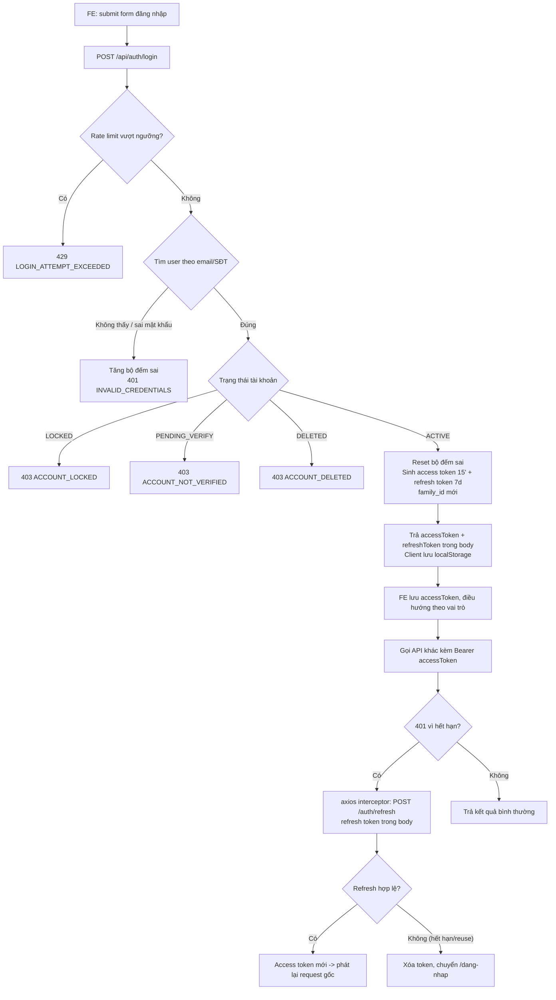

### 5. Dữ liệu chạy như thế nào

`LoginRequest {emailOrPhone, password, captchaToken?, rememberDevice}` → FE validate Yup (bắt buộc 2 field) → `POST /api/auth/login` → BE bind vào `LoginRequest` DTO, `@Valid` kiểm `@NotBlank/@Size` → `AuthServiceImpl.login()`: chuẩn hóa `identifier` (trim + lowercase), tính `counterId = IP:sha256(identifier)` để rate-limit không lộ định danh gốc trong Redis key → tra `UserRepository` → so khớp `PasswordEncoder` trên `passwordHash` (BCrypt, cột `VARCHAR(72)`) → build `LoginResponse` (access/refresh token, `AuthUserResponse` gồm `role` (chuỗi)/`landlordVerified`) qua `AuthMapper` (builder thủ công, không MapStruct) → Controller bọc `ApiResponse.success(data, message)` → FE `authApi.login()` unwrap `response.data.data`, dispatch Redux `authSlice.login` lưu `user` vào store, `tokenService.setTokens()` lưu **cả 2 token** vào `localStorage` cho interceptor.

DTO biến đổi qua các lớp: `LoginRequest` (FE gửi) → Entity `User` (đọc, không ghi thêm ngoài `lastLoginAt`/`failedLoginCount`) → `RefreshToken` entity (ghi mới, chỉ lưu HASH) → `LoginResponse`/`TokenResponse`/`AuthUserResponse` (trả FE, KHÔNG bao giờ trả `passwordHash`).

### 6. Database liên quan

| Bảng | Vai trò | Quan hệ | Field quan trọng |
|---|---|---|---|
| `users` | Tài khoản gốc | **N-1 với `roles` qua cột `role_id` (NOT NULL — mỗi user đúng 1 vai trò)**; 1-N với `refresh_tokens`, `verifications`, `password_reset_tokens`; 1-1 với `user_profiles`, `landlord_profiles` | `email_uk`/`phone_uk` (generated column STORED, unique — chỉ tính khi `deleted_at IS NULL AND status <> 'DELETED'`, cho phép tái đăng ký sau khi xóa mềm); `password_hash VARCHAR(72)`; `status` (`ACTIVE/PENDING_VERIFY/LOCKED/DELETED`); `failed_login_count`; `locked_until/lock_reason/locked_by/locked_at` |
| `roles` | 4 vai trò cố định | 1-N `users` | `code` CHECK IN 4 giá trị `ROLE_*`; id 1..4 cố định (seed V2) | — | UNIQUE (`role_id`,`permission_id`); 49 dòng seed (Tenant 5, Landlord 8, Moderator 9, Admin 27) |
| ~~`user_roles`~~ | **ĐÃ BỎ ở V13** — vai trò nằm ở `users.role_id` | — | Lịch sử đổi vai trò xem `audit_logs(ROLE_CHANGE)` |
| `refresh_tokens` | Phiên đăng nhập | N-1 `users`; tự tham chiếu `parent_id` (chuỗi rotation) | `token_hash` (SHA-256, KHÔNG lưu raw), `family_id` (UUID, nhóm token cùng phiên gốc), `used_at`, `revoked_at`, `revoked_reason` (`ROTATED/REUSE_DETECTED/LOGOUT/PASSWORD_CHANGE/PASSWORD_RESET/ADMIN_LOCK/ROLE_CHANGE/ACCOUNT_LOCKED`) |
| `password_reset_tokens` | Token quên mật khẩu | N-1 `users` | `token_hash`, `expires_at` (30'), `used_at` |
| `verifications` | Dùng chung cho EMAIL/PHONE/LANDLORD | N-1 `users` | `type` CHECK (`EMAIL/PHONE/LANDLORD`), `status` (`PENDING/VERIFIED/REJECTED/EXPIRED`), `token_hash` (link email), `otp_hash` (email/SĐT), `attempt_count`, `expires_at`, `reviewed_by/reviewed_at/reject_reason` (dùng chung cho xác thực chủ trọ ở Module 5) |

> Lưu ý: entity Java trong repo là `Verification` (số ít) ánh xạ bảng `verifications`, không tồn tại bảng `email_verification_tokens`/`phone_otp*` riêng như mô tả sơ bộ trong đề bài — thực tế email token, email OTP và phone OTP đều dùng CHUNG một bảng `verifications` phân biệt bằng cột `type` và cột hash tương ứng.

### 7. API liên quan

| Method | URL | Request | Response | Auth | Permission | Validation | Error chính |
|---|---|---|---|---|---|---|---|
| POST | `/api/auth/register` | `RegisterRequest{fullName,email,phone,password,confirmPassword,requestedRole,contactName?,contactPhone?,acceptTerms}` | `201` `RegisterResponse` | Public | — | `@ValidPassword`, `@ValidPhone`, `acceptTerms=true`; landlord bắt buộc contact | `EMAIL_ALREADY_EXISTS`, `PHONE_ALREADY_EXISTS`, `PASSWORD_CONFIRM_MISMATCH`, `LANDLORD_CONTACT_REQUIRED`, `REGISTER_RATE_LIMIT`(429) |
| POST | `/api/auth/login` | `LoginRequest{emailOrPhone,password,captchaToken?,rememberDevice}` | `200` `LoginResponse{accessToken,refreshToken,expiresIn,refreshExpiresIn,user{role}}` | Public | — | `@NotBlank` | `INVALID_CREDENTIALS`(401), `ACCOUNT_LOCKED`(403), `ACCOUNT_NOT_VERIFIED`(403), `ACCOUNT_DELETED`(403), `CAPTCHA_REQUIRED`, `LOGIN_ATTEMPT_EXCEEDED`(429) |
| POST | `/api/auth/refresh` | `RefreshTokenRequest{refreshToken}` (**bắt buộc**) | `200` `TokenResponse{accessToken,refreshToken mới}` | Public | — | — | `REFRESH_TOKEN_INVALID`, `REFRESH_TOKEN_EXPIRED`, `REFRESH_TOKEN_REUSED`(401, thu hồi cả họ) |
| POST | `/api/auth/logout` | `LogoutRequest{refreshToken?}`, header `Authorization` | `204` (client tự xóa localStorage) | Có thể kèm Bearer | — | — | idempotent, không lỗi khi token đã hết hạn |
| POST | `/api/auth/forgot-password` | `ForgotPasswordRequest{email}` | `200` luôn thành công | Public | — | `@Email` | `FORGOT_PASSWORD` rate-limit 3/giờ (im lặng nếu vượt — check trước) |
| POST | `/api/auth/reset-password` | `ResetPasswordRequest{token,newPassword,confirmPassword}` | `200` | Public | — | password strength | `PASSWORD_RESET_TOKEN_INVALID`, `PASSWORD_RESET_TOKEN_EXPIRED`, `NEW_PASSWORD_SAME_AS_OLD` |
| POST | `/api/auth/change-password` | `ChangePasswordRequest{oldPassword,newPassword,confirmPassword}` | `200` | **Bearer bắt buộc** | `isAuthenticated()` | — | `OLD_PASSWORD_INCORRECT`, `NEW_PASSWORD_SAME_AS_OLD`, `PASSWORD_CONFIRM_MISMATCH` |
| POST | `/api/auth/verify-email` | `VerifyEmailRequest{token}` hoặc `{email,otp}` | `200` `VerifyEmailResponse` | Public | — | — | `OTP_INVALID`, `OTP_EXPIRED`, `OTP_ATTEMPT_EXCEEDED`, `VERIFICATION_ALREADY_DONE`(409) |
| POST | `/api/auth/resend-verification` | `ResendVerificationRequest{email}` | `200` `{cooldownSeconds}` | Public | — | — | luôn 200 (chống dò email); cooldown 60s, tối đa 5/ngày |
| POST | `/api/auth/send-phone-otp` | `SendPhoneOtpRequest{phone}` | `200` `PhoneOtpResponse{maskedPhone,expiresInSeconds,cooldownSeconds}` | **Bearer bắt buộc** | `isAuthenticated()` | SĐT phải khớp tài khoản | `INVALID_PHONE_FORMAT`, `VERIFICATION_ALREADY_DONE`, `PHONE_ALREADY_EXISTS` |
| POST | `/api/auth/verify-phone` | `VerifyPhoneRequest{otp}` | `200` `VerifyPhoneResponse` | **Bearer bắt buộc** | `isAuthenticated()` | — | `OTP_INVALID`, `OTP_EXPIRED`, `OTP_ATTEMPT_EXCEEDED`(429, ≥5 lần sai) |

### 8. Dependency

**Phụ thuộc vào:**
- `SystemConfigService` (module admin) — mọi ngưỡng bảo mật (`security.login.*`, `security.register.rate`, `security.refresh.grace_seconds`) đọc từ `system_configs`, KHÔNG hardcode.
- `NotificationService` (module notification) — gửi `ACCOUNT_REGISTERED` khi đăng ký.
- `MailService` (common/mail) — gửi email xác thực/quên mật khẩu qua MailHog (dev).
- Redis (StringRedisTemplate) — rate-limit + JWT blacklist.
- `LandlordProfileRepository` — tạo hồ sơ chủ trọ khi đăng ký với `requestedRole=LANDLORD`.

**Module khác phụ thuộc vào nó:**
- **TOÀN BỘ** module còn lại phụ thuộc `JwtAuthenticationFilter`/`SecurityContextHolder` để biết `CustomUserDetails` hiện tại (`@AuthenticationPrincipal`).
- Module User (Module 2) dùng chung entity `User`, `Role`, `Verification`.
- Module Admin (`AdminUserServiceImpl`) thu hồi `refresh_tokens` khi khóa tài khoản/đổi vai trò — phụ thuộc trực tiếp `RefreshTokenRepository` của module này.
- FE: hầu như mọi trang cần đăng nhập đều phụ thuộc `axiosClient` (interceptor refresh) và Redux `authSlice`.

### 9. Các trường hợp cần kiểm tra

- □ Đăng ký Tenant / Landlord (kèm/thiếu contactName, contactPhone) — đúng validate liên trường.
- □ Đăng ký trùng email (khác hoa/thường) — trùng SĐT — trùng cả hai.
- □ Đăng ký lại bằng email của tài khoản đã bị xóa mềm (status=DELETED) — phải cho phép (nhờ generated column `email_uk`).
- □ Đăng nhập đúng bằng email / bằng SĐT / SĐT có định dạng khác nhau (có `+84`, `0`).
- □ Đăng nhập sai mật khẩu 3 lần → yêu cầu captcha; sai tiếp tới 5 lần → khóa tạm 15 phút, HTTP 429 kèm `Retry-After`.
- □ Đăng nhập khi tài khoản `PENDING_VERIFY` / `LOCKED` / `DELETED`.
- □ Refresh token hết hạn (>1 ngày) — refresh bằng token đã bị rotate (reuse) → phải thu hồi cả họ và các phiên khác đều bị đăng xuất.
- □ Refresh 2 request gần như đồng thời bằng CÙNG 1 refresh token (race condition) — kỳ vọng: 1 request qua nhờ grace window 10s, không bị coi là reuse giả.
- □ Đổi mật khẩu: thiết bị hiện tại KHÔNG bị đăng xuất, thiết bị khác BỊ đăng xuất.
- □ Đặt lại mật khẩu qua email: TẤT CẢ thiết bị bị đăng xuất.
- □ Xác thực email: dùng token đã dùng rồi (409), token hết hạn (24h) (410), token không tồn tại (400).
- □ Xác thực SĐT: nhập sai OTP 5 lần liên tiếp → khóa yêu cầu OTP mới; SĐT xác thực trùng tài khoản khác.
- □ Logout khi không có refresh token / access token (vẫn phải trả 204, không lỗi 500).
- □ Token hết hạn giữa chừng khi đang thao tác dài (ví dụ đang điền form upload ảnh) — interceptor phải refresh trong suốt.
- □ Concurrent: 2 tab cùng bị 401 cùng lúc → chỉ 1 lần gọi `/auth/refresh` thực sự (kiểm tra Network tab).
- □ Rate limit theo IP khi test từ nhiều máy/NAT chung IP (dò xem có false-positive).
- □ Kiểm `@PreAuthorize` từng endpoint nhạy cảm bằng Postman với token của role KHÔNG đủ quyền → phải 403, không phải 500/200.
- □ JWT hết hạn nhưng đã bị blacklist do logout trước đó — dùng lại access token cũ đã logout → phải bị từ chối ngay cả khi còn hạn 15 phút.

### 10. Các lỗi dễ gặp

- **Nhầm lẫn `emailOrPhone` với email thuần túy**: nếu FE/test hardcode field `email` cho login sẽ luôn 400 vì DTO yêu cầu đúng tên `emailOrPhone`.
- **Gửi lại refresh token CŨ sau khi đã refresh**: backend xoay vòng token mỗi lần refresh; dùng lại token cũ kích hoạt reuse-detection và thu hồi **cả họ token** → mất phiên. Đây là lỗi trễ, chỉ lộ ra ở lần refresh thứ hai.
- **Redis không chạy (dev quên `docker compose up`)**: `TokenBlacklistService` fail-closed → **mọi request có Bearer token bị từ chối** (vì `isBlacklisted()` trả `true` khi Redis lỗi) — dễ nhầm là lỗi JWT trong khi thực chất là Redis down. Ngược lại `RateLimitService` fail-open nên rate-limit "biến mất" âm thầm khi Redis lỗi — dễ bỏ sót trong test bảo mật.
- **So sánh sai `INVALID_CREDENTIALS` với 404 user not found**: code cố tình trả cùng lỗi cho cả 2 trường hợp; nếu FE hiển thị message khác nhau (do tự đoán) sẽ vô tình lộ email tồn tại hay không.
- **Đếm `failed_login_count` trên `User` entity nhưng KHÔNG lưu ngay** (chỉ set field trong transaction, save entity khi transaction commit tự flush) — nếu code refactor tách transaction sai chỗ sẽ mất số đếm này (khác với bộ đếm rate-limit ở Redis — 2 cơ chế đếm song song, dễ gây nhầm lẫn khi debug).
- **JWT chứa role "đóng băng" tại thời điểm login/refresh**: nếu Admin đổi quyền của user đang online, quyền mới **chỉ có hiệu lực sau khi access token hết hạn (≤15 phút) hoặc user refresh** — không phải ngay lập tức. Đây là hành vi THIẾT KẾ (đã có cơ chế `revokeSessions` khi đổi role để ép logout), nhưng dễ bị hiểu nhầm là bug nếu không biết.
- **Tìm cookie `refresh_token` trong DevTools**: không còn nữa (bỏ ở v3). Token nằm ở Application → Local Storage, key `webtro_access_token` / `webtro_refresh_token`.
- **Test đăng ký chủ trọ (`requestedRole=LANDLORD`) mà không set `contactPhone` hợp lệ theo `PhoneUtil.isValid`**: lỗi trả về là `LANDLORD_CONTACT_REQUIRED` chung chung, không rõ do thiếu tên hay SĐT sai định dạng — cần xem kỹ log/response để debug.

### 11. Các điểm cần review

- **Bảo mật**: xác nhận `JWT_SECRET` production tối thiểu 32 byte thật sự được set (có fail-fast ở `JwtProperties.validate()` — kiểm tra khi deploy đã set biến môi trường đúng cách, tránh app không start được ở production do quên set).
- **Bảo mật**: `JwtAuthenticationFilter` dùng claims trong token, không hit DB — review xem có endpoint nhạy cảm nào (ví dụ khóa tài khoản) cần double-check trạng thái user real-time thay vì tin claims cũ không (hiện đã có `getAliveUser()` ở admin service, nhưng nên rà soát toàn bộ).
- **Business**: rate limit "quên mật khẩu" theo **email**, còn rate limit "đăng nhập" theo **IP + hash(identifier)** — không đồng nhất cách khóa khóa (key theo email vs theo IP) — cân nhắc có nên thống nhất chiến lược chống brute-force.
- **UX**: thông báo lỗi rate-limit hiện `retryAfterSeconds` — FE `LoginPage` đã convert ra phút, nhưng `ForgotPasswordPage`/`RegisterPage` cần rà lại có xử lý tương tự không (tránh hiện message kỹ thuật khó hiểu).
- **API naming**: `POST /auth/refresh` chỉ nhận `refreshToken` trong body và bắt buộc (`@NotBlank`) — không còn đường cookie nên không còn mơ hồ về độ ưu tiên.
- **Validation**: `RegisterRequest.fullName` dùng regex `^[\p{L} .'\-]+$` chỉ cho chữ + khoảng trắng + `.` `'` `-` — kiểm tra có chặn nhầm tên có ký tự hợp lệ khác (ví dụ số La Mã, dấu ngoặc trong bút danh) không.
- **Performance**: `notifyModerators` (dùng khi đăng ký gửi `ACCOUNT_REGISTERED`... thực ra chỉ `notifyUser`) — nhưng cờ ở nơi khác (`notifyModerators`) load TOÀN BỘ `userRoleRepository.findAll()` rồi filter trong bộ nhớ — với hệ thống nhiều user sẽ chậm dần; nên có query có điều kiện thay vì load full bảng.
- **Response/DB**: cột `users.password_hash VARCHAR(72)` đúng độ dài BCrypt chuẩn (60 ký tự + biên) — nhưng không có kiểm tra version thuật toán (nếu sau này đổi sang Argon2 sẽ cần migrate cột).

### 12. Kết quả mong đợi

- Toàn bộ 11 API auth hoạt động đúng theo bảng ở mục 7, trả đúng HTTP status + `ApiResponse` envelope + `errorCode` chuẩn.
- RBAC hoạt động đúng cho cả 4 vai trò: verify bằng cách gọi từng nhóm API admin bằng token của Tenant/Landlord/Moderator để chắc chắn bị 403 đúng chỗ (Moderator không có `USER_ROLE_ASSIGN`, `PAYMENT_*`, `SYSTEM_CONFIG_MANAGE`, `STATISTIC_VIEW` — kiểm chứng trực tiếp bằng role guard).
- Refresh token rotation + reuse detection hoạt động đúng, có bằng chứng qua kiểm tra bảng `refresh_tokens` (`revoked_reason`).
- Không có lỗ hổng lộ thông tin tài khoản qua thông báo lỗi (login/forgot-password/resend-verification đều "im lặng" như thiết kế).
- Toàn bộ ngưỡng bảo mật đọc từ `system_configs`, không có số hardcode trong code nghiệp vụ (trừ các hằng KỸ THUẬT có ghi chú rõ trong `AuthServiceImpl`).

---

# Module: User & Profile & Follow

### 1. Module này dùng để làm gì?

Quản lý **hồ sơ cá nhân** (mọi role) và **hồ sơ chủ trọ** (role Landlord), cùng tính năng **theo dõi (Follow) chủ trọ** để người thuê nhận thông báo khi chủ trọ theo dõi đăng tin mới. Đây là nơi hiển thị thông tin công khai của chủ trọ (trang `/chu-tro/:id`) — ảnh hưởng trực tiếp tới uy tín/khả năng chuyển đổi (conversion) của chủ trọ trên nền tảng.

**Vì sao cần:** Tách biệt "tài khoản" (Module 1 — đăng nhập được) và "hồ sơ" (module này — thông tin hiển thị, liên hệ, nghiệp vụ chủ trọ) giúp mở rộng độc lập (ví dụ thêm trường hồ sơ không đụng tới bảo mật). Follow là cơ chế giữ chân người dùng quay lại (retention) và là nguồn dữ liệu cho `NewMatchingListingNotifyJob`/`FollowListener` (Module 3).

**Hỏng thì ảnh hưởng gì:**
- Lỗi cập nhật hồ sơ → người dùng không sửa được thông tin liên hệ, ảnh hưởng khả năng chủ trọ được liên hệ.
- Lỗi ảnh đại diện (upload/xóa) → trải nghiệm kém, có thể lộ lỗi bảo mật nếu không kiểm magic bytes ảnh đúng.
- Lỗi Follow → người dùng theo dõi nhầm/không theo dõi được, hoặc không nhận được thông báo tin mới của chủ trọ họ quan tâm → giảm hiệu quả giữ chân.
- Lỗi hồ sơ công khai lộ SĐT/email cho khách chưa đăng nhập → vi phạm quy tắc che dữ liệu (§5.7).

### 2. Chức năng Frontend

| File | Màn hình | Thành phần |
|---|---|---|
| `pages/tenant/ProfilePage.jsx` (route `/tai-khoan/ho-so`) | Hồ sơ cá nhân | Cột trái: `Avatar` + nút camera đổi ảnh (input file ẩn, validate JPG/PNG/WEBP + ≤5MB **ở client TRƯỚC khi upload**), nút "Xóa ảnh"; hiển thị email/SĐT kèm icon `VerifiedIcon` nếu đã xác thực; box tóm tắt hồ sơ chủ trọ nếu có (huy hiệu xác thực, uy tín, số tin, đánh giá). Cột phải: form `react-hook-form` + Yup (họ tên, giới tính `select`, ngày sinh `DatePicker` MUI-X, địa chỉ, giới thiệu `multiline`), nút "Khôi phục" (reset về data đã load) và "Lưu thay đổi" (disable khi `!isDirty`). |
| `pages/tenant/ChangePasswordPage.jsx` | (đã mô tả ở Module 1) | — |
| `pages/tenant/FollowingPage.jsx` (route `/tai-khoan/dang-theo-doi`) | Danh sách chủ trọ đang theo dõi | Grid card 3 cột, mỗi card: `Avatar` + `Badge` số tin mới kể từ lần ghé thăm gần nhất (`newListingCountSinceLastVisit`), tên (link tới hồ sơ công khai) + icon xác thực, chip uy tín + rating, nút "Xem hồ sơ"/"Bỏ theo dõi" (có `ConfirmDialog`). `EmptyState` khi chưa theo dõi ai, có CTA "Khám phá tin đăng". Pagination MUI. |
| `pages/public/LandlordProfilePage.jsx` (route công khai `/chu-tro/:id`) | Hồ sơ công khai chủ trọ | `TrustScoreBadge`, `RatingStars`, nút Follow/Unfollow (điều hướng `/dang-nhap` kèm `state.from` nếu chưa đăng nhập), lưới `ListingGrid` các tin đang hiển thị của chủ trọ có phân trang. |
| Không có trang riêng cho "Update Contact" (`PATCH /users/me/contact`) — API tồn tại ở `userApi.js`? | — | > Cần bổ sung theo source code: không tìm thấy nơi FE gọi `updateContact`/`getLandlordProfile`/`updateLandlordProfile`/`requestLandlordVerification` trong `pages/tenant/*` hiện tại — các API này tồn tại ở BE + `userApi.js` nhưng UI sử dụng nằm ở khu vực `pages/landlord/*` (thuộc phạm vi Người khác), cần đối chiếu chéo khi review. |

`src/api/userApi.js` là điểm gọi API duy nhất (không có logic nghiệp vụ ở tầng này — chỉ gọi HTTP + `unwrap()` envelope).

### 3. Chức năng Backend

**Controller:** `modules/user/controller/UserController.java` (9 endpoint `/api/users/*`) + `modules/user/controller/FollowController.java` (3 endpoint, cùng prefix `/api/users`).

**Service:** `UserService`/`UserServiceImpl` (401 dòng), `FollowService`/`FollowServiceImpl` (146 dòng).

**Validation/Business logic nổi bật (đọc từ `UserServiceImpl`):**
- Tuổi tối thiểu `MIN_AGE = 16` khi cập nhật `dateOfBirth` (tính bằng `Period.between`).
- Sanitize mọi field text tự do (`bio`, `address`, `displayName`, `businessName`, `businessAddress`) qua `HtmlSanitizer.stripAllHtml` — chống XSS lưu trữ (stored XSS).
- Ảnh đại diện: kiểm cỡ theo config `listing.image.max_size_mb` (dùng CHUNG config với module listing, không có config riêng cho avatar), kiểm magic bytes JPG/PNG/WEBP thủ công (đọc 12 byte đầu) TRƯỚC khi giao cho `FileStorage` (lớp này kiểm lại lần nữa + chống decompression bomb + sinh thumbnail).
- Xóa avatar khi đã null → trả `404 AVATAR_NOT_FOUND` (không trả 204 khống) — quy ước rõ trong comment code.
- `updateContact`: đồng bộ SĐT tài khoản (`users.phone`) VÀ SĐT liên hệ hồ sơ chủ trọ (nếu có) trong CÙNG 1 request — kiểm trùng SĐT với user khác trước khi lưu.
- `submitLandlordVerification`: chuyển `landlord_profiles.verification_status` → `PENDING`, tạo bản ghi `verifications` (`type=LANDLORD`, hạn xử lý 30 ngày) để Admin/Moderator duyệt (xem Module 5).
- `getPublicProfile`: user `LOCKED`/`DELETED` → trả `404 USER_NOT_FOUND` (không lộ trạng thái bị khóa ra công khai); tính `followedByMe` chỉ khi có `currentUserId` và khác `targetUserId`.

**Follow business logic (`FollowServiceImpl`):**
- Không tự follow chính mình (`CANNOT_FOLLOW_SELF`).
- Chỉ follow được user có `ROLE_LANDLORD` (`TARGET_NOT_LANDLORD`).
- Chống follow trùng (`ALREADY_FOLLOWING`, unique index `(follower_id, landlord_id)`).
- Unfollow: **xóa CỨNG** (`followRepository.delete()`), không xóa mềm — vì đây là dữ liệu quan hệ thuần túy, không cần audit lịch sử.
- Danh sách "đang theo dõi": vì repository chỉ có `findByFollower_IdAndDeletedAtIsNull` trả `List` (không hỗ trợ `Pageable` trực tiếp — quyết định kỹ thuật đã chốt, không sửa), nên **phân trang + sort được thực hiện TRONG BỘ NHỚ** ở tầng service — chấp nhận được vì số chủ trọ 1 người theo dõi thường nhỏ, nhưng là điểm cần chú ý về hiệu năng nếu dữ liệu tăng.

**Dependency nội bộ đáng chú ý:** cả `UserServiceImpl` và `FollowServiceImpl` inject `TrustScoreService` (module listing) bằng `@Lazy` để phá vòng phụ thuộc tiềm ẩn giữa module `user` ↔ `listing`.

### 4. Luồng hoạt động

**Luồng Follow chủ trọ:**
1. Người dùng bấm "Theo dõi" trên `LandlordProfilePage` → nếu chưa đăng nhập, điều hướng `/dang-nhap` kèm `state.from`.
2. `POST /api/users/{id}/follow` (yêu cầu `isAuthenticated()`).
3. BE kiểm: không tự follow mình, target phải có role Landlord, chưa follow trước đó.
4. Tạo bản ghi `follows` (`notify_new_listing = true` mặc định), đếm lại `follower_count`, trả `201`.
5. FE cập nhật state cục bộ (tăng follower count, đổi nút thành "Đang theo dõi").
6. Về sau, khi chủ trọ này có tin được duyệt (`ListingApprovedEvent`), `FollowListener` (Module 3) sẽ gửi thông báo `FOLLOWED_LANDLORD_NEW_LISTING` cho người này (nếu `notify_new_listing = true`).

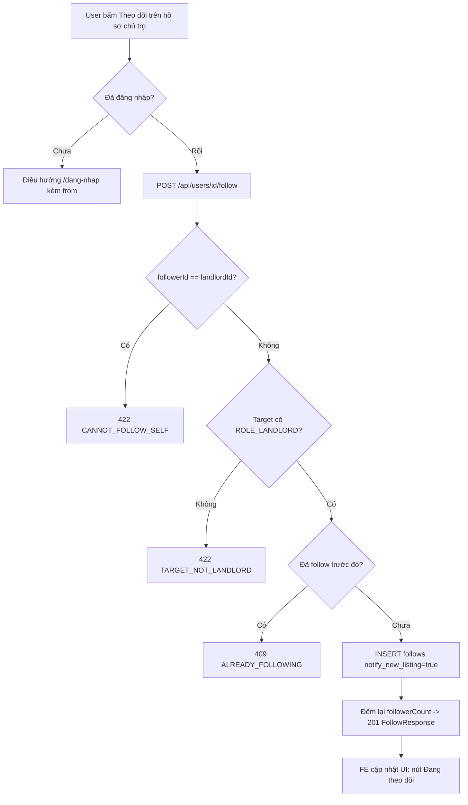

### 5. Dữ liệu chạy như thế nào

`UpdateProfileRequest{fullName,gender,dateOfBirth,address,bio}` → FE Yup validate (min/max length, `dateOfBirth` không ở tương lai) → `PUT /api/users/me` → `UpdateProfileRequest` bind → `UserServiceImpl.updateMyProfile()`: cập nhật entity `User` (fullName, gender) và `UserProfile` (dateOfBirth, addressDetail, bio — sanitize HTML) trong CÙNG 1 transaction (2 bảng khác nhau) → gọi lại `getMyProfile()` để build `UserProfileResponse` đầy đủ (bao gồm role load từ `RoleRepository`, và `landlordProfile` chỉ nhúng nếu user thực sự có `ROLE_LANDLORD`) → trả FE → FE `dispatch(bootstrapAuth())` để đồng bộ lại Redux store (đảm bảo header/avatar toàn site cập nhật ngay).

### 6. Database liên quan

| Bảng | Quan hệ | Field quan trọng |
|---|---|---|
| `user_profiles` | 1-1 với `users` (`uk_user_profiles_user_id`) | `date_of_birth`, `bio VARCHAR(500)`, `occupation`, `address_detail`, `preferred_gender_requirement` |
| `landlord_profiles` | 1-1 với `users` | `display_name`, `contact_name/phone/email`, `allow_chat`, `verification_status` (`PENDING/VERIFIED/REJECTED/EXPIRED`), `verified_at/verified_by/verification_note`, `trust_score DECIMAL(5,2)` (0-100), `average_rating`, `review_count`, `total_listings`, `total_active_listings`, `valid_report_count`, `warning_count`, `locked_listing_count`, `posting_restricted_until`, `restrict_reason` |
| `follows` | N-1 `users` hai lần (`follower_id`, `landlord_id`) | UNIQUE (`follower_id`,`landlord_id`); `notify_new_listing BOOLEAN` (bật/tắt nhận thông báo tin mới theo từng chủ trọ) |
| `verifications` (type=LANDLORD) | N-1 `users` | Dùng khi `submitLandlordVerification` — xem chi tiết ở Module 1 |

### 7. API liên quan

| Method | URL | Request | Response | Auth | Permission | Error chính |
|---|---|---|---|---|---|---|
| GET | `/api/users/me` | — | `UserProfileResponse` | Bearer | `isAuthenticated()` | — |
| PUT | `/api/users/me` | `UpdateProfileRequest{fullName,gender?,dateOfBirth?,address?,bio?}` | `UserProfileResponse` | Bearer | `isAuthenticated()` | `VALIDATION_FAILED` (tuổi <16) |
| PATCH | `/api/users/me/contact` | `UpdateContactRequest{contactName?,contactPhone?}` | `ContactInfoUpdateResponse` | Bearer | `isAuthenticated()` | `VALIDATION_FAILED` (thiếu cả 2 field / SĐT sai định dạng), `PHONE_ALREADY_EXISTS` |
| POST | `/api/users/me/avatar` (multipart) | `file` | `AvatarResponse{avatarUrl,thumbnailUrl}` | Bearer | `isAuthenticated()` | `AVATAR_INVALID_FORMAT`, `AVATAR_TOO_LARGE` |
| DELETE | `/api/users/me/avatar` | — | `204` | Bearer | `isAuthenticated()` | `AVATAR_NOT_FOUND` (đã null từ trước) |
| GET | `/api/users/me/landlord-profile` | — | `MyLandlordProfileResponse` | Bearer | `LISTING_CREATE` | `LANDLORD_PROFILE_NOT_FOUND` |
| PUT | `/api/users/me/landlord-profile` | `UpdateLandlordProfileRequest{contactName,contactPhone,contactEmail?,displayName?,businessName?,businessAddress?,chatEnabled?}` | `MyLandlordProfileResponse` | Bearer | `LISTING_CREATE` | — |
| POST | `/api/users/me/landlord-verification` | `LandlordVerificationRequest{note?}` | `201` `LandlordVerificationResponse` | Bearer | `LISTING_CREATE` | `LANDLORD_ALREADY_VERIFIED` |
| GET | `/api/users/{id}` | — | `LandlordPublicResponse` | Public (tùy chọn) | — | `404` (khi LOCKED/DELETED — cố ý không lộ) |
| GET | `/api/users/{id}/listings` | `Pageable` (`page,size`, mặc định sort `publishedAt,DESC`) | `PageResponse<ListingSummaryResponse>` | Public | — | — |
| POST | `/api/users/{id}/follow` | — | `201` `FollowResponse{landlordId,following,followerCount,followedAt}` | Bearer | `isAuthenticated()` | `CANNOT_FOLLOW_SELF`, `TARGET_NOT_LANDLORD`, `ALREADY_FOLLOWING` |
| DELETE | `/api/users/{id}/follow` | — | `204` | Bearer | `isAuthenticated()` | `NOT_FOLLOWING` |
| GET | `/api/users/me/following` | `Pageable` (chỉ cho phép sort `createdAt`/`trustScore`) | `PageResponse<FollowingItemResponse>` | Bearer | `isAuthenticated()` | `INVALID_SORT_FIELD` (sort field lạ) |

### 8. Dependency

**Phụ thuộc vào:** Module 1 (entity `User`, `CustomUserDetails`), `TrustScoreService` (module listing, tính điểm/nhãn uy tín — `@Lazy`), `SystemConfigService` (cỡ ảnh tối đa), `FileStorage` (lưu ảnh + thumbnail), `ListingSearchService` (module search — dùng cho `GET /users/{id}/listings`).

**Module khác phụ thuộc vào nó:**
- Module Notification: `FollowListener` đọc bảng `follows` để gửi thông báo tin mới.
- Module Admin (Module 5): `AdminUserServiceImpl`/`AdminUserController` đọc/ghi `landlord_profiles` (xác thực, hạn chế đăng tin) và `UserProfileRepository`.
- Module Moderation (Module 4): `UserGatewayAdapter`/`UserModerationGatewayAdapter` (SPI) cho phép module moderation gọi ngược vào module user (ví dụ `suspendPosting`) mà không phụ thuộc trực tiếp entity.
- Module Payment/Listing: đọc `landlord_profiles.trust_score`, `allow_chat`, `verification_status` để hiển thị huy hiệu trên tin đăng.

### 9. Các trường hợp cần kiểm tra

- □ Cập nhật hồ sơ với `dateOfBirth` khiến tuổi <16 → phải bị chặn.
- □ Cập nhật `bio`/`address` chứa thẻ HTML/script → phải bị strip sạch (kiểm DB thực tế, không chỉ kiểm response).
- □ Upload avatar: đúng định dạng nhưng đổi đuôi file giả (ví dụ `.exe` đổi tên thành `.jpg`) → phải bị chặn bởi kiểm magic bytes (không chỉ dựa vào `Content-Type` header có thể giả mạo).
- □ Upload avatar vượt cỡ tối đa cấu hình (`listing.image.max_size_mb`).
- □ Xóa avatar 2 lần liên tiếp → lần 2 phải trả 404, không phải 204 "giả vờ thành công".
- □ `updateContact` chỉ gửi 1 trong 2 field (chỉ tên hoặc chỉ SĐT) — phải hoạt động đúng (không bắt buộc cả 2, chỉ bắt buộc ÍT NHẤT 1).
- □ `updateContact` với SĐT đã thuộc về user khác → `PHONE_ALREADY_EXISTS`.
- □ Follow chủ trọ đã bị khóa/xóa mềm → phải báo lỗi hợp lý (không follow được user không tồn tại).
- □ Follow rồi Unfollow rồi Follow lại (cùng cặp) — kiểm tra không bị lỗi do unique index cũ (vì unfollow là xóa cứng nên phải insert lại được bình thường).
- □ Danh sách Following: sort theo `trustScore` cả 2 chiều asc/desc, sort theo field KHÔNG hợp lệ (ví dụ `fullName`) → phải `400 INVALID_SORT_FIELD`.
- □ Phân trang Following khi có >20 chủ trọ (vượt 1 trang) — vì phân trang xử lý trong bộ nhớ, cần test với data lớn để phát hiện vấn đề hiệu năng sớm.
- □ Xem hồ sơ công khai chủ trọ đã `LOCKED` bằng URL trực tiếp `/chu-tro/{id}` → phải nhận 404, không lộ dữ liệu.
- □ Xem hồ sơ công khai chưa đăng nhập — SĐT/liên hệ phải bị che (kiểm theo `viewerAuthenticated` — xem code `LandlordProfilePage` phần che số điện thoại, mục 4.2.5 quy tắc 6 nêu trong Javadoc).
- □ Đăng ký chủ trọ 2 lần liên tiếp khi đã `VERIFIED` → `LANDLORD_ALREADY_VERIFIED`.

### 10. Các lỗi dễ gặp

- **Nhầm giữa 2 cách cập nhật thông tin liên hệ**: `PATCH /users/me/contact` (nhanh, đồng bộ cả `users.phone` VÀ `landlord_profiles.contact_*`) và `PUT /users/me/landlord-profile` (đầy đủ, ghi đè toàn bộ hồ sơ chủ trọ) — dễ nhầm dùng sai endpoint dẫn đến mất dữ liệu (ví dụ gọi `PUT landlord-profile` thiếu field optional sẽ set về `null` vì đây không phải PATCH).
- **`FollowingPage` phân trang sai lệch với tổng số thực tế** nếu code sort/phân trang trong bộ nhớ có lỗi off-by-one khi `page * size` vượt `total` (đã có `Math.min` phòng thủ, nhưng cần test biên).
- **Ảnh đại diện dùng chung config cỡ tối đa với ảnh tin đăng** (`listing.image.max_size_mb`) — nếu Admin đổi config này cho mục đích tin đăng (ví dụ tăng lên 10MB) sẽ vô tình ảnh hưởng luôn giới hạn avatar — dễ bị bỏ sót khi review cấu hình.
- **`getPublicProfile` trả 404 cho cả "không tồn tại" và "bị khóa"** — đúng chủ ý bảo mật nhưng dễ khiến QA báo nhầm là "bug xem hồ sơ" khi thực ra là hành vi cố ý.
- **`LandlordDashboardController`/`getLandlordDashboard` trong `userApi.js`** trỏ tới `/landlord/dashboard` — route này KHÔNG nằm trong `UserController`/`FollowController` đã đọc, thuộc phạm vi khác — cần xác nhận không nhầm phạm vi khi review.

### 11. Các điểm cần review

- **Business**: `FollowServiceImpl.getFollowing` phân trang trong bộ nhớ — cần đánh giá ngưỡng số lượng follow tối đa 1 người dùng nên giới hạn (hiện không có giới hạn cứng) để tránh 1 user follow hàng nghìn chủ trọ làm chậm trang.
- **UI/UX**: `ProfilePage` không cho sửa email/SĐT trực tiếp qua form chính (đúng vì cần xác thực lại) nhưng cũng KHÔNG có link rõ ràng dẫn tới `send-phone-otp`/`verify-phone` — trải nghiệm đổi SĐT có thể bị đứt đoạn, cần rà lại luồng đổi SĐT tài khoản đầu cuối.
- **API naming**: `PATCH /users/me/contact` dùng verb PATCH đúng chuẩn REST (cập nhật một phần), trong khi `PUT /users/me/landlord-profile` dùng PUT (thay thế toàn bộ) — nhất quán tốt, nên giữ quy ước này khi thêm endpoint mới.
- **Security**: kiểm tra kỹ `isAllowedImage` (đọc 12 byte đầu) có đủ để chặn file WEBP giả mạo tinh vi không, hay cần dựa hẳn vào `FileStorage` (đã có lớp kiểm sâu hơn) — tránh trùng lặp logic 2 nơi có thể lệch nhau khi 1 nơi được sửa mà nơi kia quên.
- **DB**: `landlord_profiles` có rất nhiều cột đếm denormalized (`total_listings`, `warning_count`, `valid_report_count`...) — cần review cơ chế đồng bộ các cột này (job/trigger nào cập nhật) để đảm bảo không bị lệch số theo thời gian (data drift).
- **Performance**: `getPublicProfile` gọi `TrustScoreService.labelOf()` mỗi lần xem hồ sơ — nên xác nhận có cache hay không vì trang hồ sơ chủ trọ có thể được xem rất nhiều lần (traffic cao).

### 12. Kết quả mong đợi

- Toàn bộ 12 API ở mục 7 hoạt động đúng, đặc biệt các quy tắc "im lặng"/che dữ liệu với người dùng chưa đăng nhập hoặc tài khoản bị khóa.
- Follow/Unfollow đồng bộ đúng `follower_count` hiển thị, không có race-condition trùng follow.
- Ảnh đại diện chỉ chấp nhận JPG/PNG/WEBP hợp lệ thật sự (không chỉ dựa vào phần mở rộng/Content-Type).
- Dữ liệu text tự do (bio, địa chỉ, tên liên hệ...) không bao giờ chứa HTML/script khi lưu DB.

---

# Module: Notification

### 1. Module này dùng để làm gì?

Là **kênh giao tiếp bất đồng bộ** giữa hệ thống và người dùng: thông báo trong ứng dụng (in-app, chuông thông báo) + email (qua MailHog ở dev). Module này KHÔNG tự sinh sự kiện — nó là **SPI dùng chung** (`NotificationService`) để các module khác (auth, admin, moderation, user/follow, listing, payment...) gọi vào khi có sự kiện cần báo cho người dùng, tuân thủ nguyên tắc kiến trúc hexagonal "giao tiếp chéo module qua SPI gateway, không đụng trực tiếp repository của module khác".

**Vì sao cần:** Người dùng cần biết ngay khi: tài khoản bị khóa, tin đăng bị duyệt/từ chối/khóa, có liên hệ mới, nhận cảnh báo vi phạm, thanh toán thành công/thất bại, chủ trọ họ theo dõi có tin mới... Nếu không có kênh thông báo tập trung, mỗi module phải tự làm UI riêng → không nhất quán.

**Hỏng thì ảnh hưởng gì:**
- Không nhận được thông báo bảo mật quan trọng (khóa tài khoản, cảnh báo vi phạm) → người dùng bị động, không biết lý do bị hạn chế.
- Không nhận thông báo thanh toán → tranh chấp, mất niềm tin.
- Cấu hình tùy chọn (preferences) sai → gửi spam email cho người đã tắt, hoặc ngược lại không gửi loại BẮT BUỘC (mất cảnh báo bảo mật).
- `FollowListener`/`NewMatchingListingNotifyJob` lỗi → tính năng giữ chân người dùng (Module 2) mất tác dụng.

### 2. Chức năng Frontend

| File | Thành phần |
|---|---|
| `components/common/NotificationBell.jsx` | Icon chuông ở header (mọi trang đã đăng nhập) + `Badge` số chưa đọc (tối đa hiển thị "99+"). Poll `fetchUnreadCount` mỗi 60 giây (`setInterval`). Bấm vào mở `Popover` chứa danh sách gần đây (`fetchRecent`, gọi `GET /notifications?page=0&size=8`), nút "Đánh dấu đã đọc" (mark-all), nút "Xem tất cả" điều hướng `/tai-khoan/thong-bao`. Bấm vào 1 thông báo → `markAsRead` + điều hướng theo `actionUrl` (field `link` từ BE). |
| `pages/tenant/NotificationsPage.jsx` (route `/tai-khoan/thong-bao`) | Trang đầy đủ: `Tabs` "Tất cả"/"Chưa đọc", `List` với icon theo `iconType` (SUCCESS/WARNING/ERROR/INFO), nút "Đánh dấu tất cả đã đọc" (chỉ hiện khi `unreadCount > 0`), `Pagination`, `EmptyState` khi rỗng, `LoadingSkeleton` khi loading. |
| Không có trang riêng cho "Cài đặt thông báo" (`GET/PUT /notifications/preferences`) trong `pages/tenant/*` đã liệt kê | > Cần bổ sung theo source code: API preferences tồn tại đầy đủ ở BE (`NotificationController`) và `notificationApi.js` có `getPreferences`/`updatePreferences`, nhưng KHÔNG tìm thấy trang UI nào gọi 2 hàm này trong `pages/tenant/*` — đây là khoảng trống UI cần xác nhận với team FE (có thể nằm trong `ProfilePage` dạng tab ẩn, hoặc thực sự chưa làm). |

`src/redux/notificationSlice.js` (được `NotificationBell` dùng qua `fetchUnreadCount`/`fetchRecent`/`selectUnreadCount`/`selectRecentNotifications`) quản lý state toàn cục cho badge — không đọc source slice này trong lượt review này, > Cần bổ sung theo source code nếu cần review sâu cơ chế polling/cache Redux.

### 3. Chức năng Backend

**Controller:** `modules/notification/controller/NotificationController.java` (7 endpoint `/api/notifications/*`) — chỉ điều phối, mọi kiểm tra quyền sở hữu (chỉ thao tác trên thông báo của chính mình) nằm ở tầng service.

**2 Service tách biệt theo nguyên tắc CQRS nhẹ:**
- **`NotificationService`/`NotificationServiceImpl`** — SPI GHI, dùng bởi các module KHÁC (không có controller gọi trực tiếp): `notifyUser(userId, type, title, content, actionUrl?, metadata?)` và `notifyModerators(type, title, content, actionUrl)`.
- **`NotificationQueryService`/`NotificationQueryServiceImpl`** — ĐỌC + thao tác của chính người dùng (list, unread-count, mark-read, delete, preferences), dùng trực tiếp bởi `NotificationController`.

**`NotificationDefaults`** (class hằng số, nguồn sự thật duy nhất dùng chung 2 luồng gửi/cài đặt):
- **16 loại được phép cấu hình** (`PREFERENCE_TYPES`) — loại trừ `NEW_MATCHING_LISTING` (không cho tắt vì ràng buộc CHECK DB `ck_notification_preferences_type` không liệt kê loại này).
- **11 loại BẮT BUỘC** (`MANDATORY`, không tắt được — tắt sẽ bị `422 NOTIFICATION_TYPE_NOT_OPTIONAL`): `ACCOUNT_REGISTERED, LISTING_APPROVED, LISTING_REJECTED, LISTING_LOCKED, PAYMENT_SUCCESS, PAYMENT_FAILED, ACCOUNT_LOCKED, VIOLATION_WARNING, REPORT_THRESHOLD, AI_NEGATIVE_ALERT, ACCOUNT_VERIFICATION`.
- **13 loại mặc định BẬT thêm kênh EMAIL** (`EMAIL_DEFAULT_ON`) — các loại còn lại mặc định chỉ IN_APP.

**Business logic gửi (`NotificationServiceImpl.notifyUser`):**
1. `resolvePreference()`: nếu type BẮT BUỘC → luôn `inApp=true`, email theo `emailDefaultOn()`. Nếu KHÔNG bắt buộc → tra `notification_preferences` (bảng chỉ lưu NGOẠI LỆ — không có bản ghi nghĩa là dùng mặc định bật).
2. Nếu người dùng đã tắt CẢ 2 kênh (và không bắt buộc) → **không tạo bản ghi, return sớm** (không ghi rác vào DB).
3. Tạo `Notification` (channel = `EMAIL` nếu email bật, ngược lại `IN_APP`), lưu DB.
4. Nếu `pref.email` → gửi email đồng bộ qua `MailService.sendHtml()` (template `notification`), bọc trong `userRepository.findByIdAndDeletedAtIsNull(...).ifPresent(...)` — nếu email lỗi, KHÔNG rollback transaction ghi thông báo (đã có try/catch ở tầng gọi listener, nhưng bản thân `notifyUser` không tự bắt lỗi mail — cần lưu ý khi review transaction boundary).
5. `notifyModerators`: tìm mọi user có role `ADMIN` hoặc `MODERATOR` (còn hiệu lực), lặp gọi `notifyUser` cho từng người — dùng cho cảnh báo hệ thống (report vượt ngưỡng, AI phát hiện bất thường).

**Cache:** Không cache riêng cho notification — mỗi lần gọi `unread-count`/`list` đều query DB trực tiếp (bảng có index `idx_notifications_user_id_is_read_created_at` hỗ trợ).

**Event/Listener:**
- `modules/user/listener/FollowListener.java` — lắng nghe `ListingApprovedEvent` (`@TransactionalEventListener(phase = AFTER_COMMIT)`), với mỗi follower có `notify_new_listing=true` của chủ trọ vừa có tin duyệt → gửi `FOLLOWED_LANDLORD_NEW_LISTING`. Chạy transaction MỚI (`REQUIRES_NEW`) vì AFTER_COMMIT không còn transaction gốc. Bọc try/catch từng follower để 1 lỗi không chặn cả loạt.

**Job:** `scheduler/NewMatchingListingNotifyJob.java` — cron `0 30 7 * * *` UTC (07:30 UTC hằng ngày). Thuật toán (đọc trực tiếp code):
1. Lấy tin `ACTIVE` mới publish trong `ai.recommendation.notify_lookback_hours` giờ gần nhất (tối đa 500 tin).
2. Lấy user "hoạt động" (có xem tin) trong `ai.recommendation.notify_active_user_days` ngày gần nhất (tối đa 5000 user).
3. Với mỗi user: xây "sở thích" từ tối đa 50 lượt xem gần nhất (tập quận, tập tỉnh, khoảng giá min-max đã xem).
4. Chấm điểm mỗi tin mới = `0.6 × khớp khu vực (1.0 nếu trùng quận, 0.5 nếu trùng tỉnh, 0 nếu khác) + 0.4 × khớp giá (1.0 nếu trong khoảng [min×0.8, max×1.2], ngược lại 0)`.
5. Giữ tin có điểm ≥ `ai.recommendation.notify_min_score`, gửi tối đa `ai.recommendation.notify_max_per_user` tin/người, ưu tiên điểm cao nhất.
6. Chống gửi trùng: kiểm `notificationRepository.existsByUserIdAndTypeAndLinkAndDeletedAtIsNull(...)` trước khi gửi (idempotent — chạy lại không gửi lại tin đã gửi).
7. Loại trừ: tin của chính user, tin user đã xem.

### 4. Luồng hoạt động

**Luồng gửi + đọc thông báo (tổng quát, minh họa bằng khóa tài khoản — Module 5 gọi vào module này):**

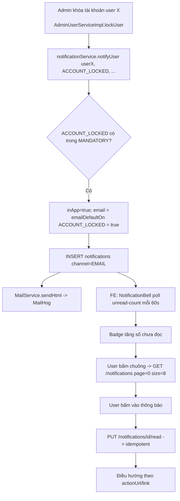

### 5. Dữ liệu chạy như thế nào

Input (ví dụ Admin khóa user) → `AdminUserServiceImpl.lockUser()` gọi `notificationService.notifyUser(userId, ACCOUNT_LOCKED, title, content)` (không qua HTTP, gọi Java interface trực tiếp vì cùng backend) → `NotificationServiceImpl` build entity `Notification` (builder thủ công) → lưu DB → nếu kênh email bật, build `Map<String,Object> vars` (title/content/actionUrl/actionLabel) → `MailService.sendHtml(email, subject, "notification", vars)` render template Thymeleaf/HTML → gửi SMTP tới MailHog.

Phía đọc: FE gọi `GET /notifications?type=...&unreadOnly=...&page=&size=` → `NotificationQueryServiceImpl.list()` → JPA query có `Pageable`, map `Notification` entity → `NotificationResponse` (qua `NotificationMapper`, builder thủ công — field `read`/`iconType`/`targetUrl` ở FE tương ứng field BE `isRead`/... — cần đối chiếu field mapping chính xác giữa `NotificationResponse` và cách `NotificationsPage.jsx`/`NotificationBell.jsx` đọc (`n.read`, `n.iconType`, `n.targetUrl`, `n.actionUrl`) — có 2 tên field khác nhau cho URL đích (`targetUrl` ở `NotificationsPage`, `actionUrl` ở `NotificationBell`) → cần rà soát `NotificationMapper`/`NotificationResponse` để xác nhận field thực tế trả về tên gì, tránh 1 trong 2 nơi đọc sai field và luôn hiện `undefined`.

### 6. Database liên quan

| Bảng | Quan hệ | Field quan trọng |
|---|---|---|
| `notifications` | N-1 `users` (CASCADE) | `type` (16+1 giá trị CHECK, mở rộng ở V11: thêm `LISTING_HIDDEN`, `ACCOUNT_VERIFICATION`), `channel` (`IN_APP`/`EMAIL`), `title`, `content`, `link`, `ref_type`/`ref_id` (tham chiếu đối tượng liên quan, ví dụ tin đăng), `is_read`, `read_at`, `email_sent_at`, `email_error`. CHECK `ck_notifications_read`: `is_read=false OR read_at IS NOT NULL`. |
| `notification_preferences` | N-1 `users` | UNIQUE (`user_id`,`notification_type`); `in_app`, `email` (2 cờ độc lập); CHECK `ck_notification_preferences_mandatory`: nếu type thuộc nhóm bắt buộc thì bản ghi (nếu có) buộc phải `in_app=true AND email=true` — **DB tự chặn** việc lưu bản ghi tắt loại bắt buộc, là lớp phòng thủ thứ 2 sau kiểm tra ở service. |

> Bảng chỉ lưu NGOẠI LỆ: người dùng KHÔNG có bản ghi = đang dùng mặc định hệ thống (`NotificationDefaults`). Đây là quyết định thiết kế quan trọng cần hiểu khi debug "tại sao user X không thấy preferences của loại Y" — vì hoàn toàn bình thường nếu họ chưa từng đổi mặc định.

### 7. API liên quan

| Method | URL | Request | Response | Auth | Validation | Error |
|---|---|---|---|---|---|---|
| GET | `/api/notifications` | Query `type[]`(NotificationType), `unreadOnly`(bool, default false), `Pageable` (default size=20, sort=`createdAt,DESC`) | `NotificationListResponse` (list + `unreadCount`) | Bearer, `isAuthenticated()` | — | — |
| GET | `/api/notifications/unread-count` | — | `UnreadCountResponse` (kèm cả số tin nhắn chat chưa đọc — endpoint nhẹ để FE poll) | Bearer | — | — |
| PUT | `/api/notifications/{id}/read` | — | `MarkReadResponse` | Bearer | — | Idempotent: đánh dấu lại thông báo đã đọc vẫn `200`, giữ nguyên `read_at` lần đầu; `NOTIFICATION_NOT_FOUND`/`NOTIFICATION_FORBIDDEN` nếu không phải chủ sở hữu |
| PUT | `/api/notifications/read-all` | Query `type?` | `MarkAllReadResponse{markedCount}` | Bearer | — | — |
| DELETE | `/api/notifications/{id}` | — | `204` | Bearer | — | Xóa MỀM, chỉ của chính người dùng |
| GET | `/api/notifications/preferences` | — | `NotificationPreferencesResponse` (16 mục, mỗi mục có cờ `optional`) | Bearer | — | — |
| PUT | `/api/notifications/preferences` | `UpdatePreferenceRequest` | `NotificationPreferencesResponse` | Bearer | Không cho tắt loại `optional=false` | `422 NOTIFICATION_TYPE_NOT_OPTIONAL` |

### 8. Dependency

**Phụ thuộc vào:** `UserRepository` (đọc email người nhận), `RoleRepository`/`UserRoleRepository` (tìm Admin/Moderator cho `notifyModerators`), `MailService` (common/mail), `AppProperties` (frontend base URL để build `actionUrl` tuyệt đối trong email).

**Module khác phụ thuộc vào nó (SPI `NotificationService` được gọi từ RẤT NHIỀU nơi — đúng tinh thần "giao tiếp qua SPI gateway"):**
- Module 1 (Auth): `ACCOUNT_REGISTERED`.
- Module 2 (User/Follow) qua `FollowListener`: `FOLLOWED_LANDLORD_NEW_LISTING`.
- Module 5 (Admin): `ACCOUNT_LOCKED`, `ACCOUNT_VERIFICATION` (verify/unverify/reject landlord).
- Module 4 (Moderation): `VIOLATION_WARNING`, `LISTING_LOCKED`, `LISTING_HIDDEN`, `REPORT_THRESHOLD` (qua `notifyModerators`).
- Module listing/payment (ngoài phạm vi Người 1): `LISTING_APPROVED/REJECTED/EXPIRING/EXPIRED`, `PAYMENT_SUCCESS/FAILED`, `NEW_CONTACT`, `NEW_COMMENT`, `NEW_REVIEW`, `AI_NEGATIVE_ALERT`.
- `scheduler/NewMatchingListingNotifyJob` — nguồn phát sinh DUY NHẤT của `NEW_MATCHING_LISTING`.

### 9. Các trường hợp cần kiểm tra

- □ Gửi thông báo loại BẮT BUỘC khi user đã (cố tình qua API) lưu preference tắt → DB phải CHẶN (CHECK constraint) hoặc service phải bỏ qua yêu cầu tắt — test trực tiếp `PUT /notifications/preferences` với type bắt buộc → phải `422`.
- □ Gửi thông báo cho user đã bị xóa mềm (`deleted_at` không null) — `sendEmail` dùng `findByIdAndDeletedAtIsNull` nên sẽ KHÔNG gửi email (im lặng) — kiểm tra bản ghi in-app có vẫn được tạo hay không (đọc code: `notificationRepository.save()` chạy TRƯỚC bước gửi email, nên bản ghi vẫn được tạo dù user đã xóa mềm — cần đánh giá đây có phải hành vi mong muốn).
- □ Mark-as-read 1 thông báo KHÔNG thuộc về mình → phải bị từ chối (`NOTIFICATION_FORBIDDEN`), không lộ được đánh dấu đọc thông báo người khác.
- □ Mark-as-read lặp lại nhiều lần (idempotent) — `read_at` không đổi sau lần đầu.
- □ Mark-all-read có `type` filter vs không filter.
- □ Xóa 1 thông báo rồi gọi lại danh sách — phải biến mất khỏi cả `list` và `unread-count` nếu đang unread.
- □ `unreadOnly=true` kết hợp `type` filter nhiều giá trị.
- □ Chạy `NewMatchingListingNotifyJob` 2 lần liên tiếp trong ngày (giả lập) → lần 2 KHÔNG được gửi trùng thông báo đã gửi lần 1 (kiểm `existsByUserIdAndTypeAndLinkAndDeletedAtIsNull`).
- □ `FollowListener`: duyệt tin của chủ trọ có 0 follower → không lỗi, không gửi gì (return sớm).
- □ `FollowListener`: 1 trong nhiều follower gây lỗi (ví dụ email invalid) → các follower còn lại vẫn nhận được thông báo (nhờ try/catch từng người trong vòng lặp).
- □ Test rollback: nếu transaction gốc (ví dụ duyệt tin) bị rollback, `ListingApprovedEvent` (AFTER_COMMIT, `fallbackExecution=true`) KHÔNG được kích hoạt.
- □ Đếm số chưa đọc khi có >99 thông báo — badge FE hiển thị "99+".
- □ Concurrent: 2 tab cùng mark-all-read cùng lúc — không lỗi 500, kết quả cuối cùng nhất quán.

### 10. Các lỗi dễ gặp

- **Nhầm lẫn "loại bắt buộc" (`MANDATORY`) với "loại có email mặc định" (`EMAIL_DEFAULT_ON`)** — 2 tập KHÔNG hoàn toàn trùng nhau (ví dụ `LISTING_LOCKED` thuộc cả 2, nhưng cần đọc kỹ danh sách vì các set này được maintain thủ công, dễ lệch khi thêm loại thông báo mới mà quên cập nhật cả 2 nơi + cả `V1`/`V11` CHECK constraint DB — tổng cộng có ít nhất 4 nơi phải đồng bộ thủ công: enum Java `NotificationType`, `NotificationDefaults`, CHECK `notifications.type`, CHECK `notification_preferences.notification_type`).
- **`NEW_MATCHING_LISTING` không nằm trong `PREFERENCE_TYPES`** — nếu FE (khi được xây dựng) lỡ hiển thị toggle cho loại này trong trang cài đặt, gọi `PUT /preferences` sẽ luôn lỗi (vi phạm CHECK DB `ck_notification_preferences_type`) — cần đảm bảo FE danh sách cài đặt CHỈ render đúng 16 loại BE trả về.
- **Field tên `link`/`targetUrl`/`actionUrl` không nhất quán** giữa các nơi đọc ở FE (`NotificationBell` dùng `n.actionUrl`, `NotificationsPage` dùng `n.targetUrl`) — cần verify field thật sự BE trả về là gì (`NotificationResponse`/`NotificationMapper` — chưa đọc chi tiết trong lượt này) để xác định đây có phải bug thật hay chỉ là 2 field khác nhau có chủ đích.
- **Gửi email đồng bộ trong transaction DB** (`notifyUser` gọi `mailService.sendHtml` bên trong transaction ghi `notifications`) — nếu SMTP (MailHog ở dev, hoặc SMTP thật ở production) chậm/treo, sẽ giữ transaction DB mở lâu → có thể gây khóa (lock) không cần thiết trên các bảng liên quan trong cùng transaction cha (ví dụ `AdminUserServiceImpl.lockUser` gọi `notifyUser` trong transaction khóa user).
- ~~**`notifyModerators` load toàn bộ `userRoleRepository.findAll()`** rồi filter~~ — **đã sửa ở v3**: dùng `userRepository.findByRole_CodeInAndDeletedAtIsNull(List.of(ADMIN, MODERATOR))`, lọc ngay ở DB.

### 11. Các điểm cần review

- **UI**: xác nhận có tồn tại trang "Cài đặt thông báo" cho Tenant hay chưa (mục 2 đã nêu nghi vấn thiếu) — nếu thiếu, đây là tính năng BE đã làm đầy đủ (API `preferences`) nhưng FE chưa khai thác, nên ưu tiên bổ sung hoặc xác nhận nằm ở nơi khác.
- **Response consistency**: rà soát `NotificationMapper`/`NotificationResponse` để thống nhất tên field URL đích, tránh FE 2 nơi đọc field khác nhau như đã nêu.
- **Business**: xem xét có nên tách gửi email ra khỏi transaction DB chính (ví dụ dùng `@TransactionalEventListener(AFTER_COMMIT)` hoặc queue) để tránh giữ lock lâu — hiện tại gửi đồng bộ ngay trong transaction gọi `notifyUser`.
- **Naming**: `notifyModerators` gửi cho CẢ Admin lẫn Moderator — tên hàm dễ gây hiểu nhầm chỉ gửi Moderator; nên cân nhắc đổi tên hoặc bổ sung Javadoc rõ hơn (đã có Javadoc nhưng tên hàm vẫn dễ nhầm khi đọc lướt).
- **Performance**: index `idx_notifications_user_id_is_read_created_at` phù hợp cho query `list`/`unread-count`, nhưng cần review query thực tế của `NotificationQueryServiceImpl` (đếm unread) có tận dụng đúng index không (COUNT trên điều kiện `is_read=false` riêng có thể cần index khác nếu bảng lớn).
- **Job**: `NewMatchingListingNotifyJob` giới hạn cứng `MAX_NEW_LISTINGS=500`, `MAX_USERS=5000` — cần đánh giá đủ cho quy mô Hà Nội (12 quận, 62 phường) hiện tại, và cách xử lý khi vượt ngưỡng (tin/user bị bỏ sót âm thầm, không có cảnh báo/log riêng cho trường hợp bị cắt bớt).

### 12. Kết quả mong đợi

- 7 API notification hoạt động đúng bảng mục 7, đặc biệt tính idempotent của mark-read và tính bảo mật (không thao tác được trên thông báo của người khác).
- `NotificationDefaults` là nguồn sự thật DUY NHẤT — không có nơi nào khác hardcode lại danh sách loại bắt buộc/email mặc định.
- `FollowListener` và `NewMatchingListingNotifyJob` chạy đúng, không gửi trùng, không chặn luồng nghiệp vụ chính khi lỗi.
- Xác nhận rõ ràng (không còn mơ hồ) trạng thái tính năng "Cài đặt thông báo" trên FE.

---

# Module: Moderation người dùng (Report / Warning / BannedKeyword)

### 1. Module này dùng để làm gì?

Đây là **hệ thống kiểm duyệt cộng đồng + kiểm duyệt viên**: người dùng báo cáo (report) nội dung/người dùng vi phạm → Moderator/Admin xử lý (duyệt/từ chối/ẩn/khóa) → hệ thống ghi log hành động (`moderation_actions`) và có thể phát cảnh báo (`violation_warnings`) cho người vi phạm. Ngoài ra có bộ **từ khóa cấm** (banned keywords) dùng để lọc nội dung tự động khi đăng tin/bình luận (được module listing/interaction gọi qua SPI, không thuộc phạm vi review trực tiếp ở đây nhưng CRUD từ khóa thuộc phạm vi Người 1).

**Vì sao cần:** Nền tảng cho thuê trọ có rủi ro lừa đảo/spam cao (yêu cầu chuyển khoản trước, tin ma...). Cơ chế báo cáo + ngưỡng tự động (auto-flag) giúp phát hiện sớm mà không cần Moderator rà thủ công 100% tin đăng.

**Hỏng thì ảnh hưởng gì:**
- Report không tạo được → người dùng mất kênh phản ánh, tin lừa đảo tồn tại lâu hơn.
- Auto-flag/auto-hide sai ngưỡng → hoặc bỏ lọt tin vi phạm nghiêm trọng, hoặc khóa oan tin hợp lệ (đối thủ cạnh tranh report ảo để hại nhau — đã có `guardNotAbusiveReporter` phòng ngừa).
- Cảnh báo (Warning) sai → chủ trọ bị hạn chế đăng tin oan, hoặc ngược lại vi phạm nhiều lần không bị hạn chế.
- Từ khóa cấm sai → chặn nhầm nội dung hợp lệ (false positive) hoặc bỏ lọt spam thật (false negative).

### 2. Chức năng Frontend

| File | Màn hình | Thành phần |
|---|---|---|
| `pages/tenant/MyReportsPage.jsx` (route `/tai-khoan/bao-cao-cua-toi`) | Báo cáo của tôi | Filter theo `status` (select), mỗi report hiện dạng card: chip loại đối tượng + lý do + mức độ, link tới đối tượng (`targetUrl`), mô tả, kết quả xử lý (`resultLabel`) + phản hồi Moderator nếu đã xử lý, thời gian gửi/xử lý. `Pagination`. |
| `pages/admin/ReportsPage.jsx` (route `/admin/bao-cao`) | Quản lý báo cáo (Admin/Moderator, quyền `REPORT_RESOLVE`) | `ToggleButtonGroup` chuyển "Danh sách" (phẳng)/"Gom nhóm" (`groupBy=TARGET`); filter status/severity; bảng dùng chung `AdminDataTable`; nút "Xử lý" mở `ConfirmDialog` có **select "Kết quả xử lý"** (`MODERATION_RESULT_OPTIONS`: `NO_VIOLATION/MINOR_WARN/MEDIUM_HIDE/SEVERE_LOCK`) + textarea lý do; ở chế độ gom nhóm nút là "Xử lý nhóm" (gọi `resolveReportGroup` áp 1 quyết định cho toàn bộ report cùng đối tượng). |
| `pages/admin/BannedKeywordsPage.jsx` (route `/admin/tu-khoa-cam`) | Quản lý từ khóa cấm (quyền `SYSTEM_CONFIG_MANAGE`/`CATALOG_MANAGE`) | CRUD đầy đủ: form thêm/sửa (`keyword`, `severity` select MILD/SEVERE, `scope` select LISTING/COMMENT/BOTH), `Switch` bật/tắt trực tiếp trên bảng (`toggle`), xóa có `ConfirmDialog`, tìm kiếm theo từ khóa. |
| Không tìm thấy trang admin riêng cho **Cảnh báo vi phạm** (Warnings) | — | > Cần bổ sung theo source code: `adminApi.js` có sẵn `getWarnings`/`sendWarning` và BE có đầy đủ `AdminWarningController` (2 endpoint), nhưng **không có route/menu/trang `pages/admin/*` nào** gọi 2 hàm này — không xuất hiện trong `routes/router.jsx`. Đây là gap FE cần xác nhận: cảnh báo có được phát hành TỰ ĐỘNG khi `resolveReport` (kèm `warningMessage`) hay CHỦ ĐỘNG gửi riêng qua `POST /admin/warnings` — hiện tại chỉ luồng đầu có UI, luồng gửi cảnh báo độc lập (không gắn với report cụ thể) chưa có màn hình. |

### 3. Chức năng Backend

**Controller:**
- `ReportController` (`/api/reports`, phía người dùng, quyền `REPORT_CREATE`): `POST /api/reports` (multipart, kèm ảnh bằng chứng), `GET /api/reports/my`.
- `AdminReportController` (`/api/admin/reports`, quyền `REPORT_RESOLVE`): `GET` (list/group), `GET /{id}`, `PUT /{id}/status` (nhận xử lý), `PUT /{id}/resolve`, `GET /target/{type}/{id}`, `PUT /resolve-group`.
- `AdminWarningController` (`/api/admin/warnings`, quyền `WARNING_SEND`): `POST`, `GET`.
- `AdminBannedKeywordController` (`/api/admin/banned-keywords`, quyền `SYSTEM_CONFIG_MANAGE` HOẶC `CATALOG_MANAGE`): CRUD + toggle.

**Service:** `ModerationService`/`ModerationServiceImpl` (1358 dòng — service lớn nhất trong phạm vi review) và `BannedKeywordService`/`BannedKeywordServiceImpl` (+ `BannedKeywordCache`, `BannedKeywordGatewayAdapter` cho module khác gọi vào để lọc nội dung khi đăng tin/bình luận).

**SPI (giao tiếp chéo module, đúng kiến trúc hexagonal):** `ListingModerationGateway` (khóa/ẩn/gắn cờ tin), `UserModerationGateway` (tra cứu user ref, `suspendPosting`), `ContentModerationGateway` (ẩn comment/review), `AuditGateway` (ghi audit log) — `ModerationServiceImpl` gọi qua các interface này thay vì đụng trực tiếp repository module listing/user/interaction/admin.

**Business logic then chốt (đọc trực tiếp code):**

1. **Tạo báo cáo (`createReport`):**
   - Rate limit `spam.report.daily` (mặc định 10/ngày/user).
   - `guardNotAbusiveReporter`: nếu user có ≥ `report.abuse.rejected_count` (mặc định 5) báo cáo bị REJECTED trong `report.abuse.window_days` (30 ngày) → `403 REPORT_RESTRICTED_ABUSE` (chặn báo cáo tiếp).
   - Không tự báo cáo nội dung của chính mình (`REPORT_SELF_FORBIDDEN`).
   - Chống trùng theo `dedupKey = targetType:targetId:reason` (+ hậu tố `#cycle` nếu đã từng report xong RESOLVED/REJECTED trước đó, cho phép báo cáo lại chu kỳ mới) — unique index DB `(reporter_id, dedup_key)`.
   - `reason=OTHER` bắt buộc có `description`.
   - Severity suy ra tự động từ `reason` (`severityOf`): `SCAM→CRITICAL`, `FAKE_IMAGE/OFFENSIVE→HIGH`, `WRONG_INFO/WRONG_PRICE/SPAM→MEDIUM`, `ALREADY_RENTED/OTHER→LOW`.
   - `maybeAutoFlag`: nếu target là LISTING, đủ `moderation.autohide.report_count` (5) báo cáo từ `moderation.autohide.distinct_reporters` (5) tài khoản khác nhau trong `moderation.autohide.window_hours` (24h) → tự động `listingGateway.flagNeedReview()` + ghi `moderation_actions` với `is_system=true` (KHÔNG tạo warning, KHÔNG ghi audit) + `notifyModerators(REPORT_THRESHOLD)`.

2. **Xử lý báo cáo (`resolveReport`):** kết quả (`ModerationResult`) quyết định hành động trên đối tượng:
   - `NO_VIOLATION` → `DISMISS`, nếu là LISTING thì `clearNeedReview`; report chuyển `REJECTED`.
   - `MINOR_WARN` → chỉ ghi `WARN`, không đổi trạng thái đối tượng; nếu có `warningMessage` → phát `ViolationWarning`.
   - `MEDIUM_HIDE` → ẩn đối tượng (`hideTarget`: LISTING→`hideByModeration`, COMMENT→`hideComment`, REVIEW→`hideReview`; USER→không có gì để ẩn).
   - `SEVERE_LOCK` → **yêu cầu quyền `LISTING_LOCK`** (chỉ Admin có, kiểm ở `guardLockPermission` — Moderator dù có `REPORT_RESOLVE` cũng KHÔNG được chọn kết quả này, trả `403`); nếu target là LISTING → khóa hẳn tin (`listingGateway.lock`); nếu KHÔNG phải LISTING (comment/review/user) → hạ xuống ẩn nội dung + issue warning (không tự khóa tài khoản trực tiếp — chỉ "đề xuất" cho Admin qua `accountLockSuggested`).
   - `result != NO_VIOLATION` mà thiếu `warningMessage` → `422 WARNING_REASON_REQUIRED`.
   - Bất biến bắt buộc `closeReport()`: report `RESOLVED`/`REJECTED` LUÔN có `resolved_by`, `resolved_at`, `is_valid` (ép ở code vì DB không CHECK được — cột FK `resolved_by` không dùng được trong CHECK do ràng buộc MySQL).
   - Sau xử lý: `recalcTrust()` (tính lại điểm uy tín tin/chủ trọ qua `TrustScoreService`, best-effort — lỗi không chặn kiểm duyệt), `maybeSuspendPosting()` (nếu chủ đạt ngưỡng `moderation.threshold.warning_count`=3 cảnh báo/`moderation.threshold.warning_window_days`=30 ngày → tự tạm hạn chế đăng tin, gọi `userGateway.suspendPosting`), tính `accountLockSuggested` (nếu chủ có ≥ `moderation.threshold.locked_listing_count`=5 tin bị khóa trong `moderation.threshold.locked_listing_window_days`=60 ngày — CHỈ ĐỀ XUẤT, Admin tự quyết khóa tài khoản qua Module 5).
   - `resolveGroup`: áp 1 quyết định cho TOÀN BỘ report đang mở của cùng 1 đối tượng — kiểm quyền `LISTING_LOCK` TRƯỚC khi đóng bất kỳ report nào (tránh "cửa sau" vượt phân quyền qua thao tác hàng loạt).

3. **Gửi cảnh báo trực tiếp (`createWarning`):** không cho cảnh báo Admin (`CANNOT_MODIFY_ADMIN`), không tự cảnh báo chính mình; nếu đạt ngưỡng → tự `suspendPosting` (giống luồng trong `resolveReport`).

4. **Đếm ngưỡng dùng chung:** `countActiveWarnings(userId)` (trong cửa sổ ngày cấu hình) và `countRecentLockedListings(ownerId)` — 2 hàm public được gọi lặp lại ở nhiều luồng (report detail gợi ý kết quả, resolveReport, createWarning) đảm bảo NHẤT QUÁN 1 công thức đếm duy nhất.

5. **Đề xuất kết quả (`recommend`)** ở màn chi tiết báo cáo: heuristic dựa trên số report/số người report khác nhau/report CRITICAL/số tin đã khóa gần đây của chủ — chỉ là GỢI Ý cho Moderator, không tự động áp dụng.

**Cache:** `BannedKeywordCache` (module riêng, không đọc chi tiết trong lượt review này — > Cần bổ sung theo source code nếu cần review sâu cơ chế cache từ khóa cấm khi CRUD).

### 4. Luồng hoạt động

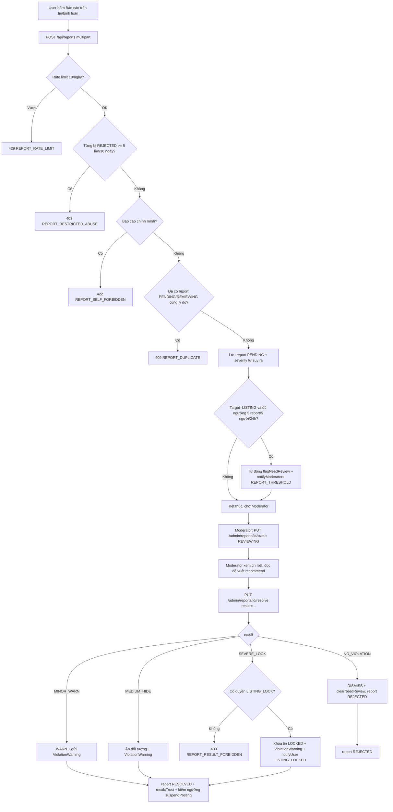

### 5. Dữ liệu chạy như thế nào

`CreateReportRequest{targetType,targetId,reason,description?,evidenceImage?}` (multipart) → FE build `FormData` → `POST /api/reports` → BE bind `@ModelAttribute` (không phải `@RequestBody` vì có file) → `ModerationServiceImpl.createReport()`: `resolveTarget()` tra cứu thông tin đối tượng thật (tiêu đề, `ownerId`, `listingId` liên quan — qua gateway, KHÔNG query trực tiếp bảng `listings`/`comments` của module khác) → validate → lưu ảnh bằng chứng qua `FileStorage.storeImage()` (thư mục `reports`) → build entity `Report` (builder thủ công) → lưu DB → `maybeAutoFlag()` → map sang `ReportResponse` (qua `ReportMapper`) → `201 Created` với `Location: /api/reports/{id}`.

Khi Moderator xử lý: `ResolveReportRequest{result,moderatorResponse?,warningMessage?,internalNote?,resolveRelated}` → `resolveReport()` biến đổi qua nhiều bước (đã mô tả mục 3) → cập nhật NHIỀU bảng trong 1 transaction: `reports` (đóng), `moderation_actions` (ghi log), `violation_warnings` (nếu có), có thể cả `listings.status` (qua gateway, thực chất update ở module listing) và `landlord_profiles.posting_restricted_until` (qua `userGateway.suspendPosting`) → trả `ResolveReportResponse` tổng hợp đầy đủ ngữ cảnh cho FE hiển thị (bao gồm cả cảnh báo/đề xuất tiếp theo).

### 6. Database liên quan

| Bảng | Quan hệ | Field quan trọng |
|---|---|---|
| `reports` | N-1 `users` (reporter, resolver); N-1 tùy chọn `listings` | `target_type` (`LISTING/COMMENT/USER/REVIEW`), `target_id`, `reason` (8 giá trị CHECK), `severity` (`LOW/MEDIUM/HIGH/CRITICAL`), `status` (`PENDING/REVIEWING/RESOLVED/REJECTED`), `is_valid`, `dedup_key`, UNIQUE (`reporter_id`,`dedup_key`) |
| `moderation_actions` | N-1 `users` (moderator, SET NULL), N-1 tùy chọn `reports`/`listings` | Append-only (chỉ `id`+`created_at`, không có `updated_at`); `action_type` (`APPROVE/REJECT/HIDE/UNHIDE/LOCK/UNLOCK/WARN/REQUEST_EDIT/FLAG_NEED_REVIEW/DISMISS`), `result` (`NO_VIOLATION/MINOR_WARN/MEDIUM_HIDE/SEVERE_LOCK`), `is_system` (hành động tự động không có `moderator_id`) |
| `violation_warnings` | N-1 `users` (người nhận, người phát), N-1 tùy chọn `listings`/`reports`/`moderation_actions` | Append-only; `severity`, `reason` (200 ký tự), `content` (1000 ký tự, nội dung đầy đủ gửi user), `is_system`, `acknowledged_at` |
| `banned_keywords` | Độc lập (lookup) | `keyword`/`normalized_keyword` (không dấu, UNIQUE), `severity` (`MILD/SEVERE`), `applies_to` (`LISTING/COMMENT/BOTH`), `is_regex`, `category`, `hit_count` (đếm số lần khớp — cập nhật bởi module khác khi lọc nội dung) |

> Lưu ý đặt tên: đề bài gọi tắt là "warnings" nhưng bảng THẬT trong DB là **`violation_warnings`** (entity Java `ViolationWarning`) — cần dùng đúng tên khi viết truy vấn/migration mới, tránh nhầm với 1 bảng `warnings` không tồn tại.

### 7. API liên quan

| Method | URL | Request | Response | Auth | Permission | Error chính |
|---|---|---|---|---|---|---|
| POST | `/api/reports` (multipart) | `CreateReportRequest{targetType,targetId,reason,description?,evidenceImage?}` | `201` `ReportResponse` | Bearer | `REPORT_CREATE` | `REPORT_DUPLICATE`(409), `REPORT_SELF_FORBIDDEN`(422), `REPORT_RATE_LIMIT`(429), `REPORT_RESTRICTED_ABUSE`(403), `REPORT_DESCRIPTION_REQUIRED` |
| GET | `/api/reports/my` | Query `status[]?,targetType?`, `Pageable` | `PageResponse<MyReportResponse>` | Bearer | `REPORT_CREATE` | — |
| GET | `/api/admin/reports` | Query `status[],targetType[],targetId?,severity[],reporterId?,groupBy(NONE|TARGET),from,to`, `Pageable` (trần 90 ngày) | `AdminReportListResponse` hoặc `PageResponse<AdminReportGroupResponse>` | Bearer | `REPORT_RESOLVE` | `AUDIT_LOG_RANGE_TOO_LARGE` (dùng chung error code với audit log) |
| GET | `/api/admin/reports/{id}` | — | `ReportDetailResponse` (gồm cả `recommendedResult`/`recommendationBasis`) | Bearer | `REPORT_RESOLVE` | `REPORT_NOT_FOUND` |
| PUT | `/api/admin/reports/{id}/status` | `AssignReportRequest{status=REVIEWING}` | `AssignReportResponse` | Bearer | `REPORT_RESOLVE` | `REPORT_ALREADY_RESOLVED`(409) |
| PUT | `/api/admin/reports/{id}/resolve` | `ResolveReportRequest{result,moderatorResponse?,warningMessage?,internalNote?,resolveRelated}` | `ResolveReportResponse` | Bearer | `REPORT_RESOLVE` (+ `LISTING_LOCK` nếu `result=SEVERE_LOCK`) | `WARNING_REASON_REQUIRED`, `REPORT_RESULT_FORBIDDEN`(403, thiếu `LISTING_LOCK`) |
| GET | `/api/admin/reports/target/{targetType}/{targetId}` | Query `status[]?`, `Pageable` | `ReportTargetGroupResponse` | Bearer | `REPORT_RESOLVE` | — |
| PUT | `/api/admin/reports/resolve-group` | `ResolveGroupRequest{targetType,targetId,result,onlyPending?,moderatorResponse?,internalNote?}` | `ResolveGroupResponse` | Bearer | `REPORT_RESOLVE` (+`LISTING_LOCK` nếu cần) | `REPORT_GROUP_EMPTY` |
| POST | `/api/admin/warnings` | `CreateWarningRequest{userId,reason,severity,relatedListingId?,relatedReportId?,notifyByEmail?}` | `201` `WarningResponse` | Bearer | `WARNING_SEND` | `CANNOT_MODIFY_ADMIN` (target là Admin), `USER_NOT_FOUND`, `LISTING_NOT_FOUND`, `REPORT_NOT_FOUND` |
| GET | `/api/admin/warnings` | Query `userId?,severity[]?,issuedById?,activeOnly?,from?,to?`, `Pageable` | `PageResponse<WarningItemResponse>` | Bearer | `WARNING_SEND` | — |
| GET | `/api/admin/banned-keywords` | Query `keyword?,severity[]?,scope[]?,activeOnly?`, `Pageable` | `PageResponse<BannedKeywordResponse>` | Bearer | `SYSTEM_CONFIG_MANAGE` hoặc `CATALOG_MANAGE` | — |
| POST | `/api/admin/banned-keywords` | `BannedKeywordRequest{keyword,severity,appliesTo,isRegex?,category?,note?,active?}` | `201` `BannedKeywordResponse` | Bearer | như trên | `BANNED_KEYWORD_DUPLICATE`(409) |
| PUT | `/api/admin/banned-keywords/{id}` | `BannedKeywordRequest` | `200` | Bearer | như trên | `BANNED_KEYWORD_NOT_FOUND` |
| DELETE | `/api/admin/banned-keywords/{id}` | — | `204` (xóa mềm) | Bearer | như trên | `BANNED_KEYWORD_NOT_FOUND` |
| PUT | `/api/admin/banned-keywords/{id}/toggle` | `ToggleBannedKeywordRequest` | `ToggleBannedKeywordResponse` | Bearer | như trên | — |

### 8. Dependency

**Phụ thuộc vào (qua SPI, không đụng trực tiếp):** `ListingModerationGateway`, `UserModerationGateway`, `ContentModerationGateway`, `AuditGateway`, `TrustScoreService`, `NotificationService` (Module 3), `RateLimitService`, `SystemConfigService` (rất nhiều ngưỡng `moderation.*`/`report.*`/`spam.report.daily`), `FileStorage` (ảnh bằng chứng), `SecurityUtils` (kiểm quyền `LISTING_LOCK` bên trong service, không chỉ ở `@PreAuthorize`).

**Module khác phụ thuộc vào nó:**
- Module Admin (Module 5): `AdminDashboardServiceImpl` đọc `reports` để tính chỉ số dashboard (`reports.pending`, `criticalPending`...).
- Module listing/interaction (ngoài phạm vi): dùng `BannedKeywordGatewayAdapter` để lọc nội dung khi đăng tin/bình luận.
- FE: `ReportsPage` (admin), `MyReportsPage` (tenant), `BannedKeywordsPage` (admin), và các nút "Báo cáo" rải rác trên trang chi tiết tin/bình luận (ngoài phạm vi Người 1 nhưng gọi `reportApi.create`).

### 9. Các trường hợp cần kiểm tra

- □ Tạo report đủ 4 loại target (LISTING/COMMENT/USER/REVIEW) với từng `reason` — kiểm severity tự suy đúng bảng ánh xạ.
- □ Tạo report kèm ảnh bằng chứng hợp lệ/không hợp lệ (sai định dạng, quá cỡ) — dùng chung config `listing.image.max_size_mb`.
- □ Tạo report trùng (cùng target + cùng reason) khi report cũ đang PENDING/REVIEWING → 409; khi report cũ đã RESOLVED/REJECTED → phải cho tạo lại (dedup key có hậu tố cycle).
- □ Vượt rate limit 10 report/ngày.
- □ Đạt ngưỡng abuse (≥5 report bị từ chối/30 ngày) → bị chặn tạo report mới.
- □ Auto-flag: tạo đủ 5 report từ 5 tài khoản khác nhau trong 24h cho CÙNG 1 tin → tin phải tự chuyển `NEED_REVIEW` + Moderator nhận thông báo `REPORT_THRESHOLD`. Test biên: 5 report nhưng chỉ từ 4 tài khoản (1 người report 2 lần bằng lý do khác nhau) → KHÔNG được auto-flag (vì `distinctThreshold` tính theo `reporterId` distinct).
- □ Nhận xử lý (`assign`) 1 report → các report KHÁC cùng đối tượng đang PENDING cũng phải tự chuyển REVIEWING (gán cho cùng người) — kiểm `relatedReportsAlsoAssigned`.
- □ Resolve với `result=SEVERE_LOCK` bằng tài khoản Moderator (không có `LISTING_LOCK`) → phải 403; bằng tài khoản Admin → phải thành công.
- □ Resolve với `result≠NO_VIOLATION` nhưng bỏ trống `warningMessage` → 422.
- □ Resolve report đã ở trạng thái RESOLVED/REJECTED (gọi lại lần 2) → 409 `REPORT_ALREADY_RESOLVED`.
- □ `resolveGroup` với `onlyPending=true` khi có report đã RESOLVED trước đó trong nhóm → report đó phải nằm trong `skipped`, không bị xử lý lại.
- □ `resolveGroup` chọn `SEVERE_LOCK` bằng Moderator → phải bị chặn NGAY TỪ ĐẦU (trước khi đóng bất kỳ report nào — test đảm bảo không có report nào bị đóng dở dang khi bị từ chối quyền).
- □ Gửi cảnh báo (`createWarning`) cho chính Admin đang gọi hoặc cho Admin khác → 403.
- □ Đạt ngưỡng 3 cảnh báo/30 ngày → chủ trọ tự động bị `posting_restricted_until` trong tương lai — kiểm tra chủ trọ không đăng tin mới được trong thời gian này (liên quan module listing, cần test tích hợp).
- □ Đạt ngưỡng 5 tin bị khóa/60 ngày → `accountLockSuggested=true` hiển thị đúng cho Moderator/Admin (chỉ là gợi ý, không tự khóa tài khoản).
- □ CRUD từ khóa cấm: thêm trùng `normalized_keyword` (không dấu, thường) → 409; sửa/xóa/toggle từ khóa không tồn tại → 404.
- □ Từ khóa `isRegex=true` với regex không hợp lệ (nếu có validate) — cần xác nhận có kiểm tra cú pháp regex khi lưu hay để lỗi runtime ở module dùng nó.
- □ Phân trang/sort/search cho cả 4 API danh sách (reports phẳng, reports gom nhóm, warnings, banned-keywords).

### 10. Các lỗi dễ gặp

- **Nhầm giữa `assign` (PUT .../status) và `resolve` (PUT .../resolve)** — 2 API khác mục đích hoàn toàn (nhận xử lý vs kết luận xử lý); `assign` CHỈ chấp nhận `status=REVIEWING`, gửi giá trị khác sẽ bị `400 VALIDATION_FAILED` dù trông giống như "đổi trạng thái chung chung".
- **Quên rằng `resolveGroup` áp DUY NHẤT 1 hành động trên đối tượng** dù đóng nhiều report — nếu test kỳ vọng mỗi report sinh 1 `moderation_actions` riêng sẽ thấy "thiếu dữ liệu" trong khi đây là hành vi đúng (tránh nhân bản hành động vật lý trên cùng 1 đối tượng).
- **`SEVERE_LOCK` trên đối tượng KHÔNG PHẢI LISTING** (comment/review/user) thực chất chỉ ẨN nội dung, KHÔNG khóa gì cả — dễ hiểu nhầm tên "SEVERE_LOCK" là "khóa" trong mọi trường hợp; cần đọc kỹ `hideTarget()`/`executeResolution()` để biết hành vi thật theo từng `targetType`.
- **Thiếu trang admin cho Warnings độc lập** (đã nêu ở mục 2) — nếu review chỉ dựa vào UI sẽ tưởng nhầm tính năng "gửi cảnh báo chủ động" (không gắn report) chưa tồn tại, trong khi BE đã sẵn sàng 100%.
- **`ownerId` có thể null** khi target là bình luận/đánh giá đã bị xóa hoặc dữ liệu không nhất quán — code có kiểm `target.ownerId() != null` trước khi gửi warning/suspend, nhưng cần test case đối tượng "mồ côi" (orphan) để chắc chắn không NPE.
- **Đánh giá nhầm ngưỡng "24h" của auto-flag là 24h TÍNH TỪ KHI TẠO TIN** — thực ra là cửa sổ trượt tính từ THỜI ĐIỂM REPORT MỚI NHẤT lùi lại (`Instant.now().minus(windowHours)`), không liên quan thời điểm đăng tin.

### 11. Các điểm cần review

- **Business**: `guardLockPermission`/quyền `SEVERE_LOCK` kiểm bằng `SecurityUtils.hasPermission()` gọi TRỰC TIẾP trong service (không chỉ dựa `@PreAuthorize` ở controller) — đây là điểm bảo mật tốt (defense in depth) cần giữ nguyên khi refactor, tránh vô tình xóa mất lớp kiểm tra thứ 2 này.
- **UI**: xác nhận với team sản phẩm việc thiếu trang "Cảnh báo vi phạm" độc lập có phải chủ ý (chỉ cảnh báo gắn với report) hay là thiếu sót cần bổ sung — ảnh hưởng trực tiếp khả năng Moderator chủ động nhắc nhở vi phạm nhỏ chưa tới mức bị report.
- **API design**: `GET /api/admin/reports` trả `ApiResponse<Object>` (kiểu generic `Object` tùy `groupBy`) thay vì 2 endpoint tách biệt hoặc DTO union rõ ràng — cân nhắc rủi ro cho FE/consumer khác khi generate client tự động (OpenAPI codegen có thể không suy ra đúng type).
- **Naming/DB**: `banned_keywords.applies_to` dùng enum `BannedKeywordScope` (`LISTING/COMMENT/BOTH`) — đã có comment trong code nói rõ đây là quyết định khác với đề bài gốc (7 giá trị) — cần đảm bảo tài liệu nghiệp vụ (docs) đã đồng bộ với quyết định này, tránh sai lệch khi bàn giao cho bên thứ 3.
- **Performance**: nhiều truy vấn trong `ModerationServiceImpl` (`adminListReportGroups`, `getReportDetail`) load TOÀN BỘ report của 1 target vào bộ nhớ rồi xử lý bằng Stream (không phân trang ở tầng DB cho phần "liên quan") — chấp nhận được với dữ liệu nhỏ nhưng cần review ngưỡng khi 1 tin bị report hàng trăm lần.
- **Security**: ảnh bằng chứng (`evidenceImage`) lưu qua `FileStorage` công khai (URL) — xác nhận ảnh bằng chứng (có thể chứa thông tin nhạy cảm tố cáo) không bị lộ ra ngoài cho người không có quyền (URL có đoán được không, có cần signed URL không).

### 12. Kết quả mong đợi

- Toàn bộ luồng report → assign → resolve/resolve-group hoạt động đúng theo state machine mô tả ở mục 4, đúng ràng buộc quyền `LISTING_LOCK` cho `SEVERE_LOCK`.
- Các ngưỡng tự động (auto-flag, auto-suspend posting) hoạt động đúng số liệu cấu hình thực tế trong `system_configs`, không hardcode.
- CRUD từ khóa cấm đầy đủ, không trùng `normalized_keyword`.
- Xác nhận rõ trạng thái tính năng "gửi cảnh báo độc lập" trên FE (có/thiếu) và báo cáo lại cho team.

---

# Module: Admin Console người dùng (Dashboard / Users / Landlords / Statistics / AuditLog / PublicContent)

### 1. Module này dùng để làm gì?

Là **trung tâm điều hành** dành cho Admin (và một phần cho Moderator) để: xem tổng quan sức khỏe hệ thống (Dashboard/Statistics), quản lý tài khoản người dùng (khóa/mở khóa, phân quyền vai trò), quản lý & xác thực chủ trọ, tra cứu nhật ký kiểm toán (Audit Log — chỉ đọc), và phục vụ nội dung tĩnh công khai (trang Giới thiệu/Điều khoản) lấy từ `system_configs`.

**Vì sao cần:** Đây là công cụ vận hành hằng ngày của đội ngũ quản trị — không có module này, Admin phải thao tác trực tiếp trên DB (rất rủi ro, không có audit trail).

**Hỏng thì ảnh hưởng gì:**
- Dashboard/Statistics sai số liệu → ra quyết định kinh doanh sai (ví dụ tưởng doanh thu tăng nhưng thực chất đang giảm).
- Khóa/mở khóa/phân quyền sai → khóa nhầm tài khoản hợp lệ (thiệt hại uy tín), hoặc để lọt tài khoản vi phạm nghiêm trọng tiếp tục hoạt động.
- Audit Log sai/thiếu → mất khả năng truy vết trách nhiệm khi có sự cố hoặc tranh chấp pháp lý.
- Nội dung tĩnh (About/Terms) không đồng bộ → rủi ro pháp lý (điều khoản không cập nhật).

### 2. Chức năng Frontend

| File | Màn hình | Thành phần |
|---|---|---|
| `pages/admin/DashboardPage.jsx` (route `/admin/dashboard`, quyền `STATISTIC_VIEW` — chỉ Admin) | Bảng điều khiển tổng quan | 10 `StatCard` (tổng người dùng, chủ trọ, tài khoản bị khóa, tin đang hiển thị, tin chờ duyệt, báo cáo chờ xử lý, doanh thu tháng, doanh thu hôm nay, tỷ lệ thanh toán, cảnh báo AI) — một số card có `onClick` điều hướng sang trang liên quan (`/admin/kiem-duyet`, `/admin/bao-cao`, `/admin/ai/log`); 2 biểu đồ Chart.js (`Bar` top khu vực, `Doughnut` top danh mục); danh sách "Hoạt động cần chú ý" (`recentActivity`, mỗi item có `severity` ERROR/WARNING/INFO và `actionUrl`); nút "Làm mới". |
| `pages/admin/UsersPage.jsx` (route `/admin/nguoi-dung`, quyền `USER_MANAGE`/`USER_ROLE_ASSIGN`) | Quản lý người dùng | Search theo tên/email/SĐT, filter vai trò + trạng thái; bảng (`AdminDataTable`) cột: người dùng (avatar+tên+email), điện thoại, vai trò (chip nhiều màu), uy tín, trạng thái (chip), ngày tạo, menu hành động (⋮) → "Khóa tài khoản" (mở `ConfirmDialog` bắt buộc nhập lý do `requireReason`) / "Mở khóa" (trực tiếp, không cần lý do) / "Phân quyền vai trò" (Dialog checkbox 4 role, cảnh báo "đổi vai trò sẽ thu hồi toàn bộ phiên đăng nhập"). |
| `pages/admin/LandlordsPage.jsx` (route `/admin/chu-tro`, quyền `LANDLORD_VERIFY`) | Quản lý chủ trọ | Search + filter trạng thái xác thực (`PENDING/VERIFIED/REJECTED/EXPIRED/NONE`); bảng cột: chủ trọ, điện thoại, số tin, uy tín, trạng thái xác thực (chip + icon `VerifiedIcon`), ngày tạo; menu hành động: "Xác thực chủ trọ" (verify), "Hủy xác thực" (unverify, `requireReason`), "Từ chối yêu cầu xác thực" (reject, `requireReason`), "Hạn chế đăng tin" (restrict, `requireReason`) — mỗi hành động 1 `ConfirmDialog` riêng, gọi đúng API tương ứng trong `adminApi.js`. |
| `pages/admin/StatisticsPage.jsx` (route `/admin/thong-ke`, quyền `STATISTIC_VIEW`) | Thống kê chi tiết | Filter khoảng ngày (`from/to`) + `granularity` (DAY/WEEK/MONTH); gọi song song `getStatistics` + `getRevenue` (`Promise.all`); biểu đồ `Line` (người dùng mới/tin mới/tin duyệt theo chuỗi ngày) + biểu đồ doanh thu; hiển thị `totals`/`rates` (tỷ lệ duyệt/từ chối/thuê thành công). |
| `pages/admin/AuditLogPage.jsx` (route `/admin/audit-log`, quyền `AUDIT_LOG_VIEW`) | Nhật ký kiểm toán | CHỈ ĐỌC — không có nút thêm/sửa/xóa nào (đúng bản chất audit log bất biến); filter theo hành động (`AUDIT_ACTION_META`), loại đối tượng, khoảng ngày (client tự chặn >90 ngày trước khi gọi API — khớp giới hạn BE); bảng có nút icon mở `Dialog` chi tiết: người thực hiện + vai trò, đối tượng, thời gian, IP, Request ID (monospace, để đối chiếu log server), lý do (`reason`), bảng "Thay đổi" hiển thị `oldValue` (gạch ngang, đỏ) → `newValue` (xanh) từng field. |
| `pages/admin/BannedKeywordsPage.jsx`, `pages/admin/ReportsPage.jsx` | (đã mô tả ở Module 4, cũng nằm dưới khu vực Admin Console nhưng thuộc nghiệp vụ Moderation) | — |
| `pages/public/AboutPage.jsx` / `pages/public/TermsPage.jsx` (route công khai `/gioi-thieu`, `/dieu-khoan`) | Trang tĩnh Giới thiệu/Điều khoản | **PHÁT HIỆN QUAN TRỌNG**: 2 trang này render nội dung **HARDCODE** (`SECTIONS` khai báo cứng trong file `.jsx`) qua `RichTextViewer`, comment trong code ghi rõ "*nội dung tĩnh mẫu — có thể thay bằng config `page.about` qua API khi backend cung cấp*". Backend (`PublicContentController`, `GET /api/content/about|terms`) và `src/api/catalogApi.js` (`getAboutContent`/`getTermsContent`) đã tồn tại ĐẦY ĐỦ, nhưng **2 trang này KHÔNG gọi API đó** — nghĩa là dù Admin sửa `system_configs` (`page.about`/`page.terms`), người dùng cuối vẫn thấy nội dung cứng cũ. Đây là **gap tích hợp cần sửa/ghi nhận là bug**, xem chi tiết mục 11. |

### 3. Chức năng Backend

**Controller:**
- `AdminDashboardController` (`GET /api/admin/dashboard`, quyền `STATISTIC_VIEW`).
- `AdminStatisticController` (`GET /api/admin/statistics`, `GET /api/admin/statistics/revenue`, quyền `STATISTIC_VIEW`).
- `AdminUserController` (`/api/admin/users`, quyền `USER_MANAGE`/`USER_ROLE_ASSIGN`).
- `AdminLandlordController` (`/api/admin/landlords`, quyền `LANDLORD_VERIFY` — và `restrict-posting` chấp nhận `LANDLORD_VERIFY` HOẶC `USER_MANAGE`).
- `AdminAuditLogController` (`GET /api/admin/audit-logs`, quyền `AUDIT_LOG_VIEW`, CHỈ ĐỌC — không có POST/PUT/DELETE, bảo toàn tính toàn vẹn kiểm toán).
- `PublicContentController` (`GET /api/content/about`, `GET /api/content/terms`, PUBLIC — không cần đăng nhập).
- `AdminSystemConfigController` (`GET/PUT /api/admin/system-configs`, quyền `SYSTEM_CONFIG_MANAGE`) — đây là nơi Admin sửa `page.about`/`page.terms` (cùng hàng trăm config khác), thuộc phạm vi rộng hơn Người 1 nhưng liên quan trực tiếp tới `PublicContentController`.

**Service:** `AdminDashboardService`/`Impl`, `AdminUserService`/`Impl` (789 dòng — xem chi tiết business logic ở Module 2 mục 3 vì phần lớn đã trình bày, đây chỉ tóm tắt phần Admin thuần túy), `AuditLogService`/`Impl`, `SystemConfigService`/`Impl` (đọc `system_configs`, có cache — dùng chung toàn hệ thống).

**Business logic Admin User/Landlord (đọc trực tiếp `AdminUserServiceImpl`):**
- **Khóa tài khoản (`lockUser`)**: bắt buộc `reason` (10-500 ký tự), KHÔNG được tự khóa chính mình (`CANNOT_LOCK_SELF`), KHÔNG được khóa Admin khác (`assertNotOtherAdmin` → `CANNOT_MODIFY_ADMIN`), thu hồi TOÀN BỘ refresh token (`revokeSessions`, lý do `ADMIN_LOCK`), tùy chọn khóa luôn mọi tin đang hiển thị của user (`lockListings=true` → chuyển qua `ListingStateMachine` với event `LOCK`, chỉ áp cho tin ở trạng thái `ACTIVE/NEED_REVIEW/HIDDEN/PENDING`), ghi `audit_logs` (`USER_LOCK`), tùy chọn gửi thông báo (`notifyUser=true` mặc định).
- **Mở khóa (`unlockUser`)**: chuyển về `ACTIVE` nếu email đã xác thực, ngược lại về `PENDING_VERIFY`; xóa `lock_reason/locked_by/locked_at`; tùy chọn mở khóa lại tin đã khóa cùng đợt (`unlockListings`, qua `ListingStateMachine` event `UNLOCK`, chỉ áp tin đang `LOCKED`).
- **Đổi vai trò (`updateRoles`)**: tập vai trò là THAY THẾ TOÀN BỘ (không phải thêm/bớt từng cái); nếu chọn `LANDLORD` thì tự động kèm `TENANT`; KHÔNG được tự gỡ vai trò `ADMIN` của chính mình; KHÔNG được đổi vai trò của Admin khác; gỡ vai trò cũ bằng SOFT DELETE (`UserRole.softDelete()`), thêm vai trò mới bằng insert; nếu vừa được cấp `LANDLORD` mà CHƯA có `landlord_profiles` → tự tạo hồ sơ chủ trọ rỗng (`verificationStatus=PENDING`); thu hồi TOÀN BỘ refresh token (đổi quyền phải re-login để có JWT mới với authority mới — nhất quán với thiết kế JWT "đóng băng" claims ở Module 1).
- **Xác thực chủ trọ (`verifyLandlord`/`unverifyLandlord`/`rejectLandlordVerification`)**: đồng bộ CẢ hồ sơ (`landlord_profiles.verification_status`) LẪN các bản ghi `verifications` (type=LANDLORD) đang PENDING của user đó sang cùng trạng thái; verify → không cho verify lại (`LANDLORD_ALREADY_VERIFIED`); unverify → chỉ áp dụng khi đang VERIFIED, KHÔNG đụng `posting_restricted_until` (tách biệt 2 khái niệm "xác thực" và "hạn chế đăng tin"); reject → chỉ áp dụng khi CHƯA VERIFIED (nếu đã verified phải dùng unverify, không dùng reject) và CHƯA REJECTED.
- **Hạn chế đăng tin (`restrictLandlordPosting`)**: `restrictedUntil` bắt buộc ở tương lai; quyền mở rộng cho cả `USER_MANAGE` (không chỉ `LANDLORD_VERIFY`) — cho phép Admin xử lý nhanh không cần đúng quyền chuyên biệt.
- **Danh sách chủ trọ (`listLandlords`)**: whitelist field sort (`trustScore→trustScore`, `listingCount→totalListings`, `createdAt→createdAt`, `validReportCount→validReportCount`) để chặn SQL injection qua tên field lạ + giới hạn `size ≤ 100` (`MAX_PAGE_SIZE`).

**Dashboard/Statistics (`AdminDashboardServiceImpl`):** tổng hợp bằng `count(Specification)` trên các repository chỉ-đọc (User/Listing/Report) + query tổng hợp riêng (`AdminPaymentMetricsRepository`, `AdminUserRoleMetricsRepository`) + top khu vực/danh mục dùng cột đếm denormalized `listing_count` có sẵn trên `provinces`/`categories` (không phải COUNT JOIN trực tiếp — tối ưu hiệu năng).

**Validation:** `AdminAuditLogController`/`AdminReportController` đều tự giới hạn khoảng ngày tra cứu ≤ 90 ngày (`MAX_RANGE_DAYS`), trả `AUDIT_LOG_RANGE_TOO_LARGE` nếu vượt — đúng comment "canonical §11.4".

**Cron/Job:** Không có job riêng cho module này (dashboard tính real-time mỗi lần gọi, không có bảng snapshot/cache số liệu — cần lưu ý hiệu năng khi dữ liệu lớn, xem mục 11).

### 4. Luồng hoạt động

**Luồng khóa tài khoản (đầy đủ, minh họa liên kết với Module 1 và Module 3):**

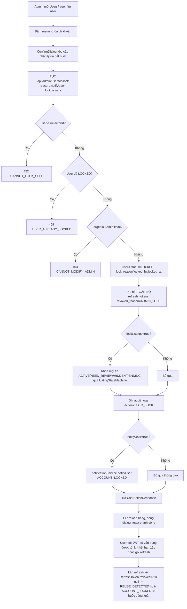

### 5. Dữ liệu chạy như thế nào

`LockUserRequest{reason,notifyUser?,lockListings?}` → FE `ConfirmDialog` (`requireReason`) validate reason không rỗng phía client → `PUT /api/admin/users/{id}/lock` → BE `@Valid` kiểm `@Size(min=10,max=500)` → `AdminUserServiceImpl.lockUser()`: đọc `User` entity (`getAliveUser`), kiểm ràng buộc nghiệp vụ (không tự khóa, không khóa Admin khác) → ghi trực tiếp field trên entity `User` (JPA dirty checking, `userRepository.save()`) → gọi `revokeSessions()` (lặp `RefreshTokenRepository.findByUser_IdAndDeletedAtIsNull`, set `revokedAt`/`revokedReason` từng token) → nếu `lockListings` thì gọi `listingRepository.findAll(Specification)` + `ListingStateMachine.transition()` cho từng tin (state machine đảm bảo chuyển trạng thái hợp lệ, không set thẳng enum) → `auditLogService.recordChange()` ghi JSON `old_value`/`new_value` (trạng thái trước/sau) vào `audit_logs` → `notificationService.notifyUser()` (Module 3) → build `UserActionResponse` (đếm `lockedListingCount`, `revokedSessionCount`, `auditLogId`) → FE nhận, `reload()` bảng qua `usePagedResource`.

### 6. Database liên quan

| Bảng | Quan hệ | Field quan trọng |
|---|---|---|
| `users` | (đã mô tả Module 1) | Các field ghi bởi module này: `status`, `lock_reason`, `locked_by`, `locked_at` |
| `landlord_profiles` | (đã mô tả Module 2) | Các field ghi bởi module này: `verification_status`, `verified_at/verified_by/verification_note`, `posting_restricted_until`, `restrict_reason` |
| `refresh_tokens` | (đã mô tả Module 1) | Ghi `revoked_at`/`revoked_reason` (`ADMIN_LOCK`, `ROLE_CHANGE`) khi Admin thao tác |
| `audit_logs` | N-1 tùy chọn `users` (actor, SET NULL) | Append-only; `action` (12 giá trị CHECK ở V1, mở rộng ở V11/V12 lên 20 giá trị: thêm `LANDLORD_VERIFY/UNVERIFY`, `LISTING_HIDE/UNHIDE`, `COMMENT_HIDE/UNHIDE/SPAM`, `REVIEW_HIDE/UNHIDE`), `target_type`, `target_id`, `target_label`, `old_value`/`new_value` (JSON), `reason`, `ip_address`, `user_agent`, `request_id` |
| `system_configs` | Độc lập (lookup, dùng cho `page.about`/`page.terms` + hàng trăm ngưỡng khác) | `config_key` UNIQUE, `config_value`, `default_value`, `value_type` (`STRING/INT/DECIMAL/BOOLEAN/JSON`), `group_name`, `is_editable` |
| `roles` | (đã mô tả Module 1) | Module này GHI `users.role_id` khi `updateRole` |

### 7. API liên quan

| Method | URL | Request | Response | Auth | Permission | Error chính |
|---|---|---|---|---|---|---|
| GET | `/api/admin/dashboard` | — | `DashboardResponse` (10 nhóm: users, listings, reports, revenue, payments, aiAlerts, topProvinces, topCategories + `generatedAt`) | Bearer | `STATISTIC_VIEW` | — |
| GET | `/api/admin/statistics` | `from?,to?,granularity=DAY` | `StatisticsResponse{series,totals,rates}` | Bearer | `STATISTIC_VIEW` | — |
| GET | `/api/admin/statistics/revenue` | `from?,to?,granularity=DAY` | `RevenueStatisticsResponse` (theo ngày/tháng + phân rã theo gói dịch vụ) | Bearer | `STATISTIC_VIEW` | — |
| GET | `/api/admin/users` | `keyword?,role[]?,status[]?,verified?,from?,to?`, `Pageable` (default sort `createdAt,DESC`) | `PageResponse<AdminUserResponse>` | Bearer | `USER_MANAGE` | — |
| GET | `/api/admin/users/{id}` | — | `AdminUserDetailResponse` | Bearer | `USER_MANAGE` | `USER_NOT_FOUND` |
| PUT | `/api/admin/users/{id}/lock` | `LockUserRequest{reason,notifyUser?,lockListings?}` | `UserActionResponse` | Bearer | `USER_MANAGE` | `LOCK_REASON_REQUIRED`, `CANNOT_LOCK_SELF`, `USER_ALREADY_LOCKED`(409), `CANNOT_MODIFY_ADMIN`(403) |
| PUT | `/api/admin/users/{id}/unlock` | `UnlockUserRequest{reason?,unlockListings?}` | `UserActionResponse` | Bearer | `USER_MANAGE` | `USER_ALREADY_ACTIVE`(409), `CANNOT_MODIFY_ADMIN` |
| PUT | `/api/admin/users/{id}/role` | `UpdateRoleRequest{role,reason}` | `UserActionResponse{previousRole,role,...}` | Bearer | `USER_ROLE_ASSIGN` | `ROLE_ASSIGN_INVALID`, `CANNOT_MODIFY_ADMIN`, `ROLE_NOT_FOUND` |
| GET | `/api/admin/landlords` | `keyword?,verificationStatus[]?,minTrustScore?,maxTrustScore?,postingSuspended?`, `Pageable` (whitelist sort, mặc định `trustScore,ASC`, size ≤100) | `PageResponse<AdminLandlordResponse>` | Bearer | `LANDLORD_VERIFY` | `INVALID_SORT_FIELD` |
| PUT | `/api/admin/landlords/{id}/verify` | `VerifyLandlordRequest{note?}` (body tùy chọn) | `LandlordVerificationActionResponse` | Bearer | `LANDLORD_VERIFY` | `LANDLORD_ALREADY_VERIFIED`(409) |
| PUT | `/api/admin/landlords/{id}/unverify` | `UnverifyLandlordRequest{reason}` | `LandlordVerificationActionResponse` | Bearer | `LANDLORD_VERIFY` | `LANDLORD_NOT_VERIFIED`(409, thực chất trạng thái ≠ VERIFIED) |
| PUT | `/api/admin/landlords/{id}/reject-verification` | `RejectLandlordVerificationRequest{reason}` | `LandlordVerificationActionResponse` | Bearer | `LANDLORD_VERIFY` | `LANDLORD_ALREADY_VERIFIED`, `VALIDATION_FAILED` (đã REJECTED) |
| PUT | `/api/admin/landlords/{id}/restrict-posting` | `RestrictLandlordPostingRequest{restrictedUntil,reason}` | `LandlordPostingRestrictionResponse` | Bearer | `LANDLORD_VERIFY` HOẶC `USER_MANAGE` | `VALIDATION_FAILED` (thời điểm không ở tương lai) |
| GET | `/api/admin/audit-logs` | `action[]?,actorId?,targetType?,targetId?,from?,to?`, `Pageable` | `PageResponse<AuditLogResponse>` | Bearer | `AUDIT_LOG_VIEW` | `AUDIT_LOG_RANGE_TOO_LARGE` (>90 ngày) |
| GET | `/api/content/about` | — | `StaticPageResponse{key,content}` | **Public** | — | — |
| GET | `/api/content/terms` | — | `StaticPageResponse{key,content}` | **Public** | — | — |

### 8. Dependency

**Phụ thuộc vào:** Module 1 (`RefreshTokenRepository` để thu hồi phiên), Module 2 (`LandlordProfileRepository`, `UserProfileRepository`), Module 3 (`NotificationService`), `ListingRepository`/`ListingStateMachine` (module listing — khóa/mở tin kèm khóa user), `TrustScoreService`, `AuditLogService` (dùng chung bởi rất nhiều module khác qua interface, không chỉ Module 5), `SystemConfigService` (cache config, dùng bởi TOÀN hệ thống), `AdminPaymentMetricsRepository`/`AdminUserRoleMetricsRepository`/`SentimentResultRepository`/`ProvinceRepository`/`CategoryRepository` (cho Dashboard).

**Module khác phụ thuộc vào nó:**
- `ModerationAuditGatewayAdapter`, `PaymentAuditGatewayAdapter` (module admin) — expose `AuditGateway` SPI cho module Moderation (Module 4) và Payment ghi audit log mà không đụng trực tiếp `AuditLogRepository`.
- FE: mọi trang trong `pages/admin/*` phụ thuộc `adminApi.js` (client duy nhất gọi các endpoint này) và `AdminDataTable`/`AdminPageHeader`/`ConfirmDialog`/`usePagedResource` (component/hook dùng chung toàn khu Admin — nếu 1 trong các component chung này lỗi, ảnh hưởng DÂY CHUYỀN toàn bộ trang admin, không riêng module Người 1).
- `PublicContentController` được `AboutPage`/`TermsPage` "lẽ ra" phải phụ thuộc (xem gap ở mục 2/11).

### 9. Các trường hợp cần kiểm tra

- □ Dashboard: gọi khi hệ thống trống dữ liệu (0 user, 0 tin) — không lỗi chia 0 ở `growthPercent`/tỷ lệ %.
- □ Dashboard: số liệu `newToday/newThisWeek/newThisMonth` đúng theo mốc UTC (kiểm tra timezone — code dùng `LocalDate.now(ZoneOffset.UTC)`, cần test gần nửa đêm để chắc không lệch múi giờ VN).
- □ Statistics/Revenue: khoảng ngày `from > to` (đảo ngược) — kiểm hành vi (có validate không hay ra kết quả rỗng/lỗi âm thầm).
- □ Statistics: `granularity` không hợp lệ (giá trị lạ ngoài DAY/WEEK/MONTH).
- □ Khóa tài khoản: thiếu `reason` / `reason` <10 ký tự → 400; tự khóa mình → 422; khóa Admin khác → 403; khóa user đã LOCKED → 409.
- □ Khóa kèm `lockListings=true` khi user không có tin nào → `lockedListingCount=0`, không lỗi.
- □ Mở khóa user đang `PENDING_VERIFY` (chưa từng ACTIVE) — không áp dụng được vì chỉ mở khóa từ LOCKED; test mở khóa đúng luồng LOCKED→ACTIVE (đã verify email) và LOCKED→PENDING_VERIFY (chưa verify email).
- □ Đổi vai trò: gỡ hết vai trò (rỗng) → 400; tự gỡ ADMIN của chính mình → 400; đổi vai trò user khác đang là Admin → 403; cấp LANDLORD cho user chưa có hồ sơ chủ trọ → tự tạo hồ sơ (`landlordProfileCreated=true`).
- □ Đổi vai trò xong, kiểm tra JWT cũ của user đó KHÔNG còn dùng được (phải refresh mới có quyền mới) — test tích hợp xuyên Module 1.
- □ Xác thực chủ trọ: verify user chưa từng có `landlord_profiles` → 404 `LANDLORD_PROFILE_NOT_FOUND`; verify user không có role LANDLORD → `TARGET_NOT_LANDLORD`; verify 2 lần → 409.
- □ Unverify khi đang PENDING (chưa từng verify) → 409 `LANDLORD_NOT_VERIFIED`.
- □ Reject khi đã VERIFIED → phải bị chặn (phải dùng unverify); reject 2 lần liên tiếp → lần 2 bị chặn (`VALIDATION_FAILED`).
- □ Restrict posting với `restrictedUntil` ở quá khứ/hiện tại → 400.
- □ Danh sách chủ trọ: sort theo field không có trong whitelist (ví dụ `email`) → 400 `INVALID_SORT_FIELD`; `size=500` (vượt 100) → tự động cắt về 100 (kiểm không lỗi, chỉ giới hạn âm thầm).
- □ Audit Log: khoảng ngày >90 ngày → 400; filter theo `action` không tồn tại trong enum; filter `targetId` không có bản ghi nào → trả rỗng, không lỗi.
- □ Audit Log: xác nhận KHÔNG có bất kỳ cách nào (API) để sửa/xóa 1 bản ghi audit — thử gọi thẳng `DELETE /api/admin/audit-logs/{id}` bằng Postman → phải `404`/`405` (route không tồn tại).
- □ `GET /api/content/about|terms` khi `system_configs` chưa seed giá trị (rỗng) — không lỗi 500, trả content rỗng hợp lý.
- □ **Kiểm tra thủ công**: sửa `page.about` qua `PUT /api/admin/system-configs`, sau đó load `/gioi-thieu` trên FE → xác nhận nội dung có đổi hay KHÔNG (dự đoán: KHÔNG đổi, xem mục 11) — đây là test case QUAN TRỌNG NHẤT cần chạy để xác nhận bug.

### 10. Các lỗi dễ gặp

- **[BUG NGHI VẤN — MỨC ĐỘ CAO] Trang Giới thiệu/Điều khoản không đọc dữ liệu từ CMS**: `AboutPage.jsx`/`TermsPage.jsx` render `SECTIONS` hardcode trong source, KHÔNG gọi `catalogApi.getAboutContent()`/`getTermsContent()` dù API và client function đã có sẵn đầy đủ ở cả BE lẫn FE. Hệ quả: Admin chỉnh sửa nội dung qua `SystemConfigPage` (`page.about`/`page.terms`) sẽ KHÔNG có tác dụng gì trên trang công khai — đây là tính năng "nửa vời" (backend done, frontend chưa wire) rất dễ bị Product Owner phát hiện khi UAT và tưởng là bug nghiêm trọng của cả 2 phía.
- **Nhầm lẫn giữa "khóa tài khoản" và "hạn chế đăng tin"**: 2 khái niệm HOÀN TOÀN khác nhau trong code — khóa tài khoản (`users.status=LOCKED`, không đăng nhập được) vs hạn chế đăng tin (`landlord_profiles.posting_restricted_until`, vẫn đăng nhập/dùng site bình thường, chỉ không tạo được tin MỚI). Test dễ nhầm 2 luồng này với nhau khi viết test case.
- **`updateRoles` là THAY THẾ TOÀN BỘ, không phải thêm/bớt**: nếu FE/tester gửi `roles=["ROLE_LANDLORD"]` cho user đang có `["ROLE_TENANT","ROLE_LANDLORD","ROLE_MODERATOR"]` thì `ROLE_MODERATOR` sẽ bị GỠ (chỉ giữ lại LANDLORD + tự thêm TENANT) — rất dễ vô tình tước quyền nếu FE không load đúng roles hiện tại trước khi mở dialog sửa (code `UsersPage.jsx` đã có `setRoleSelection(activeUser?.roles || [])` trước khi mở dialog — đúng, nhưng cần test kỹ trường hợp danh sách user bị stale/cache cũ).
- **Dashboard tính real-time, không cache/snapshot**: nếu dữ liệu (`users`, `listings`, `reports`) lớn, mỗi lần load Dashboard sẽ chạy hàng chục query COUNT — dễ bị chậm dần theo thời gian mà không có cảnh báo sớm (không có test hiệu năng tự động).
- **`restrict-posting` chấp nhận 2 quyền khác nhau** (`LANDLORD_VERIFY` hoặc `USER_MANAGE`) — dễ quên khi viết test phân quyền chỉ test 1 trong 2 quyền rồi kết luận sai là "endpoint yêu cầu cả 2".

### 11. Các điểm cần review

- **[ƯU TIÊN CAO] Business/Integration**: xác nhận với PM/BE lead về gap "About/Terms không đọc CMS" nêu ở mục 10 — quyết định sửa FE để gọi đúng API, hoặc nếu đây là chủ ý tạm thời (nội dung tĩnh chưa cần CMS ở giai đoạn hiện tại) thì cần cập nhật comment trong code cho rõ ràng, tránh gây hiểu nhầm khi review lại sau này.
- **UX**: `LandlordsPage` filter trạng thái xác thực có tùy chọn `NONE` (chưa có `landlord_profiles`) nhưng cần xác nhận BE `verificationStatus` filter (kiểu `List<VerificationStatus>` enum) có thực sự hỗ trợ giá trị "NONE" hay đây là giá trị chỉ tồn tại phía FE (enum `VerificationStatus` chỉ có `PENDING/VERIFIED/REJECTED/EXPIRED`, không có `NONE`) — > Cần bổ sung theo source code (đọc `AdminLandlordSpecifications` để xác nhận).
- **API response**: `DashboardResponse`/`StatisticsResponse` là DTO khá lớn — nên rà soát field nào FE thực sự dùng (ví dụ `payments.pendingCount`/`refundedCount` có hiển thị ở `DashboardPage.jsx` không) để tránh over-fetching không cần thiết.
- **Security**: `PublicContentController` là API PUBLIC duy nhất trong toàn bộ phạm vi Module 5 — cần đảm bảo `SystemConfigService.getString()` không vô tình lộ các config KHÁC (không phải `page.about`/`page.terms`) qua endpoint này (đọc code hiện tại là an toàn vì chỉ nhận đúng 2 `ConfigKey` cố định, không nhận key tùy ý từ query param — nên giữ nguyên thiết kế này).
- **Audit trail đầy đủ**: xác nhận MỌI hành động ghi ở Module 5 đều có audit log tương ứng — qua rà soát code thấy `restrictLandlordPosting` ghi audit với `action=USER_LOCK` (tái sử dụng action code có sẵn thay vì tạo action riêng `LANDLORD_RESTRICT_POSTING`) — cân nhắc có nên tách action riêng để log rõ ràng hơn khi tra cứu Audit Log (hiện tại 2 hành động khác nhau về bản chất — khóa tài khoản và hạn chế đăng tin — lại chung 1 mã hành động trong audit, có thể gây khó khăn khi điều tra sự cố).
- **Performance**: xem xét thêm cache ngắn hạn (vài chục giây - vài phút) cho `GET /api/admin/dashboard` vì đây là trang được Admin mở lại NHIỀU LẦN trong ngày, số liệu không cần real-time tuyệt đối.

### 12. Kết quả mong đợi

- Toàn bộ 15 API ở mục 7 hoạt động đúng, đặc biệt các ràng buộc "không tự khóa mình", "không đụng Admin khác", "thu hồi phiên khi khóa/đổi quyền".
- Dashboard/Statistics trả số liệu chính xác, khớp với dữ liệu thật trong DB (đối chiếu bằng query SQL thủ công ít nhất 3 chỉ số).
- Audit Log ghi đầy đủ, chính xác, KHÔNG có endpoint nào cho phép sửa/xóa bản ghi.
- Xác nhận và báo cáo rõ ràng về gap "About/Terms không tích hợp CMS" cho team liên quan xử lý.
- Toàn bộ phân quyền (`STATISTIC_VIEW`, `USER_MANAGE`, `USER_ROLE_ASSIGN`, `LANDLORD_VERIFY`, `AUDIT_LOG_VIEW`) đúng theo chính sách role-only.

---

## Checklist tổng của Người 1

- □ Đọc source (BE + FE + migration) — đã hoàn thành cho cả 5 module, có trích dẫn đường dẫn file cụ thể.
- □ Chạy thử hệ thống thật (docker compose: MySQL + Redis + MailHog + backend + frontend) để xác nhận các luồng mô tả ở mục 4/5 mỗi module khớp hành vi thực tế.
- □ Test API bằng Postman/Swagger cho toàn bộ endpoint ở các bảng mục 7 (5 bảng, tổng ~55 endpoint) — đặc biệt các case lỗi (4xx) đã liệt kê ở mục 9 mỗi module.
- □ Test UI: chạy đủ luồng trên từng trang liệt kê ở mục 2 mỗi module, kiểm tra đồng bộ giữa hiển thị và dữ liệu DB thật.
- □ Kiểm tra DB: đối chiếu trực tiếp bằng SQL các bảng ở mục 6 mỗi module (đặc biệt `users`, `refresh_tokens`, `audit_logs`, `reports`, `notifications`) sau mỗi thao tác quan trọng.
- □ So sánh Business: đối chiếu với docs nghiệp vụ gốc (`docs/00_CANONICAL_DECISIONS.md`, `docs/03_THIET_KE_API.md`, `docs/04_...`) — lưu ý các điểm code đã CHỦ Ý lệch/mở rộng so với đề bài gốc đã ghi chú trong code (ví dụ `BannedKeywordScope` 3 giá trị thay vì 7, response `warnings` thực chất là bảng `violation_warnings`).
- □ Ghi Bug: ưu tiên xác nhận và ghi nhận bug **[About/Terms không đọc CMS]** (mục 11 Module 5) trước tiên vì mức độ ảnh hưởng cao và dễ tái hiện.
- □ Ghi Improvement: tổng hợp các điểm review đã liệt kê ở mục 11 từng module thành backlog cải tiến (bảo mật, hiệu năng, UX, naming).
- □ Tổng hợp báo cáo: gộp kết quả 5 module thành 1 báo cáo bàn giao, đính kèm bằng chứng test (screenshot Postman/DB query) cho từng bug tìm thấy.
- □ Riêng cụm này: xác nhận rõ với team liệu trang "Cảnh báo vi phạm" (Warnings) độc lập và trang "Cài đặt thông báo" (Notification Preferences) có thực sự bị thiếu ở FE hay nằm ở vị trí khác chưa được rà tới trong lượt đọc source này.


---

# Người 2 — Vòng đời Tin đăng, Tìm kiếm, Danh mục & AI Gợi ý/Định giá/Uy tín

> Tài liệu này được viết từ việc đọc trực tiếp source code thật (BE Spring Boot 3.3.5/Java 21, FE React 18 + MUI v5) tại thời điểm rà soát. Mọi tên field, endpoint, bảng DB đều lấy nguyên văn từ code — không suy đoán. Chỗ nào không xác định được sẽ ghi `> Cần bổ sung theo source code`.

> **Bối cảnh kỹ thuật chung**: Kiến trúc hexagonal theo module dưới `com.webtro.modules.*`; giao tiếp chéo module qua SPI gateway (`ListingGateway`, `ListingDataGateway`, `InteractionSignalGateway`...) và `ApplicationEvent` (`AFTER_COMMIT`). Mapper viết tay (KHÔNG MapStruct). Flyway `V1..V12`. Redis dùng cho cache/rate-limit/JWT blacklist. Envelope response chung `ApiResponse { success, message, data, errorCode, timestamp, path, traceId }`; phân trang `PageResponse { items, page, size, totalElements, totalPages, first, last }`. Phân quyền role-only: 4 vai trò, kiểm bằng `@PreAuthorize("hasRole/hasAnyRole")`. Phạm vi dữ liệu: chỉ Hà Nội (1 tỉnh, 12 quận, 62 phường) — do đó các trường `provinceId/districtId/wardId` trong thực tế sẽ ít biến thiên nhưng code vẫn tổng quát 3 cấp tỉnh/huyện/xã.

## Các module phụ trách

- **Module 1 — Listing lifecycle**: draft/submit/edit/hide/unhide/close/delete/renew/stats/images/amenities, `ListingStateMachine`, lưu trữ ảnh (`FileController`/`FileStorage`). Mã chức năng: LIST-01..12.
- **Module 2 — Search & Filter & Related**: tìm kiếm/lọc động tin đăng, tin liên quan. Mã chức năng: SRCH-01..09.
- **Module 3 — Catalog**: danh mục loại tin, tỉnh/huyện/xã, tiện ích + màn quản trị catalog. Mã chức năng: ADM-05, ADM-06, ADM-07.
- **Module 4 — AI khám phá**: Recommendation (gợi ý cá nhân hóa), Suggested (endpoint GET tiện dụng), Price Estimation (dự đoán giá), TrustScore (uy tín tin + uy tín chủ trọ). Mã chức năng: AI-02, AI-03, AI-04, AI-06.
- **Module 5 — Admin Listing & Moderation Queue**: quản lý tin đăng phía Admin, hàng đợi kiểm duyệt, duyệt/từ chối/ẩn/khóa/gắn cờ/yêu cầu sửa/kiểm duyệt hàng loạt. Mã chức năng: ADM-04 (+ nhánh RPT-01 khi `targetType = LISTING`, xem ghi chú ranh giới ở Module 5 mục 1 và mục 8).
- **Module 6 — Landlord Dashboard/Overview**: trang tổng quan hiệu quả tin đăng của chủ trọ.

> **Ghi chú chia sẻ**: `ListingDetailPage.jsx` (frontend_webtro/src/pages/public/ListingDetailPage.jsx) do Người 2 sở hữu phần **hiển thị thông tin tin đăng** (ảnh, đặc điểm, giá, địa chỉ, chủ trọ, trạng thái, tin liên quan, gợi ý). Phần **bình luận** (`commentApi`, `CommentThread`), **đánh giá** (`reviewApi`, `RatingStars`), **liên hệ/report** (`contactApi`, `reportApi`) trong CÙNG trang này do **Người 3** phụ trách (module Interaction/Moderation). Khi review file này, chỉ chấm phần UI đọc `listing.*` (title, price, area, images, amenities, landlord, trustScore, related) — bỏ qua khối comment/review/contact/report.

---

## Module: Listing lifecycle (Vòng đời tin đăng)

### 1. Module này dùng để làm gì?

Đây là module lõi của toàn hệ thống Webtro: mọi tin phòng trọ mà người thuê nhìn thấy trên Search/Home/Detail đều bắt nguồn từ đây. Module quản lý toàn bộ vòng đời một tin đăng — từ lúc chủ trọ tạo nháp (`DRAFT`) cho tới khi tin được duyệt hiển thị (`ACTIVE`), bị ẩn/khóa/hết hạn/đóng/xóa. Toàn bộ logic chuyển trạng thái được gom vào **một cổng duy nhất**: `ListingStateMachine` (`backend_webtro/src/main/java/com/webtro/modules/listing/statemachine/ListingStateMachine.java`) — không service nào được phép `setStatus()` trực tiếp ngoài cổng này.

Vai trò trong hệ thống:
- Là nguồn dữ liệu cho Search (Module 2), Recommendation/Price/TrustScore (Module 4), trang chủ, trang chi tiết, dashboard Admin (Module 5) và dashboard chủ trọ (Module 6).
- Là nơi áp toàn bộ luật nghiệp vụ chống spam/lạm dụng: quota đăng tin/ngày, khóa đăng khi bị cảnh báo, bắt buộc xác thực email, tối thiểu số ảnh, giới hạn upload.
- Là nơi phát sinh sự kiện (`ListingApprovedEvent`) để module Notification báo cho người theo dõi chủ trọ.

**Nếu module này hỏng thì ảnh hưởng gì?** Toàn bộ chuỗi giá trị của sản phẩm sập: không tạo được tin → không có gì để tìm kiếm/gợi ý/định giá; sai state machine → tin có thể "kẹt" ở trạng thái không đúng (vd tin bị khóa vẫn cho sửa, tin `REJECTED` không gửi lại được); sai điều kiện hiển thị công khai (`ListingVisibilityService`) → lộ tin riêng tư (DRAFT/PENDING) ra ngoài hoặc ngược lại ẩn nhầm tin `ACTIVE`.

### 2. Chức năng Frontend

| Màn hình / Component | File | Chức năng |
|---|---|---|
| Đăng tin mới | `frontend_webtro/src/pages/landlord/CreateListingPage.jsx` | Bọc `ListingWizard` với `mode="create"`. |
| Sửa tin | `frontend_webtro/src/pages/landlord/EditListingPage.jsx` | Tải chi tiết tin qua `listingApi.getDetail(id)`, map sang `initialData` rồi bọc `ListingWizard mode="edit"`. |
| Wizard đăng/sửa tin (form chính) | `frontend_webtro/src/components/listing/ListingWizard.jsx` (531 dòng) | Form nhiều bước (`Stepper` MUI) 6 bước: **Loại tin → Thông tin cơ bản → Địa chỉ → Giá & tiện ích → Hình ảnh → Xem lại**. Dùng `react-hook-form` (`Controller`), validate từng bước bằng `trigger(stepFields(step))` trước khi cho `Tiếp tục`. |
| Danh sách tin của tôi | `frontend_webtro/src/pages/landlord/MyListingsPage.jsx` | Bảng (`Table`) tin đăng + tab lọc theo trạng thái (`ToggleButtonGroup`), ô tìm theo tiêu đề, menu hành động theo tin (`availableActions` do BE trả), `TablePagination`. |
| Thống kê 1 tin | `frontend_webtro/src/pages/landlord/ListingStatsPage.jsx` | 4 `StatCard` (xem/lưu/liên hệ/đánh giá), `ChartCard` line-chart theo thời gian + doughnut cảm xúc bình luận, khối so sánh khu vực. |
| Component ảnh | `frontend_webtro/src/components/listing/ImageUploader.jsx` (326 dòng) | Chọn nhiều ảnh, preview, kéo-thả sắp thứ tự, đặt ảnh đại diện, giới hạn `maxFiles`/`maxSizeMb`. |
| Gallery ảnh (trang chi tiết) | `frontend_webtro/src/components/listing/ImageGallery.jsx` | Hiển thị ảnh lớn + thumbnail, điều hướng. |
| Thẻ tin (card) | `frontend_webtro/src/components/listing/ListingCard.jsx`, `ListingGrid.jsx` | Card hiển thị tin trong lưới kết quả (search/home/my-listings). |
| Badge uy tín | `frontend_webtro/src/components/listing/TrustScoreBadge.jsx` | Chip/Alert hiển thị điểm/nhãn uy tín theo 3 biến thể `badge|inline|alert`. |

**Giải thích chi tiết luồng form `ListingWizard`:**
- Bước 0 (Loại tin): chọn `categoryId` từ danh sách `catalogApi.getCategories({ activeOnly: true })`.
- Bước 1 (Thông tin cơ bản): `title`, `description` (đếm ký tự theo ngưỡng `configs['listing.title.max']`...), `maxOccupants`, và nếu là `ROOMMATE` thì thêm `currentOccupants` + `genderRequirement`; nếu category cần số phòng (`WHOLE_HOUSE/APARTMENT/MINI_APARTMENT`) thì bắt buộc `roomCount`.
- Bước 2 (Địa chỉ): `AddressSelector` 3 cấp tỉnh/huyện/xã lồng nhau qua `Controller` MUI + `addressDetail`.
- Bước 3 (Giá & tiện ích): `price`, `area`, `depositAmount`, `electricityPrice`, `waterPrice`; **khối "Giá AI đề xuất"** gọi `aiApi.predictPrice(...)` khi bấm "Tiếp tục" ở cuối bước này (`runPrediction()` được gọi trong `handleNext` khi `activeStep === 3`); tiện ích chọn theo nhóm (`Chip` multi-select).
- Bước 4 (Hình ảnh): `ImageUploader`.
- Bước 5 (Xem lại): `contactName`/`contactPhone` + `ReviewSummary` (tổng hợp read-only) + 2 nút **Lưu nháp** (`doSubmit(false)`) / **Gửi duyệt** (`doSubmit(true)`).
- `doSubmit`: gọi `listingApi.create`/`update` trước (lưu text fields), sau đó `uploadNewImages` (chỉ ảnh mới có `file`), rồi mới gọi `listingApi.submit(id)` nếu `submitImmediately` — tức là 2-3 HTTP request tuần tự cho một lần "Gửi duyệt".

### 3. Chức năng Backend

**Controller**: `ListingController` (`backend_webtro/src/main/java/com/webtro/modules/listing/controller/ListingController.java`) — chỉ nhận/trả DTO, ủy quyền toàn bộ nghiệp vụ cho `ListingService`; permission qua `@PreAuthorize`, quyền sở hữu (owner check) nằm trong service.

**Service**: `ListingServiceImpl` (`.../listing/service/impl/ListingServiceImpl.java`, 1254 dòng) — cài `ListingService`. Ngoài ra:
- `TrustScoreServiceImpl` — tính điểm uy tín tin/chủ trọ (chi tiết ở Module 4).
- `ListingVisibilityServiceImpl` — quyết định tập trạng thái công khai (`publicStatuses()` mặc định chỉ `ACTIVE`, cộng thêm `NEED_REVIEW` nếu config `listing.need_review.publicly_visible = true`).

**State machine**: `ListingStateMachine` + enum `ListingEvent` (16 sự kiện: `SAVE_DRAFT, SUBMIT, APPROVE, REJECT, HIDE_BY_OWNER, UNHIDE_BY_OWNER, AUTO_HIDE_BY_SYSTEM, UNHIDE_BY_MODERATOR, CLOSE, EXPIRE, FLAG_NEED_REVIEW, CLEAR_NEED_REVIEW, LOCK, UNLOCK, RENEW, SOFT_DELETE, RESUBMIT_AFTER_EDIT`). Bảng luật `Map<ListingEvent, Rule(from-states, to-state)>` khai báo tường minh; sai luật → `BusinessRuleException(LISTING_INVALID_TRANSITION)` (422).

**Repository**: `ListingRepository` (`JpaRepository` + `JpaSpecificationExecutor`), `ListingImageRepository`, `ListingAmenityRepository`. Không dùng `@SQLRestriction` cho xóa mềm — mọi truy vấn công khai/chủ sở hữu bắt buộc qua `findAliveById` (có `deletedAt IS NULL`); `findAnyById` chỉ dành cho Admin/Moderator (`LISTING_VIEW_ANY`).

**Validation** (đọc ngưỡng động từ `SystemConfigService`, KHÔNG hardcode):
- Độ dài tiêu đề/mô tả: `listing.title.min/max`, `listing.description.min/max`.
- Số ảnh: `listing.image.min/max`, kích thước tối đa `listing.image.max_size_mb`.
- Quota đăng tin/ngày: `spam.listing.daily` — **một ngưỡng duy nhất cho mọi người dùng** (v3). Ngưỡng riêng cho tài khoản mới đã bỏ vì làm hai chủ trọ cùng vai trò có mức sử dụng khác nhau.
- Renew miễn phí/tháng: `listing.renew_free_per_month`.
- Ngưỡng cảnh báo cảm xúc để tính `flagged` trong thống kê: `ai.sentiment.negative_ratio_l1`, `ai.sentiment.min_comments_l1`.
- Bean Validation (`jakarta.validation`) trên DTO request cho các ràng buộc biên "hiển nhiên" (vd `price > 0`, `latitude` trong 8–24 — biên lãnh thổ VN).

**Business logic đáng chú ý**:
- **Ảnh hợp lệ kiểm bằng magic bytes** (`isAllowedImage`) — đọc 12 byte đầu để nhận diện JPG/PNG/WEBP thật, KHÔNG tin `Content-Type` client gửi (chống upload file thực thi đổi đuôi).
- **Slug tự sinh & chống trùng** (`uniqueSlug`/`uniqueSlugKeepingSelf`) dựa trên `SlugUtil.toSlug(title)`, thêm hậu tố `-2`, `-3`... nếu trùng.
- **Phát hiện thay đổi field nhạy cảm** (`detect`): khi `update()`, so từng field cũ/mới, đánh dấu field nào là "nhạy cảm" (`title, description, price, provinceId, districtId, wardId, addressDetail`) → nếu tin đang `ACTIVE` và có field nhạy cảm đổi → tự động chuyển về `PENDING` (`RESUBMIT_AFTER_EDIT`) để duyệt lại. Field không nhạy cảm (`categoryId, area, maxOccupants`) đổi thì giữ nguyên trạng thái. Không còn ghi bảng lịch sử chỉnh sửa riêng.
- ~~**Auto-approve** (`canAutoApprove`)~~ — **đã bỏ ở v3**. Mọi tin gửi duyệt đều vào `PENDING`, không có luồng tự duyệt theo uy tín/xác minh nữa (hai chủ trọ cùng vai trò phải đi cùng một luồng). Kéo theo `ListingActionResponse.autoApproved` và config `listing.auto_approve.trusted_landlord` cũng đã bỏ.
- **Rate limit** (`RateLimitService` + Redis): `listing-submit` tối đa 20 lần/ngày/user, `listing-renew` tối đa 10 lần/ngày, `listing-image-upload` tối đa 50 lần/giờ.
- **Đếm view có khử trùng lặp** (`maybeCountView`): key Redis `view:dedup:{listingId}:{u:userId|ip:hash}`, TTL theo `view.dedup_minutes`; **fail-open** — nếu Redis lỗi vẫn cộng 1 view (không chặn UX).
- **Gia hạn (`renew`)**: có lượt miễn phí/tháng (`freeRenewUsedThisMonth` trên `LandlordProfile`, reset khi sang tháng mới); hết lượt miễn phí hoặc chọn `packageId` → trả về `paymentRequired=true` kèm danh sách gói (KHÔNG lỗi, HTTP 200) để FE điều hướng sang thanh toán.

**Cron/Job liên quan** (đặt tại `backend_webtro/src/main/java/com/webtro/scheduler/`):
| Job | Lịch (cron, UTC) | Việc làm |
|---|---|---|
| `ListingExpiryJob` | `0 10 * * * *` (mỗi giờ, phút 10) | `ACTIVE/NEED_REVIEW` quá `expiredAt` → `EXPIRE` qua state machine, báo `LISTING_EXPIRED`. Idempotent, mỗi tin 1 transaction riêng, tối đa 2000 tin/lần chạy. |
| `ListingExpiryReminderJob` | `0 0 8 * * *` (08:00 UTC/ngày) | Nhắc trước hạn theo `listing.expiry_reminder_days` (mặc định `"3,1"`); chống gửi trùng bằng cột `expiry_reminder_sent_at`. |
| `TrustScoreRecalcJob` | `0 0 2 * * *` (02:00 UTC/ngày) | Tính lại `trust_score` từng tin `ACTIVE/NEED_REVIEW`, sau đó tính điểm chủ trọ (AVG các tin còn hiệu lực). Xem Module 4. |

**Event**: `ListingApprovedEvent(listingId, ownerId)` — publish khi tin được duyệt (tự động hoặc bởi Admin) để module Notification báo người theo dõi chủ trọ.

**Cache**: Module này **không dùng `@Cacheable`** trực tiếp trên `Listing` (dữ liệu biến động cao); chỉ dùng Redis cho rate-limit và dedup view.

### 4. Luồng hoạt động

**Luồng đăng tin → duyệt → hiển thị** (chữ số = bước):

1. Chủ trọ điền wizard 6 bước ở FE → bấm "Lưu nháp" hoặc "Gửi duyệt".
2. FE gọi `POST /api/listings` (`create`) — luôn tạo ở `DRAFT` bất kể có `submitImmediately` hay không (tạo trước, submit sau trong cùng service method nếu cờ bật).
3. Service validate danh mục còn active, địa chỉ đúng phân cấp tỉnh→huyện→xã, tiện ích còn active, độ dài tiêu đề/mô tả theo config, quota đăng/ngày, tài khoản không bị khóa đăng.
4. FE upload ảnh (`POST /api/listings/{id}/images`, multipart).
5. Nếu `submitImmediately=true`, service tự gọi `submit(id)` nội bộ: kiểm đủ ảnh tối thiểu, email đã xác thực, không bị khóa đăng, rate-limit submit → chuyển `DRAFT/REJECTED → PENDING`.
6. Kiểm `canAutoApprove` — nếu đạt điều kiện tin tự chuyển `PENDING → ACTIVE` ngay (đặt `publishedAt`, `expiredAt`), phát `ListingApprovedEvent`; nếu không đạt, tin nằm ở `PENDING` chờ Admin (xem Module 5).
7. Admin duyệt/từ chối (Module 5) → `ACTIVE` hoặc `REJECTED`.
8. Tin `ACTIVE` xuất hiện trong Search/Home/Recommendation (Module 2, 4).
9. Job nền: `TrustScoreRecalcJob` cập nhật điểm mỗi ngày; `ListingExpiryReminderJob`/`ListingExpiryJob` quản lý vòng đời hết hạn.

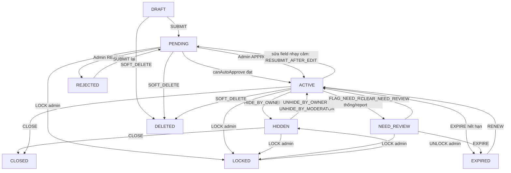

> **Note quan trọng**: `LOCKED` là trạng thái "bất khả xâm phạm" — không cho `SUBMIT/RENEW/SOFT_DELETE/sửa` (đều ném lỗi tương ứng: `LISTING_LOCKED_CANNOT_SUBMIT/RENEW/DELETE/EDIT`); chỉ Admin `UNLOCK` mới đưa tin về `HIDDEN` (không thẳng về `ACTIVE`) — chủ trọ phải tự bấm "Hiện lại" sau khi đã khắc phục.

### 5. Dữ liệu chạy như thế nào

Ví dụ luồng **tạo tin** (Input → FE → API → BE validate → business logic → DB → response → FE update):

1. **Input**: người dùng nhập trong `ListingWizard` (React Hook Form state).
2. **FE xử lý**: `buildPayload(submitImmediately)` ép kiểu số (`Number(v.price)`), format ngày (`dayjs(...).format('YYYY-MM-DD')`), lọc field rỗng thành `undefined`.
3. **API request**: `POST /api/listings` với body JSON đúng field `ListingCreateRequest` (categoryId, title, description, price, area, provinceId/districtId/wardId, addressDetail, amenityIds, contactName, contactPhone, submitImmediately...).
4. **BE validate**: Bean Validation (`@NotNull/@Size/@DecimalMin`...) chạy trước khi vào controller method; sau đó `ListingServiceImpl.create()` validate nghiệp vụ (category active, địa chỉ đúng phân cấp, tiện ích active, độ dài theo config, quota).
5. **Business logic**: build entity `Listing` (builder), gán `status=DRAFT`, `ownerId` từ `SecurityUtils.getCurrentUserId()`; `HtmlSanitizer.stripAllHtml` cho `title/description/addressDetail` (chống XSS lưu trữ); sinh `slug` duy nhất.
6. **DB**: `listingRepository.save(listing)` (INSERT `listings`), `replaceAmenities` (INSERT `listing_amenities`).
7. **Response**: map sang `ListingCreateResponse` (id, slug, title, status, price, area, imageCount, createdAt, expectedExpiredAt, displayDays, nextSteps[]) — KHÔNG trả entity thô.
8. **FE update**: nhận `created.id`, gọi tiếp `uploadNewImages(id)`, rồi (tùy `submitImmediately`) gọi `listingApi.submit(id)`, cuối cùng `onDone?.(id)` điều hướng về `/quan-ly/tin-dang`.

**DTO chính**: Request — `ListingCreateRequest`, `ListingUpdateRequest`, `CloseListingRequest`, `RenewListingRequest`, `AmenityUpdateRequest`, `ImageOrderRequest`. Response — `ListingCreateResponse`, `ListingDetailResponse`, `ListingSummaryResponse` (dùng chung cho Search/Related/MyListings), `ListingActionResponse` (submit/hide/unhide/close), `RenewResponse`, `ListingStatsResponse`, `ImageUploadResponse`, `ModerationImpactResponse`.

### 6. Database liên quan

| Bảng | Vai trò | Quan hệ | Field quan trọng |
|---|---|---|---|
| `listings` | Bảng nghiệp vụ chính (audit + soft-delete) | N-1 tới `users` (owner_id), `categories`, `provinces`, `districts`, `wards`; 1-N tới `listing_images`, `listing_amenities` | `status` (10 giá trị, CHECK constraint), `slug` (UNIQUE), `trust_score` (DECIMAL 5,2, mặc định 100.00), `price_deviation_flag`, `price_prediction_id` (FK mềm sang `prediction_histories`, chỉ giữ Long), `view_count/favorite_count/contact_count/comment_count/positive_comment_count/negative_comment_count/need_review_count` (bộ đếm denormalized), `published_at/expired_at/expiry_reminder_sent_at`, `renew_count`, `is_promoted/promoted_until/promotion_priority`, `auto_hidden_at/auto_hide_reason`, `lock_reason/lock_severity` |
| `listing_images` | 1-N với `listings` (CASCADE khi xóa listing) | `listing_id` FK | `is_primary`, `display_order`, `file_size` (CHECK 0 < size ≤ 5MB), `content_type` (CHECK IN jpeg/png/webp) |
| `listing_amenities` | Bảng nối N-N `listings` ↔ `amenities` | UNIQUE (`listing_id`, `amenity_id`) | `amenity_id` chỉ giữ Long (không FK object) theo luật "canonical 8" — tránh phụ thuộc ngược sang module catalog |

> **Note quan trọng**: `listings` có **12 index** phục vụ riêng cho tìm kiếm/kiểm duyệt/job (`idx_listings_search`, `idx_listings_promoted_sort`, `idx_listings_status_price`, `idx_listings_status_expired_at`, `idx_listings_price_deviation_flag`...) — bảng CHECK constraint rất chặt (`ck_listings_reject_reason`: nếu `status='REJECTED'` bắt buộc có `reject_reason`; `ck_listings_lock_reason`: nếu `LOCKED` bắt buộc có `lock_reason` + `lock_severity`) — đây là ràng buộc **ở tầng DB**, không chỉ ở code, nên dữ liệu rác từ script/migration thủ công cũng bị chặn.

### 7. API liên quan

| Method | URL | Request | Response | Auth | Permission | Validation | Error tiêu biểu |
|---|---|---|---|---|---|---|---|
| POST | `/api/listings` | `ListingCreateRequest` | `ApiResponse<ListingCreateResponse>` (201) | Bắt buộc | `LISTING_CREATE` | Bean Validation + nghiệp vụ (category/địa chỉ/tiện ích/độ dài/quota) | `CATEGORY_NOT_FOUND`, `AREA_NOT_SUPPORTED`, `ADDRESS_HIERARCHY_MISMATCH`, `AMENITY_NOT_FOUND`, `INVALID_TITLE_LENGTH`, `INVALID_DESCRIPTION_LENGTH`, `INVALID_AVAILABLE_FROM`, `ROOMMATE_INFO_REQUIRED`, `LISTING_QUOTA_DAILY`, `LISTING_POSTING_SUSPENDED` |
| PUT | `/api/listings/{id}` | `ListingUpdateRequest` | `ApiResponse<ListingDetailResponse>` (kèm `moderationImpact`) | Bắt buộc | `LISTING_UPDATE_OWN` hoặc `LISTING_UPDATE_ANY` | như trên | `LISTING_NOT_FOUND`, `LISTING_FORBIDDEN`, `LISTING_LOCKED_CANNOT_EDIT` |
| DELETE | `/api/listings/{id}` | — | 204 No Content | Bắt buộc | `LISTING_UPDATE_OWN`/`LISTING_UPDATE_ANY` | trạng thái ≠ `LOCKED` | `LISTING_LOCKED_CANNOT_DELETE`, `LISTING_INVALID_TRANSITION` |
| POST | `/api/listings/{id}/submit` | — | `ApiResponse<ListingActionResponse>` | Bắt buộc | `LISTING_UPDATE_OWN` | đủ ảnh min, email verified, không bị suspend, rate-limit 20/ngày | `IMAGE_COUNT_MIN`, `LANDLORD_NOT_VERIFIED`, `LISTING_POSTING_SUSPENDED`, `LISTING_LOCKED_CANNOT_SUBMIT`, `LISTING_INVALID_TRANSITION` |
| POST | `/api/listings/{id}/hide` | — | `ApiResponse<ListingActionResponse>` | Bắt buộc | `LISTING_UPDATE_OWN` | trạng thái đang không `HIDDEN` | `LISTING_ALREADY_HIDDEN` |
| POST | `/api/listings/{id}/unhide` | — | `ApiResponse<ListingActionResponse>` | Bắt buộc | `LISTING_UPDATE_OWN` | chưa hết hạn | `LISTING_ALREADY_EXPIRED` |
| POST | `/api/listings/{id}/close` | `CloseListingRequest{reason}` | `ApiResponse<ListingActionResponse>` | Bắt buộc | `LISTING_UPDATE_OWN` | reason bắt buộc (enum) | `LISTING_ALREADY_CLOSED` |
| POST | `/api/listings/{id}/renew` | `RenewListingRequest?{packageId?}` | `ApiResponse<RenewResponse>` | Bắt buộc | `LISTING_UPDATE_OWN` | rate-limit 10/ngày | `LISTING_LOCKED_CANNOT_RENEW`, `LISTING_REJECTED_MUST_EDIT`, `PACKAGE_NOT_FOUND`, `PACKAGE_INACTIVE` |
| GET | `/api/listings/{id}` | query `countView` | `ApiResponse<ListingDetailResponse>` | Tùy chọn | — (public nếu tin công khai) | — | `LISTING_NOT_FOUND` (kể cả khi tin tồn tại nhưng không công khai — **không tiết lộ tồn tại**) |
| GET | `/api/listings/my` | query `status[], keyword, categoryId, expiringWithinDays` + `Pageable` | `ApiResponse<PageResponse<ListingSummaryResponse>>` | Bắt buộc | `LISTING_CREATE` | — | — |
| GET | `/api/listings/{id}/stats` | query `from, to` | `ApiResponse<ListingStatsResponse>` | Bắt buộc | `LISTING_UPDATE_OWN` hoặc `STATISTIC_VIEW` | `to >= from` | `LISTING_FORBIDDEN`, `STATISTIC_RANGE_INVALID` |
| POST | `/api/listings/{id}/images` (multipart) | `files[]`, `setPrimaryIndex?` | `ApiResponse<ImageUploadResponse>` (201) | Bắt buộc | `LISTING_UPDATE_OWN`/`LISTING_UPDATE_ANY` | magic-bytes JPG/PNG/WEBP, ≤ max size, ≤ max count, rate-limit 50/giờ | `IMAGE_COUNT_MIN/MAX`, `IMAGE_TOO_LARGE`, `IMAGE_INVALID_FORMAT`, `LISTING_LOCKED_CANNOT_EDIT` |
| DELETE | `/api/listings/{id}/images/{imageId}` | query `newPrimaryImageId?` | 204 | Bắt buộc | như trên | còn ≥ min ảnh nếu tin công khai; cần `newPrimaryImageId` nếu xóa ảnh đại diện còn ảnh khác | `IMAGE_COUNT_MIN`, `PRIMARY_IMAGE_REQUIRED`, `IMAGE_NOT_FOUND` |
| PUT | `/api/listings/{id}/images/{imageId}/primary` | — | `ApiResponse<ModerationImpactResponse>` | Bắt buộc | như trên | — | `IMAGE_NOT_FOUND` |
| PUT | `/api/listings/{id}/images/order` | `ImageOrderRequest{imageIds[]}` | `ApiResponse<List<ListingImageResponseOrder>>` | Bắt buộc | như trên | tập `imageIds` phải khớp đúng & đủ ảnh hiện có | `VALIDATION_FAILED` |
| PUT | `/api/listings/{id}/amenities` | `AmenityUpdateRequest{amenityIds[]}` | `ApiResponse<List<ListingAmenityResponse>>` | Bắt buộc | như trên | tiện ích còn active | `AMENITY_NOT_FOUND` |
| GET | `/api/files/**` | path = key ảnh | ảnh JPEG binary | Public | — | chặn path traversal trong `FileStorage.read` | 404 nếu key không tồn tại |

> Ghi chú: `GET /api/listings/{id}/related` (SRCH-09) và `GET /api/listings/suggested` (AI-04) tuy nằm dưới path `/api/listings/**` nhưng được cài đặt ở `ListingSearchController`/`SuggestedListingController` (module `search`/`ai`) để tránh phụ thuộc ngược — xem Module 2 và Module 4.

### 8. Dependency

**Module này phụ thuộc vào**:
- `catalog` (category/province/district/ward/amenity — validate & đọc tên hiển thị).
- `user` (`UserRepository`, `LandlordProfileRepository` — email verified, quota, free renew, posting suspended).
- `payment` (`PromotionPackageRepository` — danh sách gói khi renew cần trả phí).
- `notification` (`NotificationService` — báo duyệt/hết hạn/sắp hết hạn).
- `admin` (`SystemConfigService` — mọi ngưỡng động).
- Hạ tầng: `FileStorage` (lưu ảnh), `RateLimitService` + Redis, `HtmlSanitizer`, `SlugUtil`.

**Module đang phụ thuộc vào nó** (qua SPI/gateway, không gọi thẳng):
- `search` (đọc `Listing` trực tiếp qua Specification — cùng nhóm nhưng khác controller).
- `ai` (`ListingDataGateway` đọc thuộc tính tin cho Recommendation/Price; `listingGateway.markPriceDeviation` ghi cờ lệch giá ngược lại `listings.price_deviation_flag`).
- `admin` (`AdminListingService`, `AdminListingSpecifications` — quản lý/kiểm duyệt).
- `interaction` (comment/review/favorite/report đều tham chiếu `listing_id`, cộng dồn bộ đếm `comment_count/favorite_count`... trên `listings` — thuộc phạm vi Người 3 nhưng ghi ngược vào bảng của Module 1).
- `user` (`LandlordDashboardService` đọc `ListingRepository` để tổng hợp — Module 6).

### 9. Các trường hợp cần kiểm tra

- □ Tạo tin thiếu từng field bắt buộc lần lượt (categoryId, title, price, area, provinceId/districtId/wardId, addressDetail, contactPhone) → đúng message lỗi field-level.
- □ Tạo tin với `districtId` không thuộc `provinceId` đã chọn (giả mạo qua DevTools) → `ADDRESS_HIERARCHY_MISMATCH`.
- □ Tạo tin vượt quota `spam.listing.daily` trong ngày → `LISTING_QUOTA_DAILY`. Kiểm tra thêm: tài khoản mới tạo và tài khoản lâu năm phải chịu **cùng** một ngưỡng (yêu cầu "cùng vai trò = cùng chức năng").
- □ Submit tin khi chưa đủ số ảnh tối thiểu → `IMAGE_COUNT_MIN`; khi email chưa verify → `LANDLORD_NOT_VERIFIED`.
- □ Submit 21 lần/ngày → rate-limit chặn lần thứ 21.
- □ Sửa field nhạy cảm (title/price/address) trên tin `ACTIVE` → tin tự chuyển `PENDING`, `moderationImpact.requiresReapproval=true`; sửa field không nhạy cảm (area, categoryId) → giữ nguyên `ACTIVE`.
- □ Sửa tin đang `LOCKED` → bị chặn `LISTING_LOCKED_CANNOT_EDIT` ở mọi endpoint con (update, upload ảnh, xóa ảnh, đặt ảnh chính, sắp xếp ảnh, sửa tiện ích).
- □ Đóng tin (`close`) 2 lần liên tiếp → lần 2 trả `LISTING_ALREADY_CLOSED` (409).
- □ Renew khi hết lượt miễn phí tháng này → trả 200 `paymentRequired=true` (không phải lỗi) kèm danh sách gói; renew khi còn lượt → gia hạn ngay, `expiredAt` cộng dồn nếu tin còn hạn (không mất phần dư).
- □ Renew tin `REJECTED` → `LISTING_REJECTED_MUST_EDIT` (không cho gia hạn tin bị từ chối, phải sửa lại).
- □ Xem chi tiết tin `DRAFT/PENDING` bằng tài khoản không phải chủ và không có `LISTING_VIEW_ANY` → 404 (không phải 403 — để không lộ tin tồn tại).
- □ Xem chi tiết cùng 1 tin nhiều lần liên tục trong `view.dedup_minutes` → `viewCount` chỉ tăng 1.
- □ Upload ảnh đổi đuôi `.exe` thành `.jpg` → bị chặn bởi kiểm magic-bytes (`IMAGE_INVALID_FORMAT`), KHÔNG dựa vào đuôi file hay `Content-Type` khai báo.
- □ Upload vượt `listing.image.max` (tổng ảnh hiện có + ảnh mới) → `IMAGE_COUNT_MAX`.
- □ Xóa ảnh đại diện khi còn ảnh khác mà không truyền `newPrimaryImageId` → `PRIMARY_IMAGE_REQUIRED`.
- □ Sắp xếp lại ảnh với danh sách `imageIds` thiếu/thừa so với ảnh hiện có → `VALIDATION_FAILED`.
- □ Xóa mềm (`DELETE /api/listings/{id}`) tin đang `LOCKED` → bị chặn; xóa mềm tin `ACTIVE` → chuyển `DELETED` + set `deletedAt`, tin biến mất khỏi Search/My Listings mặc định.
- □ Phân trang `/api/listings/my` với `size` lớn bất thường, `page` âm/vượt tổng số trang → không lỗi 500, trả rỗng hợp lý.
- □ Gọi đồng thời 2 request `update` cho cùng 1 tin (concurrent) → dữ liệu cuối cùng nhất quán (không kiểm tra optimistic locking — cần xác nhận có `@Version` hay không, xem mục 11).
- □ `GET /api/files/{key}` với key có `../` (path traversal) → bị chặn, không đọc được file ngoài thư mục lưu ảnh.

### 10. Các lỗi dễ gặp

- **Sai thứ tự gọi API khi tạo tin có ảnh + submit ngay**: FE gọi `create` → `uploadNewImages` → `submit` là 3 request tuần tự; nếu request thứ 2 (upload ảnh) lỗi mạng giữa chừng, tin đã được tạo (`DRAFT`) nhưng không có ảnh và KHÔNG được submit — người dùng thấy "đăng tin thành công" (do `create` trả 201) nhưng thực tế tin nằm im ở `DRAFT` thiếu ảnh. Cần kiểm tra UX xử lý lỗi ở bước giữa chuỗi 3 request này.
- **Nhầm lẫn giữa "không có quyền" và "không tồn tại"**: `getDetail` cố tình trả `LISTING_NOT_FOUND` (404) cho cả 2 trường hợp tin không tồn tại và tin tồn tại nhưng không công khai — dev test dễ nhầm là bug 404 sai trong khi đây là chủ đích bảo mật (§11.1).
- **Quên rằng `LOCKED → UNLOCK` không trả về `ACTIVE`** mà về `HIDDEN`: QA hay assume "mở khóa xong tin phải hiện lại ngay" — thực tế chủ trọ phải tự bấm "Hiện lại tin" (`unhide`) sau khi unlock.
- **`price_deviation_flag`** trên `Listing` là cờ 1 chiều do module AI (Module 4) ghi qua `listingGateway.markPriceDeviation` — dễ bị hiểu lầm là field do Module 1 tự tính, thực chất Module 1 chỉ đọc để quyết định `canAutoApprove`.
- **`ListingImageResponse` KHÔNG có field `mediumUrl`** (chỉ có `url`, `thumbnailUrl`) nhưng `EditListingPage.jsx` (dòng 42) map ảnh bằng `img.mediumUrl || img.url || img.originalUrl` — có fallback nên không crash, nhưng là code chết/kỳ vọng sai hợp đồng response, dễ gây nhầm khi debug ảnh hiển thị sai độ phân giải.
- **Rate-limit dựa trên Redis** (`listing-submit`, `listing-renew`, `listing-image-upload`) — nếu Redis down, cần xác nhận hành vi fail-open hay fail-closed (khác với `maybeCountView` đã biết rõ là fail-open); nếu `RateLimitService` ném lỗi khi Redis lỗi thì toàn bộ chức năng submit/renew/upload sẽ sập theo Redis — **cần test riêng khi tắt Redis**.

### 11. Các điểm cần review

- **Business**: điều kiện `canAutoApprove` gộp 4 điều kiện (config bật, không lệch giá, trust ≥ ngưỡng risky, verified + 0 warning) — kiểm tra xem "trust ≥ ngưỡng risky" có đúng ý đồ hay nên là ngưỡng cao hơn (`good`) để tránh auto-duyệt tin ở vùng "bình thường" nhưng chưa thật sự tốt.
- **Response/API naming**: `ListingActionResponse` dùng chung cho `submit/hide/unhide/close` nhưng field `closeReason` chỉ có ý nghĩa với `close` — response "đa năng" dễ gây nhầm field nào optional theo action nào; nên cân nhắc tách riêng hoặc tài liệu hóa rõ trong OpenAPI.
- **DB**: không thấy cột `@Version` trên `Listing` (`AuditableEntity`) — nếu 2 admin/chủ trọ sửa đồng thời cùng 1 tin, bản ghi sau ghi đè bản ghi trước mà không cảnh báo (mất update). Cần xác nhận `AuditableEntity` có optimistic locking không.
- **Validation**: `ListingCreateRequest.title` giới hạn cứng `@Size(max=150)` khớp cột DB, nhưng ngưỡng min/max thực tế lại đọc từ `SystemConfig` ở tầng service — 2 nguồn giới hạn khác nhau (annotation vs config) dễ lệch nếu admin đổi `listing.title.max` > 150 (không thể vì bị chặn ở Bean Validation trước khi tới service) — **đây là giới hạn cứng ẩn** mà admin cấu hình động không vượt qua được, cần ghi rõ trong tài liệu vận hành.
- **Security**: `deleteImage`/`setPrimaryImage`/`reorderImages` đều dùng `requireOwnerOrUpdateAny` — đã đúng nguyên tắc kiểm tra sở hữu ở tầng service (không chỉ dựa `@PreAuthorize`).
- **Performance**: `enforcePostingQuota` chạy `listingRepository.count(spec)` mỗi lần tạo tin (đếm tin trong ngày) — với owner có rất nhiều tin, index `idx_listings_owner_id_status` không cover `created_at`; nên xác nhận có cần thêm index `(owner_id, created_at)` khi traffic lớn.
- **UX**: chỉ còn một thông điệp quota duy nhất (`LISTING_QUOTA_DAILY`) — cần đối chiếu copy hiển thị ở FE xem có còn nhắc "tài khoản mới" không.

### 12. Kết quả mong đợi

- Tin đăng đi đúng một trong các đường trạng thái hợp lệ đã liệt kê ở sơ đồ Mermaid; không có đường tắt nào ngoài bảng luật của `ListingStateMachine`.
- Toàn bộ ngưỡng nghiệp vụ (độ dài, quota, số ảnh, rate-limit) đọc từ `SystemConfig`, đổi trên Admin có hiệu lực ngay không cần deploy lại (trừ giới hạn cứng đã nêu ở mục 11).
- Không có cách nào (kể cả gọi API trực tiếp bỏ qua FE) để tin `DRAFT/PENDING/REJECTED/HIDDEN/LOCKED/EXPIRED/CLOSED/DELETED` xuất hiện công khai ngoài `ListingVisibilityService.publicStatuses()`.
- Ảnh lưu trữ không bị lợi dụng để upload file thực thi; endpoint `/api/files/**` không bị path traversal.
- Mọi thay đổi field nhạy cảm trên tin `ACTIVE` đều bắt buộc duyệt lại — không có field nhạy cảm nào "lọt lưới" giữ nguyên `ACTIVE`.

## Module: Search & Filter & Related (Tìm kiếm, lọc, tin liên quan)

### 1. Module này dùng để làm gì?

Module này là "cửa vào" chính của người thuê trọ: trang `SearchPage`, ô tìm kiếm ở `HomePage`, và khối "Tin liên quan" ở `ListingDetailPage` đều đi qua đây. Nó không có bảng dữ liệu riêng — toàn bộ là **truy vấn động** (dynamic query) trên bảng `listings` bằng JPA Criteria Specification, cộng thêm logic tính điểm khớp cho "tin liên quan".

Vai trò: biến hàng chục tham số lọc (khu vực, giá, diện tích, tiện ích, đặc điểm phòng, bán kính địa lý...) thành một truy vấn SQL động, luôn đảm bảo chỉ trả **tin công khai** (không lộ `DRAFT/PENDING/HIDDEN/LOCKED`...), và ưu tiên tin đẩy (`promoted`) còn hạn lên đầu trong phạm vi đã lọc.

**Nếu module này hỏng thì ảnh hưởng gì?** Người dùng không tìm được phòng phù hợp → toàn bộ giá trị marketplace mất tác dụng; sai điều kiện `alive()`/`statusIn()` → lộ tin riêng tư ra kết quả tìm kiếm công khai (rủi ro bảo mật nghiêm trọng); sai logic sắp xếp `promoted` → chủ trọ trả tiền đẩy tin nhưng không được ưu tiên (rủi ro kinh doanh).

### 2. Chức năng Frontend

| Màn hình/Component | File | Chức năng |
|---|---|---|
| Trang tìm kiếm | `frontend_webtro/src/pages/public/SearchPage.jsx` (581 dòng) | Toàn bộ state lọc đồng bộ 2 chiều với `URLSearchParams` (share link được); sidebar filter (desktop) / Drawer bottom-sheet (mobile); `Pagination`, `Chip` hiển thị filter đang bật, khối "Có thể bạn quan tâm" (gọi Module 4 khi 0 kết quả). |
| Panel bộ lọc | `FilterPanel` (component nội bộ trong `SearchPage.jsx`) | `Accordion` theo nhóm: Loại tin, Khu vực (tỉnh→huyện), Khoảng giá (`PriceRangeSlider`), Diện tích, Giới tính ở ghép (chỉ hiện khi `categoryCode=ROOMMATE`), Nội thất, Nhà vệ sinh & giờ giấc, Tiện ích (giới hạn hiển thị 12 mục đầu — `amenities.slice(0,12)`). |
| Trang chủ (ô tìm nhanh) | `frontend_webtro/src/pages/public/HomePage.jsx` | Hero search box (loại tin/tỉnh/khoảng giá/từ khóa) build query string rồi điều hướng sang `/tim-kiem`; các section "Tin mới nhất/Ở ghép/Chung cư mini" gọi `searchApi.searchListings`. |
| Khối "Tin liên quan" | trong `ListingDetailPage.jsx`, render bằng `ListingGrid` | Gọi `listingApi.getRelated(id)` → `GET /api/listings/{id}/related`. |
| Grid hiển thị kết quả | `frontend_webtro/src/components/listing/ListingGrid.jsx` + `ListingCard.jsx` | Responsive grid (`columns={{xs,sm,md}}`), skeleton khi loading, `emptyState` tùy biến. |

**Giải thích chi tiết**: `SearchPage` không dùng state cục bộ cho filter — mọi thay đổi filter gọi `updateParam(key, value)` → cập nhật `URLSearchParams` → `useEffect` phụ thuộc `queryString` tự fetch lại (debounce tự nhiên qua React Router). Khi đổi filter (trừ `page`), tự động `next.set('page', '0')` để quay về trang đầu. Khi kết quả rỗng, tự gọi thêm `listingApi.getSuggested({ source: 'LOW_RESULT_SEARCH', size: 6 })` để hiển thị gợi ý thay thế (liên module sang Module 4).

### 3. Chức năng Backend

**Controller**: `ListingSearchController` (`backend_webtro/src/main/java/com/webtro/modules/search/controller/ListingSearchController.java`) — 2 endpoint, đặt tên đường dẫn **không theo prefix class** vì 2 endpoint nằm ở 2 cây path khác nhau (`/api/search/listings` và `/api/listings/{id}/related`) để giữ URL SEO-friendly theo hợp đồng docs.

**Service**: `ListingSearchServiceImpl` (`.../search/service/impl/ListingSearchServiceImpl.java`) — sở hữu việc dựng `Specification`, gọi `ListingRepository` (`JpaSpecificationExecutor`), nhưng **ủy thác việc build DTO tóm tắt cho `ListingMapper` của module `listing`** (tái dùng, tránh tạo lại `ListingSummaryResponse` hai lần).

**Specification**: `ListingSpecifications` (`.../search/specification/ListingSpecifications.java`, 358 dòng) — tập hợp ~25 phương thức tĩnh, mỗi phương thức MỘT tiêu chí lọc, 100% tham số hóa qua JPA Criteria (không nối chuỗi SQL). Điều kiện công khai bắt buộc: `alive()` (`deletedAt IS NULL`) + `statusIn(publicStatuses)` + `notExpired(now)`.

**Sort whitelist**: `ListingSortOption` (enum) — `RELEVANCE, NEWEST, OLDEST, PRICE_ASC, PRICE_DESC, AREA_ASC, AREA_DESC, VIEW_DESC, TRUST_DESC, DISTANCE_ASC`; giá trị gửi lên không khớp whitelist (case-insensitive theo `param` literal) → `INVALID_SORT_FIELD` (400). `DISTANCE_ASC` **không sắp xếp chính xác** bằng Criteria thuần (không tính Haversine được) — rơi về sort theo `publishedAt DESC` (đã có comment thừa nhận hạn chế này trong code).

**Validation** (`validate()` trong service, đọc ngưỡng từ `SystemConfigService`):
- `priceFrom > priceTo` → `PRICE_RANGE_INVALID`; `areaFrom > areaTo` → `AREA_RANGE_INVALID`.
- `keyword` dài hơn `search.keyword_max_length` → `KEYWORD_TOO_LONG`; chứa ký tự nguy hiểm (`<>;` hoặc `--`/`/*`) → `KEYWORD_INVALID_CHARACTER`.
- `districtId` có mà thiếu `provinceId`, hoặc `wardId` có mà thiếu `districtId` → `FILTER_COMBINATION_INVALID`.
- Số `amenityIds` vượt `search.amenity_filter_max_count` → `TOO_MANY_AMENITY_FILTERS`.
- `sort` không nằm trong whitelist → `INVALID_SORT_FIELD`.

**Business logic — tính điểm "tin liên quan" (`related()`)**: lấy ứng viên cùng tỉnh, còn hạn, public, khác chính nó, giá trong dải ±30% (query DB thô để giảm tập ứng viên, tối đa `min(size*5, 24*5=... )` giới hạn `RELATED_CANDIDATE_CAP=60`), sau đó tính điểm khớp **tại tầng ứng dụng** (Java, không phải SQL) theo trọng số cộng dồn: cùng quận/huyện +0.40 (khác quận nhưng cùng tỉnh +0.10), cùng loại tin +0.35, giá lệch ≤10% +0.25 (≤20% +0.15, còn lại +0.05), diện tích lệch ≤20% +0.05 — rồi sắp giảm dần theo `matchScore`, cắt còn `size` (mặc định 12, tối đa 24).

**Event**: sau mỗi lần tìm kiếm **có đăng nhập**, service publish `SearchPerformedEvent(userId, keyword, criteriaJson, resultCount, null)` (JSON hóa toàn bộ `ListingSearchRequest` bằng Jackson) — theo comment trong code là để "lưu lịch sử tìm kiếm phi đồng bộ, không chặn response" (xem mục 10 — **hiện KHÔNG có listener nào xử lý sự kiện này**).

**Cache**: không có cache riêng cho kết quả tìm kiếm (mỗi request query DB trực tiếp).

### 4. Luồng hoạt động

1. Người dùng gõ từ khóa/chọn filter trên `SearchPage` → URL cập nhật (`?keyword=...&provinceId=...&sort=...`).
2. FE gọi `GET /api/search/listings` với toàn bộ query param hiện có + `page/size/sort`.
3. BE validate ràng buộc chéo field (giá, diện tích, khu vực phân cấp, keyword, số tiện ích, sort whitelist).
4. BE dựng `Specification` gồm điều kiện bắt buộc (alive/status/notExpired) + toàn bộ điều kiện tùy chọn có mặt + `orderBy` (promoted trước, rồi tiêu chí người dùng chọn).
5. Query DB (`listingRepository.findAll(spec, pageable)`), map sang `PageResponse<ListingSummaryResponse>` qua `ListingMapper` (luôn ở "góc nhìn khách" `ownerView=false` vì kết quả chỉ gồm tin public).
6. Nếu có `principal` (đã đăng nhập) → publish `SearchPerformedEvent` (không chặn response).
7. FE nhận `items[]` + `totalElements/totalPages` → render `ListingGrid`; nếu `items.length===0` → gọi thêm Module 4 (`getSuggested`) để không để trang trắng.

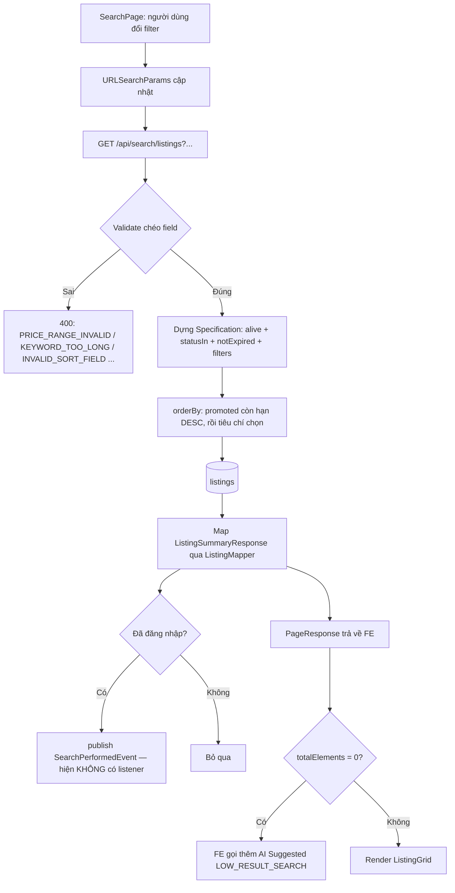

### 5. Dữ liệu chạy như thế nào

- **Input**: query string trên URL (nguồn sự thật duy nhất của filter — không có state ẩn nào khác ở FE).
- **FE xử lý**: `sanitizeKeyword()` loại ký tự `<>"'\`\` (lớp lọc UX, KHÔNG thay thế kiểm tra thật ở BE); build object `params` chỉ gồm key có giá trị.
- **API request**: Spring bind trực tiếp query string vào `ListingSearchRequest` (POJO có setter, `@ParameterObject` cho Swagger) — không qua JSON body.
- **BE validate**: 2 lớp — Bean Validation trên từng field biên (vd `@DecimalMin("0")`), rồi `validate()` thủ công cho ràng buộc chéo field đọc từ `SystemConfigService`.
- **Business logic**: `buildSpecification()` gộp tất cả tiêu chí bằng `Specification.allOf(specs)` (Spring Data mới, thay cho `Specification.where(...).and(...)` cũ).
- **DB**: 1 query `SELECT` (list) + 1 query `COUNT` (Spring Data Page tự sinh) trên bảng `listings`, có JOIN phụ dạng `EXISTS subquery` cho tiện ích (`hasAllAmenityIds`, `hasAmenityCode`) và danh mục theo mã (`categoryCode`).
- **Response**: `PageResponse<ListingSummaryResponse>` — KHÔNG có field riêng cho "tổng số theo từng bộ lọc" (không có facet count).
- **FE update**: `setResult({ items, totalElements, totalPages })`; đồng bộ `Pagination` với `page` trong URL (1-based ở UI, 0-based ở API).

### 6. Database liên quan

Module này **không sở hữu bảng riêng** — chỉ đọc bảng `listings` (xem cấu trúc đầy đủ ở Module 1, mục 6) qua các cột sau:

| Cột dùng để lọc | Specification tương ứng |
|---|---|
| `title`, `description` | `keyword()` — `LIKE LOWER('%...%')` trên cả 2 cột (OR) |
| `province_id/district_id/ward_id` | `provinceId/districtId/wardId` |
| `category_id` | `categoryId`; hoặc `categoryCode()` qua subquery `EXISTS` nối `categories` |
| `price`, `area`, `deposit_amount` | `priceFrom/priceTo/areaFrom/areaTo/depositMax` |
| `max_occupants/room_count/toilet_count` | `*AtLeast()` (`>=`) |
| `gender_requirement/furniture_status/curfew_type/toilet_type` | so khớp enum trực tiếp |
| `pet_allowed/parking_available` | chỉ lọc khi `= true` (giá trị `false` không lọc gì — giữ cả 2 loại tin) |
| `available_from` | `<=` giá trị yêu cầu |
| `trust_score` | `>= minTrustScore` |
| `latitude/longitude` | `withinBoundingBox()` — lọc thô hình chữ nhật quanh tâm bán kính km (không phải hình tròn chính xác) |
| `is_promoted/promoted_until/promotion_priority` | dùng trong `orderBy()` (CASE WHEN), không phải filter |

Bảng `listing_amenities` được dùng trong 2 dạng `EXISTS` subquery: `hasAllAmenityIds` (khớp TẤT CẢ id trong danh sách — ngữ nghĩa AND) và `hasAmenityCode` (khớp theo mã tiện ích cố định: `BALCONY`, `AIR_CONDITIONER`, `WASHING_MACHINE`, `ELEVATOR` — nối thêm với bảng `amenities` để lấy `code`).

Bảng `search_histories` (định nghĩa ở `V1__baseline_schema.sql`, migration 23) là đích lý thuyết của `SearchPerformedEvent` nhưng **thực tế không có dòng nào được ghi qua module này** — xem mục 10.

> **Note quan trọng**: bảng `listings` có `FULLTEXT INDEX ft_listings_title_description (title, description) WITH PARSER ngram` được tạo riêng ở `V10__fulltext_index.sql` (parser `ngram`, `ngram_token_size=2`, tối ưu cho tiếng Việt không dấu/tìm cụm ký tự con) — **nhưng `ListingSpecifications.keyword()` lại dùng `LIKE '%keyword%'` chứ không dùng `MATCH ... AGAINST`**. Index FULLTEXT tốn chi phí ghi (mỗi INSERT/UPDATE `title`/`description` phải cập nhật bảng từ) nhưng hiện không được tận dụng ở truy vấn thực tế — xem mục 11.

### 7. API liên quan

| Method | URL | Request | Response | Auth | Permission | Validation | Error tiêu biểu |
|---|---|---|---|---|---|---|---|
| GET | `/api/search/listings` | `ListingSearchRequest` (query, ~25 field) + `Pageable` | `ApiResponse<PageResponse<ListingSummaryResponse>>` | Tùy chọn (đăng nhập để lưu lịch sử tìm kiếm) | — | xem mục 3 | `PRICE_RANGE_INVALID`, `AREA_RANGE_INVALID`, `KEYWORD_TOO_LONG`, `KEYWORD_INVALID_CHARACTER`, `FILTER_COMBINATION_INVALID`, `TOO_MANY_AMENITY_FILTERS`, `INVALID_SORT_FIELD` |
| GET | `/api/listings/{id}/related` | path `id`, query `size?` (1–24) | `ApiResponse<RelatedListingsResponse>` | Tùy chọn | — | `size` trong khoảng cho phép (Bean Validation `@Min/@Max`) | `LISTING_NOT_FOUND` (tin gốc không tồn tại) |

`ListingSearchRequest` gồm: `keyword, provinceId, districtId, wardId, categoryId, categoryCode, priceFrom, priceTo, areaFrom, areaTo, amenityIds[], maxOccupants, genderRequirement, furnitureStatus, petAllowed, parkingAvailable, curfewType, toiletType, hasBalcony, hasAirConditioner, hasWashingMachine, hasElevator, roomCountFrom, toiletCountFrom, depositMax, availableFrom, minTrustScore, latitude, longitude, radiusKm, sort`.

`RelatedListingsResponse` gồm `source` (cố định `"SIMILAR_LISTING"`) + `items[]` (`RelatedListingItem{ listing: ListingSummaryResponse, matchScore: double, matchReasons: List<String> }`).

### 8. Dependency

**Phụ thuộc vào**: `listing` (`ListingRepository`, `ListingMapper`, `Listing` entity — dùng trực tiếp, cùng bounded context truy vấn), `catalog` (`Category`, `Amenity` entity — chỉ dùng trong subquery, không qua service), `admin` (`SystemConfigService` cho ngưỡng động).

**Bị phụ thuộc bởi**: `HomePage.jsx`, `SearchPage.jsx`, `ListingDetailPage.jsx` (khối tin liên quan), gián tiếp Module 4 (khi 0 kết quả FE tự chuyển sang gọi Recommendation `LOW_RESULT_SEARCH` — đây là phối hợp ở tầng FE, không phải BE gọi BE).

### 9. Các trường hợp cần kiểm tra

- □ Tìm kiếm không truyền filter nào → trả toàn bộ tin public, sort mặc định `RELEVANCE` (promoted trước, rồi mới nhất).
- □ Truyền `sort=relevance,desc` (chữ thường, có `,desc`) như FE mặc định đang gửi → xác nhận có lỗi `INVALID_SORT_FIELD` hay không (xem mục 10 — nghi vấn bug nghiêm trọng).
- □ `priceFrom > priceTo` → 400 `PRICE_RANGE_INVALID`; tương tự `areaFrom > areaTo`.
- □ Chỉ truyền `districtId` mà không truyền `provinceId` → `FILTER_COMBINATION_INVALID`.
- □ Truyền `keyword` chứa `<script>` hoặc `--` → `KEYWORD_INVALID_CHARACTER`.
- □ Truyền `keyword` dài hơn ngưỡng config → `KEYWORD_TOO_LONG`.
- □ Truyền nhiều hơn ngưỡng `amenityIds` cho phép → `TOO_MANY_AMENITY_FILTERS`.
- □ Lọc theo `amenityIds=[A,B]` (ngữ nghĩa AND) — tin chỉ có A không có B phải KHÔNG xuất hiện trong kết quả.
- □ Bật `hasBalcony=true` — chỉ tin có tiện ích mã `BALCONY` xuất hiện; `hasBalcony=false` hoặc không truyền → không lọc gì (cả 2 loại tin đều hiện).
- □ Tin `is_promoted=true` nhưng `promoted_until` đã qua — KHÔNG được ưu tiên lên đầu (kiểm tra đúng logic CASE WHEN theo thời gian thực).
- □ 2 tin cùng `promotionPriority` hiệu lực — thứ tự phải ổn định giữa các lần load trang (chốt hạ bằng `id DESC`).
- □ Phân trang: `size` vượt 100 → tự động ép về 100 (`sanitizePageable`); `page` âm → ép về 0.
- □ Tìm theo bán kính (`latitude/longitude/radiusKm`) thiếu 1 trong 3 tham số → không lọc gì theo địa lý (không lỗi).
- □ Tin liên quan (`related`) khi tin gốc không có tin nào cùng tỉnh trong dải giá ±30% → `items` rỗng nhưng không lỗi.
- □ Tin liên quan loại trừ đúng chính tin gốc (`idNot`).
- □ Test khi Redis/DB chậm — response time của endpoint search với nhiều điều kiện `EXISTS` subquery lồng nhau (tiện ích + boundingBox) trên bảng lớn.
- □ Sau khi tìm kiếm (đăng nhập), xác minh có dòng mới trong bảng `search_histories` hay không — dùng để phát hiện đúng bug ở mục 10.

### 10. Các lỗi dễ gặp

- **[Nghi vấn NGHIÊM TRỌNG] `sort` mặc định của FE không khớp whitelist của BE**: `SearchPage.jsx` định nghĩa `SORTS = [{ value: 'relevance,desc', label: 'Liên quan nhất' }, ...]` và `sort = searchParams.get('sort') || 'relevance,desc'` — tức là **mọi lần tải trang tìm kiếm** (kể cả không đổi gì) đều gửi `sort=relevance,desc` lên BE. Trong khi đó `ListingSortOption.RELEVANCE` có `param = "RELEVANCE"` (chữ hoa, không có `,desc`), và `ListingSortOption.from()` so khớp bằng `param.equalsIgnoreCase(normalized)` — `"RELEVANCE".equalsIgnoreCase("relevance,desc")` là **false**. Nếu đúng như vậy, **toàn bộ trang tìm kiếm sẽ luôn nhận lỗi 400 `INVALID_SORT_FIELD` ngay từ lần tải đầu tiên** trừ khi có tầng map nào đó ở `searchApi.js` (đã đọc — KHÔNG có map, gửi thẳng `params.sort`). Đây là điểm **phải verify bằng test API thật đầu tiên** khi bắt đầu review module này.
- **`SearchPerformedEvent` không có listener**: đã grep toàn bộ backend, xác nhận `SearchHistoryRepository` (module `interaction`) không hề có lệnh `.save(...)` nào được gọi ở bất kỳ đâu — bảng `search_histories` **không bao giờ có dữ liệu** dù service có publish event kèm comment "lưu lịch sử tìm kiếm phi đồng bộ". Hệ quả dây chuyền sang Module 4: tín hiệu "tìm kiếm gần đây" (`InteractionSignalGateway.recentSearchSignals`) dùng để cá nhân hóa gợi ý luôn trả về danh sách rỗng — phần "search behavior" trong công thức gợi ý nội dung (content-based) không bao giờ có tác dụng trong thực tế.
- **FULLTEXT index không được dùng**: `V10__fulltext_index.sql` tạo `ft_listings_title_description` nhưng `keyword()` specification dùng `LIKE '%...%'` (2 lần LIKE OR trên `title`/`description`) — với `%` ở đầu chuỗi, MySQL **không dùng được index B-Tree hay FULLTEXT**, luôn quét toàn bảng (`LIKE` scan). Trên tập dữ liệu lớn, đây là truy vấn chậm nhất trong toàn bộ API tìm kiếm.
- **Không có facet count**: FE hiển thị `Chip` cho từng filter đang bật nhưng không có số lượng tin theo từng lựa chọn (vd không biết "Chung cư mini" còn bao nhiêu tin trước khi bấm) — không phải bug nhưng dễ bị hỏi trong review UX.
- **`radiusKm` bounding-box là hình chữ nhật, không phải hình tròn**: tin ở góc hộp bao (xa tâm hơn bán kính thật theo đường chim bay) vẫn lọt qua bộ lọc "trong bán kính X km" — sai lệch tăng dần khi `radiusKm` lớn.

### 11. Các điểm cần review

- **Ưu tiên xác minh bug sort mặc định** (mục 10) bằng cách gọi trực tiếp `GET /api/search/listings?sort=relevance,desc` qua Postman/curl — nếu đúng là lỗi, đây là bug chặn toàn bộ trang tìm kiếm, mức độ ưu tiên cao nhất trong cả cụm.
- **Business**: công thức tính điểm "tin liên quan" hoàn toàn tính ở tầng ứng dụng sau khi đã lấy tối đa 60 ứng viên từ DB — nếu tin phù hợp nằm ngoài 60 ứng viên đầu (sort theo `TRUST_DESC` trước khi tính điểm khớp), nó sẽ không bao giờ lọt vào top kết quả dù giá/khu vực rất khớp — nên xem lại có nên tăng `RELATED_CANDIDATE_CAP` hoặc đổi tiêu chí lấy ứng viên ban đầu.
- **API naming**: 2 endpoint cùng phục vụ tìm kiếm/khám phá lại nằm ở 2 controller khác nhau (`ListingSearchController` cho `/api/search/listings`+`/api/listings/{id}/related`, nhưng `/api/listings/suggested` lại ở `SuggestedListingController` của module `ai`) — về mặt kiến trúc có lý do (tránh phụ thuộc ngược), nhưng dễ gây khó khăn khi tra cứu API nếu không đọc kỹ ghi chú.
- **Validation**: whitelist sort dùng `equalsIgnoreCase` trên chuỗi có dấu phẩy (`"publishedAt,desc"`) — cách thiết kế param dạng chuỗi ghép `field,direction` thay vì 2 tham số riêng (`sortBy`, `sortDir`) làm tăng khả năng lỗi chính tả từ FE (đã xảy ra với `RELEVANCE`).
- **Security**: kiểm tra kỹ `DANGEROUS_KEYWORD` regex `[<>;]|--|/\*` có đủ chặn các vector LIKE-injection/ReDoS hay không — dù đã dùng Criteria tham số hóa (không nối chuỗi SQL) nên rủi ro SQL injection thực tế thấp, nhưng lớp lọc này nên được xác nhận là "phòng thủ sâu" chứ không phải lớp chặn chính.
- **Performance**: xem lại chỉ số cần thiết cho tổ hợp lọc phổ biến nhất (khu vực + giá + tiện ích) có được index `idx_listings_ward_category_area` cover đủ hay chưa khi có thêm `EXISTS` subquery tiện ích.

### 12. Kết quả mong đợi

- `GET /api/search/listings` trả kết quả đúng với MỌI tổ hợp filter hợp lệ, từ chối đúng lỗi với tổ hợp không hợp lệ, và **không bao giờ trả lỗi 400 cho request mặc định của FE** (cần xác nhận/khắc phục bug sort nêu trên).
- Tin đẩy (`promoted`) còn hạn luôn đứng đầu trong phạm vi kết quả đã lọc, bất kể sort người dùng chọn là gì.
- Không tin `DRAFT/PENDING/HIDDEN/LOCKED/REJECTED/EXPIRED/CLOSED/DELETED` nào (trừ `NEED_REVIEW` khi config cho phép) xuất hiện trong kết quả tìm kiếm công khai.
- Tin liên quan trả về hợp lý theo khu vực/loại/giá, không bao giờ chứa chính tin gốc.
- (Sau khi khắc phục) `search_histories` thực sự được ghi khi người dùng đăng nhập tìm kiếm, làm tín hiệu đầu vào có tác dụng thật cho Module 4.

## Module: Catalog (Danh mục — Địa giới — Tiện ích)

### 1. Module này dùng để làm gì?

Module `catalog` là "bảng tra cứu nền" (reference data) cho toàn hệ thống: 7 loại tin (`categories`), cây địa giới 3 cấp tỉnh→huyện→xã (`provinces/districts/wards` — phạm vi thực tế 1 tỉnh Hà Nội, 12 quận, 62 phường), và danh sách tiện ích (`amenities`, gom theo 4 nhóm `FURNITURE/SECURITY/UTILITY/TRANSPORT`). Đây là dữ liệu mà **mọi module khác đều phải tham chiếu** khi tạo/lọc/hiển thị tin đăng — Listing (validate & hiển thị tên), Search (filter theo khu vực/loại/tiện ích), AI Price (phạm vi so sánh theo tỉnh/huyện/xã), AI Recommendation (trọng số theo khu vực/loại/tiện ích).

Vai trò: (1) cung cấp API công khai đọc nhanh, có cache Redis, cho form đăng tin & filter tìm kiếm; (2) cung cấp API quản trị (ADM-05/06/07) cho Admin tạo/sửa/ẩn/sắp xếp/nhập hàng loạt.

**Nếu module này hỏng thì ảnh hưởng gì?** Form đăng tin không load được danh mục/khu vực/tiện ích → chủ trọ không đăng được tin mới (chặn toàn bộ Module 1); filter tìm kiếm theo khu vực/tiện ích sai → Module 2 trả kết quả sai; cache catalog không invalidate đúng sau khi Admin sửa → dữ liệu cũ hiển thị dai dẳng cho người dùng.

### 2. Chức năng Frontend

| Màn hình | File | Chức năng |
|---|---|---|
| Quản lý danh mục | `frontend_webtro/src/pages/admin/CategoriesPage.jsx` (179 dòng) | Bảng CRUD (`AdminDataTable`), form tạo/sửa qua `Dialog` + `react-hook-form` + `yup`, cột `Switch` bật/tắt hiển thị, nút xóa (`ConfirmDialog`). |
| Quản lý khu vực | `frontend_webtro/src/pages/admin/AreasPage.jsx` (228 dòng) | Bảng tỉnh/thành + tìm kiếm theo tên + `Switch` bật/tắt hỗ trợ đăng tin + sửa tên (Dialog); khối "cascading drilldown" 2 cột xem quận/huyện của tỉnh đã chọn → phường/xã của quận đã chọn; Dialog "Nhập từ file" (chọn file `.csv/.json/.xlsx`). |
| Quản lý tiện ích | `frontend_webtro/src/pages/admin/AmenitiesPage.jsx` (164 dòng) | Cùng pattern với `CategoriesPage` (CRUD + toggle + reorder ngầm định qua `displayOrder`). |
| Form đăng tin (tiêu thụ catalog) | `ListingWizard.jsx` | Gọi 3 API catalog song song lúc mount: `getCategories`, `getAmenities`, `getPublicConfigs` (xem mục 10 — API thứ 3 luôn trả `null`). |
| Bộ lọc tìm kiếm (tiêu thụ catalog) | `SearchPage.jsx`, `HomePage.jsx` | Gọi `getCategories`, `getProvinces`, `getDistricts(provinceId)`, `getAmenities`. |

### 3. Chức năng Backend

**Controller công khai**: `CatalogController` (`backend_webtro/src/main/java/com/webtro/modules/catalog/controller/CatalogController.java`) — 5 endpoint đọc, không cần đăng nhập, tất cả có cache Redis phía service.

**Controller quản trị** (base `/api/admin`, quyền chung `CATALOG_MANAGE`):
- `AdminCategoryController` — CRUD + hide + toggle + reorder cho `categories`.
- `AdminAmenityController` — CRUD + hide + toggle + reorder cho `amenities`.
- `AdminLocationController` — CRUD (không có DELETE — dữ liệu hành chính chỉ toggle) + toggle cho `provinces/districts/wards`, cộng thêm **import hàng loạt** (`POST /api/admin/areas/import`).

**Service**: `CategoryServiceImpl`, `AmenityServiceImpl`, `ProvinceServiceImpl` (639 dòng — lớn nhất vì quản cả 3 cấp tỉnh/huyện/xã + import), `CatalogReorderSupport` (helper dùng chung logic chống trùng `displayOrder` khi reorder).

**Cache**: `@Cacheable(cacheNames = CacheName.CATEGORIES, key = "'list:' + #activeOnly")` trên `getCategories()`; mọi thao tác ghi (`create/update/hide/toggle/reorder`) đều `@CacheEvict(cacheNames = CacheName.CATEGORIES, allEntries = true)` — xóa **toàn bộ** cache danh mục (không xóa theo key) vì số lượng danh mục nhỏ, chấp nhận đánh đổi đơn giản lấy chi phí không đáng kể. (Cần xác nhận `AmenityServiceImpl`/`ProvinceServiceImpl` có áp dụng cùng pattern cache hay không — xem mục 11.)

**Validation**:
- `CreateCategoryRequest.code` là `CategoryCode` (enum, không phải chuỗi tự do) — gửi mã không thuộc enum sẽ lỗi deserialize JSON trước khi tới Bean Validation.
- Ràng buộc độ dài bám theo cột DB thật (`name` ≤ 50, `icon` ≤ 50, `description` ≤ 255) — code có ghi chú rõ lý do dùng số cột thật thay vì số minh họa trong docs để tránh lỗi ghi DB.
- `ToggleRequest.active` là `@NotNull` bắt buộc (dùng chung cho cả 5 loại tài nguyên: category/amenity/province/district/ward).
- `AreaImportRequest` — cây JSON lồng nhau `provinces[].districts[].wards[]`, `@NotEmpty` cho danh sách tỉnh, `@Valid` lan truyền xuống từng cấp con; **idempotent theo `code`** (node đã tồn tại → cập nhật, node mới → tạo); huyện/xã suy ra cha từ node bao ngoài (không cần truyền id cha).

**Business logic đáng chú ý**:
- `CategoryServiceImpl.hide()` chặn ẩn danh mục nếu `listingCount > 0` (`CATEGORY_IN_USE`) — đây là "soft-hide có điều kiện", khác với `toggle()` (bật/tắt tự do, không kiểm tra `listingCount`, chỉ ghi log + trả về `affectedListingCount` mang tính thông báo).
- Không có endpoint xóa cứng (`DELETE`) cho khu vực hành chính — chỉ có `toggle` (bật/tắt hỗ trợ đăng tin) vì dữ liệu hành chính là dữ liệu tham chiếu lâu dài, xóa sẽ vỡ FK ở `listings`/`prediction_histories`.
- `listing_count` trên `categories/provinces/districts/wards` là cột đếm sẵn (denormalized) — **không thấy job/trigger nào cập nhật lại cột này trong các file đã đọc** (cần xác nhận thêm — xem mục 11).

### 4. Luồng hoạt động

**Luồng Admin sửa 1 danh mục + cache invalidation**:

1. Admin mở `CategoriesPage`, bấm "Sửa" → điền form → submit.
2. FE gọi `PUT /api/admin/categories/{id}` (`UpdateCategoryRequest`).
3. BE kiểm quyền `CATALOG_MANAGE`, load entity, cập nhật field, `save()`.
4. `@CacheEvict(allEntries=true)` xóa toàn bộ cache `CATEGORIES` trong Redis.
5. Lần đọc công khai tiếp theo (`GET /api/categories`) sẽ miss cache → query DB → set lại cache.
6. FE `reload()` bảng để hiển thị dữ liệu mới.

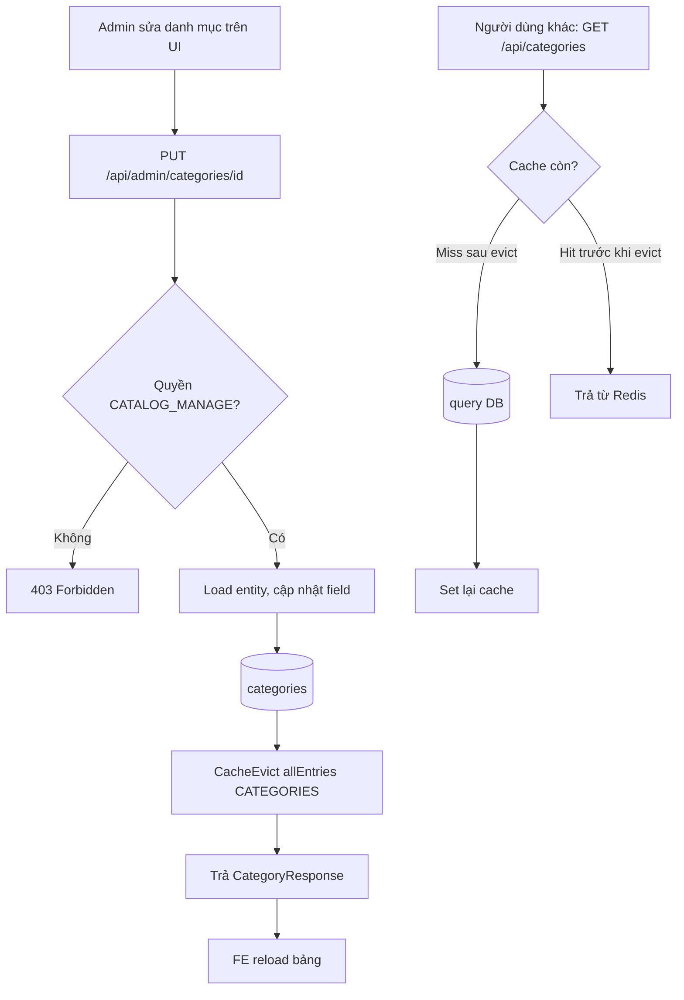

### 5. Dữ liệu chạy như thế nào

- **Input**: form Admin (tên, mã enum, mô tả, icon, displayOrder, requiredFields/optionalFields JSON).
- **FE xử lý**: `react-hook-form` + `yup` validate client-side (vd `name` max 100, `code` max 50 — **khác ngưỡng BE**, xem mục 10) trước khi gọi API.
- **API request**: `POST/PUT /api/admin/categories(/{id})` JSON body đúng `CreateCategoryRequest`/`UpdateCategoryRequest`.
- **BE validate**: Bean Validation → nghiệp vụ (`existsByCode` chống trùng mã khi tạo mới).
- **Business logic**: `HtmlSanitizer.stripAllHtml` cho `description`; sinh `slug` duy nhất từ `name`; nếu không truyền `displayOrder` → tự lấy `MAX+1`.
- **DB**: `categoryRepository.save()`.
- **Response**: `CategoryResponse` (không phải entity thô).
- **FE update**: đóng dialog, `reload()` gọi lại `GET /api/admin/categories` (không cache — controller Admin đọc luôn từ DB, chỉ có cache ở `CatalogController` công khai).

### 6. Database liên quan

| Bảng | Loại | Quan hệ | Field quan trọng |
|---|---|---|---|
| `categories` | Tra cứu (`BaseEntity` — có `created_at/updated_at`, KHÔNG xóa mềm) | 1-N tới `listings` (qua `category_id`, chỉ giữ Long ở phía `Listing`) | `code` (enum `CategoryCode`, UNIQUE), `slug` (UNIQUE), `required_fields`/`optional_fields` (JSON — Hibernate 6 native JSON), `display_order`, `is_active`, `listing_count` |
| `provinces` | Tra cứu | 1-N tới `districts` | `code` (UNIQUE), `type` (`THANH_PHO_TRUNG_UONG`\|`TINH`, CHECK constraint, KHÔNG có enum riêng — map String), `search_name` (tên không dấu, có index riêng phục vụ tìm kiếm), `is_active` (= hỗ trợ đăng tin) |
| `districts` | Tra cứu | N-1 `provinces` (`FOREIGN KEY ... ON DELETE RESTRICT`), 1-N `wards` | `type` (`QUAN/HUYEN/THI_XA/THANH_PHO_THUOC_TINH`) |
| `wards` | Tra cứu | N-1 `districts` | `type` (`PHUONG/XA/THI_TRAN`); **KHÔNG có cột `display_order`** (khác 2 cấp trên — phường/xã sắp theo tên hoặc `id`) |
| `amenities` | Tra cứu | 1-N `listing_amenities` | `code` (UNIQUE, chuỗi tự do — chưa có enum riêng), `group_code` (enum `AmenityGroup`: `FURNITURE/SECURITY/UTILITY/TRANSPORT`), `is_filterable`, `price_impact_ratio` (DECIMAL 5,4, CHECK giữa -1 và 1 — **dùng cho AI Price hedonic**, xem Module 4) |

> **Note quan trọng**: `provinces/districts/wards` đều có `is_active` mang ý nghĩa "**hỗ trợ đăng tin**" chứ không phải "tồn tại về mặt hành chính" — một tỉnh có thể tồn tại trong hệ thống nhưng `is_active=false` nghĩa là chưa mở đăng tin ở đó (khớp với ghi chú "phạm vi chỉ Hà Nội" trong bối cảnh dự án — các tỉnh khác nếu có trong seed data thì đều `is_active=false`).

### 7. API liên quan

**Công khai** (`CatalogController`, không cần đăng nhập):

| Method | URL | Request | Response | Cache |
|---|---|---|---|---|
| GET | `/api/categories` | query `activeOnly?` (mặc định true) | `ApiResponse<List<CategoryResponse>>` | Có (`CATEGORIES`) |
| GET | `/api/provinces` | query `supportedOnly?, keyword?` (≤50 ký tự, tự cắt) | `ApiResponse<List<ProvinceResponse>>` | > Cần bổ sung theo source code (chưa xác nhận provinces có `@Cacheable` hay không — chỉ thấy annotation trên `CategoryServiceImpl.getCategories`) |
| GET | `/api/provinces/{id}/districts` | path `id`, query `keyword?` | `ApiResponse<List<DistrictResponse>>` | như trên |
| GET | `/api/districts/{id}/wards` | path `id`, query `keyword?` | `ApiResponse<List<WardResponse>>` | như trên |
| GET | `/api/amenities` | query `group?, activeOnly?, grouped?` | `ApiResponse<Object>` (mảng phẳng hoặc gom nhóm `AmenityGroupResponse` tùy `grouped`) | > Cần bổ sung theo source code |

**Quản trị** (base `/api/admin`, quyền `CATALOG_MANAGE`):

| Method | URL | Request | Response | Validation | Error tiêu biểu |
|---|---|---|---|---|---|
| GET | `/api/admin/categories` | query `activeOnly?` | `List<CategoryResponse>` | — | — |
| POST | `/api/admin/categories` | `CreateCategoryRequest` | `CategoryResponse` (201) | `code` @NotNull enum, `name` 2–50, `description` ≤255 | `CATEGORY_CODE_DUPLICATE` |
| PUT | `/api/admin/categories/{id}` | `UpdateCategoryRequest` | `CategoryResponse` | như trên | `CATEGORY_NOT_FOUND`, `VALIDATION_FAILED` |
| DELETE | `/api/admin/categories/{id}` | — | 204 | chặn nếu `listingCount>0` | `CATEGORY_IN_USE` |
| PUT | `/api/admin/categories/{id}/toggle` | `ToggleRequest{active,reason?}` | `ToggleResultResponse` | `active` @NotNull | `CATEGORY_NOT_FOUND` |
| PUT | `/api/admin/categories/order` | `ReorderRequest{items[]}` | `ReorderResultResponse` | chống trùng id trong danh sách | `VALIDATION_FAILED` |
| GET/POST/PUT/DELETE/toggle/order | `/api/admin/amenities...` | tương tự (`CreateAmenityRequest`/`UpdateAmenityRequest`) | `AmenityResponse`/... | tương tự | `AMENITY_NOT_FOUND` |
| GET | `/api/admin/provinces` | query `keyword?, supportedOnly?` + `Pageable` | `PageResponse<AdminProvinceResponse>` | — | — |
| POST/PUT/toggle | `/api/admin/provinces(/{id})` | `CreateProvinceRequest`/`UpdateProvinceRequest`/`ToggleRequest` | `ProvinceResponse`/`ToggleResultResponse` | — | `PROVINCE_NOT_FOUND` |
| POST/PUT/toggle | `/api/admin/districts(/{id})` | `CreateDistrictRequest`/... | `DistrictResponse`/... | — | `DISTRICT_NOT_FOUND` |
| POST/PUT/toggle | `/api/admin/wards(/{id})` | `CreateWardRequest`/... | `WardResponse`/... | — | `WARD_NOT_FOUND` |
| POST | `/api/admin/areas/import` | `AreaImportRequest` (**JSON body**, cây provinces→districts→wards) | `ApiResponse<AreaImportResponse>` | `@NotEmpty provinces`, `@Valid` lồng nhau | 400/415 nếu body không phải JSON đúng schema |

> Tất cả endpoint quản trị `districts`/`wards` nằm dưới `/api/admin` nhưng KHÔNG lồng path theo cha (không phải `/api/admin/provinces/{id}/districts`) — là `/api/admin/districts` phẳng, nhận `provinceId` trong body request.

### 8. Dependency

**Phụ thuộc vào**: hạ tầng Redis (cache), `HtmlSanitizer`, `SlugUtil`.

**Module đang phụ thuộc vào nó** (rất nhiều — đây là module nền tảng nhất trong cụm):
- `listing` — validate `categoryId/provinceId/districtId/wardId/amenityIds` khi tạo/sửa tin (`CategoryRepository`, `ProvinceRepository`, `DistrictRepository`, `WardRepository`, `AmenityRepository` được `ListingServiceImpl` tiêm trực tiếp — **truy cập thẳng repository chéo module cùng tầng hạ tầng, không qua service/gateway riêng**, xem mục 11).
- `search` — subquery `EXISTS` trên `categories`/`amenities` trong `ListingSpecifications`.
- `ai` — `PriceEstimationServiceImpl` gọi `CategoryService.existsActiveCategory`, `ProvinceService.existsProvince/existsDistrict/existsWard/isAreaSupported`, `AmenityService.validateAndGet` (đây là ĐÚNG pattern qua service interface, không phải repository trực tiếp).
- FE: hầu như mọi trang có form địa chỉ/loại tin/tiện ích đều gọi `catalogApi`.

### 9. Các trường hợp cần kiểm tra

- □ Tạo danh mục với `code` trùng mã đã có → `CATEGORY_CODE_DUPLICATE`.
- □ Tạo danh mục với `code` không thuộc enum `CategoryCode` (gửi chuỗi tự do qua Postman) → lỗi deserialize JSON (400, message có thân thiện với người dùng không hay là lỗi kỹ thuật lộ ra?).
- □ Ẩn (`DELETE`) danh mục đang có ít nhất 1 tin thuộc nó → `CATEGORY_IN_USE`, không ẩn được.
- □ `toggle` danh mục (bật/tắt) — xác nhận **gửi body rỗng có bị lỗi 400 không** (nghi vấn ở mục 10, cần test API thật).
- □ Reorder danh sách có id trùng lặp → bị chặn (`CatalogReorderSupport.validateNoDuplicates`).
- □ Import khu vực với JSON đúng schema (tỉnh có sẵn, huyện mới) → cập nhật tỉnh theo `code`, tạo mới huyện, không tạo trùng.
- □ Import khu vực 2 lần với cùng dữ liệu → idempotent, không tạo bản ghi trùng (test lại đúng bằng cách gọi 2 lần liên tiếp, so `id` trả về).
- □ Import khu vực qua UI thật (`AreasPage` → chọn file → bấm "Nhập") — xác nhận có hoạt động được không (nghi vấn Content-Type ở mục 10).
- □ Xóa/ẩn 1 tiện ích đang được nhiều tin sử dụng (`listing_amenities`) — khác với category, `AmenityServiceImpl.hide()` có kiểm tra ràng buộc tương tự không? (`> Cần bổ sung theo source code` nếu chưa đọc kỹ đủ 263 dòng).
- □ Tìm kiếm tỉnh/huyện/xã bằng `keyword` không dấu (vd "ha noi") — xác nhận cột `search_name` được dùng đúng và trả kết quả không phân biệt dấu.
- □ Lấy `districts` của 1 `provinceId` không tồn tại → danh sách rỗng hay lỗi 404?
- □ Gọi đồng thời nhiều Admin sửa cùng 1 category → cache có bị evict đúng theo request cuối không (race condition ở tầng cache).
- □ Vòng đời `categories.listing_count`/`provinces.listing_count`/... — kiểm tra con số này có tự cập nhật khi tin được tạo/xóa/đổi category hay không, hay là cột "chết" (xem mục 10).

### 10. Các lỗi dễ gặp

- **[Nghi vấn NGHIÊM TRỌNG] `toggle*` — FE gửi PUT không có body, BE bắt buộc `active` @NotNull**: `adminApi.js` định nghĩa `toggleCategory: (id) => unwrap(axiosClient.put(...toggle))`, `toggleAmenity`, `toggleProvince` — **không truyền `payload`/body nào cả**. Trong khi `AdminCategoryController.toggle/AdminAmenityController.toggle/AdminLocationController.toggleProvince/toggleDistrict/toggleWard` đều khai `@Valid @RequestBody ToggleRequest request`, và `ToggleRequest.active` có `@NotNull`. Gửi PUT không có body cho một tham số `@RequestBody` bắt buộc thường khiến Spring trả lỗi 400 (`HttpMessageNotReadableException: Required request body is missing`) TRƯỚC KHI chạy tới Bean Validation. Nếu đúng vậy, **nút "Hiển thị/Ẩn" (Switch) trên cả 3 trang `CategoriesPage`, `AmenitiesPage`, `AreasPage` đều không hoạt động** — đây là điểm phải kiểm tra API thật đầu tiên khi review Module 3.
- **[Nghi vấn NGHIÊM TRỌNG] Import khu vực: FE gửi file multipart, BE chỉ nhận JSON body**: `AreasPage.jsx` xây `FormData` (`fd.append('file', file)`, input `accept=".csv,.json,.xlsx"`) và gọi `adminApi.importAreas(fd)` → `axiosClient.post('/admin/areas/import', payload)`. Trong khi `AdminLocationController.importAreas` khai rõ trong Javadoc "**Không dùng CSV/Excel**" và nhận `@Valid @RequestBody AreaImportRequest request` — một object JSON có cấu trúc cây `provinces[].districts[].wards[]` với từng field `code/name/type/supported/latitude/longitude`, **không phải một file upload**. Gửi `FormData` (Content-Type `multipart/form-data`) tới một endpoint mong đợi `application/json` sẽ không deserialize được — tính năng "Nhập từ file" trên UI gần như chắc chắn không hoạt động như thiết kế của BE (BE không có cơ chế parse CSV/Excel nào cả, đúng như Javadoc đã tự nhận).
- **Ngưỡng validate lệch giữa FE và BE cho danh mục**: `CategoriesPage.jsx` dùng `yup` cho phép `name` tối đa **100** ký tự, nhưng `CreateCategoryRequest.name` (`@Size(min=2, max=50)`) và cột DB `categories.name VARCHAR(50)` chỉ cho **50** ký tự — nhập tên 51–100 ký tự sẽ pass validate ở FE nhưng bị BE trả 400 khi submit, gây trải nghiệm "form hợp lệ nhưng submit vẫn lỗi".
- **`code` là ô nhập text tự do ở FE nhưng là enum cố định ở BE**: `CategoriesPage.jsx` chỉ gợi ý qua `placeholder={Object.keys(CATEGORY_CODES)[0]}`, không phải dropdown — người dùng gõ sai chính tả (vd `Boarding_House` thay vì `BOARDING_HOUSE`) sẽ nhận lỗi JSON parse chung chung thay vì message field-level rõ ràng.
- **`catalogApi.getPublicConfigs()` luôn trả `Promise.resolve(null)`** (tự nhận trong comment: "Backend không expose cấu hình công khai") — `ListingWizard.jsx` dựa vào API này để lấy `listing.title.max`, `listing.image.min/max`... nhưng thực tế luôn dùng **giá trị mặc định hardcode ở FE** (`{ 'listing.title.min': 10, ... }`). Nếu Admin đổi các ngưỡng này trong `SystemConfigPage`, form đăng tin ở FE **không bao giờ cập nhật theo** — chỉ BE (nguồn sự thật thật sự) áp dụng ngưỡng mới, gây lệch UX giữa "FE cho phép nhập" và "BE từ chối khi submit" (hoặc ngược lại).

### 11. Các điểm cần review

- **Business**: `categories/provinces/districts/wards.listing_count` là cột đếm sẵn — cần xác nhận có job/trigger/service nào cập nhật khi tin được tạo/xóa/đổi khu vực hay không; nếu không, đây là cột "chết", các UI hiển thị "Số tin" trên `CategoriesPage`/`AreasPage` sẽ luôn sai theo thời gian.
- **DB/Kiến trúc**: `ListingServiceImpl` tiêm thẳng `CategoryRepository/ProvinceRepository/DistrictRepository/WardRepository/AmenityRepository` (repository của module `catalog`) thay vì gọi qua `CategoryService/ProvinceService/AmenityService` (service interface, giống cách `PriceEstimationServiceImpl` đang làm đúng) — vi phạm nguyên tắc "gọi chéo module qua interface/gateway", tạo phụ thuộc chặt (tight coupling) giữa `listing` và tầng persistence của `catalog`. Nên đối chiếu với "luật 4" mà comment code trong `CategoryServiceImpl` có nhắc tới ("tránh chạm repository của module listing").
- **Validation**: đồng bộ lại ngưỡng `name`/`description`/`code` giữa `yup` (FE) và Bean Validation/cột DB (BE) cho cả 3 trang Admin catalog.
- **Security**: endpoint `/api/admin/areas/import` chấp nhận `latitude/longitude` tự do cho từng node — không thấy ràng buộc biên tọa độ (khác với `ListingCreateRequest` có `@DecimalMin/@DecimalMax` theo lãnh thổ VN) — nên bổ sung để tránh Admin nhập nhầm tọa độ vô nghĩa lan ra toàn bộ tin thuộc khu vực đó (ảnh hưởng tính bán kính ở Module 2).
- **Performance**: cache `CATEGORIES` evict `allEntries=true` mỗi lần ghi — chấp nhận được vì danh mục ít thay đổi, nhưng nếu `provinces/districts/wards`/`amenities` cũng cache theo cùng pattern mà có tần suất ghi cao hơn (import hàng loạt), việc evict toàn bộ liên tục có thể gây "cache stampede" nhẹ ngay sau mỗi lần import.
- **UX**: nút "Nhập từ file" trên `AreasPage` nên được làm rõ với người dùng cuối là cần định dạng JSON đúng cây (không phải Excel/CSV thông thường) — nếu giữ nguyên input `accept=".csv,.json,.xlsx"` thì gây hiểu lầm nghiêm trọng.

### 12. Kết quả mong đợi

- Cây danh mục/khu vực/tiện ích luôn nhất quán 1 nguồn sự thật (DB) — cache công khai chỉ là lớp tăng tốc đọc, không bao giờ trả dữ liệu cũ quá thời gian evict.
- Toàn bộ nút bật/tắt hiển thị trên 3 trang Admin catalog hoạt động đúng (sau khi xác minh/khắc phục nghi vấn ở mục 10).
- Chức năng import khu vực hàng loạt hoạt động đúng với JSON đúng schema, idempotent theo `code` (sau khi xác minh/khắc phục nghi vấn multipart vs JSON).
- Không có danh mục/khu vực nào bị xóa cứng gây vỡ dữ liệu tham chiếu ở `listings`.
- Ngưỡng validate giữa FE/BE đồng bộ, không còn tình trạng "form hợp lệ nhưng submit lỗi".

## Module: AI khám phá (Recommendation + Suggested + Price + TrustScore)

### 1. Module này dùng để làm gì?

Đây là cụm 4 tính năng "AI" phục vụ khám phá tin — nhưng cần hiểu đúng bản chất: **cả 4 đều là thuật toán rule-based/thống kê chạy in-process trong JVM**, KHÔNG gọi model học máy hay service ngoài (không OpenAI/không Python service). Cụ thể:

- **AI-04 Gợi ý cá nhân hóa (Recommendation)**: `ContentBasedRecommendationEngine` — tính điểm khớp giữa hồ sơ hành vi người dùng (xem/tìm/lưu/liên hệ) và từng tin ứng viên bằng công thức cộng có trọng số 9 số hạng.
- **AI-06 Dự đoán giá (Price Estimation)**: `ComparableHedonicPriceEstimator` — lấy giá trung vị/m² của các tin tương đương (so sánh) trong cùng khu vực + điều chỉnh phần trăm theo tiện nghi (hedonic pricing).
- **AI-02 Uy tín tin & AI-03 Uy tín chủ trọ (TrustScore)**: `TrustScoreServiceImpl` — công thức cộng/trừ điểm tuyến tính từ số bình luận tích cực/tiêu cực, đánh giá trung bình, báo cáo hợp lệ, cảnh báo vi phạm.

Vai trò trong hệ thống: tăng tỷ lệ tìm được phòng phù hợp (Recommendation), giúp chủ trọ định giá hợp lý tránh đăng giá quá lệch thị trường (Price), và là "lớp phòng vệ mềm" cảnh báo người thuê về tin/chủ trọ có dấu hiệu rủi ro (TrustScore) — **tất cả đều KHÔNG chặn hành động của người dùng** (đăng tin, liên hệ...), chỉ hiển thị cảnh báo/gợi ý.

**Nếu module này hỏng thì ảnh hưởng gì?** Recommendation lỗi → trang chủ/trang tìm kiếm rỗng kết quả 0 vẫn hoạt động bình thường vì có "cold start" dự phòng (tin mới + phổ biến), nhưng mất tính cá nhân hóa; Price lỗi → chủ trọ mất công cụ tham khảo giá khi đăng tin (không chặn đăng tin, vẫn đăng được); TrustScore lỗi/không cập nhật → điểm uy tín "đứng yên" ở giá trị cũ, ảnh hưởng gián tiếp tới `canAutoApprove` (Module 1) và thứ hạng sort `TRUST_DESC` (Module 2).

### 2. Chức năng Frontend

| Nơi xuất hiện | File | Chức năng |
|---|---|---|
| Khối "Giá AI đề xuất" trong form đăng tin | `frontend_webtro/src/components/listing/ListingWizard.jsx` (dòng ~382–419) | Card hiển thị giá đề xuất + khoảng (`priceRange.low–high`), nút "Tính lại" (`runPrediction`), cảnh báo mềm (`Alert severity="warning"`) khi `comparison.deviationFlagged=true`, luôn hiện `disclaimer` cuối card. |
| Khối "Có thể bạn quan tâm" khi tìm kiếm 0 kết quả | `SearchPage.jsx` | Gọi `listingApi.getSuggested({ source: 'LOW_RESULT_SEARCH', size: 6 })`. |
| Section gợi ý ở trang chủ | `HomePage.jsx` | > Cần bổ sung theo source code (đã xác nhận `HomePage.jsx` import `listingApi`/`searchApi`/`catalogApi`, cần đọc thêm phần thân file sau dòng 90 để xác nhận có gọi `getSuggested`/AI recommendation cho section riêng hay không). |
| Badge/Alert điểm uy tín TIN | `TrustScoreBadge.jsx`, dùng trong `ListingCard.jsx` (props `trustLevel`, `trustLabel`, `lowTrustWarning`) và `ListingDetailPage.jsx` (destructure `trustLevel` từ response chi tiết) | 3 biến thể hiển thị: `badge` (chip số+nhãn), `inline` (chip nhỏ chỉ nhãn), `alert` (cảnh báo nhẹ, chỉ hiện khi khác `NORMAL`). |
| Badge điểm uy tín CHỦ TRỌ | dùng trong `ListingDetailPage.jsx` (`landlord.trustLevel`, `landlord.trustScore`) và `LandlordProfilePage.jsx` (map `trustLabel → level` qua hàm `labelToLevel`) | Hiện tại uy tín thấp cạnh tên chủ trọ trong khối liên hệ. |

**Quan trọng cần đọc kỹ ở đây (liên quan trực tiếp mục 10)**: component `TrustScoreBadge` nhận prop tên **`level`**, và cả `ListingCard.jsx`/`ListingDetailPage.jsx` đều lấy giá trị này từ biến cục bộ tên **`trustLevel`** được destructure ra từ response — nhưng như sẽ thấy ở mục 6/7, DTO backend đặt tên field là **`trustLabel`**, không phải `trustLevel`.

### 3. Chức năng Backend

**4 Controller**:
- `AiRecommendationController` (`POST /api/ai/recommendations`) — kiểu REST "hành động" (POST vì có nhiều tham số ngữ cảnh + ghi log mỗi lần gọi).
- `SuggestedListingController` (`GET /api/listings/suggested`) — bản GET tiện dụng của cùng 1 service, đặt trong module `ai` (không phải `listing`) để tránh phụ thuộc ngược `listing → ai`; nhận tham số qua query string cho tiện gọi từ trang chủ/trang tìm kiếm/trang 404.
- `AiPriceController` (`POST /api/ai/price-prediction`, `GET /api/ai/price-prediction/histories`).
- TrustScore **không có controller riêng** — không phải API độc lập, mà là service nội bộ (`TrustScoreService`) được `ListingServiceImpl` (đặt `canAutoApprove`), `ListingMapper` (map `trustLabel`/`lowTrustWarning` vào response), `LandlordDashboardServiceImpl` (Module 6), và job `TrustScoreRecalcJob` gọi.

**Service & Engine** (interface tách khỏi cài đặt để dễ thay thuật toán sau này — đúng kiểu "Strategy Pattern"):

| Interface | Cài đặt | Vai trò |
|---|---|---|
| `RecommendationEngine` | `ContentBasedRecommendationEngine` | Thuần thuật toán tính điểm — không đụng DB/HTTP |
| `RecommendationService` | `RecommendationServiceImpl` | Điều phối: đọc tín hiệu hành vi qua gateway, gọi engine, ghi log, trả response |
| `PriceEstimator` | `ComparableHedonicPriceEstimator` | Thuần thuật toán so sánh + hedonic |
| `PriceEstimationService` | `PriceEstimationServiceImpl` | Điều phối: validate tham chiếu, mở rộng phạm vi WARD→DISTRICT→PROVINCE, gọi estimator, lưu lịch sử |
| `TrustScoreService` | `TrustScoreServiceImpl` | Công thức tính điểm tin/chủ trọ, suy nhãn (`labelOf`) |

**SPI Gateway** (module `ai` KHÔNG đụng trực tiếp entity của module khác — nguyên tắc kiến trúc hexagonal):
- `ListingDataGateway` — đọc thuộc tính tin (`ListingAttr`), tìm ứng viên gợi ý (`findCandidates`), tìm tin so sánh giá (`findComparables`), ghi cờ lệch giá ngược lại (`markPriceDeviation`).
- `InteractionSignalGateway` — đọc hành vi (`recentBehaviorRefs`: view/favorite/contact có trọng số), tín hiệu tìm kiếm (`recentSearchSignals`), tin đã xem gần đây (`recentlyViewedListingIds` — để chống gợi ý lặp).
- `UserDataGateway` — đọc sở thích khai báo tường minh (`UserPreference`: số người ở mong muốn, giới tính ưu tiên).

**`AiModuleSupport`** — tiện ích dùng chung cho cả Recommendation lẫn Price: `ensureEnabled(configKey)` (kiểm cấu hình bật/tắt tính năng, nếu tắt → chặn sớm) và `runWithTimeout(name, timeoutConfigKey, supplier)` (chạy phần tính điểm CPU thuần có giới hạn thời gian — tránh 1 request AI làm treo thread pool).

**Repository/Entity riêng của module `ai`**: `RecommendationLog`/`RecommendationLogRepository` (ghi mọi lần gợi ý), `PredictionHistory`/`PredictionHistoryRepository` (ghi mọi lần dự đoán giá, kể cả khi thiếu dữ liệu).

**Cron/Job**: `RecommendationPrecomputeJob` (mỗi 6 giờ) — theo đúng ghi chú trong code, đây **KHÔNG phải job tính sẵn gợi ý** (hiện chưa có API precompute nào tồn tại để gọi), mà chỉ đo quy mô "người dùng hoạt động" (có xem/tìm kiếm trong cửa sổ `ai.recommendation.notify_active_user_days`) để log giám sát tải — việc gợi ý thực tế luôn tính tại thời điểm request.

### 4. Luồng hoạt động

**Luồng Recommendation (`POST /api/ai/recommendations`)**:

1. Kiểm `ai.recommendation.enabled`; nếu `source ∈ {SIMILAR_LISTING, AFTER_FAVORITE}` mà thiếu `listingId` → `MISSING_PARAMETER`.
2. Nếu đã đăng nhập: đọc hành vi gần đây (view=trọng số 1, favorite=3, contact=5) trong cửa sổ `ai.recommendation.notify_active_user_days` ngày, đọc tín hiệu tìm kiếm gần đây (giới hạn 20 bản ghi), đọc sở thích khai báo, loại trừ tin đã xem gần đây (chống lặp).
3. Nếu có `listingId` gốc (tin tương tự/sau khi lưu) → nạp thuộc tính tin gốc làm "hạt giống" (trọng số 5, coi như 1 hành vi mạnh).
4. `engine.buildProfile(behavior, searches, declaredPref)` — chạy có timeout — dựng `UserPreferenceProfile` (trọng số khu vực/danh mục/tiện ích đã chuẩn hóa tổng=1, dải giá/diện tích theo percentile 10–90, số người ở phổ biến nhất theo tần suất).
5. Nếu hồ sơ RỖNG (`profile.empty()` — cả hành vi lẫn tìm kiếm đều không có) → rẽ nhánh **cold start**: lấy tin mới nhất theo tỉnh/huyện (nếu FE truyền) hoặc toàn hệ thống, gán điểm giả `0.60 - 0.01*(rank-1)` giảm dần, tối thiểu 0.40, kèm 2 lý do cố định.
6. Nếu có hồ sơ → tìm ứng viên qua `ListingDataGateway.findCandidates` (theo tỉnh/huyện/danh mục có trọng số cao nhất + dải giá/diện tích, loại trừ tin đã loại + tin của chính mình), số lượng lấy = `size × 5` (đệm dư để chấm điểm rồi cắt).
7. `engine.rank(profile, candidates, boostCap, size)` — chạy có timeout — tính điểm từng ứng viên theo công thức mục dưới, sort giảm dần, cắt còn `size`.
8. Ghi `RecommendationLog` cho MỌI lần gọi (kể cả cold start) — dùng `batchId` (UUID) chung cho cả lô, `rankPosition` tăng dần.
9. Trả `RecommendationResponse` gồm `items[]` (mỗi item có `scoreBreakdown` đầy đủ 9 thành phần + `matchReasons` — làm AI "giải thích được", không phải hộp đen).

**Công thức tính điểm Recommendation** (9 số hạng, tổng trọng số = 1.00):

```
score = 0.22·location + 0.12·area + 0.20·price + 0.12·category + 0.08·amenity
      + 0.08·occupant + 0.06·gender + 0.06·trustNorm + 0.06·freshness
finalScore = score × promotedBoost   (trần 1.15, chỉ áp khi tin đang promoted còn hạn)
```

Riêng `gender` (0.06) **chỉ áp dụng khi tin thuộc danh mục `ROOMMATE`**; với tin khác, bỏ số hạng này và **chuẩn hóa lại theo tổng trọng số thực áp dụng (0.94)** thay vì gán mặc định 1.0 — tránh thiên vị artificially đẩy điểm tin không phải ở ghép lên cao.

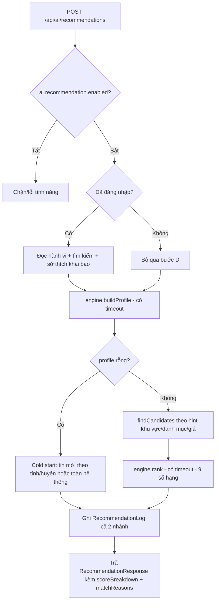

**Luồng Price Estimation (`POST /api/ai/price-prediction`)**:

1. Kiểm `ai.price.enabled`; validate category/tỉnh/huyện/xã tồn tại + khu vực có hỗ trợ đăng tin (`isAreaSupported`).
2. Tính dải diện tích so sánh: `area ± area_tolerance%` (config), cửa sổ thời gian `ai.price.comparable_days`.
3. **Mở rộng phạm vi dần dần**: thử tìm tin so sánh ở cấp `WARD` trước; nếu số mẫu < `ai.price.min_samples` → thử `DISTRICT`; vẫn thiếu → thử `PROVINCE`. Chỉ chuyển cấp rộng hơn nếu số mẫu ở cấp đó **không ít hơn** cấp trước (tránh mở rộng vô ích).
4. `estimator.estimate(...)` — chạy có timeout: nếu mẫu < ngưỡng tối thiểu → trả `available=false, confidence=INSUFFICIENT_DATA` (KHÔNG ước tính).
5. Nếu đủ mẫu: giá cơ sở = **trung vị (median) giá/m²** của các tin so sánh × diện tích; cộng dồn % điều chỉnh hedonic cho 6 yếu tố (nội thất đầy đủ, toilet riêng, thang máy, chỗ để xe, giờ tự do, mặt tiền) — mỗi yếu tố có trọng số cấu hình riêng; khoảng giá = percentile 25/50/75 của **tổng giá** các tin so sánh, co giãn theo cùng hệ số hedonic; độ tin cậy (`HIGH/MEDIUM/LOW`) suy từ số mẫu + độ phân tán IQR/median.
6. **Lưu `PredictionHistory` ở MỌI trường hợp** (kể cả thiếu dữ liệu) — quyết định này nằm TRƯỚC khi ném lỗi `AI_INSUFFICIENT_DATA`, nên dù trả 422 vẫn có bản ghi lịch sử phục vụ báo cáo chất lượng AI.
7. Nếu có `inputPrice` (giá chủ trọ định nhập) → tính `deviationRatio = (inputPrice - suggested)/suggested`; lệch quá `ai.price.deviation_flag_ratio` → `deviationFlagged=true` — **chỉ để cảnh báo mềm, `blocksPosting` LUÔN `false`**.
8. Nếu có `listingId` (đang sửa tin) → ghi ngược cờ `price_deviation_flag` vào bảng `listings` qua `ListingDataGateway.markPriceDeviation`.

**Công thức TrustScore tin** (`calculateListingTrustScore`):
```
score = base + positiveComments×wPos − negativeComments×wNeg + averageRating×wRating
             − validReports×wReport − violationWarnings×wWarn
score = clamp(score, TRUST_MIN, TRUST_MAX)
```
Ở cấp tin (`recalculateAndSaveListing`), `validReports`/`violationWarnings` cố định = 0 (được quy về cấp chủ trọ — comment trong code giải thích rõ "vì chưa có bộ đếm riêng ở cấp tin").

**Công thức TrustScore chủ trọ** (`recalculateLandlord`):
```
avgTrust = AVG(trust_score của mọi tin còn sống của chủ trọ)  — nếu không có tin → dùng điểm nền (base)
responseTerm = wResp × (responseRatePercent − neutralPercent) / 100   — chỉ tính khi đủ số hội thoại mẫu tối thiểu
score = clamp(avgTrust − warningCount×wWarn + responseTerm, TRUST_MIN, TRUST_MAX)
```

**Suy nhãn** (`labelOf`): `score < ngưỡng need_review → NEED_REVIEW`; `score < ngưỡng risky → RISKY`; `score ≥ (risky + (max-risky)/2) → GOOD`; còn lại → `NORMAL`. **4 nhãn**, không phải 3 như FE đang hiểu (xem mục 10).

### 5. Dữ liệu chạy như thế nào

**Price**: Input (form đăng tin bước "Giá & tiện ích") → FE build object gửi `POST /api/ai/price-prediction` với `categoryId/provinceId/districtId/wardId/area/roomCount/toiletCount/furnitureStatus/toiletType/amenityIds/inputPrice` → BE validate tham chiếu → tìm comparables → `PriceEstimator` tính (thuần Java, không network ngoài) → lưu `PredictionHistory` → map `PriceEstimate` (record nội bộ) sang `PricePredictionResponse` (DTO public, có `disclaimer` bắt buộc luôn xuất hiện) → FE lưu vào state `price`, hiển thị card, và **giá trị này KHÔNG tự động điền vào field `price`** — chỉ hiển thị tham khảo, người dùng tự quyết định nhập giá.

**Recommendation**: Input là ngữ cảnh (`source`, có thể kèm `listingId`) chứ không phải form nhập liệu → FE gọi khi mount trang hoặc khi 0 kết quả tìm kiếm → BE tổng hợp hành vi (đọc, không ghi gì vào Listing/User) → chỉ ghi mới vào `recommendation_logs` → trả danh sách `RecommendationItem` (đã map sẵn từ `Listing` sang dạng rút gọn tương tự `ListingSummaryResponse` nhưng có thêm `scoreBreakdown`/`matchReasons`) → FE render `ListingGrid`.

**TrustScore**: KHÔNG có luồng request/response trực tiếp từ người dùng — chỉ được **tính lại theo lịch** (`TrustScoreRecalcJob`, 02:00 UTC/ngày) hoặc đọc thụ động (giá trị `trust_score` hiện có trên `listings`/`landlord_profiles` được `ListingMapper` map vào mọi response tin, `LandlordDashboardServiceImpl` map vào dashboard chủ trọ). Nghĩa là **điểm hiển thị cho người dùng có độ trễ tối đa gần 24 giờ** so với hành vi thực tế (bình luận mới, báo cáo mới) — không phải real-time.

### 6. Database liên quan

| Bảng | Vai trò | Quan hệ | Field quan trọng |
|---|---|---|---|
| `recommendation_logs` | Append-only, ghi mọi lần gợi ý (kể cả cold start) | N-1 `users` (nullable — khách vãng lai), N-1 `listings` | `session_id`, `source` (enum), `batch_id` (nhóm 1 lần gọi), `score` (DECIMAL 6,4), `rank_position`, 6 cột điểm thành phần (`area_score, price_score, category_score, amenity_score, trust_score_norm, freshness_score`), `promoted_boost` (CHECK 1.000–1.150), `is_cold_start`, `context` (JSON), `clicked_at` (NULL cho tới khi người dùng click — cần xác nhận có API nào set field này không, xem mục 11) |
| `prediction_histories` | Append-only, ghi mọi lần dự đoán giá | N-1 `users`, N-1 `listings` (nullable — có thể dự đoán trước khi tạo tin), + tham chiếu `category_id/province_id/district_id/ward_id` | `suggested_price/price_low/price_median/price_high/price_per_sqm`, `sample_size`, `scope_used` (`WARD/DISTRICT/PROVINCE`), `confidence` (`HIGH/MEDIUM/LOW/INSUFFICIENT_DATA`), `dispersion_ratio` (IQR/median), `adjustment_detail` (JSON — 6 yếu tố hedonic), `input_price/deviation_ratio/is_flagged`, `is_applied` (cần xác nhận cờ này được set khi nào — có thể đánh dấu "chủ trọ đã dùng giá gợi ý", xem mục 11), `estimator_version` (VARCHAR 20, hiện `"hedonic-1.0"`) |
| `listings.trust_score` | Điểm uy tín TIN (denormalized trên bảng của Module 1) | — | DECIMAL(5,2), mặc định 100.00, CHECK 0–100 |
| `landlord_profiles.trust_score` | Điểm uy tín CHỦ TRỌ (denormalized trên bảng của module `user`) | — | > Cần bổ sung theo source code (đã xác nhận field tồn tại qua `TrustScoreServiceImpl`/`LandlordDashboardServiceImpl`, cột DB cụ thể cần đọc thêm `LandlordProfile` entity + migration liên quan nếu cần review sâu hơn) |
| `view_histories`, `search_histories` | Nguồn tín hiệu hành vi cho Recommendation (đọc qua `InteractionSignalGatewayAdapter`, KHÔNG thuộc module `ai`) | — | Xem chi tiết ở Module 2 mục 6 — **`search_histories` hiện luôn rỗng do bug đã nêu**, ảnh hưởng trực tiếp tới chất lượng gợi ý ở đây |
| `listings.price_prediction_id` | FK mềm (chỉ giữ Long) trỏ về `prediction_histories.id` gần nhất | — | Ghi khi `markPriceDeviation` được gọi |
| `listings.price_deviation_flag` | Cờ lệch giá (Boolean) | — | Đọc bởi `canAutoApprove` (Module 1) và bởi màn quản trị AI (`AdminAiController`, thuộc Người 1 phụ trách theo phân công, không mô tả sâu ở đây) |

### 7. API liên quan

| Method | URL | Request | Response | Auth | Permission | Validation | Error tiêu biểu |
|---|---|---|---|---|---|---|---|
| POST | `/api/ai/recommendations` | `RecommendationRequest{source, listingId?, size?, provinceId?, districtId?, excludeListingIds?}` + header `X-Session-Id?` | `ApiResponse<RecommendationResponse>` | Tùy chọn (khách được cold start, đăng nhập được cá nhân hóa) | — | `size` 1–24, `excludeListingIds` ≤50 phần tử, `listingId` bắt buộc khi `source∈{SIMILAR_LISTING,AFTER_FAVORITE}` | `MISSING_PARAMETER` |
| GET | `/api/listings/suggested` | query `source?(default HOMEPAGE), size?, listingId?, provinceId?, districtId?, excludeListingIds?` + header `X-Session-Id?` | `ApiResponse<RecommendationResponse>` | Tùy chọn | — | như trên (dựng lại `RecommendationRequest` từ query rồi gọi cùng service) | như trên |
| POST | `/api/ai/price-prediction` | `PricePredictionRequest{categoryId, provinceId, districtId, wardId, area, roomCount?, toiletCount?, furnitureStatus?, toiletType?, curfewType?, amenityIds?, isStreetFront?, latitude?, longitude?, listingId?, inputPrice?}` | `ApiResponse<PricePredictionResponse>` | Bắt buộc | `LISTING_CREATE` | tham chiếu tồn tại + khu vực hỗ trợ đăng tin; `area` 0.01–1000 | `CATEGORY_NOT_FOUND`, `PROVINCE/DISTRICT/WARD_NOT_FOUND`, `ADDRESS_HIERARCHY_MISMATCH`, `AI_INSUFFICIENT_DATA` (422) |
| GET | `/api/ai/price-prediction/histories` | query `listingId` + `Pageable` | `ApiResponse<PageResponse<PricePredictionHistoryResponse>>` | Bắt buộc | `LISTING_UPDATE_OWN` (chủ tin) hoặc `AI_LOG_VIEW` | chủ tin đúng người xem, hoặc có quyền log | `LISTING_NOT_FOUND`, `LISTING_FORBIDDEN` |

`PricePredictionResponse` gồm: `available, predictionHistoryId, suggestedPrice, priceRange{low,medium,high}, confidence, confidenceScore, confidenceLabel, explanation{summary,basePrice,adjustments[],totalAdjustmentPercent,factorsInVietnamese}, comparable{sampleSize,scope,scopeLabel,scopeExpanded,periodDays,medianPricePerSqm,iqrRatio}, comparison{inputPrice,suggestedPrice,difference,deviationRatio,deviationPercent,deviationFlagged,thresholdRatio,verdict,verdictMessage,blocksPosting(luôn false)}, disclaimer, predictedAt`.

`RecommendationResponse` gồm: `source, personalized, coldStart, coldStartStrategy[], coldStartNote, recommendationLogId, batchId, profileSummary{preferredPriceLow/High, preferredAreaLow/High, preferredOccupants, behaviorCounts{views,searches,favorites,contacts}, note}, items[]{id,slug,title,categoryCode,categoryName,price,area,shortAddress,thumbnailUrl,trustScore,averageRating,promoted,matchScore,scoreBreakdown{9 field},matchReasons[]}, generatedAt, cacheHit(luôn false — xem mục 10)`.

### 8. Dependency

**Phụ thuộc vào**: `catalog` (validate tham chiếu qua service interface — đúng pattern), `admin` (`SystemConfigService` cho toàn bộ ngưỡng/trọng số/thời gian timeout), và qua SPI gateway: `listing` (`ListingDataGateway` — implement thật nằm ở `modules/listing/adapter/ListingDataGatewayAdapter.java`), `interaction` (`InteractionSignalGateway` — implement ở `modules/interaction/adapter/`), `user` (`UserDataGateway`).

**Module đang phụ thuộc vào nó**:
- `listing` — `TrustScoreService` được `ListingServiceImpl` gọi trực tiếp (canAutoApprove) và `ListingMapper` gọi để map `trustLabel/lowTrustWarning` vào mọi response tin.
- `admin` — màn quản trị AI (`AdminAiController`, ngoài phạm vi Người 2) đọc `PredictionHistory`/`RecommendationLog`/cờ lệch giá để hiển thị cảnh báo AI cho Admin.
- `user` — `LandlordDashboardServiceImpl` gọi `TrustScoreService.labelOf` (Module 6).
- FE: `ListingWizard` (Price), `SearchPage`/`HomePage` (Suggested), mọi nơi hiển thị `TrustScoreBadge`.

### 9. Các trường hợp cần kiểm tra

- □ Gợi ý cho khách vãng lai (chưa đăng nhập, không cookie) → luôn nhận cold start, không lỗi.
- □ Gợi ý cho user mới đăng nhập chưa có hành vi gì → `profile.empty()=true` → cold start (kể cả đã đăng nhập).
- □ Gợi ý `source=SIMILAR_LISTING` không truyền `listingId` → `MISSING_PARAMETER`.
- □ Gợi ý loại trừ đúng tin đã có trong `excludeListingIds` và tin gốc (`listingId`) khỏi kết quả.
- □ Gợi ý loại trừ đúng tin của chính người dùng đang đăng nhập (`userId.equals(c.ownerId())`).
- □ Tin `ROOMMATE` có tính điểm `genderMatch`; tin loại khác thì `scoreBreakdown.genderMatch = null` và tổng trọng số áp dụng còn 0.94.
- □ Tắt `ai.recommendation.enabled` → toàn bộ endpoint gợi ý phải báo đúng trạng thái tắt tính năng (xác nhận hành vi của `ensureEnabled` — ném lỗi hay trả rỗng?).
- □ Dự đoán giá khi khu vực chưa đủ mẫu ở cả 3 cấp (WARD/DISTRICT/PROVINCE) → `AI_INSUFFICIENT_DATA` (422) NHƯNG vẫn có 1 dòng mới trong `prediction_histories` với `confidence=INSUFFICIENT_DATA`.
- □ Dự đoán giá với `inputPrice` lệch rất xa (ví dụ gấp 5 lần giá trung vị khu vực) → `deviationFlagged=true`, `blocksPosting=false` — vẫn cho phép tiếp tục đăng tin bình thường.
- □ Dự đoán giá không truyền `inputPrice` → `comparison` phải là `null` hoặc rỗng hợp lý (không lỗi vì thiếu field so sánh).
- □ Dự đoán giá 2 lần liên tiếp cho cùng 1 `listingId` với `inputPrice` khác nhau → cả 2 lần đều lưu `PredictionHistory` riêng biệt (không ghi đè), và `listings.price_prediction_id`/`price_deviation_flag` phản ánh **lần gần nhất**.
- □ Xem lịch sử dự đoán giá (`GET .../histories`) bằng tài khoản không phải chủ tin và không có `AI_LOG_VIEW` → `LISTING_FORBIDDEN`.
- □ `TrustScoreRecalcJob` chạy khi 1 chủ trọ chưa có `LandlordProfile` (vd tài khoản LANDLORD mới toanh chưa từng tạo hồ sơ) → job phải bỏ qua êm (log DEBUG), không crash toàn job.
- □ Sau khi `TrustScoreRecalcJob` chạy, kiểm tra `trust_score` của 1 tin có nhiều bình luận tiêu cực đã giảm đúng theo công thức; điểm chủ trọ = trung bình đúng của các tin còn sống (không tính tin đã xóa mềm).
- □ Badge uy tín hiển thị đúng — **đây là nơi cần test UI thật cẩn thận nhất** vì nghi vấn field-name mismatch ở mục 10: mở 1 tin có `trustLabel` khác `NORMAL` (cần chỉnh dữ liệu test hoặc chờ tin thật đạt điều kiện), xác nhận Alert cảnh báo có thực sự hiện trên `ListingDetailPage` hay không.

### 10. Các lỗi dễ gặp

- **[NGHIÊM TRỌNG — gần như chắc chắn là bug] Field-name mismatch `trustLabel` (BE) vs `trustLevel` (FE)**: `ListingDetailResponse.trustLabel` và `LandlordSummaryResponse.trustLabel` (BE, đã đọc trực tiếp source) đều đặt tên field là **`trustLabel`**. Trong khi đó `ListingDetailPage.jsx` (dòng 337) destructure `const { ..., trustScore, trustLevel } = listing;` và dùng `trustLevel` để quyết định hiện `TrustScoreBadge` (dòng 428, 670: `{trustLevel && trustLevel !== 'NORMAL' && (...)}`); `ListingCard.jsx` cũng nhận prop `trustLevel` riêng biệt với `trustLabel` (dòng 60–61: cả 2 đều được destructure nhưng chỉ `trustLevel` được dùng để tính `level`). Vì response thực tế không có field `trustLevel` (luôn `undefined`), **toàn bộ cảnh báo uy tín thấp trên trang chi tiết tin và badge uy tín trên card tin gần như chắc chắn KHÔNG BAO GIỜ hiển thị**, bất kể điểm uy tín thực tế của tin/chủ trọ thấp thế nào. Đây là bug ảnh hưởng trực tiếp tới mục tiêu "bảo vệ người thuê" của AI-02/AI-03 — cần verify bằng cách log `console.log(listing)` trên trang chi tiết thật hoặc dựng test data.
- **`TrustLabel` có 4 giá trị (`GOOD, NORMAL, RISKY, NEED_REVIEW`) nhưng `TrustScoreBadge.jsx` chỉ định nghĩa `LEVEL_META` cho 3 giá trị (`NORMAL, RISKY, NEED_REVIEW`)** — comment trong file còn ghi rõ "Backend trả trustLevel: 'NORMAL' | 'RISKY' | 'NEED_REVIEW'" (thiếu `GOOD`). Nếu field-name được sửa đúng thành `trustLabel`, giá trị `GOOD` sẽ rơi vào nhánh `LEVEL_META[level] || LEVEL_META.NORMAL` — hiển thị nhầm thành "Bình thường" thay vì phân biệt "Tốt", làm mất tác dụng phân loại 4 cấp của BE.
- **`RecommendationResponse.cacheHit` luôn `false`**: `RecommendationServiceImpl` hardcode `.cacheHit(false)` ở cả 2 nhánh (personalized và cold start) — không hề có `@Cacheable`/thao tác Redis nào trong service này, dù `ConfigKey.AI_RECOMMENDATION_CACHE_TTL_MINUTES` tồn tại trong hệ thống cấu hình (được nhắc tới trong Javadoc của `RecommendationPrecomputeJob` như một tính năng "trong tương lai"). Field `cacheHit` trong response hiện là **thông tin gây hiểu lầm** (misleading) — FE hoặc bên thứ 3 đọc field này sẽ luôn thấy `false` dù có cache hay không (vì thực chất không có cache).
- **Chất lượng cá nhân hóa bị giảm do `search_histories` luôn rỗng** (bug đã nêu ở Module 2 mục 10): số hạng "tìm kiếm (trọng số 2)" trong `buildProfile()` không bao giờ có dữ liệu thật — hồ sơ sở thích chỉ còn dựa vào view/favorite/contact, làm giảm chất lượng gợi ý so với thiết kế ban đầu (vốn định dùng cả 2 nguồn tín hiệu).
- **`PredictionHistory.is_applied`**: không tìm thấy đoạn code nào set giá trị `true` cho cột này trong `PriceEstimationServiceImpl`/`PriceMapper` — nếu tính năng "đánh dấu chủ trọ đã áp dụng giá gợi ý" từng được thiết kế, hiện nó là cột chết (luôn `false`/mặc định DB).
- **`recommendation_logs.clicked_at`**: không thấy endpoint nào set field này (không có API kiểu `PATCH /api/ai/recommendations/{logId}/click`) — nếu mục tiêu là đo tỷ lệ click-through của gợi ý để cải thiện thuật toán sau này, hiện cột này luôn `NULL`, không có cách nào đo được hiệu quả thực tế của Recommendation.

### 11. Các điểm cần review

- **Ưu tiên cao nhất**: xác minh và sửa bug field-name `trustLevel`/`trustLabel` — đây là bug 1 dòng nhưng ảnh hưởng tới toàn bộ mục tiêu bảo vệ người dùng của tính năng uy tín. Đề xuất: đổi tên biến FE từ `trustLevel` thành `trustLabel` xuyên suốt (`ListingDetailPage.jsx`, `ListingCard.jsx`, `LandlordProfilePage.jsx`) và bổ sung `GOOD` vào `LEVEL_META`.
- **Business**: công thức Recommendation cộng điểm tuyến tính 9 số hạng là hợp lý cho rule-based, nhưng trọng số (`0.22/0.12/0.20/...`) đang hardcode ở tầng `ContentBasedRecommendationEngine` (hằng số Java `static final BigDecimal`) thay vì đọc từ `SystemConfigService` như hầu hết ngưỡng khác trong hệ thống — nghĩa là muốn tinh chỉnh trọng số phải deploy lại, không tự chỉnh qua Admin UI được (khác với Price — trọng số hedonic (`ai.price.hedonic.*`) ĐÃ đọc từ config, có sự bất nhất giữa 2 module con trong cùng cụm AI).
- **Response/API naming**: nên bỏ field `cacheHit` khỏi `RecommendationResponse` hoặc thực sự cài cache (theo đúng ý đồ `AI_RECOMMENDATION_CACHE_TTL_MINUTES`), tránh field "ma" gây hiểu lầm khi tích hợp FE/đối tác thứ 3 sau này.
- **DB**: cột `recommendation_logs.clicked_at` và `prediction_histories.is_applied` hiện chết — cần quyết định: (a) bổ sung API để ghi nhận, hoặc (b) xóa khỏi schema nếu không dùng, tránh gây hiểu lầm khi đọc DB trong tương lai.
- **Validation**: `PricePredictionRequest` không có ràng buộc buộc `amenityIds` phải thuộc active list ngay ở Bean Validation — việc validate `amenityIds` diễn ra gián tiếp qua `amenityService.validateAndGet` (đúng, nhưng chỉ khi `amenityIds` không rỗng) — chấp nhận được, chỉ cần lưu ý khi review test case.
- **Security**: `POST /api/ai/price-prediction` yêu cầu quyền `LISTING_CREATE` — hợp lý (chỉ chủ trọ/admin mới cần định giá tham khảo trước khi đăng), nhưng cũng đồng nghĩa người thuê **không dùng được công cụ tham khảo giá thị trường** khi xem tin — nên xác nhận đây có đúng chủ đích sản phẩm hay là hạn chế cần mở rộng sau này.
- **Performance**: mở rộng phạm vi so sánh giá dần WARD→DISTRICT→PROVINCE nghĩa là trường hợp xấu nhất chạy tới **3 query** `findComparables` liên tiếp (mỗi query có `COMPARABLE_FETCH_LIMIT=300` dòng) trước khi ước tính — nên đo thời gian phản hồi thực tế ở khu vực thưa dữ liệu (phường mới, ít tin).

### 12. Kết quả mong đợi

- Gợi ý cá nhân hóa hoạt động đúng cho người dùng có hành vi thật (view/favorite/contact); cold start hoạt động mượt cho khách/user mới, không bao giờ trả trang trắng.
- Dự đoán giá luôn trả disclaimer rõ ràng, không bao giờ chặn đăng tin dù giá lệch bao nhiêu; lưu đủ lịch sử phục vụ báo cáo chất lượng AI (Module ngoài phạm vi Người 2).
- **Badge/Alert cảnh báo uy tín tin và chủ trọ hiển thị đúng thực tế** (sau khi khắc phục bug field-name) — người thuê thực sự nhìn thấy cảnh báo khi tin/chủ trọ có điểm uy tín thấp, đúng mục tiêu bảo vệ người dùng của AI-02/AI-03.
- Điểm uy tín được tính lại đều đặn mỗi ngày, phản ánh đúng công thức đã tài liệu hóa, không có chủ trọ/tin nào bị bỏ sót trong job.

## Module: Admin Listing & Moderation Queue (Quản lý & Kiểm duyệt tin đăng)

### 1. Module này dùng để làm gì?

Đây là "phòng điều khiển" của Admin/Moderator đối với toàn bộ tin đăng trong hệ thống: xem danh sách tin (kể cả tin không công khai), xử lý hàng đợi kiểm duyệt (tin `PENDING` chờ duyệt lần đầu + tin `NEED_REVIEW` bị gắn cờ), và thực hiện mọi hành động thay đổi trạng thái tin ở góc nhìn quản trị (duyệt/từ chối/ẩn/bỏ ẩn/khóa/mở khóa/gắn cờ/gỡ cờ/yêu cầu sửa/xử lý hàng loạt). Mọi hành động đều đi qua `ListingStateMachine` (Module 1) — module này KHÔNG có state machine riêng, chỉ là **lớp điều phối nghiệp vụ + ghi vết** phía trên state machine đã có.

Vai trò: là hàng rào chất lượng cuối cùng trước khi tin xuất hiện công khai (ADM-04), đồng thời ghi lại toàn bộ "ai làm gì, khi nào, vì sao" vào `moderation_actions` + `audit_logs` để phục vụ tra soát/khiếu nại sau này.

> **Ranh giới RPT-01 (báo cáo tin)**: chức năng báo cáo (report) đầy đủ — tạo report, xử lý report cho MỌI loại đối tượng (`LISTING/COMMENT/REVIEW/USER`...) — thuộc phạm vi **Người 3** (module `moderation`/`interaction`). Người 2 **chỉ liên quan tới nhánh "hệ quả trên tin đăng"**: (a) `AdminListingResponse.reportCount` (đếm số report còn hiệu lực nhắm vào 1 tin, lấy qua `reportRepository.countByTargetTypeAndTargetIdAndDeletedAtIsNull(ReportTargetType.LISTING, listingId)`), (b) hành động `hide`/`lock` một tin có thể xuất phát từ 1 report hợp lệ (nhưng bản thân workflow duyệt report, gửi cảnh báo chủ trọ theo `moderation.threshold.*` là của Người 3). Khi review, chỉ chấm phần Người 2 mô tả ở đây; phần còn lại của report (tạo, danh sách, duyệt report) không thuộc phạm vi tài liệu này.

**Nếu module này hỏng thì ảnh hưởng gì?** Không duyệt được tin `PENDING` → tin ùn ứ, chủ trọ chờ vô thời hạn (ảnh hưởng trực tiếp cam kết "duyệt trong 24 giờ" ở Module 1); duyệt/khóa sai trạng thái (bỏ qua state machine) → dữ liệu tin bất nhất; quên ghi `moderation_actions`/`audit_logs` → mất khả năng tra soát khi có khiếu nại.

### 2. Chức năng Frontend

| Màn hình | File | Chức năng |
|---|---|---|
| Quản lý tin đăng (Admin) | `frontend_webtro/src/pages/admin/ListingsPage.jsx` (240 dòng) | Bảng tất cả tin (mọi trạng thái), filter theo trạng thái/chủ trọ/danh mục/khu vực/lệch giá/khoảng thời gian, xem chi tiết. |
| Hàng đợi kiểm duyệt | `frontend_webtro/src/pages/admin/ModerationQueuePage.jsx` (157 dòng) | 2 `Tab`: **Chờ duyệt** (`PENDING`) và **Cần kiểm tra** (`NEED_REVIEW`), dùng chung 1 endpoint lọc theo `status`; nút hành động nhanh ngay trong bảng (Duyệt/Từ chối cho tab PENDING, Gỡ cờ/Ẩn tin cho tab NEED_REVIEW); `ConfirmDialog` bắt buộc nhập lý do khi Từ chối/Ẩn (có `selectOptions=REJECT_REASON_OPTIONS` cho nhóm lý do từ chối). |
| Bảng dữ liệu dùng chung | `frontend_webtro/src/components/admin/AdminDataTable.jsx`, hook `usePagedResource` | Chuẩn hóa phân trang/loading/error cho mọi trang Admin — dùng chung giữa `ListingsPage`, `ModerationQueuePage`, `CategoriesPage`, `AreasPage`, `AmenitiesPage`. |
| Hộp thoại xác nhận có lý do | `frontend_webtro/src/components/admin/ConfirmDialog.jsx` | `requireReason`, `reasonLabel`, `selectOptions` (dropdown nhóm lý do) — dùng cho Từ chối/Ẩn/Khóa. |

### 3. Chức năng Backend

**Controller**: `AdminListingController` (`backend_webtro/src/main/java/com/webtro/modules/admin/controller/AdminListingController.java`, base path `/api/admin`) — gộp cả nhóm `/listings/**` lẫn `/moderation-queue`, `/moderation-actions` trong cùng 1 controller (theo comment code: để cùng phục vụ 1 luồng nghiệp vụ kiểm duyệt).

**Service**: `AdminListingServiceImpl` (`.../admin/service/impl/AdminListingServiceImpl.java`, 470 dòng) — mọi method: (1) load tin bằng `getAnyListing` (thấy cả tin đã xóa mềm/không công khai), (2) chuyển trạng thái qua `ListingStateMachine`, (3) ghi `ModerationAction` (`recordModeration`), (4) ghi `AuditLog` (`auditLogService.recordChange`), (5) gửi `NotificationService.notifyUser` cho chủ trọ, (6) một số hành động phát thêm `ApplicationEvent` (`ListingApprovedEvent` khi duyệt).

**Self-injection cho bulk action**: `AdminListingServiceImpl` tự tiêm chính nó qua proxy (`@Lazy @Autowired private AdminListingService self`) — lý do: `@Transactional` chỉ có hiệu lực khi gọi qua Spring proxy, không có hiệu lực khi 1 method gọi method khác **trong cùng instance** (self-invocation) — kỹ thuật này đảm bảo **mỗi tin trong thao tác hàng loạt (`bulkModerate`) chạy trong 1 transaction độc lập**, 1 tin lỗi không làm rollback cả lô.

**Specification**: `AdminListingSpecifications` — lọc theo `statuses[], keyword, ownerId, categoryId, provinceId, districtId, wardId, priceDeviationFlagged, from, to` — khác `ListingSpecifications` (Module 2) ở chỗ **không có điều kiện `alive()`/`statusIn(publicStatuses)` bắt buộc** (Admin thấy được tin đã xóa mềm/mọi trạng thái tùy filter truyền vào).

**Gateway**: `ListingModerationGateway` (implement ở `modules/listing/adapter/ListingModerationGatewayAdapter.java`) — dùng riêng cho hành động `hide` để đảm bảo tin bị ẩn bởi kiểm duyệt có ghi `auto_hidden_at`/`auto_hide_reason` (khác với `hide` do chính chủ trọ tự bấm ở Module 1, không set 2 cột này) — đây là cách phân biệt "chủ trọ tự ẩn" và "bị kiểm duyệt ẩn" ngay trên cùng trạng thái `HIDDEN`.

**Validation nghiệp vụ** (không phải Bean Validation thuần, mà điều kiện thủ công trong service):
- `reject` bắt buộc `reason` không rỗng → `REJECT_REASON_REQUIRED`.
- `lock` bắt buộc cả `reason` VÀ `severity` → `LOCK_LISTING_REASON_REQUIRED`.
- `approve` chặn nếu tin đã `ACTIVE` → `LISTING_ALREADY_APPROVED` (409, không phải chuyển trạng thái lỗi thông thường).

### 4. Luồng hoạt động

**Luồng duyệt tin PENDING → ACTIVE**:

1. Tin ở `PENDING` (do chủ trọ submit nhưng không đạt điều kiện auto-approve — xem Module 1) xuất hiện trong `GET /api/admin/moderation-queue` (mặc định sort `createdAt ASC` — tin cũ xử lý trước).
2. Moderator xem chi tiết (`GET /api/admin/listings/{id}`, dùng `getAnyListing` nên thấy đầy đủ dù tin không công khai), bấm "Duyệt".
3. FE gọi `PUT /api/admin/listings/{id}/approve` (`ApproveListingRequest{displayDays?, note?}`).
4. BE: state machine `PENDING → ACTIVE`; đặt `publishedAt=now`, `expiredAt=now+displayDays` (mặc định lấy từ `listing.display_days` nếu không truyền); xóa `rejectReason` cũ (nếu có, từ lần từ chối trước).
5. Ghi `ModerationAction(APPROVE)` + `AuditLog(LISTING_APPROVE)`.
6. `notificationService.notifyUser(ownerId, LISTING_APPROVED, ...)` + publish `ListingApprovedEvent` (để module Notification báo thêm cho người theo dõi chủ trọ — Người 3 xử lý phần follower).
7. Trả `AdminListingActionResponse` gồm `id, status, previousStatus, displayDays, publishedAt, expiredAt, moderatorId, moderationActionId, auditLogId, ownerNotified, at`.
8. Tin lập tức đủ điều kiện xuất hiện ở Search/Home (Module 2) — không có độ trễ cache.

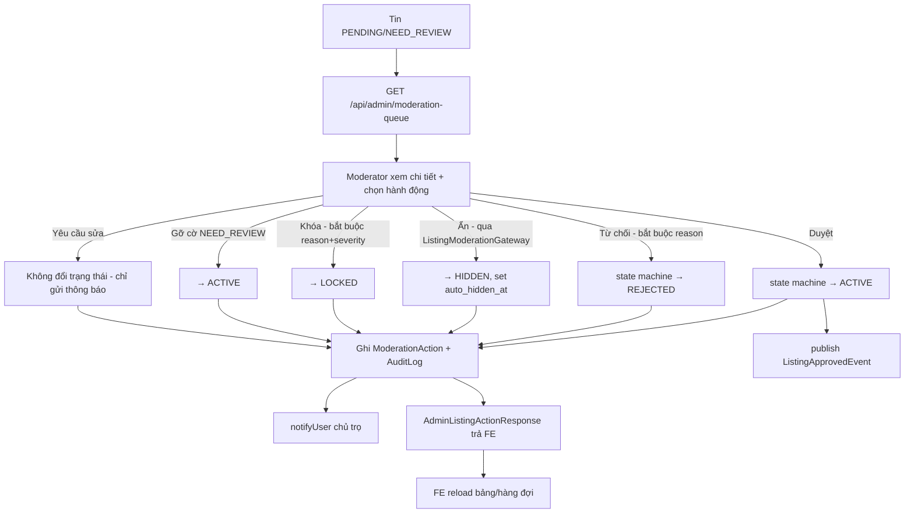

**Luồng kiểm duyệt hàng loạt (`bulkModerate`)**: FE chọn nhiều tin + 1 hành động chung (APPROVE/REJECT/LOCK/HIDE) → BE lặp từng tin, gọi qua `self` (proxy) để MỖI tin có transaction riêng → tin nào lỗi (vd sai trạng thái nguồn) được gom vào danh sách thất bại, không chặn các tin còn lại → trả `BulkActionResponse` (danh sách thành công + thất bại kèm lý do).

### 5. Dữ liệu chạy như thế nào

- **Input**: hành động Moderator chọn trên UI (duyệt/từ chối/ẩn/khóa...) + lý do (nếu bắt buộc).
- **FE xử lý**: với hành động cần lý do, mở `ConfirmDialog requireReason` trước, chỉ gọi API sau khi Moderator xác nhận + nhập lý do.
- **API request**: `PUT /api/admin/listings/{id}/{action}` với body tương ứng (`RejectListingRequest{reason, reasonCode?}`, `LockListingRequest{reason, severity, notifyOwner?}`, `ListingModerationReasonRequest{reason?}` dùng chung cho hide/unhide/flag/clear-need-review).
- **BE validate**: bắt buộc lý do cho reject/lock (thủ công, không phải Bean Validation `@NotBlank` — xem mục 11); state machine kiểm trạng thái nguồn hợp lệ.
- **Business logic**: `HtmlSanitizer.stripAllHtml` cho mọi lý do nhập tay (chống XSS lưu trữ trong `moderation_actions.reason`/`listings.reject_reason`/`lock_reason`); `sanitize(reason, defaultText)` — nếu lý do rỗng dùng text mặc định (cho các hành động lý do KHÔNG bắt buộc như hide/unhide/flag).
- **DB**: UPDATE `listings` (status + field liên quan), INSERT `moderation_actions`, INSERT `audit_logs` (2 bảng ghi vết riêng biệt, không gộp).
- **Response**: `AdminListingActionResponse` (id, status, previousStatus, reason/reasonCode/severity tùy hành động, moderatorId, moderationActionId, auditLogId, warningIssued, ownerNotified, at).
- **FE update**: `notify.success(...)`, đóng dialog, `reload()` bảng/hàng đợi.

### 6. Database liên quan

| Bảng | Vai trò | Quan hệ | Field quan trọng |
|---|---|---|---|
| `listings` | Đối tượng bị thao tác (chia sẻ với Module 1) | — | Xem Module 1 mục 6 |
| `moderation_actions` | Nhật ký MỌI hành động kiểm duyệt (không chỉ tin — dùng chung `target_type/target_id` cho nhiều loại đối tượng, nhưng cột `listing_id` riêng để truy vấn nhanh khi target là tin) | N-1 `users` (moderator_id, SET NULL nếu user bị xóa), N-1 `reports` (report_id, nullable — không phải hành động nào cũng xuất phát từ report), N-1 `listings` (listing_id, SET NULL) | `action_type` (CHECK IN `APPROVE/REJECT/HIDE/UNHIDE/LOCK/UNLOCK/WARN/REQUEST_EDIT/FLAG_NEED_REVIEW/DISMISS`), `result` (nullable, mức độ hệ quả), `reason` (VARCHAR 500, NOT NULL — bắt buộc ở tầng DB dù ở tầng service 1 số hành động không bắt buộc người dùng nhập, phải dùng `sanitize()` để không bao giờ gửi NULL/rỗng xuống DB), `previous_status/new_status` |
| `audit_logs` | Nhật ký audit tổng quát toàn hệ thống (không riêng tin đăng) | N-1 `users` (actor) | ghi qua `AuditLogService.recordChange(action, actorId, entityType, entityId, entityName, oldValue, newValue, note)` — module Người 2 chỉ là 1 trong nhiều nguồn ghi vào bảng này |
| `reports` | (Thuộc Người 3) — chỉ đọc số lượng report hợp lệ theo `target_id=listingId` để hiển thị `reportCount` | — | Xem ranh giới ở mục 1 |

### 7. API liên quan

| Method | URL | Request | Response | Auth | Permission | Validation | Error tiêu biểu |
|---|---|---|---|---|---|---|---|
| GET | `/api/admin/listings` | query `status[], keyword, ownerId, categoryId, provinceId, districtId, wardId, priceDeviationFlagged, from, to` + `Pageable` | `ApiResponse<PageResponse<AdminListingResponse>>` | Bắt buộc | `LISTING_VIEW_ANY` | — | — |
| GET | `/api/admin/moderation-queue` | `Pageable` (mặc định sort `createdAt ASC`) | `ApiResponse<PageResponse<AdminListingResponse>>` | Bắt buộc | `LISTING_VIEW_ANY` | luôn lọc cứng `status IN (PENDING, NEED_REVIEW)` | — |
| GET | `/api/admin/moderation-actions` | query `targetType?, listingId?` + `Pageable` (mặc định `createdAt DESC`) | `ApiResponse<PageResponse<AdminModerationActionResponse>>` | Bắt buộc | `LISTING_VIEW_ANY` | — | — |
| GET | `/api/admin/listings/{id}` | — | `ApiResponse<AdminListingResponse>` | Bắt buộc | `LISTING_VIEW_ANY` | — | `LISTING_NOT_FOUND` |
| PUT | `/api/admin/listings/{id}/approve` | `ApproveListingRequest{displayDays?, note?}?` | `ApiResponse<AdminListingActionResponse>` | Bắt buộc | `LISTING_MODERATE` | trạng thái nguồn = `PENDING` | `LISTING_ALREADY_APPROVED`, `LISTING_INVALID_TRANSITION` |
| PUT | `/api/admin/listings/{id}/reject` | `RejectListingRequest{reason, reasonCode?}` | `ApiResponse<AdminListingActionResponse>` | Bắt buộc | `LISTING_MODERATE` | `reason` bắt buộc | `REJECT_REASON_REQUIRED`, `LISTING_INVALID_TRANSITION` |
| PUT | `/api/admin/listings/{id}/hide` | `ListingModerationReasonRequest{reason?}?` | `ApiResponse<AdminListingActionResponse>` | Bắt buộc | `LISTING_MODERATE` | trạng thái nguồn `ACTIVE/NEED_REVIEW` | `LISTING_INVALID_TRANSITION` |
| PUT | `/api/admin/listings/{id}/unhide` | `ListingModerationReasonRequest{reason?}?` | `ApiResponse<AdminListingActionResponse>` | Bắt buộc | `LISTING_MODERATE` | trạng thái nguồn `HIDDEN` | `LISTING_INVALID_TRANSITION` |
| PUT | `/api/admin/listings/{id}/flag-need-review` | `ListingModerationReasonRequest{reason?}?` | `ApiResponse<AdminListingActionResponse>` | Bắt buộc | `LISTING_MODERATE` | trạng thái nguồn `ACTIVE` | `LISTING_INVALID_TRANSITION` |
| PUT | `/api/admin/listings/{id}/clear-need-review` | `ListingModerationReasonRequest{reason?}?` | `ApiResponse<AdminListingActionResponse>` | Bắt buộc | `LISTING_MODERATE` | trạng thái nguồn `NEED_REVIEW` | `LISTING_INVALID_TRANSITION` |
| PUT | `/api/admin/listings/{id}/lock` | `LockListingRequest{reason, severity, notifyOwner?}` | `ApiResponse<AdminListingActionResponse>` | Bắt buộc | `LISTING_LOCK` | `reason` + `severity` bắt buộc | `LOCK_LISTING_REASON_REQUIRED`, `LISTING_INVALID_TRANSITION` |
| PUT | `/api/admin/listings/{id}/unlock` | `UnlockListingRequest{reason?}` | `ApiResponse<AdminListingActionResponse>` | Bắt buộc | `LISTING_LOCK` | trạng thái nguồn `LOCKED` | `LISTING_INVALID_TRANSITION` |
| PUT | `/api/admin/listings/{id}/request-edit` | `RequestListingEditRequest{reason}` | `ApiResponse<AdminListingActionResponse>` | Bắt buộc | `LISTING_MODERATE` | `reason` bắt buộc | — |
| PUT | `/api/admin/listings/bulk` | `BulkListingActionRequest{listingIds[], action, reason?, severity?}` | `ApiResponse<BulkActionResponse>` | Bắt buộc | `LISTING_MODERATE` | mỗi tin xử lý độc lập | thất bại từng tin gom trong response, không phải lỗi 4xx tổng |

> **Riêng `/api/admin/listings/{id}/lock`/`unlock` yêu cầu quyền `LISTING_LOCK`** — khác với các hành động còn lại chỉ cần `LISTING_MODERATE` — đúng với chủ đích "chỉ Admin, không phải Moderator thường, được khóa tin" theo comment Javadoc trong `AdminListingController`.

### 8. Dependency

**Phụ thuộc vào**: `listing` (`ListingRepository`, `ListingStateMachine` — dùng trực tiếp entity + state machine, hợp lý vì đây là "cánh tay quản trị" của cùng bounded context), `moderation` (`ModerationActionRepository`, `ReportRepository`, `ListingModerationGateway` — SPI đúng chuẩn), `admin` (`SystemConfigService`, `AuditLogService`), `notification` (`NotificationService`).

**Module đang phụ thuộc vào nó**: `ModerationQueuePage.jsx`, `ListingsPage.jsx` (Admin FE); gián tiếp — `AdminAiController` (màn quản trị AI, đọc `AdminListingResponse.priceDeviationFlagged` để lọc tin nghi ngờ, nằm ngoài phạm vi mô tả sâu của Người 2).

### 9. Các trường hợp cần kiểm tra

- □ CRUD/hành động: duyệt → từ chối → duyệt lại (đúng: `REJECTED` nằm trong tập nguồn của `SUBMIT`, chủ trọ phải sửa & gửi lại, Admin không "duyệt thẳng" tin `REJECTED`).
- □ Duyệt tin đã `ACTIVE` → `LISTING_ALREADY_APPROVED` (409), không đổi gì.
- □ Từ chối không nhập lý do → `REJECT_REASON_REQUIRED`.
- □ Khóa không nhập `severity` (dù có `reason`) → `LOCK_LISTING_REASON_REQUIRED`.
- □ Khóa tin đang `PENDING`/`NEED_REVIEW`/`HIDDEN` → đều hợp lệ (tập nguồn của `LOCK` gồm `ACTIVE, NEED_REVIEW, HIDDEN, PENDING`); khóa tin đang `DRAFT`/`EXPIRED`/`CLOSED`/`REJECTED` → `LISTING_INVALID_TRANSITION`.
- □ Mở khóa → tin về `HIDDEN` (không phải `ACTIVE`), xác nhận thông báo gửi cho chủ trọ đúng nội dung "cần tự bật lại".
- □ Ẩn tin qua Admin (`hide`) rồi kiểm tra `listings.auto_hidden_at`/`auto_hide_reason` có được set hay không (khác với chủ trọ tự ẩn ở Module 1 — không set 2 cột này).
- □ Bỏ ẩn qua Admin (`unhide`) → 2 cột `auto_hidden_at`/`auto_hide_reason` phải được xóa (set NULL).
- □ Gắn cờ `NEED_REVIEW` cho tin `ACTIVE` → tin **vẫn có thể công khai** nếu config `listing.need_review.publicly_visible=true` (Module 1/2) — xác nhận đúng ý đồ "report không tự động gỡ tin, chỉ đánh dấu để soi".
- □ Yêu cầu sửa tin (`request-edit`) → xác nhận **KHÔNG đổi trạng thái tin** (đúng theo Javadoc), chỉ ghi `ModerationAction(REQUEST_EDIT)` + gửi thông báo.
- □ Kiểm duyệt hàng loạt (`bulk`) với danh sách gồm cả tin hợp lệ và tin sai trạng thái nguồn → response phải liệt kê rõ tin nào thành công/thất bại, tin lỗi không rollback tin thành công (test bằng cách trộn 1 tin `ACTIVE` (không thể REJECT) với nhiều tin `PENDING` trong 1 request `REJECT` hàng loạt).
- □ Phân quyền: tài khoản chỉ có `LISTING_MODERATE` (không có `LISTING_LOCK`) gọi `lock`/`unlock` → 403.
- □ Phân quyền: tài khoản chỉ có `LISTING_VIEW_ANY` (không `LISTING_MODERATE`) chỉ xem được, mọi hành động ghi đều 403.
- □ `reportCount` trên `AdminListingResponse` hiển thị đúng số report còn hiệu lực (đã trừ report bị xóa mềm) của tin.
- □ Sắp xếp mặc định hàng đợi kiểm duyệt (`createdAt ASC`) — xác nhận đúng là ưu tiên tin **chờ lâu nhất** xử lý trước (không phải mới nhất trước).
- □ Chuyển 2 tab (PENDING ↔ NEED_REVIEW) trên `ModerationQueuePage` — bảng phải load lại đúng dữ liệu tab mới, không hiển thị nhầm dữ liệu tab cũ trong lúc loading.

### 10. Các lỗi dễ gặp

- **[Nghi vấn] Response quản trị thiếu field mà FE đang kỳ vọng** — `ModerationQueuePage.jsx` render `r.categoryName`, `r.ownerName`, `r.submittedAt`, `r.needReviewReason`/`r.autoHideReason`, nhưng `AdminListingResponse` (DTO thật, đã đọc trực tiếp) chỉ có `id, title, slug, categoryId, price, area, ownerId, status, statusLabel, trustScore, reportCount, priceDeviationFlagged, provinceId, districtId, wardId, publishedAt, expiredAt, createdAt, updatedAt` — **không có `categoryName/ownerName/submittedAt/needReviewReason/autoHideReason`**. Hệ quả: cột "Tin đăng" trong hàng đợi kiểm duyệt sẽ hiển thị tên danh mục/chủ trọ **rỗng** (fallback `''`), cột "Chờ từ" âm thầm dùng `createdAt` thay vì thời điểm submit thật (không lỗi nhưng sai ý nghĩa hiển thị nếu tin có nhiều lần sửa/gửi lại), và cột "Lý do cần kiểm tra" ở tab NEED_REVIEW **luôn hiện text mặc định "Cần kiểm tra"** thay vì lý do cụ thể vì `needReviewReason`/`autoHideReason` luôn `undefined`. Đây là điểm cần verify UI thật đầu tiên khi review Module 5.
- **`reason` là `VARCHAR(500) NOT NULL` ở DB nhưng không phải lúc nào tầng service cũng nhận `reason` bắt buộc từ request** (vd `hide`/`unhide`/`flag-need-review`/`clear-need-review` cho phép `reason` optional) — code xử lý đúng bằng hàm `sanitize(reason, defaultText)` để không bao giờ gửi NULL xuống DB, nhưng đây là điểm dễ quên khi thêm hành động mới trong tương lai (phải luôn nhớ `sanitize`, nếu quên sẽ vỡ ràng buộc NOT NULL ở DB ngay khi test).
- **Nhầm giữa quyền `LISTING_MODERATE` và `LISTING_LOCK`**: dev mới dễ gán nhầm cả 2 quyền cho cùng 1 role Moderator, phá vỡ chủ đích thiết kế "chỉ Admin mới khóa được tin" (Moderator chỉ duyệt/từ chối/ẩn/gắn cờ).
- **Self-invocation transaction**: nếu sau này có refactor gọi trực tiếp `this.approve(...)` thay vì qua `self.approve(...)` bên trong `bulkModerate`, transaction riêng theo từng tin sẽ **mất hiệu lực âm thầm** (không lỗi biên dịch, không lỗi runtime rõ ràng — chỉ phát hiện khi test 1 tin lỗi giữa lô và thấy toàn bộ lô bị rollback theo).

### 11. Các điểm cần review

- **Ưu tiên xác minh mismatch field ở mục 10** — bổ sung `categoryName/ownerName/submittedAt/needReviewReason/autoHideReason` vào `AdminListingResponse`/`AdminListingMapper` (hoặc sửa FE bỏ kỳ vọng các field này) để hàng đợi kiểm duyệt hiển thị đủ thông tin cho Moderator ra quyết định nhanh — thiếu tên chủ trọ/danh mục ngay trong bảng buộc Moderator phải bấm vào từng tin mới biết, làm chậm tốc độ xử lý hàng đợi.
- **Business**: cân nhắc thêm cột `submitted_at` riêng trên `listings` (khác `created_at`) nếu muốn "Chờ từ" phản ánh đúng lần submit gần nhất (tin có thể tạo từ lâu, sửa nhiều lần, mỗi lần gửi lại nên tính lại thời gian chờ).
- **API naming**: `reasonCode` (trong `RejectListingRequest`) là optional và không thấy dùng để rẽ nhánh logic nghiệp vụ nào trong `AdminListingServiceImpl.reject()` (chỉ được gán thẳng vào response) — nên xác nhận `reasonCode` có ý nghĩa thống kê (nhóm lý do từ chối phổ biến) hay là field dư thừa.
- **DB**: `moderation_actions.reason NOT NULL` — nên cân nhắc đổi thành nullable ở DB để khớp đúng ngữ nghĩa "một số hành động không bắt buộc lý do", thay vì luôn phải có `sanitize()` với text mặc định ở tầng code (giảm rủi ro quên sanitize khi thêm hành động mới).
- **Security**: xác nhận toàn bộ hành động ghi (`approve/reject/hide/unhide/lock/unlock/flag/clear/request-edit/bulk`) đều `HtmlSanitizer.stripAllHtml` cho input tự do (`reason`, `note`) — đã thấy áp dụng ở `reject`/`lock`/`hide`/`unhide`, cần rà thêm cho `approve.note` và `request-edit.reason`.
- **UX**: `bulkModerate` chỉ nhận 1 `action` áp cho toàn bộ danh sách — nếu Moderator chọn nhầm 1 tin không phù hợp hành động (vd tin `ACTIVE` lẫn trong danh sách REJECT hàng loạt vốn chỉ áp cho `PENDING`), UI cần hiển thị rõ ràng danh sách thất bại kèm lý do cụ thể (không chỉ đếm số lượng) để Moderator biết cần xử lý tay tin nào.

### 12. Kết quả mong đợi

- Hàng đợi kiểm duyệt hiển thị đầy đủ thông tin cần thiết để Moderator ra quyết định mà không cần mở từng tin (sau khi khắc phục mismatch DTO).
- Mọi hành động kiểm duyệt đều đi qua đúng `ListingStateMachine`, không có đường tắt đổi trạng thái nào bỏ qua ghi `moderation_actions`/`audit_logs`/thông báo chủ trọ.
- Phân quyền `LISTING_MODERATE` vs `LISTING_LOCK` tách bạch đúng theo thiết kế (Moderator không khóa được tin, chỉ Admin mới khóa được).
- Kiểm duyệt hàng loạt xử lý đúng từng tin độc lập, không vì 1 tin lỗi mà rollback toàn bộ lô.

## Module: Landlord Dashboard/Overview (Tổng quan chủ trọ)

> **Cập nhật 2026-08-11:** lỗi mismatch được mô tả trong mục này đã được xử lý theo hướng (a): backend `GET /api/landlord/dashboard`
> nhận `days=7|30|90` và trả các field frontend đang dùng (`activeCount`, `pendingCount`, `viewCount30d`,
> `contactCount30d`, `chart`, `topListings`, `actionItems`, `landlordVerificationStatus`), đồng thời vẫn giữ các field
> cũ (`totalListings`, `listingsByStatus`, `totalViews`, `totalFavorites`, `totalContacts`, khối trust) để không phá client cũ.
> Kiểm chứng local: DB `landlord1@webtro.local` có `PENDING=1`, API trả `pendingCount=1`.

### 1. Module này dùng để làm gì?

Trang đầu tiên chủ trọ nhìn thấy sau khi đăng nhập vào khu vực quản lý (`/quan-ly/tong-quan`): tổng hợp nhanh "sức khỏe" của toàn bộ tin đăng — số tin theo trạng thái, tổng lượt xem/lưu/liên hệ, điểm uy tín, tỷ lệ phản hồi. Về bản chất đây là một **API tổng hợp (aggregation) mỏng**, không có nghiệp vụ ghi dữ liệu — chỉ đọc và cộng dồn số liệu đã có sẵn từ Module 1 (`ListingRepository`) và module `user` (`LandlordProfileRepository`).

Vai trò: giúp chủ trọ đánh giá nhanh hiệu quả kênh đăng tin của mình mà không cần vào từng tin xem thống kê riêng lẻ (đó là việc của `ListingStatsPage`/`getStats` ở Module 1).

**Nếu module này hỏng thì ảnh hưởng gì?** Không chặn được nghiệp vụ cốt lõi nào (chủ trọ vẫn đăng/sửa/quản lý tin bình thường qua `MyListingsPage`) — chỉ mất đi "cửa sổ tổng quan" đầu tiên, giảm trải nghiệm nhưng không gây hỏng luồng chính.

### 2. Chức năng Frontend

| Màn hình | File | Chức năng |
|---|---|---|
| Tổng quan chủ trọ | `frontend_webtro/src/pages/landlord/OverviewPage.jsx` (185 dòng) | Dropdown chọn khoảng thời gian (7/30/90 ngày), `Alert` nhắc xác thực chủ trọ nếu chưa `VERIFIED`, 4 `StatCard` (tin đang hiển thị/chờ duyệt/lượt xem/lượt liên hệ — có `delta` so kỳ trước), `ChartCard` line-chart xu hướng xem/liên hệ, khối "Việc cần xử lý" (`actionItems`, `Alert` theo `severity`), khối "Tin đăng nổi bật" (`topListings`, danh sách link sang trang thống kê từng tin). |
| Sửa hồ sơ chủ trọ | `frontend_webtro/src/pages/landlord/LandlordProfileEditPage.jsx` (208 dòng) | > Cần bổ sung theo source code (đã xác nhận file tồn tại, chưa đọc chi tiết nội dung — đây là màn hồ sơ chủ trọ, chỉ liên quan gián tiếp tới Module 6 qua `landlordVerificationStatus` hiển thị trên `OverviewPage`, KHÔNG thuộc trọng tâm 4 module còn lại nên không mô tả sâu ở đây; cần đọc thêm nếu review cần chi tiết màn này). |

### 3. Chức năng Backend

**Controller**: `LandlordDashboardController` (`backend_webtro/src/main/java/com/webtro/modules/user/controller/LandlordDashboardController.java`) — **duy nhất 1 endpoint** `GET /api/landlord/dashboard`, không nhận bất kỳ query param nào (không có `days`, không filter gì).

**Service**: `LandlordDashboardServiceImpl` (`.../user/service/impl/LandlordDashboardServiceImpl.java`, 75 dòng — rất mỏng) — toàn bộ logic:
1. `listingRepository.countByStatusForOwner(userId)` → map thành `Map<String,Long> listingsByStatus`.
2. `listingRepository.countByOwner/sumViewCountForOwner/sumFavoriteCountForOwner/sumContactCountForOwner(userId)` → 4 số tổng **toàn thời gian** (không theo khoảng ngày).
3. Đọc `LandlordProfile` (nếu có) → `trustScore` (làm tròn), `trustLabel` (qua `trustScoreService.labelOf`, tiêm `@Lazy` để tránh vòng phụ thuộc `user ↔ listing`), `responseRatePercent`, `averageRating`, `reviewCount`, `validReportCount`, `warningCount`.

**Repository**: dùng lại `ListingRepository` (Module 1) + `LandlordProfileRepository` (module `user`) — không có repository riêng cho module này.

**Cache/Job/Event/Queue**: không có — đây là API đọc trực tiếp, tính toán tại thời điểm request, không cache, không job nền, không phát sự kiện.

### 4. Luồng hoạt động

1. Chủ trọ vào trang `/quan-ly/tong-quan`.
2. FE gọi `userApi.getLandlordDashboard({ days })` → `GET /api/landlord/dashboard?days=30`.
3. BE **hoàn toàn bỏ qua tham số `days`** (controller không khai báo `@RequestParam` nào) — tính tổng toàn thời gian.
4. Service query 5 lượt vào `listings` (1 group-by trạng thái + 3 SUM + 1 COUNT) và 1 lượt vào `landlord_profiles`.
5. Trả `LandlordDashboardResponse` phẳng (không có chart/trend/topListings/actionItems).
6. FE nhận response, cố gắng đọc các field mà thực tế response không có (`activeCount, pendingCount, viewCount30d, contactCount30d, deltas, chart, actionItems, topListings, landlordVerificationStatus`) → toàn bộ ra `undefined`.

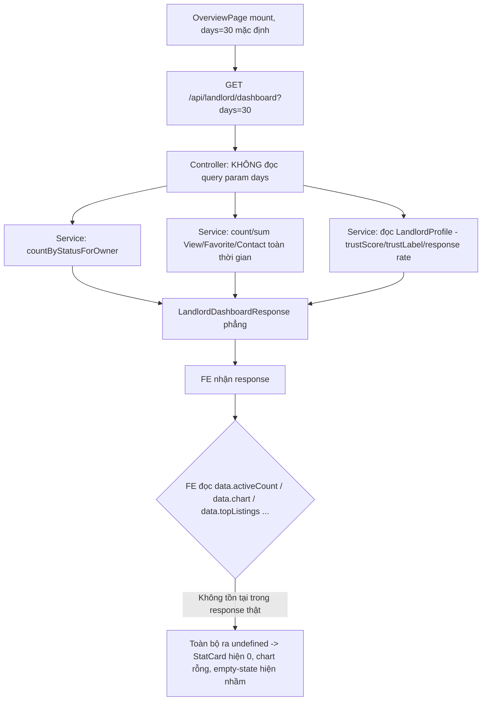

### 5. Dữ liệu chạy như thế nào

- **Input**: chỉ có `userId` từ JWT (`@AuthenticationPrincipal`) — FE có gửi `days` nhưng vô nghĩa với BE hiện tại.
- **FE xử lý**: `OverviewPage.jsx` gọi lại `load()` mỗi khi đổi `days` (dependency của `useCallback`) — về bản chất **gọi lại đúng 1 API giống hệt nhau, response không đổi theo `days`** (lãng phí network call khi đổi dropdown nếu người dùng thử đổi 7/30/90).
- **API request**: `GET /api/landlord/dashboard` (query `days` bị bỏ qua ở BE).
- **BE validate**: không có validate đặc biệt (chỉ cần `LISTING_CREATE`).
- **Business logic**: 100% là truy vấn tổng hợp, không có nhánh rẽ nghiệp vụ.
- **DB**: 5 câu SQL (4 vào `listings`, 1 vào `landlord_profiles`), tất cả `readOnly=true`.
- **Response**: `LandlordDashboardResponse` — DTO phẳng, có `@JsonInclude(NON_NULL)` (field null bị loại khỏi JSON — vd chủ trọ chưa có `LandlordProfile` thì cả cụm `trustScore/trustLabel/...` biến mất khỏi JSON thay vì trả `null` tường minh).
- **FE update**: `setData(res)` — nhưng phần lớn UI (`StatCard` cho `activeCount/pendingCount`, `ChartCard`, "Việc cần xử lý", "Tin đăng nổi bật", `Alert` xác thực chủ trọ) đọc field không tồn tại trong `res` → hiển thị mặc định `0`/rỗng.

### 6. Database liên quan

Module này không sở hữu bảng riêng — chỉ đọc:

| Bảng | Field đọc | Mục đích |
|---|---|---|
| `listings` | `status` (group by), `view_count`, `favorite_count`, `contact_count`, `owner_id`, `deleted_at` (loại tin đã xóa mềm khỏi mọi phép đếm/tổng) | Tổng hợp số liệu chủ trọ |
| `landlord_profiles` | `trust_score`, `response_rate_percent`, `average_rating`, `review_count`, `valid_report_count`, `warning_count`, `deleted_at` | Khối uy tín/đánh giá |

### 7. API liên quan

| Method | URL | Request | Response (field THẬT) | Auth | Permission | Validation | Error |
|---|---|---|---|---|---|---|---|
| GET | `/api/landlord/dashboard` | Không tham số nào được BE dùng (FE gửi `days` nhưng bị bỏ qua) | `ApiResponse<LandlordDashboardResponse>` = `{ totalListings, listingsByStatus: Map<String,Long>, totalViews, totalFavorites, totalContacts, trustScore?, trustLabel?, responseRatePercent?, averageRating?, reviewCount?, validReportCount?, warningCount? }` | Bắt buộc | `LISTING_CREATE` | — | — |

### 8. Dependency

**Phụ thuộc vào**: `listing` (`ListingRepository`), `user` (`LandlordProfileRepository`), `listing.TrustScoreService` (tiêm `@Lazy` — Module 4).

**Module đang phụ thuộc vào nó**: chỉ `OverviewPage.jsx` (FE) — không module BE nào khác gọi tới.

### 9. Các trường hợp cần kiểm tra

- □ Chủ trọ chưa có `LandlordProfile` (tài khoản mới, chưa từng tạo hồ sơ) → response vẫn trả 200, cụm field uy tín bị loại khỏi JSON (do `@JsonInclude(NON_NULL)`) — FE phải xử lý được trường hợp thiếu field, không crash.
- □ Chủ trọ có 0 tin đăng → `totalListings=0`, `listingsByStatus={}` (map rỗng), `totalViews/totalFavorites/totalContacts=0` — không lỗi 500.
- □ So sánh số liệu `listingsByStatus` trả về với số đếm thực tế trên `MyListingsPage` (lọc theo từng status) — phải khớp nhau (cùng nguồn `listings`, khác cách tổng hợp).
- □ Đổi dropdown "7/30/90 ngày" trên UI → xác nhận số liệu hiển thị **có thực sự đổi hay không** (dự đoán: KHÔNG đổi, vì BE bỏ qua `days` — đây là test case then chốt để xác nhận bug ở mục 10).
- □ Gọi trực tiếp API bằng Postman với các giá trị `days` khác nhau → xác nhận response giống hệt nhau bất kể `days`.
- □ Tài khoản không có quyền `LISTING_CREATE` (vd `TENANT` thường) gọi endpoint này → 403.
- □ Trust label hiển thị đúng nhãn tiếng Việt tương ứng (`trustScoreService.labelOf` — 4 giá trị `GOOD/NORMAL/RISKY/NEED_REVIEW`, xem Module 4).

### 10. Các lỗi dễ gặp

- **[NGHIÊM TRỌNG — mismatch hợp đồng dữ liệu rất lớn] FE kỳ vọng một API "dashboard đầy đủ", BE chỉ có API "tổng hợp phẳng"**: đối chiếu trực tiếp `OverviewPage.jsx` với `LandlordDashboardResponse`/`LandlordDashboardController` (cả 2 đã đọc source thật), phát hiện HÀNG LOẠT field FE dùng nhưng BE không trả:
  - `data.activeCount`, `data.pendingCount` — BE chỉ có `listingsByStatus` (map, cần tự lấy `listingsByStatus['ACTIVE']`/`['PENDING']` ở FE, KHÔNG có field phẳng tương ứng).
  - `data.viewCount30d`, `data.contactCount30d` — BE chỉ có `totalViews`/`totalContacts` **toàn thời gian**, không có bản theo cửa sổ ngày.
  - `data.deltas.activeCount`, `data.deltas.pendingCount`, `data.deltas.viewCountPercent`, `data.deltas.contactCountPercent` — BE **hoàn toàn không có khái niệm "so với kỳ trước"** (không lưu snapshot lịch sử để so sánh).
  - `data.chart` (mảng `{date, views, contacts}` cho line-chart) — BE không trả time-series nào cả.
  - `data.actionItems` (mảng việc cần xử lý kèm `severity/message/actionUrl`) — không tồn tại ở BE.
  - `data.topListings` (mảng tin nổi bật kèm `viewCount/contactCount`) — không tồn tại ở BE.
  - `data.landlordVerificationStatus` — không tồn tại ở BE (chỉ có `trustLabel`, không phải trạng thái xác thực).
  
  **Hệ quả thực tế**: hầu hết `OverviewPage` sẽ hiển thị **toàn số 0 và rỗng** — 4 `StatCard` chính đều `?? 0`, biểu đồ xu hướng luôn rỗng (`chartData` = `null` vì `data?.chart` luôn `undefined`), khối "Việc cần xử lý" luôn hiện "Không có việc gì cần xử lý" (vì `actionItems` luôn `[]` do `data?.actionItems || []`), khối "Tin đăng nổi bật" luôn hiện "Chưa có dữ liệu", và Alert nhắc xác thực chủ trọ **không bao giờ hiện** (vì `data.landlordVerificationStatus` luôn `undefined`, điều kiện `data?.landlordVerificationStatus && ... !== 'VERIFIED'` luôn `false`). Đây gần như chắc chắn là trang có giao diện đẹp nhưng **không hiển thị đúng bất kỳ số liệu thật nào ngoài việc không crash** (nhờ toàn bộ FE dùng `?.`/`??` fallback an toàn).
- **`isEmpty` tính sai theo cùng logic trên**: `const isEmpty = data && (data.activeCount + data.pendingCount) === 0 && ...` — vì `data.activeCount`/`data.pendingCount` luôn `undefined`, `undefined + undefined = NaN`, `NaN === 0` là `false` → `isEmpty` luôn `false` (trừ khi `topListings.length` cũng góp phần, nhưng biểu thức `&&` đã chặn ở `isEmpty` chưa chắc đúng) — nghĩa là màn "Bạn chưa có tin đăng nào" (empty state cho chủ trọ hoàn toàn mới) **có thể không bao giờ hiện đúng lúc**, trong khi số liệu thật vẫn hiện 0 lặng lẽ.

### 11. Các điểm cần review

- **Đây là ưu tiên sửa cao nhất trong toàn bộ Module 6** — 2 hướng khắc phục khả thi: (a) mở rộng `LandlordDashboardResponse`/`LandlordDashboardServiceImpl` để BE thực sự trả `activeCount/pendingCount/viewCount{days}d/contactCount{days}d/deltas/chart/actionItems/topListings/landlordVerificationStatus` như FE kỳ vọng (cần thêm truy vấn theo cửa sổ ngày trên `view_histories`/`contact_logs`/so sánh kỳ trước, và nguồn `topListings` cần sort theo view/contact — hiện chưa có query nào phục vụ việc này trong `LandlordRepository`); hoặc (b) viết lại `OverviewPage.jsx` để khớp đúng field phẳng hiện có của BE (đơn giản hơn nhưng mất tính năng biểu đồ/xu hướng/gợi ý việc cần làm — giảm giá trị sản phẩm so với thiết kế UI).
- **Business**: quyết định rõ "tổng lượt xem/liên hệ" nên là toàn thời gian (đang đúng ở BE) hay theo cửa sổ ngày (đang đúng ở FE) — đây là quyết định sản phẩm, không chỉ là bug kỹ thuật, cần thống nhất trước khi sửa code.
- **API naming/thiết kế**: nếu giữ hướng (a), nên đặt tên field rõ ràng có hậu tố khoảng thời gian (vd `viewCountInWindow` thay vì `viewCount30d` cứng số ngày trong tên field, vì `days` là tham số động 7/30/90).
- **Performance**: nếu bổ sung `chart` (time-series theo ngày) và `topListings` (sort theo view/contact), cần index phù hợp trên `view_histories`(`listing_id`, `viewed_at`) — đã có sẵn `idx_view_histories_listing_id_viewed_at` (xem Module 2 mục 6) nên khả thi về mặt hạ tầng, chỉ thiếu code truy vấn.
- **UX**: trong lúc chưa sửa BE, cân nhắc thêm 1 dòng cảnh báo tạm thời hoặc ẩn hẳn các khối chưa có dữ liệu thật (chart/actionItems/topListings) thay vì hiển thị "0"/"Không có gì" gây hiểu lầm chủ trọ rằng hệ thống đã xác nhận "không có việc cần làm" trong khi thực chất là **thiếu dữ liệu do lỗi tích hợp**.

### 12. Kết quả mong đợi

- `GET /api/landlord/dashboard` trả đúng và đủ mọi field mà `OverviewPage.jsx` cần để hiển thị (sau khi thống nhất hướng khắc phục ở mục 11).
- Đổi khoảng thời gian (7/30/90 ngày) trên UI phải thực sự làm thay đổi số liệu lượt xem/liên hệ và biểu đồ tương ứng.
- Alert nhắc xác thực chủ trọ hiện đúng khi tài khoản chưa `VERIFIED`.
- Khối "Việc cần xử lý"/"Tin đăng nổi bật" phản ánh đúng dữ liệu thật, không còn là UI tĩnh luôn rỗng.
- Chủ trọ hoàn toàn mới (0 tin) thấy đúng màn "Bạn chưa có tin đăng nào" thay vì màn số liệu rỗng gây hiểu lầm.

---

## Checklist tổng của Người 2

- □ Đọc source — đã đọc trực tiếp toàn bộ controller/service/entity/repository BE liên quan tới 6 module (`listing`, `search`, `catalog`, `ai`, `admin.listing`, `user.dashboard`) và các trang/component FE tương ứng; ghi rõ mọi field/endpoint đúng theo code thật, không suy đoán.
- □ Chạy thử — dựng môi trường local (Flyway migrate V1..V12, seed data catalog/khu vực), chạy BE + FE, thử toàn bộ luồng: tạo tin → upload ảnh → gửi duyệt → (Admin) duyệt → hiển thị Search → xem chi tiết → gợi ý/định giá.
- □ Test API — dùng Postman/curl gọi trực tiếp từng endpoint ở bảng mục 7 của mỗi module, đặc biệt ưu tiên xác minh 2 nghi vấn nghiêm trọng: (1) `sort=relevance,desc` mặc định của `SearchPage` có thực sự gây lỗi 400 hay không; (2) `PUT .../toggle` không có body có thực sự gây lỗi 400 hay không.
- □ Test UI — thao tác trực tiếp trên FE (không chỉ đọc code) cho: `ListingWizard` (đủ 6 bước, cả nhánh lỗi validate từng bước), `SearchPage` (đủ tổ hợp filter + sort), `ModerationQueuePage` (2 tab, duyệt/từ chối/ẩn/gỡ cờ), `AreasPage`/`CategoriesPage`/`AmenitiesPage` (toggle + import), `OverviewPage` (đổi khoảng ngày), badge uy tín trên `ListingDetailPage`/`ListingCard`.
- □ Kiểm tra DB — sau mỗi hành động UI, đối chiếu trực tiếp bảng `listings`, `moderation_actions`, `audit_logs`, `recommendation_logs`, `prediction_histories`, `search_histories` để chắc chắn dữ liệu ghi đúng, đủ.
- □ So sánh Business — đối chiếu hành vi thực tế với các quy tắc đã tài liệu hóa ở mục 4/5 mỗi module (đặc biệt bảng luật `ListingStateMachine`, công thức TrustScore, công thức Recommendation, mở rộng phạm vi Price WARD→DISTRICT→PROVINCE).
- □ Ghi Bug — ưu tiên báo cáo theo thứ tự mức độ nghiêm trọng đã đánh dấu trong tài liệu này: (1) field-name `trustLevel`/`trustLabel` (Module 4), (2) mismatch `LandlordDashboardResponse` (Module 6), (3) mismatch `AdminListingResponse` ở hàng đợi kiểm duyệt (Module 5), (4) nghi vấn `sort` mặc định Search (Module 2), (5) nghi vấn `toggle`/`import` Catalog (Module 3), (6) `SearchPerformedEvent` không có listener (Module 2 & 4).
- □ Ghi Improvement — các điểm ở mục 11 mỗi module không phải bug chặn nhưng đáng cải thiện (đồng bộ ngưỡng validate FE/BE, đưa trọng số Recommendation vào SystemConfig, bổ sung field còn thiếu, dọn cột DB chết `clicked_at`/`is_applied`...).
- □ Tổng hợp báo cáo — gộp toàn bộ finding theo mẫu chung của nhóm, kèm mức độ ưu tiên và module ảnh hưởng, gửi lại cho Technical Lead trước khi merge.

**Checklist riêng của cụm (Tin đăng/Tìm kiếm/Danh mục/AI)**:
- □ Không có tin nào ngoài trạng thái công khai hợp lệ (`ACTIVE`, và `NEED_REVIEW` nếu config cho phép) lọt ra `Search`/`Related`/`Suggested`/`Recommendation`.
- □ Mọi ngưỡng nghiệp vụ động (độ dài, quota, số ảnh, ngưỡng uy tín, trọng số hedonic) đều đọc từ `SystemConfigService`, không hardcode ở tầng service (ngoại lệ đã phát hiện: trọng số 9 số hạng Recommendation đang hardcode — xem Module 4 mục 11).
- □ 4 job nền (`ListingExpiryJob`, `ListingExpiryReminderJob`, `TrustScoreRecalcJob`, `RecommendationPrecomputeJob`) chạy đúng lịch UTC, idempotent, không có tin/chủ trọ nào bị bỏ sót qua nhiều lần chạy liên tiếp.
- □ Toàn bộ input tự do của người dùng (title/description/address/lý do kiểm duyệt) đều qua `HtmlSanitizer.stripAllHtml` trước khi lưu DB.


---

# Người 3 — Tương tác, Thanh toán, AI Cảm xúc/Chatbot & Cấu hình hệ thống

> Tài liệu này dùng để onboarding lập trình viên mới nhận review cụm chức năng: **Tương tác người dùng** (lưu tin/lịch sử, liên hệ/chat nội bộ, bình luận/đánh giá), **Thanh toán & Đẩy tin** (gói dịch vụ, giao dịch, callback, coupon), **AI Cảm xúc + Chatbot + AI Log/Config**, và **Cấu hình hệ thống**. Toàn bộ nội dung được trích xuất từ source code thật (method/path API, entity/field, luồng service) tại thời điểm viết tài liệu — không suy đoán. Những chỗ không xác định chắc chắn được đánh dấu rõ.

> **Quy ước đọc code dùng chung toàn hệ thống** (nhắc lại để đối chiếu khi review):
> - Backend: Spring Boot 3.3.5 / Java 21, kiến trúc hexagonal `com.webtro.modules.*`, giao tiếp chéo module qua **SPI Gateway** (interface trong `modules/<module>/spi/*`, có adapter hiện thực ở module sở hữu dữ liệu) và **ApplicationEvent** phát sau commit (`TransactionPhase.AFTER_COMMIT`) cho luồng một chiều (vd. bình luận → AI phân tích cảm xúc).
> - Mapper viết tay (KHÔNG MapStruct) — nằm ở `modules/<module>/mapper/*Mapper.java`, dùng builder thủ công.
> - Flyway `V1__baseline_schema.sql` … `V12__extend_audit_content_moderation.sql`; các bảng thuộc phạm vi Người 3 chủ yếu nằm trong `V1` (group *interaction*, *moderation*, *payment*, *ai*, *admin*), field `system_configs` seed ở `V5__seed_system_configs.sql`, `promotion_packages` seed ở `V7__seed_promotion_packages.sql`.
> - Envelope response: `ApiResponse { success, message, data, errorCode, timestamp, path, traceId }`; phân trang `PageResponse { items, page, size, totalElements, totalPages, first, last }`.
> - Phân quyền role-only: 4 vai trò, `@PreAuthorize("hasRole/hasAnyRole")`. Đăng nhập dùng field `emailOrPhone`.

---

## Các module phụ trách

- **Module 1: Favorite & View History** (lưu tin, lịch sử xem/tìm kiếm) — mã FAV-01..03
- **Module 2: Contact & Chat nội bộ (Conversation)** — mã CONT-01..05
- **Module 3: Comment & Review (+ kiểm duyệt admin)** — mã CMT-01..04, REV-01..03, RPT-02, ADM-11
- **Module 4: Payment & Promotion** (gói dịch vụ / mua đẩy tin / giao dịch / callback / coupon) — mã PAY-01..06, ADM-08, ADM-09
- **Module 5: AI Cảm xúc + Chatbot + AI Log/Config** — mã AI-01, AI-05, AI-07, AI-08, ADM-12
- **Module 6: System Config** — mã ADM-14

> **Ghi chú chia sẻ quan trọng:**
> - Bảng `system_configs` do Người 3 sở hữu (Module 6) nhưng **mọi module khác đọc ngưỡng từ đây** qua `SystemConfigService` (vd. `contact.dedup_minutes`, `comment.edit_window_minutes`, `review.edit_window_hours`, `payment.order_expiry_minutes`, `ai.sentiment.*`...) — đổi sai một khóa có thể ảnh hưởng dây chuyền nhiều cụm khác.
> - `notifyUser`/`notifyModerators` (module `notification`, thuộc Người 1) được Module 1–5 của Người 3 **kích hoạt** khi có liên hệ mới, bình luận mới, đánh giá mới, thanh toán thành công/thất bại, cảnh báo AI — chỉ cần hiểu API `NotificationService.notifyUser(...)`, KHÔNG sửa module notification.
> - `moderation/controller/ReportController.java` (nhánh `target = COMMENT`) chia sẻ với Người 1 (LISTING/USER) — Người 3 chỉ quan tâm luồng báo cáo bình luận (RPT-02), không review `AdminReportController`/`AdminWarningController`/`AdminBannedKeywordController`.

---

## Module: Favorite & View History

### 1. Module này dùng để làm gì?

Module quản lý hai nhóm dữ liệu hành vi cá nhân của người dùng:

- **Favorite (tin đã lưu — FAV-01/02/03)**: cho phép người thuê "thả tim" một tin đăng để xem lại sau, có thể ghi chú riêng (`note`). Dữ liệu này nuôi tính năng gợi ý AI (Recommendation — content-based, dùng làm tín hiệu sở thích) và số liệu `favorite_count` hiển thị trên tin.
- **View/Search History (lịch sử xem & tìm kiếm — FAV liên quan)**: ghi log mỗi lượt xem chi tiết tin và mỗi lượt tìm kiếm (kèm bộ lọc dạng JSON) để (a) người dùng xem lại, (b) chống đếm view/contact trùng lặp trong một cửa sổ thời gian, (c) là nguồn dữ liệu cho AI Recommendation/Chatbot phân tích hành vi.

**Vai trò trong hệ thống**: đây là "trí nhớ" của người dùng trên nền tảng — nếu hỏng, người thuê mất khả năng quay lại tin đã quan tâm, hệ thống mất tín hiệu hành vi phục vụ AI gợi ý, và cơ chế khử trùng lặp view/contact (chống spam đếm số liệu) sẽ sai lệch làm méo thống kê `view_count`/`contact_count` của tin đăng.

**Nếu hỏng**: người dùng không lưu được tin (mất trải nghiệm cốt lõi cho thuê trọ), `listings.favorite_count` không đồng bộ (được `FavoriteServiceImpl.syncFavoriteCount` tính lại chính xác mỗi lần thêm/xóa nên rủi ro sai số thấp), lịch sử xem/tìm kiếm sai làm chatbot/recommendation gợi ý kém chính xác.

### 2. Chức năng Frontend

| Màn hình / Component | File | Mô tả |
|---|---|---|
| Tin đã lưu | `frontend_webtro/src/pages/tenant/SavedListingsPage.jsx` | Lưới `Grid` các `ListingCard`, phân trang MUI `Pagination`, có `ConfirmDialog` xác nhận bỏ lưu, `Chip` lọc, nút yêu thích để bỏ lưu trực tiếp trên card. |
| Lịch sử xem tin | `frontend_webtro/src/pages/tenant/ViewHistoryPage.jsx` | `List`/`ListItem` hiển thị từng tin đã xem (avatar, giá, trạng thái `StatusChip`), nút xóa từng mục (`IconButton` + `DeleteOutline`), nút "Xóa tất cả" (`Button startIcon={<DeleteSweepIcon/>}`) mở `ConfirmDialog`, `Pagination`. |
| (Lịch sử tìm kiếm) | > Cần bổ sung theo source code — không tìm thấy trang FE riêng cho `search_histories`; có thể tích hợp trong ô tìm kiếm (gợi ý từ khóa gần đây) chứ chưa có trang danh sách độc lập. |

**API client FE**: `frontend_webtro/src/api/favoriteApi.js`, `frontend_webtro/src/api/historyApi.js` (tách riêng theo nguyên tắc mỗi domain một file client mỏng — chỉ gọi HTTP + bóc envelope, không có business logic ở FE).

**Giải thích thành phần chính SavedListingsPage**: gọi `favoriteApi` lấy `PageResponse<FavoriteResponse>`, mỗi item map sang `ListingCard` (tái dùng từ `components/listing/ListingCard`), nút tim đã tô sẵn (trạng thái đã lưu) cho phép bỏ lưu ngay tại trang mà không cần vào chi tiết tin.

**Giải thích thành phần chính ViewHistoryPage**: liệt kê `ViewHistoryResponse` (thumbnail, tiêu đề, giá, thời điểm xem, cờ `notAvailable` khi tin không còn hiển thị công khai), cho xóa từng dòng hoặc xóa toàn bộ (có rate-limit phía BE 5 lần/giờ để chống spam clear).

### 3. Chức năng Backend

- **Controller**: `FavoriteController` (`/api/favorites`), `HistoryController` (`/api/history/views`, `/api/search/histories`).
- **Service**: `FavoriteService`/`FavoriteServiceImpl`, `HistoryService`/`HistoryServiceImpl`.
- **Repository**: `FavoriteRepository`, `ViewHistoryRepository`, `SearchHistoryRepository`.
- **Mapper**: `FavoriteMapper`, `HistoryMapper` (viết tay).
- **SPI Gateway phụ thuộc**: `ListingGateway` (lấy `ListingBrief`, cập nhật `favorite_count` qua `setFavoriteCount`).
- **Validation**: `CreateFavoriteRequest` (`@Valid`), `note` được `HtmlSanitizer.stripAllHtml` trước khi lưu.
- **Business logic đáng chú ý**:
  - Chống lưu trùng: `existsByUserIdAndListingIdAndDeletedAtIsNull` → ném `ConflictException(FAVORITE_ALREADY_EXISTS)`.
  - **Xóa CỨNG (hard delete)** cho `Favorite` dù entity kế thừa `AuditableEntity` (có `deleted_at`) — quyết định có chủ đích vì unique constraint `uk_favorites_user_listing (user_id, listing_id)` KHÔNG kèm `deleted_at`, nếu xóa mềm thì lưu lại tin đã từng bỏ lưu sẽ đụng khóa duy nhất (UX nút "thả tim" bật/tắt liên tục là phổ biến).
  - `ViewHistory`/`SearchHistory` là **entity độc lập, không kế thừa `AuditableEntity`/`BaseEntity`** (bảng chỉ có `id`+`created_at`, append-only) → xóa cũng là xóa cứng (không có cột `deleted_at` để soft-delete).
  - Đếm lại `favorite_count` chính xác mỗi lần thêm/bớt (`syncFavoriteCount`) thay vì tăng/giảm dần → tránh trôi số liệu.
  - Khử trùng lặp view theo `ConfigKey.VIEW_DEDUP_MINUTES` (đọc từ `system_configs`), phân biệt user đăng nhập (theo `userId`) và khách ẩn danh (theo `ipAddress`).
- **Rate limit**: xóa lịch sử xem/tìm kiếm giới hạn `HISTORY_DELETE_MAX_PER_HOUR = 5` lần/giờ (hằng số trong `HistoryController`, KHÔNG qua `system_configs`).
- **Cron/Job liên quan**: `scheduler/DataRetentionJob.java` — xóa `view_histories`/`search_histories` cũ hơn 180 ngày (hằng số cứng `VIEW_SEARCH_RETENTION_DAYS`, chạy 03:30 UTC hằng ngày, theo lô 500 bản ghi).
- **Cache**: không có cache riêng cho favorite/history (dữ liệu cá nhân hóa, không phù hợp cache chung).

### 4. Luồng hoạt động

**Luồng lưu tin (FAV-01)**:
1. FE gọi `POST /api/favorites` với `{ listingId, note }`.
2. BE kiểm tra tin tồn tại qua `ListingGateway.getBrief` (ném `LISTING_NOT_FOUND` nếu không có).
3. Kiểm tra đã lưu chưa (`existsByUserIdAndListingIdAndDeletedAtIsNull`) → nếu có, `409 FAVORITE_ALREADY_EXISTS`.
4. Lưu `Favorite`, tính lại `favorite_count` bằng `COUNT(*)` thật rồi ghi ngược qua `listingGateway.setFavoriteCount`.
5. Trả `201 Created` kèm `Location: /api/favorites/{listingId}`.

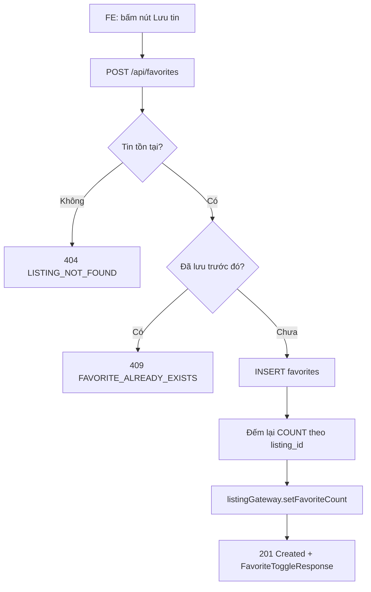

**Luồng ghi lịch sử xem (không có endpoint riêng trong controller đã đọc — được kích hoạt nội bộ khi xem chi tiết tin, xem `HistoryService.recordView` gọi từ module `listing`)**: nhận `listingId, userId (nullable), sessionId, ipAddress, userAgent, referrer` → kiểm tra trùng trong cửa sổ `view.dedup_minutes` theo `userId` (nếu đăng nhập) hoặc `ipAddress` (khách ẩn danh) → ghi `ViewHistory` với cờ `isCounted`.

### 5. Dữ liệu chạy như thế nào

- **Input**: `CreateFavoriteRequest { listingId, note }` (FE) → **FE xử lý**: gọi `favoriteApi.add/remove/list` (chỉ HTTP, không biến đổi dữ liệu) → **API request**: JSON body → **BE validate**: Bean Validation (`@Valid`) + kiểm tra tồn tại qua gateway → **Business logic**: chống trùng, sanitize `note`, đồng bộ `favorite_count` → **DB**: `INSERT/DELETE favorites`, `UPDATE listings.favorite_count` (qua gateway, cross-module) → **Response**: `FavoriteToggleResponse { listingId, favorited, favoriteCount }` (khi thêm) hoặc `204 No Content` (khi xóa) → **FE update**: cập nhật icon trái tim + đếm số trên `ListingCard`.
- **DTO biến đổi dữ liệu**: `Favorite` (entity) → `FavoriteResponse`/`FavoriteToggleResponse` (qua `FavoriteMapper`, kèm ghép `ListingGateway.ListingBrief` để hiển thị tiêu đề/ảnh/giá — dữ liệu tin không được lưu trùng lặp trong bảng `favorites`, chỉ join runtime).
- **Với lịch sử xem**: `ViewHistory` (entity) → `ViewHistoryResponse` qua `HistoryMapper`, kèm cờ `favoritedByMe` tính runtime bằng truy vấn `favoriteRepository.existsByUserIdAndListingIdAndDeletedAtIsNull` cho từng dòng (N+1 tiềm ẩn — xem mục 11).

### 6. Database liên quan

**Bảng `favorites`** (kế thừa audit: `created_at/updated_at/created_by/updated_by/deleted_at`)

| Field | Kiểu | Ý nghĩa |
|---|---|---|
| `id` | BIGINT UNSIGNED PK | |
| `user_id` | BIGINT UNSIGNED FK→users, NOT NULL | Người lưu tin |
| `listing_id` | BIGINT UNSIGNED FK→listings, NOT NULL | Tin được lưu |
| `note` | VARCHAR(255) NULL | Ghi chú riêng |

- Unique: `uk_favorites_user_listing (user_id, listing_id)` — **không có `deleted_at` trong khóa** ⇒ lý do phải xóa cứng.
- Index: `idx_favorites_user_id_created_at`, `idx_favorites_listing_id`.
- Quan hệ: N-1 tới `users`, N-1 tới `listings` (cả hai FK chéo module chỉ giữ `Long` ở tầng entity theo luật ranh giới module).

**Bảng `view_histories`** (append-only, không audit đầy đủ)

| Field | Ý nghĩa |
|---|---|
| `listing_id`, `user_id` (nullable), `session_id`, `ip_address`, `user_agent`, `referrer` | Ngữ cảnh lượt xem |
| `is_counted` | Có tính vào `listings.view_count` không (đã khử trùng lặp) |
| `viewed_at`, `created_at` | Mốc thời gian |

- Index khử trùng: `idx_view_histories_dedup (listing_id, user_id, viewed_at)`, `idx_view_histories_dedup_anon (listing_id, ip_address, viewed_at)`.

**Bảng `search_histories`** (append-only)

| Field | Ý nghĩa |
|---|---|
| `user_id` (nullable) | |
| `keyword` | Từ khóa tự do |
| `criteria` | JSON toàn bộ bộ lọc (provinceId, priceFrom...) |
| `result_count` | Số kết quả trả về — dùng phát hiện "tìm kiếm ít kết quả" |
| `session_id`, `ip_address` | |

> Note quan trọng: cả hai bảng `view_histories`/`search_histories` **KHÔNG có `deleted_at`** trong schema DB thật — vì vậy entity Java cũng cố tình không kế thừa `AuditableEntity`. Nếu ai đó "sửa cho giống chuẩn" bằng cách thêm kế thừa audit sẽ làm `ddl-auto=validate` fail khi khởi động app.

### 7. API liên quan

| Method | URL | Request | Response | Auth | Permission | Validation | Error chính |
|---|---|---|---|---|---|---|---|
| POST | `/api/favorites` | `CreateFavoriteRequest{listingId, note?}` | `FavoriteToggleResponse` | JWT | `FAVORITE_MANAGE` | listingId bắt buộc | `LISTING_NOT_FOUND`, `FAVORITE_ALREADY_EXISTS` (409) |
| DELETE | `/api/favorites/{listingId}` | — | `204 No Content` | JWT | `FAVORITE_MANAGE` | — | `FAVORITE_NOT_FOUND` (404) |
| GET | `/api/favorites` | Query `Pageable` (default size 20, sort `createdAt,desc`) | `PageResponse<FavoriteResponse>` | JWT | `FAVORITE_MANAGE` | — | — |
| GET | `/api/history/views` | Query `from,to` (LocalDate), `Pageable` (default sort `viewedAt,desc`) | `PageResponse<ViewHistoryResponse>` | JWT | `isAuthenticated()` | — | > Cần bổ sung: BE nhận `from/to` nhưng **không lọc theo khoảng ngày ở tầng DB** (ghi rõ trong code — `ViewHistoryRepository` thiếu finder lọc ngày) |
| DELETE | `/api/history/views` | — | `204` | JWT | `isAuthenticated()` | Rate limit 5/giờ | `RateLimitException` (429) |
| DELETE | `/api/history/views/{id}` | — | `204` | JWT | `isAuthenticated()` | Chỉ chủ sở hữu | `RESOURCE_NOT_FOUND`, `FORBIDDEN` |
| GET | `/api/search/histories` | `Pageable` (default sort `createdAt,desc`) | `PageResponse<SearchHistoryResponse>` | JWT | `isAuthenticated()` | — | — |
| DELETE | `/api/search/histories` | Query `id?` (null = xóa hết) | `204` | JWT | `isAuthenticated()` | Rate limit 5/giờ | `RESOURCE_NOT_FOUND`, `FORBIDDEN` |

### 8. Dependency

- **Phụ thuộc vào**: `ListingGateway` (module listing — lấy brief tin, cập nhật `favorite_count`), `SystemConfigService` (đọc `view.dedup_minutes`), Redis gián tiếp qua `RateLimitService`.
- **Được phụ thuộc bởi**: `ReviewServiceImpl.hasEverContacted` KHÔNG dùng favorite nhưng `HistoryService` cung cấp dữ liệu nền cho **AI Recommendation** (content-based dựa trên hành vi xem/lưu — xem `modules/ai/spi/InteractionSignalGateway`), và **Chatbot** gián tiếp qua tìm kiếm tương tự.
- Frontend `SavedListingsPage`/`ViewHistoryPage` phụ thuộc `favoriteApi.js`/`historyApi.js`.

### 9. Các trường hợp cần kiểm tra

- [ ] Lưu tin thành công → `favorite_count` tăng đúng 1 trên tin.
- [ ] Lưu trùng tin đã lưu → 409, không tăng đếm.
- [ ] Lưu tin đã bị xóa/không tồn tại → 404.
- [ ] Bỏ lưu tin không tồn tại trong danh sách của mình → 404 `FAVORITE_NOT_FOUND`.
- [ ] Bỏ lưu rồi lưu lại ngay (test hard-delete không đụng unique constraint).
- [ ] Phân trang danh sách tin đã lưu khi có > 20 tin (default size), sort `createdAt desc`.
- [ ] Danh sách rỗng (chưa lưu tin nào) → `items: []`, không lỗi.
- [ ] Xem lại tin đã lưu nhưng tin đã bị landlord xóa/ẩn → FE hiển thị đúng trạng thái (kiểm tra field liên quan trong `FavoriteResponse`).
- [ ] Ghi lịch sử xem: xem 2 lần liên tiếp trong cửa sổ dedup → lần 2 `isCounted=false`, không tăng `view_count`.
- [ ] Khách ẩn danh (chưa đăng nhập) xem tin → `view_histories.user_id = NULL`, dedup theo `ip_address`.
- [ ] Xóa 1 mục lịch sử xem của người khác → 403 `FORBIDDEN`.
- [ ] Xóa toàn bộ lịch sử xem quá 5 lần/giờ → 429 rate limit.
- [ ] Lọc lịch sử xem theo `from`/`to` — **kiểm tra kỹ vì code hiện KHÔNG áp dụng lọc ở DB** (xem mục 11).
- [ ] Concurrent: 2 request lưu tin cùng lúc cho cùng user+listing → chỉ 1 thành công (unique constraint DB là lưới an toàn cuối).
- [ ] `DataRetentionJob` chạy đúng xóa log > 180 ngày, không đụng dữ liệu mới hơn.

### 10. Các lỗi dễ gặp

- **Lọc theo ngày (`from`/`to`) ở `GET /api/history/views` không có tác dụng thật** — tham số được nhận nhưng `ViewHistoryRepository` không có finder lọc khoảng ngày, code có log cảnh báo ghi rõ điều này. Dev mới dễ tưởng đây là bug UI khi filter không ra kết quả đúng, thực chất là giới hạn ở BE.
- Nhầm lẫn giữa xóa mềm (đa số module) và xóa cứng (`Favorite`, `ViewHistory`, `SearchHistory`) — nếu thêm cột `deleted_at` cho 2 bảng log sẽ vi phạm `ddl-auto=validate`.
- Quên rằng `note` bị `HtmlSanitizer.stripAllHtml` — test nhập HTML/script vào note để xác nhận không XSS.
- `favoriteCount` hiển thị sai nếu có thao tác xóa tin song song không qua `listingGateway.setFavoriteCount` (đồng bộ một chiều, không có job đối soát định kỳ riêng cho favorite — khác với review/trust score có job `TrustScoreRecalcJob`).
- Rate limit xóa lịch sử dùng **hằng số cứng trong controller** (`HISTORY_DELETE_MAX_PER_HOUR = 5`), KHÔNG đọc từ `system_configs` — sửa qua màn hình cấu hình hệ thống sẽ không có tác dụng với giới hạn này.

### 11. Các điểm cần review

- **Business**: filter `from/to` trên lịch sử xem không hoạt động — cần quyết định: (a) bổ sung `@Query` lọc ngày ở repository, hay (b) bỏ tham số khỏi API/FE để tránh gây hiểu nhầm.
- **Performance**: `HistoryServiceImpl.listViews` gọi `favoriteRepository.existsByUserIdAndListingIdAndDeletedAtIsNull` **cho từng item trong trang** (N+1 query nhỏ, N ≤ 20/trang nên chấp nhận được nhưng nên `IN` batch nếu tăng page size).
- **DB**: thiếu cơ chế đối soát định kỳ cho `favorite_count` (không có job); nếu có lỗi runtime giữa bước INSERT và bước gọi gateway cập nhật đếm (transaction rollback khác nhau giữa 2 module) có thể lệch số — kiểm tra `@Transactional` bao trọn cả 2 bước chưa (có, cùng 1 transaction).
- **API naming**: `HistoryController` gộp cả view và search dưới `/api` gốc (`/api/history/views`, `/api/search/histories`) — không nhất quán prefix (`history/` vs `search/`), nên thống nhất `/api/history/*` nếu refactor.
- **UX**: xóa cứng lịch sử xem nghĩa là AI Recommendation mất tín hiệu vĩnh viễn ngay khi người dùng xóa — cần xác nhận đây là chủ đích (quyền riêng tư) hay ảnh hưởng ngoài ý muốn tới chất lượng gợi ý.

### 12. Kết quả mong đợi

- Lưu/bỏ lưu tin hoạt động chính xác, chống trùng, đếm số liệu đúng theo thời gian thực.
- Lịch sử xem/tìm kiếm ghi nhận đúng, khử trùng lặp theo cấu hình, xóa được (từng phần/toàn bộ) trong giới hạn rate limit.
- Dữ liệu hành vi sạch, đủ tin cậy làm đầu vào cho AI Recommendation/Chatbot.
- Không rò rỉ dữ liệu người dùng khác (kiểm tra quyền sở hữu khi xóa từng mục).

---

## Module: Contact & Chat nội bộ (Conversation)

### 1. Module này dùng để làm gì?

Cho phép người thuê liên hệ chủ trọ theo 3 kênh: **xem số điện thoại** (`VIEW_PHONE`), **gửi form liên hệ** (`FORM`, có nội dung + SĐT callback), và **bắt đầu chat nội bộ** (`START_CHAT` → tạo `Conversation` + tin nhắn đầu tiên). Đây là module cầu nối giữa nhu cầu thuê trọ thực tế và chủ nhà — vai trò tương đương "cổng giao tiếp" chính của toàn nền tảng, đồng thời ghi `contact_logs` để (a) tính `listings.contact_count`, (b) làm điều kiện cho tính năng đánh giá (`review.require_contact`), (c) chống spam liên hệ.

**Nếu hỏng**: người thuê không thể liên hệ chủ trọ (chức năng lõi của một sàn cho thuê trọ ngưng hoạt động), chủ trọ không biết ai quan tâm tin của mình, tính năng chat nội bộ (thay thế Zalo/gọi điện) mất tác dụng, hệ thống đánh giá bị khóa (vì yêu cầu đã từng liên hệ).

### 2. Chức năng Frontend

| Màn hình / Component | File | Mô tả |
|---|---|---|
| Chat nội bộ (người thuê) | `frontend_webtro/src/pages/tenant/MessagesPage.jsx` | Layout 2 cột: danh sách hội thoại (trái, `List/ListItemButton`, `Badge` số chưa đọc) + khung chat (phải, `TextField` nhập + `IconButton Send`). Responsive: mobile ẩn danh sách khi đang xem 1 hội thoại (`useMediaQuery`). Đồng bộ `conversationId` lên query string bằng `useSearchParams`. |
| Người liên hệ tin (chủ trọ) | `frontend_webtro/src/pages/landlord/ContactsPage.jsx` | Bảng MUI `Table` liệt kê người đã liên hệ (tên, tin, kênh, thời gian), `Chip` tổng hợp số liệu theo kênh (Tổng/Xem SĐT/Gửi form/Nhắn tin), filter theo tin/kênh/ngày, `TablePagination`, nút mở hội thoại tương ứng (điều hướng sang `/quan-ly/tin-nhan?conversationId=...`). |
| Nút liên hệ + hiển thị SĐT trên trang chi tiết tin | `frontend_webtro/src/pages/public/ListingDetailPage.jsx` (khối liên hệ — **chia sẻ với Người 2**, Người 3 chỉ phụ trách phần tương tác/nút liên hệ, không phải nội dung mô tả tin) | Gọi `contactApi.getContactInfo`/`contactApi.contactListing` khi bấm "Xem số điện thoại"/"Gửi liên hệ"/"Nhắn tin". |
| Widget chatbot (không thuộc Conversation nhưng dùng chung UI pattern chat) | `frontend_webtro/src/components/chatbot/ChatbotWidget.jsx` | Xem chi tiết ở Module AI. |

**API client FE**: `frontend_webtro/src/api/contactApi.js` — bao gồm cả `contactListing`, `getLandlordContacts`, `getConversations`, `createConversation`, `getMessages`, `sendMessage`, `getConversation`, `markRead`, `getContactInfo`.

### 3. Chức năng Backend

- **Controller**: `ContactController` (`/api/listings/{id}/contact-info`, `/api/listings/{id}/contact`, `/api/landlord/contacts`), `ConversationController` (`/api/conversations/**`).
- **Service**: `ContactService`/`ContactServiceImpl`, `ConversationService`/`ConversationServiceImpl`.
- **Repository**: `ContactLogRepository`, `ConversationRepository`, `MessageRepository`.
- **Listener**: `ContactNotificationListener` — lắng nghe `ContactCreatedEvent` (`AFTER_COMMIT`, `Propagation.REQUIRES_NEW`) để báo chủ trọ qua `NotificationService.notifyUser(..., NEW_CONTACT, ...)`.
- **SPI Gateway**: `ListingGateway` (brief tin, tăng `contact_count`), `UserGateway` (thông tin liên hệ chủ trọ, kiểm tra `isContactRestricted`, `isLandlordChatEnabled`), `BannedKeywordGateway` (quét từ cấm trong nội dung form/tin nhắn).
- **Validation**: `CreateContactRequest` (`type` bắt buộc có message khi `FORM`/`START_CHAT`), `CreateConversationRequest`, `SendMessageRequest`.
- **Business logic đáng chú ý**: khử trùng lặp liên hệ theo `contact.dedup_minutes`; chặn tự liên hệ chính mình (`CONTACT_FORBIDDEN_SELF`); chặn user bị `contact_restricted` (do spam report); chặn nếu chủ trọ tắt chat (`isLandlordChatEnabled=false` → `CHAT_DISABLED_BY_LANDLORD`); quét từ cấm (`BannedKeywordGateway.scan(..., BOTH)`) trước khi lưu nội dung.
- **Rate limit**: `contact-info` 60/giờ, `contact` (tạo liên hệ) 20/giờ, `conversation` (tạo hội thoại) 20/giờ, `message` (gửi tin nhắn) theo `ConfigKey.SPAM_MESSAGE_PER_MINUTE` — tất cả qua `RateLimitService` (Redis).
- **Event**: `ContactCreatedEvent(listingId, ownerId, contacterId)` phát từ cả `ContactServiceImpl` (VIEW_PHONE/FORM/START_CHAT) lẫn `ConversationServiceImpl.writeChatContactLog` (chat trực tiếp không qua contact form) — gộp lại 1 listener để tránh trùng logic.

### 4. Luồng hoạt động

**Luồng gửi liên hệ (CONT-01/02)**:

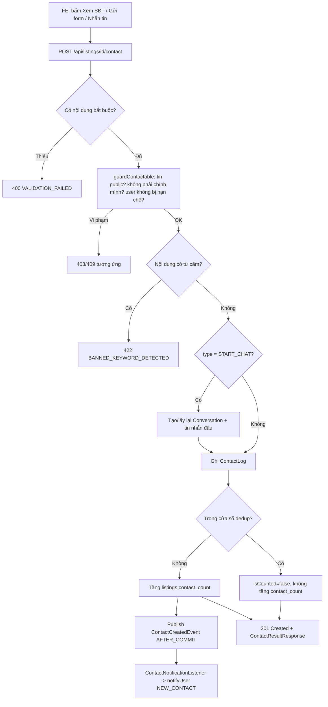

**Luồng chat (CONT-03/04)**: `POST /api/conversations` tạo/lấy lại hội thoại theo bộ ba `(listingId, tenantId, landlordId)` (idempotent — nếu đã tồn tại trả `200 OK` với `alreadyExisted=true` thay vì `201`); mỗi tin nhắn gửi qua `POST /api/conversations/{id}/messages` cập nhật `lastMessageAt`, `lastMessagePreview`, bộ đếm chưa đọc (`tenantUnreadCount`/`landlordUnreadCount`), và ghi mốc `firstResponseAt` (idempotent — chỉ set lần đầu chủ trọ trả lời) phục vụ tính SLA phản hồi chủ trọ.

### 5. Dữ liệu chạy như thế nào

- **Input**: `CreateContactRequest{type, message?, callbackPhone?}` hoặc `SendMessageRequest{content}` → **FE**: `contactApi.js` chỉ forward HTTP → **BE validate**: Bean Validation + `guardContactable` (nghiệp vụ) → **Business logic**: quét từ cấm → sanitize HTML → ghi `ContactLog`/`Message` → cập nhật đếm trên `Conversation`/`Listing` (cross-module qua gateway) → **DB**: `INSERT contact_logs`, `INSERT/UPDATE conversations`, `INSERT messages` → **Response**: `ContactResultResponse`/`ConversationCreatedResponse`/`MessageResponse` (DTO ghép thêm dữ liệu từ `ListingGateway`/`UserGateway`, không lưu trùng lặp trong bảng `contact_logs`/`messages`) → **FE update**: cập nhật khung chat / bảng người liên hệ realtime (polling thủ công, không có WebSocket — xem mục 11).
- **DTO trung gian đáng chú ý**: `ContactInfoResponse` gộp dữ liệu từ `UserGateway.LandlordContactInfo` (SĐT, Zalo, `chatEnabled`, `verified`) + trạng thái `conversationId` nếu đã từng chat — một response tổng hợp 2 module.

### 6. Database liên quan

**Bảng `contact_logs`**

| Field | Ý nghĩa |
|---|---|
| `listing_id`, `user_id`, `owner_id` | 3 khóa ngoại chéo module (Long) |
| `contact_type` | `VIEW_PHONE` / `FORM` / `CHAT` |
| `message`, `contact_name`, `contact_phone` | Nội dung form (nullable) |
| `is_counted` | Có tính vào `contact_count` không (khử trùng lặp theo `contact.dedup_minutes`) |
| `is_read_by_owner` | Chủ trọ đã đọc chưa |

- Check DB: `ck_contact_logs_not_self (user_id <> owner_id)` — ràng buộc ở cả tầng DB lẫn service (`guardContactable`), 2 lớp bảo vệ.
- Index dedup: `idx_contact_logs_dedup (listing_id, user_id, created_at)`.

**Bảng `conversations`**

| Field | Ý nghĩa |
|---|---|
| `listing_id`, `tenant_id`, `landlord_id` | Bộ ba xác định hội thoại duy nhất |
| `status` | `ACTIVE`/`ARCHIVED`/`BLOCKED` |
| `first_response_at` | Mốc chủ trọ phản hồi lần đầu — dùng tính SLA |
| `last_message_at`, `last_message_preview` | Hiển thị nhanh danh sách hội thoại |
| `tenant_unread_count`, `landlord_unread_count`, `message_count` | Bộ đếm denormalized |

- Unique: `uk_conversations_listing_tenant_landlord (listing_id, tenant_id, landlord_id)` — 1-N tới `messages`.
- Check: `ck_conversations_not_self (tenant_id <> landlord_id)`.

**Bảng `messages`** (1 `conversation` — N `messages`, quan hệ `@ManyToOne(LAZY)` **trong cùng module** nên map object thật, khác với các FK chéo module chỉ giữ `Long`)

| Field | Ý nghĩa |
|---|---|
| `conversation_id` | FK→conversations |
| `sender_id` | FK→users (chéo module, Long) |
| `content` | Tối đa 2000 ký tự |
| `is_read`, `read_at` | Check `ck_messages_read`: `is_read=false OR read_at IS NOT NULL` |

### 7. API liên quan

| Method | URL | Request | Response | Auth | Permission | Error chính |
|---|---|---|---|---|---|---|
| GET | `/api/listings/{id}/contact-info` | — | `ContactInfoResponse` | JWT | `CONTACT_CREATE` | `LISTING_NOT_ACTIVE`, `CONTACT_FORBIDDEN_SELF`, `CONTACT_RESTRICTED_SPAM` |
| POST | `/api/listings/{id}/contact` | `CreateContactRequest{type, message?, callbackPhone?}` | `ContactResultResponse` | JWT | `CONTACT_CREATE` | như trên + `BANNED_KEYWORD_DETECTED`, `CHAT_DISABLED_BY_LANDLORD` |
| GET | `/api/landlord/contacts` | Query `listingId?, type?, from?, to?, Pageable` | `LandlordContactPageResponse` | JWT | `LISTING_CREATE` | `LISTING_FORBIDDEN` (nếu `listingId` không thuộc mình) |
| GET | `/api/conversations` | Query `role?(ALL/AS_TENANT/AS_LANDLORD), unreadOnly?, listingId?, Pageable` | `ConversationPageResponse` | JWT | `CONTACT_CREATE` | — |
| POST | `/api/conversations` | `CreateConversationRequest{listingId, initialMessage}` | `ConversationCreatedResponse` (200 nếu đã tồn tại, 201 nếu mới) | JWT | `CONTACT_CREATE` | `LISTING_NOT_ACTIVE`, `CONTACT_FORBIDDEN_SELF`, `CHAT_DISABLED_BY_LANDLORD` |
| GET | `/api/conversations/{id}` | — | `ConversationResponse` | JWT | `CONTACT_CREATE` | `CONVERSATION_NOT_FOUND`, `CONVERSATION_FORBIDDEN` |
| GET | `/api/conversations/{id}/messages` | `Pageable` (default size 30, sort `createdAt,asc`) | `PageResponse<MessageResponse>` | JWT | `CONTACT_CREATE` | như trên |
| POST | `/api/conversations/{id}/messages` | `SendMessageRequest{content}` | `MessageResponse` (201) | JWT | `CONTACT_CREATE` | `CONTACT_RESTRICTED_SPAM`, `BANNED_KEYWORD_DETECTED`, rate limit |
| POST | `/api/conversations/{id}/read` | — | `204` | JWT | `CONTACT_CREATE` | — |

### 8. Dependency

- **Phụ thuộc**: `ListingGateway`, `UserGateway`, `BannedKeywordGateway` (module moderation), `SystemConfigService` (`contact.dedup_minutes`, `spam.message_per_minute`), `NotificationService` (module notification, chỉ gọi không sửa), Redis (`RateLimitService`).
- **Được phụ thuộc bởi**: `ReviewServiceImpl.hasEverContacted` dùng `ContactLogRepository` để kiểm tra điều kiện đánh giá (`review.require_contact`); FE `ListingDetailPage` (Người 2 sở hữu phần còn lại của trang).

### 9. Các trường hợp cần kiểm tra

- [ ] Xem SĐT lần đầu → ghi log, tăng `contact_count`; xem lại trong cửa sổ dedup → không tăng.
- [ ] Gửi form thiếu nội dung khi `type` yêu cầu message → 400.
- [ ] Gửi form/chat chứa từ cấm mức SEVERE (BOTH scope) → 422, không lưu.
- [ ] Liên hệ tin của chính mình → 409/403 `CONTACT_FORBIDDEN_SELF`.
- [ ] Liên hệ khi tài khoản bị `contact_restricted` (do report nhiều) → 403.
- [ ] Bắt đầu chat khi chủ trọ tắt `chatEnabled` → 409/422 `CHAT_DISABLED_BY_LANDLORD`.
- [ ] Tạo hội thoại lần 2 cho cùng bộ ba (listing, tenant, landlord) → trả về hội thoại cũ (200, `alreadyExisted=true`), không tạo bản ghi mới (kiểm tra unique constraint không bị vi phạm).
- [ ] Gửi tin nhắn khi không phải thành viên hội thoại → 403 `CONVERSATION_FORBIDDEN`.
- [ ] Gửi tin nhắn vượt rate limit/phút → 429.
- [ ] Đánh dấu đã đọc → `unreadCount` về 0, các `Message.isRead=true/readAt` được set đúng (giới hạn quét `READ_SCAN_CAP=500` — hội thoại > 500 tin chưa đọc sẽ không đánh dấu hết, xem mục 10).
- [ ] `firstResponseAt` chỉ được set 1 lần khi chủ trọ trả lời lần đầu (test gửi nhiều tin từ chủ trọ, mốc không đổi sau lần đầu).
- [ ] Danh sách hội thoại role=ALL khi user có > 200 hội thoại ở vai trò tenant hoặc landlord → kiểm tra có bị cắt dữ liệu (giới hạn `MERGE_CAP=200`, xem mục 10).
- [ ] Filter `listingId`/`type`/`from`/`to` ở `GET /api/landlord/contacts` — **kiểm tra kỹ, có dấu hiệu không lọc thật ở DB** (xem mục 10/11).
- [ ] Phân trang tin nhắn: trang đầu vs trang sau, thứ tự tăng dần theo `createdAt`.
- [ ] Concurrent: 2 tin nhắn gửi đồng thời trong cùng hội thoại → không mất tin, `messageCount` cộng đúng (transaction từng request, `Conversation` không có optimistic lock — rủi ro lost update khi tải cao, xem mục 11).

### 10. Các lỗi dễ gặp

- **`GET /api/landlord/contacts` bỏ qua bộ lọc `listingId`, `type`, `from`, `to` ở tầng truy vấn thật**: controller/service nhận đủ tham số, nhưng đoạn code chỉ dùng `listingId` để **kiểm tra quyền sở hữu** (nếu `listingId != null` mà không phải tin của mình → 403), sau đó câu query thực thi là `contactLogRepository.findByOwnerIdAndDeletedAtIsNull(ownerId, pageable)` — **không truyền `listingId`/`type`/`from`/`to` vào query**. Kết quả: chủ trọ chọn lọc theo tin/kênh/ngày trên UI nhưng bảng vẫn hiển thị TẤT CẢ liên hệ của mọi tin. Đây là lỗi thật cần xác nhận với BE — so sánh với docstring trong code (`"lọc listingId/type/ngày áp dụng ở tầng bộ nhớ trên trang hiện tại"`) nhưng thực tế không có bước lọc bộ nhớ nào được viết.
- Danh sách hội thoại role=`ALL` gộp tối đa 200 hội thoại mỗi vai trò rồi phân trang thủ công trong bộ nhớ (`MERGE_CAP=200`) — tài khoản có nhiều hội thoại hơn sẽ bị cắt bớt kết quả một cách âm thầm (không lỗi, chỉ thiếu dữ liệu).
- `markRead` chỉ quét tối đa 500 tin gần nhất (`READ_SCAN_CAP`) — hội thoại rất dài với > 500 tin chưa đọc sẽ còn sót tin chưa được đánh dấu đọc.
- Không có WebSocket/SSE — `MessagesPage.jsx` không tự động nhận tin mới real-time, phải tự tải lại (kiểm tra UX có polling hay yêu cầu người dùng bấm làm mới).
- Nhầm giữa `ContactLog.contactType=CHAT` (được ghi mỗi lần **mở** chat mới trong cửa sổ dedup) và số tin nhắn thực tế — `contact_count` KHÔNG bằng số tin nhắn.

### 11. Các điểm cần review

- **Business (nghiêm trọng)**: xác nhận và sửa lỗi filter không hoạt động ở `GET /api/landlord/contacts` (mục 10) — ảnh hưởng trực tiếp trải nghiệm chủ trọ khi có nhiều tin đăng.
- **Concurrency**: `Conversation` không có `@Version` (optimistic locking) — 2 tin nhắn gửi đồng thời có thể ghi đè bộ đếm `messageCount`/`unreadCount` (lost update kinh điển: đọc → cộng → ghi không atomic). Nên cân nhắc `UPDATE ... SET count = count + 1` ở tầng SQL hoặc thêm `@Version`.
- **Performance**: `listConversations(role=ALL)` tải tối đa 400 bản ghi vào bộ nhớ mỗi request rồi sort/paginate thủ công — không mở rộng tốt cho landlord có hàng nghìn hội thoại; nên có finder DB gộp hoặc UNION query.
- **API response**: `POST /api/conversations` trả `200` hay `201` tùy `alreadyExisted` — kiểm tra FE có xử lý đúng cả 2 status code (nhiều client chỉ check `res.ok`, không phân biệt).
- **Security**: nội dung tin nhắn/form đã qua `HtmlSanitizer.stripAllHtml` + quét từ cấm — xác nhận không có đường vòng (vd. Unicode homoglyph, zero-width) qua được bộ lọc từ cấm.
- **UX**: không có cơ chế "đang nhập..." hay đọc realtime — nếu roadmap cần, đây là điểm để đề xuất cải tiến (không phải bug).

### 12. Kết quả mong đợi

- 3 kênh liên hệ hoạt động đúng, chống trùng lặp, chống spam theo rate limit.
- Chat nội bộ tạo/khôi phục đúng hội thoại theo bộ ba, tin nhắn gửi/nhận/đánh dấu đọc chính xác.
- Chủ trọ nhận thông báo kịp thời khi có người liên hệ (qua `notifyUser`).
- Bảng "Người liên hệ" của chủ trọ lọc đúng theo tin/kênh/ngày (sau khi fix lỗi mục 10).

---

## Module: Comment & Review (+ kiểm duyệt admin)

### 1. Module này dùng để làm gì?

Hai tính năng tương tác công khai trên trang chi tiết tin:

- **Comment (bình luận — CMT-01..04)**: người dùng đã đăng nhập bình luận dưới tin đăng, hỗ trợ trả lời 1 cấp (không cho nested sâu hơn), tự động kích hoạt **AI phân tích cảm xúc** sau khi tạo/sửa (qua event, không đồng bộ). Kết quả cảm xúc ảnh hưởng tới **điểm uy tín (trust score)** của tin/chủ trọ.
- **Review (đánh giá — REV-01..03)**: người dùng đã từng liên hệ tin (tùy cấu hình `review.require_contact`) được để lại 1–5 sao + nội dung (bắt buộc nội dung nếu rating ≤ 2). Điểm trung bình tin/chủ trọ được cập nhật **tăng dần (incremental)** ngay trong transaction.
- **Kiểm duyệt admin (ADM-11)**: Moderator/Admin (`COMMENT_MODERATE`/`REVIEW_MODERATE`) ẩn/khôi phục bình luận & đánh giá vi phạm, đánh dấu spam (loại khỏi công thức tính uy tín), xử lý hàng loạt bình luận.

**Vai trò trong hệ thống**: đây là nguồn "tín hiệu chất lượng" quan trọng nhất cho tin đăng — vừa phục vụ người dùng tham khảo, vừa là input chính cho AI cảm xúc và điểm uy tín tin/chủ trọ (một hệ thống chống lừa đảo/tin giả gián tiếp).

**Nếu hỏng**: mất niềm tin của người thuê (không còn đánh giá thực), AI cảm xúc không có dữ liệu để phân tích, điểm uy tín tin sai lệch, kiểm duyệt viên không kiểm soát được nội dung độc hại/spam.

### 2. Chức năng Frontend

| Màn hình / Component | File | Mô tả |
|---|---|---|
| Khối bình luận + đánh giá trên trang chi tiết tin | `frontend_webtro/src/pages/public/ListingDetailPage.jsx` (chia sẻ với Người 2 — Người 3 phụ trách khối bình luận/đánh giá) | Form nhập bình luận, danh sách bình luận + trả lời, form đánh giá sao (`RatingStars`), tóm tắt phân bố sao. |
| Đánh giá của tôi | `frontend_webtro/src/pages/tenant/MyReviewsPage.jsx` | `Card` từng đánh giá (avatar tin, `RatingStars readOnly`, `StatusChip` trạng thái tin, `Chip "Đã bị ẩn"` nếu bị kiểm duyệt), `Dialog` sửa đánh giá trong cửa sổ cho phép, nút xóa (`ConfirmDialog`), `Pagination`. |
| Kiểm duyệt bình luận (admin) | `frontend_webtro/src/pages/admin/CommentsPage.jsx` | `AdminDataTable` dùng chung, cột `Chip` cảm xúc (`SENTIMENT_META`) + trạng thái (`COMMENT_STATUS_META`), menu 3 chấm (`Ẩn`/`Đánh dấu spam`), `ConfirmDialog` bắt nhập lý do khi ẩn, filter theo trạng thái/cảm xúc/spam/từ khóa/tin. |
| Kiểm duyệt đánh giá (admin) | `frontend_webtro/src/pages/admin/ReviewsPage.jsx` | > Cần bổ sung theo source code (chưa đọc chi tiết) — cùng pattern `AdminDataTable` + `ConfirmDialog` như CommentsPage, filter theo trạng thái/số sao/tin/chủ trọ/từ khóa (theo API `AdminReviewController`). |

**API client FE**: `frontend_webtro/src/api/commentApi.js`, `frontend_webtro/src/api/reviewApi.js`, thao tác admin qua `frontend_webtro/src/api/adminApi.js` (`hideComment`, `markCommentSpam`, ...).

### 3. Chức năng Backend

- **Controller**: `CommentController` (`/api/listings/{id}/comments`, `/api/comments/{id}/reply`, `/api/comments/{id}`), `ReviewController` (`/api/listings/{id}/reviews`, `/api/reviews/{id}`, `/api/reviews/my`, `/api/users/{id}/reviews`), `AdminCommentController` (`/api/admin/comments`), `AdminReviewController` (`/api/admin/reviews`).
- **Service**: `CommentService`/`CommentServiceImpl`, `ReviewService`/`ReviewServiceImpl`.
- **Repository**: `CommentRepository`, `ReviewRepository`, dùng `Specification` (`CommentSpecifications`, `ReviewSpecifications`) cho lọc admin động.
- **SPI Gateway**: `ListingGateway` (brief tin, cập nhật `comment_count`, `review_count`/`average_rating`), `UserGateway` (brief tác giả, `isCommentSuspended`, cập nhật `LandlordAggregate`), `BannedKeywordGateway` (quét từ cấm), `TrustScoreService` (module listing — tính lại điểm uy tín sau mỗi thay đổi review).
- **Event**: `CommentCreatedEvent(commentId, listingId)` — phát sau tạo **và** sau sửa bình luận (canonical: sửa bình luận phải re-analyze cảm xúc).
- **Validation**: `CreateCommentRequest`, `UpdateCommentRequest`, `CreateReviewRequest`, `ModerationReasonRequest` (lý do ẩn bắt buộc), `BulkCommentActionRequest`.
- **Audit**: mọi hành động kiểm duyệt (`hide`/`unhide`/`spam` cho comment, `hide`/`unhide` cho review) đều ghi `AuditLogService.record(...)`.

### 4. Luồng hoạt động

**Luồng tạo bình luận (CMT-01/02)**:

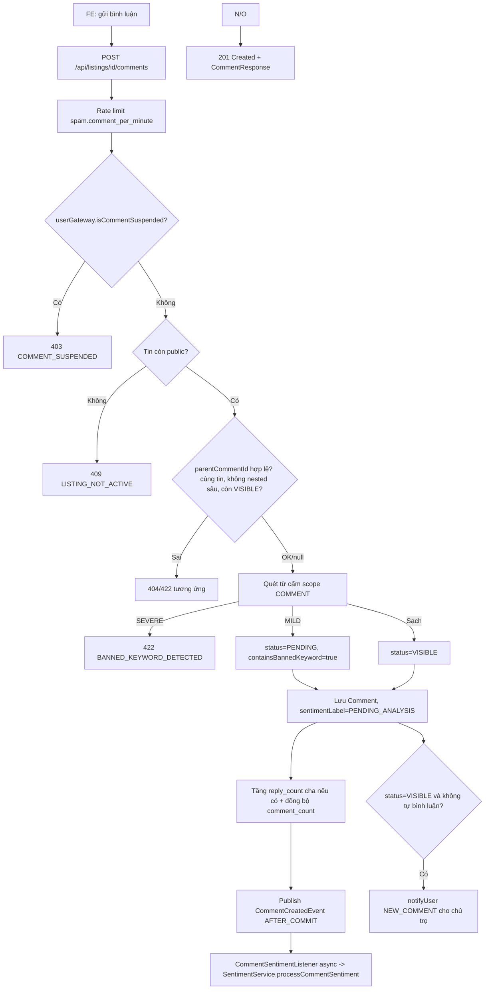

**Luồng tạo đánh giá (REV-01)**: kiểm tra `publiclyVisible`, không tự đánh giá tin mình, chưa từng đánh giá tin này (`uk_reviews_user_listing`), điều kiện `review.require_contact` (đã từng có `ContactLog` chưa), validate nội dung bắt buộc khi rating ≤ 2 → lưu `Review` → **cập nhật tăng dần** trung bình sao của tin (`applyListingAggregateOnAdd`) và của chủ trọ (`applyLandlordAggregateOnAdd`) → gọi `TrustScoreService.recalculateAndSaveListing`/`recalculateLandlord` → thông báo chủ trọ `NEW_REVIEW`.

### 5. Dữ liệu chạy như thế nào

- **Input**: `CreateCommentRequest{content, parentCommentId?}` / `CreateReviewRequest{rating, content?}` → **FE**: gửi thẳng qua `commentApi`/`reviewApi` (không xử lý nghiệp vụ) → **BE validate**: Bean Validation + nghiệp vụ (cửa sổ sửa, trạng thái tin, quyền) → **Business logic**: sanitize HTML, quét từ cấm, tính lại đếm/điểm trung bình → **DB**: `INSERT/UPDATE comments`, `INSERT/UPDATE reviews`, cập nhật denormalized field bên `listings`/`users` (cross-module qua gateway) → **Response**: `CommentResponse`/`ReviewResponse` kèm `editable`, `editableUntil`, `deletable` tính runtime theo `viewerId` và cửa sổ thời gian (`comment.edit_window_minutes`, `review.edit_window_hours`) → **FE update**: chèn bình luận/đánh giá mới vào danh sách, cập nhật điểm trung bình hiển thị.
- **DTO đáng chú ý**: `CommentResponse.sentimentLabel` khởi tạo `PENDING_ANALYSIS` và **không được cập nhật realtime trong cùng response** (vì AI chạy async sau khi trả response) — FE cần tự polling/refresh nếu muốn thấy nhãn cảm xúc cập nhật.

### 6. Database liên quan

**Bảng `comments`** (tự tham chiếu `parent_id`, 1 cấp trả lời)

| Field | Ý nghĩa |
|---|---|
| `listing_id`, `user_id`, `parent_id` (nullable, tự tham chiếu) | |
| `content` (3–1000 ký tự, check `ck_comments_content_length`) | |
| `status` | `VISIBLE`/`PENDING`/`HIDDEN`/`DELETED` |
| `sentiment_label`, `sentiment_score` [-1,1], `sentiment_confidence` [0,1], `sentiment_weight` [0,1] | Do AI ghi ngược |
| `is_risk_comment`, `is_spam`, `is_owner_reply`, `reply_count`, `contains_banned_keyword` | |
| `hidden_reason`, `hidden_by`, `hidden_at` | Bắt buộc khi `status=HIDDEN` (check `ck_comments_hidden_reason`) |
| `edited_at` | |

- Ràng buộc "không tự làm cha của chính nó" và "chỉ 1 cấp trả lời" **không thể đặt CHECK ở MySQL** (lỗi 3818 với cột AUTO_INCREMENT) → ép hoàn toàn ở tầng `CommentServiceImpl.resolveParent` (`COMMENT_NESTING_TOO_DEEP` nếu `parent.getParent() != null`).

**Bảng `reviews`**

| Field | Ý nghĩa |
|---|---|
| `listing_id`, `user_id`, `landlord_id`, `rating` (1–5) | |
| `content` (nullable, nhưng bắt buộc ≥3 ký tự nếu `rating > 2` là SAI — thực ra ngược lại) |
| `status`, `is_verified_contact`, `hidden_reason/by/at`, `edited_at` | |

> Note quan trọng: check DB `ck_reviews_content_required` là `rating > 2 OR (content IS NOT NULL AND CHAR_LENGTH(content) >= 3)` — nghĩa là **nội dung bắt buộc khi rating ≤ 2** (rating thấp phải giải thích lý do), rating ≥ 3 thì nội dung tùy chọn. Khớp với `ReviewServiceImpl.CONTENT_REQUIRED_BELOW = 3` (`rating <= 3-1` tức `rating <= 2`).

- Unique: `uk_reviews_user_listing (user_id, listing_id)` — mỗi người chỉ đánh giá 1 tin 1 lần.
- Quan hệ: N-1 tới `listings`, N-1 tới `users` (2 lần: người đánh giá + chủ trọ).

### 7. API liên quan

| Method | URL | Request | Response | Auth | Permission | Error chính |
|---|---|---|---|---|---|---|
| GET | `/api/listings/{id}/comments` | Query `includeReplies?, Pageable` | `CommentPageResponse` (kèm `sentimentSummary`) | Public (viewer optional) | — | — |
| POST | `/api/listings/{id}/comments` | `CreateCommentRequest` | `CommentResponse` (201) | JWT | `COMMENT_CREATE` | `COMMENT_SUSPENDED`, `LISTING_NOT_ACTIVE`, `BANNED_KEYWORD_DETECTED`, `COMMENT_PARENT_*`, `COMMENT_NESTING_TOO_DEEP` |
| POST | `/api/comments/{id}/reply` | `UpdateCommentRequest{content}` | `CommentResponse` (201) | JWT | `COMMENT_CREATE` | như trên |
| PUT | `/api/comments/{id}` | `UpdateCommentRequest{content}` | `CommentResponse` | JWT | `COMMENT_CREATE` | `COMMENT_FORBIDDEN`, `COMMENT_EDIT_WINDOW_EXPIRED` |
| DELETE | `/api/comments/{id}` | — | `204` | JWT | `COMMENT_CREATE` hoặc `COMMENT_MODERATE` | như trên |
| GET | `/api/listings/{id}/reviews` | Query `rating?, Pageable` | `ReviewPageResponse` | Public | — | — |
| GET | `/api/listings/{id}/reviews/eligibility` | — | `ReviewEligibilityResponse` | JWT | `isAuthenticated()` | — |
| POST | `/api/listings/{id}/reviews` | `CreateReviewRequest{rating, content?}` | `ReviewResponse` (201) | JWT | `REVIEW_CREATE` | `REVIEW_SELF_FORBIDDEN`, `REVIEW_ALREADY_EXISTS` (409), `REVIEW_NOT_ELIGIBLE`, `REVIEW_CONTENT_REQUIRED` |
| PUT | `/api/reviews/{id}` | `CreateReviewRequest` | `ReviewResponse` | JWT | `REVIEW_CREATE` | `REVIEW_FORBIDDEN`, `REVIEW_EDIT_WINDOW_EXPIRED` |
| DELETE | `/api/reviews/{id}` | Query `reason?` (bắt buộc nếu là moderator ẩn hộ) | `204` | JWT | `REVIEW_CREATE` hoặc `REVIEW_MODERATE` | `MODERATION_REASON_REQUIRED` |
| GET | `/api/reviews/my` | `Pageable` | `PageResponse<ReviewResponse>` | JWT | `REVIEW_CREATE` | **luôn trả rỗng — xem mục 10** |
| GET | `/api/users/{id}/reviews` | Query `rating?, Pageable` | `ReviewPageResponse` | Public | — | — |
| GET | `/api/admin/comments` | Query `status?, sentiment?, isSpam?, keyword?, listingId?, Pageable` | `PageResponse<AdminCommentResponse>` | JWT | `COMMENT_MODERATE` | — |
| PUT | `/api/admin/comments/{id}/hide` | `ModerationReasonRequest{reason}` | `AdminCommentResponse` | JWT | `COMMENT_MODERATE` | — |
| PUT | `/api/admin/comments/{id}/unhide` | — | `AdminCommentResponse` | JWT | `COMMENT_MODERATE` | `COMMENT_INVALID_TRANSITION` |
| PUT | `/api/admin/comments/{id}/spam` | — | `AdminCommentResponse` | JWT | `COMMENT_MODERATE` | `COMMENT_INVALID_TRANSITION` (đã spam) |
| PUT | `/api/admin/comments/bulk` | `BulkCommentActionRequest{ids[], action(HIDE/SPAM), reason?}` | `BulkActionResponse` | JWT | `COMMENT_MODERATE` | mỗi id xử lý độc lập, lỗi không chặn các id khác |
| GET | `/api/admin/reviews` | Query `status?, rating?, listingId?, landlordId?, keyword?, Pageable` | `PageResponse<AdminReviewResponse>` | JWT | `REVIEW_MODERATE` | — |
| PUT | `/api/admin/reviews/{id}/hide` | `ModerationReasonRequest{reason}` | `AdminReviewResponse` | JWT | `REVIEW_MODERATE` | `REVIEW_ALREADY_HIDDEN` |
| PUT | `/api/admin/reviews/{id}/unhide` | — | `AdminReviewResponse` | JWT | `REVIEW_MODERATE` | `REVIEW_INVALID_TRANSITION` |

**RPT-02 (báo cáo bình luận)**: `POST /api/reports` (multipart, `ReportController`, module `moderation`, chia sẻ với Người 1) với `targetType=COMMENT` — Người 3 chỉ cần biết luồng chống trùng theo `(đối tượng, lý do)` và ngưỡng tự động gắn cờ `NEED_REVIEW` khi ≥ 5 báo cáo/5 tài khoản khác nhau/24h.

### 8. Dependency

- **Phụ thuộc**: `ListingGateway`, `UserGateway`, `BannedKeywordGateway`, `TrustScoreService` (module listing), `AuditLogService`, `SystemConfigService` (`comment.edit_window_minutes`, `review.edit_window_hours`, `review.require_contact`, `spam.comment_per_minute`), `ContactLogRepository` (kiểm tra điều kiện review).
- **Được phụ thuộc bởi**: **Module AI Sentiment** (lắng nghe `CommentCreatedEvent`, đọc/ghi `comments.sentiment_*` qua `CommentDataGateway`), **RPT-02** (report nhắm vào comment), **ADM-11** (trang kiểm duyệt admin dùng trực tiếp service này).

### 9. Các trường hợp cần kiểm tra

- [ ] Tạo bình luận hợp lệ → status VISIBLE, sentiment PENDING_ANALYSIS, sau vài giây (async) chuyển sang nhãn thật.
- [ ] Tạo bình luận chứa từ cấm mức MILD → status PENDING (chờ duyệt), mức SEVERE → 422 chặn hẳn.
- [ ] Trả lời một bình luận đã là reply (2 cấp) → 422 `COMMENT_NESTING_TOO_DEEP`.
- [ ] Trả lời bình luận không thuộc tin đang xem → 422 `COMMENT_PARENT_MISMATCH`.
- [ ] Sửa bình luận ngoài cửa sổ cho phép → 409/422 `COMMENT_EDIT_WINDOW_EXPIRED`.
- [ ] Sửa bình luận → `sentimentLabel` reset về `PENDING_ANALYSIS`, event phát lại để phân tích lại.
- [ ] Xóa bình luận của người khác (không phải tác giả, không có quyền moderate) → 403.
- [ ] Moderator xóa/ẩn bình luận không cần nằm trong cửa sổ thời gian (khác tác giả).
- [ ] Tài khoản bị `isCommentSuspended` cố bình luận → 403 `COMMENT_SUSPENDED`.
- [ ] Đánh giá tin của chính mình → 422/409 `REVIEW_SELF_FORBIDDEN`.
- [ ] Đánh giá lần 2 cùng 1 tin → 409 `REVIEW_ALREADY_EXISTS`.
- [ ] Đánh giá khi chưa từng liên hệ và `review.require_contact=true` → 422 `REVIEW_NOT_ELIGIBLE`.
- [ ] Đánh giá rating=1 không nhập content → 400 `REVIEW_CONTENT_REQUIRED`; rating=5 không nhập content → OK.
- [ ] `GET /api/reviews/my` — **kiểm tra chắc chắn để lộ bug trả rỗng bất kể có đánh giá hay không** (mục 10).
- [ ] Sửa/xóa đánh giá ngoài cửa sổ `review.edit_window_hours` → lỗi tương ứng.
- [ ] Ẩn đánh giá bởi moderator thiếu lý do hoặc lý do < 10 ký tự → 400 `MODERATION_REASON_REQUIRED`.
- [ ] Sau khi ẩn/khôi phục review → trung bình sao tin và chủ trọ được cộng/trừ đúng, không double-count (test ẩn 2 lần liên tiếp → lỗi `REVIEW_ALREADY_HIDDEN`).
- [ ] Bulk moderate comment: trộn id hợp lệ + không tồn tại → phần hợp lệ vẫn xử lý, phần lỗi trả về trong `BulkActionResponse.failures`.
- [ ] Phân trang + sort bình luận/đánh giá theo `createdAt desc` (default).
- [ ] Lọc admin theo `sentiment`, `isSpam`, `keyword` (LIKE nội dung) hoạt động đúng qua `Specification`.
- [ ] Đánh dấu spam 2 lần liên tiếp → 409 `COMMENT_INVALID_TRANSITION`.

### 10. Các lỗi dễ gặp

- **`GET /api/reviews/my` LUÔN trả về trang rỗng** — đây là bug đã được chính code base ghi nhận rõ ràng (`log.warn(...)` trong `ReviewServiceImpl.listMyReviews`): `ReviewRepository` không có finder `findByUserIdAndDeletedAtIsNull(Long, Pageable)` (chỉ có finder theo cặp `userId+listingId`), nên service **chủ động trả `PageResponse.empty(...)`** để tránh dựng sai dữ liệu thay vì crash. Hệ quả: trang **"Đánh giá của tôi"** (`MyReviewsPage.jsx`) của mọi người dùng luôn hiển thị danh sách trống dù đã có đánh giá. Đây là điểm phải test và báo cáo **ưu tiên cao nhất** của module này.
- Nhầm lẫn giữa `deleteComment` (tác giả xóa mềm, có cửa sổ thời gian) và `adminHideComment` (moderator ẩn, không cửa sổ, bắt buộc lý do, không đổi `status=DELETED` mà là `HIDDEN`) — 2 luồng khác nhau dùng chung endpoint `DELETE /api/comments/{id}` (dựa vào quyền hiện có của actor để rẽ nhánh) — dễ nhầm khi viết test.
- `mapReviewPage` nhận tham số `rating` filter cho `GET /api/listings/{id}/reviews` nhưng **không áp dụng lọc ở DB** (ghi chú ngay trong code) — tương tự lỗi filter ở Module Contact, cần đối chiếu FE có tự lọc client-side hay không.
- Trọng số uy tín `sentimentWeight` bị set về `0` khi đánh dấu spam — nếu sau đó "bỏ đánh dấu spam" không có endpoint riêng (chỉ có `hide`/`unhide`), nghĩa là **spam là hành động một chiều, không thể hoàn tác qua API** hiện có — kiểm tra đây có phải chủ đích hay thiếu tính năng.
- `is_owner_reply` chỉ được set `true` khi `parent != null && userId == listing.ownerId()` — bình luận **gốc** (không phải reply) của chính chủ trọ trên tin của mình sẽ không được đánh dấu `is_owner_reply` dù về logic vẫn là chủ trọ đang bình luận trên tin của họ — cần xác nhận đây có đúng ý đồ (chỉ đánh dấu khi là "trả lời", không phải bình luận gốc).

### 11. Các điểm cần review

- **Business (nghiêm trọng)**: fix `GET /api/reviews/my` — bổ sung finder repository, đây là tính năng người dùng nhìn thấy trực tiếp bị hỏng hoàn toàn.
- **Business**: xác nhận `rating` filter ở review listing có cần lọc DB thật hay chấp nhận lọc FE.
- **Consistency (đồng bộ số liệu)**: cập nhật trung bình sao là **tăng dần trong transaction** (không phải `SELECT AVG(...)` lại từ đầu) — rủi ro trôi số nếu có exception giữa chừng hoặc rollback một phần; có `TrustScoreRecalcJob` (02:00) bù sai số định kỳ theo code base, nên review job này có thật sự chạy đối soát review hay chỉ trust score (cần đọc thêm `TrustScoreRecalcJob` nếu review sâu hơn — nằm ngoài phạm vi file Người 3 nhưng ảnh hưởng trực tiếp).
- **Security**: quét từ cấm áp dụng scope `COMMENT` cho cả nội dung review — xác nhận đã đủ nghiêm với review (đánh giá tiêu cực thật có thể chứa ngôn từ gay gắt hợp lệ, không nên bị chặn nhầm).
- **API naming**: `PUT /api/comments/{id}` dùng để "sửa trong cửa sổ cho phép" nhưng cũng là action duy nhất kích hoạt phân tích lại cảm xúc — có thể cân nhắc tách rõ hơn qua response field `reanalysisTriggered` (đã có sẵn, tốt).
- **Performance**: `CommentServiceImpl.listComments` với `includeReplies=true` chạy 1 query riêng cho reply của **từng** bình luận gốc trong trang (N+1 theo số bình luận gốc/trang, N ≤ 20) — chấp nhận được ở quy mô hiện tại nhưng nên có `@Query` gộp nếu tin có hàng trăm bình luận gốc.

### 12. Kết quả mong đợi

- Bình luận/đánh giá tạo — sửa — xóa đúng nghiệp vụ, đúng cửa sổ thời gian, chống spam/từ cấm.
- AI cảm xúc được kích hoạt tự động, không chặn luồng tạo bình luận (chạy async, lỗi AI không rollback bình luận).
- Điểm trung bình tin/chủ trọ chính xác sau mọi thao tác (thêm/sửa/xóa/ẩn/khôi phục).
- Kiểm duyệt admin hoạt động đầy đủ, có audit log, xử lý hàng loạt an toàn (partial failure).
- **"Đánh giá của tôi" hiển thị đúng dữ liệu** (sau khi fix bug mục 10).

---

## Module: Payment & Promotion

### 1. Module này dùng để làm gì?

Xử lý toàn bộ vòng đời **mua gói đẩy tin**: xem danh sách gói (`promotion_packages`), áp mã giảm giá (`coupons`), tạo giao dịch (`payments`), xử lý callback từ cổng thanh toán (mô phỏng — `SandboxPaymentGateway`), kích hoạt lượt đẩy (`promotion_subscriptions`) khi thanh toán thành công, và các thao tác quản trị (hoàn tiền, đối soát, quản lý gói/coupon). Đây là **nguồn doanh thu chính** của nền tảng (mô hình marketplace: đăng tin miễn phí, thu phí đẩy tin nổi bật).

**Nếu hỏng**: chủ trọ không mua được gói đẩy tin (mất doanh thu trực tiếp), giao dịch treo ở `PENDING` vĩnh viễn nếu job đối soát không chạy, coupon có thể bị lạm dụng (double-spend) nếu race condition không được xử lý, tin đã trả tiền không được đẩy hiển thị (ảnh hưởng uy tín nền tảng với khách hàng trả phí).

### 2. Chức năng Frontend

| Màn hình / Component | File | Mô tả |
|---|---|---|
| Danh sách & mua gói dịch vụ | `frontend_webtro/src/pages/landlord/PackagesPage.jsx` | Hiển thị gói hiện có (đã đẩy — `Card` có viền `secondary` + `Chip badgeLabel`), lưới `Grid` các gói đang bán (`Card` mỗi gói, nút "Mua gói"), `Dialog` xác nhận mua kèm ô nhập `couponCode` + nút "Áp dụng" gọi `validateCoupon` trước khi submit thật. |
| Lịch sử thanh toán | `frontend_webtro/src/pages/landlord/PaymentsPage.jsx` | > Cần bổ sung theo source code (chưa đọc chi tiết) — dựa theo API `GET /payments/my` có filter status/listingId/from/to, khả năng cao dùng bảng + `TablePagination` giống `ContactsPage`. |
| Kết quả thanh toán (sau redirect từ cổng) | `frontend_webtro/src/pages/landlord/PaymentResultPage.jsx` | `Card` trung tâm hiển thị thành công/thất bại, nút "Xem lịch sử thanh toán" và nút điều hướng tiếp theo (tới quản lý tin nếu thành công, quay lại gói dịch vụ nếu thất bại). |
| Quản trị gói dịch vụ | `frontend_webtro/src/pages/admin/PackagesPage.jsx` | > Cần bổ sung theo source code — CRUD gói (code bất biến khi sửa), bật/tắt bán. |
| Quản trị giao dịch | `frontend_webtro/src/pages/admin/PaymentsPage.jsx` | `AdminDataTable` + filter (status/method/user/listing/package/transactionCode/amount/date), menu hành động **"Hoàn tiền"** mở `ConfirmDialog` (`refundDialog`), `Chip` trạng thái theo `PAYMENT_METHOD_META`/`PAYMENT_STATUS_META`. |

**API client FE**: `frontend_webtro/src/api/paymentApi.js` (bao gồm `getPackages`, `createPayment`, `promote`, `getMyPayments`, `getPayment`, `cancelPayment`, `getMySubscriptions`, `validateCoupon`) — có ghi chú rõ `POST /payments` và `POST /listings/{id}/promote` **bắt buộc truyền header `Idempotency-Key`** (UUID) qua `config` thứ hai của hàm.

### 3. Chức năng Backend

- **Controller**: `PaymentController`, `PromotionPackageController` (public), `PromotionSubscriptionController` (public — "của tôi"), `CouponController` (validate), `AdminPackageController`, `AdminPaymentController`, `AdminCouponController`.
- **Service**: `PaymentService`/`PaymentServiceImpl`, `PromotionService`/`PromotionServiceImpl`.
- **Repository**: `PaymentRepository`, `PromotionPackageRepository`, `PromotionSubscriptionRepository`, `CouponRepository`.
- **Gateway (SPI trong module này)**: `PaymentGateway` (interface) ↔ `SandboxPaymentGateway` (impl mô phỏng, HMAC-SHA256 ký callback bằng `PAYMENT_CALLBACK_SECRET`).
- **SPI gọi ra ngoài**: `ListingPromotionGateway` (module listing — lấy `PromotableListing`, `applyPromotion`, `clearPromotion`), `AuditGateway` (ghi audit qua module admin).
- **Cache**: `promotionPackages` (Redis, `CacheName.PROMOTION_PACKAGES`) cho danh sách gói public — evict khi tạo/sửa/toggle gói.
- **Idempotency**: `POST /payments`/`POST /listings/{id}/promote` dùng Redis sentinel (`payment:idem:{userId}:{key}` = `IN_PROGRESS` → sau khi có `transactionCode` thì ghi đè) để đảm bảo double-submit trả về cùng 1 đơn.
- **Chống replay callback**: Redis nonce (`callback:nonce:{nonce}`, TTL 600s) + khóa theo `transactionCode` (`payment:lock:{txn}`, TTL 30s) + kiểm tra lệch thời gian (`payment.callback_max_skew_seconds`).
- **Job**: `scheduler/PaymentReconcileJob.java` (mỗi 15 phút — chuyển `PENDING` quá hạn `payment.order_expiry_minutes` sang `FAILED`), `scheduler/PromotionExpiryJob.java` (mỗi giờ — chuyển `promotion_subscriptions.ACTIVE` quá `end_at` sang `EXPIRED` + gỡ cờ đẩy trên `listings`, có thêm "lưới an toàn" quét tin còn `is_promoted=true` nhưng quá `promoted_until`).

### 4. Luồng hoạt động

**Luồng mua gói đẩy tin đầy đủ (PAY-01..06)**:

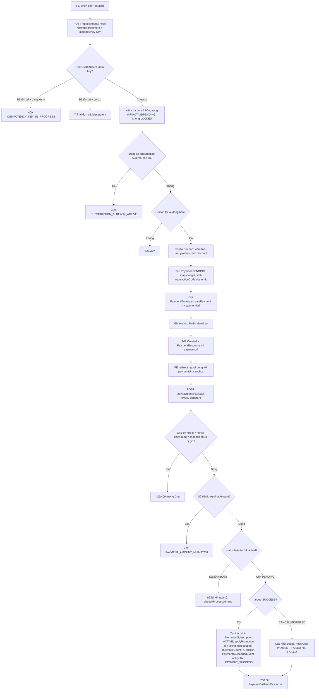

### 5. Dữ liệu chạy như thế nào

- **Input**: `CreatePaymentRequest{listingId, packageId, paymentMethod, couponCode?, returnUrl}` → **FE**: `paymentApi.createPayment(payload, {headers:{'Idempotency-Key': uuid()}})` → **BE validate**: idempotency key phải là UUID hợp lệ, `returnUrl` phải http(s) tuyệt đối và **cùng origin** với `payment.returnUrl` cấu hình (chống open redirect) → **Business logic**: khóa Redis chống double-submit, kiểm tra tin/gói, resolve coupon (snapshot số tiền TẠI THỜI ĐIỂM TẠO ĐƠN — đổi giá gói sau đó không ảnh hưởng đơn đã tạo), sinh `transactionCode` duy nhất (`WT{yyyyMMdd}{8 ký tự Base32 ngẫu nhiên}`, thử tối đa 5 lần rồi fallback nano time) → **DB**: `INSERT payments` (status PENDING) → **Response**: `PaymentResponse{id, transactionCode, paymentUrl, finalAmount, expiresAt, ...}` → **FE update**: điều hướng người dùng sang `paymentUrl`.
- **Callback → activate**: `PaymentCallbackRequest{transactionCode, amount, status, signature, nonce, timestamp, gatewayTransactionId, paidAt?}` → BE xác thực nhiều lớp (chữ ký → nonce → lock → khớp tiền → trạng thái hợp lệ) → khi SUCCESS: `INSERT/UPDATE promotion_subscriptions` (`start_at=paidAt`, `end_at=paidAt+durationDays`, `priority=min(package.priority, promotion.max_priority)`) → gọi `ListingPromotionGateway.applyPromotion(listingId, priority, endAt)` (cross-module, cập nhật `listings.is_promoted/promotion_priority/promoted_until`) → tiêu coupon (`used_count++`) → tăng `promotion_packages.purchase_count` → publish `PaymentSucceededEvent` (module khác có thể lắng nghe, vd. thống kê) → `notifyUser`.

### 6. Database liên quan

**Bảng `promotion_packages`**

| Field | Ý nghĩa |
|---|---|
| `code` (unique, bất biến sau tạo), `name`, `description` | |
| `price`, `duration_days`, `priority` (0–100), `badge_label`, `badge_color` | |
| `is_active`, `display_order`, `purchase_count` | |

**Bảng `coupons`**

| Field | Ý nghĩa |
|---|---|
| `code` (unique), `discount_type` (`PERCENT`/`FIXED`), `discount_value`, `max_discount_amount` (chỉ PERCENT), `min_order_amount` | |
| `usage_limit` (null = không giới hạn), `used_count`, `per_user_limit` (default 1) | |
| `start_at`, `end_at`, `is_active` | |

- Check: `ck_coupons_usage (usage_limit IS NULL OR used_count <= usage_limit)` — **DB tự chặn** nếu code service có bug tăng vượt giới hạn (lớp bảo vệ thứ 2).

**Bảng `payments`** (bảng trung tâm, N-1 tới `promotion_packages`, `coupons`; **`coupon_id` không có FK constraint tường minh trong block `CREATE TABLE` mà được thêm ở cuối file dưới dạng "deferred FK"** `fk_payments_coupons`, do thứ tự tạo bảng)

| Field | Ý nghĩa |
|---|---|
| `user_id`, `listing_id` (nullable), `package_id` (nullable), `coupon_id` (nullable) | |
| `amount`, `discount_amount`, `final_amount` (check `final_amount = amount - discount_amount`) | |
| `currency` (CHAR3, default VND), `payment_method` (`SANDBOX`/`VNPAY`/`MOMO`/`BANK_TRANSFER`) | |
| `transaction_code` (unique), `gateway_txn_ref`, `gateway_response` (JSON) | |
| `status` (`PENDING`/`SUCCESS`/`FAILED`/`CANCELLED`/`REFUNDED`) | |
| `paid_at`, `expires_at`, `refunded_at`, `refund_amount`, `refund_note`, `refunded_by` | |

- Check quan trọng: `ck_payments_target (listing_id IS NOT NULL OR package_id IS NOT NULL)`, `ck_payments_paid (status<>'SUCCESS' OR paid_at IS NOT NULL)`, `ck_payments_refund (...)`.

**Bảng `promotion_subscriptions`** (1-1 với `payments` qua `uk_promotion_subscriptions_payment_id`)

| Field | Ý nghĩa |
|---|---|
| `payment_id` (unique), `listing_id`, `package_id`, `user_id`, `priority`, `status` (`PENDING`/`ACTIVE`/`EXPIRED`/`CANCELLED`), `start_at`, `end_at`, `cancelled_reason` | |

### 7. API liên quan

| Method | URL | Request | Response | Auth | Permission | Error chính |
|---|---|---|---|---|---|---|
| GET | `/api/promotion-packages` | — | `List<PromotionPackageResponse>` (cache) | Public | — | — |
| GET | `/api/promotion-packages/{id}` | — | `PromotionPackageResponse` | Public | — | `PACKAGE_NOT_FOUND` |
| POST | `/api/payments` | `CreatePaymentRequest` + header `Idempotency-Key` | `PaymentResponse` (201) | JWT | `PAYMENT_VIEW_OWN` | `LISTING_FORBIDDEN`, `LISTING_LOCKED_CANNOT_PROMOTE`, `LISTING_NOT_PROMOTABLE`, `SUBSCRIPTION_ALREADY_ACTIVE`, `PACKAGE_NOT_FOUND/INACTIVE`, `IDEMPOTENCY_KEY_*` |
| POST | `/api/listings/{id}/promote` | `PromoteListingRequest` + header `Idempotency-Key` | `PaymentResponse` (201) | JWT | `PAYMENT_VIEW_OWN` | như trên |
| GET | `/api/payments/{id}` | — | `PaymentResponse` | JWT | `PAYMENT_VIEW_OWN` hoặc `PAYMENT_MANAGE` | `PAYMENT_FORBIDDEN` |
| GET | `/api/payments/my` | Query `status[], listingId?, from?, to?, Pageable` | `PaymentHistoryResponse` (page + summary) | JWT | `PAYMENT_VIEW_OWN` | — |
| POST | `/api/payments/{id}/cancel` | — | `PaymentResponse` | JWT | `PAYMENT_VIEW_OWN` | `PAYMENT_ALREADY_CANCELLED`, `PAYMENT_NOT_PENDING` |
| POST | `/api/payments/callback` | `PaymentCallbackRequest` | `PaymentCallbackResponse` | **Public** (bảo vệ bằng HMAC) | — | `PAYMENT_CALLBACK_EXPIRED`, `PAYMENT_SIGNATURE_INVALID`, `PAYMENT_CALLBACK_REPLAY`, `PAYMENT_NOT_FOUND`, `PAYMENT_AMOUNT_MISMATCH`, `PAYMENT_ALREADY_PROCESSED` |
| GET | `/api/promotion-subscriptions/my` | Query `status[]?, listingId?, Pageable` | `PageResponse<PromotionSubscriptionResponse>` | JWT | `PAYMENT_VIEW_OWN` | — |
| POST | `/api/coupons/validate` | `ValidateCouponRequest{code, packageId}` | `CouponValidationResponse` | JWT | `PAYMENT_VIEW_OWN` | `COUPON_NOT_FOUND/INACTIVE/NOT_STARTED/EXPIRED/USAGE_EXCEEDED`, `COUPON_ALREADY_USED_BY_USER` (409), `COUPON_NOT_APPLICABLE` |
| GET | `/api/admin/promotion-packages` | Query `activeOnly?` | `List<PromotionPackageResponse>` (kèm số liệu) | JWT | `PACKAGE_MANAGE` | — |
| POST | `/api/admin/promotion-packages` | `PackageRequest` | `PromotionPackageResponse` (201) | JWT | `PACKAGE_MANAGE` | `PACKAGE_CODE_DUPLICATE`, `PACKAGE_PRIORITY_EXCEEDED` |
| PUT | `/api/admin/promotion-packages/{id}` | `PackageRequest` (code bất biến, bị bỏ qua) | `PromotionPackageResponse` | JWT | `PACKAGE_MANAGE` | `PACKAGE_NOT_FOUND` |
| PUT | `/api/admin/promotion-packages/{id}/toggle` | `TogglePackageRequest{active, reason}` | `PromotionPackageResponse` | JWT | `PACKAGE_MANAGE` | — |
| GET | `/api/admin/payments` | Nhiều filter (status/method/user/listing/package/txnCode/amount/date) + `Pageable` | `PaymentHistoryResponse` | JWT | `PAYMENT_MANAGE` (chỉ Admin) | `INVALID_SORT_FIELD` nếu sort khác `createdAt/paidAt/amount/finalAmount` |
| GET | `/api/admin/payments/{id}` | — | `PaymentResponse` (kèm `gatewayTxnRef`) | JWT | `PAYMENT_MANAGE` | — |
| PUT | `/api/admin/payments/{id}/refund` | `RefundPaymentRequest{refundAmount?, reason, cancelSubscription?}` | `PaymentResponse` | JWT | `PAYMENT_MANAGE` | `PAYMENT_REFUND_NOT_ALLOWED`, `PAYMENT_ALREADY_REFUNDED` |
| POST | `/api/admin/payments/{id}/reconcile` | — | `PaymentCallbackResponse` | JWT | `PAYMENT_MANAGE` | — |
| GET/POST/PUT | `/api/admin/coupons` (+`/{id}`) | `CouponRequest` | `CouponResponse`/`PageResponse<CouponResponse>` | JWT | `PACKAGE_MANAGE` | `COUPON_CODE_DUPLICATE` |

### 8. Dependency

- **Phụ thuộc**: `ListingPromotionGateway` (module listing), `AuditGateway`, `SystemConfigService` (`payment.order_expiry_minutes`, `payment.callback_max_skew_seconds`, `promotion.max_priority`), `NotificationService`, Redis (idempotency, nonce, lock, cache gói), `AppProperties.payment` (return URL cấu hình, callback secret).
- **Được phụ thuộc bởi**: hiển thị badge "đang đẩy" trên `ListingCard`/trang chi tiết tin (module listing đọc `is_promoted`/`promotion_priority`), trang thống kê doanh thu admin (module admin dashboard/statistics).

### 9. Các trường hợp cần kiểm tra

- [ ] Mua gói thành công đầy đủ luồng: tạo đơn → sandbox callback SUCCESS → subscription ACTIVE → tin được đẩy (`is_promoted=true`).
- [ ] Tạo đơn 2 lần với **cùng** `Idempotency-Key` → trả về cùng 1 đơn (không tạo 2 bản ghi payments).
- [ ] Tạo đơn thiếu header `Idempotency-Key` → 400 `IDEMPOTENCY_KEY_REQUIRED`.
- [ ] `returnUrl` khác origin với cấu hình → 400 (chống open redirect).
- [ ] Mua gói cho tin đang có subscription ACTIVE → 409 `SUBSCRIPTION_ALREADY_ACTIVE`.
- [ ] Mua gói cho tin bị khóa (`LOCKED`) → 422 `LISTING_LOCKED_CANNOT_PROMOTE`.
- [ ] Mua gói không phải chủ tin → 403 `LISTING_FORBIDDEN`.
- [ ] Áp coupon hết hạn/chưa tới ngày bắt đầu/hết lượt/đã dùng đủ per-user → đúng error code tương ứng.
- [ ] Áp coupon PERCENT có `max_discount_amount` → số tiền giảm không vượt trần.
- [ ] Callback với chữ ký sai → 422 `PAYMENT_SIGNATURE_INVALID`, KHÔNG đổi trạng thái đơn.
- [ ] Callback lệch thời gian quá `payment.callback_max_skew_seconds` → 400 `PAYMENT_CALLBACK_EXPIRED`.
- [ ] Callback gửi lại (replay) cùng nonce → 409 `PAYMENT_CALLBACK_REPLAY`.
- [ ] Callback số tiền không khớp `final_amount` → 422 `PAYMENT_AMOUNT_MISMATCH`, không kích hoạt gói.
- [ ] Callback SUCCESS gửi 2 lần cho cùng đơn → lần 2 trả `alreadyProcessed=true`, không tạo 2 subscription (kiểm tra unique `payment_id`).
- [ ] Hủy đơn đang PENDING → OK; hủy đơn đã SUCCESS/CANCELLED → lỗi tương ứng.
- [ ] `PaymentReconcileJob` chuyển đơn PENDING quá hạn sang FAILED + gửi thông báo.
- [ ] `PromotionExpiryJob` gỡ cờ đẩy đúng lúc `end_at` trôi qua; tin có nhiều subscription (gia hạn chồng) không bị gỡ cờ nhầm khi 1 sub hết hạn nhưng còn sub khác ACTIVE.
- [ ] Admin hoàn tiền: số tiền hoàn không vượt `final_amount`; hoàn tiền tự động hủy subscription liên quan (`cancelSubscription=true` default) và gỡ cờ đẩy trên tin.
- [ ] Hoàn tiền 2 lần cùng 1 đơn → 409 `PAYMENT_ALREADY_REFUNDED`.
- [ ] Admin sửa/tắt gói dịch vụ đang bán KHÔNG ảnh hưởng đơn đã tạo trước đó (giá snapshot).
- [ ] `priority` gói vượt `promotion.max_priority` khi tạo/sửa gói → 422 `PACKAGE_PRIORITY_EXCEEDED`.
- [ ] Sort danh sách giao dịch admin theo trường không cho phép (vd. `status`) → 400 `INVALID_SORT_FIELD`.
- [ ] Concurrent: 2 request tạo đơn cùng lúc với coupon `usage_limit=1`, `per_user_limit=1` — kiểm tra có race condition double-apply (xem mục 10/11).

### 10. Các lỗi dễ gặp

- **Race condition tiềm ẩn khi validate/áp coupon**: `resolveCoupon`/`validateCoupon` chỉ **kiểm tra** điều kiện (đọc `used_count`, đếm `countSuccessfulUsageByUser`) mà **không khóa** bản ghi coupon — 2 request tạo đơn gần như đồng thời với cùng coupon `usage_limit=1` đều có thể "qua" bước kiểm tra (vì `used_count` chỉ tăng thật khi callback SUCCESS, không tăng lúc tạo đơn PENDING). Trong cửa sổ giữa lúc tạo 2 đơn PENDING và lúc cả 2 đều được callback SUCCESS, coupon có thể bị tiêu 2 lần vượt `usage_limit` — check DB `ck_coupons_usage` sẽ chặn ở **UPDATE cuối cùng** (constraint) nhưng có thể gây lỗi 500 khó hiểu ở `consumeCoupon` thay vì lỗi nghiệp vụ rõ ràng. Cần test kịch bản 2 thanh toán song song dùng chung coupon giới hạn 1 lượt.
- Nhầm lẫn `PromoteListingRequest` (đường tắt `/listings/{id}/promote`, listingId lấy từ path) với `CreatePaymentRequest` (`/payments`, listingId trong body) — cả 2 cùng chạy qua `doCreate` nội bộ, hành vi giống hệt nhau, chỉ khác cách truyền `listingId`.
- `adminListPackages`/`activeSubCount`/`revenueOf` trong `PromotionServiceImpl` dùng `findAll().stream().filter(...)` **quét toàn bộ bảng** `promotion_subscriptions`/`payments` mỗi lần gọi (không có `@Query` lọc ở DB) — với dữ liệu lớn sẽ chậm dần theo thời gian, dễ bị hiểu nhầm là "trang admin gói dịch vụ load chậm ngẫu nhiên" khi thực chất là do tăng trưởng dữ liệu giao dịch.
- Sai lệch dễ gặp khi test: `expiresAt` tính từ `payment.order_expiry_minutes` (system_configs) — nếu QA đổi config này giữa lúc đang test một đơn cũ, đơn cũ **không bị ảnh hưởng** (giá trị đã chốt lúc tạo), dễ gây nhầm "config không có tác dụng".
- `PaymentMapper`/`buildDetailResponse` gọi `packageRepository.findById(...)` (KHÔNG lọc `deletedAtIsNull`) để lấy tên gói hiển thị — nếu gói bị xóa mềm sau khi đã có giao dịch, tên gói **vẫn hiển thị được** (đúng ý đồ, vì lịch sử giao dịch cần giữ tên gói tại thời điểm mua) nhưng dễ khiến người review nhầm là bug "gói đã xóa vẫn hiện".

### 11. Các điểm cần review

- **Business (concurrency)**: đánh giá lại cơ chế khóa coupon khi tạo đơn — có thể cần khóa Redis theo `couponCode` tương tự cơ chế idempotency, hoặc chấp nhận rủi ro thấp (do `usage_limit` thường không đặt = 1 trong thực tế) nhưng phải ghi nhận rõ ràng risk này.
- **Performance**: thay `findAll().stream().filter(...)` trong `PromotionServiceImpl` (3 chỗ: `adminListPackages`, `activeSubCount`, `revenueOf`) bằng `@Query`/`Specification` lọc theo `packageId`+`status` ở DB.
- **Security**: `PaymentController.callback` là endpoint **public hoàn toàn** (không JWT) — toàn bộ an toàn dựa vào HMAC + nonce + skew time; review kỹ `PAYMENT_CALLBACK_SECRET` không bị lộ (biến môi trường, không hardcode), và cổng thật (VNPay/MoMo) khi triển khai phải thay `SandboxPaymentGateway` mà không đổi `PaymentService` (đã thiết kế đúng theo Strategy pattern qua interface `PaymentGateway`).
- **DB**: `coupon_id` trong `payments` có FK "deferred" thêm ở cuối file — không phải bug nhưng nên biết khi đọc migration để không hoang mang khi không thấy `CONSTRAINT` ngay trong block `CREATE TABLE payments`.
- **UX**: thông báo hoàn tiền dùng chung `NotificationType.PAYMENT_SUCCESS` (comment trong code: "Không có NotificationType chuyên cho hoàn tiền") — người dùng nhận thông báo "Thanh toán thành công" cho một sự kiện hoàn tiền, dễ gây hiểu nhầm nội dung; nên đề xuất thêm `PAYMENT_REFUNDED` vào enum `NotificationType` nếu còn trong phạm vi sửa được.
- **API response**: `PaymentHistoryResponse.Summary` (tổng tiền, đếm theo trạng thái) tính bằng cách gọi lại `paymentRepository.findAll(spec)`/`count(spec)` nhiều lần cho mỗi trạng thái (5 query riêng biệt trong `buildSummary`) — có thể gộp bằng 1 query `GROUP BY status` để giảm round-trip DB.

### 12. Kết quả mong đợi

- Luồng thanh toán end-to-end (tạo đơn → callback → kích hoạt gói) chính xác, idempotent, chống replay/giả mạo callback.
- Coupon áp dụng đúng công thức, không vượt giới hạn sử dụng (kể cả dưới tải đồng thời).
- Giao dịch treo được tự động xử lý bởi job đối soát; lượt đẩy hết hạn được gỡ cờ đúng lúc.
- Admin quản lý gói/coupon/giao dịch/hoàn tiền đầy đủ, có audit log cho mọi thay đổi.

---

## Module: AI Cảm xúc + Chatbot + AI Log/Config

### 1. Module này dùng để làm gì?

Đây là 1 trong 4 tính năng AI rule-based **chạy in-process** (không gọi service ngoài, không cần GPU/API key) trong phạm vi Người 3:

- **AI-01 Sentiment (cảm xúc)**: phân tích cảm xúc bình luận bằng từ điển tiếng Việt có trọng số (`VietnameseLexiconSentimentAnalyzer`) — tự động chạy sau mỗi bình luận mới/sửa, gắn nhãn `POSITIVE/NEUTRAL/NEGATIVE/MIXED`, phát hiện rủi ro (lừa đảo, đòi cọc...), đề xuất hành động (`NONE/WATCH/NEED_REVIEW`), và **là input trực tiếp cho điểm uy tín (trust score)** của tin/chủ trọ.
- **AI-05 Chatbot**: trợ lý hội thoại tìm phòng theo luật (`RuleBasedChatbotEngine`) — nhận diện 8 intent (FIND_ROOM, HOW_TO_POST, GLOSSARY, FAQ, GREETING, OUT_OF_SCOPE, SENSITIVE, UNKNOWN), trích xuất 11 loại slot (giá, diện tích, số người ở, khu vực...) qua regex, hỏi lại tối đa 3 lượt khi thiếu thông tin quan trọng, chỉ trả **tin công khai thật** (qua `ListingSearchService`, không bịa dữ liệu), kèm disclaimer bắt buộc.
- **AI-07 Log AI**: lưu vết mọi lần chạy AI (bảng `sentiment_results` append-only có versioning `is_latest`, `chatbot_messages`) phục vụ audit/debug/thống kê — Admin xem qua `GET /api/admin/ai/logs`.
- **AI-08 Cấu hình ngưỡng AI**: các tham số điều khiển hành vi AI (ngưỡng độ dài tối thiểu, ngưỡng tin cậy thấp, trọng số tài khoản mới, ngưỡng tỷ lệ tiêu cực L1/L2...) lưu ở bảng `ai_configs` (không lẫn với `system_configs`), quản lý qua `AdminAiController`.

**Vai trò trong hệ thống**: AI là lớp "giám sát tự động" giúp phát hiện sớm tin có vấn đề (nhiều bình luận tiêu cực) và hỗ trợ người dùng tìm phòng nhanh hơn qua hội thoại tự nhiên, **KHÔNG thay thế quyết định của con người** — nguyên tắc cứng: AI chỉ đề xuất/gắn cờ, không tự khóa tài khoản hay tự ẩn tin.

**Nếu hỏng**: bình luận vẫn được tạo bình thường (thiết kế cố ý — lỗi AI không chặn nghiệp vụ chính), nhưng mất khả năng cảnh báo sớm tin có nhiều phản hồi tiêu cực, mất tín hiệu đầu vào cho trust score, chatbot ngừng trả lời hoặc trả lời sai/bịa thông tin (rủi ro uy tín nếu disclaimer bị bỏ qua).

### 2. Chức năng Frontend

| Màn hình / Component | File | Mô tả |
|---|---|---|
| Widget chatbot nổi | `frontend_webtro/src/components/chatbot/ChatbotWidget.jsx` | `Fab` góc phải màn hình mở/đóng khung chat (`Paper` 380×520px), giữ `conversationId` trong state để duy trì ngữ cảnh qua nhiều lượt, render danh sách tin nhắn (`Card`/`CardActionArea` cho từng tin gợi ý kèm ảnh/giá), `TextField` + `IconButton Send`. |
| Cấu hình AI (admin) | `frontend_webtro/src/pages/admin/AiConfigPage.jsx` | Trang xem/sửa ngưỡng 4 module AI (form theo nhóm), có `Alert` báo lỗi kèm nút "Thử lại". |
| Log AI (admin) | `frontend_webtro/src/pages/admin/AiLogsPage.jsx` | Xem log theo module AI (`sentiment/recommendation/chatbot/price`), lọc theo khoảng ngày, phân trang — dùng chung pattern `AdminDataTable`. |

**API client FE**: `frontend_webtro/src/api/aiApi.js` (`analyzeSentiment` — công cụ chẩn đoán cho admin/mod, không phải luồng người dùng thường), `frontend_webtro/src/api/chatbotApi.js` (`sendMessage`). Trang admin dùng `adminApi.js` cho cấu hình/log (endpoint `/api/admin/ai/*`).

> Lưu ý: người dùng thường **không** gọi trực tiếp `POST /api/ai/sentiment/analyze` — endpoint này chỉ dành cho Admin/Moderator (`AI_LOG_VIEW`) để thử nghiệm từ điển hoặc phân tích lại 1 bình luận cụ thể. Việc phân tích cảm xúc thật sự chạy **hoàn toàn tự động ở backend** sau khi tạo/sửa bình luận (Module Comment).

### 3. Chức năng Backend

- **Controller**: `AiSentimentController` (`/api/ai/sentiment/analyze` — chẩn đoán), `ChatbotController` (`/api/ai/chatbot/**`), `AdminAiController` (`/api/admin/ai/config`, `/logs`, `/alerts`, `/price-deviations`, `/sentiment/reanalyze`).
- **Engine (thuật toán rule-based, không ML thật)**: `VietnameseLexiconSentimentAnalyzer` implements `SentimentAnalyzer`; `RuleBasedChatbotEngine` implements `ChatbotEngine`.
- **Service**: `SentimentService`/`SentimentServiceImpl`, `ChatbotService`/`ChatbotServiceImpl`, `AdminAiService`/`AdminAiServiceImpl` (module admin).
- **Listener**: `CommentSentimentListener` — `@Async("aiTaskExecutor")` + `@TransactionalEventListener(AFTER_COMMIT)`, lắng nghe `CommentCreatedEvent` từ module interaction.
- **Repository**: `SentimentResultRepository`, `ChatbotConversationRepository`, `ChatbotMessageRepository`.
- **SPI Gateway**: `CommentDataGateway` (đọc snapshot bình luận, **ghi ngược** `comments.sentiment_*` — luồng ngược chiều interaction→ai→interaction hợp lệ vì đi qua gateway, không @Autowired trực tiếp entity), `ListingDataGateway` (đếm tin tích cực/tiêu cực trên tin, đọc `trustScore`, gắn cờ `flagNeedReview`), `UserDataGateway` (tuổi tài khoản để xác định "tài khoản mới").
- **Job**: `scheduler/SentimentRetryJob.java` (mỗi 10 phút — xử lý lại bình luận còn `PENDING_ANALYSIS` do lỗi/timeout trước đó, tối đa `ai.sentiment.max_retry` lần).
- **Cấu hình**: đọc qua `SystemConfigService` với các khóa `AI_SENTIMENT_ENABLED`, `AI_SENTIMENT_MIN_LENGTH`, `AI_SENTIMENT_LOW_CONFIDENCE_THRESHOLD`, `AI_SENTIMENT_NEW_ACCOUNT_DAYS`, `AI_SENTIMENT_NEW_ACCOUNT_WEIGHT`, `AI_SENTIMENT_MIN_COMMENTS_L1/L2`, `AI_SENTIMENT_NEGATIVE_RATIO_L1/L2`, `AI_SENTIMENT_TIMEOUT_MS`, `AI_SENTIMENT_MAX_RETRY`, `AI_CHATBOT_ENABLED`, `AI_CHATBOT_MAX_CLARIFY_TURNS`, `CHATBOT_MESSAGE_MAX_LENGTH`, `SPAM_CHATBOT_PER_MINUTE`, `CHATBOT_TIMEOUT_MS`.
- **Timeout guard**: `AiModuleSupport.runWithTimeout(...)` bọc mọi lời gọi engine để tránh treo request nếu thuật toán chạy quá lâu (dù rule-based nên hiếm khi xảy ra).

### 4. Luồng hoạt động

**Luồng phân tích cảm xúc tự động (AI-01)**:

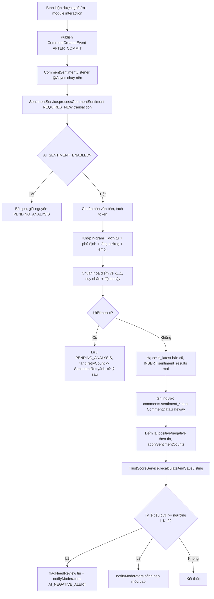

**Luồng chatbot (AI-05)**:

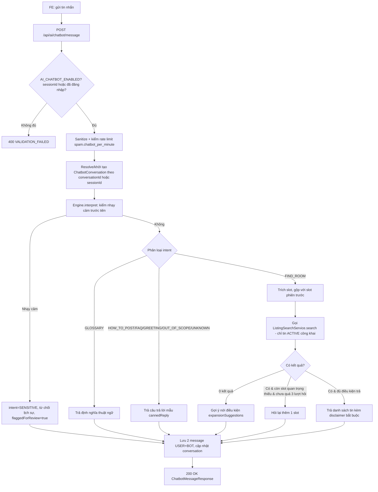

### 5. Dữ liệu chạy như thế nào

- **Sentiment — Input**: nội dung bình luận (đọc lại từ DB qua `CommentDataGateway.findComment`, KHÔNG nhận trực tiếp từ event payload — event chỉ mang `commentId`/`listingId` theo luật ranh giới module) → **Business logic**: `VietnameseLexiconSentimentAnalyzer.analyze(text, minLength, lowConfidence, newAccount, newAccountWeight)` trả `SentimentOutcome{label, score, confidence, weight, action, riskComment, negationApplied, matchedTerms...}` → **DB**: `INSERT sentiment_results` (bản mới `is_latest=true`, bản cũ bị hạ `is_latest=false` — cưỡng chế "đúng 1 bản hiện hành" bằng cột sinh STORED `latest_uk` + unique index) → ghi ngược `comments.sentiment_label/score/confidence/weight/is_risk_comment` → **Response** (khi gọi endpoint chẩn đoán): `SentimentResponse` kèm `TrustScoreImpal{before, after, recalculated}` nếu `persist=true`.
- **Chatbot — Input**: `ChatbotMessageRequest{message, sessionId?, conversationId?, resetContext?}` → **Business logic**: `ChatSlots` (record bất biến) được **gộp dần qua nhiều lượt** (lưu dạng JSON ở `chatbot_conversations.collected_filters`, parse/serialize bằng Jackson) → chuyển thành `ListingSearchRequest` gọi thẳng `ListingSearchService` (module search — dùng lại engine tìm kiếm thật, không có dữ liệu giả lập riêng cho chatbot) → **DB**: `INSERT chatbot_messages` (2 dòng mỗi lượt: USER kèm `intent`/`extractedSlots`, BOT kèm `resultListingIds`/`resultCount`/`isFallback`/`responseMs`) → **Response**: `ChatbotMessageResponse{reply, listings[], missingSlots[], clarifyTurn, searchUrl, disclaimer, flaggedForReview}`.

### 6. Database liên quan

**Bảng `sentiment_results`** (append-only, versioned)

| Field | Ý nghĩa |
|---|---|
| `comment_id`, `listing_id` | Chéo module, giữ Long |
| `label`, `score` [-1,1], `confidence` [0,1] | |
| `is_risk_comment`, `suggested_action` (`NONE`/`WATCH`/`NEED_REVIEW`), `weight` [0,1] | |
| `matched_positive_terms`, `matched_negative_terms` (JSON) | Giải thích được (explainable AI) |
| `negation_applied`, `analyzer_version`, `processing_ms`, `error_message`, `retry_count` | |
| `is_latest`, `latest_uk` (generated column STORED `IF(is_latest, comment_id, NULL)`) | Ép đúng 1 bản hiện hành/bình luận qua `UNIQUE KEY uk_sentiment_results_latest (latest_uk)` |

- FK `comment_id` dùng `ON DELETE RESTRICT` (không CASCADE) — vì `comment_id` là cột nền của generated column, MySQL cấm CASCADE trên đó; hệ thống chỉ xóa mềm bình luận nên RESTRICT không bao giờ bị kích hoạt trong vận hành bình thường.

**Bảng `chatbot_conversations`** (1 — N `chatbot_messages`)

| Field | Ý nghĩa |
|---|---|
| `user_id` (nullable — khách ẩn danh), `session_id` (unique, UUID) | |
| `status` (`ACTIVE`/`COMPLETED`/`ABANDONED`), `last_intent`, `collected_filters` (JSON) | |
| `clarify_turn_count` (0–3, check DB), `message_count` | |
| `started_at`, `last_message_at`, `ended_at` | |

**Bảng `chatbot_messages`** (append-only)

| Field | Ý nghĩa |
|---|---|
| `conversation_id`, `sender` (`USER`/`BOT`), `content` | |
| `intent`, `intent_confidence`, `extracted_slots` (JSON) — **chỉ tin USER**, check `ck_chatbot_messages_bot_intent (sender='USER' OR intent IS NULL)` | |
| `result_listing_ids` (JSON), `result_count`, `is_fallback`, `response_ms` | |

**Bảng `ai_configs`** (khác `system_configs` — dành riêng 4 module AI)

| Field | Ý nghĩa |
|---|---|
| `module` (`SENTIMENT`/`RECOMMENDATION`/`CHATBOT`/`PRICE`), `config_key` (unique theo module) | |
| `config_value` (JSON), `value_schema`, `is_enabled`, `version` (tăng dần mỗi lần đổi) | |

> Note: các ngưỡng cụ thể như `AI_SENTIMENT_MIN_LENGTH`, `AI_SENTIMENT_NEGATIVE_RATIO_L1`... thực tế được code đọc qua **`SystemConfigService`** (bảng `system_configs`, nhóm khóa tiền tố `ai.`) chứ **không phải** bảng `ai_configs` — `AdminAiController.getConfig()`/`updateConfig()` thao tác trên nhóm `ai.*` + `trust.*` của `system_configs`, còn bảng `ai_configs` (JSON theo module) dùng cho cấu hình phức tạp hơn (vd. bộ từ điển mở rộng — chưa thấy code đọc/ghi trực tiếp bảng này trong các file đã đọc, > cần xác nhận thêm nếu có service khác dùng `AiConfigRepository`).

### 7. API liên quan

| Method | URL | Request | Response | Auth | Permission | Error chính |
|---|---|---|---|---|---|---|
| POST | `/api/ai/sentiment/analyze` | `SentimentAnalyzeRequest{commentId? \| text?, persist?}` (đúng 1 trong 2) | `SentimentResponse` | JWT | `AI_LOG_VIEW` | `VALIDATION_FAILED`, `SENTIMENT_COMMENT_NOT_FOUND` |
| POST | `/api/ai/chatbot/message` | `ChatbotMessageRequest{message, sessionId?, conversationId?, resetContext?}` | `ChatbotMessageResponse` | Public (JWT optional) | — | `CHATBOT_MESSAGE_EMPTY`, `CHATBOT_MESSAGE_TOO_LONG`, `CHATBOT_RATE_LIMIT` |
| GET | `/api/ai/chatbot/conversations` | `Pageable` | `PageResponse<ChatbotConversationResponse>` | JWT | `isAuthenticated()` | — |
| GET | `/api/ai/chatbot/conversations/{id}/messages` | `Pageable` | `PageResponse<ChatbotMessageHistoryResponse>` | JWT | `isAuthenticated()` + chủ phiên | `CHATBOT_CONVERSATION_NOT_FOUND`, `FORBIDDEN` |
| GET | `/api/admin/ai/config` | — | `AiConfigResponse` | JWT | `AI_CONFIG_MANAGE` | — |
| PUT | `/api/admin/ai/config` | `UpdateConfigRequest{configs[], reason}` | `UpdateConfigResponse` | JWT | `AI_CONFIG_MANAGE` | `CONFIG_KEY_UNKNOWN`, `CONFIG_VALUE_INVALID` |
| GET | `/api/admin/ai/logs` | Query `module` (bắt buộc), `from?, to?, Pageable` | `AiLogResponse` | JWT | `AI_LOG_VIEW` | — |
| GET | `/api/admin/ai/alerts` | `Pageable` | `PageResponse<AiAlertResponse>` | JWT | `AI_LOG_VIEW` | — |
| GET | `/api/admin/ai/price-deviations` | `Pageable` | `PageResponse<AiPriceDeviationResponse>` | JWT | `AI_LOG_VIEW` | — |
| POST | `/api/admin/ai/sentiment/reanalyze` | `ReanalyzeSentimentRequest{commentId}` | `SentimentResponse` | JWT | `AI_LOG_VIEW` hoặc `COMMENT_MODERATE` | `SENTIMENT_COMMENT_NOT_FOUND` |

### 8. Dependency

- **Phụ thuộc**: `CommentDataGateway`/`ListingDataGateway`/`UserDataGateway` (SPI trong module ai, adapter thật nằm ở module interaction/listing/user), `ListingSearchService` (module search — chatbot dùng lại engine tìm kiếm thật), `TrustScoreService` (module listing), `NotificationService`, `SystemConfigService`.
- **Được phụ thuộc bởi**: Module Comment (kích hoạt qua event, không gọi trực tiếp — đúng nguyên tắc luật 7), `AdminAiController`/`AdminAiService` (đọc log/cấu hình để hiển thị dashboard AI), có thể là input cho thống kê admin (`AiAlertResponse`, `AiPriceDeviationResponse` — Price/Recommendation là 2 AI khác ngoài phạm vi Người 3 nhưng dùng chung `AdminAiController`).

### 9. Các trường hợp cần kiểm tra

- [ ] Bình luận mới → sau vài giây (async) có bản ghi `sentiment_results` mới với `is_latest=true`, bản cũ (nếu có) chuyển `is_latest=false`.
- [ ] Bình luận quá ngắn (dưới `ai.sentiment.min_length`) → nhãn `NEUTRAL`, `weight=0`, không tính vào điểm uy tín (đúng ngoại lệ §9.1).
- [ ] Bình luận vừa khen vừa chê mạnh (có cả từ tích cực và tiêu cực "mạnh" ≥ ngưỡng `STRONG_TERM=0.5`) → nhãn `MIXED`.
- [ ] Bình luận có phủ định ("không tốt") → điểm bị đảo dấu đúng, `negationApplied=true`.
- [ ] Bình luận có từ tăng cường ("rất tệ") → điểm nhân hệ số 1.5.
- [ ] Bình luận chứa cụm rủi ro ("lừa đảo", "đòi cọc trước") → `isRiskComment=true`, hành động đề xuất `NEED_REVIEW` (trừ khi confidence quá thấp thì hạ xuống `WATCH`).
- [ ] Tài khoản mới (dưới `ai.sentiment.new_account_days`) → `sentimentWeight` giảm theo `ai.sentiment.new_account_weight`.
- [ ] Tỷ lệ bình luận tiêu cực trên 1 tin vượt ngưỡng L1 → tin bị `flagNeedReview` + Moderator nhận thông báo `AI_NEGATIVE_ALERT`.
- [ ] Vượt ngưỡng L2 → thêm cảnh báo mức cao (không tự khóa tài khoản/tin — **AI không có quyền hành động cứng**, chỉ đề xuất).
- [ ] Tắt `AI_SENTIMENT_ENABLED` → bình luận mới giữ `PENDING_ANALYSIS` vĩnh viễn cho tới khi bật lại + job retry chạy.
- [ ] `SentimentRetryJob` xử lý đúng các bình luận `PENDING_ANALYSIS` còn dưới `ai.sentiment.max_retry`, dừng thử khi vượt ngưỡng.
- [ ] Endpoint chẩn đoán `POST /api/ai/sentiment/analyze` với `text` thuần (không `commentId`) → không ghi DB, chỉ trả kết quả tạm.
- [ ] Gọi đồng thời cả `commentId` và `text` → 400 `VALIDATION_FAILED`.
- [ ] Chatbot: câu hỏi chứa từ nhạy cảm ("vũ khí", "ma túy"...) → từ chối lịch sự ngay, không xử lý slot, `flaggedForReview=true`.
- [ ] Chatbot: hỏi giá + khu vực trong 1 câu → trích đúng slot `priceTo`/`location`, tìm được tin phù hợp.
- [ ] Chatbot: thiếu thông tin quan trọng → hỏi lại, đếm `clarifyTurnCount`, dừng hỏi lại sau khi đạt `ai.chatbot.max_clarify_turns` (mặc định 3).
- [ ] Chatbot: 0 kết quả tìm được → trả gợi ý mở rộng điều kiện (`expansionSuggestions`), không báo lỗi.
- [ ] Chatbot: khách chưa đăng nhập không có `sessionId` → 400 `VALIDATION_FAILED`.
- [ ] Chatbot: `resetContext=true` → xóa slot cũ, bắt đầu hội thoại mới trong cùng `conversationId`.
- [ ] Chatbot: xem lịch sử hội thoại của người khác → 403 `FORBIDDEN`.
- [ ] Chatbot rate limit (`spam.chatbot_per_minute`) theo user hoặc theo session (khách ẩn danh) — test cả 2 trường hợp.
- [ ] Admin đổi ngưỡng AI (`PUT /api/admin/ai/config`) → có ghi audit log, ảnh hưởng **không hồi tố** (chỉ áp dụng bình luận mới sau đó).
- [ ] Đổi khóa thuộc `ai.*`/`trust.*` qua `PUT /api/admin/system-configs` (nhầm endpoint) → 422 `CONFIG_KEY_UNKNOWN` (bị chặn, phải dùng đúng `/api/admin/ai/config`).

### 10. Các lỗi dễ gặp

- **Độ trễ cảm giác "chưa cập nhật"**: vì phân tích chạy **bất đồng bộ** (`@Async`), response tạo bình luận trả về ngay với `sentimentLabel=PENDING_ANALYSIS` — QA/FE dễ nhầm là bug "cảm xúc không hoạt động" nếu kiểm tra ngay lập tức mà không đợi/refresh.
- Nhầm 2 bảng cấu hình: đổi nhầm `ai.sentiment.negative_ratio_l1` qua `AdminSystemConfigController` sẽ bị chặn (422) — phải nhớ **mọi khóa `ai.*`/`trust.*` chỉ sửa được qua `AdminAiController`**, đây là điểm dễ gây bối rối khi mới join dự án vì cả hai đều là "system_configs" về bản chất lưu trữ.
- `RuleBasedChatbotEngine` là **regex-based cho slot** (giá, diện tích, khu vực...) — câu hỏi diễn đạt khác thường (vd. viết tắt lạ, sai chính tả nhiều) dễ không trích được slot đúng, bot sẽ hỏi lại hoặc trả kết quả rộng hơn mong đợi — không phải "bug" theo nghĩa lỗi code mà là giới hạn cố hữu của rule-based, cần test với nhiều biến thể câu hỏi tiếng Việt thực tế (có dấu/không dấu, teencode).
- `DataRetentionJob` xóa `chatbot_messages` cũ hơn 90 ngày bằng **hằng số cứng trong code** (không qua `system_configs`) — đổi cấu hình liên quan retention trên UI (nếu tồn tại) sẽ không có tác dụng.
- Từ điển cảm xúc (`VietnameseLexiconSentimentAnalyzer`) hoàn toàn ở dạng **hardcode trong static block Java**, không load từ DB/file cấu hình — muốn thêm từ mới phải sửa code + build lại, không có UI quản lý từ điển (khác với `banned_keywords` có bảng DB riêng).

### 11. Các điểm cần review

- **Business**: xác nhận ranh giới rõ ràng giữa "AI đề xuất" và "hành động thật" — `evaluateThresholds` chỉ gọi `flagNeedReview` (đặt cờ) chứ không tự ẩn tin/khóa tài khoản, đúng nguyên tắc §9.1; review lại xem có nơi nào khác vô tình để AI tự động hành động cứng không.
- **Explainability**: `matched_positive_terms`/`matched_negative_terms` được lưu JSON — nên tận dụng hiển thị trên `AiLogsPage` để Moderator hiểu **vì sao** AI gắn nhãn một bình luận nào đó (tăng niềm tin vào hệ thống rule-based).
- **Performance**: `evaluateThresholds` chạy `countByListingIdAndIsLatestTrue` + `countByListingIdAndLabelAndIsLatestTrue` (2 query COUNT) **sau mỗi bình luận** trên cùng 1 tin — với tin có hàng nghìn bình luận, tần suất COUNT lặp lại nhiều; có index `idx_sentiment_results_listing_id_label` hỗ trợ nên chấp nhận được, nhưng nên theo dõi khi dữ liệu lớn.
- **Config discoverability**: nên bổ sung ghi chú rõ trong tài liệu API/Swagger về việc `ai.*`/`trust.*` tách khỏi `/api/admin/system-configs` để tránh nhầm lẫn khi có dev mới join.
- **UX Chatbot**: `disclaimer` chỉ gắn khi có `listings` trả về (`listings.isEmpty() ? null : DISCLAIMER`) — kiểm tra FE có luôn hiển thị đúng khi disclaimer null (không nên hiện text rỗng).

### 12. Kết quả mong đợi

- Mọi bình luận mới/sửa đều được phân tích cảm xúc tự động, chính xác theo bộ luật đã định nghĩa, không chặn luồng tạo bình luận.
- Tin có tỷ lệ tiêu cực cao được cảnh báo kịp thời tới Moderator.
- Chatbot trả lời đúng phạm vi (chỉ tìm phòng thật), từ chối lịch sự nội dung nhạy cảm, không bịa thông tin, tôn trọng giới hạn hỏi lại.
- Admin xem được log AI đầy đủ, đổi cấu hình AI an toàn (có validate + audit), tách biệt rõ với cấu hình hệ thống chung.

---

## Module: System Config

### 1. Module này dùng để làm gì?

Trung tâm cấu hình động của toàn hệ thống — thay vì hardcode các ngưỡng nghiệp vụ (thời gian hết hạn đơn hàng, cửa sổ sửa bình luận, giới hạn spam, ngưỡng AI...) trong code, tất cả được lưu ở bảng `system_configs` (theo tài liệu là **105 config key**, gom nhóm `LISTING/MODERATION/INTERACTION/PROMOTION/SECURITY/SPAM/UPLOAD/TRUST/AI`), cho phép Admin chỉnh sửa qua UI **không cần deploy lại code**. Mỗi module khác (Interaction, Payment, AI...) đều **đọc** giá trị qua `SystemConfigService` — đây là bảng có **fan-out phụ thuộc lớn nhất** trong toàn hệ thống dù Người 3 chỉ sở hữu phần ghi/quản trị.

**Vai trò trong hệ thống**: là "bảng điều khiển" tập trung giúp vận hành linh hoạt (vd. tăng rate limit dịp cao điểm, tắt tạm AI khi có sự cố, đổi thời gian hết hạn đơn thanh toán) mà không cần can thiệp code.

**Nếu hỏng**: nếu cache Redis (`SYSTEM_CONFIG`) không được evict đúng sau khi Admin đổi giá trị, toàn hệ thống vẫn dùng giá trị cũ (stale config) — ảnh hưởng dây chuyền tới **mọi** module đọc cấu hình. Nếu validate min/max sai, một giá trị bất hợp lý (vd. rate limit = 0) có thể làm nghẽn toàn bộ tính năng liên quan.

### 2. Chức năng Frontend

| Màn hình / Component | File | Mô tả |
|---|---|---|
| Cấu hình hệ thống (admin) | `frontend_webtro/src/pages/admin/SystemConfigPage.jsx` | `TextField select` chọn nhóm cấu hình (`MenuItem` theo `group_name`), form hiển thị từng khóa theo `value_type` (kiểu số có min/max, boolean, string), `Alert` báo lỗi kèm nút "Thử lại". |

**API client FE**: nằm chung trong `frontend_webtro/src/api/adminApi.js` (không có file riêng `systemConfigApi.js`).

### 3. Chức năng Backend

- **Controller**: `AdminSystemConfigController` (`/api/admin/system-configs`) — **chỉ** phần **không** thuộc `ai.*`/`trust.*` (2 nhóm đó do `AdminAiController` quản lý, xem Module AI mục 6).
- **Service**: `AdminSystemConfigService`/`AdminSystemConfigServiceImpl` (tầng quản trị: liệt kê theo nhóm, cập nhật hàng loạt + audit), `SystemConfigService`/`SystemConfigServiceImpl` (tầng đọc/ghi runtime dùng chung cho MỌI module, có cache).
- **Repository**: `SystemConfigRepository`.
- **Mapper**: `SystemConfigMapper` (ép kiểu `coerce(value, ConfigValueType)` để trả `Object` đúng kiểu JSON cho FE — INT/DECIMAL/BOOLEAN/STRING/JSON).
- **Cache**: Redis `CacheName.SYSTEM_CONFIG`, key theo từng `config_key` (`@Cacheable(key = "#key")`), evict đúng key khi `updateValue` (`@CacheEvict(key = "#key")`), có thêm `evictCache(key)` (dùng `allEntries=true` cho đơn giản).
- **Validation**: `SystemConfigServiceImpl.validateValue` kiểm min/max cho INT/DECIMAL, kiểm `true/false` literal cho BOOLEAN; `SystemConfig.isEditable=false` thì chặn sửa (`BUSINESS_RULE_VIOLATED`).
- **Audit**: mọi lần đổi giá trị ghi qua `AuditLogService.recordChange(SYSTEM_CONFIG_CHANGE, actorId, "CONFIG", null, key, oldValue, newValue, reason)`.

### 4. Luồng hoạt động

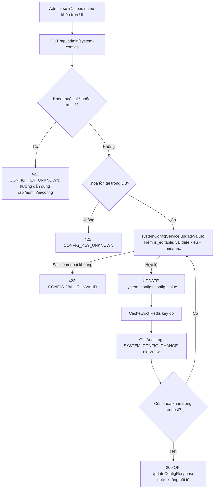

### 5. Dữ liệu chạy như thế nào

- **Input**: `UpdateConfigRequest{configs: [{key, value}], reason}` → **FE**: form gửi mảng thay đổi cùng lúc (đổi nhiều khóa trong 1 request) → **BE validate**: chặn khóa `ai.*`/`trust.*` ngay từ đầu, sau đó với từng khóa: tồn tại? editable? đúng kiểu? trong khoảng min/max? → **Business logic**: `stringify(Object)` chuẩn hóa giá trị JSON body về chuỗi thô lưu DB (cột `config_value` là `TEXT`, luôn lưu dạng chuỗi bất kể `value_type`) → **DB**: `UPDATE system_configs` + `INSERT audit_logs` → **Response**: `UpdateConfigResponse{updated[], cacheInvalidated, auditLogIds[], note, updatedAt}` — mỗi `UpdatedItem` trả `oldValue`/`newValue` đã **ép kiểu đúng** (Integer/BigDecimal/Boolean/String) qua `SystemConfigMapper.coerce` để FE hiển thị đẹp thay vì luôn là chuỗi thô.
- **Đọc runtime (module khác dùng)**: mọi lời gọi `systemConfig.getInt/getBoolean/getDecimal/getString(ConfigKey.XXX)` đều đi qua `getString` (được `@Cacheable`) rồi ép kiểu tại chỗ — **không** cache riêng cho `getInt`/`getBoolean` (chúng gọi lại `getString` đã cache nên vẫn nhanh, nhưng nếu `getString` cache miss thì mọi `getX` khác cùng key đều phải chờ query DB).

### 6. Database liên quan

**Bảng `system_configs`**

| Field | Ý nghĩa |
|---|---|
| `config_key` (unique, vd. `payment.order_expiry_minutes`) | |
| `config_value` (TEXT, lưu dạng chuỗi thô bất kể kiểu), `default_value` | |
| `value_type` (`STRING`/`INT`/`DECIMAL`/`BOOLEAN`/`JSON`) | |
| `group_name` (`LISTING`/`MODERATION`/`INTERACTION`/`PROMOTION`/`SECURITY`/`SPAM`/`UPLOAD`/`TRUST`/`AI`), `label`, `description` | |
| `min_value`, `max_value` (DECIMAL(15,4), áp dụng cho INT/DECIMAL) | |
| `is_editable` (một số khóa chỉ đọc, không cho sửa qua UI), `display_order` | |

- Check: `ck_system_configs_value_type`, `ck_system_configs_range (min_value IS NULL OR max_value IS NULL OR min_value <= max_value)`.
- Không có quan hệ FK tới bảng khác — đây là bảng key-value độc lập, "quan hệ" thực chất là **quan hệ logic** (khóa được đọc bởi code ở nhiều module khác nhau) chứ không phải quan hệ DB.
- Dữ liệu khởi tạo: `V5__seed_system_configs.sql`.

### 7. API liên quan

| Method | URL | Request | Response | Auth | Permission | Error chính |
|---|---|---|---|---|---|---|
| GET | `/api/admin/system-configs` | Query `group?` (null/ALL = tất cả, trừ `ai.*`/`trust.*`) | `SystemConfigResponse{groups[{group, label, configs[]}], note}` | JWT | `SYSTEM_CONFIG_MANAGE` | — |
| PUT | `/api/admin/system-configs` | `UpdateConfigRequest{configs[{key,value}], reason}` | `UpdateConfigResponse` | JWT | `SYSTEM_CONFIG_MANAGE` | `CONFIG_KEY_UNKNOWN`, `CONFIG_VALUE_INVALID` |

> Không có API xem/sửa **1 khóa đơn lẻ** — chỉ có "xem theo nhóm" và "sửa hàng loạt" (mảng `configs[]`, có thể gửi 1 phần tử để sửa 1 khóa).

### 8. Dependency

- **Phụ thuộc**: `SystemConfigRepository`, Redis (cache), `AuditLogService`.
- **Được phụ thuộc bởi TẤT CẢ module khác trong phạm vi Người 3** (và nhiều module ngoài phạm vi): Favorite/History (`view.dedup_minutes`), Contact (`contact.dedup_minutes`), Comment (`comment.edit_window_minutes`, `spam.comment_per_minute`), Review (`review.edit_window_hours`, `review.require_contact`), Conversation (`spam.message_per_minute`), Payment (`payment.order_expiry_minutes`, `payment.callback_max_skew_seconds`, `promotion.max_priority`), AI (toàn bộ `ai.*` — nhưng quản trị qua `AdminAiController` riêng, không qua controller này).

### 9. Các trường hợp cần kiểm tra

- [ ] Xem cấu hình theo nhóm cụ thể (vd. `group=SPAM`) → chỉ trả đúng nhóm đó.
- [ ] Xem toàn bộ (`group` rỗng/`ALL`) → trả tất cả nhóm **trừ** `AI`/`TRUST` (2 nhóm này không xuất hiện — kiểm tra kỹ vì `GROUP_LABELS` vẫn có định nghĩa nhãn "AI" nhưng thực tế bị lọc bỏ ở `getConfigs`, hơi mâu thuẫn — xem mục 10/11).
- [ ] Sửa 1 khóa hợp lệ trong khoảng min/max → cập nhật thành công, cache evict, đọc lại (module khác) thấy giá trị mới ngay (không cần restart app).
- [ ] Sửa khóa với giá trị ngoài khoảng min/max → 422 `CONFIG_VALUE_INVALID`, giá trị DB không đổi.
- [ ] Sửa khóa `is_editable=false` → bị chặn.
- [ ] Sửa khóa không tồn tại (gõ sai tên) → 422 `CONFIG_KEY_UNKNOWN`.
- [ ] Sửa khóa thuộc `ai.*`/`trust.*` qua endpoint này → 422, thông báo hướng đúng endpoint.
- [ ] Sửa nhiều khóa cùng lúc, 1 khóa lỗi giữa chừng → xác nhận hành vi: dừng ngay (transaction rollback toàn bộ) hay đã áp các khóa trước đó? (code lặp tuần tự trong 1 `@Transactional`, nên **toàn bộ rollback** nếu 1 khóa lỗi — cần test xác nhận).
- [ ] Kiểm tra `reason` (lý do đổi cấu hình) có bắt buộc không (đọc `UpdateConfigRequest` — > cần bổ sung theo source code, chưa đọc validation chi tiết của field này).
- [ ] Đổi giá trị BOOLEAN với chuỗi khác `true`/`false` (vd. "yes") → lỗi validate.
- [ ] Audit log ghi đủ `oldValue`/`newValue` đúng định dạng, `actorId` đúng người sửa.
- [ ] Cache: sau khi đổi 1 khóa, gọi API đọc lại nhóm đó → giá trị mới hiển thị ngay (không bị cache stale).
- [ ] Reset cache toàn bộ (`evictCache`) không làm mất dữ liệu, chỉ buộc đọc lại từ DB lần kế tiếp.

### 10. Các lỗi dễ gặp

- **Nhầm lẫn nhóm AI vẫn "có nhãn" nhưng "không hiện dữ liệu"**: `AdminSystemConfigServiceImpl.GROUP_LABELS` vẫn map `"AI" → "Trí tuệ nhân tạo"` dù `getConfigs()` **luôn lọc bỏ** mọi khóa bắt đầu `ai.`/`trust.` trước khi build danh sách nhóm — nghĩa là nhãn "AI" trong `GROUP_LABELS` **không bao giờ** thực sự xuất hiện trong response (vì không còn config nào thuộc nhóm đó sau khi lọc theo tiền tố khóa, trừ khi có khóa nhóm `group_name='AI'` nhưng KHÔNG có tiền tố `ai.`/`trust.` trong `config_key` — trường hợp hiếm/không nhất quán dữ liệu). Dễ gây bối rối khi đọc code lần đầu.
- Quên rằng `config_value` luôn là **chuỗi** trong DB — nếu debug trực tiếp bằng SQL thấy `"true"`/`"15"` là bình thường, không phải lỗi kiểu dữ liệu.
- Đổi cấu hình rồi thắc mắc "sao dữ liệu cũ không đổi theo" — tài liệu ghi rõ **"không hồi tố"** (`UpdateConfigResponse.note`), chỉ áp dụng cho thao tác **sau** thời điểm đổi (vd. đổi `payment.order_expiry_minutes` không rút ngắn hạn các đơn `PENDING` đã tạo trước đó).
- `evictCache(key)` thực chất luôn evict **toàn bộ** cache (`allEntries=true`) bất kể tham số `key` truyền vào — tên hàm gây hiểu nhầm là chỉ xóa 1 key.

### 11. Các điểm cần review

- **Business**: làm rõ ý đồ của `GROUP_LABELS["AI"]` không bao giờ dùng tới — nên dọn dẹp hoặc bổ sung logic hiển thị nếu có kế hoạch gộp `AdminAiController` vào `AdminSystemConfigController` trong tương lai.
- **API design**: không có endpoint lấy nhóm hiện có (`/groups`) để FE tự build `MenuItem` — hiện tại `SystemConfigPage.jsx` chắc phải hardcode danh sách nhóm hoặc suy ra từ lần load `group=ALL` đầu tiên (> cần xác nhận đọc thêm code FE).
- **Validation**: nên bổ sung kiểm tra JSON hợp lệ cho `value_type=JSON` (hiện `validateValue` chỉ xử lý INT/DECIMAL/BOOLEAN, bỏ qua STRING/JSON — nghĩa là giá trị JSON sai cú pháp vẫn được lưu, chỉ phát hiện lỗi khi module tiêu thụ parse thất bại lúc runtime).
- **Naming**: `evictCache(String key)` nên đổi tên hoặc sửa hành vi cho khớp signature (hiện tham số `key` không được dùng thật).
- **Security**: chỉ `SYSTEM_CONFIG_MANAGE` (dành cho Admin) được sửa — đúng nguyên tắc least privilege vì đây là bảng ảnh hưởng toàn hệ thống; xác nhận không có endpoint nào khác (vd. debug/internal) cho phép ghi bảng này mà bỏ qua kiểm tra quyền.

### 12. Kết quả mong đợi

- Admin xem/sửa cấu hình hệ thống theo nhóm, có validate chặt (kiểu, khoảng giá trị, quyền chỉnh sửa), có audit log đầy đủ.
- Thay đổi có hiệu lực ngay lập tức (cache evict đúng), không ảnh hưởng hồi tố dữ liệu/giao dịch đã tồn tại.
- Ranh giới rõ ràng giữa cấu hình chung (`AdminSystemConfigController`) và cấu hình AI (`AdminAiController`) được tôn trọng ở cả 2 chiều (không cho sửa nhầm endpoint).

---

## Checklist tổng của Người 3

- [ ] Đọc source (BE controllers/services/entities + FE pages/api) — đã đối chiếu với tài liệu này, phát hiện thêm gì thì bổ sung.
- [ ] Chạy thử toàn bộ luồng end-to-end trên môi trường dev (MailHog cho email, Redis cho cache/rate-limit, MySQL cho DB) trước khi review sâu từng API.
- [ ] Test API bằng Postman/Swagger cho từng endpoint trong 6 module, đặc biệt các luồng có nhiều bước (thanh toán, chat, kiểm duyệt).
- [ ] Test UI cho từng trang FE liệt kê ở mục 2 của mỗi module, cả trạng thái loading/empty/error.
- [ ] Kiểm tra DB: chạy query trực tiếp đối chiếu số liệu denormalized (`favorite_count`, `comment_count`, `average_rating`, `contact_count`) với số đếm thật (`COUNT(*)`).
- [ ] So sánh Business: đối chiếu hành vi thật với mô tả canonical/tài liệu nghiệp vụ (nếu có), đặc biệt các ngoại lệ (§9.1 AI, §3.14 Payment).
- [ ] Ghi Bug: ưu tiên xác nhận lại 4 lỗi thật đã phát hiện trong quá trình đọc code — (1) `GET /api/reviews/my` luôn trả rỗng, (2) filter `listingId/type/from/to` ở `GET /api/landlord/contacts` không có tác dụng, (3) filter `rating` ở danh sách review tin không lọc DB, (4) rủi ro race condition khi áp coupon giới hạn lượt dùng thấp.
- [ ] Ghi Improvement: performance (`findAll().stream()` trong PromotionServiceImpl, N+1 ở CommentServiceImpl/HistoryServiceImpl), UX (thông báo hoàn tiền dùng sai loại notification, chatbot không polling realtime cho MessagesPage).
- [ ] Tổng hợp báo cáo theo 6 module, kèm mức độ ưu tiên (nghiêm trọng/trung bình/thấp) và đề xuất hướng sửa cho từng phát hiện.

**Riêng cho cụm Người 3** (mục bổ sung do đặc thù thanh toán + AI):

- [ ] Test riêng luồng **idempotency** thanh toán (double-submit cùng key, khác key, thiếu key).
- [ ] Test riêng luồng **callback thanh toán** với chữ ký sai/hết hạn/replay — đảm bảo không có cách nào kích hoạt gói mà không qua xác thực hợp lệ.
- [ ] Test riêng **AI cảm xúc** với bộ câu tiếng Việt đa dạng (có dấu, không dấu, teencode, emoji, phủ định lồng nhau) để đánh giá độ chính xác thực tế của từ điển rule-based.
- [ ] Test riêng **chatbot** với các câu hỏi ngoài kịch bản (multi-intent, câu hỏi mơ hồ, chuyển đổi ngữ cảnh giữa các lượt) để đánh giá giới hạn của engine rule-based.
- [ ] Xác nhận mọi khóa `system_configs` mà 5 module còn lại phụ thuộc đều tồn tại trong seed `V5__seed_system_configs.sql` và có giá trị mặc định hợp lý (không để trống gây `INTERNAL_ERROR` lúc runtime khi module khác gọi `getInt`/`getBoolean` với khóa thiếu).


---

# 🔗 Module dùng chung & Ranh giới phối hợp

> Các module dưới đây bị **nhiều người chạm tới**. Mỗi dòng nêu rõ **ai chịu trách nhiệm chính** (sửa/đảm bảo đúng) và **ai chỉ cần hiểu để phối hợp** (không sửa, chỉ kiểm tra nhánh liên quan tới cụm mình).

| Module/Thành phần dùng chung | Chịu trách nhiệm chính | Người phối hợp (chỉ cần hiểu) | Lý do & ranh giới |
|---|---|---|---|
| **Bảo mật / JWT / RBAC filter** (auth) | **Người 1** | Người 2, Người 3 | Mọi endpoint đều qua filter JWT + `@PreAuthorize`. P2/P3 chỉ kiểm tra quyền trên endpoint của mình dùng đúng quyền đã khai báo. |
| **Notification** (`notifyUser`) | **Người 1** | Người 2 (tin được duyệt/sắp hết hạn), Người 3 (thanh toán/liên hệ/bình luận) | P2/P3 **kích hoạt** thông báo qua API `NotificationService`, không sửa module. Kiểm tra: sự kiện của mình có sinh đúng thông báo (in-app + email) không. |
| **Catalog / Địa giới** (provinces·districts·wards) | **Người 2** | Người 1 (địa chỉ hồ sơ người dùng/chủ trọ) | P1 chỉ **đọc** danh mục để chọn địa chỉ. Kiểm tra: phạm vi chỉ Hà Nội. |
| **ReportController** (`POST /api/reports`) — 1 endpoint, 3 target | **Người 1** (xử lý báo cáo, target USER) | Người 2 (target LISTING · RPT-01), Người 3 (target COMMENT · RPT-02) | Cùng endpoint, khác `targetType`. P2/P3 kiểm tra nhánh target của mình; P1 kiểm tra luồng **xử lý** báo cáo (`AdminReportController`). |
| **system_configs** (ngưỡng nghiệp vụ) | **Người 3** (ADM-14) | Người 1, Người 2 | Mọi module **đọc** ngưỡng (thời hạn tin, rate-limit, ngưỡng AI...). P3 đảm bảo CRUD config + cache invalidation đúng. |
| **audit_logs** (`AdminAuditLogController`) | **Người 1** | Người 2 (duyệt/khóa tin), Người 3 (hoàn tiền/kiểm duyệt) | Mọi hành động admin ghi audit. P2/P3 kiểm tra hành động admin của mình **có ghi audit** đúng `old/new value` (JSON). |
| **BannedKeyword** (lọc từ cấm) | **Người 1** (moderation) | Người 2 (tiêu đề/mô tả tin), Người 3 (bình luận/chat) | P1 quản danh sách; P2/P3 kiểm tra nội dung của mình bị chặn đúng khi chứa từ cấm. |
| **Storage / FileController** (ảnh) | **Người 2** (ảnh tin) | Người 1 (avatar) | Ảnh lưu ngoài webroot, phục vụ qua `/api/files/**`. P1 kiểm tra upload avatar dùng cùng cơ chế. |
| **FE `ListingDetailPage.jsx`** | **Người 2** (hiển thị tin + gợi ý + ước giá) | **Người 3** (khối bình luận/đánh giá/nút liên hệ/chatbot) | **Một trang, hai chủ.** P2 sở hữu khung hiển thị tin; P3 sở hữu các khối tương tác nhúng trong trang. Phải thống nhất props/loading state khi review. |
| **SPI Gateway** (`ListingGateway`, `UserGateway`...) | Chủ module nguồn | Module tiêu thụ | Hợp đồng chéo module. Khi đổi field phải kiểm tra cả hai phía. |

---

# 📊 Bảng tổng hợp phân công

| Người | Cụm module | FE | BE | DB | API | Độ khó | Ưu tiên |
|---|---|:---:|:---:|:---:|:---:|:---:|:---:|
| **Người 1** | Auth · Security/RBAC · User/Follow · Notification · Moderation người dùng · Admin console người dùng (Dashboard/Users/Landlords/Statistics/Audit/BannedKeyword) | ✔ | ✔ | ✔ | ✔ | 🔴 Cao (bảo mật, token, phân quyền) | 🔥 P0 (nền tảng) |
| **Người 2** | Listing lifecycle · Search/Filter · Catalog · AI Recommend/Price/TrustScore · Admin Listing/Moderation Queue · Landlord Dashboard | ✔ | ✔ | ✔ | ✔ | 🔴 Cao (state machine, tìm kiếm, AI giá) | 🔥 P0 (lõi sản phẩm) |
| **Người 3** | Favorite/History · Contact/Chat · Comment/Review · Payment/Promotion · AI Sentiment/Chatbot/Log/Config · System Config | ✔ | ✔ | ✔ | ✔ | 🟠 Trung bình–Cao (thanh toán, đồng thời, AI) | 🟡 P1 (tương tác & doanh thu) |

> **Độ khó** phản ánh rủi ro kỹ thuật (bảo mật, đồng thời, máy trạng thái, giao dịch tiền). **Ưu tiên** phản ánh thứ tự nên review trước để mở khóa phần còn lại.

---

# 🗺️ Bản đồ phụ thuộc (thứ tự nên đọc/review trước)

> Đọc theo chiều mũi tên: module gốc phải hiểu trước vì phần sau phụ thuộc vào nó.

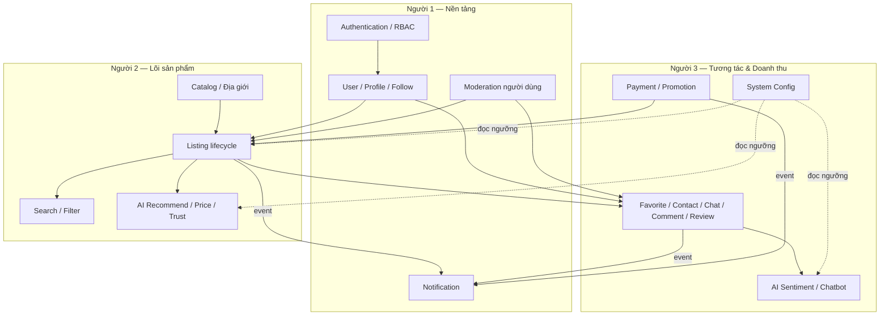

**Thứ tự khuyến nghị:** `Authentication → User → Catalog → Listing → (Search | Favorite/Contact/Comment/Review | AI | Payment) → Notification/Moderation/Config`.

---

# ✅ Sơ đồ quy trình review (áp dụng cho cả 3 người)

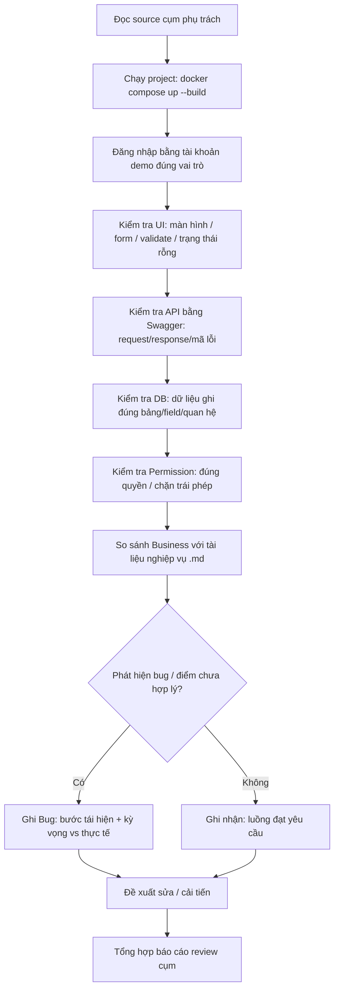

**Mẫu ghi bug (thống nhất giữa 3 người):**

| Trường | Nội dung |
|---|---|
| Mã | `BUG-<cụm>-<số>` |
| Module | (tên module) |
| Mức độ | Chặn / Nặng / Nhẹ / Gợi ý |
| Bước tái hiện | 1… 2… 3… |
| Kết quả kỳ vọng | … |
| Kết quả thực tế | … |
| Bằng chứng | ảnh chụp / response / log / `traceId` |
| Đề xuất sửa | … |

---

## 🚦 Ghi chú vận hành khi review

> - **Chạy sạch:** vì migration `V4` (địa giới Hà Nội) và seed dữ liệu mẫu đã thay đổi, khi cần dữ liệu chuẩn hãy `docker compose down -v && docker compose up --build` để Flyway seed lại từ đầu.
> - **Swagger:** `http://localhost:8080/swagger-ui.html` (bật/tắt qua biến `SWAGGER_ENABLED`).
> - **Mail dev:** `http://localhost:8025` (MailHog) để xác minh email xác thực / cảnh báo / thông báo liên hệ.
> - **Mọi ngưỡng nghiệp vụ** (thời hạn tin, rate-limit, ngưỡng AI…) nằm ở bảng `system_configs` — sửa qua giao diện Admin (Người 3), **không** hardcode.

*— Hết tài liệu phân công review —*
