# Báo cáo phân tích Use Case hệ thống Webtro

## 1. Phạm vi phân tích

Tài liệu này tổng hợp các use case thực sự có trong source code của hệ thống Webtro - website quảng cáo, tìm kiếm và quản lý phòng trọ có tích hợp AI hỗ trợ. Việc phân tích dựa trên các nhóm mã nguồn chính:

- Frontend: cấu hình route, menu theo vai trò, các API client và các màn hình chính trong `frontend_webtro/src`.
- Backend: các controller/service theo nhóm `auth`, `listing`, `search`, `interaction`, `moderation`, `payment`, `ai`, `user`, `admin`, `notification`.
- Tài liệu dự án: các file trong thư mục `docs` và `README.md`.

Nguyên tắc liệt kê: không tách các endpoint kỹ thuật nhỏ thành use case độc lập nếu chúng chỉ là bước con của một nghiệp vụ lớn. Ví dụ: đếm thông báo chưa đọc, refresh token, đánh dấu đã đọc, upload ảnh tin đăng... được mô tả trong use case cha thay vì liệt kê thành use case riêng.

## 2. Tác nhân của hệ thống

| Actor | Vai trò trong hệ thống | Ghi chú phân quyền |
| --- | --- | --- |
| Khách vãng lai | Truy cập website khi chưa đăng nhập | Có thể xem trang công khai, tìm kiếm, xem chi tiết tin, xem đánh giá/bình luận công khai, sử dụng chatbot và nhận gợi ý công khai. |
| Người dùng đã xác thực | Actor tổng quát cho các tài khoản đã đăng nhập | Là actor cha của Người thuê, Chủ trọ, Kiểm duyệt viên và Quản trị viên. |
| Người thuê | Người tìm phòng, tương tác với tin đăng và chủ trọ | Có thể lưu tin, xem lịch sử, liên hệ, chat, bình luận, đánh giá, báo cáo vi phạm, theo dõi chủ trọ. Có thể đăng tin tìm người ở ghép, bị giới hạn ở danh mục `ROOMMATE`. |
| Chủ trọ | Người đăng và quảng cáo phòng trọ | Có thể tạo/quản lý tin đăng, xem lead/liên hệ, nhắn tin, thanh toán gói quảng bá, quản lý hồ sơ chủ trọ và yêu cầu xác minh. |
| Kiểm duyệt viên | Người kiểm soát chất lượng nội dung | Có thể duyệt tin, xử lý báo cáo, quản lý bình luận/đánh giá vi phạm, xem log/cảnh báo AI và xử lý hồ sơ chủ trọ. Không quản lý tài chính, cấu hình hệ thống, danh mục cốt lõi. |
| Quản trị viên | Người quản trị toàn bộ nền tảng | Có đầy đủ quyền quản trị người dùng, tin đăng, danh mục, gói dịch vụ, thanh toán, AI, cấu hình hệ thống, thống kê và audit log. |
| Dịch vụ AI | Tác nhân hỗ trợ xử lý thông minh | Hỗ trợ gợi ý tin, chatbot tư vấn, dự đoán giá phòng, phân tích cảm xúc bình luận/đánh giá và tạo cảnh báo. |
| Cổng thanh toán VNPAY | Hệ thống bên ngoài xử lý giao dịch | Nhận yêu cầu tạo thanh toán, trả về callback, hỗ trợ kích hoạt gói/dịch vụ khi thanh toán thành công. |
| Dịch vụ Email/Thông báo | Tác nhân hỗ trợ truyền thông báo | Gửi email xác thực, OTP, quên mật khẩu, thông báo trong hệ thống. |
| Bộ lập lịch hệ thống | Tác nhân thời gian/nền | Kích hoạt các tác vụ tự động như hết hạn tin, nhắc gia hạn, hết hạn gói quảng bá, đối soát thanh toán, tính lại trust score. |

Quan hệ kế thừa actor:

- `Người thuê`, `Chủ trọ`, `Kiểm duyệt viên`, `Quản trị viên` là các chuyên biệt của `Người dùng đã xác thực`.
- `Quản trị viên` có phạm vi quyền rộng nhất, nhưng trong phân tích use case vẫn tách riêng để phân biệt nghiệp vụ quản trị với nghiệp vụ người dùng thông thường.

## 3. Sơ đồ use case tổng quan

Sơ đồ preview Markdown:

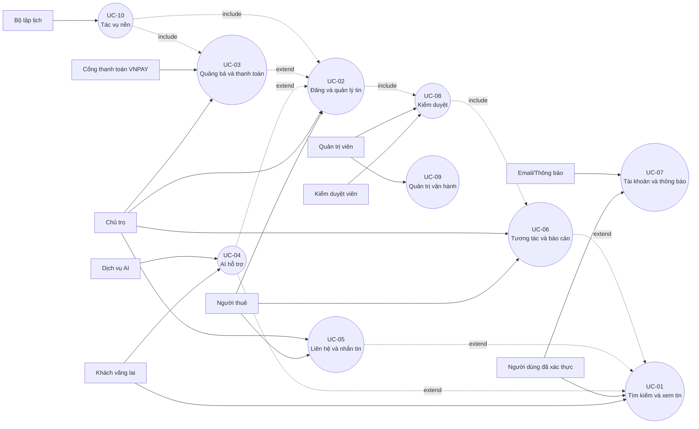
```mermaid
flowchart LR
  Guest["Khách vãng lai"]
  Auth["Người dùng đã xác thực"]
  Tenant["Người thuê"]
  Landlord["Chủ trọ"]
  Mod["Kiểm duyệt viên"]
  Admin["Quản trị viên"]
  AI["Dịch vụ AI"]
  PG["Cổng thanh toán VNPAY"]
  Notify["Email/Thông báo"]
  Scheduler["Bộ lập lịch"]

  UC01(("UC-01<br/>Tìm kiếm và xem tin"))
  UC02(("UC-02<br/>Đăng và quản lý tin"))
  UC03(("UC-03<br/>Quảng bá và thanh toán"))
  UC04(("UC-04<br/>AI hỗ trợ"))
  UC05(("UC-05<br/>Liên hệ và nhắn tin"))
  UC06(("UC-06<br/>Tương tác và báo cáo"))
  UC07(("UC-07<br/>Tài khoản và thông báo"))
  UC08(("UC-08<br/>Kiểm duyệt"))
  UC09(("UC-09<br/>Quản trị vận hành"))
  UC10(("UC-10<br/>Tác vụ nền"))

  Guest --> UC01
  Guest --> UC04
  Auth --> UC01
  Auth --> UC07
  Tenant --> UC02
  Tenant --> UC05
  Tenant --> UC06
  Landlord --> UC02
  Landlord --> UC03
  Landlord --> UC05
  Landlord --> UC06
  Mod --> UC08
  Admin --> UC08
  Admin --> UC09
  AI --> UC04
  PG --> UC03
  Notify --> UC07
  Scheduler --> UC10

  UC04 -.->|extend| UC01
  UC04 -.->|extend| UC02
  UC03 -.->|extend| UC02
  UC05 -.->|extend| UC01
  UC06 -.->|extend| UC01
  UC02 -.->|include| UC08
  UC08 -.->|include| UC06
  UC10 -.->|include| UC02
  UC10 -.->|include| UC03
```

Mã PlantUML để paste vào Visual Paradigm hoặc công cụ vẽ:

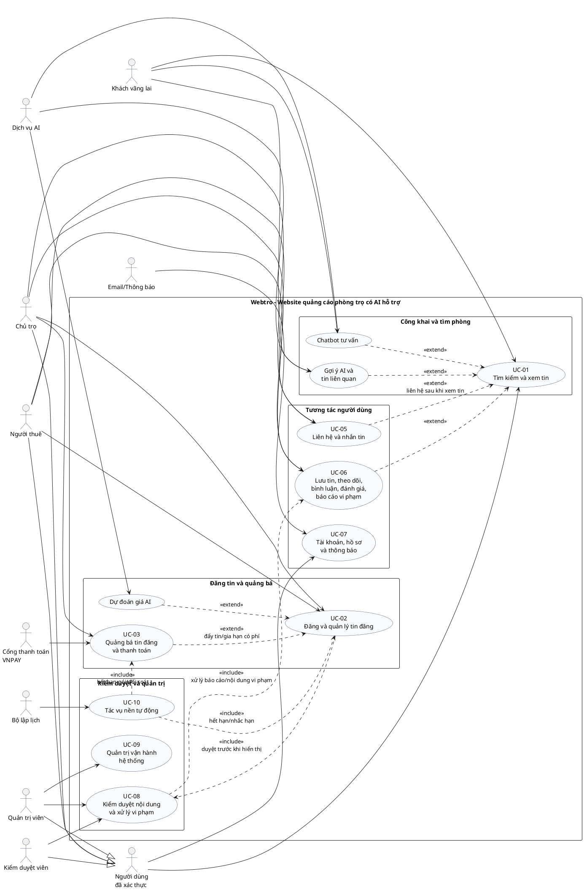
```plantuml
@startuml
left to right direction
skinparam packageStyle rectangle
skinparam shadowing false
skinparam usecase {
  BackgroundColor #F8FAFC
  BorderColor #334155
}
skinparam actor {
  BorderColor #334155
}

actor "Khách vãng lai" as Guest
actor "Người dùng\nđã xác thực" as Auth
actor "Người thuê" as Tenant
actor "Chủ trọ" as Landlord
actor "Kiểm duyệt viên" as Mod
actor "Quản trị viên" as Admin
actor "Dịch vụ AI" as AI
actor "Cổng thanh toán\nVNPAY" as PG
actor "Email/Thông báo" as Notify
actor "Bộ lập lịch" as Scheduler

Tenant --|> Auth
Landlord --|> Auth
Mod --|> Auth
Admin --|> Auth

rectangle "Webtro - Website quảng cáo phòng trọ có AI hỗ trợ" {
  package "Công khai và tìm phòng" {
    usecase "UC-01\nTìm kiếm và xem tin" as UC01
    usecase "Gợi ý AI và\ntin liên quan" as UC04a
    usecase "Chatbot tư vấn" as UC04b
  }

  package "Đăng tin và quảng bá" {
    usecase "UC-02\nĐăng và quản lý tin đăng" as UC02
    usecase "Dự đoán giá AI" as UC04c
    usecase "UC-03\nQuảng bá tin đăng\nvà thanh toán" as UC03
  }

  package "Tương tác người dùng" {
    usecase "UC-05\nLiên hệ và nhắn tin" as UC05
    usecase "UC-06\nLưu tin, theo dõi,\nbình luận, đánh giá,\nbáo cáo vi phạm" as UC06
    usecase "UC-07\nTài khoản, hồ sơ\nvà thông báo" as UC07
  }

  package "Kiểm duyệt và quản trị" {
    usecase "UC-08\nKiểm duyệt nội dung\nvà xử lý vi phạm" as UC08
    usecase "UC-09\nQuản trị vận hành\nhệ thống" as UC09
    usecase "UC-10\nTác vụ nền tự động" as UC10
  }
}

Guest --> UC01
Guest --> UC04a
Guest --> UC04b

Auth --> UC01
Auth --> UC07

Tenant --> UC02
Tenant --> UC05
Tenant --> UC06

Landlord --> UC02
Landlord --> UC03
Landlord --> UC05
Landlord --> UC06

Mod --> UC08
Admin --> UC08
Admin --> UC09

AI --> UC04a
AI --> UC04b
AI --> UC04c
PG --> UC03
Notify --> UC07
Scheduler --> UC10

UC04a ..> UC01 : <<extend>>
UC04b ..> UC01 : <<extend>>
UC04c ..> UC02 : <<extend>>
UC03 ..> UC02 : <<extend>>\nđẩy tin/gia hạn có phí
UC05 ..> UC01 : <<extend>>\nliên hệ sau khi xem tin
UC06 ..> UC01 : <<extend>>
UC02 ..> UC08 : <<include>>\nduyệt trước khi hiển thị
UC08 ..> UC06 : <<include>>\nxử lý báo cáo/nội dung vi phạm
UC10 ..> UC02 : <<include>>\nhết hạn/nhắc hạn
UC10 ..> UC03 : <<include>>\nhết hạn gói/đối soát
@enduml
```

## 4. Danh sách use case theo mức độ trọng tâm chức năng

### UC-01. Tìm kiếm, khám phá và xem chi tiết phòng trọ

| Thuộc tính | Mô tả |
| --- | --- |
| Mục tiêu | Cho phép người dùng khám phá phòng trọ phù hợp thông qua trang chủ, trang tìm kiếm, trang chi tiết và các trang công khai của chủ trọ. |
| Actor chính | Khách vãng lai, Người thuê, Chủ trọ, Người dùng đã xác thực. |
| Actor phụ | Dịch vụ AI. |
| Tiền điều kiện | Tin đăng phải ở trạng thái được phép hiển thị công khai, không bị ẩn, khóa hoặc hết hạn. |
| Hậu điều kiện | Người dùng xem được danh sách/chi tiết tin; nếu đã đăng nhập, hệ thống có thể ghi lịch sử xem và lịch sử tìm kiếm. |

Hoạt động chính:

1. Người dùng truy cập trang chủ, trang tìm kiếm, trang chi tiết tin, trang chủ trọ hoặc các trang nội dung công khai.
2. Hệ thống tải danh mục, khu vực, tiện ích và các cấu hình công khai để phục vụ bộ lọc.
3. Người dùng tìm kiếm theo từ khóa, tỉnh/thành, quận/huyện, phường/xã, danh mục, khoảng giá, diện tích, tiện ích và các đặc điểm phòng.
4. Hệ thống trả về danh sách tin phù hợp, sắp xếp và phân trang.
5. Người dùng mở chi tiết tin để xem thông tin phòng, ảnh, vị trí, tiện ích, giá, mô tả, thông tin chủ trọ, bình luận/đánh giá và tin liên quan.
6. Nếu người dùng đã đăng nhập, hệ thống đánh dấu trạng thái đã lưu tin, ghi nhận lịch sử xem/tìm kiếm và có thể cá nhân hóa gợi ý.

Quan hệ use case:

- `<<extend>>` bởi UC-04: gợi ý AI, tin liên quan, chatbot tư vấn khi người dùng cần hỗ trợ thêm.
- `<<extend>>` bởi UC-05: liên hệ hoặc chat với chủ trọ sau khi xem tin.
- `<<extend>>` bởi UC-06: lưu tin, theo dõi chủ trọ, bình luận, đánh giá, báo cáo vi phạm.
- `<<include>>` các bước tải danh mục/khu vực/tiện ích công khai.

Sơ đồ UC-01 - preview Markdown:

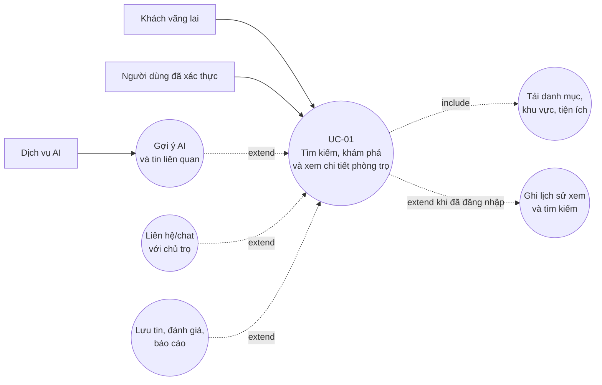
```mermaid
flowchart LR
  Guest["Khách vãng lai"]
  Auth["Người dùng đã xác thực"]
  AI["Dịch vụ AI"]

  Main(("UC-01<br/>Tìm kiếm, khám phá<br/>và xem chi tiết phòng trọ"))
  Catalog(("Tải danh mục,<br/>khu vực, tiện ích"))
  History(("Ghi lịch sử xem<br/>và tìm kiếm"))
  Reco(("Gợi ý AI<br/>và tin liên quan"))
  Contact(("Liên hệ/chat<br/>với chủ trọ"))
  Interact(("Lưu tin, đánh giá,<br/>báo cáo"))

  Guest --> Main
  Auth --> Main
  Main -.->|include| Catalog
  Main -.->|extend khi đã đăng nhập| History
  Reco -.->|extend| Main
  Contact -.->|extend| Main
  Interact -.->|extend| Main
  AI --> Reco
```

Mã PlantUML UC-01 để paste vào công cụ vẽ:

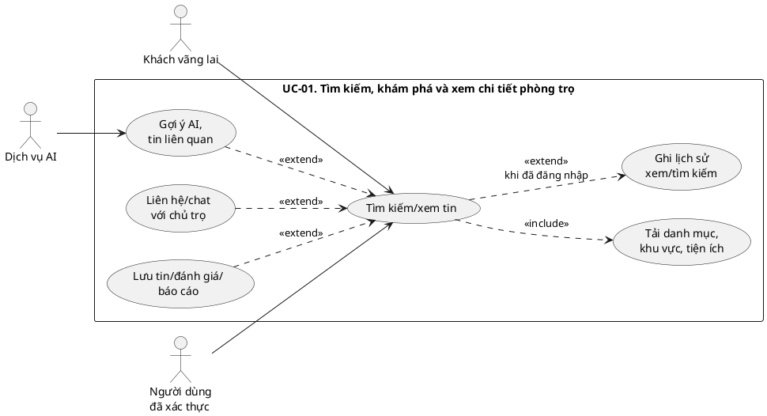
```plantuml
@startuml
left to right direction
actor "Khách vãng lai" as Guest
actor "Người dùng\nđã xác thực" as Auth
actor "Dịch vụ AI" as AI

rectangle "UC-01. Tìm kiếm, khám phá và xem chi tiết phòng trọ" {
  usecase "Tìm kiếm/xem tin" as Main
  usecase "Tải danh mục,\nkhu vực, tiện ích" as Catalog
  usecase "Ghi lịch sử\nxem/tìm kiếm" as History
  usecase "Gợi ý AI,\ntin liên quan" as Reco
  usecase "Liên hệ/chat\nvới chủ trọ" as Contact
  usecase "Lưu tin/đánh giá/\nbáo cáo" as Interact
}

Guest --> Main
Auth --> Main
Main ..> Catalog : <<include>>
Main ..> History : <<extend>>\nkhi đã đăng nhập
Reco ..> Main : <<extend>>
Contact ..> Main : <<extend>>
Interact ..> Main : <<extend>>
AI --> Reco
@enduml
```

### UC-02. Đăng và quản lý tin đăng phòng trọ

| Thuộc tính | Mô tả |
| --- | --- |
| Mục tiêu | Cho phép người dùng có quyền tạo, sửa, gửi duyệt, ẩn/hiện, đóng, gia hạn và theo dõi hiệu quả tin đăng. |
| Actor chính | Chủ trọ, Người thuê, Quản trị viên. |
| Actor phụ | Kiểm duyệt viên, Dịch vụ AI, Bộ lập lịch hệ thống. |
| Tiền điều kiện | Actor đã đăng nhập; tài khoản không bị khóa hoặc bị hạn chế đăng tin; danh mục, địa chỉ, tiện ích hợp lệ. |
| Hậu điều kiện | Tin được lưu dạng bản nháp, gửi vào hàng đợi kiểm duyệt, được công khai nếu duyệt đạt, hoặc bị yêu cầu sửa/từ chối/ẩn tùy kết quả kiểm duyệt. |

Hoạt động chính:

1. Actor mở màn hình tạo/sửa tin đăng.
2. Hệ thống tải danh mục, khu vực, tiện ích và các cấu hình ràng buộc.
3. Actor chọn loại tin. Người thuê chỉ được tạo tin ở ghép (`ROOMMATE`); Chủ trọ và Quản trị viên có thể tạo các loại tin phòng trọ/cho thuê được cấu hình.
4. Actor nhập thông tin cơ bản, địa chỉ, giá, diện tích, tiện ích, đặc điểm phòng, mô tả và ảnh.
5. Hệ thống validate dữ liệu, giới hạn số lượng ảnh, độ dài nội dung, danh mục đang hoạt động, khu vực hợp lệ và quota đăng tin.
6. Actor lưu bản nháp hoặc gửi duyệt.
7. Khi gửi duyệt, hệ thống kiểm tra điều kiện tối thiểu, tạo bản ghi moderation và chuyển tin sang trạng thái chờ duyệt.
8. Nếu tin đăng đang hoạt động bị sửa các trường nhạy cảm, hệ thống chuyển tin về trạng thái cần duyệt lại.
9. Actor quản lý danh sách tin của mình: xem trạng thái, sửa, xóa mềm, ẩn/hiện, đóng tin, gia hạn, xem thống kê và danh sách người liên hệ.

Quan hệ use case:

- `<<include>>` UC-08: mọi tin gửi công khai phải qua kiểm duyệt trước khi hiển thị.
- `<<extend>>` UC-04: dự đoán giá AI trong bước nhập giá và thông tin phòng.
- `<<extend>>` UC-03: đẩy tin/gia hạn có phí khi cần tăng hiển thị hoặc vượt quota gia hạn miễn phí.
- `<<include>>` upload/quản lý ảnh, quản lý tiện ích, tải danh mục/khu vực.
- `<<include>>` UC-10: tác vụ hết hạn tin, nhắc gia hạn và cập nhật trạng thái tự động.

Sơ đồ UC-02 - preview Markdown:

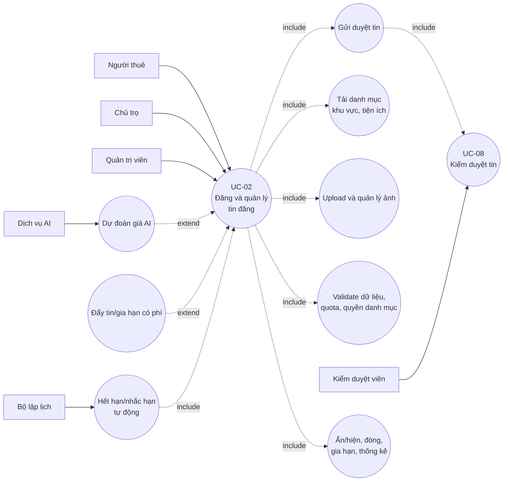
```mermaid
flowchart LR
  Tenant["Người thuê"]
  Landlord["Chủ trọ"]
  Admin["Quản trị viên"]
  Mod["Kiểm duyệt viên"]
  AI["Dịch vụ AI"]
  Scheduler["Bộ lập lịch"]

  Main(("UC-02<br/>Đăng và quản lý<br/>tin đăng"))
  Catalog(("Tải danh mục<br/>khu vực, tiện ích"))
  Upload(("Upload và quản lý ảnh"))
  Validate(("Validate dữ liệu,<br/>quota, quyền danh mục"))
  Submit(("Gửi duyệt tin"))
  Moderate(("UC-08<br/>Kiểm duyệt tin"))
  Manage(("Ẩn/hiện, đóng,<br/>gia hạn, thống kê"))
  PriceAI(("Dự đoán giá AI"))
  Promotion(("Đẩy tin/gia hạn có phí"))
  Expiry(("Hết hạn/nhắc hạn<br/>tự động"))

  Tenant --> Main
  Landlord --> Main
  Admin --> Main
  Main -.->|include| Catalog
  Main -.->|include| Upload
  Main -.->|include| Validate
  Main -.->|include| Submit
  Main -.->|include| Manage
  Submit -.->|include| Moderate
  Mod --> Moderate
  PriceAI -.->|extend| Main
  AI --> PriceAI
  Promotion -.->|extend| Main
  Expiry -.->|include| Main
  Scheduler --> Expiry
```

Mã PlantUML UC-02 để paste vào công cụ vẽ:

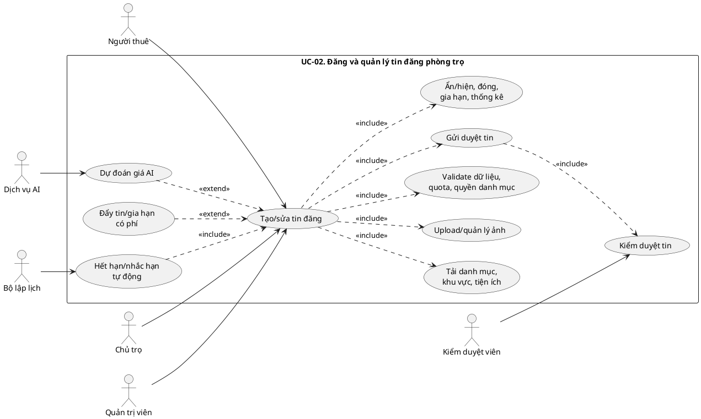
```plantuml
@startuml
left to right direction
actor "Người thuê" as Tenant
actor "Chủ trọ" as Landlord
actor "Quản trị viên" as Admin
actor "Kiểm duyệt viên" as Mod
actor "Dịch vụ AI" as AI
actor "Bộ lập lịch" as Scheduler

rectangle "UC-02. Đăng và quản lý tin đăng phòng trọ" {
  usecase "Tạo/sửa tin đăng" as Main
  usecase "Tải danh mục,\nkhu vực, tiện ích" as Catalog
  usecase "Upload/quản lý ảnh" as Upload
  usecase "Validate dữ liệu,\nquota, quyền danh mục" as Validate
  usecase "Gửi duyệt tin" as Submit
  usecase "Kiểm duyệt tin" as Moderate
  usecase "Ẩn/hiện, đóng,\ngia hạn, thống kê" as Manage
  usecase "Dự đoán giá AI" as PriceAI
  usecase "Đẩy tin/gia hạn\ncó phí" as Promotion
  usecase "Hết hạn/nhắc hạn\ntự động" as Expiry
}

Tenant --> Main
Landlord --> Main
Admin --> Main
Main ..> Catalog : <<include>>
Main ..> Upload : <<include>>
Main ..> Validate : <<include>>
Main ..> Submit : <<include>>
Main ..> Manage : <<include>>
Submit ..> Moderate : <<include>>
Mod --> Moderate
PriceAI ..> Main : <<extend>>
AI --> PriceAI
Promotion ..> Main : <<extend>>
Expiry ..> Main : <<include>>
Scheduler --> Expiry
@enduml
```

### UC-03. Quảng bá tin đăng và thanh toán gói dịch vụ

| Thuộc tính | Mô tả |
| --- | --- |
| Mục tiêu | Cho phép Chủ trọ/Quản trị viên mua gói quảng bá, đẩy tin, gia hạn có phí và quản lý lịch sử thanh toán. |
| Actor chính | Chủ trọ, Quản trị viên. |
| Actor phụ | Cổng thanh toán VNPAY, Bộ lập lịch hệ thống. |
| Tiền điều kiện | Actor đã đăng nhập; tin đăng thuộc quyền quản lý của actor; gói dịch vụ đang hoạt động; thông tin thanh toán hợp lệ. |
| Hậu điều kiện | Giao dịch được tạo; nếu thanh toán thành công, gói/dịch vụ quảng bá được kích hoạt và tin đăng được cập nhật hiệu lực quảng bá. |

Hoạt động chính:

1. Actor xem danh sách gói quảng bá đang được công khai.
2. Actor chọn tin đăng và gói dịch vụ cần mua.
3. Nếu có mã giảm giá, hệ thống kiểm tra coupon theo điều kiện áp dụng.
4. Hệ thống tạo giao dịch thanh toán và trả về URL thanh toán VNPAY.
5. Actor thanh toán trên cổng VNPAY.
6. VNPAY gọi callback về hệ thống.
7. Hệ thống xác thực chữ ký callback, cập nhật trạng thái giao dịch và kích hoạt quảng bá/gia hạn nếu thanh toán thành công.
8. Actor xem lịch sử thanh toán, chi tiết giao dịch, gói đang sử dụng; có thể hủy giao dịch đang chờ thanh toán.

Quan hệ use case:

- `<<extend>>` UC-02: quảng bá/đẩy tin là chức năng mở rộng của quản lý tin đăng.
- `<<include>>` xác thực sở hữu tin đăng, tạo payment, callback VNPAY và kích hoạt gói.
- `<<extend>>` áp dụng coupon nếu người dùng nhập mã giảm giá.
- `<<include>>` UC-10: đối soát thanh toán và hết hạn gói quảng bá theo lịch.
- `<<extend>>` UC-09: Quản trị viên có thể quản lý gói, coupon, refund hoặc đối soát giao dịch.

Sơ đồ UC-03 - preview Markdown:

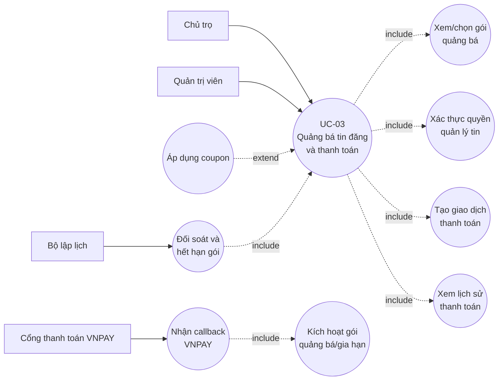
```mermaid
flowchart LR
  Landlord["Chủ trọ"]
  Admin["Quản trị viên"]
  PG["Cổng thanh toán VNPAY"]
  Scheduler["Bộ lập lịch"]

  Main(("UC-03<br/>Quảng bá tin đăng<br/>và thanh toán"))
  Package(("Xem/chọn gói<br/>quảng bá"))
  Ownership(("Xác thực quyền<br/>quản lý tin"))
  Coupon(("Áp dụng coupon"))
  CreatePay(("Tạo giao dịch<br/>thanh toán"))
  Callback(("Nhận callback<br/>VNPAY"))
  Activate(("Kích hoạt gói<br/>quảng bá/gia hạn"))
  History(("Xem lịch sử<br/>thanh toán"))
  Reconcile(("Đối soát và<br/>hết hạn gói"))

  Landlord --> Main
  Admin --> Main
  Main -.->|include| Package
  Main -.->|include| Ownership
  Coupon -.->|extend| Main
  Main -.->|include| CreatePay
  PG --> Callback
  Callback -.->|include| Activate
  Main -.->|include| History
  Reconcile -.->|include| Main
  Scheduler --> Reconcile
```

Mã PlantUML UC-03 để paste vào công cụ vẽ:

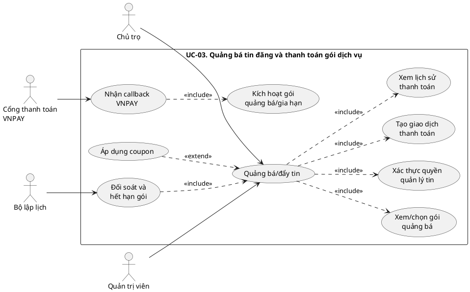
```plantuml
@startuml
left to right direction
actor "Chủ trọ" as Landlord
actor "Quản trị viên" as Admin
actor "Cổng thanh toán\nVNPAY" as PG
actor "Bộ lập lịch" as Scheduler

rectangle "UC-03. Quảng bá tin đăng và thanh toán gói dịch vụ" {
  usecase "Quảng bá/đẩy tin" as Main
  usecase "Xem/chọn gói\nquảng bá" as Package
  usecase "Xác thực quyền\nquản lý tin" as Ownership
  usecase "Áp dụng coupon" as Coupon
  usecase "Tạo giao dịch\nthanh toán" as CreatePay
  usecase "Nhận callback\nVNPAY" as Callback
  usecase "Kích hoạt gói\nquảng bá/gia hạn" as Activate
  usecase "Xem lịch sử\nthanh toán" as History
  usecase "Đối soát và\nhết hạn gói" as Reconcile
}

Landlord --> Main
Admin --> Main
Main ..> Package : <<include>>
Main ..> Ownership : <<include>>
Coupon ..> Main : <<extend>>
Main ..> CreatePay : <<include>>
PG --> Callback
Callback ..> Activate : <<include>>
Main ..> History : <<include>>
Reconcile ..> Main : <<include>>
Scheduler --> Reconcile
@enduml
```

### UC-04. AI hỗ trợ tìm phòng, tư vấn, định giá và kiểm soát nội dung

| Thuộc tính | Mô tả |
| --- | --- |
| Mục tiêu | Nâng cao trải nghiệm tìm phòng và chất lượng nội dung bằng các module AI: gợi ý tin, chatbot, dự đoán giá, phân tích cảm xúc/cảnh báo. |
| Actor chính | Khách vãng lai, Người thuê, Chủ trọ, Quản trị viên, Kiểm duyệt viên. |
| Actor phụ | Dịch vụ AI. |
| Tiền điều kiện | Dịch vụ AI được cấu hình; dữ liệu đầu vào đủ điều kiện tối thiểu theo từng module. |
| Hậu điều kiện | Hệ thống trả về gợi ý, câu trả lời chatbot, giá đề xuất, log AI hoặc cảnh báo để hỗ trợ người dùng/kiểm duyệt. |

Hoạt động chính:

1. Gợi ý tin đăng: hệ thống trả về danh sách tin gợi ý cho trang chủ, tìm kiếm ít kết quả, trang chi tiết, sau khi yêu thích tin hoặc theo hồ sơ người dùng.
2. Chatbot tư vấn: Khách vãng lai hoặc người dùng gửi câu hỏi; chatbot trả lời dựa trên ngữ cảnh tìm phòng. Nếu đã đăng nhập, hệ thống có thể lưu lịch sử hội thoại.
3. Dự đoán giá phòng: khi tạo/sửa tin, actor nhập thông tin vị trí, diện tích, tiện ích, danh mục; AI trả về giá đề xuất và cảnh báo nếu giá lệch bất thường.
4. Phân tích cảm xúc/nội dung: khi phát sinh bình luận/đánh giá, hệ thống có thể tự động phân tích cảm xúc và gắn cảnh báo. Kiểm duyệt viên/Quản trị viên có thể xem log, cảnh báo, giá lệch và yêu cầu phân tích lại.
5. Quản trị viên cấu hình tham số AI, bật/tắt một số cấu hình vận hành và theo dõi nhật ký AI.

Quan hệ use case:

- `<<extend>>` UC-01: gợi ý AI và chatbot mở rộng trải nghiệm tìm phòng.
- `<<extend>>` UC-02: dự đoán giá AI hỗ trợ quá trình tạo/sửa tin.
- `<<extend>>` UC-08: phân tích cảm xúc/cảnh báo AI hỗ trợ kiểm duyệt nội dung.
- `<<include>>` UC-09: cấu hình AI, xem log AI và quản trị cảnh báo là nghiệp vụ quản trị.

Sơ đồ UC-04 - preview Markdown:

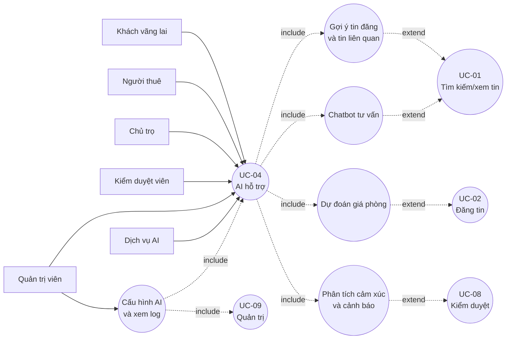
```mermaid
flowchart LR
  Guest["Khách vãng lai"]
  Tenant["Người thuê"]
  Landlord["Chủ trọ"]
  Mod["Kiểm duyệt viên"]
  Admin["Quản trị viên"]
  AI["Dịch vụ AI"]

  Main(("UC-04<br/>AI hỗ trợ"))
  Reco(("Gợi ý tin đăng<br/>và tin liên quan"))
  Chatbot(("Chatbot tư vấn"))
  Price(("Dự đoán giá phòng"))
  Sentiment(("Phân tích cảm xúc<br/>và cảnh báo"))
  Config(("Cấu hình AI<br/>và xem log"))
  UC01(("UC-01<br/>Tìm kiếm/xem tin"))
  UC02(("UC-02<br/>Đăng tin"))
  UC08(("UC-08<br/>Kiểm duyệt"))
  UC09(("UC-09<br/>Quản trị"))

  Guest --> Main
  Tenant --> Main
  Landlord --> Main
  Mod --> Main
  Admin --> Main
  AI --> Main
  Main -.->|include| Reco
  Main -.->|include| Chatbot
  Main -.->|include| Price
  Main -.->|include| Sentiment
  Admin --> Config
  Config -.->|include| Main
  Reco -.->|extend| UC01
  Chatbot -.->|extend| UC01
  Price -.->|extend| UC02
  Sentiment -.->|extend| UC08
  Config -.->|include| UC09
```

Mã PlantUML UC-04 để paste vào công cụ vẽ:

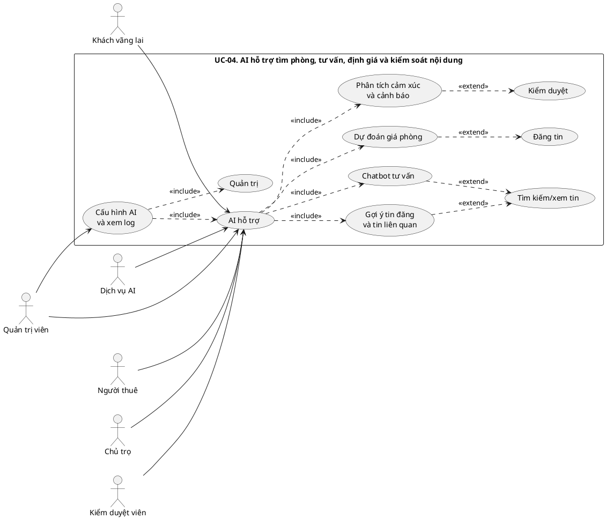
```plantuml
@startuml
left to right direction
actor "Khách vãng lai" as Guest
actor "Người thuê" as Tenant
actor "Chủ trọ" as Landlord
actor "Kiểm duyệt viên" as Mod
actor "Quản trị viên" as Admin
actor "Dịch vụ AI" as AI

rectangle "UC-04. AI hỗ trợ tìm phòng, tư vấn, định giá và kiểm soát nội dung" {
  usecase "AI hỗ trợ" as Main
  usecase "Gợi ý tin đăng\nvà tin liên quan" as Reco
  usecase "Chatbot tư vấn" as Chatbot
  usecase "Dự đoán giá phòng" as Price
  usecase "Phân tích cảm xúc\nvà cảnh báo" as Sentiment
  usecase "Cấu hình AI\nvà xem log" as Config
  usecase "Tìm kiếm/xem tin" as UC01
  usecase "Đăng tin" as UC02
  usecase "Kiểm duyệt" as UC08
  usecase "Quản trị" as UC09
}

Guest --> Main
Tenant --> Main
Landlord --> Main
Mod --> Main
Admin --> Main
AI --> Main
Main ..> Reco : <<include>>
Main ..> Chatbot : <<include>>
Main ..> Price : <<include>>
Main ..> Sentiment : <<include>>
Admin --> Config
Config ..> Main : <<include>>
Reco ..> UC01 : <<extend>>
Chatbot ..> UC01 : <<extend>>
Price ..> UC02 : <<extend>>
Sentiment ..> UC08 : <<extend>>
Config ..> UC09 : <<include>>
@enduml
```

### UC-05. Liên hệ, tạo lead và nhắn tin giữa người tìm phòng với chủ trọ

| Thuộc tính | Mô tả |
| --- | --- |
| Mục tiêu | Kết nối người có nhu cầu thuê phòng với chủ trọ thông qua thông tin liên hệ, yêu cầu liên hệ và hội thoại tin nhắn. |
| Actor chính | Người thuê, Chủ trọ, Người dùng đã xác thực. |
| Actor phụ | Dịch vụ thông báo. |
| Tiền điều kiện | Actor đã đăng nhập; tin đăng còn được phép liên hệ; đối tượng nhận tồn tại và không bị khóa. |
| Hậu điều kiện | Yêu cầu liên hệ/hội thoại/tin nhắn được tạo; chủ trọ có thể quản lý danh sách người quan tâm. |

Hoạt động chính:

1. Người dùng xem chi tiết tin và chọn liên hệ chủ trọ.
2. Hệ thống trả thông tin liên hệ phù hợp hoặc ghi nhận yêu cầu liên hệ.
3. Người dùng tạo hội thoại với chủ trọ hoặc gửi tin nhắn trong hội thoại có sẵn.
4. Hệ thống lưu tin nhắn, cập nhật trạng thái đã đọc/chưa đọc và gửi thông báo đến bên liên quan.
5. Chủ trọ xem danh sách người đã liên hệ theo từng tin đăng, theo dõi lead và tiếp tục trao đổi.

Quan hệ use case:

- `<<extend>>` UC-01: liên hệ thường bắt đầu sau khi người dùng xem chi tiết tin.
- `<<include>>` UC-07: cần tài khoản đăng nhập và thông báo.
- `<<extend>>` UC-02: Chủ trọ xem lead/liên hệ trong màn hình quản lý tin đăng.

Sơ đồ UC-05 - preview Markdown:

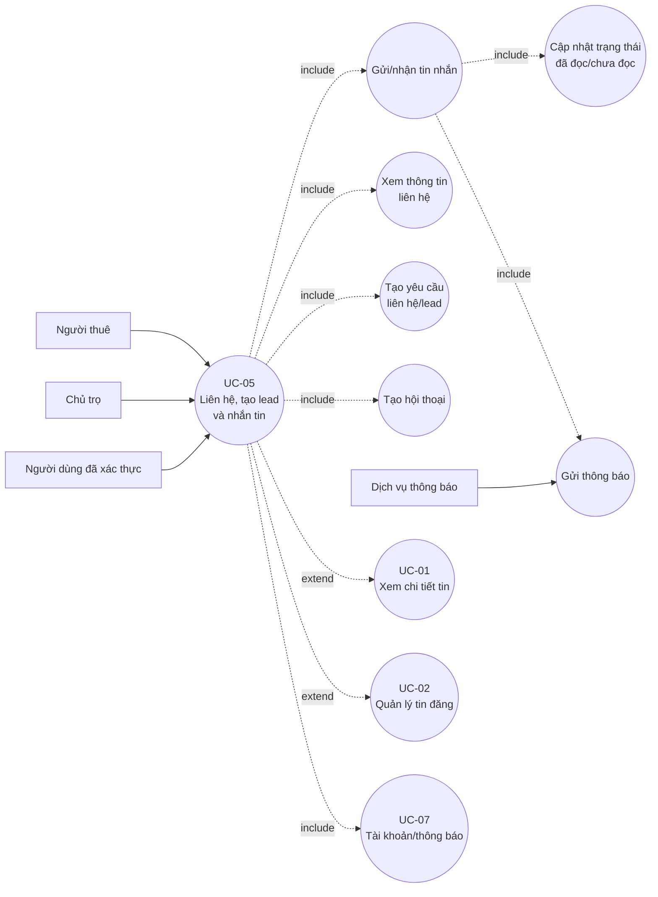
```mermaid
flowchart LR
  Tenant["Người thuê"]
  Landlord["Chủ trọ"]
  Auth["Người dùng đã xác thực"]
  Notify["Dịch vụ thông báo"]

  Main(("UC-05<br/>Liên hệ, tạo lead<br/>và nhắn tin"))
  ContactInfo(("Xem thông tin<br/>liên hệ"))
  Lead(("Tạo yêu cầu<br/>liên hệ/lead"))
  Conversation(("Tạo hội thoại"))
  Message(("Gửi/nhận tin nhắn"))
  ReadState(("Cập nhật trạng thái<br/>đã đọc/chưa đọc"))
  NotifyUC(("Gửi thông báo"))
  UC01(("UC-01<br/>Xem chi tiết tin"))
  UC02(("UC-02<br/>Quản lý tin đăng"))
  UC07(("UC-07<br/>Tài khoản/thông báo"))

  Tenant --> Main
  Landlord --> Main
  Auth --> Main
  Main -.->|include| ContactInfo
  Main -.->|include| Lead
  Main -.->|include| Conversation
  Main -.->|include| Message
  Message -.->|include| ReadState
  Message -.->|include| NotifyUC
  Notify --> NotifyUC
  Main -.->|extend| UC01
  Main -.->|extend| UC02
  Main -.->|include| UC07
```

Mã PlantUML UC-05 để paste vào công cụ vẽ:

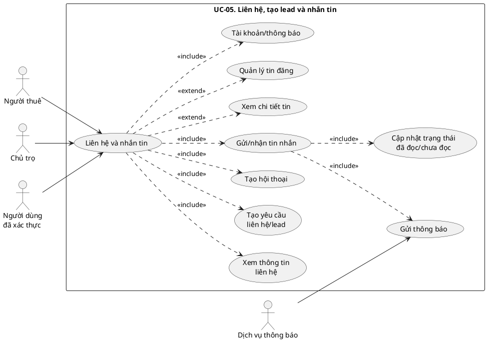
```plantuml
@startuml
left to right direction
actor "Người thuê" as Tenant
actor "Chủ trọ" as Landlord
actor "Người dùng\nđã xác thực" as Auth
actor "Dịch vụ thông báo" as Notify

rectangle "UC-05. Liên hệ, tạo lead và nhắn tin" {
  usecase "Liên hệ và nhắn tin" as Main
  usecase "Xem thông tin\nliên hệ" as ContactInfo
  usecase "Tạo yêu cầu\nliên hệ/lead" as Lead
  usecase "Tạo hội thoại" as Conversation
  usecase "Gửi/nhận tin nhắn" as Message
  usecase "Cập nhật trạng thái\nđã đọc/chưa đọc" as ReadState
  usecase "Gửi thông báo" as NotifyUC
  usecase "Xem chi tiết tin" as UC01
  usecase "Quản lý tin đăng" as UC02
  usecase "Tài khoản/thông báo" as UC07
}

Tenant --> Main
Landlord --> Main
Auth --> Main
Main ..> ContactInfo : <<include>>
Main ..> Lead : <<include>>
Main ..> Conversation : <<include>>
Main ..> Message : <<include>>
Message ..> ReadState : <<include>>
Message ..> NotifyUC : <<include>>
Notify --> NotifyUC
Main ..> UC01 : <<extend>>
Main ..> UC02 : <<extend>>
Main ..> UC07 : <<include>>
@enduml
```

### UC-06. Tương tác cộng đồng, uy tín và báo cáo vi phạm

| Thuộc tính | Mô tả |
| --- | --- |
| Mục tiêu | Cho phép người dùng lưu lại tin quan tâm, theo dõi chủ trọ, bình luận, đánh giá và báo cáo nội dung vi phạm. |
| Actor chính | Người thuê, Chủ trọ, Người dùng đã xác thực. |
| Actor phụ | Kiểm duyệt viên, Dịch vụ AI. |
| Tiền điều kiện | Actor đã đăng nhập đối với thao tác tương tác; đối tượng được tương tác phải tồn tại và hợp lệ. |
| Hậu điều kiện | Tương tác được ghi nhận; nội dung vi phạm có thể tạo report/cảnh báo và được đưa vào luồng kiểm duyệt. |

Hoạt động chính:

1. Lưu/bỏ lưu tin đăng yêu thích và xem danh sách tin đã lưu.
2. Xem/xóa lịch sử xem tin và lịch sử tìm kiếm.
3. Theo dõi/bỏ theo dõi chủ trọ và xem danh sách chủ trọ đang theo dõi.
4. Tạo, trả lời, sửa, xóa bình luận theo quyền tác giả/kiểm duyệt.
5. Kiểm tra điều kiện đánh giá, tạo/sửa/xóa đánh giá tin đăng hoặc chủ trọ.
6. Gửi báo cáo vi phạm đối với tin đăng, bình luận, đánh giá hoặc người dùng; có thể đính kèm bằng chứng.
7. Hệ thống kiểm tra trùng lặp/rate limit. Khi nhiều tài khoản báo cáo cùng mục tiêu trong thời gian ngắn, hệ thống có thể tự động đánh dấu cần xem xét.

Quan hệ use case:

- `<<extend>>` UC-01: các tương tác gắn với quá trình xem tin/chủ trọ.
- `<<include>>` UC-08: report và nội dung vi phạm được chuyển sang kiểm duyệt.
- `<<extend>>` UC-04: phân tích cảm xúc hỗ trợ phát hiện bình luận/đánh giá có rủi ro.
- `<<include>>` UC-07: các tương tác cá nhân gắn với tài khoản và thông báo.

Sơ đồ UC-06 - preview Markdown:

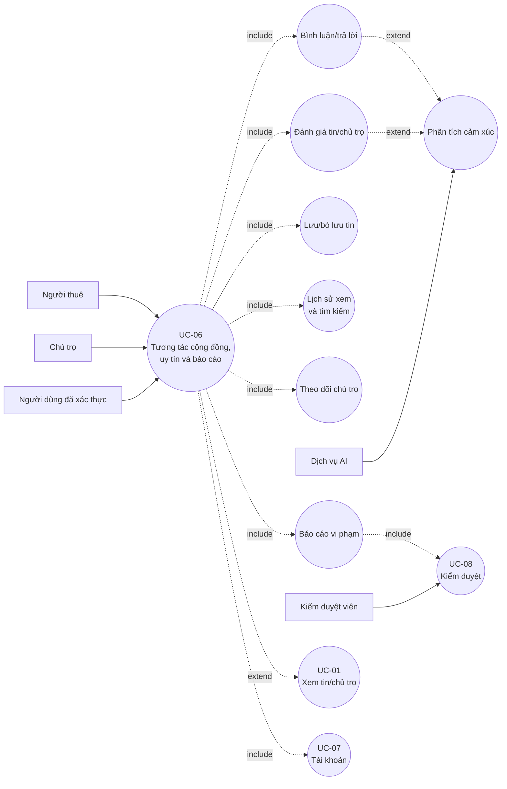
```mermaid
flowchart LR
  Tenant["Người thuê"]
  Landlord["Chủ trọ"]
  Auth["Người dùng đã xác thực"]
  Mod["Kiểm duyệt viên"]
  AI["Dịch vụ AI"]

  Main(("UC-06<br/>Tương tác cộng đồng,<br/>uy tín và báo cáo"))
  Favorite(("Lưu/bỏ lưu tin"))
  History(("Lịch sử xem<br/>và tìm kiếm"))
  Follow(("Theo dõi chủ trọ"))
  Comment(("Bình luận/trả lời"))
  Review(("Đánh giá tin/chủ trọ"))
  Report(("Báo cáo vi phạm"))
  Sentiment(("Phân tích cảm xúc"))
  UC01(("UC-01<br/>Xem tin/chủ trọ"))
  UC07(("UC-07<br/>Tài khoản"))
  UC08(("UC-08<br/>Kiểm duyệt"))

  Tenant --> Main
  Landlord --> Main
  Auth --> Main
  Main -.->|include| Favorite
  Main -.->|include| History
  Main -.->|include| Follow
  Main -.->|include| Comment
  Main -.->|include| Review
  Main -.->|include| Report
  Main -.->|extend| UC01
  Main -.->|include| UC07
  Report -.->|include| UC08
  Comment -.->|extend| Sentiment
  Review -.->|extend| Sentiment
  AI --> Sentiment
  Mod --> UC08
```

Mã PlantUML UC-06 để paste vào công cụ vẽ:

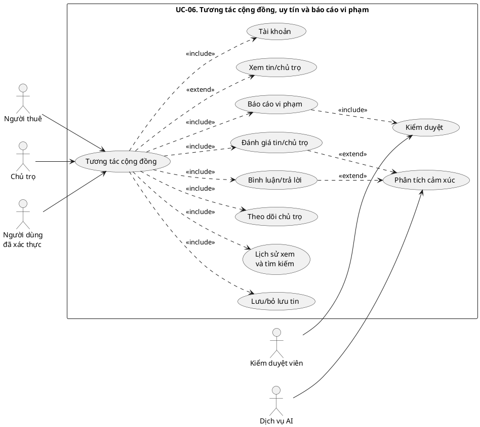
```plantuml
@startuml
left to right direction
actor "Người thuê" as Tenant
actor "Chủ trọ" as Landlord
actor "Người dùng\nđã xác thực" as Auth
actor "Kiểm duyệt viên" as Mod
actor "Dịch vụ AI" as AI

rectangle "UC-06. Tương tác cộng đồng, uy tín và báo cáo vi phạm" {
  usecase "Tương tác cộng đồng" as Main
  usecase "Lưu/bỏ lưu tin" as Favorite
  usecase "Lịch sử xem\nvà tìm kiếm" as History
  usecase "Theo dõi chủ trọ" as Follow
  usecase "Bình luận/trả lời" as Comment
  usecase "Đánh giá tin/chủ trọ" as Review
  usecase "Báo cáo vi phạm" as Report
  usecase "Phân tích cảm xúc" as Sentiment
  usecase "Xem tin/chủ trọ" as UC01
  usecase "Tài khoản" as UC07
  usecase "Kiểm duyệt" as UC08
}

Tenant --> Main
Landlord --> Main
Auth --> Main
Main ..> Favorite : <<include>>
Main ..> History : <<include>>
Main ..> Follow : <<include>>
Main ..> Comment : <<include>>
Main ..> Review : <<include>>
Main ..> Report : <<include>>
Main ..> UC01 : <<extend>>
Main ..> UC07 : <<include>>
Report ..> UC08 : <<include>>
Comment ..> Sentiment : <<extend>>
Review ..> Sentiment : <<extend>>
AI --> Sentiment
Mod --> UC08
@enduml
```

### UC-07. Quản lý tài khoản, hồ sơ và thông báo cá nhân

| Thuộc tính | Mô tả |
| --- | --- |
| Mục tiêu | Quản lý vòng đời tài khoản, bảo mật đăng nhập, hồ sơ cá nhân/chủ trọ và thông báo trong hệ thống. |
| Actor chính | Khách vãng lai, Người dùng đã xác thực, Người thuê, Chủ trọ. |
| Actor phụ | Email/Thông báo. |
| Tiền điều kiện | Tùy thao tác: đăng ký/đăng nhập không cần tài khoản hiện hành; các thao tác hồ sơ/thông báo yêu cầu đăng nhập. |
| Hậu điều kiện | Tài khoản được tạo/xác thực/cập nhật; người dùng quản lý được hồ sơ, mật khẩu, avatar, thông báo và hồ sơ chủ trọ. |

Hoạt động chính:

1. Đăng ký tài khoản, đăng nhập, đăng xuất, làm mới token phiên làm việc.
2. Xác thực email, gửi lại email xác thực, quên mật khẩu, đặt lại mật khẩu.
3. Đổi mật khẩu khi đã đăng nhập.
4. Gửi và xác thực OTP số điện thoại.
5. Xem/cập nhật hồ sơ cá nhân, thông tin liên hệ, avatar.
6. Chủ trọ quản lý hồ sơ chủ trọ và gửi yêu cầu xác minh chủ trọ.
7. Xem danh sách thông báo, đếm thông báo chưa đọc, đánh dấu đã đọc, đánh dấu tất cả đã đọc, xóa thông báo và cập nhật tùy chọn thông báo.

Quan hệ use case:

- `<<include>>` email/OTP/thông báo cho các thao tác xác thực và bảo mật.
- `<<include>>` trong UC-02, UC-03, UC-05, UC-06 vì các nghiệp vụ này yêu cầu tài khoản hợp lệ.
- `<<extend>>` UC-08: yêu cầu xác minh chủ trọ được Kiểm duyệt viên/Quản trị viên xử lý.

Sơ đồ UC-07 - preview Markdown:

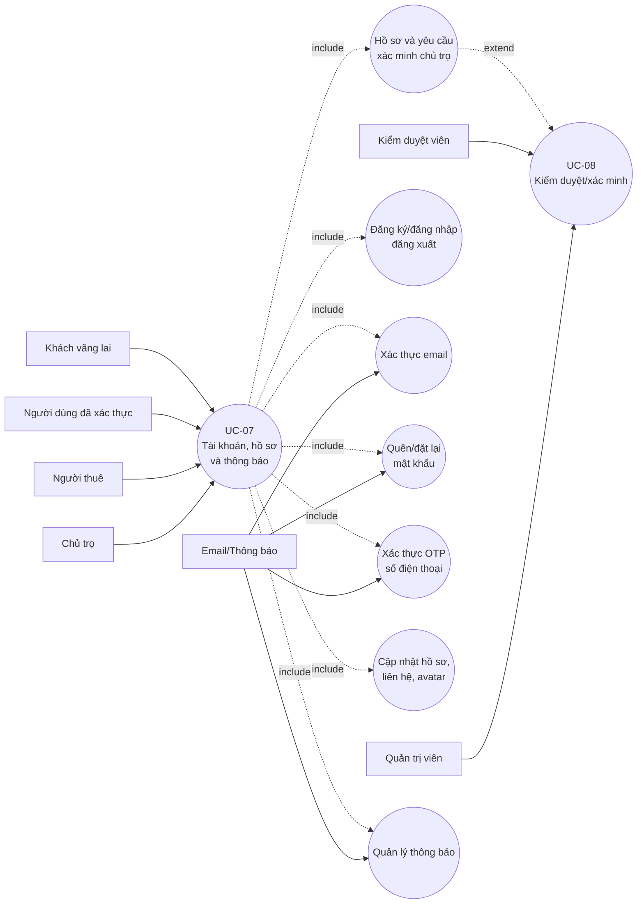
```mermaid
flowchart LR
  Guest["Khách vãng lai"]
  Auth["Người dùng đã xác thực"]
  Tenant["Người thuê"]
  Landlord["Chủ trọ"]
  Notify["Email/Thông báo"]
  Mod["Kiểm duyệt viên"]
  Admin["Quản trị viên"]

  Main(("UC-07<br/>Tài khoản, hồ sơ<br/>và thông báo"))
  Register(("Đăng ký/đăng nhập<br/>đăng xuất"))
  VerifyEmail(("Xác thực email"))
  ResetPass(("Quên/đặt lại<br/>mật khẩu"))
  OTP(("Xác thực OTP<br/>số điện thoại"))
  Profile(("Cập nhật hồ sơ,<br/>liên hệ, avatar"))
  LandlordProfile(("Hồ sơ và yêu cầu<br/>xác minh chủ trọ"))
  Notification(("Quản lý thông báo"))
  UC08(("UC-08<br/>Kiểm duyệt/xác minh"))

  Guest --> Main
  Auth --> Main
  Tenant --> Main
  Landlord --> Main
  Main -.->|include| Register
  Main -.->|include| VerifyEmail
  Main -.->|include| ResetPass
  Main -.->|include| OTP
  Main -.->|include| Profile
  Main -.->|include| LandlordProfile
  Main -.->|include| Notification
  Notify --> VerifyEmail
  Notify --> ResetPass
  Notify --> OTP
  Notify --> Notification
  LandlordProfile -.->|extend| UC08
  Mod --> UC08
  Admin --> UC08
```

Mã PlantUML UC-07 để paste vào công cụ vẽ:

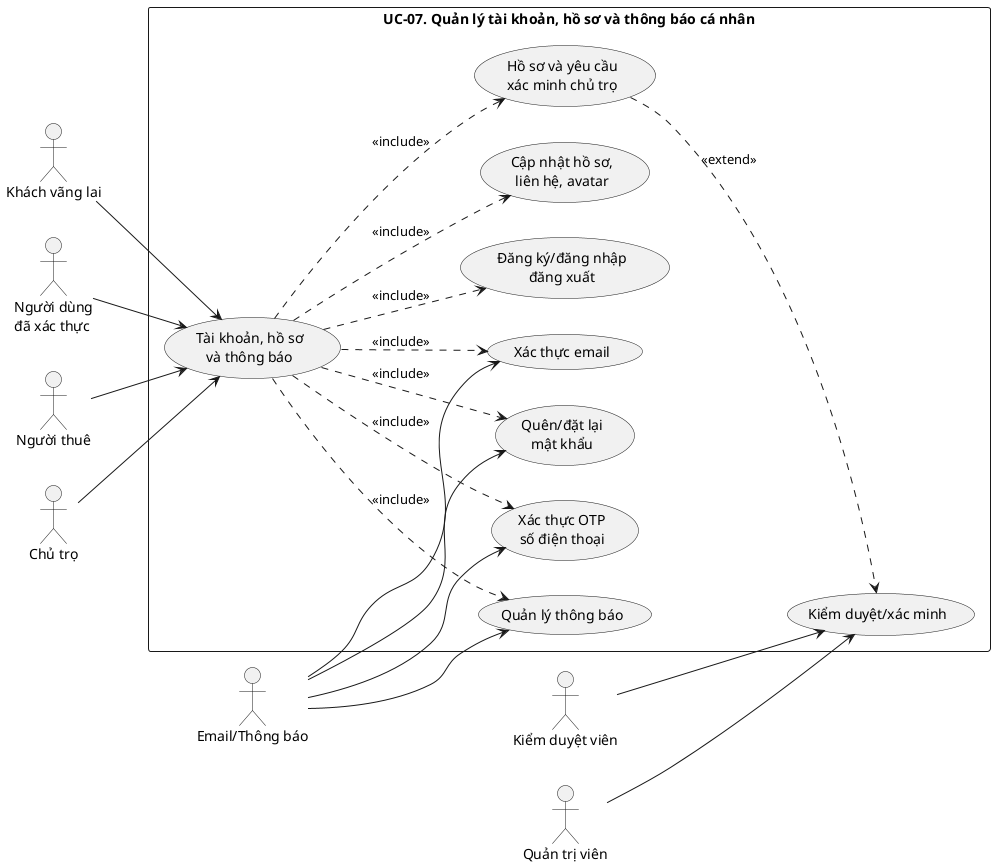
```plantuml
@startuml
left to right direction
actor "Khách vãng lai" as Guest
actor "Người dùng\nđã xác thực" as Auth
actor "Người thuê" as Tenant
actor "Chủ trọ" as Landlord
actor "Email/Thông báo" as Notify
actor "Kiểm duyệt viên" as Mod
actor "Quản trị viên" as Admin

rectangle "UC-07. Quản lý tài khoản, hồ sơ và thông báo cá nhân" {
  usecase "Tài khoản, hồ sơ\nvà thông báo" as Main
  usecase "Đăng ký/đăng nhập\nđăng xuất" as Register
  usecase "Xác thực email" as VerifyEmail
  usecase "Quên/đặt lại\nmật khẩu" as ResetPass
  usecase "Xác thực OTP\nsố điện thoại" as OTP
  usecase "Cập nhật hồ sơ,\nliên hệ, avatar" as Profile
  usecase "Hồ sơ và yêu cầu\nxác minh chủ trọ" as LandlordProfile
  usecase "Quản lý thông báo" as Notification
  usecase "Kiểm duyệt/xác minh" as UC08
}

Guest --> Main
Auth --> Main
Tenant --> Main
Landlord --> Main
Main ..> Register : <<include>>
Main ..> VerifyEmail : <<include>>
Main ..> ResetPass : <<include>>
Main ..> OTP : <<include>>
Main ..> Profile : <<include>>
Main ..> LandlordProfile : <<include>>
Main ..> Notification : <<include>>
Notify --> VerifyEmail
Notify --> ResetPass
Notify --> OTP
Notify --> Notification
LandlordProfile ..> UC08 : <<extend>>
Mod --> UC08
Admin --> UC08
@enduml
```

### UC-08. Kiểm duyệt nội dung và xử lý vi phạm

| Thuộc tính | Mô tả |
| --- | --- |
| Mục tiêu | Đảm bảo tin đăng, bình luận, đánh giá, báo cáo và hồ sơ chủ trọ tuân thủ chính sách của hệ thống. |
| Actor chính | Kiểm duyệt viên, Quản trị viên. |
| Actor phụ | Dịch vụ AI, Người dùng đã xác thực. |
| Tiền điều kiện | Actor có quyền Moderator/Admin; nội dung cần duyệt hoặc báo cáo tồn tại. |
| Hậu điều kiện | Nội dung được phê duyệt, từ chối, ẩn, mở ẩn, gắn cờ cần xem xét, yêu cầu sửa, cảnh báo người dùng hoặc xử lý report. |

Hoạt động chính:

1. Xem hàng đợi tin đăng chờ duyệt và chi tiết tin đăng.
2. Phê duyệt, từ chối, ẩn/hiện, gắn cờ cần xem xét, xóa cờ cần xem xét, yêu cầu sửa hoặc thực hiện duyệt hàng loạt.
3. Xử lý báo cáo vi phạm: xem danh sách, nhóm theo đối tượng, gán người phụ trách, giải quyết từng report hoặc cả nhóm report.
4. Tạo và xem cảnh báo người dùng; nếu đủ số lần cảnh báo, hệ thống có thể hạn chế đăng tin.
5. Kiểm duyệt bình luận/đánh giá: ẩn, hiện, đánh dấu spam, thao tác hàng loạt với bình luận.
6. Xử lý hồ sơ chủ trọ: xác minh, hủy xác minh, từ chối xác minh, hạn chế đăng tin.
7. Xem log AI, cảnh báo AI, giá lệch bất thường và yêu cầu phân tích lại khi cần.

Quan hệ use case:

- `<<include>>` UC-02: tin đăng gửi công khai bắt buộc đi qua kiểm duyệt.
- `<<include>>` UC-06: report, bình luận, đánh giá vi phạm là đầu vào của luồng kiểm duyệt.
- `<<extend>>` UC-04: AI cung cấp cảnh báo/phân tích để hỗ trợ ra quyết định.
- `<<extend>>` UC-09: Quản trị viên có thêm quyền khóa/mở khóa tin, cấu hình từ khóa cấm và quản trị chính sách liên quan.

Sơ đồ UC-08 - preview Markdown:

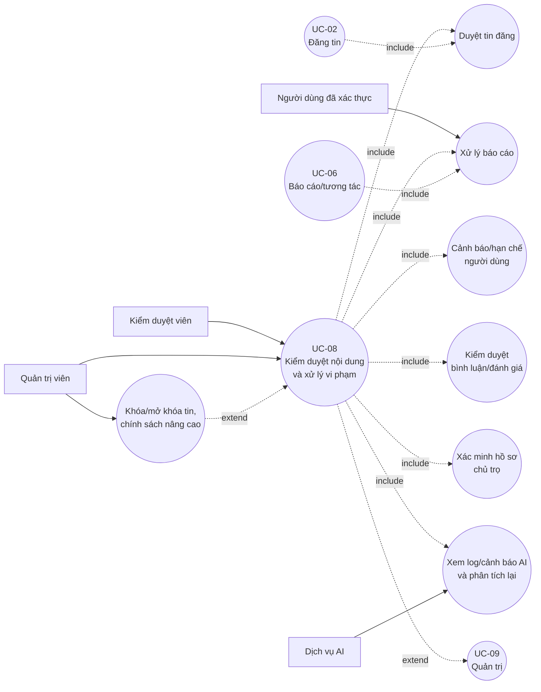
```mermaid
flowchart LR
  Mod["Kiểm duyệt viên"]
  Admin["Quản trị viên"]
  AI["Dịch vụ AI"]
  Auth["Người dùng đã xác thực"]

  Main(("UC-08<br/>Kiểm duyệt nội dung<br/>và xử lý vi phạm"))
  Listing(("Duyệt tin đăng"))
  Report(("Xử lý báo cáo"))
  Warning(("Cảnh báo/hạn chế<br/>người dùng"))
  CommentReview(("Kiểm duyệt<br/>bình luận/đánh giá"))
  LandlordVerify(("Xác minh hồ sơ<br/>chủ trọ"))
  AILog(("Xem log/cảnh báo AI<br/>và phân tích lại"))
  AdminPower(("Khóa/mở khóa tin,<br/>chính sách nâng cao"))
  UC02(("UC-02<br/>Đăng tin"))
  UC06(("UC-06<br/>Báo cáo/tương tác"))
  UC09(("UC-09<br/>Quản trị"))

  Mod --> Main
  Admin --> Main
  Auth --> Report
  Main -.->|include| Listing
  Main -.->|include| Report
  Main -.->|include| Warning
  Main -.->|include| CommentReview
  Main -.->|include| LandlordVerify
  Main -.->|include| AILog
  AdminPower -.->|extend| Main
  Admin --> AdminPower
  AI --> AILog
  UC02 -.->|include| Listing
  UC06 -.->|include| Report
  Main -.->|extend| UC09
```

Mã PlantUML UC-08 để paste vào công cụ vẽ:

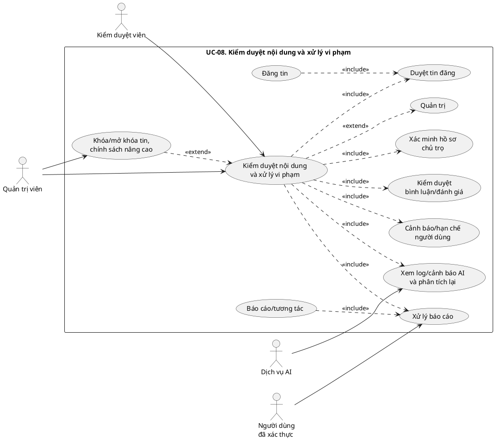
```plantuml
@startuml
left to right direction
actor "Kiểm duyệt viên" as Mod
actor "Quản trị viên" as Admin
actor "Dịch vụ AI" as AI
actor "Người dùng\nđã xác thực" as Auth

rectangle "UC-08. Kiểm duyệt nội dung và xử lý vi phạm" {
  usecase "Kiểm duyệt nội dung\nvà xử lý vi phạm" as Main
  usecase "Duyệt tin đăng" as Listing
  usecase "Xử lý báo cáo" as Report
  usecase "Cảnh báo/hạn chế\nngười dùng" as Warning
  usecase "Kiểm duyệt\nbình luận/đánh giá" as CommentReview
  usecase "Xác minh hồ sơ\nchủ trọ" as LandlordVerify
  usecase "Xem log/cảnh báo AI\nvà phân tích lại" as AILog
  usecase "Khóa/mở khóa tin,\nchính sách nâng cao" as AdminPower
  usecase "Đăng tin" as UC02
  usecase "Báo cáo/tương tác" as UC06
  usecase "Quản trị" as UC09
}

Mod --> Main
Admin --> Main
Auth --> Report
Main ..> Listing : <<include>>
Main ..> Report : <<include>>
Main ..> Warning : <<include>>
Main ..> CommentReview : <<include>>
Main ..> LandlordVerify : <<include>>
Main ..> AILog : <<include>>
AdminPower ..> Main : <<extend>>
Admin --> AdminPower
AI --> AILog
UC02 ..> Listing : <<include>>
UC06 ..> Report : <<include>>
Main ..> UC09 : <<extend>>
@enduml
```

### UC-09. Quản trị vận hành hệ thống

| Thuộc tính | Mô tả |
| --- | --- |
| Mục tiêu | Cho phép Quản trị viên cấu hình, giám sát và điều hành toàn bộ nền tảng. |
| Actor chính | Quản trị viên. |
| Actor phụ | Kiểm duyệt viên với một số màn hình giám sát, Cổng thanh toán, Dịch vụ AI. |
| Tiền điều kiện | Actor có quyền Admin đối với các chức năng quản trị cốt lõi. |
| Hậu điều kiện | Dữ liệu vận hành, danh mục, người dùng, gói dịch vụ, cấu hình và thống kê được quản lý tập trung. |

Hoạt động chính:

1. Quản lý dashboard và thống kê: tổng quan hệ thống, thống kê doanh thu, người dùng, tin đăng, hiệu quả vận hành.
2. Quản lý người dùng: danh sách, chi tiết, khóa/mở khóa tài khoản, cập nhật vai trò.
3. Quản lý chủ trọ: xem danh sách, chi tiết, xác minh/hủy xác minh/từ chối xác minh, hạn chế đăng tin.
4. Quản lý tin đăng ở cấp hệ thống: lọc, xem chi tiết, khóa/mở khóa, phối hợp với luồng kiểm duyệt.
5. Quản lý danh mục và dữ liệu nền: loại tin, tiện ích, tỉnh/thành, quận/huyện, phường/xã, import khu vực.
6. Quản lý từ khóa cấm và cấu hình chính sách nội dung.
7. Quản lý gói quảng bá, coupon, thanh toán, refund và đối soát giao dịch.
8. Quản lý AI: cấu hình AI, xem log, xem cảnh báo, xem giá lệch và thao tác phân tích lại.
9. Quản lý cấu hình hệ thống, nội dung công khai như giới thiệu/điều khoản và audit log.

Quan hệ use case:

- `<<include>>` UC-03: quản trị gói, coupon và thanh toán.
- `<<include>>` UC-04: cấu hình/log AI.
- `<<include>>` UC-08: quản trị viên tham gia luồng kiểm duyệt và có thêm quyền cao hơn.
- `<<include>>` quản lý danh mục phục vụ UC-01 và UC-02.

Sơ đồ UC-09 - preview Markdown:

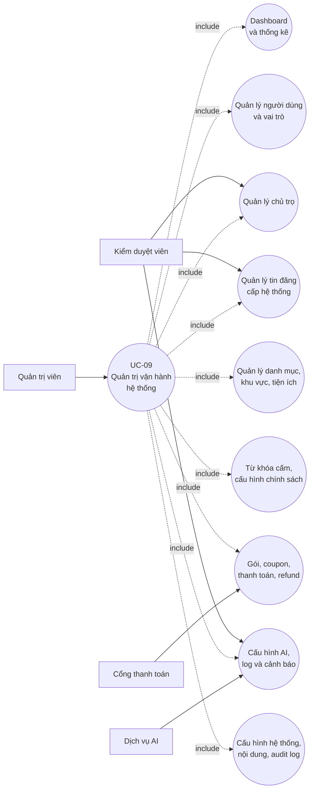
```mermaid
flowchart LR
  Admin["Quản trị viên"]
  Mod["Kiểm duyệt viên"]
  PG["Cổng thanh toán"]
  AI["Dịch vụ AI"]

  Main(("UC-09<br/>Quản trị vận hành<br/>hệ thống"))
  Dashboard(("Dashboard<br/>và thống kê"))
  Users(("Quản lý người dùng<br/>và vai trò"))
  Landlords(("Quản lý chủ trọ"))
  Listings(("Quản lý tin đăng<br/>cấp hệ thống"))
  Catalog(("Quản lý danh mục,<br/>khu vực, tiện ích"))
  Policy(("Từ khóa cấm,<br/>cấu hình chính sách"))
  Finance(("Gói, coupon,<br/>thanh toán, refund"))
  AIAdmin(("Cấu hình AI,<br/>log và cảnh báo"))
  System(("Cấu hình hệ thống,<br/>nội dung, audit log"))

  Admin --> Main
  Mod --> Listings
  Mod --> Landlords
  Mod --> AIAdmin
  Main -.->|include| Dashboard
  Main -.->|include| Users
  Main -.->|include| Landlords
  Main -.->|include| Listings
  Main -.->|include| Catalog
  Main -.->|include| Policy
  Main -.->|include| Finance
  Main -.->|include| AIAdmin
  Main -.->|include| System
  PG --> Finance
  AI --> AIAdmin
```

Mã PlantUML UC-09 để paste vào công cụ vẽ:

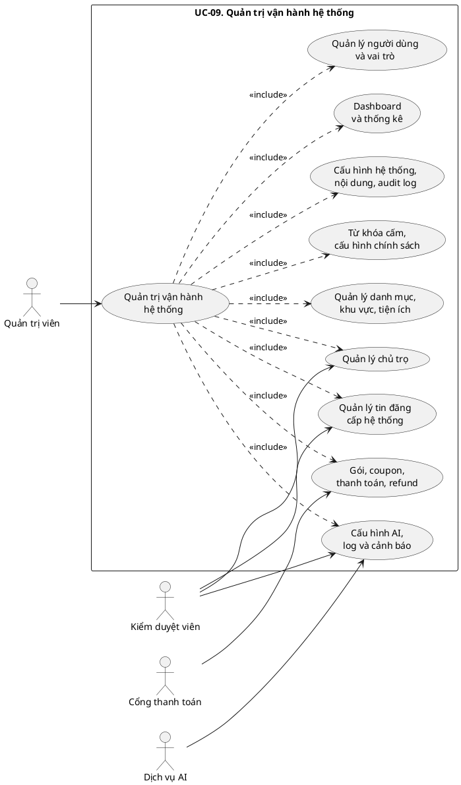
```plantuml
@startuml
left to right direction
actor "Quản trị viên" as Admin
actor "Kiểm duyệt viên" as Mod
actor "Cổng thanh toán" as PG
actor "Dịch vụ AI" as AI

rectangle "UC-09. Quản trị vận hành hệ thống" {
  usecase "Quản trị vận hành\nhệ thống" as Main
  usecase "Dashboard\nvà thống kê" as Dashboard
  usecase "Quản lý người dùng\nvà vai trò" as Users
  usecase "Quản lý chủ trọ" as Landlords
  usecase "Quản lý tin đăng\ncấp hệ thống" as Listings
  usecase "Quản lý danh mục,\nkhu vực, tiện ích" as Catalog
  usecase "Từ khóa cấm,\ncấu hình chính sách" as Policy
  usecase "Gói, coupon,\nthanh toán, refund" as Finance
  usecase "Cấu hình AI,\nlog và cảnh báo" as AIAdmin
  usecase "Cấu hình hệ thống,\nnội dung, audit log" as System
}

Admin --> Main
Mod --> Listings
Mod --> Landlords
Mod --> AIAdmin
Main ..> Dashboard : <<include>>
Main ..> Users : <<include>>
Main ..> Landlords : <<include>>
Main ..> Listings : <<include>>
Main ..> Catalog : <<include>>
Main ..> Policy : <<include>>
Main ..> Finance : <<include>>
Main ..> AIAdmin : <<include>>
Main ..> System : <<include>>
PG --> Finance
AI --> AIAdmin
@enduml
```

### UC-10. Tác vụ nền tự động của hệ thống

| Thuộc tính | Mô tả |
| --- | --- |
| Mục tiêu | Tự động duy trì tính đúng đắn của dữ liệu, trạng thái tin đăng, gói quảng bá, thanh toán, AI và thông báo. |
| Actor chính | Bộ lập lịch hệ thống. |
| Actor phụ | Cổng thanh toán, Dịch vụ AI, Dịch vụ thông báo. |
| Tiền điều kiện | Các job nền được cấu hình và hệ thống đang hoạt động. |
| Hậu điều kiện | Trạng thái dữ liệu được cập nhật đúng hạn, giảm thao tác thủ công và hỗ trợ vận hành ổn định. |

Hoạt động chính:

1. Tự động xử lý tin đăng hết hạn và nhắc người đăng trước khi hết hạn.
2. Tự động hết hạn gói quảng bá khi quá thời gian hiệu lực.
3. Đối soát các giao dịch thanh toán đang treo hoặc cần đồng bộ trạng thái.
4. Thử lại các tác vụ AI thất bại, ví dụ phân tích cảm xúc.
5. Tính lại điểm tin cậy/trust score theo dữ liệu mới.
6. Tiền xử lý/gợi ý trước danh sách recommendation khi cần.
7. Dọn dẹp token/dữ liệu cũ và thực hiện chính sách lưu trữ dữ liệu.
8. Gửi thông báo khi có tin mới phù hợp với tiêu chí người dùng.

Quan hệ use case:

- `<<include>>` UC-02: hết hạn, nhắc hạn, gia hạn tin đăng.
- `<<include>>` UC-03: hết hạn gói quảng bá và đối soát thanh toán.
- `<<include>>` UC-04: retry AI và tiền xử lý recommendation.
- `<<include>>` UC-07: gửi thông báo tự động.
- `<<include>>` UC-09: hỗ trợ vận hành nền tảng và bảo toàn dữ liệu.

Sơ đồ UC-10 - preview Markdown:

```mermaid
flowchart LR
  Scheduler["Bộ lập lịch"]
  PG["Cổng thanh toán"]
  AI["Dịch vụ AI"]
  Notify["Dịch vụ thông báo"]

  Main(("UC-10<br/>Tác vụ nền<br/>tự động"))
  ListingExpiry(("Hết hạn tin<br/>và nhắc gia hạn"))
  PromotionExpiry(("Hết hạn gói<br/>quảng bá"))
  Reconcile(("Đối soát<br/>thanh toán"))
  AIRetry(("Retry AI và<br/>tiền xử lý gợi ý"))
  TrustScore(("Tính lại<br/>trust score"))
  Cleanup(("Dọn token,<br/>lưu trữ dữ liệu"))
  MatchingNotify(("Thông báo tin mới<br/>phù hợp tiêu chí"))
  UC02(("UC-02<br/>Tin đăng"))
  UC03(("UC-03<br/>Thanh toán/gói"))
  UC04(("UC-04<br/>AI"))
  UC07(("UC-07<br/>Thông báo"))
  UC09(("UC-09<br/>Vận hành"))

  Scheduler --> Main
  Main -.->|include| ListingExpiry
  Main -.->|include| PromotionExpiry
  Main -.->|include| Reconcile
  Main -.->|include| AIRetry
  Main -.->|include| TrustScore
  Main -.->|include| Cleanup
  Main -.->|include| MatchingNotify
  PG --> Reconcile
  AI --> AIRetry
  Notify --> MatchingNotify
  ListingExpiry -.->|include| UC02
  PromotionExpiry -.->|include| UC03
  Reconcile -.->|include| UC03
  AIRetry -.->|include| UC04
  MatchingNotify -.->|include| UC07
  Main -.->|include| UC09
```

Mã PlantUML UC-10 để paste vào công cụ vẽ:

```plantuml
@startuml
left to right direction
actor "Bộ lập lịch" as Scheduler
actor "Cổng thanh toán" as PG
actor "Dịch vụ AI" as AI
actor "Dịch vụ thông báo" as Notify

rectangle "UC-10. Tác vụ nền tự động của hệ thống" {
  usecase "Tác vụ nền\ntự động" as Main
  usecase "Hết hạn tin\nvà nhắc gia hạn" as ListingExpiry
  usecase "Hết hạn gói\nquảng bá" as PromotionExpiry
  usecase "Đối soát\nthanh toán" as Reconcile
  usecase "Retry AI và\ntiền xử lý gợi ý" as AIRetry
  usecase "Tính lại\ntrust score" as TrustScore
  usecase "Dọn token,\nlưu trữ dữ liệu" as Cleanup
  usecase "Thông báo tin mới\nphù hợp tiêu chí" as MatchingNotify
  usecase "Tin đăng" as UC02
  usecase "Thanh toán/gói" as UC03
  usecase "AI" as UC04
  usecase "Thông báo" as UC07
  usecase "Vận hành" as UC09
}

Scheduler --> Main
Main ..> ListingExpiry : <<include>>
Main ..> PromotionExpiry : <<include>>
Main ..> Reconcile : <<include>>
Main ..> AIRetry : <<include>>
Main ..> TrustScore : <<include>>
Main ..> Cleanup : <<include>>
Main ..> MatchingNotify : <<include>>
PG --> Reconcile
AI --> AIRetry
Notify --> MatchingNotify
ListingExpiry ..> UC02 : <<include>>
PromotionExpiry ..> UC03 : <<include>>
Reconcile ..> UC03 : <<include>>
AIRetry ..> UC04 : <<include>>
MatchingNotify ..> UC07 : <<include>>
Main ..> UC09 : <<include>>
@enduml
```

## 5. Ma trận quan hệ chính giữa các use case

| Use case nguồn | Quan hệ | Use case đích | Ý nghĩa |
| --- | --- | --- | --- |
| UC-01 Tìm kiếm/xem tin | `extend` | UC-04 AI hỗ trợ | Gợi ý AI, tin liên quan và chatbot làm mở rộng trải nghiệm tìm phòng. |
| UC-01 Tìm kiếm/xem tin | `extend` | UC-05 Liên hệ/nhắn tin | Sau khi xem tin, người dùng có thể liên hệ chủ trọ. |
| UC-01 Tìm kiếm/xem tin | `extend` | UC-06 Tương tác cộng đồng | Sau khi xem tin, người dùng có thể lưu, theo dõi, bình luận, đánh giá, báo cáo. |
| UC-02 Đăng/quản lý tin | `include` | UC-08 Kiểm duyệt | Tin đăng gửi công khai phải qua kiểm duyệt trước khi hiển thị. |
| UC-02 Đăng/quản lý tin | `extend` | UC-04 Dự đoán giá AI | AI hỗ trợ đề xuất giá khi tạo/sửa tin. |
| UC-02 Đăng/quản lý tin | `extend` | UC-03 Quảng bá/thanh toán | Quảng bá và gia hạn có phí là phần mở rộng của quản lý tin. |
| UC-03 Quảng bá/thanh toán | `include` | Cổng thanh toán VNPAY | Thanh toán phụ thuộc vào cổng thanh toán ngoài và callback hợp lệ. |
| UC-06 Báo cáo/tương tác | `include` | UC-08 Kiểm duyệt | Báo cáo, bình luận, đánh giá vi phạm tạo đầu vào cho kiểm duyệt. |
| UC-07 Tài khoản/hồ sơ | `include` | Email/Thông báo | Xác thực email, OTP, quên mật khẩu và thông báo cần dịch vụ gửi thông điệp. |
| UC-08 Kiểm duyệt | `extend` | UC-04 AI hỗ trợ | AI cung cấp cảnh báo cảm xúc/giá lệch/log để hỗ trợ quyết định kiểm duyệt. |
| UC-09 Quản trị vận hành | `include` | UC-03, UC-04, UC-08 | Admin quản lý thanh toán/gói, AI và kiểm duyệt ở cấp hệ thống. |
| UC-10 Tác vụ nền | `include` | UC-02, UC-03, UC-04, UC-07 | Các job nền cập nhật trạng thái tin, gói, AI và thông báo tự động. |

## 6. Lưu ý nghiệp vụ quan trọng

- Hệ thống không cho Người thuê đăng mới mọi loại tin. Source code giới hạn Người thuê chỉ được tạo tin tìm người ở ghép (`ROOMMATE`).
- Tin đăng không tự động công khai ngay sau khi tạo. Khi gửi đăng, tin được đưa vào hàng đợi kiểm duyệt.
- Nếu tin đăng đang hoạt động bị sửa các trường nhạy cảm, hệ thống yêu cầu kiểm duyệt lại.
- Kiểm duyệt viên có quyền xử lý nội dung và report, nhưng không phải actor quản trị tài chính/hệ thống đầy đủ.
- Quản trị viên là actor duy nhất quản lý các cấu hình cốt lõi như người dùng, vai trò, danh mục, gói dịch vụ, coupon, cấu hình hệ thống, thống kê doanh thu và audit log.
- AI trong hệ thống là actor hỗ trợ, không thay thế quyết định nghiệp vụ cuối cùng của người dùng/kiểm duyệt viên/quản trị viên.
- Các chức năng hiển thị công khai như giới thiệu, điều khoản, danh mục, khu vực được xem là phần hỗ trợ của UC-01 và UC-09, không tách thành use case chính vì không phải dòng nghiệp vụ trung tâm của website.
